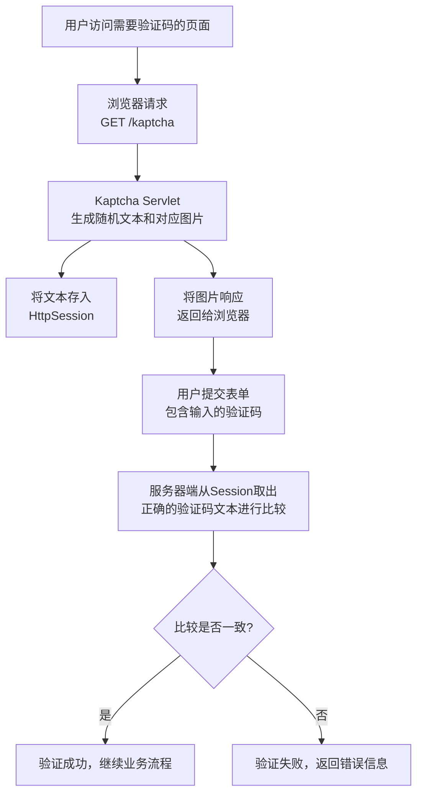

## `todo`列表

- 单体应用获取验证码和校验时序图。
- 完整的示例作演示用途。
- 行为验证码原理研究。
- 尝试使用`JavaScript`实现`H5`验证码客户端以协助跨平台。
- 研究 https://gitee.com/belief-team/captcha `AJ-Captcha`。
- 尝试集成 https://www.vaptcha.com/ 以查看其和阿里云、腾讯云验证码的差距。


## 概念

在SpringBoot应用中，验证码（CAPTCHA）是一种用于区分人类用户和机器程序的安全机制。以下是关于SpringBoot验证码的详细说明：

### 1. 验证码的作用

- **防止暴力破解**：保护登录、注册等敏感接口
- **防止恶意注册**：避免机器人批量注册账号
- **防止刷票/刷单**：确保操作由真实用户执行
- **提升安全性**：增加额外的安全层

### 2. 常见的验证码类型

#### 图形验证码

```
// 示例：生成图形验证码的基本原理
public class CaptchaUtil {
    public static BufferedImage generateImageCaptcha(String code) {
        // 创建图片对象
        BufferedImage image = new BufferedImage(width, height, BufferedImage.TYPE_INT_RGB);
        Graphics2D g = image.createGraphics();
        
        // 绘制背景、干扰线、验证码文本
        g.drawString(randomCode, x, y);
        return image;
    }
}
```

#### 算术验证码

```
// 示例：生成算术表达式验证码
public class MathCaptcha {
    public static String generateMathExpression() {
        int a = random.nextInt(10);
        int b = random.nextInt(10);
        return a + " + " + b + " = ?"; // 如 "3 + 5 = ?"
    }
}
```

#### 滑动验证码

- 需要用户拖动滑块完成拼图
- 更友好的用户体验

#### 行为验证码

- 如点选文字、旋转图片等
- 基于用户交互行为判断

### 3. SpringBoot中实现验证码的步骤

#### 添加依赖

```
<dependency>
    <groupId>com.github.penggle</groupId>
    <artifactId>kaptcha</artifactId>
    <version>2.3.2</version>
</dependency>
```

#### 配置类

```
@Configuration
public class KaptchaConfig {
    
    @Bean
    public Producer kaptchaProducer() {
        Properties properties = new Properties();
        properties.setProperty("kaptcha.image.width", "100");
        properties.setProperty("kaptcha.image.height", "40");
        properties.setProperty("kaptcha.textproducer.font.size", "32");
        
        DefaultKaptcha kaptcha = new DefaultKaptcha();
        Config config = new Config(properties);
        kaptcha.setConfig(config);
        return kaptcha;
    }
}
```

#### 控制器示例

```
@RestController
public class CaptchaController {
    
    @Autowired
    private Producer kaptchaProducer;
    
    @GetMapping("/captcha")
    public void getCaptcha(HttpServletResponse response, HttpSession session) throws IOException {
        // 生成验证码文本
        String capText = kaptchaProducer.createText();
        
        // 存储到session中（推荐使用Redis）
        session.setAttribute("captcha", capText);
        
        // 生成图片
        BufferedImage image = kaptchaProducer.createImage(capText);
        
        response.setContentType("image/png");
        ImageIO.write(image, "png", response.getOutputStream());
    }
    
    @PostMapping("/login")
    public ResponseEntity<?> login(@RequestParam String username,
                                  @RequestParam String password,
                                  @RequestParam String captcha,
                                  HttpSession session) {
        // 验证验证码
        String sessionCaptcha = (String) session.getAttribute("captcha");
        if (!captcha.equalsIgnoreCase(sessionCaptcha)) {
            return ResponseEntity.badRequest().body("验证码错误");
        }
        
        // 清除已使用的验证码
        session.removeAttribute("captcha");
        
        // 继续登录逻辑...
        return ResponseEntity.ok("登录成功");
    }
}
```

### 4. 最佳实践建议

#### 安全性考虑

```
// 验证码有效期控制
@Component
public class CaptchaService {
    
    @Autowired
    private RedisTemplate<String, String> redisTemplate;
    
    private static final long CAPTCHA_EXPIRE_TIME = 5 * 60; // 5分钟
    
    public void saveCaptcha(String key, String code) {
        redisTemplate.opsForValue().set(
            "captcha:" + key, 
            code, 
            CAPTCHA_EXPIRE_TIME, 
            TimeUnit.SECONDS
        );
    }
    
    public boolean validateCaptcha(String key, String code) {
        String storedCode = redisTemplate.opsForValue().get("captcha:" + key);
        return code != null && code.equalsIgnoreCase(storedCode);
    }
}
```

#### 前端集成

```
<!-- HTML示例 -->
<div>
    <input type="text" id="captchaInput" placeholder="请输入验证码">
    
    <button onclick="refreshCaptcha()">刷新</button>
</div>

<script>
function refreshCaptcha() {
    document.getElementById('captchaImage').src = '/captcha?t=' + new Date().getTime();
}
</script>
```

### 5. 高级功能

#### 验证码难度配置

```
// 可配置的验证码生成器
@Component
public class CustomCaptchaGenerator {
    
    public String generateText(int length, boolean includeLetters) {
        // 根据需求生成不同难度的验证码
    }
}
```

#### 频率限制

```
// 防止验证码被频繁请求
@RateLimiter(name = "captchaLimit", rate = 10) // 每秒10次
public ResponseEntity<?> getCaptcha() {
    // 生成验证码逻辑
}
```

SpringBoot中的验证码实现相对简单，但需要根据具体业务场景选择合适的安全策略。建议结合实际需求考虑验证码的类型、复杂度、有效期等参数配置。


## 主流开源的验证码方案

SpringBoot应用中主流开源的验证码方案非常丰富，以下是我整理的详细对比：

### 1. **Kaptcha** - 最经典的方案

#### 特点

- 历史悠久，使用广泛
- 配置简单，功能稳定
- 支持自定义验证码样式

#### 依赖配置

```
<dependency>
    <groupId>com.github.penggle</groupId>
    <artifactId>kaptcha</artifactId>
    <version>2.3.2</version>
</dependency>
```

#### 配置示例

```
@Configuration
public class KaptchaConfig {
    @Bean
    public DefaultKaptcha producer() {
        Properties properties = new Properties();
        properties.setProperty("kaptcha.border", "yes");
        properties.setProperty("kaptcha.textproducer.font.color", "black");
        properties.setProperty("kaptcha.textproducer.char.space", "5");
        
        Config config = new Config(properties);
        DefaultKaptcha defaultKaptcha = new DefaultKaptcha();
        defaultKaptcha.setConfig(config);
        return defaultKaptcha;
    }
}
```

### 2. **AJ-Captcha** - 行为验证码新星

#### 特点

- 支持滑动拼图、文字点选等行为验证
- 用户体验好，安全性高
- 前后端分离支持完善

#### 依赖配置

```
<dependency>
    <groupId>com.anji-plus</groupId>
    <artifactId>captcha</artifactId>
    <version>1.3.0</version>
</dependency>
```

#### 使用示例

```
@RestController
@RequestMapping("/captcha")
public class AjCaptchaController {
    
    @Autowired
    private CaptchaService captchaService;
    
    // 获取验证码
    @PostMapping("/get")
    public CaptchaResponse getCaptcha(@RequestBody CaptchaRequest request) {
        return captchaService.get(request);
    }
    
    // 验证验证码
    @PostMapping("/check")
    public CaptchaResponse checkCaptcha(@RequestBody CaptchaRequest request) {
        return captchaService.check(request);
    }
}
```

### 3. **EasyCaptcha** - 简单易用

#### 特点

- API简洁，上手快速
- 支持多种验证码类型
- 轻量级，无复杂依赖

#### 依赖配置

```
<dependency>
    <groupId>com.github.whvcse</groupId>
    <artifactId>easy-captcha</artifactId>
    <version>1.6.2</version>
</dependency>
```

#### 使用示例

```
@RestController
public class EasyCaptchaController {
    
    @GetMapping("/captcha")
    public void captcha(HttpServletResponse response, HttpSession session) throws IOException {
        // 生成算术验证码
        ArithmeticCaptcha captcha = new ArithmeticCaptcha(130, 48);
        captcha.setLen(3);  // 几位数运算
        
        String result = captcha.text();  // 计算结果
        session.setAttribute("captcha", result);
        
        captcha.out(response.getOutputStream());
    }
}
```

### 4. **Hutool-Captcha** - 国产优秀工具集

#### 特点

- 基于Hutool工具集
- 功能丰富，性能优秀
- 中文文档完善

#### 依赖配置

```
<dependency>
    <groupId>cn.hutool</groupId>
    <artifactId>hutool-captcha</artifactId>
    <version>5.8.22</version>
</dependency>
```

#### 使用示例

```
@Component
public class HutoolCaptchaService {
    
    public void generateCaptcha(HttpServletResponse response) {
        // 定义图形验证码的长、宽、验证码字符数、干扰元素个数
        LineCaptcha captcha = CaptchaUtil.createLineCaptcha(200, 100, 4, 20);
        
        // 输出到浏览器
        captcha.write(response.getOutputStream());
        
        // 获取验证码文字
        String code = captcha.getCode();
    }
}
```

### 5. **Google reCAPTCHA** - 企业级解决方案

#### 特点

- Google提供的企业级服务
- 支持v2复选框和v3无感验证
- 安全性极高，但有网络依赖

#### 使用方式

```
@Service
public class RecaptchaService {
    
    @Value("${recaptcha.secret-key}")
    private String secretKey;
    
    public boolean verify(String recaptchaResponse, String clientIp) {
        String url = "https://www.google.com/recaptcha/api/siteverify";
        
        MultiValueMap<String, String> params = new LinkedMultiValueMap<>();
        params.add("secret", secretKey);
        params.add("response", recaptchaResponse);
        params.add("remoteip", clientIp);
        
        RestTemplate restTemplate = new RestTemplate();
        RecaptchaResponse response = restTemplate.postForObject(url, params, RecaptchaResponse.class);
        
        return response != null && response.isSuccess();
    }
}
```

### 6. **Cloudflare Turnstile** - 新兴替代方案

#### 特点

- Cloudflare提供的免费服务
- 用户体验优秀
- 无需显示"我不是机器人"复选框

#### 使用示例

```
@Service
public class TurnstileService {
    
    private static final String VERIFY_URL = "https://challenges.cloudflare.com/turnstile/v0/siteverify";
    
    public boolean verify(String token, String clientIp) {
        HttpHeaders headers = new HttpHeaders();
        headers.setContentType(MediaType.APPLICATION_FORM_URLENCODED);
        
        MultiValueMap<String, String> params = new LinkedMultiValueMap<>();
        params.add("secret", "your-secret-key");
        params.add("response", token);
        params.add("remoteip", clientIp);
        
        HttpEntity<MultiValueMap<String, String>> entity = new HttpEntity<>(params, headers);
        RestTemplate restTemplate = new RestTemplate();
        
        TurnstileResponse response = restTemplate.postForObject(VERIFY_URL, entity, TurnstileResponse.class);
        return response != null && response.isSuccess();
    }
}
```

### 7. 方案对比总结

| 方案                     | 类型       | 安全性 | 用户体验 | 部署难度 | 适用场景       |
| ------------------------ | ---------- | ------ | -------- | -------- | -------------- |
| **Kaptcha**              | 图形验证码 | 中等   | 一般     | 简单     | 传统Web应用    |
| **AJ-Captcha**           | 行为验证码 | 高     | 优秀     | 中等     | 高安全要求应用 |
| **EasyCaptcha**          | 图形验证码 | 中等   | 良好     | 简单     | 快速开发项目   |
| **Hutool-Captcha**       | 图形验证码 | 中等   | 良好     | 简单     | 已有Hutool项目 |
| **Google reCAPTCHA**     | 云服务     | 极高   | 优秀     | 简单     | 企业级应用     |
| **Cloudflare Turnstile** | 云服务     | 极高   | 优秀     | 简单     | 国际化项目     |

### 8. 选择建议

#### 根据业务场景选择：

- **内部管理系统**：EasyCaptcha 或 Hutool-Captcha
- **电商/金融应用**：AJ-Captcha 或 Google reCAPTCHA
- **国际化项目**：Cloudflare Turnstile
- **传统Web应用**：Kaptcha

#### 技术考量：

- **网络环境**：云服务方案需要外网访问
- **安全性要求**：金融级应用建议使用行为验证码
- **用户体验**：移动端优先考虑无感验证
- **维护成本**：自建方案需要自行维护，云服务更省心

根据你的具体需求选择合适的验证码方案，平衡安全性、用户体验和开发维护成本。


## `Happy-Captcha`

>提示：因为验证码服务器端信息默认保存到`session`上下文中，如果需求需要把验证码信息保存到`redis`中默认是不支持的，所以暂时不使用此方案生成验证码。
>
>说明：支持随机字符和算术运算验证码生成。

### `POM`依赖配置

```xml
<dependency>
    <groupId>com.ramostear</groupId>
    <artifactId>Happy-Captcha</artifactId>
    <version>1.0.1</version>
</dependency>
```

### 示例

>说明：详细用法请参考`Gitee`说明。
>
>详细用法请参考本站 [示例](https://gitee.com/dexterleslie/demonstration/tree/main/captcha/demo-happy-captcha)
>
>`Gitee`地址：https://gitee.com/ramostear/Happy-Captcha

```java
package com.future.demo;

import com.ramostear.captcha.HappyCaptcha;
import com.ramostear.captcha.support.CaptchaStyle;
import com.ramostear.captcha.support.CaptchaType;
import org.springframework.web.bind.annotation.GetMapping;
import org.springframework.web.bind.annotation.RequestMapping;
import org.springframework.web.bind.annotation.RestController;

import javax.servlet.http.HttpServletRequest;
import javax.servlet.http.HttpServletResponse;

@RestController
@RequestMapping(value = "/api/v1/captcha")
public class ApiController {
    /**
     * 数字、大小写字母随机组合
     *
     * @param request
     * @param response
     */
    @GetMapping("/default")
    public void captchaDefault(HttpServletRequest request, HttpServletResponse response) {
        HappyCaptcha.require(request, response).build().finish();
    }

    /**
     * 加、减、乘算数运算表达式
     *
     * @param request
     * @param response
     */
    @GetMapping("/arithmetic")
    public void captchaArithmetic(HttpServletRequest request, HttpServletResponse response) {
        HappyCaptcha.require(request, response).type(CaptchaType.ARITHMETIC).build().finish();
    }

    /**
     * 中文简体加、减、乘算数运算表达式描述
     *
     * @param request
     * @param response
     */
    @GetMapping("/arithmeticzh")
    public void captchaArithmeticzh(HttpServletRequest request, HttpServletResponse response) {
        HappyCaptcha.require(request, response).style(CaptchaStyle.ANIM).type(CaptchaType.ARITHMETIC_ZH).build().finish();
    }
}
```


## `Kaptcha`

>说明：支持随机字符和算术运算验证码生成。

**Kaptcha** 是一个基于 Java 的、简单易用的**验证码生成库**。它的名字来源于 “K” (Keystone) 和 “Captcha” (验证码) 的组合。

------

### **一、核心概念：什么是验证码？**

在介绍 Kaptcha 之前，首先要理解验证码的作用。验证码是一种区分用户是计算机还是人的公共全自动程序，主要用于：

1. **防止恶意注册**：阻止机器人自动批量注册账号。
2. **防止暴力破解**：在登录、提交表单等场景，增加攻击者自动化尝试的难度。
3. **防止恶意刷票/刷帖**：确保某个操作是由真人发起的。

**典型验证码示例：**

```
请识别图中的文字： [图片：  A7Xk]
```

------

### **二、Kaptcha 是什么？**

Kaptcha 就是专门用来生成这种图片验证码的工具。它被设计得非常易于集成到基于 Servlet 的 Java Web 应用中，尤其是与 Spring MVC 等框架结合使用。

**它的核心工作流程如下图所示：**



------

### **三、主要特点**

1. **高度可配置**：可以轻松配置验证码图片的各种属性。 **文本内容**：长度、字符集（是否包含易混淆字符如 0/O, 1/l/I）。 **图片外观**：宽度、高度、字体、字体大小、颜色、背景。 **干扰效果**：可以添加噪点、干扰线等，防止OCR（光学字符识别）软件轻易识别。
2. **易于使用**：通常只需配置一个 Servlet，并在页面中用 ``标签指向该 Servlet 即可。
3. **基于 Session**：生成的验证码字符串默认保存在服务器的 Session 中，便于后续验证。

------

### **四、基本使用示例（与 Spring Boot 集成）**

#### **1. 添加依赖**

```xml
<!-- 在 pom.xml 中添加 -->
<dependency>
    <groupId>com.github.penggle</groupId>
    <artifactId>kaptcha</artifactId>
    <version>2.3.2</version>
</dependency>
```

#### **2. 配置 Kaptcha 生产者（配置类）**

```java
@Configuration
public class KaptchaConfig {

    @Bean
    public DefaultKaptcha getDefaultKaptcha() {
        DefaultKaptcha defaultKaptcha = new DefaultKaptcha();
        Properties properties = new Properties();
        // 图片宽度、高度
        properties.setProperty("kaptcha.image.width", "150");
        properties.setProperty("kaptcha.image.height", "50");
        // 文本内容配置
        properties.setProperty("kaptcha.textproducer.char.string", "0123456789ABCDEFGHIJKLMNOPQRSTUVWXYZ"); // 字符集
        properties.setProperty("kaptcha.textproducer.char.length", "4"); // 长度
        // 字体、颜色、边框等
        properties.setProperty("kaptcha.textproducer.font.color", "blue");
        properties.setProperty("kaptcha.obscurificator.impl", "com.google.code.kaptcha.impl.ShadowGimpy"); // 阴影效果
        properties.setProperty("kaptcha.noise.impl", "com.google.code.kaptcha.impl.NoNoise"); // 无噪点

        Config config = new Config(properties);
        defaultKaptcha.setConfig(config);
        return defaultKaptcha;
    }
}
```

#### **3. 创建控制器（Controller）**

```java
@RestController
public class KaptchaController {

    @Autowired
    private DefaultKaptcha defaultKaptcha;

    // 1. 获取验证码图片
    @GetMapping("/kaptcha")
    public void getKaptcha(HttpServletRequest request, HttpServletResponse response) throws Exception {
        // 禁止缓存，确保每次都是新图片
        response.setDateHeader("Expires", 0);
        response.setHeader("Cache-Control", "no-store, no-cache, must-revalidate");
        response.setHeader("Pragma", "no-cache");
        response.setContentType("image/jpeg");

        // 生成验证码文本
        String capText = defaultKaptcha.createText();
        // 将验证码文本存入 Session， key 通常固定为 KAPTCHA_SESSION_KEY
        request.getSession().setAttribute(Constants.KAPTCHA_SESSION_KEY, capText);

        // 根据文本生成图片并写入响应流
        BufferedImage bi = defaultKaptcha.createImage(capText);
        ServletOutputStream out = response.getOutputStream();
        ImageIO.write(bi, "jpg", out);
        try {
            out.flush();
        } finally {
            out.close();
        }
    }

    // 2. 验证用户输入的验证码
    @PostMapping("/login")
    public String login(@RequestParam String username,
                       @RequestParam String password,
                       @RequestParam String verifyCode,
                       HttpServletRequest request) {

        // 从 Session 中获取正确的验证码
        String sessionCode = (String) request.getSession().getAttribute(Constants.KAPTCHA_SESSION_KEY);
        // 立即清除 Session 中的验证码（一次性使用）
        request.getSession().removeAttribute(Constants.KAPTCHA_SESSION_KEY);

        // 比较用户输入和 Session 中的是否一致（忽略大小写）
        if (sessionCode == null || !sessionCode.equalsIgnoreCase(verifyCode)) {
            return "验证码错误！";
        }

        // ... 这里继续处理用户名和密码的验证逻辑 ...
        return "登录成功！";
    }
}
```

#### **4. 前端页面调用**

```html
<!DOCTYPE html>
<html>
<head>
    <title>登录</title>
</head>
<body>
    <form action="/login" method="post">
        用户名: <input type="text" name="username"><br>
        密码: <input type="password" name="password"><br>
        验证码: <input type="text" name="verifyCode">
        <!-- 图片的 src 指向生成验证码的接口 -->
        <br>
        <input type="submit" value="登录">
    </form>
</body>
</html>
```

*注意：`onclick`事件是为了实现点击图片刷新验证码的功能。*

------

### **五、Kaptcha 的现状与替代方案**

虽然 Kaptcha 非常经典和易用，但近年来，由于以下原因，许多新项目开始选择其他方案：

1. **用户体验**：传统的图片验证码对用户不友好，识别困难。
2. **安全性**：简单的图片验证码可能被先进的 OCR 技术或机器学习模型破解。
3. **移动端适配**：在手机端输入图片验证码体验很差。

**现代更流行的验证方案包括：**

- **行为验证**：如极验、腾讯云验证码等，通过分析用户鼠标轨迹、行为特征来判断是否为真人，用户体验更好。
- **短信/邮箱验证码**：直接发送一次性代码到用户手机或邮箱。
- **无感验证**：在后台通过风险分析引擎判断请求风险，对正常用户无感知。

### **总结**

**Kaptcha 是一个功能专一、配置灵活、易于集成的经典 Java 验证码生成库。** 它非常适合用于传统的 PC 端 Web 项目，作为防止自动化脚本攻击的第一道基础防线。对于学习理解验证码原理和快速实现基础安全功能来说，它依然是一个非常好的选择。但在追求更优用户体验和更高安全性的现代应用中，可以考虑更先进的验证方案。

### 示例

>详细用法请参考本站 [示例](https://gitee.com/dexterleslie/demonstration/tree/main/captcha/demo-happy-captcha)

自定义验证码算术文本生成器

```java
package com.future.demo;

import com.google.code.kaptcha.text.impl.DefaultTextCreator;

import java.util.Random;

/**
 * 验证码文本生成器
 *
 * @author ruoyi
 */
public class KaptchaTextCreator extends DefaultTextCreator
{
    private static final String[] CNUMBERS = "0,1,2,3,4,5,6,7,8,9,10".split(",");

    @Override
    public String getText()
    {
        Integer result = 0;
        Random random = new Random();
        int x = random.nextInt(10);
        int y = random.nextInt(10);
        StringBuilder suChinese = new StringBuilder();
        int randomoperands = random.nextInt(3);
        if (randomoperands == 0)
        {
            result = x * y;
            suChinese.append(CNUMBERS[x]);
            suChinese.append("*");
            suChinese.append(CNUMBERS[y]);
        }
        else if (randomoperands == 1)
        {
            if ((x != 0) && y % x == 0)
            {
                result = y / x;
                suChinese.append(CNUMBERS[y]);
                suChinese.append("/");
                suChinese.append(CNUMBERS[x]);
            }
            else
            {
                result = x + y;
                suChinese.append(CNUMBERS[x]);
                suChinese.append("+");
                suChinese.append(CNUMBERS[y]);
            }
        }
        else
        {
            if (x >= y)
            {
                result = x - y;
                suChinese.append(CNUMBERS[x]);
                suChinese.append("-");
                suChinese.append(CNUMBERS[y]);
            }
            else
            {
                result = y - x;
                suChinese.append(CNUMBERS[y]);
                suChinese.append("-");
                suChinese.append(CNUMBERS[x]);
            }
        }
        suChinese.append("=?@" + result);
        return suChinese.toString();
    }
}
```

请求生成验证码

```java
package com.future.demo;

import com.google.code.kaptcha.Constants;
import com.google.code.kaptcha.impl.DefaultKaptcha;
import lombok.extern.slf4j.Slf4j;
import org.springframework.web.bind.annotation.GetMapping;
import org.springframework.web.bind.annotation.RequestMapping;
import org.springframework.web.bind.annotation.RestController;

import javax.annotation.Resource;
import javax.imageio.ImageIO;
import javax.servlet.ServletOutputStream;
import javax.servlet.http.HttpServletRequest;
import javax.servlet.http.HttpServletResponse;
import java.awt.image.BufferedImage;

@RestController
@RequestMapping(value = "/api/v1/captcha")
@Slf4j
public class ApiController {

    @Resource(name = "defaultKaptchaCode")
    DefaultKaptcha defaultKaptchaCode;
    @Resource(name = "defaultKaptchaMath")
    DefaultKaptcha defaultKaptchaMath;

    // 1. 获取验证码图片
    @GetMapping("/getImageCode")
    public void getImageCode(HttpServletRequest request, HttpServletResponse response) throws Exception {
        // 禁止缓存，确保每次都是新图片
        response.setDateHeader("Expires", 0);
        response.setHeader("Cache-Control", "no-store, no-cache, must-revalidate");
        response.setHeader("Pragma", "no-cache");
        response.setContentType("image/jpeg");

        // 生成验证码文本
        String capText = defaultKaptchaCode.createText();
        if (log.isDebugEnabled()) {
            // 输出示例：capText=1V60
            log.debug("capText={}", capText);
        }
        // 将验证码文本存入 Session， key 通常固定为 KAPTCHA_SESSION_KEY
        request.getSession().setAttribute(Constants.KAPTCHA_SESSION_KEY, capText);

        // 根据文本生成图片并写入响应流
        BufferedImage bi = defaultKaptchaCode.createImage(capText);
        try (ServletOutputStream out = response.getOutputStream()) {
            ImageIO.write(bi, "jpg", out);
            out.flush();
        }
    }

    @GetMapping("/getImageMath")
    public void getImageCodeMath(HttpServletRequest request, HttpServletResponse response) throws Exception {
        response.setDateHeader("Expires", 0);
        response.setHeader("Cache-Control", "no-store, no-cache, must-revalidate");
        response.setHeader("Pragma", "no-cache");
        response.setContentType("image/jpeg");

        String capTextOriginal = defaultKaptchaMath.createText();
        if (log.isDebugEnabled()) {
            // 输出示例：capText=1*6=?@6，其中 @6 是答案
            log.debug("capText={}", capTextOriginal);
        }

        // 获取算术运算的等式
        String capText = capTextOriginal.substring(0, capTextOriginal.lastIndexOf("@"));
        // 获取算术运算的答案
        String code = capTextOriginal.substring(capText.lastIndexOf("@") + 1);

        request.getSession().setAttribute(Constants.KAPTCHA_SESSION_KEY, code);

        BufferedImage bi = defaultKaptchaMath.createImage(capText);
        try (ServletOutputStream out = response.getOutputStream()) {
            ImageIO.write(bi, "jpg", out);
            out.flush();
        }
    }
}
```


## `EasyCaptcha`

>说明：支持随机字符、算术运算和中文验证码生成。

**EasyCaptcha** 是一个基于 Java 的、功能丰富的**验证码生成库**。它提供了多种风格的验证码，并且以其简单易用、高度可定制和功能全面而受到欢迎。

------

### **一、EasyCaptcha 核心特点**

| 特性               | 说明                                   |
| ------------------ | -------------------------------------- |
| **多种验证码类型** | 支持算术、中文、GIF动画、PNG等多种格式 |
| **简单易用**       | 几行代码即可生成验证码                 |
| **高度可定制**     | 可自定义字体、大小、颜色、干扰线等     |
| **Servlet 支持**   | 原生支持 Web 环境                      |
| **轻量级**         | 无过多依赖，体积小巧                   |

------

### **二、支持的验证码类型**

EasyCaptcha 支持以下主要类型的验证码：

#### **1. 算术验证码（Arithmetic）**

```
// 生成数学算式验证码： "1+2=?"
// 用户需要计算结果 "3"
```

#### **2. 中文验证码（Chinese）**

```
// 生成中文验证码： "中文验证"
```

#### **3. GIF 动画验证码**

```
// 生成动态GIF验证码，更难被机器识别
```

#### **4. 普通字符验证码（Spec）**

```
// 传统的英文数字混合验证码
```

------

### **三、快速开始**

#### **1. 添加依赖**

```
<dependency>
    <groupId>com.github.whvcse</groupId>
    <artifactId>easy-captcha</artifactId>
    <version>1.6.2</version>
</dependency>
```

#### **2. 基础使用示例**

```
@RestController
public class CaptchaController {
    
    /**
     * 生成算术验证码
     */
    @GetMapping("/captcha/arithmetic")
    public void arithmeticCaptcha(HttpServletRequest request, HttpServletResponse response) {
        // 设置响应类型
        response.setContentType("image/gif");
        response.setHeader("Pragma", "No-cache");
        response.setHeader("Cache-Control", "no-cache");
        response.setDateHeader("Expires", 0);
        
        // 生成算术验证码
        ArithmeticCaptcha captcha = new ArithmeticCaptcha(130, 48);
        captcha.setLen(2); // 几位数运算，默认是两位
        
        // 获取验证码的结果（计算结果）
        String result = captcha.text();
        System.out.println("算术验证码结果: " + result);
        
        // 存储到Session
        request.getSession().setAttribute("captcha", result);
        
        // 输出图片流
        try {
            captcha.out(response.getOutputStream());
        } catch (IOException e) {
            e.printStackTrace();
        }
    }
    
    /**
     * 生成普通字符验证码
     */
    @GetMapping("/captcha/chars")
    public void charsCaptcha(HttpServletRequest request, HttpServletResponse response) {
        response.setContentType("image/png");
        response.setHeader("Pragma", "No-cache");
        response.setHeader("Cache-Control", "no-cache");
        response.setDateHeader("Expires", 0);
        
        // 生成普通验证码
        SpecCaptcha captcha = new SpecCaptcha(130, 48, 5);
        
        // 获取验证码字符
        String code = captcha.text();
        System.out.println("字符验证码: " + code);
        
        request.getSession().setAttribute("captcha", code);
        
        try {
            captcha.out(response.getOutputStream());
        } catch (IOException e) {
            e.printStackTrace();
        }
    }
}
```

------

### **四、高级定制示例**

#### **1. 完全自定义验证码**

```
@GetMapping("/captcha/custom")
public void customCaptcha(HttpServletRequest request, HttpServletResponse response) {
    response.setContentType("image/png");
    response.setHeader("Pragma", "No-cache");
    response.setHeader("Cache-Control", "no-cache");
    response.setDateHeader("Expires", 0);
    
    // 创建GIF验证码
    GifCaptcha captcha = new GifCaptcha(130, 48, 4);
    
    // 自定义设置
    captcha.setCharType(CharType.NUM_AND_UPPER); // 字符类型：数字+大写字母
    // captcha.setCharType(CharType.ONLY_NUM);    // 纯数字
    // captcha.setCharType(CharType.ONLY_CHAR);   // 纯字母
    // captcha.setCharType(CharType.ONLY_UPPER);  // 纯大写字母
    // captcha.setCharType(CharType.ONLY_LOWER);  // 纯小写字母
    
    // 获取验证码
    String code = captcha.text();
    request.getSession().setAttribute("captcha", code);
    
    try {
        captcha.out(response.getOutputStream());
    } catch (IOException e) {
        e.printStackTrace();
    }
}
```

#### **2. 中文验证码**

```
@GetMapping("/captcha/chinese")
public void chineseCaptcha(HttpServletRequest request, HttpServletResponse response) {
    response.setContentType("image/png");
    response.setHeader("Pragma", "No-cache");
    response.setHeader("Cache-Control", "no-cache");
    response.setDateHeader("Expires", 0);
    
    ChineseCaptcha captcha = new ChineseCaptcha(130, 48);
    captcha.setLen(3); // 中文字符数量
    
    String chineseText = captcha.text();
    System.out.println("中文验证码: " + chineseText);
    
    request.getSession().setAttribute("captcha", chineseText);
    
    try {
        captcha.out(response.getOutputStream());
    } catch (IOException e) {
        e.printStackTrace();
    }
}
```

------

### **五、验证码验证**

#### **1. 验证工具类**

```
@Service
public class CaptchaService {
    
    /**
     * 验证验证码
     */
    public boolean verifyCaptcha(HttpServletRequest request, String userInput) {
        // 从Session获取正确的验证码
        String sessionCode = (String) request.getSession().getAttribute("captcha");
        
        if (StringUtils.isEmpty(sessionCode)) {
            return false; // 验证码已过期
        }
        
        // 验证成功后清除Session
        boolean isValid = sessionCode.equalsIgnoreCase(userInput);
        if (isValid) {
            request.getSession().removeAttribute("captcha");
        }
        
        return isValid;
    }
    
    /**
     * 验证算术验证码（需要特殊处理）
     */
    public boolean verifyArithmeticCaptcha(HttpServletRequest request, String userInput) {
        String sessionCode = (String) request.getSession().getAttribute("captcha");
        
        if (StringUtils.isEmpty(sessionCode)) {
            return false;
        }
        
        try {
            // 算术验证码需要比较计算结果
            int expected = Integer.parseInt(sessionCode);
            int actual = Integer.parseInt(userInput);
            
            boolean isValid = expected == actual;
            if (isValid) {
                request.getSession().removeAttribute("captcha");
            }
            
            return isValid;
        } catch (NumberFormatException e) {
            return false;
        }
    }
}
```

#### **2. 在Controller中使用验证**

```
@RestController
@RequestMapping("/api/auth")
public class AuthController {
    
    @Autowired
    private CaptchaService captchaService;
    
    @PostMapping("/login")
    public ResponseEntity<Result<String>> login(@RequestBody LoginRequest loginRequest, 
                                               HttpServletRequest request) {
        // 1. 验证验证码
        boolean isCaptchaValid = captchaService.verifyCaptcha(request, loginRequest.getCaptchaCode());
        
        if (!isCaptchaValid) {
            return ResponseEntity.ok(Result.error("验证码错误"));
        }
        
        // 2. 验证用户名密码
        // ... 业务逻辑
        
        return ResponseEntity.ok(Result.success("登录成功"));
    }
    
    @Data
    public static class LoginRequest {
        private String username;
        private String password;
        private String captchaCode;
    }
}
```

------

### **六、前端集成示例**

#### **HTML 页面**

```
<!DOCTYPE html>
<html>
<head>
    <title>EasyCaptcha 演示</title>
</head>
<body>
    <form id="loginForm">
        <div>
            <label>用户名:</label>
            <input type="text" name="username" required>
        </div>
        <div>
            <label>密码:</label>
            <input type="password" name="password" required>
        </div>
        <div>
            <label>验证码:</label>
            <input type="text" name="captchaCode" required>
            
        </div>
        <button type="submit">登录</button>
    </form>

    <script>
        function refreshCaptcha() {
            const captchaImg = document.getElementById('captchaImage');
            captchaImg.src = '/captcha/chars?t=' + new Date().getTime();
        }
        
        document.getElementById('loginForm').addEventListener('submit', async function(e) {
            e.preventDefault();
            
            const formData = new FormData(this);
            const data = Object.fromEntries(formData);
            
            try {
                const response = await fetch('/api/auth/login', {
                    method: 'POST',
                    headers: { 'Content-Type': 'application/json' },
                    body: JSON.stringify(data)
                });
                
                const result = await response.json();
                
                if (result.success) {
                    alert('登录成功！');
                } else {
                    alert(result.message);
                    refreshCaptcha();
                }
            } catch (error) {
                alert('网络错误，请重试');
                refreshCaptcha();
            }
        });
    </script>
</body>
</html>
```

------

### **七、与其他库的对比**

| 特性           | EasyCaptcha        | Kaptcha        | Happy-Captcha    |
| -------------- | ------------------ | -------------- | ---------------- |
| **验证码类型** | ⭐⭐⭐⭐⭐ (多种类型)   | ⭐⭐⭐ (基础类型) | ⭐⭐⭐⭐ (中等)      |
| **使用难度**   | ⭐⭐⭐⭐ (简单)        | ⭐⭐⭐ (中等)     | ⭐⭐⭐⭐⭐ (非常简单) |
| **定制性**     | ⭐⭐⭐⭐⭐ (高度可定制) | ⭐⭐⭐⭐ (可定制)  | ⭐⭐⭐ (基础定制)   |
| **文档完善度** | ⭐⭐⭐⭐ (良好)        | ⭐⭐⭐ (一般)     | ⭐⭐⭐⭐ (良好)      |

------

### **八、生产环境建议**

#### **1. 安全性增强**

```
// 添加干扰线、噪点等
SpecCaptcha captcha = new SpecCaptcha(130, 48, 5);
captcha.setCharType(CharType.NUM_AND_UPPER);

// 可自定义字体、颜色等（增加识别难度）
```

#### **2. 性能优化**

```
// 使用缓存存储验证码（替代Session）
@Autowired
private RedisTemplate<String, String> redisTemplate;

public void generateCaptcha(HttpServletRequest request, HttpServletResponse response) {
    SpecCaptcha captcha = new SpecCaptcha(130, 48, 5);
    String code = captcha.text();
    
    // 存储到Redis，设置过期时间
    String captchaKey = "captcha:" + request.getSession().getId();
    redisTemplate.opsForValue().set(captchaKey, code, 5, TimeUnit.MINUTES);
    
    captcha.out(response.getOutputStream());
}
```

------

### **总结**

**EasyCaptcha** 是一个功能丰富、易于使用的 Java 验证码库，特别适合需要多种验证码风格的场景。它的主要优势包括：

✅ **支持多种验证码类型**（算术、中文、GIF等）

✅ **高度可定制化**

✅ **简单易用的API**

✅ **良好的文档和社区支持**

如果您需要生成样式多样的验证码，EasyCaptcha 是一个非常好的选择！

### 示例

>详细用法请参考本站 [示例](https://gitee.com/dexterleslie/demonstration/tree/main/captcha/demo-easy-captcha)

```java
package com.future.demo;

import com.wf.captcha.ArithmeticCaptcha;
import com.wf.captcha.ChineseCaptcha;
import com.wf.captcha.GifCaptcha;
import com.wf.captcha.SpecCaptcha;
import com.wf.captcha.base.Captcha;
import lombok.extern.slf4j.Slf4j;
import org.springframework.web.bind.annotation.GetMapping;
import org.springframework.web.bind.annotation.RequestMapping;
import org.springframework.web.bind.annotation.RestController;

import javax.servlet.http.HttpServletRequest;
import javax.servlet.http.HttpServletResponse;
import java.io.IOException;
import java.io.OutputStream;

@RestController
@RequestMapping(value = "/api/v1/captcha")
@Slf4j
public class ApiController {
    /**
     * 生成普通字符验证码
     */
    @GetMapping("/getImageCode")
    public void getImageCode(HttpServletRequest request, HttpServletResponse response) throws IOException {
        response.setContentType("image/png");
        response.setHeader("Pragma", "No-cache");
        response.setHeader("Cache-Control", "no-cache");
        response.setDateHeader("Expires", 0);

        // 生成普通验证码
        SpecCaptcha captcha = new SpecCaptcha(130, 48, 5);

        // 获取验证码字符
        String code = captcha.text();
        if (log.isDebugEnabled())
            // 输出示例：字符验证码：tEtaR
            log.debug("字符验证码：{}", code);

        request.getSession().setAttribute("captcha", code);

        try (OutputStream out = response.getOutputStream()) {
            captcha.out(out);
        }
    }

    /**
     * 生成算术验证码
     */
    @GetMapping("/getImageMath")
    public void getImageMath(HttpServletRequest request, HttpServletResponse response) throws IOException {
        // 设置响应类型
        response.setContentType("image/gif");
        response.setHeader("Pragma", "No-cache");
        response.setHeader("Cache-Control", "no-cache");
        response.setDateHeader("Expires", 0);

        // 生成算术验证码
        ArithmeticCaptcha captcha = new ArithmeticCaptcha(130, 48);
        captcha.setLen(2); // 几位数运算，默认是两位

        // 获取验证码的结果（计算结果）
        String result = captcha.text();
        if (log.isDebugEnabled())
            // 输出示例：算术验证码结果：3
            log.debug("算术验证码结果：{}", result);

        // 存储到Session
        request.getSession().setAttribute("captcha", result);

        // 输出图片流
        try (OutputStream out = response.getOutputStream()) {
            captcha.out(out);
        }
    }

    /**
     * 自定义验证码
     *
     * @param request
     * @param response
     */
    @GetMapping("/getImageCustomize")
    public void getImageCustomize(HttpServletRequest request, HttpServletResponse response) throws IOException {
        response.setContentType("image/png");
        response.setHeader("Pragma", "No-cache");
        response.setHeader("Cache-Control", "no-cache");
        response.setDateHeader("Expires", 0);

        // 创建GIF验证码
        GifCaptcha captcha = new GifCaptcha(130, 48, 4);

        // 自定义设置
        captcha.setCharType(Captcha.TYPE_NUM_AND_UPPER); // 字符类型：数字+大写字母
        // captcha.setCharType(CharType.ONLY_NUM);    // 纯数字
        // captcha.setCharType(CharType.ONLY_CHAR);   // 纯字母
        // captcha.setCharType(CharType.ONLY_UPPER);  // 纯大写字母
        // captcha.setCharType(CharType.ONLY_LOWER);  // 纯小写字母

        // 获取验证码
        String code = captcha.text();
        request.getSession().setAttribute("captcha", code);

        try (OutputStream out = response.getOutputStream()) {
            captcha.out(out);
        }
    }

    /**
     * 中文验证码
     *
     * @param request
     * @param response
     * @throws IOException
     */
    @GetMapping("/getImageChinese")
    public void getImageChinese(HttpServletRequest request, HttpServletResponse response) throws IOException {
        response.setContentType("image/png");
        response.setHeader("Pragma", "No-cache");
        response.setHeader("Cache-Control", "no-cache");
        response.setDateHeader("Expires", 0);

        ChineseCaptcha captcha = new ChineseCaptcha(130, 48);
        captcha.setLen(3); // 中文字符数量

        String chineseText = captcha.text();
        if (log.isDebugEnabled())
            // 输出示例：中文验证码：片极术
            log.debug("中文验证码：{}", chineseText);

        request.getSession().setAttribute("captcha", chineseText);

        try (OutputStream out = response.getOutputStream()) {
            captcha.out(out);
        }
    }
}
```


## `Hutool Captcha`

>说明：支持随机字符和算术运算验证码生成。

Hutool Captcha 是 **Hutool工具包** 中一个用于**生成和验证验证码**的Java组件。它的设计目标是让开发者在Java应用中能够极其简便地集成验证码功能。

简单来说，你可以用它来快速创建类似下面这样的图片验证码：

（想象这里有一张图片，上面显示着扭曲的、带有干扰线的字母数字组合，例如 "4Ak8"）

------

### 核心特性

1. **开箱即用**：只需几行代码即可生成验证码图片，无需复杂配置。
2. **高度可定制**： **尺寸**：可以自定义验证码图片的宽度和高度。 **干扰元素**：可以控制干扰线（直线、曲线）的数量、粗细和透明度。 **背景干扰**：可以添加噪点、扭曲效果、剪切效果等，增加机器识别的难度。 **字体**：可以自定义验证码字符的字体、大小和颜色。 **字符集**：可以自定义验证码由哪些字符组成（例如，只使用数字、只使用字母，或混合）。 **长度**：可以自定义验证码的字符数量。
3. **多种类型支持**： **线段干扰验证码**：最常用的类型，带有随机颜色的干扰直线。 **圆圈干扰验证码**：用干扰圆圈代替直线。 **扭曲验证码**：对字符进行扭曲变形，安全性更高。 **GIF动态验证码**：生成动态的GIF验证码，更难被机器识别。 **中文验证码（拼图验证码）**：生成中文验证码或更复杂的交互式验证码（如拼图）通常需要结合其他组件或自行扩展。

------

### 基本使用示例

以下是一个最简单的使用示例，展示如何生成一个验证码并将其写入文件。

1. **添加依赖**

   首先，在你的项目（如Maven）的 `pom.xml`中添加Hutool依赖。

   ```
   <dependency>
       <groupId>cn.hutool</groupId>
       <artifactId>hutool-all</artifactId>
       <version>5.8.16</version> <!-- 请使用最新版本 -->
   </dependency>
   ```

2. **Java代码**

   ```
   import cn.hutool.captcha.CaptchaUtil;
   import cn.hutool.captcha.LineCaptcha;
   
   public class CaptchaDemo {
       public static void main(String[] args) {
           // 1. 创建一个线段干扰的验证码
           // 参数：宽度， 高度， 验证码字符数， 干扰线数量
           LineCaptcha lineCaptcha = CaptchaUtil.createLineCaptcha(200, 100, 4, 20);
   
           // 2. 获取验证码的文本内容（例如 "4Ak8"），这个需要保存起来用于后续验证
           String code = lineCaptcha.getCode();
           System.out.println("生成的验证码是：" + code);
   
           // 3. 将验证码图片写入文件（实际应用中可能是输出到HTTP响应流）
           lineCaptcha.write("d:/captcha.png");
       }
   }
   ```

------

### 在Web项目中的典型应用流程

1. **生成验证码**：

   - 在请求 `/captcha`这样的接口时，使用Hutool Captcha生成图片和对应的正确代码。
   - 将图片通过 `HttpServletResponse.getOutputStream()`输出到前端浏览器。
   - **关键步骤**：将正确的验证码代码（`lineCaptcha.getCode()`）存入Session或Redis等缓存中（通常与当前用户的Session ID关联）。

   ```
   @GetMapping("/captcha")
   public void getCaptcha(HttpServletRequest request, HttpServletResponse response) throws IOException {
       LineCaptcha captcha = CaptchaUtil.createLineCaptcha(200, 100, 4, 20);
       // 将验证码文本存入Session，key自定，例如 "CAPTCHA_CODE"
       request.getSession().setAttribute("CAPTCHA_CODE", captcha.getCode());
       // 设置响应头，告诉浏览器这是图片
       response.setContentType("image/png");
       response.setHeader("Pragma", "No-cache");
       // 将图片写入响应流
       captcha.write(response.getOutputStream());
   }
   ```

2. **用户提交验证**：

   - 用户在表单中输入看到的验证码并提交。
   - 后端从Session中取出之前保存的正确代码。
   - 将用户输入的代码与正确代码进行比较（通常忽略大小写和空格）。

   ```
   @PostMapping("/login")
   public String login(@RequestParam String username,
                       @RequestParam String password,
                       @RequestParam String userInputCaptcha,
                       HttpServletRequest request) {
       // 1. 从Session中获取正确的验证码
       String savedCaptcha = (String) request.getSession().getAttribute("CAPTCHA_CODE");
       // 2. 比较验证码（忽略大小写和空格）
       if (savedCaptcha == null || !savedCaptcha.replaceAll("\\s", "").equalsIgnoreCase(userInputCaptcha.replaceAll("\\s", ""))) {
           return "验证码错误！";
       }
       // 3. 验证通过后，立即清除Session中的验证码，防止重复使用
       request.getSession().removeAttribute("CAPTCHA_CODE");
       // 4. 继续处理登录逻辑...
       return "登录成功！";
   }
   ```

### 总结

**Hutool Captcha** 是一个功能强大且易于使用的Java验证码生成库，它极大地简化了在Java Web应用或桌面应用中集成验证码功能的工作。通过其丰富的自定义选项，你可以轻松生成满足不同安全级别需求的验证码。

### 示例

>提醒：生成算术运算验证码时没有接口能够直接获取算术运算结果，需要调用下面代码校验验证码：
>
>```java
>// 校验结果
>if (generator.verify(code, "xxx")) {
>    	log.debug("验证成功");
>}
>```
>
>详细用法请参考本站 [示例](https://gitee.com/dexterleslie/demonstration/tree/main/captcha/demo-hutool-captcha)

```java
package com.future.demo;

import cn.hutool.captcha.CaptchaUtil;
import cn.hutool.captcha.LineCaptcha;
import cn.hutool.captcha.generator.MathGenerator;
import lombok.extern.slf4j.Slf4j;
import org.springframework.web.bind.annotation.GetMapping;
import org.springframework.web.bind.annotation.RequestMapping;
import org.springframework.web.bind.annotation.RestController;

import javax.servlet.http.HttpServletRequest;
import javax.servlet.http.HttpServletResponse;
import java.io.IOException;
import java.io.OutputStream;

@RestController
@RequestMapping(value = "/api/v1/captcha")
@Slf4j
public class ApiController {
    /**
     * 生成普通字符验证码
     */
    @GetMapping("/getImageCode")
    public void getImageCode(HttpServletRequest request, HttpServletResponse response) throws IOException {
        response.setContentType("image/png");
        response.setHeader("Pragma", "No-cache");
        response.setHeader("Cache-Control", "no-cache");
        response.setDateHeader("Expires", 0);

        // 生成普通验证码
        LineCaptcha captcha = CaptchaUtil.createLineCaptcha(200, 100, 4, 20);

        // 获取验证码字符
        String code = captcha.getCode();
        if (log.isDebugEnabled())
            // 输出示例：字符验证码：tjE4
            log.debug("字符验证码：{}", code);

        request.getSession().setAttribute("captcha", code);

        try (OutputStream out = response.getOutputStream()) {
            captcha.write(out);
        }
    }

    /**
     * 生成算术运算验证码
     */
    @GetMapping("/getImageMath")
    public void getImageMath(HttpServletRequest request, HttpServletResponse response) throws IOException {
        response.setContentType("image/png");
        response.setHeader("Pragma", "No-cache");
        response.setHeader("Cache-Control", "no-cache");
        response.setDateHeader("Expires", 0);

        // 生成普通验证码
        LineCaptcha captcha = CaptchaUtil.createLineCaptcha(200, 100, 4, 20);
        // 设置算术生成器
        MathGenerator generator = new MathGenerator(1);
        captcha.setGenerator(generator);
        // 生成图片
        captcha.createCode();

        // 获取验证码算术运算式子
        String code = captcha.getCode();
        if (log.isDebugEnabled())
            // 输出示例：算术运算式子：5-5=
            log.debug("算术运算式子：{}", code);

        request.getSession().setAttribute("captcha", code);

        try (OutputStream out = response.getOutputStream()) {
            captcha.write(out);
        }
    }
}
```


## `AJ-Captcha`

>`Gitee`地址：https://gitee.com/belief-team/captcha

**AJ-Captcha** 是一个**开源、可自部署的验证码项目**，你可以免费获取其源代码，部署在自己的服务器上。

------

### AJ-Captcha 详细介绍

**AJ-Captcha** 是一款基于Java语言开发的、功能强大的开源验证码项目，在Gitee（码云）和GitHub上都非常受欢迎。它的目标是让开发者能够快速、简单地集成各种样式的验证码。

#### 核心特点

1. **开源免费**： 这是它最大的优势。你可以免费使用、修改和分发它，对于预算有限或个人开发者来说非常友好。
2. **多种验证模式**： 它支持多种流行的验证码类型，包括： **滑动拼图**： 最常用的模式。 **文字点选**： 点击图中指定的文字。 **旋转图片**： 旋转图片使其方向正确。 传统图形验证码（数字字母计算等）。
3. **易于二次开发**： 由于是开源项目，你可以完全获取源代码，并根据自己的业务需求进行深度定制，比如修改验证码的UI样式、调整安全策略等。
4. **独立部署**： 你需要将AJ-Captcha的后端服务部署在自己的Java应用环境（如Spring Boot）中，前端通过API与你的后端交互。这意味着你对数据和服务的安全性有完全的控制权。

#### 主要技术栈

- **后端**： Java、Spring Boot、Redis（用于缓存验证行为数据）
- **前端**： 不依赖任何库，基于原生JS、Canvas实现，可以轻松与Vue、React等现代前端框架集成。

------

### AJ-Captcha vs. 阿里云验证码：如何选择？

为了更直观地对比，我制作了下面这个表格：

| 特性维度     | AJ-Captcha（开源）                                           | 阿里云验证码（商业SaaS）                                     |
| ------------ | ------------------------------------------------------------ | ------------------------------------------------------------ |
| **成本**     | **免费**（仅需服务器成本）                                   | **按验证次数付费**（有免费额度，超出后收费）                 |
| **部署模式** | **独立部署**，需要自有服务器和运维能力                       | **SaaS服务**，无需部署，开箱即用                             |
| **可控性**   | **高**，可完全掌控代码、数据和安全策略                       | **相对较低**，依赖阿里云的服务和规则                         |
| **定制性**   | **极高**，可深度定制任何功能                                 | **有限**，主要通过控制台进行策略配置，UI定制有限             |
| **安全能力** | **依赖自身研发能力**，需要自行维护和升级对抗策略             | **专业强大**，依托阿里大数据和AI，实时对抗黑产，自动升级     |
| **运维压力** | **有**，需要自行保障服务的稳定性和高可用性                   | **无**，由阿里云专业团队保障，高可用、高并发                 |
| **适合场景** | **预算有限的项目、内部系统、对数据私密性要求极高、需要深度定制的场景** | **商业项目、高并发ToC业务、缺乏安全研发资源、希望快速上线的场景** |

------

### 总结与建议

- **选择 AJ-Captcha 的情况**： 你是个人开发者、初创公司，预算非常有限。 你的项目是内部系统，对数据隐私和主权要求极高，所有数据必须留在内网。 你有特定的UI或交互需求，需要进行深度定制。 你拥有Java运维能力，愿意承担相应的维护成本。
- **选择 阿里云验证码 的情况**： 你运营的是面向公众的商业应用，对安全性的要求非常高。 你希望“开箱即用”，快速集成，不想在验证码的运维和对抗上投入研发精力。 你的业务可能会面临突发流量（如营销活动），需要服务具备高弹性。 你愿意支付一定的费用来换取专业、省心、强大的安全防护。

简单来说，这是一个 **“时间/技术/运维 换 金钱”** 还是 **“金钱 换 时间/专业/稳定”** 的选择。两者都是非常优秀的解决方案，具体取决于你的项目需求、团队能力和预算。


## 阿里云验证码

>什么是验证码`2.0`：https://help.aliyun.com/zh/captcha/captcha2-0/product-overview/what-is-alibaba-cloud-captcha-2

### 接入指引 - 方法概论

>参考链接：https://help.aliyun.com/zh/captcha/captcha2-0/user-guide/quick-start

接入阿里云验证码只需要4步：

1. 开通[包年包月](https://help.aliyun.com/zh/captcha/captcha2-0/billing#6dda9e58e9lty)或[按量付费](https://help.aliyun.com/zh/captcha/captcha2-0/billing#e26b67d005na3)验证码2.0并获取身份标。
2. 新建一个验证场景，获取场景ID。
3. 将业务客户端和服务端接入验证码，并进行测试验证。
4. 发布上线。




### 接入指引 - `V3`验证架构时序图

#### 滑块验证、拼图验证、一点即过和图像复原



时序图说明：

1. 用户在业务客户端初始化验证码时，业务客户端将向验证码服务器请求获取验证码的JS资源（例如图片或题目等）。
2. 验证码服务端动态返回相关JS资源，业务客户端进行资源加载并渲染验证码。
3. 用户在业务客户端成功完成验证码交互（例如滑块、拼图或图像复原）后，JS自动发送答案验证请求，验证码服务端验证答案是否正确和是否为机器请求。
4. 验证码服务端如果验证通过后，调用**success**回调函数返回**CaptchaVerifyParam**，如果验证不通过，将自动刷新验证码，重新进行验证。
5. 业务客户端携带业务参数和**CaptchaVerifyParam**发送请求到业务服务端进行参数校验**。**
6. 业务服务端调用验证码服务端接口**VerifyIntelligentCaptcha**进行**CaptchaVerifyParam**参数的校验。
7. 验证码服务端验证参数是否正确和是否为机器请求，返回验证结果。
8. 业务服务端根据验证结果进行业务处理后，向客户端网页返回验证结果和业务处理结果。


#### 无痕验证



时序图说明：

1. 用户在业务客户端初始化验证码时，业务客户端将向验证码服务器请求获取验证码的JS资源（例如图片或题目等）。
2. 验证码服务端动态返回相关JS资源。
3. 用户在业务客户端首次单击触发按钮发起验证，阿里云服务端会验证是否为安全用户。
4. 阿里云服务端将验证结果返回到业务客户端：
   - 如果用户无风险，则首次验证通过，调用**success**回调函数返回**CaptchaVerifyParam**并进行后续业务验签。
   - 如果用户存在风险，则首次验证可疑，将进行二次验证
     1. 业务客户端进行JS资源加载并渲染验证码，用户在业务客户端成功完成验证码交互（例如滑块、拼图或图像复原）后，JS自动发送答案验证请求，验证码服务端验证答案是否正确和是否为机器请求。
     2. 如果二次验证通过，将调用**success**回调函数返回**CaptchaVerifyParam**并进行后续业务验签；如果二次验证不通过，业务客户端将自动刷新验证码，重新进行验证。
5. 业务客户端携带业务参数和**CaptchaVerifyParam**发送请求到业务服务端进行参数校验**。**
6. 业务服务端调用验证码服务端接口**VerifyIntelligentCaptcha**进行**CaptchaVerifyParam**参数的校验。
7. 验证码服务端验证参数是否正确和是否为机器请求，返回验证结果。
8. 业务服务端根据验证结果进行业务处理后，向客户端网页返回验证结果和业务处理结果。


### 客户端接入 - `Web`和`H5`客户端`V3`架构接入

>详细用法请参考本站 [示例](https://gitee.com/dexterleslie/demonstration/tree/main/captcha/demo-aliyun-captcha/html)
>
>参考链接：https://help.aliyun.com/zh/captcha/captcha2-0/user-guide/new-architecture-for-web-and-h5-client-access

`index.html`：

```html
<!doctype html>
<html>

<head>
    <meta charset="utf-8" />
    <meta name="data-spm" />
    <!--1.在引入阿里云验证码JS脚本的位置之前，或者在html的head标签最前的位置添加一个script脚本，里面保存一个含有region和prefix参数的全局变量AliyunCaptchaConfig即可-->
    <script>
        window.AliyunCaptchaConfig = {
            // 必填，验证码示例所属地区，支持中国内地（cn）、新加坡（sgp）
            region: "cn",
            // 必填，身份标。开通阿里云验证码2.0后，您可以在控制台概览页面的实例基本信息卡片区域，获取身份标
            prefix: "xxx",
        };
    </script>
    <!--2.集成主JS-->
    <script type="text/javascript" src="https://o.alicdn.com/captcha-frontend/aliyunCaptcha/AliyunCaptcha.js"></script>
    <style>
        html,
        body {
            height: 100vh;
        }

        .container {
            height: 100%;
            display: flex;
            flex-direction: column;
            justify-content: center;
            align-items: center;
        }

        .container>* {
            margin: 2px;
        }
    </style>
</head>

<body>
    <div class="container">
        <div>
            <!-- 用于显示验证码验签参数 -->
            <input type="text" placeholder="验证码验签参数" id="captchaVerifyParam" value="eyJjZXJ0aWZ5SWQiOiI3NWNqeUNPbWduIiwic2NlbmVJZCI6IjE2d3J2ZTU3IiwiaXNTaWduIjp0cnVlLCJzZWN1cml0eVRva2VuIjoiNm9PbzdlNzJuQTYxdVZMaVpWS2lMWFEvaUVKVCt4b3FnbUpVSll5YlVpdzZEN0FiWjNDMHRlaFh0dzZqQUs0aFIzSXVNbnNuakNsQVNDeUk3YTNDeXpKbExsODlEdUJLcFpDamcxQ3FVeEJtY1g0TUpvUEFQME05YmJwRGU5QXEifQ==" readonly/>
            <span style="color: red;font-size: 12px;">验证通过后会自动回显验证码验签参数，不需要手动输入</span>
        </div>
        <!--预留的验证码元素，用于配置初始化函数中的element参数-->
        <div id="captcha-element"></div>
        <!--弹出式下，用于触发验证码弹窗的元素-->
        <button id="button" class="btn">登录</button>
        <button id="buttonCaptchaVerifyParam" onclick="onClickCaptchaVerifyParam()">验签</button>
    </div>
    <!--3.新建一个<script>标签，用于调用验证码初始化函数initAliyunCaptcha-->
    <script type="text/javascript">
        var captcha;
        // 弹出式，除region和prefix以外的参数
        window.initAliyunCaptcha({
            // 场景ID。根据步骤二新建验证场景后，您可以在验证码场景列表，获取该场景的场景ID
            SceneId: "xxx",
            // 验证码模式，popup表示弹出式，embed表示嵌入式。无需修改
            mode: "popup",
            // 页面上预留的渲染验证码的元素，与原代码中预留的页面元素保持一致。
            element: "#captcha-element",
            // 触发验证码弹窗或无痕验证的元素
            button: "#button",
            // 验证码验证通过回调函数
            success: function (captchaVerifyParam) {
                // 入参为验签captchaVerifyParam
                // 1.向后端发起业务请求进行验证码验签captchaVerifyParam校验
                // 2.根据校验结果来进行业务处理
                // 3.如业务需要重新进行验证码验证，调用验证码初始化方法initAliyunCaptcha重新初始化验证码
                // console.log(captchaVerifyParam)
                document.getElementById("captchaVerifyParam").value = captchaVerifyParam
            },
            // 验证码验证不通过回调函数
            fail: function (result) {
                // 入参为不通过信息
                // 正常验证有效期内不需要做任何操作，验证码自动刷新，重新进行验证
                console.error(result);
            },
            // 绑定验证码实例回调函数，该回调会在验证码初始化成功后调用
            getInstance: function (instance) {
                captcha = instance;
            },
            // 滑块验证和一点即过的验证形态触发框体样式，支持自定义宽度和高度，单位为px。
            slideStyle: {
                width: 360,
                height: 40,
            },
            // ...其他参数，参考initAliyunCaptcha参数说明
        });
    </script>
</body>
<script type="text/javascript">
    function onClickCaptchaVerifyParam() {
        // 调用后端服务校验验证码验签参数是否正确
    }
</script>
</html>
```

登录阿里云验证码产品获取`身份标`和`场景ID`并填写到上面的相应位置，刷新页面测试验证码是否正常。


### 服务端接入

>详细用法请参考本站[示例](https://gitee.com/dexterleslie/demonstration/tree/main/captcha/demo-aliyun-captcha/backend)
>
>参考链接：https://help.aliyun.com/zh/captcha/captcha2-0/user-guide/server-access

调用验证码`SDK`前提：您需要创建访问凭据，验证码2.0服务端支持使用AccessKey、STS Token等多种方式调用，具体请参见[初始化凭据客户端](https://help.aliyun.com/zh/sdk/developer-reference/v2-manage-access-credentials?spm=a2c4g.11186623.0.0.6c76722b9OdM4u#cdcf9cf854rzt)。

>注意：禁止直接使用主账号AccessKey，因为主账号AccessKey一旦泄露将威胁您所有云资源的安全。请使用子账号（RAM用户）AccessKey，有效降低AccessKey泄露的风险。使用阿里云验证码，您需要为子账号授予阿里云验证码权限（**AliyunYundunAFSFullAccess**）。

参考 https://next.api.alibabacloud.com/api-tools/sdk/captcha?version=2023-03-05&language=java-tea&tab=primer-doc 引用和使用验证码依赖

`POM`配置如下：

```xml
<!-- 阿里云验证码依赖 -->
<dependency>
    <groupId>com.aliyun</groupId>
    <artifactId>captcha20230305</artifactId>
    <version>1.1.3</version>
</dependency>
```

调用验证码`SDK`：

```java
package com.future.demo;

import com.aliyun.captcha20230305.models.VerifyIntelligentCaptchaResponse;
import org.springframework.http.ResponseEntity;
import org.springframework.web.bind.annotation.GetMapping;
import org.springframework.web.bind.annotation.RequestMapping;
import org.springframework.web.bind.annotation.RequestParam;
import org.springframework.web.bind.annotation.RestController;

@RestController
@RequestMapping(value = "/api/v1")
public class ApiController {

    /**
     * 后端服务调用阿里云接口校验验证码验签参数是否合法
     *
     * @param sceneId
     * @param captchaVerifyParam
     * @throws Exception
     */

    @GetMapping("captchaVerifyParam")
    public ResponseEntity<VerifyIntelligentCaptchaResponse> captchaVerifyParam(@RequestParam("sceneId") String sceneId,
                                                                               @RequestParam("captchaVerifyParam") String captchaVerifyParam) throws Exception {
        com.aliyun.captcha20230305.Client client = createClient();
        com.aliyun.captcha20230305.models.VerifyIntelligentCaptchaRequest verifyIntelligentCaptchaRequest =
                new com.aliyun.captcha20230305.models.VerifyIntelligentCaptchaRequest()
                        .setCaptchaVerifyParam(captchaVerifyParam)
                        .setSceneId(sceneId);
        // Copy the code to run, please print the return value of the API by yourself.
        return ResponseEntity.ok(client.verifyIntelligentCaptchaWithOptions(verifyIntelligentCaptchaRequest, new com.aliyun.teautil.models.RuntimeOptions()));
    }

    /**
     * <b>description</b> :
     * <p>Initialize the Client with the credentials</p>
     *
     * @return Client
     * @throws Exception
     */
    public static com.aliyun.captcha20230305.Client createClient() throws Exception {
        // It is recommended to use the default credential. For more credentials, please refer to: https://www.alibabacloud.com/help/en/alibaba-cloud-sdk-262060/latest/credentials-settings-2.
        com.aliyun.credentials.Client credential = new com.aliyun.credentials.Client();
        com.aliyun.teaopenapi.models.Config config = new com.aliyun.teaopenapi.models.Config()
                .setCredential(credential);
        // See https://api.alibabacloud.com/product/captcha.
        config.endpoint = "captcha.cn-shanghai.aliyuncs.com";
        return new com.aliyun.captcha20230305.Client(config);
    }
}
```

示例的测试步骤：

- 使用`Web`和`H5`客户端[示例](https://gitee.com/dexterleslie/demonstration/tree/main/captcha/demo-aliyun-captcha/html)获取验证码验签参数。

- 使用验证码验签参数请求服务端接口以请求阿里云校验验签参数的合法性

  ```sh
  curl -X GET http://localhost:8080/api/v1/captchaVerifyParam?sceneId=&captchaVerifyParam=xxx
  ```


## 谷歌`reCaptcha`


## `Cloudflare Turnstile`