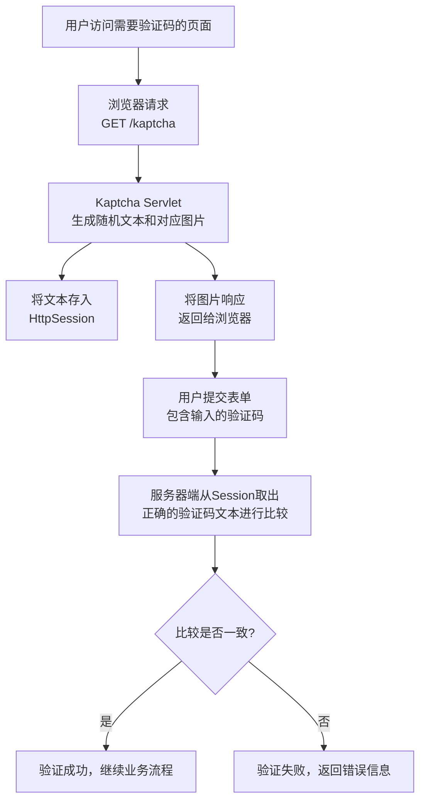

## 概念

在SpringBoot应用中，验证码（CAPTCHA）是一种用于区分人类用户和机器程序的安全机制。以下是关于SpringBoot验证码的详细说明：

### 1. 验证码的作用

- **防止暴力破解**：保护登录、注册等敏感接口
- **防止恶意注册**：避免机器人批量注册账号
- **防止刷票/刷单**：确保操作由真实用户执行
- **提升安全性**：增加额外的安全层

### 2. 常见的验证码类型

#### 图形验证码

```
// 示例：生成图形验证码的基本原理
public class CaptchaUtil {
    public static BufferedImage generateImageCaptcha(String code) {
        // 创建图片对象
        BufferedImage image = new BufferedImage(width, height, BufferedImage.TYPE_INT_RGB);
        Graphics2D g = image.createGraphics();
        
        // 绘制背景、干扰线、验证码文本
        g.drawString(randomCode, x, y);
        return image;
    }
}
```

#### 算术验证码

```
// 示例：生成算术表达式验证码
public class MathCaptcha {
    public static String generateMathExpression() {
        int a = random.nextInt(10);
        int b = random.nextInt(10);
        return a + " + " + b + " = ?"; // 如 "3 + 5 = ?"
    }
}
```

#### 滑动验证码

- 需要用户拖动滑块完成拼图
- 更友好的用户体验

#### 行为验证码

- 如点选文字、旋转图片等
- 基于用户交互行为判断

### 3. SpringBoot中实现验证码的步骤

#### 添加依赖

```
<dependency>
    <groupId>com.github.penggle</groupId>
    <artifactId>kaptcha</artifactId>
    <version>2.3.2</version>
</dependency>
```

#### 配置类

```
@Configuration
public class KaptchaConfig {
    
    @Bean
    public Producer kaptchaProducer() {
        Properties properties = new Properties();
        properties.setProperty("kaptcha.image.width", "100");
        properties.setProperty("kaptcha.image.height", "40");
        properties.setProperty("kaptcha.textproducer.font.size", "32");
        
        DefaultKaptcha kaptcha = new DefaultKaptcha();
        Config config = new Config(properties);
        kaptcha.setConfig(config);
        return kaptcha;
    }
}
```

#### 控制器示例

```
@RestController
public class CaptchaController {
    
    @Autowired
    private Producer kaptchaProducer;
    
    @GetMapping("/captcha")
    public void getCaptcha(HttpServletResponse response, HttpSession session) throws IOException {
        // 生成验证码文本
        String capText = kaptchaProducer.createText();
        
        // 存储到session中（推荐使用Redis）
        session.setAttribute("captcha", capText);
        
        // 生成图片
        BufferedImage image = kaptchaProducer.createImage(capText);
        
        response.setContentType("image/png");
        ImageIO.write(image, "png", response.getOutputStream());
    }
    
    @PostMapping("/login")
    public ResponseEntity<?> login(@RequestParam String username,
                                  @RequestParam String password,
                                  @RequestParam String captcha,
                                  HttpSession session) {
        // 验证验证码
        String sessionCaptcha = (String) session.getAttribute("captcha");
        if (!captcha.equalsIgnoreCase(sessionCaptcha)) {
            return ResponseEntity.badRequest().body("验证码错误");
        }
        
        // 清除已使用的验证码
        session.removeAttribute("captcha");
        
        // 继续登录逻辑...
        return ResponseEntity.ok("登录成功");
    }
}
```

### 4. 最佳实践建议

#### 安全性考虑

```
// 验证码有效期控制
@Component
public class CaptchaService {
    
    @Autowired
    private RedisTemplate<String, String> redisTemplate;
    
    private static final long CAPTCHA_EXPIRE_TIME = 5 * 60; // 5分钟
    
    public void saveCaptcha(String key, String code) {
        redisTemplate.opsForValue().set(
            "captcha:" + key, 
            code, 
            CAPTCHA_EXPIRE_TIME, 
            TimeUnit.SECONDS
        );
    }
    
    public boolean validateCaptcha(String key, String code) {
        String storedCode = redisTemplate.opsForValue().get("captcha:" + key);
        return code != null && code.equalsIgnoreCase(storedCode);
    }
}
```

#### 前端集成

```
<!-- HTML示例 -->
<div>
    <input type="text" id="captchaInput" placeholder="请输入验证码">
    
    <button onclick="refreshCaptcha()">刷新</button>
</div>

<script>
function refreshCaptcha() {
    document.getElementById('captchaImage').src = '/captcha?t=' + new Date().getTime();
}
</script>
```

### 5. 高级功能

#### 验证码难度配置

```
// 可配置的验证码生成器
@Component
public class CustomCaptchaGenerator {
    
    public String generateText(int length, boolean includeLetters) {
        // 根据需求生成不同难度的验证码
    }
}
```

#### 频率限制

```
// 防止验证码被频繁请求
@RateLimiter(name = "captchaLimit", rate = 10) // 每秒10次
public ResponseEntity<?> getCaptcha() {
    // 生成验证码逻辑
}
```

SpringBoot中的验证码实现相对简单，但需要根据具体业务场景选择合适的安全策略。建议结合实际需求考虑验证码的类型、复杂度、有效期等参数配置。


## 主流开源的验证码方案

SpringBoot应用中主流开源的验证码方案非常丰富，以下是我整理的详细对比：

### 1. **Kaptcha** - 最经典的方案

#### 特点

- 历史悠久，使用广泛
- 配置简单，功能稳定
- 支持自定义验证码样式

#### 依赖配置

```
<dependency>
    <groupId>com.github.penggle</groupId>
    <artifactId>kaptcha</artifactId>
    <version>2.3.2</version>
</dependency>
```

#### 配置示例

```
@Configuration
public class KaptchaConfig {
    @Bean
    public DefaultKaptcha producer() {
        Properties properties = new Properties();
        properties.setProperty("kaptcha.border", "yes");
        properties.setProperty("kaptcha.textproducer.font.color", "black");
        properties.setProperty("kaptcha.textproducer.char.space", "5");
        
        Config config = new Config(properties);
        DefaultKaptcha defaultKaptcha = new DefaultKaptcha();
        defaultKaptcha.setConfig(config);
        return defaultKaptcha;
    }
}
```

### 2. **AJ-Captcha** - 行为验证码新星

#### 特点

- 支持滑动拼图、文字点选等行为验证
- 用户体验好，安全性高
- 前后端分离支持完善

#### 依赖配置

```
<dependency>
    <groupId>com.anji-plus</groupId>
    <artifactId>captcha</artifactId>
    <version>1.3.0</version>
</dependency>
```

#### 使用示例

```
@RestController
@RequestMapping("/captcha")
public class AjCaptchaController {
    
    @Autowired
    private CaptchaService captchaService;
    
    // 获取验证码
    @PostMapping("/get")
    public CaptchaResponse getCaptcha(@RequestBody CaptchaRequest request) {
        return captchaService.get(request);
    }
    
    // 验证验证码
    @PostMapping("/check")
    public CaptchaResponse checkCaptcha(@RequestBody CaptchaRequest request) {
        return captchaService.check(request);
    }
}
```

### 3. **EasyCaptcha** - 简单易用

#### 特点

- API简洁，上手快速
- 支持多种验证码类型
- 轻量级，无复杂依赖

#### 依赖配置

```
<dependency>
    <groupId>com.github.whvcse</groupId>
    <artifactId>easy-captcha</artifactId>
    <version>1.6.2</version>
</dependency>
```

#### 使用示例

```
@RestController
public class EasyCaptchaController {
    
    @GetMapping("/captcha")
    public void captcha(HttpServletResponse response, HttpSession session) throws IOException {
        // 生成算术验证码
        ArithmeticCaptcha captcha = new ArithmeticCaptcha(130, 48);
        captcha.setLen(3);  // 几位数运算
        
        String result = captcha.text();  // 计算结果
        session.setAttribute("captcha", result);
        
        captcha.out(response.getOutputStream());
    }
}
```

### 4. **Hutool-Captcha** - 国产优秀工具集

#### 特点

- 基于Hutool工具集
- 功能丰富，性能优秀
- 中文文档完善

#### 依赖配置

```
<dependency>
    <groupId>cn.hutool</groupId>
    <artifactId>hutool-captcha</artifactId>
    <version>5.8.22</version>
</dependency>
```

#### 使用示例

```
@Component
public class HutoolCaptchaService {
    
    public void generateCaptcha(HttpServletResponse response) {
        // 定义图形验证码的长、宽、验证码字符数、干扰元素个数
        LineCaptcha captcha = CaptchaUtil.createLineCaptcha(200, 100, 4, 20);
        
        // 输出到浏览器
        captcha.write(response.getOutputStream());
        
        // 获取验证码文字
        String code = captcha.getCode();
    }
}
```

### 5. **Google reCAPTCHA** - 企业级解决方案

#### 特点

- Google提供的企业级服务
- 支持v2复选框和v3无感验证
- 安全性极高，但有网络依赖

#### 使用方式

```
@Service
public class RecaptchaService {
    
    @Value("${recaptcha.secret-key}")
    private String secretKey;
    
    public boolean verify(String recaptchaResponse, String clientIp) {
        String url = "https://www.google.com/recaptcha/api/siteverify";
        
        MultiValueMap<String, String> params = new LinkedMultiValueMap<>();
        params.add("secret", secretKey);
        params.add("response", recaptchaResponse);
        params.add("remoteip", clientIp);
        
        RestTemplate restTemplate = new RestTemplate();
        RecaptchaResponse response = restTemplate.postForObject(url, params, RecaptchaResponse.class);
        
        return response != null && response.isSuccess();
    }
}
```

### 6. **Cloudflare Turnstile** - 新兴替代方案

#### 特点

- Cloudflare提供的免费服务
- 用户体验优秀
- 无需显示"我不是机器人"复选框

#### 使用示例

```
@Service
public class TurnstileService {
    
    private static final String VERIFY_URL = "https://challenges.cloudflare.com/turnstile/v0/siteverify";
    
    public boolean verify(String token, String clientIp) {
        HttpHeaders headers = new HttpHeaders();
        headers.setContentType(MediaType.APPLICATION_FORM_URLENCODED);
        
        MultiValueMap<String, String> params = new LinkedMultiValueMap<>();
        params.add("secret", "your-secret-key");
        params.add("response", token);
        params.add("remoteip", clientIp);
        
        HttpEntity<MultiValueMap<String, String>> entity = new HttpEntity<>(params, headers);
        RestTemplate restTemplate = new RestTemplate();
        
        TurnstileResponse response = restTemplate.postForObject(VERIFY_URL, entity, TurnstileResponse.class);
        return response != null && response.isSuccess();
    }
}
```

### 7. 方案对比总结

| 方案                     | 类型       | 安全性 | 用户体验 | 部署难度 | 适用场景       |
| ------------------------ | ---------- | ------ | -------- | -------- | -------------- |
| **Kaptcha**              | 图形验证码 | 中等   | 一般     | 简单     | 传统Web应用    |
| **AJ-Captcha**           | 行为验证码 | 高     | 优秀     | 中等     | 高安全要求应用 |
| **EasyCaptcha**          | 图形验证码 | 中等   | 良好     | 简单     | 快速开发项目   |
| **Hutool-Captcha**       | 图形验证码 | 中等   | 良好     | 简单     | 已有Hutool项目 |
| **Google reCAPTCHA**     | 云服务     | 极高   | 优秀     | 简单     | 企业级应用     |
| **Cloudflare Turnstile** | 云服务     | 极高   | 优秀     | 简单     | 国际化项目     |

### 8. 选择建议

#### 根据业务场景选择：

- **内部管理系统**：EasyCaptcha 或 Hutool-Captcha
- **电商/金融应用**：AJ-Captcha 或 Google reCAPTCHA
- **国际化项目**：Cloudflare Turnstile
- **传统Web应用**：Kaptcha

#### 技术考量：

- **网络环境**：云服务方案需要外网访问
- **安全性要求**：金融级应用建议使用行为验证码
- **用户体验**：移动端优先考虑无感验证
- **维护成本**：自建方案需要自行维护，云服务更省心

根据你的具体需求选择合适的验证码方案，平衡安全性、用户体验和开发维护成本。


## `Happy-Captcha`

>提示：因为验证码服务器端信息默认保存到`session`上下文中，如果需求需要把验证码信息保存到`redis`中默认是不支持的，所以暂时不使用此方案生成验证码。

### `POM`依赖配置

```xml
<dependency>
    <groupId>com.ramostear</groupId>
    <artifactId>Happy-Captcha</artifactId>
    <version>1.0.1</version>
</dependency>
```

### 示例

>说明：详细用法请参考`Gitee`说明。
>
>详细用法请参考本站 [示例](https://gitee.com/dexterleslie/demonstration/tree/main/captcha/demo-happy-captcha)
>
>`Gitee`地址：https://gitee.com/ramostear/Happy-Captcha

```java
package com.future.demo;

import com.ramostear.captcha.HappyCaptcha;
import com.ramostear.captcha.support.CaptchaStyle;
import com.ramostear.captcha.support.CaptchaType;
import org.springframework.web.bind.annotation.GetMapping;
import org.springframework.web.bind.annotation.RequestMapping;
import org.springframework.web.bind.annotation.RestController;

import javax.servlet.http.HttpServletRequest;
import javax.servlet.http.HttpServletResponse;

@RestController
@RequestMapping(value = "/api/v1/captcha")
public class ApiController {
    /**
     * 数字、大小写字母随机组合
     *
     * @param request
     * @param response
     */
    @GetMapping("/default")
    public void captchaDefault(HttpServletRequest request, HttpServletResponse response) {
        HappyCaptcha.require(request, response).build().finish();
    }

    /**
     * 加、减、乘算数运算表达式
     *
     * @param request
     * @param response
     */
    @GetMapping("/arithmetic")
    public void captchaArithmetic(HttpServletRequest request, HttpServletResponse response) {
        HappyCaptcha.require(request, response).type(CaptchaType.ARITHMETIC).build().finish();
    }

    /**
     * 中文简体加、减、乘算数运算表达式描述
     *
     * @param request
     * @param response
     */
    @GetMapping("/arithmeticzh")
    public void captchaArithmeticzh(HttpServletRequest request, HttpServletResponse response) {
        HappyCaptcha.require(request, response).style(CaptchaStyle.ANIM).type(CaptchaType.ARITHMETIC_ZH).build().finish();
    }
}
```


## `Kaptcha`

**Kaptcha** 是一个基于 Java 的、简单易用的**验证码生成库**。它的名字来源于 “K” (Keystone) 和 “Captcha” (验证码) 的组合。

------

### **一、核心概念：什么是验证码？**

在介绍 Kaptcha 之前，首先要理解验证码的作用。验证码是一种区分用户是计算机还是人的公共全自动程序，主要用于：

1. **防止恶意注册**：阻止机器人自动批量注册账号。
2. **防止暴力破解**：在登录、提交表单等场景，增加攻击者自动化尝试的难度。
3. **防止恶意刷票/刷帖**：确保某个操作是由真人发起的。

**典型验证码示例：**

```
请识别图中的文字： [图片：  A7Xk]
```

------

### **二、Kaptcha 是什么？**

Kaptcha 就是专门用来生成这种图片验证码的工具。它被设计得非常易于集成到基于 Servlet 的 Java Web 应用中，尤其是与 Spring MVC 等框架结合使用。

**它的核心工作流程如下图所示：**



------

### **三、主要特点**

1. **高度可配置**：可以轻松配置验证码图片的各种属性。 **文本内容**：长度、字符集（是否包含易混淆字符如 0/O, 1/l/I）。 **图片外观**：宽度、高度、字体、字体大小、颜色、背景。 **干扰效果**：可以添加噪点、干扰线等，防止OCR（光学字符识别）软件轻易识别。
2. **易于使用**：通常只需配置一个 Servlet，并在页面中用 ``标签指向该 Servlet 即可。
3. **基于 Session**：生成的验证码字符串默认保存在服务器的 Session 中，便于后续验证。

------

### **四、基本使用示例（与 Spring Boot 集成）**

#### **1. 添加依赖**

```xml
<!-- 在 pom.xml 中添加 -->
<dependency>
    <groupId>com.github.penggle</groupId>
    <artifactId>kaptcha</artifactId>
    <version>2.3.2</version>
</dependency>
```

#### **2. 配置 Kaptcha 生产者（配置类）**

```java
@Configuration
public class KaptchaConfig {

    @Bean
    public DefaultKaptcha getDefaultKaptcha() {
        DefaultKaptcha defaultKaptcha = new DefaultKaptcha();
        Properties properties = new Properties();
        // 图片宽度、高度
        properties.setProperty("kaptcha.image.width", "150");
        properties.setProperty("kaptcha.image.height", "50");
        // 文本内容配置
        properties.setProperty("kaptcha.textproducer.char.string", "0123456789ABCDEFGHIJKLMNOPQRSTUVWXYZ"); // 字符集
        properties.setProperty("kaptcha.textproducer.char.length", "4"); // 长度
        // 字体、颜色、边框等
        properties.setProperty("kaptcha.textproducer.font.color", "blue");
        properties.setProperty("kaptcha.obscurificator.impl", "com.google.code.kaptcha.impl.ShadowGimpy"); // 阴影效果
        properties.setProperty("kaptcha.noise.impl", "com.google.code.kaptcha.impl.NoNoise"); // 无噪点

        Config config = new Config(properties);
        defaultKaptcha.setConfig(config);
        return defaultKaptcha;
    }
}
```

#### **3. 创建控制器（Controller）**

```java
@RestController
public class KaptchaController {

    @Autowired
    private DefaultKaptcha defaultKaptcha;

    // 1. 获取验证码图片
    @GetMapping("/kaptcha")
    public void getKaptcha(HttpServletRequest request, HttpServletResponse response) throws Exception {
        // 禁止缓存，确保每次都是新图片
        response.setDateHeader("Expires", 0);
        response.setHeader("Cache-Control", "no-store, no-cache, must-revalidate");
        response.setHeader("Pragma", "no-cache");
        response.setContentType("image/jpeg");

        // 生成验证码文本
        String capText = defaultKaptcha.createText();
        // 将验证码文本存入 Session， key 通常固定为 KAPTCHA_SESSION_KEY
        request.getSession().setAttribute(Constants.KAPTCHA_SESSION_KEY, capText);

        // 根据文本生成图片并写入响应流
        BufferedImage bi = defaultKaptcha.createImage(capText);
        ServletOutputStream out = response.getOutputStream();
        ImageIO.write(bi, "jpg", out);
        try {
            out.flush();
        } finally {
            out.close();
        }
    }

    // 2. 验证用户输入的验证码
    @PostMapping("/login")
    public String login(@RequestParam String username,
                       @RequestParam String password,
                       @RequestParam String verifyCode,
                       HttpServletRequest request) {

        // 从 Session 中获取正确的验证码
        String sessionCode = (String) request.getSession().getAttribute(Constants.KAPTCHA_SESSION_KEY);
        // 立即清除 Session 中的验证码（一次性使用）
        request.getSession().removeAttribute(Constants.KAPTCHA_SESSION_KEY);

        // 比较用户输入和 Session 中的是否一致（忽略大小写）
        if (sessionCode == null || !sessionCode.equalsIgnoreCase(verifyCode)) {
            return "验证码错误！";
        }

        // ... 这里继续处理用户名和密码的验证逻辑 ...
        return "登录成功！";
    }
}
```

#### **4. 前端页面调用**

```html
<!DOCTYPE html>
<html>
<head>
    <title>登录</title>
</head>
<body>
    <form action="/login" method="post">
        用户名: <input type="text" name="username"><br>
        密码: <input type="password" name="password"><br>
        验证码: <input type="text" name="verifyCode">
        <!-- 图片的 src 指向生成验证码的接口 -->
        <br>
        <input type="submit" value="登录">
    </form>
</body>
</html>
```

*注意：`onclick`事件是为了实现点击图片刷新验证码的功能。*

------

### **五、Kaptcha 的现状与替代方案**

虽然 Kaptcha 非常经典和易用，但近年来，由于以下原因，许多新项目开始选择其他方案：

1. **用户体验**：传统的图片验证码对用户不友好，识别困难。
2. **安全性**：简单的图片验证码可能被先进的 OCR 技术或机器学习模型破解。
3. **移动端适配**：在手机端输入图片验证码体验很差。

**现代更流行的验证方案包括：**

- **行为验证**：如极验、腾讯云验证码等，通过分析用户鼠标轨迹、行为特征来判断是否为真人，用户体验更好。
- **短信/邮箱验证码**：直接发送一次性代码到用户手机或邮箱。
- **无感验证**：在后台通过风险分析引擎判断请求风险，对正常用户无感知。

### **总结**

**Kaptcha 是一个功能专一、配置灵活、易于集成的经典 Java 验证码生成库。** 它非常适合用于传统的 PC 端 Web 项目，作为防止自动化脚本攻击的第一道基础防线。对于学习理解验证码原理和快速实现基础安全功能来说，它依然是一个非常好的选择。但在追求更优用户体验和更高安全性的现代应用中，可以考虑更先进的验证方案。

### 示例

>详细用法请参考本站 [示例](https://gitee.com/dexterleslie/demonstration/tree/main/captcha/demo-happy-captcha)

自定义验证码算术文本生成器

```java
package com.future.demo;

import com.google.code.kaptcha.text.impl.DefaultTextCreator;

import java.util.Random;

/**
 * 验证码文本生成器
 *
 * @author ruoyi
 */
public class KaptchaTextCreator extends DefaultTextCreator
{
    private static final String[] CNUMBERS = "0,1,2,3,4,5,6,7,8,9,10".split(",");

    @Override
    public String getText()
    {
        Integer result = 0;
        Random random = new Random();
        int x = random.nextInt(10);
        int y = random.nextInt(10);
        StringBuilder suChinese = new StringBuilder();
        int randomoperands = random.nextInt(3);
        if (randomoperands == 0)
        {
            result = x * y;
            suChinese.append(CNUMBERS[x]);
            suChinese.append("*");
            suChinese.append(CNUMBERS[y]);
        }
        else if (randomoperands == 1)
        {
            if ((x != 0) && y % x == 0)
            {
                result = y / x;
                suChinese.append(CNUMBERS[y]);
                suChinese.append("/");
                suChinese.append(CNUMBERS[x]);
            }
            else
            {
                result = x + y;
                suChinese.append(CNUMBERS[x]);
                suChinese.append("+");
                suChinese.append(CNUMBERS[y]);
            }
        }
        else
        {
            if (x >= y)
            {
                result = x - y;
                suChinese.append(CNUMBERS[x]);
                suChinese.append("-");
                suChinese.append(CNUMBERS[y]);
            }
            else
            {
                result = y - x;
                suChinese.append(CNUMBERS[y]);
                suChinese.append("-");
                suChinese.append(CNUMBERS[x]);
            }
        }
        suChinese.append("=?@" + result);
        return suChinese.toString();
    }
}
```

请求生成验证码

```java
package com.future.demo;

import com.google.code.kaptcha.Constants;
import com.google.code.kaptcha.impl.DefaultKaptcha;
import lombok.extern.slf4j.Slf4j;
import org.springframework.web.bind.annotation.GetMapping;
import org.springframework.web.bind.annotation.RequestMapping;
import org.springframework.web.bind.annotation.RestController;

import javax.annotation.Resource;
import javax.imageio.ImageIO;
import javax.servlet.ServletOutputStream;
import javax.servlet.http.HttpServletRequest;
import javax.servlet.http.HttpServletResponse;
import java.awt.image.BufferedImage;

@RestController
@RequestMapping(value = "/api/v1/captcha")
@Slf4j
public class ApiController {

    @Resource(name = "defaultKaptchaCode")
    DefaultKaptcha defaultKaptchaCode;
    @Resource(name = "defaultKaptchaMath")
    DefaultKaptcha defaultKaptchaMath;

    // 1. 获取验证码图片
    @GetMapping("/getImageCode")
    public void getImageCode(HttpServletRequest request, HttpServletResponse response) throws Exception {
        // 禁止缓存，确保每次都是新图片
        response.setDateHeader("Expires", 0);
        response.setHeader("Cache-Control", "no-store, no-cache, must-revalidate");
        response.setHeader("Pragma", "no-cache");
        response.setContentType("image/jpeg");

        // 生成验证码文本
        String capText = defaultKaptchaCode.createText();
        if (log.isDebugEnabled()) {
            // 输出示例：capText=1V60
            log.debug("capText={}", capText);
        }
        // 将验证码文本存入 Session， key 通常固定为 KAPTCHA_SESSION_KEY
        request.getSession().setAttribute(Constants.KAPTCHA_SESSION_KEY, capText);

        // 根据文本生成图片并写入响应流
        BufferedImage bi = defaultKaptchaCode.createImage(capText);
        try (ServletOutputStream out = response.getOutputStream()) {
            ImageIO.write(bi, "jpg", out);
            out.flush();
        }
    }

    @GetMapping("/getImageMath")
    public void getImageCodeMath(HttpServletRequest request, HttpServletResponse response) throws Exception {
        response.setDateHeader("Expires", 0);
        response.setHeader("Cache-Control", "no-store, no-cache, must-revalidate");
        response.setHeader("Pragma", "no-cache");
        response.setContentType("image/jpeg");

        String capTextOriginal = defaultKaptchaMath.createText();
        if (log.isDebugEnabled()) {
            // 输出示例：capText=1*6=?@6，其中 @6 是答案
            log.debug("capText={}", capTextOriginal);
        }

        // 获取算术运算的等式
        String capText = capTextOriginal.substring(0, capTextOriginal.lastIndexOf("@"));
        // 获取算术运算的答案
        String code = capTextOriginal.substring(capText.lastIndexOf("@") + 1);

        request.getSession().setAttribute(Constants.KAPTCHA_SESSION_KEY, code);

        BufferedImage bi = defaultKaptchaMath.createImage(capText);
        try (ServletOutputStream out = response.getOutputStream()) {
            ImageIO.write(bi, "jpg", out);
            out.flush();
        }
    }
}
```

