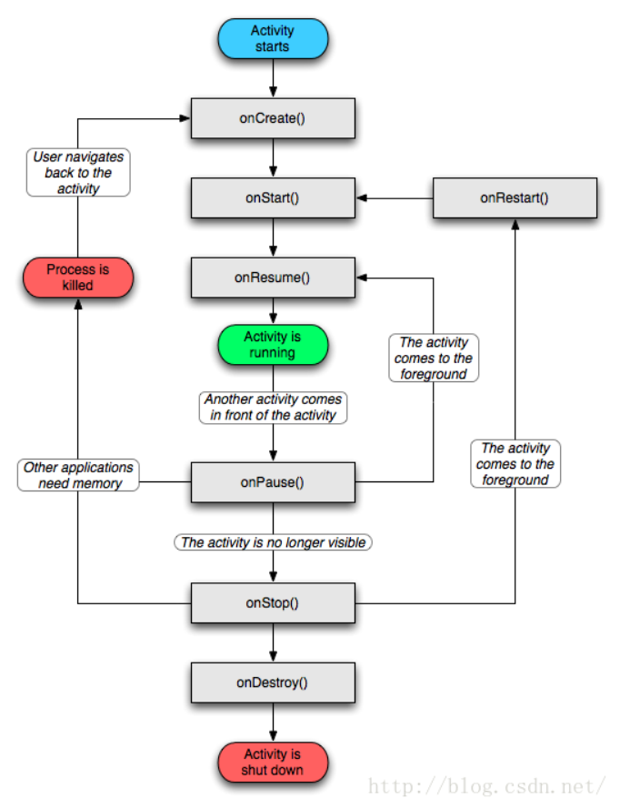

## `Android Studio` - 安装

### `windows7、windows11、windows 2016`

注意：用虚拟机安装`android studio`先登陆`vCenter`启用虚拟机虚拟化

下载 `android-studio-ide-171.4408382-windows.exe` 或者最新版本的 `android studio` 双击安装

选中`Android SDK`和`Intel HAXM`安装

打开`android-studio`创建`BasicActivity`类型`helloworld`工程

如果打开`helloworld`工程一直卡在`”Building ‘helloworld’ Gradle project info”`，那么点击`cancel`并且关闭`android studio`取消`gradle`下载
打开目录`C:\Users\john\.gradle\wrapper\dists\gradle-4.1-all\bzyivzo6n839fup2jbap0tjew`复制`gradle-4.1-all.zip`到此目录下，再次打开`android studio`，这次会很快打开`helloworld`项目


### `macOS`

安装方式和`windows`方式没有区别，全部安装和配置都使用`android-studio`配置，无需打开命令行配置。


### `Ubuntu22.04.5`

>提示：`AS 2024.2.1` 在 `Ubuntu20.04.3` 系统编辑 `Layout` 文件崩溃，所以显然这最终可能是 `glib` 的问题。`AS` 的最低要求是 `Ladybug` 至少需要 `2.31` 版本。但是，只要将 `Ubuntu` 升级到 `22` 版，`Ladybug` 就能正常工作了。升级后，我终于可以编辑布局了。
>
>参考链接：https://stackoverflow.com/questions/79127278/android-studio-crashes-when-opening-layout-xml-file

在`https://developer.android.com/studio/archive`下载`android-studio-2024.2.1.11-linux.tar.gz`

切换到`root`用户

```bash
sudo -i
```

解压`android-studio-2024.2.1.11-linux.tar.gz`到`/usr/local`目录

```bash
cd /usr/local
tar -xvzf android-studio-2024.2.1.11-linux.tar.gz
```

新建文件`/usr/share/applications/android-studio.desktop`内容如下：

```properties
[Desktop Entry]
Encoding=UTF-8
# https://askubuntu.com/questions/144968/set-variable-in-desktop-file
Name=Android Studio
Exec=sh /usr/local/android-studio/bin/studio.sh
Icon=/usr/local/android-studio/bin/studio.svg
Terminal=false
Type=Application
StartupNotify=true
```

通过`launch`应用程序功能输入`android studio`打开`android studio`

在打开项目过程中，如果下载`gradle.zip`过慢，可以参考 [链接](/android/README.html#gradle-android-studio下载gradle慢) 解决此问题。


## `Android Studio` - 查看内置的`JDK`版本

通过 `Help` > `About` 功能查看 `Android Studio` 内置的 `JDK` 版本，如下：

```
Runtime version: 21.0.3+-12282718-b509.11 amd64
VM: OpenJDK 64-Bit Server VM by JetBrains s.r.o.
```

- `OpenJDK` 版本为 `21.0.3`


## `Android Studio` - 创建各种项目

>`todo`


## `Android Studio` - 运行旧版项目

>说明：使用 `Android Studio Ladybug|2024.2.1` 运行旧版本项目需要升级 `Gradle` 和 `Android Gradle Plugin(AGP)`。
>
>详细用法请参考本站 [示例](https://gitee.com/dexterleslie/demonstration/tree/main/demo-android/demo-older-project-gradle-upgrade)

使用`Android Studio 2024.2.1`运行旧版项目需要升级`Gradle`和`AGP`版本，步骤如下：

- 升级`Gradle`版本：编辑`gradle/wrapper/gradle-wrapper.properties`

  ```properties
  # 旧版本gradle
  distributionUrl=https\://services.gradle.org/distributions/gradle-4.1-all.zip
  
  # 升级为新版本gradle
  distributionUrl=https\://services.gradle.org/distributions/gradle-8.9-bin.zip
  ```

- 升级项目`build.gradle`中的`AGP`版本：编辑`build.gradle`

  ```groovy
  // 旧版本的AGP
  buildscript {
      dependencies {
          classpath 'com.android.tools.build:gradle:3.0.0'
      }
  }
  
  // 升级为新版本的AGP
  buildscript {
      dependencies {
          classpath 'com.android.tools.build:gradle:8.7.0'
      }
  }
  ```

- 调整模块`build.gradle`

  ```groovy
  android {
      // 添加 namespace 配置，每个 Android 模块都有一个命名空间，它用作其生成的 R 和 BuildConfig 类的 Kotlin 或 Java 包名称。
      // https://developer.android.com/build/configure-app-module#set-namespace
      namespace "com.future.study.android.activity_lifecycle"
      ...
  }
  
  dependencies {
      ...
      // compile 修改为 implementation
      // compile 'com.android.support:support-annotations:27.1.1'
      implementation 'com.android.support:support-annotations:27.1.1'
  }
  
  ```

- 删除`AndroidMainfest.xml`中`package`配置

  ```xml
  <?xml version="1.0" encoding="utf-8"?>
  <manifest xmlns:android="http://schemas.android.com/apk/res/android">
      <!-- 删除 package 配置，因为新版本的 gradle 在模块 build.gradle 中使用 namespace 配置替代 -->
      <!--package="com.future.study.android.activity_lifecycle"-->
      ...
  </manifest>
  ```

做完以上步骤后即可正常运行项目。


## `Android Studio` - 下载`gradle`慢

~~关闭`android studio`并到官网`https://gradle.org/releases`下载完整版的`gradle`，例如：`gradle-8.9-all.zip`，不是 `gradle-8.9-bin.zip`~~

~~复制下载的`gradle zip`文件到目录`/Users/macos/.gradle/wrapper/dists/gradle-3.3-all/55gk2rcmfc6p2dg9u9ohc3hw9`~~

~~重新启动`android studio`~~

`File` > `Settings` > `搜索proxy功能` 配置 `HTTP Proxy`，选中 `Manual proxy configuration`：

- 选中 `HTTP`
- `Host name` 填写 `192.168.235.128`
- `Port number` 填写 `1080`
- `No proxy for` 填写 `*.aliyun.com,*.aliyuncs.com,dl.google.com`

重启 `Android Studio` 后下载 `gradle` 会自动使用代理。


## 删除已经下载的系统镜像

>说明：使用 `Android Studio` 删除已经下载的系统镜像以留出硬盘空间。

打开 `Settings` 功能搜索 `sdk` 关键词定位到 `Android SDK` 功能，切换到 `SDK Platforms Tab`，勾选 `Hide Obsolete Packages` 和 `Show Package Details`，拖动滚动条取消勾选需要删除的系统镜像后点击 `Apply` 按钮即可删除。


## 运行谷歌的模拟器（`AVD`）慢

>注意：个人电脑需要退出省电模式并接通电源，否则 `CPU` 功率太低导致 `AVD` 很慢。
>
>提示：
>
>- 使用服务器级的 `CPU` 运行 `AVD` 速度更加快。
>- 使用 `Ubuntu20.4` 运行 `AVD` 速度更加快，可能是因为底层使用 `kvm` 虚拟化原因。
>- 首次启动 `AVD` 会慢需要耐心等待。

运行谷歌的模拟器很慢，甚至在启动应用后经常会遇到 `ANR` 错误，这是因为运行了比较新版本的安卓操作系统，此时只需要切换到比较低版本的安卓系统（例如：`x86 images Tab` 中的 `API 24 "Nougat"; Android 7.0 Google APIs x86`）并且把 `Emulated Performance` 中的 `Graphics Acceleration` 选中为 `Hardware` ，`AVD RAM（AVD运行内存）` 设置为 `4GB`，`VM Heap size（AVD中的每个应用运行内存）` 设置为 `256MB`。`Startup` 中的 `Default Boot` 设置为 `Cold`。


## 项目下载远程仓库慢

>参考：https://blog.csdn.net/ygc87/article/details/82857611

项目`build.gradle`中的`repositories`添加配置：

```groovy
maven { url 'https://maven.aliyun.com/nexus/content/groups/public/' }
```


`settings.gradle.kts` 添加阿里云配置：

```kotlin
pluginManagement {
    repositories {
        // 添加阿里云 Maven 插件仓库
        maven { url = uri("https://maven.aliyun.com/repository/gradle-plugin") }
        google {
            content {
                includeGroupByRegex("com\\.android.*")
                includeGroupByRegex("com\\.google.*")
                includeGroupByRegex("androidx.*")
            }
        }
        mavenCentral()
        gradlePluginPortal()
    }
}
dependencyResolutionManagement {
    repositoriesMode.set(RepositoriesMode.FAIL_ON_PROJECT_REPOS)
    repositories {
        // 添加阿里云 Maven 仓库
        maven { url = uri("https://maven.aliyun.com/nexus/content/groups/public/") }
        google()
        mavenCentral()
    }
}

rootProject.name = "My Application"
include(":app")
 
```


## `android ndk`


### 什么是`sdk`？什么是`ndk`？

>https://developer.android.com/ndk/index.html
>
>https://stackoverflow.com/questions/43751485/what-is-the-difference-between-ndk-and-sdk

`Android NDK`是一个工具集，可让您使用`C`和`C++`等语言以原生代码实现应用的各个部分。对于某些类型的应用，这可以帮助您重复使用以这些语言编写的代码库。

`SDK`是`Android`应用程序的主要开发工具包 - 它包含用于`Java`和资源（`png`、`xml`）编译、打包为`apk`文件、在设备、模拟器、文档等上安装、运行和调试它们的工具。


### `Ubuntu`配置`ndk`编译环境

>https://www.jianshu.com/p/9ada3fd9c286

访问`https://developer.android.com/ndk/downloads/older_releases.html`下载`ndk`

使用`unzip`命令解压`ndk`

```bash
unzip android-ndk-r21e-linux-x86_64.zip
```

移动`android-ndk`到`/usr/local`目录

```bash
sudo mv android-ndk-r21e /usr/local/
```

配置`ndk`环境变量文件`/etc/profile.d/android-ndk.sh`内容如下：

```bash
export ANDROID_NDK=/usr/local/android-ndk-r21e
export ANDROID_NDK_ROOT=$ANDROID_NDK
export PATH=$PATH:$ANDROID_NDK
```

临时加载`ndk`环境变量

```bash
source /etc/profile
```

测试`ndk`是否正确配置

```bash
ndk-build --version
```


## `Generate Signed Bundle or APK`时创建`key`

在创建`key`时候会提示错误信息“JKS 密钥库使用专用格式。建议使用..."，此时可以不用理会此报错信息继续创建`apk`。


## 模拟器

### 有哪些模拟器呢？

`MuMu`模拟器：网易开发的模拟器，支持`Windows`和`macOS`，优化了游戏性能。通过 [链接](https://mumu.163.com/download/) 下载最新版模拟器，根据提示安装即可。


## `gradle` - 查看项目中使用的版本

打开项目根目录下的 `gradle/wrapper/gradle-wrapper.properties` 文件。找到 `distributionUrl` 这一行，`URL` 的路径中就包含了 `Gradle` 发行版版本。


## `gradle` - 和`gradle plugin(AGP)`对应版本

> 官方说明：https://developer.android.com/studio/releases/gradle-plugin

项目`build.gradle`

```groovy
buildscript {
    repositories {
        // Gradle 4.1 and higher include support for Google's Maven repo using
        // the google() method. And you need to include this repo to download
        // Android Gradle plugin 3.0.0 or higher.
        google()
        ...
    }
    dependencies {
        // Gradle 插件
        classpath 'com.android.tools.build:gradle:3.4.2'
    }
}
```

`Gradle plugin(AGP:Android Gradle Plugin)`和`Gradle`版本对照表：

```
Plugin version	Required Gradle version
1.0.0 - 1.1.3		2.2.1 - 2.3
1.2.0 - 1.3.1		2.2.1 - 2.9
1.5.0				2.2.1 - 2.13
2.0.0 - 2.1.2		2.10 - 2.13
2.1.3 - 2.2.3		2.14.1+
2.3.0+				3.3+
3.0.0+				4.1+
3.1.0+				4.4+
3.2.0 - 3.2.1		4.6+
3.3.0 - 3.3.2		4.10.1+
3.4.0+				5.1.1+

Plugin version	Minimum required Gradle version
8.13			8.13
8.12			8.13
8.11			8.13
8.10			8.11.1
8.9				8.11.1
8.8				8.10.2
8.7				8.9
8.6				8.7
8.5				8.7
8.4				8.6
8.3				8.4
8.2				8.2
8.1				8.0
8.0				8.0
```

`Android Gradle Plugin`和`Android Studio`兼容性

| Android Studio version             | Required AGP version |
| ---------------------------------- | -------------------- |
| Narwhal 3 Feature Drop \| 2025.1.3 | 4.0-8.13             |
| Narwhal Feature Drop \| 2025.1.2   | 4.0-8.12             |
| Narwhal \| 2025.1.1                | 3.2-8.11             |
| Meerkat Feature Drop \| 2024.3.2   | 3.2-8.10             |
| Meerkat \| 2024.3.1                | 3.2-8.9              |
| Ladybug Feature Drop \| 2024.2.2   | 3.2-8.8              |
| Ladybug \| 2024.2.1                | 3.2-8.7              |
| Koala Feature Drop \| 2024.1.2     | 3.2-8.6              |
| Koala \| 2024.1.1                  | 3.2-8.5              |
| Jellyfish \| 2023.3.1              | 3.2-8.4              |
| Iguana \| 2023.2.1                 | 3.2-8.3              |
| Hedgehog \| 2023.1.1               | 3.2-8.2              |
| Giraffe \| 2022.3.1                | 3.2-8.1              |
| Flamingo \| 2022.2.1               | 3.2-8.0              |


## `Activity` - 生命周期

>注意：不能保证 `onDestroy` 方法一定被回调（`onDestroy` 方法在调用 `finish` 和用户按下 `back` 按钮时一定被回调）。
>
>详细用法请参考本站 [示例](https://gitee.com/dexterleslie/demonstration/tree/main/demo-android/demo-activity-lifecycle)
>
>参考链接：https://stackoverflow.com/questions/19608948/is-ondestroy-not-always-called?rq=1、https://blog.csdn.net/javazejian/article/details/51932554
>

生命周期如图所示：



`Activity` 状态如下：

- `Active/Running`： Activity处于活动状态，此时Activity处于栈顶，是可见状态，可与用户进行交互。 
- `Paused`： 当Activity失去焦点时，或被一个新的非全屏的Activity，或被一个透明的Activity放置在栈顶时，Activity就转化为Paused状态。但我们需要明白，此时Activity只是失去了与用户交互的能力，其所有的状态信息及其成员变量都还存在，只有在系统内存紧张的情况下，才有可能被系统回收掉。 
- `Stopped`： 当一个Activity被另一个Activity完全覆盖时，被覆盖的Activity就会进入Stopped状态，此时它不再可见，但是跟Paused状态一样保持着其所有状态信息及其成员变量。 
- `Killed`：当Activity被系统回收掉时，Activity就处于Killed状态。 

Activity会在以上四种形态中相互切换，至于如何切换，这因用户的操作不同而异。了解了Activity的4种形态后，我们就来聊聊Activity的生命周期。

`Activity` 生命周期回调方法：

- `onCreate`：该方法是在Activity被创建时回调，它是生命周期第一个调用的方法，我们在创建Activity时一般都需要重写该方法，然后在该方法中做一些初始化的操作，如通过setContentView设置界面布局的资源，初始化所需要的组件信息等。
- `onStart`：此方法被回调时表示Activity正在启动，此时Activity已处于可见状态，只是还没有在前台显示，因此无法与用户进行交互。可以简单理解为Activity已显示而我们无法看见摆了。
- `onResume`：当此方法回调时，则说明Activity已在前台可见，可与用户交互了（处于前面所说的Active/Running形态），onResume方法与onStart的相同点是两者都表示Activity可见，只不过onStart回调时Activity还是后台无法与用户交互，而onResume则已显示在前台，可与用户交互。当然从流程图，我们也可以看出当Activity停止后（onPause方法和onStop方法被调用），重新回到前台时也会调用onResume方法，因此我们也可以在onResume方法中初始化一些资源，比如重新初始化在onPause或者onStop方法中释放的资源。
- `onPause`：此方法被回调时则表示Activity正在停止（Paused形态），一般情况下onStop方法会紧接着被回调。但通过流程图我们还可以看到一种情况是onPause方法执行后直接执行了onResume方法，这属于比较极端的现象了，这可能是用户操作使当前Activity退居后台后又迅速地再回到到当前的Activity，此时onResume方法就会被回调。当然，在onPause方法中我们可以做一些数据存储或者动画停止或者资源回收的操作，但是不能太耗时，因为这可能会影响到新的Activity的显示——onPause方法执行完成后，新Activity的onResume方法才会被执行。 
- `onStop`：一般在onPause方法执行完成直接执行，表示Activity即将停止或者完全被覆盖（Stopped形态），此时Activity不可见，仅在后台运行。同样地，在onStop方法可以做一些资源释放的操作（不能太耗时）。 
- `onRestart`：表示Activity正在重新启动，当Activity由不可见变为可见状态时，该方法被回调。这种情况一般是用户打开了一个新的Activity时，当前的Activity就会被暂停（onPause和onStop被执行了），接着又回到当前Activity页面时，onRestart方法就会被回调。 
- `onDestroy`：此时Activity正在被销毁，也是生命周期最后一个执行的方法，一般我们可以在此方法中做一些回收工作和最终的资源释放。 

情景启动 `app`：`onCreate()` > `onStart()` > `onResume()`

情景按 `home` 键后再回到 `app`：

- 按 `home` 键：`onPause()` > `onStop()`
- 回到 `app`：`onRestart()` > `onStart()` > `onResume()`

情景新 `activity` 覆盖旧 `activity`：

- 弹出第二个 `activity`：`onPause()` > `onStop()`
- 按 `back` 按钮返回 `onRestart()` > `onStart()` > `onResume()`

情景点击 `back` 按钮退出：`onPause()` > `onStop()` > `onDestroy()`

情景横竖屏切换：

- 先销毁 `onPause()` > `onStop()` > `onDestroy()`
- 再创建 `onCreate()` > `onStart()` > `onResume()`

情景锁屏、解锁屏：

- 锁屏 `onPause()` > `onStop()`
- 解锁屏 `onRestart()` > `onStart()` > `onResume()`


## `Application` - 概念

您可以这样理解：
*   **Android应用程序**：指整个**房子**。
*   **`android.app.Application``**：指房子的**地基和主框架**。每个房子都必须有地基，但它本身不是房子。

---

### 核心定义

`android.app.Application` 是一个**基类**，用于维护应用程序的**全局状态**。它是你的Android应用启动时，系统创建的**第一个单例对象**，并且在整个应用进程存续期间都会一直存在。

它是一个“应用程序级别”的上下文，而不是“某个界面”的上下文。

### 它的主要角色和职责

1.  **应用的入口点**：
    虽然它没有`main()`方法（Android系统的zygote进程处理了真正的入口），但`Application`对象的创建标志着你的应用代码开始执行。它是你应用内所有组件的起点。

2.  **全局状态容器**：
    因为它是最早创建、最后销毁的对象，并且在整个应用中只有一个实例，所以它是存放**全局变量**和**需要全局访问的数据**的理想场所。
    *   例如：你初始化了一个全局的网络请求客户端（如OkHttpClient）、图片加载库（如Glide）或者数据库帮助类，你可以把它们放在这里，这样应用中的所有Activity和Service都能访问到同一个实例。

3.  **提供应用级别的上下文**：
    它提供了一个`Context`（上下文），这个上下文与整个应用的生命周期绑定，而不是与某个Activity绑定。当你需要一个生命周期与应用一样长的`Context`时（例如在`Service`中或后台任务中），就应该使用`Application Context`，而不是`Activity Context`，这样可以避免内存泄漏。

### 如何使用它？

你通常不会直接使用`Application`类，而是创建一个它的**子类**。

**步骤示例：**

1.  **创建自定义Application类**：
    在你的项目中创建一个类，继承自`android.app.Application`。

    ```kotlin
    // Kotlin 示例
    class MyCustomApplication : Application() {
    
        // 声明一个全局变量
        lateinit var globalHttpClient: OkHttpClient
    
        override fun onCreate() {
            super.onCreate() // 务必先调用父类方法
    
            // 这是初始化全局资源的最佳地点
            globalHttpClient = OkHttpClient.Builder()
                .connectTimeout(20, TimeUnit.SECONDS)
                .build()
    
            // 也可以在这里初始化第三方SDK，如Crash reporting, Analytics等
            Firebase.initialize(this)
            Timber.plant(Timber.DebugTree()) // 初始化日志库
        }
    }
    ```

2.  **在AndroidManifest.xml中注册**：
    你必须告诉Android系统使用你这个自定义的Application类，而不是默认的。在`<application>`标签中指定它的`name`属性。

    ```xml
    <manifest ...>
        <application
            android:name=".MyCustomApplication" <!-- 这里指向你的自定义类 -->
            android:icon="@mipmap/ic_launcher"
            android:label="@string/app_name"
            ... >
            <activity ...>
                ...
            </activity>
        </application>
    </manifest>
    ```

3.  **在其他地方获取Application实例**：
    你可以在Activity、Service或任何有Context的地方轻松获取到你的Application实例。

    ```kotlin
    // 在某个Activity中
    class MainActivity : AppCompatActivity() {
    
        override fun onCreate(savedInstanceState: Bundle?) {
            super.onCreate(savedInstanceState)
    
            // 获取Application实例
            val myApp = application as MyCustomApplication
    
            // 使用Application中的全局对象
            val client = myApp.globalHttpClient
            // 现在可以用这个client进行网络请求了
        }
    }
    ```

### 与 Activity 的区别

| 特性         | `android.app.Application`          | `android.app.Activity`                 |
| :----------- | :--------------------------------- | :------------------------------------- |
| **数量**     | **一个应用只有一个实例**           | **一个应用可以有多个实例**（多个界面） |
| **生命周期** | 从应用启动到结束                   | 从界面创建到销毁（会频繁创建和销毁）   |
| **用途**     | 维护**全局**、**持久**的状态和资源 | 管理**一个界面**的显示和用户交互       |
| **上下文**   | 提供**应用级别**的Context          | 提供**界面级别**的Context              |

### 总结

**`android.app.Application`** 是Android应用的**基石**。它是一个单例类，代表的是**应用程序本身**，而不是应用程序中的某个界面。它的主要作用是：

*   **作为应用的启动入口**
*   **存放和管理全局资源与状态**
*   **提供应用级别的上下文**

正确使用`Application`类对于编写高效、可维护且没有内存泄漏的Android应用至关重要。


## `Application` - 基本用法

>参考链接：https://www.cnblogs.com/tiejiangweigaibianercunzai/p/4003357.html
>
>详细用法请参考本站 [示例](https://gitee.com/dexterleslie/demonstration/tree/main/demo-android/demo-application)

创建自定义 `Application`：

```java
package com.future.demo;

import android.app.Application;
import android.util.Log;

/**
 *
 */
public class BaseApplication extends Application{
    private final static String TAG = BaseApplication.class.getSimpleName();

    @Override
    public void onCreate() {
        super.onCreate();
        Log.i(TAG, "调用onCreate()函数");
    }
}

```

`AndroidManifest.xml` 中配置自定义 `Application`

```xml
<?xml version="1.0" encoding="utf-8"?>
<manifest xmlns:android="http://schemas.android.com/apk/res/android">

    <application
        android:allowBackup="true"
        android:icon="@mipmap/ic_launcher"
        android:label="@string/app_name"
        android:roundIcon="@mipmap/ic_launcher_round"
        android:supportsRtl="true"
        android:theme="@style/AppTheme"
        android:name=".BaseApplication">
        ...
    </application>

</manifest>
```


## `Application` - `ActivityLifecycleCallbacks`

>`ActivityLifecycleCallbacks` 使用方法初探：https://blog.csdn.net/tongcpp/article/details/40344871
>
>应用前后台切换监听：http://blog.takwolf.com/2017/06/29/android-application-foreground-and-background-switch-listener/index.html

ActivityLifecycleCallbacks是什么？Application通过此接口提供了一套回调方法，用于让开发者对Activity的生命周期事件进行集中处理。

为什么用ActivityLifecycleCallbacks？以往若需监测Activity的生命周期事件代码，你可能是这样做的，重写每一个Acivity的onResume()，然后作统计和处理,ActivityLifecycleCallbacks接口回调可以简化这一繁琐过程，在一个类中作统一处理。

通过使用本站 [示例]() 研究ActivityLifecycleCallbacks监听器能够监听所有activity start和stop事件，能够很好地实现监听应用是否前台进入后台运行和后台进入前台运行切换动作。


## 布局 - 类型

布局（Layout）是 Android 开发中构建用户界面（UI）的基础。它们是一种特殊的视图组（ViewGroup），负责定义其子视图（View）在屏幕上的排列方式。

Android 提供了多种布局，每种都有其特定的用途和排列规则。以下是主要的核心布局：

---

### 1. LinearLayout（线性布局）
**特点**：将其子视图以**单行**或**单列**的形式线性排列。这是最直观、最常用的布局之一。
*   **核心属性**：`android:orientation`
    *   `vertical`（垂直）：子视图从上到下排成一列。
    *   `horizontal`（水平）：子视图从左到右排成一行。
*   **常用权重属性**：`android:layout_weight`
    *   用于按比例分配剩余空间，非常实用。
*   **示例场景**：登录界面的用户名、密码输入框和登录按钮垂直排列；应用底部几个按钮水平排列。

---

### 2. RelativeLayout（相对布局）
**特点**：子视图的位置是**相对于其他兄弟视图**或**父容器**（RelativeLayout本身）来确定的。非常灵活。
*   **核心属性**：以 `layout_toLeftOf`, `layout_toRightOf`, `layout_below`, `layout_above`, `layout_alignParentTop`, `layout_centerInParent` 等为代表。
*   **优点**：可以减少布局嵌套，但规则稍复杂。
*   **示例场景**：将一个图标放在文本框的左边，将一个按钮放置在父容器的右下角。

---

### 3. ConstraintLayout（约束布局）
**特点**：目前**最强大、最推荐**的布局。它通过为每个子视图添加**约束（Constraint）** 来确定其位置，类似于 RelativeLayout 的升级版，但功能强大得多。
*   **核心概念**：视图的每条边（上下左右）必须与其他视图或父容器的边建立约束关系。
*   **强大功能**：
    *   **百分比定位**：可以轻松实现按屏幕百分比布局。
    *   **屏障（Barrier）**：根据多个视图的动态大小来定位。
    *   **引导线（Guideline）**：一条不可见的参考线，用于辅助对齐。
    *   **链（Chain）**：控制一组视图在水平或垂直方向上的分布方式。
*   **优点**：扁平化布局，极大地减少嵌套，性能好，能轻松应对各种复杂和响应式界面。
*   **示例场景**：**几乎所有复杂界面**的首选，特别是需要适配不同屏幕尺寸的场景。

---

### 4. FrameLayout（帧布局）
**特点**：最简单的布局，所有子视图都会**堆叠**在屏幕的**左上角**。后添加的子视图会盖在先添加的视图上面。
*   **核心属性**：`android:layout_gravity`，用于控制子视图在父容器中的对齐方式（如居中、右下角）。
*   **用途**：通常用于**占位**或**显示单个视图**。常见用法是作为碎片（Fragment）的容器，或者用于实现重叠效果（如Logo浮于图片之上）。
*   **示例场景**：应用内的弹窗（Dialog）、一个单独的图片展示页。

---

### 5. TableLayout（表格布局）
**特点**：将其子视图排列成**行和列**的形式。每一行是一个 `TableRow` 元素，每个 `TableRow` 中的子视图代表一个单元格。
*   **核心属性**：`android:stretchColumns` 和 `android:shrinkColumns`，用于控制哪些列可以拉伸或收缩以填满空间。
*   **用途**：适合需要规整的表格式数据展示，但现在更常使用 `RecyclerView` 来实现更灵活的列表/网格。
*   **示例场景**：简单的数据表单、课程表。

---

### 6. GridLayout（网格布局）
**特点**：将界面划分为**无限细的网格线**，子视图可以指定自己占据哪几行哪几列，从而更灵活地实现网格状布局。
*   **与TableLayout区别**：比 TableLayout 更灵活，子视图可以跨行和跨列。
*   **用途**：适合需要自定义网格排布的场景，例如计算器界面、井字棋游戏棋盘。
*   **示例场景**：计算器应用的按钮布局。

---

### 总结与选择建议

| 布局                       | 特点                         | 适用场景                                               | 推荐度           |
| :------------------------- | :--------------------------- | :----------------------------------------------------- | :--------------- |
| **ConstraintLayout**       | **功能最强，性能好，扁平化** | **几乎所有复杂界面**，响应式设计                       | ⭐⭐⭐⭐⭐ **(首选)** |
| **LinearLayout**           | 简单线性排列                 | 简单的列表或单行布局                                   | ⭐⭐⭐⭐             |
| **RelativeLayout**         | 相对定位                     | 简单重叠或相对位置布局（正逐渐被ConstraintLayout替代） | ⭐⭐               |
| **FrameLayout**            | 视图堆叠                     | 碎片容器、弹窗、单个视图展示                           | ⭐⭐⭐⭐             |
| **TableLayout/GridLayout** | 表格/网格                    | 规整的表格式布局（使用场景较少）                       | ⭐⭐               |

**现代最佳实践**：
对于新项目，**强烈建议将 `ConstraintLayout` 作为默认和主要的布局**。它不仅能实现其他所有布局的效果，还能通过减少视图层级来提升性能，并且能更好地适配各种屏幕尺寸。`LinearLayout` 和 `FrameLayout` 在简单场景中依然非常有用。


## 布局 - `FrameLayout`

### 核心概念

**FrameLayout** 是一个“帧”布局，或者可以想象成一个“相框”。它的行为非常直接：

**所有子视图（View）都会自动被放置在布局的左上角（0,0坐标点），后放入的子视图会覆盖在先前子视图的上面。**

您可以把它想象成一叠扑克牌或一摞纸，每张纸都盖住了下面那张，你只能看到最上面的那一张。

---

### 主要特点和用途

1.  **简单叠加（堆叠）**：这是它最核心的用途。用于将多个视图重叠在一起。
2.  **单一视图容器**：经常用作一个“容器”或“占位符”，只包含一个子视图（例如，作为 `Fragment` 的容器）。
3.  **轻量级**：由于布局逻辑非常简单，它的测量和绘制过程非常高效。

---

### 关键属性

FrameLayout 本身属性很少，但其**子视图**可以使用一些非常重要的属性来控制自己在 FrameLayout 中的位置：

*   `android:layout_gravity`
    *   **这是最重要的属性**。它用于控制子视图在 FrameLayout **内部**的对齐方式，而不是像其他布局那样简单的外边距。
    *   **常用值**：`center`, `center_vertical`, `center_horizontal`, `top`, `bottom`, `left`, `right`, `start`, `end`，以及这些值的组合（如 `bottom|end` 表示右下角）。
    *   **示例**：将一个按钮放在 FrameLayout 的右下角：`android:layout_gravity="bottom|end"`

*   `android:foreground`
    *   **FrameLayout 自身的属性**。用于设置一个绘制在所有子视图**之上**的前景图。
    *   可以是一张图片（`@drawable/...`），也可以是一个颜色（`@color/...`）。
    *   常用于设置一个遮罩效果，比如在图片上加一个半透明的灰色层。

*   `android:foregroundGravity`
    *   控制 `android:foreground` 前景图的对齐方式。

---

### 实际应用场景

1.  **Fragment 的容器**
    这是最常见的用法。在 `Activity` 的布局中，你通常会用一个 FrameLayout 来作为放置 `Fragment` 的“坑”。
    ```xml
    <FrameLayout
        android:id="@+id/fragment_container"
        android:layout_width="match_parent"
        android:layout_height="match_parent" />
    ```
    然后在代码中，你将不同的 Fragment 事务填充到这个 ID 为 `fragment_container` 的 FrameLayout 中。

2.  **图片上叠加文字或图标**
    比如实现一个照片墙，在图片的右下角显示一个收藏图标。
    ```xml
    <FrameLayout
        android:layout_width="wrap_content"
        android:layout_height="wrap_content">
    
        <ImageView
            android:layout_width="200dp"
            android:layout_height="200dp"
            android:scaleType="centerCrop"
            android:src="@drawable/my_image" />
    
        <ImageView
            android:layout_width="30dp"
            android:layout_height="30dp"
            android:layout_gravity="bottom|end" <!-- 关键！定位到右下角 -->
            android:src="@drawable/ic_favorite" />
    
    </FrameLayout>
    ```

3.  **实现遮罩或浮层效果**
    使用 `android:foreground` 属性可以轻松实现点击态或禁用态的遮罩效果。
    ```xml
    <FrameLayout
        android:layout_width="100dp"
        android:layout_height="100dp"
        android:foreground="@drawable/selector_foreground"> <!-- 一个选择器，包含按下和默认状态 -->
    
        <ImageView ... />
    
    </FrameLayout>
    ```

4.  **自定义 ProgressBar 或加载框**
    可以在界面中央覆盖一个半透明的层和一个旋转的进度条。
    ```xml
    <FrameLayout
        android:id="@+id/loading_state"
        android:layout_width="match_parent"
        android:layout_height="match_parent"
        android:visibility="gone"> <!-- 默认隐藏 -->
    
        <View
            android:layout_width="match_parent"
            android:layout_height="match_parent"
            android:background="#80000000" /> <!-- 半透明黑色遮罩 -->
    
        <ProgressBar
            android:layout_width="wrap_content"
            android:layout_height="wrap_content"
            android:layout_gravity="center" <!-- 关键！让进度条居中 -->
            android:indeterminate="true" />
    
    </FrameLayout>
    ```

---

### 代码示例

下面是一个典型的 FrameLayout 示例，展示了图片叠加图标和文字的效果：

```xml
<?xml version="1.0" encoding="utf-8"?>
<FrameLayout xmlns:android="http://schemas.android.com/apk/res/android"
    android:layout_width="match_parent"
    android:layout_height="wrap_content">

    <!-- 底层：背景图片 -->
    <ImageView
        android:id="@+id/imageView"
        android:layout_width="match_parent"
        android:layout_height="200dp"
        android:scaleType="centerCrop"
        android:src="@drawable/landscape" />

    <!-- 中层：半透明渐变，让文字更清晰 -->
    <View
        android:layout_width="match_parent"
        android:layout_height="60dp"
        android:layout_gravity="bottom"
        android:background="@drawable/gradient_background" />

    <!-- 上层：文字 -->
    <TextView
        android:layout_width="wrap_content"
        android:layout_height="wrap_content"
        android:layout_gravity="bottom|start"
        android:layout_margin="16dp"
        android:text="美丽的风景"
        android:textColor="@color/white"
        android:textSize="18sp" />

    <!-- 最上层：右上角图标 -->
    <ImageView
        android:layout_width="40dp"
        android:layout_height="40dp"
        android:layout_gravity="top|end"
        android:layout_margin="8dp"
        android:src="@drawable/ic_bookmark" />

</FrameLayout>
```

### 总结

| 特性         | 说明                                                         |
| :----------- | :----------------------------------------------------------- |
| **核心行为** | **堆叠子视图**，后添加的覆盖先添加的，默认对齐左上角。       |
| **核心属性** | 子视图使用 `android:layout_gravity` 来定位。                 |
| **优点**     | **非常简单、高效**，是实现重叠效果的**最佳选择**。           |
| **缺点**     | 无法实现复杂的、非重叠的布局。                               |
| **主要用途** | **Fragment容器**、**图片文字叠加**、**浮层/遮罩**、**自定义弹窗**。 |

虽然 `ConstraintLayout` 也能实现视图重叠，但对于简单的堆叠场景，`FrameLayout` 因其极致的简单和清晰语义，仍然是首选方案。

### 示例

>详细用法请参考本站 [示例](https://gitee.com/dexterleslie/demonstration/tree/main/demo-android/demo-framelayout)

```xml
<?xml version="1.0" encoding="utf-8"?>
<FrameLayout xmlns:android="http://schemas.android.com/apk/res/android"
    xmlns:app="http://schemas.android.com/apk/res-auto"
    xmlns:tools="http://schemas.android.com/tools"
    android:layout_width="match_parent"
    android:layout_height="match_parent"
    app:layout_behavior="@string/appbar_scrolling_view_behavior"
    tools:context="com.future.demo.MainActivity"
    tools:showIn="@layout/activity_main">
    <ProgressBar
        android:layout_gravity="center"
        android:id="@+id/progressBar"
        style="?android:attr/progressBarStyle"
        android:layout_width="wrap_content"
        android:layout_height="wrap_content"/>
    <TextView
        android:layout_gravity="center"
        android:id="@+id/textView5"
        android:layout_width="wrap_content"
        android:layout_height="wrap_content"
        android:text="%20" />
</FrameLayout>

```


## 布局 - `RelativeLayout`

>参考链接：https://blog.csdn.net/qq_40895460/article/details/88644845

### 核心概念

**RelativeLayout** 是一个通过**相对定位**来排列其子视图的布局。每个子视图的位置都是相对于**兄弟视图（Sibling View）** 或**父容器（RelativeLayout 本身）** 来确定的。

它的理念是：“将这个按钮放在那个文本框的下方”，或者“将这个图标对齐到父布局的右边”。

---

### 主要特点和用途

1.  **减少嵌套**：通过相对定位，有时可以避免使用多个 `LinearLayout` 嵌套来实现的复杂布局，从而使视图层级更扁平。
2.  **灵活性**：可以创建出线性布局难以实现的复杂界面。
3.  **性能权衡**：由于需要测量所有视图的依赖关系，如果使用不当（如依赖关系复杂或循环依赖），测量过程可能会比 `LinearLayout` 更耗时。

---

### 关键属性（相对于父容器）

这些属性是 `android:layout_alignParent` 开头，值为 `true` 或 `false`。

*   `android:layout_alignParentTop="true"` - 与父布局顶部对齐
*   `android:layout_alignParentBottom="true"` - 与父布局底部对齐
*   `android:layout_alignParentLeft="true"` - 与父布局左边对齐
*   `android:layout_alignParentRight="true"` - 与父布局右边对齐
*   `android:layout_alignParentStart="true"` - 与父布局起始边对齐（支持RTL）
*   `android:layout_alignParentEnd="true"` - 与父布局结束边对齐（支持RTL）
*   `android:layout_centerInParent="true"` - 在父布局中居中
*   `android:layout_centerHorizontal="true"` - 在父布局中水平居中
*   `android:layout_centerVertical="true"` - 在父布局中垂直居中

---

### 关键属性（相对于兄弟视图）

这些属性是 `android:layout_` 开头，值需要引用另一个视图的 ID (`@id/view_id`)。

*   `android:layout_above="@id/view_id"` - 位于指定视图的上方
*   `android:layout_below="@id/view_id"` - 位于指定视图的下方
*   `android:layout_toLeftOf="@id/view_id"` - 位于指定视图的左边
*   `android:layout_toRightOf="@id/view_id"` - 位于指定视图的右边
*   `android:layout_toStartOf="@id/view_id"` - 位于指定视图的起始边
*   `android:layout_toEndOf="@id/view_id"` - 位于指定视图的结束边
*   `android:layout_alignTop="@id/view_id"` - 与指定视图的顶部对齐
*   `android:layout_alignBottom="@id/view_id"` - 与指定视图的底部对齐
*   `android:layout_alignLeft="@id/view_id"` - 与指定视图的左边对齐
*   `android:layout_alignRight="@id/view_id"` - 与指定视图的右边对齐
*   `android:layout_alignStart="@id/view_id"` - 与指定视图的起始边对齐
*   `android:layout_alignEnd="@id/view_id"` - 与指定视图的结束边对齐
*   `android:layout_alignBaseline="@id/view_id"` - 与指定视图的文本基线对齐（用于TextView）

---

### 实际应用场景与示例

**场景**：创建一个简单的用户资料头部的布局，包含头像、姓名和简介。

```xml
<?xml version="1.0" encoding="utf-8"?>
<RelativeLayout xmlns:android="http://schemas.android.com/apk/res/android"
    android:layout_width="match_parent"
    android:layout_height="wrap_content"
    android:padding="16dp">

    <!-- 头像 (放置在左边) -->
    <ImageView
        android:id="@+id/imageView_avatar"
        android:layout_width="60dp"
        android:layout_height="60dp"
        android:layout_alignParentStart="true"
        android:layout_alignParentTop="true"
        android:src="@drawable/avatar" />

    <!-- 姓名 (放置在头像的右边，与头像顶部对齐) -->
    <TextView
        android:id="@+id/textView_name"
        android:layout_width="wrap_content"
        android:layout_height="wrap_content"
        android:layout_toEndOf="@id/imageView_avatar"
        android:layout_alignTop="@id/imageView_avatar"
        android:layout_marginStart="16dp"
        android:text="张三"
        android:textSize="18sp"
        android:textStyle="bold" />

    <!-- 简介 (放置在姓名的下方，与头像的右边对齐) -->
    <TextView
        android:id="@+id/textView_bio"
        android:layout_width="wrap_content"
        android:layout_height="wrap_content"
        android:layout_toEndOf="@id/imageView_avatar"
        android:layout_below="@id/textView_name"
        android:layout_alignStart="@id/textView_name"
        android:layout_marginTop="4dp"
        android:text="这是一个简单的用户简介..."
        android:textColor="#666"
        android:textSize="14sp" />

    <!-- 时间戳 (放置在父布局的右上角) -->
    <TextView
        android:id="@+id/textView_time"
        android:layout_width="wrap_content"
        android:layout_height="wrap_content"
        android:layout_alignParentEnd="true"
        android:layout_alignParentTop="true"
        android:text="10:30 AM"
        android:textColor="#999"
        android:textSize="12sp" />

</RelativeLayout>
```

**布局效果说明**：
1.  `imageView_avatar`：对齐父布局的左上角。
2.  `textView_name`：位于 `imageView_avatar` 的右边 (`toEndOf`)，并且顶部与 `imageView_avatar` 对齐 (`alignTop`)。
3.  `textView_bio`：位于 `textView_name` 的下方 (`below`)，并且起始边与 `textView_name` 对齐 (`alignStart`)。
4.  `textView_time`：对齐父布局的右上角。

---

### 与 ConstraintLayout 的对比

| 特性       | RelativeLayout                         | ConstraintLayout                     |
| :--------- | :------------------------------------- | :----------------------------------- |
| **理念**   | 相对定位（上下左右）                   | 约束（Constraint），更强大灵活       |
| **性能**   | 测量次数较多，性能一般                 | 测量算法更优，性能更好               |
| **功能**   | 基本相对定位                           | 支持比例、屏障、链、引导线等高级功能 |
| **嵌套**   | 可减少嵌套，但依赖关系复杂时难管理     | **极致的扁平化**，能有效减少嵌套     |
| **推荐度** | ** legacy **，**不推荐在新项目中使用** | **现代首选**，Google 强力推荐        |

---

### 最佳实践和注意事项

1.  **避免循环依赖**：视图A依赖于视图B，视图B又依赖于视图A，这会导致布局错误或性能问题。
2.  **引用已定义的ID**：在引用兄弟视图时 (`@id/...`)，必须确保该视图已经在布局文件中**先被定义**了。否则会出现 `No resource found` 错误。通常需要被引用的视图（如锚点视图）放在前面。
3.  **优先使用 ConstraintLayout**：对于新项目，**强烈建议使用 `ConstraintLayout` 来代替 `RelativeLayout`**。`ConstraintLayout` 几乎能做到 `RelativeLayout` 能做的一切，并且做得更好、更高效。`RelativeLayout` 目前主要用于维护旧的代码库。
4.  **语义清晰**：虽然可以减少嵌套，但过于复杂的相对关系可能会使布局文件难以阅读和维护。

### 总结

| 特性         | 说明                                                         |
| :----------- | :----------------------------------------------------------- |
| **核心行为** | 通过**相对定位**（相对于父容器或兄弟视图）来排列子视图。     |
| **优点**     | **灵活性高**，可以在一定程度上**减少布局嵌套**。             |
| **缺点**     | **性能一般**，依赖关系**复杂时难以管理**，**已过时**。       |
| **历史地位** | 在 `ConstraintLayout` 出现之前，它是实现复杂布局的重要工具。 |
| **当前建议** | ** legacy **，在新项目中应优先使用 **`ConstraintLayout`**。  |

虽然现在不推荐新建项目时使用，但理解 `RelativeLayout` 对于阅读和维护遗留代码仍然非常重要。它的“相对”思想也被 `ConstraintLayout` 所继承和发展。

### 示例

>详细用法请参考本站 [示例](https://gitee.com/dexterleslie/demonstration/tree/main/demo-android/demo-relativelayout)

```xml
<?xml version="1.0" encoding="utf-8"?>
<LinearLayout xmlns:android="http://schemas.android.com/apk/res/android"
    android:layout_width="match_parent"
    android:layout_height="match_parent"
    android:orientation="vertical">
    <RelativeLayout
        android:layout_height="0dp"
        android:layout_width="match_parent"
        android:layout_weight="1">
        <Button
            android:layout_width="wrap_content"
            android:layout_height="wrap_content"
            android:text="button"
            android:layout_centerInParent="true"/>

        <Button
            android:layout_width="wrap_content"
            android:layout_height="wrap_content"
            android:text="右上角"
            android:layout_alignParentRight="true"/>

        <Button
            android:layout_width="wrap_content"
            android:layout_height="wrap_content"
            android:text="右下角"
            android:layout_alignParentRight="true"
            android:layout_alignParentBottom="true"/>

        <Button
            android:layout_width="wrap_content"
            android:layout_height="wrap_content"
            android:text="左下角"
            android:layout_alignParentLeft="true"
            android:layout_alignParentBottom="true"/>

        <Button
            android:layout_width="wrap_content"
            android:layout_height="wrap_content"
            android:text="左上角"
            android:layout_alignParentLeft="true"/>
    </RelativeLayout>

    <RelativeLayout
        android:layout_height="0dp"
        android:layout_width="match_parent"
        android:layout_weight="1">
        <Button
            android:id="@+id/center_button"
            android:layout_width="wrap_content"
            android:layout_height="wrap_content"
            android:text="中间"
            android:layout_centerInParent="true"/>

        <Button
            android:layout_width="wrap_content"
            android:layout_height="wrap_content"
            android:text="中间左边"
            android:layout_centerVertical="true"
            android:layout_toLeftOf="@id/center_button"/>

        <Button
            android:layout_width="wrap_content"
            android:layout_height="wrap_content"
            android:text="中间顶部"
            android:layout_centerHorizontal="true"
            android:layout_above="@id/center_button"/>

        <Button
            android:layout_width="wrap_content"
            android:layout_height="wrap_content"
            android:layout_centerVertical="true"
            android:layout_toRightOf="@id/center_button"
            android:text="中间右边" />

        <Button
            android:layout_width="wrap_content"
            android:layout_height="wrap_content"
            android:text="中间底部"
            android:layout_centerHorizontal="true"
            android:layout_below="@id/center_button"/>

    </RelativeLayout>
</LinearLayout>
```


## 布局 - `ConstraintLayout`

### 核心概念

**ConstraintLayout** 是一个允许您以灵活且高效的方式创建复杂布局的视图组。它的核心思想是**约束（Constraint）**：通过为视图的每条边（左、上、右、下）与另一个视图的边或父布局的边之间建立“约束”关系，来确定视图的位置。

您可以把它想象成用橡皮筋连接视图的各个边。橡皮筋的强度和长度决定了视图最终的位置。

---

### 为什么推荐使用 ConstraintLayout？

1.  **扁平化视图层级**：大幅减少布局嵌套，替代多种 `LinearLayout` 和 `RelativeLayout` 的组合，从而提升性能。
2.  **强大的布局能力**：支持比例定位、屏障、链、引导线等高级功能，能轻松实现各种复杂和响应式设计。
3.  **出色的可视化工具**：Android Studio 的布局编辑器（Design View）对 ConstraintLayout 提供了极佳的支持，可以直观地拖拽和创建约束，大大提高了开发效率。
4.  **Google 官方推荐**：自 2016 年推出以来，一直是 Google 主推的布局方案。

---

### 核心属性和功能

#### 1. 基本约束 (Fundamental Constraints)
这是最基本且必须的属性。每个视图通常需要至少两个方向（水平和垂直）的约束才能确定位置。

*   `app:layout_constraintLeft_toLeftOf="parent"` - 视图的左边约束到父布局的左边
*   `app:layout_constraintTop_toTopOf="parent"` - 视图的顶部约束到父布局的顶部
*   `app:layout_constraintRight_toRightOf="@id/button"` - 视图的右边约束到 ID 为 button 的视图的右边
*   `app:layout_constraintBottom_toBottomOf="parent"` - 视图的底部约束到父布局的底部
*   `app:layout_constraintStart_toStartOf="parent"` - (支持 RTL)
*   `app:layout_constraintEnd_toEndOf="parent"` - (支持 RTL)

**记忆规律**：`layout_constraint[MySide]_to[TargetSide]Of="[target]"`

#### 2. 边距 (Margins)
和其他布局一样使用标准边距属性：`android:layout_margin`, `android:layout_marginStart`, `android:layout_marginTop` 等。

#### 3. 居中定位
将一个视图的左右两边同时约束到父容器的左右两边，它就会在水平居中；上下同理。
```xml
<Button
    ...
    app:layout_constraintLeft_toLeftOf="parent"
    app:layout_constraintRight_toRightOf="parent" />
```

#### 4. 偏差 (Bias)
当视图的两侧都有约束（如既约束左边又约束右边），可以使用偏差来在可用空间内调整位置。
*   `app:layout_constraintHorizontal_bias="0.3"` - 水平偏差 30%（0.0 是最左，1.0 是最右，默认 0.5）
*   `app:layout_constraintVertical_bias="0.8"` - 垂直偏差 80%

#### 5. 尺寸约束 (Dimension Constraints)
*   `android:layout_width/height`：可设置为具体值、`wrap_content` 或 **`0dp` (即 `MATCH_CONSTRAINT`)**。
    *   **`0dp` (MATCH_CONSTRAINT)**：是 ConstraintLayout 的精髓之一。表示视图会扩展大小以满足其设置的**所有约束**。它会在约束允许的范围内尽可能大地填充空间。

#### 6. 比例尺寸 (Ratio)
可以强制视图的宽高比。需要至少一个维度设置为 `0dp`。
*   `app:layout_constraintDimensionRatio="H,16:9"` - 高:宽 = 16:9
*   `app:layout_constraintDimensionRatio="W,1:1"` - 宽:高 = 1:1 (正方形)
*   也可以直接写 `app:layout_constraintDimensionRatio="16:9"`，系统会根据约束自动判断。

---

### 高级功能 (Tools for Complex Layouts)

#### 1. 链 (Chains)
**链**是一种在单个轴（水平或垂直）上控制一组视图分布的方式。链的头部视图（链中第一个被引用的视图）需要设置 `app:layout_constraintHorizontal_chainStyle` 或 `app:layout_constraintVertical_chainStyle`。

*   **spread** (默认)：视图均匀分布，包括首尾的外边距。
*   **spread_inside**：视图均匀分布，但首尾视图与父布局之间没有外边距。
*   **packed**：视图打包在一起居中。可以结合 `bias` 调整整体位置。

#### 2. 屏障 (Barrier)
**屏障**是一个不可见的辅助线，它会根据所引用的视图集合中最大（或最小）的一边来动态定位自己。非常适合处理不确定尺寸的内容。

*   `app:barrierDirection="end"` - 屏障的方向（end, top, start, bottom等）
*   `app:constraint_referenced_ids="view1, view2, view3"` - 屏障所引用的视图ID

#### 3. 引导线 (Guideline)
**引导线**是一条不可见的垂直或水平参考线，用于辅助对齐。可以按绝对距离或百分比定位。
*   `android:orientation="vertical"` - 垂直引导线
*   `app:layout_constraintGuide_begin="50dp"` - 距离父布局起始位置 50dp
*   `app:layout_constraintGuide_percent="0.3"` - 位于父布局的 30% 位置

---

### 实际代码示例

**场景**：创建一个典型的用户信息卡片。

```xml
<?xml version="1.0" encoding="utf-8"?>
<androidx.constraintlayout.widget.ConstraintLayout xmlns:android="http://schemas.android.com/apk/res/android"
    xmlns:app="http://schemas.android.com/apk/res-auto" <!-- 必须添加此命名空间 -->
    android:layout_width="match_parent"
    android:layout_height="wrap_content"
    android:padding="16dp">

    <!-- 头像 (左上角) -->
    <ImageView
        android:id="@+id/imageView_avatar"
        android:layout_width="60dp"
        android:layout_height="60dp"
        app:layout_constraintTop_toTopOf="parent"
        app:layout_constraintStart_toStartOf="parent"
        android:src="@drawable/avatar" />

    <!-- 姓名 (头像右边，顶部与头像对齐) -->
    <TextView
        android:id="@+id/textView_name"
        android:layout_width="0dp" <!-- MATCH_CONSTRAINT，宽度由约束决定 -->
        android:layout_height="wrap_content"
        app:layout_constraintTop_toTopOf="@id/imageView_avatar"
        app:layout_constraintStart_toEndOf="@id/imageView_avatar"
        app:layout_constraintEnd_toStartOf="@id/textView_time" <!-- 约束到时间视图，避免重叠 -->
        android:layout_marginStart="16dp"
        android:text="张三"
        android:textSize="18sp"
        android:textStyle="bold" />

    <!-- 时间 (右上角) -->
    <TextView
        android:id="@+id/textView_time"
        android:layout_width="wrap_content"
        android:layout_height="wrap_content"
        app:layout_constraintTop_toTopOf="parent"
        app:layout_constraintEnd_toEndOf="parent"
        android:text="10:30 AM"
        android:textColor="#999"
        android:textSize="12sp" />

    <!-- 简介 (姓名下方，与姓名左边对齐，宽度与父布局右边对齐) -->
    <TextView
        android:id="@+id/textView_bio"
        android:layout_width="0dp"
        android:layout_height="wrap_content"
        app:layout_constraintTop_toBottomOf="@id/textView_name"
        app:layout_constraintStart_toStartOf="@id/textView_name"
        app:layout_constraintEnd_toEndOf="parent"
        android:layout_marginTop="4dp"
        android:text="这是一个非常长的用户简介，它可能会换行，但宽度会被约束得很好..."
        android:textColor="#666"
        android:textSize="14sp" />

</androidx.constraintlayout.widget.ConstraintLayout>
```

### 在 Android Studio 中的可视化操作

1.  在 `Design` 视图中，可以直接从视图的圆圈拖拽到目标（父布局或其他视图）来创建约束。
2.  清除约束：点击视图后使用工具栏的“清除约束”按钮。
3.  快速推断约束：根据当前视图位置自动创建约束（可能不完美，需手动调整）。

### 总结

| 特性         | 说明                                                         |
| :----------- | :----------------------------------------------------------- |
| **核心理念** | **通过约束（橡皮筋）关系**来确定视图位置。                   |
| **核心属性** | `layout_constraint[MySide]_to[TargetSide]Of`                 |
| **核心尺寸** | **`0dp` (MATCH_CONSTRAINT)**，根据约束扩展。                 |
| **优势**     | **扁平化层级**、**性能优异**、**功能强大**、**工具支持好**。 |
| **定位**     | 使用 `bias` 进行百分比定位。                                 |
| **高级工具** | **链(Chains)**、**屏障(Barrier)**、**引导线(Guideline)**。   |
| **推荐度**   | ⭐⭐⭐⭐⭐ **所有新项目的默认和首选布局**。                       |

**强烈建议**花时间熟练掌握 ConstraintLayout，它是现代 Android UI 开发的必备技能，能极大地提升你的开发效率和应用的性能。

### 示例

>详细用法请参考本站 [示例](https://gitee.com/dexterleslie/demonstration/tree/main/demo-android/demo-constraintlayout)

```xml
<?xml version="1.0" encoding="utf-8"?>
<androidx.constraintlayout.widget.ConstraintLayout xmlns:android="http://schemas.android.com/apk/res/android"
    xmlns:app="http://schemas.android.com/apk/res-auto"
    android:layout_width="match_parent"
    android:layout_height="match_parent"
    app:layout_behavior="@string/appbar_scrolling_view_behavior">

    <Button
        android:id="@+id/button6"
        android:layout_width="wrap_content"
        android:layout_height="wrap_content"
        android:layout_marginStart="64dp"
        android:layout_marginTop="48dp"
        android:text="Button"
        app:layout_constraintStart_toStartOf="parent"
        app:layout_constraintTop_toTopOf="parent" />

    <Button
        android:id="@+id/button8"
        android:layout_width="wrap_content"
        android:layout_height="wrap_content"
        android:layout_marginStart="32dp"
        android:layout_marginTop="52dp"
        android:text="Button"
        app:layout_constraintStart_toStartOf="@+id/button6"
        app:layout_constraintTop_toBottomOf="@+id/button6" />
</androidx.constraintlayout.widget.ConstraintLayout>

```

