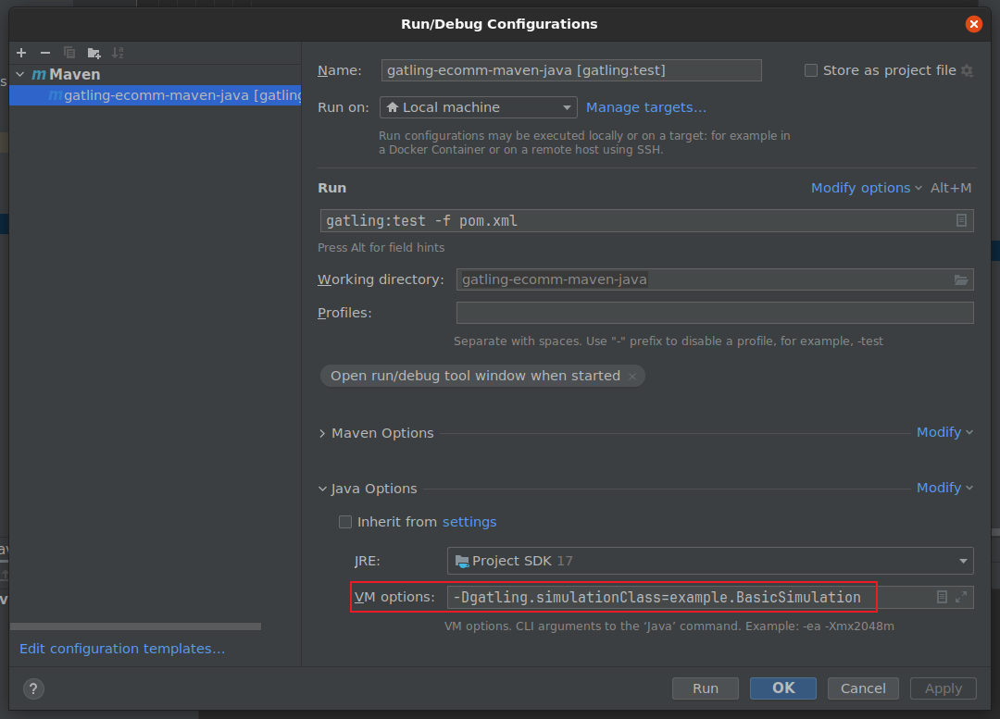

## 介绍

**Gatling 压力测试工具**是一款基于 Scala 开发的高性能开源负载测试工具，专为模拟高并发场景设计，广泛用于测试 Web 应用、API、微服务及其他分布式系统的性能和稳定性。

------

**核心功能与特点**

1. 高性能与高并发支持
   - 基于 Akka 框架和 Netty 网络库，支持每秒数万次请求的模拟，适用于高并发场景。
   - 异步非阻塞 I/O 模型，资源消耗低，适合长时间运行的压力测试。
2. 灵活的脚本编写
   - 使用 DSL（领域特定语言）编写测试脚本，语法简洁且功能强大。
   - 支持参数化测试、动态数据驱动（如 CSV 文件）、条件逻辑和复杂场景编排。
3. 实时监控与报告
   - 提供基于 HTML 的动态报告，实时展示请求响应时间、吞吐量、错误率等关键指标。
   - 支持历史数据对比和趋势分析，便于定位性能瓶颈。
4. 分布式测试
   - 支持多节点分布式部署，可模拟更大规模的并发用户。
   - 通过主从模式协调测试任务，扩展性强。
5. 协议支持
   - 默认支持 HTTP/HTTPS 协议，适用于 Web 应用和 RESTful API 测试。
   - 提供插件机制，可扩展支持其他协议（如 WebSocket、gRPC、Kafka 等）。
6. 集成与自动化
   - 支持与 Jenkins、GitLab CI/CD 等持续集成工具集成，实现自动化测试。
   - 可与 Selenium 等工具结合，进行端到端性能测试。

------

**使用场景**

- **Web 应用性能测试**：模拟高并发用户访问，测试系统在高负载下的响应时间和稳定性。
- **API 性能测试**：验证 RESTful API 的吞吐量和错误率，确保接口在高并发场景下的可靠性。
- **微服务架构测试**：测试微服务之间的调用链性能，定位服务间的性能瓶颈。
- **限时活动压力测试**：模拟秒杀、抢购等高并发场景，确保系统能够承受极端流量。

------

**安装与配置**

1. 下载与安装

   - 从 [Gatling 官方网站](https://gatling.io/) 下载最新版本。
   - 解压后配置 `JAVA_HOME` 环境变量（Gatling 基于 Java 运行）。

2. 编写测试脚本

   - 使用 Scala 编写测试脚本，定义用户行为、请求逻辑和测试场景。

   - 示例脚本：

     ```scala
     import io.gatling.core.Predef._
     import io.gatling.http.Predef._
     import scala.concurrent.duration._
      
     class MySimulation extends Simulation {
       val httpProtocol = http
         .baseUrl("https://example.com")
         .acceptHeader("application/json")
      
       val scn = scenario("Test Scenario")
         .exec(http("Request_1")
           .get("/api/resource"))
         .pause(1)
      
       setUp(
         scn.inject(atOnceUsers(100)) // 模拟 100 个并发用户
       ).protocols(httpProtocol)
     }
     ```

3. 运行测试

   - 将脚本放置在 `user-files/simulations` 目录下。
   - 执行 `gatling.sh`（Linux/Mac）或 `gatling.bat`（Windows）运行测试。

4. 查看报告

   - 测试完成后，生成 HTML 格式的报告，存储在 `results` 目录下。

------

**优势与适用性**

- 优势：
  - 性能卓越，适合大规模并发测试。
  - 脚本灵活，易于编写和维护。
  - 报告直观，便于分析测试结果。
- 适用性：
  - 适合需要高并发测试的场景，如电商大促、API 性能验证等。
  - 对于需要长时间运行的压力测试（如 7×24 小时稳定性测试），Gatling 的资源消耗较低，表现出色。

------

**与其他工具对比**

- 与 JMeter 对比：
  - Gatling 基于代码编写脚本，灵活性更高；JMeter 使用 GUI 界面，适合不熟悉编程的用户。
  - Gatling 性能更强，适合高并发场景；JMeter 在低并发场景下更易用。
- 与 Locust 对比：
  - Gatling 使用 Scala 编写，Locust 使用 Python 编写，选择取决于团队技术栈。
  - Gatling 的报告功能更强大，Locust 的分布式支持更简单。

------

**总结**

Gatling 是一款功能强大、性能卓越的负载测试工具，特别适合高并发场景下的性能测试。其基于代码的脚本编写方式、实时监控和分布式测试能力，使其成为现代性能测试的首选工具之一。无论是 Web 应用、API 还是微服务，Gatling 都能提供可靠的测试支持。

------

## Simulation 详解

**Simulation（模拟）**是 Gatling 测试脚本的核心类，每个测试脚本都必须继承 `Simulation` 类。Simulation 类定义了完整的性能测试用例，包括测试场景、用户行为、负载策略等所有测试要素。

### Simulation 的基本结构

一个典型的 Simulation 类包含以下三个核心组成部分：

1. **协议配置**（`httpProtocol`）
   
   协议配置定义了 HTTP/HTTPS 请求的基础设置，包括：
   - **基础 URL**（`baseUrl`）：所有请求的默认基础地址
   - **请求头**（`acceptHeader`、`contentTypeHeader` 等）：默认的 HTTP 请求头
   - **超时设置**：连接超时、读取超时等
   - **认证信息**：如 Basic Auth、Bearer Token 等
   - **代理配置**：如需要代理服务器时的配置
   
   示例：
   ```scala
   val httpProtocol = http
     .baseUrl("https://example.com")
     .acceptHeader("application/json")
     .contentTypeHeader("application/json")
     .authorizationHeader("Bearer token123")
   ```

2. **场景定义**（`scenario`）
   
   场景定义了虚拟用户的行为流程，描述了用户从开始到结束的完整操作序列：
   - **HTTP 请求**：GET、POST、PUT、DELETE 等各类请求
   - **等待时间**（`pause`）：模拟用户思考时间或操作间隔
   - **条件判断**：根据响应结果决定下一步操作
   - **数据提取**：从响应中提取数据供后续请求使用
   - **循环和分支**：支持复杂的业务逻辑
   
   示例：
   ```scala
   val scn = scenario("用户登录流程")
     .exec(http("访问首页")
       .get("/"))
     .pause(2)
     .exec(http("用户登录")
       .post("/api/login")
       .body(StringBody("""{"username":"user","password":"pass"}""")))
     .pause(1)
     .exec(http("获取用户信息")
       .get("/api/user/profile"))
   ```

3. **负载注入策略**（`setUp`）
   
   负载注入策略定义了如何模拟并发用户，控制测试的负载模式：
   - **一次性注入**（`atOnceUsers`）：同时启动指定数量的用户
   - **逐步增加**（`rampUsers`）：在指定时间内逐步增加到目标用户数
   - **恒定用户数**（`constantUsersPerSec`）：保持恒定的每秒用户数
   - **阶段式负载**：可以组合多种策略，模拟复杂的负载曲线
   
   示例：
   ```scala
   setUp(
     scn.inject(
       nothingFor(4.seconds),           // 等待 4 秒
       atOnceUsers(10),                 // 立即启动 10 个用户
       rampUsers(50).during(30.seconds), // 30 秒内逐步增加到 50 个用户
       constantUsersPerSec(20).during(60.seconds) // 保持每秒 20 个用户，持续 60 秒
     )
   ).protocols(httpProtocol)
   ```

### Simulation 的执行流程

当 Gatling 运行一个 Simulation 时，执行流程如下：

1. **初始化阶段**：加载 Simulation 类，解析协议配置和场景定义
2. **用户注入阶段**：根据 `setUp` 中定义的负载策略，按时间表启动虚拟用户
3. **场景执行阶段**：每个虚拟用户独立执行场景中定义的操作序列
4. **数据收集阶段**：实时收集每个请求的响应时间、状态码、错误信息等指标
5. **报告生成阶段**：测试结束后，生成 HTML 格式的详细报告

### Simulation 的优势

- **类型安全**：基于 Scala 的强类型系统，编译时即可发现错误
- **代码复用**：可以将协议配置、场景片段等封装为可复用的组件
- **灵活编排**：支持复杂的场景组合和负载策略，满足各种测试需求
- **易于维护**：代码化的测试脚本便于版本控制和团队协作

### 多个 Simulation 的管理

在一个 Gatling 项目中，可以创建多个 Simulation 类，每个类代表不同的测试场景。Gatling 运行时会列出所有可用的 Simulation，用户可以选择执行特定的测试用例。这种设计使得测试用例的管理更加清晰和模块化。

**使用多个 Simulation 的典型场景示例：**

假设你正在测试一个电商系统，可以根据不同的业务场景和测试目标创建多个 Simulation：

1. **`UserLoginSimulation.scala`** - 用户登录场景测试
   - 测试目标：验证登录接口在高并发下的性能
   - 场景：模拟大量用户同时登录
   - 负载策略：短时间内快速增加并发用户数

2. **`ProductBrowseSimulation.scala`** - 商品浏览场景测试
   - 测试目标：测试商品列表和详情页的响应时间
   - 场景：模拟用户浏览商品、查看详情、搜索商品
   - 负载策略：持续稳定的用户访问量

3. **`OrderPlacementSimulation.scala`** - 下单场景测试
   - 测试目标：测试下单流程在高峰期的稳定性
   - 场景：模拟完整的下单流程（加购物车、结算、支付）
   - 负载策略：模拟秒杀场景，短时间内大量用户下单

4. **`APILoadSimulation.scala`** - API 接口压力测试
   - 测试目标：测试各个 API 接口的吞吐量和错误率
   - 场景：针对特定 API 接口进行压力测试
   - 负载策略：逐步增加负载，找到性能瓶颈

5. **`MixedWorkloadSimulation.scala`** - 混合负载测试
   - 测试目标：模拟真实的生产环境负载
   - 场景：同时模拟多种用户行为（浏览、搜索、下单等）
   - 负载策略：按照真实用户行为比例分配负载

**使用多个 Simulation 的优势：**

- **职责分离**：每个 Simulation 专注于特定的测试场景，代码更清晰
- **灵活执行**：可以根据需要选择执行特定的测试场景，无需运行全部测试
- **并行开发**：团队成员可以并行开发不同的 Simulation
- **易于维护**：当某个业务场景发生变化时，只需修改对应的 Simulation
- **报告独立**：每个 Simulation 生成独立的测试报告，便于对比和分析

运行 Gatling 时，可以通过命令行参数或交互式菜单选择要执行的 Simulation，实现精准的测试执行。

------

## Scenario 详解

**Scenario（场景）**是 Gatling 中定义虚拟用户行为流程的核心组件。一个 Scenario 描述了一个虚拟用户从开始到结束的完整操作序列，包括发送 HTTP 请求、等待时间、条件判断、数据提取等操作。每个 Simulation 可以包含一个或多个 Scenario，通过 `setUp` 方法将 Scenario 与负载注入策略结合，形成完整的性能测试用例。

### Scenario 的基本概念

Scenario 的核心作用是**定义用户行为**。它通过链式调用的方式，将多个操作（Action）串联起来，形成一个完整的用户操作流程。每个虚拟用户在测试执行时，都会独立地按照 Scenario 中定义的步骤执行操作。

### Scenario 的组成元素

一个 Scenario 通常包含以下类型的操作：

1. **HTTP 请求操作**（`http`）
   
   这是 Scenario 中最常用的操作，用于发送 HTTP 请求：
   - **GET 请求**：获取资源
   - **POST 请求**：创建资源或提交数据
   - **PUT 请求**：更新资源
   - **DELETE 请求**：删除资源
   - **PATCH 请求**：部分更新资源
   
   示例：
   ```scala
   .exec(http("获取商品列表")
     .get("/api/products")
     .queryParam("page", "1")
     .queryParam("size", "20"))
   .exec(http("创建订单")
     .post("/api/orders")
     .body(StringBody("""{"productId":123,"quantity":2}""")))
   ```

2. **等待操作**（`pause`）
   
   用于模拟用户思考时间或操作间隔，使测试更接近真实用户行为：
   - **固定等待时间**：`pause(5)` - 等待 5 秒
   - **随机等待时间**：`pause(2, 5)` - 随机等待 2-5 秒
   - **基于分布函数的等待**：可以使用指数分布、正态分布等
   
   示例：
   ```scala
   .pause(2)                    // 固定等待 2 秒
   .pause(1, 3)                 // 随机等待 1-3 秒
   .pause(5.seconds)            // 使用 Duration 类型
   ```

3. **条件判断**（`doIf`、`doIfOrElse`）
   
   根据条件决定是否执行某些操作，支持复杂的业务逻辑：
   - **`doIf`**：条件为真时执行
   - **`doIfOrElse`**：条件分支，类似 if-else
   - **`doSwitch`**：多分支选择，类似 switch-case
   
   示例：
   ```scala
   .doIf(session => session("status").as[String] == "success") {
     exec(http("获取详细信息").get("/api/details"))
   }
   .doIfOrElse(session => session("userType").as[String] == "vip") {
     exec(http("VIP 专属接口").get("/api/vip"))
   } {
     exec(http("普通用户接口").get("/api/normal"))
   }
   ```

4. **数据提取**（`check`）
   
   从 HTTP 响应中提取数据，存储在 Session 中供后续请求使用：
   - **提取 JSON 字段**：`jsonPath("$.userId")`
   - **提取响应头**：`header("Authorization")`
   - **提取 Cookie**：`cookie("sessionId")`
   - **提取状态码**：`status`
   - **正则表达式提取**：`regex("""id=(\d+)""")`
   
   示例：
   ```scala
   .exec(http("用户登录")
     .post("/api/login")
     .body(StringBody("""{"username":"user","password":"pass"}"""))
     .check(
       status.is(200),
       jsonPath("$.token").saveAs("authToken"),
       jsonPath("$.userId").saveAs("userId")
     ))
   .exec(http("使用 Token 访问")
     .get("/api/user/profile")
     .header("Authorization", "${authToken}"))
   ```

5. **循环操作**（`repeat`、`foreach`）
   
   支持重复执行某些操作：
   - **`repeat`**：固定次数循环
   - **`foreach`**：遍历集合
   - **`during`**：在指定时间内循环
   - **`asLongAs`**：条件满足时循环
   
   示例：
   ```scala
   .repeat(5) {
     exec(http("浏览商品").get("/api/products/${productId}"))
       .pause(1)
   }
   .foreach(Seq("1", "2", "3"), "productId") {
     exec(http("查看商品详情").get("/api/products/${productId}"))
   }
   ```

6. **错误处理**（`tryMax`、`exitHereIfFailed`）
   
   处理请求失败的情况：
   - **`tryMax`**：重试机制，失败时重试指定次数
   - **`exitHereIfFailed`**：失败时退出当前 Scenario
   
   示例：
   ```scala
   .tryMax(3) {
     exec(http("关键操作").get("/api/critical"))
   }
   .exitHereIfFailed
   ```

### Scenario 的链式调用

Scenario 使用链式调用的方式组合多个操作，每个操作返回一个新的 Scenario 对象，可以继续链式调用下一个操作：

```scala
val scn = scenario("完整的用户流程")
  .exec(http("步骤1").get("/api/step1"))      // 第一个操作
  .pause(1)                                    // 第二个操作
  .exec(http("步骤2").post("/api/step2"))     // 第三个操作
  .pause(2)                                    // 第四个操作
  .exec(http("步骤3").get("/api/step3"))      // 第五个操作
```

### 多个 Scenario 的组合

在一个 Simulation 中，可以定义多个 Scenario，并通过 `setUp` 方法同时执行它们：

```scala
val scn1 = scenario("场景1：浏览商品")
  .exec(http("商品列表").get("/api/products"))
  .pause(2)
  .exec(http("商品详情").get("/api/products/1"))

val scn2 = scenario("场景2：用户登录")
  .exec(http("登录").post("/api/login"))
  .pause(1)
  .exec(http("用户信息").get("/api/user"))

setUp(
  scn1.inject(rampUsers(100).during(60.seconds)),
  scn2.inject(rampUsers(50).during(60.seconds))
).protocols(httpProtocol)
```

### Scenario 的高级特性

1. **Session 管理**
   
   Session 是每个虚拟用户的上下文，存储了用户的状态和数据：
   - 每个虚拟用户都有独立的 Session
   - 可以通过 `saveAs` 保存数据到 Session
   - 可以通过 `${variableName}` 从 Session 中读取数据
   - Session 在整个 Scenario 执行过程中保持

2. **数据驱动测试**
   
   Scenario 支持从外部数据源（如 CSV 文件）读取数据：
   ```scala
   val csvFeeder = csv("users.csv").random
   
   val scn = scenario("数据驱动测试")
     .feed(csvFeeder)
     .exec(http("使用 CSV 数据")
       .get("/api/users/${userId}")
       .header("Authorization", "${token}"))
   ```

3. **场景分组和复用**
   
   可以将常用的操作序列封装为可复用的链，然后在多个 Scenario 中复用：
   ```scala
   val loginChain = exec(http("登录").post("/api/login"))
     .pause(1)
     .exec(http("获取用户信息").get("/api/user"))
   
   val scn1 = scenario("场景1")
     .exec(loginChain)
     .exec(http("其他操作").get("/api/other"))
   
   val scn2 = scenario("场景2")
     .exec(loginChain)
     .exec(http("不同操作").get("/api/different"))
   ```

### Scenario 的最佳实践

1. **命名清晰**：为每个 HTTP 请求和 Scenario 使用有意义的名称，便于在报告中识别
2. **合理使用 pause**：添加适当的等待时间，模拟真实用户行为
3. **错误处理**：对关键操作添加错误处理机制，避免测试因单个请求失败而中断
4. **数据提取和验证**：提取关键数据并验证响应，确保测试的有效性
5. **模块化设计**：将复杂的 Scenario 拆分为多个可复用的链，提高代码可维护性
6. **性能考虑**：避免在 Scenario 中使用阻塞操作，充分利用 Gatling 的异步特性

------

## 基于Java Maven项目

1. 配置maven模板项目

   >提示：Kotlin、Scala语言参考：https://docs.gatling.io/tutorials/test-as-code/java-jvm/installation-guide/#alternative-kotlin-and-scala-starters

   方法1：下载模板项目

   ```sh
   # 下载https://github.com/gatling/gatling-maven-plugin-demo-java/archive/refs/heads/main.zip
   # 安装maven依赖
   ./mvnw clean install
   ```

   方法2：使用git克隆

   ```sh
   git clone https://github.com/gatling/gatling-maven-plugin-demo-java.git
   cd gatling-maven-plugin-demo-java
   # 安装maven依赖
   ./mvnw clean install
   ```

2. 运行模板项目中的测试

   ```sh
   ./mvnw gatling:test -Dgatling.simulationClass=example.BasicSimulation
   ```

3. 使用IDEA断点调试

   - 使用IDEA打开模板项目

   - 配置io.gatling:gatling-maven-plugin插件支持调试

     ```xml
     <plugin>
         <groupId>io.gatling</groupId>
         <artifactId>gatling-maven-plugin</artifactId>
         <version>${gatling-maven-plugin.version}</version>
         <configuration>
             <!-- 下面配置支持断点调试 -->
             <jvmArgs>
                 <arg>-Xdebug</arg>
                 <arg>-Xrunjdwp:transport=dt_socket,server=y,suspend=y,address=5005</arg>
             </jvmArgs>
         </configuration>
     </plugin>
     ```

   - 配置以IDEA启动调试gatling测试

     

     右键点击图片中的gatling:test，点击Debug，运行后再编辑Debug配置添加-Dgatling.simulationClass=example.BasicSimulation

     

     在代码中打断点再次运行Debug配置就可以调试了。

------

## Logback 日志配置

Gatling 使用 Logback 作为日志框架，可以通过配置文件控制日志输出级别和格式，便于调试和监控测试执行过程。

### 配置文件位置

在 Maven 项目中，Logback 配置文件应放置在 `src/test/resources/` 目录下，文件名为 `logback-test.xml`。

### 基本配置示例

```xml
<?xml version="1.0" encoding="UTF-8"?>
<configuration>

	<appender name="CONSOLE" class="ch.qos.logback.core.ConsoleAppender">
		<encoder>
			<pattern>%d{HH:mm:ss.SSS} [%-5level] %logger{15} - %msg%n%rEx</pattern>
		</encoder>
		<immediateFlush>false</immediateFlush>
	</appender>

	<!-- 取消注释并设置为 DEBUG 以记录所有失败的 HTTP 请求 -->
	<!-- 取消注释并设置为 TRACE 以记录所有 HTTP 请求 -->
	<!--<logger name="io.gatling.http.engine.response" level="TRACE" />-->

	<root level="WARN">
		<appender-ref ref="CONSOLE" />
	</root>

</configuration>
```

### 配置说明

1. **Appender（输出器）**
   - `CONSOLE`：将日志输出到控制台
   - `pattern`：定义日志输出格式，包括时间、日志级别、类名、消息等
   - `immediateFlush`：设置为 `false` 可提高性能，减少 I/O 操作

2. **Logger（日志记录器）**
   - `io.gatling.http.engine.response`：Gatling HTTP 引擎的响应日志
     - 设置为 `DEBUG`：仅记录失败的 HTTP 请求
     - 设置为 `TRACE`：记录所有 HTTP 请求（包括请求和响应详情）
   - 可根据需要配置其他特定包的日志级别

3. **Root Logger（根日志记录器）**
   - `level="WARN"`：默认日志级别为 WARN，只输出警告和错误信息
   - 可根据需要调整为 `INFO`、`DEBUG` 或 `TRACE`

### 在代码中使用 Logback

在 Simulation 类中使用 SLF4J 的 Logger 接口记录日志：

```java
import org.slf4j.Logger;
import org.slf4j.LoggerFactory;

public class BasicSimulation extends Simulation {
  
  // 初始化 Logger
  private static final Logger logger = LoggerFactory.getLogger(BasicSimulation.class);
  
  static {
    logger.info("初始化 Simulation");
    logger.debug("调试信息：这是调试日志");
    logger.warn("警告信息：这是警告日志");
  }
  
  private static final ScenarioBuilder scenario = scenario("测试场景")
      .exec(session -> {
        logger.info("执行场景：用户 {}", session.userId());
        return session;
      })
      .exec(http("请求").get("/api/resource")
          .check(status().is(200))
          .check(bodyString().saveAs("responseBody"))
      )
      .exec(session -> {
        logger.debug("响应内容：{}", session.getString("responseBody"));
        return session;
      });
}
```

### 常用日志级别

- **ERROR**：错误信息，表示严重问题
- **WARN**：警告信息，表示潜在问题
- **INFO**：一般信息，记录重要的执行流程
- **DEBUG**：调试信息，记录详细的执行细节
- **TRACE**：跟踪信息，记录最详细的执行过程（包括所有 HTTP 请求和响应）

### 调试建议

1. **开发阶段**：将 root level 设置为 `INFO` 或 `DEBUG`，便于查看测试执行过程
2. **性能测试阶段**：将 root level 设置为 `WARN`，减少日志输出对性能的影响
3. **问题排查**：临时启用 `io.gatling.http.engine.response` 的 `TRACE` 级别，查看详细的 HTTP 请求和响应信息
4. **生产环境**：保持 `WARN` 级别，只记录重要警告和错误

------

## 综合示例

具体用法请参考本站示例：https://gitee.com/dexterleslie/demonstration/tree/main/demo-benchmark/demo-gatling-java

运行示例需要先运行https://gitee.com/dexterleslie/demonstration/tree/main/demo-benchmark/demo-spring-boot-benchmark示例作为接口服务辅助测试。