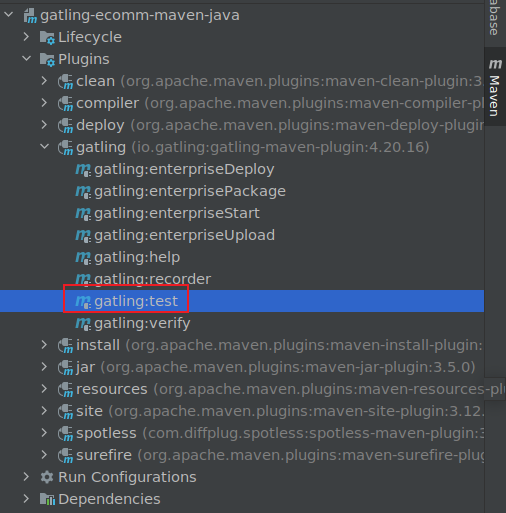
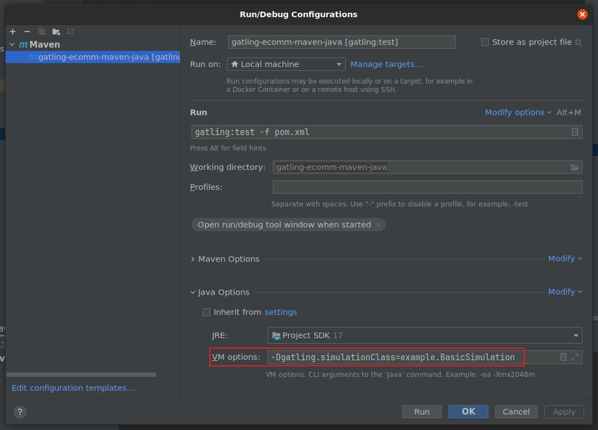

## 介绍

**Gatling 压力测试工具**是一款基于 Scala 开发的高性能开源负载测试工具，专为模拟高并发场景设计，广泛用于测试 Web 应用、API、微服务及其他分布式系统的性能和稳定性。

------

**核心功能与特点**

1. 高性能与高并发支持
   - 基于 Akka 框架和 Netty 网络库，支持每秒数万次请求的模拟，适用于高并发场景。
   - 异步非阻塞 I/O 模型，资源消耗低，适合长时间运行的压力测试。
2. 灵活的脚本编写
   - 使用 DSL（领域特定语言）编写测试脚本，语法简洁且功能强大。
   - 支持参数化测试、动态数据驱动（如 CSV 文件）、条件逻辑和复杂场景编排。
3. 实时监控与报告
   - 提供基于 HTML 的动态报告，实时展示请求响应时间、吞吐量、错误率等关键指标。
   - 支持历史数据对比和趋势分析，便于定位性能瓶颈。
4. 分布式测试
   - 支持多节点分布式部署，可模拟更大规模的并发用户。
   - 通过主从模式协调测试任务，扩展性强。
5. 协议支持
   - 默认支持 HTTP/HTTPS 协议，适用于 Web 应用和 RESTful API 测试。
   - 提供插件机制，可扩展支持其他协议（如 WebSocket、gRPC、Kafka 等）。
6. 集成与自动化
   - 支持与 Jenkins、GitLab CI/CD 等持续集成工具集成，实现自动化测试。
   - 可与 Selenium 等工具结合，进行端到端性能测试。

------

**使用场景**

- **Web 应用性能测试**：模拟高并发用户访问，测试系统在高负载下的响应时间和稳定性。
- **API 性能测试**：验证 RESTful API 的吞吐量和错误率，确保接口在高并发场景下的可靠性。
- **微服务架构测试**：测试微服务之间的调用链性能，定位服务间的性能瓶颈。
- **限时活动压力测试**：模拟秒杀、抢购等高并发场景，确保系统能够承受极端流量。

------

**安装与配置**

1. 下载与安装

   - 从 [Gatling 官方网站](https://gatling.io/) 下载最新版本。
   - 解压后配置 `JAVA_HOME` 环境变量（Gatling 基于 Java 运行）。

2. 编写测试脚本

   - 使用 Scala 编写测试脚本，定义用户行为、请求逻辑和测试场景。

   - 示例脚本：

     ```scala
     import io.gatling.core.Predef._
     import io.gatling.http.Predef._
     import scala.concurrent.duration._
      
     class MySimulation extends Simulation {
       val httpProtocol = http
         .baseUrl("https://example.com")
         .acceptHeader("application/json")
      
       val scn = scenario("Test Scenario")
         .exec(http("Request_1")
           .get("/api/resource"))
         .pause(1)
      
       setUp(
         scn.inject(atOnceUsers(100)) // 模拟 100 个并发用户
       ).protocols(httpProtocol)
     }
     ```

3. 运行测试

   - 将脚本放置在 `user-files/simulations` 目录下。
   - 执行 `gatling.sh`（Linux/Mac）或 `gatling.bat`（Windows）运行测试。

4. 查看报告

   - 测试完成后，生成 HTML 格式的报告，存储在 `results` 目录下。

------

**优势与适用性**

- 优势：
  - 性能卓越，适合大规模并发测试。
  - 脚本灵活，易于编写和维护。
  - 报告直观，便于分析测试结果。
- 适用性：
  - 适合需要高并发测试的场景，如电商大促、API 性能验证等。
  - 对于需要长时间运行的压力测试（如 7×24 小时稳定性测试），Gatling 的资源消耗较低，表现出色。

------

**与其他工具对比**

- 与 JMeter 对比：
  - Gatling 基于代码编写脚本，灵活性更高；JMeter 使用 GUI 界面，适合不熟悉编程的用户。
  - Gatling 性能更强，适合高并发场景；JMeter 在低并发场景下更易用。
- 与 Locust 对比：
  - Gatling 使用 Scala 编写，Locust 使用 Python 编写，选择取决于团队技术栈。
  - Gatling 的报告功能更强大，Locust 的分布式支持更简单。

------

**总结**

Gatling 是一款功能强大、性能卓越的负载测试工具，特别适合高并发场景下的性能测试。其基于代码的脚本编写方式、实时监控和分布式测试能力，使其成为现代性能测试的首选工具之一。无论是 Web 应用、API 还是微服务，Gatling 都能提供可靠的测试支持。

------

## Simulation 详解

**Simulation（模拟）**是 Gatling 测试脚本的核心类，每个测试脚本都必须继承 `Simulation` 类。Simulation 类定义了完整的性能测试用例，包括测试场景、用户行为、负载策略等所有测试要素。

### Simulation 的基本结构

一个典型的 Simulation 类包含以下三个核心组成部分：

1. **协议配置**（`httpProtocol`）
   
   协议配置定义了 HTTP/HTTPS 请求的基础设置，包括：
   - **基础 URL**（`baseUrl`）：所有请求的默认基础地址
   - **请求头**（`acceptHeader`、`contentTypeHeader` 等）：默认的 HTTP 请求头
   - **超时设置**：连接超时、读取超时等
   - **认证信息**：如 Basic Auth、Bearer Token 等
   - **代理配置**：如需要代理服务器时的配置
   
   示例：
   ```scala
   val httpProtocol = http
     .baseUrl("https://example.com")
     .acceptHeader("application/json")
     .contentTypeHeader("application/json")
     .authorizationHeader("Bearer token123")
   ```

2. **场景定义**（`scenario`）
   
   场景定义了虚拟用户的行为流程，描述了用户从开始到结束的完整操作序列：
   - **HTTP 请求**：GET、POST、PUT、DELETE 等各类请求
   - **等待时间**（`pause`）：模拟用户思考时间或操作间隔
   - **条件判断**：根据响应结果决定下一步操作
   - **数据提取**：从响应中提取数据供后续请求使用
   - **循环和分支**：支持复杂的业务逻辑
   
   示例：
   ```scala
   val scn = scenario("用户登录流程")
     .exec(http("访问首页")
       .get("/"))
     .pause(2)
     .exec(http("用户登录")
       .post("/api/login")
       .body(StringBody("""{"username":"user","password":"pass"}""")))
     .pause(1)
     .exec(http("获取用户信息")
       .get("/api/user/profile"))
   ```

3. **负载注入策略**（`setUp`）
   
   负载注入策略定义了如何模拟并发用户，控制测试的负载模式：
   - **一次性注入**（`atOnceUsers`）：同时启动指定数量的用户
   - **逐步增加**（`rampUsers`）：在指定时间内逐步增加到目标用户数
   - **恒定用户数**（`constantUsersPerSec`）：保持恒定的每秒用户数
   - **阶段式负载**：可以组合多种策略，模拟复杂的负载曲线
   
   示例：
   ```scala
   setUp(
     scn.inject(
       nothingFor(4.seconds),           // 等待 4 秒
       atOnceUsers(10),                 // 立即启动 10 个用户
       rampUsers(50).during(30.seconds), // 30 秒内逐步增加到 50 个用户
       constantUsersPerSec(20).during(60.seconds) // 保持每秒 20 个用户，持续 60 秒
     )
   ).protocols(httpProtocol)
   ```

### Simulation 的执行流程

当 Gatling 运行一个 Simulation 时，执行流程如下：

1. **初始化阶段**：加载 Simulation 类，解析协议配置和场景定义
2. **用户注入阶段**：根据 `setUp` 中定义的负载策略，按时间表启动虚拟用户
3. **场景执行阶段**：每个虚拟用户独立执行场景中定义的操作序列
4. **数据收集阶段**：实时收集每个请求的响应时间、状态码、错误信息等指标
5. **报告生成阶段**：测试结束后，生成 HTML 格式的详细报告

### Simulation 的优势

- **类型安全**：基于 Scala 的强类型系统，编译时即可发现错误
- **代码复用**：可以将协议配置、场景片段等封装为可复用的组件
- **灵活编排**：支持复杂的场景组合和负载策略，满足各种测试需求
- **易于维护**：代码化的测试脚本便于版本控制和团队协作

### 多个 Simulation 的管理

在一个 Gatling 项目中，可以创建多个 Simulation 类，每个类代表不同的测试场景。Gatling 运行时会列出所有可用的 Simulation，用户可以选择执行特定的测试用例。这种设计使得测试用例的管理更加清晰和模块化。

**使用多个 Simulation 的典型场景示例：**

假设你正在测试一个电商系统，可以根据不同的业务场景和测试目标创建多个 Simulation：

1. **`UserLoginSimulation.scala`** - 用户登录场景测试
   - 测试目标：验证登录接口在高并发下的性能
   - 场景：模拟大量用户同时登录
   - 负载策略：短时间内快速增加并发用户数

2. **`ProductBrowseSimulation.scala`** - 商品浏览场景测试
   - 测试目标：测试商品列表和详情页的响应时间
   - 场景：模拟用户浏览商品、查看详情、搜索商品
   - 负载策略：持续稳定的用户访问量

3. **`OrderPlacementSimulation.scala`** - 下单场景测试
   - 测试目标：测试下单流程在高峰期的稳定性
   - 场景：模拟完整的下单流程（加购物车、结算、支付）
   - 负载策略：模拟秒杀场景，短时间内大量用户下单

4. **`APILoadSimulation.scala`** - API 接口压力测试
   - 测试目标：测试各个 API 接口的吞吐量和错误率
   - 场景：针对特定 API 接口进行压力测试
   - 负载策略：逐步增加负载，找到性能瓶颈

5. **`MixedWorkloadSimulation.scala`** - 混合负载测试
   - 测试目标：模拟真实的生产环境负载
   - 场景：同时模拟多种用户行为（浏览、搜索、下单等）
   - 负载策略：按照真实用户行为比例分配负载

**使用多个 Simulation 的优势：**

- **职责分离**：每个 Simulation 专注于特定的测试场景，代码更清晰
- **灵活执行**：可以根据需要选择执行特定的测试场景，无需运行全部测试
- **并行开发**：团队成员可以并行开发不同的 Simulation
- **易于维护**：当某个业务场景发生变化时，只需修改对应的 Simulation
- **报告独立**：每个 Simulation 生成独立的测试报告，便于对比和分析

运行 Gatling 时，可以通过命令行参数或交互式菜单选择要执行的 Simulation，实现精准的测试执行。

------

## Scenario 详解

**Scenario（场景）**是 Gatling 中定义虚拟用户行为流程的核心组件。一个 Scenario 描述了一个虚拟用户从开始到结束的完整操作序列，包括发送 HTTP 请求、等待时间、条件判断、数据提取等操作。每个 Simulation 可以包含一个或多个 Scenario，通过 `setUp` 方法将 Scenario 与负载注入策略结合，形成完整的性能测试用例。

### Scenario 的基本概念

Scenario 的核心作用是**定义用户行为**。它通过链式调用的方式，将多个操作（Action）串联起来，形成一个完整的用户操作流程。每个虚拟用户在测试执行时，都会独立地按照 Scenario 中定义的步骤执行操作。

### Scenario 的组成元素

一个 Scenario 通常包含以下类型的操作：

1. **HTTP 请求操作**（`http`）
   
   这是 Scenario 中最常用的操作，用于发送 HTTP 请求：
   - **GET 请求**：获取资源
   - **POST 请求**：创建资源或提交数据
   - **PUT 请求**：更新资源
   - **DELETE 请求**：删除资源
   - **PATCH 请求**：部分更新资源
   
   示例：
   ```scala
   .exec(http("获取商品列表")
     .get("/api/products")
     .queryParam("page", "1")
     .queryParam("size", "20"))
   .exec(http("创建订单")
     .post("/api/orders")
     .body(StringBody("""{"productId":123,"quantity":2}""")))
   ```

2. **等待操作**（`pause`）
   
   用于模拟用户思考时间或操作间隔，使测试更接近真实用户行为：
   - **固定等待时间**：`pause(5)` - 等待 5 秒
   - **随机等待时间**：`pause(2, 5)` - 随机等待 2-5 秒
   - **基于分布函数的等待**：可以使用指数分布、正态分布等
   
   示例：
   ```scala
   .pause(2)                    // 固定等待 2 秒
   .pause(1, 3)                 // 随机等待 1-3 秒
   .pause(5.seconds)            // 使用 Duration 类型
   ```

3. **条件判断**（`doIf`、`doIfOrElse`）
   
   根据条件决定是否执行某些操作，支持复杂的业务逻辑：
   - **`doIf`**：条件为真时执行
   - **`doIfOrElse`**：条件分支，类似 if-else
   - **`doSwitch`**：多分支选择，类似 switch-case
   
   示例：
   ```scala
   .doIf(session => session("status").as[String] == "success") {
     exec(http("获取详细信息").get("/api/details"))
   }
   .doIfOrElse(session => session("userType").as[String] == "vip") {
     exec(http("VIP 专属接口").get("/api/vip"))
   } {
     exec(http("普通用户接口").get("/api/normal"))
   }
   ```

4. **数据提取**（`check`）
   
   从 HTTP 响应中提取数据，存储在 Session 中供后续请求使用：
   - **提取 JSON 字段**：`jsonPath("$.userId")`
   - **提取响应头**：`header("Authorization")`
   - **提取 Cookie**：`cookie("sessionId")`
   - **提取状态码**：`status`
   - **正则表达式提取**：`regex("""id=(\d+)""")`
   
   示例：
   ```scala
   .exec(http("用户登录")
     .post("/api/login")
     .body(StringBody("""{"username":"user","password":"pass"}"""))
     .check(
       status.is(200),
       jsonPath("$.token").saveAs("authToken"),
       jsonPath("$.userId").saveAs("userId")
     ))
   .exec(http("使用 Token 访问")
     .get("/api/user/profile")
     .header("Authorization", "${authToken}"))
   ```

5. **循环操作**（`repeat`、`foreach`）
   
   支持重复执行某些操作：
   - **`repeat`**：固定次数循环
   - **`foreach`**：遍历集合
   - **`during`**：在指定时间内循环
   - **`asLongAs`**：条件满足时循环
   
   示例：
   ```scala
   .repeat(5) {
     exec(http("浏览商品").get("/api/products/${productId}"))
       .pause(1)
   }
   .foreach(Seq("1", "2", "3"), "productId") {
     exec(http("查看商品详情").get("/api/products/${productId}"))
   }
   ```

6. **错误处理**（`tryMax`、`exitHereIfFailed`）
   
   处理请求失败的情况：
   - **`tryMax`**：重试机制，失败时重试指定次数
   - **`exitHereIfFailed`**：失败时退出当前 Scenario
   
   示例：
   ```scala
   .tryMax(3) {
     exec(http("关键操作").get("/api/critical"))
   }
   .exitHereIfFailed
   ```

### Scenario 的链式调用

Scenario 使用链式调用的方式组合多个操作，每个操作返回一个新的 Scenario 对象，可以继续链式调用下一个操作：

```scala
val scn = scenario("完整的用户流程")
  .exec(http("步骤1").get("/api/step1"))      // 第一个操作
  .pause(1)                                    // 第二个操作
  .exec(http("步骤2").post("/api/step2"))     // 第三个操作
  .pause(2)                                    // 第四个操作
  .exec(http("步骤3").get("/api/step3"))      // 第五个操作
```

### 多个 Scenario 的组合

在一个 Simulation 中，可以定义多个 Scenario，并通过 `setUp` 方法同时执行它们：

```scala
val scn1 = scenario("场景1：浏览商品")
  .exec(http("商品列表").get("/api/products"))
  .pause(2)
  .exec(http("商品详情").get("/api/products/1"))

val scn2 = scenario("场景2：用户登录")
  .exec(http("登录").post("/api/login"))
  .pause(1)
  .exec(http("用户信息").get("/api/user"))

setUp(
  scn1.inject(rampUsers(100).during(60.seconds)),
  scn2.inject(rampUsers(50).during(60.seconds))
).protocols(httpProtocol)
```

### Scenario 的高级特性

1. **Session 管理**
   
   Session 是每个虚拟用户的上下文，存储了用户的状态和数据：
   - 每个虚拟用户都有独立的 Session
   - 可以通过 `saveAs` 保存数据到 Session
   - 可以通过 `${variableName}` 从 Session 中读取数据
   - Session 在整个 Scenario 执行过程中保持

2. **数据驱动测试**
   
   Scenario 支持从外部数据源（如 CSV 文件）读取数据：
   ```scala
   val csvFeeder = csv("users.csv").random
   
   val scn = scenario("数据驱动测试")
     .feed(csvFeeder)
     .exec(http("使用 CSV 数据")
       .get("/api/users/${userId}")
       .header("Authorization", "${token}"))
   ```

3. **场景分组和复用**
   
   可以将常用的操作序列封装为可复用的链，然后在多个 Scenario 中复用：
   ```scala
   val loginChain = exec(http("登录").post("/api/login"))
     .pause(1)
     .exec(http("获取用户信息").get("/api/user"))
   
   val scn1 = scenario("场景1")
     .exec(loginChain)
     .exec(http("其他操作").get("/api/other"))
   
   val scn2 = scenario("场景2")
     .exec(loginChain)
     .exec(http("不同操作").get("/api/different"))
   ```

### Scenario 的最佳实践

1. **命名清晰**：为每个 HTTP 请求和 Scenario 使用有意义的名称，便于在报告中识别
2. **合理使用 pause**：添加适当的等待时间，模拟真实用户行为
3. **错误处理**：对关键操作添加错误处理机制，避免测试因单个请求失败而中断
4. **数据提取和验证**：提取关键数据并验证响应，确保测试的有效性
5. **模块化设计**：将复杂的 Scenario 拆分为多个可复用的链，提高代码可维护性
6. **性能考虑**：避免在 Scenario 中使用阻塞操作，充分利用 Gatling 的异步特性

------

## Check是什么呢？

Gatling Check 是 Gatling 性能测试框架中用于**验证响应数据是否符合预期**的核心机制，属于断言（Assertion）的一种实现方式。它的主要作用是在模拟用户请求后，检查服务器返回的响应是否满足特定条件（如状态码、响应体内容、性能指标等），从而判断系统是否正常工作。

---

### **核心作用**
在性能测试中，不仅要关注吞吐量（TPS）、延迟等指标，还需验证业务逻辑的正确性。Gatling Check 就是用来确保每次请求的响应结果符合预期的“验证器”，若不满足则标记为失败，帮助开发者发现功能或数据异常。

---

### **支持的检查类型**
Gatling 提供了丰富的内置检查器（Check），覆盖常见的验证场景，主要包括：

#### 1. **状态码检查（Status Check）**  
验证 HTTP 响应状态码是否为预期值（如 200、201 等）。  
示例：  
```scala
check(status.is(200))  // 检查状态码是否为 200
```

#### 2. **响应体检查（Body Check）**  
针对响应体内容进行验证，支持多种匹配方式：  
- **精确匹配**：`bodyString.is("expected content")`  
- **正则匹配**：`bodyString.matches(".*success.*")`（响应体包含 "success"）  
- **JSON 路径/表达式匹配**：`jsonPath("$.code").is("0")`（检查 JSON 中 `code` 字段为 0）  
- **XPath 匹配**（针对 XML 响应）：`xpath("//user/name").is("Alice")`  

#### 3. **响应头检查（Header Check）**  
验证响应头中的字段值（如 Content-Type、Cache-Control 等）。  
示例：  
```scala
check(header("Content-Type").is("application/json"))
```

#### 4. **响应时间检查（Latency Check）**  
验证请求的响应时间是否在阈值内（需结合断言规则）。  
示例：  
```scala
check(responseTimeInMillis.lte(500))  // 响应时间 ≤ 500ms
```

#### 5. **自定义检查（Custom Check）**  
通过编写 Scala 函数实现复杂的验证逻辑（如解析二进制数据、调用外部服务等）。  
示例：  
```scala
check(custom { response =>
  if (response.body.string.contains("error")) Failure("Found error in body")
  else Success("OK")
})
```

---

### **配置位置与使用场景**
Check 通常在 Gatling 的请求链（`exec`）中配置，紧跟在 HTTP 请求之后。例如：  
```scala
scenario("My Scenario")
  .exec(http("Get User")
    .get("/api/user/123")
    .check(
      status.is(200),
      jsonPath("$.name").is("Bob"),
      responseTimeInMillis.lte(300)
    )
  )
```

---

### **重要性**
- **功能正确性保障**：即使性能指标达标，若响应数据错误（如返回错误的用户信息），测试结果仍无意义。  
- **快速定位问题**：通过 Check 失败的具体原因（如状态码 500、JSON 字段缺失），可快速定位服务端 Bug。  
- **集成断言规则**：Gatling 支持将 Check 结果与全局断言（Assertions）结合，例如“所有请求的成功率必须 ≥ 99%”，最终生成测试报告时明确标记失败场景。

---

### **总结**  
Gatling Check 是连接性能测试与功能验证的关键工具，通过灵活的配置确保每一次模拟请求的响应都符合业务预期，避免因“只测性能不测功能”导致的漏检问题。

## Check和Validate区别

在 Gatling 中，`check` 和 `validate` 都用于**检查响应内容是否符合预期**，但它们的**使用场景、作用域和侧重点**不同。

---

### 1. 基本定义

| 概念       | 作用                                                         |
| ---------- | ------------------------------------------------------------ |
| `check`    | 在 **HTTP 请求/响应** 上定义**检查点（断言）**，用来验证响应体、头、状态码等。 |
| `validate` | 在 **检查点（check）内部** 对**提取到的值**做**自定义条件判断**，更细粒度的验证。 |

简单说：  
- `check` 是“我要检查这个东西”；  
- `validate` 是“我检查到这个值后，还要再按我的规则判断它合不合格”。

---

### 2. 使用位置与语法

#### 2.1 `check` 的使用

`check` 直接跟在 `http("requestName").get(...)` 之后，用于声明要检查的内容类型。

```scala
http("Get user")
  .get("/api/user/1")
  .check(
    status.is(200),
    jsonPath("$.name").is("Alice"),
    bodyString.saveAs("responseBody")
  )
```

常见检查器：
- `status.is(200)`
- `jsonPath("$.id").ofType[Int]`
- `bodyString`
- `header("Content-Type")`

#### 2.2 `validate` 的使用

`validate` 不是独立使用的，而是**嵌在某个 `check` 里**，对 `check` 提取出的值做进一步判断。

```scala
http("Get user")
  .get("/api/user/1")
  .check(
    jsonPath("$.age").ofType[Int].validate(
      "age should be positive")(_ > 0)
  )
```

这里：
- `jsonPath("$.age")` 把值取出来；
- `validate(...)(...)` 对取出的值做“>0”的判断，并给这个判断起个描述名。

---

### 3. 主要区别

| 维度     | `check`                                                   | `validate`                                                   |
| -------- | --------------------------------------------------------- | ------------------------------------------------------------ |
| 作用层级 | 请求/响应级别，定义要检查什么                             | 检查点内部，对**已提取的值**做进一步条件判断                 |
| 使用方式 | 直接跟在请求后面，可包含多个检查器                        | 必须作为某个 `check` 的后缀，不能单独使用                    |
| 功能侧重 | 检查是否存在、是否等于、是否匹配、提取值、保存值等        | 在已有值的基础上，加**业务规则/逻辑**判断，如范围、组合条件等 |
| 典型场景 | 检查 HTTP 状态码、JSON 字段值、响应头等                   | 检查数值范围、字符串格式、业务逻辑约束等                     |
| 错误提示 | 失败信息由具体检查器提供，如 “expected 200 but found 500” | 会带上 `validate` 的描述，如 “age should be positive: failed” |

---

### 4. 一个综合示例

```scala
http("Create order")
  .post("/api/order")
  .body(StringBody("""{"itemId": 100, "qty": 2}"""))
  .check(
    status.is(201),
    jsonPath("$.orderId").ofType[Int].saveAs("orderId"),
    // 用 validate 对 qty 做范围校验
    jsonPath("$.qty").ofType[Int].validate("qty must be between 1 and 10")(q => q >= 1 && q <= 10)
  )
```

- `status.is(201)`：用 `check` 检查状态码；
- `jsonPath("$.orderId")...saveAs("orderId")`：用 `check` 提取值并保存；
- `jsonPath("$.qty")...validate(...)`：用 `check` 提取值，再用 `validate` 做业务规则判断。

---

### 5. 一句话总结

- 用 `check` 来**“查有没有、对不对、提不提得到”**；  
- 用 `validate` 来**“查到之后，值满不满足我自己的业务条件”**。  

## Extracting是什么呢？

Gatling Extracting（提取）是 Gatling 里用来**从响应中抓取数据并保存到变量**，以便后续请求或逻辑使用的机制。它本质上是 `Check` 的一种特殊用法：**把检查结果存起来，而不是直接做断言**。

---

### 一、Extracting 的作用

- **抓取动态数据**：比如登录接口返回的 `token`、创建订单返回的 `orderId` 等，这些在测试执行时才能确定。
- **实现参数化请求**：把上一步抓到的值，作为下一步请求的路径、参数、请求体的一部分，让场景更接近真实用户行为。
- **解耦多步业务流程**：在长链路压测中，用提取+变量传递，把多个接口串联成完整业务流。

---

### 二、常见提取器（Extractor）

Gatling 提供多种提取器，对应不同响应格式和使用场景：

| 提取器              | 适用场景                              | 示例                                                    |
| ------------------- | ------------------------------------- | ------------------------------------------------------- |
| `saveAs` + 普通检查 | 任意检查点同时保存值                  | `jsonPath("$.token").saveAs("authToken")`               |
| `regex`             | 从文本/HTML 中用正则提取值            | `regex(""""userId":(\d+)""").saveAs("uid")`             |
| `jsonPath`          | JSON 响应中提取字段或数组元素         | `jsonPath("$.data[0].id").saveAs("firstId")`            |
| `xpath`             | XML 响应中提取节点或属性              | `xpath("//user/@id").saveAs("xmlUserId")`               |
| `bodyString`        | 需要整段文本时，再配合正则/字符串处理 | `bodyString.transform(_.split(":")[1]).saveAs("value")` |

---

### 三、典型使用流程

1. **发起请求并配置提取器**  
   在一次请求中使用 `.check(...saveAs("变量名"))`，把需要的数据保存下来。

2. **在后续请求中引用变量**  
   使用 EL 表达式 `${变量名}` 引用之前保存的值，例如放在 URL、Header、JSON Body 中。

简单示例（Scala DSL）：

```scala
import io.gatling.core.Predef._
import io.gatling.http.Predef._

val scn = scenario("Extract and Use Token")
  // 第一步：登录，提取 token
  .exec(
    http("Login")
      .post("/api/login")
      .body(StringBody("""{"username":"test","password":"123456"}"""))
      .header("Content-Type", "application/json")
      .check(jsonPath("$.token").saveAs("authToken"))
  )
  // 第二步：用 token 访问受保护接口
  .exec(
    http("Get Profile")
      .get("/api/profile")
      .header("Authorization", "Bearer ${authToken}")
      .check(status.is(200))
  )
```

---

### 四、提取时的常用技巧

- **多次提取多个值**：一次请求中可以写多个 `.check(...)`，分别保存不同变量。  
- **带默认值**：`default` 在没匹配到时给个兜底值，避免变量未定义导致脚本报错。  
- **处理多值情况**：`findAll` 可把多个匹配项存成 `Seq`，再配合 `transform` 取第 N 个。  
- **与断言结合**：同一检查点既做提取又做断言，如：  
  ```scala
  .check(
    jsonPath("$.code").ofType[Int].is(0).saveAs("code"),
    jsonPath("$.msg").optional.saveAs("msg")
  )
  ```

---

### 五、和 Gatling Check 的关系

- **Check**：更偏“验证”，看响应对不对，对就过，错就标红。  
- **Extracting**：是 Check 的“副产物”，在验证的同时，把需要的数据**取出来存着**，为后续请求服务。  
- 在 Gatling 的 DSL 中，两者写法非常接近，只是提取时加上 `.saveAs("变量名")`。

## Transforming是什么呢？

>提示：可以在Transforming判断响应是否有业务异常，如果有则抛出RuntimeException，具体用法可以参考本站示例https://gitee.com/dexterleslie/demonstration/tree/main/demo-benchmark/demo-gatling-java中的ResponseUtil#parseResponse。

Gatling Transforming（转换）就是在**提取数据之后、保存之前，对原始数据进行加工处理**的能力。  
它通常和 `Check` / `Extracting` 一起用，用来把“抓到的原始值”变成“真正想用的变量值”。

---

### 一、Transforming 解决什么问题？

很多时候，从响应里直接提取到的值并不适合直接使用，比如：

- 日期格式是 `"2026-03-11T08:00:00Z"`，但后面接口只接受 `"2026-03-11"`；
- 接口返回的是 `"totalCount": "100"`（字符串），但你需要整数 `100`；
- 提取到的是 JSON 数组，你只想取其中某个元素或长度；
- 想给没提取到的值一个默认值，避免变量为空。

这些“加工”工作，就是 `transform` 的用武之地。

---

### 二、基本语法结构

在 Gatling 的 Check 链中，通过 `.transform(...)` 方法对提取结果做转换：

```scala
.check(
  jsonPath("$.someField")
    .transform(rawValue => {
      // rawValue 是提取到的原始值，这里是 String
      // 返回你想保存的最终值
      rawValue.trim.toUpperCase
    })
    .saveAs("processedValue")
)
```

关键点：

- `.transform(...)` 接收一个函数：`原始值 => 转换后的值`
- 转换完成后，再用 `.saveAs("变量名")` 保存。

---

### 三、常见使用场景举例

#### 1. 类型转换

响应：`{"count":"42"}`（字符串形式的数字）

```scala
.check(
  jsonPath("$.count")
    .ofType[String]               // 声明提取类型是 String
    .transform(_.toInt)           // 转成 Int
    .saveAs("cnt")
)
```

后面就可以直接用 `${cnt}` 当作整数使用。

---

#### 2. 字符串处理

响应：`{"createTime":"2026-03-11T08:00:00Z"}`

```scala
.check(
  jsonPath("$.createTime")
    .transform(s => s.split("T")(0))  // 只保留日期部分
    .saveAs("dateOnly")
)
```

结果：`"2026-03-11"`

---

#### 3. 处理集合 / 数组

响应：`{"ids":["a","b","c"]}`

```scala
.check(
  jsonPath("$.ids")
    .ofType[Seq[String]]
    .transform(_.headOption.getOrElse("default"))  // 取第一个，没有就用 default
    .saveAs("firstId")
)
```

---

#### 4. 带默认值的容错处理

有时提取可能失败（字段不存在或类型不匹配），可以用 `optional` + `transform` 兜底：

```scala
.check(
  jsonPath("$.nickname").optional  // 允许为空
    .transform(opt => opt.map(_.trim).getOrElse("guest"))
    .saveAs("nick")
)
```

这样即使接口没返回 `nickname`，变量 `nick` 也会是 `"guest"`，不会中断脚本。

---

#### 5. 链式组合：提取 + 转换 + 断言

同一个检查点可以同时完成“提取、转换、断言”：

```scala
.check(
  jsonPath("$.code")
    .ofType[Int]
    .transform(code => {
      println(s"接口返回 code=$code")  // 调试日志
      code
    })
    .is(0)                     // 断言必须是 0
    .saveAs("respCode")        // 同时保存起来
)
```

---

### 四、和其他概念的关系

- **Check**：负责“验证”响应是否正确（状态码、字段是否存在等）。  
- **Extracting**：负责“提取”响应中的某些值（`.saveAs(...)`）。  
- **Transforming**：负责“加工”提取到的原始值，让它变成后续请求可以直接用的形式。

可以理解为一条流水线：

> 响应 → Check 验证 → Extract 提取 → Transform 转换 → saveAs 存变量 → 后续请求使用 `${变量}`

## Exec是什么呢？

在 Gatling 里，`exec` 是一个**执行块**，用来包裹各种“动作”（HTTP 请求、循环、条件判断、暂停等），告诉框架：  
“在这里执行一段逻辑，这段逻辑是一个完整的步骤。”

可以把 `exec` 想象成测试脚本里的“执行语句块”，所有具体行为都要放到 `exec` 里面才会被运行。

---

### 一、exec 的基本作用

- **承载具体行为**：HTTP 请求、WebSocket 操作、JDBC 查询、自定义代码等，都必须写在 `exec` 中。
- **组织场景流程**：通过链式 `.exec(...).exec(...)`，把多个步骤串成一条用户行为链路。
- **控制执行边界**：配合 `pause`、`loop`、`conditional` 等，形成更复杂的测试逻辑。

---

### 二、最常见的用法：执行 HTTP 请求

```scala
scenario("简单场景")
  .exec(
    http("首页请求")
      .get("/")
      .check(status.is(200))
  )
```

这里：

- `http("首页请求")` 定义了一个 HTTP 请求；
- `.get("/")` 设置方法和路径；
- `.check(...)` 添加校验；
- 整个请求被包在 `exec(...)` 里，表示“执行这个请求”。

---

### 三、exec 里还能放什么？

除了单个 HTTP 请求，`exec` 内部可以是很多类型的“动作”：

1. **HTTP 请求**

```scala
.exec(
  http("查询商品")
    .get("/api/product/123")
    .queryParam("detail", "true")
    .check(jsonPath("$.price").saveAs("price"))
)
```

2. **循环（repeat / foreach / during 等）**

```scala
.exec(
  repeat(5, "i") {  // 循环 5 次
    exec(
      http("第 ${i} 次请求")
        .get("/api/item/${i}")
    )
  }
)
```

3. **条件执行（doIf / doSwitch）**

```scala
.exec(
  http("获取状态")
    .get("/api/status")
    .check(jsonPath("$.state").saveAs("state"))
)
.exec(
  doIf(session => session("state").as[String] == "active") {
    exec(
      http("激活用户")
        .post("/api/activate")
    )
  }
)
```

4. **暂停（pause）**

```scala
.exec(
  http("提交订单")
    .post("/api/order")
)
.pause(2, 5)  // 固定 2s 或在 2~5s 之间随机
```

5. **自定义代码（session 操作）**

```scala
.exec { session =>
  val userId = session("uid").as[String]
  println(s"当前用户：$userId")
  session
}
```

6. **嵌套 exec（组合复杂逻辑）**

```scala
.exec(
  exec( /* 步骤 A */ )
    .exec( /* 步骤 B */ )
    .exec( /* 步骤 C */ )
)
```

---

### 四、和 scenario 的关系

- `scenario("名称")` 定义一个“用户场景”，只是一个壳。
- 真正的行为要写到 `scenario(...).exec(...).exec(...)` 里，才构成可执行的测试步骤。

```scala
val scn = scenario("用户下单")
  .exec(loginRequest)         // 步骤1：登录
  .exec(browseProducts)       // 步骤2：浏览商品
  .exec(addToCart)            // 步骤3：加购
  .exec(submitOrder)          // 步骤4：提交订单
  .pause(1)                   // 步骤5：思考时间
```

---

### 五、小结

- `exec` 是 Gatling 中**组织与执行具体行为的最小单元**。
- 所有“做什么”的语句（发请求、循环、判断、暂停、改 session 等）都要包在 `exec` 中。
- 通过链式 `exec` 把多个行为连起来，就形成了一条完整的用户行为路径，也就是一个压测场景。

## 基于Java Maven项目

1. 配置maven模板项目

   >提示：Kotlin、Scala语言参考：https://docs.gatling.io/tutorials/test-as-code/java-jvm/installation-guide/#alternative-kotlin-and-scala-starters

   方法1：下载模板项目

   ```sh
   # 下载https://github.com/gatling/gatling-maven-plugin-demo-java/archive/refs/heads/main.zip
   # 安装maven依赖
   ./mvnw clean install
   ```

   方法2：使用git克隆

   ```sh
   git clone https://github.com/gatling/gatling-maven-plugin-demo-java.git
   cd gatling-maven-plugin-demo-java
   # 安装maven依赖
   ./mvnw clean install
   ```

2. 运行模板项目中的测试

   ```sh
   ./mvnw gatling:test -Dgatling.simulationClass=example.BasicSimulation
   ```

3. 使用IDEA断点调试

   - 使用IDEA打开模板项目

   - 配置io.gatling:gatling-maven-plugin插件支持调试

     ```xml
     <plugin>
         <groupId>io.gatling</groupId>
         <artifactId>gatling-maven-plugin</artifactId>
         <version>${gatling-maven-plugin.version}</version>
         <configuration>
             <!-- 下面配置支持断点调试 -->
             <jvmArgs>
                 <arg>-Xdebug</arg>
                 <arg>-Xrunjdwp:transport=dt_socket,server=y,suspend=y,address=5005</arg>
             </jvmArgs>
         </configuration>
     </plugin>
     ```

   - 配置以IDEA启动调试gatling测试

     

     右键点击图片中的gatling:test，点击Debug，运行后再编辑Debug配置添加-Dgatling.simulationClass=example.BasicSimulation

     

     在代码中打断点再次运行Debug配置就可以调试了。

------

## Logback 日志配置

Gatling 使用 Logback 作为日志框架，可以通过配置文件控制日志输出级别和格式，便于调试和监控测试执行过程。

### 配置文件位置

在 Maven 项目中，Logback 配置文件应放置在 `src/test/resources/` 目录下，文件名为 `logback-test.xml`。

### 基本配置示例

```xml
<?xml version="1.0" encoding="UTF-8"?>
<configuration>

	<appender name="CONSOLE" class="ch.qos.logback.core.ConsoleAppender">
		<encoder>
			<pattern>%d{HH:mm:ss.SSS} [%-5level] %logger{15} - %msg%n%rEx</pattern>
		</encoder>
		<immediateFlush>false</immediateFlush>
	</appender>

	<!-- 取消注释并设置为 DEBUG 以记录所有失败的 HTTP 请求 -->
	<!-- 取消注释并设置为 TRACE 以记录所有 HTTP 请求 -->
	<!--<logger name="io.gatling.http.engine.response" level="TRACE" />-->

	<root level="WARN">
		<appender-ref ref="CONSOLE" />
	</root>

</configuration>
```

### 配置说明

1. **Appender（输出器）**
   - `CONSOLE`：将日志输出到控制台
   - `pattern`：定义日志输出格式，包括时间、日志级别、类名、消息等
   - `immediateFlush`：设置为 `false` 可提高性能，减少 I/O 操作

2. **Logger（日志记录器）**
   - `io.gatling.http.engine.response`：Gatling HTTP 引擎的响应日志
     - 设置为 `DEBUG`：仅记录失败的 HTTP 请求
     - 设置为 `TRACE`：记录所有 HTTP 请求（包括请求和响应详情）
   - 可根据需要配置其他特定包的日志级别

3. **Root Logger（根日志记录器）**
   - `level="WARN"`：默认日志级别为 WARN，只输出警告和错误信息
   - 可根据需要调整为 `INFO`、`DEBUG` 或 `TRACE`

### 在代码中使用 Logback

在 Simulation 类中使用 SLF4J 的 Logger 接口记录日志：

```java
import org.slf4j.Logger;
import org.slf4j.LoggerFactory;

public class BasicSimulation extends Simulation {
  
  // 初始化 Logger
  private static final Logger logger = LoggerFactory.getLogger(BasicSimulation.class);
  
  static {
    logger.info("初始化 Simulation");
    logger.debug("调试信息：这是调试日志");
    logger.warn("警告信息：这是警告日志");
  }
  
  private static final ScenarioBuilder scenario = scenario("测试场景")
      .exec(session -> {
        logger.info("执行场景：用户 {}", session.userId());
        return session;
      })
      .exec(http("请求").get("/api/resource")
          .check(status().is(200))
          .check(bodyString().saveAs("responseBody"))
      )
      .exec(session -> {
        logger.debug("响应内容：{}", session.getString("responseBody"));
        return session;
      });
}
```

### 常用日志级别

- **ERROR**：错误信息，表示严重问题
- **WARN**：警告信息，表示潜在问题
- **INFO**：一般信息，记录重要的执行流程
- **DEBUG**：调试信息，记录详细的执行细节
- **TRACE**：跟踪信息，记录最详细的执行过程（包括所有 HTTP 请求和响应）

### 调试建议

1. **开发阶段**：将 root level 设置为 `INFO` 或 `DEBUG`，便于查看测试执行过程
2. **性能测试阶段**：将 root level 设置为 `WARN`，减少日志输出对性能的影响
3. **问题排查**：临时启用 `io.gatling.http.engine.response` 的 `TRACE` 级别，查看详细的 HTTP 请求和响应信息
4. **生产环境**：保持 `WARN` 级别，只记录重要警告和错误

------

## 综合示例

具体用法请参考本站示例：https://gitee.com/dexterleslie/demonstration/tree/main/demo-benchmark/demo-gatling-java

运行示例需要先运行https://gitee.com/dexterleslie/demonstration/tree/main/demo-benchmark/demo-spring-boot-benchmark示例作为接口服务辅助测试。

## 使用application.properties配置动态参数

>参考链接：https://stackoverflow.com/questions/29385918/gatling-configure-base-url-in-configuration-file

具体用法请参考本站示例：https://gitee.com/dexterleslie/demonstration/tree/main/demo-benchmark/demo-gatling-java

application.properties配置参数：

```properties
baseUrl=http://localhost:8080
```

在Simulation中加载并使用参数

```java
public class PerformanceSimulation extends Simulation {

    private static final Logger logger = LoggerFactory.getLogger(PerformanceSimulation.class);

    // 加载配置
    private static final Config conf = ConfigFactory.load();

    // 读取自定义参数
    private static final String baseUrl = conf.getString("baseUrl");

    private static final HttpProtocolBuilder httpProtocol =
            /*http.baseUrl("http://localhost:8080")*/
            http.baseUrl(baseUrl)
                    .acceptHeader("application/json")
                    .userAgentHeader(
                            "Mozilla/5.0 (Macintosh; Intel Mac OS X 10_15_7) AppleWebKit/537.36 (KHTML, like Gecko) Chrome/134.0.0.0 Safari/537.36");

```

## 多个场景顺序执行

具体用法请参考本站示例：https://gitee.com/dexterleslie/demonstration/tree/main/demo-benchmark/demo-gatling-java

分别定义两个场景

```java
private static final ScenarioBuilder scenario = scenario("性能接口压测")
    /*.exec(pause(Duration.ofSeconds(3)))
            .exec(session -> {
                logger.info("性能接口压测");
                return session;
            })*/
    /*.exec(repeat(2).on(performance))*/
    .exec(performance)
    // 给请求传递param1参数
    /*.exec(session -> session.set("param1", "p1")).exec(performance)*/
    // 打印bodyString
    /*.exec(session -> {
                logger.info("bodyString: {}", session.getString("bodyString"));
                return session;
            })*/;
private static final ScenarioBuilder scenario2 = scenario("另外一个测试场景")
    /*.exec(pause(Duration.ofSeconds(3)))
            .exec(session -> {
                logger.info("另外一个测试场景");
                return session;
            })*/
    .exec(performance);
```

定义场景顺序执行

```java
{
        logger.info("Starting Performance simulation...");

        // 先跑完一个再跑另一个，需要用 andThen() 把两次注入串起来
        setUp(scenario.injectOpen(
                        /*atOnceUsers(32)*/
                        atOnceUsers(1))
                // 多个 protocol 用来表示场景里会用到多种协议，例如同时发 HTTP 和 WebSocket
                // .protocols(httpProtocol, wsProtocol);
                .protocols(httpProtocol)
                .andThen(scenario2.injectOpen(atOnceUsers(2))
                        .protocols(httpProtocol2)))
                .maxDuration(Duration.ofSeconds(30));

        logger.info("Performance simulation setup completed");
    }
```

## ~~为请求提供动态参数~~

~~动态创建请求：~~

```java
private static HttpRequestActionBuilder createRequest(String param1) {
        logger.info("使用参数param1={}调用createRequest函数", param1);
        return http("性能")
                .get("/")
                .queryParam("param1", session -> param1 == null ? "" : param1)
                // 参考 Gatling 文档：单次 check(...) 支持定义多个 checks
                // https://docs.gatling.io/concepts/checks/#check-type
                .check(
                        status().is(200)
                        // 用于校验给请求传递param1参数
                        , jsonPath("$.data.param1").is(param1)
                        , bodyString().saveAs("bodyString")
                );
    }

    private static final ScenarioBuilder scenario6 = scenario("测试给请求动态提供参数")
            .exec(createRequest("Hello world!"))
            .exec(session -> {
                logger.info("bodyString {}", session.getString("bodyString"));
                return session;
            });
```

~~调用测试场景：~~

```java
// 测试给请求动态提供参数
setUp(scenario6.injectOpen(
    atOnceUsers(2))
      .protocols(httpProtocol));
```

POM中指定SimulationClass方便测试

pom.xml配置如下：

```xml
<plugin>
        <groupId>io.gatling</groupId>
        <artifactId>gatling-maven-plugin</artifactId>
        <version>${gatling-maven-plugin.version}</version>
        <configuration>
          <simulationClass>example.PerformanceSimulation</simulationClass>
          <!-- 下面配置支持断点调试 -->
          <!--<jvmArgs>
            <arg>-Xdebug</arg>
            <arg>-Xrunjdwp:transport=dt_socket,server=y,suspend=y,address=5005</arg>
          </jvmArgs>-->
        </configuration>
      </plugin>
```

运行测试

```sh
./mvnw gatling:test
```

## 场景之间数据共享

场景A生成数据，场景B消费数据

```java
// 场景A生成数据，场景B消费数据（同一次运行内跨场景传递）
    private static final BlockingQueue<String> sharedParam1Queue = new LinkedBlockingQueue<>();
    private static final ScenarioBuilder scenarioProducerA = scenario("场景A-生产数据")
            .exec(session -> {
                String param1 = "p" + System.nanoTime();
                sharedParam1Queue.offer(param1);
                logger.info("场景A produce param1={}", param1);
                return session;
            });
    private static final ScenarioBuilder scenarioConsumerB = scenario("场景B-消费数据")
            /*.asLongAs(session -> sharedParam1Queue.isEmpty()).on(
                    pause(Duration.ofMillis(50))
            )*/
            .exec(session -> {
                String param1 = sharedParam1Queue.poll();
                if (param1 == null) {
                    // 理论上不会走到这里：上面已等待队列非空；这里兜底避免 NPE
                    param1 = "";
                }
                logger.info("场景B consume param1={}", param1);
                return session.set("param1", param1);
            })
            // param1不为空才执行performance请求，否则退出
            .doIfOrElse(session -> !session.getString("param1").isEmpty()).then(performance).orElse(exitHere());
```

场景顺序执行

```java
// 示例：场景A生产数据，场景B消费数据（andThen 串行执行）
        setUp(scenarioProducerA.injectOpen(atOnceUsers(1))
                .protocols(httpProtocol)
                .andThen(scenarioConsumerB.injectOpen(atOnceUsers(2))
                        .protocols(httpProtocol2)))
                .maxDuration(Duration.ofSeconds(30));
```

## 总结

如下：

- 使用.exec(session -> { ... })编写复杂的逻辑处理数据，数据处理完毕后保存到session中提供给其他执行逻辑使用。

- 灵活使用session给一个场景中的各个请求传递上下文参数。

  ```java
  private static final ScenarioBuilder scenario4 = scenario("编写复杂的逻辑过滤数据")
              .exec(session -> {
                  List<String> field1List = List.of("b1-f1");
                  session = session.set("field1List", field1List);
                  return session;
              })
              .exec(performance.check(jsonPath("$.data.dataList").ofList().saveAs("dataList")))
              .exec(session -> {
                  List<String> field1List = session.getList("field1List");
                  List<Map> dataList = session.getList("dataList");
                  List<Map> dataListFiltered = dataList.stream().filter(o -> {
                      String field1 = (String) o.get("field1");
                      return field1List.contains(field1);
                  }).collect(Collectors.toList());
                  session = session.set("dataList", dataListFiltered);
                  return session;
              })
              .exec(session -> {
                  logger.info("bodyString {}", session.getString("bodyString"));
                  logger.info("dataList {}", (List<Map>) session.get("dataList"));
                  return session;
              });
  ```

- 不需要使用领域模型或者DTO等解析请求的返回结果，使用gatling内置的json处理api解析和过滤数据即可。

- 开源版本的Gatling没有像JMeter那样实时打印QPS、错误率等指标，只有企业版本才有这个功能，所以在项目中偏向于使用JMeter能够查看实际QPS。
