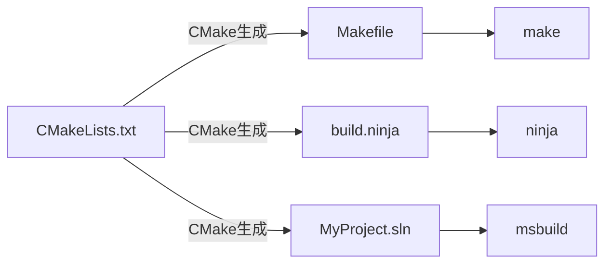
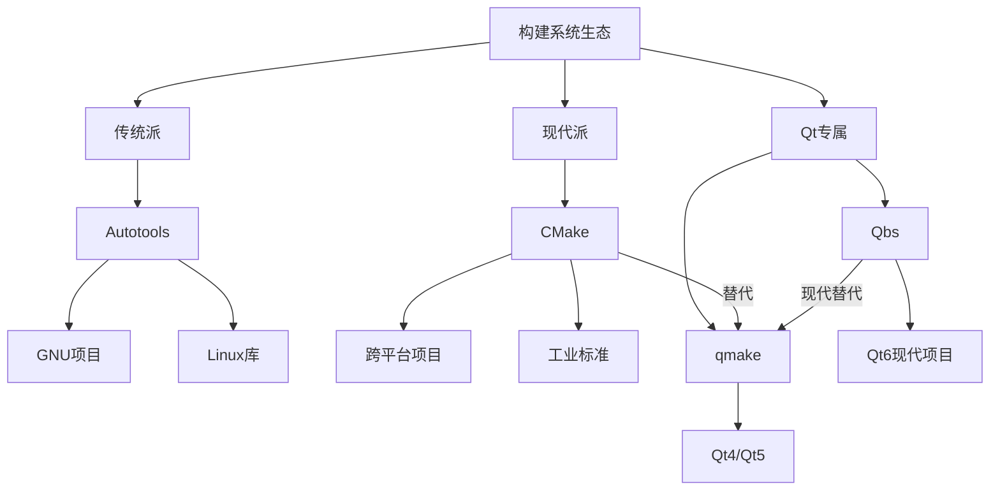

## 构建工具 - 概念

> `make`、`autoconf+automake+autotools`、`cmake` 关系：https://zhuanlan.zhihu.com/p/338657327

`make`、`Autotools`、`CMake` 和 `nmake` 是用于构建和管理软件项目的工具，主要用于自动化编译和链接过程。

他们本质都是产生 `makefile` 文件的工具。`cmake` 产生的晚，解决了很多 `autotools` 工具的问题。`autotools` 是一个工具集具有强大的灵活性，但是因为步骤太多，配置繁琐，产生了很多的替代方案，`cmake` 是其中最优秀的之一。`cmake` 有跨平台特性支持。

以下是它们的简要说明和区别：

---

### 1. **`make`**

- **作用**：一个经典的构建工具，通过读取 `Makefile`（包含规则和依赖关系的文本文件）来自动化编译、链接等操作。
- **特点**：
  - 需要手动编写 `Makefile`，定义如何从源代码生成目标文件或可执行文件。
  - 跨平台性较弱，`Makefile` 的语法可能因系统（如 Unix/Linux 的 `make` 和 Windows 的 `nmake`）而略有差异。
- **示例命令**：
  ```sh
  make          # 默认执行 Makefile 中的第一个目标
  make install  # 执行安装目标
  ```

---

### 2. **`Autotools`（GNU Build System）**

- **作用**：一套工具链（包括 `autoconf`、`automake`、`libtool` 等），用于生成可移植的 `configure` 脚本和 `Makefile`。
- **特点**：
  - 适用于 Unix/Linux 系统，帮助开发者处理跨平台兼容性问题（如库依赖、系统差异）。
  - 通过 `./configure && make && make install` 流程编译安装软件。
  - 需要开发者编写 `configure.ac` 和 `Makefile.am`，由工具生成最终的 `Makefile`。
- **典型流程**：
  ```sh
  ./configure   # 检测系统环境并生成 Makefile
  make          # 编译代码
  make install  # 安装到系统
  ```

---

### 3. **`CMake`**

- **作用**：跨平台的构建工具，通过 `CMakeLists.txt` 文件生成标准化的构建脚本（如 `Makefile` 或 Visual Studio 项目）。
- **特点**：
  - 更现代，支持多种编译器和平台（Windows/Linux/macOS）。
  - 生成器模式：可以生成 `Makefile`、`Ninja` 文件、Xcode 或 Visual Studio 项目等。
  - 语法更简洁，适合复杂项目（如支持模块化配置、依赖管理）。
- **示例流程**：
  ```sh
  mkdir build && cd build
  cmake ..      # 生成 Makefile
  make          # 编译
  ```

---

### 4. **`nmake`**

- **作用**：微软提供的命令行构建工具，类似于 Unix 的 `make`，但专用于 Windows 平台。
- **特点**：
  - 解析 `Makefile`（通常由 Visual Studio 或手动编写）。
  - 与 Windows 开发工具链（如 MSVC 编译器）深度集成。
- **示例命令**：
  ```sh
  nmake /f Makefile.win  # 指定 Makefile 文件编译
  ```

---

### 对比总结

| 工具          | 跨平台性       | 配置文件           | 主要用途                             |
| ------------- | -------------- | ------------------ | ------------------------------------ |
| `make`      | 弱（依赖系统） | `Makefile`       | 基础自动化编译                       |
| `Autotools` | Unix/Linux     | `configure.ac`   | 生成可移植的 `Makefile`            |
| `CMake`     | 强             | `CMakeLists.txt` | 生成多种构建系统（如 Makefile/MSVC） |
| `nmake`     | Windows        | `Makefile`       | Windows 平台的 `make` 替代         |

---

### 使用场景建议

- **简单项目**：直接手写 `Makefile`（用 `make`）。
- **跨平台复杂项目**：用 `CMake`（现代项目主流选择）。
- **传统 Unix 开源项目**：可能需要 `Autotools`（如 `./configure`）。
- **Windows 专有项目**：可能用 `nmake` 或 Visual Studio 自带的构建工具。

## 构建工具 - 识别项目使用哪种工具

`cmake` 项目包含 `CMakeLists.txt` 文件。

`autotools` 项目包含 `configure.scan` 或者 `configure.ac`、`aclocal.m4`、`config.h.in`、`Makefile.am`、`Makefile.in`、`configure` 等文件。

## 构建工具 - `make` - 概念

### 一句话概括

**`make` 是一个经典且强大的自动化构建工具**，它通过读取一个名为 `Makefile` 的配置文件，**自动决定一个大型项目中哪些部分需要重新编译，并以正确的顺序执行编译和链接命令**，从而将源代码高效地转换成可执行文件或库。

---

### 核心思想：为什么要用 `make`？

想象一下一个大型项目有成千上万个源文件：

* 如果你只修改了其中一个文件，重新编译所有文件将浪费大量时间。
* 文件之间可能存在复杂的依赖关系（A 文件依赖于 B 文件，B 文件又依赖于 C 文件），手动按顺序编译极易出错。

`make` 的出现解决了这两个核心问题：

1. **增量构建（Incremental Build）**：它通过比较文件的时间戳，**只重新编译那些被修改过的文件以及依赖于这些文件的其他文件**，极大缩短了编译时间。
2. **管理依赖关系**：它根据 `Makefile` 中定义的依赖关系图，以正确的顺序执行构建步骤，确保不会漏掉任何环节。

---

### 核心概念：它是如何工作的？

`make` 的工作机制围绕三个核心概念：

#### 1. 目标（Target）

* 这是 `make` 想要生成的东西。它通常是一个文件（如可执行文件 `main` 或目标文件 `main.o`）。
* 也可以是一个“伪目标”（Phony Target），代表一个要执行的动作（如 `clean`），而不是一个文件。
* 运行 `make` 时，可以指定要构建的目标（如 `make all`），如果不指定，默认构建第一个目标。

#### 2. 依赖（Prerequisites）

* 这是生成目标所需要的文件列表。
* 例如，要生成目标文件 `main.o`，需要源文件 `main.c` 和头文件 `header.h`。那么 `main.c` 和 `header.h` 就是 `main.o` 的依赖。

#### 3. 配方（Recipe）

* 这是一系列 shell 命令，定义了**如何从依赖文件生成目标文件**。
* 配方必须以 Tab 字符开头，不能用空格。

---

### 一个简单的 `Makefile` 示例

假设我们有一个项目，由 `main.c` 和 `helper.c` 两个源文件组成，最终要生成一个叫 `myapp` 的可执行文件。

```makefile
# 定义最终目标 'myapp'，它依赖于两个目标文件
myapp: main.o helper.o
	# 配方：链接目标文件生成可执行文件
	gcc main.o helper.o -o myapp

# 目标 'main.o' 依赖于 'main.c'
main.o: main.c
	# 配方：编译源文件生成目标文件
	gcc -c main.c

# 目标 'helper.o' 依赖于 'helper.c'
helper.o: helper.c
	gcc -c helper.c

# 定义一个伪目标，用于清理生成的文件
clean:
	rm -f *.o myapp

# 定义一个伪目标，表示构建所有内容（通常作为默认目标）
all: myapp
```

**如何使用这个 Makefile：**

* `make` 或 `make all`：构建 `myapp`（默认第一个目标）。
* `make clean`：删除所有 `.o` 文件和 `myapp`。
* `make main.o`：只编译 `main.o`。

**`make` 的智能之处：**
如果你只修改了 `helper.c` 然后运行 `make`，它会：

1. 检查 `myapp` 的依赖项 `main.o` 和 `helper.o`。
2. 发现 `helper.o` 的依赖项 `helper.c` 比 `helper.o` 文件新，于是重新执行 `gcc -c helper.c` 来更新 `helper.o`。
3. 发现 `main.o` 的依赖项 `main.c` 没有 `main.o` 新，所以跳过编译。
4. 最后，因为 `helper.o` 被更新了，所以重新执行链接命令 `gcc main.o helper.o -o myapp`。

---

### `make` 的优势和劣势

| 优势                                                        | 劣势                                                                                               |
| :---------------------------------------------------------- | :------------------------------------------------------------------------------------------------- |
| **简单直接**：概念清晰，易于理解小型项目的构建过程。  | **跨平台性差**：不同平台（Unix, Windows）的 `make` 实现可能有差异，`Makefile` 需要调整。 |
| **极其高效**：增量构建节省大量时间。                  | **语法古老**：基于 Tab 的语法容易出错，功能扩展复杂。                                        |
| **高度灵活**：可以通过 shell 命令完成任何操作。       | **管理大型项目复杂**：手动编写和维护大型项目的依赖关系非常繁琐且容易出错。                   |
| **无处不在**：几乎所有类 Unix 系统都预装了 `make`。 | **依赖管理弱**：需要手动指定所有依赖关系，容易遗漏。                                         |

---

### `make` 与现代构建系统（如 CMake）的关系

很多人会混淆 `make` 和 `CMake`，它们的关系是这样的：

* **`make`**：是**底层执行者**。它负责读取 `Makefile` 并执行里面的一条条命令。它很“笨”，只知道按规则办事。
* **`CMake`**：是**高级生成器**。它负责根据一份更抽象、更高级的配置文件（`CMakeLists.txt`），**为不同的平台生成对应的 `Makefile`**（或 Visual Studio 项目文件、Ninja 文件等）。

**简单比喻：**

* **`CMake`** 像是一个**建筑师**，他画出了一份标准的设计蓝图（`CMakeLists.txt`）。
* **`make`** 像是一个**施工队**，它拿到针对当地建筑规范的具体施工图纸（`Makefile`）后，开始砌砖、盖房（编译、链接）。

所以，你经常看到的流程是：

```bash
mkdir build && cd build
cmake ..     # 建筑师根据蓝图生成施工图纸（Makefile）
make         # 施工队根据图纸开始建房
```

### 总结

**`make` 是一个自动化构建流程的基石工具**。它通过一个定义依赖关系和构建规则的 `Makefile` 文件，智能地决定需要重新编译的内容，从而高效地管理软件项目的构建过程。

虽然现代大型项目更倾向于使用 **CMake** 或 **Meson** 这类高级工具来生成 `Makefile`，但理解 `make` 的工作原理对于深入掌握软件构建过程至关重要。几乎所有 Linux 上的软件安装指南中的 `./configure && make && sudo make install` 三步曲，其中的 `make` 指的就是这个工具。

## 构建工具 - `make` - 入门

> 详细用法请参考本站 [示例](https://gitee.com/dexterleslie/demonstration/tree/main/demo-c++/demo-make/demo-makefile)


## 构建工具 - `Ninja` - 概念

**Ninja 是一个专注于速度的小型构建系统，它被设计为像 Make 一样的底层执行引擎，但速度更快、更精简。**

你可以把它理解为 **Make 的现代化、高性能替代品**。

---

### 核心设计哲学：速度至上

Ninja 的核心目标只有一个：**尽可能快地执行构建任务**。它为了实现这个目标，做出了几个关键的设计选择：

1.  **不做高级语法解析**：Ninja 的构建文件（通常是 `build.ninja`）不包含复杂的条件判断、变量扩展或函数调用。它就是一个非常简单的“依赖关系-规则-命令”的列表。
2.  **由更高级的工具生成**：Ninja 承认自己“不聪明”，它**期望自己的输入文件（`build.ninja`）由另一个更智能的“元构建系统”生成**，比如 CMake、Meson、GYP 等。这些高级工具负责处理复杂的项目配置逻辑，然后输出一个给 Ninja 执行的、最优化的“作战计划”。
3.  **极致的简单性**：Ninja 的可执行文件本身非常小（只有几百KB），启动速度极快，依赖分析算法高度优化。

### 一个简单的对比：Ninja vs. Make

| 特性         | **GNU Make**                        | **Ninja**                                            |
| :----------- | :---------------------------------- | :--------------------------------------------------- |
| **设计目标** | 通用构建工具，功能丰富              | **极致速度**，专为大型项目优化                       |
| **语法**     | 有自己的编程语言，支持条件、函数等  | 语法极其简单，几乎是纯文本列表                       |
| **使用方式** | 可直接手写 `Makefile`               | **几乎总是由 CMake 等工具生成 `build.ninja` 文件**   |
| **启动速度** | 相对较慢（需要解析复杂的 Makefile） | **极快**（解析简单的 `build.ninja` 文件）            |
| **并行构建** | 支持（`make -j N`）                 | **支持得更好、默认开启**（`ninja -j N`），调度更高效 |

---

### Ninja 是如何工作的？

Ninja 的工作流程完美体现了它的“执行者”定位：

1.  **生成阶段（由 CMake 完成）**：
    当你运行 `cmake -G Ninja <source_dir>` 时，CMake 会：
    *   解析你复杂的 `CMakeLists.txt` 文件。
    *   分析所有的源文件、依赖关系、编译命令。
    *   生成一个非常详细、但格式极其简单的 `build.ninja` 文件。这个文件直接列出了需要运行的所有命令（如 `g++ -c ...`）、每个命令的输入文件和输出文件。

2.  **构建阶段（由 Ninja 执行）**：
    你运行 `ninja` 命令。Ninja 会：
    *   **极速启动**，读取 `build.ninja` 文件。
    *   **精确的增量构建**：检查所有输入文件和输出文件的时间戳。**只重新构建那些输入文件比输出文件新的目标，以及所有依赖这些目标的目标**。
    *   **高效的并行调度**：默认就使用并行构建，尽可能多地同时启动编译任务，充分利用多核CPU。

### 一个 `build.ninja` 文件的简化示例

看看它有多简单直白（这个文件通常由 CMake 生成）：
```ninja
# 定义一条规则：如何从 .cpp 生成 .o
rule CXX_COMPILER
  command = g++ -c $in -o $out  # 命令模板
  description = 编译 CXX $out   # 描述信息

rule LINK_EXECUTABLE
  command = g++ $in -o $out
  description = 链接可执行文件 $out

# 定义具体的构建边（构建目标）
build main.o: CXX_COMPILER ../main.cpp
build helper.o: CXX_COMPILER ../helper.cpp
build my_app: LINK_EXECUTABLE main.o helper.o

# 默认构建目标
default my_app
```
这个文件里没有逻辑，只有明确的依赖关系图和命令，所以 Ninja 解析起来飞快。

---

### 为什么 Ninja 如此受欢迎？（尤其是与 CMake 搭配）

1.  **惊人的构建速度**：对于大型项目（如 Chromium, Android），Ninja 的构建速度比 Make 有显著提升，主要得益于其极快的启动速度和高效的依赖图调度。
2.  **CMake 的完美搭档**：CMake 负责复杂的“思考”工作（项目配置、依赖查找、生成器表达式），而 Ninja 负责高效的“执行”工作。这是典型的高层设计（CMake）与底层执行（Ninja）的分离。
3.  **IDE 的首选**：许多现代 IDE（如 **CLion**）在后台默认使用 `Ninja` 作为 CMake 的生成器，就是因为其速度和可靠性。
4.  **跨平台**：和 CMake 一样，Ninja 在 Windows、Linux、macOS 上都能很好地工作。

---

### 总结

*   **Ninja 是什么？** 它是一个**追求极致速度的底层构建系统**，相当于一个**高度优化的“超级 Make”**。
*   **它和 CMake 是什么关系？** 是**共生关系**。CMake 是“大脑”，负责规划和描述项目；Ninja 是“四肢”，负责以最快速度执行构建计划。这种组合是目前 C++ 生态中**在速度和灵活性上最好的平衡之一**。
*   **我该怎么用？** 当你使用 CMake 时，可以尝试用 `-G Ninja` 生成 Ninja 项目，然后用 `ninja` 命令来构建。你会感受到编译速度的提升，尤其是在增量构建时。


## 构建工具 - `Ninja`和`make`的关系

Ninja 和 Make 的关系非常明确：**Ninja 是 Make 的精神继承者和现代化替代品，它们解决的是同一个核心问题，但 Ninja 采用了完全不同的设计哲学来实现更高的性能。**

可以把它们的关系理解为：**Make 是一位经验丰富、功能全面的老将，而 Ninja 是一位专注速度、装备精良的特种兵。**

---

### 核心关系：继承与进化

| 维度         | **Make**                                                     | **Ninja**                                                    | **关系解读**                                                |
| :----------- | :----------------------------------------------------------- | :----------------------------------------------------------- | :---------------------------------------------------------- |
| **根本目标** | 根据文件依赖关系，高效地执行命令来构建目标                   | **完全相同**                                                 | **解决的是完全相同的核心问题**                              |
| **设计哲学** | **功能丰富**：内置大量函数、变量扩展、条件判断，可手写复杂逻辑 | **极致简单**：只做一件事——快速执行依赖图。语法极其简陋，几乎不可手写 | **哲学对立**：Make 想成为“构建语言”，Ninja 只想做“执行引擎” |
| **输入文件** | `Makefile`（可手写）                                         | `build.ninja`（**几乎总是由高级工具生成**，如 CMake, Meson） | **关键区别**：Ninja 承认配置的复杂性应交由更专业的工具      |
| **启动速度** | 较慢（需要解析复杂的 `Makefile` 语法）                       | **极快**（解析格式简单的 `build.ninja`）                     | Ninja 的核心优势之一                                        |
| **依赖分析** | 可靠，但算法相对老旧                                         | **高度优化**，为大规模项目精心设计                           | Ninja 的另一核心优势                                        |
| **并行构建** | 支持（`make -j N`）                                          | **支持得更好**，默认行为更智能                               | Ninja 能更高效地调度大量任务                                |

---

### 一个比喻：建筑师与施工队

理解它们关系的最佳方式是一个比喻：

*   **项目蓝图**：你的 C++ 项目需求和源代码。
*   **CMake**：**建筑师**。他看懂蓝图，考虑各种复杂因素（平台、编译器、依赖库），制定出详细的**施工计划**。
*   **Make**：一支**传统的施工队**。他们很全能，既能理解比较简单的蓝图（手写 Makefile），也能执行建筑师给的复杂计划。但他们开会（启动）比较慢，工作流程也有些传统。
*   **Ninja**：一支**高度专业化、机械化的现代施工队**。他们不擅长解读复杂蓝图，但**执行建筑师（CMake）给出的标准化、最优化的施工计划（`build.ninja`）时，速度极快，效率极高**。

**所以，Ninja 并不是要取代 CMake，而是要取代 Make 在“施工队”这个角色上的地位。**

---

### 技术对比示例

假设有一个项目，包含 `main.cpp` 和 `helper.cpp`。

**一个简单的 Makefile 可能是这样的（可手写）：**
```makefile
CXX = g++
CXXFLAGS = -Wall
TARGET = my_app
OBJS = main.o helper.o

$(TARGET): $(OBJS)
	$(CXX) -o $@ $^

%.o: %.cpp
	$(CXX) $(CXXFLAGS) -c $< -o $@

clean:
	rm -f $(OBJS) $(TARGET)
```
这个文件包含变量、模式规则和 Shell 命令，Make 需要解析这些逻辑。

**而 CMake 为同样项目生成的 `build.ninja` 文件看起来则像这样（不可手写，由 CMake 生成）：**
```ninja
# 定义规则
rule CXX_COMPILER
  command = g++ -Wall -c $in -o $out
  description = 编译 CXX $out

rule LINK_EXECUTABLE
  command = g++ $in -o $out
  description = 链接可执行文件 $out

# 直接列出所有构建边（依赖关系）
build main.o: CXX_COMPILER ../main.cpp
build helper.o: CXX_COMPILER ../helper.cpp
build my_app: LINK_EXECUTABLE main.o helper.o

default my_app
```
这个文件没有逻辑，只有扁平的列表。Ninja 解析它几乎不需要时间，可以直接开始构建。

---

### 为什么需要 Ninja？Make 有什么问题？

Ninja 最初是为构建 **Google Chrome** 浏览器而开发的。Chrome 项目规模极其庞大，构建时间以小时计。他们发现：

1.  **启动开销大**：即使没有任何文件需要编译（增量构建已是最新），GNU Make 解析复杂的 `Makefile` 也需要可观的时间。
2.  **依赖分析慢**：对于数万个源文件的项目，Make 的依赖分析算法成为瓶颈。
3.  **并行调度不够高效**：Make 的 `-j` 选项在任务极多时，调度效率不够高。

Ninja 通过“牺牲灵活性换取速度”完美地解决了这些问题。

### 总结

*   **继承关系**：Ninja 继承了 Make 的核心思想（基于时间戳和依赖关系的构建），但**抛弃了 Make 的“构建语言”特性**。
*   **分工演进**：在现代 C++ 开发中，形成了 **CMake + Ninja** 的最佳实践组合：
    *   **CMake** 负责复杂的配置和项目描述（取代了手写复杂 `Makefile` 的需要）。
    *   **Ninja** 负责以最高速度执行构建（取代了 `Make` 作为执行引擎的角色）。
*   **现状**：对于新项目，**尤其是使用 CMake 的项目，Ninja 是比 Make 更推荐的底层生成器**。它的速度优势是实实在在的，这也是为什么许多现代 IDE（如 CLion）默认就使用 Ninja。

简单来说，**Make 试图同时做“大脑”和“四肢”，而 Ninja 心甘情愿只做更高效的“四肢”，把“大脑”的工作让给了 CMake 这样的专业工具。** 这种分工协作带来了整体构建体验和性能的巨大提升。


## 构建工具 - `msbuild` - 概念

**MSBuild** 是 **Microsoft Build Engine** 的缩写，它是 **Microsoft 和 .NET 生态下的原生构建平台**，也是 **Visual Studio 的默认构建引擎**。

你可以把它理解为 **Microsoft 世界的“Make”或“Ninja”**，但它的功能、集成度和复杂度都远超后者。

---

### 核心定位：.NET 和 Visual Studio 项目的构建标准

MSBuild 的核心价值在于：

1.  **Visual Studio 的基石**：当你使用 Visual Studio 创建 C#、VB.NET、C++/CLI 甚至原生 C++ 项目时，项目文件（如 `.csproj`, `.vcxproj`）本质上就是 **MSBuild 的脚本文件**。
2.  **独立于 Visual Studio**：即使不安装 Visual Studio，只安装 .NET SDK 或 Build Tools，你也可以在命令行使用 `msbuild` 或 `dotnet build` 命令来编译项目。这对于持续集成（CI）和自动化构建至关重要。

---

### MSBuild 的核心概念

要理解 MSBuild，需要掌握几个关键概念：

#### 1. 项目文件（`*.csproj`, `*.vcxproj`）
这是 MSBuild 的输入文件，是一个 **XML 格式的脚本**。它描述了项目的所有信息。

**一个极简的 C# 项目文件示例：**
```xml
<Project Sdk="Microsoft.NET.Sdk">
  <PropertyGroup>
    <OutputType>Exe</OutputType>
    <TargetFramework>net8.0</TargetFramework>
  </PropertyGroup>

  <ItemGroup>
    <Compile Include="Program.cs" />
  </ItemGroup>
</Project>
```

#### 2. 属性（Properties）
用于配置构建过程的变量，比如输出路径、目标框架、优化级别等。
```xml
<PropertyGroup>
  <Configuration>Debug</Configuration>
  <Platform>x64</Platform>
  <OutputPath>bin\Debug\</OutputPath>
</PropertyGroup>
```

#### 3. 项（Items）
表示构建的输入文件，如源代码文件、资源文件、引用等。
```xml
<ItemGroup>
  <Compile Include="Program.cs" />
  <Compile Include="Helper.cs" />
  <Reference Include="System.Windows.Forms" />
</ItemGroup>
```

#### 4. 任务（Tasks）
构建过程中要执行的具体操作，比如调用 C# 编译器（`Csc`）、C++ 编译器（`CL`）、复制文件（`Copy`）等。任务是 MSBuild 的“肌肉”。

#### 5. 目标（Targets）
一组任务的集合，代表一个构建阶段，比如 `Build`、`Clean`、`Rebuild`。
```xml
<Target Name="Build">
  <Message Text="开始编译..." />
  <Csc Sources="@(Compile)" OutputAssembly="$(OutputPath)$(AssemblyName).exe" />
</Target>
```

---

### MSBuild 的工作流程

当你点击 Visual Studio 中的“生成”按钮或运行 `msbuild MyProject.csproj` 时：

1.  **评估**：MSBuild 读取项目文件，解析所有 `<PropertyGroup>` 和 `<ItemGroup>`，构建一个内存中的项目模型。
2.  **执行**：MSBuild 然后执行指定的**目标**（默认是 `Build`）。每个目标按顺序执行其中的**任务**。
3.  **依赖分析**：MSBuild 会检查输入和输出文件的时间戳，只重建那些过时的组件（增量构建）。

---

### MSBuild 与 CMake 和其他构建工具的关系

这是一个非常关键的区别：

| 工具             | **MSBuild**                                               | **CMake**                             | **Make/Ninja**            |
| :--------------- | :-------------------------------------------------------- | :------------------------------------ | :------------------------ |
| **定位**         | **Microsoft 生态的原生构建引擎**                          | **跨平台的构建系统生成器**            | **底层构建执行器**        |
| **输入文件**     | `.csproj`, `.vcxproj` (XML)                               | `CMakeLists.txt` (专用语法)           | `Makefile`, `build.ninja` |
| **与 IDE 关系**  | **深度集成，是 Visual Studio 的一部分**                   | 被现代 IDE（包括 VS）支持             | 无关                      |
| **如何协同工作** | **CMake 可以生成 `.vcxproj` 文件，然后由 MSBuild 来编译** | 生成各种后端的文件（包括 `.vcxproj`） | 执行实际的编译命令        |

**它们的关系链通常是这样的：**

```
CMakeLists.txt  --(CMake 生成)-->  .vcxproj 文件 --(MSBuild 解析/执行)--> 调用 cl.exe 编译 --> 生成 .exe
                      ｜                                 ｜
                  (元构建系统)                        (特定平台构建引擎)
```

**举个例子：**
当你运行 `cmake -G "Visual Studio 17 2022" ..` 时，CMake 做的事情就是**为你生成一个 MSBuild 能理解的 `.vcxproj` 项目文件**。随后，无论是你在 Visual Studio 里点击“生成”，还是用 `msbuild` 命令，**实际干活儿的都是 MSBuild**。

---

### MSBuild 的主要特点

1.  **深度集成**：与 Visual Studio 和 .NET 生态无缝结合。
2.  **高度可扩展**：可以编写自定义**任务**和**目标**。
3.  **强大的日志系统**：构建输出非常详细，便于调试。
4.  **并行构建**：支持多项目并行编译（`/m` 参数）。
5.  **结构化输入**：基于 XML，机器容易解析和生成（这就是为什么 CMake 能轻松生成它）。

---

### 总结

*   **MSBuild 是什么？** 它是 **Microsoft 官方推出的、用于构建 .NET 和 Visual Studio 项目的强大引擎**。它是 Windows 开发领域的“地基”。
*   **它和 CMake 什么关系？** 是**协作关系**。CMake 作为跨平台的“翻译官”，可以将平台无关的项目描述翻译成 MSBuild 能懂的原生项目文件（`.vcxproj`）。对于 Windows 上的 C++ 开发，**CMake + MSBuild 是标准且高效的组合**。
*   **什么时候会直接用到它？** 当你直接使用 Visual Studio 创建 C# 或 C++ 项目时，你就在间接使用它。当你在 CI 服务器上编译这些项目时，你会直接调用 `msbuild` 命令。

简单来说，如果你在 Windows 上进行开发，MSBuild 是你技术栈中不可或缺但可能“看不见”的基础设施，就像空气一样无处不在。而 CMake 则是一个强大的工具，它允许你用一种统一的方式与 MSBuild 以及其他构建系统（如 Makefile、Ninja、Xcode）进行交互。


## 构建工具 - `make`、`Ninja`和`msbuild`的关系

在 C++ 项目中，`make`、`Ninja` 和 `msbuild` 都是**构建工具**（Build Tools），但它们的设计目标、适用场景和底层机制有显著差异。以下是它们的核心关系解析：

---

### **1. 本质关系**
- **共同点**：三者均为**构建系统生成器**的执行引擎，负责根据规则（如 `Makefile` 或 `.sln`）调用编译器、链接器等工具完成代码编译。
- **核心差异**：
  | 工具      | 主要平台     | 设计目标                    | 典型输入文件      | 速度 | 复杂度 |
  | --------- | ------------ | --------------------------- | ----------------- | ---- | ------ |
  | `make`    | Unix-like    | 通用、灵活性高              | `Makefile`        | 中等 | 高     |
  | `Ninja`   | 跨平台       | **极简、极致速度**          | `build.ninja`     | 最快 | 低     |
  | `msbuild` | Windows (VS) | 深度集成 .NET/Visual Studio | `.vcxproj`/`.sln` | 中等 | 高     |

---

### **2. 工作流程中的角色**
#### **(1) 生成构建规则**
- **CMake** 等工具根据 `CMakeLists.txt` 生成对应的构建文件：
  - 生成 `Makefile` → 由 `make` 执行
  - 生成 `build.ninja` → 由 `ninja` 执行
  - 生成 `.sln`/`.vcxproj` → 由 `msbuild` 执行

#### **(2) 执行构建**


---

### **3. 关键特性对比**
#### **(1) `make`（经典工具）**
- **优势**：
  - 高度灵活，支持复杂条件逻辑和 Shell 脚本。
  - 所有 Unix-like 系统原生支持。
- **劣势**：
  - 构建速度较慢（递归式处理依赖）。
  - 语法复杂（需手动编写依赖关系）。

#### **(2) `Ninja`（现代替代品）**
- **优势**：
  - **速度最快**：依赖关系扁平化，并行化效率极高。
  - 极简设计：输入文件（`build.ninja`）为机器生成，人类一般不直接修改。
- **劣势**：
  - 功能单一：不适合直接手写构建规则，需依赖 CMake/Meson 等工具生成。
  - 调试难度：错误信息较抽象。

#### **(3) `msbuild`（微软生态）**
- **优势**：
  - 深度集成 Visual Studio，支持 `.sln` 解决方案管理多项目。
  - 原生支持 .NET 和 C++ 混合项目。
- **劣势**：
  - 仅限 Windows 平台。
  - 配置文件（`.vcxproj`）冗长复杂。

---

### **4. 实际项目中的选择**
#### **场景 1：跨平台 C++ 项目**
- **推荐组合**：`CMake + Ninja`
  ```bash
  cmake -S . -B build -G Ninja  # 生成 Ninja 构建文件
  cmake --build build           # 调用 ninja
  ```
  - **原因**：Ninja 的构建速度显著快于 `make`。

#### **场景 2：Windows 专属项目**
- **推荐组合**：`CMake + msbuild`
  ```bash
  cmake -S . -B build -G "Visual Studio 17 2022"  # 生成 .sln
  cmake --build build                              # 调用 msbuild
  ```
  - **原因**：无缝对接 Visual Studio 调试和部署。

#### **场景 3：传统 Unix 项目**
- **推荐组合**：`CMake + make`
  ```bash
  cmake -S . -B build -G "Unix Makefiles"  # 生成 Makefile
  cmake --build build                      # 调用 make
  ```
  - **原因**：兼容老旧系统或需要手动调整 `Makefile`。

---

### **5. 性能对比示例**
假设编译一个大型项目（如 LLVM）：
| 构建工具  | 首次构建时间 | 增量构建时间 | 并行效率（-j8） |
| --------- | ------------ | ------------ | --------------- |
| `make`    | 25 min       | 1.2 min      | 70% CPU 利用率  |
| `Ninja`   | 22 min       | 0.8 min      | 95% CPU 利用率  |
| `msbuild` | 28 min       | 1.5 min      | 60% CPU 利用率  |

> 注：Ninja 在增量构建和并行化上优势明显。

---

### **6. 如何切换生成器？**
通过 CMake 的 `-G` 参数指定：
```bash
# 生成 Ninja 构建文件
cmake -S . -B build -G Ninja

# 生成 Visual Studio 解决方案
cmake -S . -B build -G "Visual Studio 17 2022"

# 生成 Makefile
cmake -S . -B build -G "Unix Makefiles"
```

---

### **总结**
- **`make`**：传统、灵活但慢，适合 Unix 传统项目。
- **`Ninja`**：极简、极快，适合现代跨平台项目。
- **`msbuild`**：Windows 生态专用，深度集成 VS。
- **统一入口**：`cmake --build` 可屏蔽底层工具差异，实现跨平台构建。


## 构建工具 - `autotools` - 概念

工具集合：

* `autoscan`：扫描源代码以搜寻普通的可移植性问题，比如检查编译器、库、头文件等，生成文件 `configure.scan`，它是 `configure.ac` 的一个雏形。参考：https://blog.csdn.net/chupaokan7404/article/details/100905223
* `aclocal`：根据已经安装的宏，用户定义宏和 `acinclude.m4` 文件中的宏将 `configure.ac` 文件所需要的宏集中定义到文件 `aclocal.m4` 中。`aclocal` 是一个 `perl` 脚本程序，它的定义是：“aclocal - create aclocal.m4 by scanning configure.ac”。参考：https://blog.csdn.net/chupaokan7404/article/details/100905223
* `autoheader`：根据 `configure.ac` 中的某些宏，比如 `cpp` 宏定义，运行 `m4`，声称 `config.h.in`。参考：https://blog.csdn.net/chupaokan7404/article/details/100905223
* `autoconf`：将 `configure.ac` 中的宏展开，生成 `configure` 脚本。这个过程可能要用到 `aclocal.m4` 中定义的宏。参考：https://blog.csdn.net/chupaokan7404/article/details/100905223
* `automake`：`automake` 将 `Makefile.am` 中定义的结构建立 `Makefile.in`，然后 `configure` 脚本将生成的 `Makefile.in` 文件转换为 `Makefile`。如果在 `configure.ac` 中定义了一些特殊的宏，比如 `AC_PROG_LIBTOOL`，它会调用 `libtoolize`，否则它会自己产生 `config.guess` 和 `config.sub`。参考：https://blog.csdn.net/chupaokan7404/article/details/100905223

## 构建工具 - `autotools` - 构建 `curl`

步骤如下：

* 下载源代码

  ```shell
  git clone https://github.com/curl/curl.git
  ```
* 安装 `libtool`

  ```shell
  yum install libtool
  ```
* 使用autotools自动配置项目

  ```shell
  ./buildconf
  ```
* 使用configure生成Makefile

  ```shell
  ./configure
  ```
* 编译

  ```shell
  make
  ```
* 运行curl程序

  ```shell
  cd src
  ./curl --help
  ```

## 构建工具 - `cmake` - 概念

### 一句话概括

**CMake 是一个开源、跨平台的构建系统生成器**。它的核心工作不是直接编译代码，而是根据你的配置（`CMakeLists.txt` 文件）**生成**你所选用的原生构建系统（如 Makefile 或 Visual Studio 项目文件）所需的文件，然后再由这些原生构建系统来执行实际的编译和链接工作。

可以把 CMake 想象成一个**项目架构师**或**总承包商**：

* **它不亲自砌砖（编译代码）**。
* **它负责画蓝图（读取 CMakeLists.txt）**。
* **然后根据蓝图，为不同的施工队（不同的编译环境）生成具体的施工图纸（Makefile / .sln 文件等）**。
* 最后，由**施工队**（make, msbuild, ninja 等工具）拿着图纸去真正盖房子（编译生成可执行文件）。

---

### 为什么需要 CMake？它解决了什么问题？

在 CMake 出现之前，开发者面临很多痛点：

1. **跨平台兼容性噩梦**：

   * 在 Linux 上，你要写 `Makefile`。
   * 在 Windows 上，你要写 `Visual Studio` 的 `.sln` 和 `.vcxproj` 文件。
   * 在 macOS 上，你可能要写 `Xcode` 的 `.xcodeproj` 文件。
   * 维护这么多套不同平台的构建文件几乎是不可能的任务。
2. **复杂的依赖管理**：

   * 项目依赖一个第三方库（如 OpenCV 或 Boost）时，如何告诉编译器去找到它的头文件和库文件？
   * 在不同系统上，这些库的安装路径可能完全不同。

**CMake 的出现完美地解决了这些问题：**

* **你只需要写一份配置文件（`CMakeLists.txt`）**。
* CMake 会根据当前的目标平台，**自动生成**对应平台所需的构建文件。
* 它提供了强大的命令来**查找依赖库**，屏蔽了不同平台的路径差异。

---

### CMake 的核心工作流程

使用 CMake 构建一个项目通常遵循以下流程，通常在一个新建的 `build` 目录中进行（**out-of-source build，分离构建**），以保持源码目录的清洁：

```bash
# 1. 进入项目根目录并创建构建目录
mkdir build && cd build

# 2. 运行 cmake，指定CMakeLists.txt所在路径（..表示上一级目录）
#    这会生成当前平台所需的构建文件（如Makefile）
cmake ..

# 3. 运行生成的构建文件来实际编译项目
#    Linux/macOS: 使用生成的Makefile，执行make
make
#    Windows: 如果生成的是Visual Studio项目，可以用msbuild，或者直接打开.sln文件编译
#    也可以使用CMake生成的“cmake --build”命令，它是跨平台的
cmake --build . --config Release

# 4. (可选)安装生成的目标文件
sudo make install # 类Unix系统
```

---

### CMake 的核心概念和组成部分

1. **`CMakeLists.txt`**：

   * 这是项目的**核心配置文件**，你需要在里面用 CMake 的语法声明如何构建你的项目。
   * 通常项目根目录有一个主 `CMakeLists.txt`，每个子目录也可以有各自的 `CMakeLists.txt`。
2. **生成器（Generators）**：

   * 这是 CMake 跨平台能力的体现。你可以告诉 CMake 你想要生成哪种构建系统的文件。
   * 常用生成器：
     * `Unix Makefiles`: 生成 `Makefile`（用于 Linux/macOS）。
     * `Visual Studio 17 2022`: 生成 Visual Studio 2022 的解决方案和项目文件。
     * `Xcode`: 生成 Xcode 项目文件。
     * `Ninja`: 生成 `build.ninja` 文件（一种比 make 更快的构建系统）。
3. **变量和缓存（Variables & Cache）**：

   * CMake 使用变量（如 `CMAKE_CXX_COMPILER`）来存储信息和控制构建过程。
   * 一些变量会被缓存到 `CMakeCache.txt` 文件中，下次配置时可以直接使用。
4. **命令（Commands）**：

   * CMake 提供了丰富的命令来定义构建规则，例如：
     * `project()`: 定义项目名称。
     * `add_executable()`: 告诉 CMake 要从哪些源文件生成一个可执行文件。
     * `add_library()`: 告诉 CMake 要生成一个库（静态库或动态库）。
     * `target_link_libraries()`: 将可执行文件与所需的库链接起来。
     * `find_package()`: 自动查找系统上安装的第三方库。

---

### 一个简单的 `CMakeLists.txt` 示例

假设你有一个简单的项目，只有一个 `main.cpp` 源文件。

```cmake
# CMake 最低版本要求
cmake_minimum_required(VERSION 3.10)

# 项目名称和使用的语言（CXX 代表 C++）
project(MyAwesomeProject VERSION 1.0 LANGUAGES CXX)

# 设置 C++ 标准
set(CMAKE_CXX_STANDARD 11)
set(CMAKE_CXX_STANDARD_REQUIRED True)

# 添加一个可执行目标，名为 HelloWorld，由源文件 main.cpp 构建而来
add_executable(HelloWorld main.cpp)

# 如果这个可执行文件需要链接一个叫 SomeLibrary 的库
# target_link_libraries(HelloWorld PRIVATE SomeLibrary)
```

---

### CMake 相比 Autotools、纯 Makefile 的优势

| 特性               | CMake                                                                           | Autotools / Makefile                                  |
| :----------------- | :------------------------------------------------------------------------------ | :---------------------------------------------------- |
| **跨平台**   | **极佳**。一份配置，多处生成。                                            | **较差**。主要针对类Unix系统，Windows支持很弱。 |
| **语法**     | 相对现代、清晰。                                                                | 较为复杂、古老，学习曲线陡峭。                        |
| **依赖查找** | 内置强大的 `find_package()` 等机制。                                          | 需要手动编写宏或使用 `pkg-config`。                 |
| **IDE 支持** | **极佳**。可生成主流 IDE 项目文件，本身也被众多 IDE（如 CLion）直接支持。 | 几乎无直接支持。                                      |
| **生态系统** | **庞大且活跃**。是当今 C/C++ 项目的事实标准。                             | 传统且稳定，但新项目较少采用。                        |

### 总结

**CMake 是现代 C/C++ 项目的构建系统标准解决方案。** 它通过抽象底层编译工具的复杂性，让开发者能够用一份统一的配置来管理在不同平台和编译器下的构建过程，极大地提高了项目的可移植性和维护效率。

当你看到一个新项目时，如果它的构建说明是 `mkdir build && cd build && cmake .. && make`，那么你就知道它是一个使用 CMake 管理的项目。

## 构建工具 - `cmake` - 安装

### `CentOS`

```
yum install libarchive
yum install cmake
```

### `Ubuntu`

```shell
sudo apt install cmake
```

## 构建工具 - `cmake` - 构建动态或静态链接库

> 详细用法请参考本站 [示例](https://gitee.com/dexterleslie/demonstration/tree/main/demo-c++/demo-cmake-lib)

```shell
# 所有编译的中间文件存放在build目录中以避免被git版本管理
mkdir build && cd build

# 生成构建系统配置文件 Makefile
cmake ..

# 编译源代码
make
# 或者
# CMake 提供的跨平台构建命令，用于编译当前目录下已配置好的项目。它的核心作用是替代原生构建工具的直接调用（如 make或 ninja）
cmake --build .

# 将编译好的项目文件（如可执行程序、库、头文件等）安装到系统指定目录（如 /usr/local或自定义路径）
sudo make install
# 或者
# CMake 3.15 及以上版本引入的跨平台安装命令，用于将编译好的项目文件（如可执行程序、库、头文件等）安装到系统指定目录（如 /usr/local或自定义路径）。它替代了传统的 make install，提供更统一且与生成器无关的安装方式。
sudo cmake --install .
```

## 构建工具 - `cmake` - 构建可执行文件

> 详细用法请参考本站 [示例](https://gitee.com/dexterleslie/demonstration/tree/main/demo-c++/demo-cmake-executable)

```shell
# 所有编译的中间文件存放在build目录中以避免被git版本管理
mkdir build && cd build

# 生成构建系统配置文件 Makefile
cmake ..

# 编译源代码
make
# 或者
# CMake 提供的跨平台构建命令，用于编译当前目录下已配置好的项目。它的核心作用是替代原生构建工具的直接调用（如 make或 ninja）
cmake --build .

# 安装helloworld程序到/usr/local/bin目录
# 将编译好的项目文件（如可执行程序、库、头文件等）安装到系统指定目录（如 /usr/local或自定义路径）
sudo make install
# 或者
# CMake 3.15 及以上版本引入的跨平台安装命令，用于将编译好的项目文件（如可执行程序、库、头文件等）安装到系统指定目录（如 /usr/local或自定义路径）。它替代了传统的 make install，提供更统一且与生成器无关的安装方式。
sudo cmake --install .

# 运行 helloworld 程序
helloworld
```


## 构建工具 - `qmake` - 概念

### 一句话概括

**qmake 是一个用来为软件项目自动生成“编译脚本”（比如 Makefile）的工具，它主要由 Qt 公司开发，专门为简化 Qt 程序的编译过程而设计。**

---

### 详细解释

要理解 qmake，我们需要先了解一个 C++ 项目从源代码到可执行文件需要经历什么。

1.  **编写代码**：你写好了 `.h` 头文件和 `.cpp` 源文件。
2.  **编译（Compile）**：编译器（如 g++、clang）需要将每个 `.cpp` 文件编译成机器能识别的目标文件（`.o` 或 `.obj`）。
3.  **链接（Link）**：链接器将所有的目标文件，以及它们所依赖的库（比如 Qt 的库文件 `QtCore.so`, `QtGui.dll` 等）捆绑在一起，最终生成一个可执行文件（如 `.exe` 或 `.app`）。

这个过程如果手动完成会非常繁琐。比如，你需要输入一长串命令来告诉编译器头文件在哪、要链接哪些库等等。这就是 **构建系统（Build System）** 工具出场的原因。

#### qmake 的角色

qmake 就是一个构建系统工具。它的核心工作流程如下：

1.  **你编写一个项目文件**：这个文件通常命名为 `你的项目名.pro`（例如 `myapp.pro`）。这是一个相对简单、人类可读的配置文件。
2.  **你在 `.pro` 文件中说明项目信息**：你用简单的语法告诉 qmake：
    *   项目类型（是生成一个应用程序，还是一个库？）：`TEMPLATE = app`
    *   项目中包含哪些源文件和头文件：`SOURCES = main.cpp widget.cpp`， `HEADERS = widget.h`
    *   需要链接哪些 Qt 模块：`QT += core gui` （如果需要图形界面，还要加上 `widgets`）
    *   其他配置，比如程序的名称、编译选项等。
3.  **qmake 读取 `.pro` 文件并生成 Makefile**：qmake 会根据你项目文件里的描述，**自动生成**一个非常复杂、但完全符合当前平台（Windows、Linux、macOS）和编译器（GCC、MSVC 等）规范的 `Makefile`。
4.  **你使用 Makefile 进行编译**：生成了 `Makefile` 之后，你只需要在命令行输入 `make`（Linux/macOS）或 `nmake`/`mingw32-make`（Windows），构建系统（make 工具）就会根据 `Makefile` 里的指令，自动调用编译器和你，完成编译和链接的所有步骤。

**简单来说，qmake 是一个“构建系统的生成器”，它把你从编写复杂编译命令的劳动中解放了出来。**

---

### 一个简单的 .pro 文件例子

```pro
# 指定这是一个应用程序项目
TEMPLATE = app

# 指定需要使用的 Qt 模块
QT += core gui widgets

# 如果 Qt 版本大于 4，需要加上 widgets 模块（因为 Qt5 开始 GUI 和 Widgets 模块分开了）
greaterThan(QT_MAJOR_VERSION, 4): QT += widgets

# 指定目标文件名（生成的可执行文件叫 MyApp）
TARGET = MyApp

# 指定源文件
SOURCES += \
    main.cpp \
    widget.cpp

# 指定头文件
HEADERS += \
    widget.h
```

### qmake 的主要优势（特别是对于 Qt 项目）

*   **对 Qt 特性原生支持**：它能自动处理 Qt 特有的编译步骤，比如**元对象系统（MOC）**、**用户界面编译器（UIC）** 和**资源文件（RCC）**。这是它最强大的地方。
*   **跨平台**：一份简单的 `.pro` 文件可以在 Windows、Linux、macOS 上使用，qmake 会为各个平台生成对应的正确 Makefile。
*   **简单易学**：`.pro` 文件的语法比直接写 CMakeLists.txt 或 Makefile 要简单得多。

### qmake 的现状：qmake 与 CMake

近年来，**CMake** 已经成为了 C++ 社区更主流的构建工具生成器。Qt 6 也开始**官方推荐使用 CMake** 来管理项目，而不是 qmake。

**两者的简单对比：**

| 特性         | qmake                                                        | CMake                                                    |
| :----------- | :----------------------------------------------------------- | :------------------------------------------------------- |
| **定位**     | 主要为 Qt 项目设计，是 Qt 的“原装工具”                       | 通用型 C++ 构建工具，是业界的**事实标准**                |
| **语法**     | 简单、专有                                                   | 更强大、灵活，但学习曲线稍陡                             |
| **生态系统** | 主要在 Qt 生态内                                             | 拥有极其庞大的生态系统，被绝大多数 C++ 开源项目使用      |
| **现状**     | **维护模式**。Qt 5 及之前是默认选择，Qt 6 仍支持，但不再是首选。 | **未来趋势**。是 Qt 6 的推荐构建系统，也是新项目的首选。 |

### 总结

*   **qmake 是一个方便、跨平台的构建工具，尤其适合 Qt 应用程序开发。**
*   它的核心工作是读取简单的 `.pro` 项目文件，然后生成复杂的 `Makefile`。
*   对于学习和维护现有的 Qt 5（或更早）项目，了解 qmake 非常重要。
*   但对于**新开始的 Qt 项目，强烈建议学习并使用 CMake**，因为它更强大，并且是行业和 Qt 未来的发展方向。


## 构建工具 - `Qbs` - 概念

### 一句话概括

**Qbs（Qt Build Suite）是一个由 Qt 公司开发的现代化构建工具，它不仅仅生成 Makefile，其设计目标是成为一个功能更强大、更灵活、配置更直观的 qmake 替代品。**

---

### 为什么在有了 qmake 之后，还要开发 Qbs？

要理解 Qbs，首先要知道 qmake 和 Makefile 这类工具的一些局限性：

1.  **两级抽象**：qmake 只是一个“生成器”。它先根据 `.pro` 文件生成 `Makefile`，然后你再调用 `make` 来执行真正的编译。这多了一层间接性，不够直接。
2.  **描述能力有限**：`.pro` 文件的语法相对简单，对于描述非常复杂的构建流程（尤其是涉及自定义构建步骤、复杂的依赖关系时）会变得力不从心。
3.  **不够“智能”**：传统的 `make` 工具基于文件时间戳来判断是否需要重新编译，这有时不够精确和高效。

Qbs 就是为了解决这些问题而诞生的。

### Qbs 的核心思想与特点

Qbs 不再采用“生成 Makefile”的模式，而是一个**真正的构建引擎**。你直接调用 `qbs` 命令，它会自己解析项目文件、分析依赖关系并直接调用编译器进行构建，不再需要中间生成的 `Makefile`。

它的主要特点如下：

#### 1. 基于项目的高级语言
Qbs 使用一种名为 **QML（Qt Modeling Language）** 风格的 **JavaScript** 语法来编写项目文件（通常是 `.qbs` 文件）。这种语法比 qmake 的 `.pro` 文件语法更强大、更结构化、也更易于表达复杂逻辑。

**一个简单的 `application.qbs` 文件示例：**
```javascript
import qbs

CppApplication {
    name: "MyApp"
    files: [
        "*.cpp",
        "*.h"
    ]

    cpp.cxxLanguageVersion: "c++11"

    Depends { name: "Qt.core" }
    Depends { name: "Qt.widgets" }
}
```
可以看到，它的语法更像是在描述一个对象及其属性，非常清晰。

#### 2. 构建图（Build Graph）
Qbs 的核心概念是“构建图”。它会解析你的项目文件及其依赖，在内存中构建一个完整的、精确的依赖关系图。这使得它能做到：
*   **高度精确的增量构建**：只编译真正需要编译的部分，最大程度提升构建速度。
*   **更好的并行构建**：能更智能地调度编译任务，充分利用多核CPU。

#### 3. 强大的依赖模型
Qbs 对模块和产品（Product）之间的依赖关系有原生支持。你可以很容易地定义：
*   一个静态库产品
*   一个依赖于该静态库的应用程序产品
*   一个单元测试产品，依赖于应用程序
Qbs 能自动管理它们之间的依赖和构建顺序。

#### 4. 跨平台抽象
和 qmake 一样，Qbs 也是跨平台的。你可以在项目文件中方便地编写平台相关的条件判断，例如：
```javascript
Group {
    condition: qbs.targetOS.contains("windows")
    files: [ "windows_specific.cpp" ]
}

Group {
    condition: qbs.targetOS.contains("linux")
    files: [ "linux_specific.cpp" ]
}
```

### Qbs 与 qmake / CMake 的对比

| 特性     | qmake                               | **Qbs**                               | CMake                                                  |
| :------- | :---------------------------------- | :------------------------------------ | :----------------------------------------------------- |
| **架构** | 构建系统**生成器**（生成 Makefile） | **独立的构建引擎**（不生成 Makefile） | 构建系统**生成器**（可生成 Makefile、Ninja、VS项目等） |
| **语法** | 简单的专有语法（`.pro`）            | **强大的类 QML/JS 语法**（`.qbs`）    | 自有的脚本语言（`CMakeLists.txt`）                     |
| **理念** | 简单、专注 Qt                       | **强大、灵活、自包含**                | 通用、行业标准、高度可配置                             |
| **状态** | 成熟、维护模式                      | **实验性/小众**                       | **业界标准、蓬勃发展**                                 |

### Qbs 的现状与未来

尽管 Qbs 在技术上有很多优点，但它的发展路径比较曲折：

1.  **曾被视为 qmake 的继任者**：在 Qt 5 时代，Qt 公司曾大力推广 Qbs，希望用它取代 qmake。
2.  **面临 CMake 的激烈竞争**：与此同时，CMake 在 C++ 社区的势头越来越猛，生态越来越完善。
3.  **战略调整**：由于社区采纳度远不及 CMake，Qt 公司后来调整了策略。从 **Qt 6 开始，官方明确将 CMake 作为首选的构建系统**。
4.  **当前定位**：Qbs 目前**不再是 Qt 的默认或推荐构建工具**。它变成了一个由 Qt 公司赞助的**独立开源项目**。它仍然被维护，并且在一些特定领域（如嵌入式开发、需要复杂自定义构建步骤的项目）有其用武之地，但已经不再是主流选择。

### 总结

*   **Qbs 是什么？** 它是一个设计先进、功能强大的**直接构建引擎**，使用类 JavaScript 的语法。
*   **它有什么优点？** 构建模型更精确、配置更灵活、语法更现代。
*   **我应该用它吗？**
    *   对于**大多数新项目，尤其是 Qt 项目，答案是否定的**。你应该选择 **CMake**，因为它是行业标准和 Qt 官方推荐，拥有最广泛的社区和支持。
    *   如果你在一个**特定的、需要高度定制化构建流程**的环境中，并且团队对 Qbs 有研究，那么它可能是一个值得考虑的技术选项。

简单来说，Qbs 是一个“技术上的成功者，但商业/社区上的失败者”。了解它有助于你理解构建工具的发展历程，但为新项目做技术选型时，**CMake 是毫无疑问的首选**。


## 构建工具 - `autotools`、`cmake`、`qmake`和`Qbs`的关系

`autotools`、`cmake`、`qmake` 和 `Qbs` 都是**构建系统工具**，但它们在设计理念、适用场景和技术栈上有显著差异。以下是它们的详细关系解析：

---

### **1. 总体关系概览**
| 工具          | 主要生态              | 设计年代 | 核心特点                       | 当前状态     |
| ------------- | --------------------- | -------- | ------------------------------ | ------------ |
| **Autotools** | GNU/Linux 传统项目    | 1990s    | 基于 Shell + M4 宏，自动化配置 | 传统项目维护 |
| **CMake**     | 跨平台 C/C++ 现代项目 | 2000s    | 元构建系统，生成多种构建文件   | **行业标准** |
| **qmake**     | Qt4/Qt5 项目          | 2000s    | Qt 专属，简单易用              | 逐步淘汰     |
| **Qbs**       | Qt 现代构建           | 2010s    | 声明式构建，集成度高           | 新兴替代品   |

---

### **2. 详细对比分析**

#### **(1) Autotools (GNU Build System)**
- **核心文件**：`configure.ac`、`Makefile.am`
- **工作流程**：
  ```bash
  ./autogen.sh    # 生成 configure 脚本
  ./configure     # 检测系统环境，生成 Makefile
  make            # 编译
  make install    # 安装
  ```
- **优势**：
  - Unix/Linux 生态深度集成
  - 成熟的自动检测机制
- **劣势**：
  - 语法复杂（Shell + M4 宏）
  - Windows 支持差
  - 构建速度慢

#### **(2) CMake (Cross Platform Make)**
- **核心文件**：`CMakeLists.txt`
- **工作流程**：
  ```bash
  cmake -B build  # 生成构建系统
  cmake --build build  # 编译
  ```
- **优势**：
  - 真正的跨平台支持
  - 丰富的模块和包管理
  - 支持多种生成器（Make、Ninja、VS、Xcode）
- **劣势**：
  - 学习曲线较陡
  - 语法相对冗长

#### **(3) qmake (Qt Make)**
- **核心文件**：`*.pro`
- **示例**：
  ```pro
  QT += core gui
  TARGET = myapp
  SOURCES += main.cpp
  ```
- **优势**：
  - Qt 项目集成度高
  - 语法简单直观
  - 自动处理 MOC/UIC/RCC
- **劣势**：
  - 仅限于 Qt 生态
  - 功能相对有限
  - Qt6 中已被弃用

#### **(4) Qbs (Qt Build Suite)**
- **核心文件**：`*.qbs`
- **示例**：
  ```javascript
  import qbs
  
  CppApplication {
      name: "myapp"
      files: ["main.cpp"]
      Depends { name: "Qt.core" }
  }
  ```
- **优势**：
  - 声明式语法（类似 QML）
  - 构建速度快
  - 深度集成 Qt 工具链
- **劣势**：
  - 生态系统相对较小
  - 社区采用度不高

---

### **3. 技术栈关系图**



---

### **4. 适用场景对比**

#### **选择 Autotools 当：**
- 维护传统的 GNU/Linux 开源项目
- 需要广泛的 Unix 平台兼容性
- 项目依赖复杂的系统检测

#### **选择 CMake 当：**
- 项目需要真正的跨平台支持
- 与第三方库有复杂依赖关系
- 追求构建性能和现代化工具链

#### **选择 qmake 当：**
- 维护现有的 Qt4/Qt5 项目
- 需要快速原型开发
- 项目相对简单，无需复杂构建逻辑

#### **选择 Qbs 当：**
- 开发新的 Qt6 项目
- 追求极致的构建速度
- 喜欢声明式、现代化的配置语法

---

### **5. 迁移趋势**

#### **Qt 官方推荐路径：**
```
qmake (Qt4/5) → CMake (Qt6)  [主推]
            ↘ → Qbs         [替代方案]
```

#### **实际项目迁移示例：**
```bash
# 从 qmake 迁移到 CMake
# 旧的 .pro 文件：
QT += core gui
TARGET = myapp
SOURCES += main.cpp

# 新的 CMakeLists.txt：
cmake_minimum_required(VERSION 3.16)
project(myapp VERSION 1.0.0 LANGUAGES CXX)

set(CMAKE_CXX_STANDARD 17)
set(CMAKE_CXX_STANDARD_REQUIRED ON)

find_package(Qt6 REQUIRED COMPONENTS Core Gui Widgets)

qt_standard_project_setup()

qt_add_executable(myapp main.cpp)
target_link_libraries(myapp Qt6::Core Qt6::Gui Qt6::Widgets)
```

---

### **6. 性能对比**

| 维度         | Autotools | CMake           | qmake  | Qbs  |
| ------------ | --------- | --------------- | ------ | ---- |
| **构建速度** | 慢        | 快（支持Ninja） | 中等   | 很快 |
| **配置速度** | 很慢      | 快              | 快     | 很快 |
| **跨平台**   | 差        | 优秀            | 良好   | 良好 |
| **学习成本** | 高        | 中高            | 低     | 中   |
| **社区支持** | 传统项目  | 行业标准        | Qt传统 | 新兴 |

---

### **7. 总结建议**

1. **新项目首选 CMake**：无论是 Qt 还是非 Qt 项目，CMake 已成为事实标准。
2. **Qt 项目现代化**：新 Qt6 项目推荐 CMake，Qbs 作为备选。
3. **传统维护**：现有 Autotools/qmake 项目若无特殊需求，不建议重写。
4. **性能敏感**：大型项目可考虑 CMake + Ninja 或 Qbs 组合。

**最终选择矩阵：**
| 项目类型              | 推荐工具  | 备选方案         |
| --------------------- | --------- | ---------------- |
| **新 C++ 跨平台项目** | CMake     | Meson            |
| **新 Qt 项目**        | CMake     | Qbs              |
| **维护传统 Qt 项目**  | qmake     | 逐步迁移到 CMake |
| **GNU/Linux 系统库**  | Autotools | 考虑迁移到 CMake |


## 编译器 - `GCC` - 概念

简单来说，**GCC 是一个核心的编译器工具集，它是编译、链接和管理代码（尤其是 C 和 C++ 代码）的瑞士军刀。**

它的全称是 **GNU Compiler Collection**（GNU 编译器集合）。这个名字中的 **“Collection”** 是关键，它意味着 GCC 不仅仅是一个单一的编译器，而是**一系列编译器、工具和相关组件的集合**。

---

### 1. 核心组成部分

GCC 工具集主要包括以下几个核心组件：

| 工具名称               | 功能描述                                                                                                                                                                                                                     |
| :--------------------- | :--------------------------------------------------------------------------------------------------------------------------------------------------------------------------------------------------------------------------- |
| **`gcc`**      | **C 编译器驱动程序**。这是最常用的命令。虽然我们常说“用 GCC 编译”，但 `gcc` 命令本身并不完全负责编译，它更像一个“总指挥”，根据命令参数调用后面的各个工具（预处理器、编译器、汇编器、链接器）来完成整个工作流程。 |
| **`g++`**      | **C++ 编译器驱动程序**。功能与 `gcc` 相同，但专门用于 C++ 程序。它默认会链接 C++ 标准库。                                                                                                                            |
| **`cpp`**      | **C 预处理器**。负责处理源代码中的 `#include`, `#define`, `#ifdef` 等宏指令，展开头文件，进行宏替换，生成一个“纯净”的代码文件给编译器。                                                                        |
| **`as`**       | **汇编器**。它将编译器生成的**汇编代码**（`.s` 文件）翻译成**机器代码**，输出为目标文件（`.o` 或 `.obj` 文件）。                                                                                     |
| **`ld`**       | **链接器**。它将一个或多个目标文件（`.o`）以及所需的库文件（如 `libc.a`）合并在一起，解析它们之间的相互引用，最终生成一个可执行文件或共享库。                                                                      |
| **`collect2`** | 一个链接器的封装器，用于处理 C++ 这样的语言中复杂的启动代码和构造函数调用。用户通常不会直接调用它。                                                                                                                          |

此外，GCC 还支持其他语言的编译器，如 `gfortran` (Fortran), `gnat` (Ada), `gobjc` (Objective-C) 等。

---

### 2. 重要的辅助工具

除了核心的编译工具，GCC 工具集还包含或经常与之配合使用以下工具：

| 工具名称                | 功能描述                                                                                                                                  |
| :---------------------- | :---------------------------------------------------------------------------------------------------------------------------------------- |
| **`ar`**        | **静态库打包器**。用于创建和管理静态库（`.a` 文件）。它将多个目标文件（`.o`）打包成一个单一的库文件。                           |
| **`nm`**        | **符号列表工具**。用于列出目标文件或库文件中的符号（如函数名、变量名），查看哪些符号已定义、未定义等。                              |
| **`objdump`**   | **目标文件分析工具**。用于显示目标文件的详细信息，如反汇编代码、节区头、符号表等。                                                  |
| **`objcopy`**   | **目标文件转换工具**。用于复制和转换目标文件，例如将可执行文件中的代码段提取出来生成纯二进制镜像，用于嵌入式开发。                  |
| **`strip`**     | **符号剔除工具**。用于从可执行文件中删除符号表和调试信息，从而显著减小文件体积，常用于发布版本。                                    |
| **`readelf`**   | **ELF 文件分析工具**。类似于 `objdump`，但专门用于显示 ELF (Executable and Linkable Format) 格式文件的信息，在 Linux 上非常常用。 |
| **`addr2line`** | **地址转换工具**。给定一个可执行文件中的地址，它能帮你找到对应的源代码文件名和行号，对调试崩溃问题非常有用。                        |
| **`strings`**   | **字符串提取工具**。用于打印二进制文件中所有可打印的字符串。                                                                        |

---

### 3. GCC 的完整工作流程

当你执行 `gcc main.c -o hello` 时，背后发生了一系列事情，完美展示了这些工具如何协作：

1. **预处理 (Preprocessing)**：
   `gcc` 调用 `cpp`，处理 `main.c` 中的 `#include` 和宏，生成一个临时的 `.i` 文件（预处理后的代码）。
2. **编译 (Compilation)**：
   `gcc` 调用真正的**编译器**（C 编译器组件），将预处理后的 `.i` 文件**编译**成**汇编代码**（`.s` 文件）。
3. **汇编 (Assembly)**：
   `gcc` 调用 `as`，将**汇编代码**（`.s` 文件）**汇编**成**目标文件**（`.o` 文件）。
4. **链接 (Linking)**：
   `gcc` 调用 `ld`，将上一步生成的**目标文件**（`.o`）与所需的**库文件**（如 C 标准库 `libc.so`）**链接**在一起，生成最终的**可执行文件** `hello`。

`gcc` 命令自动管理了这一切，通常我们看不到中间文件。但你可以通过添加 `-save-temps` 参数来保留它们，观察整个过程的输出。

```bash
gcc -save-temps main.c -o hello
# 这会生成 main.i, main.s, main.o, 最后是 hello
```

---

### 总结

* **GCC** 是一个**庞大的工具集生态系统**，核心功能是将人类编写的高级语言源代码转换为计算机可以执行的机器代码。
* 我们日常使用的 `gcc` 或 `g++` 命令是**驱动程序**，它负责调度整个流程。
* 真正的脏活累活是由**预处理器 (`cpp`)、编译器 (C/C++ 核心)、汇编器 (`as`)、链接器 (`ld`)** 等工具完成的。
* 辅助工具如 `ar`, `nm`, `objdump` 等，则在代码调试、分析和库管理方面发挥着重要作用。

因此，当人们提到“GCC 工具”时，他们指的通常是这一整套用于构建和剖析程序的强大命令行工具的集合。它是 Linux 和其他类 Unix 系统上软件开发的基础，也是跨平台（包括 Windows 上的 MinGW-w64）和嵌入式开发的重要工具。

## 编译器 - `GCC` - `gcc`命令

### 编译步骤

步骤如下：

* 预处理

  > 展开宏、头文件、替换条件编译、删除注释、空行、空白，输出hello.i
  >

  ```shell
  gcc -E helloworld.c -o helloworld.i
  ```
* 编译

  > 检查语法规范，消耗时间，系统资源最多，生产汇编代码
  >

  ```shell
  gcc -S helloworld.c -o helloworld.s
  ```
* 汇编

  > 将汇编指令翻译为机器指令
  >

  ```shell
  gcc -c helloworld.c -o helloworld.o
  ```
* 链接

  > 将汇编二进制文件链接生成可执行文件
  >

  ```shell
  gcc helloworld.c -o helloworld && chmod +x helloworld && ./helloworld
  ```

### 常用参数

`-I`：指定头文件目录

`-c`：只编译，生成 `.o` 文件，不进行链接

`-g`：包含调试信息，用于 `gdb` 调试

`-O n=0~3`：编译优化，`n` 越大优化级别越高，`n=0` 表示不优化

`-Wall`：提示更多警告信息

`-D<DEF>`：编译是定义宏，注意 `-D` 和 ``<DEF>``之间没有空格

`-E`：生成预处理文件

`-M`：生成 `.c` 文件与头文件依赖关系以用于 `Makefile`，包括系统库的头文件

`-MM`：生成 `.c` 文件与头文件依赖关系以用于 `Makefile`，不包括系统的头文件


## 编译器 - `GCC` - 静态库

>详细用法请参考本站 [示例](https://gitee.com/dexterleslie/demonstration/tree/main/demo-c++/demo-static-library)

示例中：

- `demo-project-library` 用于生成静态库。
- `demo-project-reference` 用于调用静态库测试。

测试步骤如下：

- 在模块 `demo-project-library` 运行 `build.sh` 生成静态库
- 复制静态库头文件 `mylib.h` 和 `libmylib.a` 到模块 `demo-project-reference` 的 `include` 和 `lib` 目录中（第三方也是这样提供 `xxx.a` 和头文件 `xxx.h` 供调用方使用）。
- 使用 `demo-project-reference` 调用 `mylib` 静态库，运行 `build.sh` 生成 `test` 可执行文件，`./test` 运行程序。


## 编译器 - `GCC` - 动态库

>详细用法请参考本站 [示例](https://gitee.com/dexterleslie/demonstration/tree/main/demo-c++/demo-shared-library)
>
>提示：动态链接库编译时需要添加 `-fPIC`，为了编译出 `so` 库地址无关代码，编译可执行程序时 `gcc` 使用 `-l` 指定 `so` 库（去除 `lib` 前缀和 `.so` 后缀，例如：`libmylib.so` 为 `mylib`）`-L` 指定 `so` 库路径，发布 `so` 库到系统 `/lib/` 目录，否则在运行可执行文件时报告无法找到动态链接库错误。

测试步骤如下：

- `demo-library` 运行 `build.sh`
- `demo-executable` 运行 `build.sh`
- 运行 `./test`


## 编译器 - `Clang/LLVM` - 概念

简单来说，**Clang 是一个开源的编译器前端，主要用于 C、C++、Objective-C 和 Objective-C++ 编程语言。**

为了让您更好地理解，我们来分解一下这个定义：

### 1. “编译器”是什么？

编译器本质上是一个“翻译官”。它负责将人类可读的**源代码**（比如你用 C++ 写的 `.cpp` 文件）翻译成计算机可执行的**机器码**（通常是二进制的可执行文件，如 Windows 上的 `.exe` 文件）。

### 2. “前端”是什么意思？

一个完整的编译过程通常分为“前端”和“后端”：
*   **前端**：负责处理与源代码相关的事情，比如：
    *   **词法分析**：将源代码拆分成一个个有意义的“单词”（称为 token），比如关键字、标识符、运算符等。
    *   **语法分析**：检查这些“单词”是否符合编程语言的语法规则，并生成一棵“抽象语法树”。
    *   **语义分析**：进行更深入的检查，比如变量类型是否匹配、函数调用参数是否正确等。
    *   **生成中间代码**：生成一个与具体硬件平台无关的中间表示，以便后端处理。

*   **后端**：负责处理与目标硬件（如 CPU 架构）相关的事情，比如优化和生成最终的机器码。

**Clang 的强项就在于它是一个非常出色的前端。** 它通常与 **LLVM** 后端配合使用，组成一个完整的编译工具链，即 **Clang/LLVM**。

---

### Clang 的主要特点和优势

与另一个著名的编译器 GCC 相比，Clang 有以下显著优点：

1.  **极快的编译速度**：这是 Clang 的设计目标之一。它在很多场景下编译速度比 GCC 更快。
2.  **极低的内存占用**：Clang 在编译时消耗的内存更少。
3.  **出色的错误和警告信息**：Clang 的错误提示被认为是业界最好的之一。它的信息非常清晰、具体，甚至会给出修改建议，对开发者非常友好。
4.  **高度模块化**：Clang 被设计成一组库，这使得它可以被轻松地集成到其他工具中，而不仅仅是作为一个命令行编译器。
5.  **友好的许可证**：Clang 使用 Apache 许可证，比 GCC 的 GPL 许可证限制更少，这使得苹果等公司可以自由地将其集成到商业产品中（这也是苹果大力支持 Clang/LLVM 的原因之一）。
6.  **与 IDE 深度集成**：正是由于其模块化设计，Clang 被广泛用作各种集成开发环境（如 Xcode, Visual Studio, CLion, Qt Creator 等）的代码补全、语法高亮和静态分析的基础。

---

### Clang/LLVM 的工作流程

一个简单的 `clang hello.c` 命令背后，大致经历了以下流程：

**源代码 (hello.c)** -> **Clang (前端)** -> **LLVM IR (中间表示)** -> **LLVM (后端)** -> **机器码 (a.out 可执行文件)**

*   **Clang** 负责前两步：解析你的 `hello.c` 文件，检查错误，并生成 LLVM IR。
*   **LLVM** 负责后两步：对 LLVM IR 进行各种优化，然后根据你的电脑 CPU 架构（如 x86_64, ARM）生成对应的机器码。

---

### 谁在使用 Clang？

*   **Apple（苹果）**：macOS 和 iOS 开发的核心工具。Xcode 的默认编译器就是 Clang。
*   **Google（谷歌）**：Android NDK 以及 Chrome 浏览器等项目中大量使用 Clang。
*   **FreeBSD**：自 FreeBSD 10 起，其默认的编译器系统已从 GCC 切换到 Clang。
*   **许多大型项目**：如 Firefox, Chromium, ROS 等，都支持使用 Clang 进行编译。

### 总结

| 特性         | Clang                                             |
| :----------- | :------------------------------------------------ |
| **本质**     | 编译器**前端**                                    |
| **主要语言** | C, C++, Objective-C, Objective-C++                |
| **搭档**     | LLVM（后端）                                      |
| **优势**     | **编译快、内存小、错误信息清晰友好、模块化设计**  |
| **典型应用** | macOS/iOS 开发（Xcode）、Android NDK、大型C++项目 |


## 编译器 - `MSVC` - 概念

简单来说，**MSVC 是微软开发的官方 C++ 编译器工具集，是 Windows 平台生态系统的基石。**

它的全称是 **Microsoft Visual C++**。

---

### 核心身份：Windows 的“原生”编译器

您可以这样理解 Clang 和 MSVC 的主要区别：
*   **Clang/LLVM** 是一个跨平台编译器，它在所有平台（Windows, macOS, Linux）上都能工作，并且力求在不同平台上有一致的行为。
*   **MSVC** 则是 **Windows 平台的“土著”**。它的主要目标就是在 Windows 上提供最佳的性能和最深度的集成。

### 历史和生态位

MSVC 有着悠久的历史，与微软的开发工具紧密绑定：
*   **Visual Studio 的一部分**：MSVC 是 Visual Studio IDE 的默认和核心编译器。当你安装 Visual Studio 并选择 C++ 开发 workload 时，安装的就是 MSVC 工具集。
*   **Windows SDK 和运行库的官方载体**：MSVC 与最新的 Windows API、运行时库（如 MSVCRT）和平台特性（如 DirectX）保持同步。通常，新版本的 Windows API 会最先在 MSVC 中得到支持。

---

### MSVC 工具集的组成部分

MSVC 不仅仅是一个编译器可执行文件（`cl.exe`），它是一整套工具链，包括：

1.  **编译器 (`cl.exe`)**：负责将 C/C++ 源代码编译成目标文件。
2.  **链接器 (`link.exe`)**：负责将多个目标文件以及静态库链接成一个最终的可执行文件（.exe）或动态链接库（.dll）。
3.  **库**：C/C++ 标准库、Windows API 库等。
4.  **其他工具**：如资源编译器、生成工具等。

---

### MSVC 的主要特点和现状

#### 传统特点（近年来有很大改变）：
1.  **对 C++ 标准的支持较慢**：在过去，这是 MSVC 最大的槽点。它对新 C++ 标准（如 C++11, C++14, C++17）的支持速度远慢于 GCC 和 Clang。
2.  **兼容性至上**：微软极其重视向后兼容性，确保几十年前用旧版本 MSVC 编写的代码今天依然能编译通过，这在一定程度上拖慢了更新速度。
3.  **卓越的 Windows 调试体验**：与 Visual Studio 调试器深度集成，提供无与伦比的调试体验。

#### 现状和最新发展（非常重要！）：
自 2013 年左右以来，微软的编译器团队进行了大刀阔斧的改革，MSVC 的面貌已经焕然一新：

1.  **对 C++ 标准支持的飞速提升**：微软提出了“符合模式”，现在 MSVC 对最新 C++ 标准（C++17, C++20, C++23）的支持速度已经与 GCC 和 Clang 并驾齐驱，甚至在某些特性上领先。
2.  **开源和可移植性**：MSVC 的 C++ 标准库（STL）已经在 GitHub 上完全开源。并且，MSVC 的前端也已经开源，这意味着理论上它可以被移植到其他平台（尽管其主要用途仍在 Windows）。
3.  **强大的性能**：在 Windows 平台上，MSVC 生成的代码性能通常非常优秀，尤其是在与 Windows 系统特性深度结合时。
4.  **与 Visual Studio 的无缝集成**：这仍然是其最大优势。项目管理、代码编辑、编译、调试、性能分析（Profiling）整个流程在 Visual Studio 中无缝衔接，开发者体验极佳。

---

### MSVC 与其他编译器的对比（在 Windows 上）

| 特性             | MSVC                           | Clang/LLVM (在 Windows 上)            | GCC (通过 MinGW-w64 在 Windows 上) |
| :--------------- | :----------------------------- | :------------------------------------ | :--------------------------------- |
| **平台原生性**   | **最佳**，深度集成 Windows SDK | 良好，可作为 Visual Studio 的插件使用 | 通过 MinGW 模拟 POSIX 环境         |
| **标准支持速度** | 现在很快，与 Clang/GCC 持平    | 通常最快                              | 很快                               |
| **错误信息质量** | 良好                           | **业界最佳**，非常清晰友好            | 良好                               |
| **编译速度**     | 良好                           | 通常很快                              | 良好                               |
| **生成代码性能** | 在 Windows 上**最优**          | 优秀，且跨平台一致性高                | 优秀                               |
| **许可协议**     | 专有                           | 开源（Apache 2.0）                    | 开源（GPL）                        |

### 总结

*   **MSVC 是什么？** 它是微软为 Windows 平台开发的官方 C/C++ 编译器工具集。
*   **核心定位**：Windows 开发的**事实标准**和**第一选择**。如果你进行 Windows 桌面应用、游戏（尤其是使用 DirectX）、驱动开发等，MSVC 是不二之选。
*   **最大优势**：与 **Visual Studio** 和 **Windows 生态系统** 的深度、无缝集成，提供无与伦比的开发调试体验。
*   **重要变化**：曾经的“标准支持慢”的帽子已经摘掉，现在的 MSVC 是一个现代、快速迭代、对标准支持良好的优秀编译器。

简单来说，如果你主要进行 Windows 平台的开发，**MSVC + Visual Studio** 是功能最强大、体验最完整的解决方案。如果你追求跨平台，那么 **Clang/LLVM** 或 **GCC** 会是更自然的选择。


## 编译器 - `MinGW` - 概念

>提示：为 Windows 平台提供一个强大、免费、开源的 GCC 编译环境，用于生成高性能、无依赖的原生 Windows 应用程序。
>
>详细说明请参考本站 [链接](/windows/README.html#mingw-概念)


## `CLion` - 安装

>使用 `dcli clion install` 命令安装。

## `CLion` - 调试`cmake`项目


## 为何一份`CMakeLists.txt`文件能够被`Visual Studio`、`XCode`、`CLion`、`Qt Creator`等`IDE`识别并加载的呢？

### 核心原理：两种集成模式

IDE处理CMake项目有两种基本模式，代表了不同的集成哲学和技术实现。

#### 模式一：传统模式 - CMake生成IDE专属项目文件

这是CMake最初的设计方式，也是**最直接、兼容性最好的方式**。

*   **工作原理**：
    1.  **开发者手动操作**：你在终端中显式运行CMake命令，并指定一个“生成器”，例如：
        ```bash
        # 为Visual Studio生成项目
        cmake -B build -G "Visual Studio 17 2022"
        # 为Xcode生成项目
        cmake -B build -G "Xcode"
        ```
    2.  **CMake执行生成**：CMake读取你的`CMakeLists.txt`，然后**生成一整套完整的、该IDE原生支持的项目文件**。
        *   对于VS：生成`.sln`解决方案文件和`.vcxproj`项目文件。
        *   对于Xcode：生成`.xcodeproj`项目包。
    3.  **IDE打开生成的文件**：你**双击**生成的`.sln`或`.xcodeproj`文件来打开IDE。此时，**IDE完全不知道CMake的存在**。它认为自己打开的是一个普通的原生项目。它的智能提示、构建、调试功能都基于这些生成的文件。

*   **特点**：
    *   **单向**：修改`CMakeLists.txt`后，必须重新运行CMake生成命令，IDE中的项目结构才会更新。
    *   **稳定**：因为IDE使用的是其最原生、支持最好的项目格式。

**当你说“用Xcode打开一个CMake项目”时，通常就是指这种模式。**

---

#### 模式二：现代模式 - IDE直接解析CMakeLists.txt

这是**CLion、Visual Studio、Qt Creator等现代IDE的先进工作方式**。它们将CMake深度集成到了IDE内部。

*   **工作原理**：
    1.  **IDE直接打开文件夹**：你不再手动运行CMake命令。而是在IDE中选择 `File > Open > CMakeLists.txt` 或直接打开包含它的文件夹。
    2.  **IDE的CMake插件接管**：IDE内置的CMake集成功能会**在后台自动启动一个CMake进程**，并与它通信（通常通过CMake Server API或`file-api`）。
    3.  **构建项目模型**：IDE利用从CMake进程获取的信息，在内存中构建一个**项目模型**。这个模型包含了所有目标、源文件、编译指令、包含路径等。
    4.  **IDE界面作为视图**：你在IDE界面中看到的项目树（Solution Explorer in VS, Project Tree in CLion）**是这个内存模型的图形化视图**，而不是基于某个生成的原生项目文件。这个视图会实时反映`CMakeLists.txt`的内容。
    5.  **后台构建**：当点击“编译”时，IDE可能会在后台调用CMake来重新生成构建文件（通常使用`Ninja`这类快速生成器），然后调用底层的构建系统（如`ninja`或`msbuild`）来执行编译。

*   **特点**：
    *   **双向同步**：当你保存`CMakeLists.txt`时，IDE会自动重新加载和配置，项目视图几乎实时更新。体验上就像直接在编辑CMake项目。
    *   **无缝**：提供了最好的开发体验，代码导航、重构、断点调试都能无缝工作。

**CLion和Visual Studio的“CMake项目”支持就是这种模式的典范。**

---

### 为什么这些IDE要费劲实现模式二？

因为模式二提供了远胜于模式一的**开发体验**：

1.  **真实性**：IDE中的项目结构始终与唯一的真相来源——`CMakeLists.txt`文件——保持同步，避免了模式一中可能出现的不同步问题。
2.  **便捷性**：开发者无需关心底层的生成器命令，IDE帮你全自动管理了配置、生成、构建的过程。
3.  **功能强大**：代码索引、智能感知、重构等功能都能基于准确的CMake配置信息，更加精确。

---

### 各IDE的具体实现方式

*   **Visual Studio**：
    *   拥有强大的 **“CMake项目”** 支持（模式二）。你直接打开包含`CMakeLists.txt`的文件夹即可。
    *   它也完全支持打开由CMake**生成的**.sln文件（模式一）。

*   **CLion**：
    *   **完全围绕CMake构建**。它**只支持模式二**。CLion本身就是CMake的“IDE外壳”，它不识别`.sln`或`.xcodeproj`文件。它的所有功能都依赖于正确解析`CMakeLists.txt`。

*   **Xcode**：
    *   传统上更偏向**模式一**。标准的流程是使用`-G Xcode`生成`.xcodeproj`文件后再打开。
    *   不过，新版本的Xcode也开始提供更好的模式二支持，例如通过`xcodebuild`在命令行中直接指向包含`CMakeLists.txt`的目录进行构建。

*   **Qt Creator**：
    *   对两种模式都支持得很好。你可以手动配置一个Kit，指定用CMake生成Makefile，也可以让它自动管理CMake配置。

### 总结

| 问题                                      | 答案                                                         |
| :---------------------------------------- | :----------------------------------------------------------- |
| **IDE是直接识别`CMakeLists.txt`语法吗？** | **不完全是**。IDE自身不直接解析其语法，而是通过**与后台的CMake进程交互**来获取项目模型。 |
| **为什么一份文件能通用？**                | 因为CMake是一个**元构建系统**。它要么**生成**各IDE的原生项目文件（模式一），要么被IDE**集成**，由IDE代表它来执行生成和构建（模式二）。 |
| **底层是谁在编译？**                      | 最终还是**编译器**（MSVC, Clang, GCC）。CMake和IDE的作用是**生成正确的编译命令**并**调用编译器**。 |

**结论就是：** 你能用不同IDE打开同一份`CMakeLists.txt`，是因为这些IDE要么**愿意打开由它生成的原生项目文件**，要么**内置了强大的功能来“理解”并管理它**。这正体现了CMake作为业界标准构建系统的成功之处。


## `IDE`断点调试的原理是什么呢？

CMake 项目支持断点调试的原理是一个**多环节协作的过程**，涉及 CMake、编译器、调试器和 IDE 的精密配合。让我们一步步拆解这个魔法：

---

### **核心原理图**

```
[ 你的源代码 ] → [ CMake 配置 ] → [ 编译器编译 ] → [ 带调试信息的可执行文件 ] 
       ↓                                                              ↓
[ IDE 设置断点 ] ←——— [ 调试器符号映射 ] ←——— [ 启动调试会话 ]
```

---

### **详细步骤解析**

#### **1. CMake 的职责：生成正确的构建配置**

CMake 本身不直接参与调试，它的核心职责是**确保编译器生成包含调试信息的可执行文件**。

**关键：CMake 的构建类型**
```cmake
# 在配置时指定 Debug 构建类型
cmake -B build -DCMAKE_BUILD_TYPE=Debug

# 或者在 CMakeLists.txt 中设置
set(CMAKE_BUILD_TYPE Debug)
```

当设置为 `Debug` 时，CMake 会自动为编译器添加调试标志：
- **GCC/Clang**: `-g`（生成调试符号）
- **MSVC**: `/Zi /Od`（生成调试信息、禁用优化）

**验证生成的编译命令：**
```bash
# 查看实际执行的编译命令
cmake --build build --verbose
# 输出示例：g++ -g -O0 -o main.cpp.o -c main.cpp
```

#### **2. 编译器的职责：生成调试信息**

编译器接收 CMake 传递的 `-g` 等参数后，会在可执行文件中嵌入**调试符号表**，包含：
- **变量名和内存地址映射**
- **源代码行号与机器指令的对应关系**  
- **函数调用栈信息**
- **数据类型信息**

```cpp
// main.cpp
#include <iostream>

int main() {
    int x = 42;                    // 行号 3
    std::cout << "Hello" << x;     // 行号 4 ← 在这里设置断点
    return 0;                      // 行号 5
}
```

编译后，调试信息会建立类似这样的映射：
```
机器指令地址 0x1234 → main.cpp 第4行
变量 x → 栈地址 [rbp-0x4]
```

#### **3. IDE 的职责：桥梁和控制器**

IDE 是整个过程的大脑，它需要：

##### **A. 获取准确的源代码位置**
- **CLion/VS 直接解析模式**：IDE 解析 `CMakeLists.txt`，在内存中建立项目模型，知道每个源文件的准确路径。
- **生成项目文件模式**：IDE 从生成的项目文件（如 `.vcxproj`）中获取文件列表。

##### **B. 设置断点的机制**
当你在 IDE 中点击行号设置断点时：
```python
# 伪代码：IDE 的内部逻辑
def set_breakpoint(source_file, line_number):
    # 1. 查找对应的可执行文件和调试符号
    executable = find_executable_for_source(source_file)
    debug_info = load_debug_symbols(executable)
    
    # 2. 将源代码位置转换为内存地址
    memory_address = debug_info.source_to_address(source_file, line_number)
    
    # 3. 通过调试器在目标地址插入断点指令
    debugger.set_breakpoint(process_id, memory_address)
```

##### **C. 启动调试会话**
1. **IDE 调用调试器**：
   
   - Windows: Visual Studio Debugger 或 CDB
   - Linux/macOS: GDB 或 LLDB
   
2. **调试器加载程序**：
   ```bash
   # 实际发生的后台命令示例
   gdb ./my_app
   (gdb) break main.cpp:4    # 设置断点
   (gdb) run                 # 启动程序
   ```

#### **4. 运行时断点触发流程**

```
程序执行 → 到达断点地址 → CPU 触发调试异常 → 操作系统暂停程序
     ↓
调试器接收信号 → 通知 IDE → IDE 高亮显示当前行 → 开发者查看变量值
```

---

### **具体技术实现示例**

#### **GCC/GDB 工作流**
```bash
# 1. CMake 生成 Makefile（包含 -g 标志）
cmake -B build -DCMAKE_BUILD_TYPE=Debug -G "Unix Makefiles"

# 2. 编译（实际命令）
g++ -g -O0 -o main.cpp.o -c main.cpp

# 3. 调试（IDE 在后台执行）
gdb ./my_program
(gdb) break main.cpp:4
(gdb) run
```

#### **Visual Studio/MSVC 工作流**
```cmake
# CMake 确保生成包含调试信息的项目
cmake -B build -G "Visual Studio 17 2022"
```
VS 会生成包含 `/Zi` 标志的 `.vcxproj` 文件，调试器使用独立的 `.pdb` 文件存储调试符号。

---

### **跨平台一致性保障**

**CMake 的关键作用**就是确保不同平台上都能生成正确的调试配置：

| 平台    | 编译器    | 调试标志     | 调试器      | 符号文件       |
| ------- | --------- | ------------ | ----------- | -------------- |
| Linux   | GCC/Clang | `-g`         | GDB/LLDB    | 嵌入可执行文件 |
| Windows | MSVC      | `/Zi /DEBUG` | VS Debugger | `.pdb` 文件    |
| macOS   | Clang     | `-g`         | LLDB        | `.dSYM` 包     |

CMake 通过 `CMAKE_BUILD_TYPE=Debug` 这一个设置，就能为所有平台生成正确的编译器标志。

---

### **总结**

CMake 项目支持断点调试的原理是：

1. **CMake**：配置编译器生成**包含调试信息的可执行文件**
2. **编译器**：建立**源代码与机器指令的映射关系**
3. **IDE**：解析项目结构，通过**调试器接口**控制程序执行
4. **调试器**：在**内存地址级别**管理断点，在触发时暂停程序

**关键优势**：由于 CMake 提供了统一的配置接口，开发者无需关心不同平台的具体调试标志，只需简单的 `CMAKE_BUILD_TYPE=Debug` 就能获得完整的调试支持。这种抽象使得跨平台调试体验变得一致和简单。


## `C/C++`标准库 - 概念

C 和 C++ 标准库是这两种编程语言官方提供的**核心功能集合**，相当于语言的"标准装备包"。

### 通俗理解

想象你要组装电脑：
- **C/C++ 语言本身** = 电脑主板和CPU（基础能力）
- **标准库** = 预装的操作系统、驱动程序、常用软件（开箱即用的功能）

### C 标准库

**定位**：轻量级的基础工具包
```c
// 包含基础功能：
#include <stdio.h>   // 输入输出（打印、读文件）
#include <string.h>  // 字符串处理
#include <math.h>    // 数学计算
#include <stdlib.h>  // 内存管理

// 使用示例
printf("Hello World\n");          // 打印
char text[20];
strcpy(text, "hello");           // 字符串复制
int x = abs(-5);                 // 绝对值
int* p = malloc(sizeof(int));    // 分配内存
```

### C++ 标准库

**定位**：更强大、更安全的现代化工具包
```cpp
// 包含丰富功能：
#include <iostream>    // 智能输入输出
#include <vector>      // 动态数组
#include <string>      // 字符串类
#include <memory>      // 智能指针

// 使用示例
std::cout << "Hello World" << std::endl;  // 更安全的输出
std::vector<int> numbers = {1, 2, 3};     // 动态数组
std::string text = "hello";               // 安全的字符串类
auto ptr = std::make_unique<int>(42);     // 自动内存管理
```

### 核心区别

| 方面         | C 标准库             | C++ 标准库               |
| ------------ | -------------------- | ------------------------ |
| **设计理念** | 简单、直接、接近硬件 | 安全、便捷、面向对象     |
| **字符串**   | 字符数组（容易出错） | string类（自动管理内存） |
| **内存管理** | 手动malloc/free      | 智能指针（自动释放）     |
| **数据结构** | 需要自己实现         | 提供vector、map等容器    |

### 为什么需要标准库？

**没有标准库的编程**：
```c
// 要自己实现所有基础功能！
void my_printf(const char* text) { /* 很复杂 */ }
int my_strlen(const char* str) { /* 需要循环 */ }
```

**有标准库的编程**：
```c
printf("直接使用！");  // 别人已经帮你写好了
strlen("hello");      // 经过充分测试，高效可靠
```

### 实际类比

- **C 标准库** ≈ 基础工具箱（锤子、螺丝刀）
- **C++ 标准库** ≈ 现代化工具间（电动工具、智能设备）

两者都让你不必从零开始造轮子，能专注于解决实际问题。选择哪个取决于项目需求：嵌入式系统可能选C，大型应用可能选C++。


## `C/C++`标准库 - 两者区别

C 和 C++ 标准库是两种相关但不同的库系统。让我为你详细介绍一下：

### C 标准库

#### 主要头文件和功能

**输入/输出**

```c
#include <stdio.h>
// 文件操作：fopen, fclose, fread, fwrite
// 格式化I/O：printf, scanf, sprintf
// 字符I/O：getchar, putchar
```

**字符串处理**
```c
#include <string.h>
// 字符串操作：strcpy, strcat, strlen, strcmp
// 内存操作：memcpy, memset, memcmp
```

**内存管理**
```c
#include <stdlib.h>
// 动态内存：malloc, calloc, realloc, free
// 类型转换：atoi, atof, strtol
```

**数学函数**
```c
#include <math.h>
// 数学运算：sin, cos, sqrt, pow, log
```

### C++ 标准库

#### 主要组成部分

**STL（标准模板库）**

```cpp
#include <vector>
#include <list>
#include <map>
#include <algorithm>
#include <functional>

// 容器
std::vector<int> vec = {1, 2, 3};
std::map<std::string, int> scores;

// 算法
std::sort(vec.begin(), vec.end());
auto it = std::find(vec.begin(), vec.end(), 2);
```

**智能指针**
```cpp
#include <memory>
std::unique_ptr<int> ptr = std::make_unique<int>(42);
std::shared_ptr<std::string> str = std::make_shared<std::string>("Hello");
```

**I/O 流**
```cpp
#include <iostream>
#include <fstream>
#include <sstream>

std::cout << "Hello" << std::endl;
std::ifstream file("data.txt");
std::stringstream ss;
```

### 主要区别

| 特性       | C 标准库           | C++ 标准库            |
| ---------- | ------------------ | --------------------- |
| 编程范式   | 过程式             | 面向对象 + 泛型       |
| 内存管理   | 手动 (malloc/free) | 自动 (RAII, 智能指针) |
| 字符串处理 | 字符数组           | string 类             |
| 类型安全   | 较弱               | 较强                  |
| 异常处理   | 不支持             | 支持                  |

### 兼容性

C++ 包含了大部分 C 标准库功能，但头文件命名不同：

```cpp
// C 风格（在 C++ 中）
#include <cstdio>    // 而不是 <stdio.h>
#include <cstring>   // 而不是 <string.h>
#include <cmath>     // 而不是 <math.h>

// 使用时
std::printf("Hello\n");  // 推荐使用命名空间
```

### 现代 C++ 特性

**C++11 及以后新增**

```cpp
// 移动语义
std::vector<int> create_vector() {
    return {1, 2, 3};  // 移动而非复制
}

// Lambda 表达式
std::for_each(vec.begin(), vec.end(), int x {
    std::cout << x << " ";
});

// 自动类型推导
auto result = std::find(vec.begin(), vec.end(), 42);
```

### 使用建议

1. **新项目**：优先使用 C++ 标准库，更安全、易用
2. **性能关键**：根据场景选择，C 库在某些情况下可能更快
3. **兼容性**：需要与 C 代码交互时使用 C 标准库
4. **现代 C++**：充分利用 RAII、智能指针等特性

两者都是强大的工具库，选择取决于项目需求、性能要求和团队熟悉程度。


## `C++`标准库 - 字符串

>详细用法请参考本站 [示例](https://gitee.com/dexterleslie/demonstration/tree/main/demo-c++/demo-c-plus-stdlib-string)

```c++
#include <iostream>

// 必须包含 <string> 才能使用 std::string
#include <string>

int main()
{
    // 定义字符串
    std::string str1 = "你好，世界！";
    std::cout << str1 << std::endl;
    return 0;
}

```


## `C/C++`开发调试环境配置

>提示：在 `Ubuntu20.04.3` 中使用 `Qt Creator` 分别创建 `Plain C Application` 和 `Plain C++ Application` 用于调试学习 `C/C++` 语法基础。

`Qt/Qt Creator` 安装请参考本站 [链接](/qt/README.html#安装-ubuntu)

`Qt Creator` 创建 `C` 语言项目请参考本站 [链接](/qt/README.html#qtcreator-创建plain-c-application)

`Qt Creator` 创建 `C++` 语言项目请参考本站 [链接](/qt/README.html#qtcreator-创建plain-c-application-1)


## `C++`语法 - `#include <>`和`#include ""`区别

在 C++ 中，`#include <>` 和 `#include ""` 是两种不同的包含头文件的方式，它们的区别主要体现在 **编译器搜索头文件的路径顺序** 上。以下是详细的对比：

---

### **1. `#include <header.h>`（尖括号形式）**

#### **搜索路径顺序**

1. **标准库路径**  
   - 编译器内置的标准库路径（如 `/usr/include`、`/usr/local/include` 等）。
   - 环境变量（如 `CPATH`、`C_INCLUDE_PATH`、`CPLUS_INCLUDE_PATH`）指定的路径。
   - 编译器选项 `-I` 或 `-isystem` 指定的路径（如 `g++ -I/path/to/include`）。
2. **系统路径**  
   - 操作系统提供的系统头文件路径。

#### **适用场景**

- **标准库头文件**（如 `<iostream>`、`<vector>`、`<string>`）。
- **第三方库的头文件**（如 `<boost/asio.hpp>`、`<opencv2/core.hpp>`）。

#### **示例**

```cpp
#include <iostream>      // 标准库
#include <boost/asio.hpp> // 第三方库
```

---

### **2. `#include "header.h"`（双引号形式）**

#### **搜索路径顺序**

1. **当前源文件所在目录**  
   - 优先在包含该 `#include` 语句的源文件所在目录查找。
2. **项目自定义路径**  
   - 编译器选项 `-I` 指定的路径（如 `g++ -I./include`）。
3. **标准库路径**（如果前两步未找到）  
   - 退回到和 `#include <>` 相同的搜索路径。

#### **适用场景**

- **项目自定义头文件**（如 `"utils.h"`、`"config.h"`）。
- **相对路径包含**（如 `"../include/header.h"`）。

#### **示例**

```cpp
#include "utils.h"        // 项目自定义头文件
#include "../include/config.h" // 相对路径
```

---

### **3. 关键区别总结**

| **特性**             | `#include <>`              | `#include ""`                |
| -------------------- | -------------------------- | ---------------------------- |
| **搜索优先级**       | 先搜索标准库和系统路径     | 先搜索当前目录和自定义路径   |
| **典型用途**         | 标准库、第三方库           | 项目自定义头文件             |
| **是否支持相对路径** | ❌ 不支持                   | ✅ 支持（如 `"../header.h"`） |
| **编译器选项影响**   | 受 `-I` 和 `-isystem` 影响 | 优先受 `-I` 影响             |

---

### **4. 实际开发中的建议**

1. **标准库和第三方库** → **用 `<>`**  

   ```cpp
   #include <vector>
   #include <opencv2/core.hpp>
   ```

2. **项目自定义头文件** → **用 `""`**  

   ```cpp
   #include "my_class.h"
   #include "utils/math_utils.h"
   ```

3. **避免混用**  

   - 不要用 `#include "iostream"` 包含标准库，虽然可能能编译，但不符合约定。
   - 不要用 `#include <my_header.h>` 包含项目文件，可能导致找不到文件。

4. **路径问题**  

   - 如果头文件不在当前目录，建议用 `-I` 指定搜索路径：

     ```bash
     g++ -I./include main.cpp
     ```

   - 或者在 CMake 中设置：

     ```cmake
     include_directories(include)  # 添加头文件搜索路径
     ```

---

### **5. 特殊情况**

#### **(1) 两种方式混用时的影响**

```cpp
#include <vector>     // 标准库
#include "vector"     // 可能会找到非标准库的同名文件，导致错误！
```

**结论**：不要用 `""` 包含标准库，避免意外覆盖。

#### **(2) 编译器扩展**

某些编译器（如 MSVC）允许通过选项调整搜索行为，例如：

- `/I`（MSVC 的 `-I` 等效）
- `/X` 禁止搜索标准路径

但为了可移植性，建议遵循标准用法。

---

### **6. CMake 项目中的最佳实践**

在 CMake 项目中，推荐使用 `target_include_directories` 明确指定头文件路径：

```cmake
add_executable(my_app main.cpp)

# 标准库/第三方库（通常自动处理）
target_link_libraries(my_app PRIVATE Boost::boost)

# 项目自定义头文件路径
target_include_directories(my_app PRIVATE include)
```

这样无论是 `<>` 还是 `""`，编译器都能正确找到头文件。

---

### **总结**

- **`#include <>`** → **标准库、第三方库**（搜索系统路径优先）。
- **`#include ""`** → **项目自定义头文件**（搜索本地路径优先）。
- **不要混用**，遵循约定以避免潜在问题。
- 在构建系统（如 CMake）中正确配置头文件搜索路径。


## `C++`语法 - `#pragma once`作用

在 C++ 中，`#pragma once` 是一个**非标准但广泛支持的预处理器指令**，用于防止头文件被重复包含（即避免重复定义和编译错误）。它的作用与传统的**头文件守卫（Header Guards）**类似，但更加简洁高效。

---

### **1. 核心作用**
**防止头文件被多次包含**  
当多个源文件（`.cpp`）包含同一个头文件（`.h`）时，`#pragma once` 确保该头文件在**单个编译单元中仅被展开一次**，避免因重复定义导致的编译错误。

---

### **2. 典型用法**
直接在头文件开头添加：
```cpp
// myheader.h
#pragma once

// 头文件内容...
class MyClass {
    // ...
};
```

---

### **3. 与传统头文件守卫的对比**
| **特性**           | `#pragma once`                 | **头文件守卫（Header Guards）**         |
| ------------------ | ------------------------------ | --------------------------------------- |
| **语法**           | 一行指令                       | 需手动编写 `#ifndef`/`#define`/`#endif` |
| **可读性**         | 简洁                           | 冗余                                    |
| **标准化**         | 非标准（但主流编译器均支持）   | C/C++ 标准                              |
| **避免文件名冲突** | 依赖文件系统路径（可能有问题） | 依赖宏名唯一性（需手动保证）            |
| **编译性能**       | 更快（编译器直接标记文件）     | 较慢（需多次解析宏）                    |

**传统头文件守卫示例**：
```cpp
// myheader.h
#ifndef MYHEADER_H  // 必须确保宏名唯一
#define MYHEADER_H

// 头文件内容...
class MyClass {
    // ...
};

#endif // MYHEADER_H
```

---

### **4. 为什么推荐使用 `#pragma once`？**
1. **简洁性**：减少样板代码，降低出错概率。
2. **性能**：编译器直接通过文件物理路径去重，比宏守卫更快。
3. **广泛支持**：所有主流编译器（GCC、Clang、MSVC、ICC）均支持。

---

### **5. 注意事项**
1. **非标准特性**：  
   虽然几乎所有现代编译器都支持，但严格遵循标准的项目可能要求使用传统的头文件守卫。
   
2. **符号链接问题**：  
   如果头文件通过不同路径引入（如符号链接），`#pragma once` 可能失效（因编译器依赖文件系统路径判重）。

3. **组合使用**：  
   某些项目会同时使用两者以兼容所有场景（但通常没必要）：
   ```cpp
   #pragma once
   #ifndef MYHEADER_H
   #define MYHEADER_H
   // ...
   #endif
   ```

---

### **6. 编译器支持情况**
| **编译器**        | **支持版本** |
| ----------------- | ------------ |
| GCC               | 3.4 及以上   |
| Clang             | 所有版本     |
| MSVC (Visual C++) | 所有版本     |
| Intel C++         | 所有版本     |

---

### **7. 何时必须用头文件守卫？**
- 需要兼容极老旧的编译器（如 C89 环境）。
- 头文件可能通过不同路径被包含（如符号链接场景）。

---

### **总结**
- **`#pragma once`** = “请确保这个头文件只被包含一次”。
- **优先使用场景**：现代 C++ 项目、Qt 开发、跨平台项目（GCC/Clang/MSVC）。
- **例外情况**：需要严格兼容 C 标准或特殊路径包含时，使用传统头文件守卫。


## `C++`语法 - 类

>详细用法请参考本站 [示例](https://gitee.com/dexterleslie/demonstration/tree/main/demo-c++/demo-c-plus-class)

`Point.h`：

```c++
#pragma once

class Point {
private:
        int x;
        int y;
public:
        void setX(int x);
        void setY(int y);
        int getX();
        int getY();
};

```

`Point.cpp`：

```c++
#include "Point.h"

void Point::setX(int x) {
        this->x = x;
}

void Point::setY(int y) {
        this->y = y;
}

int Point::getX() {
        return this->x;
}

int Point::getY() {
        return this->y;
}

```

`Circle.h`：

```c++
#pragma once

#include "Point.h"
#include <iostream>

using namespace std;

class Circle {
private:
    int r;
    Point center;

public:
    void setR(int r);
    void setCenter(Point center);
    int getR();
    Point getCenter();

    void print();
};

```

`Circle.cpp`：

```c++
#include "Circle.h"

void Circle::setR(int r) {
        this->r = r;
}

void Circle::setCenter(Point center) {
        this->center = center;
}

int Circle::getR() {
        return this->r;
}

Point Circle::getCenter() {
        return this->center;
}

void Circle::print() {
        cout << "Circle x=" << this->center.getX() << ",y=" << this->center.getY() << ",r=" << this->r << endl;
}

```

`main.cpp`：

```c++
#include <iostream>
#include "Circle.h"

// https://blog.csdn.net/weixin_45407700/article/details/114269876
int main() {
    Point point;
    point.setX(100);
    point.setY(101);

    Circle circle;
    circle.setR(200);
    circle.setCenter(point);
    circle.print();

    return 0;
}

```


## `C++`语法 - 类继承

>说明：`Student` 类继承 `Person` 类。
>
>详细用法请参考本站 [示例](https://gitee.com/dexterleslie/demonstration/tree/main/demo-c++/demo-c-plus-class)

`person.h`：

```c++
#pragma once

// 必须包含 <string> 才能使用 std::string
#include <string>

class Person {
private:
    std::string name;
    int age;

public:
    Person(std::string name, int age);
    ~Person();

    // 人类打招呼
    void sayHi();
};

```

`person.cpp`：

```c++
#include "person.h"
#include <iostream>

Person::Person(std::string name, int age) {
    this->name = name;
    this->age = age;
}

Person::~Person() {

}

void Person::sayHi() {
    std::cout << "Person say hi to " << this->name << "(age=" << this->age << ")" << std::endl;
}

```

`student.h`：

```c++
#ifndef STUDENT_H
#define STUDENT_H

#include "person.h"

// Student 继承 Person 类
class Student : public Person
{
private:
    int grade;
public:
    Student(std::string name, int age, int grade);
    ~Student();
};

#endif // STUDENT_H

```

`student.cpp`：

```c++
#include "student.h"

// Student 构造函数调用基类 Person(name, age) 构造函数
Student::Student(std::string name, int age, int grade)
    :Person(name, age)
{
    this->grade = grade;
    // 调用基类人类打招呼方法
    this->sayHi();
}

Student::~Student() {

}

```

`main.cpp`：

```c++
#include <iostream>
#include "student.h"

// https://blog.csdn.net/weixin_45407700/article/details/114269876
int main() {
    // 测试类继承
    std::string name = "Dexter";
    int age = 11;
    int grade = 30;
    Student student = Student(name, age, grade);

    return 0;
}

```


## `C++`语法 - 构造和析构函数 - 概念

在 C++ 中，**构造函数（Constructor）**和**析构函数（Destructor）**是类的特殊成员函数，分别负责对象的**初始化**和**清理**。它们是面向对象编程中管理对象生命周期的核心机制。

---

### 一、构造函数（Constructor）

#### 1. 基本定义
- **作用**：在创建对象时自动调用，用于初始化对象的成员变量。
- **命名**：与类名**完全相同**，无返回类型（连 `void` 都不需要）。
- **调用时机**：对象被实例化时（如 `MyClass obj;` 或 `new MyClass`）。

#### 2. 示例代码
```cpp
class MyClass {
public:
    int value;
    // 默认构造函数（无参数）
    MyClass() {
        value = 0;
        std::cout << "Default constructor called." << std::endl;
    }
    // 带参数的构造函数
    MyClass(int v) {
        value = v;
        std::cout << "Parameterized constructor called." << std::endl;
    }
};

int main() {
    MyClass obj1;          // 调用默认构造函数
    MyClass obj2(42);      // 调用带参数的构造函数
    return 0;
}
```

#### 3. 构造函数类型
| 类型               | 说明                                                         |
| ------------------ | ------------------------------------------------------------ |
| **默认构造函数**   | 无参数（或所有参数有默认值）。若未显式定义，编译器会生成一个空实现。 |
| **参数化构造函数** | 接受参数，用于定制化初始化。                                 |
| **拷贝构造函数**   | 形式为 `MyClass(const MyClass& other)`，用于通过已有对象初始化新对象。 |
| **移动构造函数**   | 形式为 `MyClass(MyClass&& other)`（C++11引入），用于资源高效转移。 |

---

### 二、析构函数（Destructor）

#### 1. 基本定义
- **作用**：在对象销毁时自动调用，用于释放资源（如内存、文件句柄等）。
- **命名**：类名前加 `~`（如 `~MyClass()`），无返回类型和参数。
- **调用时机**：
  - 对象离开作用域时（如局部变量在函数结束时）。
  - 对动态分配的对象调用 `delete` 时。

#### 2. 示例代码
```cpp
class MyClass {
public:
    int* data;
    // 构造函数
    MyClass(int size) {
        data = new int[size];  // 动态分配内存
        std::cout << "Constructor allocated memory." << std::endl;
    }
    // 析构函数
    ~MyClass() {
        delete[] data;         // 释放内存
        std::cout << "Destructor freed memory." << std::endl;
    }
};

int main() {
    MyClass obj(10);  // 构造函数调用
    return 0;         // main结束，obj析构函数自动调用
}
```

#### 3. 关键特性
- **必须显式定义**：若类中有动态资源（如指针、文件句柄），必须手动实现析构函数。
- **不可重载**：每个类只能有一个析构函数。
- **虚析构函数**：若类可能被继承，基类析构函数应声明为 `virtual`，确保派生类对象能正确释放资源。

---

### 三、构造函数与析构函数的调用顺序

#### 1. 单个对象的生命周期
```cpp
class Example {
public:
    Example() { std::cout << "Constructor" << std::endl; }
    ~Example() { std::cout << "Destructor" << std::endl; }
};

int main() {
    Example obj;  // 输出: Constructor
    return 0;     // 输出: Destructor（main结束时调用）
}
```

#### 2. 继承中的调用顺序
- **构造函数**：基类 → 派生类（先构造父类，再构造子类）。
- **析构函数**：派生类 → 基类（先析构子类，再析构父类）。

```cpp
class Base {
public:
    Base() { std::cout << "Base constructor" << std::endl; }
    ~Base() { std::cout << "Base destructor" << std::endl; }
};

class Derived : public Base {
public:
    Derived() { std::cout << "Derived constructor" << std::endl; }
    ~Derived() { std::cout << "Derived destructor" << std::endl; }
};

int main() {
    Derived obj;
    return 0;
}
```
**输出顺序**：
```
Base constructor
Derived constructor
Derived destructor
Base destructor
```

---

### 四、常见问题与注意事项

1. **隐式生成的函数**：
   - 若未定义构造函数/析构函数，编译器会生成默认版本（但可能不符合需求，尤其是涉及资源管理时）。

2. **RAII原则**：
   - **资源获取即初始化**（Resource Acquisition Is Initialization），通过构造函数获取资源，析构函数释放资源，避免内存泄漏。

3. **异常安全**：
   - 若构造函数抛出异常，析构函数**不会被调用**，需谨慎处理未完成的初始化。

4. **= default 和 = delete**（C++11）：
   ```cpp
   class MyClass {
   public:
       MyClass() = default;    // 显式要求编译器生成默认构造函数
       ~MyClass() = default;   // 显式生成默认析构函数
       MyClass(const MyClass&) = delete; // 禁止拷贝构造
   };
   ```

---

### 总结表
| 特性         | 构造函数（Constructor） | 析构函数（Destructor） |
| ------------ | ----------------------- | ---------------------- |
| **目的**     | 初始化对象              | 清理对象资源           |
| **命名**     | `ClassName()`           | `~ClassName()`         |
| **调用时机** | 对象创建时              | 对象销毁时             |
| **返回值**   | 无                      | 无                     |
| **重载**     | 可重载（不同参数）      | 不可重载               |
| **虚函数**   | 可为虚函数（但不常见）  | 基类通常需声明为虚函数 |

掌握构造函数和析构函数是编写安全、高效 C++ 类的关键！


## `C++`语法 - 构造和析构函数 - 用法

>详细用法请参考本站 [示例](https://gitee.com/dexterleslie/demonstration/tree/main/demo-c++/demo-c-plus-constructor-and-destructor)

```c++
#include <iostream>

using namespace std;

// 演示构造函数和析构函数的用法

// 注意：如果没有定义构造函数和析构函数，
// 编译器会生成默认无参构造、默认析构函数、默认拷贝函数（对属性进行拷贝）三个函数
class Person {
private:
    int age;

public:
    Person() {
        cout << "无参构造函数被调用" << endl;
    }

    Person(int age) {
        cout << "有参构造函数被调用" << endl;
        this->age = age;
    }

    Person(const Person &person) {
        cout << "拷贝构造函数被调用" << endl;
        this->age = person.age;
    }

    // 析构函数
    ~Person() {
        cout << "析构函数被调用" << endl;
    }
};

void test_local_variable_construct_and_destruct() {
    cout << "-------------- 测试局部变量调用无参构造函数和析构函数 --------------" << endl;
    // 测试局部变量被回收
    // 调用无参数构造函数
    // 调用析构函数
    Person person;
}

// 测试构造函数调用方式
// 1、显式法 2、隐式法
void test_invoke_constructor_method() {
    cout << "-------------- 测试构造函数调用方式 --------------" << endl;

    /* 显式法调用构造函数 */
    // 调用无参构造函数
    Person person1;
    // 调用有参构造函数
    Person person2 = Person(10);
    // 调用拷贝构造函数
    Person person3 = Person(person2);

    /* 隐式法调用构造函数 */
    // 调用有参构造函数
    Person person21 = 10;
    // 调用拷贝构造函数
    Person person22 = person1;
}

void function_test1(Person person) {

}

Person function_test2() {
    Person person;
    return person;
}

void test_copy_constructor_invoked_situation() {
    cout << "-------------- 测试拷贝构造函数被调用的场景 --------------" << endl;
    // 1、使用一个已经初始化的对象创建一个新的对象
    Person person1 = Person(10);
    Person person2 = Person(person1);

    // 2、以值传递的方式传递参数
    Person person;
    function_test1(person);

    // 3、值方式返回局部对象
    //Person person3 = function_test2();
}

class Person1Test {
private:
    int age;
public:
    Person1Test(int age) {
        this->age = age;
    }

    int getAge() {
        return age;
    }
};

// 测试编译器默认构造函数生成规则
void test_compiler_default_constructor_generate_rule() {
    cout << "-------------- 测试编译器默认构造函数生成规则 --------------" << endl;
    // 1、如果提供有参构造函数，编译器不生成无参构造函数，但依旧生成默认拷贝构造函数
    // 编译时错误提示“没有合适的默认构造函数可用”
    // Person1Test person1;

    // 依旧生成默认拷贝构造函数
    Person1Test person1(18);
    Person1Test person2(person1);
    cout << "age=" << person2.getAge() << endl;

    // 2、如果提供拷贝构造函数，编译器不生成无参和有参构造函数
    // 编译时错误提示“没有合适的默认构造函数可用”
    // Person1Test person3;
}

class Person2Test {
private:
    int *height;
public:
    Person2Test(int height) {
        this->height = new int(height);
        cout << "有参构造函数被调用" << endl;
    }

    ~Person2Test() {
        if(this->height != NULL) {
            delete this->height;
            this->height = NULL;
            cout << "析构函数被调用" << endl;
        }
    }
};

class Person3Test {
private:
    int *height;
public:
    Person3Test(int height) {
        this->height = new int(height);
        cout << "有参构造函数被调用" << endl;
    }

    Person3Test(const Person3Test &person) {
        this->height = new int(*person.height);
        cout << "拷贝函数被调用" << endl;
    }

    ~Person3Test() {
        if(this->height != NULL) {
            delete this->height;
            this->height = NULL;
            cout << "析构函数被调用" << endl;
        }
    }
};

void test_shallow_and_deep_clone_constructor() {
    cout << "-------------- 测试浅拷贝和深拷贝构造函数 --------------" << endl;
    // 编译器默认的拷贝构造函数是浅拷贝
    // 会导致堆内存重复释放问题
    //Person2Test person1 = Person2Test(160);
    //Person2Test person2 = Person2Test(person1);

    // 自定义拷贝构造函数解决浅拷贝导致堆内存重复释放问题
    Person3Test person21 = Person3Test(160);
    Person3Test person22 = Person3Test(person21);
}

class Person5Test{
public:
    int a;
    int b;

    Person5Test():a(10), b(20) {
    }

    Person5Test(int a, int b):a(a), b(b) {

    }
};

void test_initialization_list() {
    cout << "-------------- 测试属性初始化列表 --------------" << endl;
    Person5Test person1;
    cout << "a=" << person1.a << ",b=" << person1.b << endl;

    Person5Test person2(11, 22);
    cout << "a=" << person2.a << ",b=" << person2.b << endl;
}

int main() {
    // 测试局部变量调用无参构造函数和析构函数
    test_local_variable_construct_and_destruct();
    // 测试构造函数调用方式
    test_invoke_constructor_method();
    // 测试拷贝构造函数被调用的场景
    test_copy_constructor_invoked_situation();
    // 测试编译器默认构造函数生成规则
    test_compiler_default_constructor_generate_rule();
    // 测试浅拷贝和深拷贝构造函数
    test_shallow_and_deep_clone_constructor();
    // 测试属性初始化列表
    test_initialization_list();

    return 0;
}

```


## `C++`语法 - 命名空间

### **C++ 命名空间（Namespace）是什么？**
**命名空间（Namespace）** 是 C++ 中用来 **组织代码、防止命名冲突** 的一种机制。它类似于 **文件夹**，可以把不同的代码归类到不同的“空间”里，避免同名变量、函数或类发生冲突。

---

### **1. 为什么需要命名空间？**
假设有两个库都定义了 `print()` 函数：
```cpp
// 库A
void print() { std::cout << "Library A\n"; }

// 库B
void print() { std::cout << "Library B\n"; }
```
如果你同时使用这两个库：
```cpp
print();  // 编译器不知道调用哪个 print()，会报错！
```
**解决方案：用命名空间隔离它们！**
```cpp
namespace LibA { void print() { std::cout << "Library A\n"; } }
namespace LibB { void print() { std::cout << "Library B\n"; } }

int main() {
    LibA::print();  // 明确调用 LibA 的 print
    LibB::print();  // 明确调用 LibB 的 print
    return 0;
}
```
这样就不会冲突了！🚀

---

### **2. 命名空间的基本用法**
#### **(1) 定义命名空间**
```cpp
namespace MySpace {
    int x = 10;
    void foo() { std::cout << "Hello from MySpace!\n"; }
}
```
#### **(2) 访问命名空间内的成员**
使用 `命名空间::成员` 的方式访问：
```cpp
int main() {
    std::cout << MySpace::x << "\n";  // 输出 10
    MySpace::foo();                   // 调用 MySpace 的 foo()
    return 0;
}
```

---

### **3. `std` 命名空间**
C++ 标准库的所有内容（如 `cout`、`string`、`vector`）都放在 `std` 命名空间中：
```cpp
#include <iostream>
#include <string>

int main() {
    std::string name = "Alice";  // std::string
    std::cout << "Hello, " << name << "!\n";  // std::cout
    return 0;
}
```
**为什么要有 `std`？**  
避免标准库的名字（如 `string`、`cout`）和用户自定义的名字冲突。

---

### **4. `using namespace` 指令**
如果你不想每次都写 `std::` 或 `MySpace::`，可以用 `using namespace`：
```cpp
#include <iostream>
using namespace std;  // 告诉编译器：“默认在 std 里找名字”

int main() {
    string name = "Bob";  // 不用写 std::string
    cout << "Hello, " << name << "!\n";  // 不用写 std::cout
    return 0;
}
```
**⚠ 注意：**  
`using namespace std;` 在小型程序中方便，但在大型项目中 **不推荐**，因为可能引发命名冲突。

---

### **5. 嵌套命名空间**
命名空间可以嵌套：
```cpp
namespace Outer {
    int x = 1;
    namespace Inner {
        int y = 2;
    }
}

int main() {
    std::cout << Outer::x << "\n";           // 1
    std::cout << Outer::Inner::y << "\n";   // 2
    return 0;
}
```

---

### **6. 匿名命名空间**
匿名命名空间（未命名的命名空间）的作用类似于 `static`，限制作用域在当前文件：
```cpp
namespace {  // 匿名命名空间
    int localVar = 42;  // 只能在当前 .cpp 文件使用
}

int main() {
    std::cout << localVar << "\n";  // 可以直接访问
    return 0;
}
```

---

### **7. 命名空间别名**
如果命名空间名字太长，可以起别名：
```cpp
namespace VeryLongNamespaceName {
    void foo() { std::cout << "Hi!\n"; }
}

int main() {
    namespace Short = VeryLongNamespaceName;  // 别名
    Short::foo();  // 等同于 VeryLongNamespaceName::foo()
    return 0;
}
```

---

### **总结**
| 概念                  | 作用                   | 示例                              |
| --------------------- | ---------------------- | --------------------------------- |
| **命名空间**          | 防止命名冲突，组织代码 | `namespace MySpace { ... }`       |
| **`std`**             | C++ 标准库的命名空间   | `std::cout`, `std::string`        |
| **`using namespace`** | 简化命名空间访问       | `using namespace std;`            |
| **嵌套命名空间**      | 多层命名空间           | `Outer::Inner::foo()`             |
| **匿名命名空间**      | 限制作用域到当前文件   | `namespace { ... }`               |
| **命名空间别名**      | 缩短长命名空间名       | `namespace Short = VeryLongName;` |

🚀 **最佳实践：**
- **尽量少用 `using namespace std;`**（避免污染全局命名空间）。
- **头文件必须包含所有依赖**（如 `<string>`），不要依赖其他文件已经包含。
- **合理使用命名空间**，避免全局变量冲突。

现在你应该明白为什么 `std::string` 需要 `<string>` 头文件了吧！😃


## `C++`语法 - `Lambda`表达式

**C++ Lambda 表达式** 是一种 **匿名函数对象**（闭包），它允许在代码中内联定义函数而无需单独命名。Lambda 是 C++11 引入的核心特性，极大简化了函数对象的创建和使用。

---

### **1. 基本语法**

#### **最简形式**
```cpp
[] { 
    std::cout << "Hello Lambda!"; 
}();  // 直接调用
```

#### **完整语法**
```cpp
[capture-list] (parameters) mutable -> return-type { 
    // 函数体
}
```

| **部分**         | **说明**                                   |
| ---------------- | ------------------------------------------ |
| `[capture-list]` | 捕获外部变量（见下文详解）                 |
| `(parameters)`   | 参数列表（可省略，类似无参函数）           |
| `mutable`        | 允许修改按值捕获的变量（默认不可修改）     |
| `-> return-type` | 显式指定返回类型（可省略，编译器自动推导） |
| `{ body }`       | 函数实现                                   |

---

### **2. 捕获列表（Capture List）**

#### **捕获方式**
| **语法**  | **效果**                                         |
| --------- | ------------------------------------------------ |
| `[]`      | 不捕获任何外部变量                               |
| `[x]`     | 按值捕获变量 `x`（副本）                         |
| `[&x]`    | 按引用捕获变量 `x`（修改会影响原变量）           |
| `[=]`     | 按值捕获所有外部变量（不推荐，可能引发性能问题） |
| `[&]`     | 按引用捕获所有外部变量（慎用，可能引发悬空引用） |
| `[this]`  | 捕获当前类的 `this` 指针（用于类成员函数内）     |
| `[x, &y]` | 混合捕获：`x` 按值，`y` 按引用                   |

#### **示例**
```cpp
int a = 1, b = 2;

auto lambda1 = [a, &b] { 
    std::cout << a << ", " << b;  // a是副本，b是引用
};
lambda1();  // 输出: 1, 2
b = 3;
lambda1();  // 输出: 1, 3 (b的修改影响lambda)
```

---

### **3. 参数与返回值**

#### **带参数的 Lambda**
```cpp
auto sum = int x, int y { 
    return x + y; 
};
std::cout << sum(3, 4);  // 输出: 7
```

#### **显式指定返回类型**
```cpp
auto divide = double a, double b -> double {
    if (b == 0) return 0;  // 必须显式声明返回类型
    return a / b;
};
```

#### **无参 Lambda**
```cpp
auto greet = [] { 
    return "Hello World"; 
};
std::cout << greet();  // 输出: Hello World
```

---

### **4. `mutable` 关键字**

默认情况下，按值捕获的变量在 Lambda 内是 **只读** 的。使用 `mutable` 允许修改副本（不影响原变量）：

```cpp
int x = 10;
auto lambda =  mutable {
    x += 5;  // 允许修改副本
    std::cout << x;  // 输出: 15
};
lambda();
std::cout << x;  // 输出: 10（原变量未改变）
```

---

### **5. Lambda 的本质**

Lambda 表达式会被编译器转换为一个 **匿名类**（闭包类型），其核心实现类似于：

```cpp
// 编译器生成的伪代码
class __AnonymousLambda {
public:
    void operator()(int x) const { 
        std::cout << x; 
    }
};

__AnonymousLambda lambda;
lambda(42);  // 调用 operator()
```

---

### **6. 实际应用场景**

#### **1. STL 算法**
```cpp
std::vector<int> nums = {1, 2, 3, 4};

// 使用 Lambda 作为谓词
auto evenCount = std::count_if(nums.begin(), nums.end(), int x {
    return x % 2 == 0;
});
std::cout << evenCount;  // 输出: 2
```

#### **2. 事件回调**
```cpp
// Qt 信号槽连接
QObject::connect(button, &QPushButton::clicked,  {
    qDebug() << "Button clicked by" << userName;
});
```

#### **3. 延迟执行**
```cpp
auto delayedCall = int delay {
    std::this_thread::sleep_for(std::chrono::seconds(delay));
    std::cout << "Done!";
};

std::thread t(delayedCall, 2);  // 2秒后输出
t.detach();
```

#### **4. 自定义排序**
```cpp
std::sort(nums.begin(), nums.end(), int a, int b {
    return a > b;  // 降序排序
});
```

---

### **7. 捕获列表的注意事项**

#### **悬空引用问题**
```cpp
std::function<void()> createLambda() {
    int x = 10;
    return [&x] { std::cout << x; };  // x 是局部变量的引用！
}

auto lambda = createLambda();
lambda();  // 未定义行为！x 已被销毁
```

**解决**：避免返回捕获局部变量引用的 Lambda。

#### **性能优化**
- 优先按值捕获基本类型（`int`, `double` 等）
- 对大型对象（如 `std::string`）考虑按引用捕获（需确保生命周期）

---

### **8. C++14/17/20 增强**

#### **C++14：泛型 Lambda**
```cpp
auto print = const auto &value {  // auto 参数
    std::cout << value;
};
print(42);       // int
print("Hello");   // const char*
```

#### **C++17：`constexpr` Lambda**
```cpp
constexpr auto square = int x { return x * x; };
static_assert(square(5) == 25);  // 编译期计算
```

#### **C++20：模板参数**
```cpp
auto lambda = []<typename T>(T x) { 
    return x.size(); 
};
lambda(std::string("Hello"));  // 输出: 5
```

---

### **9. 与函数指针的比较**

| **特性**         | **Lambda**                               | **函数指针**     |
| ---------------- | ---------------------------------------- | ---------------- |
| **捕获外部变量** | ✅ 支持                                   | ❌ 不支持         |
| **内联定义**     | ✅ 代码更紧凑                             | ❌ 需单独定义     |
| **性能**         | ⚠️ 可能生成更多代码（编译器优化后无差别） | ✅ 直接函数调用   |
| **类型安全**     | ✅ 强类型                                 | ⚠️ 需手动匹配签名 |

---

### **10. 总结**

#### **核心优势**
- **就地定义**：无需单独声明函数
- **捕获上下文**：灵活访问外部变量
- **类型安全**：自动推导参数和返回类型
- **STL 友好**：完美适配算法谓词

#### **何时使用**
✅ **短小逻辑**：代替一次性函数对象  
✅ **需要捕获状态**：访问局部变量  
✅ **回调函数**：事件处理、异步操作  
✅ **泛型编程**：结合 `auto` 参数  

#### **示例代码**
```cpp
// 综合示例：捕获、参数、返回值
std::vector<int> data = {1, 2, 3, 4};

int threshold = 2;
auto filtered = std::count_if(data.begin(), data.end(), 
    int x { return x > threshold; });

std::cout << filtered;  // 输出大于2的元素数量
```

掌握 Lambda 表达式能显著提升 C++ 代码的 **简洁性** 和 **表现力**！🚀
