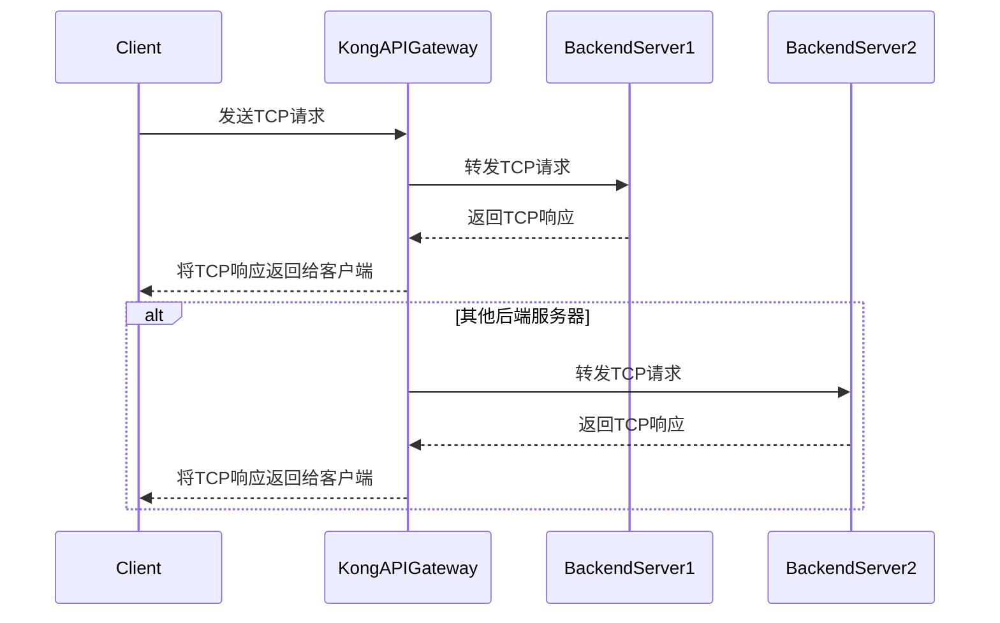

# vuepress


## vuepress 1.x

注意：

- docs 中每个 markdown 目录都必须要包含一个 README.md 文件，否则 sidebar 不能够正常生成。
- 没有找到解决方案在不修改 md 中的``情况下同时兼容 Typora 和 VuePress 1.x 的图片显示。 


### 环境配置

nodejs v15.14.0 不能启动 vuepress。`vuepress1.x`使用`nodejs v20.12.2`兼容。


### 新建项目

>`https://v1.vuepress.vuejs.org/guide/getting-started.html`

详细用法请参考`https://gitee.com/dexterleslie/demonstration/tree/master/demo-cms-system/demo-vuepress/demo-vuepress1-getting-started`

创建并切换到新目录

```sh
mkdir demo-vuepress1-getting-started
cd demo-vuepress1-getting-started
```

初始化项目

```sh
npm init
```

安装 vuepress 依赖

```sh
npm install -D vuepress
```

创建 docs 目录

```sh
mkdir docs
```

创建文件 docs/README.md 内容如下：

```sh
# Hello VuePress
```

package.json 添加 scripts

```sh
{
  "scripts": {
    "docs:dev": "vuepress dev docs",
    "docs:build": "vuepress build docs"
  }
}
```

开发模式运行 vuepress

```sh
npm run docs:dev
```

打开浏览器访问`http://localhost:8080/`


### 图片处理

>`https://code.luasoftware.com/tutorials/vuepress/vuepress-linking-to-images`

把图片 logo.svg 放置于 /docs/.vuepress/public 目录中

在 markdown 文档中引用图片``


### nav 和 sidebar

详细用法请参考`https://gitee.com/dexterleslie/demonstration/tree/master/demo-cms-system/demo-vuepress/demo-vuepress1-all`


### 插件

#### `vuepress-plugin-mermaidjs`插件

> `vuepress-plugin-mermaidjs`插件用于解析`markdown`中的`mermaid`代码块转换为`html`中的`svg`指令。

安装`vuepress-plugin-mermaidjs`插件，注意：`vuepress1.x`只能兼容到`vuepress-plugin-mermaidjs-1.9.1`，更新版本的`vuepress-plugin-mermaidjs`兼容`vuepress2.x`。

```bash
npm install --save-dev vuepress-plugin-mermaidjs@1.9.1
```

`.vuepress/config.js`中配置`vuepress-plugin-mermaidjs`插件

```js
module.exports = {
    ...
    plugins: [
        'mermaidjs'
    ]
}
```

`markdown`文件中使用`mermaid`语法画时序图



`vuepress1.x`会自动编译`mermaid`语法时序图到`html svg`指令。


## vuepress2


### 环境配置

vuepress2 需要 nodejs v18.16.0+，nodejs v15.14.0 不能启动 vuepress。


### 新建项目

> 文档 Gettting Started`https://v2.vuepress.vuejs.org/guide/getting-started.html#getting-started`

详细用法请参考`https://gitee.com/dexterleslie/demonstration/tree/master/demo-cms-system/demo-vuepress/demo-vuepress2-getting-started`

创建并切换到新目录

```sh
mkdir demo-vuepress2-getting-started
cd demo-vuepress2-getting-started
```

初始化项目

```sh
npm init
```

安装 vuepress

```sh
# 安装 vuepress
npm install -D vuepress@next
# 安装 bundler and theme
npm install -D @vuepress/bundler-vite@next @vuepress/theme-default@next
```

创建 docs 和 docs/.vuepress 目录

```sh
mkdir -p docs/.vuepress
```

创建 vuepress 配置文件 docs/.vuepress/config.js

```typescript
import { viteBundler } from '@vuepress/bundler-vite'
import { defaultTheme } from '@vuepress/theme-default'
import { defineUserConfig } from 'vuepress'

export default defineUserConfig({
  bundler: viteBundler(),
  theme: defaultTheme(),
})
```

创建第一个 markdown 文件 docs/README.md

```markdown
# Hello VuePress
```

在设置完成后，项目结构如下：

```
.
├── docs
│   ├── README.md
│   └── .vuepress
│       └── config.js
├── package.json
└── package-lock.json
```

添加一下 scripts 到 package.json 中

```json
{
  "scripts": {
    "docs:dev": "vuepress dev docs",
    "docs:build": "vuepress build docs"
  }
}
```

开发模式启动项目

```sh
npm run docs:dev
```

打开浏览器访问`http://localhost:8080/`即可查看效果

