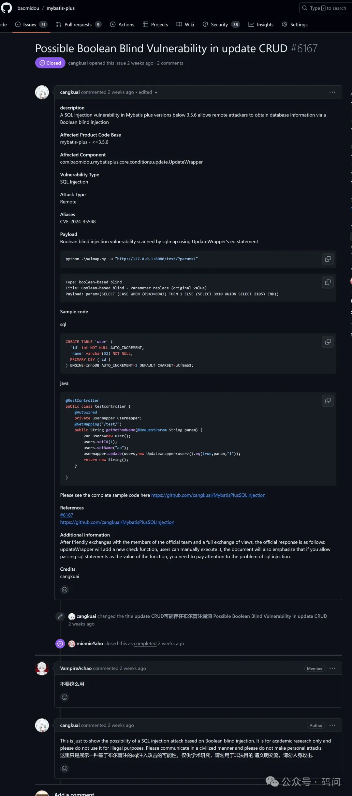

# 应用安全

## SQL注入

> SQL注入攻击是一种利用Web应用程序中的安全漏洞，将恶意SQL代码注入到数据库查询中的攻击方式。以下是关于SQL注入攻击的详细解释：
>
> 1. 攻击原理：
>    - 攻击者通过在Web应用程序的输入字段中插入恶意的SQL代码，这些代码随后在后台的数据库服务器上被解析和执行。
>    - 这种方式使得攻击者能够获取或修改数据库中的数据，或者执行其他非法操作。
> 2. 攻击特点：
>    - **广泛性**：任何基于SQL语言的数据库都可能成为攻击目标，因为许多开发人员在编写Web应用程序时，未对从输入参数、Web表单、cookie等接收到的值进行规范性验证和检测。
>    - **隐蔽性**：SQL注入语句通常嵌入在普通的HTTP请求中，很难与正常语句区分开，导致许多防火墙难以识别并发出警告。此外，SQL注入的变种极多，攻击者可以调整攻击参数，使得传统防御方法效果不理想。
>    - **危害大**：攻击者可以通过SQL注入获取到服务器的库名、表名、字段名，甚至整个服务器中的数据，对网站用户的数据安全构成极大威胁。此外，攻击者还可能获取后台管理员密码，对网页页面进行恶意篡改，对整个数据库系统安全产生严重影响。
>    - **操作方便**：互联网上存在许多简单易用的SQL注入工具，使得攻击过程变得简单，即使不具备专业知识的人也能轻易使用。
> 3. 攻击类型：
>    - **基于错误的SQL注入**：攻击者故意制造错误的SQL查询，以便从数据库错误信息中获取有用信息。
>    - **基于内容的盲SQL注入**：通过改变查询和观察页面内容的变化来判断注入的SQL查询是否执行成功。
>    - **基于时间的盲SQL注入**：攻击者通过观察数据库响应的时间来推断查询的正确性。
>    - **联合查询SQL注入**：通过利用UNION SQL操作符，攻击者可以执行额外的选择查询，并将结果合并到原始查询的输出中。
> 4. 防范措施：
>    - **对用户进行分级管理**：严格控制用户的权限，禁止普通用户执行数据库建立、删除、修改等操作。
>    - **参数传值**：在书写SQL语言时，禁止将变量直接写入到SQL语句，而是通过设置相应的参数来传递相关的变量。
>    - **输入验证和过滤**：对用户输入进行严格的验证和过滤，确保只包含合法的查询参数。
>    - **使用安全参数**：在程序编写时尽量使用安全参数来防止注入式攻击。
>    - **漏洞扫描**：使用专业的扫描工具及时扫描系统存在的漏洞。
>
> SQL注入漏洞可以被用于多种目的，例如绕过身份验证、提取敏感数据、修改数据库内容等。攻击者通常通过在用户输入字段中插入恶意的SQL代码来利用这些漏洞。
>
> 综上所述，SQL注入攻击是一种严重的安全威胁，需要开发人员和信息安全专家共同努力，采取多层次、综合性的防范措施来应对。

### 基于错误的`SQL`注入

>基于错误的SQL注入（Error-based SQL Injection）通常涉及利用应用程序返回的数据库错误消息来推断数据库的结构或内容。
>
>**防御措施**：
>
>1. **使用参数化查询（PreparedStatement）**：这是防止SQL注入的最佳方法。通过使用PreparedStatement，你可以确保用户输入被当作数据而不是SQL代码来处理。
>2. **验证和清理用户输入**：虽然这不足以完全防止SQL注入（因为攻击者可能会绕过验证），但它可以作为额外的安全层。
>3. **不要在生产环境中显示详细的错误消息**：向用户显示详细的数据库错误消息可能会泄露有关数据库结构和其他敏感信息。相反，应该记录错误到安全的日志文件，并向用户显示通用的错误消息。
>4. **使用最小权限原则**：确保数据库连接使用的账号具有尽可能少的权限，以减少潜在的安全风险。
>
>这种注入适用于有数据库错误信息返回到界面的情况，通过查看错误信息即可判断是否有执行注入的`sql`
>
>详细用法请参考 [链接](https://github.com/dexterleslie1/demonstration/blob/master/demo-computer-information-security/demo-sql-injection/src/main/java/com/future/demo/JdbcSqlInjectionController.java#L38)

```java
@GetMapping("jdbc/testErrorBasedSqlInjection")
ObjectResponse<String> testErrorBasedSqlInjection(
    @RequestParam(name = "username", defaultValue = "") String username
) throws SQLException, BusinessException {
    try {
        // 注意：因为要执行多条sql，所以在jdbc驱动中添加参数allowMultiQueries=true
        String url = "jdbc:mysql://localhost:3306/demo?allowMultiQueries=true";
        String user = "root";
        String password = "123456";
        String sql = "SELECT * FROM `user` WHERE username='" + username + "'";
        log.debug("恶意SQL: " + sql);

        try (Connection conn = DriverManager.getConnection(url, user, password);
             Statement stmt = conn.createStatement();
             ResultSet rs = stmt.executeQuery(sql)) {

            // ...
        }

        return ResponseUtils.failObject(ErrorCodeConstant.ErrorCodeCommon, "预期异常没有抛出");
    } catch (SQLSyntaxErrorException ex) {
        // Table 'demo.table_test' doesn't exist
        throw new BusinessException(ex.getMessage());
    }
}
```


### 基于内容的盲SQL注入（也称为布尔型盲SQL注入）

>基于内容的盲SQL注入（也称为布尔型盲SQL注入）通常发生在攻击者无法直接看到SQL查询结果，但可以根据查询返回的不同结果（例如页面结构的变化、返回内容的差异或请求处理时间的差异）来推断SQL查询是否执行成功。
>
>这种注入适用于没有数据库错误信息返回到界面的情况，通过接口返回状态判断是否执行注入的`sql`
>
>详细用法请参考 [链接](https://github.com/dexterleslie1/demonstration/blob/master/demo-computer-information-security/demo-sql-injection/src/main/java/com/future/demo/JdbcSqlInjectionController.java#L71)

```java
@GetMapping("jdbc/testBooleanBasedBlindSqlInjection")
ObjectResponse<String> testBooleanBasedBlindSqlInjection(
    @RequestParam(name = "username", defaultValue = "") String username
) throws SQLException, BusinessException {
    String url = "jdbc:mysql://localhost:3306/demo";
    String user = "root";
    String password = "123456";
    String sql = "SELECT * FROM `user` WHERE username='" + username + "'";
    log.debug("恶意SQL: " + sql);

    try (Connection conn = DriverManager.getConnection(url, user, password);
         Statement stmt = conn.createStatement();
         ResultSet rs = stmt.executeQuery(sql)) {

        if (!rs.next())
            // 盲注失败后会回登录界面并提示帐号密码错误
            return ResponseUtils.failObject(ErrorCodeConstant.ErrorCodeCommon, "跳转回登录界面并提示帐号密码错误");
        else
            // 盲注成功后会从登录界面跳转到主界面
            return ResponseUtils.successObject("从登录界面跳转到主界面");
    }
}
```


### 基于时间的盲SQL注入

>基于时间的盲SQL注入（也称为时间延迟型SQL注入）是一种攻击手段，攻击者通过在SQL查询中注入一个导致数据库查询延迟的语句，然后观察应用程序的响应时间来判断注入是否成功以及数据库的结构等信息。
>
>这种注入适用于没有数据库错误信息返回到界面的情况，通过接口调用耗时情况判断是否执行注入的`sql`
>
>详细用法请参考 [链接](https://github.com/dexterleslie1/demonstration/blob/master/demo-computer-information-security/demo-sql-injection/src/main/java/com/future/demo/JdbcSqlInjectionController.java#L101)

```java
@GetMapping("jdbc/testTimeBasedBlindSqlInjection")
ObjectResponse<Long> testTimeBasedBlindSqlInjection(
    @RequestParam(name = "username", defaultValue = "") String username
) throws SQLException, BusinessException {
    String url = "jdbc:mysql://localhost:3306/demo";
    String user = "root";
    String password = "123456";
    String sql = "SELECT * FROM `user` WHERE username='" + username + "'";
    log.debug("恶意SQL: " + sql);

    java.util.Date startTime = new java.util.Date();
    try (Connection conn = DriverManager.getConnection(url, user, password);
         Statement stmt = conn.createStatement();
         ResultSet rs = stmt.executeQuery(sql)) {

        java.util.Date endTime = new java.util.Date();
        return ResponseUtils.successObject(endTime.getTime() - startTime.getTime());
    }
}
```


### 联合查询SQL注入

>联合查询SQL注入是一种特定的SQL注入攻击技术，它利用SQL的UNION或UNION ALL操作符来合并多个SELECT查询的结果集，从而实现对数据库的非授权访问和数据泄露。
>
>这中注入用于窃取非授权访问的数据。
>
>详细用法请参考 [链接](https://github.com/dexterleslie1/demonstration/blob/master/demo-computer-information-security/demo-sql-injection/src/main/java/com/future/demo/JdbcSqlInjectionController.java#L128)

```java
@GetMapping("jdbc/testUnionBasedSqlInjection")
ListResponse<String> testUnionBasedSqlInjection(
    @RequestParam(name = "username", defaultValue = "") String username
) throws SQLException, BusinessException {
    String url = "jdbc:mysql://localhost:3306/demo";
    String user = "root";
    String password = "123456";
    String sql = "SELECT * FROM `user` WHERE username='" + username + "'";
    log.debug("恶意SQL: " + sql);

    try (Connection conn = DriverManager.getConnection(url, user, password);
         Statement stmt = conn.createStatement();
         ResultSet rs = stmt.executeQuery(sql)) {
        List<String> userList = new ArrayList<>();
        while (rs.next()) {
            userList.add(rs.getString("username"));
        }
        return ResponseUtils.successList(userList);
    }
}
```


### `mybatis-plus ${}`参数的`sql`注入

> 详细用法请参考 [链接](https://github.com/dexterleslie1/demonstration/blob/master/demo-computer-information-security/demo-sql-injection/src/main/java/com/future/demo/mapper/UserMapper.java)

`controller`接口如下：

```java
@GetMapping("mybatis-plus/testSqlInjection")
ListResponse<String> testMybatisPlusSqlInjection(
    @RequestParam(name = "username", defaultValue = "") String username
) throws SQLException, BusinessException {
    List<User> userList = this.userMapper.getByUsername(username);
    return ResponseUtils.successList(userList.stream().map(o -> o.getUsername()).collect(Collectors.toList()));
}
```

`mapper`代码如下：

```java
public interface UserMapper extends BaseMapper<User> {
    @Select("select * from `user` where username=${username}")
    List<User> getByUsername(@Param("username") String username);
}
```


### `sql`注入漏洞扫描

- todo 如何批量`sql`注入漏洞扫描呢？

- `SQLMap`

  > SQLMap是一个自动化的SQL注入工具，它主要用于扫描、发现并利用给定的URL和SQL注入漏洞。

  - 安装`sqlmap`

    ```bash
    # 克隆sqlmap源代码
    git clone https://github.com/sqlmapproject/sqlmap.git
    
    # 切换到sqlmap目录
    cd sqlmap
    
    # 测试sqlmap是否正常工作
    python sqlmap.py -h
    ```

  - 检测注入点

    使用`-u`参数指定URL，并检查是否存在SQL注入点。

    ```bash
    python sqlmap.py -u 'http://localhost:18080/api/v1/mybatis-plus/testSqlInjection?username=1'
    ```

    果中间出现提示，根据需要输入`y`进行确认。

  - 清除所有的扫描历史和缓存

    ```bash
    python sqlmap.py --purge
    ```

  - 查看所有数据库

    使用`--dbs`参数列出目标上的所有数据库。

    ```bash
    python sqlmap.py -u 'http://localhost:18080/api/v1/mybatis-plus/testSqlInjection?username=1' --dbs
    ```

  - 查看当前使用的数据库

    使用`--current-db`参数查看当前使用的数据库。

    ```bash
    python sqlmap.py -u 'http://localhost:18080/api/v1/mybatis-plus/testSqlInjection?username=1' --current-db
    ```

  - 查看数据表

    使用`-D`参数指定数据库名，`--tables`参数列出指定数据库中的所有表。

    ```bash
    python sqlmap.py -u 'http://localhost:18080/api/v1/mybatis-plus/testSqlInjection?username=1' -D 'demo' --tables
    ```

  - 查看字段

    使用`-T`参数指定表名，`--columns`参数列出指定表中的所有字段。

    ```bash
    python sqlmap.py -u 'http://localhost:18080/api/v1/mybatis-plus/testSqlInjection?username=1' -D 'demo' -T 'user' --columns
    ```

  - 查看数据

    使用`--dump`参数导出指定表中的数据。

    ```bash
    python sqlmap.py -u 'http://localhost:18080/api/v1/mybatis-plus/testSqlInjection?username=1' -D 'demo' -T 'user' --dump
    ```

### `CVE-2024-35548`

>[MybatisPlus 最新漏洞 CVE-2024-35548 申明](https://mp.weixin.qq.com/s?__biz=MzA4NzgyMTI0MA==&mid=2649526788&idx=1&sn=5f4cfbe92097cdd45fa8db72e5b9c1f1&chksm=882bacd3bf5c25c5407d6251f4fa6a7ad444c1fcfba5830636cb217b7ffd37324f15bea0000d&token=72916232&lang=zh_CN#rd)
>
>[[MybatisPlus “漏洞 CVE-2024-35548” 申明 & 探讨](https://www.oschina.net/news/295115)]
>
>[CVE-2024-35548 列sql注入检测增强提交](https://github.com/baomidou/mybatis-plus/commit/1c5ef2cfb6fe2ae125539646dc07322886585f6c)
>
>此漏洞是因为开发者对`mybatis-plus`用法不当导致，允许在前端传入动态查询的列名的`sql`片段引起的。代码逻辑如图片所示：

## `WAF`防火墙

### `naxsi`防火墙

- `naxsi`防火墙编译和使用

  > 示例从`openresty`和`naxsi`源代码编译`naxsi`防火墙，详细用法请参考 [链接](https://github.com/dexterleslie1/demonstration/tree/master/demo-computer-information-security/demo-naxsi)

  - 编译`openresty`和`naxsi`

    ```bash
    ./build.sh
    ```

    

  - 使用`docker ad-hoc`方式运行`naxsi`

    ```bash
    docker run -d --name openresty-xxx -e TZ=Asia/Shanghai \
      -v $PWD/nginx.conf:/usr/local/openresty/nginx/conf/nginx.conf \
      -v $PWD/naxsi.rules:/usr/local/openresty/nginx/conf/naxsi.rules \
      -p 80:80 --restart always \
      demo-openresty:1.1.1
    ```

    

  - 使用`docker compose`方式运行`naxsi`

    `docker-compose.yaml`内容如下：

    ```yaml
    version: "3.0"
    
    services:
      openresty:
        image: demo-openresty:1.1.1
        environment:
          - TZ=Asia/Shanghai
        ports:
          - 80:80
        volumes:
          - ./nginx.conf:/usr/local/openresty/nginx/conf/nginx.conf
          - ./naxsi.rules:/usr/local/openresty/nginx/conf/naxsi.rules
    ```

    启动`naxsi`

    ```bash
    docker compose up -d
    ```

    关闭`naxsi`

    ```bash
    docker compose down -v
    ```

- `naxsi`防火墙对`sql`注入的防御能力如何？

  > 此实验使用示例 [链接](https://github.com/dexterleslie1/demonstration/tree/master/demo-computer-information-security/demo-sql-injection) 协助测试。
  >
  > 结论：经过示例的协助测试，`naxsi`防火墙能够阻断本示例和`sqlmap`的所有`sql`注入测试。

  `naxsi.rules`规则文件配置如下：

  ```properties
  # LearningMode;
  SecRulesEnabled;
  DeniedUrl "/request_denied";
  
  ## Check & Blocking Rules
  CheckRule "$SQL >= 8" BLOCK;
  CheckRule "$RFI >= 8" BLOCK;
  CheckRule "$TRAVERSAL >= 4" BLOCK;
  CheckRule "$EVADE >= 4" BLOCK;
  CheckRule "$XSS >= 8" BLOCK;
  
  BasicRule wl:2;
  BasicRule wl:16;
  ```