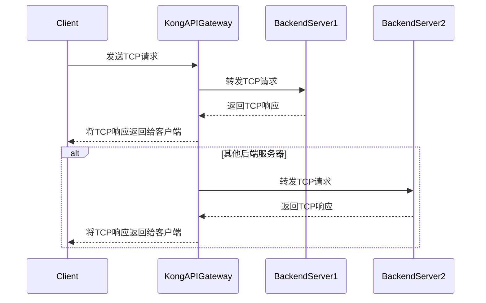

# `typora`使用`mermaid`语法画流程图

## 什么是`mermaid`呢？

> Mermaid 是一个基于 JavaScript 的图表绘制库，专为简化图表的创建和修改过程而设计。以下是对 Mermaid 的详细解释：
>
> 1. 功能：
>    - Mermaid 允许用户通过简单的文本语法来描述和创建各种类型的图表，如流程图、状态图、时序图以及甘特图等。
>    - 它以 HTML 形式渲染图表，而不是生成静态图片，这使得图表更加灵活和安全。
> 2. 特点：
>    - **基于文本**：Mermaid 使用简单的文本语法来描述图表，无需使用复杂的图形绘制工具或编写大量的代码。
>    - **可读性强**：其语法类似于自然语言和常见的流程图表示，易于理解和阅读。
>    - **支持多种图表类型**：Mermaid 支持多种图表类型，包括但不限于流程图、时序图、甘特图、类图等。
>    - **自动布局**：根据需要自动布局图表元素，以保证图表的美观和可读性。
>    - **样式定制**：允许用户通过 CSS 样式来自定义图表的外观和样式。
>    - **导出功能**：图表可以导出为 PNG、SVG 等常见的图像格式，方便在不同平台和应用程序中使用。
> 3. 应用场景：
>    - Mermaid 特别适合于与 Markdown 结合使用，用于在 web 环境中创建各种类型的图表。它可以用于文档、技术博客、项目文档等，帮助用户以直观的方式展示各种流程、状态、时序等信息，从而提高文档的可读性和可理解性。
> 4. 学习曲线：
>    - 如果用户熟悉 Markdown，那么学习 Mermaid 的语法应该相对容易。Mermaid 的语法使用了一些关键词和符号来表示不同类型的图表元素，例如 "graph" 表示整个图表，"node" 表示节点，"link" 表示连接等。
> 5. 社区支持：
>    - Mermaid 拥有一个活跃的社区，提供了丰富的教程、示例和文档，帮助用户快速上手并解决问题。此外，社区还提供了在线编辑器和插件，方便用户在不同平台和应用程序中使用 Mermaid。
>
> 总之，Mermaid 是一个功能强大、易于学习和使用的图表绘制库，适用于各种场景下的图表创建和修改需求。

## 使用`mermaid`画时序图

演示的时序图如下：



Typora 结合 Mermaid 绘制时序图的过程相对简单，以下是详细的步骤和说明：

1. 初始化 Mermaid 图表：
   - 在 Typora 中，首先输入三个反引号（```）并紧接着输入“mermaid”，然后敲击回车。这将初始化一个空白的 Mermaid 图表区域。
2. 定义时序图：
   - 使用 `sequenceDiagram` 声明开始一个时序图。
   - 使用 `participant` 关键字定义时序图中的参与者。例如，`participant Client` 定义了一个名为 "Client" 的参与者。
3. 添加消息和箭头：
   - 使用 `->>` 表示同步消息（实线箭头），使用 `-->>` 表示异步消息（虚线箭头）。
   - 消息的格式通常是 `参与者A ->> 参与者B: 消息内容`。