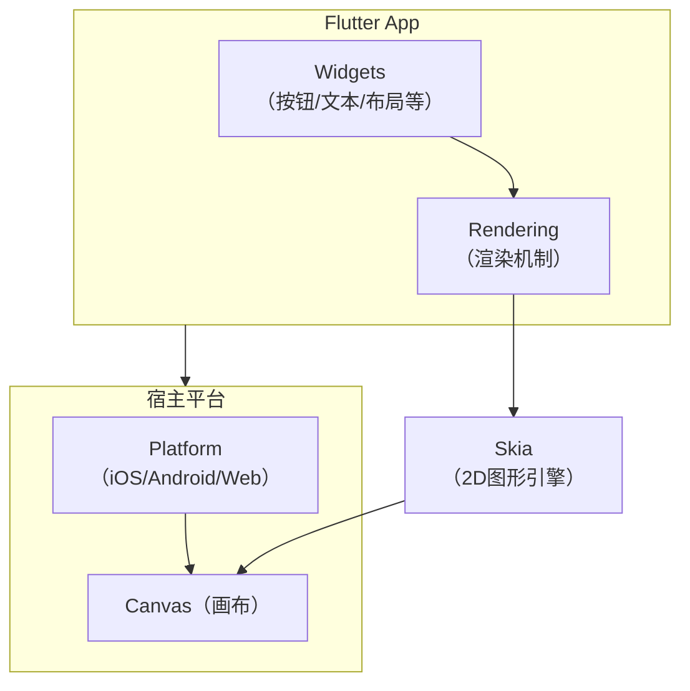

## 概念

### 一、一句话概括

**Flutter 是 Google 开源的一个用于构建高质量、高性能原生应用（iOS、Android、Web、桌面等）的 UI 工具包。**

简单来说，它让你**只用一套代码库，就能同时开发出运行在多个平台（如 iOS 和 Android）上的应用**，并且这些应用的外观、性能和交互体验都堪比原生开发的应用。

---

### 二、核心特点：它如何实现“一套代码，多端运行”？

与传统方案（如 React Native、Weex）不同，Flutter 的实现方式非常独特和彻底：

| 方案                                      | 原理                                                         | 特点                                                         |
| :---------------------------------------- | :----------------------------------------------------------- | :----------------------------------------------------------- |
| **原生开发**                              | 使用平台专属语言（Android用Java/Kotlin，iOS用Swift/Objective-C）写两套代码。 | **性能最佳**，但**开发成本高、周期长**。                     |
| **WebView 混合开发**（如 Cordova、Ionic） | 将网页（HTML+CSS+JS）嵌入到一个原生应用的外壳（WebView）中。 | 开发快，但**性能差、体验与原生差异大**。                     |
| **JavaScript 桥接**（如 React Native）    | 用 JS 写业务逻辑，通过一个“桥接”器调用原生组件进行渲染。     | 体验接近原生，但**桥接可能成为性能瓶颈**，交互复杂时易出问题。 |
| **Flutter**                               | **自绘引擎** + **Skia 图形库**                               | **彻底绕开原生控件**，自己绘制UI，性能极高，体验高度一致。   |

**Flutter 的核心奥秘在于：**

1.  **没有使用原生控件**：它不依赖 iOS 的 UIKit 或 Android 的 Material 组件。相反，它提供了一个丰富的、高质量的**自定义组件库**（称为 Widgets）。
2.  **自绘 UI**：Flutter 使用 C++ 编写的 **Skia 2D 图形引擎**（Chrome 浏览器和 Android 也使用它）来直接将 UI 绘制到画布上。
3.  **Dart 语言与 AOT 编译**：Flutter 使用 Dart 语言开发。在发布时，Dart 代码会被**提前编译（AOT）** 为特定平台的原生机器码。这使得应用启动极快，执行效率极高。

**打个比方：**
- **传统跨平台方案**：像是一个“翻译官”，你把指令（JS代码）给它，它翻译给 iOS 和 Android 两个“工人”（原生系统）去干活。翻译过程有开销，还可能翻译错。
- **Flutter**：像是自带了一个“全能施工队”。你下达指令（Dart代码），这个施工队用自己的材料和工艺（Skia引擎）直接在空地上把房子（UI）盖起来，完全不需要依赖当地（iOS/Android）的施工队和材料。所以效率更高，结果更一致。

---

### 三、核心技术特性

1.  **万物皆 Widget（组件）**
    Flutter 的 UI 是由一个个 **Widget** 嵌套组合而成的。从一个按钮、一段文字，到整个页面布局，甚至动画、手势检测，都是 Widget。这种高度一致的组合模式使得构建 UI 非常灵活和直观。
    ```dart
    // 一个简单的 Widget 示例：一个居中的按钮
    Center(
      child: ElevatedButton(
        onPressed: () { print('Hello Flutter!'); },
        child: Text('点击我'),
      ),
    )
    ```

2.  **响应式框架**
    Flutter 的 UI 是声明式的。当应用的状态（数据）发生变化时，UI 会自动更新。你不需要手动操作 DOM 或视图元素，只需描述“在当前状态下，UI 应该长什么样”。

3.  **热重载**
    这是 Flutter 的王牌功能。修改代码后，只需按保存或点击热重载按钮，几乎**一秒内**就能在模拟器或真机上看到变化，而**无需重启应用**。这极大地提升了开发效率。

4.  **丰富的组件库**
    Flutter 提供了两大风格的组件库，以适应不同平台的设计规范：
    - **Material Components**：实现了 Google 的 Material Design 规范，用于 Android 和 Web。
    - **Cupertino Components**：实现了 Apple 的 iOS Human Interface Guidelines，用于 iOS 应用。

---

### 四、Flutter 能做什么？

Flutter 的应用范围非常广泛：

1.  **移动应用（iOS & Android）**：这是最主流的场景，从简单的工具应用到复杂的电商、社交应用。
2.  **Web 应用**：可以编译成高性能的 Web 应用。
3.  **桌面应用（Windows, macOS, Linux）**：可以开发原生桌面应用程序。
4.  **嵌入式设备**：甚至可以在智能汽车、智能家居等设备上运行。

**知名案例**：Google Ads、阿里巴巴、字节跳动、腾讯、宝马、eBay 等公司的很多应用都使用了 Flutter。

---

### 五、优点与缺点

#### 优点：
- **高性能**：AOT 编译和自绘引擎带来了媲美原生的流畅体验。
- **高开发效率**：一套代码多端部署，加热重载，极大缩短开发周期。
- **一致的用户体验**：在不同平台上外观和行为完全一致，避免因平台差异导致的体验碎片化。
- **漂亮的 UI**：内置丰富的动画和组件，轻松实现精美的 UI 效果。
- **强大的社区和生态**：由 Google 强力支持，拥有庞大活跃的开发者社区和丰富的第三方包。

#### 缺点：
- **应用体积较大**：由于内置了渲染引擎，打包后的安装包会比纯原生应用大一些。
- **动态化能力受限**：在 iOS 和 Android 上，无法像 Web 或 JS 框架那样轻松实现“热更新”（不通过应用商店审核直接更新代码）。
- **生态系统成熟度**：虽然发展迅速，但在某些极其冷门、特定的原生功能上，可能不如原生开发成熟。

---

### 总结

**Flutter 不仅仅是一个“跨平台”框架，更是一个现代化的、高性能的 UI 开发解决方案。** 它通过其独特的技术架构，在保证性能的同时，极大地提升了开发效率和一致性。

- **如果你追求**：**高性能、快速开发、一致的跨平台体验、以及精美的 UI**，那么 Flutter 是一个非常出色甚至是最佳的选择。
- **如果你的应用**：**极度依赖平台特有的、非常底层的复杂功能**，那么可能需要评估 Flutter 生态对该功能的支持程度，或考虑结合原生代码开发。


## 跨平台原理

### 一、核心思想：颠覆传统的“自绘”模式

要理解 Flutter，首先要明白其他跨平台框架是怎么工作的：

1.  **原生开发**：直接调用操作系统提供的组件。
2.  **WebView 方案**：在应用内嵌一个浏览器来显示网页。
3.  **React Native 类方案**：使用 JavaScript 编写逻辑，通过一个“桥接”将指令翻译给原生组件进行渲染。

Flutter 走了一条完全不同的路：**它彻底抛弃了原生组件，自己实现了一套完整的渲染引擎和组件库。**

**打个比方：**
- **React Native** 像是一个 **“翻译官”**。你（开发者）用 JavaScript 下命令，它翻译成 iOS 和 Android 能听懂的话，让两个平台各自的“工人”（原生组件）去干活。翻译过程有延迟，而且两个“工人”手艺不同，最终效果可能有细微差别。
- **Flutter** 则像是一个 **“自带施工队的全能开发商”**。你（开发者）用 Dart 语言给出设计图，Flutter 自己的施工队（Skia 图形引擎）直接在空地上（画布），用自己的材料和工艺，把房子（UI）从地基到装修完全独立地盖起来。它不依赖当地（iOS/Android）的施工队和材料，所以盖房速度极快，且无论在哪个地方盖，房子都一模一样。

---

### 二、技术原理的“三驾马车”

Flutter 的跨平台能力主要建立在三大技术支柱之上，其架构如下图所示：



#### 1. Dart 语言与 AOT 编译（大脑和神经）

- **Dart 语言**：Flutter 选用 Dart 是有深意的。它是一种现代化的语言，同时支持 **AOT** 和 **JIT** 编译。
    - **开发时（JIT）**：Just-In-Time 编译，实现了**热重载**功能，修改代码后立即看到效果，极大提升开发效率。
    - **发布时（AOT）**：Ahead-Of-Time 编译。你的 Dart 代码会被直接编译成对应平台（如 ARM）的**原生机器码**。
- **AOT 的好处**：
    - **启动速度快**：应用启动时不需要解释执行，直接运行机器码。
    - **性能极高**：执行效率堪比原生开发（Objective-C/Swift, Java/Kotlin）。
    - **避免“桥接”开销**：这是与 React Native 的关键区别。Flutter 不需要在 JavaScript 和原生平台之间进行缓慢的桥接通信。

#### 2. 自绘引擎 Skia（肌肉和画笔）

- **Skia**：这是一个由 Google 维护的、强大且成熟的**开源 2D 图形库**。Chrome 浏览器、Android 系统、Adobe 系列软件等都使用它。
- **Flutter 的用法**：Flutter 将 Skia 引擎**打包进了每个应用里**。当需要绘制 UI 时，Flutter 的渲染引擎会直接调用 Skia 来向屏幕的画布（Canvas）进行绘制。
- **结果**：无论是绘制一个按钮、一段文字，还是一个复杂的动画，最终都是在直接操作 GPU 进行绘制。这带来了**极高的渲染性能**和**跨平台的一致性**。在 iOS 和 Android 上，UI 的像素级表现都是完全一样的。

#### 3. 架构分层：从 Widget 到像素（工作流水线）

Flutter 的架构清晰地划分了职责，如上图所示，其渲染流程是一个高效的分层流水线：

- **Widget层**：这是你作为开发者主要接触的部分。它描述了**元素的配置**，即“这个组件应该长什么样”。Flutter 提供了极其丰富的 Widget，一切皆是 Widget，它们通过组合和嵌套来构建复杂的 UI。Widget 本身是**不可变**的，当状态变化时，Flutter 会高效地重建 widget 树。

- **Rendering层**：这一层负责**布局和绘制**。它接收来自 Widget 层的描述，并进行：
    - **布局**：计算每个元素在屏幕上的位置和大小（执行约束框模型）。
    - **绘制**：将元素绘制到不同的图层上。
    渲染层生成一个**渲染树**，这是一个非常轻量且易于更新的数据结构，确保了 UI 更新的高性能。

- **最终绘制**：渲染树产生的绘图指令被传递给 Skia 引擎。Skia 将这些指令转化为真正的像素点，通过 OpenGL 或 Vulkan 等图形 API 直接绘制到屏幕上。

---

### 三、与 React Native 的原理对比（加强理解）

| 特性          | **Flutter**                                  | **React Native**                                         |
| :------------ | :------------------------------------------- | :------------------------------------------------------- |
| **UI 组件**   | **自有组件**，不依赖原生控件                 | **映射为原生控件**（如 `<View>` 变成 `UIView`）          |
| **渲染方式**  | **自绘**，通过 Skia 直接渲染                 | **桥接调用**，依赖原生系统渲染                           |
| **编程语言**  | **Dart**，AOT 编译为原生码                   | **JavaScript**，通过 JavaScriptCore 解释执行             |
| **通信方式**  | 无桥接，直接编译为本地代码                   | 需要 **JavaScript Bridge** 进行异步通信                  |
| **性能特点**  | **高性能**，启动快，渲染流畅，性能稳定可预测 | **存在瓶颈**，桥接通信可能成为性能瓶颈，交互复杂时易卡顿 |
| **UI 一致性** | **极高**，不同平台显示效果完全一致           | **一般**，依赖原生控件，iOS/Android 体验有差异           |
| **包大小**    | 较大（因内置渲染引擎）                       | 相对较小                                                 |

---

### 总结

Flutter 的跨平台原理可以概括为：**通过将 Dart 代码 AOT 编译为原生机器码，并内置强大的 Skia 自绘引擎，使其能够绕过原生控件和桥接通信，直接与底层画布对话，从而实现了高性能、高一致性的跨平台渲染。**

这种“自带干粮”的方式，虽然牺牲了一点初始的安装包体积，但换来了无与伦比的性能、流畅度和开发体验，是其成功的根本原因。


## 开发环境搭建

### `Ubuntu22.04.5`

参考本站 [链接](/android/README.html#ubuntu22-04-5) 安装 `Android Studio 2024.2.1` 并运行一个 `Android` 原生项目。

`Android Studio` 安装 `Flutter` 插件以支持 `Flutter` 开发：打开 `File` > `Settings` > `Plugins` 功能，搜索 `Flutter` 插件并安装，安装完成后重启 `Android Studio`

下载 `Flutter SDK 3.10.3`：https://docs.flutter.cn/install/archive，解压 `flutter_linux_3.10.3-stable.tar` 命令如下：

```sh
# 解压到用户 home 目录
cd ~
tar -xvf flutter_linux_3.10.3-stable.tar
mv flutter flutter-3.10.3
```

安装 `git`

```sh
sudo apt install git
```

安装 `jdk17`

```sh
sudo dcli jdk install
```

第一次创建 `flutter` 项目时需要删除之前的 `Android Studio` 缓存，否则会在创建 `flutter` 项目时一直卡在 `Creating Flutter Project` 弹框中。

```sh
cd ~/.config/Google && rm -rf AndroidStudio2024.2/
```

第一次创建 `flutter` 项目时选择上面的 `flutter sdk`。

第一次创建 `flutter` 项目时需要设置代理，因为创建项目过程中需要在线下载相关组件。


## `dart`语言 - 调试环境

使用 `Android Studio` 创建一个 `flutter` 项目，在 `test` 目录中新建 `test.dart` 测试：

```dart
import 'package:flutter_test/flutter_test.dart';

void main() {
  test('expect测试', () => {
    expect(1, 1)
  });
}
```


## `dart`语言 - 定义函数

`test.dart`：

```dart
import 'package:flutter_test/flutter_test.dart';

void main() {
  test('expect测试', () => {expect(add(1, 2), 3)});
}

/// a 加 b
int add(int a, int b) {
  return a + b;
}

```


## `dart`语言 - 类的基础

Dart 是一种面向对象的编程语言，类是 Dart 的核心概念之一。以下是 Dart 中类的基础知识全面讲解：

### 一、类的基本结构

#### 1. 最简单的类定义

```dart
class Person {
  // 实例变量（字段）
  String name;
  int age;
  
  // 构造函数
  Person(this.name, this.age);
  
  // 方法
  void introduce() {
    print('Hello, I am $name, $age years old.');
  }
}
```

#### 2. 使用类

```dart
void main() {
  // 创建对象实例
  var person = Person('Alice', 25);
  
  // 访问字段
  print(person.name);  // 输出: Alice
  
  // 调用方法
  person.introduce();   // 输出: Hello, I am Alice, 25 years old.
  
  // 修改字段值
  person.age = 26;
  person.introduce();   // 输出: Hello, I am Alice, 26 years old.
}
```

### 二、构造函数

#### 1. 基本构造函数

```dart
class Point {
  double x;
  double y;
  
  // 传统写法
  Point(double x, double y) {
    this.x = x;
    this.y = y;
  }
  
  // 简化写法（推荐）
  Point(this.x, this.y);
}
```

#### 2. 命名构造函数

```dart
class Point {
  double x;
  double y;
  
  Point(this.x, this.y);
  
  // 命名构造函数
  Point.origin() {
    x = 0;
    y = 0;
  }
  
  // 另一个命名构造函数
  Point.fromJson(Map<String, double> json) 
    : x = json['x']!,
      y = json['y']!;
}

// 使用
var origin = Point.origin();
var point = Point.fromJson({'x': 1.0, 'y': 2.0});
```

#### 3. 重定向构造函数

```dart
class Point {
  double x;
  double y;
  
  // 主构造函数
  Point(this.x, this.y);
  
  // 重定向到主构造函数
  Point.alongXAxis(double x) : this(x, 0);
}
```

#### 4. 常量构造函数

```dart
class ImmutablePoint {
  final double x;
  final double y;
  
  // 常量构造函数
  const ImmutablePoint(this.x, this.y);
  
  // 常量实例
  static const ImmutablePoint origin = ImmutablePoint(0, 0);
}

// 使用
const point1 = ImmutablePoint(1, 2);
const point2 = ImmutablePoint(1, 2);
print(identical(point1, point2)); // true，相同的编译时常量
```

#### 5. 工厂构造函数

```dart
class Logger {
  final String name;
  static final Map<String, Logger> _cache = {};
  
  // 工厂构造函数
  factory Logger(String name) {
    return _cache.putIfAbsent(
      name, 
      () => Logger._internal(name)
    );
  }
  
  // 私有构造函数
  Logger._internal(this.name);
}

// 使用
var logger1 = Logger('main');
var logger2 = Logger('main');
print(identical(logger1, logger2)); // true，相同的实例
```

### 三、类成员

#### 1. 实例变量（字段）

```dart
class Rectangle {
  // 公开字段
  double width;
  double height;
  
  // 私有字段（以下划线开头）
  String _privateField = 'secret';
  
  // 计算属性
  double get area => width * height;
  
  // 带验证的setter
  set width(double value) {
    if (value <= 0) {
      throw ArgumentError('Width must be positive');
    }
    width = value;
  }
}
```

#### 2. 方法

```dart
class Calculator {
  // 实例方法
  int add(int a, int b) {
    return a + b;
  }
  
  // 静态方法
  static int multiply(int a, int b) {
    return a * b;
  }
  
  // 操作符重载
  Vector operator +(Vector other) {
    return Vector(x + other.x, y + other.y);
  }
}
```

#### 3. Getter 和 Setter

```dart
class Temperature {
  double _celsius;
  
  Temperature(this._celsius);
  
  // Getter
  double get celsius => _celsius;
  
  // Setter
  set celsius(double value) {
    _celsius = value;
  }
  
  // 计算属性
  double get fahrenheit => _celsius * 9 / 5 + 32;
  set fahrenheit(double value) {
    _celsius = (value - 32) * 5 / 9;
  }
}
```

### 四、继承与多态

#### 1. 简单继承

```dart
class Animal {
  String name;
  
  Animal(this.name);
  
  void eat() {
    print('$name is eating');
  }
}

class Dog extends Animal {
  String breed;
  
  // 调用父类构造函数
  Dog(String name, this.breed) : super(name);
  
  // 方法重写
  @override
  void eat() {
    super.eat();  // 调用父类方法
    print('$name the $breed is eating dog food');
  }
  
  // 新增方法
  void bark() {
    print('Woof!');
  }
}
```

#### 2. 抽象类

```dart
abstract class Shape {
  // 抽象方法
  double area();
  
  // 普通方法
  void printArea() {
    print('Area: ${area()}');
  }
}

class Circle extends Shape {
  double radius;
  
  Circle(this.radius);
  
  @override
  double area() {
    return 3.14 * radius * radius;
  }
}
```

#### 3. 接口实现

```dart
// 接口（Dart中每个类都隐式定义了一个接口）
class Greetable {
  void greet();
}

class Person implements Greetable {
  @override
  void greet() {
    print('Hello!');
  }
}
```

#### 4. Mixin（混入）

```dart
// 定义mixin
mixin Musical {
  void playMusic() {
    print('Playing music');
  }
}

mixin Dancer {
  void dance() {
    print('Dancing');
  }
}

// 使用mixin
class Performer with Musical, Dancer {
  void perform() {
    playMusic();
    dance();
  }
}
```

### 五、高级特性

#### 1. 泛型类

```dart
class Box<T> {
  T content;
  
  Box(this.content);
  
  void printContent() {
    print('Box contains: $content');
  }
}

// 使用
var stringBox = Box<String>('Dart');
var intBox = Box<int>(42);
```

#### 2. 扩展方法

```dart
// 为int类型添加扩展方法
extension IntExtensions on int {
  int squared() => this * this;
  
  bool get isEven => this % 2 == 0;
}

// 使用
print(5.squared());  // 25
print(4.isEven);     // true
```

#### 3. 可调用类

```dart
class Adder {
  int call(int a, int b) => a + b;
}

// 使用
var adder = Adder();
print(adder(2, 3));  // 5，像函数一样调用
```

### 六、最佳实践

#### 1. 封装原则

```dart
class BankAccount {
  // 私有字段
  double _balance;
  String _accountNumber;
  
  // 构造函数
  BankAccount(this._accountNumber, {double balance = 0}) 
    : _balance = balance;
  
  // 公开方法访问私有字段
  double get balance => _balance;
  
  String get accountNumber => _accountNumber;
  
  void deposit(double amount) {
    if (amount <= 0) {
      throw ArgumentError('Amount must be positive');
    }
    _balance += amount;
  }
  
  void withdraw(double amount) {
    if (amount <= 0) {
      throw ArgumentError('Amount must be positive');
    }
    if (amount > _balance) {
      throw ArgumentError('Insufficient funds');
    }
    _balance -= amount;
  }
}
```

#### 2. 不可变类

```dart
class ImmutablePerson {
  final String name;
  final int age;
  
  const ImmutablePerson(this.name, this.age);
  
  // 修改方法返回新实例
  ImmutablePerson withAge(int newAge) {
    return ImmutablePerson(name, newAge);
  }
}
```

#### 3. 文档注释

```dart
/// 表示二维空间中的点
class Point {
  /// x坐标
  final double x;
  
  /// y坐标
  final double y;
  
  /// 创建一个Point实例
  /// 
  /// [x] 和 [y] 分别表示点的x和y坐标
  Point(this.x, this.y);
  
  /// 计算到另一个点的距离
  double distanceTo(Point other) {
    var dx = x - other.x;
    var dy = y - other.y;
    return sqrt(dx * dx + dy * dy);
  }
}
```

### 七、完整示例

```dart
import 'dart:math';

/// 表示几何形状的抽象基类
abstract class Shape {
  /// 计算面积
  double area();
  
  /// 计算周长
  double perimeter();
  
  /// 打印形状信息
  void printInfo() {
    print('Area: ${area().toStringAsFixed(2)}, Perimeter: ${perimeter().toStringAsFixed(2)}');
  }
}

/// 圆形
class Circle implements Shape {
  final double radius;
  
  /// 创建圆形
  Circle(this.radius);
  
  @override
  double area() => pi * radius * radius;
  
  @override
  double perimeter() => 2 * pi * radius;
}

/// 矩形
class Rectangle implements Shape {
  final double width;
  final double height;
  
  /// 创建矩形
  Rectangle(this.width, this.height);
  
  /// 创建正方形
  Rectangle.square(double side) : this(side, side);
  
  @override
  double area() => width * height;
  
  @override
  double perimeter() => 2 * (width + height);
}

/// 形状工厂
class ShapeFactory {
  /// 根据类型创建形状
  static Shape create(String type, List<double> dimensions) {
    switch (type.toLowerCase()) {
      case 'circle':
        return Circle(dimensions[0]);
      case 'rectangle':
        return Rectangle(dimensions[0], dimensions[1]);
      case 'square':
        return Rectangle.square(dimensions[0]);
      default:
        throw ArgumentError('Unknown shape type: $type');
    }
  }
}

void main() {
  // 创建形状
  final circle = ShapeFactory.create('circle', [5.0]);
  final rectangle = ShapeFactory.create('rectangle', [4.0, 6.0]);
  final square = ShapeFactory.create('square', [3.0]);
  
  // 打印信息
  circle.printInfo();
  rectangle.printInfo();
  square.printInfo();
  
  // 使用扩展方法
  print(5.squared()); // 25
  print(4.isEven);    // true
}
```

### 八、总结

Dart 中的类系统提供了以下核心特性：

1. **封装**：通过公共接口隐藏实现细节
2. **继承**：使用 `extends` 实现类继承
3. **多态**：通过方法重写和接口实现
4. **抽象**：使用抽象类和抽象方法
5. **复用**：通过 mixin 实现多重继承
6. **泛型**：创建类型安全的通用类
7. **扩展**：为现有类添加新功能

掌握这些基础知识后，您可以：
- 设计清晰的类层次结构
- 创建可重用、可维护的代码
- 利用面向对象原则解决问题
- 构建复杂的 Dart 应用程序


## `dart`语言 - 构造函数命名参数

新建 `flutter` 项目中的模板代码中包含以下构造函数命名参数语法：

```dart
class MyApp extends StatelessWidget {
  const MyApp({super.key});
  
  ...
}
```

下面是等价的测试代码演示构造函数命名参数语法：

```dart
import 'package:flutter_test/flutter_test.dart';

void main() {
  test('测试', () {
    const emp = Employee(
      company: "Tech Corp",
      name: "Alice",
      age: 30,
    );

    expect(emp.company, "Tech Corp");
    expect(emp.name, 'Alice');
    expect(emp.age, 30);
  });
}

class Person {
  final String name;
  final int age;

  const Person({required this.name, required this.age});
}

class Employee extends Person {
  final String company;

  const Employee({
    required this.company,
    required super.name,
    required super.age,
  });

// 和上面等价的构造函数
// const Employee({
//   required this.company,
//   required String name,
//   required int age,
// }) : super(name: name, age: age);
}

```

