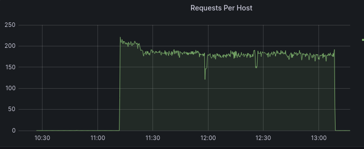
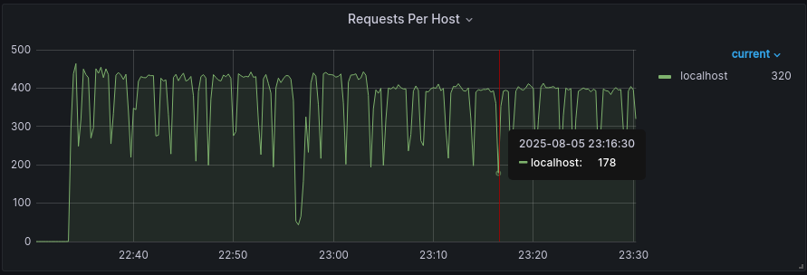
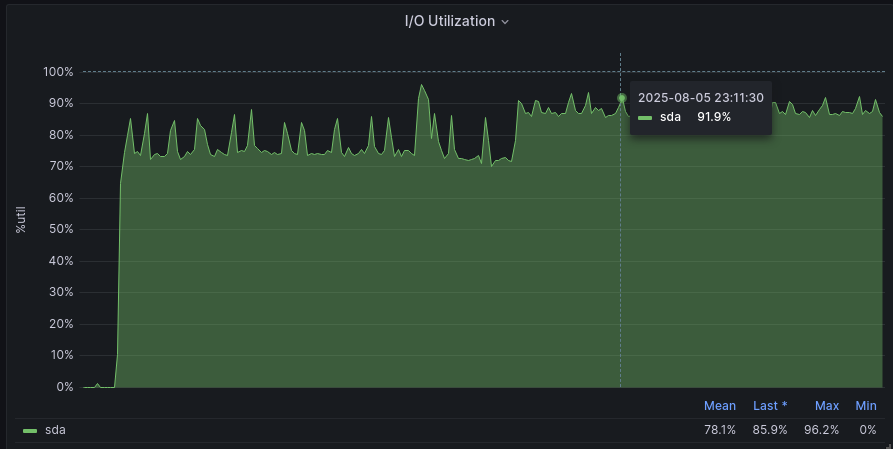
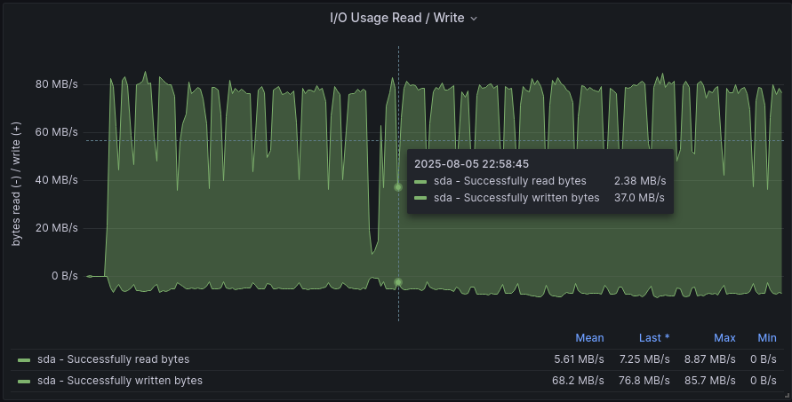

# `future`


## `random-id-picker` 服务

>中文名称为随机 `id` 选择器服务。
>
>背景：在海量订单或者商品数据场景中，需要模拟根据订单 `ID` 或者商品 `ID` 列表查询订单或者商品信息。此时需要借助随机 `ID` 选择器按照一定的频率随机抽取 `ID` 列表。

### 服务组件

`future-random-id-picker` 组件：

>使用 `SpringBoot` 实现以 `restful` 方式提供接口的核心服务。

- `GitHub` 地址：`https://github.com/dexterleslie1/future-random-id-picker.git`


`future-random-id-picker-sdk` 组件：

>`SpringBoot` 应用集成 `random-id-picker` 服务使用的 `sdk`。

- `GitHub` 地址：`https://github.com/dexterleslie1/future-random-id-picker-sdk.git`


### `Docker Compose` 运行服务

`docker-compose.yaml` 如下：

```yaml
version: "3.1"

services:
  # 随机 id 选择器服务
  future-random-id-picker-api:
    image: registry.cn-hangzhou.aliyuncs.com/future-public/random-id-picker-service:1.1.0
    environment:
      - JAVA_OPTS=-Xmx512m
      - TZ=Asia/Shanghai
      - db_host=future-random-id-picker-db
      - db_port=3306
    ports:
      - '50000:8080'
  future-random-id-picker-db:
    image: registry.cn-hangzhou.aliyuncs.com/future-public/random-id-picker-db:1.1.0
    command:
      - --character-set-server=utf8mb4
      - --collation-server=utf8mb4_general_ci
      - --skip-character-set-client-handshake
      - --innodb-buffer-pool-size=256m
    environment:
      - LANG=C.UTF-8
      - TZ=Asia/Shanghai
      - MYSQL_ROOT_PASSWORD=123456

```


### `SpringBoot` 应用集成

`POM` 配置片段：

```xml
<!-- 随机 id 选择器服务 -->
<dependency>
    <groupId>com.github.dexterleslie1</groupId>
    <artifactId>future-random-id-picker-sdk</artifactId>
    <version>1.1.3</version>
</dependency>

<repositories>
    <repository>
        <id>jitpack.io</id>
        <url>https://jitpack.io</url>
    </repository>
</repositories>
```

`application.properties` 中配置随机 `id` 选择器服务：

```properties
# 随机id选择器服务ip地址
spring.future.random.id.picker.host=${random_id_picker_host:localhost}
# 随机id选择器服务端口
spring.future.random.id.picker.port=${random_id_picker_port:50000}
# 随机id选择器服务本地缓存id最大总数
spring.future.random.id.picker.cache-size=102400
# 随机id选择器服务支持的flag列表
spring.future.random.id.picker.flag-list=order,product
```

在 `SpringBoot Application` 中启用随机 `id` 选择器服务：

```java
@SpringBootApplication
@EnableFutureRandomIdPicker
public class ApplicationService {
    public static void main(String[] args) {
        SpringApplication.run(ApplicationService.class, args);
    }
}
```

使用随机 `id` 服务接口：

```java
@Resource
RandomIdPickerService randomIdPickerService;
```


### 性能测试

复制 `Ansible` 配置到目标实例

```sh
ansible-playbook playbook-deployer-config.yml --inventory inventory.ini
```

启动服务

```sh
ansible-playbook playbook-service-start.yml --inventory inventory.ini
```

查看 `Prometheus` 监控 `http://192.168.1.198:3000/`

初始化 `flag=order`

```sh
curl -X POST http://192.168.1.185/api/v1/id/picker/init?flag=order
```

使用 `wrk` 协助生成测试数据

```sh
$ wrk -t8 -c16 -d36000000000s --latency --timeout 60 http://192.168.1.185/api/v1/id/picker/test/addIdList?flag=order
Running 600000000m test @ http://192.168.1.185/api/v1/id/picker/test/addIdList?flag=order
  8 threads and 16 connections
^C  Thread Stats   Avg      Stdev     Max   +/- Stdev
    Latency   100.56ms   86.28ms   1.85s    92.98%
    Req/Sec    24.32      7.90    50.00     83.79%
  Latency Distribution
     50%   80.33ms
     75%   97.11ms
     90%  127.96ms
     99%  487.45ms
  1277869 requests in 116.62m, 311.98MB read
Requests/sec:    182.62
Transfer/sec:     45.66KB
```

通过 `Prometheus` 的 `OpenResty` 监控应用是否会有性能的损失。

测试数据：

- 查看数据库 `t_order_id_list` 总记录数

  ```sql
  # 数据量大，sql 执行慢，需要耐心等待，事实上可以使用 sql：select max(id) from t_order_id_list; 更快地获取总记录数，因为 id 设置为自増。
  select count(id) from t_order_id_list;
  1309214726
  ```

- 从上面的 `wrk` 输出结果可以得知 `api/v1/id/picker/test/addIdList?flag=order` 平均 `qps` 为 `182.62`（每秒插入记录数为 `182*1024=186368`），测试持续时间为 `116.62` 分。

- `Prometheus OpenResty` 监控如图：

  

测试结论：服务在 `13` 亿 `id` 数据量内批量插入性能平稳，批量插入性能 `15万+` 每秒达到性能要求。

销毁服务

```sh
ansible-playbook playbook-service-destroy.yml --inventory inventory.ini
```


## `future-dockerizing`

>`GitHub` 地址 `https://github.com/dexterleslie1/future-dockerizing.git`
>
>`Docker` 公共镜像项目。

### `openresty-base`

>`OpenResty` 基础镜像

#### 制作镜像

编译镜像

```bash
./build.sh
```

推送镜像

```bash
./push.sh
```


#### 使用 - `ad-hoc` 方式

参考源代码中的 `nginx.conf.template` 编写 `nginx.conf`：

```nginx
#user  nobody;
#worker_processes  1;
worker_rlimit_nofile 65535;

#error_log  logs/error.log;
#error_log  logs/error.log  notice;
#error_log  logs/error.log  info;

#pid        logs/nginx.pid;
error_log  logs/error.log  notice;

events {
    worker_connections  65535;
}


http {
    #log_format access '[$time_local] "$request" $status $request_body "$http_refferer" "$http_user_agent" $http_x_forwarded_for';
    include       mime.types;
    include       /usr/local/openresty/nginx/conf/naxsi_core.rules;
    default_type  application/octet-stream;

    #log_format  main  '$remote_addr - $remote_user [$time_local] "$request" '
    #                  '$status $body_bytes_sent "$http_referer" '
    #                  '"$http_user_agent" "$http_x_forwarded_for"';

    #access_log  logs/access.log  main;

    sendfile        on;
    #tcp_nopush     on;

    #keepalive_timeout  0;
    keepalive_timeout  65;

    #gzip  on;
    gzip on;
    gzip_min_length 1k;
    gzip_buffers 16 64k;
    gzip_http_version 1.1;
    gzip_comp_level 6;
    gzip_types application/json text/plain application/javascript text/css application/xml;
    gzip_vary on;
    server_tokens off;
    autoindex off;
    access_log off;
    client_body_buffer_size  10k;
    client_header_buffer_size 1k;
    client_max_body_size 120k;
    large_client_header_buffers 2 8k;
    gzip_proxied any;

    # 反向代理配置
    proxy_buffering on;
    proxy_buffer_size 8k;
    proxy_buffers 32 8k;
    proxy_busy_buffers_size 16k;

    proxy_cache_path /tmp/proxy_cache levels=1:2 keys_zone=cache_one:200m inactive=1d max_size=2g use_temp_path=off;

    # nginx 开启websocket支持
    # https://blog.csdn.net/u011411069/article/details/98475433
    map $http_upgrade $connection_upgrade {
        default upgrade;
        '' close;
    }

    upstream backend {
        keepalive 1024;
        server 192.168.1.181:8080;
    }

    server {
        listen       80;
        server_name  localhost;

        #charset koi8-r;

        #access_log  logs/host.access.log  main;

        # 支持vue、react、vitepress等编译静态网站发布
        location / {
            root   /usr/local/openresty/nginx/html;
            index  index.html index.htm;
            try_files $uri $uri/ /index.html;
        }

        # 支持websocket反向代理
        location / {
            include /usr/local/openresty/nginx/conf/naxsi.rules;
            proxy_set_header Host $host:$server_port;
            proxy_set_header x-forwarded-for $remote_addr;
            proxy_http_version 1.1;
            proxy_set_header Upgrade $http_upgrade;
            proxy_set_header Connection "upgrade";
            proxy_pass http://backend;
        }

        # 支持restful api反向代理
        location /api/ {
            include /usr/local/openresty/nginx/conf/naxsi.rules;
            proxy_set_header Host $host:$server_port;
            proxy_set_header x-forwarded-for $remote_addr;
            proxy_http_version 1.1;
            proxy_set_header Connection '';
            proxy_pass http://backend;
        }

        location /request_denied {
            default_type application/json;
            return 403 '{"errorCode":600,"errorMessage":"您提交数据存在安全问题，被服务器拒绝，修改数据后重试"}';
        }

        error_page   500 502 503 504  /50x.html;
        location = /50x.html {
            root   /usr/local/openresty/nginx/html;
        }
    }
}
```

参考源代码中的 `naxsi.rules.template` 编写 `naxsi.rules`：

```nginx
LearningMode;
SecRulesEnabled;
DeniedUrl "/request_denied";

## Check & Blocking Rules
CheckRule "$SQL >= 8" BLOCK;
CheckRule "$RFI >= 8" BLOCK;
CheckRule "$TRAVERSAL >= 4" BLOCK;
CheckRule "$EVADE >= 4" BLOCK;
CheckRule "$XSS >= 8" BLOCK;

BasicRule wl:2;
BasicRule wl:16;
BasicRule wl:1001 "mz:$URL:/api/v1/client/register|$BODY_VAR:additionalinformation";
BasicRule wl:1015 "mz:$URL:/api/v1/message/ack|$BODY_VAR:ids";
```

`docker run` 命令运行容器：

```shell script
docker run -d --name openresty-xxx -e TZ=Asia/Shanghai \
  -v $PWD/nginx.conf:/usr/local/openresty/nginx/conf/nginx.conf \
  -v $PWD/naxsi.rules:/usr/local/openresty/nginx/conf/naxsi.rules \
  -p 80:80 --restart always \
  registry.cn-hangzhou.aliyuncs.com/future-public/openresty-base:x.x.x
```


#### 使用 - `Docker Compose` 方式

参考源代码中的 `nginx.conf.template` 编写 `nginx.conf`：

```nginx
#user  nobody;
#worker_processes  1;
worker_rlimit_nofile 65535;

#error_log  logs/error.log;
#error_log  logs/error.log  notice;
#error_log  logs/error.log  info;

#pid        logs/nginx.pid;
error_log  logs/error.log  notice;

events {
    worker_connections  65535;
}


http {
    #log_format access '[$time_local] "$request" $status $request_body "$http_refferer" "$http_user_agent" $http_x_forwarded_for';
    include       mime.types;
    include       /usr/local/openresty/nginx/conf/naxsi_core.rules;
    default_type  application/octet-stream;

    #log_format  main  '$remote_addr - $remote_user [$time_local] "$request" '
    #                  '$status $body_bytes_sent "$http_referer" '
    #                  '"$http_user_agent" "$http_x_forwarded_for"';

    #access_log  logs/access.log  main;

    sendfile        on;
    #tcp_nopush     on;

    #keepalive_timeout  0;
    keepalive_timeout  65;

    #gzip  on;
    gzip on;
    gzip_min_length 1k;
    gzip_buffers 16 64k;
    gzip_http_version 1.1;
    gzip_comp_level 6;
    gzip_types application/json text/plain application/javascript text/css application/xml;
    gzip_vary on;
    server_tokens off;
    autoindex off;
    access_log off;
    client_body_buffer_size  10k;
    client_header_buffer_size 1k;
    client_max_body_size 120k;
    large_client_header_buffers 2 8k;
    gzip_proxied any;

    # 反向代理配置
    proxy_buffering on;
    proxy_buffer_size 8k;
    proxy_buffers 32 8k;
    proxy_busy_buffers_size 16k;

    proxy_cache_path /tmp/proxy_cache levels=1:2 keys_zone=cache_one:200m inactive=1d max_size=2g use_temp_path=off;

    # nginx 开启websocket支持
    # https://blog.csdn.net/u011411069/article/details/98475433
    map $http_upgrade $connection_upgrade {
        default upgrade;
        '' close;
    }

    upstream backend {
        keepalive 1024;
        server 192.168.1.181:8080;
    }

    server {
        listen       80;
        server_name  localhost;

        #charset koi8-r;

        #access_log  logs/host.access.log  main;

        # 支持vue、react、vitepress等编译静态网站发布
        location / {
            root   /usr/local/openresty/nginx/html;
            index  index.html index.htm;
            try_files $uri $uri/ /index.html;
        }

        # 支持websocket反向代理
        location / {
            include /usr/local/openresty/nginx/conf/naxsi.rules;
            proxy_set_header Host $host:$server_port;
            proxy_set_header x-forwarded-for $remote_addr;
            proxy_http_version 1.1;
            proxy_set_header Upgrade $http_upgrade;
            proxy_set_header Connection "upgrade";
            proxy_pass http://backend;
        }

        # 支持restful api反向代理
        location /api/ {
            include /usr/local/openresty/nginx/conf/naxsi.rules;
            proxy_set_header Host $host:$server_port;
            proxy_set_header x-forwarded-for $remote_addr;
            proxy_http_version 1.1;
            proxy_set_header Connection '';
            proxy_pass http://backend;
        }

        location /request_denied {
            default_type application/json;
            return 403 '{"errorCode":600,"errorMessage":"您提交数据存在安全问题，被服务器拒绝，修改数据后重试"}';
        }

        error_page   500 502 503 504  /50x.html;
        location = /50x.html {
            root   /usr/local/openresty/nginx/html;
        }
    }
}
```

参考源代码中的 `naxsi.rules.template` 编写 `naxsi.rules`：

```nginx
LearningMode;
SecRulesEnabled;
DeniedUrl "/request_denied";

## Check & Blocking Rules
CheckRule "$SQL >= 8" BLOCK;
CheckRule "$RFI >= 8" BLOCK;
CheckRule "$TRAVERSAL >= 4" BLOCK;
CheckRule "$EVADE >= 4" BLOCK;
CheckRule "$XSS >= 8" BLOCK;

BasicRule wl:2;
BasicRule wl:16;
BasicRule wl:1001 "mz:$URL:/api/v1/client/register|$BODY_VAR:additionalinformation";
BasicRule wl:1015 "mz:$URL:/api/v1/message/ack|$BODY_VAR:ids";
```

`docker-compose.yaml`：

```yaml
openresty:
  image: registry.cn-hangzhou.aliyuncs.com/future-public/openresty-base:x.x.x
  environment:
    - TZ=Asia/Shanghai
  ports:
    - "80:80"
  volumes:
    - ./nginx.conf:/usr/local/openresty/nginx/conf/nginx.conf
    - ./naxsi.rules:/usr/local/openresty/nginx/conf/naxsi.rules
```


### `mariadb-auto-backup`

>每天早上6点22分定时备份数据库到亚马逊 `oss`。

#### 制作镜像

编译镜像

```bash
./build.sh
```

推送镜像

```bash
./push.sh
```


#### 使用 - `Docker Compose` 方式

Docker Compose 文件如下：

```yaml
future-auth-db-backup:
    image: registry.cn-hangzhou.aliyuncs.com/yyd-public/mariadb-auto-backup:x.x.x
    environment:
      # 是否启用自动备份
      - ENABLE_AUTO_BACKUP=true
      # 被备份的数据库主机ip或者主机名，例如：demo-mariadb-backup-server
      - DBHOST=future-auth-db
      # 被备份的数据库用户名，例如：root
      - DBUSER=root
      # 被备份的数据库密码
      - DBPASSWORD=123456
      # 被备份的数据库名称，例如：demo_db
      - DBNAME=future_auth
      # 亚马逊桶名称，例如：backup-db-all
      - BUCKETNAME=backup-db-all
      # 亚马逊桶下的子目录，例如：demo-test
      - BUCKETSUBDIR=future-auth
      # 亚马逊access key id
      - AWS_ACCESS_KEY_ID=xxx
      # 亚马逊access key密钥
      - AWS_SECRET_ACCESS_KEY=xxxxxx
    networks:
      - net
```


### `sentinel-dashboard`

>说明：使用 `bladex/sentinel-dashboard:1.8.0` 镜像无法定义 `JAVA_OPTS`，`docker hub` 地址 `https://hub.docker.com/r/bladex/sentinel-dashboard`。所以自定义 `sentinel-dashboard` 镜像。

#### 制作镜像

参考 `sentinel-dashboard` 官方 `https://github.com/alibaba/Sentinel/tree/master/sentinel-dashboard` 制作镜像。

手动从 `https://github.com/alibaba/Sentinel/releases` 对应版本的 `jar` 并上传到阿里云 `oss` 中。

`Dockerfile`：

```dockerfile
FROM amd64/buildpack-deps:buster-curl as installer

ARG SENTINEL_VERSION=1.8.0

RUN set -x \
    && curl -SL --output /home/sentinel-dashboard.jar https://fut001.oss-cn-hangzhou.aliyuncs.com/sentinel/sentinel-dashboard-${SENTINEL_VERSION}.jar

FROM openjdk:8-jre-slim

# copy sentinel jar
COPY --from=installer ["/home/sentinel-dashboard.jar", "/home/sentinel-dashboard.jar"]

ENV JAVA_OPTS ''

RUN chmod -R +x /home/sentinel-dashboard.jar

EXPOSE 8858

CMD java ${JAVA_OPTS} -Dserver.port=8858 -Dcsp.sentinel.dashboard.server=localhost:8858 -jar /home/sentinel-dashboard.jar

```

`docker-compose.yaml`：

```yaml
version: "3.1"

services:
  sentinel-dashboard:
    build:
      context: .
      dockerfile: Dockerfile
    image: registry.cn-hangzhou.aliyuncs.com/future-public/future-sentinel-dashboard:1.8.0
    environment:
      - TZ=Asia/Shanghai
      - JAVA_OPTS=-Xmx256m
#    ports:
#      - '8858:8858'
    network_mode: host

```

编译镜像

```sh
docker compose build
```

推送镜像

```sh
docker compose push
```


#### 使用 - `Docker Compose` 方式

```yaml
version: "3.1"

services:
  sentinel-dashboard:
    image: registry.cn-hangzhou.aliyuncs.com/future-public/future-sentinel-dashboard:1.8.0
    environment:
      - TZ=Asia/Shanghai
      - JAVA_OPTS=-Xmx256m
#    ports:
#      - '8858:8858'
    network_mode: host
```


## `count` 服务

>中文名称为计数器服务。
>
>背景：在海量订单或者商品数据场景中，使用 `select count(id) from t_order` 或者 `select count(id) from t_product` 统计订单或者商品总数会很慢，需要一个独立的计数器服务异步地、不重复地统计订单或者商品总数。


### 服务组件

`future-count` 组件：

>使用 `SpringBoot` 实现以 `restful` 方式提供接口的核心服务。

- `GitHub` 地址：`https://github.com/dexterleslie1/future-count.git`


`future-count-sdk` 组件：

>`SpringBoot` 应用集成 `future-count` 服务使用的 `sdk`。

- `GitHub` 地址：`https://github.com/dexterleslie1/future-count-sdk.git`


### `Docker Compose` 运行服务

`docker-compose.yaml` 如下：

```yaml
version: "3.1"

services:
  # 计数器服务
  future-random-id-picker-api:
    image: registry.cn-hangzhou.aliyuncs.com/future-public/future-count-service
    environment:
      - JAVA_OPTS=-Xmx512m
      - TZ=Asia/Shanghai
      - db_host=future-count-db
      - db_port=3306
    ports:
      - '50001:8080'
  future-count-db:
    image: registry.cn-hangzhou.aliyuncs.com/future-public/future-count-db
    command:
      - --character-set-server=utf8mb4
      - --collation-server=utf8mb4_general_ci
      - --skip-character-set-client-handshake
      - --innodb-buffer-pool-size=256m
    environment:
      - LANG=C.UTF-8
      - TZ=Asia/Shanghai
      - MYSQL_ROOT_PASSWORD=123456

```


### `SpringBoot` 应用集成

`POM` 配置片段：

```xml
<!-- 计数器服务 -->
<dependency>
    <groupId>com.github.dexterleslie1</groupId>
    <artifactId>future-count-sdk</artifactId>
    <version>1.1.1</version>
</dependency>

<repositories>
    <repository>
        <id>jitpack.io</id>
        <url>https://jitpack.io</url>
    </repository>
</repositories>
```

`application.properties` 中配置计数器服务：

```properties
# 计数器服务ip地址
spring.future.count.host=${future_count_host:localhost}
# 计数器服务端口
spring.future.count.port=${future_count_port:50001}
# 计数器服务支持的flag列表
spring.future.count.flag-list=order,product,orderListByUserId,orderListByMerchantId
```

在 `SpringBoot Application` 中启用计数器服务：

```java
@SpringBootApplication
@EnableFutureCount
public class ApplicationService {
    public static void main(String[] args) {
        SpringApplication.run(ApplicationService.class, args);
    }
}
```

使用计数器服务接口：

```java
@Resource
CountService countService;
```


### 性能测试

复制 `Ansible` 配置到目标实例

```sh
ansible-playbook playbook-deployer-config.yml --inventory inventory.ini
```

启动服务

```sh
ansible-playbook playbook-service-start.yml --inventory inventory.ini
```

查看 `Prometheus` 监控 `http://192.168.1.198:3000/`

使用 `api.http` 中的 `POST http://192.168.1.185/api/v1/count/init?flag=order` 初始化 `flag=order`

使用 `wrk` 协助生成测试数据

```sh
$ wrk -t8 -c16 -d36000000000s --latency --timeout 60 http://192.168.1.185/api/v1/count/test/updateIncreaseCount?flag=order
Running 600000000m test @ http://192.168.1.185/api/v1/count/test/updateIncreaseCount?flag=order
  8 threads and 16 connections
^C  Thread Stats   Avg      Stdev     Max   +/- Stdev
    Latency     1.76s     5.56s   30.04s    91.42%
    Req/Sec    54.75     24.72   130.00     57.90%
  Latency Distribution
     50%   30.13ms
     75%   78.84ms
     90%    3.62s 
     99%   27.34s 
  1338462 requests in 59.91m, 316.58MB read
  Non-2xx or 3xx responses: 285
Requests/sec:    372.34
Transfer/sec:     90.18KB
```

通过 `Prometheus` 的 `OpenResty` 监控应用是否会有性能的损失。

测试数据：

- 使用 `api.http` 中的 `GET http://192.168.1.185/api/v1/count/getCountByFlag?flag=order` 查询 `flag=order` 的总计数为 `1370311680`。

- 从上面的 `wrk` 输出结果可以得知 `api/v1/count/test/updateIncreaseCount?flag=order` 平均 `qps` 为 `372.34`（每秒计数为 `372*1024=380928` 次），测试持续时间为 `59.91m` 分。

- `Prometheus OpenResty` 监控如图：

  

- `Promethues` 数据库实例 `i/o` 使用率监控如图：

  

- `Prometheus` 数据库实例 `i/o` 读写速度监控如图：

  

  

测试结论：服务在 `13` 亿次计数内总体性能平稳，平均每秒计数为 `380928次` 达到性能要求。但是存在计数器 `i/o` 利用率比较高和周期性出现间隙性能下降（`todo` 原因未知）缺陷。

销毁服务

```sh
ansible-playbook playbook-service-destroy.yml --inventory inventory.ini
```


## `future-common`

>注意：`future-common` 不能用于 `SpringBoot3` 中。
>
>`future` 公共依赖库，包含工作中常用的工具类。
>
>`GitHub` 地址 `https://github.com/dexterleslie1/future-common.git`。


### 引用

`POM` 配置：

```xml
<dependency>
    <groupId>com.github.dexterleslie1</groupId>
    <artifactId>future-common</artifactId>
    <version>1.2.6</version>
</dependency>
<dependency>
    <groupId>org.springframework.security</groupId>
    <artifactId>spring-security-core</artifactId>
</dependency>
<dependency>
    <groupId>com.netflix.hystrix</groupId>
    <artifactId>hystrix-core</artifactId>
    <version>1.5.18</version>
</dependency>
<dependency>
    <groupId>io.github.openfeign</groupId>
    <artifactId>feign-core</artifactId>
    <version>11.8</version>
</dependency>
<dependency>
    <groupId>javax.validation</groupId>
    <artifactId>validation-api</artifactId>
</dependency>

<repositories>
    <repository>
        <id>aliyun-maven</id>
        <url>https://maven.aliyun.com/repository/public/</url>
    </repository>
    <repository>
        <id>jitpack.io</id>
        <url>https://jitpack.io</url>
    </repository>
</repositories>
```


### `Feign`


#### 判断响应是否有业务异常

>提示：为了解决 `http 200` 响应时有业务异常发生的情况，因为如果直接在 `Feign Decoder` 中抛出 `BusinessException`，会被包裹一层 `FeignException` 异常导致 `try catch` 代码更加臃肿。

参考本站 [`future-count-sdk`](https://github.com/dexterleslie1/future-count-sdk.git) 中的 `CountService` 对此特性的用法。

示例：

```java
@Slf4j
public class CountService {

    private Api api;

    /**
     * @param host
     * @param port
     * @param flagList 服务支持的flag列表
     */
    public CountService(String host, int port, List<String> flagList) throws BusinessException {
        ...

        api = Feign.builder()
             
       	...

    }

    /**
     * 根据 flag 查询计数器当前计数
     *
     * @param flag
     * @return
     * @throws BusinessException
     */
    public long getCountByFlag(String flag) throws BusinessException {
        ObjectResponse<Long> response = api.getCountByFlag(flag);
        FeignUtil.throwBizExceptionIfResponseFailed(response);
        return response.getData();
    }

    /**
     * 递增计数器
     *
     * @param increaseCountDTOList
     * @throws BusinessException
     */
    public void updateIncreaseCount(List<IncreaseCountDTO> increaseCountDTOList) throws BusinessException {
        ObjectResponse<String> response = api.updateIncreaseCount(increaseCountDTOList);
        FeignUtil.throwBizExceptionIfResponseFailed(response);
    }
}
```

- 上面 `FeignUtil.throwBizExceptionIfResponseFailed(response);` 就是此特性的用法。


#### 使用自定义错误处理

>提示：处理非 `http 200` 响应的情况。

参考本站 [`future-count-sdk`](https://github.com/dexterleslie1/future-count-sdk.git) 中的 `CountService` 对此特性的用法。

示例：

```java
@Slf4j
public class CountService {

    private Api api;

    /**
     * @param host
     * @param port
     * @param flagList 服务支持的flag列表
     */
    public CountService(String host, int port, List<String> flagList) throws BusinessException {
        ...

        api = Feign.builder()
                // https://stackoverflow.com/questions/56987701/feign-client-retry-on-exception
                .retryer(Retryer.NEVER_RETRY)
                // https://qsli.github.io/2020/04/28/feign-method-timeout/
                .options(new Request.Options(15, TimeUnit.SECONDS, 15, TimeUnit.SECONDS, false))
                .encoder(new FormEncoder(new JacksonEncoder()))
                .decoder(new JacksonDecoder())
                // feign logger
                // https://cloud.tencent.com/developer/article/1588501
                .logger(new Logger.ErrorLogger()).logLevel(Logger.Level.NONE)
                // ErrorDecoder
                // https://cloud.tencent.com/developer/article/1588501
                .errorDecoder(new CustomizeErrorDecoder())
                .target(Api.class, "http://" + host + ":" + port);

       	...

    }

    ...
}
```

- 上面 `.errorDecoder(new CustomizeErrorDecoder())` 就是此特性的用法。

