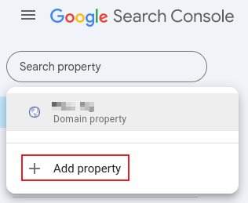

# Google Cloud Platform

## cloud source repository

> 参考 source-repository
> https://cloud.google.com/source-repositories/docs

## 启用api

> 参考 enable-service
>
> https://console.cloud.google.com/apis/library/sourcerepo.googleapis.com

## 调试 gcp 防火墙

### 前言

在使用 gcp 防火墙的来源 ip CIDR 过滤特性做源站保护时，可能会因为第三方的 cdn 节点的 CIDR 变动并且未更新到 gcp 防火墙中而导致错误拦截此类 cdn 节点。此时需要调试 gcp 防火墙并找出被拦截 cdn 节点所属的 CIDR。

### 方法

1、手动创建名为 deny-logging-debug 的 gcp 防火墙规则，拦截行为设置为 “拒绝”，来源 ip 地址 CIDR 为所有 ipv4 地址 0.0.0.0/0，优先级别为 65535（gcp 防火墙最低优先级别，为了让这条规则在所有其他规则后执行），打开防火墙日志记录功能。

2、绑定次 gcp 防火墙规则到虚拟机中。

3、通过点击防火墙规则中查看日志功能导航到日志查询分析功能中，此时点击 “清除所有过滤” 按钮，再点击查询按钮不断地加载最新日志以查看是否有显示状态为 "DENIDED" 的日志。

4、如果发现有状态为 ”DENIDED“ 的日志，此时展开此日志并查看来源的 ip 地址后，把次 ip 地址添加到对应放行的防火墙规则中。

## Google Search Console

### 介绍

Google Search Console（简称GSC）是Google提供的一项免费数据服务，也被称为谷歌站长工具或谷歌搜索控制台。它主要帮助站长、开发者和营销人员监控、维护并优化其网站在Google搜索结果中的展示情况。

以下是Google Search Console的主要功能和用途：

1. **性能报告**：提供详细的点击量、展示次数、点击率（CTR）和平均排名数据，帮助用户了解用户如何通过Google搜索找到网站的内容，以及网站在搜索结果中的表现情况。
2. **覆盖范围报告**：识别网站的索引问题，例如抓取错误、已索引但存在问题的页面，以及哪些页面被成功索引。这有助于用户发现并解决网站的索引编制问题。
3. **移动设备可用性**：确保网站在移动设备上的用户体验没有问题，例如是否存在可点击元素过近或内容超出屏幕的问题。这有助于提升网站在移动设备上的搜索表现。
4. **链接分析**：查看哪些网站链接到了用户的内容，以及用户网站内页之间的链接结构。这有助于用户了解网站的外部链接情况，并优化网站的链接结构。
5. **URL检查工具**：分析特定页面的索引状态，查看Google如何抓取和渲染该页面。这有助于用户了解Google对网站页面的抓取和索引情况。
6. **问题提醒**：在Google遇到与用户网站相关的索引编制、垃圾内容或其他问题时，GSC会向用户发送提醒。这有助于用户及时发现并解决网站的问题。

此外，Google Search Console还提供了丰富的数据分析和优化建议，帮助用户找到提升排名和用户体验的方法。通过GSC，用户可以更全面地了解网站在Google搜索结果中的表现情况，并采取相应的优化措施。

要使用Google Search Console，用户需要首先验证网站所有权，并添加网站资源。然后，用户可以提交XML站点地图，以帮助Google更快地抓取和索引网站内容。接下来，用户可以定期查看性能和覆盖范围报告，及时修复问题页面，并关注核心网络指标（Core Web Vitals）以优化页面加载速度、交互性和视觉稳定性。

总之，Google Search Console是优化网站搜索表现的强大工具，通过利用其提供的详细数据和实用功能，用户可以提高网站在搜索引擎中的可见性，改善用户体验，并推动业务发展。

### 使用 GSC 添加自定义域名

>提醒：使用 GSC 添加自定义域名到 GGP 后，Google Cloud Run 相关产品即可能够引用该自定义域名。

登录 [GSC 控制台](https://search.google.com/search-console)

点击 `Add property` 添加自定义域名

在弹出窗口 `Select property type` 的 `Domain` 区域输入自定义域名 `my.example.com`，然后点击 `CONTINUE` 按钮

授权 GSC 在 CloudFlare 自定义域名下添加一条 `TXT` 记录类型以验证用户是自定义域名的属主

一旦验证通过后，自定义域名会作为域名资产被添加到 GSC 控制台中。
