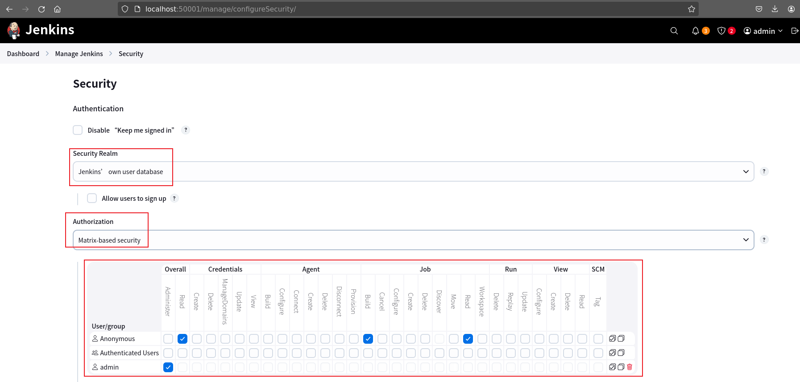

## Slave是什么呢？

Jenkins Slave（通常也叫 **Jenkins Agent**）是 Jenkins 里用来**实际执行构建任务的节点**，而 Jenkins Master 只负责调度和管理。

通俗理解就是：

> **Jenkins Master = 大脑（调度）**  
> **Jenkins Slave = 手（干活）**

---

### 一、Jenkins Slave 是什么？

Jenkins Slave 是一台 **连接到 Jenkins Master 的机器或容器**，用来运行 Job / Pipeline。

- 它可以运行在：
  - 物理机
  - 虚拟机
  - Docker 容器
  - Kubernetes Pod
- 上面会安装：
  - JDK
  - Jenkins Agent 程序
  - 构建所需工具（Maven、Git、Node 等）

---

### 二、为什么要用 Jenkins Slave？

#### 1. 分担 Master 压力
如果所有构建都在 Master 上跑：
- CPU、内存容易被占满
- Jenkins 界面卡顿甚至崩溃

✅ 用 Slave 可以把构建任务 **分散到多台机器**

---

#### 2. 不同环境构建
不同项目可能需要不同环境：
- Java 8 / Java 17
- Windows / Linux
- Android、iOS 构建

✅ 可以为不同 Slave 配置不同环境

---

#### 3. 提高并发能力
一个 Slave 同时只能跑一定数量的任务：

- 多个 Slave = 多个任务并行执行
- 非常适合大型项目或多人团队

---

### 三、Jenkins Master vs Slave 对比

| 角色   | 作用                         |
| ------ | ---------------------------- |
| Master | 管理 Job、调度任务、展示结果 |
| Slave  | 实际执行构建、测试、部署     |

⚠️ **最佳实践**：  
> Master 尽量只做调度，不要跑构建任务

---

### 四、Jenkins Slave 常见类型

#### 1. 固定 Slave（Standalone）
- 长期运行
- 常用于稳定环境

#### 2. 临时 Slave（Dynamic Agent）
- 按需创建
- 用完自动销毁
- 常见于 **Docker / Kubernetes**

#### 3. 标签（Label）
可以给 Slave 打标签：

```text
java17
docker
windows
```

Pipeline 指定标签使用：

```groovy
pipeline {
  agent { label 'java17' }
}
```

---

### 五、Jenkins Slave 的工作方式

1. Jenkins Master 把任务分配给 Slave
2. Slave 拉取代码
3. 执行构建脚本
4. 把结果返回给 Master

整个过程对使用者是**透明的**。

---

### 六、简单总结

✅ Jenkins Slave 就是 **专门用来执行 Jenkins 任务的构建节点**  
✅ 用于提升性能、并发和环境隔离  
✅ 是现代 Jenkins（尤其是 CI/CD）中非常重要的概念

如果你愿意，我也可以帮你讲：
- Jenkins Slave 的搭建方式  
- Jenkins + Docker Slave  
- Jenkins + Kubernetes Agent  

## Pipeline是什么呢？

Jenkins Pipeline 可以理解为：**用代码来描述整个 CI/CD 流水线的一种方式**，而不是在网页界面里点来点去地配置 Job。

---

### 一、什么是 Jenkins Pipeline？

**Jenkins Pipeline** 是一套插件，用来支持在 Jenkins 中实现**持续交付流水线**。

它的核心特点是：

> ✅ **流水线即代码（Pipeline as Code）**  
> ✅ 使用 `Jenkinsfile` 定义整个构建、测试、部署流程  
> ✅ 和源码一起存放在 Git 仓库中

---

### 二、为什么要用 Pipeline？

相比传统的「自由风格（Freestyle）Job」，Pipeline 有明显优势：

#### 1. 可版本化管理
- `Jenkinsfile` 放在 Git 里
- 谁改了、什么时候改的，都有历史记录
- 回滚、复用都很方便

#### 2. 可视化流水线
Jenkins 会展示每一步的执行状态：

```
[Checkout] → [Build] → [Test] → [Package] → [Deploy]
```

哪一步失败，一目了然。

#### 3. 更强的控制能力
- 条件判断
- 循环
- 并行执行
- 错误重试
- 人工审批（input）

---

### 三、Pipeline 的基本结构

一个最简单的 `Jenkinsfile` 示例：

```groovy
pipeline {
    agent any

    stages {
        stage('Checkout') {
            steps {
                git 'https://github.com/example/demo.git'
            }
        }

        stage('Build') {
            steps {
                sh 'mvn clean package'
            }
        }

        stage('Test') {
            steps {
                sh 'mvn test'
            }
        }
    }
}
```

#### 关键组成部分

| 部分          | 作用                          |
| ------------- | ----------------------------- |
| `pipeline {}` | 定义一个流水线                |
| `agent`       | 指定在哪台机器（Slave）上执行 |
| `stages`      | 流水线阶段集合                |
| `stage`       | 一个阶段（如 Build、Test）    |
| `steps`       | 具体要执行的命令              |

---

### 四、两种 Pipeline 类型

#### 1️⃣ Scripted Pipeline（脚本式）
- 基于 Groovy 脚本
- 更灵活、更偏程序化

```groovy
node {
    stage('Build') {
        sh 'mvn package'
    }
}
```

✅ 灵活  
❌ 可读性稍差

---

#### 2️⃣ Declarative Pipeline（声明式，✅ 推荐）
- 语法更结构化
- 更易读、更适合团队协作

```groovy
pipeline {
    agent any
    stages { ... }
}
```

✅ 官方推荐  
✅ 新手首选

---

### 五、Pipeline 常见高级用法

#### ✅ 并行执行
```groovy
stage('Parallel Tests') {
    parallel {
        stage('Unit Test') {
            steps { sh 'npm run test:unit' }
        }
        stage('Integration Test') {
            steps { sh 'npm run test:int' }
        }
    }
}
```

---

#### ✅ 条件判断
```groovy
stage('Deploy') {
    when {
        branch 'main'
    }
    steps {
        sh './deploy.sh'
    }
}
```

---

#### ✅ 人工审批
```groovy
stage('Approve Deploy') {
    steps {
        input message: '是否发布到生产环境？', ok: '发布'
    }
}
```

---

### 六、Pipeline 适合什么场景？

✅ 微服务 CI/CD  
✅ 多环境（dev / test / prod）发布  
✅ 需要并行、复杂流程的项目  
✅ 希望 CI/CD 可审计、可复用的团队

---

### 七、一句话总结

> **Jenkins Pipeline 就是用代码定义 CI/CD 流程的机制，核心是 `Jenkinsfile`，让构建、测试、部署变得可版本、可重复、可维护。**

## Job是什么呢？

在 Jenkins 里，**Job（作业）**是最基本的“任务单元”，可以理解成：

> **一条 CI/CD 流程的定义 + 执行记录**

---

### 一、Jenkins Job 是什么？

**Jenkins Job = 一个可重复执行的自动化任务**

它告诉 Jenkins：
- 要做什么（构建 / 测试 / 部署）
- 怎么做（Shell、Maven、Pipeline 等）
- 什么时候做（手动 / 定时 / Git 触发）

---

### 二、Job 里通常包含什么？

一个 Job 一般包括：

| 内容       | 说明                            |
| ---------- | ------------------------------- |
| 源码地址   | Git / SVN                       |
| 触发方式   | 手动 / 定时 / Webhook           |
| 构建步骤   | Shell / Maven / Gradle / Docker |
| 构建后动作 | 发邮件、部署、通知              |
| 构建历史   | 每次运行的结果                  |

---

### 三、Jenkins 中有哪些常见 Job 类型？

#### 1️⃣ Freestyle Project（自由风格）
✅ 最常见、最容易上手  
❌ 复杂流程不好维护

特点：
- 图形化配置
- 不支持复杂逻辑
- 适合简单构建任务

---

#### 2️⃣ Pipeline（流水线）
✅ **强烈推荐**
✅ 适合中大型项目

特点：
- 用 `Jenkinsfile` 定义流程
- 可版本化管理
- 支持并行、条件、审批等

---

#### 3️⃣ Multibranch Pipeline
- 自动为 **每个分支** 创建一个 Pipeline
- 特别适合 Git Flow / 多分支开发

---

#### 4️⃣ Folder
不是真正执行任务的 Job，而是：
- 用来 **分类管理 Job**
- 类似目录

---

### 四、Job vs Pipeline 的关系

很多人会混淆这两个概念：

| 对比项   | Job      | Pipeline      |
| -------- | -------- | ------------- |
| 本质     | 任务容器 | 流程定义方式  |
| 表现形式 | 一个 Job | 一种 Job 类型 |
| 配置方式 | 页面配置 | Jenkinsfile   |
| 复杂度   | 简单     | 灵活强大      |

✅ **Pipeline 本身也是一种 Job**

---

### 五、Job 的一次运行叫什么？

- **Build（构建）**
- 每一次点击「立即构建」或触发一次，就叫一次 Build
- 每个 Build 有：
  - 编号（#1、#2…）
  - 状态（成功 / 失败 / 不稳定）
  - 日志

---

### 六、一个直观类比

把 Jenkins 想象成一个工厂：

- **Jenkins Master**：厂长
- **Job**：一条生产线
- **Build**：一次生产任务
- **Pipeline**：这条线的详细工序说明书

---

### 七、一句话总结

> **Jenkins Job 是 Jenkins 中定义和执行自动化任务的基本单位，可以是简单的构建，也可以是复杂的 CI/CD 流水线。**

## Jenkinsfile是什么呢？

可以把 **Jenkinsfile** 理解为：**一段用来定义 Jenkins 流水线（Pipeline）的脚本文件**。  
它告诉 Jenkins：项目要怎么拉代码、怎么编译、怎么测试、怎么部署，以及这些步骤应该以什么顺序执行。

---

### 一、Jenkinsfile 是什么？

- **本质**：一个文本文件，通常放在项目的根目录，名字就叫 `Jenkinsfile`  
- **作用**：把原本需要在 Jenkins 网页界面里手动点选的配置，**写成代码**
- **归属**：属于“**Pipeline as Code**”（流水线即代码）的实践

这样做的好处是：
- 和源码一起版本化管理
- 可以被多人协作、评审、回滚
- 在不同分支/环境中复用同一套流程

---

### 二、Jenkinsfile 里一般写什么？

Jenkinsfile 本质上定义了一个流水线，常见内容包括：

- 从哪个代码仓库拉代码（Git / SVN 等）
- 在什么环境运行（Linux / Windows / Docker）
- 有哪些阶段（Stage），例如：
  - 拉取代码
  - 编译构建
  - 单元测试
  - 打包
  - 部署到测试 / 生产环境
- 每个阶段具体执行的命令（Shell、Maven、npm、Docker 等）

---

### 三、两种常见的 Jenkinsfile 类型

#### 1. Scripted Pipeline（脚本式）

- 基于 **Groovy 脚本**
- 写法灵活、功能强
- 适合复杂流程，但可读性相对弱一些

示例（概念性）：
```groovy
node {
    stage('Build') {
        sh 'mvn clean package'
    }
}
```

#### 2. Declarative Pipeline（声明式，推荐）

- 语法更像“配置”，结构清晰
- 易读、易维护
- 官方更推荐新手和大多数项目使用

示例：
```groovy
pipeline {
    agent any

    stages {
        stage('Build') {
            steps {
                sh 'mvn clean package'
            }
        }
        stage('Test') {
            steps {
                sh 'mvn test'
            }
        }
    }
}
```

---

### 四、为什么要用 Jenkinsfile？

| 好处         | 说明                                    |
| ------------ | --------------------------------------- |
| 版本控制     | Jenkinsfile 随项目代码一起存储在 Git 中 |
| 可审计       | 谁改了流水线、什么时候改的，都能查      |
| 可复用       | 多项目、多分支可共享模板                |
| 减少手工操作 | 不再依赖 Jenkins UI 点来点去            |
| 更易迁移     | 换一台 Jenkins，只要导入仓库即可        |

---

### 五、一句话总结

> **Jenkinsfile 就是用代码来描述 Jenkins 构建流程的文件，是实现 CI/CD 自动化的核心配置文件。**

## 使用容器运行Jenkins

使用本站示例协助测试 https://gitee.com/dexterleslie/demonstration/tree/main/demo-jenkins/demo-docker-compose

## CI/CD示例启动

>https://hub.docker.com/r/jenkins/jenkins
>https://github.com/jenkinsci/docker/blob/master/README.md

使用本站示例协助测试 https://gitee.com/dexterleslie/demonstration/tree/main/demo-jenkins

```sh
# 编译容器
docker-compose build

# 启动容器，注意：此脚本会启动jenkins、gitlab、harbor等服务用于测试
sh start.sh

# 注意：等待一段比较长的时间等待gitlab启动完毕，项目会自动配置jenkins、gitlab

# 登录jenkins进行配置
http://localhost:50001
# 登录gitlab
http://localhost:50002

# 关闭容器jekins、gitlab、harbor服务
sh stop.sh
```

## 怎么配置Credentials

在 Jenkins 中配置 Credentials（凭证）主要包括以下步骤：

一、进入 Jenkins 管理界面

1. 登录 Jenkins Web 界面。
2. 在左侧菜单中点击“Manage Jenkins”（管理 Jenkins）。

二、进入 Credentials 管理页面

1. 在“Manage Jenkins”页面中，点击“Manage Credentials”（管理凭证）。
2. 在“Stores scoped to Jenkins”下，点击“Jenkins”。
3. 点击“Global credentials (unrestricted)”以管理全局范围的凭证（你也可以选择其他域）。

三、添加凭证

1. 在“Global credentials”页面中，点击左侧菜单中的“Add Credentials”（添加凭证）。
2. 填写以下信息：

- Kind（凭证类型）：选择凭证类型，例如：
  - Username with password（用户名和密码）
  - SSH Username with private key（SSH 用户名和私钥）
  - Secret text / Secret file（秘密文本或文件）
  - Certificate（证书）
- Scope（作用域）：通常选择“Global (Jenkins, nodes, items, child items)”。
- Username：凭证用户名（如适用）。
- Password / Secret / Private Key：填写对应的密码或密钥内容。
- ID（可选）：为凭证指定一个唯一标识符，方便在 Pipeline 或 Job 中引用。
- Description（可选）：添加描述信息，方便识别用途。

3. 点击“OK”保存凭证。

四、在任务中使用凭证

以 Pipeline 脚本（Jenkinsfile）为例：

```groovy
pipeline {
  agent any
  stages {
    stage('Example') {
      steps {
        withCredentials([usernamePassword(credentialsId: 'my-credentials-id',
                                          usernameVariable: 'USER',
                                          passwordVariable: 'PASS')]) {
          sh 'echo $USER'
          // 使用 $PASS 变量进行操作
        }
      }
    }
  }
}
```

- credentialsId：填写你在添加凭证时指定的 ID。
- usernameVariable / passwordVariable：定义变量名，用于在脚本中引用。

五、查看或编辑已有凭证

你可以返回到 Credentials 管理页面，点击某个凭证进行查看或编辑。

注意事项：

- Jenkins 对凭证进行加密存储，并保证在构建过程中只在受控环境下使用。
- 建议不要将敏感信息写入脚本中，应始终使用凭证引用。

如需使用 SSH 密钥连接 Git 仓库、远程服务器等，可选择“SSH Username with private key”类型进行配置。

## 设置jenkins slave

### 设置windows slave

```
# 在任何虚拟机中使用浏览器访问 http://192.168.1.181:8080/ 并新增一个节点
# Manage Jenkins > Manage Nodes and Clouds > New Node，配置如下:
Name: windows-slave
Remote root directory: c:\jenkins
Labels: windows-slave
Launch method: Launch agent by connecting it to controller
Custom WorkDir path: c:\jenkins_workdir
其他采用默认值

# 使用远程桌面登录windows slave服务器并安装jdk11
# 使用浏览器访问 http://192.168.1.181:8080/ 后，点击刚刚新增的节点(offline状态)
# 点击浏览器中的链接下载agent.jar到windows slave本地并根据提示运行agent.jar
# 稍等一会后刚刚新增的节点就变为online状态

# 新建一个pipeline测试windows slave节点是否正常，脚本如下:
pipeline {
    agent {
        label 'windows-slave'
    }

    stages {
        stage('步骤1') {
            steps {
                bat 'systeminfo'
            }
        }
        
        stage('步骤2') {
            steps {
                echo '步骤2输出'
            }
        }
    }
}
```


### 设置centOS8 slave

```
# 新建一台centOS8虚拟机并使用dcli安装jdk8和docker

# 使用浏览器访问 http://192.168.1.181:8080 jenkins并使用功能 Manage Jenkins > Manage Nodes and Clouds > New Node 新增节点，参数如下:
Name: centos8-slave
Remote root directory: /data/jenkins
Labels: centos8-slave
Launch method: Launch agents via SSH
Host: 192.168.1.xxx
Credentials: 选择新增到jenkins的帐号密码
Host Key Verification Strategy: Non verifying Verifcation Strategy
其他采用默认值

# 点击保存后jenkins master会通过SSH自动配置centOS8的agent，稍等一会后centos8-slave就会online状态

# 新建pipeline测试centOS8 slave是否正常，脚本如下:
pipeline {
    agent {
        label 'centos8-slave'
    }

    stages {
        stage('步骤1') {
            steps {
                sh 'docker --version'
                sh 'docker-compose --version'
            }
        }
    }
}
```


## pipeline用法


### pipeline入门

```
# 登录jenkins控制台创建一个pipeline项目名为 testpipeline

# 在 testpipeline 项目pipeline配置中选择 "Pipeline script"，脚本如下:
pipeline {
    agent any

    stages {
        stage('步骤1') {
            steps {
                echo '步骤1输出'
            }
        }
        
        stage('步骤2') {
            steps {
                echo '步骤2输出'
            }
        }
    }
}

# 保存脚本后点击 testpipeline 项目 "Build Now"

# 查看项目Status就能够看到build状态
```


### pipeline语法

> pipeline分为声明式和脚本式语法，注意：推荐使用声明式
> https://www.jenkins.io/doc/book/pipeline/syntax/
> https://zhuanlan.zhihu.com/p/133703916
>
> 可以使用pipeline语法生成器帮助生成语法
> http://localhost:50001/pipeline-syntax/


#### 声明式语法

> 以pipeline {} 开头

```
pipeline {
    // 这个agent不能删除，否则报告缺失agent导致语法错误
    agent any
    
    stages {
        stage('执行步骤') {
            steps {
                sh 'pwd'
            }
        }
    }
}

# 在声明式语法中使用script块嵌入脚本式语法
pipeline {
    agent any
    
    stages {
        stage('测试') {
            steps {
                script {
                    def my_var = 'Hello world!'
                    println(my_var)
                }
            }
        }
    }
}
```


#### 脚本式语法

```
node {
    stage('编译') {
        sh 'uname -a'
    }
    
    stage('发布') {
        sh 'date'
    }
}
```


### 指定agent执行

```
# 指定windows-slave agent执行脚本
pipeline {
    agent {
        // 指定windows-slave执行脚本
        label 'windows-slave'
    }

    stages {
        stage('步骤1') {
            steps {
                bat 'systeminfo'
            }
        }
        
        stage('步骤2') {
            steps {
                echo '步骤2输出'
            }
        }
    }
}
```


### 不同的步骤在不同的agent中执行

> https://stackoverflow.com/questions/42652533/limiting-jenkins-pipeline-to-running-only-on-specific-nodes

```
# windows-slave节点执行systeminfo命令
# centos8-slave节点执行 docker --version、docker-compose --version命令
# 脚本如下:
pipeline {
    // 这个agent不能删除，否则报告缺失agent导致语法错误
    agent any
    
    stages {
        stage('windows执行步骤') {
            agent {
                label 'windows-slave'
            }
        
            steps {
                bat 'systeminfo'
            }
        }
        
        stage('centos8执行步骤') {
            agent {
                label 'centos8-slave'
            }
        
            steps {
                sh 'docker --version'
                sh 'docker-compose --version'
            }
        }
    }
}
```


### 在不同agent间使用stash和unstash传输文件

> https://stackoverflow.com/questions/43050248/correct-usage-of-stash-unstash-into-a-different-directory

```
# 传输windows-slave当前工作目录c:\jenkins\workspace\testpipeline中的test目录到centos8-slave当前工作目录/data/jenkins/workspace/testpipeline中
# 提前在windows-slave c:\jenkins\workspace\testpipeline中创建test目录并放置数据到其中
# 脚本如下:
pipeline {
    // 这个agent不能删除，否则报告缺失agent导致语法错误
    agent any
    
    stages {
        stage('windows执行步骤') {
            agent {
                label 'windows-slave'
            }
        
            steps {
                bat 'dir'
                stash includes: 'test/**/*', name: 'my-archive'
            }
        }
        
        stage('centos8执行步骤') {
            agent {
                label 'centos8-slave'
            }
        
            steps {
                sh 'pwd'
                sh 'rm -rf test'
                unstash 'my-archive'
            }
        }
    }
}
```


### windows平台使用bat函数运行CMD命令

> https://code-maven.com/jenkins-pipeline-running-external-programs

```
# 脚本如下:
pipeline {
    agent {
        // 指定windows-slave执行脚本
        label 'windows-slave'
    }

    stages {
        stage('步骤1') {
            steps {
                // 使用bat函数运行cmd命令
                bat 'systeminfo'
            }
        }
        
        stage('步骤2') {
            steps {
                echo '步骤2输出'
            }
        }
    }
}
```

### pipeline基本steps

> https://www.jenkins.io/doc/pipeline/steps/workflow-basic-steps/#dir-change-current-directory

#### pwd step

> https://www.jenkins.io/doc/pipeline/steps/workflow-basic-steps/#pwd-determine-current-directory
> 获取当前工作目录绝对路径

```
pipeline {
    agent any
    
    stages {
        stage('测试') {
            steps {
                // https://stackoverflow.com/questions/46733278/is-it-possible-to-concatenate-string-with-job-parameter-in-pipeline-script
                println "当前目录: ${pwd()}"
            }
        }
    }
}
```

#### dir step

> 切换工作目录

```
pipeline {
    agent any
    
    stages {
        stage('测试') {
            steps {
                sh 'mkdir -p test-temp'
                dir('test-temp') {
                    println "当前目录: ${pwd()}"
                }
            }
        }
    }
}
```


#### sh step

> https://stackoverflow.com/questions/48630765/jenkins-pipeline-sh-adding-new-line

```
# 基本使用
pipeline {
    agent any
    
    stages {
        stage('测试') {
            steps {
                sh 'ls'
            }
        }
    }
}

# 长命令换行
# https://stackoverflow.com/questions/48630765/jenkins-pipeline-sh-adding-new-line
pipeline {
    agent any
    
    stages {
        stage('测试') {
            steps {
                sh """
                	ls;
                	pwd;
                	date;
                """
            }
        }
    }
}
```


#### writeFile step

> https://stackoverflow.com/questions/51233919/create-a-file-with-some-content-using-groovy-in-jenkins-pipeline

```
# 基本使用
pipeline {
    agent any
    
    stages {
        stage('测试') {
            steps {
                writeFile file:'1.txt', text: '123'
                sh 'ls; cat 1.txt;'
            }
        }
    }
}

# writeFile换行
pipeline {
    agent any
    
    stages {
        stage('测试') {
            steps {
                writeFile file:'1.txt', text: '1\r\n2\r\n3\r\n'
                sh 'pwd; ls; cat 1.txt;'
            }
        }
    }
}
```


### pipeline插件


#### git插件

> https://www.jenkins.io/doc/pipeline/steps/git/

```
pipeline {
    agent any
    
    stages {
        stage('测试') {
            steps {
                sh 'rm -rf *'
                sh 'mkdir test-temp'
                dir('test-temp') {
                    // 可以借助语法生成器生成脚本
                    git branch: 'main', changelog: false, credentialsId: 'git-access-token', url: 'http://demo-gitlab-server/root/test.git'
                    sh 'pwd && ls'
                }
                
                sh 'pwd && ls'
            }
        }
    }
}
```


#### docker插件

> 使用sh start.sh启动服务后会自动启动一个harbor服务url: http://ip:50003
> NOTE: 因为调试docker插件需要已安装docker环境，所以需要配置centos8-slave
> https://docs.cloudbees.com/docs/cloudbees-ci/latest/pipelines/docker-workflow
> https://www.jenkins.io/doc/book/pipeline/docker/

```
# 综合测试
pipeline {
    agent any
    
    stages {
        stage('测试') {
            agent {
                label 'centos8-slave'
            }
            steps {
                script {
                    def my_image = docker.image('hello-world')
                    // 拉取hello-world
                    my_image.pull()
                    
                    // 运行容器
                    // https://stackoverflow.com/questions/62533437/running-a-docker-container-from-a-jenkins-pipeline-and-capture-the-output
                    //my_docker.run()
                    
                    // 给hello-world打标签
                    // sh 'docker tag hello-world 192.168.1.181:50003/library/hello-world:1.0.1'
                    
                    // https://www.jenkins.io/doc/book/pipeline/docker/#custom-registry
                    // https://stackoverflow.com/questions/49029379/use-private-docker-registry-with-authentication-in-jenkinsfile
                    docker.withRegistry('https://192.168.1.181:50003', 'harbor-token') {
                        def my_image_1 = docker.image('library/hello-world')
                        my_image_1.push('1.0.0')
                    }
                    
                }
            }
        }
    }
}

# 测试根据Dockerfile build镜像
pipeline {
    agent any
    
    stages {
        stage('测试') {
            agent {
                label 'centos8-slave'
            }
            steps {
                writeFile file: 'Dockerfile', text: 'FROM busybox\r\nRUN echo \'123\' > /1.txt'
                
                script {
                    // 编译镜像
                    // 使用命令测试镜像docker run --rm my_busybox_image:1.0.0 cat /1.txt
                    docker.build('my_busybox_image:1.0.0')
                }
            }
        }
    }
}
```

## pipeline内置步骤 - withCredentials

>提示：使用SSH帐号密码连接主机。

需要先手动在Jenkins中配置名为test1的Credentials

```json
pipeline {
    agent any

    stages {
        stage('测试pipeline内置步骤withCredentials') {
			steps {
				script {
					withCredentials([
						usernamePassword(
							credentialsId: 'test1',
							usernameVariable: 'SSH_USER',
							passwordVariable: 'SSH_PASS'
						)
					]) {
						sh '''
							sshpass -p "$SSH_PASS" ssh -o StrictHostKeyChecking=no $SSH_USER@192.168.1.28 << EOF
								echo '`date` - 当前工作目录：`pwd`'
EOF
						'''
					}
				}
			}
		}
    }
}
```

## pipeline构建参数

>提示：base64File和stashedFile类型参数需要安装file-parameters插件才支持使用。

```
pipeline {
    agent any
    
    parameters {
        string(name: 'BRANCH', defaultValue: 'main', description: 'Git 分支')
        booleanParam(name: 'DEPLOY', defaultValue: true, description: '是否部署（为「是」时须上传下方大文件 STASH_FILE）')
        choice(name: 'ENV', choices: ['dev', 'test', 'prod'], description: '部署环境')
        // file-parameters：https://plugins.jenkins.io/file-parameters/ — 替代核心内置文件参数，与 Pipeline 兼容
        // 为何分 base64 与 stashed：base64File 把文件内容以 Base64 放进环境变量，便于小体量传递、与部分 API/步骤对接，但体积约 +33% 且受环境变量长度等限制，只适合小文件；stashedFile 走 Jenkins stash 存真实文件流，无 Base64 膨胀、不受 env 承载大段文本的限制，适合大文件。按大小与集成方式二选一即可，此处两条同时声明仅为演示。
        base64File(name: 'B64_FILE', description: '小文件 (Base64)')
        // stash：Jenkins Pipeline 的 stash（工作区快照），非 Git stash；构建内 unstash/withFileParameter 取用
        stashedFile(name: 'STASH_FILE', description: '大文件 (Stash)；勾选「是否部署」时必选')
    }

    stages {
        stage('打印参数') {
            steps {
            	script {
                    def deployFlag = params.DEPLOY ? 'y' : 'n'
                    echo "branch=${params.BRANCH},deploy=${deployFlag},env=${params.ENV}"
                }
            }
        }

        // 勾选「是否部署」时须上传 stashedFile(STASH_FILE)；Declarative 无法在 UI 里做跨参数校验，只能在构建中 fail
        stage('部署参数校验') {
            when {
                expression { params.DEPLOY }
            }
            steps {
                script {
                    withFileParameter(name: 'STASH_FILE', allowNoFile: true) {
                        sh '''
                            if [ ! -f "$STASH_FILE" ] || [ ! -s "$STASH_FILE" ]; then
                                echo "ERROR: 已勾选「是否部署」时必须上传大文件 (STASH_FILE)"
                                exit 1
                            fi
                        '''
                    }
                }
            }
        }

        // file-parameters：withFileParameter 提供解码后的临时文件；未上传时用 allowNoFile 避免失败；亦可 echo \$B64_FILE | base64 -d
        // 传到 192.168.1.28：必须在 withFileParameter('STASH_FILE') 内 scp \$STASH_FILE。
        stage('file-parameters 演示') {
            steps {
                script {
                    withFileParameter(name: 'B64_FILE', allowNoFile: true) {
                        sh 'echo "B64_FILE path=$B64_FILE"; if [ -f "$B64_FILE" ]; then head -c 200 "$B64_FILE"; else echo "(未上传)"; fi'
                    }
                    withFileParameter(name: 'STASH_FILE', allowNoFile: true) {
                        sh '''
                            if [ ! -f "$STASH_FILE" ]; then echo "(未上传 STASH_FILE)"; exit 0; fi
                            echo "STASH_FILE path=$STASH_FILE"; head -c 200 "$STASH_FILE"
                            dest="${STASH_FILE_FILENAME:-upload.bin}"
                            echo "远端文件名(原始上传名): $dest"
                            sshpass -p "Root@123" scp -o StrictHostKeyChecking=no "$STASH_FILE" "root@192.168.1.28:/tmp/${dest}"
                        '''
                    }
                    // 等价用法：unstash 'STASH_FILE' 后工作区中有名为 STASH_FILE 的文件，再对该路径 scp
                    // unstash 'STASH_FILE'
                    // sh 'sshpass -p "Root@123" scp -o StrictHostKeyChecking=no STASH_FILE root@192.168.1.28:/tmp/$STASH_FILE_FILENAME'
                }
            }
        }

        // input：仅 1 个 parameter 时常直接返回 String；多个时为 Map。Map 取值用 .get('KEY')，勿用 []（沙箱拦 getAt）
        // stage('input 演示') {
        //     steps {
        //         script {
        //             def userInput = input(
        //                 message: '是否继续执行后续 stage?',
        //                 ok: '继续',
        //                 parameters: [
        //                     choice(name: 'DEMO_CHOICE', choices: ['dev', 'test'], description: '示例下拉选项')
        //                 ]
        //             )
        //             def demoChoice = userInput instanceof Map ? userInput.get('DEMO_CHOICE') : userInput
        //             echo "input 结果 DEMO_CHOICE=${demoChoice}"
        //         }
        //     }
        // }
        
        stage('when用法') {
        	when {
        	    // 当DEPLOY为true时才执行此stage
                expression { params.DEPLOY }
            }
    
            steps {
            	script {
                    echo "when用法演示"
                }
            }
        }
    }
}
```

## 设置Jenkins权限

>说明：设置权限为管理员有所有权限，匿名用户只有Job的查看和build权限。

导航到功能Manage-Jenkins>Security，修改为如下权限：



保存设置后根据提示创建一个管理员。

## 创建git仓库中拉取项目并执行其中的Jenkinsfile

> 演示从git仓库中下载源代码并执行其中的Jenkinsfile

```
# 运行demo
sh start.sh

# 登录jenkins手动触发构建测试Jenkinsfile是否正确
```

