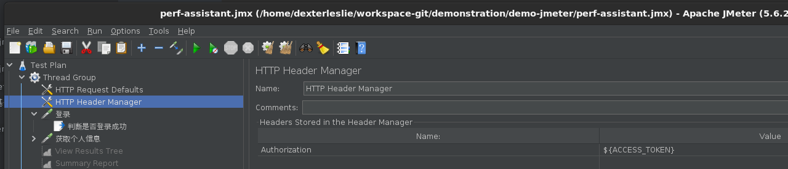

## 安装并运行

### 测试环境用的测试脚本

以下测试是`test.jmx`文件使用`JSR223`脚本测试`json`解析效率：

```xml
<?xml version="1.0" encoding="UTF-8"?>
<jmeterTestPlan version="1.2" properties="5.0" jmeter="5.4.1">
  <hashTree>
    <TestPlan guiclass="TestPlanGui" testclass="TestPlan" testname="Test Plan" enabled="true">
      <stringProp name="TestPlan.comments"></stringProp>
      <boolProp name="TestPlan.functional_mode">false</boolProp>
      <boolProp name="TestPlan.tearDown_on_shutdown">true</boolProp>
      <boolProp name="TestPlan.serialize_threadgroups">false</boolProp>
      <elementProp name="TestPlan.user_defined_variables" elementType="Arguments" guiclass="ArgumentsPanel" testclass="Arguments" testname="User Defined Variables" enabled="true">
        <collectionProp name="Arguments.arguments"/>
      </elementProp>
      <stringProp name="TestPlan.user_define_classpath"></stringProp>
    </TestPlan>
    <hashTree>
      <ThreadGroup guiclass="ThreadGroupGui" testclass="ThreadGroup" testname="Thread Group" enabled="true">
        <stringProp name="ThreadGroup.on_sample_error">continue</stringProp>
        <elementProp name="ThreadGroup.main_controller" elementType="LoopController" guiclass="LoopControlPanel" testclass="LoopController" testname="Loop Controller" enabled="true">
          <boolProp name="LoopController.continue_forever">false</boolProp>
          <intProp name="LoopController.loops">-1</intProp>
        </elementProp>
        <stringProp name="ThreadGroup.num_threads">8</stringProp>
        <stringProp name="ThreadGroup.ramp_time">0</stringProp>
        <boolProp name="ThreadGroup.scheduler">false</boolProp>
        <stringProp name="ThreadGroup.duration"></stringProp>
        <stringProp name="ThreadGroup.delay"></stringProp>
        <boolProp name="ThreadGroup.same_user_on_next_iteration">true</boolProp>
      </ThreadGroup>
      <hashTree>
        <JSR223Sampler guiclass="TestBeanGUI" testclass="JSR223Sampler" testname="JSR223 Sampler" enabled="true">
          <stringProp name="cacheKey">true</stringProp>
          <stringProp name="filename"></stringProp>
          <stringProp name="parameters"></stringProp>
          <stringProp name="script">import com.fasterxml.jackson.databind.JsonNode;
import com.fasterxml.jackson.databind.ObjectMapper;

String JSON=&quot;{\&quot;errorCode\&quot;:0,\&quot;errorMessage\&quot;:null,\&quot;dataObject\&quot;:\&quot;你好\&quot;}&quot;;
ObjectMapper mapper = new ObjectMapper();
JsonNode node = mapper.readTree(JSON);
int errorCode = node.get(&quot;errorCode&quot;).asInt();
if(errorCode&gt;0) {
	vars.put(&quot;registerSuccess&quot;,&quot;false&quot;);
}else {
	vars.put(&quot;registerSuccess&quot;,&quot;true&quot;);
}</stringProp>
          <stringProp name="scriptLanguage">groovy</stringProp>
        </JSR223Sampler>
        <hashTree/>
      </hashTree>
    </hashTree>
  </hashTree>
</jmeterTestPlan>

```


### `dcli`安装`jmeter master`模式

1. 安装`dcli`命令行工具

   ```bash
   sudo rm -f /usr/bin/dcli && sudo curl https://fut001.oss-cn-hangzhou.aliyuncs.com/dcli/dcli-linux-x86_64 --output /usr/bin/dcli && sudo chmod +x /usr/bin/dcli
   ```

2. 安装`jmeter master`

   ```bash
   sudo dcli jdk install && sudo dcli jmeter install
   
   # 在提示中选择master模式
   ```

3. 运行`jmeter`测试，注意：`test.jmx`内容是上面提到的测试脚本。

   ```bash
   jmeter -n -t test.jmx
   ```


### `dcli`安装`jmeter master slave`模式

1. 安装`dcli`命令行工具

   ```bash
   sudo rm -f /usr/bin/dcli && sudo curl https://fut001.oss-cn-hangzhou.aliyuncs.com/dcli/dcli-linux-x86_64 --output /usr/bin/dcli && sudo chmod +x /usr/bin/dcli
   ```

2. 在`master`虚拟机中安装`jmeter master`

   ```bash
   sudo dcli jdk install && sudo dcli jmeter install
   
   # 选择master模式
   # remote_hosts填写所有jmeter slave ip地址
   ```

3. 在`slave`虚拟机中安装`jmeter slave`

   ```bash
   sudo dcli jdk install && sudo dcli jmeter install
   
   # 选择slave模式
   # rmi监听ip地址填写slave本机ip地址，因为master需要使用rmi端口和slave通讯
   ```

4. 在`master`中启动分布式测试，注意：`192.168.235.144`是`jmeter slave`的`ip`地址

   ```bash
   jmeter -n -t test.jmx -R 192.168.235.144
   ```

5. 停止测试

   ```bash
   ./stoptest.sh
   ```

   

## 单机性能测试

>提示：使用`dcli`安装`jmeter master`模式。

启动[OpenResty](https://gitee.com/dexterleslie/demonstration/tree/main/demo-benchmark/demo-openresty-benchmark)辅助测试

```sh
# 复制部署配置
ansible-playbook playbook-deployer-config.yml --inventory inventory.ini

# 启动测试目标
ansible-playbook playbook-service-start.yml --inventory inventory.ini

# 销毁测试目标
ansible-playbook playbook-service-destroy.yml --inventory inventory.ini
```

启动`JMeter`测试，通过本站链接获取[perf-assistant.jmx](https://gitee.com/dexterleslie/demonstration/blob/main/demo-jmeter/perf-assistant.jmx)

>硬件配置：
>
>- 虚拟平台：Hypervisor:VMware ESXi, 7.0.3, 20328353、Model:PowerEdge R740xd、Processor Type:Intel(R) Xeon(R) Platinum 8269CY CPU @ 2.50GHz
>- 主机配置：16C8G
>- JMeter内存配置：4G

```bash
$ jmeter -n -t perf-assistant.jmx
WARN StatusConsoleListener The use of package scanning to locate plugins is deprecated and will be removed in a future release
WARN StatusConsoleListener The use of package scanning to locate plugins is deprecated and will be removed in a future release
WARN StatusConsoleListener The use of package scanning to locate plugins is deprecated and will be removed in a future release
WARN StatusConsoleListener The use of package scanning to locate plugins is deprecated and will be removed in a future release
Creating summariser <summary>
Created the tree successfully using perf-assistant.jmx
Starting standalone test @ October 29, 2025 5:46:17 PM CST (1761731177153)
Waiting for possible Shutdown/StopTestNow/HeapDump/ThreadDump message on port 4445
summary + 956448 in 00:00:12 = 76792.3/s Avg:     0 Min:     0 Max:    64 Err:     0 (0.00%) Active: 256 Started: 256 Finished: 0
summary + 2750246 in 00:00:30 = 91674.9/s Avg:     0 Min:     0 Max:    91 Err:     0 (0.00%) Active: 256 Started: 256 Finished: 0
summary = 3706694 in 00:00:42 = 87308.8/s Avg:     0 Min:     0 Max:    91 Err:     0 (0.00%)
summary + 2777830 in 00:00:30 = 92594.3/s Avg:     0 Min:     0 Max:    73 Err:     0 (0.00%) Active: 256 Started: 256 Finished: 0
summary = 6484524 in 00:01:12 = 89497.3/s Avg:     0 Min:     0 Max:    91 Err:     0 (0.00%)
```


## 判断是否硬件瓶颈导致`jmeter`分布式测试无法提高性能

在研究`jmeter`分布式测试性能过程中，会遇到这样的情况：使用笔记本电脑启动多台虚拟机用于部署`jmeter`集群，但是在测试过程中继续添加更多的虚拟机后`QPS`却无法提升，这是因为笔记本电脑单机性能达到瓶颈。

怎么测试笔记本电脑单机性能达到瓶颈呢？可以通过创建多个虚拟机分别运行单机版的`jmeter`，通过此方法找出笔记本电脑最多运行多少个`jmeter`虚拟机就达到性能瓶颈。


## 非基于`kubernetes`的`jmeter`分布式测试

>注意：使用`dcli`分别在`master`虚拟机上安装`jmeter master`模式，在`slave`虚拟机上安装`jmeter slave`模式。

使用`/home/xxx/xxx.jmx`文件启动分布式`jmeter`测试

```bash
# 启动所有远程主机分布式测试
jmeter -n -t /home/xxx/xxx.jmx -r

# 启动指定远程主机分布式测试
jmeter -n -t /home/xxx/xxx.jmx -R 192.168.1.1,192.168.1.2
```

停止分布式测试，注意：不能关闭`master`进程，否则`master`无法接收停止信号转发给`slave`以达到停止测试

> [jmeter-stop-remote-server](https://stackoverflow.com/questions/33511399/jmeter-stop-remote-server)

```bash
# 停止分布式测试
./shutdown.sh

# 停止分布式测试
./stoptest.sh
```


## 基于`kubernetes`的`jmeter`分布式测试

>注意：推荐使用这个方式运行`jmeter`分布式测试，因为方便部署和管理。
>
>[Load Testing With Jmeter On Kubernetes and OpenShift](https://blog.kubernauts.io/load-testing-as-a-service-with-jmeter-on-kubernetes-fc5288bb0c8b)

`jmeter slave`以`DaemonSet`方式在`kubernetes`集群中运行。

示例的详细用法请参考 [链接](https://gitee.com/dexterleslie/demonstration/tree/master/demo-jmeter/demo-jmeter-master-slave/k8s)

运行示例步骤：

1. 搭建`openresty`目标，用于协助`jmeter`性能测试，<a href="/性能测试/启动性能测试辅助目标.html#使用kubernetes启动" target="_blank">参考链接</a>

2. 因为此`jmeter`支持自定义`RedisBenchmarkSampler`插件用于性能测试`redis`，所以需要先编译此插件 [链接](https://gitee.com/dexterleslie/demonstration/tree/master/demo-jmeter/demo-jmeter-customize-plugin)

   ```bash
   # 编译插件命令
   mvn package
   ```

3. 编译`docker`镜像

   ```bash
   ./build-images.sh
   ```

4. 推送`docker`镜像

   ```bash
   ./push-images.sh
   ```

5. 搭建`kubernetes`集群，<a href="/kubernetes/安装k8s.html#使用二进制程序安装k8s" target="_blank">参考链接</a>

6. `ubuntu`配置`kubectl`客户端以直接在`ubuntu`上运行`jmeter`分布式测试，<a href="/kubernetes/kubectl命令.html#ubuntu安装kubectl命令" target="_blank">参考链接</a>

7. 启动测试

   ```bash
   ./start_test.sh jmeter.jmx
   ```

8. 测试期间通过`http://192.168.1.10:30001`（其中`192.168.1.10`是`k8s`集群的任何一个节点`ip`地址）登录`openresty`目标`grafana`查看压力测试相关数据

9. 测试期间通过`http://192.168.1.10:30000/`（其中`192.168.1.10`是`k8s master`节点的`ip`地址）登录`jmeter`的`grafana`查看`jmeter`监听器上报的测试数据

10. 停止测试

   ```bash
   ./stop_test.sh
   ```


## 基于`kubernetes`和非基于`kubernetes`的`jmeter`分布式测试结果对比

实验配置如下：

- `jmeter master`/`k8s master`虚拟机`centOS8-stream`，4核（无限制`CPU`）+`8G`内存
- 3台`jmeter slave`/`k8s worker`虚拟机`centOS8-stream`，2核（最高`4400MHz CPU`频率）+`4G`内存

实验结果：

- 基于`kubernetes QPS`最高`50k/s`左右
- 非基于`kubernetes QPS`最高`59k/s`左右

实验结论：非基于`kubernetes`性能高于基于`kubernetes`环境，可能是由于`jmeter`运行容器环境性能有所降低或者`kubernetes flannel`网络性能不如虚拟机之间直接通讯的网络性能高导致（`todo`：未排查得到证据证明这个猜想）。但是总体基于`kubernetes`环境的性能损耗还是在可接受范围内的。


## `GCP`平台测试基于`kubernetes`的`jmeter`分布式压测结果

实验配置如下：

- 1台`k8s master`虚拟机`centOS8-stream`，虚拟类型`e2`+4核+`8G`内存
- 5台`k8s worker`虚拟机`centOS8-stream`，虚拟类型`e2`+4核+`8G`内存
- 1台`openresty`辅助测试目标虚拟机`centOS8-stream`，虚拟类型`e2`+16核+`16G`内存

实验结果：`QPS`稳定在`164k/s`

实验结论：`GCP`平台上压测每台`k8s worker`能够产生约`32k/s`的`QPS`，`jmeter`集群产生的总`QPS`和`k8s worker`数量成正比的。


## `jmeter`调优

### 调整堆内存

编译`/usr/local/jmeter/bin/jmeter`添加`HEAP="-Xms2g -Xmx2g"`到`# resolve links`之后。


### 分布式测试调优`jmeter`结果样本`sender`模式

>[JMeter mode setting : Helps in optimizing the load generation](https://www.apexon.com/blog/jmeter-mode-setting-helps-in-optimizing-the-load-generation/)
>
>[Using a different sample sender](https://jmeter.apache.org/usermanual/remote-test.html#sendermode)

测试计划中的监听器将结果发送回客户端JMeter，后者将结果写入指定文件。默认情况下，样本在生成时同步发送回。这可能会影响服务器测试的最大吞吐量；在线程可以继续之前，必须返回采样结果。可以设置一些JMeter属性来改变这种行为。

1. 设置`statistical`模式

   此模式主要用于汇总采样，不采样所有字段。此外，采样率取决于批处理模式所描述的属性。样品将根据线组名称和样品标签进行分组。它只累积以下字段，其他字段在样本之间的变化将被忽略：
   将累积的字段为：1。时间流逝，2。延迟，3。字节数，4。样本计数和5。错误计数。
   这种模式在一定程度上减少了样本数据对网络的影响，并且在分布式环境中也将使用更少的客户端资源。因此，建议在考虑客户端系统性能、网络性能等因素后设置有效阈值。

   注意：经过测试设置此模式进行分布式测试单`slave`节点性能和单机`jmeter`性能相当

   编辑`/usr/local/jmeter/bin/jmeter.properties`设置`mode=Statistical`

2. 设置`num_sample_threshold`阈值，以减少压力测试样本回传次数导致测试间隙停顿。

   编辑`/usr/local/jmeter/bin/jmeter.properties`设置`num_sample_threshold=81920`


## 使用`docker`运行`jmeter+influxdb+grafana`

> [JMeter的基本使用（jmeter+influxDB+Grafana）](https://zhuanlan.zhihu.com/p/621684630?utm_id=0)
>
> 提醒：`grafana dashboards JSON`文件是通过手动导入`https://grafana.com/grafana/dashboards/5496`第三方模板后再导出为`JSON`得到的。

示例的详细配置请参考 [链接](https://gitee.com/dexterleslie/demonstration/tree/master/demo-jmeter/demo-docker-with-influxdb-grafana)

`jmeter+influxdb+grafana`是为了图形化显示`jmeter`压测结果。

运行步骤：

- 编译镜像

  ```bash
  docker compose build
  ```

- 运行示例

  ```bash
  docker compose up -d
  ```

- 访问`grafana http://localhost:3000/`查看`jmeter`压测状态

- 启动测试制造`influxdb+grafana`数据

  ```bash
  ./start_test.sh
  ```


## `todo jmeter`单机性能调优

>`todo`：搜索一篇外国资料描述`jmeter`单机或者分布式测试的性能调优博客。调优后使得`jmeter`分布式测试在相同的硬件配置下发挥出更高的性能。
>
>`todo`：centos8 系统优化 centos内核优化（在gcp中测试jmeter时，测试以下配置是否有调优效果）`https://blog.51cto.com/u_16099314/10091045`

	1、内存
	2、线程数
	3、调整Stastic
	4、queue size=8192


## 调整`jmeter`日志级别

在开发插件过程中，需要调整`jmeter`日志级别为`DEBUG`以打印插件调试信息，[参考链接](https://www.blazemeter.com/blog/jmeter-logging)

通过`jmeter`菜单修改日志级别，`Options`>`Log Level`>`DEBUG`


## beanshell和jsr223

### 性能测试

>结论：jsr223 Groovy性能最高，然后是beanshell > jsr223 Javascript > jsr223 Java。

使用本站[示例](https://gitee.com/dexterleslie/demonstration/tree/main/demo-jmeter/beanshell-and-jsr223)协助测试。

硬件配置：

- 虚拟平台：Hypervisor:VMware ESXi, 7.0.3, 20328353、Model:PowerEdge R740xd、Processor Type:Intel(R) Xeon(R) Platinum 8269CY CPU @ 2.50GHz
- 主机配置：8C8G

beanshell测试结果：

```sh
$ jmeter -n -t beanshell.jmx
WARN StatusConsoleListener The use of package scanning to locate plugins is deprecated and will be removed in a future release
WARN StatusConsoleListener The use of package scanning to locate plugins is deprecated and will be removed in a future release
WARN StatusConsoleListener The use of package scanning to locate plugins is deprecated and will be removed in a future release
WARN StatusConsoleListener The use of package scanning to locate plugins is deprecated and will be removed in a future release
Creating summariser <summary>
Created the tree successfully using beanshell.jmx
Starting standalone test @ October 29, 2025 3:54:15 PM CST (1761724455526)
Waiting for possible Shutdown/StopTestNow/HeapDump/ThreadDump message on port 4445
summary + 735555 in 00:00:14 = 51894.7/s Avg:     2 Min:     0 Max:  1178 Err:     0 (0.00%) Active: 219 Started: 219 Finished: 0
summary + 2146627 in 00:00:30 = 71554.2/s Avg:     3 Min:     0 Max:  2045 Err:     0 (0.00%) Active: 256 Started: 256 Finished: 0
summary = 2882182 in 00:00:44 = 65246.1/s Avg:     3 Min:     0 Max:  2045 Err:     0 (0.00%)
summary + 2127924 in 00:00:30 = 70930.8/s Avg:     3 Min:     0 Max:  1372 Err:     0 (0.00%) Active: 256 Started: 256 Finished: 0
summary = 5010106 in 00:01:14 = 67545.3/s Avg:     3 Min:     0 Max:  2045 Err:     0 (0.00%)
summary + 2104715 in 00:00:30 = 70157.2/s Avg:     3 Min:     0 Max:  1996 Err:     0 (0.00%) Active: 256 Started: 256 Finished: 0
summary = 7114821 in 00:01:44 = 68297.5/s Avg:     3 Min:     0 Max:  2045 Err:     0 (0.00%)
```

jsr223 Java语言测试结果：

```sh
$ jmeter -n -t jsr223-java.jmx
WARN StatusConsoleListener The use of package scanning to locate plugins is deprecated and will be removed in a future release
WARN StatusConsoleListener The use of package scanning to locate plugins is deprecated and will be removed in a future release
WARN StatusConsoleListener The use of package scanning to locate plugins is deprecated and will be removed in a future release
WARN StatusConsoleListener The use of package scanning to locate plugins is deprecated and will be removed in a future release
Creating summariser <summary>
Created the tree successfully using jsr223-java.jmx
Starting standalone test @ October 29, 2025 3:57:07 PM CST (1761724627474)
Waiting for possible Shutdown/StopTestNow/HeapDump/ThreadDump message on port 4445
summary +   1857 in 00:00:22 =   83.8/s Avg:  2144 Min:     4 Max:  6659 Err:     0 (0.00%) Active: 256 Started: 256 Finished: 0
summary +   2580 in 00:00:30 =   86.0/s Avg:  2978 Min:     4 Max:  6585 Err:     0 (0.00%) Active: 256 Started: 256 Finished: 0
summary =   4437 in 00:00:52 =   85.1/s Avg:  2629 Min:     4 Max:  6659 Err:     0 (0.00%)
summary +   2738 in 00:00:30 =   91.2/s Avg:  2820 Min:     4 Max:  6726 Err:     0 (0.00%) Active: 256 Started: 256 Finished: 0
summary =   7175 in 00:01:22 =   87.3/s Avg:  2702 Min:     4 Max:  6726 Err:     0 (0.00%)
summary +   2744 in 00:00:30 =   91.5/s Avg:  2799 Min:     4 Max:  6392 Err:     0 (0.00%) Active: 256 Started: 256 Finished: 0
summary =   9919 in 00:01:52 =   88.4/s Avg:  2728 Min:     4 Max:  6726 Err:     0 (0.00%)
```

jsr223 JavaScript语言测试结果：

```sh
$ jmeter -n -t jsr223-javascript.jmx
WARN StatusConsoleListener The use of package scanning to locate plugins is deprecated and will be removed in a future release
WARN StatusConsoleListener The use of package scanning to locate plugins is deprecated and will be removed in a future release
WARN StatusConsoleListener The use of package scanning to locate plugins is deprecated and will be removed in a future release
WARN StatusConsoleListener The use of package scanning to locate plugins is deprecated and will be removed in a future release
Creating summariser <summary>
Created the tree successfully using jsr223-javascript.jmx
Starting standalone test @ October 29, 2025 4:00:17 PM CST (1761724817433)
Waiting for possible Shutdown/StopTestNow/HeapDump/ThreadDump message on port 4445
summary +  32323 in 00:00:12 = 2658.8/s Avg:    54 Min:     0 Max:  1295 Err:     0 (0.00%) Active: 256 Started: 256 Finished: 0
summary +  92123 in 00:00:30 = 3070.8/s Avg:    83 Min:     0 Max:  1088 Err:     0 (0.00%) Active: 256 Started: 256 Finished: 0
summary = 124446 in 00:00:42 = 2952.0/s Avg:    76 Min:     0 Max:  1295 Err:     0 (0.00%)
summary +  64862 in 00:00:30 = 2161.9/s Avg:   117 Min:     0 Max:  1260 Err:     0 (0.00%) Active: 256 Started: 256 Finished: 0
summary = 189308 in 00:01:12 = 2623.5/s Avg:    90 Min:     0 Max:  1295 Err:     0 (0.00%)
summary +  66342 in 00:00:30 = 2211.5/s Avg:   116 Min:     0 Max:  1421 Err:     0 (0.00%) Active: 256 Started: 256 Finished: 0
summary = 255650 in 00:01:42 = 2502.5/s Avg:    97 Min:     0 Max:  1421 Err:     0 (0.00%)
```

jsr223 Groovy语言测试结果：

```sh
$ jmeter -n -t jsr223-groovy.jmx
WARN StatusConsoleListener The use of package scanning to locate plugins is deprecated and will be removed in a future release
WARN StatusConsoleListener The use of package scanning to locate plugins is deprecated and will be removed in a future release
WARN StatusConsoleListener The use of package scanning to locate plugins is deprecated and will be removed in a future release
WARN StatusConsoleListener The use of package scanning to locate plugins is deprecated and will be removed in a future release
Creating summariser <summary>
Created the tree successfully using jsr223-groovy.jmx
Starting standalone test @ October 29, 2025 4:04:47 PM CST (1761725087739)
Waiting for possible Shutdown/StopTestNow/HeapDump/ThreadDump message on port 4445
summary + 1488739 in 00:00:12 = 125536.6/s Avg:     1 Min:     0 Max:   916 Err:     0 (0.00%) Active: 256 Started: 256 Finished: 0
summary + 4582240 in 00:00:30 = 152741.3/s Avg:     1 Min:     0 Max:  1138 Err:     0 (0.00%) Active: 256 Started: 256 Finished: 0
summary = 6070979 in 00:00:42 = 145034.0/s Avg:     1 Min:     0 Max:  1138 Err:     0 (0.00%)
summary + 4529011 in 00:00:30 = 150967.0/s Avg:     1 Min:     0 Max:   981 Err:     0 (0.00%) Active: 256 Started: 256 Finished: 0
summary = 10599990 in 00:01:12 = 147511.0/s Avg:     1 Min:     0 Max:  1138 Err:     0 (0.00%)
summary + 4459892 in 00:00:30 = 148663.1/s Avg:     1 Min:     0 Max:  2136 Err:     0 (0.00%) Active: 256 Started: 256 Finished: 0
summary = 15059882 in 00:01:42 = 147850.3/s Avg:     1 Min:     0 Max:  2136 Err:     0 (0.00%)
```


## 脚本编程

>说明：使用jsr223 Groovy脚本编程，因为性能高。

### 打印日志

>详细用法请参考本站[示例](https://gitee.com/dexterleslie/demonstration/tree/main/demo-jmeter/demo-jsr223-groovy-scripting.jmx)

```groovy
// 打印日志
log.info("测试日志")
```

### JSR223 PostProcessor获取接口响应json

>详细用法请参考本站[示例](https://gitee.com/dexterleslie/demonstration/tree/main/demo-jmeter/perf-assistant.jmx)

```groovy
// 1. 获取响应
String responseJSON = prev.getResponseDataAsString()
log.info(responseJSON)
```

### JSR223 Groovy解析json字符串

>详细用法请参考本站[示例](https://gitee.com/dexterleslie/demonstration/tree/main/demo-jmeter/perf-assistant.jmx)

```groovy
// 解析json字符串
def jsonObject = new JsonSlurper().parseText(responseJSON)
def errorCode = jsonObject.errorCode
if(errorCode==null || errorCode>0) {
	def errorMessage = jsonObject.errorMessage
	log.info("登录失败，原因：" + errorMessage)
}
```

### 根据响应errorCode标记样本失败

>详细用法请参考本站[示例](https://gitee.com/dexterleslie/demonstration/tree/main/demo-jmeter/perf-assistant.jmx)

```groovy
import groovy.json.JsonSlurper

// 1. 获取响应
String responseJSON = prev.getResponseDataAsString()
//log.info(responseJSON)

// 解析json字符串
def jsonObject = new JsonSlurper().parseText(responseJSON)
def errorCode = jsonObject.errorCode
if(errorCode==null || errorCode>0) {
	def errorMessage = jsonObject.errorMessage
	log.info("登录失败，原因：" + errorMessage)

	// 告诉JMeter这个样本失败
	// 标记样本为失败
    prev.setSuccessful(false)
    // 设置失败消息
    prev.setResponseMessage("登录失败，原因：" + errorMessage)
}
```

### 线程变量（当前线程内共享）

>详细用法请参考本站[示例](https://gitee.com/dexterleslie/demonstration/tree/main/demo-jmeter/perf-assistant.jmx)

保存Token到线程变量中

```groovy
import groovy.json.JsonSlurper

// 1. 获取响应
String responseJSON = prev.getResponseDataAsString()

...

def accessToken = jsonObject.data
// 保存到线程变量（当前线程内共享）
vars.put("ACCESS_TOKEN", accessToken)
```

在HTTP Header Manager中引用线程变量




## Random Controller和Random Order Controller的区别

**Random Controller** 和 **Random Order Controller** 在 JMeter 中有本质的区别，让我详细解释：

---

### **一、核心区别对比表**

| 特性         | Random Controller（随机控制器） | Random Order Controller（随机顺序控制器） |
| ------------ | ------------------------------- | ----------------------------------------- |
| **执行方式** | 每次迭代**只执行一个**子元素    | 每次迭代**执行全部**子元素                |
| **执行顺序** | 随机选择**一个**执行            | 随机**排序**后按序执行全部                |
| **执行数量** | 1/N（N个子元素）                | N/N（全部子元素）                         |
| **适用场景** | 模拟用户**选择不同路径**        | 模拟操作**顺序随机但完整**                |

---

### **二、详细工作原理**

#### **1. Random Controller（随机控制器）**
```xml
<RandomController>
  <hashTree>
    <HTTPSamplerProxy testname="API 1"/>
    <HTTPSamplerProxy testname="API 2"/>
    <HTTPSamplerProxy testname="API 3"/>
  </hashTree>
</RandomController>
```

**执行结果示例**：
- **迭代1**：执行 `API 2`（随机选择）
- **迭代2**：执行 `API 1`（随机选择）
- **迭代3**：执行 `API 3`（随机选择）
- **迭代4**：执行 `API 2`（随机选择）

**特点**：每次只执行**一个**请求，类似于"单选按钮"。

---

#### **2. Random Order Controller（随机顺序控制器）**
```xml
<RandomOrderController>
  <hashTree>
    <HTTPSamplerProxy testname="API 1"/>
    <HTTPSamplerProxy testname="API 2"/>
    <HTTPSamplerProxy testname="API 3"/>
  </hashTree>
</RandomOrderController>
```

**执行结果示例**：
- **迭代1**：执行 `API 2` → `API 3` → `API 1`（随机排序）
- **迭代2**：执行 `API 1` → `API 2` → `API 3`（随机排序）
- **迭代3**：执行 `API 3` → `API 1` → `API 2`（随机排序）

**特点**：每次执行**全部**请求，但顺序随机，类似于"洗牌"。

---

### **三、实际场景对比**

#### **场景1：用户行为模拟**
##### **Random Controller - 模拟用户选择**
```xml
<!-- 用户每次只做一件事 -->
<RandomController testname="用户随机行为">
  <hashTree>
    <HTTPSamplerProxy testname="浏览商品"/>
    <HTTPSamplerProxy testname="查看订单"/>
    <HTTPSamplerProxy testname="搜索内容"/>
    <HTTPSamplerProxy testname="个人中心"/>
  </hashTree>
</RandomController>
```
**结果**：用户可能浏览商品、查看订单、搜索内容，但**每次只做一件事**。

##### **Random Order Controller - 模拟完整流程**
```xml
<!-- 用户完成所有操作，但顺序随机 -->
<RandomOrderController testname="完整流程随机顺序">
  <hashTree>
    <HTTPSamplerProxy testname="登录"/>
    <HTTPSamplerProxy testname="浏览"/>
    <HTTPSamplerProxy testname="下单"/>
    <HTTPSamplerProxy testname="支付"/>
  </hashTree>
</RandomOrderController>
```
**结果**：用户完成登录、浏览、下单、支付**所有步骤**，但顺序可能不同。

---

#### **场景2：API 测试**
##### **Random Controller - 压力测试不同接口**
```xml
<!-- 测试不同接口的并发性能 -->
<RandomController testname="随机API压力测试">
  <hashTree>
    <HTTPSamplerProxy testname="用户查询接口"/>
    <HTTPSamplerProxy testname="订单查询接口"/>
    <HTTPSamplerProxy testname="商品查询接口"/>
  </hashTree>
</RandomController>
```

##### **Random Order Controller - 测试接口组合**
```xml
<!-- 测试接口组合的并发性能 -->
<RandomOrderController testname="接口组合测试">
  <hashTree>
    <HTTPSamplerProxy testname="创建用户"/>
    <HTTPSamplerProxy testname="创建订单"/>
    <HTTPSamplerProxy testname="更新库存"/>
  </hashTree>
</RandomOrderController>
```

---

### **四、配置参数详解**

#### **共同参数**
```xml
<boolProp name="InterleaveAcrossThreads">false</boolProp>
```
- **false**（默认）：每个线程独立随机
- **true**：所有线程共享随机序列

#### **特殊配置示例**
```xml
<!-- Random Controller 特殊配置 -->
<RandomController>
  <boolProp name="InterleaveAcrossThreads">true</boolProp>
</RandomController>

<!-- Random Order Controller 特殊配置 -->
<RandomOrderController>
  <boolProp name="InterleaveAcrossThreads">false</boolProp>
</RandomOrderController>
```

---

### **五、性能影响对比**

#### **执行时间计算**

假设每个请求耗时1秒：

| 控制器类型              | 子元素数量 | 单次迭代时间 | 10次迭代总时间 |
| ----------------------- | ---------- | ------------ | -------------- |
| Random Controller       | 3          | 1秒          | 10秒           |
| Random Order Controller | 3          | 3秒          | 30秒           |

**结论**：Random Order Controller 的执行时间会随子元素数量线性增长。

---

### **六、混合使用案例**

#### **复杂用户行为模拟**
```xml
<TestPlan>
  <ThreadGroup>
    <hashTree>
      <!-- 第一层：随机选择主要行为 -->
      <RandomController testname="主要行为选择">
        <hashTree>
          <!-- 选项1：购物流程 -->
          <RandomOrderController testname="购物流程">
            <hashTree>
              <HTTPSamplerProxy testname="浏览商品"/>
              <HTTPSamplerProxy testname="加入购物车"/>
              <HTTPSamplerProxy testname="结算订单"/>
            </hashTree>
          </RandomOrderController>
          
          <!-- 选项2：信息查询 -->
          <RandomOrderController testname="信息查询">
            <hashTree>
              <HTTPSamplerProxy testname="查询订单"/>
              <HTTPSamplerProxy testname="查看物流"/>
              <HTTPSamplerProxy testname="联系客服"/>
            </hashTree>
          </RandomOrderController>
        </hashTree>
      </RandomController>
    </hashTree>
  </ThreadGroup>
</TestPlan>
```

**执行逻辑**：
1. 随机选择"购物流程"或"信息查询"
2. 执行选定流程中的所有步骤（顺序随机）

---

### **七、选择指南**

#### **选择 Random Controller 当：**
✅ 模拟用户**选择不同路径**  
✅ 测试**单个接口**的性能  
✅ 需要**减少测试时间**  
✅ 模拟**互斥操作**（登录/注册不能同时进行）

#### **选择 Random Order Controller 当：**
✅ 模拟**完整业务流程**  
✅ 测试**接口组合**的性能  
✅ 验证**数据依赖性**（如：创建→查询→更新）  
✅ 模拟**真实用户操作序列**

---

### **八、调试技巧**

#### **查看执行日志**
```groovy
// 在子元素中添加调试信息
log.info("执行: " + prev.getSampleLabel())
vars.put("LAST_ACTION", prev.getSampleLabel())
```

#### **统计执行分布**
```groovy
// 统计 Random Controller 的选择分布
def action = prev.getSampleLabel()
def counter = vars.getObject("COUNTER_" + action) ?: 0
vars.putObject("COUNTER_" + action, counter + 1)

// 定期输出统计
if (vars.get("ITERATION").toInteger() % 100 == 0) {
    log.info("=== 执行分布统计 ===")
    ["API 1", "API 2", "API 3"].each { api ->
        def count = vars.getObject("COUNTER_" + api) ?: 0
        log.info("${api}: ${count} 次")
    }
}
```

---

### **总结**

| 方面       | Random Controller        | Random Order Controller |
| ---------- | ------------------------ | ----------------------- |
| **本质**   | 随机**选择**             | 随机**排序**            |
| **执行量** | 1/N                      | N/N                     |
| **性能**   | 快                       | 慢（随元素数量增加）    |
| **真实度** | 低（用户不会只做一件事） | 高（完整业务流程）      |

**简单记忆**：
- **Random Controller** = 随机**选一个**执行
- **Random Order Controller** = 随机**排顺序**执行全部

根据您的测试目标选择合适的控制器，也可以组合使用以达到更真实的模拟效果。
