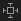

## 新建 `objective-c` 项目用于调试

使用 `Xcode` 新建名为 `demo2` 的  `objective-c App` 项目

禁用项目运行 `UI` 测试，只运行 `Unit` 测试：打开功能 `Product` > `Scheme` > `Edit Scheme` > `Test`，取消选择 `demo2UITests` 测试目标，只勾选 `demo2Tests` 测试目标。此时运行测试只会运行 `Unit` 测试。


## `main` 主函数

使用 `Xcode` 新建 `objective-c` 项目，打开 `main` 文件替换为以下代码：

```objective-c
#import <Foundation/Foundation.h>

@interface Person :NSObject
    @property int age;
@end

@implementation Person

-(id)init{
    if(self=[super init]){
        _age=10;
    }
    return self;
}
@end

int main(int argc, const char * argv[]) {
    @autoreleasepool {
        Person *p=[[Person alloc]init];
        NSLog(@"p.age=%d",p.age);
    }
    return 0;
}

```


## `objective-c`项目中的`xcuserdata`目录

在 iOS (Objective-C) 项目中，**`xcuserdata` 目录不应该提交到 Git 仓库**。以下是详细解释和最佳实践：

---

### **为什么不应该提交 `xcuserdata`？**
1. **用户专属数据**  
   `xcuserdata` 目录（位于 `YourProject.xcodeproj/xcuserdata/`）存储的是 **当前用户的个性化设置**，例如：
   - Xcode 的窗口布局、断点、书签。
   - 代码折叠状态、编辑器的临时缓存。
   - 调试器偏好设置等。  
   **这些内容与其他开发者无关**，提交会导致不必要的冲突。

2. **频繁变动**  
   该目录下的文件会随用户操作频繁变化，提交后会导致 Git 历史记录污染。

3. **潜在冲突风险**  
   如果多个开发者提交各自的 `xcuserdata`，可能会覆盖彼此的配置，甚至引发 Xcode 项目文件冲突。

---

### **正确做法：忽略 `xcuserdata`**
#### 1. **将 `xcuserdata` 添加到 `.gitignore`**
在项目的 **`.gitignore`** 文件中添加以下规则（如果使用全局 Git 配置也可忽略所有项目的 `xcuserdata`）：
```gitignore
# Xcode 用户数据
**/xcuserdata/
```
或更精确的路径：
```gitignore
YourProject.xcodeproj/xcuserdata/
```

#### 2. **删除已提交的 `xcuserdata`**
如果之前误提交了 `xcuserdata`，需要从 Git 中删除（但保留本地文件）：
```bash
git rm --cached -r YourProject.xcodeproj/xcuserdata/
git commit -m "Remove xcuserdata from Git"
```
然后确保 `.gitignore` 已生效，避免再次误提交。

---

### **需要提交的 Xcode 相关文件**
以下文件 **必须提交** 到 Git 仓库（与 `xcuserdata` 区分开）：
- `YourProject.xcodeproj/project.pbxproj`（项目结构文件）
- `YourProject.xcworkspace/contents.xcworkspacedata`（如果使用 CocoaPods）
- `Podfile`、`Podfile.lock`（CocoaPods 依赖）
- `*.xcconfig`（自定义编译配置）

---

### **特殊情况处理**
如果团队需要共享某些 Xcode 配置（如代码样式模板），应通过以下方式：
1. **共享 `WorkspaceSettings.xcsettings`**  
   将 `YourProject.xcworkspace/xcshareddata/WorkspaceSettings.xcsettings` 提交到 Git，而非用户专属数据。
2. **使用团队统一的 Xcode 配置模板**  
   通过文档约定或脚本自动配置，而非依赖 `xcuserdata`。

---

### **总结**
| 文件/目录         | 是否提交到 Git | 原因                       |
| ----------------- | -------------- | -------------------------- |
| `xcuserdata/`     | ❌ 绝不         | 用户本地临时数据，无关协作 |
| `project.pbxproj` | ✅ 必须         | 项目核心结构文件           |
| `xcshareddata/`   | ⚠️ 选择性提交   | 仅共享团队统一的配置       |

遵循此规则可保持 Git 仓库干净，避免团队协作中的配置冲突问题。


## 指针

>[指针解引用](https://baike.baidu.com/item/%E8%A7%A3%E5%BC%95%E7%94%A8)
>
>[指针](https://blog.csdn.net/senwin2009/article/details/48439361)

操作系统会为每个内存单元进行编号，这个编号就是内存单元的地址。指针也就是指这些单元的内存地址。简单的说,变量的内存地址就是该变量的指针，而用于保存内存地址（指针）的变量就是指针变量。

```objective-c
int iTemporary = 10;
// 打印变量指针地址
NSLog(@"&Temporary=%p", &iTemporary);

// iTemporaryPointer 指针变量指向 iTemporary 变量
int *iTemporaryPointer = &iTemporary;
// 打印变量 iTemporary 指针地址
NSLog(@"&iTemporary=%p", &iTemporary);
// 打印 iTemporaryPointer 指针地址
NSLog(@"iTemporaryPointer=%p", iTemporaryPointer);
// 打印 iTemporaryPointer 指针指向的变量
NSLog(@"*iTemporaryPointer=%d", *iTemporaryPointer);
```


## `alloc`

在 Objective-C 中，`alloc` 是一个**类方法**（Class Method），属于 `NSObject` 类及其子类的方法。它的核心作用是为对象**分配内存空间**，并返回一个指向该内存地址的指针（即对象的「未初始化实例」）。后续需要配合 `init` 方法完成对象的初始化，最终得到一个可用的对象实例。


### **一、`alloc` 的核心作用**
`alloc` 的主要职责是**为对象分配内存**，具体包括：
1. **计算内存大小**：根据类的实例变量（包括自身和继承自父类的所有实例变量）的大小，计算需要分配的内存空间。
2. **分配内存**：向系统申请一块符合要求的内存，并将内存初始化为 0（避免脏数据）。
3. **设置 isa 指针**：在分配的内存起始位置设置 `isa` 指针（指向对象的类对象），标识该内存属于哪个类。


### **二、`alloc` 的基本用法**
`alloc` 是类方法，调用方式为 `[类名 alloc]`，返回一个未初始化的实例对象（类型为 `id` 或具体类的指针）。

#### **示例：创建 NSObject 实例**
```objective-c
// 分配内存（未初始化）
NSObject *uninitializedObj = [NSObject alloc];

// 初始化（必须步骤！）
NSObject *initializedObj = [uninitializedObj init];
```

#### **更常见的写法：合并 `alloc` 和 `init`**
实际开发中，通常将 `alloc` 和 `init` 合并为一步，称为「构造对象」：
```objective-c
NSObject *obj = [[NSObject alloc] init];
```


### **三、`alloc` 与 `init` 的关系**
`alloc` 仅负责内存分配，不保证对象可用；`init` 负责初始化对象的状态（如设置成员变量的初始值、执行必要的配置）。**必须调用 `init` 后，对象才能被安全使用**。

#### **为什么必须初始化？**
未初始化的对象（仅 `alloc` 未 `init`）虽然内存已分配，但：
- 成员变量（如实例变量 `ivar`）的值是不确定的（可能是随机垃圾值）。
- 部分类可能在 `init` 中完成关键逻辑（如文件句柄初始化、网络连接建立等），未调用会导致功能异常。
- 直接使用未初始化的对象可能导致崩溃（如调用其方法时访问未初始化的成员变量）。


### **四、`alloc` 的底层实现**
`alloc` 方法的底层实现由 `NSObject` 提供，核心逻辑大致如下（简化版）：
```objective-c
// NSObject 的 alloc 方法伪代码
+ (instancetype)alloc {
    return [self allocWithZone:nil]; // 调用带 zone 参数的版本
}

+ (instancetype)allocWithZone:(struct _NSZone *)zone {
    // 1. 计算类需要的实例变量总大小（包括父类）
    size_t size = class_getInstanceSize(self);
    
    // 2. 向系统申请内存（使用 zone 或默认内存区）
    void *memory = malloc_zone_memalign(zone ?: malloc_default_zone(), size, alignof(id));
    
    // 3. 将内存初始化为 0（避免脏数据）
    bzero(memory, size);
    
    // 4. 设置 isa 指针（指向当前类对象）
    ((id)memory)->isa = self;
    
    return (id)memory;
}
```
- `class_getInstanceSize(self)`：通过类的 `info` 结构获取实例变量总大小。
- `malloc_zone_memalign`：向系统申请对齐的内存（保证内存地址符合对象对齐要求）。
- `bzero`：将内存初始化为 0，避免未初始化的内存数据干扰。
- `isa` 指针：每个 Objective-C 对象的首地址存储 `isa` 指针，指向其所属的类对象（`Class` 类型）。


### **五、注意事项**
1. **`alloc` 不保证成功**：极端情况下（如内存不足），`alloc` 可能返回 `nil`，因此建议在使用前检查指针是否为 `nil`（尽管现代系统中内存不足概率极低）。
   ```objective-c
   NSObject *obj = [NSObject alloc];
   if (obj) { // 检查是否分配成功
       obj = [obj init];
   }
   ```

2. **自定义初始化方法**：除了默认的 `init`，类通常会提供自定义的初始化方法（如 `initWithFrame:`、`initWithString:`），这些方法内部仍会调用 `init` 完成基础初始化。
   ```objective-c
   // 自定义初始化示例
   @interface Person : NSObject
   - (instancetype)initWithName:(NSString *)name age:(NSInteger)age;
   @end
   
   @implementation Person
   - (instancetype)initWithName:(NSString *)name age:(NSInteger)age {
       if (self = [super init]) { // 先调用父类的 init
           _name = name; // 初始化子类成员变量
           _age = age;
       }
       return self;
   }
   @end
   ```

3. **`new` 方法的本质**：`[Class new]` 是 `[[Class alloc] init]` 的语法糖，仅当类没有自定义初始化逻辑时推荐使用（否则应显式调用 `alloc` + 自定义 `init` 方法）。

4. **ARC 下的内存管理**：在 ARC（自动引用计数）环境下，`alloc` 生成的对象会被自动加入引用计数管理，无需手动调用 `retain`/`release`（但仍需注意循环引用问题）。


### **总结**
`alloc` 是 Objective-C 对象创建的第一步，负责内存分配；`init` 负责初始化对象状态。两者结合（`[[Class alloc] init]`）是创建对象的标准方式。使用时需注意：

- 必须调用 `init` 保证对象可用；
- 自定义类建议提供带参数的初始化方法；
- 极端情况检查 `alloc` 返回值（尽管罕见）。


## 构造函数和析构函数

下面演示默认构造函数、继承关系构造函数、自定义构造函数和继承自定义构造函数：

```objective-c
#import <XCTest/XCTest.h>

// 默认构造函数
@interface Person :NSObject
    @property int age;
@end

@implementation Person

-(id)init{
    if(self=[super init]){
        _age=10;
    }
    return self;
}
@end

// 继承关系构造函数
@interface Student:Person
    @property int no;
@end

@implementation Student

-(id) init{
    if(self=[super init]){
        _no=1;
    }
    return self;
}

@end

// 自定义构造函数和继承自定义构造函数
@interface PersonConstructorCustomize :NSObject
    @property NSString *name;
    @property int no;
    -(id) initWithName:(NSString *)name;
    -(id) initWithName:(NSString *)name andNo:(int)no;
@end

@implementation PersonConstructorCustomize
    -(id) initWithName:(NSString *)name{
        if(self=[super init]){
            _name=name;
        }
        return self;
    }
    -(id) initWithName:(NSString *)name andNo:(int)no{
        if(self=[super init]){
            _name=name;
            _no=no;
        }
        return self;
    }
@end

@interface StudentConstructorCustomize:PersonConstructorCustomize
    @property int age;
    -(id) initWithName:(NSString *)name andNo:(int)no andAge:(int)age;
@end

@implementation StudentConstructorCustomize
    -(id) initWithName:(NSString *)name andNo:(int)no andAge:(int)age{
        if(self=[super initWithName:name andNo:no]){
            _age=age;
        }
        return self;
    }
@end

@interface demo_objective_c_mainTests : XCTestCase

@end

@implementation demo_objective_c_mainTests

- (void)setUp {
    // Put setup code here. This method is called before the invocation of each test method in the class.
}

- (void)tearDown {
    // Put teardown code here. This method is called after the invocation of each test method in the class.
}

- (void)testExample {
    // This is an example of a functional test case.
    // Use XCTAssert and related functions to verify your tests produce the correct results.
    Person *p=[[Person alloc]init];
    NSLog(@"p.age=%d",p.age);
    
    Student *student=[[Student alloc]init];
    NSLog(@"student.age=%d,student.no=%d",student.age,student.no);
    
    PersonConstructorCustomize *personConstructorCustomize=[[PersonConstructorCustomize alloc]initWithName:@"Dexter1"];
    NSLog(@"personConstructorCustomize.name=%@",personConstructorCustomize.name);
    personConstructorCustomize=[[PersonConstructorCustomize alloc]initWithName:@"Dexter2" andNo:1];
    NSLog(@"personConstructorCustomize.name=%@,personConstructorCustomize.no=%d",personConstructorCustomize.name,personConstructorCustomize.no);
    StudentConstructorCustomize *studentConstructorCustomize=[[StudentConstructorCustomize alloc]initWithName:@"Dexter3" andNo:1 andAge:22];
    NSLog(@"studentConstructorCustomize.name=%@,studentConstructorCustomize.no=%d,studentConstructorCustomize.age=%d",studentConstructorCustomize.name,studentConstructorCustomize.no,studentConstructorCustomize.age);
}

- (void)testPerformanceExample {
    // This is an example of a performance test case.
    [self measureBlock:^{
        // Put the code you want to measure the time of here.
    }];
}

@end

```


下面演示构造函数和析构函数用法：

- `FISPerson.h`

  ```objective-c
  #import <Foundation/Foundation.h>
  
  NS_ASSUME_NONNULL_BEGIN
  
  @interface FISPerson : NSObject
  
  @property NSString *name;
  
  - (FISPerson *) init;
  - (FISPerson *) initWithName:(NSString *) name;
  
  + (FISPerson *) personWithName:(NSString *) name;
  
  @end
  
  NS_ASSUME_NONNULL_END
  ```

- `FISPerson.m`

  ```objective-c
  #import "FISPerson.h"
  
  @implementation FISPerson
  
  - (FISPerson *) init {
      self = [self initWithName:@""];
      return self;
  }
  
  - (FISPerson *) initWithName:(NSString *)name {
      self = [super init];
      if(self) {
          self.name = name;
      }
      return self;
  }
  
  + (FISPerson *) personWithName:(NSString *) name {
      FISPerson *person = [[FISPerson alloc] initWithName:name];
      return person;
  }
  
  @end
  ```

- `FISClass.h`

  ```objective-c
  #import <Foundation/Foundation.h>
  #import "FISPerson.h"
  
  NS_ASSUME_NONNULL_BEGIN
  
  @interface FISClass : NSObject
  
  @property NSString *name;
  @property NSNumber *roomNumber;
  @property FISPerson *instructor;
  @property NSArray *students;
  
  - (FISClass *) init;
  - (FISClass *) initWithName:(NSString *) name
                   roomNumber:(NSNumber *) roomNumber;
  - (FISClass *) initWithName:(NSString *) name
                   roomNumber:(NSNumber *) roomNumber
                   instructor:(FISPerson *) instructor
                     students:(NSArray *) students;
  
  - (void) dealloc;
  
  + (FISClass *) classWithName:(NSString *) name
                    roomNumber:(NSNumber *) roomNumber
                    instructor:(FISPerson *) instructor
                      students:(NSArray *) students;
  
  @end
  
  NS_ASSUME_NONNULL_END
  
  ```

- `FISClass.m`

  ```objective-c
  #import "FISClass.h"
  
  @implementation FISClass
  
  - (FISClass *) init {
      self = [self initWithName:@"" roomNumber:0 instructor:[[FISPerson alloc] init] students:@[]];
      return self;
  }
  
  - (FISClass *) initWithName:(NSString *)name roomNumber:(NSNumber *)roomNumber {
      self = [self initWithName:name roomNumber:roomNumber instructor:[[FISPerson alloc] init] students:@[]];
      return self;
  }
  
  - (FISClass *) initWithName:(NSString *) name
                   roomNumber:(NSNumber *) roomNumber
                   instructor:(FISPerson *) instructor
                     students:(NSArray *) students {
      self = [super init];
      if(self) {
          self.name = name;
          self.roomNumber = roomNumber;
          self.instructor = instructor;
          self.students = students;
      }
      return self;
  }
  
  - (void) dealloc {
      self.name = nil;
      self.roomNumber = nil;
      self.instructor = nil;
      self.students = nil;
      NSLog(@"FISClass析构函数被调用");
  }
  
  + (FISClass *) classWithName:(NSString *) name
                    roomNumber:(NSNumber *) roomNumber
                    instructor:(FISPerson *) instructor
                      students:(NSArray *) students {
      FISClass *class = [[FISClass alloc] initWithName:name roomNumber:roomNumber instructor:instructor students:students];
      return class;
  }
  
  @end
  
  ```

- 引用 `FISPerson` 和 `FISClass` 并测试

  ```objective-c
  #import "FISPerson.h"
  #import "FISClass.h"
  
  // 构造和析构函数测试
  FISPerson *zachDrossman = [[FISPerson alloc] initWithName:@"Zach Drossman"];
  FISPerson *markMurray = [[FISPerson alloc] initWithName:@"Mark Murray"];
  FISPerson *anishKumar = [[FISPerson alloc] initWithName:@"Anish Kumar"];
  FISClass *class = [[FISClass alloc] initWithName:@"004"
                                        roomNumber:@4
                                        instructor:zachDrossman
                                          students:@[markMurray, anishKumar]];
  NSLog(@"FISClass 004: %@", class);
  
  class = [FISClass classWithName:@"005" roomNumber:@5 instructor:zachDrossman students:@[anishKumar, markMurray]];
  NSLog(@"FISClass 005: %@", class);
  ```


## 继承和重写

`ClassA.h`

```objective-c
#import <Foundation/Foundation.h>

NS_ASSUME_NONNULL_BEGIN

@interface ClassA : NSObject

@property NSString * name;

- (ClassA *) initWithName:(NSString *) name;

// 定义 toString 方法
- (NSString *) toString;

@end

NS_ASSUME_NONNULL_END

```

`ClassA.m`

```objective-c
#import "ClassA.h"

@implementation ClassA

- (ClassA *) initWithName:(NSString *) name {
    self = [super init];
    if(self) {
        self.name = name;
    }
    return self;
}

- (NSString *) toString {
    NSString *result = [NSString stringWithFormat:@"name=%@", self.name];
    return result;
}

@end

```

`ClassB.h`（`ClassB` 继承 `ClassA`）：

```objective-c
#import <Foundation/Foundation.h>
#import "ClassA.h"

NS_ASSUME_NONNULL_BEGIN

// 继承 ClassA
@interface ClassB : ClassA

@property int age;

- (ClassB *) initWithName:(NSString *) name withAge:(int) age;

@end

NS_ASSUME_NONNULL_END

```

`ClassB.m`（`ClassB` 重写 `toString` 方法）：

```objective-c
#import "ClassB.h"

@implementation ClassB

- (ClassB *) initWithName:(NSString *) name withAge:(int) age {
    self = [super initWithName:name];
    if(self) {
        self.age = age;
    }
    return self;
}

// 重写 ClassA toString 实现
- (NSString *) toString {
    NSString *result = [super toString];
    result = [NSString stringWithFormat:@"%@,age=%d", result, self.age];
    return result;
}

@end

```

测试：

```objective-c
#import "ClassA.h"
#import "ClassB.h"

// 派生、重写
ClassA *classA = [[ClassA alloc] initWithName:@"ClassA实例"];
NSString *result = [classA toString];
NSLog(@"ClassA to String: %@", result);

ClassA *classB = [[ClassB alloc] initWithName:@"ClassB实例" withAge:10];
result = [classB toString];
NSLog(@"ClassB to String: %@", result);
```


## 类静态变量

`StaticVariableClass1.h`

```objective-c
#import <Foundation/Foundation.h>

NS_ASSUME_NONNULL_BEGIN

/**
 演示使用静态变量
 */
@interface StaticVariableClass1 : NSObject

+ (NSNumber *) getStaticVariable;

@end

NS_ASSUME_NONNULL_END
```

`StaticVariableClass1.m`

```objective-c
#import "StaticVariableClass1.h"

@implementation StaticVariableClass1

static NSNumber *counter = 0;

+ (NSNumber *) getStaticVariable {
    if(!counter) {
        NSLog(@"静态counter变量不存在，已经初始化一个新的静态counter变量");
    }
    int counterTemporary = [counter intValue]+1;
    counter = [NSNumber numberWithInt:counterTemporary];
    return counter;
}

@end
```

测试

```objective-c
#import "StaticVariableClass1.h"

// 静态变量演示
NSNumber *counterTemporary = StaticVariableClass1.getStaticVariable;
assert([counterTemporary intValue] == 1);
counterTemporary = StaticVariableClass1.getStaticVariable;
assert([counterTemporary intValue] == 2);
```


## 类静态方法

`ClassStaticMethod.h`

```objective-c
#import <Foundation/Foundation.h>

NS_ASSUME_NONNULL_BEGIN

@interface ClassStaticMethod : NSObject

+ (void) staticMethod:(int) parameter1 parameter2:(long) parameter2;

@end

NS_ASSUME_NONNULL_END
```

`ClassStaticMethod.m`

```objective-c
#import "ClassStaticMethod.h"

@implementation ClassStaticMethod

+ (void) staticMethod:(int) parameter1 parameter2:(long) parameter2 {
    NSLog(@"parameter1=%d, parameter2=%d", parameter1, parameter1);
}

@end
```

测试

```objective-c
#import "ClassStaticMethod.h"

[ClassStaticMethod staticMethod:1 parameter2:2];
```


## 类实例方法

`InstanceMethod.h`

```objective-c
#ifndef InstanceMethod_h
#define InstanceMethod_h

@interface InstanceMethod : NSObject

- (NSString *) sayHello:(NSString *) name;

@end

#endif /* InstanceMethod_h */
```

`InstanceMethod.m`

```objective-c
#import <Foundation/Foundation.h>
#import "InstanceMethod.h"

@implementation InstanceMethod

- (NSString *) sayHello:(NSString *)name {
    NSString *helloStr = [NSString stringWithFormat: @"Hello %@", name];
    return helloStr;
}

@end
```

测试

```objective-c
#import "InstanceMethod.h"

InstanceMethod *instanceMethod = [[InstanceMethod alloc] init];
NSString *helloStr = [instanceMethod sayHello: @"Dexter"];
assert([helloStr isEqualToString: @"Hello Dexter"]);
```


## 类的`initialize`和`load`方法 - 概念

好的，我们来详细讲解一下 Objective-C 中的 `+load` 和 `+initialize` 这两个特殊的类方法。它们是运行时机制的重要组成部分，但行为和用途有显著区别。

### 总结概览

| 特性             | `+load`                                                      | `+initialize`                                                |
| :--------------- | :----------------------------------------------------------- | :----------------------------------------------------------- |
| **调用时机**     | 非常早。在运行时将类/分类加载到内存时**立即调用**，在 `main` 函数之前。 | 相对较晚。在类**第一次**接收到消息（即方法调用）时调用。     |
| **调用顺序**     | 1. 父类 -> 子类 <br> 2. 类 -> 分类                           | 父类 -> 子类 (如果父类未初始化)                              |
| **调用次数**     | 每个类的 `+load` 方法**必定会且只会**调用一次。              | **可能**会被调用多次（如果子类没有实现，会调用父类的）。     |
| **线程安全**     | 在**单线程**环境下调用，是线程安全的。                       | 在**第一次消息发送**时调用，可能处于多线程环境，需要自己保证线程安全。 |
| **显式调用父类** | **不需要**，运行时会自动保证调用父类的 `+load`。             | **不需要**，运行时会自动保证先调用父类的 `+initialize`。     |
| **方法实现**     | 即使子类没有实现 `+load`，也不会调用父类的。                 | 如果子类没有实现 `+initialize`，运行时**会调用父类**的实现。 |
| **使用建议**     | 用于进行**方法交换（Method Swizzling）** 等非常早期的、必须的 setup。 | 用于进行类的**内部状态初始化**，如设置静态变量。             |

---

### 1. `+load` 方法

#### 调用时机
`+load` 方法是在 Objective-C 运行时加载一个类或分类时调用的。这个过程发生在 `main` 函数执行之前，所以非常早。这意味着你无法在 `+load` 方法中做任何假定当前 App 状态的事情（例如，UI 肯定还没初始化）。

#### 关键特性
*   **自动调用父类**：你不需要在子类的 `+load` 方法中写 `[super load]`。运行时会自动地、递归地确保所有父类的 `+load` 方法都先于子类被调用。
*   **类和分类都调用**：如果一个类和它的分类都实现了 `+load`，那么**两个方法都会被调用**。类的 `+load` 先调用，分类的 `+load` 后调用。
*   **手动调用无效**：你不能直接像 `[MyClass load]` 这样调用它，因为它是由运行时直接调用的，绕过了正常的消息发送机制。

#### 典型用途
最常见的用途是在分类中进行**方法交换（Method Swizzling）**。因为 `+load` 调用时机足够早，能保证在任何其他代码使用这个类的方法之前，就将原始实现和替换实现交换好。

```objective-c
// 在某个 UIViewController 的分类中
#import "UIViewController+Custom.h"
#import <objc/runtime.h>

@implementation UIViewController (Custom)

+ (void)load {
    static dispatch_once_t onceToken;
    dispatch_once(&onceToken, ^{
        Class class = [self class];
        
        SEL originalSelector = @selector(viewDidLoad);
        SEL swizzledSelector = @selector(custom_viewDidLoad);
        
        Method originalMethod = class_getInstanceMethod(class, originalSelector);
        Method swizzledMethod = class_getInstanceMethod(class, swizzledSelector);
        
        // 进行方法交换
        method_exchangeImplementations(originalMethod, swizzledMethod);
    });
}

- (void)custom_viewDidLoad {
    // 在调用原始实现之前做一些事情
    NSLog(@"ViewDidLoad about to be called for: %@", self);
    
    // 由于方法已经交换，这里调用的是原始的 viewDidLoad
    [self custom_viewDidLoad];
    
    // 在调用原始实现之后做一些事情
}
@end
```

---

### 2. `+initialize` 方法

#### 调用时机
`+initialize` 方法是在一个类**第一次**接收到消息时被调用的。这个消息可以是任何消息：alloc、init、甚至是某个自定义方法。它比 `+load` 的调用时机晚得多，也更加“按需”。

#### 关键特性
*   **惰性调用**：如果一个类一直没被使用，它的 `+initialize` 方法就永远不会被调用。
*   **自动调用父类**：运行时在调用子类的 `+initialize` 之前，会确保其父类已经初始化过了。你同样不需要写 `[super initialize]`。
*   **可能的多次调用**：这是最容易出错的地方。如果子类没有实现 `+initialize` 方法，那么当子类第一次收到消息时，运行时**会调用父类的 `+initialize` 方法**（因为继承机制）。因此，你的实现应该像下面例子中那样使用 `dispatch_once` 来确保代码只执行一次。

#### 典型用途
用于初始化类的静态变量或执行一次性的设置。因为它是在类第一次使用时才调用，所以比 `+load` 更适合用来设置一些可能在运行时被更改的静态状态。

```objective-c
@implementation MyClass

static NSMutableDictionary *myStaticDictionary = nil;

+ (void)initialize {
    // 使用 dispatch_once 来防止父类的 initialize 由于子类未实现而被多次调用
    if (self == [MyClass class]) { 
        static dispatch_once_t onceToken;
        dispatch_once(&onceToken, ^{
            myStaticDictionary = [[NSMutableDictionary alloc] init];
            NSLog(@"MyClass has been initialized for the first time!");
            // 其他一次性设置...
        });
    }
}

// 或者更常见的写法，不检查类，直接使用 dispatch_once
+ (void)initialize {
    static dispatch_once_t onceToken;
    dispatch_once(&onceToken, ^{
        myStaticDictionary = [[NSMutableDictionary alloc] init];
        NSLog(@"%@ initialized", NSStringFromClass(self));
        // 注意：这样写，每个子类第一次使用时也会触发一次自己的初始化。
    });
}

@end
```

### 重要提醒和最佳实践

1.  **保持轻量**：无论是 `+load` 还是 `+initialize`，都应该保持方法的轻量，避免执行耗时操作，以免影响 App 的启动时间或首次使用某个类时的性能。
2.  **避免依赖**：在 `+load` 中，不要假定其他类已经被加载了（除非你有明确的控制顺序），也不要创建复杂的初始化依赖关系。
3.  **`dispatch_once` 是必须的**：在 `+initialize` 中，**总是**使用 `dispatch_once` 来包装你的初始化代码，这是防止由于子类未实现而导致父类初始化逻辑被多次执行的唯一安全方式。
4.  **`+load` 中的线程安全**：虽然在 `+load` 中是单线程，但你交换的方法可能会在多线程环境下被调用，所以 Swizzling 本身也要考虑线程安全问题。

总而言之，`+load` 是进行**全局、早期、必须的**设置（如方法交换），而 `+initialize` 是进行**类内部、惰性的、按需的**初始化。理解它们的区别对于编写正确和高效的 Objective-C 代码至关重要。


## 类的`initialize`和`load`方法 - 实验

`StaticClass1.h`

```objective-c
#import <Foundation/Foundation.h>

NS_ASSUME_NONNULL_BEGIN

@interface StaticClass1 : NSObject

@end

NS_ASSUME_NONNULL_END
```

`StaticClass1.m`

```objective-c
#import "StaticClass1.h"

@implementation StaticClass1

+ (void) initialize {
    NSLog(@"+++++++++:%s", __func__);
}

+ (void) load {
    NSLog(@"+++++++++:%s", __func__);
}

- (StaticClass1 *) init {
    self = [super init];
    if(!self) {
        return nil;
    }
        
    NSLog(@"+++++++++:%s %@", __func__, [self class]);
    return self;
}

@end

```

`StaticClass2.h`

```objective-c
#import <Foundation/Foundation.h>

NS_ASSUME_NONNULL_BEGIN

/**
 StaticClass2在程序中不被调用
 查看+initialize、+load调用情况
 */
@interface StaticClass2 : NSObject

@end

NS_ASSUME_NONNULL_END
```

`StaticClass2.m`

```objective-c
#import "StaticClass2.h"

@implementation StaticClass2

+ (void) initialize {
    NSLog(@"+++++++++:%s", __func__);
}

+ (void) load {
    NSLog(@"+++++++++:%s", __func__);
}

@end

```

`StaticClass1Sub1.h`

```objective-c
#import <Foundation/Foundation.h>
#import "StaticClass1.h"

NS_ASSUME_NONNULL_BEGIN

@interface StaticClass1Sub1 : StaticClass1

@end

NS_ASSUME_NONNULL_END
```

`StaticClass1Sub1.m`

```objective-c
#import "StaticClass1Sub1.h"

@implementation StaticClass1Sub1

@end

```

测试

```objective-c
#import "StaticClass1.h"
#import "StaticClass1Sub1.h"

// 静态+initialize、+load方法演示
StaticClass1 *staticClass1 = [[StaticClass1 alloc] init];
StaticClass1Sub1 *staticClass1Sub1 = [[StaticClass1Sub1 alloc] init];
```


## `@property`和`@synthesize` - 概念

好的，我们来深入浅出地讲解 Objective-C 中的 `@property` 和 `@synthesize`。它们是 Objective-C 中定义和管理类属性的核心机制。

### 总结概览

| 特性         | `@property`                                                  | `@synthesize`                                                |
| :----------- | :----------------------------------------------------------- | :----------------------------------------------------------- |
| **角色**     | **声明/接口**。在头文件（.h）中声明一个属性的名字和特性（如读写权限、内存管理语义等）。 | **实现/后端**。在实现文件（.m）中告诉编译器自动生成或指定一个具体的实例变量（ivar）和属性访问器方法（getter/setter）的实现。 |
| **目的**     | 向外部世界公开一个属性，并定义其行为规则。                   | 省去手动编写重复的 getter 和 setter 方法的代码。             |
| **现代版本** | 从 Xcode 4.4 (LLVM Compiler 4.0) 开始，`@synthesize` 在大多数情况下是**隐式**的、可省略的。 | 编译器会自动为你 `@synthesize propertyName = _propertyName;` |

---

### 1. `@property` - 属性的声明

`@property` 是一个编译器指令，用于在类的接口（`@interface`）部分声明一个属性。它的本质是**自动声明了对应的 setter 和 getter 方法**。

#### 基本语法
```objective-c
@property (<attributes>) <type> <propertyName>;
```

#### 属性特性（Attributes）
属性特性分为三类：**原子性**、**读写权限**和**内存管理语义**。

1.  **原子性 (Atomicity)**
    *   `atomic`（默认）：保证 setter 和 getter 方法的原子性，是线程安全的（但并**不能保证整个对象是线程安全的**）。性能有轻微开销。
    *   `nonatomic`：不保证原子性，性能更好。在单线程或明确管理线程安全的情况下，**绝大多数情况下都使用这个**。

2.  **读写权限 (Readwrite/Readonly)**
    *   `readwrite`（默认）：自动生成 getter 和 setter 方法。
    *   `readonly`：只生成 getter 方法，不生成 setter。通常用于实现只读属性或在类扩展中重新声明为 `readwrite`。

3.  **内存管理语义 (Memory Management)**
    *   `strong` (默认用于对象类型)：强引用，拥有对象的所有权。只要强引用存在，对象就不会被释放。
    *   `weak`：弱引用，不拥有对象所有权。当被引用的对象被销毁时，此属性会自动设置为 `nil`，防止野指针。非常适用于 delegate 和 IBOutlet 来避免循环引用。
    *   `copy`：在 setter 中，对传入的对象调用 `copy` 方法生成一个副本，然后对副本进行强引用。常用于保护 `NSString`, `NSArray`, `NSDictionary` 等可变子类的封装性。
    *   `assign`（默认用于基本数据类型如 `int`, `float`, `NSInteger`等）：简单的赋值操作，不进行任何内存管理。也用于弱引用但不自动置 nil 的情况（如 `delegate` 在 ARC 之前使用 `assign`，现在应使用 `weak`）。
    *   `unsafe_unretained`：类似于 `weak`，但当对象被销毁时，指针**不会自动置为 nil**，是不安全的（可能产生野指针）。

#### 示例：声明属性
```objective-c
// Person.h
@interface Person : NSObject

// 声明一个非原子的、强引用的 NSString 属性
@property (nonatomic, strong) NSString *name;

// 声明一个只读的、基本的 NSInteger 属性
@property (nonatomic, readonly) NSInteger age;

// 声明一个非原子的、copy 的 NSString 属性（防止外部可变字符串被修改后影响内部）
@property (nonatomic, copy) NSString *identifier;

// 声明一个弱引用的 delegate 属性（避免循环引用）
@property (nonatomic, weak) id<PersonDelegate> delegate;

@end
```
上面的声明等价于在 `.h` 中告诉外界，`Person` 类拥有 `- (NSString *)name;` 和 `- (void)setName:(NSString *)name;` 这两个方法。

---

### 2. `@synthesize` - 属性的实现

`@synthesize` 也是一个编译器指令，用于在类的实现（`@implementation`）部分。它的作用是**告诉编译器自动生成属性所需的 getter 和 setter 方法的实现，以及一个背后存储值的实例变量（ivar）**。

#### 基本语法
```objective-c
@synthesize <propertyName> = <instanceVariableName>;
```
*   `<propertyName>`：对应的属性名。
*   `<instanceVariableName>`：编译器生成的实例变量的名字。如果省略 `= <instanceVariableName>`，则默认生成的实例变量名就是属性名（例如 `@synthesize name;` 会生成 `name` 变量）。

#### 历史与现代用法

1.  **早期版本 (显式合成)**
    在 Xcode 4.4 之前，你必须手动使用 `@synthesize`，否则编译器只会声明方法而不会实现它们，导致链接错误。
    ```objective-c
    // Person.m (古老的方式)
    @implementation Person
    @synthesize name = _name; // 生成实例变量 _name 以及 getter/setter
    @synthesize age;          // 生成实例变量 age 以及 getter/setter
    @end
    ```
    这里，`_name` 是实例变量的名字，而 `self.name` 或 `[self name]` 是调用方法。

2.  **现代版本 (自动合成 || Auto Synthesis)**
    **从 Xcode 4.4 开始，编译器做了一个极大的改进：如果你没有显式地写 `@synthesize`，编译器会自动为你完成这一步。**
    
    默认的规则是：
    ```objective-c
    @synthesize propertyName = _propertyName;
    ```
    也就是说，编译器会：
    *   自动生成一个以下划线（`_`）开头的实例变量（如 `_name`）。
    *   自动生成 getter (`- (NSString *)name`) 和 setter (`- (void)setName:(NSString *)name`) 的标准实现。

    因此，在现代 Objective-C 开发中，**.m 文件中的 `@synthesize` 在绝大多数情况下是可以省略的**。

#### 什么时候还需要显式使用 `@synthesize`？
虽然很少见，但仍有几种情况需要你手动使用 `@synthesize`：

1.  **修改默认的实例变量名**：如果你不喜欢默认的 `_propertyName` 命名风格，可以改回旧的风格。
    ```objective-c
    @implementation Person
    @synthesize name = ivar_name; // 现在实例变量叫 ivar_name，而不是 _name
    @end
    ```

2.  **为 `readonly` 属性生成 setter**：在类扩展（Class Extension）中将一个公开的 `readonly` 属性重新声明为 `readwrite`，然后需要手动合成来生成 setter。
    ```objective-c
    // Person.h
    @interface Person : NSObject
    @property (nonatomic, readonly) NSInteger uniqueId;
    @end
    
    // Person.m
    @interface Person () // 类扩展
    @property (nonatomic, readwrite) NSInteger uniqueId; // 重新声明为 readwrite
    @end
    
    @implementation Person
    @synthesize uniqueId = _uniqueId; // 显式合成以生成 setter 方法
    - (void)generateId {
        self.uniqueId = 123; // 现在在内部可以使用了
    }
    @end
    ```

3.  **重写 getter/setter 但仍需实例变量**：如果你自定义了 getter 或 setter 方法，编译器就不会自动生成实例变量。此时如果你还需要一个实例变量，就必须使用 `@synthesize` 来告诉编译器生成一个。
    ```objective-c
    @implementation Person
    @synthesize name = _customName; // 自定义实例变量名
    
    - (NSString *)name {
        // 自定义 getter 逻辑
        return _customName ?: @"Unknown";
    }
    
    - (void)setName:(NSString *)name {
        // 自定义 setter 逻辑
        _customName = [name copy];
    }
    @end
    ```

### 总结与最佳实践

1.  **默认情况**：只需在 `.h` 文件中使用 `@property` 声明属性，在 `.m` 文件中**完全省略 `@synthesize`**。让编译器自动处理一切，这是最现代和简洁的做法。
2.  **访问方式**：
    *   **外部**：使用 `object.propertyName`（点语法）或 `[object propertyName]`（方法调用）。
    *   **内部**：在实例方法中，直接使用 `_propertyName` 来访问背后的实例变量（通常更快，且避免了触发 KVO）。使用 `self.propertyName` 来调用访问器方法（会触发 KVO，并且执行自定义的 getter/setter 逻辑）。
3.  **属性特性选择**：
    *   对象类型几乎总是用 `nonatomic`。
    *   `NSString`, `NSArray`, `NSDictionary` 等常用 `copy`。
    *   `delegate` 和 `IBOutlet` 永远用 `weak`。
    *   基本数据类型用 `assign`。

理解了 `@property` 和 `@synthesize` 的关系，就掌握了 Objective-C 中封装和数据管理的核心。


## `@property`和`@synthesize` - 实验

`Person.h`

```objective-c
#import <Foundation/Foundation.h>

/* 演示@property和@synthesize用法 */
@interface Person : NSObject

@property NSString * name;
@property NSString * password;

- (void) toString:(int) age;

@end
```

`Person.m`

```objective-c
#import "Person.h"

@implementation Person

@synthesize name;
@synthesize password;

- (void) toString:(int) age {
    NSLog(@"age=%d, name=%@, password=%@", age, name, password);
}

@end
```

测试

```objective-c
#import "Person.h"

Person *person = [[Person alloc] init];
person.name = @"姓名";
person.password = @"123456789";
NSLog(@"name=%@, password=%@", person.name, person.password);
[person toString:12];
```


## `@字符串`、`@整数值`、`@[]` 是什么呢？

在 Objective-C 中，`@` 符号结合特定语法（如字符串、数值、数组等）可以**快速生成 Objective-C 对象**，这些语法是编译器提供的语法糖（Syntactic Sugar），让代码更简洁易读。以下是 `@字符串`、`@整数值`、`@[]`（数组）的具体含义和用法：


### 一、`@字符串`：`@"..."` —— 快速生成 `NSString` 对象
`@"..."` 是 Objective-C 中**字符串字面量**的语法，用于直接创建一个**不可变的 `NSString` 对象**（`NSString` 是 Objective-C 中表示字符串的类）。  

#### 核心特点：
- **自动生成 `NSString` 对象**：无需手动调用 `alloc` 和 `init`，编译器会隐式调用 `+[NSString stringWithUTF8String:...]` 或更高效的方式生成字符串。
- **不可变性**：生成的 `NSString` 对象是不可变的（`immutable`），无法修改其内容（强行修改会导致崩溃）。若需修改，需转换为 `NSMutableString`（如 `[NSMutableString stringWithString:原字符串]`）。
- **与 C 字符串的兼容**：可通过 `UTF8String` 方法获取 C 风格的 `char*` 字符串（如 `[@"Hello" UTF8String]` 返回 `const char*`）。

#### 示例：
```objective-c
NSString *ocStr = @"Hello, Objective-C";  // 直接生成 NSString 对象
const char *cStr = "Hello, C";            // C 语言字符串（char*）

// 比较字符串（推荐用 NSString 的方法）
BOOL isEqual = [ocStr isEqualToString:@"Hello, Objective-C"];  // YES

// 错误：尝试修改不可变字符串（崩溃）
// ocStr = [ocStr stringByAppendingString:@" World"];  // 正确做法是生成新对象：
NSString *newStr = [ocStr stringByAppendingString:@" World"];  // newStr 是新的 NSString
```


### 二、`@整数值`：`@数字` —— 快速生成 `NSNumber` 对象
`@` 符号后跟数值（如整数、浮点数、布尔值等）时，会生成一个**`NSNumber` 对象**，用于将基本数据类型（如 `int`、`float`、`BOOL` 等）包装成 Objective-C 对象，以便在集合（如 `NSArray`、`NSDictionary`）中使用（因为集合只能存储对象）。

#### 核心规则：
- **自动推断数值类型**：编译器会根据数值的字面量自动推断对应的 `NSNumber` 包装类型（如 `int`、`long`、`double`、`BOOL` 等）。
- **支持的数值类型**：包括整数（`123`）、浮点数（`123.45`）、科学计数法（`1e3`）、布尔值（`@YES`/`@NO`）等。

#### 示例：
```objective-c
// 整数（自动推断为 int 或 long，取决于数值大小）
NSNumber *intNum = @123;        // 等价于 [NSNumber numberWithInt:123]
NSNumber *bigIntNum = @123456789012345LL;  // 大整数（LL 表示 long long）

// 浮点数（自动推断为 float 或 double）
NSNumber *floatNum = @123.45f;    // 显式 float（等价于 [NSNumber numberWithFloat:123.45f]）
NSNumber *doubleNum = @123.45;    // 自动推断为 double（等价于 [NSNumber numberWithDouble:123.45]）

// 布尔值（特殊关键字 @YES/@NO）
NSNumber *boolTrue = @YES;        // 等价于 [NSNumber numberWithBool:YES]（值为 1）
NSNumber *boolFalse = @NO;        // 等价于 [NSNumber numberWithBool:NO]（值为 0）

// 字符（特殊前缀 @c）
NSNumber *charNum = @'A';         // 等价于 [NSNumber numberWithChar:'A']（ASCII 值 65）
```

#### 注意：
- 布尔值的 `@YES`/`@NO` 是 Objective-C 的特殊语法，对应 `NSNumber` 中的 `1` 和 `0`（与 C 语言的 `true`/`false` 不同，C 的 `true` 通常为 `1`，但在 Objective-C 中 `BOOL` 是 `signed char` 类型）。
- 若需其他数值类型（如 `uint64_t`），可使用 `NSNumber` 的分类方法（如 `+[NSNumber numberWithUnsignedLongLong:]`），但字面量语法不直接支持，需手动创建。


### 三、`@[]`：数组字面量 —— 快速生成 `NSArray` 对象
`@[]` 是 Objective-C 中**数组字面量**的语法，用于快速创建一个**不可变的 `NSArray` 对象**（`NSArray` 是 Objective-C 中表示有序集合的类）。

#### 核心规则：
- **元素类型**：数组中的元素必须是 Objective-C 对象（如 `NSString`、`NSNumber`、自定义对象等），不能直接存储基本数据类型（需先包装为 `NSNumber` 或 `NSValue`）。
- **不可变性**：生成的 `NSArray` 是不可变的，无法添加、删除或修改元素（强行操作会崩溃）。若需可变数组，需调用 `mutableCopy` 生成 `NSMutableArray`。
- **语法格式**：`@[元素1, 元素2, ..., 元素n]`，元素之间用逗号分隔。

#### 示例：
```objective-c
// 基础用法：包含 NSString 和 NSNumber
NSArray *array = @[@"Apple", @123, @YES];

// 嵌套数组（元素可以是其他数组）
NSArray *nestedArray = @[array, @[@"Banana", @456]];

// 访问元素（与传统 NSArray 一致）
NSString *firstElement = array[0];       // @"Apple"（等价于 [array objectAtIndex:0]）
NSNumber *secondElement = array[1];      // @123（等价于 [array objectAtIndex:1]）

// 错误：尝试修改不可变数组（崩溃）
// array[0] = @"Orange";  // 正确做法是生成可变数组：
NSMutableArray *mutableArray = [array mutableCopy];
mutableArray[0] = @"Orange";  // 可行（mutableArray 是 NSMutableArray）
```

#### 注意：
- 数组字面量至少需要一个元素吗？不，空数组可以用 `@[]` 表示（如 `NSArray *emptyArray = @[];`）。
- 若元素包含 `nil`，编译器会报错（因为 `NSArray` 不能存储 `nil`，需用 `[NSNull null]` 表示空值）。例如：  
  ```objective-c
  // 错误：不能直接包含 nil
  // NSArray *badArray = @[@"A", nil, @"B"]; 
  
  // 正确：用 [NSNull null] 代替 nil
  NSArray *goodArray = @[@"A", [NSNull null], @"B"];
  ```


### 总结
Objective-C 中的 `@` 字面量（`@字符串`、`@整数值`、`@[]`）是编译器提供的语法糖，核心作用是**简化对象创建过程**，让代码更简洁。它们的本质是：
- `@"..."` → 不可变 `NSString` 对象；
- `@数字` → `NSNumber` 对象（包装基本数据类型）；
- `@[]` → 不可变 `NSArray` 对象（元素必须是对象）。

这些语法从 Xcode 4.4（LLVM 编译器 4.0）开始引入，大幅提升了 Objective-C 代码的可读性和开发效率。


## `NSArray` 和 `NSMutableArray`

> [`NSArray` 与 `NSMutableArray` 的排序](https://blog.csdn.net/weixin_33735676/article/details/94287705)

在 Objective-C 中，`NSArray` 是**不可变数组**（元素一旦创建不可修改、添加或删除），其可变子类 `NSMutableArray` 支持动态操作。构造 `NSArray` 的核心是通过**元素对象**初始化，以下是常用的构造方式，覆盖不可变和可变数组的场景。


### **一、不可变数组（NSArray）的构造**
不可变数组适合存储固定的、无需修改的数据集合，构造方式灵活多样。


#### **1. 字面量语法（最常用，简洁高效）**
Objective-C 从 iOS 6/macOS 10.8 开始支持字面量语法，通过 `@[]` 直接构造不可变数组，元素用逗号分隔。  
**语法格式**：  
```objective-c
NSArray *array = @[Element1, Element2, Element3, ...];
```
- **元素要求**：所有元素必须是 **Objective-C 对象**（如 `NSString`、`NSNumber`、自定义类实例等），**不能为 `nil`**（否则会崩溃）。  
- **空数组**：`@[]` 表示空数组。  


**示例**：  
```objective-c
// 基础元素数组
NSArray *fruits = @[@"苹果", @"香蕉", @"橙子"];

// 混合类型数组（对象类型）
NSArray *mixed = @[
    @"文本", 
    @123,                  // 自动装箱为 NSNumber
    [NSDate date],         // NSDate 对象
    [UIColor redColor]     // UIColor 对象
];

// 空数组
NSArray *emptyArray = @[];
```


#### **2. 类方法构造**
`NSArray` 提供了多个类方法（Class Method）用于构造数组，适合动态生成或从其他数据转换。  


##### **(1) `array`：空数组**
创建一个空的不可变数组：  
```objective-c
NSArray *emptyArray = [NSArray array];
```


##### **(2) `arrayWithObjects:`：按元素列表构造**
**语法**：  
```objective-c
NSArray *array = [NSArray arrayWithObjects:
    Element1, Element2, Element3, 
    nil];  // 必须以 nil 结尾（标记元素结束）
```
- **注意**：参数是元素列表，最后一个参数必须是 `nil`（否则会崩溃）。  


**示例**：  
```objective-c
NSArray *colors = [NSArray arrayWithObjects:
    @"红色", 
    @"绿色", 
    @"蓝色", 
    nil];  // 等价于字面量 @[@"红色", @"绿色", @"蓝色"]
```


##### **(3) `arrayWithArray:`：从另一个数组复制**
创建一个与原数组内容相同的新数组（浅拷贝，元素是原数组元素的引用）：  
```objective-c
NSArray *originalArray = @[@"A", @"B", @"C"];
NSArray *copiedArray = [NSArray arrayWithArray:originalArray];
```


##### **(4) `arrayWithContentsOfFile:`：从文件读取**
从 plist 文件中读取数组（文件需符合 plist 格式）：  
```objective-c
// 假设文件路径为 path.plist，内容为 <array><string>张三</string><string>李四</string></array>
NSArray *fileArray = [NSArray arrayWithContentsOfFile:path];
```


##### **(5) `arrayWithCapacity:`：预分配容量（优化性能）**
指定初始容量（非严格限制），适用于已知大致元素数量的场景，减少内存重分配次数：  
```objective-c
NSArray *preallocatedArray = [NSArray arrayWithCapacity:10];  // 预分配10个元素的容量
```


#### **3. 初始化方法（Instance Method）**
通过 `init` 系列方法初始化不可变数组，与类方法类似，但需先创建实例再初始化。  


##### **(1) `init`：空数组**
```objective-c
NSArray *emptyArray = [[NSArray alloc] init];
```


##### **(2) `initWithObjects:`：按元素列表初始化**
与类方法 `arrayWithObjects:` 类似，但需手动调用 `alloc`：  
```objective-c
NSArray *numbers = [[NSArray alloc] initWithObjects:
    @10, 
    @20, 
    @30, 
    nil];
```


##### **(3) `initWithArray:`：从其他数组初始化**
```objective-c
NSArray *sourceArray = @[@"X", @"Y", @"Z"];
NSArray *targetArray = [[NSArray alloc] initWithArray:sourceArray];
```


##### **(4) `initWithContentsOfFile:`：从文件初始化**
```objective-c
NSArray *fileArray = [[NSArray alloc] initWithContentsOfFile:path];
```


### **二、可变数组（NSMutableArray）的构造**
可变数组（`NSMutableArray`）支持动态添加、修改或删除元素，构造方式通常基于不可变数组或直接初始化。  


#### **1. 从不可变数组初始化**
通过 `NSArray` 的实例创建可变数组（浅拷贝）：  
```objective-c
NSArray *immutableArray = @[@"a", @"b", @"c"];
NSMutableArray *mutableArray = [NSMutableArray arrayWithArray:immutableArray];
```


#### **2. 空可变数组**
```objective-c
NSMutableArray *emptyMutableArray = [NSMutableArray array];
// 或
NSMutableArray *emptyMutableArray2 = [[NSMutableArray alloc] init];
```


#### **3. 预分配容量**
```objective-c
NSMutableArray *mutableArray = [NSMutableArray arrayWithCapacity:20];  // 预分配20个元素的容量
```


#### **4. 动态构造（初始化后修改）**
可变数组的核心优势是支持动态操作，例如：  
```objective-c
NSMutableArray *dynamicArray = [NSMutableArray array];
// 添加元素
[dynamicArray addObject:@"Hello"];
[dynamicArray addObject:@123];
// 插入元素（在索引0处插入）
[dynamicArray insertObject:@"World" atIndex:0];
// 最终数组：@[@"World", @"Hello", @123]
```


### **三、注意事项**
1. **元素类型限制**：  
   `NSArray` 只能存储 **Objective-C 对象**（如 `NSString`、`NSNumber` 等），不能存储基本数据类型（如 `int`、`float`）或 C 语言结构体（如 `CGPoint`）。若需存储基本类型，需用 `NSNumber` 或 `NSValue` 包装：  
   ```objective-c
   NSArray *validArray = @[
       [NSNumber numberWithInt:100],  // 包装 int
       [NSValue valueWithCGPoint:CGPointMake(10, 20)]  // 包装 CGPoint
   ];
   ```


2. **禁止 `nil` 元素**：  
   `NSArray` 不能包含 `nil`（会导致崩溃）。若需表示「空值」，可使用 `NSNull` 对象（常用于 JSON 解析）：  
   ```objective-c
   NSArray *safeArray = @[
       @"有效数据",
       [NSNull null]  // 表示空值，而非 nil
   ];
   ```


3. **不可变数组的修改限制**：  
   尝试修改不可变数组（如调用 `addObject:`、`removeObject:`）会抛出 `-[__NSArrayI addObject:]: unrecognized selector sent to instance` 异常。若需修改，应使用 `NSMutableArray`。  


4. **字面量的性能优势**：  
   字面量语法（`@[...]`）编译时直接生成不可变数组，比运行时调用类方法更高效，推荐优先使用。  


### **四、完整示例**
```objective-c
#import <Foundation/Foundation.h>

int main(int argc, const char * argv[]) {
    @autoreleasepool {
        // 1. 字面量构造不可变数组
        NSArray *fruits = @[@"苹果", @"香蕉", @"橙子"];
        NSLog(@"字面量数组：%@", fruits);  // 输出：字面量数组：(苹果, 香蕉, 橙子)

        // 2. 类方法构造不可变数组
        NSArray *colors = [NSArray arrayWithObjects:@"红", @"绿", @"蓝", nil];
        NSLog(@"类方法数组：%@", colors);  // 输出：类方法数组：(红, 绿, 蓝)

        // 3. 初始化方法构造不可变数组
        NSArray *numbers = [[NSArray alloc] initWithObjects:@10, @20, @30, nil];
        NSLog(@"初始化数组：%@", numbers);  // 输出：初始化数组：(10, 20, 30)

        // 4. 构造可变数组（从不可变数组初始化）
        NSMutableArray *mutableFruits = [NSMutableArray arrayWithArray:fruits];
        [mutableFruits addObject:@"葡萄"];  // 动态添加元素
        NSLog(@"可变数组：%@", mutableFruits);  // 输出：可变数组：(苹果, 香蕉, 橙子, 葡萄)

        // 5. 处理 nil（使用 NSNull）
        NSArray *mixedWithNull = @[
            @"数据1",
            [NSNull null],
            @"数据2"
        ];
        for (id element in mixedWithNull) {
            if (element == [NSNull null]) {
                NSLog(@"遇到空值");
            } else {
                NSLog(@"正常数据：%@", element);
            }
        }
    }
    return 0;
}
```


### **总结**
- **不可变数组**：推荐使用字面量语法 `@[...]` 构造（简洁高效），或通过类方法（如 `arrayWithObjects:`）、初始化方法（如 `initWithArray:`）生成。  
- **可变数组**：通过 `NSMutableArray` 的类方法（如 `arrayWithArray:`）或 `alloc/init` 初始化，支持动态修改。  
- **关键细节**：避免 `nil` 元素（用 `NSNull` 替代）、确认元素为对象类型、优先使用字面量提升性能。

### 示例

```objective-c
// 字面量语法创建数组
NSArray *arrayEntries = @[
    [[NSDictionary alloc] initWithObjectsAndKeys: @"2", @"title", nil],
    [[NSDictionary alloc] initWithObjectsAndKeys: @"1", @"title", nil],
    [[NSDictionary alloc] initWithObjectsAndKeys: @"4", @"title", nil],
    [[NSDictionary alloc] initWithObjectsAndKeys: @"3", @"title", nil]
];

// 数组排序
arrayEntries = [arrayEntries sortedArrayUsingComparator:^NSComparisonResult(NSDictionary *obj1, NSDictionary *obj2) {
    NSString *title = [obj1 objectForKey:@"title"];
    NSString *title2 = [obj2 objectForKey:@"title"];
    return [title compare: title2];
}];
assert([[(NSDictionary *)arrayEntries[0] objectForKey:@"title"] isEqualToString: @"1"]);
assert([[(NSDictionary *)arrayEntries[1] objectForKey:@"title"] isEqualToString: @"2"]);
assert([[(NSDictionary *)arrayEntries[2] objectForKey:@"title"] isEqualToString: @"3"]);
assert([[(NSDictionary *)arrayEntries[3] objectForKey:@"title"] isEqualToString: @"4"]);
```


## `NSDictionary` 和 `NSMutableDictionary`

在 Objective-C 中，`NSDictionary`（不可变字典）和其子类 `NSMutableDictionary`（可变字典）是用于存储键值对（Key-Value）的集合类。构造字典的核心是通过**键（Key）**和**值（Value）**的配对来初始化，以下是常用的构造方式，覆盖不可变和可变字典的场景。


### **一、不可变字典（NSDictionary）的构造**
不可变字典一旦创建，键值对不可修改、添加或删除，适合存储固定的配置或数据。


#### **1. 字面量语法（最常用，简洁高效）**
Objective-C 从 iOS 6/macOS 10.8 开始支持字面量语法，通过 `@{}` 直接构造不可变字典，键值对用逗号分隔。  
**语法格式**：  
```objective-c
NSDictionary *dict = @{
    Key1: Value1,
    Key2: Value2,
    // 更多键值对...
};
```
- **键（Key）**：必须是对象类型（通常是 `NSString`，也支持 `NSNumber` 等），且需唯一（重复键会导致后一个覆盖前一个）。  
- **值（Value）**：可以是任意 Objective-C 对象（如 `NSString`、`NSArray`、`NSNumber` 等），但**不能为 `nil`**（否则会崩溃）。  


**示例**：  
```objective-c
// 构造包含基础类型的字典
NSDictionary *userInfo = @{
    @"name": @"张三",
    @"age": @25,  // 自动装箱为 NSNumber
    @"isStudent": @NO,
    @"hobbies": @[@"阅读", @"编程"]  // 值可以是数组
};

// 构造嵌套字典
NSDictionary *data = @{
    @"user": userInfo,
    @"timestamp": [NSDate date]  // 值可以是 NSDate 对象
};
```


#### **2. 类方法构造**
`NSDictionary` 提供了多个类方法（Class Method）用于构造字典，适合动态生成键值对或从其他集合转换。  


##### **(1) `dictionary`：空字典**
创建一个空的不可变字典：  
```objective-c
NSDictionary *emptyDict = [NSDictionary dictionary];
```


##### **(2) `dictionaryWithObjectsAndKeys:`：按顺序传入值和键**
**语法**：  
```objective-c
NSDictionary *dict = [NSDictionary dictionaryWithObjectsAndKeys:
    Value1, Key1,
    Value2, Key2,
    nil];  // 必须以 nil 结尾
```
- **注意**：参数顺序是「值在前，键在后」，最后一个参数必须是 `nil`（标记结束）。  


**示例**：  
```objective-c
NSDictionary *dict = [NSDictionary dictionaryWithObjectsAndKeys:
    @"张三", @"name",
    @25, @"age",
    nil];
// 等价于字面量：@{@"name": @"张三", @"age": @25}
```


##### **(3) `dictionaryWithDictionary:`：从另一个字典复制**
创建一个与原字典内容相同的新字典（浅拷贝，键值对对象是原对象的引用）：  
```objective-c
NSDictionary *originalDict = @{@"a": @1, @"b": @2};
NSDictionary *copiedDict = [NSDictionary dictionaryWithDictionary:originalDict];
```


##### **(4) `dictionaryWithObjects:forKeys:`：键数组和值数组配对**
通过两个数组（键数组和值数组）构造字典，数组长度需一致，否则会截断到较短数组的长度。  
**语法**：  
```objective-c
NSDictionary *dict = [NSDictionary dictionaryWithObjects:values 
                                                 forKeys:keys];
```


**示例**：  
```objective-c
NSArray *keys = @[@"name", @"age"];
NSArray *values = @[@"李四", @30];
NSDictionary *dict = [NSDictionary dictionaryWithObjects:values forKeys:keys];
// 结果：@{@"name": @"李四", @"age": @30}
```


##### **(5) `dictionaryWithCapacity:`：预分配容量（优化性能）**
指定初始容量（非严格限制），适用于已知大致键值对数量的场景，减少内存重分配次数。  
```objective-c
NSDictionary *dict = [NSDictionary dictionaryWithCapacity:10];  // 预分配10个键值对的容量
```


#### **3. 初始化方法（Instance Method）**
通过 `init` 系列方法初始化不可变字典，与类方法类似，但需先创建实例再初始化。  


##### **(1) `init`：空字典**
```objective-c
NSDictionary *emptyDict = [[NSDictionary alloc] init];
```


##### **(2) `initWithObjectsAndKeys:`：按顺序传入值和键**
与类方法 `dictionaryWithObjectsAndKeys:` 类似，但需手动调用 `alloc`：  
```objective-c
NSDictionary *dict = [[NSDictionary alloc] initWithObjectsAndKeys:
    @"王五", @"name",
    @28, @"age",
    nil];
```


##### **(3) `initWithDictionary:`：从其他字典复制**
```objective-c
NSDictionary *originalDict = @{@"x": @100, @"y": @200};
NSDictionary *copiedDict = [[NSDictionary alloc] initWithDictionary:originalDict];
```


### **二、可变字典（NSMutableDictionary）的构造**
可变字典（`NSMutableDictionary`）支持动态添加、修改或删除键值对，通常通过以下方式构造：  


#### **1. 从不可变字典初始化**
通过 `NSDictionary` 的实例创建可变字典（浅拷贝）：  
```objective-c
NSDictionary *immutableDict = @{@"a": @1, @"b": @2};
NSMutableDictionary *mutableDict = [NSMutableDictionary dictionaryWithDictionary:immutableDict];
```


#### **2. 空可变字典**
```objective-c
NSMutableDictionary *emptyMutableDict = [NSMutableDictionary dictionary];
// 或
NSMutableDictionary *emptyMutableDict2 = [[NSMutableDictionary alloc] init];
```


#### **3. 预分配容量**
```objective-c
NSMutableDictionary *mutableDict = [NSMutableDictionary dictionaryWithCapacity:20];
```


#### **4. 动态添加键值对（构造后修改）**
可变字典的核心优势是支持动态操作，例如：  
```objective-c
NSMutableDictionary *mutableDict = [NSMutableDictionary dictionary];
// 添加键值对
[mutableDict setObject:@"张三" forKey:@"name"];
[mutableDict setObject:@25 forKey:@"age"];
// 等价于简化写法：
mutableDict[@"email"] = @"zhangsan@example.com";  // 语法糖（推荐）
```


### **三、注意事项**
1. **键的唯一性**：字典中的键必须唯一，若插入重复键，后插入的值会覆盖之前的值。  
   ```objective-c
   NSDictionary *dict = @{@"a": @1, @"a": @2};  // 最终结果：@{@"a": @2}
   ```


2. **值不能为 `nil`**：  
   - 使用字面量语法时，值为 `nil` 会导致崩溃（如 `@{@"key": nil}`）。  
   - 若需表示「空值」，应使用 `NSNull` 对象（常用于 JSON 解析等场景）：  
     ```objective-c
     NSDictionary *safeDict = @{
         @"name": @"张三",
         @"address": [NSNull null]  // 表示空值，而非 nil
     };
     ```


3. **有序性**：  
   - 在 iOS 7+ 和 macOS 10.9+ 中，`NSDictionary` 内部使用 `NSOrderedDictionary` 实现，**键值对按插入顺序存储**（但遍历时仍需通过 `allKeys` 或 `objectForKey:` 访问，不能直接按索引访问）。  


4. **性能优化**：  
   - 若已知键值对数量，使用 `dictionaryWithCapacity:` 或 `initWithCapacity:` 预分配容量，可减少内存重分配次数，提升性能。  


### **总结**
- **不可变字典**：推荐使用字面量语法 `@{}` 构造（简洁高效），适合存储固定数据。  
- **可变字典**：通过 `NSMutableDictionary` 的类方法（如 `dictionaryWithDictionary:`）或 `alloc/init` 初始化，支持动态修改。  
- **关键细节**：避免值为 `nil`（用 `NSNull` 替代）、键的唯一性、预分配容量优化性能。

### 示例

```objective-c
// 字面量语法创建 NSDictionary
NSDictionary *userIdToVersionDictionary = @{
    @1001: @"1.1",
    @1002: @"1.2"
};
NSDictionary *userIdToVersionLocal = @{
    @1001: @"1.0",
    @1002: @"1.2"
};

// 遍历 NSDictionary
NSMutableArray * userIdsArray = [[NSMutableArray alloc] init];
for(NSNumber *key in [userIdToVersionDictionary allKeys]) {
    NSNumber *version = [userIdToVersionDictionary objectForKey:key];
    NSNumber *versionLocal = [userIdToVersionLocal objectForKey:key];
    if(versionLocal==nil) {
        continue;
    }
    if(version!=versionLocal && ![userIdsArray containsObject:key]) {
        [userIdsArray addObject:key];
    }
}
assert([userIdsArray count] == 1);
assert([(NSNumber *)userIdsArray[0] intValue] == 1001);

// 获取 NSDictionary 所有 key
NSArray<NSNumber *> *userIds = [userIdToVersionDictionary allKeys];
assert([userIds count] == 2);

// 是否包含 key
// https://blog.csdn.net/wanggsx918/article/details/21618023
assert([[userIdToVersionDictionary allKeys] containsObject:@1001]);
```


## `NSDictionary` 和 `json` 相互转换

>[参考链接](https://www.jianshu.com/p/81a00071b0c3)

```objective-c
// NSDictionary 转换为 json
NSDictionary *dictionary = @{
    @"k1": @"v1",
    @"k2": @"v2"
};
NSData *data = [NSJSONSerialization dataWithJSONObject:dictionary options:NSJSONWritingPrettyPrinted error:nil];
NSString *json = json = [[NSString alloc] initWithData:data encoding:NSUTF8StringEncoding];

// json 转换为 NSDictionary
NSData *jsonData = [json dataUsingEncoding:NSUTF8StringEncoding];
NSError *error;
dictionary = [NSJSONSerialization JSONObjectWithData:jsonData
                                             options:NSJSONReadingMutableContainers
                                               error:&error];
assert(error == nil);
assert([[dictionary objectForKey:@"k1"] isEqualToString:@"v1"]);
assert([[dictionary objectForKey:@"k2"] isEqualToString:@"v2"]);
```


## 日期时间

>参考链接：https://www.jianshu.com/p/6bd6ae5a11f1

```objective-c
// 从字符串创建 NSDate 对象
NSString *dateTimeStr = @"2012-02-11 15:03:11";
NSDateFormatter *dateFormatter = [[NSDateFormatter alloc] init];
dateFormatter.dateFormat = @"yyyy-MM-dd HH:mm:ss";
NSDate *dateTime = [dateFormatter dateFromString: dateTimeStr];

// 时间差（两个时间之间秒数）
dateTimeStr = @"2012-02-11 15:05:12";
NSDate *endTime = [dateFormatter dateFromString: dateTimeStr];
NSDate *createTime = dateTime;
NSTimeInterval timeIntervalSeconds = [endTime timeIntervalSinceDate:createTime];
assert(timeIntervalSeconds == 121);

// 获取当前时间
NSDate *currentTime = [NSDate date];
dateTimeStr = [dateFormatter stringFromDate: currentTime];
NSLog(@"currentTime=%@", dateTimeStr);
```


## 全局静态常量

在 `objective-c` 项目中使用 `New Group with Folder` 创建文件夹 `Constant`

声明全局静态常量：在 `Constant` 文件夹中创建 `ConstantClass.h` 头文件：

```objective-c
#import <Foundation/Foundation.h>

/**
api网关
*/
static const NSString *GATEWAY_TYPE_API = @"GATEWAY_TYPE_API";
/**
图片api网关
*/
static const NSString *GATEWAY_TYPE_IMAGE_API = @"GATEWAY_TYPE_IMAGE_API";
/**
官网
*/
static const NSString *GATEWAY_TYPE_OFFICIAL = @"GATEWAY_TYPE_OFFICIAL";
/**
Websocket网关，用于消息推送
*/
static const NSString *GATEWAY_TYPE_SOCKET_PUSH = @"GATEWAY_TYPE_SOCKET_PUSH";

NS_ASSUME_NONNULL_BEGIN

@interface ConstantClass : NSObject

@end

NS_ASSUME_NONNULL_END
```

引用全局静态常量：

```objective-c
#import <XCTest/XCTest.h>
// 引用 ConstantClass.h 头文件中声明的全局静态常量
#import "ConstantClass.h"

@interface demo_objective_c_mainTests : XCTestCase

@end

@implementation demo_objective_c_mainTests

- (void)setUp {
    // Put setup code here. This method is called before the invocation of each test method in the class.
}

- (void)tearDown {
    // Put teardown code here. This method is called after the invocation of each test method in the class.
}

- (void)testExample {
    // This is an example of a functional test case.
    // Use XCTAssert and related functions to verify your tests produce the correct results.
    
    // 引用全局静态常量
    assert([GATEWAY_TYPE_API isEqualToString: @"GATEWAY_TYPE_API"]);
}

- (void)testPerformanceExample {
    // This is an example of a performance test case.
    [self measureBlock:^{
        // Put the code you want to measure the time of here.
    }];
}

@end

```


## `NSString`


### `char *`转换为`NSString *`

```objective-c
// char*转换为NSString
// https://stackoverflow.com/questions/10797350/convert-char-to-nsstring
char *ptr = "Dexter";
NSString *str = [NSString stringWithUTF8String: ptr];
assert([str isEqualToString: @"Dexter"]);
```


### `NSString *`转换为`char *`

```objective-c
// NSString *转换为char *
// https://stackoverflow.com/questions/2996657/converting-an-nsstring-to-char
NSString *uuid = [[NSUUID UUID] UUIDString];
NSString *instanceId = [NSString stringWithFormat:@";+sip.instance=\"<urn:uuid:%@>\"", uuid];
const char *charTemporary = [instanceId UTF8String];
NSLog(@"char=%@", [NSString stringWithUTF8String: charTemporary]);
```


### `char`转`NSString`

```objective-c
// char转NSString
// https://www.jianshu.com/p/a0f62ff8e0fe
NSMutableArray<NSString *> *arrayAZ = [[NSMutableArray alloc] init];
for(int i=65; i<=90; i++) {
    char charTemporary = (char)i;
    [arrayAZ addObject:[NSString stringWithFormat:@"%c", charTemporary]];
}
assert([arrayAZ[0] isEqualToString: @"A"]);
assert([arrayAZ[25] isEqualToString: @"Z"]);
```


### `padding`

```objective-c
// https://stackoverflow.com/questions/5386351/objective-c-code-to-right-pad-a-nsstring
NSString *someString = @"1234";
NSString *padded = [someString stringByPaddingToLength:8 withString:@" " startingAtIndex:0];
NSLog(@"[%@]", someString);
NSLog(@"[%@]", padded);
```


### 字符串格式化

```objective-c
NSString *str = [NSString stringWithFormat:@"Hello %@", @"Dexter"];
assert([str isEqualToString:@"Hello Dexter"]);
```


### 截取子字符串

```objective-c
// 截取子字符串
NSString *sipAccountUri = @"sip:5@192.168.1.66:5060";
NSRange range = [sipAccountUri rangeOfString:@"@"];
NSString *registerUri = [sipAccountUri substringFromIndex:range.location+range.length];
NSAssert([registerUri isEqualToString:@"192.168.1.66:5060"], @"意料之外错误");
```


## `NSObject`的`class`方法

这是一个非常基础且核心的方法，理解它对于掌握 Objective-C 的运行时机制和对象模型至关重要。

### 1. 方法定义与作用

在 `NSObject` 协议和类中，`class` 方法的定义如下：

```objectivec
- (Class)class;
+ (Class)class;
```

**作用：返回接收者的类对象（Class Object）。**

- **实例方法 `-class`**：当被一个**对象实例**调用时，它返回该对象所属的类。
- **类方法 `+class`**：当被一个**类**调用时，它返回这个类本身。

在绝大多数情况下，无论你是向实例还是向类发送 `class` 消息，你得到的结果是**相同**的。

### 2. 核心概念：类对象（Class Object）

在 Objective-C 中，**类本身也是一个对象**。这被称为“类对象”。类对象是运行时在内存中创建的一种特殊结构，它存储了类的所有元信息，例如：

- 类的名称 (`NSStringFromClass([obj class])`)
- 父类 (`[obj superclass]`)
- 遵循的协议列表
- 属性的信息
- 最重要的：实例方法列表

当你调用 `[someObject class]` 时，你获取到的就是这个描述 `someObject` 的“蓝图”或“模具”的对象。

### 3. 代码示例

```objectivec
#import <Foundation/Foundation.h>

// 定义一个简单的 Person 类
@interface Person : NSObject
@property (nonatomic, copy) NSString *name;
- (void)sayHello;
@end

@implementation Person
- (void)sayHello {
    NSLog(@"Hello, my name is %@", self.name);
}
@end

int main(int argc, const char * argv[]) {
    @autoreleasepool {
        // 1. 创建一个实例对象
        Person *aPerson = [[Person alloc] init];
        aPerson.name = @"Alice";
        
        // 2. 调用实例方法 -class
        // 返回：aPerson 实例所属的类，即 Person 类对象
        Class instanceClass = [aPerson class];
        NSLog(@"Instance's class: %@", instanceClass); // 输出：Person
        
        // 3. 调用类方法 +class
        // 返回：Person 类本身
        Class classClass = [Person class];
        NSLog(@"Class's class: %@", classClass); // 输出：Person
        
        // 4. 证明两者是相等的
        if (instanceClass == classClass) {
            NSLog(@"-class and +class return the SAME Class object.");
        }
        
        // 5. 使用类对象
        // 你可以用类对象来做很多事情，比如创建实例、判断类型等
        
        // a) 创建实例 (等同于 [[Person alloc] init])
        Person *anotherPerson = [[instanceClass alloc] init];
        anotherPerson.name = @"Bob";
        [anotherPerson sayHello];
        
        // b) 判断一个对象是否是某个类或其子类的实例
        if ([aPerson isKindOfClass:instanceClass]) {
            NSLog(@"aPerson is a kind of Person");
        }
        
        // c) 判断一个对象是否 precisely 是某个类的实例（不包括子类）
        if ([aPerson isMemberOfClass:instanceClass]) {
            NSLog(@"aPerson is a member of precisely the Person class");
        }
        
        // d) 获取类名
        NSLog(@"Class name: %s", class_getName(instanceClass)); // C 函数，输出：Person
    }
    return 0;
}
```

### 4. 与 `superclass` 方法的关联

`NSObject` 还有一个类似的方法 `superclass`。

- `- (Class)superclass;`：返回接收者实例的**父类**的类对象。
- `+ (Class)superclass;`：返回接收者类的**父类**的类对象。

```objectivec
// 接上面的例子
Class superClassOfInstance = [aPerson superclass]; // 返回 NSObject 的类对象
Class superClassOfClass = [Person superclass];     // 同样返回 NSObject 的类对象

NSLog(@"Person's superclass: %@", superClassOfClass); // 输出：NSObject
```

### 5. 底层实现原理

在 Objective-C 的运行时中，每个对象的结构体（`struct objc_object`）的第一个成员都是一个 `isa` 指针。这个指针指向对象所属的类对象（`struct objc_class`）。

当你向一个实例对象发送 `-class` 消息时，运行时实际上就是直接返回这个 `isa` 指针所指向的地址。

而类对象的 `isa` 指针则指向它的**元类（Meta Class）**，这是另一个话题了。

**简单来说，`-class` 方法可以理解为：**
```objectivec
- (Class)class {
    return self->isa;
}
```
（注意：这是概念上的解释，现代运行时的实际实现会更复杂，但逻辑相同）。

### 总结

| 特性         | 描述                                                         |
| :----------- | :----------------------------------------------------------- |
| **方法签名** | `- (Class)class` 和 `+ (Class)class`                         |
| **核心作用** | **返回接收者的类对象**。实例方法返回实例所属的类，类方法返回类自身。 |
| **返回值**   | 一个 `Class` 类型的对象，代表 Objective-C 中的一个类。       |
| **主要用途** | 1. **运行时 introspection**：检查对象的类型 (`isKindOfClass:`, `isMemberOfClass:`)。 <br> 2. **动态创建**：使用类对象来动态创建实例 (`[[aClass alloc] init]`)。 <br> 3. **获取信息**：通过运行时 API 查询类的属性、方法等信息。 |
| **关键点**   | 类本身也是对象（类对象），`class` 方法就是获取这个对象的最佳方式。 |

因此，`class` 方法是连接实例和其类型定义（类）的桥梁，是 Objective-C 动态特性的基石之一。


## `isKindOfClass`

>方法用于判断一个对象是否是某个特定类或其继承链中任意子类的实例。

```objective-c
NSString *str = @"D";
assert([str isKindOfClass: [NSString class]]);

NSNumber *number = @5;
assert([number isKindOfClass: [NSNumber class]]);
```


## 延迟执行回调方法 - `dispatch_after`

```objective-c
dispatch_after(dispatch_time(DISPATCH_TIME_NOW, (int64_t)(2.0 * NSEC_PER_SEC)), dispatch_get_main_queue(), ^{
    NSLog(@"使用dispatch_after延迟2秒打印日志");
});
```


## 延迟执行回调方法 - `performSelector`

```objective-c
[self performSelector:@selector(methodDelay) withObject:nil afterDelay:2.0];

- (void) methodDelay {
    NSLog(@"使用NSObject performSelector延迟2秒打印日志");
}

// 取消之前的 performSelector
[NSObject cancelPreviousPerformRequestsWithTarget:self selector:@selector(methodDelay) object:nil];
```


## 延迟执行回调方法 - `NSTimer`

```objective-c
[NSTimer scheduledTimerWithTimeInterval:2.0 repeats:NO block:^(NSTimer *timer) {
    NSLog(@"使用NSTimer.scheduledTimerWithTimeInterval延迟2秒打印日志");
    [timer invalidate];
    timer = nil;
}];
```


## `GCD` - 概念

好的，我们来彻底讲清楚 Objective-C 中的 **GCD**。

### 一句话概括

**GCD (Grand Central Dispatch)** 是苹果提供的一套用于管理**并发（同时执行多个任务）** 和**异步操作**的底层 API。它的核心思想是：**你只需要定义想执行的任务，并将它放到合适的队列中，GCD 会自动在底层线程池中为你调度和管理线程，无需你直接操作线程。**

你可以把它想象成一个高度智能的**任务调度中心**。

---

### 为什么需要 GCD？

在 GCD 出现之前，开发者需要使用 `NSThread` 或 `NSOperation`（及其子类 `NSInvocationOperation`、`NSBlockOperation`）来管理多线程。但这存在一些问题：
1.  **直接操作线程复杂**：创建、销毁、同步线程非常繁琐，容易出错。
2.  **难以利用多核**：手动管理线程很难充分利用设备的多核CPU性能。
3.  **容易引发问题**：著名的“回调地狱”（Callback Hell）和资源竞争（Race Condition）问题。

GCD 的出现完美地解决了这些问题，它提供了一种更简单、更安全、更高效的并发编程模式。

---

### GCD 的核心三要素

理解 GCD 的关键在于掌握这三个概念：

#### 1. 队列 (Queue)
队列是一个**等待执行的任务列表**，它遵循**先进先出 (FIFO)** 的原则。队列是 GCD 的组织结构，它决定了任务的执行方式。
*   **串行队列 (Serial Queue)**：同一时间**只执行一个**任务。只有前一个任务完成，后一个才会开始。任务按添加顺序执行。
    *   **典型例子：主队列 (Main Queue)**。所有UI更新都必须在主队列上进行，它是一个全局可用的串行队列。
    *   `dispatch_get_main_queue()`

*   **并发队列 (Concurrent Queue)**：同一时间可以**执行多个**任务。任务按添加顺序开始，但完成顺序不确定，取决于每个任务的耗时。
    *   **典型例子：全局队列 (Global Queue)**。系统提供的，用于执行一般后台任务。有不同优先级（QoS）。
    *   `dispatch_get_global_queue()`

#### 2. 任务 (Task)
任务就是你**想要执行的代码块**。在 Objective-C 中，通常用一个 **Block** (`^{ ... }`) 来封装这段代码。

#### 3. 派发方式 (Dispatch Function)
这是将**任务**添加到**队列**的方法，决定了任务执行的时机。
*   **`dispatch_async` (异步派发)**：
    *   **不等待**：调用这个函数后，它会**立即返回**，不会阻塞当前线程。代码会继续执行下一行。
    *   **最常用**：用于执行耗时的后台操作，如网络请求、文件读写等，防止阻塞主线程。

*   **`dispatch_sync` (同步派发)**：
    *   **等待**：调用这个函数后，它会**等待** block 里的任务执行完毕，然后才返回。这会**阻塞**当前线程。
    *   **慎用**：通常用于在**当前队列**中同步执行任务，或者在不同队列间进行**同步**操作。在主线程上同步执行任务会导致**死锁**。

---

### 如何使用？代码示例

#### 1. 异步执行后台任务，完成后更新UI（最经典场景）
这是 GCD 最常用的模式。
```objectivec
// 1. 获取系统的全局并发队列（后台线程）
dispatch_queue_t globalQueue = dispatch_get_global_queue(DISPATCH_QUEUE_PRIORITY_DEFAULT, 0);

// 2. 将耗时任务异步派发到全局队列
dispatch_async(globalQueue, ^{
    // 在这里执行耗时的操作（不会阻塞主线程）
    // 例如：网络请求、图片解码、大数据处理...
    NSData *imageData = [NSData dataWithContentsOfURL:[NSURL URLWithString:@"http://example.com/image.jpg"]];
    UIImage *image = [UIImage imageWithData:imageData];

    // 3. 任务完成后，回到主队列更新UI
    dispatch_async(dispatch_get_main_queue(), ^{
        // 所有UI操作必须在主队列进行
        self.imageView.image = image;
    });
});

// 这行代码会立即执行，不会等待上面的Block完成
NSLog(@"Task dispatched, moving on...");
```

#### 2. 创建和管理自定义队列
```objectivec
// 创建一个串行队列，常用于需要顺序执行的任务（如文件读写）
dispatch_queue_t mySerialQueue = dispatch_queue_create("com.myapp.serialQueue", DISPATCH_QUEUE_SERIAL);

// 创建一个并发队列
dispatch_queue_t myConcurrentQueue = dispatch_queue_create("com.myapp.concurrentQueue", DISPATCH_QUEUE_CONCURRENT);

// 使用自定义队列
dispatch_async(mySerialQueue, ^{
    NSLog(@"Task 1 on serial queue");
});
dispatch_async(mySerialQueue, ^{
    NSLog(@"Task 2 on serial queue"); // 这个任务会等Task 1完成后再开始
});
```

---

### GCD 的其他强大功能

除了基本的派发，GCD 还提供了更精细的控制工具：

*   **调度组 (Dispatch Group)**：`dispatch_group_t`
    *   用来监听一组任务的完成情况。等所有任务都完成后，再执行一个最终的回调。
    *   **适用场景**：需要等待多个网络请求全部完成后，再刷新UI。

*   **信号量 (Dispatch Semaphore)**：`dispatch_semaphore_t`
    *   用于控制同时访问某一资源的线程数量，是解决资源竞争问题的利器。

*   **屏障 (Barrier)**：`dispatch_barrier_async`
    *   在并发队列中，创建一个“栅栏点”，确保在它之前添加的任务都完成后，它才执行；并且在它执行时，队列不会执行任何其他任务。
    *   **适用场景**：对线程不安全的数据结构（如字典、数组）进行“读写同步”。多个任务可以同时读，但写操作必须是唯一的。

*   **延迟执行**：`dispatch_after`
    *   用于在指定时间后将任务添加到队列，**不是**精确计时器。

*   **单次执行**：`dispatch_once`
    *   保证 block 中的代码在App生命周期内只执行一次。是创建**单例 (Singleton)** 的标准方法。
    ```objectivec
    + (instancetype)sharedManager {
        static MyManager *shared = nil;
        static dispatch_once_t onceToken;
        dispatch_once(&onceToken, ^{
            shared = [[self alloc] init];
        });
        return shared;
    }
    ```

### 总结

| 特性         | 描述                                                     | 关键字                 |
| :----------- | :------------------------------------------------------- | :--------------------- |
| **是什么**   | 苹果提供的并发编程API，智能的任务调度中心                | Grand Central Dispatch |
| **核心思想** | “任务” + “队列”                                          | 避免直接操作线程       |
| **主要优点** | 简单、高效、自动利用多核、线程安全                       | 提升性能，防止卡顿     |
| **核心组件** | 队列（串行/并发）、任务（Block）、派发函数（async/sync） | `dispatch_async`       |
| **典型用法** | 后台处理数据，主线程更新UI                               | 防止阻塞主线程         |

GCD 是现代 iOS/macOS 开发的基石，几乎所有的异步操作（如网络库 Alamofire/AFNetworking）底层都依赖于它。掌握 GCD 是成为一名合格 iOS 开发者的必备技能。


## `GCD` - 实验

### 并发队列+同步调用

```objective-c
// 打印当前线程
NSLog(@"当前线程 - %@",[NSThread currentThread]);
NSLog(@"同步+并发 开始");

// 创建并发队列
dispatch_queue_t queue = dispatch_queue_create("com.future.demo.ios.gcd", DISPATCH_QUEUE_CONCURRENT);

// 调用这个函数后，它会等待 block 里的任务执行完毕，然后才返回。这会阻塞当前线程
dispatch_sync(queue, ^{
    // 模拟耗时操作
    [NSThread sleepForTimeInterval:3];
    // 打印当前线程
    NSLog(@"任务休眠3秒 - %@",[NSThread currentThread]);
});

dispatch_sync(queue, ^{
    // 模拟耗时操作
    [NSThread sleepForTimeInterval:2];
    // 打印当前线程
    NSLog(@"任务休眠2秒 - %@",[NSThread currentThread]);
});

dispatch_sync(queue, ^{
    // 模拟耗时操作
    [NSThread sleepForTimeInterval:1];
    // 打印当前线程
    NSLog(@"任务休眠1秒 - %@",[NSThread currentThread]);
});

NSLog(@"同步+并发 结束");
```

### 并发队列+异步调用

```objective-c
// 打印当前线程
NSLog(@"当前线程 - %@",[NSThread currentThread]);
NSLog(@"异步+并发 开始");

dispatch_queue_t queue = dispatch_queue_create("com.future.demo.ios.gcd", DISPATCH_QUEUE_CONCURRENT);

dispatch_async(queue, ^{
    // 模拟耗时操作
    [NSThread sleepForTimeInterval:3];
    // 打印当前线程
    NSLog(@"任务休眠3秒 - %@",[NSThread currentThread]);
});

dispatch_async(queue, ^{
    // 模拟耗时操作
    [NSThread sleepForTimeInterval:2];
    // 打印当前线程
    NSLog(@"任务休眠2秒 - %@",[NSThread currentThread]);
});

dispatch_async(queue, ^{
    // 模拟耗时操作
    [NSThread sleepForTimeInterval:1];
    // 打印当前线程
    NSLog(@"任务休眠1秒 - %@",[NSThread currentThread]);
});

NSLog(@"异步+并发 结束");

[NSThread sleepForTimeInterval: 5];
```

### 串行队列+同步调用

```objective-c
// 打印当前线程
NSLog(@"当前线程 - %@",[NSThread currentThread]);
NSLog(@"同步+串行 开始");

dispatch_queue_t queue = dispatch_queue_create("com.future.demo.ios.gcd", DISPATCH_QUEUE_SERIAL);

dispatch_sync(queue, ^{
    // 模拟耗时操作
    [NSThread sleepForTimeInterval:3];
    // 打印当前线程
    NSLog(@"任务休眠3秒 - %@",[NSThread currentThread]);
});
dispatch_sync(queue, ^{
    // 模拟耗时操作
    [NSThread sleepForTimeInterval:2];
    // 打印当前线程
    NSLog(@"任务休眠2秒 - %@",[NSThread currentThread]);
});
dispatch_sync(queue, ^{
    // 模拟耗时操作
    [NSThread sleepForTimeInterval:1];
    // 打印当前线程
    NSLog(@"任务休眠1秒 - %@",[NSThread currentThread]);
});

NSLog(@"同步+串行 结束");
```

### 串行队列+异步调用

```objective-c
// 打印当前线程
NSLog(@"当前线程 - %@",[NSThread currentThread]);
NSLog(@"异步+串行 开始");

dispatch_queue_t queue = dispatch_queue_create("net.bujige.testQueue", DISPATCH_QUEUE_SERIAL);

dispatch_async(queue, ^{
    // 模拟耗时操作
    [NSThread sleepForTimeInterval:2];
    // 打印当前线程
    NSLog(@"任务休眠3秒 - %@",[NSThread currentThread]);
});
dispatch_async(queue, ^{
    // 模拟耗时操作
    [NSThread sleepForTimeInterval:2];
    // 打印当前线程
    NSLog(@"任务休眠2秒 - %@",[NSThread currentThread]);
});
dispatch_async(queue, ^{
    // 模拟耗时操作
    [NSThread sleepForTimeInterval:1];
    // 打印当前线程
    NSLog(@"任务休眠1秒 - %@",[NSThread currentThread]);
});

NSLog(@"异步+串行 结束");

[NSThread sleepForTimeInterval: 5];
```

### 主线程队列+同步调用

```objective-c
[NSThread detachNewThreadWithBlock:^{
    // 打印当前线程
    NSLog(@"当前线程 - %@",[NSThread currentThread]);
    NSLog(@"同步+主队列 开始");

    dispatch_queue_t queue = dispatch_get_main_queue();

    dispatch_sync(queue, ^{
        // 模拟耗时操作
        [NSThread sleepForTimeInterval:3];
        // 打印当前线程
        NSLog(@"任务休眠3秒 - %@",[NSThread currentThread]);
    });

    dispatch_sync(queue, ^{
        // 模拟耗时操作
        [NSThread sleepForTimeInterval:2];
        // 打印当前线程
        NSLog(@"任务休眠2秒 - %@",[NSThread currentThread]);
    });

    dispatch_sync(queue, ^{
        // 模拟耗时操作
        [NSThread sleepForTimeInterval:1];
        // 打印当前线程
        NSLog(@"任务休眠1秒 - %@",[NSThread currentThread]);
    });

    NSLog(@"同步+主队列 结束");
}];
```

### 主线程队列+异步调用

```objective-c
// 打印当前线程
NSLog(@"当前线程 - %@",[NSThread currentThread]);
NSLog(@"异步+主队列 开始");

dispatch_queue_t queue = dispatch_get_main_queue();

dispatch_async(queue, ^{
    // 模拟耗时操作
    [NSThread sleepForTimeInterval:3];
    // 打印当前线程
    NSLog(@"任务休眠3秒 - %@",[NSThread currentThread]);
});

dispatch_async(queue, ^{
    // 模拟耗时操作
    [NSThread sleepForTimeInterval:2];
    // 打印当前线程
    NSLog(@"任务休眠2秒 - %@",[NSThread currentThread]);
});

dispatch_async(queue, ^{
    // 模拟耗时操作
    [NSThread sleepForTimeInterval:1];
    // 打印当前线程
    NSLog(@"任务休眠1秒 - %@",[NSThread currentThread]);
});

NSLog(@"异步+主队列 结束");

[NSThread sleepForTimeInterval:8];
```

### 全局并发队列+同步调用

```objective-c
// 打印当前线程
NSLog(@"当前线程 - %@",[NSThread currentThread]);
NSLog(@"同步+全局并发 开始");

dispatch_queue_t queue = dispatch_get_global_queue(DISPATCH_QUEUE_PRIORITY_DEFAULT, 0);

dispatch_sync(queue, ^{
    // 模拟耗时操作
    [NSThread sleepForTimeInterval:3];
    // 打印当前线程
    NSLog(@"任务休眠3秒 - %@",[NSThread currentThread]);
});

dispatch_sync(queue, ^{
    // 模拟耗时操作
    [NSThread sleepForTimeInterval:2];
    // 打印当前线程
    NSLog(@"任务休眠2秒 - %@",[NSThread currentThread]);
});

dispatch_sync(queue, ^{
    // 模拟耗时操作
    [NSThread sleepForTimeInterval:1];
    // 打印当前线程
    NSLog(@"任务休眠1秒 - %@",[NSThread currentThread]);
});

NSLog(@"同步+全局并发 结束");
```

### 全局并发队列+异步调用

```objective-c
// 打印当前线程
NSLog(@"当前线程 - %@",[NSThread currentThread]);
NSLog(@"异步+全局并发 开始");

dispatch_queue_t queue = dispatch_get_global_queue(DISPATCH_QUEUE_PRIORITY_DEFAULT, 0);

dispatch_async(queue, ^{
    // 模拟耗时操作
    [NSThread sleepForTimeInterval:3];
    // 打印当前线程
    NSLog(@"任务休眠3秒 - %@",[NSThread currentThread]);
});

dispatch_async(queue, ^{
    // 模拟耗时操作
    [NSThread sleepForTimeInterval:2];
    // 打印当前线程
    NSLog(@"任务休眠2秒 - %@",[NSThread currentThread]);
});

dispatch_async(queue, ^{
    // 模拟耗时操作
    [NSThread sleepForTimeInterval:1];
    // 打印当前线程
    NSLog(@"任务休眠1秒 - %@",[NSThread currentThread]);
});

NSLog(@"异步+全局并发 结束");

[NSThread sleepForTimeInterval:8];
```


## 允许在`Block`内部修改外部变量

在 Objective-C 中，`__block` 是一个重要的存储类型修饰符，主要用于在 Block 内部修改外部变量的值。

### 基本作用

#### 1. **允许在 Block 内部修改外部变量**
```objective-c
- (void)testBlockModification {
    // 没有 __block，无法修改
    NSInteger count = 0;
    
    // 有 __block，可以修改
    __block NSInteger modifiableCount = 0;
    
    void (^incrementBlock)(void) = ^{
        // count = 1; // 编译错误：Variable is not assignable
        modifiableCount = 1; // 正确：可以修改
    };
    
    incrementBlock();
    NSLog(@"modifiableCount: %ld", modifiableCount); // 输出: 1
}
```

#### 2. **在异步回调中保存结果**
```objective-c
- (void)testAsyncCallbackWithResult {
    XCTestExpectation *expectation = [self expectationWithDescription:@"异步操作"];
    
    // 使用 __block 在 Block 中保存结果
    __block NSString *resultString = nil;
    __block NSError *resultError = nil;
    
    [self.networkService fetchDataWithCompletion:^(NSString *result, NSError *error) {
        // 可以修改外部变量
        resultString = result;
        resultError = error;
        [expectation fulfill];
    }];
    
    [self waitForExpectations:@[expectation] timeout:10.0];
    
    // 这里可以访问被修改后的值
    XCTAssertNotNil(resultString);
}
```

### 与普通变量的区别

#### 没有 __block 的情况
```objective-c
- (void)testWithoutBlock {
    NSString *message = @"Hello";
    
    void (^printBlock)(void) = ^{
        // 可以读取，但不能修改
        NSLog(@"%@", message); // 正确：可以读取
        // message = @"World"; // 编译错误
    };
    
    printBlock();
}
```

#### 有 __block 的情况
```objective-c
- (void)testWithBlock {
    __block NSString *message = @"Hello";
    
    void (^modifyBlock)(void) = ^{
        message = @"World"; // 正确：可以修改
        NSLog(@"%@", message); // 输出: World
    };
    
    modifyBlock();
    NSLog(@"After block: %@", message); // 输出: World
}
```

### 在数组和字典中的使用

```objective-c
- (void)testWithCollections {
    // 对于可变集合，不需要 __block 来修改内容
    NSMutableArray *array = [NSMutableArray arrayWithArray:@[@"A", @"B"]];
    
    void (^addToArray)(void) = ^{
        [array addObject:@"C"]; // 正确：可以修改数组内容
        // array = [NSMutableArray new]; // 编译错误：不能重新赋值
    };
    
    addToArray();
    NSLog(@"Array: %@", array); // 输出: [A, B, C]
    
    // 如果需要重新赋值，就需要 __block
    __block NSMutableArray *blockArray = [NSMutableArray arrayWithArray:@[@"A", @"B"]];
    
    void (^replaceArray)(void) = ^{
        blockArray = [NSMutableArray arrayWithArray:@[@"X", @"Y"]]; // 正确：可以重新赋值
    };
    
    replaceArray();
    NSLog(@"Block Array: %@", blockArray); // 输出: [X, Y]
}
```

### 在测试中的典型用法

```objective-c
- (void)testMultipleAsyncOperations {
    XCTestExpectation *expectation1 = [self expectationWithDescription:@"操作1"];
    XCTestExpectation *expectation2 = [self expectationWithDescription:@"操作2"];
    
    // 使用 __block 来收集多个异步操作的结果
    __block NSArray *results = @[];
    __block NSUInteger completedCount = 0;
    
    [self.service fetchUserData:^(NSArray *userData) {
        results = [results arrayByAddingObjectsFromArray:userData];
        completedCount++;
        [expectation1 fulfill];
    }];
    
    [self.service fetchProductData:^(NSArray *productData) {
        results = [results arrayByAddingObjectsFromArray:productData];
        completedCount++;
        [expectation2 fulfill];
    }];
    
    [self waitForExpectations:@[expectation1, expectation2] timeout:15.0];
    
    // 验证结果
    XCTAssertEqual(completedCount, 2);
    XCTAssertTrue(results.count > 0);
}
```

### 注意事项

1. **内存管理**：`__block` 变量在 ARC 下会被强引用，需要注意循环引用
2. **性能**：`__block` 变量会有额外的内存开销
3. **线程安全**：在多个 Block 中修改 `__block` 变量时需要注意线程安全

### 避免循环引用

```objective-c
- (void)testWithoutRetainCycle {
    __block typeof(self) weakSelf = self;
    __block NSInteger counter = 0;
    
    [self.service asyncOperationWithCompletion:^{
        // 使用 weakSelf 避免循环引用
        [weakSelf doSomething];
        counter++; // 修改 __block 变量
    }];
}
```

**总结**：`__block` 的主要作用就是允许在 Block 内部修改外部变量的值，在测试异步回调时特别有用，可以方便地保存和验证回调结果。


## `NSError` - 自定义

>参考链接：https://www.cnblogs.com/lucky-star-star/p/5742665.html

```objective-c
// 自定义 NSError
NSString *domain = @"com.MyCompany.MyApplication.ErrorDomain";
NSString *desc = NSLocalizedString(@"Unable to…", @"");
NSDictionary *userInfo = @{ NSLocalizedDescriptionKey : desc };
NSError *error = [NSError errorWithDomain:domain code:-101 userInfo:userInfo];
NSLog(@"自定义 NSError=%@", error);
```


## `AFNetworking` - 导入

在项目根目录中创建 `Podfile`

```
project 'xxx'
platform:ios, '7.0'

target 'xxx' do
    pod 'AFNetworking', '~>3.1.0'
end

target 'xxxTests' do
    pod 'AFNetworking', '~>3.1.0'
end

```

安装依赖

```sh
pod install --verbose
```


## `AFNetworking` - 测试

运行本站 [示例](https://gitee.com/dexterleslie/demonstration/tree/main/demo-java/demo-library/demo-openfeign) 协助测试。

测试：

```objective-c
NSString *host = @"192.168.235.128";
int port = 8080;
NSString *uriPrefix = [NSString stringWithFormat:@"http://%@:%d", host, port];

AFHTTPSessionManager *manager = nil;
XCTestExpectation *expectation = nil;

__block NSNumber *errorCode = nil;
__block NSString *errorMessage = nil;
__block NSError *errorResult = nil;

/* 测试失败的 get 请求，业务异常处理 */
expectation = [[XCTestExpectation alloc] init];
manager = [AFHTTPSessionManager manager];
[manager GET: [NSString stringWithFormat:@"%@/api/v1/test1", uriPrefix] parameters: nil success:^(NSURLSessionDataTask * _Nonnull task, id  _Nullable responseObject) {
    // 业务异常处理
    errorCode = [responseObject objectForKey: @"errorCode"];
    if([errorCode intValue]>0) {
        errorMessage = [responseObject objectForKey: @"errorMessage"];
    }

    [expectation fulfill];
} failure:^(NSURLSessionDataTask * _Nullable task, NSError * _Nonnull error) {
    errorResult = error;
    [expectation fulfill];
}];

[self waitForExpectations:@[expectation] timeout:10];

XCTAssertNil(errorResult);
XCTAssertEqual([errorCode intValue], 90000);
XCTAssertEqualObjects(@"Missing required parameter \"name\"!", errorMessage);

/* 测试成功的 get 请求 */
errorCode = nil;
errorMessage = nil;
errorResult = nil;

expectation = [[XCTestExpectation alloc] init];
manager = [AFHTTPSessionManager manager];
NSDictionary *params = @{
    @"name": @"Dexter"
};
[manager GET: [NSString stringWithFormat:@"%@/api/v1/test1", uriPrefix] parameters: params success:^(NSURLSessionDataTask * _Nonnull task, id  _Nullable responseObject) {
    [expectation fulfill];
} failure:^(NSURLSessionDataTask * _Nullable task, NSError * _Nonnull error) {
    errorResult = error;
    [expectation fulfill];
}];

[self waitForExpectations:@[expectation] timeout:10];

XCTAssertNil(errorResult);
XCTAssertEqual([errorCode intValue], 0);
XCTAssertNil(errorMessage);

/* 测试 http 400 返回 */
errorCode = nil;
errorMessage = nil;
errorResult = nil;

expectation = [[XCTestExpectation alloc] init];
manager = [AFHTTPSessionManager manager];
[manager GET: [NSString stringWithFormat:@"%@/api/v1/testHttp400", uriPrefix] parameters: nil success:^(NSURLSessionDataTask * _Nonnull task, id  _Nullable responseObject) {
    [expectation fulfill];
} failure:^(NSURLSessionDataTask * _Nullable task, NSError * _Nonnull error) {
    errorResult = error;

    // 错误域
    XCTAssertEqualObjects(@"com.alamofire.error.serialization.response", errorResult.domain);
    // 错误码
    XCTAssertEqual(-1011, errorResult.code);
    // 描述
    XCTAssertEqualObjects(@"Request failed: bad request (400)", errorResult.localizedDescription);
    // 失败原因
    XCTAssertNil(errorResult.localizedFailureReason);
    // AFNetworking 特定的错误信息
    NSHTTPURLResponse *response = errorResult.userInfo[AFNetworkingOperationFailingURLResponseErrorKey];
    // HTTP 状态码
    XCTAssertEqual(400, response.statusCode);
    // URL
    XCTAssertEqualObjects(@"http://192.168.235.128:8080/api/v1/testHttp400", response.URL.absoluteString);
    // 头信息
    XCTAssertEqual(4, response.allHeaderFields.count);
    XCTAssertEqualObjects(@"application/json", response.allHeaderFields[@"Content-Type"]);
    XCTAssertEqualObjects(@"close", response.allHeaderFields[@"Connection"]);

    // 响应体
    NSData *responseData = errorResult.userInfo[AFNetworkingOperationFailingURLResponseDataErrorKey];
    NSString *json = json = [[NSString alloc] initWithData:responseData encoding:NSUTF8StringEncoding];
    // json 转换为 NSDictionary
    NSData *jsonData = [json dataUsingEncoding:NSUTF8StringEncoding];
    NSError *jsonError;
    NSDictionary *dictionary = [NSJSONSerialization JSONObjectWithData:jsonData
                                                 options:NSJSONReadingMutableContainers
                                                   error:&jsonError];
    XCTAssertNil(jsonError);
    XCTAssertEqual(90000, [dictionary[@"errorCode"] intValue]);
    XCTAssertEqualObjects(@"测试业务异常", dictionary[@"errorMessage"]);

    [expectation fulfill];
}];

[self waitForExpectations:@[expectation] timeout:10];

XCTAssertEqualObjects(@"Request failed: bad request (400)", errorResult.localizedDescription);
XCTAssertEqual([errorCode intValue], 0);
XCTAssertNil(errorMessage);
```


## `IBOutlet`和`IBAction`

>参考链接：https://www.cnblogs.com/20150507-smile/p/4867216.html

`IBOutlet`、`IBAction` 主要是能够让 `Interface Builder` 读取代码中相关信息。

定义 `IBOutlet` 类型变量目的是绑定代码中变量和 `nib` 界面中控件一一对应关系后，能够在代码中使用变量操作 `nib` 界面中控件。

定义 `IBAction` 类型函数目的是能够让 `nib` 界面控件通过 `Connections Inspector` 连接 `nib` 界面控件调用对应的 `IBAction` 函数。

关于 `IBOutlet` 和 `IBAction` 的详细用法可通过 `storyboard` 和 `xib` 用法加深理解 <a href="/macos/objective-c.html#storyboard、xib、nib-storyboard使用" target="_blank">`storyboard` 用法</a>、<a href="/macos/objective-c.html#storyboard、xib、nib-xib使用" target="_blank">`xib` 用法</a>


## `storyboard`、`xib`、`nib` - 概念

>参考链接：https://www.jianshu.com/p/8edf2a4ae383

`xib`：是一个可视化文件，可通过拖拽文件进行界面创作和布局。`xib` 实际是个 `xml` 文件，`xib = XML nib`。

`nib`：`xib` 编译之后就得到 `nib` 文件，`nib = NeXT Interface Builder`

`storyboard`：大家可以理解为是升级版的 `xib`，可以同时管理多个 `xib` 文件并处理场景与场景之间的跳转。


`storyboard` 和 `xib` 对比：

- `storyboard` 的文件以 `.storyboard` 结尾，`xib` 文件以 `.xib` 结尾
- `storyboard` 更注重于多个场景（页面）的层级关系及跳转，而 `xib` 更注重于单个页面的布局和复用性，这可以作为选择使用 `storyboard` 还是 `xib` 的参考。
- `storyboard` 上只能使用 `VC`，不能单独使用 `UIview` ，`UIView` 只能基于 `VC` 上进行使用，而 `xib` 同时支持两者。这一点也印证了上面提到的两者的不同倾向。
- `storyboard` 上没有 `file’s Owner` 的概念，默认通过 `VC` 的 `class` 的指定其拥有者。
- `storyboard` 上可以通过 `segue` 实现无需代码的界面跳转，而 `xib` 由于管理的是单个界面，因此只能通过代码来实现界面的切换。


## `storyboard`、`xib`、`nib` - `storyboard`使用


### 编辑现有的`Main.storyboard`

新建 `objective-c App` 项目后，默认会创建一个名为 `Main` 的 `storyboard`，此 `storyboard` 默认绑定 `ViewController` 类作为其 `Class`（打开 `storyboard`，选中 `storyboard` 左边导航栏中的 `View Controller Scene`，右边导航栏切换到 `Show the identity inspector Tab`，在此面板中 `Class` 查看 `storyboard` 绑定的 `UIViewController`）。

向 `storyboard` 中添加控件：打开 `Main.storyboard`，点击工具栏中的 `+` 号弹出控件选择器，输入 `label` 搜索 `Label` 控件并拖拽到 `Main.storyboard` 中即可完成 `Label` 控件的添加。

`storyboard` 中的控件绑定 `Referencing outlet` 到代码中：使用工具栏右上角 `Add Editor on Right` 功能打开一个代码编辑器分屏，在新的分屏中打开 `ViewController.h` 头文件，选中 `storyboard` 中的 `Label` 控件并按住 `ctrl` 键，使用鼠标拖拽 `Label` 控件到 `ViewController.h` 代码中，此时会弹出 `Referencing outlet` 编辑框，在 `Name` 中填写 `myLabel`，`Connection` 选择 `Outlet`（`ViewController.h` 中会自动生成 `@property (weak, nonatomic) IBOutlet UILabel *myLabel;` 的代码）。`Button` 控件则大同小异，添加点击事件回调时 `Connection` 选择 `Action`（`ViewController.h` 中会自动生成 `- (IBAction)onClicked:(id)sender;` 的代码）。最后在 `ViewController.m` 中实现按钮点击事件回调函数如下：

```objective-c
- (IBAction)onClicked:(id)sender {
    // 设置 Label 控件 text
    self.myLabel.text = @"Button Clicked";
}
```


### 新建空白的`storyboard`

>`todo` 新建空白的 `storyboard` 并动态加载。


## `storyboard`、`xib`、`nib` - `xib`使用

>参考链接：https://www.jianshu.com/p/1a78adb870fa
>

`xib` 使用方式有：

- 通过编程方式添加并操作 `view` 中的控件。
- 通过 `Interface Builder` 方式添加并操作 `view` 中的控件。
- 通过 `Interface Builder+编程` 混合方式添加并操作 `view` 中的控件。


### 通过`Interface Builder+编程`混合方式

>详细用法请参考本站 [示例](https://gitee.com/dexterleslie/demonstration/tree/main/demo-macos/demo-xib) 中的 `XibUsingMethodHybrid`

创建 `objective-c App` 项目

参考本站 <a href="/macos/objective-c.html#示例-手动创建和管理" target="_blank">链接</a> 取消项目使用 `Main.storyboard` 而使用 `UIWindow` 方式设置 `rootViewController`。

使用 `File` > `New` > `File ...` > `User Interface` > `Cocoa Touch Class` 功能创建名为 `XibUsingMethodHybrid` 的 `xib` 组件（自动创建 `XibUsingMethodHybrid.h`、`XibUsingMethodHybrid.m`、`XibUsingMethodHybrid.xib` 文件），`Class` 填写 `XibUsingMethodHybrid`，`Subclass of` 选择 `UIViewController`，勾选 `Also create XIB file`。

打开 `XibUsingMethodHybrid.xib` 文件并添加 `Button`，参考以上的 `storyboard` 操作添加 `Button` 的 `Referencing outlet` 到 `XibUsingMethodHybrid.h` 中（会自动生成 `@property (weak, nonatomic) IBOutlet UIButton *buttonClickme;` 代码）

编辑 `XibUsingMethodHybrid.m` 给 `Button` 绑定点击事件：

```objective-c
- (void)viewDidLoad {
    [super viewDidLoad];
    // Do any additional setup after loading the view.
    
    // 演示使用 Interface Builder+编程 混合方式 使用 xib
    [self.buttonClickme
     addTarget:self
     action:@selector(onClickedButtonClickme:)
     forControlEvents:UIControlEventTouchUpInside];
}

- (void) onClickedButtonClickme:(UIButton *) button {
    NSLog(@"已经点击我了");
}
```

`AppDelegate.h` 添加 `window` 属性：

```objective-c
#import <UIKit/UIKit.h>

@interface AppDelegate : UIResponder <UIApplicationDelegate>

@property (strong, nonatomic) UIWindow *window;

@end
```

`AppDelegate.m` 动态加载 `xib`：

```objective-c
#import "XibUsingMethodHybrid.h"

- (BOOL)application:(UIApplication *)application didFinishLaunchingWithOptions:(NSDictionary *)launchOptions {
    // Override point for customization after application launch.
    
    self.window = [[UIWindow alloc]initWithFrame:[UIScreen mainScreen].bounds];
    self.window.backgroundColor = [UIColor whiteColor];
    UIViewController *viewController = [[XibUsingMethodHybrid alloc]
                                        initWithNibName:@"XibUsingMethodHybrid"
                                        bundle:[NSBundle mainBundle]];
    self.window.rootViewController = viewController;
    [self.window makeKeyAndVisible];
    
    return YES;
}
```


### 通过 `Interface Builder` 方式

>详细用法请参考本站 [示例](https://gitee.com/dexterleslie/demonstration/tree/main/demo-macos/demo-xib) 中的 `XibUsingMethodInterfaceBuilder`

创建 `objective-c App` 项目

参考本站 <a href="/macos/objective-c.html#示例-手动创建和管理" target="_blank">链接</a> 取消项目使用 `Main.storyboard` 而使用 `UIWindow` 方式设置 `rootViewController`。

使用 `File` > `New` > `File ...` > `User Interface` > `Cocoa Touch Class` 功能创建名为 `XibUsingMethodInterfaceBuilder` 的 `xib` 组件（自动创建 `XibUsingMethodInterfaceBuilder.h`、`XibUsingMethodInterfaceBuilder.m`、`XibUsingMethodInterfaceBuilder.xib` 文件），`Class` 填写 `XibUsingMethodInterfaceBuilder`，`Subclass of` 选择 `UIViewController`，勾选 `Also create XIB file`。

打开 `XibUsingMethodInterfaceBuilder.xib` 文件并添加 `Button`，参考以上的 `storyboard` 操作添加 `Button` 的 `Action` 类型 `Referencing outlet` 到 `XibUsingMethodInterfaceBuilder.h` 中（会自动生成点击事件回调函数）

编辑 `XibUsingMethodInterfaceBuilder.m` 中自动生成点击事件回调函数：

```objective-c
- (IBAction)onClickedClickMe:(id)sender {
    NSLog(@"已经点击我了(XIB IB)");
}
```

`AppDelegate.h` 添加 `window` 属性：

```objective-c
#import <UIKit/UIKit.h>

@interface AppDelegate : UIResponder <UIApplicationDelegate>

@property (strong, nonatomic) UIWindow *window;

@end
```

`AppDelegate.m` 动态加载 `xib`：

```objective-c
#import "XibUsingMethodInterfaceBuilder.h"

- (BOOL)application:(UIApplication *)application didFinishLaunchingWithOptions:(NSDictionary *)launchOptions {
    // Override point for customization after application launch.
    
    self.window = [[UIWindow alloc]initWithFrame:[UIScreen mainScreen].bounds];
    self.window.backgroundColor = [UIColor whiteColor];
    
//    UIViewController *viewController = [[XibUsingMethodHybrid alloc]
//                                        initWithNibName:@"XibUsingMethodHybrid"
//                                        bundle:[NSBundle mainBundle]];
    UIViewController *viewController = [[XibUsingMethodInterfaceBuilder alloc]
                                        initWithNibName: @"XibUsingMethodInterfaceBuilder"
                                        bundle:[NSBundle mainBundle]];
    
    self.window.rootViewController = viewController;
    [self.window makeKeyAndVisible];
    
    return YES;
}
```


### 通过编程方式

>详细用法请参考本站 [示例](https://gitee.com/dexterleslie/demonstration/tree/main/demo-macos/demo-xib) 中的 `XibUsingMethodProgrammatically`

创建 `objective-c App` 项目

参考本站 <a href="/macos/objective-c.html#示例-手动创建和管理" target="_blank">链接</a> 取消项目使用 `Main.storyboard` 而使用 `UIWindow` 方式设置 `rootViewController`。

使用 `File` > `New` > `File ...` > `User Interface` > `Cocoa Touch Class` 功能创建名为 `XibUsingMethodProgrammatically` 的 `xib` 组件（自动创建 `XibUsingMethodProgrammatically.h`、`XibUsingMethodProgrammatically.m`、`XibUsingMethodProgrammatically.xib` 文件），`Class` 填写 `XibUsingMethodProgrammatically`，`Subclass of` 选择 `UIViewController`，勾选 `Also create XIB file`。

`XibUsingMethodProgrammatically.m` 文件添加如下代码以编程方式动态添加按钮：

```objective-c
- (void)viewDidLoad {
    [super viewDidLoad];
    // Do any additional setup after loading the view from its nib.
    
    UIButton *buttonClickme = [[UIButton alloc] init];
    [buttonClickme setTitle: @"Click me(XIB programmatically)" forState: UIControlStateNormal];
    // 设置颜色
    [buttonClickme setTitleColor:[UIColor blueColor] forState:UIControlStateNormal];
    [self.view addSubview: buttonClickme];
    
    [buttonClickme setTranslatesAutoresizingMaskIntoConstraints: NO];
    
    [self.view addConstraint: [NSLayoutConstraint
                               constraintWithItem:buttonClickme
                               attribute:NSLayoutAttributeCenterX
                               relatedBy:NSLayoutRelationEqual
                               toItem:self.view
                               attribute:NSLayoutAttributeCenterX
                               multiplier:1.0f
                               constant:0]];
    
    [self.view addConstraint: [NSLayoutConstraint
                               constraintWithItem:buttonClickme
                               attribute:NSLayoutAttributeCenterY
                               relatedBy:NSLayoutRelationEqual
                               toItem:self.view
                               attribute:NSLayoutAttributeCenterY
                               multiplier:1.0f
                               constant:0]];
    
    // 最小宽度约束（可选）
    NSLayoutConstraint *minWidth = [NSLayoutConstraint
                                   constraintWithItem:buttonClickme
                                   attribute:NSLayoutAttributeWidth
                                   relatedBy:NSLayoutRelationGreaterThanOrEqual
                                   toItem:nil
                                   attribute:NSLayoutAttributeNotAnAttribute
                                   multiplier:1.0f
                                   constant:100]; // 宽度至少 100 点
    [self.view addConstraint:minWidth];

    // 高度约束（根据字体自动计算）
    NSLayoutConstraint *height = [NSLayoutConstraint
                                  constraintWithItem:buttonClickme
                                  attribute:NSLayoutAttributeHeight
                                  relatedBy:NSLayoutRelationEqual
                                  toItem:nil
                                  attribute:NSLayoutAttributeNotAnAttribute
                                  multiplier:1.0f
                                  constant:44]; // 固定高度 44 点（系统按钮常用高度）
    [self.view addConstraint:height];
    
    [buttonClickme
     addTarget:self
     action:@selector(onClickedClickme:)
     forControlEvents:UIControlEventTouchUpInside];

}

- (void) onClickedClickme: (UIButton *) button {
    NSLog(@"已经点击我了(XIB programmatically)");
}
```

`AppDelegate.h` 添加 `window` 属性：

```objective-c
#import <UIKit/UIKit.h>

@interface AppDelegate : UIResponder <UIApplicationDelegate>

@property (strong, nonatomic) UIWindow *window;

@end
```

`AppDelegate.m` 动态加载 `xib`：

```objective-c
#import "XibUsingMethodProgrammatically.h"

- (BOOL)application:(UIApplication *)application didFinishLaunchingWithOptions:(NSDictionary *)launchOptions {
    // Override point for customization after application launch.
    
    self.window = [[UIWindow alloc]initWithFrame:[UIScreen mainScreen].bounds];
    self.window.backgroundColor = [UIColor whiteColor];
    
//    UIViewController *viewController = [[XibUsingMethodHybrid alloc]
//                                        initWithNibName:@"XibUsingMethodHybrid"
//                                        bundle:[NSBundle mainBundle]];
//    UIViewController *viewController = [[XibUsingMethodInterfaceBuilder alloc]
//                                        initWithNibName: @"XibUsingMethodInterfaceBuilder"
//                                        bundle:[NSBundle mainBundle]];
    UIViewController *viewController = [[XibUsingMethodProgrammatically alloc]
                                        initWithNibName:@"XibUsingMethodProgrammatically"
                                        bundle:[NSBundle mainBundle]];
    
    self.window.rootViewController = viewController;
    [self.window makeKeyAndVisible];
    
    return YES;
}
```


## `AppDelegate`

>参考链接：https://www.binpress.com/objective-c-building-app-basic-ui-elements/

`AppDelegate` 是 `iOS` 系统和 `app` 之间桥梁，当 `iOS` 初始化 `app` 完毕 `application:didFinishLaunchingWithOptions` 方法被调用。


### `application:didFinishLaunchingWithOptions`

>详细用法请参考本站 [示例](https://gitee.com/dexterleslie/demonstration/tree/main/demo-macos/demo-appdelegate)

```objective-c
- (BOOL)application:(UIApplication *)application didFinishLaunchingWithOptions:(NSDictionary *)launchOptions {
    // Override point for customization after application launch.
    
    NSLog(@"AppDelegate didFinishLaunchingWithOptions is invoked");
    
    return YES;
}
```


### 使用静态方法获取`AppDelegate`

>详细用法请参考本站 [示例](https://gitee.com/dexterleslie/demonstration/tree/main/demo-macos/demo-appdelegate)

```objective-c
- (IBAction)onClickedGetAppDelegate:(id)sender {
    // 使用静态方法获取AppDelegate
    AppDelegate *appDelegate = (AppDelegate*)[[UIApplication sharedApplication] delegate];
    // [appDelegate.window.rootViewController dismissViewControllerAnimated:YES completion:nil];
}
```


## `UIKit` - 概念

当然！iOS UIKit 是构建 iOS 应用程序界面的**核心框架**和**工具包**。可以说，几乎所有你看到的、能与之交互的 iOS App 界面元素，都是由 UIKit 提供的。

下面我从几个方面为你详细解释：

### 1. 核心概念：它是什么？

*   **一个框架 (Framework)**：UIKit 是苹果官方提供的一个代码库，里面包含了大量的类（Class）、结构体（Struct）、协议（Protocol）和函数。开发者通过调用这些现成的代码来构建用户界面，而无需从零开始画每一个像素。
*   **“View” 的集合**：它的核心是各种“视图”（View）对象。`UIView` 是所有视图的基类，代表屏幕上的一个矩形区域，负责绘制内容和处理触摸事件。我们熟悉的各种控件都是 `UIView` 的子类。
*   **MVC 模式中的 “V” 和 “C”**：在传统的设计模式中，UIKit 不仅提供了视图（View），如 `UILabel`、`UIButton`，也提供了视图控制器（`UIViewController`），用于管理一组视图的生命周期、处理用户交互和协调数据模型（Model）。

### 2. 主要组成部分和功能

UIKit 的功能非常丰富，主要包括：

*   **视图和控件 (Views & Controls)**：构建界面的基本砖块。
    *   `UILabel`： 显示文本。
    *   `UIButton`： 可点击的按钮。
    *   `UIImageView`： 显示图片。
    *   `UITextField`： 单行文本输入框。
    *   `UITableView`： 用来显示可滚动的列表或表格（例如信息、设置列表）。
    *   `UICollectionView`： 用来显示更灵活的网格或自定义布局的视图（例如照片App）。
    *   ...以及许多其他控件。

*   **视图控制器 (View Controllers)**：管理整个界面或部分界面。
    *   `UIViewController`： 最基本的视图控制器，管理一个视图层次结构。
    *   `UINavigationController`： 管理导航栈，提供顶部导航栏和页面间的 push/pop 跳转（例如设置页面）。
    *   `UITabBarController`： 管理底部标签栏，用于切换不同的功能模块（例如微信底部的微信、通讯录、发现、我）。
    *   ...以及其他专用控制器。

*   **动画和绘图 (Animation & Drawing)**：提供平滑的动画效果。
    *   通过 `UIView.animate(...)` 等方法，可以轻松实现视图的移动、缩放、淡入淡出等动画。

*   **处理用户交互 (User Interaction)**：响应触摸、手势等操作。
    *   处理点击、拖拽、滑动等触摸事件。
    *   提供预定义的手势识别器（`UIGestureRecognizer`），如点按（Tap）、捏合（Pinch）、旋转（Rotation）、滑动手势等。

*   **文本和网页内容 (Text & Web Content)**：显示富文本和网页。
    *   `UITextView`： 显示和编辑多行富文本。
    *   `WKWebView`： (虽然来自WebKit框架，但常与UIKit协同) 用于在App内嵌入网页。

### 3. 一个简单的例子

假设我们要创建一个显示“Hello World!”标签和一个“点击我”按钮的界面。

1.  我们会创建一个 `UIViewController`。
2.  在它的视图上，添加一个 `UILabel` 对象（用于显示文本）和一个 `UIButton` 对象（用于交互）。
3.  我们会设置 `UILabel` 的 `text` 属性为 `"Hello World!"`。
4.  我们会为 `UIButton` 的“触摸UpInside”事件添加一个目标（Target）和动作（Action）。当用户点击并松开按钮时，会触发一个我们写的方法（例如，改变标签的文字）。

这一切的创建、设置和交互，都是通过调用 UIKit 的 API 来完成的。

### 4. UIKit 与 SwiftUI 的关系

这是当前iOS开发中一个非常重要的概念：

*   **UIKit (传统方式)**：
    *   **诞生于2007年**，与第一部iPhone同年，历史悠久，非常成熟。
    *   采用**命令式编程**范式。即你需要详细地“命令”代码：“创建那个标签！”、“把它放在这里！”、“当按钮被点击时，去做那件事！”。你需要一步步描述界面如何构建和更新。
    *   拥有庞大的生态系统和海量的第三方库支持。

*   **SwiftUI (现代方式)**：
    *   **2019年**由苹果推出，是新一代的UI框架。
    *   采用**声明式编程**范式。你只需要“声明”界面应该是什么样子（例如，“这里有一个文本，内容是Hello World；下面有一个按钮，标题是点击我”）。当数据变化时，框架会自动更新界面。代码更简洁、直观。
    *   旨在统一苹果所有平台（iOS, iPadOS, macOS, watchOS, tvOS）的开发体验。

**重要关系**：SwiftUI 并没有取代 UIKit，而是在其之上构建的一层抽象。在幕后，SwiftUI 仍然依赖 UIKit（在 macOS 上依赖 AppKit）来最终渲染界面。此外，两者可以非常完美地互相集成：
*   **在 SwiftUI 中使用 UIKit**：通过 `UIViewRepresentable` 和 `UIViewControllerRepresentable` 协议，可以将 UIKit 的视图和控制器包装后嵌入到 SwiftUI 视图中。
*   **在 UIKit 中使用 SwiftUI**：通过 `UIHostingController`，可以将一个 SwiftUI 视图作为 UIKit 视图控制器的一部分来显示。

### 总结

**UIKit 是 iOS App 界面开发的基石和标准工具包**。它提供了构建、管理和交互用户界面所需的一切组件。虽然新的 SwiftUI 框架更现代、更简单，但 UIKit 因其成熟、强大和可控性，仍然是许多大型项目和现有代码库的首选，并且与 SwiftUI 协同工作。要成为一名全面的 iOS 开发者，深入理解 UIKit 至关重要。

### 导入`UIKit`

```objective-c
#import <UIKit/UIKit.h>
```


## `UIKit` - `UILabel`

```objective-c
- (void)viewDidLoad {
    [super viewDidLoad];
    // Do any additional setup after loading the view.
    
    UILabel *label=[[UILabel alloc] initWithFrame:CGRectMake(0, 0, 100, 50)];
    label.text=@"Hello World!";
    //居中UILablel
    label.center=self.view.center;
    //将UILabel添加到界面
    [self.view addSubview:label];
}
```


## `UIKit` - `UIWindow`

好的，我们来深入地、形象地理解一下 `UIWindow` 在 UIKit 框架中到底是什么。

### 核心定义

**`UIWindow` 是一个特殊的 `UIView`（继承自 `UIView`），它是整个应用程序界面的**最底层容器**和**事件传递的中枢**。

你可以把它想象成：

1.  **一个画框的底板**：所有其他的视图（`UIView`）、视图控制器（`UIViewController`）的视图，都直接或间接地“贴”在这个底板上。
2.  **公司的前台总机**：所有发生在这个应用程序里的用户交互事件（比如触摸、摇动、远程控制等），首先都会到达 `UIWindow`，然后由它作为起点，一步步地分发给最合适的视图去处理。

---

### 主要职责和特点

#### 1. 作为视图层级的最根容器（The Root Container）

*   `UIWindow` 是你应用程序用户界面的起点。它本身通常是无形的、透明的，只是一个坐标系容器。
*   你通过设置它的 `rootViewController` 属性来填入应用程序的主要内容。
    ```objectivec
    self.window.rootViewController = myViewController;
    ```
*   所有其他视图，要么是 `rootViewController` 的视图，要么是它的子视图。它们共同构成了一个视图层级树（View Hierarchy），而这棵树的根就“种”在 `UIWindow` 里。

#### 2. 作为事件传递的起点（The Event Dispatcher）

*   当用户触摸屏幕时，iOS 系统会捕捉到这些触摸事件，并打包成一个 `UIEvent` 对象。
*   系统首先会将这个事件传递给应用程序最前台的 `UIWindow`。
*   `UIWindow` 内部持有一个“命中测试（Hit-Testing）”机制，它会从视图层级树的根节点（即它自己）开始，递归地询问各个子视图：“这个触摸点落在你身上了吗？”。最终找到最顶层、最合适处理该事件的视图（例如一个按钮 `UIButton`），并将事件传递给它。
*   这就使得按钮的 `target-action`（如 `@selector(buttonClicked:)`）能够被触发。

#### 3. 管理窗口级别和显示状态

*   **窗口级别（Window Level）**：一个应用程序可以同时有多个 `UIWindow`。例如， status bar（状态栏）、键盘（`UITextField` 的输入键盘）其实都是系统创建的另一个 `UIWindow`。`UIWindowLevel` 属性决定了它们的上下叠加关系（Z轴顺序）。通常你的主窗口级别是 `UIWindowLevelNormal`，而状态栏和警告框（Alert）的级别更高，所以会盖在你的主窗口上面。
*   **显示与隐藏**：通过 `hidden` 属性或 `makeKeyAndVisible` 方法来控制窗口是否可见。
*   **成为Key Window**：一个应用虽有多个窗口，但只有一个能成为 `keyWindow`（关键窗口），它是当前接收键盘和非触摸类输入事件的窗口。`makeKeyAndVisible` 方法就同时完成了“显示”和“设为关键”两个操作。

---

### 生命周期与创建

在传统的纯 UIKit App 中：

1.  **创建**：通常在 `AppDelegate` 的 `application:didFinishLaunchingWithOptions:` 方法中，根据屏幕大小创建。
    ```objectivec
    self.window = [[UIWindow alloc] initWithFrame:[[UIScreen mainScreen] bounds]];
    ```
    *   `[UIScreen mainScreen] bounds]` 获取了主屏幕的尺寸，确保窗口和屏幕一样大。

2.  **配置**：为其设置一个根视图控制器（`rootViewController`），这是应用的第一个界面。

3.  **显示**：调用 `makeKeyAndVisible` 使其可见并成为主窗口。

4.  **销毁**：应用程序终止时，随进程一起被系统销毁。

### 与现代开发（SwiftUI, SceneDelegate）的关联

*   **SwiftUI**：在纯 SwiftUI 项目中，`UIWindow` 的概念被完全隐藏了。`WindowGroup` 等 SwiftUI 应用生命周期结构替开发者自动管理了窗口的创建和显示。
*   **SceneDelegate**：为了支持 iPadOS 的多窗口等功能，Apple 引入了“场景（Scene）”的概念。现在，一个 `UIWindow` 是与一个 `UIScene` 关联的。创建和管理窗口的代码从 `AppDelegate` 移动到了 `SceneDelegate` 的 `scene:willConnectToSession:options:` 方法中，但其核心作用（容器、事件分发）完全没有改变。

### 总结

| 特性          | 描述                                                         |
| :------------ | :----------------------------------------------------------- |
| **本质**      | 一个特殊的 `UIView`，是所有视图的根容器。                    |
| **核心作用1** | **容器**：承载整个应用的视图层级（View Hierarchy）。         |
| **核心作用2** | **调度中心**：作为起点，接收和分发用户交互事件（触摸、摇动等）。 |
| **关键方法**  | `makeKeyAndVisible` （显示并设为主窗口）                     |
| **关键属性**  | `rootViewController` （设置内容）、`windowLevel` （管理层级） |

所以，`UIWindow` 是 UIKit 应用骨架中不可或缺的基石，虽然不直接显示内容，但默默支撑着一切内容的显示和交互。

### 示例 - 手动创建和管理

`General` > `Deployment Info` > `Main Interface` 的 `Main.storyboard` 设置为空（新版本 `Xcode` 没有此设置则忽略）。

`Xcode 14.2` 设置 `Build Settings` > `Info.plist Values` > `UIKit Main Storyboard File Base Name` 为空。

删除 `Main.storyboard` 文件

删除 `info.plist` 中 `Application scene manifest`（新版本 `Xcode` 删除 `Main storyboard file base name` ）

删除 `SceneDelegate.h`、`SceneDelegate.m`

删除 `AppDelegate.m` 中 `#pragma mark - UISceneSession lifecycle` 包含的函数

`AppDelegate.h` 新增 `@property (strong, nonatomic) UIWindow *window;`

`AppDelegate.m didFinishLaunchingWithOptions` 函数新增以下代码：

```objective-c
- (BOOL)application:(UIApplication *)application didFinishLaunchingWithOptions:(NSDictionary *)launchOptions {
    // Override point for customization after application launch.
    
    // 初始化 UIWindow
    self.window = [[UIWindow alloc]initWithFrame:[UIScreen mainScreen].bounds];
    // 设置 UIWindow 背景颜色
    self.window.backgroundColor = [UIColor grayColor];
    
    // 设置 UIWindow 的根视图控制器
    UIViewController *viewController = [[UIViewController alloc] init];
    self.window.rootViewController = viewController;
    
    // 将 UIWindow 设置成为应用程序的主窗口（Key Window）
    // 将 UIWindow 显示在屏幕上
    [self.window makeKeyAndVisible];
    
    return YES;
}
```


### 示例 - 自动创建和管理

新建 `objective-c App` 类型的项目，在 `SceneDelegate.m` 中通过 `self.window` 编程操作 `UIWindow` 或者通过 `Main.storyboard` 操作 `UIWindow`。


## `UIKit` - `UIButton`

`UIButton` 绑定事件方法：

- 动态 `UIButton` 通过 `addTarget:action:forControlEvents` 绑定触发事件
- 定义 `IBAction` 函数 `-(IBAction)buttonClick:(id) sender`，使用 `Connections Inspector` 连接 `xib UIButton` 到 `IBAction` 函数


示例：

```objective-c
- (void)viewDidLoad {
    [super viewDidLoad];
    // Do any additional setup after loading the view, typically from a nib.
    
    // initWithFrame
    CGRect rect = CGRectMake(0, 30, 200, 60);
    UIButton *button1 = [[UIButton alloc] initWithFrame:rect];
    [button1 setTitle:@"Button initWithFrame" forState:UIControlStateNormal];
    [button1 setTitleColor:[UIColor blackColor] forState:UIControlStateNormal];
    [button1 setBackgroundColor:[UIColor redColor]];
    [self.view addSubview:button1];
    
    button1.translatesAutoresizingMaskIntoConstraints=NO;
    [self.view addConstraint: [NSLayoutConstraint
                               constraintWithItem:button1
                               attribute:NSLayoutAttributeCenterX
                               relatedBy:NSLayoutRelationEqual
                               toItem:self.view
                               attribute:NSLayoutAttributeCenterX
                               multiplier:1.0f
                               constant:0]];
    [self.view addConstraint: [NSLayoutConstraint
                               constraintWithItem:button1
                               attribute:NSLayoutAttributeTop
                               relatedBy:NSLayoutRelationEqual
                               toItem:self.view
                               attribute:NSLayoutAttributeTop
                               multiplier:1.0f
                               constant:80]];
    
    UIButton *button2 = [UIButton buttonWithType:UIButtonTypeRoundedRect];
    rect = CGRectMake(0, 100, 200, 60);
    button2.frame = rect;
    [button2 setTitle:@"Button withType" forState:UIControlStateNormal];
    [button2 setTitleColor:[UIColor blackColor] forState:UIControlStateNormal];
    [button2 setBackgroundColor:[UIColor redColor]];
    [self.view addSubview:button2];
    
    button2.translatesAutoresizingMaskIntoConstraints = NO;
    [self.view addConstraint: [NSLayoutConstraint
                               constraintWithItem:button2
                               attribute:NSLayoutAttributeCenterX
                               relatedBy:NSLayoutRelationEqual
                               toItem:self.view
                               attribute:NSLayoutAttributeCenterX
                               multiplier:1.0f
                               constant:0]];
    [self.view addConstraint: [NSLayoutConstraint
                               constraintWithItem:button2
                               attribute:NSLayoutAttributeTop
                               relatedBy:NSLayoutRelationEqual
                               toItem:button1
                               attribute:NSLayoutAttributeBottom
                               multiplier:1.0f
                               constant:10]];
    
    UIButton *button3 = [[UIButton alloc] initWithFrame:CGRectMake(0, 170, 200, 60)];
    [button3 setTitle:@"Click me" forState:UIControlStateNormal];
    [button3 setTitleColor:[UIColor blackColor] forState:UIControlStateNormal];
    [button3 addTarget:self action:@selector(buttonClick:) forControlEvents:UIControlEventTouchDown];
    [self.view addSubview:button3];
    
    button3.translatesAutoresizingMaskIntoConstraints = NO;
    [self.view addConstraint: [NSLayoutConstraint
                               constraintWithItem:button3
                               attribute:NSLayoutAttributeCenterX
                               relatedBy:NSLayoutRelationEqual
                               toItem:self.view
                               attribute:NSLayoutAttributeCenterX
                               multiplier:1.0f
                               constant:0]];
    [self.view addConstraint: [NSLayoutConstraint
                               constraintWithItem:button3
                               attribute:NSLayoutAttributeTop
                               relatedBy:NSLayoutRelationEqual
                               toItem:button2
                               attribute:NSLayoutAttributeBottom
                               multiplier:1.0f
                               constant:10]];
}

- (void)buttonClick:(id) sender{
    NSLog(@"Button click!!");
}
```


## `UIKit` - `UITextField`


### 设置密码输入模式

通过设置 `secureTextEntry` 使 `UITextField` 处于密码模式

```objective-c
UITextField *textField = [[UITextField alloc] initWithFrame:CGRectMake(20, 100, 280, 30)];
textField.secureTextEntry = YES; // 设置为密码模式
```

在 `Interface Builder` 中选中 `UITextField` 组件，切换到 `Show the Attributes inspector Tab`，在 `Text Field` 找到 `Secure Text Entry` 并勾选即可。


## `UIKit` - `UIViewController`

>详细用法请参考本站 [示例](https://gitee.com/dexterleslie/demonstration/tree/main/demo-macos/demo-uiviewcontroller)
>
>`UIViewController` 界面跳转和参数传递之 `presentViewController` 与 `dismissViewControllerAnimated`：https://stephen830.iteye.com/blog/2243853

显示 `UIViewController`：

```objective-c
SecondViewController *viewController = [[SecondViewController alloc] init];
// 显示 ViewController
[self presentViewController:viewController animated:YES completion:nil];
```


销毁 `UIViewController`：

```objective-c
// 销毁窗口
[self dismissViewControllerAnimated:YES completion:nil];
```


## `UIKit` - `UINavigationController`

`UINavigationController` 是 iOS 开发中用于管理视图控制器（`UIViewController`）层级导航的一个核心类，它提供了一种**基于栈的导航模型**，允许用户在多个界面之间按层级前进和返回。

---

### **核心功能**
1. **导航栈管理**：
   - 采用**后进先出（LIFO）**的栈结构管理视图控制器。
   - 通过 `pushViewController:animated:` 压入新页面。
   - 通过 `popViewControllerAnimated:` 弹出当前页面。

2. **自动导航栏**：
   - 顶部自带 `UINavigationBar`，显示标题、返回按钮等。
   - 支持自定义导航栏外观（如颜色、标题属性）。

3. **返回手势**：
   - 在 iOS 7+ 中，默认支持从屏幕左边缘向右滑动返回上一页。

---

### **基本用法（Objective-C 示例）**
```objc
// 1. 创建根视图控制器
UIViewController *rootVC = [[UIViewController alloc] init];
rootVC.title = @"首页";

// 2. 初始化 UINavigationController
UINavigationController *navController = [[UINavigationController alloc] initWithRootViewController:rootVC];

// 3. 推入新页面
UIViewController *secondVC = [[UIViewController alloc] init];
secondVC.title = @"第二页";
[navController pushViewController:secondVC animated:YES];

// 4. 返回上一页
[navController popViewControllerAnimated:YES];
```

---

### **关键属性/方法**
| 属性/方法                          | 说明                           |
| ---------------------------------- | ------------------------------ |
| `viewControllers`                  | 导航栈中所有视图控制器的数组。 |
| `topViewController`                | 栈顶的当前可见控制器。         |
| `navigationBar`                    | 顶部导航栏对象，可自定义样式。 |
| `pushViewController:animated:`     | 跳转到新页面。                 |
| `popViewControllerAnimated:`       | 返回上一页。                   |
| `popToRootViewControllerAnimated:` | 直接返回到根页面。             |

---

### **常见应用场景**
1. **多层级页面跳转**（如设置页→账户页→修改密码）。
2. **模态与导航结合**（通过 `presentViewController:` 弹出模态后再嵌入导航）。
3. **自定义导航栏按钮**（通过 `UIBarButtonItem` 添加右侧按钮）。

---

### **注意事项**
- **避免循环引用**：在 Block 或代理中使用 `self` 时需用 `__weak` 防止内存泄漏。
- **性能优化**：频繁 `push/pop` 时注意控制器生命周期（如 `viewDidLoad` 的重复触发）。
- **隐藏导航栏**：通过 `setNavigationBarHidden:animated:` 临时隐藏。

如果需要更复杂的导航逻辑（如 Tab 结合导航），可结合 `UITabBarController` 使用。

### 示例

>详细用法请参考本站 [示例](https://gitee.com/dexterleslie/demonstration/tree/main/demo-macos/demo-uinavigationcontroller)

`FirstViewController.m`

```objective-c
- (void)viewDidLoad {
    [super viewDidLoad];
    // Do any additional setup after loading the view from its nib.
    
    // UINavigationController 会使用此标题显示
    self.title = @"First View Controller";
    
    // 添加 button
    UIButton *button = [[UIButton alloc] init];
    [button setTitle:@"Click me" forState:UIControlStateNormal];
    [button setTitleColor:[UIColor blackColor] forState:UIControlStateNormal];
    [button addTarget:self action:@selector(onClickedButtonClickMe:) forControlEvents:UIControlEventTouchUpInside];
    [self.view addSubview:button];
    
    // 使用 AutoLayout 布局
    button.translatesAutoresizingMaskIntoConstraints = NO;
    [button.leadingAnchor constraintEqualToAnchor:self.view.safeAreaLayoutGuide.leadingAnchor constant:0].active = YES;
    [button.trailingAnchor constraintEqualToAnchor:self.view.safeAreaLayoutGuide.trailingAnchor constant:0].active = YES;
    [button.topAnchor constraintEqualToAnchor:self.view.safeAreaLayoutGuide.topAnchor constant:0].active = YES;
}

- (void)onClickedButtonClickMe:(id) sender{
    // 向 UINavigationController 添加视图
    SecondViewController *viewController = [[SecondViewController alloc] init];
    [self.navigationController pushViewController:viewController animated:YES];
}

```

`SecondViewController.m`

```objective-c
- (void)viewDidLoad {
    [super viewDidLoad];
    // Do any additional setup after loading the view from its nib.
    
    // UINavigationController 会使用此标题显示
    self.title = @"Second View Controller";
    
    UIBarButtonItem *buttonItemBack = [[UIBarButtonItem alloc]
                                          initWithTitle:@"< Back"
                                          style:UIBarButtonItemStylePlain
                                          target:self
                                          action:@selector(onClickedButtonItemBack:)];
    // 设置 UIViewController 的左边按钮
    self.navigationItem.leftBarButtonItem = buttonItemBack;
}

- (void)onClickedButtonItemBack:(id) sender{
    // 返回上一个视图
    [self.navigationController popViewControllerAnimated:YES];
}
```

`AppDelegate.m`

```objective-c
- (BOOL)application:(UIApplication *)application didFinishLaunchingWithOptions:(NSDictionary *)launchOptions {
    // Override point for customization after application launch.
    
    // 初始化 UIWindow
    self.window = [[UIWindow alloc]initWithFrame:[UIScreen mainScreen].bounds];
    // 设置 UIWindow 背景颜色
    self.window.backgroundColor = [UIColor grayColor];
    
    // 设置 UIWindow 的根视图为 UINavigationController
    UIViewController *viewController = [[FirstViewController alloc] init];
    UINavigationController *navigationController = [[UINavigationController alloc] initWithRootViewController:viewController];
    self.window.rootViewController = navigationController;
    
    // 将 UIWindow 设置成为应用程序的主窗口（Key Window）
    // 将 UIWindow 显示在屏幕上
    [self.window makeKeyAndVisible];
    
    return YES;
}
```


## `UIKit` - `UITabBarController`

>详细用法请参考本站 [示例](https://gitee.com/dexterleslie/demonstration/tree/main/demo-macos/demo-uitabbarcontroller)


## 布局 - 有哪些布局呢？

好的，iOS 提供了多种 UI 布局方式，从早期的手动定位到现代的声明式语法，开发者可以根据场景选择最合适的工具。

以下是 iOS 中主要的 UI 布局系统，按出现的时间和发展顺序排列：

---

### 1. Manual Layout (手动布局 - `frame` & `bounds`)
**最原始、最直接的方式。**
*   **机制**：直接设置视图的 `frame` 属性（`CGRect`）来定义其在父视图坐标系中的**精确位置 (origin)** 和**精确大小 (size)**。
*   **优点**：简单、直接、性能极高。
*   **缺点**：
    *   **难以适配**：无法应对不同屏幕尺寸、方向和动态内容变化，需要编写大量计算代码。
    *   **难以维护**：布局逻辑分散，耦合度高。
*   **适用场景**：性能要求极高的自定义绘图 (`drawRect:`)、简单的工具类或绝对固定的元素。

```objectivec
UIView *view = [[UIView alloc] initWithFrame:CGRectMake(20, 100, 280, 44)];
view.backgroundColor = [UIColor redColor];
[self.view addSubview:view];
```

---

### 2. Autoresizing Masks (弹簧和支柱)
**AutoLayout 出现前的自适应布局方案。**
*   **机制**：通过视图的 `autoresizingMask` 属性定义**视图与其父视图边框**之间的关系。它是一种基于“弹簧” ( flexible springs ) 和“支柱” ( rigid struts ) 的模型。
*   **优点**：简单，对于处理父视图大小变化（如设备旋转）非常方便。
*   **缺点**：
    *   **关系有限**：只能描述视图与**父视图**的关系，无法描述**兄弟视图**之间的复杂关系。
    *   **不够强大**：无法处理大多数现代自适应布局需求。
*   **适用场景**：简单的全屏或靠边布局，例如一个始终贴底的工具栏。

```objectivec
UIView *view = [[UIView alloc] initWithFrame:CGRectMake(0, 0, 320, 50)];
view.autoresizingMask = UIViewAutoresizingFlexibleWidth | UIViewAutoresizingFlexibleTopMargin;
// 含义：宽度随父视图宽度变化，上边距固定（即贴在底部）
```

---

### 3. AutoLayout (自动布局 - 约束系统)
**当前最主要、最核心的布局系统，是响应式适配的基石。**
*   **机制**：如前一个回答所述，它是一个**基于约束的规则系统**。你定义视图**属性之间**的线性关系（如 View A 的右边距离 = View B 的左边 - 20），布局引擎在运行时解算这些约束，为所有视图计算出 `frame`。
*   **实现方式**：
    *   **Interface Builder (Storyboard/XIB)**：可视化拖拽约束，是苹果推荐的主流方式。
    *   **代码**：使用 `NSLayoutConstraint` 类或更现代的 `NSLayoutAnchor` API。
*   **优点**：
    *   **强大的表达能力**：可以描述任意视图间的任意复杂关系。
    *   **完美适配**：轻松应对所有屏幕尺寸、方向、动态内容和多语言（文本长度变化）。
*   **缺点**：
    *   **学习曲线**：理解约束、优先级、冲突、内在内容尺寸等概念需要时间。
    *   **性能开销**：比 Manual Layout 稍有开销，但对于绝大多数界面可忽略不计。
*   **适用场景**：**几乎所有**需要适配多种屏幕或动态内容的用户界面。

```objectivec
// 使用 NSLayoutAnchor (推荐)
[view.leadingAnchor constraintEqualToAnchor:self.view.leadingAnchor constant:20].active = YES;
[view.topAnchor constraintEqualToAnchor:self.view.topAnchor constant:100].active = YES;
[view.widthAnchor constraintEqualToConstant:200].active = YES;
[view.heightAnchor constraintEqualToConstant:100].active = YES;
```

---

### 4. Stack View (`UIStackView`)
**基于 AutoLayout 的抽象层和布局容器，用于简化线性布局。**
*   **机制**：`UIStackView` 是一个容器视图，它管理其**排列视图（arranged subviews）** 的布局。你只需定义轴（水平或垂直）、分布方式、间距等属性，`UIStackView` 会自动为其内部的子视图创建和管理所需的 AutoLayout 约束。
*   **优点**：
    *   **极大简化代码**：大幅减少了需要手动编写的约束数量。
    *   **动态调整**：轻松添加、删除或隐藏排列视图，布局会自动平滑更新。
*   **缺点**：
    *   **灵活性受限**：对于非常规的非线性布局，仍需结合手动约束。
    *   **依然是 AutoLayout**：它本质是 AutoLayout 的封装，其背后仍然是约束系统。
*   **适用场景**：列表式的行或列布局，如按钮栏、标签组、表单、卡片列表等。

```objectivec
UIStackView *stackView = [[UIStackView alloc] init];
stackView.axis = UILayoutConstraintAxisHorizontal; // 水平轴
stackView.distribution = UIStackViewDistributionEqualSpacing; // 等间距分布
stackView.alignment = UIStackViewAlignmentCenter; // 居中对齐
stackView.spacing = 10;

// 向 StackView 添加视图，布局会自动处理
[stackView addArrangedSubview:button1];
[stackView addArrangedSubview:button2];
[stackView addArrangedSubview:button3];
```

---

### 5. UIKit 的 UICollectionView
**用于复杂网格和自定义流式布局的强大工具。**
*   **机制**：`UICollectionView` 本身不是一个布局系统，但它通过其 `UICollectionViewLayout`（尤其是子类 `UICollectionViewFlowLayout`）来管理其单元格的布局。它提供了极高的灵活性，可以实现网格、瀑布流、环形布局等任何你能想到的布局。
*   **优点**：**极其灵活和强大**，性能经过优化（单元格复用），是构建复杂布局的首选。
*   **缺点**：配置相对复杂。
*   **适用场景**：照片墙、商品网格、日历、任何非线性的自定义布局。

---

### 6. SwiftUI (仅支持 Swift，但必须提及)
**面向未来的声明式 UI 框架。**
*   **机制**：虽然你使用 Objective-C，但这是 iOS 生态的发展方向。它是一种**声明式**语法，你只需描述 UI **应该是什么样子**，而不是如何一步步创建它（命令式）。布局是其内置的核心功能，使用类似 `HStack`、`VStack`、`padding()` 等修饰符来构建。
*   **优点**：代码极其简洁、直观，跨苹果平台（iOS, macOS, watchOS, tvOS）统一，实时预览。
*   **缺点**：**仅支持 Swift**，最低支持 iOS 13。
*   **适用场景**：新的、使用 Swift 开发的项目。

```swift
// SwiftUI 示例作为对比
VStack {
    Text("Hello, World!")
        .padding()
    HStack {
        Button("OK") { }
        Button("Cancel") { }
    }
}
```

### 总结与选择建议

| 布局方式              | 核心思想                       | 适用场景                     | 当前地位               |
| :-------------------- | :----------------------------- | :--------------------------- | :--------------------- |
| **Manual Layout**     | 直接设置坐标和大小             | 极致性能需求，自定义绘制     | legacy，特定场景使用   |
| **Autoresizing Mask** | 定义与父视图的简单关系         | 简单的全屏或靠边布局         | legacy，基本被淘汰     |
| **AutoLayout**        | **基于约束的规则系统**         | **几乎所有需要自适应的界面** | **当前绝对主流和核心** |
| **UIStackView**       | 基于 AutoLayout 的线性布局容器 | 简化行、列等线性布局         | AutoLayout 的最佳伴侣  |
| **UICollectionView**  | 自定义布局和网格系统           | 复杂、非规则、可滚动的布局   | 复杂布局的利器         |
| **SwiftUI**           | 声明式UI框架（Swift only）     | 新的Swift项目，跨平台        | **未来的方向**         |

**给你的建议：**
对于 Objective-C 项目，**AutoLayout** 是你必须掌握的核心技能。在实现线性布局时，优先考虑使用 **`UIStackView`** 来简化代码。对于非常复杂的集合类视图，则使用 **`UICollectionView`**。


## 布局 - `AutoLayout`

>提示：编写约束比较繁琐，应该使用 `Masonry` 协助。

### 一句话概括

**AutoLayout（自动布局）就是一个“智能管家”，你不需要告诉每个UI元素“你具体坐在哪个位置”（比如x: 20, y: 50），而是告诉它们“你和其他人应该保持什么样的关系”（比如“你离屏幕左边保持20点距离”、“你和旁边按钮的宽度要一样”），然后这个管家会自动根据这些关系和当前的房间大小（屏幕尺寸），计算出每个人的最佳位置和大小。**

---

### 一个生动的比喻：布置客厅

想象一下你要布置一个客厅：

*   **手动布局（老方法）**：你拿尺子量好，对沙发说：“你就给我紧紧贴在东墙，离南墙 exactly 2米的地方。” 如果有一天房子扩建了，或者你想把沙发换成更大的，你就得重新拿尺子来量，非常麻烦。

*   **AutoLayout（新方法）**：你告诉沙发几条规则：
    1.  “你的左边要紧贴墙壁，保持10厘米距离。”
    2.  “你的右边要和茶几的左边保持50厘米距离。”
    3.  “你的宽度要和电视柜的宽度一样。”

这样，无论客厅变大、变小，或者茶几移动了位置，这个“智能管家”（AutoLayout系统）都会自动根据这些规则，调整沙发的位置和大小，让整个布局始终保持和谐。你定义了**关系**，而不是**绝对值**。

---

### 为什么需要 AutoLayout？

因为 iPhone 和 iPad 的屏幕尺寸太多了！从最小的 iPhone SE 到最大的 iPad Pro，还有横屏、竖屏切换。如果你的App想要在所有设备上看起来都正常，用老方法（手动设置`frame`）几乎是不可能的，代码会变成一堆复杂的`if...else...`来判断屏幕尺寸。

AutoLayout 就是为了解决这个问题而生的，它让你的界面能**自动适应**各种屏幕尺寸和方向。

---

### 核心：约束（Constraints）

约束就是你说的那些“规则”。一条约束就是一个数学公式：

`元素1.属性 = 系数 × 元素2.属性 + 常数`

**举个例子：**
`红色按钮.左边 = 1 × 父视图.左边 + 20`
这条约束的意思是：**红色按钮的左边，要距离它爸爸（父视图）的左边 20 点**。

**构成约束的几个关键部分：**
*   **Item（元素）**：哪个视图？比如“红色按钮”。
*   **Attribute（属性）**：视图的哪个部分？比如 `左边(Leading)`、`右边(Trailing)`、`顶部(Top)`、`底部(Bottom)`、`中心(CenterX/CenterY)`、`宽度(Width)`、`高度(Height)`。
*   **Relation（关系）**：`=`（等于），`>=`（大于等于），`<=`（小于等于）。
*   **Multiplier（系数）**：倍数关系，比如“我的宽度是你的宽度的一半”，系数就是0.5。
*   **Constant（常数）**：固定的间距，比如20。

### 最重要的准备工作

当你用代码创建视图并想用 AutoLayout 时，**必须**加上下面这行代码，这是很多新手会忘记的关键一步：

```objectivec
UIView *myView = [[UIView alloc] init];
myView.translatesAutoresizingMaskIntoConstraints = NO; // ！！！必须设置为NO！！！
[self.view addSubview:myView];
```
这行代码的意思是：“这个视图的布局交给我全权用 AutoLayout 来处理，你别瞎插手。”

---

### 如何创建约束？（两种代码方式）

#### 1. 老方法（啰嗦但基础）：
使用 `NSLayoutConstraint` 的类方法，看起来很冗长，但有助于理解原理。

```objectivec
// 创建一个约束：myView的左边 = 父视图的左边 + 20
NSLayoutConstraint *leftConstraint = [NSLayoutConstraint constraintWithItem:myView
                                                                  attribute:NSLayoutAttributeLeading // 左边
                                                                  relatedBy:NSLayoutRelationEqual // 关系是等于
                                                                     toItem:self.view // 另一个元素是父视图
                                                                  attribute:NSLayoutAttributeLeading // 父视图的左边
                                                                 multiplier:1.0 // 系数是1
                                                                   constant:20.0]; // 常数是20
// 激活这个约束
[self.view addConstraint:leftConstraint];
```

#### 2. 新方法（简洁且推荐）：
使用 `NSLayoutAnchor`，语法非常清晰直观，是苹果现在推荐的方式。

```objectivec
// 创建同样的约束：myView的左边 = 父视图的左边 + 20
[myView.leadingAnchor constraintEqualToAnchor:self.view.leadingAnchor constant:20].active = YES;

// 通常我们会一次创建并激活多个约束
[NSLayoutConstraint activateConstraints:@[
    [myView.leadingAnchor constraintEqualToAnchor:self.view.leadingAnchor constant:20],
    [myView.topAnchor constraintEqualToAnchor:self.view.safeAreaLayoutGuide.topAnchor constant:20],
    [myView.widthAnchor constraintEqualToConstant:100],
    [myView.heightAnchor constraintEqualToConstant:100]
]];
```

### 总结

| 特性           | 描述                                                        |
| :------------- | :---------------------------------------------------------- |
| **核心思想**   | **基于关系（约束）**，而非绝对坐标                          |
| **解决的问题** | **多屏幕尺寸适配**、动态内容、横竖屏旋转                    |
| **关键概念**   | **约束 (Constraints)**、关系 (Relations)、优先级 (Priority) |
| **必备设置**   | `view.translatesAutoresizingMaskIntoConstraints = NO`       |
| **推荐API**    | **`NSLayoutAnchor`**                                        |

所以，**AutoLayout 就是一套让你通过定义视图间的相互关系，来构建自适应用户界面的系统**。它是现代iOS开发的基石，几乎所有的界面布局都会用到它。


### 示例 - 居中显示`View`并且宽度和高度为指定值

```objective-c
- (void)viewDidLoad {
    [super viewDidLoad];
    // Do any additional setup after loading the view from its nib.
    
    UIView *view = [[UIView alloc] init];
    [view setBackgroundColor:[UIColor redColor]];
    // 添加 view 到 ViewController 中
    [self.view addSubview:view];
    
    // 视图布局使用 AutoLayout 处理，不使用 Autoresizing Mask 处理
    [view setTranslatesAutoresizingMaskIntoConstraints:NO];
    
    // view 的 x 轴中心点和 self.view 的 x 轴中心点对齐
    NSLayoutConstraint *xConstraint = [NSLayoutConstraint
                                       // 约束对象为 view
                                       constraintWithItem:view
                                       // 约束的属性为 x 轴中心点
                                       attribute:NSLayoutAttributeCenterX
                                       // 和约束值的关系为等于
                                       relatedBy:NSLayoutRelationEqual
                                       // 参考对象为 self.view
                                       toItem:self.view
                                       // 参考对象的属性为 x 轴中心
                                       attribute:NSLayoutAttributeCenterX
                                       // 约束的倍数关系为 1 倍
                                       multiplier:1.0f
                                       // 约束值为 0，约束值=multiplier*constant
                                       constant:0];
    
    // view 的 y 轴中心点和 self.view 的 y 轴中心点对齐
    NSLayoutConstraint *yConstraint = [NSLayoutConstraint
                                       constraintWithItem:view
                                       attribute:NSLayoutAttributeCenterY
                                       relatedBy:NSLayoutRelationEqual
                                       toItem:self.view
                                       attribute:NSLayoutAttributeCenterY
                                       multiplier:1.0f
                                       constant:0];
    
    // 如果 view 的宽度原本小于 100，Auto Layout 会将其拉伸到至少 100。
    // 如果 view 的宽度原本大于 100（如 150），则保持原尺寸（因为约束只要求 ≥100）。
    // 这是一个绝对约束（不依赖其他视图的关系）。
    NSLayoutConstraint *wConstraint = [NSLayoutConstraint
                                       constraintWithItem:view
                                       // 约束的属性为 width
                                       attribute:NSLayoutAttributeWidth
                                       // 和约束值的关系为大于或者等于
                                       relatedBy:NSLayoutRelationGreaterThanOrEqual
                                       // 不参照其他视图（独立约束）
                                       toItem:nil
                                       // 无对应属性（因 toItem 为 nil）
                                       attribute:NSLayoutAttributeNotAnAttribute
                                       multiplier:1.0f
                                       constant:100.0f];
    // 和上面 width 约束类似
    NSLayoutConstraint *hConstraint = [NSLayoutConstraint
                                       constraintWithItem:view
                                       attribute:NSLayoutAttributeHeight
                                       relatedBy:NSLayoutRelationGreaterThanOrEqual
                                       toItem:nil
                                       attribute:NSLayoutAttributeNotAnAttribute
                                       multiplier:1.0f
                                       constant:100.0f];
    // 居中显示 view 对象
    [self.view addConstraints:[NSArray arrayWithObjects:xConstraint, yConstraint, wConstraint, hConstraint, nil]];
}
```


### 示例 - `left`、`right`、`bottom view`

```objective-c
- (void)viewDidLoad {
    [super viewDidLoad];
    // Do any additional setup after loading the view from its nib.
    
    // 上半部分的左边 view
    UIView *leftView = [[UIView alloc] init];
    [leftView setBackgroundColor:[UIColor greenColor]];
    // 视图布局使用 AutoLayout 处理，不使用 Autoresizing Mask 处理
    leftView.translatesAutoresizingMaskIntoConstraints = NO;
    
    // 上半部分的右边 view
    UIView *rightView = [[UIView alloc] init];
    [rightView setBackgroundColor:[UIColor purpleColor]];
    rightView.translatesAutoresizingMaskIntoConstraints = NO;
    
    // 底部 view
    UIView *bottomView = [[UIView alloc] init];
    [bottomView setBackgroundColor:[UIColor orangeColor]];
    bottomView.translatesAutoresizingMaskIntoConstraints = NO;
    
    // 添加子视图
    [self.view addSubview:leftView];
    [self.view addSubview:rightView];
    [self.view addSubview:bottomView];
    
    // leftView的上 = self.view的上+20
    [self.view addConstraint:[NSLayoutConstraint
                              constraintWithItem:leftView
                              attribute:NSLayoutAttributeTop
                              relatedBy:NSLayoutRelationEqual
                              toItem:self.view
                              attribute:NSLayoutAttributeTop
                              multiplier:1.0
                              constant:20]];
    
    // leftView的左 = self.view的左+20
    [self.view addConstraint:[NSLayoutConstraint
                              constraintWithItem:leftView
                              attribute:NSLayoutAttributeLeft
                              relatedBy:NSLayoutRelationEqual
                              toItem:self.view
                              attribute:NSLayoutAttributeLeft
                              multiplier:1.0
                              constant:20]];
    
    // rightView的上 = leftView的上
    [self.view addConstraint:[NSLayoutConstraint
                              constraintWithItem:rightView
                              attribute:NSLayoutAttributeTop
                              relatedBy:NSLayoutRelationEqual
                              toItem:leftView
                              attribute:NSLayoutAttributeTop
                              multiplier:1.0
                              constant:0]];
    
    // rightView的左 = leftView的右+20
    [self.view addConstraint:[NSLayoutConstraint
                              constraintWithItem:rightView
                              attribute:NSLayoutAttributeLeft
                              relatedBy:NSLayoutRelationEqual
                              toItem:leftView
                              attribute:NSLayoutAttributeRight
                              multiplier:1.0
                              constant:20]];
    
    // rightView的右 = self.view的右-20
    [self.view addConstraint:[NSLayoutConstraint
                              constraintWithItem:rightView
                              attribute:NSLayoutAttributeRight
                              relatedBy:NSLayoutRelationEqual
                              toItem:self.view
                              attribute:NSLayoutAttributeRight
                              multiplier:1.0
                              constant:-20]];
    
    // leftView的宽 = rightView的宽
    [self.view addConstraint:[NSLayoutConstraint
                              constraintWithItem:leftView
                              attribute:NSLayoutAttributeWidth
                              relatedBy:NSLayoutRelationEqual
                              toItem:rightView
                              attribute:NSLayoutAttributeWidth
                              multiplier:1.0
                              constant:0]];
    
    // leftView的高 = rightView的高
    [self.view addConstraint:[NSLayoutConstraint
                              constraintWithItem:leftView
                              attribute:NSLayoutAttributeHeight
                              relatedBy:NSLayoutRelationEqual
                              toItem:rightView
                              attribute:NSLayoutAttributeHeight
                              multiplier:1.0
                              constant:0]];
    
    // bottomView的左 = self.view的左+20
    [self.view addConstraint:[NSLayoutConstraint
                              constraintWithItem:bottomView
                              attribute:NSLayoutAttributeLeft
                              relatedBy:NSLayoutRelationEqual
                              toItem:self.view
                              attribute:NSLayoutAttributeLeft
                              multiplier:1.0
                              constant:20]];
    
    // bottomView的右 = self.view的右-20
    [self.view addConstraint:[NSLayoutConstraint
                              constraintWithItem:bottomView
                              attribute:NSLayoutAttributeRight
                              relatedBy:NSLayoutRelationEqual
                              toItem:self.view
                              attribute:NSLayoutAttributeRight
                              multiplier:1.0
                              constant:-20]];
    
    // bottomView的上 = leftView的下+20
    [self.view addConstraint:[NSLayoutConstraint
                              constraintWithItem:bottomView
                              attribute:NSLayoutAttributeTop
                              relatedBy:NSLayoutRelationEqual
                              toItem:leftView
                              attribute:NSLayoutAttributeBottom
                              multiplier:1.0
                              constant:20]];
    
    // bottomView的高 = leftView的高
    [self.view addConstraint:[NSLayoutConstraint
                              constraintWithItem:bottomView
                              attribute:NSLayoutAttributeHeight
                              relatedBy:NSLayoutRelationEqual
                              toItem:leftView
                              attribute:NSLayoutAttributeHeight
                              multiplier:1.0
                              constant:0]];
    
    // bottomView的下 = self.view的下-20
    [self.view addConstraint:[NSLayoutConstraint
                              constraintWithItem:bottomView
                              attribute:NSLayoutAttributeBottom
                              relatedBy:NSLayoutRelationEqual
                              toItem:self.view
                              attribute:NSLayoutAttributeBottom
                              multiplier:1.0
                              constant:-20]];
}
```


### 示例 - `Interface Builder`方式设置约束

>详细用法请参考本站 [示例](https://gitee.com/dexterleslie/demonstration/tree/main/demo-macos/demo-layout)

通过单击 `xib` 文件打开 `Interface Builder`，选中需要添加约束的组件，在 `Interface Builder` 右下角点击按钮（`Add New Constraints`)弹出添加约束的窗口，按照提示添加约束即可。


## 布局 - `Masonry`

### Masonry 是什么？

**Masonry 是一个轻量级的第三方代码库，它用更简洁、更可读的“链式语法”对官方的 AutoLayout 接口进行了封装。**

你可以把它理解为 **AutoLayout 的“语法糖”** 或者 **“升级版工具箱”**。它没有创造新的布局规则，底层依然使用的是苹果的 `NSLayoutConstraint`，但它让你写 AutoLayout 代码的过程变得无比顺畅和优雅。

---

### 为什么需要 Masonry？（解决了什么问题）

还记得用纯 Objective-C 写 AutoLayout 有多麻烦吗？

**官方原生写法（繁琐版）：**
```objectivec
[NSLayoutConstraint constraintWithItem:view1
                             attribute:NSLayoutAttributeLeft
                             relatedBy:NSLayoutRelationEqual
                                toItem:superview
                             attribute:NSLayoutAttributeLeft
                            multiplier:1.0
                              constant:10].active = YES;
```
一段代码只创建**一个**约束！如果你想创建一个视图的四个边距，需要写四段这样的代码，非常冗长和难以阅读。

**Masonry 写法（简洁版）：**
```objectivec
[view1 mas_makeConstraints:^(MASConstraintMaker *make) {
    make.left.top.equalTo(superview).offset(10);
    make.right.bottom.equalTo(superview).offset(-10);
}];
```
一段代码，清晰明了地创建了**所有**约束。

**Masonry 解决了原生 AutoLayout API 的三大痛点：**
1.  **代码冗长**：原生 API 需要调用冗长的方法，参数繁多。
2.  **可读性差**：一大段代码看起来不直观，难以快速理解布局意图。
3.  **不易修改**：创建约束和更新约束的代码是分离的，操作起来比较麻烦。

---

### Masonry 的核心思想与语法

Masonry 的核心是创建一个 **“约束制造器” (MASConstraintMaker)**，然后通过一种类似说话的方式（**链式语法**）来描述约束。

**基本结构：**
```objectivec
[某个视图 mas_makeConstraints:^(MASConstraintMaker *make) {
    // 在这里描述约束
    make.属性.关系(参考对象).偏移量;
}];
```

**常用属性和关系：**

| 属性 (Attribute)   | 含义                     | Masonry 属性              |
| :----------------- | :----------------------- | :------------------------ |
| `left/right`       | 左/右边                  | `.left` / `.right`        |
| `top/bottom`       | 上/下边                  | `.top` / `.bottom`        |
| `leading/trailing` | 首/尾边（推荐，支持RTL） | `.leading` / `.trailing`  |
| `width/height`     | 宽/高                    | `.width` / `.height`      |
| `centerX/centerY`  | 中心点                   | `.centerX` / `.centerY`   |
| `edges`            | 四条边（复合属性）       | `.edges`                  |
| 关系 (Relation)    | 含义                     | Masonry 方法              |
| :---               | :---                     | :---                      |
| `=`                | 等于                     | `.equalTo()`              |
| `>=`               | 大于等于                 | `.greaterThanOrEqualTo()` |
| `<=`               | 小于等于                 | `.lessThanOrEqualTo()`    |

---

### 常用示例

1.  **固定大小和位置**
    ```objectivec
    [view mas_makeConstraints:^(MASConstraintMaker *make) {
        make.width.equalTo(@100); // 宽度 = 100
        make.height.equalTo(@200); // 高度 = 200
        make.centerX.equalTo(self.view); // 中心X与父视图对齐
        make.top.equalTo(self.view).offset(50); // 顶部距离父视图50
    }];
    ```

2.  **相对于另一个视图（兄弟视图）**
    ```objectivec
    [view2 mas_makeConstraints:^(MASConstraintMaker *make) {
        make.left.equalTo(view1.mas_right).offset(20); // view2的左边 = view1的右边 + 20
        make.top.equalTo(view1); // 顶部与view1对齐
        make.width.equalTo(view1); // 宽度与view1相等
        make.height.equalTo(view1).multipliedBy(0.5); // 高度是view1的一半
    }];
    ```

3.  **使用复合属性（超简洁！）**
    ```objectivec
    [view mas_makeConstraints:^(MASConstraintMaker *make) {
        make.edges.equalTo(self.view).insets(UIEdgeInsetsMake(10, 10, 10, 10)); 
        // 等价于：上下左右四条边都距离父视图10点
    }];
    ```

4.  **更新约束**
    Masonry 也提供了非常简单的方法来更新已有约束（例如在按钮点击后改变视图大小）。
    ```objectivec
    // 1. 在类中持有一个约束属性
    @property (nonatomic, strong) MASConstraint *widthConstraint;
    
    // 2. 创建时赋值
    [view mas_makeConstraints:^(MASConstraintMaker *make) {
        self.widthConstraint = make.width.equalTo(@100);
        ...
    }];
    
    // 3. 在需要的地方更新它
    self.widthConstraint.equalTo(@200); // 将宽度更新为200
    // 通常需要配合布局更新
    [UIView animateWithDuration:0.3 animations:^{
        [self.view layoutIfNeeded]; // 告诉界面重新布局，可以产生动画效果
    }];
    ```

---

### Masonry 的优缺点

| 优点                                         | 缺点                                                    |
| :------------------------------------------- | :------------------------------------------------------ |
| ✅ **代码极其简洁**，可读性非常高             | ❌ **是第三方库**，需要项目集成（通过CocoaPods等）       |
| ✅ **大幅提高开发效率**，减少代码量           | ❌ 对于极其简单的布局，引入库可能显得“重”                |
| ✅ **链式语法**符合直觉，像在写句子           | ❌ **仅适用于 Objective-C**（其Swift版本叫 **SnapKit**） |
| ✅ 轻松实现**约束的更新和动画**               |                                                         |
| ✅ 社区强大，资料丰富，是OC时代的**事实标准** |                                                         |

### 总结

**Masonry 是 AutoLayout 的终极包装器。** 它让你能够以一种高效、优雅且易于维护的方式在代码中使用 AutoLayout。

*   **如果你在用 Objective-C 开发**，并且界面是用代码写的，那么 Masonry 几乎是**必备工具**。
*   **如果你在学 Swift 和 SwiftUI**，那么 Masonry 是特定历史时期（Objective-C + 代码布局）的一个优秀解决方案，了解它有助于你阅读和维护遗留项目。

它的核心价值在于：**让复杂的约束关系，用最少的代码清晰地表达出来。**


### 示例

>详细用法请参考本站 [示例](https://gitee.com/dexterleslie/demonstration/tree/main/demo-macos/demo-layout)
>
>参考链接：https://www.jianshu.com/p/1879e1697219、https://github.com/SnapKit/Masonry

```objective-c
- (void)viewDidLoad {
    [super viewDidLoad];
    // Do any additional setup after loading the view.
    
    UIView *view = [[UIView alloc] init];
    [view setBackgroundColor:[UIColor redColor]];
    [self.view addSubview:view];

//    // 上、下、左、右边距20
//    [view mas_makeConstraints:^(MASConstraintMaker *make) {
//        make.top.equalTo(self.view).offset(20);
//        make.bottom.equalTo(self.view).offset(-20);
//        make.left.equalTo(self.view).offset(20);
//        make.right.equalTo(self.view).offset(-20);
//    }];
    
    // 高100、宽100、水平和垂直居中
    [view mas_makeConstraints:^(MASConstraintMaker *make) {
        make.width.mas_equalTo(100);
        make.height.mas_equalTo(100);
        make.centerX.equalTo(self.view).offset(0);
        make.centerY.equalTo(self.view).offset(0);
    }];
}
```


## 布局 - `UIStackView`

UIStackView 是 iOS 9 引入的一个强大的布局容器，可以简化 Auto Layout 的使用，特别适合创建线性排列的视图布局。

### 基本用法

#### 创建 UIStackView

```objective-c
UIStackView *stackView = [[UIStackView alloc] init];
stackView.translatesAutoresizingMaskIntoConstraints = NO;
stackView.axis = UILayoutConstraintAxisVertical; // 垂直排列
stackView.distribution = UIStackViewDistributionFill; // 分布方式
stackView.alignment = UIStackViewAlignmentFill; // 对齐方式
stackView.spacing = 10; // 子视图间距
[self.view addSubview:stackView];
```

#### 添加约束

```objective-c
[NSLayoutConstraint activateConstraints:@[
    [stackView.leadingAnchor constraintEqualToAnchor:self.view.leadingAnchor constant:20],
    [stackView.trailingAnchor constraintEqualToAnchor:self.view.trailingAnchor constant:-20],
    [stackView.topAnchor constraintEqualToAnchor:self.view.safeAreaLayoutGuide.topAnchor constant:20]
]];
```

### 主要属性

#### 排列方向 (axis)

```objective-c
stackView.axis = UILayoutConstraintAxisHorizontal; // 水平排列
// 或
stackView.axis = UILayoutConstraintAxisVertical;   // 垂直排列
```

#### 分布方式 (distribution)

```objective-c
stackView.distribution = UIStackViewDistributionFill;        // 填充
stackView.distribution = UIStackViewDistributionFillEqually; // 等宽/等高填充
stackView.distribution = UIStackViewDistributionFillProportionally; // 按比例填充
stackView.distribution = UIStackViewDistributionEqualSpacing; // 等间距
stackView.distribution = UIStackViewDistributionEqualCentering; // 等中心距
```

#### 对齐方式 (alignment)

```objective-c
stackView.alignment = UIStackViewAlignmentFill;      // 填充
stackView.alignment = UIStackViewAlignmentLeading;   // 左对齐(水平)/顶部对齐(垂直)
stackView.alignment = UIStackViewAlignmentTop;       // 顶部对齐(同Leading)
stackView.alignment = UIStackViewAlignmentFirstBaseline; // 首行基线对齐
stackView.alignment = UIStackViewAlignmentCenter;     // 居中对齐
stackView.alignment = UIStackViewAlignmentTrailing;   // 右对齐(水平)/底部对齐(垂直)
stackView.alignment = UIStackViewAlignmentBottom;     // 底部对齐(同Trailing)
stackView.alignment = UIStackViewAlignmentLastBaseline; // 末行基线对齐
```

### 添加和移除子视图

```objective-c
// 添加子视图
[stackView addArrangedSubview:view1];
[stackView addArrangedSubview:view2];

// 插入子视图
[stackView insertArrangedSubview:view3 atIndex:1];

// 移除子视图
[stackView removeArrangedSubview:view2];
[view2 removeFromSuperview]; // 需要手动从视图层级中移除
```

### 嵌套使用

UIStackView 可以嵌套使用来创建更复杂的布局：

```objective-c
// 创建水平排列的stack view
UIStackView *horizontalStack = [[UIStackView alloc] init];
horizontalStack.axis = UILayoutConstraintAxisHorizontal;
horizontalStack.distribution = UIStackViewDistributionFillEqually;
horizontalStack.spacing = 10;

// 添加两个垂直排列的stack view
UIStackView *verticalStack1 = [[UIStackView alloc] init];
verticalStack1.axis = UILayoutConstraintAxisVertical;
[horizontalStack addArrangedSubview:verticalStack1];

UIStackView *verticalStack2 = [[UIStackView alloc] init];
verticalStack2.axis = UILayoutConstraintAxisVertical;
[horizontalStack addArrangedSubview:verticalStack2];
```

### 动态调整

UIStackView 会自动处理子视图的隐藏和显示：

```objective-c
view1.hidden = YES; // stack view会自动调整布局
```

### 示例 - 编程方式

```objective-c
- (void)viewDidLoad {
    [super viewDidLoad];
    // Do any additional setup after loading the view.
    
    // 创建stack view
    UIStackView *stackView = [[UIStackView alloc] init];
    // 布局不使用 Autoresizing Mask 处理
    stackView.translatesAutoresizingMaskIntoConstraints = NO;
    // 布局垂直排列
    stackView.axis = UILayoutConstraintAxisVertical;
    // 布局分布方式填充
    stackView.distribution = UIStackViewDistributionFill;
    // 布局对齐方式填充
    stackView.alignment = UIStackViewAlignmentFill;
    stackView.spacing = 20;
    [self.view addSubview:stackView];
    
    // 添加约束
    [NSLayoutConstraint activateConstraints:@[
        // stackView 左边=self.view 左边+20
        [stackView.leadingAnchor constraintEqualToAnchor:self.view.leadingAnchor constant:20],
        // stackView 右边=self.view 右边-20
        [stackView.trailingAnchor constraintEqualToAnchor:self.view.trailingAnchor constant:-20],
        // stackView 顶部=self.view 顶部+20
        [stackView.topAnchor constraintEqualToAnchor:self.view.safeAreaLayoutGuide.topAnchor constant:20]
    ]];
    
    // 添加子视图
    UILabel *titleLabel = [[UILabel alloc] init];
    titleLabel.text = @"标题";
    titleLabel.font = [UIFont boldSystemFontOfSize:24];
    [stackView addArrangedSubview:titleLabel];
    
    UITextField *textField = [[UITextField alloc] init];
    textField.borderStyle = UITextBorderStyleRoundedRect;
    textField.placeholder = @"输入内容";
    [stackView addArrangedSubview:textField];
    
    UIButton *button = [UIButton buttonWithType:UIButtonTypeSystem];
    [button setTitle:@"提交" forState:UIControlStateNormal];
    [stackView addArrangedSubview:button];
    
    // 设置 titleLabel 自定义间距为 40，不使用 stackView.spacing=20 统一设置的值
    [stackView setCustomSpacing:40 afterView:titleLabel];
}
```

UIStackView 极大地简化了复杂布局的实现，特别是在需要动态添加或移除视图的情况下。

### 示例 -`Interface Builder`方式

点击 `xib` 文件打开 `Interface Builder`，点击 `Xcode` 工具栏中的 `+` 添加组件，在弹出组件选择框中输入 `stack`（有水平和垂直 `stack` 可供选择）搜索 `UIStackView` 布局组件，拖动 `stack` 组件到界面中进行布局即可。
