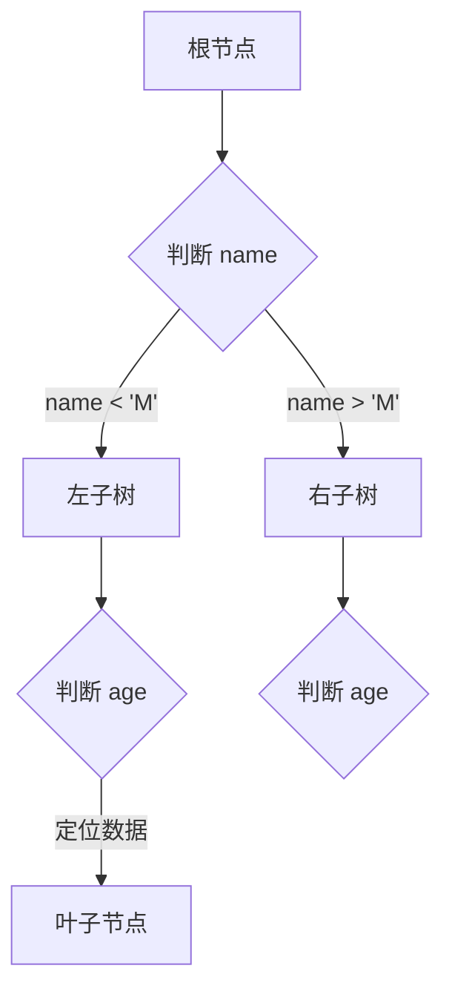

## 数据模型

> 建立在关系模型基础上，有多张相互连接的二维表组成。

## SQL

### SQL预编译

> https://blog.csdn.net/make_1998/article/details/118930914
>
> 一次编译、多次运行，省去了解析优化等过程；此外预编译语句能防止sql注入。

### DDL数据库操作

```shell
# 查询所有数据库
mysql> show databases;
+--------------------+
| Database           |
+--------------------+
| information_schema |
| mysql              |
| performance_schema |
| sys                |
+--------------------+
4 rows in set (0.00 sec)

# 查询当前数据库
mysql> use mysql
Reading table information for completion of table and column names
You can turn off this feature to get a quicker startup with -A

Database changed
mysql> select database();
+------------+
| database() |
+------------+
| mysql      |
+------------+
1 row in set (0.00 sec)

# 创建数据库
mysql> CREATE DATABASE IF NOT EXISTS testdb CHARACTER SET utf8mb4 COLLATE utf8mb4_unicode_ci;
Query OK, 1 row affected (0.00 sec)

mysql> show databases;
+--------------------+
| Database           |
+--------------------+
| information_schema |
| mysql              |
| performance_schema |
| sys                |
| testdb             |
+--------------------+
5 rows in set (0.00 sec)

# 删除数据库
mysql> drop database if exists testdb;
Query OK, 0 rows affected (0.01 sec)

mysql> show databases;
+--------------------+
| Database           |
+--------------------+
| information_schema |
| mysql              |
| performance_schema |
| sys                |
+--------------------+
4 rows in set (0.00 sec)

# 切换数据库
mysql> use mysql;
Database changed
mysql> select database();
+------------+
| database() |
+------------+
| mysql      |
+------------+
1 row in set (0.00 sec)

mysql> use sys;
Reading table information for completion of table and column names
You can turn off this feature to get a quicker startup with -A

Database changed
mysql> select database();
+------------+
| database() |
+------------+
| sys        |
+------------+
1 row in set (0.00 sec)
```

### DDL表操作

测试数据库环境准备

```shell
mysql> CREATE DATABASE IF NOT EXISTS testdb CHARACTER SET utf8mb4 COLLATE utf8mb4_unicode_ci;
Query OK, 1 row affected (0.01 sec)

mysql> use testdb;
Database changed
```


```shell
# 显示当前数据库所有表
mysql> use mysql
Reading table information for completion of table and column names
You can turn off this feature to get a quicker startup with -A

Database changed
mysql> show tables;
+------------------------------------------------------+
| Tables_in_mysql                                      |
+------------------------------------------------------+
| columns_priv                                         |
| component                                            |
| db                                                   |
......
+------------------------------------------------------+
37 rows in set (0.01 sec)

# 查看表名为 db 的表结构
mysql> desc db;
+-----------------------+---------------+------+-----+---------+-------+
| Field                 | Type          | Null | Key | Default | Extra |
+-----------------------+---------------+------+-----+---------+-------+
| Host                  | char(255)     | NO   | PRI |         |       |
| Db                    | char(64)      | NO   | PRI |         |       |
| User                  | char(32)      | NO   | PRI |         |       |
| Select_priv           | enum('N','Y') | NO   |     | N       |       |
......
+-----------------------+---------------+------+-----+---------+-------+
22 rows in set (0.01 sec)

# 查看表名为 db 的创建表SQL语句
mysql> show create table db\G;
*************************** 1. row ***************************
       Table: db
Create Table: CREATE TABLE `db` (
  `Host` char(255) CHARACTER SET ascii COLLATE ascii_general_ci NOT NULL DEFAULT '',
  `Db` char(64) COLLATE utf8_bin NOT NULL DEFAULT '',
  `User` char(32) COLLATE utf8_bin NOT NULL DEFAULT '',
  `Select_priv` enum('N','Y') CHARACTER SET utf8 COLLATE utf8_general_ci NOT NULL DEFAULT 'N',
  ......
  PRIMARY KEY (`Host`,`Db`,`User`),
  KEY `User` (`User`)
) /*!50100 TABLESPACE `mysql` */ ENGINE=InnoDB DEFAULT CHARSET=utf8mb3 COLLATE=utf8_bin STATS_PERSISTENT=0 ROW_FORMAT=DYNAMIC COMMENT='Database privileges'
1 row in set (0.00 sec)

ERROR: 
No query specified

# 添加字段
mysql> create table if not exists emp(
    ->  id int primary key auto_increment,
    ->  workno varchar(10),
    ->  name varchar(10),
    ->  gender char(1),
    ->  age int,
    ->  idcard char(18),
    ->  entrydate date
    -> ) ENGINE=INNODB DEFAULT CHARSET=utf8mb4 collate=utf8mb4_general_ci;
Query OK, 0 rows affected, 1 warning (0.01 sec)
mysql> alter table emp add column nickname varchar(20) comment "nicname";
Query OK, 0 rows affected (0.01 sec)
Records: 0  Duplicates: 0  Warnings: 0
mysql> desc emp;
+-----------+-------------+------+-----+---------+----------------+
| Field     | Type        | Null | Key | Default | Extra          |
+-----------+-------------+------+-----+---------+----------------+
| id        | int         | NO   | PRI | NULL    | auto_increment |
| workno    | varchar(10) | YES  |     | NULL    |                |
| name      | varchar(10) | YES  |     | NULL    |                |
| gender    | char(1)     | YES  |     | NULL    |                |
| age       | int         | YES  |     | NULL    |                |
| idcard    | char(18)    | YES  |     | NULL    |                |
| entrydate | date        | YES  |     | NULL    |                |
| nickname  | varchar(20) | YES  |     | NULL    |                |
+-----------+-------------+------+-----+---------+----------------+
8 rows in set (0.01 sec)

# 修改字段数据类型
mysql> alter table emp modify column nickname varchar(10);
Query OK, 0 rows affected (0.04 sec)
Records: 0  Duplicates: 0  Warnings: 0

# 修改字段名称和数据类型
mysql> alter table emp change nickname username varchar(15);
Query OK, 0 rows affected (0.00 sec)
Records: 0  Duplicates: 0  Warnings: 0

mysql> desc emp;
+-----------+-------------+------+-----+---------+----------------+
| Field     | Type        | Null | Key | Default | Extra          |
+-----------+-------------+------+-----+---------+----------------+
| id        | int         | NO   | PRI | NULL    | auto_increment |
| workno    | varchar(10) | YES  |     | NULL    |                |
| name      | varchar(10) | YES  |     | NULL    |                |
| gender    | char(1)     | YES  |     | NULL    |                |
| age       | int         | YES  |     | NULL    |                |
| idcard    | char(18)    | YES  |     | NULL    |                |
| entrydate | date        | YES  |     | NULL    |                |
| username  | varchar(15) | YES  |     | NULL    |                |
+-----------+-------------+------+-----+---------+----------------+
8 rows in set (0.01 sec)

mysql> alter table emp drop column username;
Query OK, 0 rows affected (0.02 sec)
Records: 0  Duplicates: 0  Warnings: 0
# mariadb语法支持判断字段存在才执行删除操作
mysql> alter table emp drop column if exists username;

# 修改表名
mysql> alter table emp rename to employee;
Query OK, 0 rows affected (0.01 sec)

mysql> show tables;
+------------------+
| Tables_in_testdb |
+------------------+
| employee         |
+------------------+
1 row in set (0.01 sec)

# 删除表
mysql> drop table if exists emp;
Query OK, 0 rows affected, 1 warning (0.01 sec)

# 删除表并且重新创建表
mysql> truncate table employee;
Query OK, 0 rows affected (0.02 sec)
```

### DML插入数据

```shell
# 给指定字段插入单条数据
mysql> insert into employee(workno,name,gender,age,idcard,entrydate) values('001','xiaoming','m',21,'0000000123',now());
Query OK, 1 row affected, 1 warning (0.01 sec)

mysql> select * from employee\G;
*************************** 1. row ***************************
       id: 1
   workno: 001
     name: xiaoming
   gender: m
      age: 21
   idcard: 0000000123
entrydate: 2023-02-09
1 row in set (0.00 sec)

ERROR: 
No query specified

# 给所有字段插入单条数据
mysql> insert into employee values(2,'002','xiaohong','f',18,'0000000125',now());
Query OK, 1 row affected, 1 warning (0.00 sec)

mysql> select * from employee\G;
*************************** 1. row ***************************
       id: 1
   workno: 001
     name: xiaoming
   gender: m
      age: 21
   idcard: 0000000123
entrydate: 2023-02-09
*************************** 2. row ***************************
       id: 2
   workno: 002
     name: xiaohong
   gender: f
      age: 18
   idcard: 0000000125
entrydate: 2023-02-09
2 rows in set (0.00 sec)

ERROR: 
No query specified

# 给指定字段插入多条数据
mysql> insert into employee(workno,name,gender,age,idcard,entrydate) values('0003','zhangsan','m',25,'000000111',now()),('0005','lisi','m',22,'000000222',now());
Query OK, 2 rows affected, 2 warnings (0.01 sec)
Records: 2  Duplicates: 0  Warnings: 2

mysql> select * from employee\G;
*************************** 1. row ***************************
       id: 1
   workno: 001
     name: xiaoming
   gender: m
      age: 21
   idcard: 0000000123
entrydate: 2023-02-09
*************************** 2. row ***************************
       id: 2
   workno: 002
     name: xiaohong
   gender: f
      age: 18
   idcard: 0000000125
entrydate: 2023-02-09
*************************** 3. row ***************************
       id: 3
   workno: 0003
     name: zhangsan
   gender: m
      age: 25
   idcard: 000000111
entrydate: 2023-02-09
*************************** 4. row ***************************
       id: 4
   workno: 0005
     name: lisi
   gender: m
      age: 22
   idcard: 000000222
entrydate: 2023-02-09
4 rows in set (0.01 sec)

ERROR: 
No query specified
```

### DML修改数据

> 已经掌握没有demo要写

### DML删除数据

> 已经掌握没有demo要写

### DQL分组查询

> where和having区别：
>
> 执行时机不同：where是分组之前进行过滤，不满足where条件，不参与分组。而having是分组之后对结果进行过滤。
>
> 判断条件不同：where不能对聚合函数进行判断，而having可以。

准备测试环境

```shell
mysql> CREATE DATABASE IF NOT EXISTS testdb CHARACTER SET utf8mb4 COLLATE utf8mb4_unicode_ci;
Query OK, 1 row affected (0.01 sec)

mysql> use testdb;
Database changed

mysql> create table if not exists employee(
    ->   id int primary key auto_increment,
    ->   workno varchar(10),
    ->   name varchar(10),
    ->   gender char(1),
    ->   age int,
    ->   idcard char(18),
    ->   workaddress varchar(64),
    ->   entrydate date
    -> ) ENGINE=INNODB DEFAULT CHARSET=utf8mb4 collate=utf8mb4_general_ci;
Query OK, 0 rows affected (0.02 sec)

mysql> insert into employee(workno,name,gender,age,idcard,workaddress,entrydate) values
    -> ('0001','xiaoming','m',18,'000000111','beijing','2018-05-23'),
    -> ('0002','xiaohong','f',19,'000000222','shanghai','2019-11-10'),
    -> ('0003','zhangsan','m',18,'000000333','beijing','2013-08-05'),
    -> ('0005','lisi','m',33,'000000555','shanghai','2022-08-22');
Query OK, 4 rows affected (0.01 sec)
Records: 4  Duplicates: 0  Warnings: 0
```

```shell
# 根据性别分组统计男女工人数量
mysql> select gender,count(*) from employee group by gender;
+--------+----------+
| gender | count(*) |
+--------+----------+
| m      |        3 |
| f      |        1 |
+--------+----------+
2 rows in set (0.00 sec)

# 根据性别分组统计男女工人平均年龄
mysql> select gender,avg(age) from employee group by gender;
+--------+----------+
| gender | avg(age) |
+--------+----------+
| m      |  25.3333 |
| f      |  19.0000 |
+--------+----------+
2 rows in set (0.00 sec)

# 统计年龄小于等于30并根据工作地点分组，获取员工数大于等于2的工作地点
mysql> select workaddress,count(*) from employee where age<=30 group by workaddress having count(*)>=2;
+-------------+----------+
| workaddress | count(*) |
+-------------+----------+
| beijing     |        2 |
+-------------+----------+
1 row in set (0.00 sec)
```

### DQL排序查询

准备测试环境

```shell
mysql> CREATE DATABASE IF NOT EXISTS testdb CHARACTER SET utf8mb4 COLLATE utf8mb4_unicode_ci;
Query OK, 1 row affected (0.01 sec)

mysql> use testdb;
Database changed

mysql> create table if not exists employee(
    ->   id int primary key auto_increment,
    ->   workno varchar(10),
    ->   name varchar(10),
    ->   gender char(1),
    ->   age int,
    ->   idcard char(18),
    ->   workaddress varchar(64),
    ->   entrydate date
    -> ) ENGINE=INNODB DEFAULT CHARSET=utf8mb4 collate=utf8mb4_general_ci;
Query OK, 0 rows affected (0.02 sec)

mysql> insert into employee(workno,name,gender,age,idcard,workaddress,entrydate) values
    -> ('0001','xiaoming','m',18,'000000111','beijing','2018-05-23'),
    -> ('0002','xiaohong','f',19,'000000222','shanghai','2019-11-10'),
    -> ('0003','zhangsan','m',18,'000000333','beijing','2013-08-05'),
    -> ('0005','lisi','m',33,'000000555','shanghai','2022-08-22');
Query OK, 4 rows affected (0.01 sec)
Records: 4  Duplicates: 0  Warnings: 0
```

```shell
# 根据年龄升序排序，如果年龄相同根据入职时间降序排序
mysql> select * from employee order by age asc,entrydate desc;
+----+--------+----------+--------+------+-----------+-------------+------------+
| id | workno | name     | gender | age  | idcard    | workaddress | entrydate  |
+----+--------+----------+--------+------+-----------+-------------+------------+
|  1 | 0001   | xiaoming | m      |   18 | 000000111 | beijing     | 2018-05-23 |
|  3 | 0003   | zhangsan | m      |   18 | 000000333 | beijing     | 2013-08-05 |
|  2 | 0002   | xiaohong | f      |   19 | 000000222 | shanghai    | 2019-11-10 |
|  4 | 0005   | lisi     | m      |   33 | 000000555 | shanghai    | 2022-08-22 |
+----+--------+----------+--------+------+-----------+-------------+------------+
4 rows in set (0.00 sec)
```

### DQL分页查询

准备测试环境

```shell
mysql> CREATE DATABASE IF NOT EXISTS testdb CHARACTER SET utf8mb4 COLLATE utf8mb4_unicode_ci;
Query OK, 1 row affected (0.01 sec)

mysql> use testdb;
Database changed

mysql> create table if not exists employee(
    ->   id int primary key auto_increment,
    ->   workno varchar(10),
    ->   name varchar(10),
    ->   gender char(1),
    ->   age int,
    ->   idcard char(18),
    ->   workaddress varchar(64),
    ->   entrydate date
    -> ) ENGINE=INNODB DEFAULT CHARSET=utf8mb4 collate=utf8mb4_general_ci;
Query OK, 0 rows affected (0.02 sec)

mysql> insert into employee(workno,name,gender,age,idcard,workaddress,entrydate) values
    -> ('0001','xiaoming','m',18,'000000111','beijing','2018-05-23'),
    -> ('0002','xiaohong','f',19,'000000222','shanghai','2019-11-10'),
    -> ('0003','zhangsan','m',18,'000000333','beijing','2013-08-05'),
    -> ('0005','lisi','m',33,'000000555','shanghai','2022-08-22');
Query OK, 4 rows affected (0.01 sec)
Records: 4  Duplicates: 0  Warnings: 0
```

```shell
# 查询第一页数据，0为记录索引开始，2为返回记录数
mysql> select * from employee order by id asc limit 0,2;
+----+--------+----------+--------+------+-----------+-------------+------------+
| id | workno | name     | gender | age  | idcard    | workaddress | entrydate  |
+----+--------+----------+--------+------+-----------+-------------+------------+
|  1 | 0001   | xiaoming | m      |   18 | 000000111 | beijing     | 2018-05-23 |
|  2 | 0002   | xiaohong | f      |   19 | 000000222 | shanghai    | 2019-11-10 |
+----+--------+----------+--------+------+-----------+-------------+------------+
2 rows in set (0.00 sec)

# 查询第二页数据，2为记录索引开始，2为返回记录数
mysql> select * from employee order by id asc limit 2,2;
+----+--------+----------+--------+------+-----------+-------------+------------+
| id | workno | name     | gender | age  | idcard    | workaddress | entrydate  |
+----+--------+----------+--------+------+-----------+-------------+------------+
|  3 | 0003   | zhangsan | m      |   18 | 000000333 | beijing     | 2013-08-05 |
|  4 | 0005   | lisi     | m      |   33 | 000000555 | shanghai    | 2022-08-22 |
+----+--------+----------+--------+------+-----------+-------------+------------+
2 rows in set (0.00 sec)
```

### DCL用户和权限管理

```shell
# 查询用户
mysql> use mysql;
Reading table information for completion of table and column names
You can turn off this feature to get a quicker startup with -A

Database changed
mysql> select * from user\G;
*************************** 1. row ***************************
                    Host: %
                    User: root
             Select_priv: Y
             Insert_priv: Y
             Update_priv: Y
             Delete_priv: Y
             Create_priv: Y
               Drop_priv: Y
             Reload_priv: Y
           Shutdown_priv: Y
            Process_priv: Y
               File_priv: Y
              Grant_priv: Y
         References_priv: Y
              Index_priv: Y
              Alter_priv: Y
            Show_db_priv: Y
              Super_priv: Y
   Create_tmp_table_priv: Y
        Lock_tables_priv: Y
            Execute_priv: Y
         Repl_slave_priv: Y
        Repl_client_priv: Y
        Create_view_priv: Y
          Show_view_priv: Y
     Create_routine_priv: Y
      Alter_routine_priv: Y
        Create_user_priv: Y
              Event_priv: Y
            Trigger_priv: Y
  Create_tablespace_priv: Y
                ssl_type: 
              ssl_cipher: 0x
             x509_issuer: 0x
            x509_subject: 0x
           max_questions: 0
             max_updates: 0
         max_connections: 0
    max_user_connections: 0
                  plugin: caching_sha2_password
   authentication_string: $A$005$(EyBGcoVb%hEqHr1Lx1QrCsLCpA9lT2TU2yRKbVuTEPAOGAgVtjA9jqo80
        password_expired: N
   password_last_changed: 2023-02-09 11:13:00
       password_lifetime: NULL
          account_locked: N
        Create_role_priv: Y
          Drop_role_priv: Y
  Password_reuse_history: NULL
     Password_reuse_time: NULL
Password_require_current: NULL
         User_attributes: NULL
*************************** 2. row ***************************
......

ERROR: 
No query specified

# 创建user1用户
mysql> create user user1@'%' identified by '123456';
Query OK, 0 rows affected (0.01 sec)

mysql> select * from user where User='user1'\G;
*************************** 1. row ***************************
                    Host: %
                    User: user1
             Select_priv: N
             Insert_priv: N
             Update_priv: N
             Delete_priv: N
             Create_priv: N
               Drop_priv: N
             Reload_priv: N
           Shutdown_priv: N
            Process_priv: N
               File_priv: N
              Grant_priv: N
         References_priv: N
              Index_priv: N
              Alter_priv: N
            Show_db_priv: N
              Super_priv: N
   Create_tmp_table_priv: N
        Lock_tables_priv: N
            Execute_priv: N
         Repl_slave_priv: N
        Repl_client_priv: N
        Create_view_priv: N
          Show_view_priv: N
     Create_routine_priv: N
      Alter_routine_priv: N
        Create_user_priv: N
              Event_priv: N
            Trigger_priv: N
  Create_tablespace_priv: N
                ssl_type: 
              ssl_cipher: 0x
             x509_issuer: 0x
            x509_subject: 0x
           max_questions: 0
             max_updates: 0
         max_connections: 0
    max_user_connections: 0
                  plugin: caching_sha2_password
   authentication_string: $A$005$1K=QE5u<1b=iI
S/x5t/lhoX7IUkNLq1X/jVrr3xvvOcOAGSDoScw7F91
        password_expired: N
   password_last_changed: 2023-02-09 17:38:17
       password_lifetime: NULL
          account_locked: N
        Create_role_priv: N
          Drop_role_priv: N
  Password_reuse_history: NULL
     Password_reuse_time: NULL
Password_require_current: NULL
         User_attributes: NULL
1 row in set (0.00 sec)

ERROR: 
No query specified

# 修改用户密码
mysql> alter user user1@'%' identified with mysql_native_password by '123456';
Query OK, 0 rows affected (0.00 sec)

# 删除用户
mysql> drop user user1@'%';
Query OK, 0 rows affected (0.00 sec)

# 查询用户user1的权限，USAGE权限表示只能够连接mysql
mysql> show grants for user1@'%';
+-----------------------------------+
| Grants for user1@%                |
+-----------------------------------+
| GRANT USAGE ON *.* TO `user1`@`%` |
+-----------------------------------+
1 row in set (0.00 sec)

# 授予用户user1对所有数据库所有表的所有操作权限
mysql> grant all on *.* to user1@'%';
Query OK, 0 rows affected (0.01 sec)
mysql> show grants for user1@'%'\G;
*************************** 1. row ***************************
Grants for user1@%: GRANT SELECT, INSERT, UPDATE, DELETE, CREATE, DROP, RELOAD, SHUTDOWN, PROCESS, FILE, REFERENCES, INDEX, ALTER, SHOW DATABASES, SUPER, CREATE TEMPORARY TABLES, LOCK TABLES, EXECUTE, REPLICATION SLAVE, REPLICATION CLIENT, CREATE VIEW, SHOW VIEW, CREATE ROUTINE, ALTER ROUTINE, CREATE USER, EVENT, TRIGGER, CREATE TABLESPACE, CREATE ROLE, DROP ROLE ON *.* TO `user1`@`%`
*************************** 2. row ***************************
Grants for user1@%: GRANT APPLICATION_PASSWORD_ADMIN,AUDIT_ADMIN,AUTHENTICATION_POLICY_ADMIN,BACKUP_ADMIN,BINLOG_ADMIN,BINLOG_ENCRYPTION_ADMIN,CLONE_ADMIN,CONNECTION_ADMIN,ENCRYPTION_KEY_ADMIN,FLUSH_OPTIMIZER_COSTS,FLUSH_STATUS,FLUSH_TABLES,FLUSH_USER_RESOURCES,GROUP_REPLICATION_ADMIN,GROUP_REPLICATION_STREAM,INNODB_REDO_LOG_ARCHIVE,INNODB_REDO_LOG_ENABLE,PASSWORDLESS_USER_ADMIN,PERSIST_RO_VARIABLES_ADMIN,REPLICATION_APPLIER,REPLICATION_SLAVE_ADMIN,RESOURCE_GROUP_ADMIN,RESOURCE_GROUP_USER,ROLE_ADMIN,SERVICE_CONNECTION_ADMIN,SESSION_VARIABLES_ADMIN,SET_USER_ID,SHOW_ROUTINE,SYSTEM_USER,SYSTEM_VARIABLES_ADMIN,TABLE_ENCRYPTION_ADMIN,XA_RECOVER_ADMIN ON *.* TO `user1`@`%`
2 rows in set (0.00 sec)

ERROR: 
No query specified

# 从用户user1回收对所有库所有操作权限
mysql> revoke all on *.* from user1@'%';
Query OK, 0 rows affected (0.00 sec)
mysql> show grants for user1@'%'\G;
*************************** 1. row ***************************
Grants for user1@%: GRANT USAGE ON *.* TO `user1`@`%`
1 row in set (0.00 sec)

ERROR: 
No query specified
```

## 约束

> 暂时未用到

## 多表查询

> 暂时未用到

## 存储引擎

```shell
# 显示当前数据库支持的存储引擎
mysql> show engines\G;
*************************** 1. row ***************************
      Engine: FEDERATED
     Support: NO
     Comment: Federated MySQL storage engine
Transactions: NULL
          XA: NULL
  Savepoints: NULL
*************************** 2. row ***************************
      Engine: MEMORY
     Support: YES
     Comment: Hash based, stored in memory, useful for temporary tables
Transactions: NO
          XA: NO
  Savepoints: NO
*************************** 3. row ***************************
      Engine: InnoDB
     Support: DEFAULT
     Comment: Supports transactions, row-level locking, and foreign keys
Transactions: YES
          XA: YES
  Savepoints: YES
*************************** 4. row ***************************
      Engine: PERFORMANCE_SCHEMA
     Support: YES
     Comment: Performance Schema
Transactions: NO
          XA: NO
  Savepoints: NO
*************************** 5. row ***************************
      Engine: MyISAM
     Support: YES
     Comment: MyISAM storage engine
Transactions: NO
          XA: NO
  Savepoints: NO
*************************** 6. row ***************************
      Engine: MRG_MYISAM
     Support: YES
     Comment: Collection of identical MyISAM tables
Transactions: NO
          XA: NO
  Savepoints: NO
*************************** 7. row ***************************
      Engine: BLACKHOLE
     Support: YES
     Comment: /dev/null storage engine (anything you write to it disappears)
Transactions: NO
          XA: NO
  Savepoints: NO
*************************** 8. row ***************************
      Engine: CSV
     Support: YES
     Comment: CSV storage engine
Transactions: NO
          XA: NO
  Savepoints: NO
*************************** 9. row ***************************
      Engine: ARCHIVE
     Support: YES
     Comment: Archive storage engine
Transactions: NO
          XA: NO
  Savepoints: NO
9 rows in set (0.00 sec)

ERROR: 
No query specified
```

### InnoDB

> DML操作遵循ACID模型，支持事务。
>
> 行级锁，提高并发访问性能。
>
> 支持外键foreign key约束，保证数据的完整性和正确性。
>
> 
>
> InnoDB每张表都对应这硬盘上的一个xxx.ibd表空间文件，这个文件存储着该表的结构、数据、索引数据。

### MyISAM

> 不支持事务，不支持外键。
>
> 支持表锁，不支持行锁。
>
> 访问速度快。
>
> 
>
> MyISAM表被存储在xxx.MYD、xxx.MYI、xxx.SDI硬盘文件中，SDI存放表结构信息，MYD存放表中数据，MYI存放索引数据。

### Memory

> 数据存放在内存中。
>
> 默认使用hash数据结构索引。
>
> 
>
> Memory表表结构信息被存放在xxx.SDI硬盘文件中。

### 存储引擎选择

> todo 未完成


## 索引 - 概念

优点：提高数据检索效率，降低数据库的 `IO` 成本；通过索引列对数据进行排序，降低数据排序的成本，降低 `CPU` 的消耗。

缺点：索引也要占用硬盘存储空间；索引大大提高了数据的检索速度，同时却也降低了表更新速度，对表 `insert`、`update`、`delete` 时效率降低。


## 索引 - 二叉树、红黑树、`B`树、`B+`树

>`todo` 做实验证明。

MySQL选择**B+树**作为索引的核心数据结构，而非二叉树、红黑树或普通B树，是综合考虑了**磁盘存储特性**、**查询效率**（尤其是范围查询）、**空间利用率**和**索引维护成本**后的最优解。以下从各数据结构的特性与数据库索引需求的矛盾出发，详细解释这一选择的原因。


### 一、二叉树/红黑树：树高过大，磁盘I/O效率低  
二叉树（尤其是普通BST）和红黑树（自平衡BST）的核心问题是**树高随数据量增长显著**，导致磁盘I/O次数过多。  

#### 1. 磁盘I/O的特性  
数据库的索引通常存储在磁盘中（而非内存），而磁盘的访问是**块级I/O**（每次读取一个固定大小的磁盘块，如4KB、8KB）。索引的查询效率主要取决于**需要访问的磁盘块数量**（即树的高度）。  

#### 2. 二叉树/红黑树的树高问题  
- 对于 \(n\) 个节点的二叉树，普通BST的最坏树高为 \(O(n)\)（有序插入时退化为链表），红黑树的最坏树高为 \(O(2\log n)\)（弱平衡）。  
- 即使 \(n=1000\) 万，红黑树的高度约为 \(2 \times \log_2(10^7) \approx 44\) 层。若每个磁盘块仅存储1个节点（即每个节点对应一次I/O），则需要44次I/O才能完成查询，效率极低。  


### 二、B树：节点存储数据，空间利用率低且范围查询低效  
B树（B-Tree）是一种多叉平衡树，通过增加每个节点的子节点数（即阶数 \(m\)）来降低树高，理论上能减少I/O次数。但它仍存在两个关键缺陷，使其不适用于数据库索引：  

#### 1. 节点存储完整数据，空间浪费  
B树的每个节点（包括非叶子节点）不仅存储**键（Key）**，还存储**完整的数据记录（如行指针、字段值）**。由于数据库的索引需要高频访问，而数据记录通常较大（尤其是包含大字段时），这会导致：  
- 单个磁盘块中能存储的键数量减少（因数据占用空间），树高无法有效降低；  
- 索引本身的空间利用率低（大量空间被数据占用，而非键和指针）。  

#### 2. 范围查询效率低  
B树的叶子节点和非叶子节点均存储键，但叶子节点之间**无链表连接**。范围查询（如 `SELECT * FROM table WHERE id BETWEEN 100 AND 200`）需要从根节点开始递归查找多个子树，无法通过顺序遍历快速获取连续区间数据，效率低于链表结构。  


### 三、B+树：针对数据库场景的优化设计  
B+树是B树的变种，通过以下关键改进，完美适配了数据库索引的需求：  


#### 1. 非叶子节点仅存储键和子节点指针，提升空间利用率  
B+树的**非叶子节点不存储数据记录**，仅存储键（Key）和子节点指针（指向子树）。这使得每个磁盘块中能存储的键数量大幅增加（因无需为数据预留空间），从而降低树的高度。  

**示例**：假设磁盘块大小为16KB，每个键占8字节，子节点指针占8字节。若B树的非叶子节点存储键+数据（数据占100字节），则每个节点仅能存储 \(16KB / (8+100+8) \approx 140\) 个键；而B+树的非叶子节点仅存储键+指针（共16字节），可存储 \(16KB / 16 = 1024\) 个键。树高从B树的约3层降至B+树的约2层（\(10^7\) 数据量时，树高仅需 \(\log_{1024}(10^7) \approx 3\) 层，但实际因阶数更大，树高更低）。  


#### 2. 叶子节点链表化，高效支持范围查询  
B+树的**所有叶子节点通过双向链表连接**，形成有序序列。这使得：  
- **范围查询**只需遍历叶子节点链表，无需回溯到上层节点，时间复杂度为 \(O(k + \log n)\)（\(k\) 为结果数量），效率极高；  
- **全表扫描**可直接遍历叶子节点链表，无需递归访问所有子树。  


#### 3. 更稳定的查询性能  
B+树的插入、删除操作仅在叶子节点进行（非叶子节点仅作为索引），且通过严格的阶数约束（如每个节点至少填充 \(m/2\) 个键），保证了树的高度始终为 \(O(\log_m n)\)（\(m\) 为阶数），查询性能更稳定。  


#### 4. 适配磁盘块大小，减少I/O次数  
B+树的节点大小通常与磁盘块大小（如16KB、32KB）严格匹配，每次I/O可读取一个完整的节点，充分利用磁盘的块访问特性，进一步减少I/O次数。  


### 四、MySQL为何最终选择B+树？  
综合以上分析，B+树在以下方面完美契合数据库索引的需求：  

| 特性             | 二叉树/红黑树       | B树                     | B+树                    |
| ---------------- | ------------------- | ----------------------- | ----------------------- |
| **树高**         | 高（\(O(\log n)\)） | 较低（\(O(\log_m n)\)） | 更低（\(O(\log_m n)\)） |
| **范围查询效率** | 低（需递归遍历）    | 低（无叶子链表）        | 高（叶子链表顺序遍历）  |
| **空间利用率**   | 低（指针占用空间）  | 低（非叶子节点存数据）  | 高（非叶子节点仅存键）  |
| **磁盘I/O次数**  | 多（树高）          | 中等（树高较低）        | 最少（树高最低+块匹配） |


### 总结  
MySQL选择B+树作为索引的核心原因在于：  
- **B+树的多叉结构降低了树高**，减少了磁盘I/O次数；  
- **非叶子节点仅存键**，提升了节点空间利用率，进一步降低树高；  
- **叶子节点链表化**，高效支持范围查询和全表扫描；  
- **稳定的插入/删除性能**，避免了其他树结构的退化问题。  

因此，B+树是数据库索引场景下综合性能最优的选择。


## 索引 - 数据结构

B+Tree索引：最常见的索引类型，大部分引擎（InnoDB、MyISAM、Memory）都支持B+Tree索引。

Hash索引：底层数据结构是用Hash表实现，只有精确匹配索引列的查询才有效，不支持范围查询。

R-Tree空间索引：空间索引是MyISAM引擎的一个特殊索引类型，主要用于地理空间数据类型，通常使用较少。

Full-Text全文索引：是一种通过建立倒排索引，快速匹配文档的方式。类似与Lucene、Solr、Elasticsearch。

B+Tree索引InnoDB支持、MyISAM支持、Memory支持。

Hash索引InnoDB不支持、MyISAM不支持、Memory支持。

R-Tree空间索引InnoDB不支持、MyISAM支持、Memory不支持。

Full-Text全文索引InnoDB 5.6版本之后支持、MyISAM支持、Memory不支持。

MySQL默认使用B+Tree数据结构建立索引


## 索引 - `B+Tree` 数据结构

> 了解概念请参考本站 <a href="/数据结构和算法/README.html#b-树-概念" target="_blank">链接</a>。
>
> 了解性能测试请参考本站 <a href="/数据结构和算法/README.html#b-树-性能测试" target="_blank">链接</a>


## 索引 - 分类

主键索引：针对于表中的主键建立索引，默认自动创建并且只能有一个。

唯一索引：避免同一表中某数据列中的值重复，可以有多个。

普通索引：快速定位特定列的数据，可以有多个。

全文索引：全文索引是查找文本中的关键词，而不是比较索引中的值，可以有多个。

外键索引：如果为某个外键字段定义了一个外键约束条件，MySQL就会定义一个内部索引来帮助自己以最有效率的方式去管理和使用外键约束条件。


在InnoDB存储引擎中，根据索引的存储形式，有可以分为一下两种：

- 聚集索引 `Clustered Index`：将数据存储和索引放到了一块，索引结构的叶子节点保存了行数据。必须有而且只有一个（如果存在主键，主键索引就是聚集索引；如果不存在主键，将使用第一个唯一索引作为聚集索引；如果表没有主键或者合适的唯一索引，则 `InnoDB` 会自动生成一个 `rowid` 作为隐藏的聚集索引）。
- 二级索引 `Secondary Index`：将数据与索引分开存储，索引结构的叶子节点关联的是对应的主键。可以存在多个。


## 索引 - 聚簇索引和非聚簇索引

在MySQL中，**聚簇索引（Clustered Index）**和**非聚簇索引（Non-Clustered Index，又称二级索引）**是两种核心的索引类型，它们的核心区别在于**数据存储方式与索引结构的绑定关系**。以下从定义、存储结构、查询逻辑、优缺点等维度详细对比两者的差异。


### 一、核心定义与存储结构
#### 1. 聚簇索引（Clustered Index）  
聚簇索引是一种**将数据行与索引键值物理绑定**的索引结构。其核心特点是：  
- **数据即索引**：聚簇索引的叶子节点直接存储表中的**完整数据行**（而非指向数据的指针）。  
- **物理顺序决定**：表中数据行的物理存储顺序与聚簇索引的键值顺序完全一致（类似字典按拼音排序，拼音索引与文字内容页绑定）。  

**MySQL中的实现**：  
- InnoDB引擎默认使用聚簇索引，且**一个表只能有一个聚簇索引**（因为数据行的物理顺序只能有一个）。  
- 聚簇索引的键通常选择主键（Primary Key）；若未显式定义主键，InnoDB会选择**唯一的非空索引（Unique Key）**；若仍无，则隐式生成一个6字节的`ROWID`作为聚簇索引键。  


#### 2. 非聚簇索引（Non-Clustered Index）  
非聚簇索引是一种**独立于数据物理存储**的索引结构。其核心特点是：  
- **数据与索引分离**：非聚簇索引的叶子节点存储的是**指向数据行的指针**（而非完整数据）。  
- **逻辑顺序独立**：索引键值的顺序与数据行的物理存储顺序无关（类似字典的“笔画索引”，笔画顺序与文字内容页的物理顺序无关）。  

**MySQL中的实现**：  
- InnoDB和MyISAM引擎均支持非聚簇索引（InnoDB称为“二级索引”，MyISAM称为“普通索引”）。  
- 一个表可以有多个非聚簇索引（通常建议不超过5个，避免过多影响写入性能）。  


### 二、存储结构对比（以InnoDB为例）
| 特性                 | 聚簇索引                             | 非聚簇索引（二级索引）               |
| -------------------- | ------------------------------------ | ------------------------------------ |
| **叶子节点内容**     | 完整数据行（包括所有列）             | 主键值（或ROWID）+ 索引键            |
| **数据与索引的关系** | 数据行物理顺序与索引键顺序一致       | 数据行物理顺序与索引键顺序无关       |
| **数量限制**         | 仅1个（主键/隐式ROWID/唯一非空索引） | 可多个（无数量限制，取决于业务需求） |


### 三、查询逻辑差异
#### 1. 聚簇索引查询  
通过聚簇索引查找数据时，**只需遍历索引树一次**即可直接获取完整数据行。例如：  
```sql
-- 假设表t的聚簇索引是id（主键）
SELECT * FROM t WHERE id = 123;
```
- **过程**：从根节点开始，通过B+树搜索找到id=123的叶子节点，叶子节点直接包含该行的所有列数据（无需额外I/O）。  


#### 2. 非聚簇索引查询  
通过非聚簇索引查找数据时，需经历**两次I/O**：  
1. 第一次I/O：遍历非聚簇索引树，找到对应索引键的叶子节点，获取其存储的主键值（或ROWID）。  
2. 第二次I/O：通过主键值（或ROWID）到聚簇索引中查找完整数据行（此过程称为“回表”）。  

例如：  
```sql
-- 假设表t的聚簇索引是id，非聚簇索引是name
SELECT * FROM t WHERE name = 'Alice';
```
- **过程**：  
  1. 在非聚簇索引（name）的B+树中找到name='Alice'的叶子节点，获取对应的主键值id=X；  
  2. 用id=X到聚簇索引中查找完整数据行（需第二次I/O）。  


### 四、优缺点对比
#### 1. 聚簇索引的优势与局限  
**优势**：  
- **查询效率极高**：数据与索引绑定，单次索引查询即可获取完整数据（无需回表）。  
- **空间利用率高**：无需额外存储索引指针（数据即索引）。  

**局限**：  
- **写入性能受影响**：数据行的物理顺序由聚簇索引决定，插入/删除/更新可能导致数据页分裂或合并（如插入一条id=1000的记录，若前一个id=999的页已满，需新开页并移动部分数据）。  
- **索引键选择受限**：仅能有一个聚簇索引，需谨慎选择（通常选主键，且主键应尽量短、有序，如自增ID）。  


#### 2. 非聚簇索引的优势与局限  
**优势**：  
- **灵活加速查询**：可针对任意列（如name、email）创建索引，加速非主键列的查询。  
- **不影响数据存储**：数据行的物理顺序由聚簇索引决定，非聚簇索引的增删改不影响数据存储结构。  

**局限**：  
- **回表开销**：需两次I/O（非聚簇索引查询+聚簇索引回表），若回表数据量过大（如范围查询），性能可能下降。  
- **空间占用高**：每个非聚簇索引需独立存储索引键和主键值（或ROWID），索引越多，空间消耗越大。  


### 五、典型场景建议
| 场景                                     | 推荐索引类型             | 原因                                                         |
| ---------------------------------------- | ------------------------ | ------------------------------------------------------------ |
| 主键查询（如`WHERE id=123`）             | 聚簇索引                 | 直接获取数据，无需回表，性能最优。                           |
| 非主键等值查询（如`WHERE name='Alice'`） | 非聚簇索引（二级索引）   | 需通过非聚簇索引快速定位主键，再回表获取数据。               |
| 范围查询（如`WHERE id>100`）             | 聚簇索引                 | 数据按聚簇索引顺序存储，范围查询可通过遍历叶子节点链表高效完成。 |
| 高频写入场景（如日志表）                 | 聚簇索引（主键选自增ID） | 自增主键的插入不会导致数据页分裂（顺序写入），减少维护开销。 |


### 总结  
聚簇索引与非聚簇索引的核心区别在于**数据与索引的绑定方式**：  
- 聚簇索引“数据即索引”，适合高频主键查询和范围查询，但限制多且写入成本高；  
- 非聚簇索引“索引独立于数据”，灵活支持多列查询，但需回表且空间开销大。  

实际开发中，应优先为**高频查询的主键列**设计聚簇索引，为**高频查询的非主键列**设计非聚簇索引，并避免过度索引以平衡读写性能。


## 索引 - 索引下推

在MySQL中，**索引下推（Index Condition Pushdown，简称ICP）**是一种针对**非聚簇索引（二级索引）查询的优化技术**，其核心目的是**在索引扫描阶段提前过滤不符合条件的数据**，减少需要回表到聚簇索引的行数，从而降低I/O开销，提升查询效率。


### 一、索引下推的背景：传统查询的问题  
在没有索引下推的传统查询流程中，使用非聚簇索引（二级索引）查询时，需经历以下步骤：  
1. **索引扫描**：通过非聚簇索引（如`(b, c)`）找到所有符合索引键条件的行（如`b=10`），得到一组行标识符（如主键值）。  
2. **回表查询**：根据行标识符回表到聚簇索引，获取这些行的完整数据。  
3. **内存过滤**：在内存中对回表后的完整数据进行过滤（如检查`c=20`）。  

**问题**：若索引键仅包含部分过滤条件（如仅`b=10`），而另一部分条件（如`c=20`）无法通过索引直接判断，则需回表所有`b=10`的行，再在内存中过滤，导致大量无效回表（尤其是当`c=20`的行占比很小时）。  


### 二、索引下推的核心原理  
索引下推允许MySQL在**非聚簇索引扫描阶段**，直接应用**WHERE条件中与索引列相关的过滤规则**，提前排除不符合条件的行，仅将符合条件的行标识符回表。  

**关键条件**：  
- 过滤条件必须是**索引列的直接判断**（如`c=20`，且`c`是索引的一部分）；  
- 过滤条件需满足“可下推性”（如不能是函数、子查询或跨列复杂表达式）。  


### 三、索引下推的工作流程（对比传统流程）  
以表`t`（主键`a`，非聚簇索引`(b, c)`）为例，查询`SELECT * FROM t WHERE b=10 AND c=20`：  


#### 1. 传统流程（无索引下推）  
- **步骤1**：通过非聚簇索引`(b, c)`找到所有`b=10`的行，得到主键列表`[a1, a2, ..., an]`（假设共`n`行）。  
- **步骤2**：回表到聚簇索引，获取这`n`行的完整数据（包括`c`列）。  
- **步骤3**：在内存中过滤出`c=20`的行（假设仅`k`行符合，`k << n`）。  

**问题**：需回表`n`行，其中`n-k`行是无效的（`c≠20`），浪费I/O资源。  


#### 2. 索引下推流程（有ICP优化）  
- **步骤1**：通过非聚簇索引`(b, c)`扫描，先过滤`b=10`的行。  
- **步骤2**：在索引扫描过程中，直接应用`c=20`的条件（因`c`是索引列），仅保留`b=10 AND c=20`的行，得到主键列表`[a_x1, a_x2, ..., a_xk]`（仅`k`行）。  
- **步骤3**：回表到聚簇索引，仅获取这`k`行的完整数据（无需过滤）。  

**优势**：仅回表`k`行（有效行），大幅减少I/O次数。  


### 四、索引下推的适用条件  
索引下推并非适用于所有场景，需满足以下条件：  


#### 1. 过滤条件涉及索引列  
过滤条件必须是**非聚簇索引中包含的列**（如索引`(b, c)`可支持`b=10`或`c=20`的条件，但无法支持`d=30`的条件，若`d`不在索引中）。  


#### 2. 条件可被索引直接判断  
过滤条件需是**简单的等式或范围判断**（如`c=20`、`c>100`），不能是：  
- 函数或表达式（如`c+1=21`、`UPPER(c)='ABC'`）；  
- 跨列条件（如`b + c=30`）；  
- 子查询或聚合函数（如`c IN (SELECT ...)`）。  


#### 3. 索引类型支持  
索引下推适用于**非聚簇索引（二级索引）**，聚簇索引因数据与索引绑定，无需回表，因此不涉及ICP。  


#### 4. MySQL版本要求  
索引下推在**MySQL 5.6及以上版本**中默认启用（5.6之前需手动开启`optimizer_switch='index_condition_pushdown=on'`）。  


### 五、索引下推的优化效果  
索引下推的核心价值是**减少回表次数**，尤其在以下场景中效果显著：  


#### 1. 非聚簇索引列包含多个过滤条件  
当查询的WHERE条件包含多个索引列时（如`WHERE b=10 AND c=20`），索引下推可在索引扫描阶段过滤掉大部分无效行，仅回表少量有效行。  


#### 2. 大表查询  
对于数据量极大的表，非聚簇索引扫描返回的行标识符可能非常多（如百万级），但实际符合条件的行很少（如几十条）。索引下推可将回表次数从百万级降至几十条，大幅降低I/O负载。  


#### 3. 范围查询中的过滤  
即使查询包含范围条件（如`WHERE b>100 AND c=20`），只要`c=20`是索引列的一部分，索引下推仍可在扫描`b>100`的范围内，进一步过滤出`c=20`的行，减少回表量。  


### 六、索引下推的局限性  
尽管索引下推能显著提升查询性能，但其效果受限于以下因素：  


#### 1. 索引设计是否合理  
若索引未包含查询中的过滤列（如查询`WHERE b=10 AND c=20`，但索引仅为`(b)`），则无法触发索引下推。  


#### 2. 过滤条件的复杂度  
若过滤条件包含函数或复杂表达式（如`c%2=0`），索引下推无法生效，仍需回表后过滤。  


#### 3. 数据分布的影响  
若索引列的过滤条件区分度低（如`c=20`的行占比很高），索引下推的优化效果会减弱（但仍能减少部分回表）。  


### 总结  
索引下推（ICP）是MySQL针对非聚簇索引查询的重要优化技术，通过**在索引扫描阶段提前过滤无效数据**，减少回表次数，显著提升查询效率。其核心适用场景是：**查询条件包含非聚簇索引列，且过滤规则可通过索引直接判断**。  

实际开发中，合理设计包含高频过滤列的非聚簇索引（如联合索引`(b, c)`），并确保查询条件符合索引下推的要求，能有效利用这一优化，降低数据库负载。


## 索引 - 单列索引

在MySQL中，**单列索引（Single-Column Index）**是最基础的索引类型，指在表的**单个列**上创建的索引结构。它通过为该列建立B+树（或其他结构）来加速基于该列的查询操作，是数据库优化中最常用的索引手段之一。


### 一、单列索引的核心定义与结构  
单列索引的核心是为表中的某一列（如`user_id`、`email`）单独建立索引，其本质是一个**B+树结构**（InnoDB和MyISAM均如此），用于快速定位该列值符合条件的行。  

#### 1. 存储引擎差异  
- **InnoDB**：单列索引属于**非聚簇索引（二级索引）**，其叶子节点存储的是**主键值**（而非完整数据行）。通过主键值需回表到聚簇索引获取完整数据（即“回表”操作）。  
- **MyISAM**：单列索引是**非聚簇索引**，叶子节点直接存储**数据行的物理地址（ROWID）**，可直接通过ROWID定位数据（无需回表）。  


### 二、单列索引的典型场景  
单列索引适用于**高频查询中仅涉及单个列**的场景，常见场景包括：  

#### 1. WHERE子句中的等值/范围查询  
例如：  
```sql
-- 等值查询
SELECT * FROM users WHERE email = 'alice@example.com';

-- 范围查询
SELECT * FROM orders WHERE amount > 1000;
```
若`email`或`amount`列有单列索引，可快速定位符合条件的行。  


#### 2. JOIN操作的关联列  
例如：  
```sql
-- 关联查询（orders表的user_id关联users表的id）
SELECT * FROM orders 
JOIN users ON orders.user_id = users.id 
WHERE users.country = 'China';
```
若`orders.user_id`或`users.country`有单列索引，可加速关联条件的匹配。  


#### 3. ORDER BY或GROUP BY的排序/分组列  
例如：  
```sql
-- 按注册时间排序
SELECT * FROM users ORDER BY register_time DESC;

-- 按城市分组统计
SELECT city, COUNT(*) FROM users GROUP BY city;
```
若`register_time`或`city`有单列索引，可避免全表扫描后的文件排序（Filesort）或临时分组。  


### 三、单列索引的优缺点分析  


#### **优点**  
1. **实现简单**：仅需为单个列创建索引，语法和维护成本低（如`CREATE INDEX idx_email ON users(email);`）。  
2. **单字段查询高效**：针对该列的等值、范围、排序等查询可快速定位数据（InnoDB需回表，MyISAM直接定位）。  
3. **空间占用较小**：相比联合索引（多列索引），单列索引仅需存储一列的键值和指针，空间占用更低。  


#### **缺点**  
1. **多列查询效率有限**：若查询涉及多个列（如`WHERE name='Alice' AND age=25`），单列索引仅能利用其中一个列的索引（通常是最左匹配的列），其他列仍需全表扫描或回表过滤。  
2. **选择性低的列效果差**：若列的区分度低（如性别列`gender`，仅`男`/`女`两个值），单列索引的过滤效果弱（索引扫描返回大量行，需回表验证），此时索引可能失效。  
3. **写入性能受影响**：每次插入/更新/删除该列数据时，需同步更新索引（B+树的插入、分裂、合并操作），可能降低写入速度（尤其对高频写入的表）。  


### 四、单列索引的创建与管理  


#### 1. 创建单列索引  
使用`CREATE INDEX`或`ALTER TABLE`语句：  
```sql
-- 方式1：CREATE INDEX
CREATE INDEX idx_email ON users(email);

-- 方式2：ALTER TABLE（推荐，语法更统一）
ALTER TABLE users ADD INDEX idx_email (email);
```


#### 2. 查看单列索引  
通过`SHOW INDEX`命令查看表的索引信息：  
```sql
SHOW INDEX FROM users;
```
输出结果中，`Key_name`为索引名（如`idx_email`），`Column_name`为索引列（如`email`），`Non_unique`表示是否唯一（0为唯一，1为非唯一）。  


#### 3. 删除单列索引  
使用`DROP INDEX`语句：  
```sql
DROP INDEX idx_email ON users;
```


### 五、单列索引 vs 联合索引  
单列索引与联合索引（多列索引）的核心差异在于**覆盖的查询场景**：  

| 特性         | 单列索引                             | 联合索引（如`(name, age)`）                   |
| ------------ | ------------------------------------ | --------------------------------------------- |
| **覆盖查询** | 仅支持单字段查询（如`name='Alice'`） | 支持多字段查询（如`name='Alice' AND age=25`） |
| **最左匹配** | 不涉及                               | 支持（可匹配`(name)`、`(name, age)`）         |
| **空间占用** | 较小（仅一列）                       | 较大（多列键值+指针）                         |
| **适用场景** | 单字段高频查询                       | 多字段组合查询或范围查询                      |


### 六、最佳实践建议  
1. **优先为高频查询的单字段创建索引**：如WHERE、JOIN、ORDER BY/GROUP BY中频繁使用的列（如用户表的`email`、订单表的`order_no`）。  
2. **避免为低选择性列创建索引**：如性别、状态（取值少）等，索引效果差且浪费空间。  
3. **结合联合索引优化多字段查询**：若查询涉及多个列（如`WHERE name='Alice' AND age=25`），优先创建联合索引`(name, age)`，而非多个单列索引（因联合索引支持最左匹配，效率更高）。  
4. **定期分析索引使用情况**：通过`EXPLAIN`命令查看查询执行计划，确认索引是否被有效利用（如`type`是否为`ref`或`range`，`key`是否显示目标索引）。  


### 总结  
单列索引是MySQL中最基础的索引类型，通过为单个列建立B+树结构，加速基于该列的查询操作。其核心优势是实现简单、单字段查询高效，但需注意在多字段查询或多条件场景中，联合索引通常更优。实际开发中，需结合业务查询模式，合理设计单列索引与联合索引，平衡读写性能。


## 索引 - 联合索引

在MySQL中，**联合索引（Composite Index，又称复合索引或多列索引）**是基于表的**多个列**创建的索引结构。它通过将这些列的值按顺序组合成一个键，形成B+树结构，从而加速涉及这些列的查询操作。联合索引是优化多条件查询、排序/分组操作的核心工具，也是数据库索引设计中最常用的进阶技巧之一。


### 一、联合索引的核心定义与结构  
联合索引的本质是将多个列的值拼接成一个**复合键**，并基于这个键构建B+树。其核心特点是：  
- **多列组合键**：索引的键由多个列的值按定义顺序拼接而成（如索引`(col1, col2, col3)`的键是`col1值 + col2值 + col3值`）。  
- **B+树存储**：与单列索引类似，联合索引的底层结构是B+树，但叶子节点存储的是复合键和对应的行指针（InnoDB中为**主键值**，MyISAM中为**行物理地址**）。  


### 二、联合索引的工作原理：最左匹配原则  
联合索引的核心优势依赖于**最左匹配原则（Leftmost Prefix Rule）**，即查询条件必须包含索引的**前缀列**才能有效利用索引。具体规则如下：  


#### 1. 完全匹配前缀列  
当查询条件包含索引的**所有列**（或前缀列的连续子集）时，索引可被完全利用。例如：  
- 索引`(a, b, c)`可支持以下查询：  
  - `WHERE a=1`（使用索引的第一列）；  
  - `WHERE a=1 AND b=2`（使用索引的前两列）；  
  - `WHERE a=1 AND b=2 AND c=3`（使用索引的全部三列）。  


#### 2. 部分匹配前缀列（跳过中间列）  
若查询条件**跳过了索引的前缀列**（如索引`(a, b, c)`，但查询条件为`WHERE a=1 AND c=3`），则索引仅能利用到`a`列（第一列），`c`列无法利用索引（除非触发索引下推等优化）。  


#### 3. 范围查询的边界  
若查询条件中包含**范围查询**（如`>`、`<`、`BETWEEN`），则范围查询列之后的列无法利用索引。例如：  
- 索引`(a, b, c)`，查询`WHERE a=1 AND b>10 AND c=3`：  
  - `a`和`b`列可用于索引扫描，但`c=3`无法利用索引（因`b`是范围查询列，其后的`c`列无法被索引有效过滤）。  


### 三、联合索引的典型适用场景  
联合索引通过组合多列信息，能显著优化以下场景的查询性能：  


#### 1. 多条件等值查询  
当查询条件包含多个列的等值匹配（如`WHERE user_id=123 AND status='active'`）时，联合索引可直接定位到符合条件的行，避免全表扫描。  

**示例**：  
表`t`有字段`user_id`（用户ID）、`status`（状态）、`create_time`（创建时间），创建联合索引`(user_id, status)`后：  
```sql
SELECT * FROM t WHERE user_id=123 AND status='active';
```
索引会先按`user_id=123`筛选，再在结果中按`status='active'`筛选，大幅减少需要回表的数据量。  


#### 2. 排序与分组（ORDER BY/GROUP BY）  
若查询的`ORDER BY`或`GROUP BY`列与联合索引的列顺序一致，MySQL可直接利用索引的有序性，避免额外的文件排序（Filesort）或临时分组操作。  

**示例**：  
创建联合索引`(user_id, create_time DESC)`后：  
```sql
-- 按user_id和create_time排序（与索引顺序一致）
SELECT * FROM t WHERE user_id=123 ORDER BY create_time DESC;
```
索引本身已按`user_id`升序、`create_time`降序排列，查询时可直接遍历索引的叶子节点，无需额外排序。  


#### 3. 覆盖索引（Covering Index）  
若查询的列**全部包含在联合索引中**（包括索引列和主键），则MySQL无需回表到聚簇索引，直接通过联合索引即可获取完整数据（称为“覆盖索引”）。  

**示例**：  
表`t`的主键是`id`，创建联合索引`(user_id, status)`后：  
```sql
-- 查询列仅包含user_id、status（均在索引中）
SELECT user_id, status FROM t WHERE user_id=123;
```
联合索引的叶子节点已存储`user_id`、`status`和主键`id`（InnoDB），因此无需回表，直接返回结果。  


### 四、联合索引的设计原则与优化技巧  


#### 1. 索引列顺序：高选择性列在前  
联合索引的列顺序应遵循**高选择性（High Selectivity）列在前**的原则。选择性是指列中不同值的数量与总行数的比值（选择性越高，列的区分度越强）。  

**示例**：  
若列`user_id`的选择性（如100万行中`user_id`唯一）远高于`status`（如仅`active`/`inactive`两种值），则索引应设计为`(user_id, status)`，而非`(status, user_id)`。高选择性列在前可更快缩小扫描范围。  


#### 2. 避免冗余索引  
若已存在联合索引`(a, b)`，则无需单独创建`(a)`（因`(a, b)`已包含`a`的索引能力）。冗余索引会增加存储和维护成本（写入时需更新多个索引）。  


#### 3. 合理控制索引长度  
MySQL对索引键的总长度有限制（InnoDB默认3072字节，MyISAM默认1000字节）。若联合索引包含长字符串列（如`VARCHAR(255)`），需评估总长度是否超出限制，必要时使用前缀索引（如`INDEX (col(10))`，仅索引前10个字符）。  


#### 4. 利用索引下推（ICP）优化  
若联合索引包含更多列（如`(a, b, c)`），且查询条件包含这些列的过滤（如`WHERE a=1 AND b=2 AND c=3`），MySQL可通过索引下推在扫描阶段直接过滤`c=3`的条件，减少回表次数（详见前文“索引下推”部分）。  


### 五、联合索引的创建与管理  


#### 1. 创建联合索引  
使用`CREATE INDEX`或`ALTER TABLE`语句：  
```sql
-- 方式1：CREATE INDEX
CREATE INDEX idx_user_status ON t(user_id, status);

-- 方式2：ALTER TABLE（推荐）
ALTER TABLE t ADD INDEX idx_user_status (user_id, status);
```


#### 2. 查看联合索引  
通过`SHOW INDEX`命令查看表的索引信息，重点关注`Key_name`（索引名）、`Column_name`（索引列顺序）、`Cardinality`（索引基数，反映选择性）：  
```sql
SHOW INDEX FROM t;
```


#### 3. 删除联合索引  
使用`DROP INDEX`语句：  
```sql
DROP INDEX idx_user_status ON t;
```


### 六、联合索引 vs 单列索引  
联合索引与单列索引的核心差异在于**覆盖的查询场景**和**索引效率**：  

| 特性              | 单列索引                    | 联合索引（如`(a, b)`）              |
| ----------------- | --------------------------- | ----------------------------------- |
| **覆盖查询**      | 仅支持单字段查询（如`a=1`） | 支持多字段查询（如`a=1 AND b=2`）   |
| **最左匹配**      | 不涉及                      | 支持（可匹配`(a)`、`(a, b)`）       |
| **排序/分组优化** | 仅单字段排序                | 支持多字段排序（如`ORDER BY a, b`） |
| **空间占用**      | 较小（仅一列）              | 较大（多列键值+指针）               |


### 总结  
联合索引是MySQL中优化多条件查询的核心工具，通过**多列组合键+B+树结构**，结合最左匹配原则，能有效加速等值查询、排序/分组及覆盖索引场景。其设计关键在于**合理选择索引列顺序**（高选择性列在前）、**避免冗余**，并利用索引下推等优化技术。实际开发中，需结合业务查询模式（如高频多条件查询、排序需求）设计联合索引，平衡读写性能。


## 索引 - 创建、查看、删除

**测试环境准备**

```shell
mysql> CREATE DATABASE IF NOT EXISTS testdb CHARACTER SET utf8mb4 COLLATE utf8mb4_unicode_ci;
Query OK, 1 row affected (0.01 sec)

mysql> use testdb;
Database changed

create table if not exists tb_user(
  id bigint primary key auto_increment,
  name varchar(64) not null,
  phone varchar(32) not null,
  email varchar(32) not null,
  profession varchar(32) not null,
  age int not null,
  gender int default 1 not null,
  status char(1) default 0 not null,
  createTime datetime not null
) ENGINE=INNODB DEFAULT CHARSET=utf8mb4 collate=utf8mb4_general_ci;

insert into tb_user values
(1,'吕布','17799990000','lvbu666@163.com','软件工程',23,1,'6','2001-02-02 00:00:00'),
(2,'曹操','17799990001','caocao666@qq.com','通讯工程',33,1,'0','2001-03-05 00:00:00'),
(3,'赵云','17799990002','17799990@139.com','英语',34,1,'2','2002-03-02 00:00:00'),
(4,'孙悟空','17799990003','17799990@sina.com','工程造价',54,1,'0','2001-07-02 00:00:00'),
(5,'花木兰','17799990004','19980729@sina.com','软件工程',23,2,'1','2001-04-22 00:00:00'),
(6,'大乔','17799990005','daqiao6666@sina.com','舞蹈',22,2,'0','2001-02-07 00:00:00'),
(7,'露娜','17799990006','luna_love@sina.com','应用数学',24,2,'0','2001-02-08 00:00:00'),
(8,'程咬金','17799990007','chengyaojin@163.com','化工',38,1,'5','2001-05-23 00:00:00'),
(9,'项羽','17799990008','xiangyu666@qq.com','金属材料',43,1,'0','2001-09-18 00:00:00'),
(10,'白起','17799990009','baiqi666@sina.com','机械工程及其自动化',27,1,'2','2001-08-16 00:00:00'),
(11,'韩信','17799990010','hanxin520@163.com','无机非金属材料工程',27,1,'0','2001-06-12 00:00:00'),
(12,'荆柯','17799990011','jingke123@163.com','会计',29,1,'0','2001-05-11 00:00:00'),
(13,'兰陵王','17799990012','lanlinwang666@126.com','工程造价',44,1,'1','2001-04-09 00:00:00'),
(14,'狂铁','17799990013','kuangtie@sina.com','应用数学',43,2,'2','2001-04-11 00:00:00'),
(15,'貂蝉','17799990014','84958948374@qq.com','软件工程',40,2,'3','2001-02-12 00:00:00'),
(16,'坦己','17799990015','2783238293@qq.com','软件工程',31,2,'0','2001-01-30 00:00:00'),
(17,'月丹','17799990016','xiaomin2001@sina.com','工业经济',35,1,'0','2000-05-03 00:00:00'),
(18,'赢政','17799990017','8839434342@qq.com','化工',38,1,'1','2001-08-08 00:00:00'),
(19,'狄仁杰','17799990018','jujiamlm8166@163.com','国际贸易',30,2,'0','2007-03-12 00:00:00'),
(20,'安琪拉','17799990019','jdodm1h@126.com','城市规划',51,2,'0','2001-08-15 00:00:00'),
(21,'典韦','17799990020','ycaunanjian@163.com','城市规划',52,1,'2','2000-04-12 00:00:00'),
(22,'廉颇','17799990021','lianpo321@126.com','土木工程',19,1,'3','2002-07-18 00:00:00'),
(23,'后羿','17799990022','altycj2000@139.com','城市园林',20,1,'0','2002-03-10 00:00:00'),
(24,'姜子牙','17799990023','37483844@qq.com','工程造价',29,1,'4','2003-05-26 00:00:00');
```

```shell
# 查询tb_user有哪些索引
mysql> show index from tb_user\G;
*************************** 1. row ***************************
        Table: tb_user
   Non_unique: 0
     Key_name: PRIMARY
 Seq_in_index: 1
  Column_name: id
    Collation: A
  Cardinality: 24
     Sub_part: NULL
       Packed: NULL
         Null: 
   Index_type: BTREE
      Comment: 
Index_comment: 
      Visible: YES
   Expression: NULL
1 row in set (0.01 sec)

ERROR: 
No query specified

# 给tb_user表的name字段创建索引
mysql> create index idx_tb_user_name on tb_user(name);
Query OK, 0 rows affected (0.02 sec)
Records: 0  Duplicates: 0  Warnings: 0

mysql> show index from tb_user\G;
*************************** 1. row ***************************
        Table: tb_user
   Non_unique: 0
     Key_name: PRIMARY
 Seq_in_index: 1
  Column_name: id
    Collation: A
  Cardinality: 24
     Sub_part: NULL
       Packed: NULL
         Null: 
   Index_type: BTREE
      Comment: 
Index_comment: 
      Visible: YES
   Expression: NULL
*************************** 2. row ***************************
        Table: tb_user
   Non_unique: 1
     Key_name: idx_tb_user_name
 Seq_in_index: 1
  Column_name: name
    Collation: A
  Cardinality: 1
     Sub_part: NULL
       Packed: NULL
         Null: 
   Index_type: BTREE
      Comment: 
Index_comment: 
      Visible: YES
   Expression: NULL
2 rows in set (0.00 sec)

ERROR: 
No query specified

# 给tb_user的phone字段创建唯一索引
mysql> create unique index idx_unique_tb_user_phone on tb_user(phone);
Query OK, 0 rows affected (0.02 sec)
Records: 0  Duplicates: 0  Warnings: 0

mysql> show index from tb_user\G;
*************************** 1. row ***************************
        Table: tb_user
   Non_unique: 0
     Key_name: PRIMARY
 Seq_in_index: 1
  Column_name: id
    Collation: A
  Cardinality: 24
     Sub_part: NULL
       Packed: NULL
         Null: 
   Index_type: BTREE
      Comment: 
Index_comment: 
      Visible: YES
   Expression: NULL
*************************** 2. row ***************************
        Table: tb_user
   Non_unique: 0
     Key_name: idx_unique_tb_user_phone
 Seq_in_index: 1
  Column_name: phone
    Collation: A
  Cardinality: 24
     Sub_part: NULL
       Packed: NULL
         Null: 
   Index_type: BTREE
      Comment: 
Index_comment: 
      Visible: YES
   Expression: NULL
*************************** 3. row ***************************
        Table: tb_user
   Non_unique: 1
     Key_name: idx_tb_user_name
 Seq_in_index: 1
  Column_name: name
    Collation: A
  Cardinality: 1
     Sub_part: NULL
       Packed: NULL
         Null: 
   Index_type: BTREE
      Comment: 
Index_comment: 
      Visible: YES
   Expression: NULL
3 rows in set (0.01 sec)

ERROR: 
No query specified

# 给tb_user的profession、age、status创建联合索引
mysql> create index idx_tb_user_profession_age_status on tb_user(profession,age,status);
Query OK, 0 rows affected (0.02 sec)
Records: 0  Duplicates: 0  Warnings: 0

mysql> show index from tb_user\G;
*************************** 1. row ***************************
        Table: tb_user
   Non_unique: 0
     Key_name: PRIMARY
 Seq_in_index: 1
  Column_name: id
    Collation: A
  Cardinality: 24
     Sub_part: NULL
       Packed: NULL
         Null: 
   Index_type: BTREE
      Comment: 
Index_comment: 
      Visible: YES
   Expression: NULL
*************************** 2. row ***************************
        Table: tb_user
   Non_unique: 0
     Key_name: idx_unique_tb_user_phone
 Seq_in_index: 1
  Column_name: phone
    Collation: A
  Cardinality: 24
     Sub_part: NULL
       Packed: NULL
         Null: 
   Index_type: BTREE
      Comment: 
Index_comment: 
      Visible: YES
   Expression: NULL
*************************** 3. row ***************************
        Table: tb_user
   Non_unique: 1
     Key_name: idx_tb_user_name
 Seq_in_index: 1
  Column_name: name
    Collation: A
  Cardinality: 1
     Sub_part: NULL
       Packed: NULL
         Null: 
   Index_type: BTREE
      Comment: 
Index_comment: 
      Visible: YES
   Expression: NULL
*************************** 4. row ***************************
        Table: tb_user
   Non_unique: 1
     Key_name: idx_tb_user_profession_age_status
 Seq_in_index: 1
  Column_name: profession
    Collation: A
  Cardinality: 1
     Sub_part: NULL
       Packed: NULL
         Null: 
   Index_type: BTREE
      Comment: 
Index_comment: 
      Visible: YES
   Expression: NULL
*************************** 5. row ***************************
        Table: tb_user
   Non_unique: 1
     Key_name: idx_tb_user_profession_age_status
 Seq_in_index: 2
  Column_name: age
    Collation: A
  Cardinality: 19
     Sub_part: NULL
       Packed: NULL
         Null: 
   Index_type: BTREE
      Comment: 
Index_comment: 
      Visible: YES
   Expression: NULL
*************************** 6. row ***************************
        Table: tb_user
   Non_unique: 1
     Key_name: idx_tb_user_profession_age_status
 Seq_in_index: 3
  Column_name: status
    Collation: A
  Cardinality: 24
     Sub_part: NULL
       Packed: NULL
         Null: 
   Index_type: BTREE
      Comment: 
Index_comment: 
      Visible: YES
   Expression: NULL
6 rows in set (0.01 sec)

ERROR: 
No query specified

# 给tb_user的email创建索引
mysql> create index idx_tb_user_email on tb_user(email);
Query OK, 0 rows affected (0.03 sec)
Records: 0  Duplicates: 0  Warnings: 0

mysql> show index from tb_user\G;
*************************** 1. row ***************************
        Table: tb_user
   Non_unique: 0
     Key_name: PRIMARY
 Seq_in_index: 1
  Column_name: id
    Collation: A
  Cardinality: 24
     Sub_part: NULL
       Packed: NULL
         Null: 
   Index_type: BTREE
      Comment: 
Index_comment: 
      Visible: YES
   Expression: NULL
*************************** 2. row ***************************
        Table: tb_user
   Non_unique: 0
     Key_name: idx_unique_tb_user_phone
 Seq_in_index: 1
  Column_name: phone
    Collation: A
  Cardinality: 24
     Sub_part: NULL
       Packed: NULL
         Null: 
   Index_type: BTREE
      Comment: 
Index_comment: 
      Visible: YES
   Expression: NULL
*************************** 3. row ***************************
        Table: tb_user
   Non_unique: 1
     Key_name: idx_tb_user_name
 Seq_in_index: 1
  Column_name: name
    Collation: A
  Cardinality: 1
     Sub_part: NULL
       Packed: NULL
         Null: 
   Index_type: BTREE
      Comment: 
Index_comment: 
      Visible: YES
   Expression: NULL
*************************** 4. row ***************************
        Table: tb_user
   Non_unique: 1
     Key_name: idx_tb_user_profession_age_status
 Seq_in_index: 1
  Column_name: profession
    Collation: A
  Cardinality: 1
     Sub_part: NULL
       Packed: NULL
         Null: 
   Index_type: BTREE
      Comment: 
Index_comment: 
      Visible: YES
   Expression: NULL
*************************** 5. row ***************************
        Table: tb_user
   Non_unique: 1
     Key_name: idx_tb_user_profession_age_status
 Seq_in_index: 2
  Column_name: age
    Collation: A
  Cardinality: 19
     Sub_part: NULL
       Packed: NULL
         Null: 
   Index_type: BTREE
      Comment: 
Index_comment: 
      Visible: YES
   Expression: NULL
*************************** 6. row ***************************
        Table: tb_user
   Non_unique: 1
     Key_name: idx_tb_user_profession_age_status
 Seq_in_index: 3
  Column_name: status
    Collation: A
  Cardinality: 24
     Sub_part: NULL
       Packed: NULL
         Null: 
   Index_type: BTREE
      Comment: 
Index_comment: 
      Visible: YES
   Expression: NULL
*************************** 7. row ***************************
        Table: tb_user
   Non_unique: 1
     Key_name: idx_tb_user_email
 Seq_in_index: 1
  Column_name: email
    Collation: A
  Cardinality: 24
     Sub_part: NULL
       Packed: NULL
         Null: 
   Index_type: BTREE
      Comment: 
Index_comment: 
      Visible: YES
   Expression: NULL
7 rows in set (0.00 sec)

ERROR: 
No query specified

# 删除tb_user的idx_tb_user_email索引
mysql> drop index idx_tb_user_email on tb_user;
Query OK, 0 rows affected (0.01 sec)
Records: 0  Duplicates: 0  Warnings: 0

mysql> show index from tb_user\G;
*************************** 1. row ***************************
        Table: tb_user
   Non_unique: 0
     Key_name: PRIMARY
 Seq_in_index: 1
  Column_name: id
    Collation: A
  Cardinality: 24
     Sub_part: NULL
       Packed: NULL
         Null: 
   Index_type: BTREE
      Comment: 
Index_comment: 
      Visible: YES
   Expression: NULL
*************************** 2. row ***************************
        Table: tb_user
   Non_unique: 0
     Key_name: idx_unique_tb_user_phone
 Seq_in_index: 1
  Column_name: phone
    Collation: A
  Cardinality: 24
     Sub_part: NULL
       Packed: NULL
         Null: 
   Index_type: BTREE
      Comment: 
Index_comment: 
      Visible: YES
   Expression: NULL
*************************** 3. row ***************************
        Table: tb_user
   Non_unique: 1
     Key_name: idx_tb_user_name
 Seq_in_index: 1
  Column_name: name
    Collation: A
  Cardinality: 1
     Sub_part: NULL
       Packed: NULL
         Null: 
   Index_type: BTREE
      Comment: 
Index_comment: 
      Visible: YES
   Expression: NULL
*************************** 4. row ***************************
        Table: tb_user
   Non_unique: 1
     Key_name: idx_tb_user_profession_age_status
 Seq_in_index: 1
  Column_name: profession
    Collation: A
  Cardinality: 1
     Sub_part: NULL
       Packed: NULL
         Null: 
   Index_type: BTREE
      Comment: 
Index_comment: 
      Visible: YES
   Expression: NULL
*************************** 5. row ***************************
        Table: tb_user
   Non_unique: 1
     Key_name: idx_tb_user_profession_age_status
 Seq_in_index: 2
  Column_name: age
    Collation: A
  Cardinality: 19
     Sub_part: NULL
       Packed: NULL
         Null: 
   Index_type: BTREE
      Comment: 
Index_comment: 
      Visible: YES
   Expression: NULL
*************************** 6. row ***************************
        Table: tb_user
   Non_unique: 1
     Key_name: idx_tb_user_profession_age_status
 Seq_in_index: 3
  Column_name: status
    Collation: A
  Cardinality: 24
     Sub_part: NULL
       Packed: NULL
         Null: 
   Index_type: BTREE
      Comment: 
Index_comment: 
      Visible: YES
   Expression: NULL
6 rows in set (0.01 sec)

ERROR: 
No query specified
```


## 索引 - 失效情况

```shell
mysql> CREATE DATABASE IF NOT EXISTS testdb CHARACTER SET utf8mb4 COLLATE utf8mb4_unicode_ci;
Query OK, 1 row affected (0.01 sec)

mysql> use testdb;
Database changed

create table if not exists tb_user(
  id bigint primary key auto_increment,
  name varchar(64) not null,
  phone varchar(32) not null,
  email varchar(32) not null,
  profession varchar(32) not null,
  age int not null,
  gender int default 1 not null,
  status char(1) default 0 not null,
  createTime datetime not null
) ENGINE=INNODB DEFAULT CHARSET=utf8mb4 collate=utf8mb4_general_ci;

insert into tb_user values
(1,'吕布','17799990000','lvbu666@163.com','软件工程',23,1,'6','2001-02-02 00:00:00'),
(2,'曹操','17799990001','caocao666@qq.com','通讯工程',33,1,'0','2001-03-05 00:00:00'),
(3,'赵云','17799990002','17799990@139.com','英语',34,1,'2','2002-03-02 00:00:00'),
(4,'孙悟空','17799990003','17799990@sina.com','工程造价',54,1,'0','2001-07-02 00:00:00'),
(5,'花木兰','17799990004','19980729@sina.com','软件工程',23,2,'1','2001-04-22 00:00:00'),
(6,'大乔','17799990005','daqiao6666@sina.com','舞蹈',22,2,'0','2001-02-07 00:00:00'),
(7,'露娜','17799990006','luna_love@sina.com','应用数学',24,2,'0','2001-02-08 00:00:00'),
(8,'程咬金','17799990007','chengyaojin@163.com','化工',38,1,'5','2001-05-23 00:00:00'),
(9,'项羽','17799990008','xiangyu666@qq.com','金属材料',43,1,'0','2001-09-18 00:00:00'),
(10,'白起','17799990009','baiqi666@sina.com','机械工程及其自动化',27,1,'2','2001-08-16 00:00:00'),
(11,'韩信','17799990010','hanxin520@163.com','无机非金属材料工程',27,1,'0','2001-06-12 00:00:00'),
(12,'荆柯','17799990011','jingke123@163.com','会计',29,1,'0','2001-05-11 00:00:00'),
(13,'兰陵王','17799990012','lanlinwang666@126.com','工程造价',44,1,'1','2001-04-09 00:00:00'),
(14,'狂铁','17799990013','kuangtie@sina.com','应用数学',43,2,'2','2001-04-11 00:00:00'),
(15,'貂蝉','17799990014','84958948374@qq.com','软件工程',40,2,'3','2001-02-12 00:00:00'),
(16,'坦己','17799990015','2783238293@qq.com','软件工程',31,2,'0','2001-01-30 00:00:00'),
(17,'月丹','17799990016','xiaomin2001@sina.com','工业经济',35,1,'0','2000-05-03 00:00:00'),
(18,'赢政','17799990017','8839434342@qq.com','化工',38,1,'1','2001-08-08 00:00:00'),
(19,'狄仁杰','17799990018','jujiamlm8166@163.com','国际贸易',30,2,'0','2007-03-12 00:00:00'),
(20,'安琪拉','17799990019','jdodm1h@126.com','城市规划',51,2,'0','2001-08-15 00:00:00'),
(21,'典韦','17799990020','ycaunanjian@163.com','城市规划',52,1,'2','2000-04-12 00:00:00'),
(22,'廉颇','17799990021','lianpo321@126.com','土木工程',19,1,'3','2002-07-18 00:00:00'),
(23,'后羿','17799990022','altycj2000@139.com','城市园林',20,1,'0','2002-03-10 00:00:00'),
(24,'姜子牙','17799990023','37483844@qq.com','工程造价',29,1,'4','2003-05-26 00:00:00');

mysql> create index idx_tb_user_profession_age_status on tb_user(profession,age,status);
Query OK, 0 rows affected (0.03 sec)
Records: 0  Duplicates: 0  Warnings: 0
mysql> create index idx_tb_user_phone on tb_user(phone);
Query OK, 0 rows affected (0.03 sec)
Records: 0  Duplicates: 0  Warnings: 0

# 情况1：联合索引中，出现范围查询（>，<)，范围查询右侧的列索引失效
# 通过key_len判断出下面查询只是哟个profession和age部分索引，原因是age>31导致status='0'索引失效
mysql> explain select * from tb_user where profession='软件工程' and age>31 and status='0'\G;
*************************** 1. row ***************************
           id: 1
  select_type: SIMPLE
        table: tb_user
   partitions: NULL
         type: range
possible_keys: idx_tb_user_profession_age_status
          key: idx_tb_user_profession_age_status
      key_len: 134
          ref: NULL
         rows: 1
     filtered: 10.00
        Extra: Using index condition
1 row in set, 1 warning (0.01 sec)

ERROR: 
No query specified
# 针对情况1索引失效解决办法是>，<修改为>=,<=
mysql> explain select * from tb_user where profession='软件工程' and age>=31 and status='0'\G;
*************************** 1. row ***************************
           id: 1
  select_type: SIMPLE
        table: tb_user
   partitions: NULL
         type: range
possible_keys: idx_tb_user_profession_age_status
          key: idx_tb_user_profession_age_status
      key_len: 138
          ref: NULL
         rows: 2
     filtered: 10.00
        Extra: Using index condition
1 row in set, 1 warning (0.00 sec)

ERROR: 
No query specified

# 情况2：不要在索引列上进行运算操作，否则索引失效
# 正常查询使用idx_tb_user_phone索引
mysql> explain select * from tb_user where phone='17799990015';
+----+-------------+---------+------------+------+-------------------+-------------------+---------+-------+------+----------+-------+
| id | select_type | table   | partitions | type | possible_keys     | key               | key_len | ref   | rows | filtered | Extra |
+----+-------------+---------+------------+------+-------------------+-------------------+---------+-------+------+----------+-------+
|  1 | SIMPLE      | tb_user | NULL       | ref  | idx_tb_user_phone | idx_tb_user_phone | 130     | const |    1 |   100.00 | NULL  |
+----+-------------+---------+------------+------+-------------------+-------------------+---------+-------+------+----------+-------+
1 row in set, 1 warning (0.00 sec)
# 在phone索引列上进行运算操作导致索引idx_tb_user_phone失效导致全部扫描
mysql> explain select * from tb_user where substring(phone,10,2)='15';
+----+-------------+---------+------------+------+---------------+------+---------+------+------+----------+-------------+
| id | select_type | table   | partitions | type | possible_keys | key  | key_len | ref  | rows | filtered | Extra       |
+----+-------------+---------+------------+------+---------------+------+---------+------+------+----------+-------------+
|  1 | SIMPLE      | tb_user | NULL       | ALL  | NULL          | NULL | NULL    | NULL |   24 |   100.00 | Using where |
+----+-------------+---------+------------+------+---------------+------+---------+------+------+----------+-------------+
1 row in set, 1 warning (0.00 sec)

# 情况3：字符串类型字段查询时，不加引号，索引失效
mysql> explain select * from tb_user where phone=17799990015;
+----+-------------+---------+------------+------+-------------------+------+---------+------+------+----------+-------------+
| id | select_type | table   | partitions | type | possible_keys     | key  | key_len | ref  | rows | filtered | Extra       |
+----+-------------+---------+------------+------+-------------------+------+---------+------+------+----------+-------------+
|  1 | SIMPLE      | tb_user | NULL       | ALL  | idx_tb_user_phone | NULL | NULL    | NULL |   24 |    10.00 | Using where |
+----+-------------+---------+------------+------+-------------------+------+---------+------+------+----------+-------------+
1 row in set, 3 warnings (0.00 sec)
mysql> explain select * from tb_user where profession='软件工程' and age=31 and status=0;
+----+-------------+---------+------------+------+-----------------------------------+-----------------------------------+---------+-------------+------+----------+-----------------------+
| id | select_type | table   | partitions | type | possible_keys                     | key                               | key_len | ref         | rows | filtered | Extra                 |
+----+-------------+---------+------------+------+-----------------------------------+-----------------------------------+---------+-------------+------+----------+-----------------------+
|  1 | SIMPLE      | tb_user | NULL       | ref  | idx_tb_user_profession_age_status | idx_tb_user_profession_age_status | 134     | const,const |    1 |    10.00 | Using index condition |
+----+-------------+---------+------------+------+-----------------------------------+-----------------------------------+---------+-------------+------+----------+-----------------------+
1 row in set, 2 warnings (0.00 sec)

# 情况4：模糊匹配查询中，尾部模糊匹配索引正常，头部模糊匹配索引失效
mysql> explain select * from tb_user where profession like '软件%';
+----+-------------+---------+------------+-------+-----------------------------------+-----------------------------------+---------+------+------+----------+-----------------------+
| id | select_type | table   | partitions | type  | possible_keys                     | key                               | key_len | ref  | rows | filtered | Extra                 |
+----+-------------+---------+------------+-------+-----------------------------------+-----------------------------------+---------+------+------+----------+-----------------------+
|  1 | SIMPLE      | tb_user | NULL       | range | idx_tb_user_profession_age_status | idx_tb_user_profession_age_status | 130     | NULL |    4 |   100.00 | Using index condition |
+----+-------------+---------+------------+-------+-----------------------------------+-----------------------------------+---------+------+------+----------+-----------------------+
1 row in set, 1 warning (0.00 sec)
mysql> explain select * from tb_user where profession like '%软件';
+----+-------------+---------+------------+------+---------------+------+---------+------+------+----------+-------------+
| id | select_type | table   | partitions | type | possible_keys | key  | key_len | ref  | rows | filtered | Extra       |
+----+-------------+---------+------------+------+---------------+------+---------+------+------+----------+-------------+
|  1 | SIMPLE      | tb_user | NULL       | ALL  | NULL          | NULL | NULL    | NULL |   24 |    11.11 | Using where |
+----+-------------+---------+------------+------+---------------+------+---------+------+------+----------+-------------+
1 row in set, 1 warning (0.00 sec)

# 情况5：用or分割开的条件，如果or中任何一个查询条件没有索引，那么查询中所有索引都失效
# id=10索引失效，因为age=23没有索引
mysql> explain select * from tb_user where id=10 or age=23;
+----+-------------+---------+------------+------+---------------+------+---------+------+------+----------+-------------+
| id | select_type | table   | partitions | type | possible_keys | key  | key_len | ref  | rows | filtered | Extra       |
+----+-------------+---------+------------+------+---------------+------+---------+------+------+----------+-------------+
|  1 | SIMPLE      | tb_user | NULL       | ALL  | PRIMARY       | NULL | NULL    | NULL |   24 |    13.75 | Using where |
+----+-------------+---------+------------+------+---------------+------+---------+------+------+----------+-------------+
1 row in set, 1 warning (0.00 sec)
# phone='xxx'索引失效，因为age=23没有索引
mysql> explain select * from tb_user where phone='17799990017' or age=23;
+----+-------------+---------+------------+------+-------------------+------+---------+------+------+----------+-------------+
| id | select_type | table   | partitions | type | possible_keys     | key  | key_len | ref  | rows | filtered | Extra       |
+----+-------------+---------+------------+------+-------------------+------+---------+------+------+----------+-------------+
|  1 | SIMPLE      | tb_user | NULL       | ALL  | idx_tb_user_phone | NULL | NULL    | NULL |   24 |    19.00 | Using where |
+----+-------------+---------+------------+------+-------------------+------+---------+------+------+----------+-------------+
1 row in set, 1 warning (0.00 sec)
# 为age创建索引后所有索引随之生效
mysql> create index idx_tb_user_age on tb_user(age);
Query OK, 0 rows affected (0.04 sec)
Records: 0  Duplicates: 0  Warnings: 0

mysql> explain select * from tb_user where id=10 or age=23;
+----+-------------+---------+------------+-------------+-------------------------+-------------------------+---------+------+------+----------+---------------------------------------------------+
| id | select_type | table   | partitions | type        | possible_keys           | key                     | key_len | ref  | rows | filtered | Extra                                             |
+----+-------------+---------+------------+-------------+-------------------------+-------------------------+---------+------+------+----------+---------------------------------------------------+
|  1 | SIMPLE      | tb_user | NULL       | index_merge | PRIMARY,idx_tb_user_age | PRIMARY,idx_tb_user_age | 8,4     | NULL |    3 |   100.00 | Using union(PRIMARY,idx_tb_user_age); Using where |
+----+-------------+---------+------------+-------------+-------------------------+-------------------------+---------+------+------+----------+---------------------------------------------------+
1 row in set, 1 warning (0.00 sec)

mysql> explain select * from tb_user where phone='17799990017' or age=23;
+----+-------------+---------+------------+-------------+-----------------------------------+-----------------------------------+---------+------+------+----------+-------------------------------------------------------------+
| id | select_type | table   | partitions | type        | possible_keys                     | key                               | key_len | ref  | rows | filtered | Extra                                                       |
+----+-------------+---------+------------+-------------+-----------------------------------+-----------------------------------+---------+------+------+----------+-------------------------------------------------------------+
|  1 | SIMPLE      | tb_user | NULL       | index_merge | idx_tb_user_phone,idx_tb_user_age | idx_tb_user_phone,idx_tb_user_age | 130,4   | NULL |    3 |   100.00 | Using union(idx_tb_user_phone,idx_tb_user_age); Using where |
+----+-------------+---------+------------+-------------+-----------------------------------+-----------------------------------+---------+------+------+----------+-------------------------------------------------------------+
1 row in set, 1 warning (0.00 sec)

# 情况6：数据分布的影响，如果MySQL评估使用索引比全表扫描更慢，则不使用索引
# 不使用索引，因为大部分数据都phone>='17799990005'
mysql> explain select * from tb_user where phone>='17799990005';
+----+-------------+---------+------------+------+-------------------+------+---------+------+------+----------+-------------+
| id | select_type | table   | partitions | type | possible_keys     | key  | key_len | ref  | rows | filtered | Extra       |
+----+-------------+---------+------------+------+-------------------+------+---------+------+------+----------+-------------+
|  1 | SIMPLE      | tb_user | NULL       | ALL  | idx_tb_user_phone | NULL | NULL    | NULL |   24 |    79.17 | Using where |
+----+-------------+---------+------------+------+-------------------+------+---------+------+------+----------+-------------+
1 row in set, 1 warning (0.00 sec)
# 使用索引，因为大部分数据都phone<'17799990015'
mysql> explain select * from tb_user where phone>='17799990015';
+----+-------------+---------+------------+-------+-------------------+-------------------+---------+------+------+----------+-----------------------+
| id | select_type | table   | partitions | type  | possible_keys     | key               | key_len | ref  | rows | filtered | Extra                 |
+----+-------------+---------+------------+-------+-------------------+-------------------+---------+------+------+----------+-----------------------+
|  1 | SIMPLE      | tb_user | NULL       | range | idx_tb_user_phone | idx_tb_user_phone | 130     | NULL |    9 |   100.00 | Using index condition |
+----+-------------+---------+------------+-------+-------------------+-------------------+---------+------+------+----------+-----------------------+
1 row in set, 1 warning (0.00 sec)
# 使用索引，因为没有数据profession is null
mysql> explain select * from tb_user where profession is null;
+----+-------------+-------+------------+------+---------------+------+---------+------+------+----------+------------------+
| id | select_type | table | partitions | type | possible_keys | key  | key_len | ref  | rows | filtered | Extra            |
+----+-------------+-------+------------+------+---------------+------+---------+------+------+----------+------------------+
|  1 | SIMPLE      | NULL  | NULL       | NULL | NULL          | NULL | NULL    | NULL | NULL |     NULL | Impossible WHERE |
+----+-------------+-------+------------+------+---------------+------+---------+------+------+----------+------------------+
1 row in set, 1 warning (0.00 sec)
# 不使用索引，因为全部数据都profession is not null
mysql> explain select * from tb_user where profession is not null;
+----+-------------+---------+------------+------+---------------+------+---------+------+------+----------+-------+
| id | select_type | table   | partitions | type | possible_keys | key  | key_len | ref  | rows | filtered | Extra |
+----+-------------+---------+------------+------+---------------+------+---------+------+------+----------+-------+
|  1 | SIMPLE      | tb_user | NULL       | ALL  | NULL          | NULL | NULL    | NULL |   24 |   100.00 | NULL  |
+----+-------------+---------+------------+------+---------------+------+---------+------+------+----------+-------+
1 row in set, 1 warning (0.00 sec)
```


## 索引 - `SQL` 提示 `use`、`ignore`、`force`

```shell
mysql> CREATE DATABASE IF NOT EXISTS testdb CHARACTER SET utf8mb4 COLLATE utf8mb4_unicode_ci;
Query OK, 1 row affected (0.01 sec)

mysql> use testdb;
Database changed

create table if not exists tb_user(
  id bigint primary key auto_increment,
  name varchar(64) not null,
  phone varchar(32) not null,
  email varchar(32) not null,
  profession varchar(32) not null,
  age int not null,
  gender int default 1 not null,
  status char(1) default 0 not null,
  createTime datetime not null
) ENGINE=INNODB DEFAULT CHARSET=utf8mb4 collate=utf8mb4_general_ci;

insert into tb_user values
(1,'吕布','17799990000','lvbu666@163.com','软件工程',23,1,'6','2001-02-02 00:00:00'),
(2,'曹操','17799990001','caocao666@qq.com','通讯工程',33,1,'0','2001-03-05 00:00:00'),
(3,'赵云','17799990002','17799990@139.com','英语',34,1,'2','2002-03-02 00:00:00'),
(4,'孙悟空','17799990003','17799990@sina.com','工程造价',54,1,'0','2001-07-02 00:00:00'),
(5,'花木兰','17799990004','19980729@sina.com','软件工程',23,2,'1','2001-04-22 00:00:00'),
(6,'大乔','17799990005','daqiao6666@sina.com','舞蹈',22,2,'0','2001-02-07 00:00:00'),
(7,'露娜','17799990006','luna_love@sina.com','应用数学',24,2,'0','2001-02-08 00:00:00'),
(8,'程咬金','17799990007','chengyaojin@163.com','化工',38,1,'5','2001-05-23 00:00:00'),
(9,'项羽','17799990008','xiangyu666@qq.com','金属材料',43,1,'0','2001-09-18 00:00:00'),
(10,'白起','17799990009','baiqi666@sina.com','机械工程及其自动化',27,1,'2','2001-08-16 00:00:00'),
(11,'韩信','17799990010','hanxin520@163.com','无机非金属材料工程',27,1,'0','2001-06-12 00:00:00'),
(12,'荆柯','17799990011','jingke123@163.com','会计',29,1,'0','2001-05-11 00:00:00'),
(13,'兰陵王','17799990012','lanlinwang666@126.com','工程造价',44,1,'1','2001-04-09 00:00:00'),
(14,'狂铁','17799990013','kuangtie@sina.com','应用数学',43,2,'2','2001-04-11 00:00:00'),
(15,'貂蝉','17799990014','84958948374@qq.com','软件工程',40,2,'3','2001-02-12 00:00:00'),
(16,'坦己','17799990015','2783238293@qq.com','软件工程',31,2,'0','2001-01-30 00:00:00'),
(17,'月丹','17799990016','xiaomin2001@sina.com','工业经济',35,1,'0','2000-05-03 00:00:00'),
(18,'赢政','17799990017','8839434342@qq.com','化工',38,1,'1','2001-08-08 00:00:00'),
(19,'狄仁杰','17799990018','jujiamlm8166@163.com','国际贸易',30,2,'0','2007-03-12 00:00:00'),
(20,'安琪拉','17799990019','jdodm1h@126.com','城市规划',51,2,'0','2001-08-15 00:00:00'),
(21,'典韦','17799990020','ycaunanjian@163.com','城市规划',52,1,'2','2000-04-12 00:00:00'),
(22,'廉颇','17799990021','lianpo321@126.com','土木工程',19,1,'3','2002-07-18 00:00:00'),
(23,'后羿','17799990022','altycj2000@139.com','城市园林',20,1,'0','2002-03-10 00:00:00'),
(24,'姜子牙','17799990023','37483844@qq.com','工程造价',29,1,'4','2003-05-26 00:00:00');

mysql> create index idx_tb_user_profession_age_status on tb_user(profession,age,status);
Query OK, 0 rows affected (0.03 sec)
Records: 0  Duplicates: 0  Warnings: 0
mysql> create index idx_tb_user_phone on tb_user(phone);
Query OK, 0 rows affected (0.03 sec)
Records: 0  Duplicates: 0  Warnings: 0
mysql> create index idx_tb_user_profession on tb_user(profession);
Query OK, 0 rows affected (0.04 sec)
Records: 0  Duplicates: 0  Warnings: 0

# MySQL默认使用idx_tb_user_profession_age_status索引
mysql> explain select * from tb_user where profession='软件工程';
+----+-------------+---------+------------+------+----------------------------------------------------------+-----------------------------------+---------+-------+------+----------+-------+
| id | select_type | table   | partitions | type | possible_keys                                            | key                               | key_len | ref   | rows | filtered | Extra |
+----+-------------+---------+------------+------+----------------------------------------------------------+-----------------------------------+---------+-------+------+----------+-------+
|  1 | SIMPLE      | tb_user | NULL       | ref  | idx_tb_user_profession_age_status,idx_tb_user_profession | idx_tb_user_profession_age_status | 130     | const |    4 |   100.00 | NULL  |
+----+-------------+---------+------------+------+----------------------------------------------------------+-----------------------------------+---------+-------+------+----------+-------+
1 row in set, 1 warning (0.00 sec)

# 建议MySQL使用idx_tb_user_profession索引，但是查询不一定使用建议的索引
mysql> explain select * from tb_user use index(idx_tb_user_profession) where profession='软件工程';
+----+-------------+---------+------------+------+------------------------+------------------------+---------+-------+------+----------+-------+
| id | select_type | table   | partitions | type | possible_keys          | key                    | key_len | ref   | rows | filtered | Extra |
+----+-------------+---------+------------+------+------------------------+------------------------+---------+-------+------+----------+-------+
|  1 | SIMPLE      | tb_user | NULL       | ref  | idx_tb_user_profession | idx_tb_user_profession | 130     | const |    4 |   100.00 | NULL  |
+----+-------------+---------+------------+------+------------------------+------------------------+---------+-------+------+----------+-------+
1 row in set, 1 warning (0.01 sec)

# 忽略idx_tb_user_profession_age_status索引，最后执行只能使用idx_tb_user_profession索引
mysql> explain select * from tb_user ignore index(idx_tb_user_profession_age_status) where profession='软件工程';
+----+-------------+---------+------------+------+------------------------+------------------------+---------+-------+------+----------+-------+
| id | select_type | table   | partitions | type | possible_keys          | key                    | key_len | ref   | rows | filtered | Extra |
+----+-------------+---------+------------+------+------------------------+------------------------+---------+-------+------+----------+-------+
|  1 | SIMPLE      | tb_user | NULL       | ref  | idx_tb_user_profession | idx_tb_user_profession | 130     | const |    4 |   100.00 | NULL  |
+----+-------------+---------+------------+------+------------------------+------------------------+---------+-------+------+----------+-------+
1 row in set, 1 warning (0.00 sec)

# 强制使用idx_tb_user_profession索引
mysql> explain select * from tb_user force index(idx_tb_user_profession) where profession='软件工程';
+----+-------------+---------+------------+------+------------------------+------------------------+---------+-------+------+----------+-------+
| id | select_type | table   | partitions | type | possible_keys          | key                    | key_len | ref   | rows | filtered | Extra |
+----+-------------+---------+------------+------+------------------------+------------------------+---------+-------+------+----------+-------+
|  1 | SIMPLE      | tb_user | NULL       | ref  | idx_tb_user_profession | idx_tb_user_profession | 130     | const |    4 |   100.00 | NULL  |
+----+-------------+---------+------------+------+------------------------+------------------------+---------+-------+------+----------+-------+
1 row in set, 1 warning (0.01 sec)
```


## 索引 - 覆盖索引&回表查询

> 尽量使用覆盖索引（查询使用了索引，并且需要返回的列数据，在索引中已经全部找到不需要回表查询），减少 select.*。
>
> using index condition：查找使用了索引，但是需要回表查询数据。
>
> using where; using index：查找使用了索引，但是需要的数据都在索引列中能够找到，所以不需要回表查询数据。

```shell
mysql> CREATE DATABASE IF NOT EXISTS testdb CHARACTER SET utf8mb4 COLLATE utf8mb4_unicode_ci;
Query OK, 1 row affected (0.01 sec)

mysql> use testdb;
Database changed

create table if not exists tb_user(
  id bigint primary key auto_increment,
  name varchar(64) not null,
  phone varchar(32) not null,
  email varchar(32) not null,
  profession varchar(32) not null,
  age int not null,
  gender int default 1 not null,
  status char(1) default 0 not null,
  createTime datetime not null
) ENGINE=INNODB DEFAULT CHARSET=utf8mb4 collate=utf8mb4_general_ci;

insert into tb_user values
(1,'吕布','17799990000','lvbu666@163.com','软件工程',23,1,'6','2001-02-02 00:00:00'),
(2,'曹操','17799990001','caocao666@qq.com','通讯工程',33,1,'0','2001-03-05 00:00:00'),
(3,'赵云','17799990002','17799990@139.com','英语',34,1,'2','2002-03-02 00:00:00'),
(4,'孙悟空','17799990003','17799990@sina.com','工程造价',54,1,'0','2001-07-02 00:00:00'),
(5,'花木兰','17799990004','19980729@sina.com','软件工程',23,2,'1','2001-04-22 00:00:00'),
(6,'大乔','17799990005','daqiao6666@sina.com','舞蹈',22,2,'0','2001-02-07 00:00:00'),
(7,'露娜','17799990006','luna_love@sina.com','应用数学',24,2,'0','2001-02-08 00:00:00'),
(8,'程咬金','17799990007','chengyaojin@163.com','化工',38,1,'5','2001-05-23 00:00:00'),
(9,'项羽','17799990008','xiangyu666@qq.com','金属材料',43,1,'0','2001-09-18 00:00:00'),
(10,'白起','17799990009','baiqi666@sina.com','机械工程及其自动化',27,1,'2','2001-08-16 00:00:00'),
(11,'韩信','17799990010','hanxin520@163.com','无机非金属材料工程',27,1,'0','2001-06-12 00:00:00'),
(12,'荆柯','17799990011','jingke123@163.com','会计',29,1,'0','2001-05-11 00:00:00'),
(13,'兰陵王','17799990012','lanlinwang666@126.com','工程造价',44,1,'1','2001-04-09 00:00:00'),
(14,'狂铁','17799990013','kuangtie@sina.com','应用数学',43,2,'2','2001-04-11 00:00:00'),
(15,'貂蝉','17799990014','84958948374@qq.com','软件工程',40,2,'3','2001-02-12 00:00:00'),
(16,'坦己','17799990015','2783238293@qq.com','软件工程',31,2,'0','2001-01-30 00:00:00'),
(17,'月丹','17799990016','xiaomin2001@sina.com','工业经济',35,1,'0','2000-05-03 00:00:00'),
(18,'赢政','17799990017','8839434342@qq.com','化工',38,1,'1','2001-08-08 00:00:00'),
(19,'狄仁杰','17799990018','jujiamlm8166@163.com','国际贸易',30,2,'0','2007-03-12 00:00:00'),
(20,'安琪拉','17799990019','jdodm1h@126.com','城市规划',51,2,'0','2001-08-15 00:00:00'),
(21,'典韦','17799990020','ycaunanjian@163.com','城市规划',52,1,'2','2000-04-12 00:00:00'),
(22,'廉颇','17799990021','lianpo321@126.com','土木工程',19,1,'3','2002-07-18 00:00:00'),
(23,'后羿','17799990022','altycj2000@139.com','城市园林',20,1,'0','2002-03-10 00:00:00'),
(24,'姜子牙','17799990023','37483844@qq.com','工程造价',29,1,'4','2003-05-26 00:00:00');

mysql> create index idx_tb_user_profession_age_status on tb_user(profession,age,status);
Query OK, 0 rows affected (0.03 sec)
Records: 0  Duplicates: 0  Warnings: 0

# Extra=Using index表示不需要回表查询
mysql> explain select id,profession,age,status from tb_user where profession='软件工程' and age=31 and status='0';
+----+-------------+---------+------------+------+--------------------------------------------------------------------------+-----------------------------------+---------+-------------------+------+----------+-------------+
| id | select_type | table   | partitions | type | possible_keys                                                            | key                               | key_len | ref               | rows | filtered | Extra       |
+----+-------------+---------+------------+------+--------------------------------------------------------------------------+-----------------------------------+---------+-------------------+------+----------+-------------+
|  1 | SIMPLE      | tb_user | NULL       | ref  | idx_tb_user_profession_age_status,idx_tb_user_age,idx_tb_user_profession | idx_tb_user_profession_age_status | 138     | const,const,const |    1 |   100.00 | Using index |
+----+-------------+---------+------------+------+--------------------------------------------------------------------------+-----------------------------------+---------+-------------------+------+----------+-------------+
1 row in set, 1 warning (0.00 sec)

# Extra=NULL表示需要回表查询
mysql> explain select id,profession,age,status,name from tb_user where profession='软件工程' and age=31 and status='0';
+----+-------------+---------+------------+------+--------------------------------------------------------------------------+-----------------------------------+---------+-------------------+------+----------+-------+
| id | select_type | table   | partitions | type | possible_keys                                                            | key                               | key_len | ref               | rows | filtered | Extra |
+----+-------------+---------+------------+------+--------------------------------------------------------------------------+-----------------------------------+---------+-------------------+------+----------+-------+
|  1 | SIMPLE      | tb_user | NULL       | ref  | idx_tb_user_profession_age_status,idx_tb_user_age,idx_tb_user_profession | idx_tb_user_profession_age_status | 138     | const,const,const |    1 |   100.00 | NULL  |
+----+-------------+---------+------------+------+--------------------------------------------------------------------------+-----------------------------------+---------+-------------------+------+----------+-------+
1 row in set, 1 warning (0.01 sec)

mysql> explain select * from tb_user where profession='软件工程' and age=31 and status='0';
+----+-------------+---------+------------+------+--------------------------------------------------------------------------+-----------------------------------+---------+-------------------+------+----------+-------+
| id | select_type | table   | partitions | type | possible_keys                                                            | key                               | key_len | ref               | rows | filtered | Extra |
+----+-------------+---------+------------+------+--------------------------------------------------------------------------+-----------------------------------+---------+-------------------+------+----------+-------+
|  1 | SIMPLE      | tb_user | NULL       | ref  | idx_tb_user_profession_age_status,idx_tb_user_age,idx_tb_user_profession | idx_tb_user_profession_age_status | 138     | const,const,const |    1 |   100.00 | NULL  |
+----+-------------+---------+------------+------+--------------------------------------------------------------------------+-----------------------------------+---------+-------------------+------+----------+-------+
1 row in set, 1 warning (0.00 sec)
```


## `SQL`优化 - 主键

>说明：通过本站 [示例](https://gitee.com/dexterleslie/demonstration/tree/main/demo-mysql-n-mariadb/demo-order-management-app) 可以测试非单调递增主键批量插入性能随着数据量增大下降严重。

满足业务需求的情况下，尽量降低主键的长度。

插入数据是尽量选择顺序插入，选择使用 `auto_increment` 自增主键。

尽量不要使用 `UUID` 做主键或者其他自然逐渐，如身份证号。

业务操作时，避免对主键的修改。


## `SQL`优化 - `order by`

`using filesort`：通过表的索引或者全表扫描，读取满足条件的数据行，然后在排序缓冲区 `sort buffer` 中完成排序操作，所有不是通过索引直接返回排序结果的排序都叫 `filesort` 排序。

`using index`：通过有序索引顺序扫描直接返回有序数据，这种情况即为 `using index`，不需要而外排序，操作效率高。


优化原则：

- 根据排序字段建立合适的索引，多字段排序时，也遵循最左前缀法则。
- 尽量使用覆盖索引。
- 多个字段排序时，一个升序一个降序，此时需要注意联合索引在创建时的规则（`asc/desc`）。
- 如果不可以避免出现 `filesort` 大数据量排序时，可适当增大排序缓冲区大小 `sort_buffer_size（默认256K）`。

```shell
mysql> CREATE DATABASE IF NOT EXISTS testdb CHARACTER SET utf8mb4 COLLATE utf8mb4_unicode_ci;
Query OK, 1 row affected (0.01 sec)

mysql> use testdb;
Database changed

create table if not exists tb_user(
  id bigint primary key auto_increment,
  name varchar(64) not null,
  phone varchar(32) not null,
  email varchar(32) not null,
  profession varchar(32) not null,
  age int not null,
  gender int default 1 not null,
  status char(1) default 0 not null,
  createTime datetime not null
) ENGINE=INNODB DEFAULT CHARSET=utf8mb4 collate=utf8mb4_general_ci;

insert into tb_user values
(1,'吕布','17799990000','lvbu666@163.com','软件工程',23,1,'6','2001-02-02 00:00:00'),
(2,'曹操','17799990001','caocao666@qq.com','通讯工程',33,1,'0','2001-03-05 00:00:00'),
(3,'赵云','17799990002','17799990@139.com','英语',34,1,'2','2002-03-02 00:00:00'),
(4,'孙悟空','17799990003','17799990@sina.com','工程造价',54,1,'0','2001-07-02 00:00:00'),
(5,'花木兰','17799990004','19980729@sina.com','软件工程',23,2,'1','2001-04-22 00:00:00'),
(6,'大乔','17799990005','daqiao6666@sina.com','舞蹈',22,2,'0','2001-02-07 00:00:00'),
(7,'露娜','17799990006','luna_love@sina.com','应用数学',24,2,'0','2001-02-08 00:00:00'),
(8,'程咬金','17799990007','chengyaojin@163.com','化工',38,1,'5','2001-05-23 00:00:00'),
(9,'项羽','17799990008','xiangyu666@qq.com','金属材料',43,1,'0','2001-09-18 00:00:00'),
(10,'白起','17799990009','baiqi666@sina.com','机械工程及其自动化',27,1,'2','2001-08-16 00:00:00'),
(11,'韩信','17799990010','hanxin520@163.com','无机非金属材料工程',27,1,'0','2001-06-12 00:00:00'),
(12,'荆柯','17799990011','jingke123@163.com','会计',29,1,'0','2001-05-11 00:00:00'),
(13,'兰陵王','17799990012','lanlinwang666@126.com','工程造价',44,1,'1','2001-04-09 00:00:00'),
(14,'狂铁','17799990013','kuangtie@sina.com','应用数学',43,2,'2','2001-04-11 00:00:00'),
(15,'貂蝉','17799990014','84958948374@qq.com','软件工程',40,2,'3','2001-02-12 00:00:00'),
(16,'坦己','17799990015','2783238293@qq.com','软件工程',31,2,'0','2001-01-30 00:00:00'),
(17,'月丹','17799990016','xiaomin2001@sina.com','工业经济',35,1,'0','2000-05-03 00:00:00'),
(18,'赢政','17799990017','8839434342@qq.com','化工',38,1,'1','2001-08-08 00:00:00'),
(19,'狄仁杰','17799990018','jujiamlm8166@163.com','国际贸易',30,2,'0','2007-03-12 00:00:00'),
(20,'安琪拉','17799990019','jdodm1h@126.com','城市规划',51,2,'0','2001-08-15 00:00:00'),
(21,'典韦','17799990020','ycaunanjian@163.com','城市规划',52,1,'2','2000-04-12 00:00:00'),
(22,'廉颇','17799990021','lianpo321@126.com','土木工程',19,1,'3','2002-07-18 00:00:00'),
(23,'后羿','17799990022','altycj2000@139.com','城市园林',20,1,'0','2002-03-10 00:00:00'),
(24,'姜子牙','17799990023','37483844@qq.com','工程造价',29,1,'4','2003-05-26 00:00:00');

# 表中只有一个主键索引
mysql> show index from tb_user;
+---------+------------+----------+--------------+-------------+-----------+-------------+----------+--------+------+------------+---------+---------------+---------+------------+
| Table   | Non_unique | Key_name | Seq_in_index | Column_name | Collation | Cardinality | Sub_part | Packed | Null | Index_type | Comment | Index_comment | Visible | Expression |
+---------+------------+----------+--------------+-------------+-----------+-------------+----------+--------+------+------------+---------+---------------+---------+------------+
| tb_user |          0 | PRIMARY  |            1 | id          | A         |          24 |     NULL |   NULL |      | BTREE      |         |               | YES     | NULL       |
+---------+------------+----------+--------------+-------------+-----------+-------------+----------+--------+------+------------+---------+---------------+---------+------------+
1 row in set (0.00 sec)

# age没有对应的索引，所以order by age进行了低效的using filesort排序
mysql> explain select id,age,phone from tb_user order by age;
+----+-------------+---------+------------+------+---------------+------+---------+------+------+----------+----------------+
| id | select_type | table   | partitions | type | possible_keys | key  | key_len | ref  | rows | filtered | Extra          |
+----+-------------+---------+------------+------+---------------+------+---------+------+------+----------+----------------+
|  1 | SIMPLE      | tb_user | NULL       | ALL  | NULL          | NULL | NULL    | NULL |   24 |   100.00 | Using filesort |
+----+-------------+---------+------------+------+---------------+------+---------+------+------+----------+----------------+
1 row in set, 1 warning (0.00 sec)

# 创建age asc、phone asc索引
mysql> create index idx_tb_user_age_a_phone_a on tb_user(age,phone);
Query OK, 0 rows affected (0.02 sec)
Records: 0  Duplicates: 0  Warnings: 0

# order by使用了idx_tb_user_age_a_phone_a索引排序
mysql> explain select id,age,phone from tb_user order by age;
+----+-------------+---------+------------+-------+---------------+---------------------------+---------+------+------+----------+-------------+
| id | select_type | table   | partitions | type  | possible_keys | key                       | key_len | ref  | rows | filtered | Extra       |
+----+-------------+---------+------------+-------+---------------+---------------------------+---------+------+------+----------+-------------+
|  1 | SIMPLE      | tb_user | NULL       | index | NULL          | idx_tb_user_age_a_phone_a | 134     | NULL |   24 |   100.00 | Using index |
+----+-------------+---------+------------+-------+---------------+---------------------------+---------+------+------+----------+-------------+
1 row in set, 1 warning (0.00 sec)
mysql> explain select id,age,phone from tb_user order by age,phone;
+----+-------------+---------+------------+-------+---------------+---------------------------+---------+------+------+----------+-------------+
| id | select_type | table   | partitions | type  | possible_keys | key                       | key_len | ref  | rows | filtered | Extra       |
+----+-------------+---------+------------+-------+---------------+---------------------------+---------+------+------+----------+-------------+
|  1 | SIMPLE      | tb_user | NULL       | index | NULL          | idx_tb_user_age_a_phone_a | 134     | NULL |   24 |   100.00 | Using index |
+----+-------------+---------+------------+-------+---------------+---------------------------+---------+------+------+----------+-------------+
1 row in set, 1 warning (0.00 sec)

# order by使用了idx_tb_user_age_a_phone_a索引反向排序(backward index scan)，效率高
mysql> explain select id,age,phone from tb_user order by age desc,phone desc;
+----+-------------+---------+------------+-------+---------------+---------------------------+---------+------+------+----------+----------------------------------+
| id | select_type | table   | partitions | type  | possible_keys | key                       | key_len | ref  | rows | filtered | Extra                            |
+----+-------------+---------+------------+-------+---------------+---------------------------+---------+------+------+----------+----------------------------------+
|  1 | SIMPLE      | tb_user | NULL       | index | NULL          | idx_tb_user_age_a_phone_a | 134     | NULL |   24 |   100.00 | Backward index scan; Using index |
+----+-------------+---------+------------+-------+---------------+---------------------------+---------+------+------+----------+----------------------------------+
1 row in set, 1 warning (0.00 sec)

# 因为orer by phone,age没有索引匹配，所以需要创建idx_tb_user_phone_a_age_a索引
mysql> explain select id,age,phone from tb_user order by phone,age;
+----+-------------+---------+------------+-------+---------------+---------------------------+---------+------+------+----------+-----------------------------+
| id | select_type | table   | partitions | type  | possible_keys | key                       | key_len | ref  | rows | filtered | Extra                       |
+----+-------------+---------+------------+-------+---------------+---------------------------+---------+------+------+----------+-----------------------------+
|  1 | SIMPLE      | tb_user | NULL       | index | NULL          | idx_tb_user_age_a_phone_a | 134     | NULL |   24 |   100.00 | Using index; Using filesort |
+----+-------------+---------+------------+-------+---------------+---------------------------+---------+------+------+----------+-----------------------------+
1 row in set, 1 warning (0.00 sec)
mysql> create index idx_tb_user_phone_a_age_a on tb_user(phone,age);
Query OK, 0 rows affected (0.03 sec)
Records: 0  Duplicates: 0  Warnings: 0
mysql> explain select id,age,phone from tb_user order by phone,age;
+----+-------------+---------+------------+-------+---------------+---------------------------+---------+------+------+----------+-------------+
| id | select_type | table   | partitions | type  | possible_keys | key                       | key_len | ref  | rows | filtered | Extra       |
+----+-------------+---------+------------+-------+---------------+---------------------------+---------+------+------+----------+-------------+
|  1 | SIMPLE      | tb_user | NULL       | index | NULL          | idx_tb_user_phone_a_age_a | 134     | NULL |   24 |   100.00 | Using index |
+----+-------------+---------+------------+-------+---------------+---------------------------+---------+------+------+----------+-------------+
1 row in set, 1 warning (0.00 sec)

# 因为orer by age asc,phone desc没有索引匹配，所以需要创建idx_tb_user_age_a_phone_d索引
mysql> explain select id,age,phone from tb_user order by age asc,phone desc;
+----+-------------+---------+------------+-------+---------------+---------------------------+---------+------+------+----------+-----------------------------+
| id | select_type | table   | partitions | type  | possible_keys | key                       | key_len | ref  | rows | filtered | Extra                       |
+----+-------------+---------+------------+-------+---------------+---------------------------+---------+------+------+----------+-----------------------------+
|  1 | SIMPLE      | tb_user | NULL       | index | NULL          | idx_tb_user_age_a_phone_a | 134     | NULL |   24 |   100.00 | Using index; Using filesort |
+----+-------------+---------+------------+-------+---------------+---------------------------+---------+------+------+----------+-----------------------------+
1 row in set, 1 warning (0.00 sec)
mysql> create index idx_tb_user_age_a_phone_d on tb_user(age asc,phone desc);
Query OK, 0 rows affected (0.03 sec)
Records: 0  Duplicates: 0  Warnings: 0
mysql> explain select id,age,phone from tb_user order by age asc,phone desc;
+----+-------------+---------+------------+-------+---------------+---------------------------+---------+------+------+----------+-------------+
| id | select_type | table   | partitions | type  | possible_keys | key                       | key_len | ref  | rows | filtered | Extra       |
+----+-------------+---------+------------+-------+---------------+---------------------------+---------+------+------+----------+-------------+
|  1 | SIMPLE      | tb_user | NULL       | index | NULL          | idx_tb_user_age_a_phone_d | 134     | NULL |   24 |   100.00 | Using index |
+----+-------------+---------+------------+-------+---------------+---------------------------+---------+------+------+----------+-------------+
1 row in set, 1 warning (0.00 sec)

# 因为查询中返回中有name字段导致不能覆盖索引所以order by不使用索引排序
mysql> explain select id,age,phone,name from tb_user order by age asc,phone desc;
+----+-------------+---------+------------+------+---------------+------+---------+------+------+----------+----------------+
| id | select_type | table   | partitions | type | possible_keys | key  | key_len | ref  | rows | filtered | Extra          |
+----+-------------+---------+------------+------+---------------+------+---------+------+------+----------+----------------+
|  1 | SIMPLE      | tb_user | NULL       | ALL  | NULL          | NULL | NULL    | NULL |   24 |   100.00 | Using filesort |
+----+-------------+---------+------------+------+---------------+------+---------+------+------+----------+----------------+
1 row in set, 1 warning (0.00 sec)
```


## `SQL`优化 - `group by`

> 分组操作时，索引的使用也需要满足最左前缀法则。

```shell
mysql> CREATE DATABASE IF NOT EXISTS testdb CHARACTER SET utf8mb4 COLLATE utf8mb4_unicode_ci;
Query OK, 1 row affected (0.01 sec)

mysql> use testdb;
Database changed

create table if not exists tb_user(
  id bigint primary key auto_increment,
  name varchar(64) not null,
  phone varchar(32) not null,
  email varchar(32) not null,
  profession varchar(32) not null,
  age int not null,
  gender int default 1 not null,
  status char(1) default 0 not null,
  createTime datetime not null
) ENGINE=INNODB DEFAULT CHARSET=utf8mb4 collate=utf8mb4_general_ci;

insert into tb_user values
(1,'吕布','17799990000','lvbu666@163.com','软件工程',23,1,'6','2001-02-02 00:00:00'),
(2,'曹操','17799990001','caocao666@qq.com','通讯工程',33,1,'0','2001-03-05 00:00:00'),
(3,'赵云','17799990002','17799990@139.com','英语',34,1,'2','2002-03-02 00:00:00'),
(4,'孙悟空','17799990003','17799990@sina.com','工程造价',54,1,'0','2001-07-02 00:00:00'),
(5,'花木兰','17799990004','19980729@sina.com','软件工程',23,2,'1','2001-04-22 00:00:00'),
(6,'大乔','17799990005','daqiao6666@sina.com','舞蹈',22,2,'0','2001-02-07 00:00:00'),
(7,'露娜','17799990006','luna_love@sina.com','应用数学',24,2,'0','2001-02-08 00:00:00'),
(8,'程咬金','17799990007','chengyaojin@163.com','化工',38,1,'5','2001-05-23 00:00:00'),
(9,'项羽','17799990008','xiangyu666@qq.com','金属材料',43,1,'0','2001-09-18 00:00:00'),
(10,'白起','17799990009','baiqi666@sina.com','机械工程及其自动化',27,1,'2','2001-08-16 00:00:00'),
(11,'韩信','17799990010','hanxin520@163.com','无机非金属材料工程',27,1,'0','2001-06-12 00:00:00'),
(12,'荆柯','17799990011','jingke123@163.com','会计',29,1,'0','2001-05-11 00:00:00'),
(13,'兰陵王','17799990012','lanlinwang666@126.com','工程造价',44,1,'1','2001-04-09 00:00:00'),
(14,'狂铁','17799990013','kuangtie@sina.com','应用数学',43,2,'2','2001-04-11 00:00:00'),
(15,'貂蝉','17799990014','84958948374@qq.com','软件工程',40,2,'3','2001-02-12 00:00:00'),
(16,'坦己','17799990015','2783238293@qq.com','软件工程',31,2,'0','2001-01-30 00:00:00'),
(17,'月丹','17799990016','xiaomin2001@sina.com','工业经济',35,1,'0','2000-05-03 00:00:00'),
(18,'赢政','17799990017','8839434342@qq.com','化工',38,1,'1','2001-08-08 00:00:00'),
(19,'狄仁杰','17799990018','jujiamlm8166@163.com','国际贸易',30,2,'0','2007-03-12 00:00:00'),
(20,'安琪拉','17799990019','jdodm1h@126.com','城市规划',51,2,'0','2001-08-15 00:00:00'),
(21,'典韦','17799990020','ycaunanjian@163.com','城市规划',52,1,'2','2000-04-12 00:00:00'),
(22,'廉颇','17799990021','lianpo321@126.com','土木工程',19,1,'3','2002-07-18 00:00:00'),
(23,'后羿','17799990022','altycj2000@139.com','城市园林',20,1,'0','2002-03-10 00:00:00'),
(24,'姜子牙','17799990023','37483844@qq.com','工程造价',29,1,'4','2003-05-26 00:00:00');

# 没有索引group by profession使用using temporary临时表效率低
mysql> explain select profession,count(*) from tb_user group by profession;
+----+-------------+---------+------------+------+---------------+------+---------+------+------+----------+-----------------+
| id | select_type | table   | partitions | type | possible_keys | key  | key_len | ref  | rows | filtered | Extra           |
+----+-------------+---------+------------+------+---------------+------+---------+------+------+----------+-----------------+
|  1 | SIMPLE      | tb_user | NULL       | ALL  | NULL          | NULL | NULL    | NULL |   24 |   100.00 | Using temporary |
+----+-------------+---------+------------+------+---------------+------+---------+------+------+----------+-----------------+
1 row in set, 1 warning (0.00 sec)

mysql> create index idx_tb_user_profession_age_status on tb_user(profession,age,status);
Query OK, 0 rows affected (0.03 sec)
Records: 0  Duplicates: 0  Warnings: 0

# 使用索引idx_tb_user_profession_age_status group by
mysql> explain select profession,count(*) from tb_user group by profession;
+----+-------------+---------+------------+-------+-----------------------------------+-----------------------------------+---------+------+------+----------+-------------+
| id | select_type | table   | partitions | type  | possible_keys                     | key                               | key_len | ref  | rows | filtered | Extra       |
+----+-------------+---------+------------+-------+-----------------------------------+-----------------------------------+---------+------+------+----------+-------------+
|  1 | SIMPLE      | tb_user | NULL       | index | idx_tb_user_profession_age_status | idx_tb_user_profession_age_status | 138     | NULL |   24 |   100.00 | Using index |
+----+-------------+---------+------------+-------+-----------------------------------+-----------------------------------+---------+------+------+----------+-------------+
1 row in set, 1 warning (0.00 sec)
mysql> explain select profession,age,count(*) from tb_user group by profession,age;
+----+-------------+---------+------------+-------+-----------------------------------+-----------------------------------+---------+------+------+----------+-------------+
| id | select_type | table   | partitions | type  | possible_keys                     | key                               | key_len | ref  | rows | filtered | Extra       |
+----+-------------+---------+------------+-------+-----------------------------------+-----------------------------------+---------+------+------+----------+-------------+
|  1 | SIMPLE      | tb_user | NULL       | index | idx_tb_user_profession_age_status | idx_tb_user_profession_age_status | 138     | NULL |   24 |   100.00 | Using index |
+----+-------------+---------+------------+-------+-----------------------------------+-----------------------------------+---------+------+------+----------+-------------+
1 row in set, 1 warning (0.00 sec)
mysql> explain select profession,age,count(*) from tb_user where profession='软件工程' group by age;
+----+-------------+---------+------------+------+-----------------------------------+-----------------------------------+---------+-------+------+----------+-------------+
| id | select_type | table   | partitions | type | possible_keys                     | key                               | key_len | ref   | rows | filtered | Extra       |
+----+-------------+---------+------------+------+-----------------------------------+-----------------------------------+---------+-------+------+----------+-------------+
|  1 | SIMPLE      | tb_user | NULL       | ref  | idx_tb_user_profession_age_status | idx_tb_user_profession_age_status | 130     | const |    4 |   100.00 | Using index |
+----+-------------+---------+------------+------+-----------------------------------+-----------------------------------+---------+-------+------+----------+-------------+
1 row in set, 1 warning (0.00 sec)
```


## `SQL`优化 - `update`（避免行锁升级为表锁）

> InnoDB行锁是针对索引加锁（update时没有使用索引就升级为表锁）的，不是针对记录加锁的，并且该索引不能失效，否则会从行锁升级为表锁。

```shell
mysql> CREATE DATABASE IF NOT EXISTS testdb CHARACTER SET utf8mb4 COLLATE utf8mb4_unicode_ci;
Query OK, 1 row affected (0.01 sec)

mysql> use testdb;
Database changed

create table if not exists course(
 id bigint primary key not null auto_increment,
 name varchar(128) not null
) ENGINE=INNODB DEFAULT CHARSET=utf8mb4 collate=utf8mb4_general_ci;

insert into course(id,name) values (1,'java'),(2,'php'),(3,'c'),(4,'python');

# 根据课程名修改课程名，因为课程名没有索引（无法锁定行），导致升级为表级锁，导致另外一个事务根据id修改课程名一直阻塞
# 解决方案创建课程名索引 create index idx_course_name on course(name);
mysql> start transaction;

mysql> update course set name='java2' where name='java';
Query OK, 1 row affected (0.00 sec)
Rows matched: 1  Changed: 1  Warnings: 0

# session2
mysql> start transaction;
Query OK, 0 rows affected (0.00 sec)
# session2
mysql> update course set name='c1' where id=3;
Query OK, 1 row affected (4.56 sec)
Rows matched: 1  Changed: 1  Warnings: 0

mysql> commit;
Query OK, 0 rows affected (0.00 sec)

# session2
mysql> commit;
Query OK, 0 rows affected (0.00 sec)
```


## `SQL`优化 - 最左前缀法则

联合索引，要遵守最左前缀法则。最左前缀法则指的是查询从索引的最左列开始，并且不跳过索引中的列。如果跳跃某一列，索引将部分失效（后面的字段索引失效）。


### 为何不符合最左前缀法则时索引失效呢？

MySQL的索引最左前缀法则是由**B+树索引的物理结构特性**决定的。要理解这个机制，需要深入分析B+树索引的工作方式。

#### 🔍 B+树索引的工作原理（核心机制）

##### 1. 复合索引的物理存储结构
- **索引值排序**：复合索引 `(name, age, position)` 的存储方式：
  ```mermaid
  graph LR
    A[索引节点] --> B[Alice,25,工程师]
    A --> C[Alice,30,经理]
    A --> D[Bob,28,开发]
    A --> E[Bob,35,总监]
    C --> F[Alice,30,经理]
    D --> G[Bob,28,开发]
  ```
  - 先按 `name` 字母排序
  - `name` 相同再按 `age` 排序
  - `name` 和 `age` 都相同再按 `position` 排序

##### 2. 索引查询的本质是**二分查找**
B+树的查询路径：


#### 🚫 为什么违反左前缀法则导致失效？

##### 情况1：缺失最左列
```sql
SELECT * FROM employees WHERE age = 30 AND position = '经理';
```
- **问题**：索引树首先按 `name` 组织，没有 `name` 作为起点，系统：
  1. 不知道从哪个 `name` 范围开始查找
  2. 被迫扫描所有 `age=30 AND position='经理'` 的组合
  3. 由于 `(age, position)` 在索引中**无序散列**，等同于全表扫描

##### 情况2：跳过中间列
```sql
SELECT * FROM employees WHERE name = 'Alice' AND position = '经理';
```
- **部分有效**：
  - ✅ 能用 `name='Alice'` 定位到所有Alice记录
  - ❌ 但Alice记录中，`position` 是**乱序存储**的：
    ```
    Alice,25,工程师
    Alice,30,经理    ← 需要此记录
    Alice,28,开发
    Alice,35,总监
    ```
  - 必须扫描所有Alice记录才能找到 `position='经理'`

##### 情况3：范围查询阻断后续索引
```sql
SELECT * FROM employees 
WHERE name = 'Alice' 
  AND age > 25 
  AND position = '经理';
```
- **失效分析**：
  1. ✅ 使用 `name='Alice'` 定位
  2. ✅ 使用 `age>25` 在Alice组内范围查找
  3. ❌ `position` 无法使用索引： 
     - 找到 `(Alice,26,开发)` 到 `(Alice,35,总监)` 的所有记录
     - 这些记录中的 `position` **物理上无序**

#### 💡 例外情况：索引覆盖扫描

即使违反左前缀法则，当查询**只需要索引列**时仍可能使用索引：
```sql
EXPLAIN SELECT name, age FROM employees WHERE age = 30;
```
- **结果**：`type=index` (全索引扫描)
- **原因**：引擎直接扫描整个索引树而跳过数据行，代价低于全表扫描

#### 🛠️ 解决方案与最佳实践

##### 1. 索引重组策略
| 查询模式                 | 推荐索引                     |
| ------------------------ | ---------------------------- |
| `WHERE name AND age`     | `(name, age)`                |
| `WHERE age AND position` | `(age, position)` + `(name)` |
| `WHERE position`         | `(position)` 单列索引        |

##### 2. 索引跳跃扫描（MySQL 8.0+）
在8.0+版本中，优化器可能自动拆分查询：
```sql
SELECT * FROM employees WHERE position = '经理';
```
→ 隐式转换为：
```sql
SELECT * FROM employees WHERE name = 'Alice' AND position = '经理'
UNION ALL
SELECT * FROM employees WHERE name = 'Bob' AND position = '经理'
...
```
（需满足：最左列重复值少 + 系统变量 `optimizer_switch='skip_scan=on'`）

##### 3. 强制索引使用技巧
```sql
SELECT /*+ INDEX(tbl idx_age_position) */ * 
FROM employees 
WHERE position = '经理';
```
（谨慎使用，可能导致性能下降）

#### ⚙️ 底层原理总结

| 原理                 | 影响                 |
| -------------------- | -------------------- |
| B+树分层排序机制     | 必须从左向右使用     |
| 索引键值的有序存储   | 断层列无法二分查找   |
| 页式存储的最小单元   | 非连续列需全页扫描   |
| 统计信息的优化器决策 | 成本计算拒绝无效索引 |

**根本原因**：B+树的**有序分层结构**要求索引使用必须从**最左列开始逐层递进**，任意断层都会破坏二分查找的可行性，导致退化扫描。


### `explain`分析索引使用情况案例`1`

```sh
mysql> CREATE DATABASE IF NOT EXISTS testdb CHARACTER SET utf8mb4 COLLATE utf8mb4_unicode_ci;
Query OK, 1 row affected (0.01 sec)

mysql> use testdb;
Database changed

create table if not exists tb_user(
  id bigint primary key auto_increment,
  name varchar(64) not null,
  phone varchar(32) not null,
  email varchar(32) not null,
  profession varchar(32) not null,
  age int not null,
  gender int default 1 not null,
  status char(1) default 0 not null,
  createTime datetime not null
) ENGINE=INNODB DEFAULT CHARSET=utf8mb4 collate=utf8mb4_general_ci;

insert into tb_user values
(1,'吕布','17799990000','lvbu666@163.com','软件工程',23,1,'6','2001-02-02 00:00:00'),
(2,'曹操','17799990001','caocao666@qq.com','通讯工程',33,1,'0','2001-03-05 00:00:00'),
(3,'赵云','17799990002','17799990@139.com','英语',34,1,'2','2002-03-02 00:00:00'),
(4,'孙悟空','17799990003','17799990@sina.com','工程造价',54,1,'0','2001-07-02 00:00:00'),
(5,'花木兰','17799990004','19980729@sina.com','软件工程',23,2,'1','2001-04-22 00:00:00'),
(6,'大乔','17799990005','daqiao6666@sina.com','舞蹈',22,2,'0','2001-02-07 00:00:00'),
(7,'露娜','17799990006','luna_love@sina.com','应用数学',24,2,'0','2001-02-08 00:00:00'),
(8,'程咬金','17799990007','chengyaojin@163.com','化工',38,1,'5','2001-05-23 00:00:00'),
(9,'项羽','17799990008','xiangyu666@qq.com','金属材料',43,1,'0','2001-09-18 00:00:00'),
(10,'白起','17799990009','baiqi666@sina.com','机械工程及其自动化',27,1,'2','2001-08-16 00:00:00'),
(11,'韩信','17799990010','hanxin520@163.com','无机非金属材料工程',27,1,'0','2001-06-12 00:00:00'),
(12,'荆柯','17799990011','jingke123@163.com','会计',29,1,'0','2001-05-11 00:00:00'),
(13,'兰陵王','17799990012','lanlinwang666@126.com','工程造价',44,1,'1','2001-04-09 00:00:00'),
(14,'狂铁','17799990013','kuangtie@sina.com','应用数学',43,2,'2','2001-04-11 00:00:00'),
(15,'貂蝉','17799990014','84958948374@qq.com','软件工程',40,2,'3','2001-02-12 00:00:00'),
(16,'坦己','17799990015','2783238293@qq.com','软件工程',31,2,'0','2001-01-30 00:00:00'),
(17,'月丹','17799990016','xiaomin2001@sina.com','工业经济',35,1,'0','2000-05-03 00:00:00'),
(18,'赢政','17799990017','8839434342@qq.com','化工',38,1,'1','2001-08-08 00:00:00'),
(19,'狄仁杰','17799990018','jujiamlm8166@163.com','国际贸易',30,2,'0','2007-03-12 00:00:00'),
(20,'安琪拉','17799990019','jdodm1h@126.com','城市规划',51,2,'0','2001-08-15 00:00:00'),
(21,'典韦','17799990020','ycaunanjian@163.com','城市规划',52,1,'2','2000-04-12 00:00:00'),
(22,'廉颇','17799990021','lianpo321@126.com','土木工程',19,1,'3','2002-07-18 00:00:00'),
(23,'后羿','17799990022','altycj2000@139.com','城市园林',20,1,'0','2002-03-10 00:00:00'),
(24,'姜子牙','17799990023','37483844@qq.com','工程造价',29,1,'4','2003-05-26 00:00:00');

mysql> create index idx_tb_user_profession_age_status on tb_user(profession,age,status);
Query OK, 0 rows affected (0.03 sec)
Records: 0  Duplicates: 0  Warnings: 0

# profession、age、status使用了索引，全部索引
mysql> explain select * from tb_user where profession='软件工程' and age=31 and status='0'\G;
*************************** 1. row ***************************
           id: 1
  select_type: SIMPLE
        table: tb_user
   partitions: NULL
         type: ref
possible_keys: idx_tb_user_profession_age_status
          key: idx_tb_user_profession_age_status
      key_len: 138
          ref: const,const,const
         rows: 1
     filtered: 100.00
        Extra: NULL
1 row in set, 1 warning (0.00 sec)

ERROR: 
No query specified

# profession、age使用了索引，部分索引
mysql> explain select * from tb_user where profession='软件工程' and age=31\G;
*************************** 1. row ***************************
           id: 1
  select_type: SIMPLE
        table: tb_user
   partitions: NULL
         type: ref
possible_keys: idx_tb_user_profession_age_status
          key: idx_tb_user_profession_age_status
      key_len: 134
          ref: const,const
         rows: 1
     filtered: 100.00
        Extra: NULL
1 row in set, 1 warning (0.00 sec)

ERROR: 
No query specified

# profession使用了索引，部分索引
mysql> explain select * from tb_user where profession='软件工程'\G;
*************************** 1. row ***************************
           id: 1
  select_type: SIMPLE
        table: tb_user
   partitions: NULL
         type: ref
possible_keys: idx_tb_user_profession_age_status
          key: idx_tb_user_profession_age_status
      key_len: 130
          ref: const
         rows: 4
     filtered: 100.00
        Extra: NULL
1 row in set, 1 warning (0.00 sec)

ERROR: 
No query specified

# 使用全表扫描，因为违背最左前缀法则没有索引可用
mysql> explain select * from tb_user where age=31 and status='0'\G;
*************************** 1. row ***************************
           id: 1
  select_type: SIMPLE
        table: tb_user
   partitions: NULL
         type: ALL
possible_keys: NULL
          key: NULL
      key_len: NULL
          ref: NULL
         rows: 24
     filtered: 4.17
        Extra: Using where
1 row in set, 1 warning (0.00 sec)

ERROR: 
No query specified
mysql> explain select * from tb_user where status='0'\G;
*************************** 1. row ***************************
           id: 1
  select_type: SIMPLE
        table: tb_user
   partitions: NULL
         type: ALL
possible_keys: NULL
          key: NULL
      key_len: NULL
          ref: NULL
         rows: 24
     filtered: 10.00
        Extra: Using where
1 row in set, 1 warning (0.00 sec)

ERROR: 
No query specified

# 只有profession使用了索引，status并未使用索引，部分索引
mysql> explain select * from tb_user where profession='软件工程' and status='0'\G;
*************************** 1. row ***************************
           id: 1
  select_type: SIMPLE
        table: tb_user
   partitions: NULL
         type: ref
possible_keys: idx_tb_user_profession_age_status
          key: idx_tb_user_profession_age_status
      key_len: 130
          ref: const
         rows: 4
     filtered: 10.00
        Extra: Using index condition
1 row in set, 1 warning (0.00 sec)

ERROR: 
No query specified
```


### `explain`分析索引使用情况案例`2`

>详细用法请参考本站 [示例](https://gitee.com/dexterleslie/demonstration/tree/main/demo-mysql-n-mariadb/demo-optimization-assist)

使用上面的示例数据库脚本创建表

全值匹配情况

```sql
$ explain select * from employees where name='d40d82a9-18fa-4719-9867-1d98dea4bb87' and age=55 and position='高级开发工程师';
# id	select_type	table	type	possible_keys	key	key_len	ref	rows	Extra
1	SIMPLE	employees	ref	idx_name_age_position	idx_name_age_position	232	const,const,const	1	Using index condition

```

- `key_len = 232`（`232` 怎么计算得出可以参考本站 <a href="/mysql-n-mariadb/性能分析.html#explain-key-len" target="_blank">链接</a>）表示使用 `name（key_len=36*4+2=146）`、`age（key_len=4）`、`position（key_len=20*4+2）` 三个列索引，`ref = const,const,const`（`ref` 含义可以参考本站 <a href="/mysql-n-mariadb/性能分析.html#explain-ref" target="_blank">链接</a>）表示三个列都使用常量值与索引列比较。


中间列中断情况

```sql
$ explain select * from employees where name='d40d82a9-18fa-4719-9867-1d98dea4bb87' and position='高级开发工程师';
# id	select_type	table	type	possible_keys	key	key_len	ref	rows	Extra
1	SIMPLE	employees	ref	idx_name_age_position	idx_name_age_position	146	const	1	Using index condition

```

- `key_len = 146` 表示只使用  `name（key_len=36*4+2=146）` 一个列索引，`ref = const` 表示 `name` 列使用常量与索引列比较。


没有开始列情况

```sql
$ explain select * from employees where age=55 and position='高级开发工程师';
# id	select_type	table	type	possible_keys	key	key_len	ref	rows	Extra
1	SIMPLE	employees	ALL					1226478	Using where

```

- `type = all` 表示全表扫描不使用任何索引。


### 性能测试

使用本站 [示例](https://gitee.com/dexterleslie/demonstration/tree/main/demo-mysql-n-mariadb/demo-optimization-assist) 协助测试。

使用 `ab` 工具初始化 `100` 万测试数据

```sh
ab -n 1000 -c 16 -k http://localhost:8080/api/v1/insertEmployeeBatch
```

测试全值匹配情况

```sh
$ wrk -t8 -c16 -d60s --latency --timeout 60 http://localhost:8080/api/v1/testLeftMostFully
Running 1m test @ http://localhost:8080/api/v1/testLeftMostFully
  8 threads and 16 connections
  Thread Stats   Avg      Stdev     Max   +/- Stdev
    Latency     2.02ms    1.35ms  35.73ms   91.85%
    Req/Sec     1.06k   191.56     1.82k    70.29%
  Latency Distribution
     50%    1.72ms
     75%    2.27ms
     90%    3.08ms
     99%    7.59ms
  507152 requests in 1.00m, 88.03MB read
Requests/sec:   8445.58
Transfer/sec:      1.47MB
```

中间列中断情况

```sh
$ wrk -t8 -c16 -d60s --latency --timeout 60 http://localhost:8080/api/v1/testLeftMostWithoutMiddleColumn
Running 1m test @ http://localhost:8080/api/v1/testLeftMostWithoutMiddleColumn
  8 threads and 16 connections
  Thread Stats   Avg      Stdev     Max   +/- Stdev
    Latency     2.03ms    1.24ms  30.95ms   90.56%
    Req/Sec     1.04k   186.12     1.76k    68.98%
  Latency Distribution
     50%    1.76ms
     75%    2.32ms
     90%    3.09ms
     99%    6.90ms
  497920 requests in 1.00m, 86.42MB read
Requests/sec:   8291.16
Transfer/sec:      1.44MB
```

没有开始列情况

```sh
$ wrk -t8 -c16 -d60s --latency --timeout 60 http://localhost:8080/api/v1/testLeftMostWithoutStartColumn
Running 1m test @ http://localhost:8080/api/v1/testLeftMostWithoutStartColumn
  8 threads and 16 connections
  Thread Stats   Avg      Stdev     Max   +/- Stdev
    Latency     1.02s   170.27ms   1.54s    71.15%
    Req/Sec     2.63      2.86    10.00     87.51%
  Latency Distribution
     50%    1.03s 
     75%    1.13s 
     90%    1.22s 
     99%    1.40s 
  929 requests in 1.00m, 165.12KB read
Requests/sec:     15.46
Transfer/sec:      2.75KB

```

总结：全值匹配情况性能最好，其次为中间列中断情况，没有开始列索引失效情况性能最差。


## performance_schema.threads中的thread_id、processlist_id、thread_os_id

```
https://www.linuxe.cn/post-718.html

thread_os_id: 对应操作系统mysql进程下的线程ID,与ps -ef出来的mysql线程号相同
使用top -H -p mysqld_pid列出mysql进程下的所有线程并找到thread_os_id对应的pid

processlist_id: 对应连接id，通过select connection_id()获取当前session对应的processlist_id，对应show processlist显示的id

thread_id: mysql内部自增的线程id，select sys.ps_thread_id(connection_id())返回发当前session的内部thread_id，select sys.ps_thread_id(processlist_id)返回指定processlist_id的内部thread_id

proccesslist_id和thread_id的关系:
processlist_id通过函数sys.ps_thread_id(processlist_id)转换为thread_id
thread_id通过查询performance_schema.threads表找到对应的processlist_id，如下面SQL所示：
mysql> select * from performance_schema.threads where thread_id=82\G;
*************************** 1. row ***************************
          THREAD_ID: 82
               NAME: thread/sql/one_connection
               TYPE: FOREGROUND
     PROCESSLIST_ID: 19
   PROCESSLIST_USER: root
   PROCESSLIST_HOST: localhost
     PROCESSLIST_DB: NULL
PROCESSLIST_COMMAND: Query
   PROCESSLIST_TIME: 0
  PROCESSLIST_STATE: statistics
   PROCESSLIST_INFO: select * from performance_schema.threads where thread_id=82
   PARENT_THREAD_ID: NULL
               ROLE: NULL
       INSTRUMENTED: YES
            HISTORY: YES
    CONNECTION_TYPE: Socket
       THREAD_OS_ID: 237
     RESOURCE_GROUP: USR_default
1 row in set (0.00 sec)

ERROR: 
No query specified
```

## MySQL和elasticsearch数据同步

> http://www.ppmy.cn/news/12297.html
>
> 数据同步解决方案：
>
> - 同步双写：优点是实现简单。缺点是业务耦合，商品的管理中耦合大量数据同步代码；影响性能，写入两个存储，响应时间变长
>   不便扩展；搜索可能有一些个性化需求，需要对数据进行聚合，这种方式不便实现。
> - 异步双写：上架商品的时候, 先把商品数据丢入MQ, 为了解耦, 拆分一个搜索微服务, 搜搜微服务去订阅商品变动的信息, 完成同步。优点是解耦合，商品服务无需关注数据同步；实时性较好，使用MQ，正常情况下，同步完成在秒级。缺点是引入了新的组件和服务，增加了复杂度。
> - 定时任务：定时任务, 频率不好选择, 频率高的话, 会引起业务的波峰, 使得Cpu, 内存的上升, 频率低的话, 时效性比较差。优点是实现比较简单。缺点是实时性难以保证，对存储压力较大。
> - 数据订阅：MySQL通过binlog订阅实现主从同步，各路数据订阅框架比如canal就依据这个原理，将client组件伪装成从库，来实现数据订阅。优点是相比于异步双写, 可以降低商品的耦合性, 时效性更好；业务入侵较少，实时性较好。
>
> 完整的MySQL到elasticsearch数据同步demo没有编写，只编写了demo-canal demo可以作为具体实现方案的参考

## MySQL8 possible_keys为null，key却不为null解答

> https://blog.csdn.net/eden_Liang/article/details/108026148
>
> **这种情况一般发生在覆盖索引条件下，`possible_keys`为`null`说明用不上索引的树形查找，但如果二**
>
> **级索引包含了所有要查找的数据，二级索引往往比聚集索引小，所以\*mysql\*可能会选择顺序遍历这个二**
>
> **级索引直接返回，但没有发挥树形查找优势，所以就出现了这个情况。**

```
CREATE DATABASE IF NOT EXISTS testdb CHARACTER SET utf8mb4 COLLATE utf8mb4_unicode_ci;

use testdb;

drop table test_user;

create table test_user(
 id bigint primary key not null auto_increment,
 name varchar(512) not null,
 createTime datetime not null
) ENGINE=INNODB DEFAULT CHARSET=utf8mb4 collate=utf8mb4_general_ci;

create index idx_test_user_name on test_user(name);

insert into test_user(id,name,createTime) values(NULL,'张三',now()),(NULL,'李四',now()),(NULL,'王五',now()),(NULL,'老黄',now()),(NULL,'积分',now()),(NULL,'i额ur',now()),(NULL,'就佛额ur',now()),(NULL,'发咯入耳',now()),(NULL,'经济而',now()),(NULL,'第一热',now()),(NULL,'ui偶尔哦',now()),(NULL,'解决开发就',now()),(NULL,'就偶尔',now()),(NULL,'空间考虑日额',now()),(NULL,'副偶尔urgn',now()),(NULL,'u热ure',now()),(NULL,'就反而哦入耳',now()),(NULL,'i若ieu',now()),(NULL,'ui哦入耳给你',now()),(NULL,'看iore',now()),(NULL,'iu人偶尔',now()),(NULL,'你楼而',now()),(NULL,'哦iue',now()),(NULL,'就刻录机了解偶尔',now()),(NULL,'偶哦入耳',now()),(NULL,'积分金额ur',now()),(NULL,'楼热',now()),(NULL,'你率ueor',now()),(NULL,'率偶尔',now()),(NULL,'偶哦人',now()),(NULL,'女看看看入耳',now()),(NULL,'i入耳给你',now()),(NULL,'看破ioire',now()),(NULL,'那就vuer',now()),(NULL,'角落irue',now()),(NULL,'v你看哦ieur',now()),(NULL,'是热热u',now()),(NULL,'看配额uoirue',now()),(NULL,'你的人',now()),(NULL,'v弄丢热',now()),(NULL,'的热偶尔ug',now()),(NULL,'v你的哦ieur',now()),(NULL,'u哦入耳',now()),(NULL,'v地方耨而',now()),(NULL,'色热偶偶尔',now());

# 因为返回列为 * ，所以没有使用idx_test_user_name索引返回数据，因为索引中不包含createTime数据
mysql> explain select * from test_user where name like '%黄';
+----+-------------+-----------+------------+------+---------------+------+---------+------+------+----------+-------------+
| id | select_type | table     | partitions | type | possible_keys | key  | key_len | ref  | rows | filtered | Extra       |
+----+-------------+-----------+------------+------+---------------+------+---------+------+------+----------+-------------+
|  1 | SIMPLE      | test_user | NULL       | ALL  | NULL          | NULL | NULL    | NULL |   45 |    11.11 | Using where |
+----+-------------+-----------+------------+------+---------------+------+---------+------+------+----------+-------------+
1 row in set, 1 warning (0.00 sec)

# 没有使用idx_test_user_name检索数据，但是使用了idx_test_user_name索引返回了id数据，所以possible_keys为NULL，而key却不为NULL
mysql> explain select id from test_user where name like '%黄';
+----+-------------+-----------+------------+-------+---------------+--------------------+---------+------+------+----------+--------------------------+
| id | select_type | table     | partitions | type  | possible_keys | key                | key_len | ref  | rows | filtered | Extra                    |
+----+-------------+-----------+------------+-------+---------------+--------------------+---------+------+------+----------+--------------------------+
|  1 | SIMPLE      | test_user | NULL       | index | NULL          | idx_test_user_name | 2050    | NULL |   45 |    11.11 | Using where; Using index |
+----+-------------+-----------+------------+-------+---------------+--------------------+---------+------+------+----------+--------------------------+
1 row in set, 1 warning (0.00 sec)
```

## binlog日志

> binlog 有三种格式：
>
> - Statement（Statement-Based Replication,SBR）：Statement 模式只记录执行的 SQL，不需要记录每一行数据的变化，因此极大的减少了 binlog 的日志量，避免了大量的 IO 操作，提升了系统的性能。
>
>   但是，正是由于 Statement 模式只记录 SQL，而如果一些 SQL 中 包含了函数，那么可能会出现执行结果不一致的情况。比如说 uuid() 函数，每次执行的时候都会生成一个随机字符串，在 master 中记录了 uuid，当同步到 slave 之后，再次执行，就得到另外一个结果了。
>
>   所以使用 Statement 格式会出现一些数据一致性问题。
>
> - Row（Row-Based Replication,RBR）：从 MySQL5.1.5 版本开始，binlog 引入了 Row 格式，Row 格式不记录 SQL 语句上下文相关信息，仅仅只需要记录某一条记录被修改成什么样子了。
>
>   Row 格式的日志内容会非常清楚地记录下每一行数据修改的细节，这样就不会出现 Statement 中存在的那种数据无法被正常复制的情况。
>
>   不过 Row 格式也有一个很大的问题，那就是日志量太大了，特别是批量 update、整表 delete、alter 表等操作，由于要记录每一行数据的变化，此时会产生大量的日志，大量的日志也会带来 IO 性能问题。
>
> - Mixed（Mixed-Based Replication,MBR）：从 MySQL5.1.8 版开始，MySQL 又推出了 Mixed 格式，这种格式实际上就是 Statement 与 Row 的结合。
>
>   在 Mixed 模式下，系统会自动判断 该 用 Statement 还是 Row：一般的语句修改使用 Statement 格式保存 binlog；对于一些 Statement 无法准确完成主从复制的操作，则采用 Row 格式保存 binlog。
>
>   Mixed 模式中，MySQL 会根据执行的每一条具体的 SQL 语句来区别对待记录的日志格式，也就是在 Statement 和 Row 之间选择一种。

### 问题解决：Warning Unsafe statement written to the binary log using statement format since BINLOG_FORMAT = STATEMENT

> https://stackoverflow.com/questions/17057593/warning-unsafe-statement-written-to-the-binary-log-using-statement-format-since
>
> 
>
> 把日志类型修改为mixed
> binlog_format=mixed
