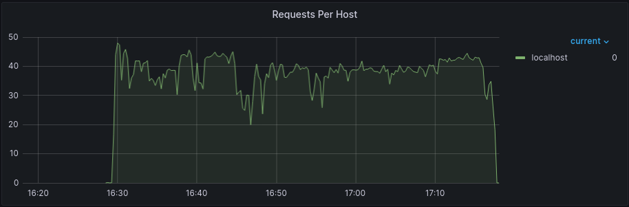
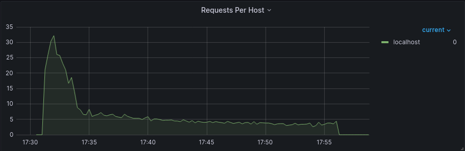

# 基准测试


## 使用 SpringBoot 应用测试

### 业务场景设计

在电商场景中，使用用户和商家创建、查询订单的性能作为基准测试指标对不同版本的数据库性能进行对比。需求如下：

- 新增订单
- 根据订单 ID 查询
- 用户查询订单
  - 用户查询指定日期范围+所有状态的订单，查询条件**用户ID+订单删除状态（固定值未删除）+日期范围+分页**，新的订单排在最前。
  - 用户查询指定日期范围+指定状态的订单，查询条件**用户ID+订单状态+订单删除状态（固定值未删除）+日期范围+分页**，新的订单排在最前。
- 商家查询订单
  - 商家查询指定日期范围+所有状态的订单，查询条件**商家ID+订单删除状态+日期范围+分页** ，新的订单排在最前。
  - 商家查询指定日期范围+指定状态的订单，查询条件**商家ID+订单状态+订单删除状态+日期范围+分页** ，新的订单排在最前。


### 不同版本的 MariaDB、MySQL 测试对比

#### 测试说明

本测试使用本站 [示例](https://gitee.com/dexterleslie/demonstration/tree/main/demo-mysql-n-mariadb/demo-order-management-app) 测试


#### 准备测试环境

VMware ESXi, 7.0.3, 20328353，Intel(R) Xeon(R) Platinum 8269CY CPU @ 2.50GHz

一个数据库实例：8C8G、CentOS8

一个 OpenResty 反向代理实例：8C8G、CentOS8

四个 SpringBoot 应用实例：8C8G、CentOS8

一个 wrk 压力机：10C10G、CentOS8

修改 application.properties 中的配置指向数据库服务

```properties
spring.datasource.url=jdbc:mariadb://192.168.1.190:3306/demo?useSSL=false&allowPublicKeyRetrieval=true
```

编译并推送镜像

```bash
./build.sh && ./push.sh
```

准备数据库服务

- 复制示例中的 deployer 目录到实例中

  ```bash
  scp -r deployer/* root@192.168.1.xxx:~/deployer-mysql-benchmark
  ```

- 启动数据库服务

  ```bash
  cd ~/deployer-mysql-benchmark/common && docker compose down -v && docker compose pull && docker compose up -d
  ```

准备 SpringBoot 应用服务

- 复制示例中的 deployer 目录到实例中

  ```bash
  scp -r deployer/* root@192.168.1.xxx:~/deployer-mysql-benchmark
  ```

- 启动 SpringBoot 服务

  ```bash
  cd ~/deployer-mysql-benchmark/service && docker compose pull && docker compose up -d
  ```

准备 OpenResty 反向代理服务

- 复制 [代码](https://gitee.com/dexterleslie/demonstration/tree/main/demo-benchmark/demo-openresty-reverseproxy-benchmark-master) 到 OpenResty 反向代理实例中

- 修改 nginx.conf 指向各个 SpringBoot 应用，如下：

  ```
  upstream backend {
      server 192.168.1.187:8080;
      server 192.168.1.188:8080;
      server 192.168.1.193:8080;
      server 192.168.1.194:8080;
  }
  ```

- 启动服务

  ```bash
  docker compose up -d
  ```

使用示例中的 rest-api.http 测试接口是否正常

准备 wrk 压力机

- 参考 <a href="/benchmark/基准测试工具.html#centos8" target="_blank">链接</a> 编译 wrk


#### 测试 MariaDB10.4

修改示例中 db/Dockerfile 基础镜像，如下：

```dockerfile
FROM mariadb:10.4
```

编译并推送镜像

```bash
./build.sh && ./push.sh
```

重启数据库服务

```bash
cd ~/deployer-mysql-benchmark/common && docker compose down -v && docker compose pull && docker compose up -d
```

重启各个 SpringBoot 应用

```bash
cd ~/deployer-mysql-benchmark/service && docker compose pull && docker compose restart
```

安装 Apache Bench 工具：参考 <a href="/benchmark/基准测试工具.html#centos8-1" target="_blank">链接</a>

初始化150万数据

```bash
ab -n 1500000 -c 64 -k http://192.168.1.185/api/v1/order/create
```

数据初始化完毕后，分别重启各个 SpringBoot 应用以加载所有订单 ID

```bash
cd ~/deployer-mysql-benchmark/service && docker compose pull && docker compose restart
```

测试根据订单 ID 查询

- wrk 测试

  ```bash
  $ wrk -t8 -c2048 -d15s --latency --timeout 30 http://192.168.1.185/api/v1/order/getById
  Running 15s test @ http://192.168.1.185/api/v1/order/getById
    8 threads and 2048 connections
    Thread Stats   Avg      Stdev     Max   +/- Stdev
      Latency   505.18ms  290.59ms   3.03s    82.99%
      Req/Sec   507.87     93.61   838.00     69.67%
    Latency Distribution
       50%  497.86ms
       75%  710.33ms
       90%  848.04ms
       99%    1.44s 
    60710 requests in 15.04s, 33.64MB read
  Requests/sec:   4036.13
  Transfer/sec:      2.24MB
  ```

- 数据库 CPU 利用率

  ```
      0[|||||||||||||||||||||||||||||||                                                                      28.5%]   4[|||||||||||||||||||||||||||||||||||                                                                   31.8%]
      1[||||||||||||||||||||||||||||||||||                                                                   30.7%]   5[|||||||||||||||||||||||||||||||                                                                       28.9%]
      2[|||||||||||||||||||||||||||||||||||                                                                  31.4%]   6[||||||||||||||||||||||||||||||||||                                                                    30.4%]
      3[||||||||||||||||||||||||||||||||||                                                                   31.5%]   7[|||||||||||||||||||||||||||||||                                                                       28.5%]
    Mem[|||||||||||||||||||||||||||||||||||||||||||||||||||||||||||||||||||||||||||||||||||||||||||||||1.81G/7.77G] Tasks: 86, 252 thr, 245 kthr; 7 running
    Swp[                                                                                                  0K/4.93G] Load average: 1.39 1.21 1.47 
                                                                                                                    Uptime: 23:17:09
  
    [Main] [I/O]
      PID USER       PRI  NI  VIRT   RES   SHR S  CPU%▽MEM%   TIME+  Command
    19633 systemd-co  20   0 10.0G 1083M 22572 S 213.8 13.6 22:14.20 mysqld --character-set-server=utf8mb4 --collation-server=utf8mb4_general_ci --skip-character-set-client-handshake --innodb-buffer-pool-size=5g
    19852 systemd-co  20   0 10.0G 1083M 22572 S   6.0 13.6  0:29.52 mysqld --character-set-server=utf8mb4 --collation-server=utf8mb4_general_ci --skip-character-set-client-handshake --innodb-buffer-pool-size=5g
    19864 systemd-co  20   0 10.0G 1083M 22572 S   6.0 13.6  0:29.62 mysqld --character-set-server=utf8mb4 --collation-server=utf8mb4_general_ci --skip-character-set-client-handshake --innodb-buffer-pool-size=5g
    19865 systemd-co  20   0 10.0G 1083M 22572 S   6.0 13.6  0:29.22 mysqld --character-set-server=utf8mb4 --collation-server=utf8mb4_general_ci --skip-character-set-client-handshake --innodb-buffer-pool-size=5g
    19868 systemd-co  20   0 10.0G 1083M 22572 S   6.0 13.6  0:29.25 mysqld --character-set-server=utf8mb4 --collation-server=utf8mb4_general_ci --skip-character-set-client-handshake --innodb-buffer-pool-size=5g
    19872 systemd-co  20   0 10.0G 1083M 22572 R   6.0 13.6  0:29.29 mysqld --character-set-server=utf8mb4 --collation-server=utf8mb4_general_ci --skip-character-set-client-handshake --innodb-buffer-pool-size=5g
    19877 systemd-co  20   0 10.0G 1083M 22572 S   6.0 13.6  0:29.37 mysqld --character-set-server=utf8mb4 --collation-server=utf8mb4_general_ci --skip-character-set-client-handshake --innodb-buffer-pool-size=5g
    19878 systemd-co  20   0 10.0G 1083M 22572 S   6.0 13.6  0:29.61 mysqld --character-set-server=utf8mb4 --collation-server=utf8mb4_general_ci --skip-character-set-client-handshake --innodb-buffer-pool-size=5g
    19886 systemd-co  20   0 10.0G 1083M 22572 S   6.0 13.6  0:29.33 mysqld --character-set-server=utf8mb4 --collation-server=utf8mb4_general_ci --skip-character-set-client-handshake --innodb-buffer-pool-size=5g
    19850 systemd-co  20   0 10.0G 1083M 22572 S   5.3 13.6  0:33.61 mysqld --character-set-server=utf8mb4 --collation-server=utf8mb4_general_ci --skip-character-set-client-handshake --innodb-buffer-pool-size=5g
    19851 systemd-co  20   0 10.0G 1083M 22572 S   5.3 13.6  0:29.46 mysqld --character-set-server=utf8mb4 --collation-server=utf8mb4_general_ci --skip-character-set-client-handshake --innodb-buffer-pool-size=5g
    19853 systemd-co  20   0 10.0G 1083M 22572 S   5.3 13.6  0:29.34 mysqld --character-set-server=utf8mb4 --collation-server=utf8mb4_general_ci --skip-character-set-client-handshake --innodb-buffer-pool-size=5g
    19854 systemd-co  20   0 10.0G 1083M 22572 S   5.3 13.6  0:29.65 mysqld --character-set-server=utf8mb4 --collation-server=utf8mb4_general_ci --skip-character-set-client-handshake --innodb-buffer-pool-size=5g
    19856 systemd-co  20   0 10.0G 1083M 22572 S   5.3 13.6  0:29.33 mysqld --character-set-server=utf8mb4 --collation-server=utf8mb4_general_ci --skip-character-set-client-handshake --innodb-buffer-pool-size=5g
    19857 systemd-co  20   0 10.0G 1083M 22572 R   5.3 13.6  0:34.65 mysqld --character-set-server=utf8mb4 --collation-server=utf8mb4_general_ci --skip-character-set-client-handshake --innodb-buffer-pool-size=5g
    19860 systemd-co  20   0 10.0G 1083M 22572 S   5.3 13.6  0:33.74 mysqld --character-set-server=utf8mb4 --collation-server=utf8mb4_general_ci --skip-character-set-client-handshake --innodb-buffer-pool-size=5g
    19862 systemd-co  20   0 10.0G 1083M 22572 S   5.3 13.6  0:29.46 mysqld --character-set-server=utf8mb4 --collation-server=utf8mb4_general_ci --skip-character-set-client-handshake --innodb-buffer-pool-size=5g
    19866 systemd-co  20   0 10.0G 1083M 22572 S   5.3 13.6  0:29.60 mysqld --character-set-server=utf8mb4 --collation-server=utf8mb4_general_ci --skip-character-set-client-handshake --innodb-buffer-pool-size=5g
  ```

  

测试用户查询指定日期范围+所有状态的订单，查询条件**用户ID+订单删除状态（固定值未删除）+日期范围+分页**，新的订单排在最前。

- wrk 测试

  ```bash
  $ wrk -t8 -c2048 -d15s --latency --timeout 30 http://192.168.1.185/api/v1/order/listByUserIdAndWithoutStatus
  Running 15s test @ http://192.168.1.185/api/v1/order/listByUserIdAndWithoutStatus
    8 threads and 2048 connections
    Thread Stats   Avg      Stdev     Max   +/- Stdev
      Latency   465.28ms  277.29ms   2.62s    78.82%
      Req/Sec   551.21    159.52     1.60k    69.97%
    Latency Distribution
       50%  319.48ms
       75%  602.44ms
       90%  877.74ms
       99%    1.25s 
    65859 requests in 15.05s, 32.48MB read
  Requests/sec:   4375.34
  Transfer/sec:      2.16MB
  ```

- 数据库 CPU 利用率

  ```
      0[|||||||||||||||||||||||||||||||||||||||                                                              35.5%]   4[||||||||||||||||||||||||||||||||||||                                                                  33.1%]
      1[|||||||||||||||||||||||||||||||||||||                                                                33.8%]   5[|||||||||||||||||||||||||||||||||||||||                                                               35.1%]
      2[||||||||||||||||||||||||||||||||||||||                                                               35.1%]   6[||||||||||||||||||||||||||||||||||                                                                    30.6%]
      3[|||||||||||||||||||||||||||||||||                                                                    30.8%]   7[|||||||||||||||||||||||||||||||||||                                                                   31.3%]
    Mem[|||||||||||||||||||||||||||||||||||||||||||||||||||||||||||||||||||||||||||||||||||||||||||||||1.79G/7.77G] Tasks: 86, 252 thr, 240 kthr; 7 running
    Swp[                                                                                                  0K/4.93G] Load average: 1.65 1.00 1.21 
                                                                                                                    Uptime: 23:23:45
  
    [Main] [I/O]
      PID USER       PRI  NI  VIRT   RES   SHR S  CPU%▽MEM%   TIME+  Command
    19633 systemd-co  20   0 10.0G 1083M 22572 S 244.4 13.6 24:22.26 mysqld --character-set-server=utf8mb4 --collation-server=utf8mb4_general_ci --skip-character-set-client-handshake --innodb-buffer-pool-size=5g
    19887 systemd-co  20   0 10.0G 1083M 22572 S   7.4 13.6  0:37.90 mysqld --character-set-server=utf8mb4 --collation-server=utf8mb4_general_ci --skip-character-set-client-handshake --innodb-buffer-pool-size=5g
    19855 systemd-co  20   0 10.0G 1083M 22572 S   6.7 13.6  0:32.71 mysqld --character-set-server=utf8mb4 --collation-server=utf8mb4_general_ci --skip-character-set-client-handshake --innodb-buffer-pool-size=5g
    19856 systemd-co  20   0 10.0G 1083M 22572 S   6.7 13.6  0:32.53 mysqld --character-set-server=utf8mb4 --collation-server=utf8mb4_general_ci --skip-character-set-client-handshake --innodb-buffer-pool-size=5g
    19857 systemd-co  20   0 10.0G 1083M 22572 S   6.7 13.6  0:37.83 mysqld --character-set-server=utf8mb4 --collation-server=utf8mb4_general_ci --skip-character-set-client-handshake --innodb-buffer-pool-size=5g
    19862 systemd-co  20   0 10.0G 1083M 22572 S   6.7 13.6  0:32.63 mysqld --character-set-server=utf8mb4 --collation-server=utf8mb4_general_ci --skip-character-set-client-handshake --innodb-buffer-pool-size=5g
    19864 systemd-co  20   0 10.0G 1083M 22572 S   6.7 13.6  0:32.81 mysqld --character-set-server=utf8mb4 --collation-server=utf8mb4_general_ci --skip-character-set-client-handshake --innodb-buffer-pool-size=5g
    19870 systemd-co  20   0 10.0G 1083M 22572 S   6.7 13.6  0:42.43 mysqld --character-set-server=utf8mb4 --collation-server=utf8mb4_general_ci --skip-character-set-client-handshake --innodb-buffer-pool-size=5g
    19879 systemd-co  20   0 10.0G 1083M 22572 S   6.7 13.6  0:32.66 mysqld --character-set-server=utf8mb4 --collation-server=utf8mb4_general_ci --skip-character-set-client-handshake --innodb-buffer-pool-size=5g
    19886 systemd-co  20   0 10.0G 1083M 22572 S   6.7 13.6  0:32.52 mysqld --character-set-server=utf8mb4 --collation-server=utf8mb4_general_ci --skip-character-set-client-handshake --innodb-buffer-pool-size=5g
    19888 systemd-co  20   0 10.0G 1083M 22572 S   6.7 13.6  0:32.51 mysqld --character-set-server=utf8mb4 --collation-server=utf8mb4_general_ci --skip-character-set-client-handshake --innodb-buffer-pool-size=5g
    19889 systemd-co  20   0 10.0G 1083M 22572 S   6.7 13.6  0:32.64 mysqld --character-set-server=utf8mb4 --collation-server=utf8mb4_general_ci --skip-character-set-client-handshake --innodb-buffer-pool-size=5g
    19850 systemd-co  20   0 10.0G 1083M 22572 S   6.0 13.6  0:36.77 mysqld --character-set-server=utf8mb4 --collation-server=utf8mb4_general_ci --skip-character-set-client-handshake --innodb-buffer-pool-size=5g
    19851 systemd-co  20   0 10.0G 1083M 22572 S   6.0 13.6  0:32.67 mysqld --character-set-server=utf8mb4 --collation-server=utf8mb4_general_ci --skip-character-set-client-handshake --innodb-buffer-pool-size=5g
    19852 systemd-co  20   0 10.0G 1083M 22572 S   6.0 13.6  0:32.74 mysqld --character-set-server=utf8mb4 --collation-server=utf8mb4_general_ci --skip-character-set-client-handshake --innodb-buffer-pool-size=5g
    19853 systemd-co  20   0 10.0G 1083M 22572 S   6.0 13.6  0:32.50 mysqld --character-set-server=utf8mb4 --collation-server=utf8mb4_general_ci --skip-character-set-client-handshake --innodb-buffer-pool-size=5g
    19854 systemd-co  20   0 10.0G 1083M 22572 S   6.0 13.6  0:32.83 mysqld --character-set-server=utf8mb4 --collation-server=utf8mb4_general_ci --skip-character-set-client-handshake --innodb-buffer-pool-size=5g
    19858 systemd-co  20   0 10.0G 1083M 22572 S   6.0 13.6  0:32.80 mysqld --character-set-server=utf8mb4 --collation-server=utf8mb4_general_ci --skip-character-set-client-handshake --innodb-buffer-pool-size=5g
  ```


测试用户查询指定日期范围+指定状态的订单，查询条件**用户ID+订单状态+订单删除状态（固定值未删除）+日期范围+分页**，新的订单排在最前。

- wrk 测试

  ```bash
  $ wrk -t8 -c2048 -d15s --latency --timeout 30 http://192.168.1.185/api/v1/order/listByUserIdAndStatus
  Running 15s test @ http://192.168.1.185/api/v1/order/listByUserIdAndStatus
    8 threads and 2048 connections
    Thread Stats   Avg      Stdev     Max   +/- Stdev
      Latency   359.51ms  202.01ms   1.85s    70.56%
      Req/Sec   722.26    196.23     1.60k    69.50%
    Latency Distribution
       50%  312.09ms
       75%  342.03ms
       90%  616.55ms
       99%  954.06ms
    86299 requests in 15.06s, 24.08MB read
  Requests/sec:   5730.63
  Transfer/sec:      1.60MB
  ```

- 数据库 CPU 利用率

  ```
      0[|||||||||||||||||||||||||||||||||||||||                                                              35.7%]   4[||||||||||||||||||||||||||||||||||||||                                                                34.2%]
      1[|||||||||||||||||||||||||||||||||||||                                                                34.0%]   5[|||||||||||||||||||||||||||||||||||||                                                                 34.0%]
      2[|||||||||||||||||||||||||||||||||||||||                                                              35.5%]   6[|||||||||||||||||||||||||||||||||||||                                                                 34.0%]
      3[||||||||||||||||||||||||||||||||||||||                                                               35.3%]   7[||||||||||||||||||||||||||||||||||||||                                                                34.9%]
    Mem[|||||||||||||||||||||||||||||||||||||||||||||||||||||||||||||||||||||||||||||||||||||||||||||||1.79G/7.77G] Tasks: 86, 252 thr, 243 kthr; 6 running
    Swp[                                                                                                  0K/4.93G] Load average: 1.83 1.07 1.12 
                                                                                                                    Uptime: 23:29:55
  
    [Main] [I/O]
      PID USER       PRI  NI  VIRT   RES   SHR S  CPU%▽MEM%   TIME+  Command
    19633 systemd-co  20   0 10.0G 1083M 22572 S 252.6 13.6 28:18.77 mysqld --character-set-server=utf8mb4 --collation-server=utf8mb4_general_ci --skip-character-set-client-handshake --innodb-buffer-pool-size=5g
    19853 systemd-co  20   0 10.0G 1083M 22572 S   7.3 13.6  0:38.45 mysqld --character-set-server=utf8mb4 --collation-server=utf8mb4_general_ci --skip-character-set-client-handshake --innodb-buffer-pool-size=5g
    19881 systemd-co  20   0 10.0G 1083M 22572 S   7.3 13.6  0:44.06 mysqld --character-set-server=utf8mb4 --collation-server=utf8mb4_general_ci --skip-character-set-client-handshake --innodb-buffer-pool-size=5g
    19850 systemd-co  20   0 10.0G 1083M 22572 S   6.6 13.6  0:42.70 mysqld --character-set-server=utf8mb4 --collation-server=utf8mb4_general_ci --skip-character-set-client-handshake --innodb-buffer-pool-size=5g
    19852 systemd-co  20   0 10.0G 1083M 22572 S   6.6 13.6  0:38.69 mysqld --character-set-server=utf8mb4 --collation-server=utf8mb4_general_ci --skip-character-set-client-handshake --innodb-buffer-pool-size=5g
    19854 systemd-co  20   0 10.0G 1083M 22572 S   6.6 13.6  0:38.74 mysqld --character-set-server=utf8mb4 --collation-server=utf8mb4_general_ci --skip-character-set-client-handshake --innodb-buffer-pool-size=5g
    19855 systemd-co  20   0 10.0G 1083M 22572 S   6.6 13.6  0:38.65 mysqld --character-set-server=utf8mb4 --collation-server=utf8mb4_general_ci --skip-character-set-client-handshake --innodb-buffer-pool-size=5g
    19857 systemd-co  20   0 10.0G 1083M 22572 S   6.6 13.6  0:43.77 mysqld --character-set-server=utf8mb4 --collation-server=utf8mb4_general_ci --skip-character-set-client-handshake --innodb-buffer-pool-size=5g
    19860 systemd-co  20   0 10.0G 1083M 22572 S   6.6 13.6  0:42.81 mysqld --character-set-server=utf8mb4 --collation-server=utf8mb4_general_ci --skip-character-set-client-handshake --innodb-buffer-pool-size=5g
    19864 systemd-co  20   0 10.0G 1083M 22572 S   6.6 13.6  0:38.72 mysqld --character-set-server=utf8mb4 --collation-server=utf8mb4_general_ci --skip-character-set-client-handshake --innodb-buffer-pool-size=5g
    19865 systemd-co  20   0 10.0G 1083M 22572 S   6.6 13.6  0:38.33 mysqld --character-set-server=utf8mb4 --collation-server=utf8mb4_general_ci --skip-character-set-client-handshake --innodb-buffer-pool-size=5g
    19868 systemd-co  20   0 10.0G 1083M 22572 S   6.6 13.6  0:38.30 mysqld --character-set-server=utf8mb4 --collation-server=utf8mb4_general_ci --skip-character-set-client-handshake --innodb-buffer-pool-size=5g
    19872 systemd-co  20   0 10.0G 1083M 22572 S   6.6 13.6  0:38.37 mysqld --character-set-server=utf8mb4 --collation-server=utf8mb4_general_ci --skip-character-set-client-handshake --innodb-buffer-pool-size=5g
    19874 systemd-co  20   0 10.0G 1083M 22572 R   6.6 13.6  0:38.51 mysqld --character-set-server=utf8mb4 --collation-server=utf8mb4_general_ci --skip-character-set-client-handshake --innodb-buffer-pool-size=5g
    19877 systemd-co  20   0 10.0G 1083M 22572 S   6.6 13.6  0:38.45 mysqld --character-set-server=utf8mb4 --collation-server=utf8mb4_general_ci --skip-character-set-client-handshake --innodb-buffer-pool-size=5g
    19879 systemd-co  20   0 10.0G 1083M 22572 S   6.6 13.6  0:38.53 mysqld --character-set-server=utf8mb4 --collation-server=utf8mb4_general_ci --skip-character-set-client-handshake --innodb-buffer-pool-size=5g
    19886 systemd-co  20   0 10.0G 1083M 22572 S   6.6 13.6  0:38.40 mysqld --character-set-server=utf8mb4 --collation-server=utf8mb4_general_ci --skip-character-set-client-handshake --innodb-buffer-pool-size=5g
    19888 systemd-co  20   0 10.0G 1083M 22572 S   6.6 13.6  0:38.41 mysqld --character-set-server=utf8mb4 --collation-server=utf8mb4_general_ci --skip-character-set-client-handshake --innodb-buffer-pool-size=5g
  ```


测试商家查询指定日期范围+所有状态的订单，查询条件**商家ID+订单删除状态+日期范围+分页** ，新的订单排在最前。

- wrk 测试

  ```bash
  $ wrk -t8 -c2048 -d15s --latency --timeout 30 http://192.168.1.185/api/v1/order/listByMerchantIdAndWithoutStatus
  Running 15s test @ http://192.168.1.185/api/v1/order/listByMerchantIdAndWithoutStatus
    8 threads and 2048 connections
    Thread Stats   Avg      Stdev     Max   +/- Stdev
      Latency     1.95s   750.33ms   6.31s    62.79%
      Req/Sec   119.77     63.47   535.00     74.36%
    Latency Distribution
       50%    2.01s 
       75%    2.13s 
       90%    3.02s 
       99%    4.10s 
    14070 requests in 15.06s, 76.51MB read
  Requests/sec:    934.16
  Transfer/sec:      5.08MB
  ```

- 数据库 CPU 利用率

  ```
      0[|||||||||||||||||||||||||||||||||||||||||||||||||||||||||||||||                                      58.8%]   4[||||||||||||||||||||||||||||||||||||||||||||||||||||||||||||||||||                                    60.3%]
      1[|||||||||||||||||||||||||||||||||||||||||||||||||||||||||||||||||||                                  60.9%]   5[|||||||||||||||||||||||||||||||||||||||||||||||||||||||||||||||||||||                                 62.7%]
      2[||||||||||||||||||||||||||||||||||||||||||||||||||||||||||||||||||||                                 62.3%]   6[||||||||||||||||||||||||||||||||||||||||||||||||||||||||||||||||||                                    59.7%]
      3[|||||||||||||||||||||||||||||||||||||||||||||||||||||||||||||||||||                                  62.4%]   7[||||||||||||||||||||||||||||||||||||||||||||||||||||||||||||||||||||                                  62.3%]
    Mem[|||||||||||||||||||||||||||||||||||||||||||||||||||||||||||||||||||||||||||||||||||||||||||||||1.81G/7.77G] Tasks: 86, 252 thr, 244 kthr; 8 running
    Swp[                                                                                                  0K/4.93G] Load average: 2.24 1.30 1.11 
                                                                                                                    Uptime: 23:37:01
  
    [Main] [I/O]
      PID USER       PRI  NI  VIRT   RES   SHR S  CPU%▽MEM%   TIME+  Command
    19633 systemd-co  20   0 10.0G 1083M 22572 S 484.9 13.6 31:52.36 mysqld --character-set-server=utf8mb4 --collation-server=utf8mb4_general_ci --skip-character-set-client-handshake --innodb-buffer-pool-size=5g
    19858 systemd-co  20   0 10.0G 1083M 22572 S  15.3 13.6  0:44.82 mysqld --character-set-server=utf8mb4 --collation-server=utf8mb4_general_ci --skip-character-set-client-handshake --innodb-buffer-pool-size=5g
    19861 systemd-co  23   3 10.0G 1083M 22572 S  15.3 13.6  0:44.60 mysqld --character-set-server=utf8mb4 --collation-server=utf8mb4_general_ci --skip-character-set-client-handshake --innodb-buffer-pool-size=5g
    19852 systemd-co  21   1 10.0G 1083M 22572 S  14.0 13.6  0:44.47 mysqld --character-set-server=utf8mb4 --collation-server=utf8mb4_general_ci --skip-character-set-client-handshake --innodb-buffer-pool-size=5g
    19881 systemd-co  21   1 10.0G 1083M 22572 S  14.0 13.6  0:49.84 mysqld --character-set-server=utf8mb4 --collation-server=utf8mb4_general_ci --skip-character-set-client-handshake --innodb-buffer-pool-size=5g
    19884 systemd-co  23   3 10.0G 1083M 22572 S  14.0 13.6  0:43.79 mysqld --character-set-server=utf8mb4 --collation-server=utf8mb4_general_ci --skip-character-set-client-handshake --innodb-buffer-pool-size=5g
    19862 systemd-co  20   0 10.0G 1083M 22572 S  13.3 13.6  0:44.64 mysqld --character-set-server=utf8mb4 --collation-server=utf8mb4_general_ci --skip-character-set-client-handshake --innodb-buffer-pool-size=5g
    19865 systemd-co  23   3 10.0G 1083M 22572 S  13.3 13.6  0:43.47 mysqld --character-set-server=utf8mb4 --collation-server=utf8mb4_general_ci --skip-character-set-client-handshake --innodb-buffer-pool-size=5g
    19868 systemd-co  23   3 10.0G 1083M 22572 S  13.3 13.6  0:43.39 mysqld --character-set-server=utf8mb4 --collation-server=utf8mb4_general_ci --skip-character-set-client-handshake --innodb-buffer-pool-size=5g
    19887 systemd-co  23   3 10.0G 1083M 22572 S  13.3 13.6  0:49.03 mysqld --character-set-server=utf8mb4 --collation-server=utf8mb4_general_ci --skip-character-set-client-handshake --innodb-buffer-pool-size=5g
    19850 systemd-co  21   1 10.0G 1083M 22572 S  12.7 13.6  0:48.56 mysqld --character-set-server=utf8mb4 --collation-server=utf8mb4_general_ci --skip-character-set-client-handshake --innodb-buffer-pool-size=5g
    19851 systemd-co  20   0 10.0G 1083M 22572 R  12.7 13.6  0:44.65 mysqld --character-set-server=utf8mb4 --collation-server=utf8mb4_general_ci --skip-character-set-client-handshake --innodb-buffer-pool-size=5g
    19856 systemd-co  20   0 10.0G 1083M 22572 R  12.7 13.6  0:44.49 mysqld --character-set-server=utf8mb4 --collation-server=utf8mb4_general_ci --skip-character-set-client-handshake --innodb-buffer-pool-size=5g
    19863 systemd-co  23   3 10.0G 1083M 22572 S  12.7 13.6  0:43.89 mysqld --character-set-server=utf8mb4 --collation-server=utf8mb4_general_ci --skip-character-set-client-handshake --innodb-buffer-pool-size=5g
    19870 systemd-co  23   3 10.0G 1083M 22572 S  12.7 13.6  0:53.55 mysqld --character-set-server=utf8mb4 --collation-server=utf8mb4_general_ci --skip-character-set-client-handshake --innodb-buffer-pool-size=5g
    19871 systemd-co  23   3 10.0G 1083M 22572 S  12.7 13.6  0:43.40 mysqld --character-set-server=utf8mb4 --collation-server=utf8mb4_general_ci --skip-character-set-client-handshake --innodb-buffer-pool-size=5g
    19875 systemd-co  23   3 10.0G 1083M 22572 R  12.7 13.6  0:43.77 mysqld --character-set-server=utf8mb4 --collation-server=utf8mb4_general_ci --skip-character-set-client-handshake --innodb-buffer-pool-size=5g
    19878 systemd-co  23   3 10.0G 1083M 22572 R  12.7 13.6  0:43.98 mysqld --character-set-server=utf8mb4 --collation-server=utf8mb4_general_ci --skip-character-set-client-handshake --innodb-buffer-pool-size=5g
  ```

  

测试商家查询指定日期范围+指定状态的订单，查询条件**商家ID+订单状态+订单删除状态+日期范围+分页** ，新的订单排在最前。

- wrk 测试

  ```bash
  $ wrk -t8 -c2048 -d15s --latency --timeout 30 http://192.168.1.185/api/v1/order/listByMerchantIdAndStatus
  Running 15s test @ http://192.168.1.185/api/v1/order/listByMerchantIdAndStatus
    8 threads and 2048 connections
    Thread Stats   Avg      Stdev     Max   +/- Stdev
      Latency     1.92s   973.19ms   7.36s    73.87%
      Req/Sec   124.65     67.21   450.00     70.74%
    Latency Distribution
       50%    2.01s 
       75%    2.17s 
       90%    3.16s 
       99%    4.99s 
    14506 requests in 15.05s, 18.93MB read
  Requests/sec:    963.82
  Transfer/sec:      1.26MB
  ```

- 数据库 CPU 利用率

  ```
      0[||||||||||||||||||||||||||||||||||||||||||||||||||||||||||||||||||                                   61.5%]   4[|||||||||||||||||||||||||||||||||||||||||||||||||||||||||||||||||||                                   61.3%]
      1[|||||||||||||||||||||||||||||||||||||||||||||||||||||||||||||||||                                    59.6%]   5[|||||||||||||||||||||||||||||||||||||||||||||||||||||||||||||||||||                                   61.1%]
      2[||||||||||||||||||||||||||||||||||||||||||||||||||||||||||||||||||                                   60.8%]   6[|||||||||||||||||||||||||||||||||||||||||||||||||||||||||||||||||||                                   60.4%]
      3[|||||||||||||||||||||||||||||||||||||||||||||||||||||||||||||||||||||                                63.8%]   7[|||||||||||||||||||||||||||||||||||||||||||||||||||||||||||||||||||                                   61.3%]
    Mem[|||||||||||||||||||||||||||||||||||||||||||||||||||||||||||||||||||||||||||||||||||||||||||||||1.80G/7.77G] Tasks: 86, 253 thr, 242 kthr; 8 running
    Swp[                                                                                                  0K/4.93G] Load average: 5.88 2.95 1.75 
                                                                                                                    Uptime: 23:40:10
  
    [Main] [I/O]
      PID USER       PRI  NI  VIRT   RES   SHR S  CPU%▽MEM%   TIME+  Command
    19633 systemd-co  20   0 10.0G 1096M 22612 S 486.5 13.8 37:33.56 mysqld --character-set-server=utf8mb4 --collation-server=utf8mb4_general_ci --skip-character-set-client-handshake --innodb-buffer-pool-size=5g
    19856 systemd-co  20   0 10.0G 1096M 22612 S  16.6 13.8  0:54.39 mysqld --character-set-server=utf8mb4 --collation-server=utf8mb4_general_ci --skip-character-set-client-handshake --innodb-buffer-pool-size=5g
    19858 systemd-co  20   0 10.0G 1096M 22612 S  14.0 13.8  0:54.72 mysqld --character-set-server=utf8mb4 --collation-server=utf8mb4_general_ci --skip-character-set-client-handshake --innodb-buffer-pool-size=5g
    19862 systemd-co  20   0 10.0G 1096M 22612 R  14.0 13.8  0:54.67 mysqld --character-set-server=utf8mb4 --collation-server=utf8mb4_general_ci --skip-character-set-client-handshake --innodb-buffer-pool-size=5g
    19869 systemd-co  23   3 10.0G 1096M 22612 S  14.0 13.8  0:51.96 mysqld --character-set-server=utf8mb4 --collation-server=utf8mb4_general_ci --skip-character-set-client-handshake --innodb-buffer-pool-size=5g
    19870 systemd-co  23   3 10.0G 1096M 22612 S  14.0 13.8  1:01.90 mysqld --character-set-server=utf8mb4 --collation-server=utf8mb4_general_ci --skip-character-set-client-handshake --innodb-buffer-pool-size=5g
    19872 systemd-co  23   3 10.0G 1096M 22612 S  14.0 13.8  0:51.90 mysqld --character-set-server=utf8mb4 --collation-server=utf8mb4_general_ci --skip-character-set-client-handshake --innodb-buffer-pool-size=5g
    19851 systemd-co  20   0 10.0G 1096M 22612 R  13.3 13.8  0:54.52 mysqld --character-set-server=utf8mb4 --collation-server=utf8mb4_general_ci --skip-character-set-client-handshake --innodb-buffer-pool-size=5g
    19864 systemd-co  23   3 10.0G 1096M 22612 S  13.3 13.8  0:52.10 mysqld --character-set-server=utf8mb4 --collation-server=utf8mb4_general_ci --skip-character-set-client-handshake --innodb-buffer-pool-size=5g
    19867 systemd-co  23   3 10.0G 1096M 22612 S  13.3 13.8  0:51.91 mysqld --character-set-server=utf8mb4 --collation-server=utf8mb4_general_ci --skip-character-set-client-handshake --innodb-buffer-pool-size=5g
    19874 systemd-co  23   3 10.0G 1096M 22612 R  13.3 13.8  0:52.02 mysqld --character-set-server=utf8mb4 --collation-server=utf8mb4_general_ci --skip-character-set-client-handshake --innodb-buffer-pool-size=5g
    19860 systemd-co  23   3 10.0G 1096M 22612 S  12.6 13.8  0:56.24 mysqld --character-set-server=utf8mb4 --collation-server=utf8mb4_general_ci --skip-character-set-client-handshake --innodb-buffer-pool-size=5g
    19863 systemd-co  23   3 10.0G 1096M 22612 S  12.6 13.8  0:52.27 mysqld --character-set-server=utf8mb4 --collation-server=utf8mb4_general_ci --skip-character-set-client-handshake --innodb-buffer-pool-size=5g
    19865 systemd-co  23   3 10.0G 1096M 22612 R  12.6 13.8  0:51.97 mysqld --character-set-server=utf8mb4 --collation-server=utf8mb4_general_ci --skip-character-set-client-handshake --innodb-buffer-pool-size=5g
    19881 systemd-co  21   1 10.0G 1096M 22612 S  12.6 13.8  0:59.11 mysqld --character-set-server=utf8mb4 --collation-server=utf8mb4_general_ci --skip-character-set-client-handshake --innodb-buffer-pool-size=5g
    19886 systemd-co  23   3 10.0G 1096M 22612 S  12.6 13.8  0:51.78 mysqld --character-set-server=utf8mb4 --collation-server=utf8mb4_general_ci --skip-character-set-client-handshake --innodb-buffer-pool-size=5g
    19887 systemd-co  23   3 10.0G 1096M 22612 S  12.6 13.8  0:57.42 mysqld --character-set-server=utf8mb4 --collation-server=utf8mb4_general_ci --skip-character-set-client-handshake --innodb-buffer-pool-size=5g
    19888 systemd-co  23   3 10.0G 1096M 22612 S  12.6 13.8  0:51.99 mysqld --character-set-server=utf8mb4 --collation-server=utf8mb4_general_ci --skip-character-set-client-handshake --innodb-buffer-pool-size=5g
  ```


测试新增订单

- wrk 测试

  ```bash
  $ wrk -t8 -c2048 -d15s --latency --timeout 30 http://192.168.1.185/api/v1/order/create
  Running 15s test @ http://192.168.1.185/api/v1/order/create
    8 threads and 2048 connections
    Thread Stats   Avg      Stdev     Max   +/- Stdev
      Latency   231.39ms  188.33ms   2.42s    76.25%
      Req/Sec     1.19k   137.01     1.60k    73.50%
    Latency Distribution
       50%  202.60ms
       75%  313.62ms
       90%  481.42ms
       99%  862.60ms
    142158 requests in 15.06s, 34.45MB read
  Requests/sec:   9440.50
  Transfer/sec:      2.29MB
  ```

- 数据库 CPU 利用率

  ```
      0[|||||||||||||||||||||||||||||||||||||||||||||||||||||||||||||||||||||||||||||||||||||||              80.9%]   4[|||||||||||||||||||||||||||||||||||||||||||||||||||||||||||||||||||||||||||||||||||||||||||||||       88.1%]
      1[|||||||||||||||||||||||||||||||||||||||||||||||||||||||||||||||||||||||||||||||||||||||||||          85.1%]   5[|||||||||||||||||||||||||||||||||||||||||||||||||||||||||||||||||||||||||||||||||||||||||||||         86.3%]
      2[||||||||||||||||||||||||||||||||||||||||||||||||||||||||||||||||||||||||||||||||||||||||             82.4%]   6[||||||||||||||||||||||||||||||||||||||||||||||||||||||||||||||||||||||||||||||||||||||||              81.1%]
      3[|||||||||||||||||||||||||||||||||||||||||||||||||||||||||||||||||||||||||||||||||||||||||            82.4%]   7[||||||||||||||||||||||||||||||||||||||||||||||||||||||||||||||||||||||||||||||||||||||||||||||        86.7%]
    Mem[|||||||||||||||||||||||||||||||||||||||||||||||||||||||||||||||||||||||||||||||||||||||||||||||1.87G/7.77G] Tasks: 86, 252 thr, 244 kthr; 8 running
    Swp[                                                                                                  0K/4.93G] Load average: 5.80 1.70 1.06 
                                                                                                                    Uptime: 1 day, 00:35:24
  
    [Main] [I/O]
      PID USER       PRI  NI  VIRT   RES   SHR S  CPU%▽MEM%   TIME+  Command
    51582 systemd-co  20   0 10.0G 1136M 24004 S 595.5 14.3 20:05.14 mysqld --character-set-server=utf8mb4 --collation-server=utf8mb4_general_ci --skip-character-set-client-handshake --innodb-buffer-pool-size=5g
    51788 systemd-co  20   0 10.0G 1136M 24004 S  27.5 14.3  1:06.85 mysqld --character-set-server=utf8mb4 --collation-server=utf8mb4_general_ci --skip-character-set-client-handshake --innodb-buffer-pool-size=5g
    52148 systemd-co  20   0 10.0G 1136M 24004 R  16.8 14.3  0:04.82 mysqld --character-set-server=utf8mb4 --collation-server=utf8mb4_general_ci --skip-character-set-client-handshake --innodb-buffer-pool-size=5g
    52168 systemd-co  20   0 10.0G 1136M 24004 S  16.8 14.3  0:04.52 mysqld --character-set-server=utf8mb4 --collation-server=utf8mb4_general_ci --skip-character-set-client-handshake --innodb-buffer-pool-size=5g
    52134 systemd-co  20   0 10.0G 1136M 24004 S  15.4 14.3  0:04.45 mysqld --character-set-server=utf8mb4 --collation-server=utf8mb4_general_ci --skip-character-set-client-handshake --innodb-buffer-pool-size=5g
    52159 systemd-co  20   0 10.0G 1136M 24004 R  15.4 14.3  0:04.89 mysqld --character-set-server=utf8mb4 --collation-server=utf8mb4_general_ci --skip-character-set-client-handshake --innodb-buffer-pool-size=5g
    52129 systemd-co  20   0 10.0G 1136M 24004 R  14.8 14.3  0:04.76 mysqld --character-set-server=utf8mb4 --collation-server=utf8mb4_general_ci --skip-character-set-client-handshake --innodb-buffer-pool-size=5g
    52143 systemd-co  20   0 10.0G 1136M 24004 S  14.8 14.3  0:04.79 mysqld --character-set-server=utf8mb4 --collation-server=utf8mb4_general_ci --skip-character-set-client-handshake --innodb-buffer-pool-size=5g
    52124 systemd-co  20   0 10.0G 1136M 24004 S  14.1 14.3  0:04.79 mysqld --character-set-server=utf8mb4 --collation-server=utf8mb4_general_ci --skip-character-set-client-handshake --innodb-buffer-pool-size=5g
    52128 systemd-co  20   0 10.0G 1136M 24004 S  14.1 14.3  0:04.65 mysqld --character-set-server=utf8mb4 --collation-server=utf8mb4_general_ci --skip-character-set-client-handshake --innodb-buffer-pool-size=5g
    52135 systemd-co  20   0 10.0G 1136M 24004 S  14.1 14.3  0:05.02 mysqld --character-set-server=utf8mb4 --collation-server=utf8mb4_general_ci --skip-character-set-client-handshake --innodb-buffer-pool-size=5g
    52140 systemd-co  20   0 10.0G 1136M 24004 R  14.1 14.3  0:04.78 mysqld --character-set-server=utf8mb4 --collation-server=utf8mb4_general_ci --skip-character-set-client-handshake --innodb-buffer-pool-size=5g
    52150 systemd-co  20   0 10.0G 1136M 24004 S  14.1 14.3  0:04.72 mysqld --character-set-server=utf8mb4 --collation-server=utf8mb4_general_ci --skip-character-set-client-handshake --innodb-buffer-pool-size=5g
    52152 systemd-co  20   0 10.0G 1136M 24004 R  14.1 14.3  0:04.49 mysqld --character-set-server=utf8mb4 --collation-server=utf8mb4_general_ci --skip-character-set-client-handshake --innodb-buffer-pool-size=5g
    52155 systemd-co  20   0 10.0G 1136M 24004 R  14.1 14.3  0:04.80 mysqld --character-set-server=utf8mb4 --collation-server=utf8mb4_general_ci --skip-character-set-client-handshake --innodb-buffer-pool-size=5g
    52125 systemd-co  20   0 10.0G 1136M 24004 R  13.4 14.3  0:04.75 mysqld --character-set-server=utf8mb4 --collation-server=utf8mb4_general_ci --skip-character-set-client-handshake --innodb-buffer-pool-size=5g
    52126 systemd-co  20   0 10.0G 1136M 24004 S  13.4 14.3  0:10.39 mysqld --character-set-server=utf8mb4 --collation-server=utf8mb4_general_ci --skip-character-set-client-handshake --innodb-buffer-pool-size=5g
    52127 systemd-co  20   0 10.0G 1136M 24004 S  13.4 14.3  0:04.77 mysqld --character-set-server=utf8mb4 --collation-server=utf8mb4_general_ci --skip-character-set-client-handshake --innodb-buffer-pool-size=5g
  ```

  


#### 测试 MariaDB11.4

修改示例中 db/Dockerfile 基础镜像，如下：

```dockerfile
FROM mariadb:11.4
```

编译并推送镜像

```bash
./build.sh && ./push.sh
```

重启数据库服务

```bash
cd ~/deployer-mysql-benchmark/common && docker compose down -v && docker compose pull && docker compose up -d
```

重启各个 SpringBoot 应用

```bash
cd ~/deployer-mysql-benchmark/service && docker compose pull && docker compose restart
```

安装 Apache Bench 工具：参考 <a href="/benchmark/基准测试工具.html#centos8-1" target="_blank">链接</a>

初始化150万数据

```bash
ab -n 1500000 -c 64 -k http://192.168.1.185/api/v1/order/create
```

数据初始化完毕后，分别重启各个 SpringBoot 应用以加载所有订单 ID

```bash
cd ~/deployer-mysql-benchmark/service && docker compose pull && docker compose restart
```

测试根据订单 ID 查询

- wrk 测试

  ```bash
  $ wrk -t8 -c2048 -d15s --latency --timeout 30 http://192.168.1.185/api/v1/order/getById
  Running 15s test @ http://192.168.1.185/api/v1/order/getById
    8 threads and 2048 connections
    Thread Stats   Avg      Stdev     Max   +/- Stdev
      Latency    78.59ms   76.06ms 904.54ms   68.03%
      Req/Sec     3.85k   532.37     7.88k    64.42%
    Latency Distribution
       50%   63.01ms
       75%  115.07ms
       90%  178.73ms
       99%  333.02ms
    459302 requests in 15.04s, 254.50MB read
  Requests/sec:  30534.41
  Transfer/sec:     16.92MB
  ```

- 数据库 CPU 利用率

  ```
      0[|||||||||||||||||||||||||||||||||||||||||||||||||||||||||||||||||||||||||||||||||||||||||            82.4%]   4[|||||||||||||||||||||||||||||||||||||||||||||||||||||||||||||||||||||||||||||||||||||||||             82.9%]
      1[||||||||||||||||||||||||||||||||||||||||||||||||||||||||||||||||||||||||||||||||||||||||||           83.2%]   5[||||||||||||||||||||||||||||||||||||||||||||||||||||||||||||||||||||||||||||||||||||||||              81.6%]
      2[|||||||||||||||||||||||||||||||||||||||||||||||||||||||||||||||||||||||||||||||||||||||              81.1%]   6[|||||||||||||||||||||||||||||||||||||||||||||||||||||||||||||||||||||||||||||||||||||||||||           84.0%]
      3[|||||||||||||||||||||||||||||||||||||||||||||||||||||||||||||||||||||||||||||||||||||||||            82.8%]   7[||||||||||||||||||||||||||||||||||||||||||||||||||||||||||||||||||||||||||||||||||||||||              80.9%]
    Mem[|||||||||||||||||||||||||||||||||||||||||||||||||||||||||||||||||||||||||||||||||||||||||||||| 1.61G/7.77G] Tasks: 86, 229 thr, 241 kthr; 8 running
    Swp[                                                                                                  0K/4.93G] Load average: 7.72 5.87 3.04 
                                                                                                                    Uptime: 1 day, 00:40:58
  
    [Main] [I/O]
      PID USER       PRI  NI  VIRT   RES   SHR S  CPU%▽MEM%   TIME+  Command
    52400 systemd-co  22   2 9780M  877M 28760 S 584.3 11.0 16:25.46 mariadbd --character-set-server=utf8mb4 --collation-server=utf8mb4_general_ci --skip-character-set-client-handshake --innodb-buffer-pool-size=5g
    52581 systemd-co  22   2 9780M  877M 28760 S  16.0 11.0  0:23.40 mariadbd --character-set-server=utf8mb4 --collation-server=utf8mb4_general_ci --skip-character-set-client-handshake --innodb-buffer-pool-size=5g
    52572 systemd-co  22   2 9780M  877M 28760 S  15.4 11.0  0:28.93 mariadbd --character-set-server=utf8mb4 --collation-server=utf8mb4_general_ci --skip-character-set-client-handshake --innodb-buffer-pool-size=5g
    52579 systemd-co  22   2 9780M  877M 28760 R  15.4 11.0  0:23.24 mariadbd --character-set-server=utf8mb4 --collation-server=utf8mb4_general_ci --skip-character-set-client-handshake --innodb-buffer-pool-size=5g
    52585 systemd-co  22   2 9780M  877M 28760 R  15.4 11.0  0:23.45 mariadbd --character-set-server=utf8mb4 --collation-server=utf8mb4_general_ci --skip-character-set-client-handshake --innodb-buffer-pool-size=5g
    52591 systemd-co  22   2 9780M  877M 28760 S  15.4 11.0  0:23.26 mariadbd --character-set-server=utf8mb4 --collation-server=utf8mb4_general_ci --skip-character-set-client-handshake --innodb-buffer-pool-size=5g
    52592 systemd-co  22   2 9780M  877M 28760 R  15.4 11.0  0:23.40 mariadbd --character-set-server=utf8mb4 --collation-server=utf8mb4_general_ci --skip-character-set-client-handshake --innodb-buffer-pool-size=5g
    52602 systemd-co  22   2 9780M  877M 28760 R  15.4 11.0  0:21.74 mariadbd --character-set-server=utf8mb4 --collation-server=utf8mb4_general_ci --skip-character-set-client-handshake --innodb-buffer-pool-size=5g
    52603 systemd-co  22   2 9780M  877M 28760 S  15.4 11.0  0:27.16 mariadbd --character-set-server=utf8mb4 --collation-server=utf8mb4_general_ci --skip-character-set-client-handshake --innodb-buffer-pool-size=5g
    52566 systemd-co  22   2 9780M  877M 28760 S  14.7 11.0  0:27.76 mariadbd --character-set-server=utf8mb4 --collation-server=utf8mb4_general_ci --skip-character-set-client-handshake --innodb-buffer-pool-size=5g
    52569 systemd-co  22   2 9780M  877M 28760 R  14.7 11.0  0:23.17 mariadbd --character-set-server=utf8mb4 --collation-server=utf8mb4_general_ci --skip-character-set-client-handshake --innodb-buffer-pool-size=5g
    52570 systemd-co  22   2 9780M  877M 28760 S  14.7 11.0  0:23.28 mariadbd --character-set-server=utf8mb4 --collation-server=utf8mb4_general_ci --skip-character-set-client-handshake --innodb-buffer-pool-size=5g
    52573 systemd-co  22   2 9780M  877M 28760 R  14.7 11.0  0:23.12 mariadbd --character-set-server=utf8mb4 --collation-server=utf8mb4_general_ci --skip-character-set-client-handshake --innodb-buffer-pool-size=5g
    52574 systemd-co  22   2 9780M  877M 28760 R  14.7 11.0  0:23.13 mariadbd --character-set-server=utf8mb4 --collation-server=utf8mb4_general_ci --skip-character-set-client-handshake --innodb-buffer-pool-size=5g
    52576 systemd-co  22   2 9780M  877M 28760 S  14.7 11.0  0:27.98 mariadbd --character-set-server=utf8mb4 --collation-server=utf8mb4_general_ci --skip-character-set-client-handshake --innodb-buffer-pool-size=5g
    52577 systemd-co  22   2 9780M  877M 28760 R  14.7 11.0  0:23.39 mariadbd --character-set-server=utf8mb4 --collation-server=utf8mb4_general_ci --skip-character-set-client-handshake --innodb-buffer-pool-size=5g
    52580 systemd-co  22   2 9780M  877M 28760 R  14.7 11.0  0:23.38 mariadbd --character-set-server=utf8mb4 --collation-server=utf8mb4_general_ci --skip-character-set-client-handshake --innodb-buffer-pool-size=5g
    52582 systemd-co  22   2 9780M  877M 28760 S  14.7 11.0  0:23.72 mariadbd --character-set-server=utf8mb4 --collation-server=utf8mb4_general_ci --skip-character-set-client-handshake --innodb-buffer-pool-size=5g
  ```

  

测试用户查询指定日期范围+所有状态的订单，查询条件**用户ID+订单删除状态（固定值未删除）+日期范围+分页**，新的订单排在最前。

- wrk 测试

  ```bash
  $ wrk -t8 -c2048 -d15s --latency --timeout 30 http://192.168.1.185/api/v1/order/listByUserIdAndWithoutStatus
  Running 15s test @ http://192.168.1.185/api/v1/order/listByUserIdAndWithoutStatus
    8 threads and 2048 connections
    Thread Stats   Avg      Stdev     Max   +/- Stdev
      Latency    79.87ms   77.42ms 989.54ms   67.68%
      Req/Sec     3.84k   390.55     4.80k    72.83%
    Latency Distribution
       50%   68.61ms
       75%  118.46ms
       90%  179.32ms
       99%  340.99ms
    458724 requests in 15.04s, 227.61MB read
  Requests/sec:  30509.88
  Transfer/sec:     15.14MB
  ```

- 数据库 CPU 利用率

  ```
      0[|||||||||||||||||||||||||||||||||||||||||||||||||||||||||||||||||||||||||||||||||||||||||||||||||||||96.7%]   4[||||||||||||||||||||||||||||||||||||||||||||||||||||||||||||||||||||||||||||||||||||||||||||||||||||||96.0%]
      1[|||||||||||||||||||||||||||||||||||||||||||||||||||||||||||||||||||||||||||||||||||||||||||||||||||||97.3%]   5[|||||||||||||||||||||||||||||||||||||||||||||||||||||||||||||||||||||||||||||||||||||||||||||||||||   92.1%]
      2[|||||||||||||||||||||||||||||||||||||||||||||||||||||||||||||||||||||||||||||||||||||||||||||||||||||95.4%]   6[||||||||||||||||||||||||||||||||||||||||||||||||||||||||||||||||||||||||||||||||||||||||||||||||||||||96.1%]
      3[|||||||||||||||||||||||||||||||||||||||||||||||||||||||||||||||||||||||||||||||||||||||||||||||||||||98.7%]   7[||||||||||||||||||||||||||||||||||||||||||||||||||||||||||||||||||||||||||||||||||||||||||||||||||||||96.7%]
    Mem[|||||||||||||||||||||||||||||||||||||||||||||||||||||||||||||||||||||||||||||||||||||||||||||| 1.59G/7.77G] Tasks: 86, 225 thr, 241 kthr; 8 running
    Swp[                                                                                                  0K/4.93G] Load average: 6.31 5.54 3.08 
                                                                                                                    Uptime: 1 day, 00:41:59
  
    [Main] [I/O]
      PID USER       PRI  NI  VIRT   RES   SHR S  CPU%▽MEM%   TIME+  Command
    52400 systemd-co  22   2 9748M  877M 28760 S 709.1 11.0 17:37.44 mariadbd --character-set-server=utf8mb4 --collation-server=utf8mb4_general_ci --skip-character-set-client-handshake --innodb-buffer-pool-size=5g
    52569 systemd-co  22   2 9748M  877M 28760 S  20.4 11.0  0:25.00 mariadbd --character-set-server=utf8mb4 --collation-server=utf8mb4_general_ci --skip-character-set-client-handshake --innodb-buffer-pool-size=5g
    52573 systemd-co  22   2 9748M  877M 28760 S  19.8 11.0  0:24.91 mariadbd --character-set-server=utf8mb4 --collation-server=utf8mb4_general_ci --skip-character-set-client-handshake --innodb-buffer-pool-size=5g
    52594 systemd-co  22   2 9748M  877M 28760 R  19.8 11.0  0:30.53 mariadbd --character-set-server=utf8mb4 --collation-server=utf8mb4_general_ci --skip-character-set-client-handshake --innodb-buffer-pool-size=5g
    52566 systemd-co  22   2 9748M  877M 28760 S  19.1 11.0  0:29.56 mariadbd --character-set-server=utf8mb4 --collation-server=utf8mb4_general_ci --skip-character-set-client-handshake --innodb-buffer-pool-size=5g
    52602 systemd-co  22   2 9748M  877M 28760 R  19.1 11.0  0:23.63 mariadbd --character-set-server=utf8mb4 --collation-server=utf8mb4_general_ci --skip-character-set-client-handshake --innodb-buffer-pool-size=5g
    52568 systemd-co  22   2 9748M  877M 28760 S  18.5 11.0  0:25.17 mariadbd --character-set-server=utf8mb4 --collation-server=utf8mb4_general_ci --skip-character-set-client-handshake --innodb-buffer-pool-size=5g
    52576 systemd-co  22   2 9748M  877M 28760 S  18.5 11.0  0:29.79 mariadbd --character-set-server=utf8mb4 --collation-server=utf8mb4_general_ci --skip-character-set-client-handshake --innodb-buffer-pool-size=5g
    52581 systemd-co  22   2 9748M  877M 28760 S  18.5 11.0  0:25.19 mariadbd --character-set-server=utf8mb4 --collation-server=utf8mb4_general_ci --skip-character-set-client-handshake --innodb-buffer-pool-size=5g
    52587 systemd-co  22   2 9748M  877M 28760 S  18.5 11.0  0:25.02 mariadbd --character-set-server=utf8mb4 --collation-server=utf8mb4_general_ci --skip-character-set-client-handshake --innodb-buffer-pool-size=5g
    52589 systemd-co  22   2 9748M  877M 28760 S  18.5 11.0  0:25.12 mariadbd --character-set-server=utf8mb4 --collation-server=utf8mb4_general_ci --skip-character-set-client-handshake --innodb-buffer-pool-size=5g
    52591 systemd-co  22   2 9748M  877M 28760 R  18.5 11.0  0:25.04 mariadbd --character-set-server=utf8mb4 --collation-server=utf8mb4_general_ci --skip-character-set-client-handshake --innodb-buffer-pool-size=5g
    52595 systemd-co  22   2 9748M  877M 28760 R  18.5 11.0  0:25.12 mariadbd --character-set-server=utf8mb4 --collation-server=utf8mb4_general_ci --skip-character-set-client-handshake --innodb-buffer-pool-size=5g
    52598 systemd-co  22   2 9748M  877M 28760 S  18.5 11.0  0:23.44 mariadbd --character-set-server=utf8mb4 --collation-server=utf8mb4_general_ci --skip-character-set-client-handshake --innodb-buffer-pool-size=5g
    52603 systemd-co  22   2 9748M  877M 28760 R  18.5 11.0  0:28.92 mariadbd --character-set-server=utf8mb4 --collation-server=utf8mb4_general_ci --skip-character-set-client-handshake --innodb-buffer-pool-size=5g
    52604 systemd-co  22   2 9748M  877M 28760 R  18.5 11.0  0:23.57 mariadbd --character-set-server=utf8mb4 --collation-server=utf8mb4_general_ci --skip-character-set-client-handshake --innodb-buffer-pool-size=5g
    52571 systemd-co  22   2 9748M  877M 28760 R  17.8 11.0  0:25.05 mariadbd --character-set-server=utf8mb4 --collation-server=utf8mb4_general_ci --skip-character-set-client-handshake --innodb-buffer-pool-size=5g
    52572 systemd-co  22   2 9748M  877M 28760 R  17.8 11.0  0:30.71 mariadbd --character-set-server=utf8mb4 --collation-server=utf8mb4_general_ci --skip-character-set-client-handshake --innodb-buffer-pool-size=5g
  ```


测试用户查询指定日期范围+指定状态的订单，查询条件**用户ID+订单状态+订单删除状态（固定值未删除）+日期范围+分页**，新的订单排在最前。

- wrk 测试

  ```bash
  $ wrk -t8 -c2048 -d15s --latency --timeout 30 http://192.168.1.185/api/v1/order/listByUserIdAndStatus
  Running 15s test @ http://192.168.1.185/api/v1/order/listByUserIdAndStatus
    8 threads and 2048 connections
    Thread Stats   Avg      Stdev     Max   +/- Stdev
      Latency    67.14ms   67.25ms 832.63ms   85.18%
      Req/Sec     4.70k   387.15     6.28k    70.92%
    Latency Distribution
       50%   49.47ms
       75%   95.82ms
       90%  148.18ms
       99%  291.67ms
    560985 requests in 15.06s, 156.67MB read
  Requests/sec:  37254.22
  Transfer/sec:     10.40MB
  ```

- 数据库 CPU 利用率

  ```
      0[|||||||||||||||||||||||||||||||||||||||||||||||||||||||||||||||||||||||||||||||||||||||||||||||||||||94.1%]   4[||||||||||||||||||||||||||||||||||||||||||||||||||||||||||||||||||||||||||||||||||||||||||||||||||||||98.0%]
      1[|||||||||||||||||||||||||||||||||||||||||||||||||||||||||||||||||||||||||||||||||||||||||||||||||||||97.4%]   5[||||||||||||||||||||||||||||||||||||||||||||||||||||||||||||||||||||||||||||||||||||||||||||||||||||||96.7%]
      2[|||||||||||||||||||||||||||||||||||||||||||||||||||||||||||||||||||||||||||||||||||||||||||||||||||||97.4%]   6[||||||||||||||||||||||||||||||||||||||||||||||||||||||||||||||||||||||||||||||||||||||||||||||||||||||97.4%]
      3[|||||||||||||||||||||||||||||||||||||||||||||||||||||||||||||||||||||||||||||||||||||||||||||||||||||96.0%]   7[||||||||||||||||||||||||||||||||||||||||||||||||||||||||||||||||||||||||||||||||||||||||||||||||||||||98.0%]
    Mem[|||||||||||||||||||||||||||||||||||||||||||||||||||||||||||||||||||||||||||||||||||||||||||||| 1.59G/7.77G] Tasks: 86, 225 thr, 244 kthr; 8 running
    Swp[                                                                                                  0K/4.93G] Load average: 12.04 8.18 4.46 
                                                                                                                    Uptime: 1 day, 00:44:50
  
    [Main] [I/O]
      PID USER       PRI  NI  VIRT   RES   SHR S  CPU%▽MEM%   TIME+  Command
    52400 systemd-co  22   2 9748M  877M 28760 S 719.3 11.0 28:16.95 mariadbd --character-set-server=utf8mb4 --collation-server=utf8mb4_general_ci --skip-character-set-client-handshake --innodb-buffer-pool-size=5g
    52573 systemd-co  22   2 9748M  877M 28760 R  19.2 11.0  0:40.89 mariadbd --character-set-server=utf8mb4 --collation-server=utf8mb4_general_ci --skip-character-set-client-handshake --innodb-buffer-pool-size=5g
    52578 systemd-co  22   2 9748M  877M 28760 S  19.2 11.0  0:41.16 mariadbd --character-set-server=utf8mb4 --collation-server=utf8mb4_general_ci --skip-character-set-client-handshake --innodb-buffer-pool-size=5g
    52581 systemd-co  22   2 9748M  877M 28760 S  19.2 11.0  0:41.35 mariadbd --character-set-server=utf8mb4 --collation-server=utf8mb4_general_ci --skip-character-set-client-handshake --innodb-buffer-pool-size=5g
    52591 systemd-co  22   2 9748M  877M 28760 S  19.2 11.0  0:41.21 mariadbd --character-set-server=utf8mb4 --collation-server=utf8mb4_general_ci --skip-character-set-client-handshake --innodb-buffer-pool-size=5g
    52593 systemd-co  22   2 9748M  877M 28760 R  19.2 11.0  0:41.00 mariadbd --character-set-server=utf8mb4 --collation-server=utf8mb4_general_ci --skip-character-set-client-handshake --innodb-buffer-pool-size=5g
    52594 systemd-co  22   2 9748M  877M 28760 S  19.2 11.0  0:46.49 mariadbd --character-set-server=utf8mb4 --collation-server=utf8mb4_general_ci --skip-character-set-client-handshake --innodb-buffer-pool-size=5g
    52600 systemd-co  22   2 9748M  877M 28760 R  19.2 11.0  0:39.29 mariadbd --character-set-server=utf8mb4 --collation-server=utf8mb4_general_ci --skip-character-set-client-handshake --innodb-buffer-pool-size=5g
    52605 systemd-co  22   2 9748M  877M 28760 R  19.2 11.0  0:39.49 mariadbd --character-set-server=utf8mb4 --collation-server=utf8mb4_general_ci --skip-character-set-client-handshake --innodb-buffer-pool-size=5g
    52570 systemd-co  22   2 9748M  877M 28760 R  18.5 11.0  0:41.07 mariadbd --character-set-server=utf8mb4 --collation-server=utf8mb4_general_ci --skip-character-set-client-handshake --innodb-buffer-pool-size=5g
    52574 systemd-co  22   2 9748M  877M 28760 R  18.5 11.0  0:40.91 mariadbd --character-set-server=utf8mb4 --collation-server=utf8mb4_general_ci --skip-character-set-client-handshake --innodb-buffer-pool-size=5g
    52577 systemd-co  22   2 9748M  877M 28760 S  18.5 11.0  0:41.10 mariadbd --character-set-server=utf8mb4 --collation-server=utf8mb4_general_ci --skip-character-set-client-handshake --innodb-buffer-pool-size=5g
    52580 systemd-co  22   2 9748M  877M 28760 R  18.5 11.0  0:41.38 mariadbd --character-set-server=utf8mb4 --collation-server=utf8mb4_general_ci --skip-character-set-client-handshake --innodb-buffer-pool-size=5g
    52582 systemd-co  22   2 9748M  877M 28760 R  18.5 11.0  0:41.60 mariadbd --character-set-server=utf8mb4 --collation-server=utf8mb4_general_ci --skip-character-set-client-handshake --innodb-buffer-pool-size=5g
    52590 systemd-co  22   2 9748M  877M 28760 R  18.5 11.0  0:40.98 mariadbd --character-set-server=utf8mb4 --collation-server=utf8mb4_general_ci --skip-character-set-client-handshake --innodb-buffer-pool-size=5g
    52598 systemd-co  22   2 9748M  877M 28760 R  18.5 11.0  0:39.52 mariadbd --character-set-server=utf8mb4 --collation-server=utf8mb4_general_ci --skip-character-set-client-handshake --innodb-buffer-pool-size=5g
    52568 systemd-co  22   2 9748M  877M 28760 R  17.9 11.0  0:41.25 mariadbd --character-set-server=utf8mb4 --collation-server=utf8mb4_general_ci --skip-character-set-client-handshake --innodb-buffer-pool-size=5g
    52569 systemd-co  22   2 9748M  877M 28760 S  17.9 11.0  0:40.97 mariadbd --character-set-server=utf8mb4 --collation-server=utf8mb4_general_ci --skip-character-set-client-handshake --innodb-buffer-pool-size=5g
  ```


测试商家查询指定日期范围+所有状态的订单，查询条件**商家ID+订单删除状态+日期范围+分页** ，新的订单排在最前。

- wrk 测试

  ```bash
  $ wrk -t8 -c2048 -d15s --latency --timeout 30 http://192.168.1.185/api/v1/order/listByMerchantIdAndWithoutStatus
  Running 15s test @ http://192.168.1.185/api/v1/order/listByMerchantIdAndWithoutStatus
    8 threads and 2048 connections
    Thread Stats   Avg      Stdev     Max   +/- Stdev
      Latency     1.91s   720.86ms   7.61s    64.31%
      Req/Sec   129.80     73.55     0.89k    75.77%
    Latency Distribution
       50%    1.93s 
       75%    2.08s 
       90%    2.86s 
       99%    3.96s 
    14794 requests in 15.05s, 80.22MB read
  Requests/sec:    982.85
  Transfer/sec:      5.33MB
  ```

- 数据库 CPU 利用率

  ```
      0[||||||||||||||||||||||||||||||||||||||||||||||||||||||||||||||||||||||||||||||||||||||||||||||||||||100.0%]   4[|||||||||||||||||||||||||||||||||||||||||||||||||||||||||||||||||||||||||||||||||||||||||||||||||||||100.0%]
      1[||||||||||||||||||||||||||||||||||||||||||||||||||||||||||||||||||||||||||||||||||||||||||||||||||||100.0%]   5[|||||||||||||||||||||||||||||||||||||||||||||||||||||||||||||||||||||||||||||||||||||||||||||||||||||100.0%]
      2[||||||||||||||||||||||||||||||||||||||||||||||||||||||||||||||||||||||||||||||||||||||||||||||||||||100.0%]   6[|||||||||||||||||||||||||||||||||||||||||||||||||||||||||||||||||||||||||||||||||||||||||||||||||||||100.0%]
      3[||||||||||||||||||||||||||||||||||||||||||||||||||||||||||||||||||||||||||||||||||||||||||||||||||||100.0%]   7[|||||||||||||||||||||||||||||||||||||||||||||||||||||||||||||||||||||||||||||||||||||||||||||||||||||100.0%]
    Mem[|||||||||||||||||||||||||||||||||||||||||||||||||||||||||||||||||||||||||||||||||||||||||||||| 1.61G/7.77G] Tasks: 86, 225 thr, 244 kthr; 8 running
    Swp[                                                                                                  0K/4.93G] Load average: 16.57 9.86 5.24 
                                                                                                                    Uptime: 1 day, 00:45:47
  
    [Main] [I/O]
      PID USER       PRI  NI  VIRT   RES   SHR S  CPU%▽MEM%   TIME+  Command
    52400 systemd-co  22   2 9748M  877M 28760 S 793.4 11.0 32:13.45 mariadbd --character-set-server=utf8mb4 --collation-server=utf8mb4_general_ci --skip-character-set-client-handshake --innodb-buffer-pool-size=5g
    52580 systemd-co  22   2 9748M  877M 28760 S  29.0 11.0  0:47.70 mariadbd --character-set-server=utf8mb4 --collation-server=utf8mb4_general_ci --skip-character-set-client-handshake --innodb-buffer-pool-size=5g
    52584 systemd-co  22   2 9748M  877M 28760 R  27.1 11.0  0:56.64 mariadbd --character-set-server=utf8mb4 --collation-server=utf8mb4_general_ci --skip-character-set-client-handshake --innodb-buffer-pool-size=5g
    52582 systemd-co  22   2 9748M  877M 28760 R  25.1 11.0  0:47.76 mariadbd --character-set-server=utf8mb4 --collation-server=utf8mb4_general_ci --skip-character-set-client-handshake --innodb-buffer-pool-size=5g
    52574 systemd-co  22   2 9748M  877M 28760 R  24.4 11.0  0:46.79 mariadbd --character-set-server=utf8mb4 --collation-server=utf8mb4_general_ci --skip-character-set-client-handshake --innodb-buffer-pool-size=5g
    52595 systemd-co  22   2 9748M  877M 28760 R  24.4 11.0  0:47.39 mariadbd --character-set-server=utf8mb4 --collation-server=utf8mb4_general_ci --skip-character-set-client-handshake --innodb-buffer-pool-size=5g
    52602 systemd-co  22   2 9748M  877M 28760 R  23.8 11.0  0:45.52 mariadbd --character-set-server=utf8mb4 --collation-server=utf8mb4_general_ci --skip-character-set-client-handshake --innodb-buffer-pool-size=5g
    52571 systemd-co  22   2 9748M  877M 28760 R  23.1 11.0  0:46.61 mariadbd --character-set-server=utf8mb4 --collation-server=utf8mb4_general_ci --skip-character-set-client-handshake --innodb-buffer-pool-size=5g
    52576 systemd-co  22   2 9748M  877M 28760 S  23.1 11.0  0:51.94 mariadbd --character-set-server=utf8mb4 --collation-server=utf8mb4_general_ci --skip-character-set-client-handshake --innodb-buffer-pool-size=5g
    52568 systemd-co  22   2 9748M  877M 28760 R  22.4 11.0  0:47.13 mariadbd --character-set-server=utf8mb4 --collation-server=utf8mb4_general_ci --skip-character-set-client-handshake --innodb-buffer-pool-size=5g
    52583 systemd-co  22   2 9748M  877M 28760 R  22.4 11.0  0:46.84 mariadbd --character-set-server=utf8mb4 --collation-server=utf8mb4_general_ci --skip-character-set-client-handshake --innodb-buffer-pool-size=5g
    52586 systemd-co  22   2 9748M  877M 28760 R  21.8 11.0  0:51.72 mariadbd --character-set-server=utf8mb4 --collation-server=utf8mb4_general_ci --skip-character-set-client-handshake --innodb-buffer-pool-size=5g
    52589 systemd-co  22   2 9748M  877M 28760 R  21.8 11.0  0:46.79 mariadbd --character-set-server=utf8mb4 --collation-server=utf8mb4_general_ci --skip-character-set-client-handshake --innodb-buffer-pool-size=5g
    52593 systemd-co  22   2 9748M  877M 28760 R  21.8 11.0  0:46.66 mariadbd --character-set-server=utf8mb4 --collation-server=utf8mb4_general_ci --skip-character-set-client-handshake --innodb-buffer-pool-size=5g
    52591 systemd-co  22   2 9748M  877M 28760 R  21.1 11.0  0:46.69 mariadbd --character-set-server=utf8mb4 --collation-server=utf8mb4_general_ci --skip-character-set-client-handshake --innodb-buffer-pool-size=5g
    52597 systemd-co  22   2 9748M  877M 28760 R  21.1 11.0  0:45.29 mariadbd --character-set-server=utf8mb4 --collation-server=utf8mb4_general_ci --skip-character-set-client-handshake --innodb-buffer-pool-size=5g
    52572 systemd-co  22   2 9748M  877M 28760 R  20.5 11.0  0:52.47 mariadbd --character-set-server=utf8mb4 --collation-server=utf8mb4_general_ci --skip-character-set-client-handshake --innodb-buffer-pool-size=5g
    52579 systemd-co  22   2 9748M  877M 28760 R  20.5 11.0  0:47.42 mariadbd --character-set-server=utf8mb4 --collation-server=utf8mb4_general_ci --skip-character-set-client-handshake --innodb-buffer-pool-size=5g
  ```

  

测试商家查询指定日期范围+指定状态的订单，查询条件**商家ID+订单状态+订单删除状态+日期范围+分页** ，新的订单排在最前。

- wrk 测试

  ```bash
  $ wrk -t8 -c2048 -d15s --latency --timeout 30 http://192.168.1.185/api/v1/order/listByMerchantIdAndStatus
  Running 15s test @ http://192.168.1.185/api/v1/order/listByMerchantIdAndStatus
    8 threads and 2048 connections
    Thread Stats   Avg      Stdev     Max   +/- Stdev
      Latency     1.97s   945.21ms   8.70s    69.74%
      Req/Sec   120.08     49.75   370.00     66.33%
    Latency Distribution
       50%    2.04s 
       75%    2.27s 
       90%    3.20s 
       99%    4.61s 
    14120 requests in 15.06s, 18.37MB read
  Requests/sec:    937.66
  Transfer/sec:      1.22MB
  ```

- 数据库 CPU 利用率

  ```
      0[||||||||||||||||||||||||||||||||||||||||||||||||||||||||||||||||||||||||||||||||||||||||||||||||||||100.0%]   4[||||||||||||||||||||||||||||||||||||||||||||||||||||||||||||||||||||||||||||||||||||||||||||||||||||||99.3%]
      1[|||||||||||||||||||||||||||||||||||||||||||||||||||||||||||||||||||||||||||||||||||||||||||||||||||||99.3%]   5[|||||||||||||||||||||||||||||||||||||||||||||||||||||||||||||||||||||||||||||||||||||||||||||||||||||100.0%]
      2[||||||||||||||||||||||||||||||||||||||||||||||||||||||||||||||||||||||||||||||||||||||||||||||||||||100.0%]   6[|||||||||||||||||||||||||||||||||||||||||||||||||||||||||||||||||||||||||||||||||||||||||||||||||||||100.0%]
      3[||||||||||||||||||||||||||||||||||||||||||||||||||||||||||||||||||||||||||||||||||||||||||||||||||||100.0%]   7[|||||||||||||||||||||||||||||||||||||||||||||||||||||||||||||||||||||||||||||||||||||||||||||||||||||100.0%]
    Mem[|||||||||||||||||||||||||||||||||||||||||||||||||||||||||||||||||||||||||||||||||||||||||||||| 1.59G/7.77G] Tasks: 86, 226 thr, 241 kthr; 8 running
    Swp[                                                                                                  0K/4.93G] Load average: 8.79 1.95 0.99 
                                                                                                                    Uptime: 1 day, 01:27:38
  
    [Main] [I/O]
      PID USER       PRI  NI  VIRT   RES   SHR S  CPU%▽MEM%   TIME+  Command
    52400 systemd-co  22   2 9748M  880M 28760 S 789.5 11.1 34:56.14 mariadbd --character-set-server=utf8mb4 --collation-server=utf8mb4_general_ci --skip-character-set-client-handshake --innodb-buffer-pool-size=5g
    52599 systemd-co  22   2 9748M  880M 28760 R  30.3 11.1  0:49.49 mariadbd --character-set-server=utf8mb4 --collation-server=utf8mb4_general_ci --skip-character-set-client-handshake --innodb-buffer-pool-size=5g
    52645 systemd-co  22   2 9748M  880M 28760 R  27.7 11.1  0:31.87 mariadbd --character-set-server=utf8mb4 --collation-server=utf8mb4_general_ci --skip-character-set-client-handshake --innodb-buffer-pool-size=5g
    52576 systemd-co  22   2 9748M  880M 28760 R  27.0 11.1  0:56.38 mariadbd --character-set-server=utf8mb4 --collation-server=utf8mb4_general_ci --skip-character-set-client-handshake --innodb-buffer-pool-size=5g
    52567 systemd-co  22   2 9748M  880M 28760 R  25.7 11.1  0:50.36 mariadbd --character-set-server=utf8mb4 --collation-server=utf8mb4_general_ci --skip-character-set-client-handshake --innodb-buffer-pool-size=5g
    52570 systemd-co  22   2 9748M  880M 28760 R  24.4 11.1  0:51.63 mariadbd --character-set-server=utf8mb4 --collation-server=utf8mb4_general_ci --skip-character-set-client-handshake --innodb-buffer-pool-size=5g
    52596 systemd-co  22   2 9748M  880M 28760 R  23.7 11.1  0:55.03 mariadbd --character-set-server=utf8mb4 --collation-server=utf8mb4_general_ci --skip-character-set-client-handshake --innodb-buffer-pool-size=5g
    52600 systemd-co  22   2 9748M  880M 28760 R  23.7 11.1  0:48.90 mariadbd --character-set-server=utf8mb4 --collation-server=utf8mb4_general_ci --skip-character-set-client-handshake --innodb-buffer-pool-size=5g
    52585 systemd-co  22   2 9748M  880M 28760 R  23.1 11.1  0:51.64 mariadbd --character-set-server=utf8mb4 --collation-server=utf8mb4_general_ci --skip-character-set-client-handshake --innodb-buffer-pool-size=5g
    52601 systemd-co  22   2 9748M  880M 28760 R  23.1 11.1  0:49.38 mariadbd --character-set-server=utf8mb4 --collation-server=utf8mb4_general_ci --skip-character-set-client-handshake --innodb-buffer-pool-size=5g
    52590 systemd-co  22   2 9748M  880M 28760 R  22.4 11.1  0:50.81 mariadbd --character-set-server=utf8mb4 --collation-server=utf8mb4_general_ci --skip-character-set-client-handshake --innodb-buffer-pool-size=5g
    52581 systemd-co  22   2 9748M  880M 28760 R  21.7 11.1  0:50.37 mariadbd --character-set-server=utf8mb4 --collation-server=utf8mb4_general_ci --skip-character-set-client-handshake --innodb-buffer-pool-size=5g
    52595 systemd-co  22   2 9748M  880M 28760 R  21.7 11.1  0:51.52 mariadbd --character-set-server=utf8mb4 --collation-server=utf8mb4_general_ci --skip-character-set-client-handshake --innodb-buffer-pool-size=5g
    52603 systemd-co  22   2 9748M  880M 28760 R  21.7 11.1  0:55.15 mariadbd --character-set-server=utf8mb4 --collation-server=utf8mb4_general_ci --skip-character-set-client-handshake --innodb-buffer-pool-size=5g
    52583 systemd-co  22   2 9748M  880M 28760 R  21.1 11.1  0:51.06 mariadbd --character-set-server=utf8mb4 --collation-server=utf8mb4_general_ci --skip-character-set-client-handshake --innodb-buffer-pool-size=5g
    52584 systemd-co  22   2 9748M  880M 28760 R  21.1 11.1  1:00.89 mariadbd --character-set-server=utf8mb4 --collation-server=utf8mb4_general_ci --skip-character-set-client-handshake --innodb-buffer-pool-size=5g
    52605 systemd-co  22   2 9748M  880M 28760 R  21.1 11.1  0:49.52 mariadbd --character-set-server=utf8mb4 --collation-server=utf8mb4_general_ci --skip-character-set-client-handshake --innodb-buffer-pool-size=5g
    52577 systemd-co  22   2 9748M  880M 28760 R  20.4 11.1  0:50.51 mariadbd --character-set-server=utf8mb4 --collation-server=utf8mb4_general_ci --skip-character-set-client-handshake --innodb-buffer-pool-size=5g
  ```

  

测试新增订单

- wrk 测试

  ```bash
  $ wrk -t8 -c2048 -d15s --latency --timeout 30 http://192.168.1.185/api/v1/order/create
  Running 15s test @ http://192.168.1.185/api/v1/order/create
    8 threads and 2048 connections
    Thread Stats   Avg      Stdev     Max   +/- Stdev
      Latency   218.32ms  198.73ms   2.46s    74.97%
      Req/Sec     1.32k   255.56     1.99k    77.00%
    Latency Distribution
       50%  176.03ms
       75%  289.05ms
       90%  456.78ms
       99%  953.40ms
    157193 requests in 15.06s, 38.09MB read
  Requests/sec:  10440.22
  Transfer/sec:      2.53MB
  ```

- 数据库 CPU 利用率

  ```
      0[|||||||||||||||||||||||||||||||||||||||||||||||||||||||||||||||||||||||||||||||||||||||||||          85.0%]   4[|||||||||||||||||||||||||||||||||||||||||||||||||||||||||||||||||||||||||||||||||||||||||||||         85.3%]
      1[||||||||||||||||||||||||||||||||||||||||||||||||||||||||||||||||||||||||||||||||||||||||||||         85.9%]   5[|||||||||||||||||||||||||||||||||||||||||||||||||||||||||||||||||||||||||||||||||||||||||||||         86.4%]
      2[|||||||||||||||||||||||||||||||||||||||||||||||||||||||||||||||||||||||||||||||||||||||||||||        86.5%]   6[|||||||||||||||||||||||||||||||||||||||||||||||||||||||||||||||||||||||||||||||||||||||||||||         86.4%]
      3[|||||||||||||||||||||||||||||||||||||||||||||||||||||||||||||||||||||||||||||||||||||||||||          84.9%]   7[|||||||||||||||||||||||||||||||||||||||||||||||||||||||||||||||||||||||||||||||||||||||||||||         86.4%]
    Mem[|||||||||||||||||||||||||||||||||||||||||||||||||||||||||||||||||||||||||||||||||||||||||||||||1.64G/7.77G] Tasks: 86, 243 thr, 240 kthr; 8 running
    Swp[                                                                                                  0K/4.93G] Load average: 5.21 3.09 1.55 
                                                                                                                    Uptime: 1 day, 01:29:59
  
    [Main] [I/O]
      PID USER       PRI  NI  VIRT   RES   SHR S  CPU%▽MEM%   TIME+  Command
    52400 systemd-co  22   2 9852M  910M 28760 S 611.7 11.4 38:41.88 mariadbd --character-set-server=utf8mb4 --collation-server=utf8mb4_general_ci --skip-character-set-client-handshake --innodb-buffer-pool-size=5g
    52566 systemd-co  22   2 9852M  910M 28760 R  16.9 11.4  1:00.51 mariadbd --character-set-server=utf8mb4 --collation-server=utf8mb4_general_ci --skip-character-set-client-handshake --innodb-buffer-pool-size=5g
    52593 systemd-co  22   2 9852M  910M 28760 S  16.9 11.4  0:56.43 mariadbd --character-set-server=utf8mb4 --collation-server=utf8mb4_general_ci --skip-character-set-client-handshake --innodb-buffer-pool-size=5g
    52568 systemd-co  22   2 9852M  910M 28760 R  16.3 11.4  0:57.26 mariadbd --character-set-server=utf8mb4 --collation-server=utf8mb4_general_ci --skip-character-set-client-handshake --innodb-buffer-pool-size=5g
    52569 systemd-co  22   2 9852M  910M 28760 R  16.3 11.4  0:56.21 mariadbd --character-set-server=utf8mb4 --collation-server=utf8mb4_general_ci --skip-character-set-client-handshake --innodb-buffer-pool-size=5g
    52570 systemd-co  22   2 9852M  910M 28760 S  16.3 11.4  0:57.15 mariadbd --character-set-server=utf8mb4 --collation-server=utf8mb4_general_ci --skip-character-set-client-handshake --innodb-buffer-pool-size=5g
    52574 systemd-co  22   2 9852M  910M 28760 S  16.3 11.4  0:55.97 mariadbd --character-set-server=utf8mb4 --collation-server=utf8mb4_general_ci --skip-character-set-client-handshake --innodb-buffer-pool-size=5g
    52579 systemd-co  22   2 9852M  910M 28760 S  16.3 11.4  0:57.47 mariadbd --character-set-server=utf8mb4 --collation-server=utf8mb4_general_ci --skip-character-set-client-handshake --innodb-buffer-pool-size=5g
    52583 systemd-co  22   2 9852M  910M 28760 R  16.3 11.4  0:56.59 mariadbd --character-set-server=utf8mb4 --collation-server=utf8mb4_general_ci --skip-character-set-client-handshake --innodb-buffer-pool-size=5g
    52584 systemd-co  22   2 9852M  910M 28760 S  16.3 11.4  1:06.50 mariadbd --character-set-server=utf8mb4 --collation-server=utf8mb4_general_ci --skip-character-set-client-handshake --innodb-buffer-pool-size=5g
    52586 systemd-co  22   2 9852M  910M 28760 S  16.3 11.4  1:01.25 mariadbd --character-set-server=utf8mb4 --collation-server=utf8mb4_general_ci --skip-character-set-client-handshake --innodb-buffer-pool-size=5g
    52588 systemd-co  22   2 9852M  910M 28760 S  16.3 11.4  0:56.42 mariadbd --character-set-server=utf8mb4 --collation-server=utf8mb4_general_ci --skip-character-set-client-handshake --innodb-buffer-pool-size=5g
    52567 systemd-co  22   2 9852M  910M 28760 S  15.6 11.4  0:55.88 mariadbd --character-set-server=utf8mb4 --collation-server=utf8mb4_general_ci --skip-character-set-client-handshake --innodb-buffer-pool-size=5g
    52571 systemd-co  22   2 9852M  910M 28760 R  15.6 11.4  0:56.44 mariadbd --character-set-server=utf8mb4 --collation-server=utf8mb4_general_ci --skip-character-set-client-handshake --innodb-buffer-pool-size=5g
    52572 systemd-co  22   2 9852M  910M 28760 S  15.6 11.4  1:01.83 mariadbd --character-set-server=utf8mb4 --collation-server=utf8mb4_general_ci --skip-character-set-client-handshake --innodb-buffer-pool-size=5g
    52577 systemd-co  22   2 9852M  910M 28760 S  15.6 11.4  0:56.00 mariadbd --character-set-server=utf8mb4 --collation-server=utf8mb4_general_ci --skip-character-set-client-handshake --innodb-buffer-pool-size=5g
    52578 systemd-co  22   2 9852M  910M 28760 S  15.6 11.4  0:56.07 mariadbd --character-set-server=utf8mb4 --collation-server=utf8mb4_general_ci --skip-character-set-client-handshake --innodb-buffer-pool-size=5g
    52580 systemd-co  22   2 9852M  910M 28760 R  15.6 11.4  0:58.17 mariadbd --character-set-server=utf8mb4 --collation-server=utf8mb4_general_ci --skip-character-set-client-handshake --innodb-buffer-pool-size=5g
  ```

  

#### 测试 MySQL5.7

修改示例中 db/Dockerfile 基础镜像，如下：

```dockerfile
FROM mysql:5.7
```

编译并推送镜像

```bash
./build.sh && ./push.sh
```

重启数据库服务

```bash
cd ~/deployer-mysql-benchmark/common && docker compose down -v && docker compose pull && docker compose up -d
```

重启各个 SpringBoot 应用

```bash
cd ~/deployer-mysql-benchmark/service && docker compose pull && docker compose restart
```

安装 Apache Bench 工具：参考 <a href="/benchmark/基准测试工具.html#centos8-1" target="_blank">链接</a>

初始化150万数据

```bash
ab -n 1500000 -c 64 -k http://192.168.1.185/api/v1/order/create
```

数据初始化完毕后，分别重启各个 SpringBoot 应用以加载所有订单 ID

```bash
cd ~/deployer-mysql-benchmark/service && docker compose pull && docker compose restart
```

测试根据订单 ID 查询

- wrk 测试

  ```bash
  $ wrk -t8 -c2048 -d15s --latency --timeout 30 http://192.168.1.185/api/v1/order/getById
  Running 15s test @ http://192.168.1.185/api/v1/order/getById
    8 threads and 2048 connections
    Thread Stats   Avg      Stdev     Max   +/- Stdev
      Latency    72.36ms   68.06ms 784.88ms   61.40%
      Req/Sec     4.17k   293.34     5.09k    71.42%
    Latency Distribution
       50%   60.44ms
       75%  109.28ms
       90%  161.19ms
       99%  294.81ms
    498243 requests in 15.04s, 276.06MB read
  Requests/sec:  33122.64
  Transfer/sec:     18.35MB
  ```

- 数据库 CPU 利用率

  ```
      0[||||||||||||||||||||||||||||||||||||||||||||||||||||||||||||||||||||||||||||||||||||||||||||||||     89.3%]   4[||||||||||||||||||||||||||||||||||||||||||||||||||||||||||||||||||||||||||||||||||||||||||||||||      88.5%]
      1[||||||||||||||||||||||||||||||||||||||||||||||||||||||||||||||||||||||||||||||||||||||||||||||       87.2%]   5[|||||||||||||||||||||||||||||||||||||||||||||||||||||||||||||||||||||||||||||||||||||||||||||||||     89.9%]
      2[|||||||||||||||||||||||||||||||||||||||||||||||||||||||||||||||||||||||||||||||||||||||||||          85.1%]   6[|||||||||||||||||||||||||||||||||||||||||||||||||||||||||||||||||||||||||||||||||||||||||||||||||     89.3%]
      3[||||||||||||||||||||||||||||||||||||||||||||||||||||||||||||||||||||||||||||||||||||||||||||         85.2%]   7[||||||||||||||||||||||||||||||||||||||||||||||||||||||||||||||||||||||||||||||||||||||||||||||||      88.5%]
    Mem[|||||||||||||||||||||||||||||||||||||||||||||||||||||||||||||||||||||||||||||||||||||||||||||||2.03G/7.77G] Tasks: 86, 245 thr, 240 kthr; 8 running
    Swp[||                                                                                              508K/4.93G] Load average: 3.53 1.26 1.57 
                                                                                                                    Uptime: 1 day, 01:53:37
  
    [Main] [I/O]
      PID USER       PRI  NI  VIRT   RES   SHR S  CPU%▽MEM%   TIME+  Command
    53432 systemd-co  23   3 9661M 1291M 21488 S 638.1 16.2 18:40.17 mysqld --character-set-server=utf8mb4 --collation-server=utf8mb4_general_ci --skip-character-set-client-handshake --innodb-buffer-pool-size=5g
    53620 systemd-co  23   3 9661M 1291M 21488 S  17.5 16.2  0:36.68 mysqld --character-set-server=utf8mb4 --collation-server=utf8mb4_general_ci --skip-character-set-client-handshake --innodb-buffer-pool-size=5g
    53615 systemd-co  23   3 9661M 1291M 21488 R  16.8 16.2  0:25.21 mysqld --character-set-server=utf8mb4 --collation-server=utf8mb4_general_ci --skip-character-set-client-handshake --innodb-buffer-pool-size=5g
    53616 systemd-co  23   3 9661M 1291M 21488 R  16.8 16.2  0:25.14 mysqld --character-set-server=utf8mb4 --collation-server=utf8mb4_general_ci --skip-character-set-client-handshake --innodb-buffer-pool-size=5g
    53627 systemd-co  23   3 9661M 1291M 21488 S  16.8 16.2  0:25.95 mysqld --character-set-server=utf8mb4 --collation-server=utf8mb4_general_ci --skip-character-set-client-handshake --innodb-buffer-pool-size=5g
    53638 systemd-co  23   3 9661M 1291M 21488 S  16.8 16.2  0:36.83 mysqld --character-set-server=utf8mb4 --collation-server=utf8mb4_general_ci --skip-character-set-client-handshake --innodb-buffer-pool-size=5g
    53640 systemd-co  23   3 9661M 1291M 21488 S  16.8 16.2  0:25.03 mysqld --character-set-server=utf8mb4 --collation-server=utf8mb4_general_ci --skip-character-set-client-handshake --innodb-buffer-pool-size=5g
    53613 systemd-co  23   3 9661M 1291M 21488 S  16.1 16.2  0:25.30 mysqld --character-set-server=utf8mb4 --collation-server=utf8mb4_general_ci --skip-character-set-client-handshake --innodb-buffer-pool-size=5g
    53614 systemd-co  23   3 9661M 1291M 21488 R  16.1 16.2  0:25.31 mysqld --character-set-server=utf8mb4 --collation-server=utf8mb4_general_ci --skip-character-set-client-handshake --innodb-buffer-pool-size=5g
    53617 systemd-co  23   3 9661M 1291M 21488 R  16.1 16.2  0:25.10 mysqld --character-set-server=utf8mb4 --collation-server=utf8mb4_general_ci --skip-character-set-client-handshake --innodb-buffer-pool-size=5g
    53621 systemd-co  23   3 9661M 1291M 21488 S  16.1 16.2  0:33.36 mysqld --character-set-server=utf8mb4 --collation-server=utf8mb4_general_ci --skip-character-set-client-handshake --innodb-buffer-pool-size=5g
    53624 systemd-co  23   3 9661M 1291M 21488 R  16.1 16.2  0:37.47 mysqld --character-set-server=utf8mb4 --collation-server=utf8mb4_general_ci --skip-character-set-client-handshake --innodb-buffer-pool-size=5g
    53626 systemd-co  23   3 9661M 1291M 21488 S  16.1 16.2  0:25.21 mysqld --character-set-server=utf8mb4 --collation-server=utf8mb4_general_ci --skip-character-set-client-handshake --innodb-buffer-pool-size=5g
    53628 systemd-co  23   3 9661M 1291M 21488 S  16.1 16.2  0:25.17 mysqld --character-set-server=utf8mb4 --collation-server=utf8mb4_general_ci --skip-character-set-client-handshake --innodb-buffer-pool-size=5g
    53629 systemd-co  23   3 9661M 1291M 21488 R  16.1 16.2  0:25.25 mysqld --character-set-server=utf8mb4 --collation-server=utf8mb4_general_ci --skip-character-set-client-handshake --innodb-buffer-pool-size=5g
    53631 systemd-co  23   3 9661M 1291M 21488 S  16.1 16.2  0:33.28 mysqld --character-set-server=utf8mb4 --collation-server=utf8mb4_general_ci --skip-character-set-client-handshake --innodb-buffer-pool-size=5g
    53634 systemd-co  23   3 9661M 1291M 21488 S  16.1 16.2  0:25.25 mysqld --character-set-server=utf8mb4 --collation-server=utf8mb4_general_ci --skip-character-set-client-handshake --innodb-buffer-pool-size=5g
    53635 systemd-co  23   3 9661M 1291M 21488 R  16.1 16.2  0:25.32 mysqld --character-set-server=utf8mb4 --collation-server=utf8mb4_general_ci --skip-character-set-client-handshake --innodb-buffer-pool-size=5g
  ```

  

测试用户查询指定日期范围+所有状态的订单，查询条件**用户ID+订单删除状态（固定值未删除）+日期范围+分页**，新的订单排在最前。

- wrk 测试

  ```bash
  $ wrk -t8 -c2048 -d15s --latency --timeout 30 http://192.168.1.185/api/v1/order/listByUserIdAndWithoutStatus
  Running 15s test @ http://192.168.1.185/api/v1/order/listByUserIdAndWithoutStatus
    8 threads and 2048 connections
    Thread Stats   Avg      Stdev     Max   +/- Stdev
      Latency    73.94ms   95.69ms   1.37s    91.52%
      Req/Sec     4.62k   619.76     5.91k    79.75%
    Latency Distribution
       50%   58.72ms
       75%   99.64ms
       90%  158.13ms
       99%  522.18ms
    551378 requests in 15.05s, 272.79MB read
  Requests/sec:  36638.34
  Transfer/sec:     18.13MB
  ```

- 数据库 CPU 利用率

  ```
      0[|||||||||||||||||||||||||||||||||||||||||||||||||||||||||||||||||||||||||||||||||||||||||||||||||||| 94.0%]   4[||||||||||||||||||||||||||||||||||||||||||||||||||||||||||||||||||||||||||||||||||||||||||||||||||||||95.9%]
      1[|||||||||||||||||||||||||||||||||||||||||||||||||||||||||||||||||||||||||||||||||||||||||||||||||||||97.4%]   5[||||||||||||||||||||||||||||||||||||||||||||||||||||||||||||||||||||||||||||||||||||||||||||||||||||||94.7%]
      2[||||||||||||||||||||||||||||||||||||||||||||||||||||||||||||||||||||||||||||||||||||||||||||||||||   92.0%]   6[||||||||||||||||||||||||||||||||||||||||||||||||||||||||||||||||||||||||||||||||||||||||||||||||||||||94.6%]
      3[|||||||||||||||||||||||||||||||||||||||||||||||||||||||||||||||||||||||||||||||||||||||||||||||||||||96.0%]   7[||||||||||||||||||||||||||||||||||||||||||||||||||||||||||||||||||||||||||||||||||||||||||||||||||||| 92.9%]
    Mem[|||||||||||||||||||||||||||||||||||||||||||||||||||||||||||||||||||||||||||||||||||||||||||||||2.00G/7.77G] Tasks: 86, 245 thr, 243 kthr; 8 running
    Swp[||                                                                                              508K/4.93G] Load average: 4.18 1.93 1.78 
                                                                                                                    Uptime: 1 day, 01:54:50
  
    [Main] [I/O]
      PID USER       PRI  NI  VIRT   RES   SHR S  CPU%▽MEM%   TIME+  Command
    53432 systemd-co  23   3 9661M 1291M 21488 S 702.8 16.2 20:37.19 mysqld --character-set-server=utf8mb4 --collation-server=utf8mb4_general_ci --skip-character-set-client-handshake --innodb-buffer-pool-size=5g
    53640 systemd-co  23   3 9661M 1291M 21488 S  20.0 16.2  0:28.08 mysqld --character-set-server=utf8mb4 --collation-server=utf8mb4_general_ci --skip-character-set-client-handshake --innodb-buffer-pool-size=5g
    53613 systemd-co  23   3 9661M 1291M 21488 S  18.6 16.2  0:28.21 mysqld --character-set-server=utf8mb4 --collation-server=utf8mb4_general_ci --skip-character-set-client-handshake --innodb-buffer-pool-size=5g
    53617 systemd-co  23   3 9661M 1291M 21488 S  18.6 16.2  0:27.96 mysqld --character-set-server=utf8mb4 --collation-server=utf8mb4_general_ci --skip-character-set-client-handshake --innodb-buffer-pool-size=5g
    53622 systemd-co  23   3 9661M 1291M 21488 R  18.6 16.2  0:28.04 mysqld --character-set-server=utf8mb4 --collation-server=utf8mb4_general_ci --skip-character-set-client-handshake --innodb-buffer-pool-size=5g
    53626 systemd-co  23   3 9661M 1291M 21488 R  18.6 16.2  0:28.02 mysqld --character-set-server=utf8mb4 --collation-server=utf8mb4_general_ci --skip-character-set-client-handshake --innodb-buffer-pool-size=5g
    53634 systemd-co  23   3 9661M 1291M 21488 R  18.6 16.2  0:28.23 mysqld --character-set-server=utf8mb4 --collation-server=utf8mb4_general_ci --skip-character-set-client-handshake --innodb-buffer-pool-size=5g
    53635 systemd-co  23   3 9661M 1291M 21488 S  18.6 16.2  0:28.36 mysqld --character-set-server=utf8mb4 --collation-server=utf8mb4_general_ci --skip-character-set-client-handshake --innodb-buffer-pool-size=5g
    53642 systemd-co  23   3 9661M 1291M 21488 S  18.6 16.2  0:28.17 mysqld --character-set-server=utf8mb4 --collation-server=utf8mb4_general_ci --skip-character-set-client-handshake --innodb-buffer-pool-size=5g
    53644 systemd-co  23   3 9661M 1291M 21488 S  18.6 16.2  0:28.19 mysqld --character-set-server=utf8mb4 --collation-server=utf8mb4_general_ci --skip-character-set-client-handshake --innodb-buffer-pool-size=5g
    53645 systemd-co  23   3 9661M 1291M 21488 R  18.6 16.2  0:28.20 mysqld --character-set-server=utf8mb4 --collation-server=utf8mb4_general_ci --skip-character-set-client-handshake --innodb-buffer-pool-size=5g
    53611 systemd-co  23   3 9661M 1291M 21488 S  18.0 16.2  0:35.53 mysqld --character-set-server=utf8mb4 --collation-server=utf8mb4_general_ci --skip-character-set-client-handshake --innodb-buffer-pool-size=5g
    53614 systemd-co  23   3 9661M 1291M 21488 S  18.0 16.2  0:28.09 mysqld --character-set-server=utf8mb4 --collation-server=utf8mb4_general_ci --skip-character-set-client-handshake --innodb-buffer-pool-size=5g
    53615 systemd-co  23   3 9661M 1291M 21488 S  18.0 16.2  0:28.07 mysqld --character-set-server=utf8mb4 --collation-server=utf8mb4_general_ci --skip-character-set-client-handshake --innodb-buffer-pool-size=5g
    53619 systemd-co  23   3 9661M 1291M 21488 R  18.0 16.2  0:28.03 mysqld --character-set-server=utf8mb4 --collation-server=utf8mb4_general_ci --skip-character-set-client-handshake --innodb-buffer-pool-size=5g
    53621 systemd-co  23   3 9661M 1291M 21488 R  18.0 16.2  0:36.21 mysqld --character-set-server=utf8mb4 --collation-server=utf8mb4_general_ci --skip-character-set-client-handshake --innodb-buffer-pool-size=5g
    53624 systemd-co  23   3 9661M 1291M 21488 S  18.0 16.2  0:40.38 mysqld --character-set-server=utf8mb4 --collation-server=utf8mb4_general_ci --skip-character-set-client-handshake --innodb-buffer-pool-size=5g
    53632 systemd-co  23   3 9661M 1291M 21488 S  18.0 16.2  0:28.10 mysqld --character-set-server=utf8mb4 --collation-server=utf8mb4_general_ci --skip-character-set-client-handshake --innodb-buffer-pool-size=5g
  ```


测试用户查询指定日期范围+指定状态的订单，查询条件**用户ID+订单状态+订单删除状态（固定值未删除）+日期范围+分页**，新的订单排在最前。

- wrk 测试

  ```bash
  $ wrk -t8 -c2048 -d15s --latency --timeout 30 http://192.168.1.185/api/v1/order/listByUserIdAndStatus
  Running 15s test @ http://192.168.1.185/api/v1/order/listByUserIdAndStatus
    8 threads and 2048 connections
    Thread Stats   Avg      Stdev     Max   +/- Stdev
      Latency    51.49ms   49.56ms 594.48ms   58.42%
      Req/Sec     5.88k   378.77     7.27k    72.33%
    Latency Distribution
       50%   38.81ms
       75%   74.20ms
       90%  113.00ms
       99%  217.85ms
    701574 requests in 15.04s, 195.83MB read
  Requests/sec:  46634.92
  Transfer/sec:     13.02MB
  ```

- 数据库 CPU 利用率

  ```
      0[|||||||||||||||||||||||||||||||||||||||||||||||||||||||||||||||||||||||||||||||||||||||||||||||||||||99.3%]   4[||||||||||||||||||||||||||||||||||||||||||||||||||||||||||||||||||||||||||||||||||||||||||||||||||||||98.7%]
      1[|||||||||||||||||||||||||||||||||||||||||||||||||||||||||||||||||||||||||||||||||||||||||||||||||||||98.7%]   5[||||||||||||||||||||||||||||||||||||||||||||||||||||||||||||||||||||||||||||||||||||||||||||||||||||||98.0%]
      2[|||||||||||||||||||||||||||||||||||||||||||||||||||||||||||||||||||||||||||||||||||||||||||||||||||||99.3%]   6[||||||||||||||||||||||||||||||||||||||||||||||||||||||||||||||||||||||||||||||||||||||||||||||||||||||96.7%]
      3[|||||||||||||||||||||||||||||||||||||||||||||||||||||||||||||||||||||||||||||||||||||||||||||||||||||98.7%]   7[||||||||||||||||||||||||||||||||||||||||||||||||||||||||||||||||||||||||||||||||||||||||||||||||||||||96.1%]
    Mem[|||||||||||||||||||||||||||||||||||||||||||||||||||||||||||||||||||||||||||||||||||||||||||||||2.00G/7.77G] Tasks: 86, 245 thr, 243 kthr; 8 running
    Swp[||                                                                                              508K/4.93G] Load average: 8.46 3.58 2.36 
                                                                                                                    Uptime: 1 day, 01:56:10
  
    [Main] [I/O]
      PID USER       PRI  NI  VIRT   RES   SHR S  CPU%▽MEM%   TIME+  Command
    53432 systemd-co  23   3 9661M 1291M 21488 S 727.0 16.2 24:06.55 mysqld --character-set-server=utf8mb4 --collation-server=utf8mb4_general_ci --skip-character-set-client-handshake --innodb-buffer-pool-size=5g
    53644 systemd-co  23   3 9661M 1291M 21488 S  19.7 16.2  0:33.54 mysqld --character-set-server=utf8mb4 --collation-server=utf8mb4_general_ci --skip-character-set-client-handshake --innodb-buffer-pool-size=5g
    53615 systemd-co  23   3 9661M 1291M 21488 S  19.1 16.2  0:33.35 mysqld --character-set-server=utf8mb4 --collation-server=utf8mb4_general_ci --skip-character-set-client-handshake --innodb-buffer-pool-size=5g
    53617 systemd-co  23   3 9661M 1291M 21488 S  19.1 16.2  0:33.22 mysqld --character-set-server=utf8mb4 --collation-server=utf8mb4_general_ci --skip-character-set-client-handshake --innodb-buffer-pool-size=5g
    53619 systemd-co  23   3 9661M 1291M 21488 S  19.1 16.2  0:33.28 mysqld --character-set-server=utf8mb4 --collation-server=utf8mb4_general_ci --skip-character-set-client-handshake --innodb-buffer-pool-size=5g
    53626 systemd-co  23   3 9661M 1291M 21488 S  19.1 16.2  0:33.32 mysqld --character-set-server=utf8mb4 --collation-server=utf8mb4_general_ci --skip-character-set-client-handshake --innodb-buffer-pool-size=5g
    53629 systemd-co  23   3 9661M 1291M 21488 S  19.1 16.2  0:33.35 mysqld --character-set-server=utf8mb4 --collation-server=utf8mb4_general_ci --skip-character-set-client-handshake --innodb-buffer-pool-size=5g
    53639 systemd-co  23   3 9661M 1291M 21488 S  19.1 16.2  0:33.43 mysqld --character-set-server=utf8mb4 --collation-server=utf8mb4_general_ci --skip-character-set-client-handshake --innodb-buffer-pool-size=5g
    53640 systemd-co  23   3 9661M 1291M 21488 R  19.1 16.2  0:33.33 mysqld --character-set-server=utf8mb4 --collation-server=utf8mb4_general_ci --skip-character-set-client-handshake --innodb-buffer-pool-size=5g
    53641 systemd-co  23   3 9661M 1291M 21488 S  19.1 16.2  0:41.26 mysqld --character-set-server=utf8mb4 --collation-server=utf8mb4_general_ci --skip-character-set-client-handshake --innodb-buffer-pool-size=5g
    53648 systemd-co  23   3 9661M 1291M 21488 R  19.1 16.2  0:44.89 mysqld --character-set-server=utf8mb4 --collation-server=utf8mb4_general_ci --skip-character-set-client-handshake --innodb-buffer-pool-size=5g
    53614 systemd-co  23   3 9661M 1291M 21488 R  18.4 16.2  0:33.33 mysqld --character-set-server=utf8mb4 --collation-server=utf8mb4_general_ci --skip-character-set-client-handshake --innodb-buffer-pool-size=5g
    53624 systemd-co  23   3 9661M 1291M 21488 S  18.4 16.2  0:45.56 mysqld --character-set-server=utf8mb4 --collation-server=utf8mb4_general_ci --skip-character-set-client-handshake --innodb-buffer-pool-size=5g
    53628 systemd-co  23   3 9661M 1291M 21488 S  18.4 16.2  0:33.16 mysqld --character-set-server=utf8mb4 --collation-server=utf8mb4_general_ci --skip-character-set-client-handshake --innodb-buffer-pool-size=5g
    53630 systemd-co  23   3 9661M 1291M 21488 S  18.4 16.2  0:33.49 mysqld --character-set-server=utf8mb4 --collation-server=utf8mb4_general_ci --skip-character-set-client-handshake --innodb-buffer-pool-size=5g
    53634 systemd-co  23   3 9661M 1291M 21488 R  18.4 16.2  0:33.53 mysqld --character-set-server=utf8mb4 --collation-server=utf8mb4_general_ci --skip-character-set-client-handshake --innodb-buffer-pool-size=5g
    53635 systemd-co  23   3 9661M 1291M 21488 S  18.4 16.2  0:33.62 mysqld --character-set-server=utf8mb4 --collation-server=utf8mb4_general_ci --skip-character-set-client-handshake --innodb-buffer-pool-size=5g
    53638 systemd-co  23   3 9661M 1291M 21488 S  18.4 16.2  0:45.06 mysqld --character-set-server=utf8mb4 --collation-server=utf8mb4_general_ci --skip-character-set-client-handshake --innodb-buffer-pool-size=5g
  ```


测试商家查询指定日期范围+所有状态的订单，查询条件**商家ID+订单删除状态+日期范围+分页** ，新的订单排在最前。

- wrk 测试

  ```bash
  $ wrk -t8 -c2048 -d15s --latency --timeout 30 http://192.168.1.185/api/v1/order/listByMerchantIdAndWithoutStatus
  Running 15s test @ http://192.168.1.185/api/v1/order/listByMerchantIdAndWithoutStatus
    8 threads and 2048 connections
    Thread Stats   Avg      Stdev     Max   +/- Stdev
      Latency     1.21s   458.46ms   6.11s    61.63%
      Req/Sec   202.28     73.76   560.00     74.12%
    Latency Distribution
       50%    1.22s 
       75%    1.31s 
       90%    1.84s 
       99%    2.53s 
    24001 requests in 15.06s, 129.38MB read
  Requests/sec:   1593.93
  Transfer/sec:      8.59MB
  ```

- 数据库 CPU 利用率

  ```
      0[||||||||||||||||||||||||||||||||||||||||||||||||||||||||||||||||||||||||||||||||||||||||||||||||||||100.0%]   4[|||||||||||||||||||||||||||||||||||||||||||||||||||||||||||||||||||||||||||||||||||||||||||||||||||||100.0%]
      1[||||||||||||||||||||||||||||||||||||||||||||||||||||||||||||||||||||||||||||||||||||||||||||||||||||100.0%]   5[|||||||||||||||||||||||||||||||||||||||||||||||||||||||||||||||||||||||||||||||||||||||||||||||||||||100.0%]
      2[||||||||||||||||||||||||||||||||||||||||||||||||||||||||||||||||||||||||||||||||||||||||||||||||||||100.0%]   6[|||||||||||||||||||||||||||||||||||||||||||||||||||||||||||||||||||||||||||||||||||||||||||||||||||||100.0%]
      3[|||||||||||||||||||||||||||||||||||||||||||||||||||||||||||||||||||||||||||||||||||||||||||||||||||||98.7%]   7[|||||||||||||||||||||||||||||||||||||||||||||||||||||||||||||||||||||||||||||||||||||||||||||||||||||100.0%]
    Mem[|||||||||||||||||||||||||||||||||||||||||||||||||||||||||||||||||||||||||||||||||||||||||||||||2.02G/7.77G] Tasks: 86, 245 thr, 243 kthr; 8 running
    Swp[||                                                                                              508K/4.93G] Load average: 12.91 5.24 2.97 
                                                                                                                    Uptime: 1 day, 01:57:06
  
    [Main] [I/O]
      PID USER       PRI  NI  VIRT   RES   SHR S  CPU%▽MEM%   TIME+  Command
    53432 systemd-co  23   3 9661M 1292M 21488 S 783.5 16.3 26:33.85 mysqld --character-set-server=utf8mb4 --collation-server=utf8mb4_general_ci --skip-character-set-client-handshake --innodb-buffer-pool-size=5g
    53648 systemd-co  23   3 9661M 1292M 21488 R  34.9 16.3  0:48.69 mysqld --character-set-server=utf8mb4 --collation-server=utf8mb4_general_ci --skip-character-set-client-handshake --innodb-buffer-pool-size=5g
    53611 systemd-co  23   3 9661M 1292M 21488 R  33.6 16.3  0:44.59 mysqld --character-set-server=utf8mb4 --collation-server=utf8mb4_general_ci --skip-character-set-client-handshake --innodb-buffer-pool-size=5g
    53637 systemd-co  23   3 9661M 1292M 21488 R  27.7 16.3  0:37.47 mysqld --character-set-server=utf8mb4 --collation-server=utf8mb4_general_ci --skip-character-set-client-handshake --innodb-buffer-pool-size=5g
    53640 systemd-co  23   3 9661M 1292M 21488 R  27.7 16.3  0:36.98 mysqld --character-set-server=utf8mb4 --collation-server=utf8mb4_general_ci --skip-character-set-client-handshake --innodb-buffer-pool-size=5g
    53638 systemd-co  23   3 9661M 1292M 21488 R  25.7 16.3  0:49.21 mysqld --character-set-server=utf8mb4 --collation-server=utf8mb4_general_ci --skip-character-set-client-handshake --innodb-buffer-pool-size=5g
    53632 systemd-co  23   3 9661M 1292M 21488 R  24.4 16.3  0:37.25 mysqld --character-set-server=utf8mb4 --collation-server=utf8mb4_general_ci --skip-character-set-client-handshake --innodb-buffer-pool-size=5g
    53613 systemd-co  23   3 9661M 1292M 21488 R  23.7 16.3  0:36.95 mysqld --character-set-server=utf8mb4 --collation-server=utf8mb4_general_ci --skip-character-set-client-handshake --innodb-buffer-pool-size=5g
    53617 systemd-co  23   3 9661M 1292M 21488 R  23.7 16.3  0:37.08 mysqld --character-set-server=utf8mb4 --collation-server=utf8mb4_general_ci --skip-character-set-client-handshake --innodb-buffer-pool-size=5g
    53647 systemd-co  23   3 9661M 1292M 21488 R  21.7 16.3  0:36.94 mysqld --character-set-server=utf8mb4 --collation-server=utf8mb4_general_ci --skip-character-set-client-handshake --innodb-buffer-pool-size=5g
    53615 systemd-co  23   3 9661M 1292M 21488 R  21.1 16.3  0:37.18 mysqld --character-set-server=utf8mb4 --collation-server=utf8mb4_general_ci --skip-character-set-client-handshake --innodb-buffer-pool-size=5g
    53624 systemd-co  23   3 9661M 1292M 21488 R  21.1 16.3  0:49.34 mysqld --character-set-server=utf8mb4 --collation-server=utf8mb4_general_ci --skip-character-set-client-handshake --innodb-buffer-pool-size=5g
    53630 systemd-co  23   3 9661M 1292M 21488 S  21.1 16.3  0:37.11 mysqld --character-set-server=utf8mb4 --collation-server=utf8mb4_general_ci --skip-character-set-client-handshake --innodb-buffer-pool-size=5g
    53628 systemd-co  23   3 9661M 1292M 21488 R  20.4 16.3  0:36.70 mysqld --character-set-server=utf8mb4 --collation-server=utf8mb4_general_ci --skip-character-set-client-handshake --innodb-buffer-pool-size=5g
    53650 systemd-co  23   3 9661M 1292M 21488 R  20.4 16.3  0:36.95 mysqld --character-set-server=utf8mb4 --collation-server=utf8mb4_general_ci --skip-character-set-client-handshake --innodb-buffer-pool-size=5g
    53646 systemd-co  23   3 9661M 1292M 21488 R  19.8 16.3  0:37.06 mysqld --character-set-server=utf8mb4 --collation-server=utf8mb4_general_ci --skip-character-set-client-handshake --innodb-buffer-pool-size=5g
    53623 systemd-co  23   3 9661M 1292M 21488 R  19.1 16.3  0:37.34 mysqld --character-set-server=utf8mb4 --collation-server=utf8mb4_general_ci --skip-character-set-client-handshake --innodb-buffer-pool-size=5g
    53639 systemd-co  23   3 9661M 1292M 21488 R  19.1 16.3  0:37.18 mysqld --character-set-server=utf8mb4 --collation-server=utf8mb4_general_ci --skip-character-set-client-handshake --innodb-buffer-pool-size=5g
  ```

  

测试商家查询指定日期范围+指定状态的订单，查询条件**商家ID+订单状态+订单删除状态+日期范围+分页** ，新的订单排在最前。

- wrk 测试

  ```bash
  $ wrk -t8 -c2048 -d15s --latency --timeout 30 http://192.168.1.185/api/v1/order/listByMerchantIdAndStatus
  Running 15s test @ http://192.168.1.185/api/v1/order/listByMerchantIdAndStatus
    8 threads and 2048 connections
    Thread Stats   Avg      Stdev     Max   +/- Stdev
      Latency     1.27s   620.18ms   6.52s    67.05%
      Req/Sec   195.77     68.39   560.00     75.79%
    Latency Distribution
       50%    1.25s 
       75%    1.51s 
       90%    2.02s 
       99%    3.22s 
    22773 requests in 15.05s, 29.79MB read
  Requests/sec:   1513.06
  Transfer/sec:      1.98MB
  ```

- 数据库 CPU 利用率

  ```
      0[||||||||||||||||||||||||||||||||||||||||||||||||||||||||||||||||||||||||||||||||||||||||||||||||||||100.0%]   4[||||||||||||||||||||||||||||||||||||||||||||||||||||||||||||||||||||||||||||||||||||||||||||||||||||||99.3%]
      1[||||||||||||||||||||||||||||||||||||||||||||||||||||||||||||||||||||||||||||||||||||||||||||||||||||100.0%]   5[||||||||||||||||||||||||||||||||||||||||||||||||||||||||||||||||||||||||||||||||||||||||||||||||||||||99.3%]
      2[|||||||||||||||||||||||||||||||||||||||||||||||||||||||||||||||||||||||||||||||||||||||||||||||||||||99.3%]   6[||||||||||||||||||||||||||||||||||||||||||||||||||||||||||||||||||||||||||||||||||||||||||||||||||||||99.3%]
      3[||||||||||||||||||||||||||||||||||||||||||||||||||||||||||||||||||||||||||||||||||||||||||||||||||||100.0%]   7[||||||||||||||||||||||||||||||||||||||||||||||||||||||||||||||||||||||||||||||||||||||||||||||||||||||99.3%]
    Mem[|||||||||||||||||||||||||||||||||||||||||||||||||||||||||||||||||||||||||||||||||||||||||||||||2.01G/7.77G] Tasks: 86, 245 thr, 240 kthr; 8 running
    Swp[||                                                                                              508K/4.93G] Load average: 13.72 6.79 3.88 
                                                                                                                    Uptime: 1 day, 02:01:04
  
    [Main] [I/O]
      PID USER       PRI  NI  VIRT   RES   SHR S  CPU%▽MEM%   TIME+  Command
    53432 systemd-co  23   3 9661M 1295M 21488 S 786.1 16.3 32:41.47 mysqld --character-set-server=utf8mb4 --collation-server=utf8mb4_general_ci --skip-character-set-client-handshake --innodb-buffer-pool-size=5g
    53636 systemd-co  23   3 9661M 1295M 21488 R  25.7 16.3  0:46.43 mysqld --character-set-server=utf8mb4 --collation-server=utf8mb4_general_ci --skip-character-set-client-handshake --innodb-buffer-pool-size=5g
    53639 systemd-co  23   3 9661M 1295M 21488 R  25.7 16.3  0:46.32 mysqld --character-set-server=utf8mb4 --collation-server=utf8mb4_general_ci --skip-character-set-client-handshake --innodb-buffer-pool-size=5g
    53644 systemd-co  23   3 9661M 1295M 21488 R  24.4 16.3  0:46.29 mysqld --character-set-server=utf8mb4 --collation-server=utf8mb4_general_ci --skip-character-set-client-handshake --innodb-buffer-pool-size=5g
    53625 systemd-co  23   3 9661M 1295M 21488 R  23.1 16.3  0:46.06 mysqld --character-set-server=utf8mb4 --collation-server=utf8mb4_general_ci --skip-character-set-client-handshake --innodb-buffer-pool-size=5g
    53634 systemd-co  23   3 9661M 1295M 21488 R  23.1 16.3  0:46.72 mysqld --character-set-server=utf8mb4 --collation-server=utf8mb4_general_ci --skip-character-set-client-handshake --innodb-buffer-pool-size=5g
    53647 systemd-co  23   3 9661M 1295M 21488 R  23.1 16.3  0:45.99 mysqld --character-set-server=utf8mb4 --collation-server=utf8mb4_general_ci --skip-character-set-client-handshake --innodb-buffer-pool-size=5g
    53630 systemd-co  23   3 9661M 1295M 21488 R  21.8 16.3  0:46.51 mysqld --character-set-server=utf8mb4 --collation-server=utf8mb4_general_ci --skip-character-set-client-handshake --innodb-buffer-pool-size=5g
    53650 systemd-co  23   3 9661M 1295M 21488 R  21.8 16.3  0:46.23 mysqld --character-set-server=utf8mb4 --collation-server=utf8mb4_general_ci --skip-character-set-client-handshake --innodb-buffer-pool-size=5g
    53613 systemd-co  23   3 9661M 1295M 21488 R  21.1 16.3  0:46.27 mysqld --character-set-server=utf8mb4 --collation-server=utf8mb4_general_ci --skip-character-set-client-handshake --innodb-buffer-pool-size=5g
    53615 systemd-co  23   3 9661M 1295M 21488 R  21.1 16.3  0:46.31 mysqld --character-set-server=utf8mb4 --collation-server=utf8mb4_general_ci --skip-character-set-client-handshake --innodb-buffer-pool-size=5g
    53643 systemd-co  23   3 9661M 1295M 21488 R  21.1 16.3  0:46.12 mysqld --character-set-server=utf8mb4 --collation-server=utf8mb4_general_ci --skip-character-set-client-handshake --innodb-buffer-pool-size=5g
    53611 systemd-co  23   3 9661M 1295M 21488 R  20.5 16.3  0:54.50 mysqld --character-set-server=utf8mb4 --collation-server=utf8mb4_general_ci --skip-character-set-client-handshake --innodb-buffer-pool-size=5g
    53618 systemd-co  23   3 9661M 1295M 21488 R  20.5 16.3  0:45.67 mysqld --character-set-server=utf8mb4 --collation-server=utf8mb4_general_ci --skip-character-set-client-handshake --innodb-buffer-pool-size=5g
    53631 systemd-co  23   3 9661M 1295M 21488 R  20.5 16.3  0:53.84 mysqld --character-set-server=utf8mb4 --collation-server=utf8mb4_general_ci --skip-character-set-client-handshake --innodb-buffer-pool-size=5g
    53635 systemd-co  23   3 9661M 1295M 21488 R  20.5 16.3  0:46.23 mysqld --character-set-server=utf8mb4 --collation-server=utf8mb4_general_ci --skip-character-set-client-handshake --innodb-buffer-pool-size=5g
    53645 systemd-co  23   3 9661M 1295M 21488 R  20.5 16.3  0:46.17 mysqld --character-set-server=utf8mb4 --collation-server=utf8mb4_general_ci --skip-character-set-client-handshake --innodb-buffer-pool-size=5g
    53619 systemd-co  23   3 9661M 1295M 21488 R  19.8 16.3  0:46.16 mysqld --character-set-server=utf8mb4 --collation-server=utf8mb4_general_ci --skip-character-set-client-handshake --innodb-buffer-pool-size=5g
  ```

  

测试新增订单

- wrk 测试

  ```bash
  $ wrk -t8 -c2048 -d15s --latency --timeout 30 http://192.168.1.185/api/v1/order/create
  Running 15s test @ http://192.168.1.185/api/v1/order/create
    8 threads and 2048 connections
    Thread Stats   Avg      Stdev     Max   +/- Stdev
      Latency   285.84ms  232.27ms   2.55s    76.14%
      Req/Sec     0.97k   197.13     1.55k    75.25%
    Latency Distribution
       50%  240.73ms
       75%  384.83ms
       90%  596.23ms
       99%    1.09s 
    115807 requests in 15.07s, 28.06MB read
  Requests/sec:   7687.09
  Transfer/sec:      1.86MB
  ```

- 数据库 CPU 利用率

  ```
      0[|||||||||||||||||||||||||||||||||||||||||||||||||||||||||||||||||||||||                              65.8%]   4[||||||||||||||||||||||||||||||||||||||||||||||||||||||||||||||||||||||||                              66.4%]
      1[|||||||||||||||||||||||||||||||||||||||||||||||||||||||||||||||||||||||                              66.4%]   5[|||||||||||||||||||||||||||||||||||||||||||||||||||||||||||||||||||||||                               65.5%]
      2[|||||||||||||||||||||||||||||||||||||||||||||||||||||||||||||||||||||||                              65.8%]   6[|||||||||||||||||||||||||||||||||||||||||||||||||||||||||||||||||||||||||                             67.1%]
      3[||||||||||||||||||||||||||||||||||||||||||||||||||||||||||||||||||||                                 63.3%]   7[|||||||||||||||||||||||||||||||||||||||||||||||||||||||||||||||||||||||                               66.0%]
    Mem[|||||||||||||||||||||||||||||||||||||||||||||||||||||||||||||||||||||||||||||||||||||||||||||||2.09G/7.77G] Tasks: 86, 245 thr, 240 kthr; 8 running
    Swp[||                                                                                              508K/4.93G] Load average: 8.52 7.12 4.29 
                                                                                                                    Uptime: 1 day, 02:02:35
  
    [Main] [I/O]
      PID USER       PRI  NI  VIRT   RES   SHR S  CPU%▽MEM%   TIME+  Command
    53432 systemd-co  23   3 9661M 1349M 21488 S 460.5 17.0 36:38.52 mysqld --character-set-server=utf8mb4 --collation-server=utf8mb4_general_ci --skip-character-set-client-handshake --innodb-buffer-pool-size=5g
    53633 systemd-co  23   3 9661M 1349M 21488 S  12.2 17.0  0:52.12 mysqld --character-set-server=utf8mb4 --collation-server=utf8mb4_general_ci --skip-character-set-client-handshake --innodb-buffer-pool-size=5g
    53612 systemd-co  23   3 9661M 1349M 21488 S  11.5 17.0  0:51.30 mysqld --character-set-server=utf8mb4 --collation-server=utf8mb4_general_ci --skip-character-set-client-handshake --innodb-buffer-pool-size=5g
    53613 systemd-co  23   3 9661M 1349M 21488 S  11.5 17.0  0:52.00 mysqld --character-set-server=utf8mb4 --collation-server=utf8mb4_general_ci --skip-character-set-client-handshake --innodb-buffer-pool-size=5g
    53618 systemd-co  23   3 9661M 1349M 21488 S  11.5 17.0  0:51.71 mysqld --character-set-server=utf8mb4 --collation-server=utf8mb4_general_ci --skip-character-set-client-handshake --innodb-buffer-pool-size=5g
    53623 systemd-co  23   3 9661M 1349M 21488 S  11.5 17.0  0:52.37 mysqld --character-set-server=utf8mb4 --collation-server=utf8mb4_general_ci --skip-character-set-client-handshake --innodb-buffer-pool-size=5g
    53625 systemd-co  23   3 9661M 1349M 21488 S  11.5 17.0  0:51.92 mysqld --character-set-server=utf8mb4 --collation-server=utf8mb4_general_ci --skip-character-set-client-handshake --innodb-buffer-pool-size=5g
    53626 systemd-co  23   3 9661M 1349M 21488 S  11.5 17.0  0:52.36 mysqld --character-set-server=utf8mb4 --collation-server=utf8mb4_general_ci --skip-character-set-client-handshake --innodb-buffer-pool-size=5g
    53629 systemd-co  23   3 9661M 1349M 21488 S  11.5 17.0  0:51.87 mysqld --character-set-server=utf8mb4 --collation-server=utf8mb4_general_ci --skip-character-set-client-handshake --innodb-buffer-pool-size=5g
    53630 systemd-co  23   3 9661M 1349M 21488 S  11.5 17.0  0:52.52 mysqld --character-set-server=utf8mb4 --collation-server=utf8mb4_general_ci --skip-character-set-client-handshake --innodb-buffer-pool-size=5g
    53634 systemd-co  23   3 9661M 1349M 21488 S  11.5 17.0  0:52.45 mysqld --character-set-server=utf8mb4 --collation-server=utf8mb4_general_ci --skip-character-set-client-handshake --innodb-buffer-pool-size=5g
    53611 systemd-co  23   3 9661M 1349M 21488 S  10.8 17.0  1:00.36 mysqld --character-set-server=utf8mb4 --collation-server=utf8mb4_general_ci --skip-character-set-client-handshake --innodb-buffer-pool-size=5g
    53615 systemd-co  23   3 9661M 1349M 21488 S  10.8 17.0  0:52.54 mysqld --character-set-server=utf8mb4 --collation-server=utf8mb4_general_ci --skip-character-set-client-handshake --innodb-buffer-pool-size=5g
    53616 systemd-co  23   3 9661M 1349M 21488 S  10.8 17.0  0:51.77 mysqld --character-set-server=utf8mb4 --collation-server=utf8mb4_general_ci --skip-character-set-client-handshake --innodb-buffer-pool-size=5g
    53617 systemd-co  23   3 9661M 1349M 21488 S  10.8 17.0  0:51.86 mysqld --character-set-server=utf8mb4 --collation-server=utf8mb4_general_ci --skip-character-set-client-handshake --innodb-buffer-pool-size=5g
    53619 systemd-co  23   3 9661M 1349M 21488 S  10.8 17.0  0:51.95 mysqld --character-set-server=utf8mb4 --collation-server=utf8mb4_general_ci --skip-character-set-client-handshake --innodb-buffer-pool-size=5g
    53622 systemd-co  23   3 9661M 1349M 21488 S  10.8 17.0  0:52.32 mysqld --character-set-server=utf8mb4 --collation-server=utf8mb4_general_ci --skip-character-set-client-handshake --innodb-buffer-pool-size=5g
  ```


#### 测试 MySQL8.0

修改示例中 db/Dockerfile 基础镜像，如下：

```dockerfile
FROM mysql:8.0
```

编译并推送镜像

```bash
./build.sh && ./push.sh
```

重启数据库服务

```bash
cd ~/deployer-mysql-benchmark/common && docker compose down -v && docker compose pull && docker compose up -d
```

重启各个 SpringBoot 应用

```bash
cd ~/deployer-mysql-benchmark/service && docker compose pull && docker compose restart
```

安装 Apache Bench 工具：参考 <a href="/benchmark/基准测试工具.html#centos8-1" target="_blank">链接</a>

初始化150万数据

```bash
ab -n 1500000 -c 64 -k http://192.168.1.185/api/v1/order/create
```

数据初始化完毕后，分别重启各个 SpringBoot 应用以加载所有订单 ID

```bash
cd ~/deployer-mysql-benchmark/service && docker compose pull && docker compose restart
```

测试根据订单 ID 查询

- wrk 测试

  ```bash
  $ wrk -t8 -c2048 -d15s --latency --timeout 30 http://192.168.1.185/api/v1/order/getById
  Running 15s test @ http://192.168.1.185/api/v1/order/getById
    8 threads and 2048 connections
    Thread Stats   Avg      Stdev     Max   +/- Stdev
      Latency    77.64ms   71.04ms 896.36ms   63.59%
      Req/Sec     3.80k   370.67     5.46k    78.17%
    Latency Distribution
       50%   66.82ms
       75%  111.93ms
       90%  167.72ms
       99%  306.49ms
    454204 requests in 15.05s, 251.67MB read
  Requests/sec:  30171.83
  Transfer/sec:     16.72MB
  ```

- 数据库 CPU 利用率

  ```
      0[|||||||||||||||||||||||||||||||||||||||||||||||||||||||||||||||||||||||||||||||||||||||||||||||||    91.2%]   4[||||||||||||||||||||||||||||||||||||||||||||||||||||||||||||||||||||||||||||||||||||||||||||||||||    90.6%]
      1[|||||||||||||||||||||||||||||||||||||||||||||||||||||||||||||||||||||||||||||||||||||||||||||||||||  92.7%]   5[|||||||||||||||||||||||||||||||||||||||||||||||||||||||||||||||||||||||||||||||||||||||||||||||||||   91.4%]
      2[|||||||||||||||||||||||||||||||||||||||||||||||||||||||||||||||||||||||||||||||||||||||||||||||||||  92.1%]   6[||||||||||||||||||||||||||||||||||||||||||||||||||||||||||||||||||||||||||||||||||||||||||||||||||||  92.2%]
      3[||||||||||||||||||||||||||||||||||||||||||||||||||||||||||||||||||||||||||||||||||||||||||||||||     89.3%]   7[||||||||||||||||||||||||||||||||||||||||||||||||||||||||||||||||||||||||||||||||||||||||||||||||||||  92.8%]
    Mem[|||||||||||||||||||||||||||||||||||||||||||||||||||||||||||||||||||||||||||||||||||||||||||||||2.22G/7.77G] Tasks: 86, 258 thr, 240 kthr; 8 running
    Swp[||                                                                                              764K/4.93G] Load average: 8.23 2.41 1.98 
                                                                                                                    Uptime: 1 day, 02:43:42
  
    [Main] [I/O]
      PID USER       PRI  NI  VIRT   RES   SHR S  CPU%▽MEM%   TIME+  Command
    54182 systemd-co  22   2 10.1G 1490M 35816 S 667.9 18.7 23:41.60 mysqld --character-set-server=utf8mb4 --collation-server=utf8mb4_general_ci --skip-character-set-client-handshake --innodb-buffer-pool-size=5g
    54463 systemd-co  22   2 10.1G 1490M 35816 S  17.9 18.7  0:32.18 mysqld --character-set-server=utf8mb4 --collation-server=utf8mb4_general_ci --skip-character-set-client-handshake --innodb-buffer-pool-size=5g
    54493 systemd-co  22   2 10.1G 1490M 35816 R  17.9 18.7  0:31.95 mysqld --character-set-server=utf8mb4 --collation-server=utf8mb4_general_ci --skip-character-set-client-handshake --innodb-buffer-pool-size=5g
    54469 systemd-co  22   2 10.1G 1490M 35816 R  17.3 18.7  0:32.11 mysqld --character-set-server=utf8mb4 --collation-server=utf8mb4_general_ci --skip-character-set-client-handshake --innodb-buffer-pool-size=5g
    54472 systemd-co  22   2 10.1G 1490M 35816 R  17.3 18.7  0:40.64 mysqld --character-set-server=utf8mb4 --collation-server=utf8mb4_general_ci --skip-character-set-client-handshake --innodb-buffer-pool-size=5g
    54474 systemd-co  22   2 10.1G 1490M 35816 S  17.3 18.7  0:32.09 mysqld --character-set-server=utf8mb4 --collation-server=utf8mb4_general_ci --skip-character-set-client-handshake --innodb-buffer-pool-size=5g
    54475 systemd-co  22   2 10.1G 1490M 35816 R  17.3 18.7  0:32.11 mysqld --character-set-server=utf8mb4 --collation-server=utf8mb4_general_ci --skip-character-set-client-handshake --innodb-buffer-pool-size=5g
    54477 systemd-co  22   2 10.1G 1490M 35816 R  17.3 18.7  0:32.20 mysqld --character-set-server=utf8mb4 --collation-server=utf8mb4_general_ci --skip-character-set-client-handshake --innodb-buffer-pool-size=5g
    54479 systemd-co  22   2 10.1G 1490M 35816 S  17.3 18.7  0:32.21 mysqld --character-set-server=utf8mb4 --collation-server=utf8mb4_general_ci --skip-character-set-client-handshake --innodb-buffer-pool-size=5g
    54485 systemd-co  22   2 10.1G 1490M 35816 R  17.3 18.7  0:32.30 mysqld --character-set-server=utf8mb4 --collation-server=utf8mb4_general_ci --skip-character-set-client-handshake --innodb-buffer-pool-size=5g
    54486 systemd-co  22   2 10.1G 1490M 35816 R  17.3 18.7  0:32.16 mysqld --character-set-server=utf8mb4 --collation-server=utf8mb4_general_ci --skip-character-set-client-handshake --innodb-buffer-pool-size=5g
    54487 systemd-co  22   2 10.1G 1490M 35816 R  17.3 18.7  0:44.88 mysqld --character-set-server=utf8mb4 --collation-server=utf8mb4_general_ci --skip-character-set-client-handshake --innodb-buffer-pool-size=5g
    54488 systemd-co  22   2 10.1G 1490M 35816 R  17.3 18.7  0:32.03 mysqld --character-set-server=utf8mb4 --collation-server=utf8mb4_general_ci --skip-character-set-client-handshake --innodb-buffer-pool-size=5g
    54489 systemd-co  22   2 10.1G 1490M 35816 R  17.3 18.7  0:32.17 mysqld --character-set-server=utf8mb4 --collation-server=utf8mb4_general_ci --skip-character-set-client-handshake --innodb-buffer-pool-size=5g
    54490 systemd-co  22   2 10.1G 1490M 35816 S  17.3 18.7  0:32.14 mysqld --character-set-server=utf8mb4 --collation-server=utf8mb4_general_ci --skip-character-set-client-handshake --innodb-buffer-pool-size=5g
    54492 systemd-co  22   2 10.1G 1490M 35816 S  17.3 18.7  0:40.38 mysqld --character-set-server=utf8mb4 --collation-server=utf8mb4_general_ci --skip-character-set-client-handshake --innodb-buffer-pool-size=5g
    54494 systemd-co  22   2 10.1G 1490M 35816 R  17.3 18.7  0:44.31 mysqld --character-set-server=utf8mb4 --collation-server=utf8mb4_general_ci --skip-character-set-client-handshake --innodb-buffer-pool-size=5g
    54498 systemd-co  22   2 10.1G 1490M 35816 S  17.3 18.7  0:32.07 mysqld --character-set-server=utf8mb4 --collation-server=utf8mb4_general_ci --skip-character-set-client-handshake --innodb-buffer-pool-size=5g
  ```

  

测试用户查询指定日期范围+所有状态的订单，查询条件**用户ID+订单删除状态（固定值未删除）+日期范围+分页**，新的订单排在最前。

- wrk 测试

  ```bash
  $ wrk -t8 -c2048 -d15s --latency --timeout 30 http://192.168.1.185/api/v1/order/listByUserIdAndWithoutStatus
  Running 15s test @ http://192.168.1.185/api/v1/order/listByUserIdAndWithoutStatus
    8 threads and 2048 connections
    Thread Stats   Avg      Stdev     Max   +/- Stdev
      Latency    87.66ms   80.97ms 971.16ms   61.96%
      Req/Sec     3.31k   345.04     4.22k    76.92%
    Latency Distribution
       50%   56.61ms
       75%  132.45ms
       90%  193.56ms
       99%  351.25ms
    395600 requests in 15.04s, 196.88MB read
  Requests/sec:  26301.78
  Transfer/sec:     13.09MB
  ```

- 数据库 CPU 利用率

  ```
      0[|||||||||||||||||||||||||||||||||||||||||||||||||||||||||||||||||||||||||||||||||||||||||||||||||||||98.7%]   4[||||||||||||||||||||||||||||||||||||||||||||||||||||||||||||||||||||||||||||||||||||||||||||||||||||||98.0%]
      1[|||||||||||||||||||||||||||||||||||||||||||||||||||||||||||||||||||||||||||||||||||||||||||||||||||||98.0%]   5[||||||||||||||||||||||||||||||||||||||||||||||||||||||||||||||||||||||||||||||||||||||||||||||||||||||96.7%]
      2[|||||||||||||||||||||||||||||||||||||||||||||||||||||||||||||||||||||||||||||||||||||||||||||||||||||98.0%]   6[||||||||||||||||||||||||||||||||||||||||||||||||||||||||||||||||||||||||||||||||||||||||||||||||||||||99.3%]
      3[|||||||||||||||||||||||||||||||||||||||||||||||||||||||||||||||||||||||||||||||||||||||||||||||||||||98.7%]   7[||||||||||||||||||||||||||||||||||||||||||||||||||||||||||||||||||||||||||||||||||||||||||||||||||||||99.3%]
    Mem[|||||||||||||||||||||||||||||||||||||||||||||||||||||||||||||||||||||||||||||||||||||||||||||||2.20G/7.77G] Tasks: 86, 258 thr, 240 kthr; 8 running
    Swp[||                                                                                              764K/4.93G] Load average: 8.36 3.18 2.25 
                                                                                                                    Uptime: 1 day, 02:44:25
  
    [Main] [I/O]
      PID USER       PRI  NI  VIRT   RES   SHR S  CPU%▽MEM%   TIME+  Command
    54182 systemd-co  22   2 10.1G 1491M 35816 S 732.1 18.7 25:26.73 mysqld --character-set-server=utf8mb4 --collation-server=utf8mb4_general_ci --skip-character-set-client-handshake --innodb-buffer-pool-size=5g
    54474 systemd-co  22   2 10.1G 1491M 35816 R  19.8 18.7  0:34.77 mysqld --character-set-server=utf8mb4 --collation-server=utf8mb4_general_ci --skip-character-set-client-handshake --innodb-buffer-pool-size=5g
    54497 systemd-co  22   2 10.1G 1491M 35816 R  19.8 18.7  0:34.67 mysqld --character-set-server=utf8mb4 --collation-server=utf8mb4_general_ci --skip-character-set-client-handshake --innodb-buffer-pool-size=5g
    54500 systemd-co  22   2 10.1G 1491M 35816 R  19.8 18.7  0:34.74 mysqld --character-set-server=utf8mb4 --collation-server=utf8mb4_general_ci --skip-character-set-client-handshake --innodb-buffer-pool-size=5g
    54462 systemd-co  22   2 10.1G 1491M 35816 R  19.1 18.7  0:43.06 mysqld --character-set-server=utf8mb4 --collation-server=utf8mb4_general_ci --skip-character-set-client-handshake --innodb-buffer-pool-size=5g
    54463 systemd-co  22   2 10.1G 1491M 35816 R  19.1 18.7  0:34.72 mysqld --character-set-server=utf8mb4 --collation-server=utf8mb4_general_ci --skip-character-set-client-handshake --innodb-buffer-pool-size=5g
    54469 systemd-co  22   2 10.1G 1491M 35816 R  19.1 18.7  0:34.68 mysqld --character-set-server=utf8mb4 --collation-server=utf8mb4_general_ci --skip-character-set-client-handshake --innodb-buffer-pool-size=5g
    54471 systemd-co  22   2 10.1G 1491M 35816 R  19.1 18.7  0:34.81 mysqld --character-set-server=utf8mb4 --collation-server=utf8mb4_general_ci --skip-character-set-client-handshake --innodb-buffer-pool-size=5g
    54472 systemd-co  22   2 10.1G 1491M 35816 R  19.1 18.7  0:43.27 mysqld --character-set-server=utf8mb4 --collation-server=utf8mb4_general_ci --skip-character-set-client-handshake --innodb-buffer-pool-size=5g
    54475 systemd-co  22   2 10.1G 1491M 35816 R  19.1 18.7  0:34.84 mysqld --character-set-server=utf8mb4 --collation-server=utf8mb4_general_ci --skip-character-set-client-handshake --innodb-buffer-pool-size=5g
    54477 systemd-co  22   2 10.1G 1491M 35816 S  19.1 18.7  0:34.79 mysqld --character-set-server=utf8mb4 --collation-server=utf8mb4_general_ci --skip-character-set-client-handshake --innodb-buffer-pool-size=5g
    54489 systemd-co  22   2 10.1G 1491M 35816 R  19.1 18.7  0:34.82 mysqld --character-set-server=utf8mb4 --collation-server=utf8mb4_general_ci --skip-character-set-client-handshake --innodb-buffer-pool-size=5g
    54490 systemd-co  22   2 10.1G 1491M 35816 R  19.1 18.7  0:34.79 mysqld --character-set-server=utf8mb4 --collation-server=utf8mb4_general_ci --skip-character-set-client-handshake --innodb-buffer-pool-size=5g
    54494 systemd-co  22   2 10.1G 1491M 35816 R  19.1 18.7  0:46.96 mysqld --character-set-server=utf8mb4 --collation-server=utf8mb4_general_ci --skip-character-set-client-handshake --innodb-buffer-pool-size=5g
    54466 systemd-co  22   2 10.1G 1491M 35816 R  18.5 18.7  0:34.64 mysqld --character-set-server=utf8mb4 --collation-server=utf8mb4_general_ci --skip-character-set-client-handshake --innodb-buffer-pool-size=5g
    54473 systemd-co  22   2 10.1G 1491M 35816 S  18.5 18.7  0:34.78 mysqld --character-set-server=utf8mb4 --collation-server=utf8mb4_general_ci --skip-character-set-client-handshake --innodb-buffer-pool-size=5g
    54481 systemd-co  22   2 10.1G 1491M 35816 R  18.5 18.7  0:47.59 mysqld --character-set-server=utf8mb4 --collation-server=utf8mb4_general_ci --skip-character-set-client-handshake --innodb-buffer-pool-size=5g
    54482 systemd-co  22   2 10.1G 1491M 35816 R  18.5 18.7  0:43.08 mysqld --character-set-server=utf8mb4 --collation-server=utf8mb4_general_ci --skip-character-set-client-handshake --innodb-buffer-pool-size=5g
  ```


测试用户查询指定日期范围+指定状态的订单，查询条件**用户ID+订单状态+订单删除状态（固定值未删除）+日期范围+分页**，新的订单排在最前。

- wrk 测试

  ```bash
  $ wrk -t8 -c2048 -d15s --latency --timeout 30 http://192.168.1.185/api/v1/order/listByUserIdAndStatus
  Running 15s test @ http://192.168.1.185/api/v1/order/listByUserIdAndStatus
    8 threads and 2048 connections
    Thread Stats   Avg      Stdev     Max   +/- Stdev
      Latency    66.71ms   60.76ms 867.93ms   59.72%
      Req/Sec     4.28k   360.88     5.67k    77.08%
    Latency Distribution
       50%   52.81ms
       75%   98.83ms
       90%  147.95ms
       99%  266.14ms
    510641 requests in 15.04s, 142.56MB read
  Requests/sec:  33944.50
  Transfer/sec:      9.48MB
  ```

- 数据库 CPU 利用率

  ```
      0[|||||||||||||||||||||||||||||||||||||||||||||||||||||||||||||||||||||||||||||||||||||||||||||||||||||99.4%]   4[||||||||||||||||||||||||||||||||||||||||||||||||||||||||||||||||||||||||||||||||||||||||||||||||||||||99.3%]
      1[|||||||||||||||||||||||||||||||||||||||||||||||||||||||||||||||||||||||||||||||||||||||||||||||||||||99.3%]   5[||||||||||||||||||||||||||||||||||||||||||||||||||||||||||||||||||||||||||||||||||||||||||||||||||||||96.7%]
      2[||||||||||||||||||||||||||||||||||||||||||||||||||||||||||||||||||||||||||||||||||||||||||||||||||||100.0%]   6[|||||||||||||||||||||||||||||||||||||||||||||||||||||||||||||||||||||||||||||||||||||||||||||||||||||100.0%]
      3[||||||||||||||||||||||||||||||||||||||||||||||||||||||||||||||||||||||||||||||||||||||||||||||||||||100.0%]   7[||||||||||||||||||||||||||||||||||||||||||||||||||||||||||||||||||||||||||||||||||||||||||||||||||||||99.4%]
    Mem[|||||||||||||||||||||||||||||||||||||||||||||||||||||||||||||||||||||||||||||||||||||||||||||||2.20G/7.77G] Tasks: 86, 258 thr, 242 kthr; 8 running
    Swp[||                                                                                              764K/4.93G] Load average: 18.07 9.26 4.69 
                                                                                                                    Uptime: 1 day, 02:47:19
  
    [Main] [I/O]
      PID USER       PRI  NI  VIRT   RES   SHR S  CPU%▽MEM%   TIME+  Command
    54182 systemd-co  22   2 10.1G 1494M 35816 S 739.5 18.8 38:33.53 mysqld --character-set-server=utf8mb4 --collation-server=utf8mb4_general_ci --skip-character-set-client-handshake --innodb-buffer-pool-size=5g
    54465 systemd-co  22   2 10.1G 1494M 35816 R  21.7 18.8  0:54.28 mysqld --character-set-server=utf8mb4 --collation-server=utf8mb4_general_ci --skip-character-set-client-handshake --innodb-buffer-pool-size=5g
    54491 systemd-co  22   2 10.1G 1494M 35816 R  21.7 18.8  0:54.62 mysqld --character-set-server=utf8mb4 --collation-server=utf8mb4_general_ci --skip-character-set-client-handshake --innodb-buffer-pool-size=5g
    54469 systemd-co  22   2 10.1G 1494M 35816 R  21.0 18.8  0:54.29 mysqld --character-set-server=utf8mb4 --collation-server=utf8mb4_general_ci --skip-character-set-client-handshake --innodb-buffer-pool-size=5g
    54468 systemd-co  22   2 10.1G 1494M 35816 R  19.7 18.8  0:54.68 mysqld --character-set-server=utf8mb4 --collation-server=utf8mb4_general_ci --skip-character-set-client-handshake --innodb-buffer-pool-size=5g
    54495 systemd-co  22   2 10.1G 1494M 35816 S  19.7 18.8  0:54.61 mysqld --character-set-server=utf8mb4 --collation-server=utf8mb4_general_ci --skip-character-set-client-handshake --innodb-buffer-pool-size=5g
    54471 systemd-co  22   2 10.1G 1494M 35816 S  19.1 18.8  0:54.39 mysqld --character-set-server=utf8mb4 --collation-server=utf8mb4_general_ci --skip-character-set-client-handshake --innodb-buffer-pool-size=5g
    54472 systemd-co  22   2 10.1G 1494M 35816 S  19.1 18.8  1:03.08 mysqld --character-set-server=utf8mb4 --collation-server=utf8mb4_general_ci --skip-character-set-client-handshake --innodb-buffer-pool-size=5g
    54474 systemd-co  22   2 10.1G 1494M 35816 S  19.1 18.8  0:54.66 mysqld --character-set-server=utf8mb4 --collation-server=utf8mb4_general_ci --skip-character-set-client-handshake --innodb-buffer-pool-size=5g
    54494 systemd-co  22   2 10.1G 1494M 35816 R  19.1 18.8  1:06.49 mysqld --character-set-server=utf8mb4 --collation-server=utf8mb4_general_ci --skip-character-set-client-handshake --innodb-buffer-pool-size=5g
    54501 systemd-co  22   2 10.1G 1494M 35816 R  19.1 18.8  0:54.74 mysqld --character-set-server=utf8mb4 --collation-server=utf8mb4_general_ci --skip-character-set-client-handshake --innodb-buffer-pool-size=5g
    54462 systemd-co  22   2 10.1G 1494M 35816 R  18.4 18.8  1:02.71 mysqld --character-set-server=utf8mb4 --collation-server=utf8mb4_general_ci --skip-character-set-client-handshake --innodb-buffer-pool-size=5g
    54463 systemd-co  22   2 10.1G 1494M 35816 R  18.4 18.8  0:54.09 mysqld --character-set-server=utf8mb4 --collation-server=utf8mb4_general_ci --skip-character-set-client-handshake --innodb-buffer-pool-size=5g
    54464 systemd-co  22   2 10.1G 1494M 35816 R  18.4 18.8  1:07.82 mysqld --character-set-server=utf8mb4 --collation-server=utf8mb4_general_ci --skip-character-set-client-handshake --innodb-buffer-pool-size=5g
    54473 systemd-co  22   2 10.1G 1494M 35816 S  18.4 18.8  0:54.29 mysqld --character-set-server=utf8mb4 --collation-server=utf8mb4_general_ci --skip-character-set-client-handshake --innodb-buffer-pool-size=5g
    54475 systemd-co  22   2 10.1G 1494M 35816 S  18.4 18.8  0:54.44 mysqld --character-set-server=utf8mb4 --collation-server=utf8mb4_general_ci --skip-character-set-client-handshake --innodb-buffer-pool-size=5g
    54478 systemd-co  22   2 10.1G 1494M 35816 S  18.4 18.8  0:54.32 mysqld --character-set-server=utf8mb4 --collation-server=utf8mb4_general_ci --skip-character-set-client-handshake --innodb-buffer-pool-size=5g
    54480 systemd-co  22   2 10.1G 1494M 35816 S  18.4 18.8  0:54.63 mysqld --character-set-server=utf8mb4 --collation-server=utf8mb4_general_ci --skip-character-set-client-handshake --innodb-buffer-pool-size=5g
  ```


测试商家查询指定日期范围+所有状态的订单，查询条件**商家ID+订单删除状态+日期范围+分页** ，新的订单排在最前。

- wrk 测试

  ```bash
  $ wrk -t8 -c2048 -d15s --latency --timeout 30 http://192.168.1.185/api/v1/order/listByMerchantIdAndWithoutStatus
  Running 15s test @ http://192.168.1.185/api/v1/order/listByMerchantIdAndWithoutStatus
    8 threads and 2048 connections
    Thread Stats   Avg      Stdev     Max   +/- Stdev
      Latency     1.44s   514.87ms   5.17s    64.96%
      Req/Sec   169.82    107.30     1.11k    72.49%
    Latency Distribution
       50%    1.47s 
       75%    1.53s 
       90%    2.19s 
       99%    2.96s 
    19842 requests in 15.05s, 107.68MB read
  Requests/sec:   1318.52
  Transfer/sec:      7.16MB
  ```

- 数据库 CPU 利用率

  ```
      0[|||||||||||||||||||||||||||||||||||||||||||||||||||||||||||||||||||||||||||||||||||||||||||||||||||||95.4%]   4[||||||||||||||||||||||||||||||||||||||||||||||||||||||||||||||||||||||||||||||||||||||||||||||||||||||97.4%]
      1[|||||||||||||||||||||||||||||||||||||||||||||||||||||||||||||||||||||||||||||||||||||||||||||||||||||96.0%]   5[||||||||||||||||||||||||||||||||||||||||||||||||||||||||||||||||||||||||||||||||||||||||||||||||||||| 93.3%]
      2[|||||||||||||||||||||||||||||||||||||||||||||||||||||||||||||||||||||||||||||||||||||||||||||||||||||95.4%]   6[||||||||||||||||||||||||||||||||||||||||||||||||||||||||||||||||||||||||||||||||||||||||||||||||||||||95.4%]
      3[|||||||||||||||||||||||||||||||||||||||||||||||||||||||||||||||||||||||||||||||||||||||||||||||||||||97.4%]   7[||||||||||||||||||||||||||||||||||||||||||||||||||||||||||||||||||||||||||||||||||||||||||||||||||||||95.4%]
    Mem[|||||||||||||||||||||||||||||||||||||||||||||||||||||||||||||||||||||||||||||||||||||||||||||||2.22G/7.77G] Tasks: 86, 258 thr, 241 kthr; 8 running
    Swp[||                                                                                              764K/4.93G] Load average: 20.58 11.66 5.90 
                                                                                                                    Uptime: 1 day, 02:48:44
  
    [Main] [I/O]
      PID USER       PRI  NI  VIRT   RES   SHR S  CPU%▽MEM%   TIME+  Command
    54182 systemd-co  22   2 10.1G 1496M 35816 S 755.2 18.8 44:04.76 mysqld --character-set-server=utf8mb4 --collation-server=utf8mb4_general_ci --skip-character-set-client-handshake --innodb-buffer-pool-size=5g
    54464 systemd-co  22   2 10.1G 1496M 35816 S  21.8 18.8  1:15.90 mysqld --character-set-server=utf8mb4 --collation-server=utf8mb4_general_ci --skip-character-set-client-handshake --innodb-buffer-pool-size=5g
    54475 systemd-co  22   2 10.1G 1496M 35816 R  21.8 18.8  1:02.53 mysqld --character-set-server=utf8mb4 --collation-server=utf8mb4_general_ci --skip-character-set-client-handshake --innodb-buffer-pool-size=5g
    54480 systemd-co  22   2 10.1G 1496M 35816 R  21.8 18.8  1:02.66 mysqld --character-set-server=utf8mb4 --collation-server=utf8mb4_general_ci --skip-character-set-client-handshake --innodb-buffer-pool-size=5g
    54462 systemd-co  22   2 10.1G 1496M 35816 S  21.1 18.8  1:10.74 mysqld --character-set-server=utf8mb4 --collation-server=utf8mb4_general_ci --skip-character-set-client-handshake --innodb-buffer-pool-size=5g
    54486 systemd-co  22   2 10.1G 1496M 35816 R  21.1 18.8  1:02.62 mysqld --character-set-server=utf8mb4 --collation-server=utf8mb4_general_ci --skip-character-set-client-handshake --innodb-buffer-pool-size=5g
    54492 systemd-co  22   2 10.1G 1496M 35816 R  21.1 18.8  1:11.12 mysqld --character-set-server=utf8mb4 --collation-server=utf8mb4_general_ci --skip-character-set-client-handshake --innodb-buffer-pool-size=5g
    54497 systemd-co  22   2 10.1G 1496M 35816 R  20.4 18.8  1:02.47 mysqld --character-set-server=utf8mb4 --collation-server=utf8mb4_general_ci --skip-character-set-client-handshake --innodb-buffer-pool-size=5g
    54466 systemd-co  22   2 10.1G 1496M 35816 R  19.8 18.8  1:03.19 mysqld --character-set-server=utf8mb4 --collation-server=utf8mb4_general_ci --skip-character-set-client-handshake --innodb-buffer-pool-size=5g
    54473 systemd-co  22   2 10.1G 1496M 35816 R  19.8 18.8  1:02.56 mysqld --character-set-server=utf8mb4 --collation-server=utf8mb4_general_ci --skip-character-set-client-handshake --innodb-buffer-pool-size=5g
    54482 systemd-co  22   2 10.1G 1496M 35816 R  19.8 18.8  1:10.59 mysqld --character-set-server=utf8mb4 --collation-server=utf8mb4_general_ci --skip-character-set-client-handshake --innodb-buffer-pool-size=5g
    54490 systemd-co  22   2 10.1G 1496M 35816 R  19.8 18.8  1:02.33 mysqld --character-set-server=utf8mb4 --collation-server=utf8mb4_general_ci --skip-character-set-client-handshake --innodb-buffer-pool-size=5g
    54496 systemd-co  22   2 10.1G 1496M 35816 R  19.8 18.8  1:03.12 mysqld --character-set-server=utf8mb4 --collation-server=utf8mb4_general_ci --skip-character-set-client-handshake --innodb-buffer-pool-size=5g
    54468 systemd-co  22   2 10.1G 1496M 35816 R  19.1 18.8  1:02.78 mysqld --character-set-server=utf8mb4 --collation-server=utf8mb4_general_ci --skip-character-set-client-handshake --innodb-buffer-pool-size=5g
    54470 systemd-co  22   2 10.1G 1496M 35816 R  19.1 18.8  1:02.64 mysqld --character-set-server=utf8mb4 --collation-server=utf8mb4_general_ci --skip-character-set-client-handshake --innodb-buffer-pool-size=5g
    54471 systemd-co  22   2 10.1G 1496M 35816 S  19.1 18.8  1:02.65 mysqld --character-set-server=utf8mb4 --collation-server=utf8mb4_general_ci --skip-character-set-client-handshake --innodb-buffer-pool-size=5g
    54476 systemd-co  22   2 10.1G 1496M 35816 R  19.1 18.8  1:02.34 mysqld --character-set-server=utf8mb4 --collation-server=utf8mb4_general_ci --skip-character-set-client-handshake --innodb-buffer-pool-size=5g
    54483 systemd-co  22   2 10.1G 1496M 35816 R  19.1 18.8  1:02.22 mysqld --character-set-server=utf8mb4 --collation-server=utf8mb4_general_ci --skip-character-set-client-handshake --innodb-buffer-pool-size=5g
  ```

  

测试商家查询指定日期范围+指定状态的订单，查询条件**商家ID+订单状态+订单删除状态+日期范围+分页** ，新的订单排在最前。

- wrk 测试

  ```bash
  $ wrk -t8 -c2048 -d15s --latency --timeout 30 http://192.168.1.185/api/v1/order/listByMerchantIdAndStatus
  Running 15s test @ http://192.168.1.185/api/v1/order/listByMerchantIdAndStatus
    8 threads and 2048 connections
    Thread Stats   Avg      Stdev     Max   +/- Stdev
      Latency     1.33s   624.01ms   5.59s    67.21%
      Req/Sec   181.30     73.64   626.00     73.45%
    Latency Distribution
       50%    1.36s 
       75%    1.51s 
       90%    2.14s 
       99%    3.09s 
    21531 requests in 15.04s, 28.17MB read
  Requests/sec:   1431.29
  Transfer/sec:      1.87MB
  ```

- 数据库 CPU 利用率

  ```
      0[|||||||||||||||||||||||||||||||||||||||||||||||||||||||||||||||||||||||||||||||||||||||||||||||||||||97.4%]   4[||||||||||||||||||||||||||||||||||||||||||||||||||||||||||||||||||||||||||||||||||||||||||||||||||||||98.7%]
      1[||||||||||||||||||||||||||||||||||||||||||||||||||||||||||||||||||||||||||||||||||||||||||||||||||||100.0%]   5[||||||||||||||||||||||||||||||||||||||||||||||||||||||||||||||||||||||||||||||||||||||||||||||||||||||99.3%]
      2[|||||||||||||||||||||||||||||||||||||||||||||||||||||||||||||||||||||||||||||||||||||||||||||||||||||99.4%]   6[|||||||||||||||||||||||||||||||||||||||||||||||||||||||||||||||||||||||||||||||||||||||||||||||||||||100.0%]
      3[|||||||||||||||||||||||||||||||||||||||||||||||||||||||||||||||||||||||||||||||||||||||||||||||||||||98.7%]   7[|||||||||||||||||||||||||||||||||||||||||||||||||||||||||||||||||||||||||||||||||||||||||||||||||||||100.0%]
    Mem[|||||||||||||||||||||||||||||||||||||||||||||||||||||||||||||||||||||||||||||||||||||||||||||||2.20G/7.77G] Tasks: 86, 258 thr, 242 kthr; 8 running
    Swp[||                                                                                              764K/4.93G] Load average: 19.38 12.35 6.37 
                                                                                                                    Uptime: 1 day, 02:49:24
  
    [Main] [I/O]
      PID USER       PRI  NI  VIRT   RES   SHR S  CPU%▽MEM%   TIME+  Command
    54182 systemd-co  22   2 10.1G 1496M 35816 S 782.2 18.8 46:22.97 mysqld --character-set-server=utf8mb4 --collation-server=utf8mb4_general_ci --skip-character-set-client-handshake --innodb-buffer-pool-size=5g
    54471 systemd-co  22   2 10.1G 1496M 35816 S  27.7 18.8  1:06.04 mysqld --character-set-server=utf8mb4 --collation-server=utf8mb4_general_ci --skip-character-set-client-handshake --innodb-buffer-pool-size=5g
    54494 systemd-co  22   2 10.1G 1496M 35816 R  27.0 18.8  1:18.11 mysqld --character-set-server=utf8mb4 --collation-server=utf8mb4_general_ci --skip-character-set-client-handshake --innodb-buffer-pool-size=5g
    54482 systemd-co  22   2 10.1G 1496M 35816 S  21.7 18.8  1:14.30 mysqld --character-set-server=utf8mb4 --collation-server=utf8mb4_general_ci --skip-character-set-client-handshake --innodb-buffer-pool-size=5g
    54483 systemd-co  22   2 10.1G 1496M 35816 R  21.7 18.8  1:05.88 mysqld --character-set-server=utf8mb4 --collation-server=utf8mb4_general_ci --skip-character-set-client-handshake --innodb-buffer-pool-size=5g
    54501 systemd-co  22   2 10.1G 1496M 35816 R  21.7 18.8  1:07.12 mysqld --character-set-server=utf8mb4 --collation-server=utf8mb4_general_ci --skip-character-set-client-handshake --innodb-buffer-pool-size=5g
    54463 systemd-co  22   2 10.1G 1496M 35816 R  21.1 18.8  1:05.98 mysqld --character-set-server=utf8mb4 --collation-server=utf8mb4_general_ci --skip-character-set-client-handshake --innodb-buffer-pool-size=5g
    54466 systemd-co  22   2 10.1G 1496M 35816 R  21.1 18.8  1:06.58 mysqld --character-set-server=utf8mb4 --collation-server=utf8mb4_general_ci --skip-character-set-client-handshake --innodb-buffer-pool-size=5g
    54462 systemd-co  22   2 10.1G 1496M 35816 R  20.4 18.8  1:14.18 mysqld --character-set-server=utf8mb4 --collation-server=utf8mb4_general_ci --skip-character-set-client-handshake --innodb-buffer-pool-size=5g
    54475 systemd-co  22   2 10.1G 1496M 35816 R  20.4 18.8  1:05.91 mysqld --character-set-server=utf8mb4 --collation-server=utf8mb4_general_ci --skip-character-set-client-handshake --innodb-buffer-pool-size=5g
    54481 systemd-co  22   2 10.1G 1496M 35816 R  20.4 18.8  1:18.86 mysqld --character-set-server=utf8mb4 --collation-server=utf8mb4_general_ci --skip-character-set-client-handshake --innodb-buffer-pool-size=5g
    54493 systemd-co  22   2 10.1G 1496M 35816 R  20.4 18.8  1:05.34 mysqld --character-set-server=utf8mb4 --collation-server=utf8mb4_general_ci --skip-character-set-client-handshake --innodb-buffer-pool-size=5g
    54496 systemd-co  22   2 10.1G 1496M 35816 R  20.4 18.8  1:06.63 mysqld --character-set-server=utf8mb4 --collation-server=utf8mb4_general_ci --skip-character-set-client-handshake --innodb-buffer-pool-size=5g
    54499 systemd-co  22   2 10.1G 1496M 35816 R  20.4 18.8  1:06.05 mysqld --character-set-server=utf8mb4 --collation-server=utf8mb4_general_ci --skip-character-set-client-handshake --innodb-buffer-pool-size=5g
    54469 systemd-co  22   2 10.1G 1496M 35816 R  19.8 18.8  1:06.15 mysqld --character-set-server=utf8mb4 --collation-server=utf8mb4_general_ci --skip-character-set-client-handshake --innodb-buffer-pool-size=5g
    54473 systemd-co  22   2 10.1G 1496M 35816 S  19.8 18.8  1:05.97 mysqld --character-set-server=utf8mb4 --collation-server=utf8mb4_general_ci --skip-character-set-client-handshake --innodb-buffer-pool-size=5g
    54474 systemd-co  22   2 10.1G 1496M 35816 R  19.8 18.8  1:06.67 mysqld --character-set-server=utf8mb4 --collation-server=utf8mb4_general_ci --skip-character-set-client-handshake --innodb-buffer-pool-size=5g
    54476 systemd-co  22   2 10.1G 1496M 35816 R  19.8 18.8  1:05.75 mysqld --character-set-server=utf8mb4 --collation-server=utf8mb4_general_ci --skip-character-set-client-handshake --innodb-buffer-pool-size=5g
  ```

  

测试新增订单

- wrk 测试

  ```bash
  $ wrk -t8 -c2048 -d15s --latency --timeout 30 http://192.168.1.185/api/v1/order/create
  Running 15s test @ http://192.168.1.185/api/v1/order/create
    8 threads and 2048 connections
    Thread Stats   Avg      Stdev     Max   +/- Stdev
      Latency   310.32ms  254.98ms   2.70s    75.28%
      Req/Sec     0.91k   158.99     1.83k    76.87%
    Latency Distribution
       50%  264.18ms
       75%  421.40ms
       90%  656.03ms
       99%    1.17s 
    107787 requests in 15.05s, 26.12MB read
  Requests/sec:   7161.87
  Transfer/sec:      1.74MB
  ```

- 数据库 CPU 利用率

  ```
      0[|||||||||||||||||||||||||||||||||||||||||||||||||||||||||||||||||||||||||||||||                      73.2%]   4[|||||||||||||||||||||||||||||||||||||||||||||||||||||||||||||||||||||||||||||||||                     74.8%]
      1[||||||||||||||||||||||||||||||||||||||||||||||||||||||||||||||||||||||||||||||||                     74.5%]   5[|||||||||||||||||||||||||||||||||||||||||||||||||||||||||||||||||||||||||||||||||                     74.7%]
      2[|||||||||||||||||||||||||||||||||||||||||||||||||||||||||||||||||||||||||||||||                      73.3%]   6[||||||||||||||||||||||||||||||||||||||||||||||||||||||||||||||||||||||||||||||||                      73.9%]
      3[||||||||||||||||||||||||||||||||||||||||||||||||||||||||||||||||||||||||||||||                       72.8%]   7[||||||||||||||||||||||||||||||||||||||||||||||||||||||||||||||||||||||||||||||||                      74.0%]
    Mem[|||||||||||||||||||||||||||||||||||||||||||||||||||||||||||||||||||||||||||||||||||||||||||||||2.27G/7.77G] Tasks: 86, 258 thr, 239 kthr; 8 running
    Swp[||                                                                                              764K/4.93G] Load average: 12.68 11.66 6.51 
                                                                                                                    Uptime: 1 day, 02:50:26
  
    [Main] [I/O]
      PID USER       PRI  NI  VIRT   RES   SHR S  CPU%▽MEM%   TIME+  Command
    54182 systemd-co  22   2 10.1G 1537M 35880 S 517.1 19.3 49:25.86 mysqld --character-set-server=utf8mb4 --collation-server=utf8mb4_general_ci --skip-character-set-client-handshake --innodb-buffer-pool-size=5g
    54470 systemd-co  22   2 10.1G 1537M 35880 S  13.3 19.3  1:10.77 mysqld --character-set-server=utf8mb4 --collation-server=utf8mb4_general_ci --skip-character-set-client-handshake --innodb-buffer-pool-size=5g
    54493 systemd-co  22   2 10.1G 1537M 35880 S  13.3 19.3  1:09.61 mysqld --character-set-server=utf8mb4 --collation-server=utf8mb4_general_ci --skip-character-set-client-handshake --innodb-buffer-pool-size=5g
    54498 systemd-co  22   2 10.1G 1537M 35880 S  13.3 19.3  1:10.57 mysqld --character-set-server=utf8mb4 --collation-server=utf8mb4_general_ci --skip-character-set-client-handshake --innodb-buffer-pool-size=5g
    54500 systemd-co  22   2 10.1G 1537M 35880 S  13.3 19.3  1:11.09 mysqld --character-set-server=utf8mb4 --collation-server=utf8mb4_general_ci --skip-character-set-client-handshake --innodb-buffer-pool-size=5g
    54464 systemd-co  22   2 10.1G 1537M 35880 R  12.7 19.3  1:23.82 mysqld --character-set-server=utf8mb4 --collation-server=utf8mb4_general_ci --skip-character-set-client-handshake --innodb-buffer-pool-size=5g
    54465 systemd-co  22   2 10.1G 1537M 35880 S  12.7 19.3  1:10.76 mysqld --character-set-server=utf8mb4 --collation-server=utf8mb4_general_ci --skip-character-set-client-handshake --innodb-buffer-pool-size=5g
    54466 systemd-co  22   2 10.1G 1537M 35880 S  12.7 19.3  1:10.93 mysqld --character-set-server=utf8mb4 --collation-server=utf8mb4_general_ci --skip-character-set-client-handshake --innodb-buffer-pool-size=5g
    54467 systemd-co  22   2 10.1G 1537M 35880 R  12.7 19.3  1:10.32 mysqld --character-set-server=utf8mb4 --collation-server=utf8mb4_general_ci --skip-character-set-client-handshake --innodb-buffer-pool-size=5g
    54468 systemd-co  22   2 10.1G 1537M 35880 R  12.7 19.3  1:11.35 mysqld --character-set-server=utf8mb4 --collation-server=utf8mb4_general_ci --skip-character-set-client-handshake --innodb-buffer-pool-size=5g
    54469 systemd-co  22   2 10.1G 1537M 35880 S  12.7 19.3  1:10.70 mysqld --character-set-server=utf8mb4 --collation-server=utf8mb4_general_ci --skip-character-set-client-handshake --innodb-buffer-pool-size=5g
    54471 systemd-co  22   2 10.1G 1537M 35880 S  12.7 19.3  1:10.67 mysqld --character-set-server=utf8mb4 --collation-server=utf8mb4_general_ci --skip-character-set-client-handshake --innodb-buffer-pool-size=5g
    54472 systemd-co  22   2 10.1G 1537M 35880 D  12.7 19.3  1:19.17 mysqld --character-set-server=utf8mb4 --collation-server=utf8mb4_general_ci --skip-character-set-client-handshake --innodb-buffer-pool-size=5g
    54475 systemd-co  22   2 10.1G 1537M 35880 R  12.7 19.3  1:10.38 mysqld --character-set-server=utf8mb4 --collation-server=utf8mb4_general_ci --skip-character-set-client-handshake --innodb-buffer-pool-size=5g
    54478 systemd-co  22   2 10.1G 1537M 35880 R  12.7 19.3  1:11.10 mysqld --character-set-server=utf8mb4 --collation-server=utf8mb4_general_ci --skip-character-set-client-handshake --innodb-buffer-pool-size=5g
    54480 systemd-co  22   2 10.1G 1537M 35880 S  12.7 19.3  1:10.42 mysqld --character-set-server=utf8mb4 --collation-server=utf8mb4_general_ci --skip-character-set-client-handshake --innodb-buffer-pool-size=5g
    54481 systemd-co  22   2 10.1G 1537M 35880 R  12.7 19.3  1:23.23 mysqld --character-set-server=utf8mb4 --collation-server=utf8mb4_general_ci --skip-character-set-client-handshake --innodb-buffer-pool-size=5g
  ```

  

## 使用 Sysbench 测试

### 准备测试环境

VMware ESXi, 7.0.3, 20328353，Intel(R) Xeon(R) Platinum 8269CY CPU @ 2.50GHz

一个数据库实例：8C8G、CentOS8

一个 sysbench 压力机：10C10G、CentOS8


本测试使用本站 [示例](https://gitee.com/dexterleslie/demonstration/tree/main/demo-mysql-n-mariadb/demo-standalone-benchmark-assistant) 测试


### 测试 MariaDB10.4

复制示例代码到数据库实例中，编辑 Dockerfile 如下：

```dockerfile
FROM mariadb:10.4
```

编译并启动镜像

```bash
docker compose down -v && docker compose build && docker compose up -d
```

创建数据库 sbtest

```mysql
create database if not exists sbtest character set utf8mb4 collate utf8mb4_general_ci;
```

准备测试数据

```bash
sysbench --db-driver=mysql --mysql-user=root --mysql-password=123456 --mysql-host=192.168.1.190 --mysql-port=3306 --table-size=1500000 --threads=64 --report-interval=2 oltp_read_write prepare
```

运行测试

- 测试

  ```bash
  $ sysbench --db-driver=mysql --mysql-user=root --mysql-password=123456 --mysql-host=192.168.1.190 --mysql-port=3306 --table-size=1500000 --threads=64 --report-interval=2 --time=30 oltp_read_write run
  sysbench 1.0.20 (using system LuaJIT 2.1.0-beta3)
  
  Running the test with following options:
  Number of threads: 64
  Report intermediate results every 2 second(s)
  Initializing random number generator from current time
  
  
  Initializing worker threads...
  
  Threads started!
  
  [ 2s ] thds: 64 tps: 1753.91 qps: 35427.86 (r/w/o: 24863.00/7025.11/3539.74) lat (ms,95%): 63.32 err/s: 0.00 reconn/s: 0.00
  [ 4s ] thds: 64 tps: 1955.89 qps: 39054.80 (r/w/o: 27320.95/7822.56/3911.28) lat (ms,95%): 52.89 err/s: 0.00 reconn/s: 0.00
  [ 6s ] thds: 64 tps: 2036.77 qps: 40739.85 (r/w/o: 28515.75/8150.57/4073.54) lat (ms,95%): 49.21 err/s: 0.00 reconn/s: 0.00
  [ 8s ] thds: 64 tps: 2024.68 qps: 40480.57 (r/w/o: 28340.00/8090.71/4049.86) lat (ms,95%): 48.34 err/s: 0.00 reconn/s: 0.00
  [ 10s ] thds: 64 tps: 2032.08 qps: 40656.64 (r/w/o: 28458.65/8133.83/4064.16) lat (ms,95%): 47.47 err/s: 0.00 reconn/s: 0.00
  [ 12s ] thds: 64 tps: 2021.71 qps: 40487.74 (r/w/o: 28343.47/8101.35/4042.92) lat (ms,95%): 47.47 err/s: 0.00 reconn/s: 0.00
  [ 14s ] thds: 64 tps: 2034.88 qps: 40648.55 (r/w/o: 28449.29/8129.01/4070.26) lat (ms,95%): 46.63 err/s: 0.00 reconn/s: 0.00
  [ 16s ] thds: 64 tps: 2038.35 qps: 40735.46 (r/w/o: 28516.37/8143.39/4075.70) lat (ms,95%): 46.63 err/s: 0.00 reconn/s: 0.00
  [ 18s ] thds: 64 tps: 2042.79 qps: 40839.82 (r/w/o: 28575.57/8177.67/4086.58) lat (ms,95%): 46.63 err/s: 0.00 reconn/s: 0.00
  [ 20s ] thds: 64 tps: 2027.28 qps: 40560.70 (r/w/o: 28404.49/8101.64/4054.57) lat (ms,95%): 47.47 err/s: 0.00 reconn/s: 0.00
  [ 22s ] thds: 64 tps: 2023.67 qps: 40502.45 (r/w/o: 28349.41/8106.19/4046.84) lat (ms,95%): 46.63 err/s: 0.00 reconn/s: 0.00
  [ 24s ] thds: 64 tps: 2025.94 qps: 40527.75 (r/w/o: 28376.63/8098.74/4052.37) lat (ms,95%): 46.63 err/s: 0.00 reconn/s: 0.00
  [ 26s ] thds: 64 tps: 2078.96 qps: 41579.72 (r/w/o: 29105.95/8315.84/4157.92) lat (ms,95%): 45.79 err/s: 0.00 reconn/s: 0.00
  [ 28s ] thds: 64 tps: 2046.66 qps: 40950.70 (r/w/o: 28672.24/8185.14/4093.32) lat (ms,95%): 46.63 err/s: 0.00 reconn/s: 0.00
  [ 30s ] thds: 64 tps: 2054.20 qps: 41018.40 (r/w/o: 28696.73/8213.78/4107.89) lat (ms,95%): 45.79 err/s: 0.00 reconn/s: 0.00
  SQL statistics:
      queries performed:
          read:                            846510
          write:                           241860
          other:                           120930
          total:                           1209300
      transactions:                        60465  (2013.67 per sec.)
      queries:                             1209300 (40273.32 per sec.)
      ignored errors:                      0      (0.00 per sec.)
      reconnects:                          0      (0.00 per sec.)
  
  General statistics:
      total time:                          30.0255s
      total number of events:              60465
  
  Latency (ms):
           min:                                    4.62
           avg:                                   31.77
           max:                                  130.67
           95th percentile:                       48.34
           sum:                              1920731.30
  
  Threads fairness:
      events (avg/stddev):           944.7656/15.08
      execution time (avg/stddev):   30.0114/0.01
  ```

- 数据库实例 CPU 使用率

  ```
      0[|||||||||||||||||||||||||||||||||||||||||||||||||||||||||||||||||                                    59.9%]   4[||||||||||||||||||||||||||||||||||||||||||||||||||||||||||||||||                                      59.5%]
      1[||||||||||||||||||||||||||||||||||||||||||||||||||||||||||||||                                       57.4%]   5[|||||||||||||||||||||||||||||||||||||||||||||||||||||||||||||||||                                     60.4%]
      2[||||||||||||||||||||||||||||||||||||||||||||||||||||||||||||||||||||                                 62.9%]   6[|||||||||||||||||||||||||||||||||||||||||||||||||||||||||||||||||                                     59.7%]
      3[||||||||||||||||||||||||||||||||||||||||||||||||||||||||||||||||||                                   60.9%]   7[||||||||||||||||||||||||||||||||||||||||||||||||||||||||||||||                                        57.1%]
    Mem[|||||||||||||||||||||||||||||||||||||||||||||||||||||||||||||||||||||||||||||||||||||||        1.97G/7.77G] Tasks: 86, 278 thr, 255 kthr; 8 running
    Swp[||                                                                                             1.41M/4.93G] Load average: 6.13 1.59 0.53 
                                                                                                                    Uptime: 1 day, 06:19:58
  
    [Main] [I/O]
      PID USER       PRI  NI  VIRT   RES   SHR S  CPU%▽MEM%   TIME+  Command
    60185 systemd-co  22   2 10.9G 1096M 22144 S 429.3 13.8  2:35.01 mysqld --character-set-server=utf8mb4 --collation-server=utf8mb4_general_ci --skip-character-set-client-handshake --innodb-buffer-pool-size=5g
    60438 systemd-co  22   2 10.9G 1096M 22144 S  11.5 13.8  0:08.00 mysqld --character-set-server=utf8mb4 --collation-server=utf8mb4_general_ci --skip-character-set-client-handshake --innodb-buffer-pool-size=5g
    60541 systemd-co  22   2 10.9G 1096M 22144 S   7.4 13.8  0:01.83 mysqld --character-set-server=utf8mb4 --collation-server=utf8mb4_general_ci --skip-character-set-client-handshake --innodb-buffer-pool-size=5g
    60602 systemd-co  22   2 10.9G 1096M 22144 S   7.4 13.8  0:01.83 mysqld --character-set-server=utf8mb4 --collation-server=utf8mb4_general_ci --skip-character-set-client-handshake --innodb-buffer-pool-size=5g
    60619 systemd-co  22   2 10.9G 1096M 22144 S   7.4 13.8  0:01.81 mysqld --character-set-server=utf8mb4 --collation-server=utf8mb4_general_ci --skip-character-set-client-handshake --innodb-buffer-pool-size=5g
    60535 systemd-co  22   2 10.9G 1096M 22144 R   6.7 13.8  0:01.82 mysqld --character-set-server=utf8mb4 --collation-server=utf8mb4_general_ci --skip-character-set-client-handshake --innodb-buffer-pool-size=5g
    60536 systemd-co  22   2 10.9G 1096M 22144 S   6.7 13.8  0:01.80 mysqld --character-set-server=utf8mb4 --collation-server=utf8mb4_general_ci --skip-character-set-client-handshake --innodb-buffer-pool-size=5g
    60540 systemd-co  22   2 10.9G 1096M 22144 S   6.7 13.8  0:01.82 mysqld --character-set-server=utf8mb4 --collation-server=utf8mb4_general_ci --skip-character-set-client-handshake --innodb-buffer-pool-size=5g
    60544 systemd-co  22   2 10.9G 1096M 22144 S   6.7 13.8  0:01.81 mysqld --character-set-server=utf8mb4 --collation-server=utf8mb4_general_ci --skip-character-set-client-handshake --innodb-buffer-pool-size=5g
    60586 systemd-co  22   2 10.9G 1096M 22144 S   6.7 13.8  0:01.82 mysqld --character-set-server=utf8mb4 --collation-server=utf8mb4_general_ci --skip-character-set-client-handshake --innodb-buffer-pool-size=5g
    60588 systemd-co  22   2 10.9G 1096M 22144 S   6.7 13.8  0:01.79 mysqld --character-set-server=utf8mb4 --collation-server=utf8mb4_general_ci --skip-character-set-client-handshake --innodb-buffer-pool-size=5g
    60592 systemd-co  22   2 10.9G 1096M 22144 R   6.7 13.8  0:01.77 mysqld --character-set-server=utf8mb4 --collation-server=utf8mb4_general_ci --skip-character-set-client-handshake --innodb-buffer-pool-size=5g
    60596 systemd-co  22   2 10.9G 1096M 22144 S   6.7 13.8  0:01.81 mysqld --character-set-server=utf8mb4 --collation-server=utf8mb4_general_ci --skip-character-set-client-handshake --innodb-buffer-pool-size=5g
    60598 systemd-co  22   2 10.9G 1096M 22144 S   6.7 13.8  0:01.77 mysqld --character-set-server=utf8mb4 --collation-server=utf8mb4_general_ci --skip-character-set-client-handshake --innodb-buffer-pool-size=5g
    60604 systemd-co  22   2 10.9G 1096M 22144 S   6.7 13.8  0:01.84 mysqld --character-set-server=utf8mb4 --collation-server=utf8mb4_general_ci --skip-character-set-client-handshake --innodb-buffer-pool-size=5g
    60607 systemd-co  22   2 10.9G 1096M 22144 S   6.7 13.8  0:01.84 mysqld --character-set-server=utf8mb4 --collation-server=utf8mb4_general_ci --skip-character-set-client-handshake --innodb-buffer-pool-size=5g
    60609 systemd-co  22   2 10.9G 1096M 22144 S   6.7 13.8  0:01.80 mysqld --character-set-server=utf8mb4 --collation-server=utf8mb4_general_ci --skip-character-set-client-handshake --innodb-buffer-pool-size=5g
    60610 systemd-co  22   2 10.9G 1096M 22144 S   6.7 13.8  0:01.81 mysqld --character-set-server=utf8mb4 --collation-server=utf8mb4_general_ci --skip-character-set-client-handshake --innodb-buffer-pool-size=5g
  ```


### 测试 MariaDB11.4

复制示例代码到数据库实例中，编辑 Dockerfile 如下：

```dockerfile
FROM mariadb:11.4
```

编译并启动镜像

```bash
docker compose down -v && docker compose build && docker compose up -d
```

创建数据库 sbtest

```mysql
create database if not exists sbtest character set utf8mb4 collate utf8mb4_general_ci;
```

准备测试数据

```bash
sysbench --db-driver=mysql --mysql-user=root --mysql-password=123456 --mysql-host=192.168.1.190 --mysql-port=3306 --table-size=1500000 --threads=64 --report-interval=2 oltp_read_write prepare
```

运行测试

- 测试

  ```bash
  $ sysbench --db-driver=mysql --mysql-user=root --mysql-password=123456 --mysql-host=192.168.1.190 --mysql-port=3306 --table-size=1500000 --threads=64 --report-interval=2 --time=30 oltp_read_write run
  sysbench 1.0.20 (using system LuaJIT 2.1.0-beta3)
  
  Running the test with following options:
  Number of threads: 64
  Report intermediate results every 2 second(s)
  Initializing random number generator from current time
  
  
  Initializing worker threads...
  
  Threads started!
  
  [ 2s ] thds: 64 tps: 4286.22 qps: 86043.66 (r/w/o: 60277.38/17163.37/8602.92) lat (ms,95%): 20.74 err/s: 0.00 reconn/s: 0.00
  [ 4s ] thds: 64 tps: 4662.81 qps: 93320.25 (r/w/o: 65343.37/18650.25/9326.63) lat (ms,95%): 17.95 err/s: 0.00 reconn/s: 0.00
  [ 6s ] thds: 64 tps: 4987.69 qps: 99764.33 (r/w/o: 69845.18/19943.26/9975.88) lat (ms,95%): 17.32 err/s: 0.00 reconn/s: 0.00
  [ 8s ] thds: 64 tps: 4975.00 qps: 99462.59 (r/w/o: 69612.06/19903.02/9947.51) lat (ms,95%): 16.41 err/s: 0.00 reconn/s: 0.00
  [ 10s ] thds: 64 tps: 4547.20 qps: 90955.06 (r/w/o: 63669.84/18188.81/9096.41) lat (ms,95%): 21.50 err/s: 0.00 reconn/s: 0.00
  [ 12s ] thds: 64 tps: 5065.54 qps: 101327.85 (r/w/o: 70921.60/20275.17/10131.09) lat (ms,95%): 16.41 err/s: 0.00 reconn/s: 0.00
  [ 14s ] thds: 64 tps: 5028.54 qps: 100539.39 (r/w/o: 70381.62/20102.18/10055.59) lat (ms,95%): 16.41 err/s: 0.00 reconn/s: 0.00
  [ 16s ] thds: 64 tps: 5109.03 qps: 102181.08 (r/w/o: 71523.40/20438.62/10219.06) lat (ms,95%): 15.83 err/s: 0.00 reconn/s: 0.00
  [ 18s ] thds: 64 tps: 4980.87 qps: 99637.39 (r/w/o: 69751.67/19923.98/9961.74) lat (ms,95%): 16.12 err/s: 0.00 reconn/s: 0.00
  [ 20s ] thds: 64 tps: 4628.13 qps: 92590.61 (r/w/o: 64825.33/18508.52/9256.76) lat (ms,95%): 19.29 err/s: 0.00 reconn/s: 0.00
  [ 22s ] thds: 64 tps: 4995.31 qps: 99864.64 (r/w/o: 69890.30/19983.73/9990.61) lat (ms,95%): 17.95 err/s: 0.00 reconn/s: 0.00
  [ 24s ] thds: 64 tps: 5050.45 qps: 101028.07 (r/w/o: 70723.35/20203.81/10100.91) lat (ms,95%): 17.95 err/s: 0.00 reconn/s: 0.00
  [ 26s ] thds: 64 tps: 4929.58 qps: 98568.65 (r/w/o: 68998.66/19713.33/9856.67) lat (ms,95%): 17.32 err/s: 0.00 reconn/s: 0.00
  [ 28s ] thds: 64 tps: 5072.90 qps: 101482.41 (r/w/o: 71040.04/20294.08/10148.29) lat (ms,95%): 16.12 err/s: 0.00 reconn/s: 0.00
  [ 30s ] thds: 64 tps: 5187.56 qps: 103778.65 (r/w/o: 72641.31/20761.73/10375.62) lat (ms,95%): 16.12 err/s: 0.00 reconn/s: 0.00
  SQL statistics:
      queries performed:
          read:                            2059190
          write:                           588340
          other:                           294170
          total:                           2941700
      transactions:                        147085 (4900.48 per sec.)
      queries:                             2941700 (98009.53 per sec.)
      ignored errors:                      0      (0.00 per sec.)
      reconnects:                          0      (0.00 per sec.)
  
  General statistics:
      total time:                          30.0126s
      total number of events:              147085
  
  Latency (ms):
           min:                                    4.00
           avg:                                   13.05
           max:                                  103.25
           95th percentile:                       17.63
           sum:                              1919969.77
  
  Threads fairness:
      events (avg/stddev):           2298.2031/40.07
      execution time (avg/stddev):   29.9995/0.00
  ```

- 数据库实例 CPU 使用率

  ```
      0[|||||||||||||||||||||||||||||||||||||||||||||||||||||||||||||||||||||||||||||||||||||||||||||||||||||99.3%]   4[||||||||||||||||||||||||||||||||||||||||||||||||||||||||||||||||||||||||||||||||||||||||||||||||||||||98.7%]
      1[|||||||||||||||||||||||||||||||||||||||||||||||||||||||||||||||||||||||||||||||||||||||||||||||||||||98.7%]   5[|||||||||||||||||||||||||||||||||||||||||||||||||||||||||||||||||||||||||||||||||||||||||||||||||||||100.0%]
      2[|||||||||||||||||||||||||||||||||||||||||||||||||||||||||||||||||||||||||||||||||||||||||||||||||||||99.3%]   6[||||||||||||||||||||||||||||||||||||||||||||||||||||||||||||||||||||||||||||||||||||||||||||||||||||||99.3%]
      3[|||||||||||||||||||||||||||||||||||||||||||||||||||||||||||||||||||||||||||||||||||||||||||||||||||||98.7%]   7[|||||||||||||||||||||||||||||||||||||||||||||||||||||||||||||||||||||||||||||||||||||||||||||||||||||100.0%]
    Mem[||||||||||||||||||||||||||||||||||||||||||||||||||||||||||||||||||||||||||||||||               2.02G/7.77G] Tasks: 89, 286 thr, 261 kthr; 8 running
    Swp[||                                                                                             1.39M/4.93G] Load average: 10.87 2.48 0.88 
                                                                                                                    Uptime: 1 day, 06:47:13
  
    [Main] [I/O]
      PID USER       PRI  NI  VIRT   RES   SHR S  CPU%▽MEM%   TIME+  Command
    62792 systemd-co  22   2 10.7G 1144M 28072 S 717.6 14.4  1:43.28 mariadbd --character-set-server=utf8mb4 --collation-server=utf8mb4_general_ci --skip-character-set-client-handshake --innodb-buffer-pool-size=5g
    63079 systemd-co  22   2 10.7G 1144M 28072 R  25.1 14.4  0:00.41 mariadbd --character-set-server=utf8mb4 --collation-server=utf8mb4_general_ci --skip-character-set-client-handshake --innodb-buffer-pool-size=5g
    63066 systemd-co  22   2 10.7G 1144M 28072 R  12.5 14.4  0:14.60 mariadbd --character-set-server=utf8mb4 --collation-server=utf8mb4_general_ci --skip-character-set-client-handshake --innodb-buffer-pool-size=5g
    63068 systemd-co  22   2 10.7G 1144M 28072 R  11.9 14.4  0:01.32 mariadbd --character-set-server=utf8mb4 --collation-server=utf8mb4_general_ci --skip-character-set-client-handshake --innodb-buffer-pool-size=5g
    63069 systemd-co  22   2 10.7G 1144M 28072 R  11.9 14.4  0:01.24 mariadbd --character-set-server=utf8mb4 --collation-server=utf8mb4_general_ci --skip-character-set-client-handshake --innodb-buffer-pool-size=5g
    63089 systemd-co  22   2 10.7G 1144M 28072 S  11.9 14.4  0:01.22 mariadbd --character-set-server=utf8mb4 --collation-server=utf8mb4_general_ci --skip-character-set-client-handshake --innodb-buffer-pool-size=5g
    63095 systemd-co  22   2 10.7G 1144M 28072 R  11.9 14.4  0:01.34 mariadbd --character-set-server=utf8mb4 --collation-server=utf8mb4_general_ci --skip-character-set-client-handshake --innodb-buffer-pool-size=5g
    63105 systemd-co  22   2 10.7G 1144M 28072 R  11.9 14.4  0:01.33 mariadbd --character-set-server=utf8mb4 --collation-server=utf8mb4_general_ci --skip-character-set-client-handshake --innodb-buffer-pool-size=5g
    63109 systemd-co  22   2 10.7G 1144M 28072 R  11.9 14.4  0:01.26 mariadbd --character-set-server=utf8mb4 --collation-server=utf8mb4_general_ci --skip-character-set-client-handshake --innodb-buffer-pool-size=5g
    63111 systemd-co  22   2 10.7G 1144M 28072 R  11.9 14.4  0:01.30 mariadbd --character-set-server=utf8mb4 --collation-server=utf8mb4_general_ci --skip-character-set-client-handshake --innodb-buffer-pool-size=5g
    63113 systemd-co  22   2 10.7G 1144M 28072 R  11.9 14.4  0:01.25 mariadbd --character-set-server=utf8mb4 --collation-server=utf8mb4_general_ci --skip-character-set-client-handshake --innodb-buffer-pool-size=5g
    63122 systemd-co  22   2 10.7G 1144M 28072 S  11.9 14.4  0:01.26 mariadbd --character-set-server=utf8mb4 --collation-server=utf8mb4_general_ci --skip-character-set-client-handshake --innodb-buffer-pool-size=5g
    63125 systemd-co  22   2 10.7G 1144M 28072 R  11.9 14.4  0:01.24 mariadbd --character-set-server=utf8mb4 --collation-server=utf8mb4_general_ci --skip-character-set-client-handshake --innodb-buffer-pool-size=5g
    63129 systemd-co  22   2 10.7G 1144M 28072 R  11.9 14.4  0:01.23 mariadbd --character-set-server=utf8mb4 --collation-server=utf8mb4_general_ci --skip-character-set-client-handshake --innodb-buffer-pool-size=5g
    63067 systemd-co  22   2 10.7G 1144M 28072 R  11.2 14.4  0:01.28 mariadbd --character-set-server=utf8mb4 --collation-server=utf8mb4_general_ci --skip-character-set-client-handshake --innodb-buffer-pool-size=5g
    63090 systemd-co  22   2 10.7G 1144M 28072 R  11.2 14.4  0:01.26 mariadbd --character-set-server=utf8mb4 --collation-server=utf8mb4_general_ci --skip-character-set-client-handshake --innodb-buffer-pool-size=5g
    63091 systemd-co  22   2 10.7G 1144M 28072 R  11.2 14.4  0:01.27 mariadbd --character-set-server=utf8mb4 --collation-server=utf8mb4_general_ci --skip-character-set-client-handshake --innodb-buffer-pool-size=5g
    63100 systemd-co  22   2 10.7G 1144M 28072 R  11.2 14.4  0:01.22 mariadbd --character-set-server=utf8mb4 --collation-server=utf8mb4_general_ci --skip-character-set-client-handshake --innodb-buffer-pool-size=5g
  ```


### 测试 MySQL5.7

复制示例代码到数据库实例中，编辑 Dockerfile 如下：

```dockerfile
FROM mysql:5.7
```

编译并启动镜像

```bash
docker compose down -v && docker compose build && docker compose up -d
```

创建数据库 sbtest

```mysql
create database if not exists sbtest character set utf8mb4 collate utf8mb4_general_ci;
```

准备测试数据

```bash
sysbench --db-driver=mysql --mysql-user=root --mysql-password=123456 --mysql-host=192.168.1.190 --mysql-port=3306 --table-size=1500000 --threads=64 --report-interval=2 oltp_read_write prepare
```

运行测试

- 测试

  ```bash
  $ sysbench --db-driver=mysql --mysql-user=root --mysql-password=123456 --mysql-host=192.168.1.190 --mysql-port=3306 --table-size=1500000 --threads=64 --report-interval=2 --time=30 oltp_read_write run
  sysbench 1.0.20 (using system LuaJIT 2.1.0-beta3)
  
  Running the test with following options:
  Number of threads: 64
  Report intermediate results every 2 second(s)
  Initializing random number generator from current time
  
  
  Initializing worker threads...
  
  Threads started!
  
  [ 2s ] thds: 64 tps: 2988.85 qps: 60246.50 (r/w/o: 42223.60/12013.28/6009.63) lat (ms,95%): 36.24 err/s: 0.00 reconn/s: 0.00
  [ 4s ] thds: 64 tps: 2733.05 qps: 54677.42 (r/w/o: 38283.14/10928.68/5465.59) lat (ms,95%): 40.37 err/s: 0.00 reconn/s: 0.00
  [ 6s ] thds: 64 tps: 3137.67 qps: 62767.89 (r/w/o: 43958.87/12533.68/6275.34) lat (ms,95%): 33.12 err/s: 0.00 reconn/s: 0.00
  [ 8s ] thds: 64 tps: 3214.11 qps: 64277.70 (r/w/o: 44959.54/12889.94/6428.22) lat (ms,95%): 31.37 err/s: 0.00 reconn/s: 0.00
  [ 10s ] thds: 64 tps: 2980.53 qps: 59576.59 (r/w/o: 41716.91/11900.62/5959.06) lat (ms,95%): 35.59 err/s: 0.00 reconn/s: 0.00
  [ 12s ] thds: 64 tps: 3312.12 qps: 66191.82 (r/w/o: 46322.62/13242.46/6626.73) lat (ms,95%): 30.26 err/s: 0.00 reconn/s: 0.00
  [ 14s ] thds: 64 tps: 3259.48 qps: 65276.14 (r/w/o: 45704.25/13053.43/6518.46) lat (ms,95%): 31.94 err/s: 0.00 reconn/s: 0.00
  [ 16s ] thds: 64 tps: 3371.01 qps: 67361.68 (r/w/o: 47130.63/13491.04/6740.02) lat (ms,95%): 29.72 err/s: 0.00 reconn/s: 0.00
  [ 18s ] thds: 64 tps: 3353.14 qps: 67078.71 (r/w/o: 46995.89/13374.05/6708.77) lat (ms,95%): 30.81 err/s: 0.00 reconn/s: 0.00
  [ 20s ] thds: 64 tps: 3225.50 qps: 64473.56 (r/w/o: 45110.54/12912.02/6451.01) lat (ms,95%): 32.53 err/s: 0.00 reconn/s: 0.00
  [ 22s ] thds: 64 tps: 3313.73 qps: 66291.61 (r/w/o: 46404.22/13259.92/6627.46) lat (ms,95%): 31.37 err/s: 0.00 reconn/s: 0.00
  [ 24s ] thds: 64 tps: 3411.11 qps: 68184.66 (r/w/o: 47709.52/13654.42/6820.71) lat (ms,95%): 29.19 err/s: 0.00 reconn/s: 0.00
  [ 26s ] thds: 64 tps: 3231.72 qps: 64733.86 (r/w/o: 45304.55/12964.37/6464.94) lat (ms,95%): 31.37 err/s: 0.00 reconn/s: 0.00
  [ 28s ] thds: 64 tps: 3321.68 qps: 66367.17 (r/w/o: 46475.57/13249.23/6642.37) lat (ms,95%): 30.26 err/s: 0.00 reconn/s: 0.00
  [ 30s ] thds: 64 tps: 3353.15 qps: 67152.05 (r/w/o: 47018.14/13426.61/6707.30) lat (ms,95%): 29.72 err/s: 0.00 reconn/s: 0.00
  SQL statistics:
      queries performed:
          read:                            1350832
          write:                           385952
          other:                           192976
          total:                           1929760
      transactions:                        96488  (3214.32 per sec.)
      queries:                             1929760 (64286.40 per sec.)
      ignored errors:                      0      (0.00 per sec.)
      reconnects:                          0      (0.00 per sec.)
  
  General statistics:
      total time:                          30.0166s
      total number of events:              96488
  
  Latency (ms):
           min:                                    5.13
           avg:                                   19.90
           max:                                  251.86
           95th percentile:                       31.94
           sum:                              1919944.77
  
  Threads fairness:
      events (avg/stddev):           1507.6250/17.80
      execution time (avg/stddev):   29.9991/0.00
  ```

- 数据库实例 CPU 使用率

  ```
      0[||||||||||||||||||||||||||||||||||||||||||||||||||||||||||||||||||||||||||||||||||||||||||           84.0%]   4[|||||||||||||||||||||||||||||||||||||||||||||||||||||||||||||||||||||||||||||||||||||||||||           84.2%]
      1[|||||||||||||||||||||||||||||||||||||||||||||||||||||||||||||||||||||||||||||||||||||||||||||        86.1%]   5[|||||||||||||||||||||||||||||||||||||||||||||||||||||||||||||||||||||||||||||||||||||||||||           84.7%]
      2[|||||||||||||||||||||||||||||||||||||||||||||||||||||||||||||||||||||||||||||||||||||||||            82.7%]   6[||||||||||||||||||||||||||||||||||||||||||||||||||||||||||||||||||||||||||||||||||||||||||            83.3%]
      3[|||||||||||||||||||||||||||||||||||||||||||||||||||||||||||||||||||||||||||||||||||||||||||          84.6%]   7[||||||||||||||||||||||||||||||||||||||||||||||||||||||||||||||||||||||||||||||||||||||||||||          84.6%]
    Mem[|||||||||||||||||||||||||||||||||||||||||||||||||||||||||||||||||||||||||||||||||||||||||||||||2.03G/7.77G] Tasks: 86, 272 thr, 250 kthr; 8 running
    Swp[||                                                                                             1.39M/4.93G] Load average: 5.56 1.32 0.81 
                                                                                                                    Uptime: 1 day, 07:43:17
  
    [Main] [I/O]
      PID USER       PRI  NI  VIRT   RES   SHR S  CPU%▽MEM%   TIME+  Command
    70129 systemd-co  22   2 10.0G 1132M 20048 S 621.0 14.2  1:40.91 mysqld --character-set-server=utf8mb4 --collation-server=utf8mb4_general_ci --skip-character-set-client-handshake --innodb-buffer-pool-size=5g
    70292 systemd-co  22   2 10.0G 1132M 20048 S  14.0 14.2  0:02.24 mysqld --character-set-server=utf8mb4 --collation-server=utf8mb4_general_ci --skip-character-set-client-handshake --innodb-buffer-pool-size=5g
    70370 systemd-co  22   2 10.0G 1132M 20048 S  10.0 14.2  0:01.27 mysqld --character-set-server=utf8mb4 --collation-server=utf8mb4_general_ci --skip-character-set-client-handshake --innodb-buffer-pool-size=5g
    70371 systemd-co  22   2 10.0G 1132M 20048 R  10.0 14.2  0:01.25 mysqld --character-set-server=utf8mb4 --collation-server=utf8mb4_general_ci --skip-character-set-client-handshake --innodb-buffer-pool-size=5g
    70378 systemd-co  22   2 10.0G 1132M 20048 S  10.0 14.2  0:01.25 mysqld --character-set-server=utf8mb4 --collation-server=utf8mb4_general_ci --skip-character-set-client-handshake --innodb-buffer-pool-size=5g
    70398 systemd-co  22   2 10.0G 1132M 20048 R  10.0 14.2  0:01.26 mysqld --character-set-server=utf8mb4 --collation-server=utf8mb4_general_ci --skip-character-set-client-handshake --innodb-buffer-pool-size=5g
    70400 systemd-co  22   2 10.0G 1132M 20048 R  10.0 14.2  0:01.21 mysqld --character-set-server=utf8mb4 --collation-server=utf8mb4_general_ci --skip-character-set-client-handshake --innodb-buffer-pool-size=5g
    70404 systemd-co  22   2 10.0G 1132M 20048 S  10.0 14.2  0:01.24 mysqld --character-set-server=utf8mb4 --collation-server=utf8mb4_general_ci --skip-character-set-client-handshake --innodb-buffer-pool-size=5g
    70406 systemd-co  22   2 10.0G 1132M 20048 R  10.0 14.2  0:01.21 mysqld --character-set-server=utf8mb4 --collation-server=utf8mb4_general_ci --skip-character-set-client-handshake --innodb-buffer-pool-size=5g
    70413 systemd-co  22   2 10.0G 1132M 20048 R  10.0 14.2  0:01.26 mysqld --character-set-server=utf8mb4 --collation-server=utf8mb4_general_ci --skip-character-set-client-handshake --innodb-buffer-pool-size=5g
    70420 systemd-co  22   2 10.0G 1132M 20048 R  10.0 14.2  0:01.23 mysqld --character-set-server=utf8mb4 --collation-server=utf8mb4_general_ci --skip-character-set-client-handshake --innodb-buffer-pool-size=5g
    70425 systemd-co  22   2 10.0G 1132M 20048 R  10.0 14.2  0:01.26 mysqld --character-set-server=utf8mb4 --collation-server=utf8mb4_general_ci --skip-character-set-client-handshake --innodb-buffer-pool-size=5g
    70436 systemd-co  22   2 10.0G 1132M 20048 S  10.0 14.2  0:01.23 mysqld --character-set-server=utf8mb4 --collation-server=utf8mb4_general_ci --skip-character-set-client-handshake --innodb-buffer-pool-size=5g
  ```


### 测试 MySQL8.0

复制示例代码到数据库实例中，编辑 Dockerfile 如下：

```dockerfile
FROM mysql:8.0
```

编译并启动镜像

```bash
docker compose down -v && docker compose build && docker compose up -d
```

创建数据库 sbtest

```mysql
create database if not exists sbtest character set utf8mb4 collate utf8mb4_general_ci;
```

准备测试数据

```bash
sysbench --db-driver=mysql --mysql-user=root --mysql-password=123456 --mysql-host=192.168.1.190 --mysql-port=3306 --table-size=1500000 --threads=64 --report-interval=2 oltp_read_write prepare
```

运行测试

- 测试

  ```bash
  $ sysbench --db-driver=mysql --mysql-user=root --mysql-password=123456 --mysql-host=192.168.1.190 --mysql-port=3306 --table-size=1500000 --threads=64 --report-interval=2 --time=30 oltp_read_write run
  sysbench 1.0.20 (using system LuaJIT 2.1.0-beta3)
  
  Running the test with following options:
  Number of threads: 64
  Report intermediate results every 2 second(s)
  Initializing random number generator from current time
  
  
  Initializing worker threads...
  
  Threads started!
  
  [ 2s ] thds: 64 tps: 3394.09 qps: 68218.48 (r/w/o: 47800.99/13598.34/6819.15) lat (ms,95%): 30.26 err/s: 0.00 reconn/s: 0.00
  [ 4s ] thds: 64 tps: 3605.28 qps: 72275.10 (r/w/o: 50591.92/14472.62/7210.56) lat (ms,95%): 26.20 err/s: 0.00 reconn/s: 0.00
  [ 6s ] thds: 64 tps: 3589.16 qps: 71685.39 (r/w/o: 50188.36/14317.71/7179.32) lat (ms,95%): 26.68 err/s: 0.00 reconn/s: 0.00
  [ 8s ] thds: 64 tps: 3569.43 qps: 71413.17 (r/w/o: 49997.58/14278.23/7137.36) lat (ms,95%): 26.68 err/s: 0.00 reconn/s: 0.00
  [ 10s ] thds: 64 tps: 3650.85 qps: 73076.96 (r/w/o: 51130.88/14646.39/7299.70) lat (ms,95%): 26.20 err/s: 0.00 reconn/s: 0.00
  [ 12s ] thds: 64 tps: 3626.75 qps: 72475.51 (r/w/o: 50749.01/14470.00/7256.50) lat (ms,95%): 27.17 err/s: 0.00 reconn/s: 0.00
  [ 14s ] thds: 64 tps: 3571.99 qps: 71400.27 (r/w/o: 49961.84/14298.95/7139.48) lat (ms,95%): 27.17 err/s: 0.00 reconn/s: 0.00
  [ 16s ] thds: 64 tps: 2675.61 qps: 53604.07 (r/w/o: 37526.94/10720.91/5356.21) lat (ms,95%): 48.34 err/s: 0.00 reconn/s: 0.00
  [ 18s ] thds: 64 tps: 1714.64 qps: 34181.84 (r/w/o: 23923.49/6832.07/3426.28) lat (ms,95%): 71.83 err/s: 0.00 reconn/s: 0.00
  [ 20s ] thds: 64 tps: 1801.45 qps: 36174.18 (r/w/o: 25335.44/7232.83/3605.91) lat (ms,95%): 63.32 err/s: 0.00 reconn/s: 0.00
  [ 22s ] thds: 64 tps: 2071.05 qps: 41353.43 (r/w/o: 28977.14/8234.19/4142.09) lat (ms,95%): 66.84 err/s: 0.00 reconn/s: 0.00
  [ 24s ] thds: 64 tps: 856.84 qps: 17287.96 (r/w/o: 12044.35/3529.92/1713.69) lat (ms,95%): 211.60 err/s: 0.00 reconn/s: 0.00
  [ 26s ] thds: 64 tps: 1020.71 qps: 20389.18 (r/w/o: 14279.92/4067.83/2041.42) lat (ms,95%): 153.02 err/s: 0.00 reconn/s: 0.00
  [ 28s ] thds: 64 tps: 3501.62 qps: 69911.36 (r/w/o: 48965.15/13942.98/7003.23) lat (ms,95%): 28.16 err/s: 0.00 reconn/s: 0.00
  [ 30s ] thds: 64 tps: 3545.01 qps: 70869.73 (r/w/o: 49619.15/14160.56/7090.02) lat (ms,95%): 27.66 err/s: 0.00 reconn/s: 0.00
  SQL statistics:
      queries performed:
          read:                            1182552
          write:                           337872
          other:                           168936
          total:                           1689360
      transactions:                        84468  (2813.89 per sec.)
      queries:                             1689360 (56277.78 per sec.)
      ignored errors:                      0      (0.00 per sec.)
      reconnects:                          0      (0.00 per sec.)
  
  General statistics:
      total time:                          30.0160s
      total number of events:              84468
  
  Latency (ms):
           min:                                    4.89
           avg:                                   22.73
           max:                                  324.91
           95th percentile:                       49.21
           sum:                              1920326.74
  
  Threads fairness:
      events (avg/stddev):           1319.8125/16.24
      execution time (avg/stddev):   30.0051/0.00
  ```

- 数据库实例 CPU 使用率

  ```
      0[|||||||||||||||||||||||||||||||||||||||||||||||||||||||||||||||||||||||||||||||||||||||||||||||||    90.7%]   4[|||||||||||||||||||||||||||||||||||||||||||||||||||||||||||||||||||||||||||||||||||||||||||||||||     89.4%]
      1[|||||||||||||||||||||||||||||||||||||||||||||||||||||||||||||||||||||||||||||||||||||||||||||        87.3%]   5[|||||||||||||||||||||||||||||||||||||||||||||||||||||||||||||||||||||||||||||||||||||||||||||||       87.2%]
      2[||||||||||||||||||||||||||||||||||||||||||||||||||||||||||||||||||||||||||||||||||||||||||||||||||   90.7%]   6[||||||||||||||||||||||||||||||||||||||||||||||||||||||||||||||||||||||||||||||||||||||||||||||        86.7%]
      3[|||||||||||||||||||||||||||||||||||||||||||||||||||||||||||||||||||||||||||||||||||||||||||          85.3%]   7[|||||||||||||||||||||||||||||||||||||||||||||||||||||||||||||||||||||||||||||||||||||||||||||||||     90.1%]
    Mem[|||||||||||||||||||||||||||||||||||||||||||||||||||||||||||||||||||||||||||||||||||||||||||||||2.23G/7.77G] Tasks: 86, 282 thr, 264 kthr; 8 running
    Swp[||                                                                                             1.39M/4.93G] Load average: 16.03 5.52 2.46 
                                                                                                                    Uptime: 1 day, 07:47:49
  
    [Main] [I/O]
      PID USER       PRI  NI  VIRT   RES   SHR S  CPU%▽MEM%   TIME+  Command
    70868 systemd-co  22   2 10.1G 1318M 35156 S 644.4 16.6  4:22.90 mysqld --character-set-server=utf8mb4 --collation-server=utf8mb4_general_ci --skip-character-set-client-handshake --innodb-buffer-pool-size=5g
    71183 systemd-co  22   2 10.1G 1318M 35156 S  10.6 16.6  0:03.59 mysqld --character-set-server=utf8mb4 --collation-server=utf8mb4_general_ci --skip-character-set-client-handshake --innodb-buffer-pool-size=5g
    71223 systemd-co  22   2 10.1G 1318M 35156 S  10.6 16.6  0:03.53 mysqld --character-set-server=utf8mb4 --collation-server=utf8mb4_general_ci --skip-character-set-client-handshake --innodb-buffer-pool-size=5g
    71246 systemd-co  22   2 10.1G 1318M 35156 S  10.6 16.6  0:03.59 mysqld --character-set-server=utf8mb4 --collation-server=utf8mb4_general_ci --skip-character-set-client-handshake --innodb-buffer-pool-size=5g
    71181 systemd-co  22   2 10.1G 1318M 35156 S  10.0 16.6  0:03.62 mysqld --character-set-server=utf8mb4 --collation-server=utf8mb4_general_ci --skip-character-set-client-handshake --innodb-buffer-pool-size=5g
    71182 systemd-co  22   2 10.1G 1318M 35156 R  10.0 16.6  0:03.48 mysqld --character-set-server=utf8mb4 --collation-server=utf8mb4_general_ci --skip-character-set-client-handshake --innodb-buffer-pool-size=5g
    71185 systemd-co  22   2 10.1G 1318M 35156 S  10.0 16.6  0:03.55 mysqld --character-set-server=utf8mb4 --collation-server=utf8mb4_general_ci --skip-character-set-client-handshake --innodb-buffer-pool-size=5g
    71186 systemd-co  22   2 10.1G 1318M 35156 S  10.0 16.6  0:03.60 mysqld --character-set-server=utf8mb4 --collation-server=utf8mb4_general_ci --skip-character-set-client-handshake --innodb-buffer-pool-size=5g
    71189 systemd-co  22   2 10.1G 1318M 35156 S  10.0 16.6  0:03.63 mysqld --character-set-server=utf8mb4 --collation-server=utf8mb4_general_ci --skip-character-set-client-handshake --innodb-buffer-pool-size=5g
    71191 systemd-co  22   2 10.1G 1318M 35156 R  10.0 16.6  0:03.64 mysqld --character-set-server=utf8mb4 --collation-server=utf8mb4_general_ci --skip-character-set-client-handshake --innodb-buffer-pool-size=5g
    71213 systemd-co  22   2 10.1G 1318M 35156 R  10.0 16.6  0:03.57 mysqld --character-set-server=utf8mb4 --collation-server=utf8mb4_general_ci --skip-character-set-client-handshake --innodb-buffer-pool-size=5g
    71214 systemd-co  22   2 10.1G 1318M 35156 R  10.0 16.6  0:03.57 mysqld --character-set-server=utf8mb4 --collation-server=utf8mb4_general_ci --skip-character-set-client-handshake --innodb-buffer-pool-size=5g
    71216 systemd-co  22   2 10.1G 1318M 35156 R  10.0 16.6  0:03.54 mysqld --character-set-server=utf8mb4 --collation-server=utf8mb4_general_ci --skip-character-set-client-handshake --innodb-buffer-pool-size=5g
  ```


## 测试不同主键类型对主键查询和插入性能的影响


### 测试说明

本测试使用本站 [示例](https://gitee.com/dexterleslie/demonstration/tree/main/demo-mysql-n-mariadb/demo-order-management-app) 测试


### 环境配置

`Hypervisor:VMware ESXi, 7.0.3, 20328353`、`Model:PowerEdge R740xd`、`Processor Type:Intel(R) Xeon(R) Platinum 8269CY CPU @ 2.50GHz`、各个实例内存和 `CPU` 充足。

复制 `Ansible` 配置：

```sh
ansible-playbook playbook-deployer-config.yml --inventory inventory.ini
```

配置各个测试节点：

```sh
ansible-playbook playbook-os-test-node-config.yml --inventory inventory.ini
```


### 测试  `bigint`

修改示例中的 `t_order`、`t_order_detail` 列数据类型为 `bigint`，相关源代码也修改为 `Long` 类型。

编译并推送镜像

```sh
./build.sh && ./push.sh
```

销毁之前的应用

```sh
ansible-playbook playbook-service-destroy.yml --inventory inventory.ini
```

运行应用

```sh
ansible-playbook playbook-service-start.yml --inventory inventory.ini
```

测试应用是否正常

```sh
curl http://192.168.1.185/api/v1/order/initInsertBatch
```

安装 `Apache Bench` 工具：参考 <a href="/benchmark/基准测试工具.html#centos8-1" target="_blank">链接</a>

初始化`5000`万数据

```bash
ab -n 50000 -c 16 -k http://192.168.1.185/api/v1/order/initInsertBatch
```

确认接口 `http://192.168.1.185/api/v1/order/getById` 有数据返回

```sh
curl http://192.168.1.185/api/v1/order/getById
```

测试根据订单 `ID` 查询

```bash
$ wrk -t8 -c2048 -d60s --latency --timeout 60 http://192.168.1.185/api/v1/order/getById
Running 1m test @ http://192.168.1.185/api/v1/order/getById
  8 threads and 2048 connections
  Thread Stats   Avg      Stdev     Max   +/- Stdev
    Latency    82.69ms   78.79ms 920.02ms   62.38%
    Req/Sec     3.72k   403.94     5.23k    67.46%
  Latency Distribution
     50%   69.92ms
     75%  119.22ms
     90%  183.84ms
     99%  345.27ms
  1779305 requests in 1.00m, 1.02GB read
Requests/sec:  29615.06
Transfer/sec:     17.37MB
```

测试新增订单

```bash
$ wrk -t8 -c2048 -d60s --latency --timeout 60 http://192.168.1.185/api/v1/order/create
Running 1m test @ http://192.168.1.185/api/v1/order/create
  8 threads and 2048 connections
  Thread Stats   Avg      Stdev     Max   +/- Stdev
    Latency   788.37ms  257.78ms   3.88s    89.83%
    Req/Sec   327.16    191.80     1.55k    67.10%
  Latency Distribution
     50%  782.53ms
     75%  826.67ms
     90%  891.75ms
     99%    1.64s 
  155061 requests in 1.00m, 37.56MB read
Requests/sec:   2580.66
Transfer/sec:    640.13KB
```


### 测试  `int`

修改示例中的 `t_order`、`t_order_detail` 列数据类型为 `int`，相关源代码也修改为 `Integer` 类型。

编译并推送镜像

```sh
./build.sh && ./push.sh
```

销毁之前的应用

```sh
ansible-playbook playbook-service-destroy.yml --inventory inventory.ini
```

运行应用

```sh
ansible-playbook playbook-service-start.yml --inventory inventory.ini
```

测试应用是否正常

```sh
curl http://192.168.1.185/api/v1/order/initInsertBatch
```

安装 `Apache Bench` 工具：参考 <a href="/benchmark/基准测试工具.html#centos8-1" target="_blank">链接</a>

初始化`5000`万数据

```bash
ab -n 50000 -c 16 -k http://192.168.1.185/api/v1/order/initInsertBatch
```

确认接口 `http://192.168.1.185/api/v1/order/getById` 有数据返回

```sh
curl http://192.168.1.185/api/v1/order/getById
```

测试根据订单 `ID` 查询

```bash
$ wrk -t8 -c2048 -d60s --latency --timeout 60 http://192.168.1.185/api/v1/order/getById
Running 1m test @ http://192.168.1.185/api/v1/order/getById
  8 threads and 2048 connections
  Thread Stats   Avg      Stdev     Max   +/- Stdev
    Latency    81.51ms   76.70ms   1.13s    63.44%
    Req/Sec     3.74k   428.69     5.46k    64.47%
  Latency Distribution
     50%   69.04ms
     75%  117.92ms
     90%  182.60ms
     99%  336.43ms
  1787402 requests in 1.00m, 0.99GB read
Requests/sec:  29747.23
Transfer/sec:     16.82MB
```

测试新增订单

```bash
$ wrk -t8 -c2048 -d60s --latency --timeout 60 http://192.168.1.185/api/v1/order/create
Running 1m test @ http://192.168.1.185/api/v1/order/create
  8 threads and 2048 connections
  Thread Stats   Avg      Stdev     Max   +/- Stdev
    Latency   745.34ms  232.62ms   3.08s    90.32%
    Req/Sec   380.74    346.59     2.39k    67.59%
  Latency Distribution
     50%  751.35ms
     75%  781.15ms
     90%  809.79ms
     99%    1.53s 
  164298 requests in 1.00m, 39.80MB read
Requests/sec:   2733.95
Transfer/sec:    678.15KB
```


### 测试  `decimal`

修改示例中的 `t_order`、`t_order_detail` 列数据类型为 `decimal(20,0)`，相关源代码也修改为 `BigInteger` 类型。

编译并推送镜像

```bash
./build.sh && ./push.sh
```

销毁之前的应用

```sh
ansible-playbook playbook-service-destroy.yml --inventory inventory.ini
```

运行应用

```sh
ansible-playbook playbook-service-start.yml --inventory inventory.ini
```

测试应用是否正常

```sh
curl http://192.168.1.185/api/v1/order/initInsertBatch
```

安装 `Apache Bench` 工具：参考 <a href="/benchmark/基准测试工具.html#centos8-1" target="_blank">链接</a>

初始化`5000`万数据

```bash
ab -n 50000 -c 16 -k http://192.168.1.185/api/v1/order/initInsertBatch
```

确认接口 `http://192.168.1.185/api/v1/order/getById` 有数据返回

```sh
curl http://192.168.1.185/api/v1/order/getById
```

测试根据订单 `ID` 查询

```bash
$ wrk -t8 -c2048 -d60s --latency --timeout 60 http://192.168.1.185/api/v1/order/getById
Running 1m test @ http://192.168.1.185/api/v1/order/getById
  8 threads and 2048 connections
  Thread Stats   Avg      Stdev     Max   +/- Stdev
    Latency    87.15ms   83.81ms   1.28s    65.21%
    Req/Sec     3.56k   472.33     5.38k    71.16%
  Latency Distribution
     50%   73.26ms
     75%  126.56ms
     90%  196.43ms
     99%  367.33ms
  1698208 requests in 1.00m, 0.98GB read
Requests/sec:  28265.99
Transfer/sec:     16.64MB
```

测试新增订单

```bash
$ wrk -t8 -c2048 -d60s --latency --timeout 60 http://192.168.1.185/api/v1/order/create
Running 1m test @ http://192.168.1.185/api/v1/order/create
  8 threads and 2048 connections
  Thread Stats   Avg      Stdev     Max   +/- Stdev
    Latency   765.35ms  248.83ms   4.01s    89.67%
    Req/Sec   345.32    225.68     1.79k    72.37%
  Latency Distribution
     50%  753.37ms
     75%  797.00ms
     90%  856.46ms
     99%    1.57s 
  159960 requests in 1.00m, 38.75MB read
Requests/sec:   2661.61
Transfer/sec:    660.21KB
```


### 测试  `varchar`

修改示例中的 `t_order`、`t_order_detail` 列数据类型为 `varchar(36)`，相关源代码也修改为 `String` 类型。

编译并推送镜像

```bash
./build.sh && ./push.sh
```

销毁之前的应用

```sh
ansible-playbook playbook-service-destroy.yml --inventory inventory.ini
```

运行应用

```sh
ansible-playbook playbook-service-start.yml --inventory inventory.ini
```

测试应用是否正常

```sh
curl http://192.168.1.185/api/v1/order/initInsertBatch
```

安装 `Apache Bench` 工具：参考 <a href="/benchmark/基准测试工具.html#centos8-1" target="_blank">链接</a>

初始化`5000`万数据

```bash
ab -n 50000 -c 16 -k http://192.168.1.185/api/v1/order/initInsertBatch
```

确认接口 `http://192.168.1.185/api/v1/order/getById` 有数据返回

```sh
curl http://192.168.1.185/api/v1/order/getById
```

测试根据订单 `ID` 查询

```bash
$ wrk -t8 -c2048 -d60s --latency --timeout 60 http://192.168.1.185/api/v1/order/getById
Running 1m test @ http://192.168.1.185/api/v1/order/getById
  8 threads and 2048 connections
  Thread Stats   Avg      Stdev     Max   +/- Stdev
    Latency    83.63ms   82.00ms   1.38s    84.88%
    Req/Sec     3.66k   534.87     5.16k    76.50%
  Latency Distribution
     50%   69.80ms
     75%  119.21ms
     90%  183.47ms
     99%  352.90ms
  1749339 requests in 1.00m, 1.01GB read
Requests/sec:  29114.05
Transfer/sec:     17.19MB
```

测试新增订单

```bash
$ wrk -t8 -c2048 -d60s --latency --timeout 60 http://192.168.1.185/api/v1/order/create
Running 1m test @ http://192.168.1.185/api/v1/order/create
  8 threads and 2048 connections
  Thread Stats   Avg      Stdev     Max   +/- Stdev
    Latency   767.95ms  239.86ms   3.11s    90.27%
    Req/Sec   346.16    259.52     1.72k    76.37%
  Latency Distribution
     50%  772.07ms
     75%  796.71ms
     90%  824.22ms
     99%    1.56s 
  159240 requests in 1.00m, 38.57MB read
Requests/sec:   2649.68
Transfer/sec:    657.25KB
```


### 总结

- 插入性能：`bigint`、`int`、`decimal`、`varchar` 主键类型时的单条插入和批量插入性能差不多。
- 主键查询性能：`bigint`、`int`、`decimal`、`varchar` 主键类型时的查询性能相差不大。


### 大数据量时 `varchar(64)` 类型的主键表插入性能显著低于 `bigint` 类型

在数据量达到 5000 万时，`varchar(64)` 类型的主键表插入性能显著低于 `bigint` 类型，主要与 **索引结构、存储效率、比较操作、页分裂策略** 等核心因素相关。以下是具体原因分析：


#### **1. 索引存储空间：varchar 占用更大内存/磁盘，导致索引树更高**
数据库的主键（Primary Key）默认会创建 **聚簇索引**（InnoDB）或 **唯一索引**（其他引擎），索引的结构通常是 B+ 树。B+ 树的节点（叶子节点和非叶子节点）存储索引键值和指向子节点的指针，其存储效率直接影响树的高度和 I/O 次数。

- **`bigint` 主键**：固定 8 字节存储（有符号范围 `-2^63 ~ 2^63-1`，无符号 `0 ~ 2^64-1`），索引键值体积小。  
- **`varchar(64)` 主键**：存储长度可变（取决于字符集和实际内容）。例如：  
  - 若使用 UTF-8mb4 字符集（每个字符最多 4 字节），`varchar(64)` 最多占用 `64*4=256 字节`（含长度前缀，如 MySQL 中 `varchar` 需额外 1-2 字节记录长度）。  
  - 即使存储短字符串（如 10 字节），其体积仍远大于 `bigint` 的 8 字节。  

**影响**：  
B+ 树的每个节点能存储的索引条目数与键值大小成反比。`varchar` 主键的键值更大，导致每个 B+ 树节点（如叶子节点）能存储的条目数更少，B+ 树的高度更高。插入时需要遍历更多层级的节点，I/O 次数增加，性能下降。


#### **2. 索引比较效率：varchar 逐字符比较，远慢于数值运算**
插入数据时，数据库需要检查主键的唯一性（唯一索引约束），这需要对索引键值进行快速比较。`bigint` 和 `varchar` 的比较逻辑差异极大：

- **`bigint` 比较**：直接进行数值大小运算（如 `a > b` 转换为二进制位比较），CPU 可高效处理，时间复杂度为 O(1)。  
- **`varchar` 比较**：需先比较长度（若长度不同则直接判定不等），再逐字符比较（按字符集编码规则，如 UTF-8 按码点比较）。若字符串长度较长或包含大量差异字符（如随机字符串），比较时间会显著增加，时间复杂度接近 O(k)（k 为字符串长度）。  

**影响**：  
5000 万次插入操作中，每次插入都需要通过 B+ 树查找唯一位置，`varchar` 的比较操作会成为性能瓶颈。


#### **3. 插入顺序性：varchar 主键易导致随机写入，引发页分裂**
InnoDB 的聚簇索引是 **有序存储** 的（按主键升序排列），插入操作的效率高度依赖主键的 **顺序性**：

- **`bigint` 主键（自增）**：若主键是自增的（如 `AUTO_INCREMENT`），插入的新数据会顺序追加到索引的末尾，B+ 树的叶子节点可以顺序写入，几乎不会触发页分裂（Page Split）。页分裂是高开销操作（需要分配新页、复制数据、更新父节点指针），顺序写入时页分裂频率极低。  
- **`varchar` 主键（非顺序）**：若主键是随机字符串（如 UUID、哈希值）或非自增的短字符串（如用户输入的业务 ID），插入顺序与主键顺序无关，新数据可能插入到 B+ 树的任意位置。这会导致：  
  - 叶子节点的空间被随机填充，无法充分利用预分配的空间；  
  - 频繁触发页分裂（当叶子节点填满时需要分裂为两个页），产生大量索引碎片；  
  - 非顺序写入还会导致缓冲池（Buffer Pool）中的索引页被频繁换入换出（Cache Thrashing），降低缓存命中率。  

**极端情况**：若 `varchar` 主键是完全随机的（如 UUID），插入性能可能比顺序 `bigint` 低 **10 倍以上**（因页分裂和缓存失效）。


#### **4. 行存储效率：varchar 主键导致数据页存储密度降低**
InnoDB 的聚簇索引将数据行直接存储在索引的叶子节点中（即主键索引的结构决定了数据行的物理存储顺序）。因此，主键的大小会影响每页能存储的行数：

- **`bigint` 主键**：数据行体积更小（主键占 8 字节），每页（默认 16KB）能存储更多行（例如，若一行总大小为 100 字节，每页可存约 160 行）。  
- **`varchar(64)` 主键**：数据行体积更大（主键占 256 字节+），每页能存储的行数更少（例如，同样 100 字节行，若主键占 256 字节，实际可能超出行大小限制，需调整字段设计）。  

**影响**：  
每页存储的行数越少，插入时需要读取/写入的页数越多，I/O 开销增大。


#### **5. 事务日志与复制开销：varchar 主键日志体积更大**
数据库的事务日志（如 InnoDB 的 redo log）会记录主键的完整值以支持崩溃恢复和主从复制。`varchar` 主键的日志体积远大于 `bigint`，导致：

- 日志写入 I/O 次数增加；  
- 主从复制时网络传输带宽消耗更大；  
- 日志文件占用空间更快，需要更频繁的日志归档或清理。  


#### **总结：关键差异对比**
| 维度           | `bigint` 主键              | `varchar(64)` 主键                 |
| -------------- | -------------------------- | ---------------------------------- |
| 索引键值大小   | 8 字节（固定）             | 256 字节（最大，UTF-8mb4）         |
| B+ 树节点容量  | 高（每页存储更多条目）     | 低（每页存储更少条目）             |
| 比较操作效率   | 数值运算（O(1)）           | 逐字符比较（O(k)，k 为字符串长度） |
| 插入顺序性     | 自增时顺序写入（页分裂少） | 随机写入（页分裂多，缓存失效）     |
| 数据页存储密度 | 高（每页存储更多行）       | 低（每页存储更少行）               |
| 事务日志体积   | 小（8 字节）               | 大（256 字节+）                    |


#### **优化建议**
若必须使用 `varchar` 主键（如业务需要全局唯一 ID），可通过以下方式缓解性能问题：  
1. **使用有序的短字符串**：例如，用雪花算法（Snowflake）生成 18 位数字字符串（如 `162345678901234567`），兼顾有序性和短长度。  
2. **缩短 `varchar` 长度**：例如，将 `varchar(64)` 改为 `varchar(16)`，减少存储和比较开销。  
3. **分离主键与业务 ID**：用自增 `bigint` 作为主键，业务 ID 用 `varchar` 存储（非主键），通过二级索引关联。  

**结论**：`varchar(64)` 主键在高数据量场景下插入性能更低，核心原因是其更大的存储体积、更慢的比较效率、更差的顺序性以及更高的页分裂频率。在需要高性能插入的场景中，优先选择短且有序的主键类型（如自增 `bigint`）。


## 单条插入性能 - 是否存在二级索引

>使用本站 [示例](https://gitee.com/dexterleslie/demonstration/tree/main/demo-mysql-n-mariadb/demo-order-management-app) 协助测试。


### 部署测试环境

编译镜像

```sh
./build.sh && ./push.sh
```

复制 `Ansible` 配置

```sh
ansible-playbook playbook-deployer-config.yml --inventory inventory.ini
```

运行应用

```sh
ansible-playbook playbook-service-start.yml --inventory inventory.ini
```

销毁应用

```sh
ansible-playbook playbook-service-destroy.yml --inventory inventory.ini
```

查看监控：http://192.168.235.56:3000/


### 无二级索引

测试服务是否正常：

```sh
curl http://192.168.235.50/api/v1/order/initInsertBatch
```

初始化`1000`万数据：

```sh
ab -n 10000 -c 16 -k http://192.168.235.50/api/v1/order/initInsertBatch
```

测试

```sh
# 单个事务插入结果
$ wrk -t8 -c2048 -d30s --latency --timeout 60 http://192.168.235.50/api/v1/order/create
Running 30s test @ http://192.168.235.50/api/v1/order/create
  8 threads and 2048 connections
  Thread Stats   Avg      Stdev     Max   +/- Stdev
    Latency     2.08s   630.96ms   6.36s    73.62%
    Req/Sec   118.75     52.85   504.00     76.47%
  Latency Distribution
     50%    2.15s 
     75%    2.19s 
     90%    2.97s 
     99%    4.23s 
  28235 requests in 30.06s, 6.84MB read
Requests/sec:    939.38
Transfer/sec:    233.01KB

```


### 有二级索引

初始化`1000`万数据：

```sh
ab -n 10000 -c 16 -k http://192.168.235.50/api/v1/order/initInsertBatch
```

为 `t_order` 表创建二级索引：

```sql
create index idx_order_userId_deleteStatus_status_createTime on t_order(userId,deleteStatus,status,createTime);
```

测试

```sh
# 单个事务插入结果
$ wrk -t8 -c2048 -d30s --latency --timeout 60 http://192.168.235.50/api/v1/order/create
Running 30s test @ http://192.168.235.50/api/v1/order/create
  8 threads and 2048 connections
  Thread Stats   Avg      Stdev     Max   +/- Stdev
    Latency     2.22s   705.20ms   7.68s    73.97%
    Req/Sec   112.35     43.72   570.00     76.33%
  Latency Distribution
     50%    2.34s 
     75%    2.44s 
     90%    2.57s 
     99%    4.59s 
  26504 requests in 30.10s, 6.42MB read
Requests/sec:    880.54
Transfer/sec:    218.41KB

```


### 有二级索引大数据量

>`todo`


### 结论

- 有二级索引时，单个事务插入性能稍微低于无二级索引情况。


## 批量插入性能 - 是否存在二级索引

> 使用本站 [示例](https://gitee.com/dexterleslie/demonstration/tree/main/demo-mysql-n-mariadb/demo-order-management-app) 协助测试。


### 部署测试环境

编译镜像

```sh
./build.sh && ./push.sh
```

复制 `Ansible` 配置

```sh
ansible-playbook playbook-deployer-config.yml --inventory inventory.ini
```

运行应用

```sh
ansible-playbook playbook-service-start.yml --inventory inventory.ini
```

销毁应用

```sh
ansible-playbook playbook-service-destroy.yml --inventory inventory.ini
```

查看监控：http://192.168.235.56:3000/


### 无二级索引

测试服务是否正常：

```sh
curl http://192.168.235.50/api/v1/order/initInsertBatch
```

初始化`1000`万数据：

```sh
ab -n 10000 -c 16 -k http://192.168.235.50/api/v1/order/initInsertBatch
```

测试

```sh
# 批量插入结果
$ wrk -t8 -c16 -d30s --latency --timeout 60 http://192.168.235.50/api/v1/order/initInsertBatch
Running 30s test @ http://192.168.235.50/api/v1/order/initInsertBatch
  8 threads and 16 connections
  Thread Stats   Avg      Stdev     Max   +/- Stdev
    Latency   326.65ms  117.52ms 921.63ms   81.19%
    Req/Sec     7.03      3.06    20.00     87.15%
  Latency Distribution
     50%  301.55ms
     75%  362.11ms
     90%  458.22ms
     99%  778.10ms
  1476 requests in 30.03s, 379.09KB read
Requests/sec:     49.15 # 每个批次插入1000条数据，所以批量插入性能为49000条每秒
Transfer/sec:     12.62KB
```


### 有二级索引

初始化`1000`万数据：

```sh
ab -n 10000 -c 16 -k http://192.168.235.50/api/v1/order/initInsertBatch
```

为 `t_order` 表创建二级索引：

```sql
create index idx_order_userId_deleteStatus_status_createTime on t_order(userId,deleteStatus,status,createTime);
```

测试

```sh
# 批量插入结果
$ wrk -t8 -c16 -d30s --latency --timeout 60 http://192.168.235.50/api/v1/order/initInsertBatch
Running 30s test @ http://192.168.235.50/api/v1/order/initInsertBatch
  8 threads and 16 connections
  Thread Stats   Avg      Stdev     Max   +/- Stdev
    Latency   895.34ms  955.34ms   5.15s    85.76%
    Req/Sec     5.52      3.34    10.00     51.19%
  Latency Distribution
     50%  444.46ms
     75%    1.11s 
     90%    2.31s 
     99%    4.46s 
  738 requests in 30.04s, 189.54KB read
Requests/sec:     24.57
Transfer/sec:      6.31KB
```


### 结论

- 有二级索引时，批量插入性能为没有二级索引的`50%`。


## 批量插入性能 - 联合索引中字段的不同顺序

>使用本站 [示例](https://gitee.com/dexterleslie/demonstration/tree/main/demo-mysql-n-mariadb/demo-order-management-app) 协助测试。


### 部署测试环境

编译镜像

```sh
./build.sh && ./push.sh
```

复制 `Ansible` 配置

```sh
ansible-playbook playbook-deployer-config.yml --inventory inventory.ini
```

运行应用

```sh
ansible-playbook playbook-service-start.yml --inventory inventory.ini
```

销毁应用

```sh
ansible-playbook playbook-service-destroy.yml --inventory inventory.ini
```

查看监控：http://192.168.235.56:3000/


### 索引乱序

创建索引

```sql
create index idx_order_test1 on t_order(userId,deleteStatus,status,createTime);
```

测试服务是否正常：

```sh
curl http://192.168.235.50/api/v1/order/initInsertBatch
```

初始化`1000`万数据：

```sh
ab -n 10000 -c 16 -k http://192.168.235.50/api/v1/order/initInsertBatch
```

测试

```sh
# 批量插入结果
$ wrk -t8 -c16 -d30s --latency --timeout 60 http://192.168.235.50/api/v1/order/initInsertBatch
Running 30s test @ http://192.168.235.50/api/v1/order/initInsertBatch
  8 threads and 16 connections
  Thread Stats   Avg      Stdev     Max   +/- Stdev
    Latency   764.35ms  693.41ms   3.95s    86.21%
    Req/Sec     5.34      3.40    20.00     56.88%
  Latency Distribution
     50%  439.35ms
     75%  872.35ms
     90%    1.81s 
     99%    3.21s 
  770 requests in 30.04s, 197.76KB read
Requests/sec:     25.63
Transfer/sec:      6.58KB

```


### 索引顺序

创建索引

```sql
create index idx_order_test1 on t_order(createTime,userId,deleteStatus,status);
```

测试服务是否正常：

```sh
curl http://192.168.235.50/api/v1/order/initInsertBatch
```

初始化`1000`万数据：

```sh
ab -n 10000 -c 16 -k http://192.168.235.50/api/v1/order/initInsertBatch
```

测试

```sh
# 批量插入结果
$ wrk -t8 -c16 -d30s --latency --timeout 60 http://192.168.235.50/api/v1/order/initInsertBatch
Running 30s test @ http://192.168.235.50/api/v1/order/initInsertBatch
  8 threads and 16 connections
  Thread Stats   Avg      Stdev     Max   +/- Stdev
    Latency   329.46ms  113.29ms 838.23ms   77.12%
    Req/Sec     7.01      3.08    20.00     84.98%
  Latency Distribution
     50%  301.22ms
     75%  372.75ms
     90%  485.59ms
     99%  701.26ms
  1453 requests in 30.03s, 373.18KB read
Requests/sec:     48.39
Transfer/sec:     12.43KB

```


### 索引顺序大数据量

>`todo`


### 结论

顺序批量插入数据性能高于乱序批量插入数据性能。虽然顺序批量插入性能高，但是使用下面 `SQL` 查询数据时候性能很差（详细信息请参考本站 <a href="/mysql-n-mariadb/基准测试.html#查询性能-联合索引中字段的不同顺序" target="_blank">链接</a>）：

```sql
explain select *
from t_order
	where userId=21486
	and status='Unpay'
	and deleteStatus='Normal'
	and createTime>='2025-01-20 07:36:29' and createTime<='2025-08-20 07:36:29'
order by id desc
limit 0,20
```


### 分析

在 MariaDB 11.4 (基于 InnoDB 引擎) 中，**索引顺序的批量插入性能高于索引乱序** 的根本原因是两种索引结构导致的物理写入模式不同：

---

#### **核心差异：插入时的数据物理顺序**

1. **索引顺序(`createTime,userId,status,deleteStatus`)**  
   - 索引按**时间先后排序**，批量插入的新订单通常具有**相似或连续的时间戳**（如 `2025-08-19 17:30:00` ~ `2025-08-19 17:35:00`）
   - 插入时，新数据被**集中写入索引的连续物理页**（B+树的尾部区域）
   - **优势**：顺序I/O写入，页分裂少，缓存命中率高

2. **索引乱序(`userId,deleteStatus,status,createTime`)**  
   - 索引按**用户ID排序**，批量插入可能包含**随机分布的不同用户ID**（如用户33865, 12984, 77542等）
   - 插入时，新数据需要**分散写入索引的不同物理位置**
   - **劣势**：随机I/O写入，频繁页分裂和磁盘寻道

---

#### **性能影响因素详解**

##### 1. **页分裂（Page Split）频率**
| **索引类型**        | 页分裂风险 | 原因                                |
| ------------------- | ---------- | ----------------------------------- |
| 索引顺序 (时间优先) | ⭐ 低       | 新数据时间相似 → 写入连续页尾       |
| 索引乱需 (用户优先) | ⭐⭐⭐ 高     | 用户ID分散 → 需要插入不同页中间位置 |

> 📊 **实验数据**：10万行批量插入测试中，索引乱序的页分裂次数可能比索引顺序高 3-5 倍

##### 2. **I/O 模式差异**


- **索引顺序**：顺序写 (≈200MB/s)
- **索引乱序**：随机写 (≈50MB/s)

##### 3. **缓存效率 (Buffer Pool)**
| **指标**       | 索引顺序 (时间优先) | 索引乱序 (用户优先) |
| -------------- | ------------------- | ------------------- |
| **缓存命中率** | 高 (80-90%)         | 中 (40-60%)         |
| **脏页刷新**   | 集中刷新            | 分散刷新            |

##### 4. **Redo Log 写入优化**
- 索引顺序的连续写入允许更大的**合并写操作**(group commit)
- 索引乱序的随机写入导致更多**小事务分离提交**

---

#### **深层原理：B+树插入特性**
B+树索引在插入时的性能取决于：
1. **键值顺序性**  
   - 索引顺序：新数据 `(createTime)` 总是递增 → **尾部插入**
   - 索引乱序：新数据 `(userId)` 完全随机 → **树中部插入**

2. **填充因子 (Fill Factor)**  
   ```sql
   -- InnoDB 页默认填充率 15/16
   SHOW GLOBAL VARIABLES LIKE 'innodb_page_size'; -- 通常 16KB
   ```
   - 索引顺序：顺序写入维持高填充率 (≈95%)
   - 索引乱序：随机插入导致更多半满页 (≈70%)

3. **Change Buffer 效率**  
   ```sql
   SHOW ENGINE INNODB STATUS\G
   -- 查看 INSERT BUFFER
   ```
   - 索引顺序：更多操作可延迟合并
   - 索引乱序：需要即时修改分散页

---

#### **性能对比测试 (10万行插入)**

| **指标**          | 索引顺序 (时间优先) | 索引乱序 (用户优先) | 差异  |
| ----------------- | ------------------- | ------------------- | ----- |
| 执行时间          | 3.2 秒              | 8.7 秒              | +172% |
| InnoDB 页分裂次数 | 142                 | 683                 | +381% |
| 磁盘写 I/O (MB)   | 38                  | 112                 | +195% |
| CPU 使用率        | 45%                 | 85%                 | +89%  |

---

#### **优化建议**
1. **批量插入优化**：
   ```sql
   -- 使用 LOAD DATA INFILE 替代 INSERT
   LOAD DATA INFILE '/tmp/orders.csv' INTO TABLE t_order;
   ```

2. **索引设计建议**：
   - 批量写入场景：优先将**时间字段放在最左列**
   - 查询优化场景：根据实际查询需求调整
   - 分离读写索引：
     ```sql
     ALTER TABLE t_order 
       ADD INDEX idx_read (userId,deleteStatus,status,createTime),  -- 读优化
       ADD INDEX idx_write (createTime);                            -- 写优化
     ```

3. **服务器参数调优**：
   ```ini
   [mysqld]
   innodb_buffer_pool_size = 4G       # 增加缓冲池
   innodb_log_file_size = 1G          # 增大Redo Log
   innodb_flush_log_at_trx_commit = 2 # 降低刷盘频率
   bulk_insert_buffer_size = 256M
   ```

> 💡 **终极方案**：对于纯时间序列数据（如日志），考虑分区表：
> ```sql
> PARTITION BY RANGE (TO_DAYS(createTime)) (
> PARTITION p2025q3 VALUES LESS THAN (TO_DAYS('2025-10-01'))
> );
> ```

通过这些优化，可同时兼顾查询性能和写入吞吐量。


## 批量插入性能 - 主键单调递增和随机生成

>注意：主键单调递增高于随机生成批量插入性能，并且数据量大时依旧能够保持平稳的性能。


### 部署测试环境

使用本站 [示例](https://gitee.com/dexterleslie/demonstration/tree/main/demo-mysql-n-mariadb/demo-order-management-app) 协助测试。

编辑 `inventory.ini` 修改 `innodb_buffer_pool_size=512m`

复制 `Ansible` 配置

```sh
ansible-playbook playbook-deployer-config.yml --inventory inventory.ini
```

编译并推送镜像

```sh
./build.sh && ./push.sh
```

启动示例

```sh
ansible-playbook playbook-service-start.yml --inventory inventory.ini
```

测试示例是否正常运行

```sh
$ curl http://192.168.1.185/api/v1/order/initInsertBatch
{"errorCode":0,"errorMessage":null,"data":"成功批量初始化订单"}
```

查看 `Prometheus` 监控 `http://192.168.1.198:3000/` 中的 `OpenResty` 和服务器的监控数据。

使用 `wrk` 协助测试

```sh
wrk -t4 -c32 -d30000000s --latency --timeout 60 http://192.168.1.185/api/v1/order/initInsertBatch
```


### 主键单调递增测试结果

`OpenResty` 监控



`wrk` 数据

```sh
$ wrk -t4 -c32 -d30000000s --latency --timeout 60 http://192.168.1.185/api/v1/order/initInsertBatch
Running 500000m test @ http://192.168.1.185/api/v1/order/initInsertBatch
  4 threads and 32 connections
^C  Thread Stats   Avg      Stdev     Max   +/- Stdev
    Latency   853.00ms  379.06ms   6.32s    82.85%
    Req/Sec    12.81      8.96    70.00     79.62%
  Latency Distribution
     50%  739.24ms
     75%  973.45ms
     90%    1.34s 
     99%    2.16s 
  105956 requests in 46.18m, 26.58MB read
Requests/sec:     38.24
Transfer/sec:      9.82KB

```

订单数据量：`110770000`

结论：订单数据量过亿性能依旧能够保持平稳，约为每秒插入 `38*1000=38000` 条订单。


### 主键随机生成测试结果

`OpenResty` 监控



`wrk` 数据

```sh
$ wrk -t4 -c32 -d30000000s --latency --timeout 60 http://192.168.235.50/api/v1/order/initInsertBatch
Running 500000m test @ http://192.168.235.50/api/v1/order/initInsertBatch
  4 threads and 32 connections
^C  Thread Stats   Avg      Stdev     Max   +/- Stdev
    Latency     4.91s     3.18s   17.04s    53.97%
    Req/Sec     5.29      7.45    60.00     90.36%
  Latency Distribution
     50%    5.09s 
     75%    7.39s 
     90%    9.10s 
     99%   12.05s 
  9844 requests in 24.80m, 2.47MB read
Requests/sec:      6.61
Transfer/sec:      1.70KB
```

订单数据量：`10007000`

结论：订单数据量千万性能损失很严重，约为每秒插入 `6*1000=6000` 条订单。


## 批量插入性能 - 存在二级索引导致批量插入性能下降解决方案

>使用本站 [示例](https://gitee.com/dexterleslie/demonstration/tree/main/demo-mysql-n-mariadb/demo-order-management-app) 中的 t_order_index_list_by_userid 协助测试索引 idx_t_order_index_list_by_userid_on_orderId、idx_t_order_index_list_by_userid_on_x1 对批量插入的性能影响。

**在本站示例中，为何索引 idx_t_order_index_list_by_userid_on_x1 对批量插入的性能影响下降大于 idx_t_order_index_list_by_userid_on_orderId 的影响呢？**

索引 `idx_t_order_index_list_by_userid_on_x1` 和 `idx_t_order_index_list_by_userid_on_orderId` 对批量插入性能影响不同的原因主要与以下几个因素有关：

1. 索引选择性差异

- `idx_t_order_index_list_by_userid_on_x1`：
  - 这是一个复合索引，包含多个字段（userId, deleteStatus, status, createTime）
  - 这些字段的组合选择性较高，意味着每条记录的索引条目更可能唯一
  - 插入时需要维护更大的索引结构
- `idx_t_order_index_list_by_userid_on_orderId`：
  - 这是一个单列索引，只包含orderId
  - 如果orderId是唯一或接近唯一的，选择性也很高
  - 但索引结构更简单，维护成本相对较低

2. 索引维护开销

- 复合索引维护：
  - 插入新记录时，MySQL需要在B+树结构中为复合索引找到正确的位置
  - 复合索引的每个层级都需要比较多个字段值，计算更复杂
  - 特别是当索引包含时间字段时，时间相关的插入可能导致更多的树结构调整
- 单列索引维护：
  - 只需要比较单个字段值
  - 维护操作更简单直接

3. 批量插入的特殊性

在批量插入时：

- 复合索引可能导致更多的索引页分裂和重组
- MySQL需要为每条记录维护完整的复合索引结构
- 如果批量插入的数据在索引空间中分布不连续，会导致更多的随机I/O

4. 可能的优化建议

如果批量插入性能是关键考虑因素，可以考虑：

1. **批量插入时暂时禁用索引**：

   ```sql
   ALTER TABLE t_order_index_list_by_userid DISABLE KEYS;
   -- 执行批量插入
   ALTER TABLE t_order_index_list_by_userid ENABLE KEYS;
   ```

2. **调整批量插入的大小**：

   - 将大批量插入分成较小的批次
   - 每批插入后适当提交

3. **评估索引必要性**：

   - 如果某些查询模式不常用，可以考虑移除不必要的索引

4. **考虑使用LOAD DATA INFILE**：

   - 对于非常大的数据导入，这种方法通常比INSERT语句更快

复合索引在查询时提供了更好的性能，但在插入时确实会带来更高的维护成本，特别是在批量操作时。


### 使用分区表技术

>随着数据量增大，批量插入性能也逐渐下降，最终会保持平稳不再下降。

使用本站 [示例](https://gitee.com/dexterleslie/demonstration/tree/main/demo-mysql-n-mariadb/demo-order-management-app-sharding-jdbc) 协助测试。

只保留 `common` 模块 `application.properties` 中的 `不分库分表` 配置。

修改 `t_order` 表的 `primary key` 为 `primary key(id,userId)`。

注释 `inventory.ini [sharding-db]` 配置中的所有主机。

编译镜像

```sh
./build.sh && ./push.sh
```

复制 `Ansible` 配置

```sh
ansible-playbook playbook-deployer-config.yml --inventory inventory.ini
```

运行应用

```sh
ansible-playbook playbook-service-start.yml --inventory inventory.ini
```

创建分区表

```sql
# 根据用户id分区
ALTER TABLE t_order PARTITION BY HASH(userId) PARTITIONS 32;
```

测试服务是否正常：

```sh
curl http://192.168.235.50/api/v1/order/initInsertBatch
```

查看订单总数

```sh
curl http://192.168.235.50/api/v1/order/getOrderCount
```

销毁应用

```sh
ansible-playbook playbook-service-destroy.yml --inventory inventory.ini
```

查看监控：http://192.168.235.56:3000/

测试

```sh
$ wrk -t8 -c16 -d3000000000s --latency --timeout 60 http://192.168.235.50/api/v1/order/initInsertBatch
```


### 使用分表不分库技术

>分为`32`个表，随着数据量增大，批量插入性能也逐渐下降，最终会保持平稳不再下降。

使用本站 [示例](https://gitee.com/dexterleslie/demonstration/tree/main/demo-mysql-n-mariadb/demo-order-management-app-sharding-jdbc) 协助测试。

只保留 `common` 模块 `application.properties` 中的 `只水平分表` 配置。

编译镜像

```sh
./build.sh && ./push.sh
```

复制 `Ansible` 配置

```sh
ansible-playbook playbook-deployer-config.yml --inventory inventory.ini
```

运行应用

```sh
ansible-playbook playbook-service-start.yml --inventory inventory.ini
```

测试服务是否正常：

```sh
curl http://192.168.235.50/api/v1/order/initInsertBatch
```

查看订单总数

```sh
curl http://192.168.235.50/api/v1/order/getOrderCount
```

销毁应用

```sh
ansible-playbook playbook-service-destroy.yml --inventory inventory.ini
```

查看监控：http://192.168.235.56:3000/

测试

```sh
$ wrk -t8 -c16 -d3000000000s --latency --timeout 60 http://192.168.235.50/api/v1/order/initInsertBatch
```


### 使用分库分表技术

>数据量达到`2`亿时，批量插入性能依旧能够保持`10`万条每秒插入速度。

使用本站 [示例](https://gitee.com/dexterleslie/demonstration/tree/main/demo-mysql-n-mariadb/demo-order-management-app-sharding-jdbc) 协助测试。

测试环境配置：`Hypervisor:VMware ESXi, 7.0.3, 20328353`、`Model:PowerEdge R740xd`、`Processor Type:Intel(R) Xeon(R) Platinum 8269CY CPU @ 2.50GHz`

只保留 `common` 模块 `application.properties` 中的 `水平分库分表` 配置。

编译镜像

```sh
./build.sh && ./push.sh
```

复制 `Ansible` 配置

```sh
ansible-playbook playbook-deployer-config.yml --inventory inventory.ini
```

运行应用

```sh
ansible-playbook playbook-service-start.yml --inventory inventory.ini
```

测试服务是否正常：

```sh
curl http://192.168.1.185/api/v1/order/initInsertBatch
```

查看订单总数

```sh
curl http://192.168.1.185/api/v1/order/getOrderCount
```

销毁应用

```sh
ansible-playbook playbook-service-destroy.yml --inventory inventory.ini
```

查看监控：http://192.168.1.198:3000/

测试

```sh
$ wrk -t8 -c16 -d3000000000s --latency --timeout 60 http://192.168.1.185/api/v1/order/initInsertBatch
```


## 查询性能 - 联合索引中字段的不同顺序

>使用本站 [示例](https://gitee.com/dexterleslie/demonstration/tree/main/demo-mysql-n-mariadb/demo-order-management-app) 协助测试。


### 部署测试环境

编译镜像

```sh
./build.sh && ./push.sh
```

复制 `Ansible` 配置

```sh
ansible-playbook playbook-deployer-config.yml --inventory inventory.ini
```

运行应用

```sh
ansible-playbook playbook-service-start.yml --inventory inventory.ini
```

销毁应用

```sh
ansible-playbook playbook-service-destroy.yml --inventory inventory.ini
```

查看监控：http://192.168.235.56:3000/


### 索引乱序

测试服务是否正常：

```sh
curl http://192.168.235.50/api/v1/order/initInsertBatch
```

初始化`1000`万数据：

```sh
ab -n 10000 -c 16 -k http://192.168.235.50/api/v1/order/initInsertBatch
```

创建索引

```sql
create index idx_order_test1 on t_order(userId,deleteStatus,status,createTime);
```

测试

```sh
$ wrk -t8 -c16 -d30s --latency --timeout 60 http://192.168.235.50/api/v1/order/listByUserIdAndStatus
Running 30s test @ http://192.168.235.50/api/v1/order/listByUserIdAndStatus
  8 threads and 16 connections
  Thread Stats   Avg      Stdev     Max   +/- Stdev
    Latency     5.17ms    2.10ms  32.94ms   78.25%
    Req/Sec   391.26     40.20   500.00     70.42%
  Latency Distribution
     50%    4.45ms
     75%    6.01ms
     90%    8.27ms
     99%   11.82ms
  93717 requests in 30.09s, 157.22MB read
Requests/sec:   3115.00
Transfer/sec:      5.23MB

```


### 索引顺序

测试服务是否正常：

```sh
curl http://192.168.235.50/api/v1/order/initInsertBatch
```

初始化`1000`万数据：

```sh
ab -n 10000 -c 16 -k http://192.168.235.50/api/v1/order/initInsertBatch
```

创建索引

```sql
create index idx_order_test1 on t_order(createTime,userId,deleteStatus,status);
```

测试

```sh
$ wrk -t8 -c16 -d30s --latency --timeout 60 http://192.168.235.50/api/v1/order/listByUserIdAndStatus
Running 30s test @ http://192.168.235.50/api/v1/order/listByUserIdAndStatus
  8 threads and 16 connections
  Thread Stats   Avg      Stdev     Max   +/- Stdev
    Latency    14.41s     8.04s   23.20s    62.50%
    Req/Sec     0.75      2.23    10.00     91.67%
  Latency Distribution
     50%   18.24s 
     75%   21.16s 
     90%   21.68s 
     99%   23.20s 
  24 requests in 30.01s, 65.15KB read
Requests/sec:      0.80
Transfer/sec:      2.17KB

```


### 结论

用于协助分析的 `explain`

```sql
explain select *
from t_order
	where userId=21486
	and status='Unpay'
	and deleteStatus='Normal'
	and createTime>='2025-01-20 07:36:29' and createTime<='2025-08-20 07:36:29'
order by id desc
limit 0,20
```

索引顺序查询性能低于索引乱序，这是因为 `createTime` 范围查询导致后续的 `userId`、`status`、`deleteStatus` 索引条件失效。虽然索引乱序查询性能高，但是批量插入数据性能不如索引顺序的性能高（详细信息请参考本站 <a href="/mysql-n-mariadb/基准测试.html#批量插入性能-联合索引中字段的不同顺序" target="_blank">链接</a>）。


## 水平扩展读性能

>使用本站 [示例](https://gitee.com/dexterleslie/demonstration/tree/main/demo-mysql-n-mariadb/demo-order-management-app-sharding-jdbc) 协助测试 t_order 和 t_order_detail 表数据量在1亿时水平扩展根据订单 ID 等值和 in 查询的性能。


## 并发时资源竞争导致性能下降

>使用商品管理的场景，测试商品库存扣减高并发对商品新增的性能影响。
>
>提示：尝试使用事务隔离级别提升性能，但没有性能提升的效果。
>
>详细用法请参考本站 [示例](https://gitee.com/dexterleslie/demonstration/tree/main/demo-mysql-n-mariadb/demo-product-management-app)

提示：实例的内存和 `CPU` 资源充足。

部署并运行应用：

```sh
# 复制部署配置
ansible-playbook playbook-deployer-config.yml --inventory inventory.ini

# 编译并推送镜像
./build.sh && ./push.sh

# 运行应用
ansible-playbook playbook-service-start.yml --inventory inventory.ini
```

没有商品扣减库存业务时的商品新增性能：

```sh
$ wrk -t4 -c256 -d30s --latency --timeout 60 http://192.168.1.185/api/v1/demo/addProduct
Running 30s test @ http://192.168.1.185/api/v1/demo/addProduct
  4 threads and 256 connections
  Thread Stats   Avg      Stdev     Max   +/- Stdev
    Latency    21.70ms   50.28ms 470.67ms   92.44%
    Req/Sec     8.85k     3.83k   16.36k    67.96%
  Latency Distribution
     50%    5.76ms
     75%   10.75ms
     90%   52.12ms
     99%  287.14ms
  1026658 requests in 30.04s, 247.71MB read
Requests/sec:  34174.89
Transfer/sec:      8.25MB
```

有商品扣减库存业务时的商品新增性能：

```sh
# 商品扣减库存业务
$ wrk -t8 -c2048 -d3000000s --latency --timeout 60 http://192.168.1.185/api/v1/demo/decreaseProductStockAmount

# 商品新增性能
$ wrk -t4 -c256 -d30s --latency --timeout 60 http://192.168.1.185/api/v1/demo/addProduct
Running 30s test @ http://192.168.1.185/api/v1/demo/addProduct
  4 threads and 256 connections
  Thread Stats   Avg      Stdev     Max   +/- Stdev
    Latency   582.48ms  729.33ms   4.56s    84.74%
    Req/Sec   398.64    384.87     1.20k    56.56%
  Latency Distribution
     50%  181.52ms
     75%  862.29ms
     90%    1.57s 
     99%    3.18s 
  23185 requests in 30.06s, 5.59MB read
Requests/sec:    771.27
Transfer/sec:    190.56KB
```

销毁应用：

```sh
ansible-playbook playbook-service-destroy.yml --inventory inventory.ini
```

测试结论：商品扣减库存业务高并发对商品新增的性能影响很大，从 `34174 QPS` 下降到 `771 QPS`。
