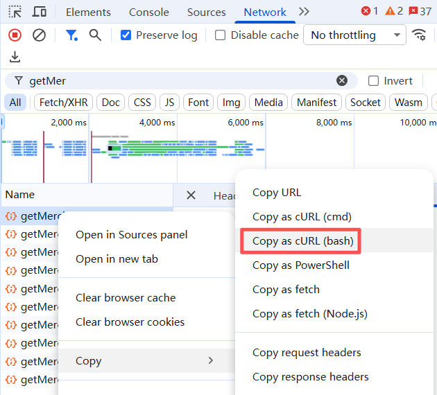
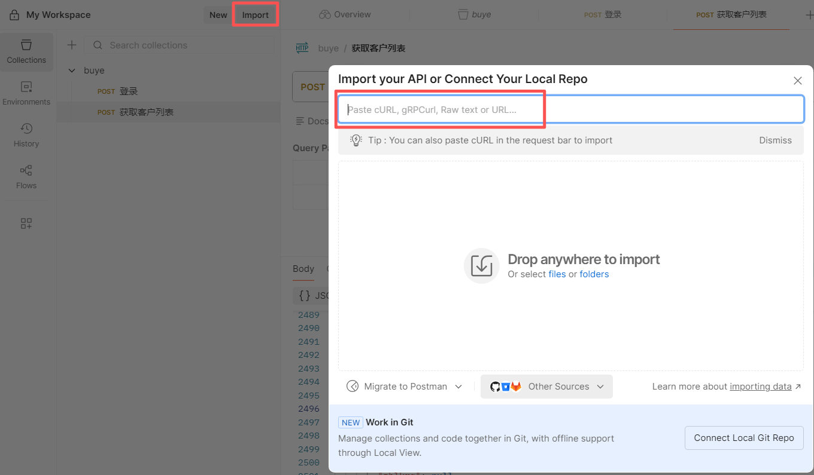
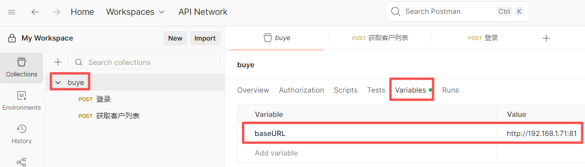

## 信息

帐号和密码：`gmail@Kl...`

## ubuntu安装

- 使用`snap`安装`postman`

  ```bash
  sudo snap install postman
  ```

- 启动`postman`

  ```bash
  postman
  ```


## Windows11安装

访问 https://www.postman.com/ 下载最新版本postman根据提示安装即可。

## 导入浏览器中的请求

打开开发者工具复制浏览器中的请求，如图所示：



打开postman点击import按钮后粘贴复制内容到import对话框即可实现导入浏览器请求到postman



## 定义和引用变量

在collection中定义变量，如图：



引用变量，如图：


