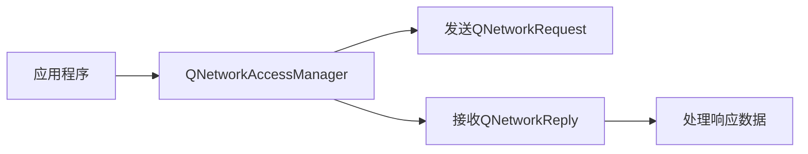

## 总结

如下：

- `QWidget` 控件可以通过 `Qt Designer` 直接设置顶层布局。
- 在布局过程中，空白处使用 `Horizontal` 或者 `Vertical` 的 `Spacer` 填充以达到使用空白组件占据布局空间防止其他组件被拉伸。


## 帐号信息

网站：https://login.qt.io/login

帐号：`gmail`，密码：`Kl`


## 概念

您可以把它想象成一个 **超级强大的“应用程序开发工具包”** 或 **“积木工具箱”**。它的核心目标是让软件开发人员能够用同一套代码，轻松地开发出能运行在不同操作系统（如 Windows、macOS、Linux、Android、iOS）上的应用程序。

---

### 1. 核心定义：一个跨平台的应用程序开发框架

*   **框架**：它不是一门编程语言，而是一个用 **C++** 语言写成的庞大工具集合。它提供了预先写好的代码、工具和规则，让你能更高效地构建复杂、专业的应用程序，而不用从零开始造轮子。
*   **跨平台**：这是 Qt 最著名的特点。你写一次代码，只需要稍微调整（甚至无需调整），就可以在多个平台上编译运行。这极大地节省了开发和维护成本。

### 2. 主要用途和能做什么？

Qt 几乎可以用来开发任何类型的桌面和移动应用，尤其擅长：

*   **传统桌面软件**：如 **Adobe Photoshop Elements、WPS Office、VirtualBox** 等知名软件的部分界面就使用 Qt 开发。
*   **工业与嵌入式系统**：这是 Qt 的强项。汽车的中控仪表盘、医疗设备界面、工业控制面板、智能家居终端等，很多都基于 Qt。因为它性能高，对硬件控制能力强。
*   **图形界面程序**：任何需要窗口、按钮、菜单、图表、3D 效果的软件。
*   **移动应用**：可以开发 Android 和 iOS 的应用。

### 3. Qt 的核心组成部分（就像工具箱里的不同工具）

一个完整的 Qt 不仅仅是你写代码的库，它是一整套生态：

| 组成部分          | 说明                                                         | 类比                                                         |
| :---------------- | :----------------------------------------------------------- | :----------------------------------------------------------- |
| **Qt Library**    | **核心代码库**。提供了创建图形界面、处理文件、连接网络、访问数据库等所有功能的 C++ 类。 | **积木块本身**。提供了各种形状和颜色的积木。                 |
| **Qt Creator**    | **官方集成开发环境**。一个轻量级、强大的代码编辑器，专为 Qt 开发设计，集成了调试、界面设计等功能。 | **工作台和工具**。让你更方便地拼接积木的工作台。             |
| **Qt Designer**   | **可视化UI设计工具**。你可以通过拖拽按钮、文本框等控件来设计界面，它会自动生成对应的代码。 | **界面草图板**。让你先画好蓝图，再根据蓝图找积木。           |
| **qmake / CMake** | **构建工具**。负责管理你的代码，告诉编译器如何把代码和 Qt 库链接起来，最终生成可执行程序。 | **施工说明书**。告诉工人（编译器）如何把积木组装成最终模型。 |
| **Qt Linguist**   | **国际化工具**。可以轻松地为你的应用程序添加多种语言支持。   | **翻译官**。帮助你把模型上的标签换成不同语言。               |

### 4. 一个简单的例子

假设你想创建一个窗口，上面有一个按钮，点击后能弹出“Hello World！”。

*   **没有 Qt**：你需要调用复杂的操作系统底层 API（Windows 和 macOS 的API完全不同），写大量代码来创建窗口、绘制按钮、处理鼠标点击事件。
*   **使用 Qt**：你只需要几行简单的 C++ 代码，调用 Qt 提供的 `QWidget`（窗口）、`QPushButton`（按钮）等类就可以了。Qt 帮你处理了所有底层操作系统的差异。

### 总结

**Qt 是一个基于 C++ 的、跨平台的应用程序开发框架。它提供了一整套工具和代码库，让开发者能高效地构建出拥有精美图形界面的、高性能的软件，并可以轻松地部署到 Windows、Linux、macOS、Android 等多种操作系统上。**

简单说，它就是软件开发者的一个 **“万能高效开发神器”**。


## 历史

好的，Qt 的历史非常精彩，它从一个北欧软件公司的创新项目，发展成为驱动全球无数设备的核心框架。它的发展史大致可以分为以下几个阶段：

---

### 1. 诞生：奇趣科技时代 (1991-1994)

*   **创始人与灵感**：Qt 由 **Haavard Nord** 和 **Eirik Chambe-Eng** 共同创建。他们需要一种能在 Unix 上开发具有良好图形界面的应用程序的方法，但当时的工具（如 Motif）既昂贵又难以使用。
*   **名字的由来**：他们在 Emacs 编辑器中使用字体命令 **`Q-t`** 来生成字母 Q 的特定外观（Quaaak!），并觉得这个缩写看起来很不错。同时，**“Qt”** 在当时的字体下看起来很像 **“Quota”**，但他们澄清这并非本意。官方说法是，它读作 **“cute”** [kjuːt]，但本身不是任何词的缩写。
*   **公司成立**：1994年，他们创立了 **Trolltech**（**奇趣科技**）公司来推广和开发 Qt。“Troll” 在挪威语中既有“巨魔”的意思，也有“魔法”或“有趣”的涵义，体现了公司的技术极客文化。

### 2. 早期发展与 KDE (1996-1998)

*   **开源契机**：1996年，Qt 的一个重要转折点到来。德国程序员 **Matthias Ettrich** 发起了 **KDE** 项目，旨在为 Unix/Linux 创建一个统一、好用的桌面环境。他选择了 Qt 作为其图形工具箱，因为 Qt 是当时唯一能满足其需求的 C++ 库。
*   ** licensing 争议与解决**：Qt 最初是**专有许可**，这与自由软件精神相悖，因此引发了 GNU 阵营的强烈反对，甚至直接催生了另一个竞争项目：GNOME（最初使用 GTK+ 工具包）。
*   **QPL 与 GPL**：为了应对社区的担忧，Trolltech 于 1998 年推出了 **Q Public License**，并在 2000 年为其 Unix 版本增加了 **GPL** 许可。这意味着开发者可以在开源项目中使用 Qt。这一举措极大地促进了 Qt 在 Linux 社区的普及和接纳。

### 3. 扩张与 acquisition 收购 (2000-2008)

*   **跨平台战略**：随着成功，Trolltech 开始将 Qt 移植到更多平台：
    *   **2001年**：发布了 **Qt/Windows** 和 **Qt/macOS** 的**商业版本**，标志着 Qt 正式成为一个真正的跨平台框架。
    *   **2005年**：发布了 **Qt 4**，这是一个里程碑版本。它引入了全新的**图形视图架构**、统一的**跨平台 API** 以及将 GUI 与核心功能分离的模块化系统，奠定了现代 Qt 的基础。
*   **被诺基亚收购**：2008年，手机巨头 **诺基亚** 收购了 Trolltech，并将其重命名为 **Qt Development Frameworks**。诺基亚的战略是使用 Qt 作为其 **Maemo/MeeGo** 智能手机操作系统（如诺基亚 N9）的**核心应用开发框架**，以期与 iOS 和 Android 竞争。

### 4. 诺基亚时代与开源化 (2009-2012)

*   **LGPL 许可**：在诺基亚领导下，Qt 于 2009 年发布了 **LGPL v2.1** 许可版本。这是一个**革命性的举措**，它允许开发者即使在闭源商业项目中使用 Qt，也无需购买商业许可或开源自己的代码。这极大地降低了 Qt 的商业使用门槛，吸引了海量开发者。
*   **战略摇摆与衰落**：随着诺基亚手机业务的衰落和放弃 MeeGo，转向 Windows Phone，Qt 在诺基亚内部的战略地位变得模糊不清，发展一度陷入停滞。

### 5. 独立与重生：Digia 与 The Qt Company (2012-至今)

*   **被 Digia 收购**：2012年，芬兰软件公司 **Digia** 从诺基亚手中收购了 Qt 业务，确保了 Qt 的持续发展。
*   **成立 Qt 公司**：2014年，Digia 将 Qt 业务完全剥离，成立了 **The Qt Company**，专注于 Qt 的开发和支持。
*   **现代发展与繁荣**：
    *   **Qt 5**：2012年发布，带来了**QML** 和 **Qt Quick** 的革命性技术，使声明式UI和流畅动效的开发变得非常简单。同时大幅改进了对**嵌入式系统**和**移动平台**的支持。
    *   **Qt 6**：2020年发布，是又一次重大革新。它专注于满足未来需求：更好的性能（图形堆栈重写）、更现代的 C++（支持 C++17/20）、更高效的开发流程（CMake 成为默认构建系统）。
    *   **应用领域**：如今，Qt 已无处不在，从**汽车数字座舱**、**医疗设备**、**工业自动化**到**Adobe Photoshop Elements**、**VLC 媒体播放器**等知名软件，其背后都有 Qt 的身影。

### Qt 历史大事记简表

| 时间     | 事件                       | 意义                               |
| :------- | :------------------------- | :--------------------------------- |
| **1991** | Haavard 和 Eirik 开始开发  | Qt 项目启动                        |
| **1994** | 成立 Trolltech（奇趣科技） | 公司化运营                         |
| **1996** | KDE 选择 Qt 作为基础       | 获得关键社区支持，但也引发许可争议 |
| **1998** | 推出 QPL 许可              | 向开源迈出第一步                   |
| **2000** | 增加 GPL 许可              | 进一步拥抱开源社区                 |
| **2001** | 发布 Windows 和 macOS 版本 | 成为真正跨平台框架                 |
| **2005** | 发布 Qt 4                  | 里程碑版本，架构现代化             |
| **2008** | 被诺基亚收购               | 进入移动领域战略                   |
| **2009** | 采用 LGPL 许可             | 极大促进商业应用，迎来爆发式增长   |
| **2012** | 被 Digia 收购；Qt 5 发布   | 摆脱困境，QML/Qt Quick 带来革命    |
| **2014** | 成立 The Qt Company        | 独立公司，专注Qt发展               |
| **2020** | 发布 Qt 6                  | 面向未来的又一次重大革新           |

### 总结

Qt 的历史是一部从**解决特定问题**的工具，到被**大型社区项目**选中，经历**许可风波**后通过开源化找到出路，被**巨头收购**后又经历战略摇摆，最终**独立重生**并成为**行业基石**的精彩故事。它的成功源于其卓越的技术设计、关键时刻拥抱开源的决策（尤其是LGPL），以及其强大的跨平台能力，正好契合了嵌入式和物联网时代的发展浪潮。


## 跨平台发布

`todo`


## `MFC`概念

好的，我们来详细解释一下 **MFC开发**。

### 核心定义

**MFC开发** 指的是使用 **Microsoft Foundation Classes** 来开发 Windows 桌面应用程序。

您可以把它理解为：
*   **一套工具包**：MFC 是微软提供的一个 C++ **类库**。
*   **它的目的**：为了简化 Windows 平台的 GUI 程序开发，让开发者不用去记忆和直接调用复杂且庞大的 Windows 底层 API。

---

### 一个生动的比喻：盖房子

开发一个带图形界面的 Windows 程序，就像盖一栋房子。

*   **Windows API**：就像是**一堆积木和最基本的工具**。理论上你可以用它们盖出任何房子，但你需要自己处理每一块积木的摆放，过程极其繁琐、重复且容易出错。
*   **MFC**：就像是**一套预先制作好的“房屋框架”和“门窗模块”**。它用 C++ 类把这些“积木”封装成了墙、门、窗等组件。开发者要盖房子时，直接调用这些现成的“墙”和“窗”就行了，大大提高了效率，减少了重复劳动。

**MFC开发，就是利用这套现成的“框架和模块”来快速搭建Windows程序。**

---

### MFC 的由来和历史背景

要理解 MFC，必须了解它的历史背景，因为它身上有深深的时代烙印：

1.  **早期Windows开发（1990年前后）**：开发GUI程序极其痛苦，必须直接使用 C 语言调用庞大的 **Windows API**。代码冗长，需要处理大量底层细节。
2.  **MFC的诞生（1992年）**：为了应对这种复杂性，微软推出了 MFC。它应用了当时先进的 **“面向对象”** 思想，将窗口、按钮、对话框等GUI元素和消息机制**封装成C++类**。
3.  **它的巨大成功**：在 **90年代到21世纪初**，MFC 是Windows平台GUI开发的**绝对霸主**。Visual C++ 6.0 和 MFC 的组合是那个时代无数桌面软件（如QQ早期版本、迅雷、各类企业管理软件、工业软件）的开发标准。
4.  **如今的地位**：MFC是一个**经典但逐渐过时**的技术。微软早已不再对其进行重大更新，推出了 **.NET Framework（WinForms, WPF）** 等更现代的平台来取代它。但目前仍有大量遗留系统在使用和维护。

---

### MFC开发的核心特点

| 特点                 | 说明                                                         | 类比                                              |
| :------------------- | :----------------------------------------------------------- | :------------------------------------------------ |
| **1. C++ 类库**      | 对 Windows API 的面向对象封装。核心是 `CWinApp`（应用程序类）和 `CWnd`（窗口基类）。所有的控件（如按钮 `CButton`）都派生自这些基类。 | 把散乱的积木（API）打包成了标准的门窗模块（类）。 |
| **2. 文档/视图架构** | MFC一个非常核心和著名的框架，用于将**数据管理**和**数据显示**分离。非常适合开发像记事本、Excel这类需要处理数据文档的应用程序。 | 模型（数据）- 视图（显示）分离思想的早期实践。    |
| **3. 消息映射**      | 将Windows的**消息机制**（如点击按钮、移动鼠标）封装成更易用的形式。开发者不需要处理复杂的消息循环，而是通过宏来指定“当某个消息发生时，调用哪个函数”。 | 一个高效的事件处理分配器。                        |
| **4. 资源编辑器**    | Visual Studio 内置的可视化对话框、菜单、图标编辑器，可以“拖拽”式地设计界面，然后自动生成相关代码。 | 所见即所得的界面设计工具。                        |

---

### MFC 的优缺点

#### 优点（为什么曾经如此成功）

*   **性能优异**：本质是原生C++，直接编译为本地代码，执行效率高。
*   **对Windows支持极好**：可以调用几乎所有Windows特性，控制力极强。
*   **稳定成熟**：经过几十年考验，非常稳定，Bug少。
*   **部署简单**：生成的程序通常只有一个exe加几个dll，几乎不需要额外的运行环境（对比.NET需要框架）。

#### 缺点（为什么现在不推荐新项目使用）

*   **过于古老和陈旧**：设计理念和代码风格停留在20多年前，与现代C++标准脱节。
*   **开发效率低**：相比 C# WinForms/WPF 或 Qt，实现同样功能的界面，代码更繁琐，开发周期更长。
*   **界面丑陋**：默认界面风格是古老的Windows经典样式，难以做出现代化的漂亮UI（虽然可以通过换肤库弥补，但很麻烦）。
*   **学习曲线陡峭**：需要同时熟悉C++、面向对象和Windows底层机制，对新手不友好。
*   **微软已不再积极发展**：官方停止重大更新，新技术支持差。

---

### 总结与现状

*   **MFC开发** 是 **Windows桌面开发一个时代的象征**，是用C++进行原生Windows开发的重要工具。
*   它**简化了但未完全隐藏**Windows API的复杂性，开发者有时仍需了解底层机制。
*   **现状**：
    *   **新项目**：**强烈不推荐**使用MFC启动新项目。应选择 **（C# + WinForms/WPF/UWP）** 或 **（C++ + Qt）** 等更现代、高效的框架。
    *   **旧项目**：目前存在大量的**遗留系统**（特别是在工业控制、嵌入式、传统企业管理软件领域）仍然基于MFC。因此，**维护和更新这些现有系统**是当前MFC开发者的主要工作，市场需求是**维护大于新建**。

所以，学习MFC更像是在**学习一段重要的计算机历史**，或者是为了**维护和改造那些仍在服役的“老功臣”软件**。


## `Qt`和`MFC`区别

好的，Qt 和 MFC 是两大经典的 C++ GUI 开发框架，但它们的设计理念、功能和现代性有着天壤之别。

我们可以通过一个详细的对比表格来清晰了解它们的区别，然后用一个总结来帮你做出选择。

### Qt 与 MFC 核心区别对比表

| 特性维度              | Qt                                                           | MFC                                                          | **核心差异解读**                                             |
| :-------------------- | :----------------------------------------------------------- | :----------------------------------------------------------- | :----------------------------------------------------------- |
| **1. 设计与理念**     | **跨平台框架**。一套代码编译到多个平台。采用**现代面向对象设计**，信号与槽机制是核心，解耦性极佳。 | **Windows平台框架**。本质是**对Windows API的C++封装**。遵循文档/视图架构，与Windows紧密绑定。 | Qt是**抽象了操作系统**的现代框架；MFC是**包装了Windows**的传统库。 |
| **2. 跨平台能力**     | **核心优势**。支持Windows, Linux, macOS, Android, iOS, 嵌入式系统等。**真正的“一次编写，到处编译”**。 | **仅支持Windows**。无法移植到其他操作系统。                  | 这是最根本的区别。如果你的项目需要考虑Linux或macOS用户，Qt是唯一选择。 |
| **3. 界面与样式**     | **样式引擎强大**。支持QSS（类似CSS）轻松定制现代化、炫酷的界面。控件外观与操作系统解耦，在任何平台上看起来都一致（也可设置为原生风格）。 | **界面陈旧**。默认是Windows经典样式（如Windows 95/XP）。制作现代化UI非常困难，需要大量自定义绘制或第三方皮肤库。 | Qt能做出更漂亮、更现代的界面，开发体验更好。MFC应用通常给人“老旧”的感觉。 |
| **4. 开发效率与体验** | **高**。清晰的API设计，优秀的文档，强大的集成开发环境Qt Creator。信号与槽机制让事件处理非常直观。 | **较低**。需要熟悉Windows消息机制和文档/视图结构。代码常显得繁琐、冗长。依赖Visual Studio。 | Qt的学习曲线更平滑，开发更愉快。MFC需要了解更多Windows底层细节。 |
| **5. 社区与生态**     | **非常活跃**。由Qt公司和开源社区共同推动，持续更新，紧跟技术潮流（如对QML、3D、Python的支持）。拥有庞大的跨平台社区。 | **维护状态**。微软已停止功能更新，仅做安全维护。社区主要是维护遗留项目的开发者。 | Qt代表着未来和活力，拥有丰富的第三方库和资源。MFC是过去式，生态停滞。 |
| **6. 授权与许可**     | **双重许可**。开源版（GPL/LGPL）和商业版。使用开源版需遵守协议要求（如动态链接）。 | **完全免费**。作为Visual Studio的一部分分发，可免费用于开发。 | MFC在授权上更简单无虑。Qt需要开发者了解开源协议或购买商业许可。 |
| **7. 应用场景**       | **新项目首选**。尤其是需要**跨平台**的项目，如：工业嵌入式HMI、汽车仪表盘、消费软件、移动应用、Linux桌面软件等。 | **遗留系统维护**。主要用于维护和更新**现有的、历史悠久的Windows桌面软件**，如：一些内部企业管理软件、老牌工业控制软件。 | **Qt面向未来和多元生态，MFC连接过去和Windows旧世界。**       |

---

### 总结与选择建议

你可以将 Qt 和 MFC 理解为 **“现代电动汽车”** 和 **“经典燃油老爷车”** 的区别。

*   **Qt 是那辆“现代电动汽车”**：
    *   **技术新**：设计理念先进，功能全面（自动驾驶、智能座舱）。
    *   **环保（跨平台）**：能适应更多道路（操作系统）。
    *   **体验好**：开发顺畅，界面酷炫。
    *   **适合**：**几乎所有新的C++ GUI项目**，尤其是那些有跨平台需求、希望拥有现代化界面和长期维护的项目。

*   **MFC 是那辆“经典燃油老爷车”**：
    *   **年代久**：技术停留在过去，但非常稳定。
    *   **专路专用**：只能在Windows这条老路上开。
    *   **有情怀/不得已**：家里已经有这辆车了（现有系统），修修补补还能用，重新买辆新的不划算。
    *   **适合**：**维护和扩展现有的、用MFC编写的遗留应用程序**。除非有极其特殊的理由（如团队只会MFC且项目极度依赖Windows特性），否则**绝不建议用于新项目**。

**最终选择指南：**

1.  **需要开发一个新项目吗？**
    *   **是** -> **毫不犹豫地选择 Qt**（或者C#/.NET）。
    *   **否，我是要维护一个旧程序** -> 如果旧程序是MFC写的，那你只能继续使用MFC。

2.  **项目需要运行在Linux或macOS上吗？**
    *   **是** -> **只能选择 Qt**。
    *   **否，只在Windows上运行** -> **依然强烈推荐Qt**，因为它能提供更好的开发体验和更漂亮的界面。除非项目非常简单且团队对MFC极其熟悉。

简而言之，**在当今时代，Qt 全面超越了 MFC**。MFC 的价值主要在于其历史遗产的维护，而非新的开发。


## 安装 - `Qt Online Installer`说明

>提示：因为 `Qt Online Installer` 在线拉取 `Qt Creator`、`Qt`、`Qt Design Tool` 等 `Qt` 组件的版本信息，所以到当前时间 `2025-09-27` 任何版本的 `Qt Online Installer` 都不支持 `Qt5` 的安装，只支持 `Qt6` 和最新版本的 `Qt Creator` 安装。如果要安装 `Qt5` 需要使用离线安装方式下载 `Qt5` 安装包（安装包包含 `Qt Creator` 安装）。


## 安装 - `Ubuntu`

>提示：
>
>- 使用 `Ubuntu20.04.3` 安装 `Qt5.14.2`。
>- `Qt` 安装程序 `qt-opensource-linux-x64-5.14.2.run` 已经包含 `Qt Creator`，不需要再单独下载 `Qt Creator`。

`Ubuntu` 先安装 `Qt` 编译 `C++` 代码时的相关依赖

```sh
sudo apt update
# 安装 g++、make 命令，否则报告 Qt Creator 中的 Kit 报告没有配置 C++ Compiler 警告导致项目不能使用 Kit
sudo apt install build-essential -y
# 安装 libgl，否则 Qt Creator 编译时报告 cannot find -lGL 错误导致编译失败
sudo apt install libgl1-mesa-dev -y
```

在链接：https://download.qt.io/archive/qt/5.14/5.14.2/ 中下载 `qt-opensource-linux-x64-5.14.2.run`

安装 `Qt` 及其相关组件

```sh
sudo ./qt-opensource-linux-x64-5.14.2.run
```

- 在选择组件界面中全选所有组件。

创建文件 `/usr/share/applications/qtcreator.desktop` 内容如下：

```ini
[Desktop Entry]
Encoding=UTF-8
Type=Application
Name=Qt Creator
Exec=/opt/Qt5.14.2/Tools/QtCreator/bin/qtcreator
Icon=qtcreator
Terminal=false
StartupNotify=true
```


## 构建工具 - `cmake` - 概念

>说明：`Qt6` 项目主流使用此构建工具管理项目。

### 一句话概括

**CMake 是一个开源、跨平台的构建系统“生成器”，它使用一个统一的配置文件（CMakeLists.txt），来为不同的底层构建工具（如 Make、Ninja、Visual Studio 等）生成对应的项目文件或构建脚本，从而实现“一次编写，处处构建”。**

---

### 为什么需要 CMake？—— 解决的核心问题

想象一下，你的 C++ 项目需要在不同平台上编译：
*   **在 Linux/macOS 上**，开发者习惯使用 `Makefile` 和 `g++/clang`。
*   **在 Windows 上**，开发者可能使用 Visual Studio 的 `.sln` 解决方案文件 和 MSVC 编译器。

如果没有 CMake，你就需要维护至少两套构建配置：一套 `Makefile` 和一套 `.sln` 文件。这非常痛苦。

**CMake 的解决方案是：**
你只需要用一种中立的、统一的语言编写一份构建说明（`CMakeLists.txt`）。然后，CMake 会根据你当前所在的**平台**和**编译器**，**生成**该平台原生支持的构建文件。

*   在 Linux 上，它生成 `Makefile`，你就可以用 `make` 编译。
*   在 Windows 上，它生成 `Visual Studio.sln` 项目文件，你就可以用 VS 打开编译。
*   它还可以生成 `Ninja` 构建文件（更快）、`Xcode` 项目文件等。

**所以，CMake 本身并不直接编译代码，它是一个“元构建系统”，是构建系统的生成器。**

---

### CMake 的核心工作流程

让我们通过一个最简单的例子来看 CMake 是如何工作的。

假设我们有一个项目，只有一个 `main.cpp` 文件。

1.  **编写 CMakeLists.txt**
    在项目根目录创建一个名为 `CMakeLists.txt` 的文件，内容如下：
    ```cmake
    # 指定 CMake 所需的最低版本
    cmake_minimum_required(VERSION 3.10)
    
    # 设置项目名称
    project(MyAwesomeApp)
    
    # 告诉 CMake 我们要创建一个可执行文件
    add_executable(MyAwesomeApp main.cpp)
    ```
    这个文件用 CMake 自己的语法描述了这个项目：项目名是 `MyAwesomeApp`，最终要生成一个同名的可执行文件，源文件是 `main.cpp`。

2.  **生成构建系统（Generate）**
    在源代码目录外，创建一个构建目录（这叫做“外部构建”，是推荐的做法），然后运行 `cmake` 命令，并指定源代码路径。
    ```bash
    mkdir build
    cd build
    cmake .. -G "Unix Makefiles"  # -G 指定生成器，在 Linux/macOS 下通常可省略
    ```
    执行后，CMake 会读取上一级目录（`..`）中的 `CMakeLists.txt` 文件，并在当前 `build` 目录下生成一整套 `Makefile` 等文件。

3.  **执行构建（Build）**
    现在，使用生成的构建文件来编译项目。
    ```bash
    cmake --build .  # 跨平台的构建命令，CMake 会自动调用底层的构建工具（如 make）
    # 或者直接使用底层的构建工具
    make
    ```
    编译完成后，你就能在 `build` 目录下找到生成的可执行文件 `MyAwesomeApp`。

**如果你在 Windows 上，想用 Visual Studio 编译，只需要在第二步指定不同的生成器即可：**
```bash
# 在 PowerShell 或 CMD 中，进入 build 目录后执行
cmake .. -G "Visual Studio 17 2022"
```
执行后，CMake 会生成 `MyAwesomeApp.sln` 解决方案文件。此时，你可以用 Visual Studio 打开它，或者直接使用 `cmake --build .` 命令来编译。

---

### CMake 的主要优势和特点

1.  **强大的跨平台能力**：这是 CMake 诞生的初衷，也是它最核心的价值。
2.  **依赖管理**：CMake 自带强大的**查找依赖包**的功能（`find_package`）。无论是查找系统安装的 Qt、OpenCV 还是 Boost 库，CMake 都有标准化的方式去定位头文件和库路径，极大地简化了第三方库的集成。
3.  **模块化和可扩展性**：大型项目可以被组织成多个子目录，每个子目录可以有自己 `CMakeLists.txt`，最终由顶层的文件统一管理。它还支持编写自定义函数和宏。
4.  **强大的生态系统**：CMake 是 C/C++ 社区的**事实标准**。绝大多数开源 C++ 库（如 Qt、VTK、ITK、OpenCV 等）都直接提供 CMake 的配置文件。现代 IDE（如 CLion、Qt Creator、Visual Studio）都对 CMake 提供了原生、深度的支持。
5.  **测试和打包**：CMake 原生集成了 CTest 用于管理测试，以及 CPack 用于生成安装包（如 DEB、RPM、NSIS 安装程序等）。

---

### CMake 与 qmake / Qbs 的最终对比

| 特性           | qmake (Qt)              | Qbs (Qt)                      | **CMake (行业标准)**                      |
| :------------- | :---------------------- | :---------------------------- | :---------------------------------------- |
| **定位**       | Qt 专用的构建生成器     | 先进的、独立的构建引擎        | **通用的、行业标准的构建生成器**          |
| **工作原理**   | 生成 Makefile           | 直接构建，不生成中间文件      | **生成各种底层构建系统文件**              |
| **语法**       | 简单，专有语法（`.pro`) | 强大，类 QML/JS 语法（`.qbs`) | 自有的脚本语言（`CMakeLists.txt`）        |
| **生态系统**   | 主要在 Qt 生态内        | 小众                          | **极其庞大，是 C++ 世界的基石**           |
| **现状与前景** | Qt 5 主流，Qt 6 中维护  | 独立发展，非主流              | **Qt 6 官方推荐，业界绝对主流，未来可期** |

### 总结

*   **CMake 是什么？** 它是一个**构建系统生成器**，是解决 C++ 跨平台构建问题的**行业标准工具**。
*   **它如何工作？** 你编写中立的 `CMakeLists.txt` 配置文件，CMake 根据目标平台为你生成对应的原生构建文件（如 Makefile、.sln 等）。
*   **我该用吗？** **绝对应该！** 无论你是做 Qt 开发还是一般的 C++ 开发，学习 CMake 都是一项**必备技能**。对于任何**新开始的 C++ 项目，CMake 都是不二之选**。

简单来说，如果你希望在 C++ 领域进行严肃的、跨平台的开发，**掌握 CMake 不是可选项，而是必选项**。它已经取代了 qmake 的历史地位，并凭借其强大的生态成为了无可争议的王者。


## 构建工具 - `qmake` - 概念

>说明：`Qt5` 项目主流使用此构建工具管理项目。

### 一句话概括

**qmake 是一个用来为软件项目自动生成“编译脚本”（比如 Makefile）的工具，它主要由 Qt 公司开发，专门为简化 Qt 程序的编译过程而设计。**

---

### 详细解释

要理解 qmake，我们需要先了解一个 C++ 项目从源代码到可执行文件需要经历什么。

1.  **编写代码**：你写好了 `.h` 头文件和 `.cpp` 源文件。
2.  **编译（Compile）**：编译器（如 g++、clang）需要将每个 `.cpp` 文件编译成机器能识别的目标文件（`.o` 或 `.obj`）。
3.  **链接（Link）**：链接器将所有的目标文件，以及它们所依赖的库（比如 Qt 的库文件 `QtCore.so`, `QtGui.dll` 等）捆绑在一起，最终生成一个可执行文件（如 `.exe` 或 `.app`）。

这个过程如果手动完成会非常繁琐。比如，你需要输入一长串命令来告诉编译器头文件在哪、要链接哪些库等等。这就是 **构建系统（Build System）** 工具出场的原因。

#### qmake 的角色

qmake 就是一个构建系统工具。它的核心工作流程如下：

1.  **你编写一个项目文件**：这个文件通常命名为 `你的项目名.pro`（例如 `myapp.pro`）。这是一个相对简单、人类可读的配置文件。
2.  **你在 `.pro` 文件中说明项目信息**：你用简单的语法告诉 qmake：
    *   项目类型（是生成一个应用程序，还是一个库？）：`TEMPLATE = app`
    *   项目中包含哪些源文件和头文件：`SOURCES = main.cpp widget.cpp`， `HEADERS = widget.h`
    *   需要链接哪些 Qt 模块：`QT += core gui` （如果需要图形界面，还要加上 `widgets`）
    *   其他配置，比如程序的名称、编译选项等。
3.  **qmake 读取 `.pro` 文件并生成 Makefile**：qmake 会根据你项目文件里的描述，**自动生成**一个非常复杂、但完全符合当前平台（Windows、Linux、macOS）和编译器（GCC、MSVC 等）规范的 `Makefile`。
4.  **你使用 Makefile 进行编译**：生成了 `Makefile` 之后，你只需要在命令行输入 `make`（Linux/macOS）或 `nmake`/`mingw32-make`（Windows），构建系统（make 工具）就会根据 `Makefile` 里的指令，自动调用编译器和你，完成编译和链接的所有步骤。

**简单来说，qmake 是一个“构建系统的生成器”，它把你从编写复杂编译命令的劳动中解放了出来。**

---

### 一个简单的 .pro 文件例子

```pro
# 指定这是一个应用程序项目
TEMPLATE = app

# 指定需要使用的 Qt 模块
QT += core gui widgets

# 如果 Qt 版本大于 4，需要加上 widgets 模块（因为 Qt5 开始 GUI 和 Widgets 模块分开了）
greaterThan(QT_MAJOR_VERSION, 4): QT += widgets

# 指定目标文件名（生成的可执行文件叫 MyApp）
TARGET = MyApp

# 指定源文件
SOURCES += \
    main.cpp \
    widget.cpp

# 指定头文件
HEADERS += \
    widget.h
```

### qmake 的主要优势（特别是对于 Qt 项目）

*   **对 Qt 特性原生支持**：它能自动处理 Qt 特有的编译步骤，比如**元对象系统（MOC）**、**用户界面编译器（UIC）** 和**资源文件（RCC）**。这是它最强大的地方。
*   **跨平台**：一份简单的 `.pro` 文件可以在 Windows、Linux、macOS 上使用，qmake 会为各个平台生成对应的正确 Makefile。
*   **简单易学**：`.pro` 文件的语法比直接写 CMakeLists.txt 或 Makefile 要简单得多。

### qmake 的现状：qmake 与 CMake

近年来，**CMake** 已经成为了 C++ 社区更主流的构建工具生成器。Qt 6 也开始**官方推荐使用 CMake** 来管理项目，而不是 qmake。

**两者的简单对比：**

| 特性         | qmake                                                        | CMake                                                    |
| :----------- | :----------------------------------------------------------- | :------------------------------------------------------- |
| **定位**     | 主要为 Qt 项目设计，是 Qt 的“原装工具”                       | 通用型 C++ 构建工具，是业界的**事实标准**                |
| **语法**     | 简单、专有                                                   | 更强大、灵活，但学习曲线稍陡                             |
| **生态系统** | 主要在 Qt 生态内                                             | 拥有极其庞大的生态系统，被绝大多数 C++ 开源项目使用      |
| **现状**     | **维护模式**。Qt 5 及之前是默认选择，Qt 6 仍支持，但不再是首选。 | **未来趋势**。是 Qt 6 的推荐构建系统，也是新项目的首选。 |

### 总结

*   **qmake 是一个方便、跨平台的构建工具，尤其适合 Qt 应用程序开发。**
*   它的核心工作是读取简单的 `.pro` 项目文件，然后生成复杂的 `Makefile`。
*   对于学习和维护现有的 Qt 5（或更早）项目，了解 qmake 非常重要。
*   但对于**新开始的 Qt 项目，强烈建议学习并使用 CMake**，因为它更强大，并且是行业和 Qt 未来的发展方向。


## 构建工具 - `Qbs` - 概念

### 一句话概括

**Qbs（Qt Build Suite）是一个由 Qt 公司开发的现代化构建工具，它不仅仅生成 Makefile，其设计目标是成为一个功能更强大、更灵活、配置更直观的 qmake 替代品。**

---

### 为什么在有了 qmake 之后，还要开发 Qbs？

要理解 Qbs，首先要知道 qmake 和 Makefile 这类工具的一些局限性：

1.  **两级抽象**：qmake 只是一个“生成器”。它先根据 `.pro` 文件生成 `Makefile`，然后你再调用 `make` 来执行真正的编译。这多了一层间接性，不够直接。
2.  **描述能力有限**：`.pro` 文件的语法相对简单，对于描述非常复杂的构建流程（尤其是涉及自定义构建步骤、复杂的依赖关系时）会变得力不从心。
3.  **不够“智能”**：传统的 `make` 工具基于文件时间戳来判断是否需要重新编译，这有时不够精确和高效。

Qbs 就是为了解决这些问题而诞生的。

### Qbs 的核心思想与特点

Qbs 不再采用“生成 Makefile”的模式，而是一个**真正的构建引擎**。你直接调用 `qbs` 命令，它会自己解析项目文件、分析依赖关系并直接调用编译器进行构建，不再需要中间生成的 `Makefile`。

它的主要特点如下：

#### 1. 基于项目的高级语言
Qbs 使用一种名为 **QML（Qt Modeling Language）** 风格的 **JavaScript** 语法来编写项目文件（通常是 `.qbs` 文件）。这种语法比 qmake 的 `.pro` 文件语法更强大、更结构化、也更易于表达复杂逻辑。

**一个简单的 `application.qbs` 文件示例：**
```javascript
import qbs

CppApplication {
    name: "MyApp"
    files: [
        "*.cpp",
        "*.h"
    ]

    cpp.cxxLanguageVersion: "c++11"

    Depends { name: "Qt.core" }
    Depends { name: "Qt.widgets" }
}
```
可以看到，它的语法更像是在描述一个对象及其属性，非常清晰。

#### 2. 构建图（Build Graph）
Qbs 的核心概念是“构建图”。它会解析你的项目文件及其依赖，在内存中构建一个完整的、精确的依赖关系图。这使得它能做到：
*   **高度精确的增量构建**：只编译真正需要编译的部分，最大程度提升构建速度。
*   **更好的并行构建**：能更智能地调度编译任务，充分利用多核CPU。

#### 3. 强大的依赖模型
Qbs 对模块和产品（Product）之间的依赖关系有原生支持。你可以很容易地定义：
*   一个静态库产品
*   一个依赖于该静态库的应用程序产品
*   一个单元测试产品，依赖于应用程序
Qbs 能自动管理它们之间的依赖和构建顺序。

#### 4. 跨平台抽象
和 qmake 一样，Qbs 也是跨平台的。你可以在项目文件中方便地编写平台相关的条件判断，例如：
```javascript
Group {
    condition: qbs.targetOS.contains("windows")
    files: [ "windows_specific.cpp" ]
}

Group {
    condition: qbs.targetOS.contains("linux")
    files: [ "linux_specific.cpp" ]
}
```

### Qbs 与 qmake / CMake 的对比

| 特性     | qmake                               | **Qbs**                               | CMake                                                  |
| :------- | :---------------------------------- | :------------------------------------ | :----------------------------------------------------- |
| **架构** | 构建系统**生成器**（生成 Makefile） | **独立的构建引擎**（不生成 Makefile） | 构建系统**生成器**（可生成 Makefile、Ninja、VS项目等） |
| **语法** | 简单的专有语法（`.pro`）            | **强大的类 QML/JS 语法**（`.qbs`）    | 自有的脚本语言（`CMakeLists.txt`）                     |
| **理念** | 简单、专注 Qt                       | **强大、灵活、自包含**                | 通用、行业标准、高度可配置                             |
| **状态** | 成熟、维护模式                      | **实验性/小众**                       | **业界标准、蓬勃发展**                                 |

### Qbs 的现状与未来

尽管 Qbs 在技术上有很多优点，但它的发展路径比较曲折：

1.  **曾被视为 qmake 的继任者**：在 Qt 5 时代，Qt 公司曾大力推广 Qbs，希望用它取代 qmake。
2.  **面临 CMake 的激烈竞争**：与此同时，CMake 在 C++ 社区的势头越来越猛，生态越来越完善。
3.  **战略调整**：由于社区采纳度远不及 CMake，Qt 公司后来调整了策略。从 **Qt 6 开始，官方明确将 CMake 作为首选的构建系统**。
4.  **当前定位**：Qbs 目前**不再是 Qt 的默认或推荐构建工具**。它变成了一个由 Qt 公司赞助的**独立开源项目**。它仍然被维护，并且在一些特定领域（如嵌入式开发、需要复杂自定义构建步骤的项目）有其用武之地，但已经不再是主流选择。

### 总结

*   **Qbs 是什么？** 它是一个设计先进、功能强大的**直接构建引擎**，使用类 JavaScript 的语法。
*   **它有什么优点？** 构建模型更精确、配置更灵活、语法更现代。
*   **我应该用它吗？**
    *   对于**大多数新项目，尤其是 Qt 项目，答案是否定的**。你应该选择 **CMake**，因为它是行业标准和 Qt 官方推荐，拥有最广泛的社区和支持。
    *   如果你在一个**特定的、需要高度定制化构建流程**的环境中，并且团队对 Qbs 有研究，那么它可能是一个值得考虑的技术选项。

简单来说，Qbs 是一个“技术上的成功者，但商业/社区上的失败者”。了解它有助于你理解构建工具的发展历程，但为新项目做技术选型时，**CMake 是毫无疑问的首选**。


## 跨平台原理

Qt 的跨平台原理是一个**多层次、系统性的设计**，它通过抽象层、工具链和开发范式来实现"一次编写，到处编译"。以下是其核心原理的详细分解：

---

### **1. 架构概览：分层设计**

```
[ 你的 Qt 应用程序代码 ]
         ↓
[ Qt API 抽象层（QWidgets, QML） ]
         ↓
[ Qt 平台抽象层（QPA - Qt Platform Abstraction）]
         ↓
[ 原生平台 API（Win32, Cocoa, X11, Wayland）]
         ↓
[ 操作系统（Windows, macOS, Linux, ...）]
```

---

### **2. 核心原理一：抽象层设计**

#### **A. GUI 抽象层**
Qt 不直接调用原生 GUI API，而是通过中间层：

```cpp
// 你的代码 - 完全平台无关
QPushButton *button = new QPushButton("Click me");
button->show();

// Qt 内部 - 根据不同平台调用相应实现
```

**各平台后端实现：**
- **Windows** → 调用 `Win32 API` / `DirectWrite` / `Direct2D`
- **macOS** → 调用 `Cocoa` / `AppKit` / `Core Graphics`
- **Linux/X11** → 调用 `Xlib` / `XCB`
- **Linux/Wayland** → 调用 `Wayland` 协议

#### **B. 基础功能抽象**
Qt 为各种操作系统服务提供统一接口：

```cpp
// 文件操作 - 同一套API在不同平台自动适配
QFile file("path/to/file");
file.open(QIODevice::ReadOnly);

// 网络编程
QTcpSocket socket;
socket.connectToHost("example.com", 80);

// 线程管理
QThread *thread = new QThread;
```

---

### **3. 核心原理二：元对象系统（Meta-Object System）**

这是 Qt 的"秘密武器"，通过 C++ 扩展实现信号槽机制：

#### **编译时代码生成（MOC）**
```
[ .h 头文件（含 Q_OBJECT）] 
         → [ MOC 编译器 ] 
         → [ moc_*.cpp 元对象代码 ]
         → [ 与你的代码一起编译 ]
```

**示例：**
```cpp
// 你的头文件
class MyClass : public QObject {
    Q_OBJECT  // ← 这个宏启用元对象系统
public slots:
    void handleClick();
signals:
    void dataChanged();
};

// MOC 自动生成代码（简化示意）
// 为每个类创建元对象，包含信号槽的字符串名称和调用信息
```

**跨平台意义**：MOC 在编译前为每个平台生成适配的胶水代码，确保信号槽机制在所有平台一致工作。

---

### **4. 核心原理三：构建系统与条件编译**

#### **qmake/cmake 的配置系统**
Qt 的构建系统自动检测平台并设置相应参数：

```pro
# .pro 文件示例 - 条件编译
win32 {
    LIBS += -luser32
    DEFINES += WIN32_LEAN_AND_MEAN
}

macx {
    LIBS += -framework Cocoa
}

unix:!macx {
    LIBS += -lX11
}
```

#### **预定义宏**
Qt 提供平台检测宏：
```cpp
#ifdef Q_OS_WIN
    // Windows 特定代码
#elif defined(Q_OS_MAC)
    // macOS 特定代码  
#elif defined(Q_OS_LINUX)
    // Linux 特定代码
#endif
```

---

### **5. 核心原理四：工具链统一**

#### **同一套开发工具**
- **qmake/cmake**：生成各平台原生构建文件（Makefile, .vcxproj, .xcodeproj）
- **Qt Creator**：跨平台 IDE，提供一致的开发体验
- **uic**（UI 编译器）：将 `.ui` 文件编译为平台无关的 C++ 代码
- **rcc**（资源编译器）：将资源文件编译为平台无关的 C++ 代码

#### **资源系统**
```cpp
// 资源文件统一管理，编译进可执行文件
QImage image(":/images/icon.png");  // 冒号表示从资源文件加载
```

---

### **6. 具体平台适配示例**

#### **窗口管理差异处理**
```cpp
// 你的代码
QMainWindow window;
window.show();

// Qt 内部适配
#ifdef Q_OS_WIN
    // 调用 CreateWindowEx, 处理 Win32 消息循环
#elif defined(Q_OS_MAC)
    // 调用 [NSWindow makeKeyAndOrderFront:]
#elif defined(Q_OS_LINUX)
    // 调用 XCreateWindow 或 xdg_surface
#endif
```

#### **文件路径差异处理**
```cpp
QString path = QApplication::applicationDirPath();
// Windows: "C:/Program Files/MyApp"
// macOS:   "/Applications/MyApp.app/Contents/MacOS"
// Linux:   "/usr/bin"
```

---

### **7. 现代 Qt 的跨平台演进**

#### **Qt for WebAssembly**
```cpp
// 同样的代码可编译为 WebAssembly 在浏览器运行
QPushButton *btn = new QPushButton("Run in Browser");
```

#### **Qt for Mobile**
```cpp
// 适配 iOS/Android 触摸界面
QGestureRecognizer::registerRecognizer(new MyGestureRecognizer);
```

---

### **8. 实践中的跨平台考虑**

#### **保持平台无关性**
```cpp
// 推荐做法 - 使用 Qt 抽象
QStandardPaths::displayName(QStandardPaths::DesktopLocation);

// 而不是直接使用平台特定路径
#ifdef Q_OS_WIN
    QString path = "C:/Users/...";
#else
    QString path = "/home/...";
#endif
```

#### **处理不可避免的平台差异**
```cpp
// 集中管理平台相关代码
class PlatformUtils {
public:
    static void setWindowTitleBarColor(QWidget *widget) {
#if defined(Q_OS_WIN)
        // Windows 特定实现
        HWND hwnd = reinterpret_cast<HWND>(widget->winId());
        // ... Win32 API 调用
#elif defined(Q_OS_MAC)
        // macOS 特定实现  
        NSView *view = reinterpret_cast<NSView*>(widget->winId());
        // ... Cocoa 调用
#endif
    }
};
```

---

### **9. 原理验证：编译过程分析**

```
同一份源代码 → 
    ↓
Qt 构建系统根据目标平台配置 →
    ↓
调用平台原生编译器（MSVC, GCC, Clang） →
    ↓
链接对应平台的 Qt 库 →
    ↓
生成原生可执行文件
```

---

### **总结**

Qt 的跨平台原理基于：

1. **抽象层设计** - 统一 API 屏蔽平台差异
2. **元对象系统** - 通过 MOC 实现高级 C++ 特性
3. **工具链统一** - 一套工具生成多平台版本
4. **条件编译** - 优雅处理必要平台差异
5. **资源系统** - 统一管理平台相关资源

这种设计让开发者能够**专注于业务逻辑**，而不用操心底层平台差异，真正实现了"write once, run anywhere"的承诺。


## `QtCreator` - 创建`Qt Widgets Application`

>提示：Qt Widgets Application 是一个使用 Qt Widgets 模块来构建图形用户界面的应用程序。

打开 `QtCreator`，点击 `File` > `New File or Project`，在弹出框中选择 `Application` > `Qt Widgets Application`，点击 `Choose` 按钮。

在 `Project Location wizard` 中填写如下信息：

- 项目名称 `Name` 填写为 `demo-qt1`
- 项目创建的根路径 `Create in` 选择 `/home/xxx/Documents`
- 勾选 `Use as default project location`

点击 `Next` 按钮，在 `Define Build System wizard` 中 `Build System` 选择 `qmake`，点击 `Next` 按钮。

在 `Class information wizard` 中填写信息如下：

- `Base class` 选择 `QWidget`（没有菜单栏的窗口应用）
- 取消勾选 `Generate form`（不生成 `ui` 布局文件）
- 其他默认值

点击 `Next` 按钮，`Translation File wizard` 中 `Language` 选中 `<none>`，点击 `Next` 按钮。

在 `Kit Selection wizard` 中 `Select all kits` 和 `Desktop` 都勾选，点击 `Next` 按钮。

在 `Project Management wizard` 中 `Add as a subproject to project` 选中 `<none>`，`Add to version control` 选中 `<none>`，点击 `Finish` 按钮。


## `QtCreator` - 创建`Plain C Application`

>提示：
>
>- Qt Creator 创建的 “Plain C Application” 是一个纯粹的、不包含任何 Qt 库或框架的 C 语言项目。
>- 可用于辅助学习调试 `C` 语言语法基础。
>
>详细用法请参考本站 [示例](https://gitee.com/dexterleslie/demonstration/tree/main/demo-qt/demo-c-application)

点击 `File` > `New File or Project`，在弹出框中选择 `Non-Qt Project` > `Plain C Application`，其他步骤根据向导提示操作即可。


## `QtCreator` - 创建`Plain C++ Application`

>提示：
>
>- Qt Creator 创建的 “Plain C++ Application” 也是一个纯粹的、不包含任何 Qt 库或框架的 C++ 项目。
>- 可用于辅助学习调试 `C++` 语言语法基础。
>
>详细用法请参考本站 [示例](https://gitee.com/dexterleslie/demonstration/tree/main/demo-qt/demo-c-plus-application)

点击 `File` > `New File or Project`，在弹出框中选择 `Non-Qt Project` > `Plain C++ Application`，其他步骤根据向导提示操作即可。


## `QtCreator` - 创建`Auto Test Project`

>提示：Auto Test Project 是 Qt Creator 提供的一种专门用于自动化测试的项目模板，它简化了 Qt 测试项目的创建和管理过程。
>
>详细用法请参考本站 [示例](https://gitee.com/dexterleslie/demonstration/tree/main/demo-qt/demo-qtest)

点击 `File` > `New File or Project`，在弹出框中选择 `Other Project` > `Auto Test Project`，在 `Project and Test Information` 向导界面中的 `Test case name` 填写 `TestMyTest`，其他默认值即可。

修改 `void TestMyTest::test_case1()` 测试用例如下：

```c++
void TestMyTest::test_case1()
{
    int expected = 1;
    QVERIFY2(1 == expected, "非预期测试");
}
```

点击 `Run` 按钮运行测试即可。


## `QtCreator` - `QtCreator`和`Qt`版本对应吗？

>提示：不完全严格对应，但有较强的兼容性关系。两者可以**混合搭配**使用，但某些组合有最佳实践。

**不完全严格对应，但有较强的兼容性关系。** 让我详细解释一下：

### 🔄 **版本关系概述**

#### **松耦合设计**
- **Qt Creator** 是独立的 IDE
- **Qt 库** 是 GUI 框架
- 两者可以**混合搭配**使用，但某些组合有最佳实践

#### **实际兼容情况**
| 组合类型                   | 兼容性 | 说明               |
| -------------------------- | ------ | ------------------ |
| **新版 Creator + 旧版 Qt** | ✅ 优秀 | 向下兼容性好       |
| **旧版 Creator + 新版 Qt** | ⚠️ 有限 | 可能缺少新特性支持 |
| **同代版本**               | ✅ 最佳 | 官方测试组合       |

---

### 📊 **具体兼容性矩阵**

#### **Qt Creator 对 Qt 版本的支持**
| Qt Creator 版本      | Qt 4.x   | Qt 5.9-5.15 | Qt 6.0-6.2 | Qt 6.3+  |
| -------------------- | -------- | ----------- | ---------- | -------- |
| **Creator 3.x-4.10** | ✅ 完整   | ✅ 完整      | ❌ 不支持   | ❌ 不支持 |
| **Creator 4.11-8.0** | ⚠️ 有限   | ✅ 完整      | ✅ 实验性   | ❌ 不支持 |
| **Creator 9.0+**     | ❌ 不支持 | ✅ 完整      | ✅ 完整     | ✅ 完整   |
| **Creator 12.0+**    | ❌ 不支持 | ⚠️ 有限      | ✅ 完整     | ✅ 完整   |

---

### 🎯 **推荐组合策略**

#### **1. 生产环境（稳定性优先）**
```bash
# LTS 组合：最稳定
Qt Creator 8.0 + Qt 5.15.2 LTS
# 或
Qt Creator 11.0 + Qt 6.2.4 LTS
```

#### **2. 新项目开发（功能优先）**
```bash
# 现代组合：享受最新特性
Qt Creator 12.0 + Qt 6.5+ 
```

#### **3. 旧项目维护**
```bash
# 匹配原开发环境
Qt Creator 4.x + Qt 5.9-5.12
```

---

### 🔍 **实际兼容性检查**

#### **验证组合是否工作**
在 Qt Creator 中检查：
1. **工具 → 选项 → Kits**：查看自动检测的工具包
2. **如果显示黄色警告**：可能需要手动配置
3. **绿色对勾**：表示组合可用

#### **常见不兼容现象**
- ❌ QML 语法高亮失效
- ❌ 代码补全不工作  
- ❌ 调试器连接失败
- ❌ 新语法特性报错

---

### 🛠️ **Ubuntu 20.04 实战建议**

#### **系统仓库版本（稳定）**
```bash
sudo apt install qtcreator qt5-default
# 得到：Creator 4.11 + Qt 5.12.8
```

#### **官方安装器组合**
```bash
# 下载 Qt 在线安装器，选择：
Qt 5.15.2 + Qt Creator 8.0    # 经典稳定
Qt 6.2.4 + Qt Creator 9.0    # 平衡选择
Qt 6.5.0 + Qt Creator 12.0   # 最新特性
```

---

### 📝 **版本选择决策指南**

#### **根据需求选择**
| 使用场景         | 推荐组合             | 理由               |
| ---------------- | -------------------- | ------------------ |
| **企业项目**     | Creator 11 + Qt 5.15 | 长期支持，稳定可靠 |
| **个人学习**     | Creator 12 + Qt 6.5  | 体验最新技术       |
| **Ubuntu 20.04** | 系统默认版本         | 免配置，开箱即用   |
| **跨平台开发**   | Creator 12 + Qt 6.2+ | 更好的新平台支持   |

#### **检查命令**
```bash
# 查看当前组合
qtcreator --version
qmake --version

# 预期输出示例：
# Qt Creator 4.11.0
# Qt version 5.12.8
```

---

### ✅ **总结**
- **不需要严格版本匹配**，Qt Creator 设计为向前兼容
- **推荐使用 LTS（长期支持）版本组合**，稳定性最好
- **对于 Ubuntu 20.04**，系统自带的 Qt 5.12.8 + Creator 4.11 是完全可用的组合
- **如果遇到问题**，通常可以通过安装更新版本的 Qt Creator 解决


## `QtCreator` - `QtCreator`和`Qt`版本对照表

以下是 Qt Creator 与 Qt 版本的对照关系表，帮助你选择合适的版本组合：

### 📊 **Qt Creator 与 Qt 版本对照表**

| Qt Creator 版本         | 发布年份  | 推荐的 Qt 版本 | 主要特性                 |
| ----------------------- | --------- | -------------- | ------------------------ |
| **Qt Creator 12+**      | 2023-2024 | Qt 6.4+        | 全面支持 Qt 6，C++20     |
| **Qt Creator 11**       | 2022-2023 | Qt 6.2-6.5     | 改进的 LSP 支持          |
| **Qt Creator 10**       | 2022      | Qt 6.2-6.4     | 初始 Qt 6.2 完整支持     |
| **Qt Creator 9**        | 2021-2022 | Qt 6.0-6.3     | 首个官方支持 Qt 6 的版本 |
| **Qt Creator 8**        | 2021      | Qt 5.15-6.2    | 实验性 Qt 6 支持         |
| **Qt Creator 7**        | 2020-2021 | Qt 5.12-5.15   | 稳定的 Qt 5 支持         |
| **Qt Creator 6**        | 2020      | Qt 5.9-5.15    | 性能改进                 |
| **Qt Creator 5**        | 2019-2020 | Qt 5.9-5.14    | C++17 支持改进           |
| **Qt Creator 4.6-4.15** | 2016-2019 | Qt 5.6-5.12    | 长期支持版本             |

---

### 🎯 **Ubuntu 20.04.3 推荐版本组合**

#### **方案1：系统仓库版本（最稳定）**
```bash
# Ubuntu 20.04 官方仓库版本
sudo apt update
sudo apt install qtcreator       # 约 Qt Creator 4.11
sudo apt install qt5-default     # Qt 5.12.8 LTS
```

#### **方案2：在线安装器（推荐）**
从 https://www.qt.io/download 下载在线安装器，选择：
- **Qt 5.15.2** + **Qt Creator 4.14-8.0**
- 或 **Qt 6.2.4** + **Qt Creator 7.0+**

---

### 🔍 **版本兼容性详情**

#### **Qt Creator 4.x 系列（Ubuntu 20.04 默认）**
| Qt Creator | Qt 5 支持 | Qt 6 支持 | C++标准 |
| ---------- | --------- | --------- | ------- |
| 4.15       | ✓ 5.15    | 实验性    | C++17   |
| 4.14       | ✓ 5.12-15 | 有限      | C++17   |
| 4.11       | ✓ 5.9-15  | ✗         | C++14   |

#### **Qt 5 各版本特性**
| Qt 版本      | 类型     | 支持截止 | 主要特性   |
| ------------ | -------- | -------- | ---------- |
| **5.15 LTS** | 长期支持 | 2023-05  | 最后商业版 |
| **5.12 LTS** | 长期支持 | 2021-05  | 稳定可靠   |
| **5.9 LTS**  | 长期支持 | 2020-05  | 旧系统兼容 |

---

### 🛠️ **检查当前版本**

#### **查看已安装版本**
```bash
# 查看 Qt Creator 版本
qtcreator --version

# 查看 Qt 版本
qmake --version

# 查看所有已安装的 Qt 版本
ls /usr/lib/x86_64-linux-gnu/qt5/
```

#### **Ubuntu 20.04 默认版本**
```bash
# 通常预装版本
Qt Creator: 4.11.0 或 4.14.0
Qt 5: 5.12.8 (系统默认)
```

---

### 📥 **安装最新版本的方法**

#### **方法1：使用官方安装器（推荐）**
```bash
# 下载安装器
wget https://download.qt.io/official_releases/online_installers/qt-unified-linux-x64-online.run
chmod +x qt-unified-linux-x64-online.run
./qt-unified-linux-x64-online.run
```

#### **方法2：使用PPA（第三方）**
```bash
# 添加PPA（谨慎使用）
sudo add-apt-repository ppa:beineri/opt-qt-5.15.2-focal
sudo apt update
sudo apt install qtcreator qt5.15.2
```

---

### ✅ **版本选择建议**

#### **新手/生产环境**
- **Qt 5.15.2** + **Qt Creator 4.14-8.0**
- 理由：稳定性最好，文档丰富，社区支持强

#### **学习/新项目**
- **Qt 6.2+** + **Qt Creator 9.0+**
- 理由：现代特性，长期支持，未来导向

#### **Ubuntu 20.04 兼容性**
```bash
# 验证兼容性
ldd --version | head -1  # 检查glibc版本（应≥2.31）
gcc --version | head -1  # 检查GCC版本（应≥9.3）
```


## `QtCreator` - `Qt Designer`

**Qt Designer** 是 Qt 框架中专门用于 **可视化设计图形用户界面（GUI）** 的工具。它是 Qt 开发套件的重要组成部分，让开发者可以通过拖拽方式快速创建应用程序界面。

---

### **1. 核心定义**

#### **基本概念**
- **定位**：Qt 的 **可视化 UI 设计器**
- **功能**：通过拖拽控件的方式设计用户界面，无需手动编写布局代码
- **输出**：生成 `.ui` 文件（XML 格式），描述界面结构和属性

#### **与 Qt Creator 的关系**
```
Qt Creator (完整IDE)
    ├── 代码编辑器
    ├── 调试器
    ├── 项目管理器
    └── Qt Designer (UI设计组件)
```

---

### **2. 主要特性**

#### **（1）可视化设计**
- **拖拽界面**：从控件面板直接拖拽控件到窗体
- **实时预览**：所见即所得，立即看到设计效果
- **属性设置**：图形化设置控件属性（文本、颜色、大小等）

#### **（2）布局管理**
- **自动布局**：支持水平、垂直、网格、表单等布局
- **对齐工具**：提供多种对齐和分布工具
- **大小调整**：智能调整控件大小和位置

#### **（3）信号槽编辑器**
- **可视化连接**：通过拖拽连接信号和槽函数
- **参数管理**：支持带参数的信号槽连接

#### **（4）样式支持**
- **样式表**：支持 Qt 样式表（QSS）可视化编辑
- **资源管理**：集成资源文件（图片、图标等）

---

### **3. 界面组成**

#### **主工作区结构**
```
+-----------------------------------------+
| 菜单栏 | 工具栏 [新建][保存][预览]       |
+--------+----------------+---------------+
|        |                |               |
| 控件   |                |   属性        |
| 面板   |    🎨 设计区域  |   编辑器      |
|        |                |    📋         |
| (Widget |                |               |
| Box)    |                |               |
+--------+----------------+---------------+
|        |   对象查看器    |  信号槽编辑器  |
|        |   (层次结构)    |   (连接管理)   |
+--------+----------------+---------------+
```

#### **各个区域功能**
| **区域**         | **功能**         | **包含内容**               |
| ---------------- | ---------------- | -------------------------- |
| **控件面板**     | 提供可用控件     | 按钮、标签、输入框、布局等 |
| **设计区域**     | 主设计画布       | 窗体预览、控件放置区       |
| **对象查看器**   | 显示控件层次结构 | 父子关系树形图             |
| **属性编辑器**   | 设置控件属性     | 大小、文本、样式等         |
| **信号槽编辑器** | 连接信号和槽     | 事件处理连接               |

---

### **4. 工作原理**

#### **.ui 文件格式**
Qt Designer 生成的是 **XML 格式** 的 `.ui` 文件：

```xml
<?xml version="1.0" encoding="UTF-8"?>
<ui version="4.0">
  <class>MainWindow</class>
  <widget class="QMainWindow" name="MainWindow">
    <property name="windowTitle">
      <string>我的应用程序</string>
    </property>
    <widget class="QPushButton" name="pushButton">
      <property name="geometry">
        <rect>
          <x>50</x>
          <y>50</y>
          <width>100</width>
          <height>30</height>
        </rect>
      </property>
      <property name="text">
        <string>点击我</string>
      </property>
    </widget>
  </widget>
</ui>
```

#### **编译流程**
1. **设计阶段**：在 Qt Designer 中可视化设计
2. **编译阶段**：`uic`（User Interface Compiler）将 `.ui` 编译为 `ui_*.h`
3. **运行阶段**：程序通过 `ui->setupUi(this)` 加载界面

```cpp
// 自动生成的 ui_mainwindow.h
class Ui_MainWindow {
public:
    QPushButton *pushButton;
    
    void setupUi(QMainWindow *MainWindow) {
        // 创建和设置控件代码
    }
};
```

---

### **5. 使用方式**

#### **方法一：集成在 Qt Creator 中（推荐）**
```cpp
// 1. 在 Qt Creator 中创建 .ui 文件
// 2. 拖拽设计界面
// 3. 在代码中加载使用

#include "ui_mainwindow.h"

MainWindow::MainWindow(QWidget *parent) :
    QMainWindow(parent), ui(new Ui::MainWindow)
{
    ui->setupUi(this);  // 加载设计的界面
}
```

#### **方法二：独立应用程序**
```bash
# 命令行启动独立版本的 Qt Designer
designer
```

---

### **6. 实际应用示例**

#### **创建登录对话框**
在 Qt Designer 中：
1. **拖拽控件**：2个 QLabel、2个 QLineEdit、2个 QPushButton
2. **设置布局**：使用 QFormLayout 排列标签和输入框
3. **设置属性**：密码框设置 echoMode 为 Password
4. **连接信号槽**：连接按钮的 clicked 信号到相应槽函数

**生成的界面效果**：

```
+-----------------------+
|       用户登录        |
|                       |
|   用户名: [_______]   |
|   密码:   [_______]   |
|                       |
|     [登录] [取消]     |
+-----------------------+
```

---

### **7. 优势与适用场景**

#### **优势**
✅ **开发效率高**：拖拽式设计，快速原型开发  
✅ **维护方便**：界面与逻辑分离，易于修改  
✅ **可视化反馈**：实时预览，减少调试时间  
✅ **一致性保证**：自动处理布局和对齐  
✅ **跨平台**：生成的界面在不同平台表现一致  

#### **适用场景**
- **桌面应用程序**：管理系统、工具软件等
- **数据录入界面**：表单、设置对话框
- **快速原型开发**：演示版本、概念验证
- **传统 GUI 应用**：需要复杂布局的窗口程序

---

### **8. 局限性**

#### **不适用场景**
❌ **动态界面**：需要运行时动态生成控件的应用  
❌ **游戏界面**：需要自定义绘制和动画的界面  
❌ **移动端应用**：更适合使用 Qt Quick（QML）  
❌ **高度定制 UI**：需要完全自定义视觉风格的界面  

#### **替代方案**
| **场景**              | **推荐工具**      | **特点**             |
| --------------------- | ----------------- | -------------------- |
| **传统桌面应用**      | Qt Designer       | 拖拽式设计，快速开发 |
| **现代移动端/嵌入式** | Qt Quick Designer | 基于 QML，动画丰富   |
| **游戏/3D 应用**      | 手动代码 + OpenGL | 完全自定义           |

---

### **9. 相关工具链**

| **工具**        | **作用**     | **关系**                     |
| --------------- | ------------ | ---------------------------- |
| **uic**         | UI 编译器    | 将 .ui 文件编译为 C++ 头文件 |
| **qmake**       | 构建工具     | 自动处理 .ui 文件编译        |
| **Qt Creator**  | 集成开发环境 | 内置 Qt Designer             |
| **Qt Linguist** | 国际化工具   | 翻译 .ui 文件中的文本        |

---

### **总结**

**Qt Designer** 是 Qt 框架中用于 **快速可视化设计 GUI 界面** 的强大工具。它通过：

🎯 **拖拽式设计** - 提高开发效率  
🎯 **实时预览** - 减少调试时间  
🎯 **布局管理** - 保证界面一致性  
🎯 **信号槽连接** - 简化事件处理  

让开发者能够专注于业务逻辑，而不是界面布局的繁琐细节。对于传统的桌面应用程序开发，Qt Designer 仍然是最高效的选择之一！✨


## `UI`组件 - `QWidget` - 概念

`QWidget` 是 Qt 框架中最基础的**图形用户界面 (GUI)** 组件类，它是所有 Qt 可视化控件的基类。简单来说：

---

### 🔍 **核心概念**
1. **父类**：继承自 `QObject`（Qt 对象基类）和 `QPaintDevice`（可绘制对象）
2. **作用**：提供屏幕上的一个可视化矩形区域，能接收用户输入（鼠标/键盘）和绘制界面
3. **特点**：
   - 所有窗口（`QMainWindow`）、对话框（`QDialog`）和控件（按钮、文本框等）都直接或间接继承自 `QWidget`
   - 既可作为独立窗口，也可作为其他控件的子部件（通过父子层级管理布局）

---

### 🛠️ **关键功能**
| 功能类别     | 示例方法/特性                         |
| ------------ | ------------------------------------- |
| **显示控制** | `show()`, `hide()`, `setVisible()`    |
| **几何属性** | `resize()`, `move()`, `setGeometry()` |
| **外观样式** | `setStyleSheet()`, `palette()`        |
| **事件处理** | `mousePressEvent()`, `paintEvent()`   |
| **父子关系** | `setParent()`, `children()`           |

---

### 🌳 **QWidget 继承体系示例**
```plaintext
QObject
└── QWidget
    ├── QMainWindow（主窗口）
    ├── QDialog（对话框）
    ├── QFrame（带边框的控件）
    │   └── QLabel（文本/图片标签）
    ├── QAbstractButton（按钮基类）
    │   ├── QPushButton（普通按钮）
    │   └── QCheckBox（复选框）
    └── ...（其他所有可视化控件）
```

---

### 📝 **基础使用示例**
#### 1. 创建一个空白窗口
```cpp
#include <QApplication>
#include <QWidget>

int main(int argc, char *argv[]) {
    QApplication app(argc, argv);
    
    QWidget window;
    window.resize(400, 300);          // 设置大小
    window.setWindowTitle("Hello Qt"); // 设置标题
    window.show();                     // 显示窗口
    
    return app.exec();
}
```

#### 2. 创建带子控件的界面
```cpp
#include <QPushButton>

QWidget window;
QPushButton *button = new QPushButton("Click me", &window); // 指定父对象
button->move(50, 50); // 相对父窗口的位置
```

---

### 🎨 **QWidget 与 QML 的区别**
| 特性         | QWidget            | QML                           |
| ------------ | ------------------ | ----------------------------- |
| **编程范式** | 面向对象（C++）    | 声明式（类似JSON+JavaScript） |
| **渲染引擎** | 传统CPU绘制        | 硬件加速（Scene Graph）       |
| **适用场景** | 复杂业务桌面应用   | 动态UI/移动端/嵌入式界面      |
| **样式控制** | 代码/样式表（QSS） | 属性绑定/动画                 |

---

### 💡 **何时选择 QWidget？**
- 需要开发传统的**桌面应用程序**
- 对性能要求高且需要精细控制（如CAD、科学计算软件）
- 项目主要使用 C++ 且需要深度定制控件
- 跨平台需求但不需要炫酷动画效果

---

### 🚀 **进阶方向**
1. **自定义控件**：重写 `paintEvent()` 实现特殊绘制
   ```cpp
   class CircleWidget : public QWidget {
   protected:
       void paintEvent(QPaintEvent*) override {
           QPainter painter(this);
           painter.drawEllipse(rect());
       }
   };
   ```
2. **事件处理**：覆写 `keyPressEvent()`、`mouseMoveEvent()` 等
3. **样式定制**：使用 Qt Style Sheets（类似CSS）
   ```cpp
   widget->setStyleSheet("background: #FF0000; border-radius: 10px;");
   ```


## `UI`组件 - `QWidget` - 用法

>详细用法请参考本站 [示例](https://gitee.com/dexterleslie/demonstration/tree/main/demo-qt/demo-qwidget)

### 调用 `QWidget Api`

```c++
#include "widget.h"

Widget::Widget(QWidget *parent)
    : QWidget(parent)
{
    // 修改窗口的标题
    this->setWindowTitle("测试QWidget");
    // 设置初始窗口大小
    this->resize(600, 400);
}

Widget::~Widget()
{
}
```


## `UI`组件 - `QPushButton`

Qt5 中的 **QPushButton** 是 Qt 框架提供的一个基础 UI 控件，用于创建可点击的按钮。它是 `QWidget` 的子类，属于 Qt Widgets 模块，常用于桌面应用程序的交互界面。

### 核心功能：
1. **点击交互**  
   用户点击按钮时触发信号（如 `clicked()`），开发者可关联槽函数实现操作（如打开窗口、提交数据等）。

2. **文本和图标**  
   支持设置显示文本（`setText("保存")`）和图标（`setIcon(QIcon("path"))`），并可调整布局（文本在图标左侧/右侧）。

3. **状态控制**  
   - 启用/禁用：`setEnabled(true/false)`  
   - 选中状态：`setCheckable(true)` 使按钮可切换选中/未选中状态。

4. **样式自定义**  
   可通过 Qt 样式表（QSS）修改外观，例如：
   ```cpp
   button->setStyleSheet("QPushButton { background-color: red; color: white; }");
   ```

### 简单示例代码：
```cpp
#include <QApplication>
#include <QPushButton>

int main(int argc, char *argv[]) {
    QApplication app(argc, argv);

    QPushButton button("点击我"); // 创建带文本的按钮
    button.resize(100, 30);      // 设置大小

    // 连接点击信号到槽函数
    QObject::connect(&button, &QPushButton::clicked,  {
        qDebug() << "按钮被点击了!";
    });

    button.show(); // 显示按钮
    return app.exec();
}
```

### 常用信号：
- `clicked()`：按钮被点击时触发（左键释放且光标在按钮内）。
- `pressed()`/`released()`：按下或释放鼠标时触发。
- `toggled(bool checked)`：当按钮为可选中（`setCheckable(true)`）时，状态变化触发。

### 应用场景：
- 表单提交、对话框确认/取消、触发功能操作（如播放、暂停）等。

如果需要更复杂的交互（如自定义形状按钮），可以继承 `QPushButton` 并重绘其外观或事件处理逻辑。

### 示例

>详细用法请参考本站 [示例](https://gitee.com/dexterleslie/demonstration/tree/main/demo-qt/demo-qpushbutton)

```c++
#include "widget.h"
#include <QPushButton>

Widget::Widget(QWidget *parent)
    : QWidget(parent)
{
    // 创建 QPushButton 方法一
    // 新增 QPushButton
    QPushButton *button = new QPushButton;
    // 设置按钮的父对象为窗口
    button->setParent(this);
    // 设置按钮显示的文本
    button->setText("第一个按钮");
    // 设置按钮的位置
    button->move(100, 100);

    // 创建 QPushButton 方法二
    new QPushButton("第二个按钮", this);
}

Widget::~Widget()
{
}


```


## `UI`组件 - `QStackedWidget`

**Qt5 中的 `QStackedWidget`** 是一个 **堆叠式布局容器**，它允许在同一区域显示多个子控件（页面），但 **每次只显示其中一个**，类似于浏览器中的多标签页（一次只看到一个页面）。它通过堆叠的方式管理子控件，并通过索引或指针切换当前显示的页面。

---

### **1. 核心功能**
| **功能**       | **说明**                                                |
| -------------- | ------------------------------------------------------- |
| **多页面管理** | 可添加多个子控件（如 `QWidget`、`QLabel`、`QFrame` 等） |
| **单页显示**   | 同一时间只显示一个页面，其他页面隐藏                    |
| **动态切换**   | 通过索引或指针切换页面，支持动画效果（需手动实现）      |
| **内存高效**   | 隐藏的页面不会被渲染，但仍保留在内存中                  |
| **无布局冲突** | 子控件的大小和位置由 `QStackedWidget` 自动管理          |

---

### **2. 基本用法**

#### **2.1 创建并添加页面**
```cpp
#include <QStackedWidget>
#include <QLabel>

// 创建堆叠窗口
QStackedWidget *stackedWidget = new QStackedWidget(this);

// 添加页面（索引从0开始）
QLabel *page1 = new QLabel("这是页面1", this);
QLabel *page2 = new QLabel("这是页面2", this);
QLabel *page3 = new QLabel("这是页面3", this);

stackedWidget->addWidget(page1);  // 索引0
stackedWidget->addWidget(page2);  // 索引1
stackedWidget->addWidget(page3);  // 索引2
```

#### **2.2 切换页面**
```cpp
// 通过索引切换
stackedWidget->setCurrentIndex(1);  // 显示page2

// 通过指针切换
stackedWidget->setCurrentWidget(page3);  // 显示page3
```

#### **2.3 获取当前页面**
```cpp
// 获取当前页面的索引
int currentIndex = stackedWidget->currentIndex();

// 获取当前页面的指针
QWidget *currentPage = stackedWidget->currentWidget();
```

---

### **3. 实际应用场景**

#### **3.1 多步骤向导界面**
```cpp
// 示例：安装向导
QStackedWidget *wizard = new QStackedWidget;
wizard->addWidget(new WelcomePage);     // 第1步
wizard->addWidget(new LicensePage);     // 第2步
wizard->addWidget(new InstallationPage);// 第3步
wizard->addWidget(new FinishPage);      // 第4步

// "下一步"按钮逻辑
connect(nextButton, &QPushButton::clicked,  {
    wizard->setCurrentIndex(wizard->currentIndex() + 1);
});
```

#### **3.2 选项卡式界面**
```cpp
// 模拟选项卡效果（结合QButtonGroup）
QStackedWidget *stack = new QStackedWidget;
QButtonGroup *tabButtons = new QButtonGroup(this);

// 添加页面和对应按钮
for (int i = 0; i < 3; ++i) {
    QWidget *page = createPage(i);
    QPushButton *tabBtn = new QPushButton(QString("Tab %1").arg(i+1));
    
    stack->addWidget(page);
    tabButtons->addButton(tabBtn, i);  // 按钮ID对应页面索引
}

// 点击按钮切换页面
connect(tabButtons, &QButtonGroup::buttonClicked, stack, &QStackedWidget::setCurrentIndex);
```

#### **3.3 动态加载页面**
```cpp
// 动态添加和移除页面
QPushButton *addPageBtn = new QPushButton("添加页面");
connect(addPageBtn, &QPushButton::clicked,  {
    QLabel *newPage = new QLabel(QString("动态页面 %1").arg(stackedWidget->count()));
    stackedWidget->addWidget(newPage);
    stackedWidget->setCurrentWidget(newPage);
});
```

---

### **4. 高级功能**

#### **4.1 页面切换动画**
`QStackedWidget` 默认无动画，但可通过重写或组合其他类实现：

```cpp
// 示例：使用QPropertyAnimation实现滑动效果
void slidePage(QStackedWidget *stack, int newIndex) {
    if (stack->currentIndex() == newIndex) return;

    QWidget *currentPage = stack->currentWidget();
    QWidget *nextPage = stack->widget(newIndex);

    // 设置新页面位置（从右侧进入）
    nextPage->setGeometry(stack->width(), 0, stack->width(), stack->height());
    nextPage->show();

    // 动画移动
    QPropertyAnimation *animCurrent = new QPropertyAnimation(currentPage, "pos");
    animCurrent->setDuration(300);
    animCurrent->setStartValue(currentPage->pos());
    animCurrent->setEndValue(QPoint(-stack->width(), 0));

    QPropertyAnimation *animNext = new QPropertyAnimation(nextPage, "pos");
    animNext->setDuration(300);
    animNext->setStartValue(nextPage->pos());
    animNext->setEndValue(QPoint(0, 0));

    // 动画结束后更新索引
    connect(animNext, &QPropertyAnimation::finished,  {
        stack->setCurrentIndex(newIndex);
    });

    animCurrent->start();
    animNext->start();
}
```

#### **4.2 懒加载页面**
仅在首次访问时初始化页面，节省内存：

```cpp
// 添加占位符页面
stackedWidget->addWidget(new QWidget);  // 索引0（实际内容未加载）

// 按需加载
connect(stackedWidget, &QStackedWidget::currentChanged, int index {
    if (index == 0 && stackedWidget->widget(0)->objectName().isEmpty()) {
        QWidget *realPage = createHeavyPage();  // 耗时初始化
        stackedWidget->removeWidget(stackedWidget->widget(0));
        stackedWidget->insertWidget(0, realPage);
    }
});
```

---

### **5. 与类似控件的对比**

| **控件**           | **特点**                           | **适用场景**             |
| ------------------ | ---------------------------------- | ------------------------ |
| **QStackedWidget** | 简单堆叠，无布局管理，手动切换页面 | 向导、选项卡、状态切换   |
| **QTabWidget**     | 自带标签栏，自动管理页面切换       | 传统选项卡界面           |
| **QToolBox**       | 垂直折叠面板，适合分类内容         | 设置对话框、分类展示     |
| **QGraphicsView**  | 支持复杂动画和自定义布局           | 高动态性界面（如幻灯片） |

---

### **6. 在 Qt Designer 中使用**
1. **拖拽 `QStackedWidget`** 到窗体
2. **右键点击** → "Add Page" 添加子页面
3. **切换页面**：
   - 在属性编辑器中设置 `currentIndex`
   - 通过代码 `ui->stackedWidget->setCurrentIndex()`

---

### **7. 注意事项**
1. **内存管理**：所有页面始终存在于内存中，适合页面数量较少的场景。
2. **性能优化**：对复杂页面使用懒加载（按需初始化）。
3. **动态布局**：页面大小随 `QStackedWidget` 自动调整。
4. **信号通知**：监听 `currentChanged(int)` 信号响应页面切换。

---

### **8. 完整代码示例**
```cpp
#include <QApplication>
#include <QStackedWidget>
#include <QPushButton>
#include <QVBoxLayout>
#include <QLabel>

int main(int argc, char *argv[]) {
    QApplication a(argc, argv);
    
    QWidget window;
    QVBoxLayout *layout = new QVBoxLayout(&window);
    
    // 创建堆叠窗口和页面
    QStackedWidget *stack = new QStackedWidget;
    QLabel *page1 = new QLabel("页面1 - 欢迎");
    QLabel *page2 = new QLabel("页面2 - 设置");
    QLabel *page3 = new QLabel("页面3 - 完成");
    
    stack->addWidget(page1);
    stack->addWidget(page2);
    stack->addWidget(page3);
    
    // 添加切换按钮
    QPushButton *btn1 = new QPushButton("显示页面1");
    QPushButton *btn2 = new QPushButton("显示页面2");
    QPushButton *btn3 = new QPushButton("显示页面3");
    
    // 连接信号槽
    QObject::connect(btn1, &QPushButton::clicked,  { stack->setCurrentIndex(0); });
    QObject::connect(btn2, &QPushButton::clicked,  { stack->setCurrentIndex(1); });
    QObject::connect(btn3, &QPushButton::clicked,  { stack->setCurrentIndex(2); });
    
    // 布局
    layout->addWidget(stack);
    layout->addWidget(btn1);
    layout->addWidget(btn2);
    layout->addWidget(btn3);
    
    window.show();
    return a.exec();
}
```

---

### **总结**
**QStackedWidget** 是 Qt 中实现多页面切换的核心组件，适用于：
- ✅ 向导式多步骤界面
- ✅ 选项卡式布局（需配合按钮）
- ✅ 状态切换（如登录/注册表单）
- ✅ 动态加载内容的场景

通过合理设计，可以构建出既美观又高效的复杂界面！ 🚀

### 示例

>详细用法请参考本站 [示例](https://gitee.com/dexterleslie/demonstration/tree/main/demo-qt/demo-qstackedwidget)

```c++
#include "widget.h"
#include "ui_widget.h"

Widget::Widget(QWidget *parent)
    : QWidget(parent)
    , ui(new Ui::Widget)
{
    ui->setupUi(this);

    // 初始化 StackedWidget 的 Page
    this->page1 = new Page1(ui->stackedWidget);
    this->page2 = new Page2(ui->stackedWidget);
    this->page3 = new Page3(ui->stackedWidget);
    ui->stackedWidget->addWidget(page1);
    ui->stackedWidget->addWidget(page2);
    ui->stackedWidget->addWidget(page3);
    // 设置默认显示 Page
    ui->stackedWidget->setCurrentWidget(this->page1);

    // 点击 Page 按钮
    connect(ui->pushButton, &QPushButton::clicked, this, [this](){
        // 切换到 page1
       ui->stackedWidget->setCurrentWidget(this->page1);
    });
    connect(ui->pushButton_2, &QPushButton::clicked, this, [this](){
       ui->stackedWidget->setCurrentWidget(this->page2);
    });
    connect(ui->pushButton_3, &QPushButton::clicked, this, [this](){
       ui->stackedWidget->setCurrentWidget(this->page3);
    });
}

Widget::~Widget()
{
    delete ui;
}


```


## `UI`组件 - `QMessageBox`

**Qt5 中的 `QMessageBox`** 是一个 **预定义的对话框类**，用于快速生成标准弹窗，向用户显示信息、警告、错误或获取简单选择输入。它是 Qt 对操作系统原生消息框的封装，同时提供了跨平台一致的 API 和外观。

---

### **1. 核心功能**
| **功能**     | **描述**                         |
| ------------ | -------------------------------- |
| **信息提示** | 显示普通通知（如操作完成）       |
| **警告提示** | 提醒潜在问题（如未保存的更改）   |
| **错误报告** | 显示错误消息（如文件打开失败）   |
| **用户选择** | 提供 Yes/No/Ok/Cancel 等按钮选项 |
| **简单交互** | 支持输入框（需自定义）           |

---

### **2. 基本用法示例**

#### **2.1 显示信息提示**
```cpp
#include <QMessageBox>

// 最简单的信息提示
QMessageBox::information(
    this,                   // 父窗口（可选）
    "操作成功",             // 标题
    "文件已保存！"          // 正文
);
```

#### **2.2 确认对话框**
```cpp
QMessageBox::StandardButton reply = QMessageBox::question(
    this,
    "确认删除",
    "确定要删除此文件吗？",
    QMessageBox::Yes | QMessageBox::No
);

if (reply == QMessageBox::Yes) {
    // 用户点击了“是”
} else {
    // 用户点击了“否”
}
```

#### **2.3 错误提示**
```cpp
QMessageBox::critical(
    this,
    "错误",
    "无法打开文件！",
    QMessageBox::Ok
);
```

---

### **3. 按钮类型**
`QMessageBox` 支持以下标准按钮（通过位组合使用）：

| **按钮类型**          | **说明** |
| --------------------- | -------- |
| `QMessageBox::Ok`     | 确定按钮 |
| `QMessageBox::Cancel` | 取消按钮 |
| `QMessageBox::Yes`    | 是按钮   |
| `QMessageBox::No`     | 否按钮   |
| `QMessageBox::Abort`  | 终止按钮 |
| `QMessageBox::Retry`  | 重试按钮 |
| `QMessageBox::Ignore` | 忽略按钮 |

**组合示例**：
```cpp
QMessageBox::question(
    this,
    "保存确认",
    "文档已修改，是否保存？",
    QMessageBox::Save | QMessageBox::Discard | QMessageBox::Cancel
);
```

---

### **4. 高级功能**

#### **4.1 自定义按钮文本**
```cpp
QMessageBox msgBox;
msgBox.setText("是否继续？");
msgBox.setStandardButtons(QMessageBox::Yes | QMessageBox::No);
msgBox.setButtonText(QMessageBox::Yes, "继续");
msgBox.setButtonText(QMessageBox::No, "退出");
msgBox.exec();
```

#### **4.2 添加自定义图标**
```cpp
QMessageBox msgBox;
msgBox.setIconPixmap(QPixmap(":/icons/warning.png"));  // 加载自定义图标
msgBox.setText("磁盘空间不足！");
msgBox.exec();
```

#### **4.3 捕获按钮点击**
```cpp
QMessageBox msgBox;
QPushButton *detailsBtn = msgBox.addButton("查看详情", QMessageBox::ActionRole);
msgBox.addButton(QMessageBox::Ok);

msgBox.exec();

if (msgBox.clickedButton() == detailsBtn) {
    // 处理自定义按钮点击
}
```

---

### **5. 与系统原生弹窗的关系**
Qt 会根据运行平台自动适配原生样式：
- **Windows** → 使用 Win32 API 消息框
- **macOS** → 使用 NSAlert
- **Linux** → 使用 GTK/KDE 原生对话框

**强制使用 Qt 风格**：
```cpp
QMessageBox msgBox;
msgBox.setWindowFlags(msgBox.windowFlags() | Qt::FramelessWindowHint);  // 无边框
msgBox.setStyleSheet("QMessageBox { background-color: #f0f0f0; }");   // 自定义样式
msgBox.exec();
```

---

### **6. 返回值处理**
`exec()` 方法返回用户点击的按钮：

```cpp
QMessageBox::StandardButton result = QMessageBox::question(...);

switch (result) {
    case QMessageBox::Yes: /* 处理是 */ break;
    case QMessageBox::No:  /* 处理否 */ break;
    default: break;
}
```

---

### **7. 实际应用场景**

#### **7.1 文件保存确认**
```cpp
void MainWindow::closeEvent(QCloseEvent *event) {
    QMessageBox::StandardButton reply = QMessageBox::question(
        this,
        "退出",
        "是否保存未完成的更改？",
        QMessageBox::Save | QMessageBox::Discard | QMessageBox::Cancel
    );

    if (reply == QMessageBox::Cancel) {
        event->ignore();  // 取消关闭
    } else if (reply == QMessageBox::Save) {
        saveFile();       // 保存后关闭
        event->accept();
    } else {
        event->accept();  // 不保存直接关闭
    }
}
```

#### **7.2 网络错误处理**
```cpp
void handleNetworkError(QNetworkReply::NetworkError error) {
    QMessageBox::critical(
        nullptr,
        "网络错误",
        "错误代码: " + QString::number(error),
        QMessageBox::Retry | QMessageBox::Abort
    );
}
```

---

### **8. 对比其他弹窗方案**

| **方案**         | **优点**             | **缺点**             |
| ---------------- | -------------------- | -------------------- |
| **QMessageBox**  | 开箱即用，跨平台一致 | 自定义能力有限       |
| **QDialog**      | 完全自定义界面       | 需要手动实现按钮逻辑 |
| **系统原生 API** | 完美契合操作系统风格 | 跨平台需重复编码     |

---

### **9. 总结**
- **`QMessageBox`** 是 Qt 中最快捷的消息弹窗工具
- 支持 **信息/警告/错误/提问** 四种标准类型
- 提供 **Yes/No/Ok/Cancel** 等标准按钮
- 可通过 **子类化** 或 **信号槽** 扩展功能
- 适合快速实现符合平台规范的交互弹窗

对于需要复杂自定义的场景（如输入表单），建议使用 `QDialog` 自行设计。

### 示例

>详细用法请参考本站 [示例](https://gitee.com/dexterleslie/demonstration/tree/main/demo-qt/demo-qmessagebox)

```c++
#include "widget.h"
#include "ui_widget.h"
#include <QMessageBox>
#include <QDebug>

Widget::Widget(QWidget *parent)
    : QWidget(parent)
    , ui(new Ui::Widget)
{
    ui->setupUi(this);

    // 点击信息提示按钮
    connect(ui->pushButtonInformation, &QPushButton::clicked, this, [this](){
        QMessageBox::information(this, "操作成功", "文件已保存！");
    });
    // 点击错误提示按钮
    connect(ui->pushButtonCritical, &QPushButton::clicked, this, [this](){
       QMessageBox::critical(this,"错误","无法打开文件！");
    });
    // 点击确认对话框按钮
    connect(ui->pushButtonQuestion, &QPushButton::clicked, this, [this](){
        QMessageBox::StandardButton reply =
                QMessageBox::question(this, "确认删除", "确定要删除此文件吗？", QMessageBox::Yes | QMessageBox::No);
        if (reply == QMessageBox::Yes) {
            qDebug() << "用户点击了“是”";
        } else {
            qDebug() << "用户点击了“否”";
        }
    });
}

Widget::~Widget()
{
    delete ui;
}


```


## `UI`组件 - `QComboBox`

QComboBox 是 Qt 框架中一个核心的 GUI 控件，它提供了一个下拉选择框，允许用户从预定义的选项列表中选择一个值。它是 Qt 中最常用的输入控件之一，功能类似于 HTML 中的 `<select>` 元素。

### 核心特性

#### 1. 基本功能
- **下拉列表**：点击时显示选项列表
- **单选**：用户只能选择一个选项
- **文本显示**：显示当前选中的选项文本
- **数据关联**：每个选项可以关联自定义数据

#### 2. 主要用途
- 提供预定义选项供用户选择
- 替代复杂的单选按钮组
- 作为表单中的选择控件
- 实现分类导航菜单

### 基本用法

#### 创建和添加选项

```cpp
#include <QComboBox>

// 创建组合框
QComboBox *comboBox = new QComboBox(parentWidget);

// 添加简单选项
comboBox->addItem("Option 1");
comboBox->addItem("Option 2");
comboBox->addItem("Option 3");

// 添加带图标的选项
comboBox->addItem(QIcon(":/images/icon.png"), "Icon Option");

// 添加带用户数据的选项
comboBox->addItem("Data Option", QVariant(42));
```

#### 获取当前选择

```cpp
// 获取当前选择的文本
QString selectedText = comboBox->currentText();

// 获取当前选择的索引
int selectedIndex = comboBox->currentIndex();

// 获取关联的用户数据
QVariant userData = comboBox->currentData();
int value = userData.toInt(); // 转换为具体类型
```

#### 响应选择变化

```cpp
// 连接索引变化信号
connect(comboBox, QOverload<int>::of(&QComboBox::currentIndexChanged),
        int index {
    qDebug() << "Selected index changed to:" << index;
});

// 连接文本变化信号
connect(comboBox, &QComboBox::currentTextChanged,
        const QString &text {
    qDebug() << "Selected text changed to:" << text;
});
```

### 高级功能

#### 1. 可编辑组合框

```cpp
// 允许用户输入自定义值
comboBox->setEditable(true);

// 设置占位文本
comboBox->setPlaceholderText("Select or type...");

// 限制输入内容
comboBox->setValidator(new QIntValidator(0, 100, comboBox));

// 自动完成功能
QCompleter *completer = new QCompleter(comboBox);
comboBox->setCompleter(completer);
```

#### 2. 自定义视图

```cpp
// 使用自定义模型
QStandardItemModel *model = new QStandardItemModel(comboBox);
model->appendRow(new QStandardItem(QIcon(":/red.png"), "Red"));
model->appendRow(new QStandardItem(QIcon(":/green.png"), "Green"));
model->appendRow(new QStandardItem(QIcon(":/blue.png"), "Blue"));
comboBox->setModel(model);

// 自定义视图样式
QListView *view = new QListView();
view->setStyleSheet("QListView::item { height: 40px; }");
comboBox->setView(view);
```

#### 3. 分组选项

```cpp
QStandardItemModel *model = new QStandardItemModel(comboBox);

// 创建分组
QStandardItem *colorsGroup = new QStandardItem("Colors");
colorsGroup->setFlags(Qt::NoItemFlags); // 不可选择
model->appendRow(colorsGroup);

// 添加颜色选项
colorsGroup->appendRow(new QStandardItem("Red"));
colorsGroup->appendRow(new QStandardItem("Green"));
colorsGroup->appendRow(new QStandardItem("Blue"));

// 创建另一个分组
QStandardItem *sizesGroup = new QStandardItem("Sizes");
sizesGroup->setFlags(Qt::NoItemFlags);
model->appendRow(sizesGroup);

// 添加尺寸选项
sizesGroup->appendRow(new QStandardItem("Small"));
sizesGroup->appendRow(new QStandardItem("Medium"));
sizesGroup->appendRow(new QStandardItem("Large"));

comboBox->setModel(model);
```

### 样式定制

#### 使用样式表

```cpp
comboBox->setStyleSheet(
    "QComboBox {"
    "   border: 1px solid #ccc;"
    "   border-radius: 3px;"
    "   padding: 5px;"
    "   min-width: 120px;"
    "   background-color: white;"
    "}"
    "QComboBox:hover {"
    "   border-color: #66afe9;"
    "}"
    "QComboBox::drop-down {"
    "   subcontrol-origin: padding;"
    "   subcontrol-position: top right;"
    "   width: 20px;"
    "   border-left: 1px solid #ccc;"
    "}"
    "QComboBox::down-arrow {"
    "   image: url(:/icons/down-arrow.png);"
    "   width: 12px;"
    "   height: 12px;"
    "}"
    "QComboBox QAbstractItemView {"
    "   border: 1px solid #ccc;"
    "   selection-background-color: #e0e0e0;"
    "   outline: none;"
    "}"
);
```

#### 自定义委托

```cpp
class ColorItemDelegate : public QStyledItemDelegate {
public:
    void paint(QPainter *painter, const QStyleOptionViewItem &option,
               const QModelIndex &index) const override {
        if (option.state & QStyle::State_Selected) {
            painter->fillRect(option.rect, option.palette.highlight());
        }
        
        QColor color = index.data(Qt::UserRole).value<QColor>();
        painter->setBrush(color);
        painter->setPen(Qt::NoPen);
        painter->drawRect(option.rect.adjusted(5, 5, -5, -5));
        
        QStyledItemDelegate::paint(painter, option, index);
    }
    
    QSize sizeHint(const QStyleOptionViewItem &option,
                   const QModelIndex &index) const override {
        return QSize(100, 30);
    }
};

// 使用自定义委托
comboBox->setItemDelegate(new ColorItemDelegate());
```

### 最佳实践

#### 1. 数据绑定

```cpp
// 绑定到数据结构
struct Product {
    int id;
    QString name;
    double price;
};

QList<Product> products = {
    {1, "Product A", 19.99},
    {2, "Product B", 29.99},
    {3, "Product C", 39.99}
};

for (const Product &product : products) {
    comboBox->addItem(product.name, QVariant::fromValue(product));
}

// 获取选中的产品
Product selectedProduct = comboBox->currentData().value<Product>();
```

#### 2. 动态更新

```cpp
// 动态添加选项
comboBox->addItem("New Option");

// 动态移除选项
comboBox->removeItem(2); // 按索引移除

// 清除所有选项
comboBox->clear();

// 更新现有选项
comboBox->setItemText(0, "Updated Option");
comboBox->setItemData(0, QVariant(100), Qt::UserRole);
```

#### 3. 性能优化

```cpp
// 对于大量选项，使用模型
QStandardItemModel *model = new QStandardItemModel(comboBox);
for (int i = 0; i < 1000; ++i) {
    QStandardItem *item = new QStandardItem(QString("Item %1").arg(i));
    item->setData(i, Qt::UserRole);
    model->appendRow(item);
}
comboBox->setModel(model);

// 使用代理提高性能
comboBox->setItemDelegate(new QStyledItemDelegate());
```

### 常见问题解决方案

#### 问题1：选项文本显示不全

**解决方案**：

```cpp
// 设置最小宽度
comboBox->setMinimumWidth(200);

// 设置尺寸策略
comboBox->setSizePolicy(QSizePolicy::Expanding, QSizePolicy::Fixed);

// 使用自定义视图
QListView *view = new QListView();
view->setMinimumWidth(300);
comboBox->setView(view);
```

#### 问题2：禁用某些选项

```cpp
// 使用模型时
QStandardItem *item = new QStandardItem("Disabled Option");
item->setFlags(item->flags() & ~Qt::ItemIsEnabled);
model->appendRow(item);
```

#### 问题3：多列显示

```cpp
QTableView *view = new QTableView();
view->setModel(model);
view->setSelectionBehavior(QAbstractItemView::SelectRows);
view->setSelectionMode(QAbstractItemView::SingleSelection);
view->horizontalHeader()->setVisible(false);
view->verticalHeader()->setVisible(false);
view->setShowGrid(false);

// 设置列宽
view->setColumnWidth(0, 100);
view->setColumnWidth(1, 150);

comboBox->setView(view);
```

### 实际应用示例：国家选择器

```cpp
class CountryComboBox : public QComboBox {
    Q_OBJECT
public:
    explicit CountryComboBox(QWidget *parent = nullptr) : QComboBox(parent) {
        loadCountries();
        connect(this, QOverload<int>::of(&QComboBox::currentIndexChanged),
                this, &CountryComboBox::onCountryChanged);
    }
    
    QString countryCode() const {
        return currentData().toString();
    }
    
    QString countryName() const {
        return currentText();
    }

signals:
    void countryChanged(const QString &code, const QString &name);

private:
    void loadCountries() {
        // 从文件或资源加载国家数据
        QMap<QString, QString> countries = {
            {"US", "United States"},
            {"GB", "United Kingdom"},
            {"DE", "Germany"},
            {"FR", "France"},
            {"JP", "Japan"},
            {"CN", "China"}
        };
        
        // 添加选项
        for (auto it = countries.begin(); it != countries.end(); ++it) {
            addItem(it.value(), it.key());
        }
        
        // 按国家名称排序
        model()->sort(0);
    }
    
private slots:
    void onCountryChanged(int index) {
        Q_UNUSED(index)
        emit countryChanged(countryCode(), countryName());
    }
};
```

### 总结

QComboBox 是 Qt 中功能强大且灵活的下拉选择控件，具有以下特点：
1. **基本功能**：提供简单的下拉选择
2. **高级特性**：支持可编辑、自定义视图、分组选项等
3. **数据绑定**：可关联任意用户数据
4. **样式定制**：通过样式表和委托高度可定制
5. **信号机制**：提供丰富的信号用于响应选择变化

在 Qt 应用程序中，QComboBox 是处理预定义选项选择的理想控件，适用于各种场景，从简单的表单选择到复杂的导航菜单。通过合理使用其高级功能，可以创建出既美观又实用的用户界面。

### 示例

>详细用法请参考本站 [示例](https://gitee.com/dexterleslie/demonstration/tree/main/demo-qt/demo-qcombobox)

```c++
#include "widget.h"
#include "ui_widget.h"

#include <QDebug>

Widget::Widget(QWidget *parent)
    : QWidget(parent)
    , ui(new Ui::Widget)
{
    ui->setupUi(this);

    // 初始化 QComboBox
    ui->comboBox->addItem("全部", QVariant(""));
    ui->comboBox->addItem("未支付", QVariant("Unpay"));
    ui->comboBox->addItem("未发货", QVariant("Undelivery"));

    // 点击查询按钮
    connect(ui->pushButton, &QPushButton::clicked, this, [this](){
        // 获取当前用户数据
        QVariant variant = ui->comboBox->currentData();
        QString status = variant.toString();
        qDebug() << "data=" << status;
    });
}

Widget::~Widget()
{
    delete ui;
}


```


## `UI`组件 - 信号和槽机制 - 概念

Qt5 的 **信号和槽（Signals & Slots）** 是 Qt 框架的核心机制，用于实现对象之间的通信。它是一种 **松耦合、类型安全** 的事件处理方式，比传统的回调函数更灵活、更安全。

---

### **1. 基本概念**
#### **（1）信号（Signal）**
- **定义**：信号是类中声明的特殊成员函数，用于 **发出事件通知**（如按钮点击、数据变化）。
- **特点**：
  - 信号只需声明，**无需实现**（由 Qt 的 `moc` 元对象编译器自动生成）。
  - 信号可以带参数，用于传递数据。
  - 信号通过 `emit` 关键字触发。

**示例：**
```cpp
class MyClass : public QObject {
    Q_OBJECT  // 必须包含 Q_OBJECT 宏以支持信号和槽
signals:
    void mySignal(int value);  // 声明信号
};
```

#### **（2）槽（Slot）**
- **定义**：槽是普通的成员函数，用于 **响应信号**（类似事件处理函数）。
- **特点**：
  - 槽可以是 `public slots`、`protected slots` 或 `private slots`。
  - 槽可以有返回值（但通常不推荐，因为信号和槽是异步的）。
  - 槽可以像普通函数一样调用。

**示例：**
```cpp
class MyClass : public QObject {
    Q_OBJECT
public slots:
    void mySlot(int value) {  // 定义槽
        qDebug() << "Received value:" << value;
    }
};
```

---

### **2. 连接信号和槽**
使用 `QObject::connect()` 建立信号和槽的关联：
```cpp
connect(发送者, &发送者类::信号, 接收者, &接收者类::槽);
```

#### **示例：按钮点击触发槽函数**
```cpp
#include <QApplication>
#include <QPushButton>

int main(int argc, char *argv[]) {
    QApplication app(argc, argv);

    QPushButton button("点击我");
    QObject::connect(&button, &QPushButton::clicked,  {
        qDebug() << "按钮被点击了！";
    });

    button.show();
    return app.exec();
}
```

#### **参数传递**
信号和槽的参数必须兼容（类型一致或可隐式转换）：
```cpp
// 信号带参数
class Sender : public QObject {
    Q_OBJECT
signals:
    void dataSent(const QString &message);
};

// 槽接收参数
class Receiver : public QObject {
    Q_OBJECT
public slots:
    void handleData(const QString &message) {
        qDebug() << "收到数据：" << message;
    }
};

// 连接
Sender sender;
Receiver receiver;
QObject::connect(&sender, &Sender::dataSent, &receiver, &Receiver::handleData);

// 触发信号
emit sender.dataSent("Hello Qt!");
```

---

### **3. 信号和槽的多种连接方式**
#### **（1）Qt5 推荐方式（类型安全，编译时检查）**
```cpp
connect(sender, &Sender::signal, receiver, &Receiver::slot);
```

#### **（2）Qt4 旧语法（不推荐，容易出错）**
```cpp
connect(sender, SIGNAL(signal(int)), receiver, SLOT(slot(int)));
```
- **缺点**：字符串形式，运行时才能发现错误。

#### **（3）Lambda 表达式（匿名槽函数）**
```cpp
connect(&button, &QPushButton::clicked,  {
    qDebug() << "Lambda 槽函数";
});
```

#### **（4）信号连接信号**
```cpp
connect(&button1, &QPushButton::clicked, &button2, &QPushButton::click);
```
- 当 `button1` 被点击时，`button2` 也会触发 `clicked` 信号。

---

### **4. 断开连接**
使用 `disconnect` 断开信号和槽：
```cpp
disconnect(sender, &Sender::signal, receiver, &Receiver::slot);
```
- 如果不指定参数，会断开所有关联：
  ```cpp
  disconnect(sender, nullptr, receiver, nullptr);
  ```

---

### **5. 信号和槽的底层机制**
1. **元对象系统（Meta-Object System）**：
   - Qt 使用 `moc`（元对象编译器）解析 `Q_OBJECT` 宏，生成额外的代码支持信号和槽。
   - 信号和槽的名称、参数等信息存储在元对象中。

2. **线程安全**：
   - 默认情况下，槽函数在 **发送者所在线程** 执行。
   - 如果跨线程通信，需使用 `Qt::QueuedConnection`（异步）或 `Qt::BlockingQueuedConnection`（同步）。

---

### **6. 常见问题**
#### **（1）信号和槽没有触发？**
- 检查是否漏写 `Q_OBJECT`。
- 检查 `connect` 是否成功（返回值是否为 `true`）。
- 确保接收者对象未被销毁。

#### **（2）如何传递自定义类型？**
- 使用 `qRegisterMetaType` 注册自定义类型：
  ```cpp
  qRegisterMetaType<MyClass>("MyClass");
  ```

#### **（3）信号和槽的性能**
- 比回调函数稍慢，但灵活性更高。
- 高频信号（如实时数据）建议使用直接函数调用或事件（`QEvent`）。

---

### **7. 总结**
| **特性**       | **说明**                                                 |
| -------------- | -------------------------------------------------------- |
| **松耦合**     | 发送者和接收者无需知道对方的存在。                       |
| **类型安全**   | Qt5 的语法在编译时检查参数类型。                         |
| **支持多线程** | 可通过连接类型（`Qt::AutoConnection`）自动适应线程环境。 |
| **灵活连接**   | 支持信号-槽、信号-信号、Lambda 表达式等多种方式。        |

信号和槽是 Qt 的核心特性，熟练掌握后可以高效实现各种交互逻辑！ 🚀


## `UI`组件 - 信号和槽机制 - 用法

>详细用法请参考本站 [示例](https://gitee.com/dexterleslie/demonstration/tree/main/demo-qt/demo-signal-and-slot)

### 系统自带的信号和槽

>说明：点击按钮会关闭窗口。

```c++
#include "widget.h"
#include <QPushButton>

Widget::Widget(QWidget *parent)
    : QWidget(parent)
{
    this->resize(600, 400);

    // 添加关闭窗口按钮
    QPushButton *button = new QPushButton("关闭窗口", this);
    // 连接信号和槽
    // sender 信号的发送者
    // 按钮的 clicked()信号，当用户点击按钮时触发。
    // 槽函数的接收者（通常是当前类的实例，这里是窗口对象）。
    // 窗口的 close()槽函数，调用时会关闭窗口。
    connect(button, &QPushButton::clicked, this, &QWidget::close);
}

Widget::~Widget()
{
}


```


### 自定义信号和槽

>`todo`


### 槽使用`Lambda`表达式

>`Lambda` 表达式详细用法请参考本站 [链接](/c-plus/README.html#c-语法-lambda表达式)

```c++
#include "widget.h"
#include <QPushButton>
#include <QtDebug>

Widget::Widget(QWidget *parent)
    : QWidget(parent)
{
    this->resize(600, 400);

    // 添加关闭窗口按钮
    QPushButton *button = new QPushButton("关闭窗口", this);
    // 连接信号和槽
    // sender 信号的发送者
    // 按钮的 clicked()信号，当用户点击按钮时触发。
    // ​​槽函数的接收者​​（通常是当前类的实例，这里是窗口对象）。
    // 窗口的 close()槽函数，调用时会关闭窗口。
    connect(button, &QPushButton::clicked, this, &QWidget::close);

    // 槽使用lambda表达式
    connect(button, &QPushButton::clicked, this, [](){
        qDebug() << "点击按钮";
    });
}

Widget::~Widget()
{
}


```


## `UI`组件 - `QProgressDialog`

`QProgressDialog` 是 Qt 提供的一个标准对话框类，专门用于向用户展示耗时操作的进度情况。它结合了进度条、文本提示和取消按钮，是 Qt 中最常用的加载提示组件之一。以下是它的核心特性和详细用法：

---

### **1. 基本特性**
| 特性             | 说明                                                        |
| ---------------- | ----------------------------------------------------------- |
| **自动智能显示** | 根据操作耗时决定是否弹出（默认延迟2秒，避免短暂操作时闪烁） |
| **进度显示模式** | 支持确定进度（精确百分比）和不确定进度（持续动画）两种模式  |
| **用户中断**     | 内置取消按钮，允许用户终止操作                              |
| **自适应布局**   | 自动调整文本、进度条和按钮的排列                            |
| **模态控制**     | 可设置为模态（阻塞其他窗口）或非模态                        |

---

### **2. 基础用法示例**
#### **确定进度模式（有明确进度）**
```cpp
// 创建对话框
QProgressDialog progress("正在处理数据...", "取消", 0, 100, this);
progress.setWindowTitle("请稍候");
progress.setWindowModality(Qt::WindowModal); // 模态对话框

// 模拟耗时操作
for (int i = 0; i <= 100; ++i) {
    progress.setValue(i);  // 更新进度
    QThread::msleep(30);   // 模拟耗时
    
    // 检测用户取消
    if (progress.wasCanceled()) {
        qDebug() << "用户取消了操作";
        break;
    }
}
```

#### **不确定进度模式（未知耗时）**
```cpp
QProgressDialog progress("正在连接服务器...", "取消", 0, 0, this);
progress.setWindowTitle("请等待");
progress.setCancelButton(nullptr); // 隐藏取消按钮
progress.show();

// 异步操作完成时关闭
QTimer::singleShot(3000, &progress, &QProgressDialog::close);
```

---

### **3. 关键方法详解**
| 方法                           | 作用                                           |
| ------------------------------ | ---------------------------------------------- |
| `setValue(int)`                | 设置当前进度值（范围在min~max之间）            |
| `setLabelText(const QString&)` | 动态更新提示文本（如："已完成50%"）            |
| `setCancelButtonText()`        | 自定义取消按钮文字                             |
| `setMinimumDuration(int ms)`   | 设置延迟显示时间（默认2000ms，避免短操作闪烁） |
| `setAutoClose(bool)`           | 操作完成后是否自动关闭（默认true）             |
| `setAutoReset(bool)`           | 完成后是否自动重置进度（默认true）             |

---

### **4. 高级功能实现**
#### **结合异步任务（推荐方式）**
```cpp
void MainWindow::startLongOperation()
{
    QProgressDialog progress("处理中...", "取消", 0, 100, this);
    
    // 使用QtConcurrent运行后台任务
    QFutureWatcher<void> watcher;
    QObject::connect(&watcher, &QFutureWatcher<void>::progressValueChanged,
                     &progress, &QProgressDialog::setValue);
    QObject::connect(&watcher, &QFutureWatcher<void>::finished,
                     &progress, &QProgressDialog::reset);
    QObject::connect(&progress, &QProgressDialog::canceled,
                     &watcher, &QFutureWatcher<void>::cancel);
    
    watcher.setFuture(QtConcurrent::run({
        for (int i = 0; i <= 100; ++i) {
            if (watcher.isCanceled()) break;
            QThread::msleep(50);
            watcher.setProgressValue(i);
        }
    }));
    
    progress.exec(); // 模态显示
}
```

#### **自定义样式**
```cpp
// 修改进度条样式
progress.setStyleSheet(
    "QProgressBar {"
    "   border: 2px solid grey;"
    "   border-radius: 5px;"
    "   text-align: center;"
    "}"
    "QProgressBar::chunk {"
    "   background-color: #05B8CC;"
    "   width: 10px;"
    "}"
);
```

---

### **5. 注意事项**
1. **线程安全**：必须在主线程（GUI线程）操作`QProgressDialog`
2. **性能影响**：避免高频调用`setValue()`（>100次/秒），可适当降低更新频率
3. **模态陷阱**：模态对话框会阻塞事件循环，确保在循环中调用`QApplication::processEvents()`
4. **替代方案**：极长时间操作（>1分钟）建议改用分阶段进度+任务描述

---

### **6. 典型应用场景**
- 文件批量处理
- 网络请求等待
- 数据导入/导出
- 复杂计算过程

如果需要实现更复杂的加载动画（如GIF效果），建议结合`QLabel`+`QMovie`创建自定义对话框。您有具体的应用场景需要代码示例吗？

### 示例

>详细用法请参考本站 [示例](https://gitee.com/dexterleslie/demonstration/tree/main/demo-qt/demo-qprogressdialog)

```c++
#include "widget.h"
#include "ui_widget.h"
#include <QProgressDialog>
#include <QTimer>

Widget::Widget(QWidget *parent)
    : QWidget(parent)
    , ui(new Ui::Widget)
{
    ui->setupUi(this);

    connect(ui->pushButton, &QPushButton::clicked, this, [this]() {
        // 显示等待对话框
        QProgressDialog *progress = new QProgressDialog(this);
        progress->setLabelText("正在连接服务器...");
        progress->setCancelButton(nullptr);
        // 禁用窗口关闭按钮
        progress->setWindowFlags(
                    // 保留对话框特性
                    Qt::Dialog |
                    // 禁用默认窗口按钮
                    Qt::CustomizeWindowHint);
        progress->setWindowModality(Qt::WindowModal);
        // 不确定进度模式
        progress->setRange(0, 0);
        // 立即显示
        progress->setMinimumDuration(0);
        progress->show();

        // 异步操作完成时关闭
        QTimer::singleShot(3000, progress, [progress](){
            progress->close();
            // 安全删除
            progress->deleteLater();
        });
    });
}

Widget::~Widget()
{
    delete ui;
}


```


## `UI`组件 - `ListView`和`ListWidget`区别

在 Qt5 中，`QListView` 和 `QListWidget` 都是用于显示列表数据的控件，但它们的架构和使用场景有显著区别。以下是它们的核心对比：

---

### **1. 设计理念对比**
| **特性**     | **QListView**                                       | **QListWidget**                            |
| ------------ | --------------------------------------------------- | ------------------------------------------ |
| **数据模型** | 基于 Model/View 架构（需外部 `QAbstractItemModel`） | 自带内部模型（`QListWidgetItem` 存储数据） |
| **灵活性**   | 高（支持自定义模型和代理）                          | 低（固定模型，适合简单场景）               |
| **性能**     | 更适合大数据量（委托渲染优化）                      | 小数据量更便捷                             |
| **典型用途** | 文件系统、数据库等动态数据                          | 静态列表、简单配置项                       |

---

### **2. 代码实现对比**
#### **QListView (Model/View 架构)**
```cpp
// 需要自定义模型（示例：QStringListModel）
QStringList data = {"Apple", "Banana", "Orange"};
QStringListModel *model = new QStringListModel(data);

QListView *listView = new QListView(this);
listView->setModel(model);  // 绑定模型

// 自定义显示（通过委托）
listView->setItemDelegate(new MyCustomDelegate(this));
```

#### **QListWidget (便捷类)**
```cpp
QListWidget *listWidget = new QListWidget(this);
listWidget->addItem("Apple");
listWidget->addItem("Banana"); 

// 直接操作项
QListWidgetItem *item = new QListWidgetItem("Orange");
item->setIcon(QIcon(":/icon.png"));
listWidget->addItem(item);
```

---

### **3. 核心功能差异**
#### **数据管理**
- **QListView**：
  - 数据存储在外部模型（如 `QStandardItemModel`）
  - 支持排序/过滤（通过 `QSortFilterProxyModel`）
  ```cpp
  QSortFilterProxyModel *proxy = new QSortFilterProxyModel;
  proxy->setSourceModel(model);
  listView->setModel(proxy);
  ```

- **QListWidget**：
  - 数据通过 `QListWidgetItem` 直接管理
  - 简单增删改查：
  ```cpp
  listWidget->takeItem(0);  // 删除第一项
  ```

#### **视图定制**
- **QListView**：
  - 支持多种布局（列表/图标模式）：
  ```cpp
  listView->setViewMode(QListView::IconMode);
  ```
  - 可自定义项渲染（继承 `QStyledItemDelegate`）

- **QListWidget**：
  - 固定为列表布局
  - 简单样式调整：
  ```cpp
  listWidget->setStyleSheet("QListWidget::item { color: red; }");
  ```

---

### **4. 选择建议**
| **场景**                     | **推荐控件**  | **原因**                            |
| ---------------------------- | ------------- | ----------------------------------- |
| 动态数据（如数据库查询结果） | `QListView`   | 模型/视图分离，支持数据变化自动更新 |
| 复杂项渲染（如自定义绘图）   | `QListView`   | 可通过委托完全控制绘制逻辑          |
| 简单静态列表（如菜单项）     | `QListWidget` | 无需额外模型，代码简洁              |
| 快速原型开发                 | `QListWidget` | 拖拽设计器支持良好                  |

---

### **5. 性能注意事项**
- **大数据量测试**（10,000项）：
  - `QListView` + `QStandardItemModel`：内存占用约 15MB，滚动流畅
  - `QListWidget`：内存占用约 35MB，滚动明显卡顿

- **解决方案**：
  ```cpp
  // 对于QListView的优化
  listView->setUniformItemSizes(true);  // 项尺寸一致时大幅提升性能
  listView->setBatchSize(100);          // 分批渲染
  ```

---

### **6. 相互转换**
如果需要从 `QListWidget` 迁移到 `QListView`：
```cpp
QStringList items;
for (int i = 0; i < listWidget->count(); ++i) {
    items << listWidget->item(i)->text();
}
QStringListModel *model = new QStringListModel(items);
listView->setModel(model);
```

---

总结：**优先选择 `QListView`** 以获得更好的扩展性和性能，仅在简单场景使用 `QListWidget`。若仍有具体使用场景的疑问，可以提供更多细节我会给出针对性建议。


## `UI`组件 - `QScrollArea`

在 Qt5 中，`QScrollArea` 是一个**可滚动的视图容器**，用于为其他控件（如布局或自定义Widget）添加滚动条支持。当内容尺寸超过可视区域时，它会自动显示水平或垂直滚动条，是处理大内容或动态加载界面的核心组件。

---

### **核心功能**
| 功能               | 说明                                            |
| ------------------ | ----------------------------------------------- |
| **滚动条控制**     | 自动/手动显示水平和垂直滚动条                   |
| **视口(viewport)** | 仅渲染可见区域内容，提升性能                    |
| **动态调整**       | 内容大小变化时自动更新滚动条                    |
| **对齐控制**       | 支持设置内容在视口中的对齐方式（居中/左对齐等） |

---

### **基础用法示例**
#### **1. 创建带滚动区域的文本编辑器**
```cpp
QTextEdit *textEdit = new QTextEdit;
textEdit->setPlainText("很长很长的文本...");

QScrollArea *scrollArea = new QScrollArea;
scrollArea->setWidget(textEdit);
scrollArea->show();
```

#### **2. 滚动区域包裹网格布局**
```cpp
QScrollArea *scrollArea = new QScrollArea(this);
QWidget *container = new QWidget;
QGridLayout *gridLayout = new QGridLayout(container);

// 添加多个控件到网格
for (int i = 0; i < 50; ++i) {
    gridLayout->addWidget(new QPushButton(QString("按钮 %1").arg(i)), i/5, i%5);
}

scrollArea->setWidget(container);
```

---

### **关键属性设置**
| 方法/属性                        | 作用                                                         |
| -------------------------------- | ------------------------------------------------------------ |
| `setWidgetResizable(true)`       | 允许内容控件自动调整大小（默认false，固定为视口大小）        |
| `setWidget(QWidget*)`            | 设置需要滚动的内容控件                                       |
| `setAlignment(Qt::Alignment)`    | 内容对齐方式（如 `Qt::AlignCenter`）                         |
| `setHorizontalScrollBarPolicy()` | 水平滚动条策略（`Qt::ScrollBarAlwaysOn/AlwaysOff/AsNeeded`） |
| `setVerticalScrollBarPolicy()`   | 垂直滚动条策略                                               |

---

### **高级功能**
#### **1. 自定义滚动条样式**
```cpp
scrollArea->setStyleSheet(
    "QScrollArea { border: none; }"
    "QScrollBar:vertical { width: 12px; background: #f0f0f0; }"
    "QScrollBar::handle:vertical { background: #c0c0c0; min-height: 20px; }"
);
```

#### **2. 动态加载内容（懒加载）**
```cpp
// 当用户滚动到底部时加载更多
connect(scrollArea->verticalScrollBar(), &QScrollBar::valueChanged, int value {
    if (value == scrollArea->verticalScrollBar()->maximum()) {
        loadMoreContent();
    }
});
```

#### **3. 性能优化（大数据量）**
```cpp
// 启用视口特性
scrollArea->setViewportMargins(0, 0, 0, 0);
scrollArea->setFrameShape(QFrame::NoFrame);

// 对内容控件启用WA_StaticContents属性
container->setAttribute(Qt::WA_StaticContents);
```

---

### **与普通布局的区别**
| 特性         | `QScrollArea`   | 普通布局（如`QVBoxLayout`） |
| ------------ | --------------- | --------------------------- |
| **滚动支持** | ✔️ 自动          | ❌ 需手动实现                |
| **内存占用** | 仅渲染可见区域  | 渲染所有内容                |
| **适用场景** | 大内容/动态加载 | 固定大小界面                |

---

### **常见问题解决**
#### **问题1：滚动条不出现**
- **原因**：未设置`setWidgetResizable(true)`或内容控件未正确扩展大小
- **修复**：
  ```cpp
  scrollArea->setWidgetResizable(true);
  container->setMinimumSize(1000, 2000); // 强制内容尺寸大于视口
  ```

#### **问题2：滚动时闪烁**
- **解决**：启用双缓冲
  ```cpp
  scrollArea->setViewportUpdateMode(QGraphicsView::FullViewportUpdate);
  container->setAttribute(Qt::WA_OpaquePaintEvent, false);
  ```

#### **问题3：鼠标滚轮不生效**
- **解决**：确保焦点策略正确
  ```cpp
  scrollArea->setFocusPolicy(Qt::StrongFocus);
  ```

---

### **实战建议**
1. **优先使用`QScrollArea`包裹布局**，而非直接对布局设置滚动
2. **动态内容**需注意及时释放内存：
   ```cpp
   // 删除旧内容
   qDeleteAll(container->findChildren<QWidget*>("dynamic_item"));
   ```
3. **复杂场景**（如聊天窗口）可结合`QListView`+自定义模型获得更好性能

如果需要实现特定滚动效果（如无限滚动、吸附滚动等），可以进一步讨论具体方案。

### 示例

>说明：`QScrollArea` 包裹 `QGridLayout` 布局。
>
>详细用法请参考本站 [示例](https://gitee.com/dexterleslie/demonstration/tree/main/demo-qt/demo-qscrollarea)


## `UI`组件 - 样式

在 Qt 中设置样式主要通过 **Qt 样式表 (QSS)** 实现，这是一种类似 CSS 的语法，用于自定义控件的外观。以下是完整的样式设置指南：

### 一、基本样式设置方法

#### 1. 全局应用样式
```cpp
// 在 main.cpp 中设置全局样式
#include <QApplication>
#include <QFile>

int main(int argc, char *argv[]) {
    QApplication a(argc, argv);
    
    // 从文件加载样式表
    QFile styleFile(":/styles/style.qss");
    styleFile.open(QFile::ReadOnly);
    QString styleSheet = QLatin1String(styleFile.readAll());
    a.setStyleSheet(styleSheet);
    
    // 或者直接设置样式字符串
    // a.setStyleSheet("QPushButton { background-color: blue; }");
    
    return a.exec();
}
```

#### 2. 局部应用样式
```cpp
// 为单个控件设置样式
QPushButton *button = new QPushButton("Click me");
button->setStyleSheet("background-color: red; color: white;");

// 为容器设置样式（影响所有子控件）
QWidget *container = new QWidget;
container->setStyleSheet("QPushButton { border: 2px solid green; }");
```

### 二、样式表语法基础

#### 1. 基本选择器
```css
/* 类型选择器 */
QPushButton {
    background-color: #3498db;
    color: white;
    border-radius: 5px;
}

/* 类选择器 */
.QPushButton {
    padding: 5px 10px;
}

/* ID 选择器 */
#specialButton {
    font-weight: bold;
}

/* 后代选择器 */
QDialog QLabel {
    font-size: 14px;
}
```

#### 2. 伪状态
```css
/* 鼠标悬停 */
QPushButton:hover {
    background-color: #2980b9;
}

/* 按下状态 */
QPushButton:pressed {
    background-color: #1c6ea4;
}

/* 禁用状态 */
QPushButton:disabled {
    background-color: #95a5a6;
}

/* 选中状态（如复选框） */
QCheckBox:checked {
    color: green;
}
```

#### 3. 子控件样式
```css
/* QComboBox 的下拉箭头 */
QComboBox::drop-down {
    width: 20px;
    border-left: 1px solid gray;
}

/* QSpinBox 的上下箭头 */
QSpinBox::up-button, QSpinBox::down-button {
    width: 20px;
}
```

### 三、常用样式属性

#### 1. 背景与边框
```css
QWidget {
    background-color: #f0f0f0; /* 背景色 */
    border: 1px solid #ccc;    /* 边框 */
    border-radius: 4px;        /* 圆角 */
}

/* 渐变背景 */
QPushButton {
    background: qlineargradient(x1:0, y1:0, x2:0, y2:1,
                                stop:0 #6a11cb, stop:1 #2575fc);
}
```

#### 2. 文本样式
```css
QLabel {
    color: #333;            /* 文本颜色 */
    font-family: Arial;     /* 字体 */
    font-size: 12pt;        /* 字号 */
    font-weight: bold;      /* 字重 */
}
```

#### 3. 布局与间距
```css
QWidget {
    padding: 5px;           /* 内边距 */
    margin: 10px;           /* 外边距 */
    spacing: 5px;           /* 子控件间距 */
}
```

### 四、高级样式技巧

#### 1. 自定义属性
```cpp
// 在代码中设置自定义属性
button->setProperty("priority", "high");
```

```css
/* 在样式表中使用自定义属性 */
QPushButton[priority="high"] {
    background-color: #e74c3c;
}
```

#### 2. 动态样式切换
```cpp
// 根据状态改变样式
void updateButtonStyle(bool isActive) {
    QString style = isActive 
        ? "background-color: green;" 
        : "background-color: gray;";
    button->setStyleSheet(style);
}
```

#### 3. 使用资源文件
```css
/* 在样式表中引用资源 */
QPushButton#iconButton {
    background-image: url(:/images/button_bg.png);
    border-image: url(:/images/border.png) 3 3 3 3 stretch stretch;
}
```

### 五、完整样式表示例

```css
/* style.qss */
QMainWindow {
    background-color: #f5f5f5;
}

QPushButton {
    background-color: #3498db;
    color: white;
    border: none;
    border-radius: 4px;
    padding: 8px 16px;
    min-width: 80px;
}

QPushButton:hover {
    background-color: #2980b9;
}

QPushButton:pressed {
    background-color: #1c6ea4;
}

QPushButton:disabled {
    background-color: #bdc3c7;
}

QLineEdit, QTextEdit {
    border: 1px solid #ccc;
    border-radius: 3px;
    padding: 5px;
}

QLineEdit:focus, QTextEdit:focus {
    border: 1px solid #3498db;
}

QTabWidget::pane {
    border: 1px solid #ccc;
    background: white;
}

QTabBar::tab {
    background: #e0e0e0;
    border: 1px solid #ccc;
    padding: 8px 12px;
}

QTabBar::tab:selected {
    background: white;
    border-bottom-color: white;
}

QProgressBar {
    border: 1px solid #ccc;
    border-radius: 3px;
    text-align: center;
}

QProgressBar::chunk {
    background-color: #2ecc71;
}
```

### 六、调试样式表的技巧

1. **使用 Qt Designer**：实时预览样式效果
2. **添加临时边框**：快速识别控件边界
   ```css
   * {
       border: 1px solid red !important;
   }
   ```
3. **使用选择器优先级**：通过更具体的选择器覆盖样式
4. **检查继承关系**：使用 `qDebug() << widget->styleSheet();` 查看最终样式

### 七、注意事项

1. **性能考虑**：复杂的样式表可能影响性能，特别是在移动设备上
2. **平台差异**：某些样式在不同平台可能有不同表现
3. **样式继承**：子控件会继承父容器的样式
4. **优先使用类名**：避免直接使用控件类型选择器，使用 `.QPushButton` 代替 `QPushButton`
5. **资源管理**：使用 Qt 资源系统管理图片等资源

通过合理使用 Qt 样式表，您可以创建出高度定制化、美观的用户界面，同时保持代码的清晰和可维护性。

### 示例

>注意：自定义 `QWidget` 控件时，在根 `QWidget` 中定义样式不会生效（详细情况请参考示例中的 `WidgetBorderWithoutGroupBox`），解决此问题需要在自定义 `QWidget` 中添加 `GroupBox` 协助（详细用法请参考示例中的 `WidgetBorderWithGroupBox`）。
>
>详细用法请参考本站 [示例](https://gitee.com/dexterleslie/demonstration/tree/main/demo-qt/demo-stylesheet)


## 布局 - 类型

Qt5 提供了多种布局管理器（Layout Managers），用于自动排列和调整子控件的位置和大小。使用布局可以确保界面在不同平台和窗口尺寸下都能正确显示。

---

### **1. 主要布局类型**

#### **（1）QHBoxLayout（水平布局）**
- **功能**：将子控件按 **水平方向** 从左到右排列。
- **特点**：等间距排列，控件高度一致（取最高控件的高度）。

```cpp
QWidget *widget = new QWidget;
QHBoxLayout *layout = new QHBoxLayout(widget);

QPushButton *btn1 = new QPushButton("按钮1");
QPushButton *btn2 = new QPushButton("按钮2");
QPushButton *btn3 = new QPushButton("按钮3");

layout->addWidget(btn1);
layout->addWidget(btn2);
layout->addWidget(btn3);

widget->show();
```
**效果**：`[按钮1] [按钮2] [按钮3]`

---

#### **（2）QVBoxLayout（垂直布局）**
- **功能**：将子控件按 **垂直方向** 从上到下排列。
- **特点**：等间距排列，控件宽度一致（取最宽控件的宽度）。

```cpp
QVBoxLayout *layout = new QVBoxLayout(widget);
layout->addWidget(btn1);
layout->addWidget(btn2);
layout->addWidget(btn3);
```
**效果**：
```
[按钮1]
[按钮2]  
[按钮3]
```

---

#### **（3）QGridLayout（网格布局）**
- **功能**：将子控件排列在 **行和列的网格** 中，最灵活的布局。
- **特点**：可以指定控件所在的行、列、跨行、跨列。

```cpp
QGridLayout *layout = new QGridLayout(widget);

// 添加控件：行, 列
layout->addWidget(btn1, 0, 0);  // 第0行第0列
layout->addWidget(btn2, 0, 1);  // 第0行第1列  
layout->addWidget(btn3, 1, 0, 1, 2);  // 第1行第0列，跨1行2列

// 设置行列比例
layout->setColumnStretch(0, 1);  // 第0列比例1
layout->setColumnStretch(1, 2);  // 第1列比例2
```

---

#### **（4）QFormLayout（表单布局）**
- **功能**：专门用于 **标签-字段** 的表单界面（如设置对话框）。
- **特点**：自动对齐标签和输入控件。

```cpp
QFormLayout *layout = new QFormLayout(widget);

QLineEdit *nameEdit = new QLineEdit;
QLineEdit *emailEdit = new QLineEdit;

layout->addRow("姓名:", nameEdit);
layout->addRow("邮箱:", emailEdit);
layout->addRow(new QLabel("说明:"), new QTextEdit);
```

**效果**：
```
姓名:  [输入框]
邮箱:  [输入框]
说明:  [文本编辑框]
```

---

#### **（5）QStackedLayout（堆叠布局）**
- **功能**：多个子控件 **重叠显示**，每次只显示一个。
- **特点**：常用于选项卡界面、向导对话框。

```cpp
QStackedLayout *layout = new QStackedLayout(widget);

QWidget *page1 = new QWidget;
QWidget *page2 = new QWidget;

layout->addWidget(page1);  // 索引0
layout->addWidget(page2);  // 索引1

layout->setCurrentIndex(0);  // 显示第1页
// layout->setCurrentIndex(1);  // 显示第2页
```

---

### **2. 布局的嵌套使用**
实际界面通常需要组合多种布局：

```cpp
QWidget *window = new QWidget;
QVBoxLayout *mainLayout = new QVBoxLayout(window);

// 顶部水平布局
QHBoxLayout *topLayout = new QHBoxLayout;
topLayout->addWidget(new QLabel("搜索:"));
topLayout->addWidget(new QLineEdit);
topLayout->addWidget(new QPushButton("搜索"));

// 中部网格布局  
QGridLayout *gridLayout = new QGridLayout;
gridLayout->addWidget(new QPushButton("1"), 0, 0);
gridLayout->addWidget(new QPushButton("2"), 0, 1);
gridLayout->addWidget(new QPushButton("3"), 1, 0);
gridLayout->addWidget(new QPushButton("4"), 1, 1);

// 底部水平布局
QHBoxLayout *bottomLayout = new QHBoxLayout;
bottomLayout->addStretch(1);  // 弹性空间
bottomLayout->addWidget(new QPushButton("确定"));
bottomLayout->addWidget(new QPushButton("取消"));

// 组合布局
mainLayout->addLayout(topLayout);
mainLayout->addLayout(gridLayout);
mainLayout->addLayout(bottomLayout);
```

---

### **3. 布局的常用方法**

#### **（1）间距和对齐**
```cpp
QHBoxLayout *layout = new QHBoxLayout;

// 设置间距
layout->setSpacing(10);           // 控件间距
layout->setContentsMargins(20, 10, 20, 10);  // 边距：左、上、右、下

// 设置对齐方式
layout->setAlignment(Qt::AlignCenter);  // 居中对齐
// Qt::AlignLeft, Qt::AlignRight, Qt::AlignTop, Qt::AlignBottom
```

#### **（2）弹性空间（Stretch）**
```cpp
QHBoxLayout *layout = new QHBoxLayout;

layout->addWidget(btn1);
layout->addStretch(1);      // 弹性空间，推动控件分离
layout->addWidget(btn2);
layout->addStretch(2);      // 比例2的弹性空间
layout->addWidget(btn3);

// 效果：btn1 [弹性1] btn2 [弹性2] btn3
```

#### **（3）控件大小策略**
```cpp
QPushButton *btn = new QPushButton("按钮");
btn->setSizePolicy(QSizePolicy::Expanding, QSizePolicy::Fixed);
// 水平扩展，垂直固定
```

---

### **4. 布局选择指南**

| **布局类型**       | **适用场景**                     | **特点**           |
| ------------------ | -------------------------------- | ------------------ |
| **QHBoxLayout**    | 工具栏、水平排列的按钮组         | 水平等间距排列     |
| **QVBoxLayout**    | 侧边栏、垂直排列的表单           | 垂直等间距排列     |
| **QGridLayout**    | 复杂的网格界面（如计算器、日历） | 灵活的行列控制     |
| **QFormLayout**    | 设置对话框、数据输入表单         | 自动对齐标签和字段 |
| **QStackedLayout** | 选项卡、多页面向导               | 每次只显示一个页面 |

---

### **5. 实际示例：登录对话框**
```cpp
QWidget *loginDialog = new QWidget;
QVBoxLayout *mainLayout = new QVBoxLayout(loginDialog);

// 表单部分
QFormLayout *formLayout = new QFormLayout;
QLineEdit *usernameEdit = new QLineEdit;
QLineEdit *passwordEdit = new QLineEdit;
passwordEdit->setEchoMode(QLineEdit::Password);

formLayout->addRow("用户名:", usernameEdit);
formLayout->addRow("密码:", passwordEdit);

// 按钮部分
QHBoxLayout *buttonLayout = new QHBoxLayout;
QPushButton *loginBtn = new QPushButton("登录");
QPushButton *cancelBtn = new QPushButton("取消");

buttonLayout->addStretch(1);
buttonLayout->addWidget(loginBtn);
buttonLayout->addWidget(cancelBtn);

// 组合布局
mainLayout->addLayout(formLayout);
mainLayout->addLayout(buttonLayout);

loginDialog->show();
```

---

### **6. 重要提示**
1. **布局所有权**：设置布局后，布局会自动管理子控件的生命周期。
2. **自动调整**：窗口改变大小时，布局会自动重新计算控件位置和大小。
3. **样式支持**：可以通过样式表美化布局中的控件。
4. **替代方案**：对于复杂界面，也可以考虑使用 `QML` 或 `Qt Quick`。

掌握这些布局管理器，可以轻松创建出专业、自适应的用户界面！🎯


## 布局 - `Spacer`

在 Qt5 中，**Spacer（弹簧/间隔器）** 是一种特殊的布局控件，用于在布局中 **动态分配空白空间**，从而更灵活地控制控件的排列和对齐方式。它本质上是一个可伸缩的空白区域，能够根据布局规则自动调整大小。

---

### **1. Spacer 的核心作用**

#### **主要功能**
- **填充剩余空间**：在布局中占据未被其他控件使用的空间
- **推动控件对齐**：将控件推到布局的特定位置（如左/右/上/下）
- **保持间距**：在控件之间创建固定的或弹性的间隔
- **控制拉伸比例**：通过调整 Spacer 的拉伸因子，定义不同区域的扩展比例

#### **类比解释**
想象 Spacer 是弹簧：
- **压缩状态**：当其他控件需要更多空间时，Spacer 缩小
- **伸展状态**：当有多余空间时，Spacer 自动填充

---

### **2. Spacer 的类型**
在 Qt Designer 中，Spacer 分为两种方向：

| **类型**              | **方向**      | **效果**                     |
| --------------------- | ------------- | ---------------------------- |
| **Horizontal Spacer** | 水平方向（→） | 在水平布局中创建横向弹性空间 |
| **Vertical Spacer**   | 垂直方向（↓） | 在垂直布局中创建纵向弹性空间 |

---

### **3. 实际应用场景**

#### **场景 1：将按钮推到右侧**
```cpp
QHBoxLayout *layout = new QHBoxLayout;

QPushButton *btn1 = new QPushButton("取消");
QPushButton *btn2 = new QPushButton("确定");

layout->addWidget(btn1);
layout->addStretch(1);  // 水平 Spacer
layout->addWidget(btn2);

// 效果：[取消] <弹簧> [确定]
```

#### **场景 2：顶部标题 + 底部内容**
```cpp
QVBoxLayout *layout = new QVBoxLayout;

QLabel *title = new QLabel("标题");
QTextEdit *content = new QTextEdit;

layout->addWidget(title);
layout->addStretch(1);  // 垂直 Spacer
layout->addWidget(content);

// 效果：
// [标题]
// <弹簧>
// [内容区]
```

#### **场景 3：等分空间**
```cpp
QVBoxLayout *layout = new QVBoxLayout;

QWidget *widget1 = new QWidget;
QWidget *widget2 = new QWidget;

layout->addWidget(widget1, 1);  // 比例1
layout->addWidget(widget2, 1);  // 比例1
layout->addStretch(1);          // 底部留白

// 效果：
// [widget1] (占1/3)
// [widget2] (占1/3)
// <弹簧>    (占1/3)
```

---

### **4. 在 Qt Designer 中添加 Spacer**

#### **步骤**
1. 打开 Qt Designer，进入设计界面
2. 在 **Widget Box** 中找到 **Spacer**（位于 "Layouts" 或 "Spacers" 分类下）
3. 拖拽 **Horizontal Spacer** 或 **Vertical Spacer** 到布局中
4. 在 **属性编辑器** 中调整 Spacer 的属性：
   - `sizeType`：选择 `Expanding`（弹性）或 `Fixed`（固定大小）
   - `sizeHint`：设置初始大小（仅对 `Fixed` 类型有效）

#### **图示**
```
[控件1]  ←拖入 Horizontal Spacer→  [控件2]
```

---

### **5. Spacer 的属性设置**

#### **关键属性**
| **属性**      | **说明**                                                     |
| ------------- | ------------------------------------------------------------ |
| `orientation` | 方向（Horizontal/Vertical）                                  |
| `sizeType`    | `Fixed`（固定大小） / `Minimum`（最小大小） / `Expanding`（弹性扩展） |
| `sizeHint`    | 初始大小（仅对 `Fixed` 和 `Minimum` 有效）                   |

#### **代码对应关系**
```cpp
// 创建水平 Spacer（Expanding 类型）
QSpacerItem *spacer = new QSpacerItem(40, 20, QSizePolicy::Expanding, QSizePolicy::Minimum);
layout->addItem(spacer);
```

---

### **6. Spacer vs Stretch**

#### **相似点**
- 都用于控制布局中的空白空间分配
- 都能实现弹性填充效果

#### **区别**
| **特性**     | **Spacer**                     | **Stretch**                  |
| ------------ | ------------------------------ | ---------------------------- |
| **表现形式** | 独立控件（可见于 Qt Designer） | 布局方法的参数（代码中设置） |
| **灵活性**   | 可单独设置方向和大小策略       | 仅通过数值控制拉伸比例       |
| **适用场景** | 需要精确控制空白区域时         | 快速分配空间比例时           |

#### **代码对比**
```cpp
// 使用 Stretch
layout->addWidget(btn1);
layout->addStretch(1);  // 直接设置拉伸因子
layout->addWidget(btn2);

// 使用 Spacer
QSpacerItem *spacer = new QSpacerItem(0, 0, QSizePolicy::Expanding, QSizePolicy::Minimum);
layout->addItem(spacer);
```

---

### **7. 常见问题解决**

#### **问题 1：Spacer 不生效**
**可能原因**：
- 父布局的 `sizeConstraint` 设置为 `SetFixedSize`
- Spacer 的 `sizeType` 误设为 `Fixed`
- 其他控件占用了所有空间

**解决**：
1. 检查布局的 `sizeConstraint` 是否为 `SetDefaultConstraint`
2. 确保 Spacer 的 `sizeType` 为 `Expanding`
3. 调整其他控件的 `sizePolicy`

#### **问题 2：Spacer 导致布局错乱**
**解决**：
- 使用 `layout->setStretchFactor(widget, 比例)` 明确分配空间比例
- 检查嵌套布局中是否存在冲突的 Spacer

---

### **8. 最佳实践**

#### **何时使用 Spacer**
✅ 需要将控件对齐到特定边缘（如右对齐按钮）  
✅ 需要在控件之间创建弹性间隔  
✅ 需要精确控制空白区域的大小策略  

#### **何时避免 Spacer**
❌ 简单布局中可直接用 `addStretch()`  
❌ 需要固定间距时直接用 `setSpacing()`  

---

### **总结**
Qt5 中的 **Spacer** 是布局管理的灵活工具，通过动态分配空白空间，帮助开发者实现：
- **精准对齐**（如右对齐按钮组）
- **弹性填充**（如顶部标题 + 底部内容）
- **比例控制**（如等分区域）

掌握 Spacer 的使用，能让界面布局更加自适应和美观！ 🎨


## 布局 - `QHBoxLayout`

**QHBoxLayout** 是 Qt5 中的 **水平布局管理器**，用于将子控件按 **水平方向（从左到右）** 自动排列。它是 Qt 布局系统中最常用的布局之一。

---

### **1. 核心概念**

#### **基本定义**
- **名称**：QHBoxLayout（Horizontal Box Layout）
- **功能**：在水平方向上依次排列控件
- **排列方向**：从左到右（LTR）或从右到左（RTL，取决于语言设置）
- **继承关系**：`QObject` → `QLayout` → `QBoxLayout` → `QHBoxLayout`

#### **视觉表现**
```
[控件1] [控件2] [控件3] ... [控件N]
```
所有控件在同一行中水平排列，默认等间距分布。

---

### **2. 基本使用方法**

#### **代码示例**
```cpp
#include <QApplication>
#include <QWidget>
#include <QHBoxLayout>
#include <QPushButton>

int main(int argc, char *argv[]) {
    QApplication app(argc, argv);
    
    QWidget window;
    QHBoxLayout *layout = new QHBoxLayout(&window);  // 创建水平布局
    
    // 创建按钮
    QPushButton *btn1 = new QPushButton("按钮1");
    QPushButton *btn2 = new QPushButton("按钮2");
    QPushButton *btn3 = new QPushButton("按钮3");
    
    // 添加到布局
    layout->addWidget(btn1);
    layout->addWidget(btn2);
    layout->addWidget(btn3);
    
    window.show();
    return app.exec();
}
```

#### **在 Qt Designer 中使用**
1. 拖拽多个控件到窗口
2. 选中这些控件
3. 右键 → **Lay Out Horizontally** 或点击工具栏的水平布局按钮

---

### **3. 核心特性**

#### **（1）自动排列**
- **顺序排列**：按照 `addWidget()` 的顺序从左到右排列
- **等高度**：所有控件高度统一（取最高控件的高度）
- **自动调整**：窗口大小变化时自动重新布局

#### **（2）大小控制**
```cpp
QHBoxLayout *layout = new QHBoxLayout;

// 添加控件时可设置拉伸因子
layout->addWidget(btn1, 1);  // 拉伸因子为1
layout->addWidget(btn2, 2);  // 拉伸因子为2
layout->addWidget(btn3, 1);  // 拉伸因子为1

// 空间分配比例：1:2:1
```

#### **（3）间距和边距**
```cpp
QHBoxLayout *layout = new QHBoxLayout;

// 设置控件间距
layout->setSpacing(10);  // 控件间距离10像素

// 设置布局边距（左, 上, 右, 下）
layout->setContentsMargins(20, 10, 20, 10);
```

---

### **4. 常用方法详解**

#### **（1）添加控件**
```cpp
// 基本添加
layout->addWidget(button);

// 添加并设置拉伸因子
layout->addWidget(button, 1);

// 添加后设置对齐方式
layout->addWidget(button, 0, Qt::AlignTop);  // 顶部对齐
```

#### **（2）添加弹性空间（Spacer）**
```cpp
// 添加弹性空间（推动控件分离）
layout->addStretch(1);

// 添加固定空间
layout->addSpacing(20);  // 20像素固定间距

// 组合使用示例
layout->addWidget(btn1);
layout->addStretch(1);    // 弹性空间
layout->addWidget(btn2);
layout->addSpacing(10);   // 固定间距
layout->addWidget(btn3);
```

#### **（3）插入和移除**
```cpp
// 在指定位置插入控件
layout->insertWidget(1, newButton);  // 插入到第2个位置

// 移除控件（但不删除）
layout->removeWidget(button);

// 获取布局中的控件
QWidget *widget = layout->itemAt(0)->widget();  // 获取第1个控件
```

---

### **5. 实际应用场景**

#### **场景 1：工具栏布局**
```cpp
QHBoxLayout *toolbarLayout = new QHBoxLayout;

toolbarLayout->addWidget(new QPushButton("新建"));
toolbarLayout->addWidget(new QPushButton("打开"));
toolbarLayout->addWidget(new QPushButton("保存"));
toolbarLayout->addStretch(1);  // 弹性空间
toolbarLayout->addWidget(new QLineEdit);  // 搜索框
toolbarLayout->addWidget(new QPushButton("搜索"));

// 效果：[新建][打开][保存] <弹簧> [搜索框][搜索]
```

#### **场景 2：对话框按钮行**
```cpp
QHBoxLayout *buttonLayout = new QHBoxLayout;

buttonLayout->addStretch(1);  // 将按钮推到右侧
buttonLayout->addWidget(new QPushButton("帮助"));
buttonLayout->addWidget(new QPushButton("取消"));
buttonLayout->addWidget(new QPushButton("确定"));

// 效果：<弹簧> [帮助][取消][确定]
```

#### **场景 3：表单标签+输入框**
```cpp
QHBoxLayout *formLayout = new QHBoxLayout;

QLabel *nameLabel = new QLabel("姓名:");
QLineEdit *nameEdit = new QLineEdit;

formLayout->addWidget(nameLabel);
formLayout->addWidget(nameEdit);

// 设置标签固定宽度，输入框扩展
nameLabel->setFixedWidth(80);
nameEdit->setSizePolicy(QSizePolicy::Expanding, QSizePolicy::Fixed);

// 效果：[姓名:] [输入框------------]
```

---

### **6. 嵌套布局示例**

#### **复杂界面组合**
```cpp
QWidget *window = new QWidget;
QVBoxLayout *mainLayout = new QVBoxLayout(window);

// 1. 顶部工具栏（水平布局）
QHBoxLayout *topLayout = new QHBoxLayout;
topLayout->addWidget(new QPushButton("文件"));
topLayout->addWidget(new QPushButton("编辑"));
topLayout->addStretch(1);
topLayout->addWidget(new QLineEdit);

// 2. 中部内容区
QTextEdit *textEdit = new QTextEdit;

// 3. 底部状态栏（水平布局）
QHBoxLayout *bottomLayout = new QHBoxLayout;
bottomLayout->addWidget(new QLabel("就绪"));
bottomLayout->addStretch(1);
bottomLayout->addWidget(new QLabel("行 1, 列 1"));

// 组合布局
mainLayout->addLayout(topLayout);
mainLayout->addWidget(textEdit, 1);  // 中部扩展填充
mainLayout->addLayout(bottomLayout);
```

---

### **7. 样式和外观控制**

#### **通过样式表美化**
```cpp
QHBoxLayout *layout = new QHBoxLayout;
layout->setContentsMargins(0, 0, 0, 0);
layout->setSpacing(1);  // 紧密排列

// 为布局中的按钮设置样式
QPushButton *btn = new QPushButton("按钮");
btn->setStyleSheet("QPushButton { background-color: #4CAF50; color: white; }");
```

#### **响应式设计**
```cpp
// 根据窗口大小调整布局行为
void resizeEvent(QResizeEvent *event) {
    if (event->size().width() < 600) {
        layout->setSpacing(5);   // 小间距
    } else {
        layout->setSpacing(15);  // 大间距
    }
    QWidget::resizeEvent(event);
}
```

---

### **8. 与 QVBoxLayout 对比**

| **特性**     | **QHBoxLayout**            | **QVBoxLayout**        |
| ------------ | -------------------------- | ---------------------- |
| **排列方向** | 水平（左→右）              | 垂直（上↓下）          |
| **控件对齐** | 垂直方向对齐               | 水平方向对齐           |
| **适用场景** | 工具栏、按钮行、表单一行的 | 侧边栏、列表、多行表单 |
| **拉伸行为** | 控件高度统一               | 控件宽度统一           |

---

### **9. 常见问题解决**

#### **问题 1：控件高度不一致**
```cpp
// 强制统一高度
btn1->setFixedHeight(30);
btn2->setFixedHeight(30);
btn3->setFixedHeight(30);

// 或通过样式表
btn1->setStyleSheet("height: 30px;");
```

#### **问题 2：内容被压缩**
```cpp
// 设置最小尺寸
widget->setMinimumSize(100, 50);

// 或设置大小策略
widget->setSizePolicy(QSizePolicy::Minimum, QSizePolicy::Minimum);
```

#### **问题 3：布局边距异常**
```cpp
// 检查并重置边距
layout->setContentsMargins(0, 0, 0, 0);  // 清零测试
```

---

### **10. 最佳实践**

#### **设计原则**
✅ **一致性**：保持控件间距和对齐一致  
✅ **响应式**：考虑不同窗口尺寸下的表现  
✅ **可维护性**：使用有意义的变量名和注释  
✅ **用户体验**：符合平台设计规范  

#### **性能优化**
- 避免过度嵌套布局
- 对静态界面使用固定尺寸
- 对动态内容使用合适的拉伸策略

---

### **总结**
**QHBoxLayout** 是 Qt 中用于水平排列控件的强大工具，通过：
- 🎯 **自动排列** - 简化界面布局工作
- 🎯 **弹性适应** - 自动响应窗口大小变化  
- 🎯 **灵活控制** - 支持拉伸因子、对齐、间距等精细调整
- 🎯 **易于维护** - 代码清晰，易于修改和扩展

掌握 QHBoxLayout 能够高效创建专业、自适应的水平界面布局！ 🚀

### `layoutStretch`作用

`QHBoxLayout` 中的 `layoutStretch`（更准确地说，是通过 `setStretch()` 方法设置的 拉伸因子）用于控制当布局的父窗口大小发生变化时，其内部的子部件如何分配或占用额外的可用空间。例如：`1,0,0` 表示第一个子元素占据所有剩余布局空间。

### 示例

>详细用法请参考本站 [示例](https://gitee.com/dexterleslie/demonstration/tree/main/demo-qt/demo-qhboxlayout)


## 布局 - `QFormLayout`

**QFormLayout** 是 Qt5 中专门为 **表单界面** 设计的布局管理器，它能够自动排列 **标签-字段对**，非常适合创建设置对话框、数据录入界面、配置面板等需要标签和输入控件配对的界面。

---

### **1. QFormLayout 的核心特性**

#### **自动对齐能力**
QFormLayout 的最大特点是 **智能对齐**：
```
姓名:    [_______________]
邮箱:    [_______________]
电话号码: [_______________]
```
- **标签右对齐**：所有标签自动右对齐，形成整齐的列
- **字段左对齐**：所有输入字段左对齐
- **自动调整**：根据最长的标签自动调整标签栏宽度

#### **专业的外观**
生成的表单具有专业应用程序的外观，类似于：
- 系统设置对话框
- 用户注册表单
- 软件配置界面

---

### **2. 基本结构和工作原理**

#### **两列布局**
QFormLayout 本质上是一个 **两列网格**：
```
|    标签列    |    字段列    |
|-------------|-------------|
|   "姓名:"   | [QLineEdit] |
|   "邮箱:"   | [QLineEdit] |
|   "年龄:"   | [QSpinBox] |
```

#### **行概念**
每个 **标签+字段** 组合占据一行，可以包含：
- 一个标签 + 一个字段控件
- 一个标签 + 多个字段的组合布局
- 只有字段（跨两列）
- 只有标签（跨两列）

---

### **3. 创建 QFormLayout**

#### **代码方式创建**
```cpp
#include <QApplication>
#include <QWidget>
#include <QFormLayout>
#include <QLabel>
#include <QLineEdit>
#include <QComboBox>

int main(int argc, char *argv[]) {
    QApplication app(argc, argv);
    
    QWidget window;
    QFormLayout *formLayout = new QFormLayout(&window);
    
    // 添加表单行
    QLineEdit *nameEdit = new QLineEdit;
    formLayout->addRow("姓名:", nameEdit);  // 自动创建标签
    
    QLineEdit *emailEdit = new QLineEdit;
    QLabel *emailLabel = new QLabel("邮箱:");
    formLayout->addRow(emailLabel, emailEdit);  // 使用现有标签
    
    QComboBox *genderCombo = new QComboBox;
    genderCombo->addItems({"男", "女", "其他"});
    formLayout->addRow("性别:", genderCombo);
    
    window.show();
    return app.exec();
}
```

#### **在 Qt Designer 中创建**
1. 拖拽控件到窗体
2. 选择控件 → 右键 → **Lay Out** → **Lay Out in Form Layout**
3. 或直接拖拽 **Form Layout** 从控件面板

---

### **4. 添加行的多种方式**

#### **方式1：自动创建标签**
```cpp
formLayout->addRow("用户名:", new QLineEdit);
formLayout->addRow("密码:", new QLineEdit);
```
Qt 自动创建 QLabel 并设置文本。

#### **方式2：使用现有标签控件**
```cpp
QLabel *nameLabel = new QLabel("姓名:");
nameLabel->setToolTip("请输入您的全名");
QLineEdit *nameEdit = new QLineEdit;
formLayout->addRow(nameLabel, nameEdit);
```

#### **方式3：复杂控件布局**
```cpp
// 一个标签对应多个控件
QHBoxLayout *phoneLayout = new QHBoxLayout;
phoneLayout->addWidget(new QLineEdit);  // 区号
phoneLayout->addWidget(new QLineEdit);  // 号码

formLayout->addRow("电话:", phoneLayout);
```

#### **方式4：跨两列的内容**
```cpp
// 只有字段，没有标签（跨两列）
formLayout->addRow(new QCheckBox("我同意用户协议"));

// 只有标签，没有字段（跨两列）
formLayout->addRow(new QLabel("<b>个人基本信息</b>"));
```

---

### **5. 常用属性和配置**

#### **标签对齐方式**
```cpp
formLayout->setLabelAlignment(Qt::AlignRight);  // 右对齐（默认）
// formLayout->setLabelAlignment(Qt::AlignLeft);   // 左对齐
// formLayout->setLabelAlignment(Qt::AlignCenter);  // 居中对齐
```

#### **字段增长策略**
```cpp
formLayout->setFieldGrowthPolicy(QFormLayout::FieldsStayAtSizeHint);
// 字段保持初始大小

formLayout->setFieldGrowthPolicy(QFormLayout::ExpandingFieldsGrow);
// 字段可以扩展

formLayout->setFieldGrowthPolicy(QFormLayout::AllNonFixedFieldsGrow);
// 所有非固定字段都可以扩展
```

#### **行换行策略**
```cpp
formLayout->setRowWrapPolicy(QFormLayout::DontWrapRows);     // 不换行
formLayout->setRowWrapPolicy(QFormLayout::WrapLongRows);     // 长行换行
formLayout->setRowWrapPolicy(QFormLayout::WrapAllRows);       // 所有行换行
```

#### **间距设置**
```cpp
formLayout->setSpacing(10);              // 行间距
formLayout->setHorizontalSpacing(15);    // 标签与字段间距
formLayout->setVerticalSpacing(8);      // 垂直行间距
formLayout->setContentsMargins(20, 20, 20, 20);  // 边距
```

---

### **6. 实际应用示例**

#### **用户注册表单**
```cpp
QFormLayout *formLayout = new QFormLayout;

// 基本信息组
formLayout->addRow(new QLabel("<b>基本信息</b>"));
formLayout->addRow("用户名:", new QLineEdit);
formLayout->addRow("密码:", new QLineEdit);
formLayout->addRow("确认密码:", new QLineEdit);

// 个人信息组
formLayout->addRow(new QLabel("<b>个人信息</b>"));
formLayout->addRow("姓名:", new QLineEdit);

QComboBox *genderCombo = new QComboBox;
genderCombo->addItems({"男", "女", "其他"});
formLayout->addRow("性别:", genderCombo);
formLayout->addRow("生日:", new QDateEdit);

// 联系方式组
formLayout->addRow(new QLabel("<b>联系方式</b>"));

QHBoxLayout *phoneLayout = new QHBoxLayout;
phoneLayout->addWidget(new QLineEdit);  // 区号
phoneLayout->addWidget(new QLineEdit);  // 号码
formLayout->addRow("电话:", phoneLayout);

formLayout->addRow("邮箱:", new QLineEdit);
formLayout->addRow("地址:", new QLineEdit);

// 选项
formLayout->addRow(new QCheckBox("订阅邮件通知"));
formLayout->addRow(new QCheckBox("同意用户协议"));
```

---

### **7. 高级用法**

#### **获取和遍历行**
```cpp
// 获取行数
int rowCount = formLayout->rowCount();

// 遍历所有行
for (int i = 0; i < rowCount; ++i) {
    QLayoutItem *labelItem = formLayout->itemAt(i, QFormLayout::LabelRole);
    QLayoutItem *fieldItem = formLayout->itemAt(i, QFormLayout::FieldRole);
    
    if (labelItem && labelItem->widget()) {
        qDebug() << "标签:" << qobject_cast<QLabel*>(labelItem->widget())->text();
    }
}
```

#### **动态添加/删除行**
```cpp
// 添加行
QLineEdit *dynamicEdit = new QLineEdit;
int newRow = formLayout->addRow("动态字段:", dynamicEdit);

// 删除行
formLayout->removeRow(dynamicEdit);
delete dynamicEdit;
```

#### **设置伙伴关系（快捷键支持）**
```cpp
QLabel *nameLabel = new QLabel("&姓名:");  // Alt+N 快捷键
QLineEdit *nameEdit = new QLineEdit;
nameLabel->setBuddy(nameEdit);            // 设置伙伴关系
formLayout->addRow(nameLabel, nameEdit);
```

---

### **8. 与其他布局对比**

| **特性**   | **QFormLayout** | **QGridLayout**  | **QVBoxLayout** |
| ---------- | --------------- | ---------------- | --------------- |
| **用途**   | 标签-字段表单   | 通用网格         | 垂直排列        |
| **对齐**   | 自动标签对齐    | 手动设置         | 简单排列        |
| **易用性** | 表单场景最简单  | 灵活但复杂       | 简单垂直排列    |
| **专业性** | 表单专业外观    | 通用但需手动调整 | 基础排列        |

---

### **9. 样式定制**

#### **使用样式表**
```cpp
formLayout->parentWidget()->setStyleSheet("
    QLabel {
        color: #333;
        font-weight: bold;
        padding: 4px;
    }
    QLineEdit, QComboBox {
        padding: 6px;
        border: 1px solid #ccc;
        border-radius: 3px;
        background-color: white;
    }
    QLineEdit:focus, QComboBox:focus {
        border-color: #0078d4;
    }
");
```

---

### **10. 最佳实践**

#### **适用场景**
✅ **设置对话框** - 系统/软件设置
✅ **数据录入** - 数据库管理界面
✅ **用户注册/登录** - 账户相关表单
✅ **配置面板** - 软件配置界面

#### **不适用场景**
❌ **不规则布局** - 需要复杂网格时用 QGridLayout
❌ **工具界面** - 工具栏用 QHBoxLayout
❌ **列表显示** - 用 QVBoxLayout 或 QListWidget

#### **设计技巧**
- 使用分组标签（粗体）分隔不同部分
- 相关字段放在接近的位置
- 设置合理的 Tab 键顺序
- 为重要字段添加验证和提示

---

### **总结**

**QFormLayout** 是 Qt 中专为表单设计的高效布局管理器：

🎯 **自动对齐** - 智能对齐标签和字段
🎯 **专业外观** - 生成标准的表单界面
🎯 **易于使用** - 简单的 API，快速开发
🎯 **灵活扩展** - 支持复杂控件组合
🎯 **响应式** - 自动适应不同尺寸和内容

对于任何需要标签-字段配对的界面，QFormLayout 都是最佳选择！📝

### 示例

>详细用法请参考本站 [示例](https://gitee.com/dexterleslie/demonstration/tree/main/demo-qt/demo-qformlayout)


## 布局 - `QGridLayout`

在 Qt5 中，`QGridLayout` 是用于 **网格化布局** 的核心类，它允许将控件（Widgets）按照 **行和列组成的矩阵** 排列，类似于电子表格的结构。以下是它的核心特性和用法详解：

---

### **1. 核心特性**
| 特性          | 说明                                                         |
| ------------- | ------------------------------------------------------------ |
| **网格结构**  | 控件放置在由行（row）和列（column）组成的网格中（索引从0开始） |
| **动态扩展**  | 行列自动适应内容，支持通过拉伸因子（Stretch）控制比例        |
| **跨行/跨列** | 控件可以跨越多个行列（类似合并单元格）                       |
| **对齐控制**  | 每个控件可单独设置对齐方式（如左对齐、居中等）               |
| **间距控制**  | 支持设置行间距、列间距和内容边距                             |

---

### **2. 基础用法示例**
#### **创建一个3x3的按钮网格**
```cpp
QGridLayout *gridLayout = new QGridLayout(this);

// 添加按钮到网格（行, 列）
for (int row = 0; row < 3; ++row) {
    for (int col = 0; col < 3; ++col) {
        QPushButton *btn = new QPushButton(QString("Btn %1-%2").arg(row).arg(col));
        gridLayout->addWidget(btn, row, col);
    }
}
```

#### **跨列和拉伸控制**
```cpp
// 第0行：标签（第0列） + 输入框（跨第1-2列）
gridLayout->addWidget(new QLabel("用户名:"), 0, 0);
gridLayout->addWidget(new QLineEdit, 0, 1, 1, 2); // (行, 列, 跨行数, 跨列数)

// 设置列拉伸比例（第1列:第2列 = 2:1）
gridLayout->setColumnStretch(1, 2);
gridLayout->setColumnStretch(2, 1);
```

---

### **3. 关键方法**
| 方法                                                    | 作用                             |
| ------------------------------------------------------- | -------------------------------- |
| `addWidget(widget, row, col, rowSpan, colSpan)`         | 添加控件到指定位置（可选跨行列） |
| `setRowStretch(row, factor)`                            | 设置行的拉伸因子（比例）         |
| `setColumnStretch(col, factor)`                         | 设置列的拉伸因子                 |
| `setSpacing(int)`                                       | 统一设置行列间距                 |
| `setHorizontalSpacing(int)` / `setVerticalSpacing(int)` | 分别设置水平/垂直间距            |

---

### **4. 高级功能**
#### **对齐控制**
```cpp
// 将按钮右对齐
gridLayout->addWidget(button, 0, 0, 1, 1, Qt::AlignRight);
```

#### **动态调整布局**
```cpp
// 移除某位置的控件
QLayoutItem *item = gridLayout->itemAtPosition(1, 1);
if (item) gridLayout->removeItem(item);

// 插入空行
gridLayout->insertRow(2); // 在第2行插入空行
```

#### **表单布局优化**
```cpp
// 自动添加标签和输入框对
void addFormRow(QGridLayout *grid, int &row, const QString &label, QWidget *field) {
    grid->addWidget(new QLabel(label), row, 0);
    grid->addWidget(field, row, 1);
    row++;
}

// 使用示例
int currentRow = 0;
addFormRow(gridLayout, currentRow, "姓名:", new QLineEdit);
addFormRow(gridLayout, currentRow, "年龄:", new QSpinBox);
```

---

### **5. 与其他布局对比**
| 布局类型        | 适用场景                     | 优缺点                           |
| --------------- | ---------------------------- | -------------------------------- |
| **QGridLayout** | 复杂表单、仪表盘、网格状界面 | ✔️ 灵活控制行列<br>❌ 配置稍复杂   |
| **QVBoxLayout** | 垂直排列（如设置列表）       | ✔️ 简单易用<br>❌ 无法多列布局     |
| **QHBoxLayout** | 水平排列（如工具栏）         | ✔️ 适合单行控件<br>❌ 无法多行布局 |
| **QFormLayout** | 标签-输入框对（登录表单）    | ✔️ 自动对齐标签<br>❌ 定制性较低   |

---

### **6. 实战建议**
1. **优先使用拉伸因子**（`setColumnStretch`）而非固定像素值，使布局自适应窗口大小。
2. **跨行列布局**时注意索引从0开始：
   ```cpp
   // 正确：第1行第1列，跨2行1列
   gridLayout->addWidget(widget, 0, 0, 2, 1);
   ```
3. **调试工具**：使用Qt Designer实时预览布局，或通过代码打印布局信息：
   ```cpp
   qDebug() << "Rows:" << gridLayout->rowCount() 
            << "Cols:" << gridLayout->columnCount();
   ```

---

### **7. 常见问题解决**
#### **问题：控件重叠或错位**
- **原因**：未正确设置跨行/跨列或拉伸因子
- **修复**：
  ```cpp
  // 确保跨列操作正确
  gridLayout->addWidget(textEdit, 0, 0, 3, 1); // 占3行1列
  ```

#### **问题：边框不显示**
- **解决**：检查父容器的边距和样式表：
  ```cpp
  gridLayout->setContentsMargins(10, 10, 10, 10); // 设置边距
  ```

---

通过 `QGridLayout`，您可以轻松实现复杂的界面布局需求。如需进一步解决具体问题（如动态调整、性能优化等），可以提供更多细节！

### 示例

>说明：使用 `QGridLayout` 显示商品信息，`QGridLayout` 删除所有 `item`。
>
>详细用法请参考本站 [示例](https://gitee.com/dexterleslie/demonstration/tree/main/demo-qt/demo-qgridlayout)


## 存储 - `QSettings`

**QSettings** 是 Qt5 中用于 **持久化存储应用程序配置和设置** 的类，它提供了简单易用的 API 来保存和读取键值对数据，类似于 iOS 的 `NSUserDefaults` 或 Windows 的注册表。

---

### **1. QSettings 的核心功能**

#### **主要用途**
- 保存用户偏好设置（如窗口大小、主题、语言等）
- 存储应用程序状态（如最近打开的文件、登录状态等）
- 管理应用程序配置项

#### **基本特点**
- **跨平台**：自动适配不同操作系统的存储机制
- **简单易用**：类似 QMap 的 API 设计
- **类型安全**：基于 QVariant，支持多种数据类型
- **自动持久化**：数据自动保存到持久化存储

---

### **2. QSettings 的基本用法**

#### **创建 QSettings 对象**
```cpp
#include <QSettings>

// 方式1：指定组织名和应用名（推荐）
QSettings settings("MyCompany", "MyApp");

// 方式2：使用默认构造函数（使用 QCoreApplication 的信息）
QSettings settings;  // 需要先设置 QCoreApplication 的属性
```

#### **读写数据**
```cpp
// 写入配置
settings.setValue("username", "Alice");
settings.setValue("volume", 75);
settings.setValue("notifications", true);

// 立即写入磁盘（可选，通常会自动保存）
settings.sync();

// 读取配置（提供默认值）
QString username = settings.value("username", "guest").toString();
int volume = settings.value("volume", 50).toInt();
bool notifications = settings.value("notifications", true).toBool();
```

---

### **3. 数据类型支持**

QSettings 通过 QVariant 支持丰富的数据类型：

#### **基本数据类型**
```cpp
settings.setValue("string", "Hello World");
settings.setValue("integer", 42);
settings.setValue("double", 3.14159);
settings.setValue("bool", true);

// 读取时指定类型和默认值
QString str = settings.value("string").toString();
int num = settings.value("integer").toInt();
double pi = settings.value("double", 0.0).toDouble();
bool flag = settings.value("bool", false).toBool();
```

#### **Qt 数据类型**
```cpp
// 颜色
settings.setValue("bgColor", QColor(Qt::blue));

// 字体
settings.setValue("textFont", QFont("Arial", 12));

// 大小和位置
settings.setValue("windowSize", QSize(800, 600));
settings.setValue("windowPos", QPoint(100, 50));

// 读取
QColor color = settings.value("bgColor", QColor(Qt::white)).value<QColor>();
QSize size = settings.value("windowSize", QSize(400, 300)).toSize();
```

#### **容器类型**
```cpp
// 字符串列表
QStringList recentFiles = {"file1.txt", "file2.doc"};
settings.setValue("recentFiles", recentFiles);

// 字符串映射
QVariantMap config;
config["server"] = "127.0.0.1";
config["port"] = 8080;
settings.setValue("connection", config);
```

---

### **4. 分组管理**

#### **使用分组组织配置**
```cpp
QSettings settings;

// 进入分组
settings.beginGroup("Window");
settings.setValue("width", 800);
settings.setValue("height", 600);
settings.setValue("maximized", false);
settings.endGroup();  // 结束分组

settings.beginGroup("User");
settings.setValue("name", "Alice");
settings.setValue("language", "zh_CN");
settings.endGroup();
```

#### **嵌套分组**
```cpp
settings.beginGroup("App");
settings.beginGroup("Window");
settings.setValue("geometry", QRect(100, 100, 800, 600));
settings.endGroup();  // 结束 Window 分组
settings.endGroup();   // 结束 App 分组

// 对应的键：App/Window/geometry
```

#### **读取分组数据**
```cpp
settings.beginGroup("Window");
int width = settings.value("width", 1024).toInt();
int height = settings.value("height", 768).toInt();
settings.endGroup();
```

---

### **5. 平台特定的存储位置**

QSettings 自动选择适合当前平台的存储后端：

#### **不同平台的存储位置**
| **平台**       | **存储格式** | **默认路径示例**                                  |
| -------------- | ------------ | ------------------------------------------------- |
| **Windows**    | 注册表       | `HKEY_CURRENT_USER\Software\MyCompany\MyApp`      |
| **macOS**      | 属性列表     | `~/Library/Preferences/com.MyCompany.MyApp.plist` |
| **Linux/Unix** | 文本文件     | `~/.config/MyCompany/MyApp.conf`                  |

#### **指定存储格式**
```cpp
// 强制使用 INI 文件格式（跨平台一致）
QSettings settings("settings.ini", QSettings::IniFormat);

// 使用原生格式（默认）
QSettings settings("MyCompany", "MyApp");  // QSettings::NativeFormat

// 使用特定格式
QSettings settings("config.ini", QSettings::IniFormat);
QSettings settings("config.json", QSettings::JsonFormat);  // Qt 5.10+
```

---

### **6. 高级功能**

#### **检查键是否存在**
```cpp
if (settings.contains("username")) {
    // 键存在
    QString username = settings.value("username").toString();
} else {
    // 键不存在，使用默认值
    QString username = "guest";
}
```

#### **删除键**
```cpp
// 删除单个键
settings.remove("username");

// 删除整个分组
settings.remove("Window");  // 删除 Window/ 下的所有键
```

#### **获取所有键**
```cpp
QStringList allKeys = settings.allKeys();
foreach (const QString &key, allKeys) {
    qDebug() << key << ":" << settings.value(key);
}
```

#### **监听设置变化**
```cpp
// 监视文件变化（仅文件格式）
QFileSystemWatcher watcher;
watcher.addPath(settings.fileName());
QObject::connect(&watcher, &QFileSystemWatcher::fileChanged,  {
    settings.sync();  // 重新加载设置
    qDebug() << "Settings file changed, reloaded!";
});
```

---

### **7. 实际应用示例**

#### **保存和恢复窗口状态**
```cpp
// MainWindow 构造函数中恢复设置
MainWindow::MainWindow(QWidget *parent) : QMainWindow(parent) {
    // 读取窗口设置
    QSettings settings;
    settings.beginGroup("MainWindow");
    
    // 恢复大小和位置
    resize(settings.value("size", QSize(800, 600)).toSize());
    move(settings.value("pos", QPoint(200, 200)).toPoint());
    
    // 恢复最大化状态
    if (settings.value("maximized", false).toBool()) {
        showMaximized();
    }
    
    settings.endGroup();
}

// 关闭事件中保存设置
void MainWindow::closeEvent(QCloseEvent *event) {
    QSettings settings;
    settings.beginGroup("MainWindow");
    
    settings.setValue("size", size());
    settings.setValue("pos", pos());
    settings.setValue("maximized", isMaximized());
    
    settings.endGroup();
    QMainWindow::closeEvent(event);
}
```

#### **应用程序配置管理**
```cpp
class AppConfig {
public:
    static QString getLanguage() {
        QSettings settings;
        return settings.value("Language", "en_US").toString();
    }
    
    static void setLanguage(const QString &language) {
        QSettings settings;
        settings.setValue("Language", language);
    }
    
    static bool getDarkMode() {
        QSettings settings;
        return settings.value("Theme/DarkMode", false).toBool();
    }
    
    static QStringList getRecentFiles() {
        QSettings settings;
        return settings.value("RecentFiles").toStringList();
    }
    
    static void addRecentFile(const QString &filePath) {
        QSettings settings;
        QStringList files = getRecentFiles();
        files.removeAll(filePath);  // 去重
        files.prepend(filePath);    // 添加到开头
        
        // 限制最近文件数量
        if (files.size() > 10) {
            files = files.mid(0, 10);
        }
        
        settings.setValue("RecentFiles", files);
    }
};
```

---

### **8. 最佳实践**

#### **命名规范**
```cpp
// 使用驼峰命名或下划线分隔
settings.setValue("autoSaveInterval", 300);
settings.setValue("recent_file_count", 5);
```

#### **错误处理**
```cpp
QSettings settings;
if (settings.status() != QSettings::NoError) {
    qWarning() << "Failed to access settings:" << settings.status();
}
```

#### **性能优化**
```cpp
// 批量操作时禁用自动同步
settings.setValue("temp1", "value1");
settings.setValue("temp2", "value2");
settings.sync();  // 手动同步一次
```

---

### **9. 与 iOS NSUserDefaults 对比**

| **特性**     | **QSettings**        | **NSUserDefaults**     |
| ------------ | -------------------- | ---------------------- |
| **API 风格** | `setValue()/value()` | `set()/objectForKey()` |
| **数据类型** | QVariant（丰富类型） | 基础类型 + NSObject    |
| **存储位置** | 自动选择平台最佳方案 | 属性列表文件           |
| **线程安全** | 需要外部同步         | 线程安全               |
| **即时保存** | 需要手动 sync()      | 自动定期保存           |

---

### **总结**

**QSettings** 是 Qt 中用于应用程序配置管理的核心类：

✅ **简单易用** - 类似 Map 的 API 设计  
✅ **跨平台** - 自动适配不同操作系统  
✅ **类型安全** - 基于 QVariant 的类型系统  
✅ **灵活分组** - 支持层次化配置管理  
✅ **自动持久化** - 数据自动保存到磁盘  

无论是保存简单的用户偏好还是复杂的应用状态，QSettings 都是 Qt 应用开发中的首选方案！🎯


## `QDebug`

**QDebug** 是 Qt5 中用于 **调试输出** 的类，它提供了方便、类型安全的方式来输出调试信息，类似于 C++ 的 `std::cout` 或 C 的 `printf()`，但专门为 Qt 类型优化，并且支持丰富的格式化功能。

---

### **1. 基本用法**

#### **最简单的调试输出**
```cpp
#include <QDebug>

int main() {
    qDebug() << "Hello Qt Debug!";
    return 0;
}
```

**输出**：

```
Hello Qt Debug!
```

#### **输出变量值**
```cpp
QString name = "Alice";
int age = 25;
double score = 95.5;

qDebug() << "Name:" << name << "Age:" << age << "Score:" << score;
```

**输出**：
```
Name: "Alice" Age: 25 Score: 95.5
```

---

### **2. QDebug 的核心特性**

#### **自动类型识别**
QDebug 自动识别 Qt 和标准 C++ 类型，并格式化输出：

```cpp
QString str = "Hello";
QList<int> list = {1, 2, 3};
QMap<QString, int> map = {{"a", 1}, {"b", 2}};

qDebug() << "String:" << str;          // 自动添加引号
qDebug() << "List:" << list;          // 格式化容器
qDebug() << "Map:" << map;            // 格式化映射
```

**输出**：
```
String: "Hello"
List: (1, 2,  ) 
Map: QMap(("a", 1)("b", 2))
```

#### **支持所有 Qt 类型**
```cpp
// 各种 Qt 类型的调试输出
qDebug() << QPoint(10, 20);          // QPoint(10,20)
qDebug() << QRect(0, 0, 100, 50);    // QRect(0,0 100x50)
qDebug() << QColor(Qt::red);         // QColor(ARGB 1,1,0,0)
qDebug() << QDateTime::currentDateTime(); // 当前时间
```

---

### **3. 高级用法**

#### **格式化输出**
```cpp
// 类似 printf 的格式化
qDebug("Name: %s, Age: %d", qPrintable(name), age);

// 流式格式化
qDebug().nospace() << "NoSpace-" << "Format";
qDebug().space() << "With" << "Spaces";

// 控制数字格式
qDebug() << QString("Hex: 0x%1").arg(255, 0, 16);  // 十六进制
```

#### **条件调试**
```cpp
bool debugMode = true;

// 条件编译
#ifdef QT_DEBUG
    qDebug() << "Debug build - verbose output";
#endif

// 运行时条件
if (debugMode) {
    qDebug() << "Debug information";
}
```

---

### **4. 自定义类型的调试输出**

#### **方法一：重载 operator<<**
```cpp
class Person {
public:
    QString name;
    int age;
    
    Person(const QString &name, int age) : name(name), age(age) {}
};

// 重载操作符以支持 qDebug()
QDebug operator<<(QDebug debug, const Person &person) {
    debug.nospace() << "Person(" << person.name << ", " << person.age << ")";
    return debug;
}

// 使用
Person alice("Alice", 25);
qDebug() << alice;  // 输出: Person(Alice, 25)
```

#### **方法二：使用 QDebug 的流操作**
```cpp
class Product {
public:
    QString name;
    double price;
    
    void debugOutput() const {
        qDebug() << "Product:" << name << "Price: $" << price;
    }
};

// 使用
Product product{"Laptop", 999.99};
product.debugOutput();
```

---

### **5. 调试级别和控制**

#### **不同的调试级别**
```cpp
qDebug() << "Debug message";      // 调试信息
qInfo() << "Info message";       // 一般信息
qWarning() << "Warning message"; // 警告信息
qCritical() << "Error message";  // 错误信息
```

**输出示例**：
```
Debug: Debug message
Info: Info message  
Warning: Warning message
Critical: Error message
```

#### **控制调试输出**
```cpp
// 禁用所有调试输出
qSetMessagePattern("%{message}");  // 简化输出格式

// 条件启用/禁用
bool enableDebug = true;
if (!enableDebug) {
    // 重定向到空设备（禁用输出）
    qInstallMessageHandler(QtMsgType, const QMessageLogContext &, const QString &{});
}
```

---

### **6. 实际应用场景**

#### **调试函数执行流程**
```cpp
void processData(const QList<int> &data) {
    qDebug() << "processData() called with" << data.size() << "items";
    
    for (int i = 0; i < data.size(); ++i) {
        qDebug() << "Processing item" << i << ":" << data.at(i);
        
        if (data.at(i) < 0) {
            qWarning() << "Invalid data at index" << i;
        }
    }
    
    qDebug() << "processData() completed";
}
```

#### **性能调试**
```cpp
#include <QElapsedTimer>

void expensiveOperation() {
    QElapsedTimer timer;
    timer.start();
    
    // 执行耗时操作
    for (int i = 0; i < 1000000; ++i) {
        // 一些计算
    }
    
    qDebug() << "Operation took" << timer.elapsed() << "milliseconds";
}
```

#### **信号槽调试**
```cpp
// 连接信号槽时添加调试
QObject::connect(button, &QPushButton::clicked,  {
    qDebug() << "Button clicked at" << QDateTime::currentDateTime().toString();
});

// 或者使用 lambda 包装
#define DEBUG_CONNECT(sender, signal, receiver, slot) \
    QObject::connect(sender, signal,  { \
        qDebug() << #signal << "emitted"; \
        receiver->slot(); \
    })
```

---

### **7. 文件输出和日志系统**

#### **输出到文件**
```cpp
void setupDebugOutput() {
    // 安装自定义消息处理器
    qInstallMessageHandler(myMessageHandler);
}

void myMessageHandler(QtMsgType type, const QMessageLogContext &context, const QString &msg) {
    QFile file("debug.log");
    if (file.open(QIODevice::Append)) {
        QTextStream stream(&file);
        stream << QDateTime::currentDateTime().toString() << ": " << msg << "\n";
    }
}
```

#### **分类调试**
```cpp
// 为不同模块创建调试宏
#define DEBUG_NETWORK qDebug() << "[NETWORK]"
#define DEBUG_DATABASE qDebug() << "[DATABASE]"
#define DEBUG_UI qDebug() << "[UI]"

// 使用
DEBUG_NETWORK << "Connection established to" << serverUrl;
DEBUG_DATABASE << "Query executed:" << sqlQuery;
```

---

### **8. 与 std::cout 的对比**

| **特性**        | **QDebug**           | **std::cout**  |
| --------------- | -------------------- | -------------- |
| **Qt 类型支持** | ✅ 自动格式化 Qt 类型 | ❌ 需要手动转换 |
| **线程安全**    | ✅ 输出自动同步       | ❌ 可能交错     |
| **性能**        | ✅ 优化过的输出       | ⚠️ 相对较慢     |
| **格式化**      | ✅ 丰富的格式化选项   | ⚠️ 基础格式化   |
| **平台支持**    | ✅ 跨平台一致         | ✅ 跨平台       |

---

### **9. 最佳实践**

#### **生产环境处理**
```cpp
// 使用条件编译区分调试和发布版本
void MyClass::debugInfo() {
#ifndef QT_NO_DEBUG
    qDebug() << "Debug info:" << internalState;
#endif
}

// 或使用运行时标志
if (LogManager::isDebugEnabled()) {
    qDebug() << "Verbose debug information";
}
```

#### **结构化日志**
```cpp
// 创建结构化的调试输出
qDebug().nospace() 
    << "[" << QDateTime::currentDateTime().toString("hh:mm:ss.zzz") << "]"
    << "[" << QThread::currentThread() << "]"
    << " " << message;
```

---

### **10. 常见问题解决**

#### **问题：调试输出不显示**
**解决**：
```cpp
// 检查项目配置
// 在 .pro 文件中确保有：
CONFIG += console  # Windows 下显示控制台

// 或检查消息处理器
qDebug() << "Test";  // 确保没有被重定向
```

#### **问题：性能影响**
**解决**：
```cpp
// 使用宏在发布版本中移除调试代码
#ifdef QT_DEBUG
    #define MY_DEBUG qDebug()
#else
    #define MY_DEBUG QNoDebug()
#endif

MY_DEBUG << "This will be removed in release builds";
```

---

### **总结**

**QDebug** 是 Qt 开发中不可或缺的调试工具：

🎯 **简单易用** - 流式语法，直观方便  
🎯 **类型智能** - 自动识别和格式化 Qt 类型  
🎯 **功能丰富** - 支持格式化、条件输出、文件日志  
🎯 **性能优化** - 高效的调试输出机制  
🎯 **线程安全** - 多线程环境下安全使用  

掌握 QDebug 能显著提高 Qt 应用程序的开发和调试效率！🐛


## 窗口跳转

>说明：`Widget` 窗口跳转到 `AnotherWidget` 窗口，`Widget` 窗口持有 `AnotherWidget` 窗口实例。`Widget` 窗口跳转到 `AnotherWidget` 窗口时先隐藏 `Widget` 窗口再显示 `AnotherWidget` 窗口。`AnotherWidget` 窗口返回 `Widget` 窗口时 `AnotherWidget` 发出 `void back()` 信号，`Widget` 窗口接收  信号并定义匿名槽处理信号先隐藏 `AnotherWidget` 窗口再显示 `Widget` 窗口。
>
>详细用法请参考本站 [示例](https://gitee.com/dexterleslie/demonstration/tree/main/demo-qt/demo-widget)


## `QTest` - 概念

`QTest` 是 Qt5 内置的轻量级单元测试框架，专门为 Qt 应用程序的测试而设计。它是 Qt Test 模块的核心组成部分，提供了一套完整的工具和宏来编写和运行单元测试。

### QTest 的核心功能

1. **单元测试支持**：测试单个函数或类的行为
2. **数据驱动测试**：使用多组输入数据测试同一功能
3. **GUI 测试**：模拟用户界面交互（鼠标/键盘事件）
4. **性能测试**：测量代码执行时间和资源消耗
5. **信号/槽测试**：验证信号发射和槽函数调用

### QTest 的主要组成部分

#### 1. 测试宏系统

```cpp
QVERIFY(condition)          // 基本断言
QVERIFY2(condition, msg)    // 带错误信息的断言
QCOMPARE(actual, expected)  // 比较实际值和期望值
QTEST(actual, testData)     // 数据驱动测试比较
QBENCHMARK                 // 性能测试标记
```

#### 2. 事件模拟功能

```cpp
QTest::mouseClick(widget, button)      // 模拟鼠标点击
QTest::mouseDClick(widget, button)      // 模拟鼠标双击
QTest::keyClick(widget, key)            // 模拟键盘按键
QTest::keyPress(widget, key)            // 模拟按键按下
QTest::keyRelease(widget, key)          // 模拟按键释放
```

#### 3. 数据驱动测试支持

```cpp
QTest::addColumn<Type>("name")  // 定义数据列
QTest::newRow("name") << data   // 添加测试数据行
QFETCH(Type, name)             // 获取测试数据
```

### QTest 的基本使用流程

#### 1. 创建测试类

```cpp
#include <QtTest>

class TestMyClass : public QObject
{
    Q_OBJECT
public:
    TestMyClass() {}
    ~TestMyClass() {}

private slots:
    void testCase1();
    void testCase2_data();
    void testCase2();
};
```

#### 2. 实现测试用例

##### 简单测试用例

```cpp
void TestMyClass::testCase1()
{
    QString str = "Hello";
    QVERIFY(!str.isEmpty());
    QCOMPARE(str.length(), 5);
}
```

##### 数据驱动测试

```cpp
void TestMyClass::testCase2_data()
{
    QTest::addColumn<QString>("input");
    QTest::addColumn<QString>("result");
    
    QTest::newRow("lower") << "hello" << "HELLO";
    QTest::newRow("upper") << "HELLO" << "HELLO";
    QTest::newRow("mixed") << "Hello" << "HELLO";
}

void TestMyClass::testCase2()
{
    QFETCH(QString, input);
    QFETCH(QString, result);
    
    QCOMPARE(input.toUpper(), result);
}
```

#### 3. 添加测试主函数

```cpp
QTEST_APPLESS_MAIN(TestMyClass)
#include "test_myclass.moc"  // 注意必须包含 moc 文件
```

### QTest 的特殊功能

#### 1. GUI 组件测试

```cpp
void TestMyWidget::testButtonClick()
{
    QPushButton button("Click me");
    QSignalSpy spy(&button, &QPushButton::clicked);
    
    // 模拟鼠标点击
    QTest::mouseClick(&button, Qt::LeftButton);
    
    QCOMPARE(spy.count(), 1);  // 验证点击信号被发射
}
```

#### 2. 性能测试

```cpp
void TestPerformance::benchmarkString()
{
    QString str = "This is a test string";
    QBENCHMARK {
        str.toUpper();
    }
}
```

#### 3. 信号测试

```cpp
void TestSignals::testValueChanged()
{
    MyObject obj;
    QSignalSpy spy(&obj, &MyObject::valueChanged);
    
    obj.setValue(10);
    
    QCOMPARE(spy.count(), 1);
    QCOMPARE(spy.takeFirst().at(0).toInt(), 10);
}
```

### QTest 的命令行参数

运行测试时可用的参数：

| 参数         | 说明                 |
| ------------ | -------------------- |
| `-o file`    | 输出结果到文件       |
| `-xml`       | 生成 XML 格式输出    |
| `-lightxml`  | 生成轻量级 XML 输出  |
| `-functions` | 列出所有测试函数     |
| `-datatags`  | 列出所有数据标签     |
| `-silent`    | 静默模式，只输出错误 |
| `-v1`        | 详细模式1            |
| `-v2`        | 详细模式2            |
| `-vs`        | 显示每个信号发射     |

### QTest 的优势

1. **与 Qt 深度集成**：完美支持 Qt 的信号槽机制和 GUI 组件
2. **简单易用**：测试代码结构清晰，学习曲线平缓
3. **轻量高效**：执行速度快，适合持续集成环境
4. **跨平台**：支持所有 Qt 支持的平台
5. **无需额外依赖**：作为 Qt 核心模块的一部分提供

### QTest 的局限性

1. 主要用于单元测试，不适合复杂的集成测试
2. 测试报告功能相对简单
3. 缺少一些高级测试功能（如 mock 对象）

### 实际项目中的应用示例

测试一个简单的计算器类：

```cpp
// calculator.h
class Calculator {
public:
    int add(int a, int b) { return a + b; }
    int multiply(int a, int b) { return a * b; }
};

// test_calculator.cpp
#include <QtTest>
#include "calculator.h"

class TestCalculator : public QObject {
    Q_OBJECT
private slots:
    void testAdd_data();
    void testAdd();
    void testMultiply();
};

void TestCalculator::testAdd_data()
{
    QTest::addColumn<int>("a");
    QTest::addColumn<int>("b");
    QTest::addColumn<int>("result");
    
    QTest::newRow("positive") << 2 << 3 << 5;
    QTest::newRow("negative") << -2 << -3 << -5;
    QTest::newRow("mixed") << -2 << 5 << 3;
}

void TestCalculator::testAdd()
{
    Calculator calc;
    QFETCH(int, a);
    QFETCH(int, b);
    QFETCH(int, result);
    
    QCOMPARE(calc.add(a, b), result);
}

void TestCalculator::testMultiply()
{
    Calculator calc;
    QBENCHMARK {
        calc.multiply(123, 456);
    }
}

QTEST_APPLESS_MAIN(TestCalculator)
#include "test_calculator.moc"
```

通过 QTest 框架，开发者可以轻松为 Qt 应用程序编写全面的单元测试，确保代码质量和可靠性。

### 示例

>提示：使用 `Qt Creator` 窗口 `Auto Test Project`。
>
>详细用法请参考本站 [链接](/qt/README.html#qtcreator-创建auto-test-project)


## `QTest` - 自定义`QtExpectation`等待异步操作

>说明：在测试中，测试主线程需要等待异步测试子线程结束才退出主线程。
>
>详细用法请参考本站 [示例](https://gitee.com/dexterleslie/demonstration/tree/main/demo-qt/demo-qnetworkaccessmanager)

在 `pro` 文件中手动添加 `core` 模块和 `c++11`，否则测试编译错误

```
QT += core testlib network
CONFIG += c++11
```

`qtexpectation.h`：

```c++
#ifndef QTEXPECTATION_H
#define QTEXPECTATION_H

#include <QObject>
#include <QEventLoop>
#include <QTimer>

class QtExpectation : public QObject {
    Q_OBJECT

public:
    explicit QtExpectation(int timeout = 3000, QObject *parent = nullptr)
        : QObject(parent), m_timeout(timeout), m_fulfilled(false) {}

    void fulfill() {
        m_fulfilled = true;
        emit fulfilled();
    }

    bool wait() {
        QEventLoop loop;
        QTimer::singleShot(m_timeout, &loop, &QEventLoop::quit);
        connect(this, &QtExpectation::fulfilled, &loop, &QEventLoop::quit);
        loop.exec();
        return m_fulfilled;
    }

    bool isFulfilled() const { return m_fulfilled; }

signals:
    void fulfilled();

private:
    int m_timeout;
    bool m_fulfilled;
};

#endif // QTEXPECTATION_H

```

`QtExpectation` 使用

```c++
#include <QtTest>
#include <QCoreApplication>
#include <QtNetwork/QNetworkAccessManager>
#include <QtNetwork/QNetworkReply>

#include "qtexpectation.h"

// add necessary includes here

class TestMyTest : public QObject
{
    Q_OBJECT

public:
    TestMyTest();
    ~TestMyTest();

private slots:
    void test_case1();

};

TestMyTest::TestMyTest()
{

}

TestMyTest::~TestMyTest()
{

}

void TestMyTest::test_case1()
{
    QString host = "192.168.235.128";
    int port = 8080;

    // 测试 HTTP 200 响应
    QtExpectation *exp = new QtExpectation(2000);
    QNetworkAccessManager *manager = new QNetworkAccessManager(this);
    QUrl url = QUrl(QString("http://%1:%2/api/v1/xxx").arg(host).arg(port));
    QNetworkRequest request = QNetworkRequest(url);
    request.setHeader(QNetworkRequest::ContentTypeHeader, "application/json; charset=utf-8");
    QNetworkReply *reply = manager->get(request);
    int errorCode = 0;
    QString errorMessage;
    QJsonValue data;
    QString nonHttp20xResponse;
    connect(reply, &QNetworkReply::finished, this, [reply, exp, &errorCode, &errorMessage, &data, &nonHttp20xResponse]() {
        if (reply->error() == QNetworkReply::NoError) {
            // 解析 json 为 QJsonDocument
            QJsonParseError jsonParseError;
            QJsonDocument jsonDocument = QJsonDocument::fromJson(reply->readAll(), &jsonParseError);
            QJsonObject jsonObject = jsonDocument.object();
            errorCode = jsonObject["errorCode"].toInt();
            errorMessage = jsonObject["errorMessage"].toString();
            data = jsonObject["data"];
        } else {
            // 输出错误信息（包括 HTTP 状态码）
            QVariant statusCode = reply->attribute(QNetworkRequest::HttpStatusCodeAttribute);
            QString errorStr = reply->errorString();
            QString responseStr = QString::fromUtf8(reply->readAll());
            QString url = reply->url().toString();
            nonHttp20xResponse = QString("HTTP 请求错误，状态码：%1，原因：%2，服务器响应：%3，url：%4")
                                         .arg(statusCode.toInt())
                                         .arg(errorStr)
                                         .arg(responseStr)
                                         .arg(url);
        }
        // 手动释放 reply
        reply->deleteLater();

        exp->fulfill();
    });

    QVERIFY(exp->wait());

    QVERIFY2(errorCode == 90000, QString("errorCode=%1").arg(errorCode).toUtf8());
    QVERIFY2(errorMessage == "资源 /api/v1/xxx 不存在！", QString("errorMessage=%1").arg(errorMessage).toUtf8());
    QVERIFY(data.isNull());

    exp = new QtExpectation(2000);
    url = QUrl(QString("http://%1:%2/api/v1/testHttp400").arg(host).arg(port));
    request = QNetworkRequest(url);
    request.setHeader(QNetworkRequest::ContentTypeHeader, "application/json; charset=utf-8");
    reply = manager->get(request);
    errorCode = 0;
    errorMessage = QString();
    data = QJsonValue();
    nonHttp20xResponse = QString();
    connect(reply, &QNetworkReply::finished, this, [reply, exp, &errorCode, &errorMessage, &data, &nonHttp20xResponse]() {
        if (reply->error() == QNetworkReply::NoError) {
            // 解析 json 为 QJsonDocument
            QJsonParseError jsonParseError;
            QJsonDocument jsonDocument = QJsonDocument::fromJson(reply->readAll(), &jsonParseError);
            QJsonObject jsonObject = jsonDocument.object();
            errorCode = jsonObject["errorCode"].toInt();
            errorMessage = jsonObject["errorMessage"].toString();
            data = jsonObject["data"];
        } else {
            // 输出错误信息（包括 HTTP 状态码）
            QVariant statusCode = reply->attribute(QNetworkRequest::HttpStatusCodeAttribute);
            QString errorStr = reply->errorString();
            QString responseStr = QString::fromUtf8(reply->readAll());
            QString url = reply->url().toString();
            nonHttp20xResponse = QString("HTTP 请求错误，状态码：%1，原因：%2，服务器响应：%3，url：%4")
                                         .arg(statusCode.toInt())
                                         .arg(errorStr)
                                         .arg(responseStr)
                                         .arg(url);
        }
        // 手动释放 reply
        reply->deleteLater();

        exp->fulfill();
    });

    QVERIFY(exp->wait());

    QVERIFY2(errorCode == 0, QString("errorCode=%1").arg(errorCode).toUtf8());
    QVERIFY2(errorMessage == "", QString("errorMessage=%1").arg(errorMessage).toUtf8());
    QVERIFY(data.isNull());
    QVERIFY2(nonHttp20xResponse == "HTTP 请求错误，状态码：400，原因：Error transferring http://192.168.235.128:8080/api/v1/testHttp400 - server replied: ，服务器响应：{\"errorCode\":90000,\"errorMessage\":\"测试业务异常\",\"data\":null}，url：http://192.168.235.128:8080/api/v1/testHttp400", nonHttp20xResponse.toUtf8());

    delete exp;
    manager->deleteLater();
    delete manager;
}

// 使用 QTEST_GUILESS_MAIN 替代 QTEST_APPLESS_MAIN，否则 QtExpectation 使用时报告错误
QTEST_GUILESS_MAIN(TestMyTest)

#include "tst_testmytest.moc"

```


## `QJsonDocument`

`QJsonDocument` 是 Qt5 中处理 JSON 数据的核心类，它提供了对 JSON 文档的封装和操作功能。

### 基本概念

`QJsonDocument` 是一个封装了完整 JSON 文档的类，它可以：
- 表示内存中的 JSON 数据结构
- 提供 JSON 数据的解析和序列化功能
- 在 JSON 二进制格式和文本格式之间转换

### 主要功能

#### 1. JSON 数据表示

`QJsonDocument` 可以表示两种 JSON 数据结构：
- **JSON 对象**（对应 `QJsonObject`）
- **JSON 数组**（对应 `QJsonArray`）

#### 2. 数据转换

提供多种格式转换方法：
- 从 JSON 文本创建 `QJsonDocument` (`fromJson()`)
- 将 `QJsonDocument` 转换为 JSON 文本 (`toJson()`)
- 从二进制数据创建 (`fromBinaryData()`)
- 转换为二进制数据 (`toBinaryData()`)

#### 3. 数据访问

提供对内部数据的访问：
- `object()` - 获取 JSON 对象
- `array()` - 获取 JSON 数组
- `isObject()` / `isArray()` - 检查文档类型

### 使用示例

#### 创建 QJsonDocument

```cpp
// 从 JSON 字符串创建
QString jsonString = "{\"name\":\"Alice\",\"age\":25}";
QJsonDocument doc = QJsonDocument::fromJson(jsonString.toUtf8());

// 从 QJsonObject 创建
QJsonObject obj;
obj["name"] = "Bob";
obj["age"] = 30;
QJsonDocument doc(obj);

// 从 QJsonArray 创建
QJsonArray arr;
arr.append("item1");
arr.append("item2");
QJsonDocument doc(arr);
```

#### 使用 QJsonDocument

```cpp
// 检查文档类型
if (doc.isObject()) {
    QJsonObject obj = doc.object();
    QString name = obj["name"].toString();
    int age = obj["age"].toInt();
    qDebug() << name << age;
}

// 转换为 JSON 字符串
QString jsonText = doc.toJson();
// 带缩进的格式化输出
QString formattedJson = doc.toJson(QJsonDocument::Indented);
```

#### 文件读写

```cpp
// 从文件读取
QFile file("data.json");
file.open(QIODevice::ReadOnly);
QJsonDocument doc = QJsonDocument::fromJson(file.readAll());
file.close();

// 写入文件
QFile outFile("output.json");
outFile.open(QIODevice::WriteOnly);
outFile.write(doc.toJson());
outFile.close();
```

### 重要方法

| 方法               | 说明                              |
| ------------------ | --------------------------------- |
| `fromJson()`       | 从 JSON 文本创建 QJsonDocument    |
| `toJson()`         | 将 QJsonDocument 转换为 JSON 文本 |
| `fromBinaryData()` | 从二进制数据创建 QJsonDocument    |
| `toBinaryData()`   | 将 QJsonDocument 转换为二进制数据 |
| `object()`         | 获取包含的 JSON 对象              |
| `array()`          | 获取包含的 JSON 数组              |
| `isNull()`         | 检查文档是否为空                  |
| `isEmpty()`        | 检查文档是否为空或包含空对象/数组 |

### 使用场景

1. **配置文件处理**：读写 JSON 格式的配置文件
2. **网络通信**：处理 REST API 的请求和响应
3. **数据存储**：将结构化数据保存为 JSON 格式
4. **数据交换**：在不同模块或系统间传递结构化数据

### 注意事项

1. 使用前确保包含头文件：`#include <QJsonDocument>`
2. 项目文件中需要添加：`QT += core`
3. 解析时建议检查 `isNull()` 或使用 `QJsonParseError` 处理错误
4. 对于大型 JSON 数据，考虑使用流式处理而非一次性加载

`QJsonDocument` 提供了 Qt 中处理 JSON 数据的高层接口，与 `QJsonObject`、`QJsonArray` 和 `QJsonValue` 一起构成了 Qt 的 JSON 处理体系。

### 示例

>说明：`QJsonDocument` 转换为 `JSON` 字符串，`JSON` 字符串转换为 `QJsonDocument`，`QByteArray` 转换为 `QJsonDocument`。
>
>详细用法请参考本站 [示例](https://gitee.com/dexterleslie/demonstration/tree/main/demo-qt/demo-qjsondocument)

```c++
#include <QtTest>
#include <QJsonDocument>
#include <QDebug>

// add necessary includes here

class TestMyTest : public QObject
{
    Q_OBJECT

public:
    TestMyTest();
    ~TestMyTest();

private slots:
    void test_case1();

};

TestMyTest::TestMyTest()
{

}

TestMyTest::~TestMyTest()
{

}

void TestMyTest::test_case1()
{
    // QJsonObject 转换为 JSON 字符串
    QJsonObject jsonObject;
    jsonObject["name"] = "Dexter";
    jsonObject["age"] = 11;
    // 转换为 JSON 字符串
    QJsonDocument jsonDocument = QJsonDocument(jsonObject);
    QString json = jsonDocument.toJson();
    QVERIFY2(json.toUtf8() == "{\n    \"age\": 11,\n    \"name\": \"Dexter\"\n}\n", json.toUtf8());

    // JSON 字符串创建 QJsonDocument
    jsonDocument = QJsonDocument::fromJson(json.toUtf8());
    jsonObject = jsonDocument.object();
    QVERIFY2("Dexter" == jsonObject["name"].toString().toUtf8(), jsonObject["name"].toString().toUtf8());
    QVERIFY2(11 == jsonObject["age"].toInt(), QString("%1").arg(jsonObject["age"].toInt()).toUtf8());

    // QByteArray 转换为 QJsonDocument 没有错误情况
    QByteArray jsonData = json.toUtf8();
    QJsonParseError jsonParseError;
    jsonDocument = QJsonDocument::fromJson(jsonData, &jsonParseError);
    QVERIFY(jsonParseError.error == QJsonParseError::NoError);
    jsonObject = jsonDocument.object();
    QVERIFY2("Dexter" == jsonObject["name"].toString().toUtf8(), jsonObject["name"].toString().toUtf8());
    QVERIFY2(11 == jsonObject["age"].toInt(), QString("%1").arg(jsonObject["age"].toInt()).toUtf8());

    // QByteArray 转换为 QJsonDocument 有错误情况
    jsonData = QString("%1xx").arg(json).toUtf8();
    jsonDocument = QJsonDocument::fromJson(jsonData, &jsonParseError);
    QVERIFY2("garbage at the end of the document" == jsonParseError.errorString(), jsonParseError.errorString().toUtf8());
}

QTEST_APPLESS_MAIN(TestMyTest)

#include "tst_testmytest.moc"

```


## 字符串`QString`

`QString` 是 Qt 框架中用于处理 Unicode 字符串的类，它提供了丰富的字符串操作功能，比标准 C++ 的 `std::string` 更加强大和易用。

### 1. 创建 QString

#### 基本创建方式
```cpp
QString str1;               // 空字符串
QString str2("Hello");      // 从 C 风格字符串创建
QString str3 = "World";     // 赋值方式创建
QString str4(10, 'A');      // 创建包含10个'A'的字符串
QString str5(str2);         // 通过拷贝构造函数创建
```

#### 从其他类型转换
```cpp
// 从数字转换
QString numStr = QString::number(123);     // "123"
QString dblStr = QString::number(3.14);   // "3.14"

// 从其他编码转换
QString fromLatin1 = QString::fromLatin1("text");
QString fromUtf8 = QString::fromUtf8("text");
QString fromLocal8Bit = QString::fromLocal8Bit("text");
```

### 2. 字符串操作

#### 拼接字符串
```cpp
QString s1 = "Hello";
QString s2 = "World";
QString s3 = s1 + " " + s2;  // "Hello World"

// 使用 append()
s1.append(" Qt");            // "Hello Qt"

// 使用 arg() 格式化
QString formatted = QString("%1 %2!").arg("Hello").arg("Qt");  // "Hello Qt!"
```

#### 访问字符
```cpp
QString str = "Qt";
QChar ch1 = str.at(0);       // 'Q'
QChar ch2 = str[1];         // 't'
```

#### 字符串比较
```cpp
QString a = "apple";
QString b = "banana";

bool eq = (a == b);         // false
bool lt = (a < b);          // true (按字典序比较)
int cmp = a.compare(b);     // 返回负数(a<b), 0(a==b), 正数(a>b)
```

### 3. 字符串查询

#### 查找子串
```cpp
QString str = "Hello Qt world";

int pos1 = str.indexOf("Qt");       // 6
int pos2 = str.indexOf("qt", 0, Qt::CaseInsensitive); // 6 (不区分大小写)
bool contains = str.contains("Qt"); // true
```

#### 检查开头和结尾
```cpp
bool starts = str.startsWith("Hello");  // true
bool ends = str.endsWith("world");      // true
```

### 4. 字符串修改

#### 插入和删除
```cpp
QString str = "Hello world";
str.insert(5, " Qt");       // "Hello Qt world"
str.remove(6, 3);          // "Hello world"
```

#### 替换子串
```cpp
QString str = "I like apples";
str.replace("apples", "bananas");  // "I like bananas"
```

#### 大小写转换
```cpp
QString str = "Hello Qt";
QString upper = str.toUpper();     // "HELLO QT"
QString lower = str.toLower();     // "hello qt"
```

### 5. 字符串分割和组合

#### 分割字符串
```cpp
QString str = "one,two,three";
QStringList parts = str.split(",");  // ["one", "two", "three"]
```

#### 组合字符串列表
```cpp
QStringList list;
list << "one" << "two" << "three";
QString joined = list.join("-");    // "one-two-three"
```

### 6. 转换到其他类型

#### 转换为数字
```cpp
QString numStr = "123";
int i = numStr.toInt();            // 123
double d = numStr.toDouble();      // 123.0
```

#### 转换为 C 风格字符串
```cpp
QString str = "Qt";
QByteArray utf8 = str.toUtf8();    // UTF-8 编码的字节数组
const char *cstr = utf8.constData();

// 直接获取
const char *cstr2 = str.toLocal8Bit().constData();
```

### 7. 格式化字符串

#### 使用 arg() 格式化
```cpp
int x = 10;
QString s = QString("Value: %1").arg(x);  // "Value: 10"

// 多个参数
QString msg = QString("%1 is %2 years old").arg("Alice").arg(25);
// "Alice is 25 years old"

// 控制格式
QString pi = QString("π ≈ %1").arg(3.14159, 0, 'f', 3);  // "π ≈ 3.142"
```

### 8. 其他实用功能

#### 去除空白字符
```cpp
QString str = "  Hello Qt  \n";
QString trimmed = str.trimmed();   // "Hello Qt"
QString simplified = str.simplified();  // "Hello Qt" (去除所有空白)
```

#### 填充和对齐
```cpp
QString str = "123";
QString padded = str.leftJustified(6, '-');  // "123---"
QString rightPad = str.rightJustified(6, '-'); // "---123"
```

#### 字符串长度
```cpp
QString str = "Hello";
int len = str.length();    // 5
int size = str.size();     // 5 (与 length() 相同)
bool empty = str.isEmpty(); // false
```

### 9. 正则表达式

#### 使用正则表达式
```cpp
QString str = "Qt 5.15.2";
QRegExp rx("(\\d+)\\.(\\d+)\\.(\\d+)");
if (str.indexOf(rx) != -1) {
    QString major = rx.cap(1);  // "5"
    QString minor = rx.cap(2);  // "15"
    QString patch = rx.cap(3); // "2"
}
```

### 10. 性能考虑

#### 避免频繁的内存分配
```cpp
// 不好 - 多次内存分配
QString result;
for (int i = 0; i < 100; ++i) {
    result += QString::number(i);
}

// 更好 - 预分配空间
QString result;
result.reserve(100 * 3);  // 假设每个数字平均3个字符
for (int i = 0; i < 100; ++i) {
    result += QString::number(i);
}
```

`QString` 是 Qt 中最重要的类之一，它提供了比标准 C++ 字符串更丰富的功能，特别是在 Unicode 支持和国际化方面。


## `QByteArray`

`QByteArray` 是 Qt5 中的一个核心类，用于处理原始字节序列（即 `char*` 数据）。它类似于 C++ 的 `std::string`，但提供了更多 Qt 特有的功能，例如隐式共享（copy-on-write）、内存管理优化以及与 Qt 其他类的集成。

---

### **主要特性**
1. **存储原始数据**  
   - 可以存储任意二进制数据（包括 `\0` 字节），而不仅限于字符串。
   - 常用于处理网络协议、文件 I/O、加密数据等场景。

2. **隐式共享（Copy-on-Write）**  
   - 多个 `QByteArray` 可以共享同一份数据，直到被修改时才进行深拷贝，减少内存占用。

3. **自动内存管理**  
   - 无需手动释放内存，析构时自动清理数据。

4. **与 `char*` 兼容**  
   - 提供 `constData()`、`data()` 等方法直接访问底层 `char*` 指针。
   - 支持从 `const char*` 构造或赋值。

5. **编码转换**  
   - 可以方便地与 `QString` 相互转换（需指定编码，如 UTF-8、Latin-1）。

---

### **常见用途**
1. **处理二进制数据**  
   
   ```cpp
   QByteArray buffer;
   buffer.resize(1024); // 分配 1KB 空间
   ```
   
2. **与 `QString` 转换**  
   ```cpp
   QString str = "Hello, Qt";
   QByteArray utf8Data = str.toUtf8(); // QString → UTF-8 QByteArray
   QString fromUtf8 = QString::fromUtf8(utf8Data); // 还原为 QString
   ```

3. **文件读写**  
   ```cpp
   QFile file("data.bin");
   if (file.open(QIODevice::ReadOnly)) {
       QByteArray data = file.readAll(); // 读取全部内容
   }
   ```

4. **网络通信**  
   
   ```cpp
   QTcpSocket socket;
   socket.write(QByteArray("PING")); // 发送原始字节
   ```

---

### **常用方法**
| 方法                                | 说明               |
| ----------------------------------- | ------------------ |
| `append(const QByteArray &)`        | 追加数据           |
| `insert(int pos, const char *data)` | 插入数据           |
| `remove(int pos, int len)`          | 删除部分数据       |
| `indexOf(const QByteArray &)`       | 查找子序列         |
| `toHex()`                           | 转为十六进制字符串 |
| `fromBase64()`                      | 解码 Base64 数据   |
| `split(char sep)`                   | 按分隔符拆分       |

---

### **示例代码**
```cpp
QByteArray data;
data.append("Hello");       // 追加字符串
data.append('\0');          // 追加空字符
data.append("Qt", 2);       // 追加部分字符串

qDebug() << data.size();    // 输出长度：8
qDebug() << data.toHex();   // 输出十六进制格式
```

---

### **注意事项**
- 直接修改 `data()` 返回的指针时需谨慎（可能破坏隐式共享）。
- 对性能敏感的场景（如频繁拼接），建议使用 `QByteArray::reserve()` 预分配空间。

如果需要处理文本（尤其是 Unicode），通常优先使用 `QString`；若需操作原始字节或兼容 C 接口，则选择 `QByteArray`。


## 网络 - `QNetworkAccessManager`

**Qt5 中的 `QNetworkAccessManager`** 是 Qt 网络模块的核心类，用于管理 **HTTP/HTTPS 请求** 和 **网络资源访问**。它充当了一个高级的网络操作接口，封装了底层的协议细节，提供了异步、信号槽驱动的网络通信能力。

---

### **1. 核心功能**
| **功能**         | **说明**                                   |
| ---------------- | ------------------------------------------ |
| **协议支持**     | HTTP/HTTPS、FTP（部分功能）                |
| **请求方法**     | GET、POST、PUT、DELETE、HEAD 等            |
| **异步操作**     | 通过信号槽机制返回结果，不阻塞主线程       |
| **请求管理**     | 自动处理重定向、Cookie、代理等             |
| **数据缓存**     | 支持磁盘缓存（需配合 `QNetworkDiskCache`） |
| **SSL/TLS 安全** | 支持 HTTPS 加密通信                        |

---

### **2. 基本工作原理**


- **请求流程**：
  1. 创建 `QNetworkRequest` 设置 URL 和头部
  2. 调用 `get()`/`post()`/`put()` 等方法发送请求
  3. 返回 `QNetworkReply` 对象处理响应
  4. 通过信号槽获取结果

---

### **3. 关键特性详解**

#### **3.1 异步非阻塞**
所有网络操作均为异步，通过信号通知结果：
```cpp
QNetworkReply *reply = manager->get(request);
connect(reply, &QNetworkReply::finished,  {
    if (reply->error() == QNetworkReply::NoError) {
        qDebug() << reply->readAll();
    }
    reply->deleteLater();  // 必须手动释放
});
```

#### **3.2 请求/响应模型**
| **类**            | **作用**                                       |
| ----------------- | ---------------------------------------------- |
| `QNetworkRequest` | 封装请求信息（URL、头部、优先级等）            |
| `QNetworkReply`   | 处理响应数据（包含响应头、响应体、错误状态等） |

#### **3.3 自动重定向**
默认自动处理 HTTP 重定向（可通过属性关闭）：
```cpp
request.setAttribute(QNetworkRequest::FollowRedirectsAttribute, false);
```

#### **3.4 代理支持**
```cpp
QNetworkProxy proxy;
proxy.setType(QNetworkProxy::HttpProxy);
proxy.setHostName("proxy.example.com");
proxy.setPort(8080);
manager->setProxy(proxy);
```

---

### **4. 实际应用示例**

#### **4.1 发送 GET 请求**
```cpp
QNetworkAccessManager *manager = new QNetworkAccessManager(this);
QUrl url("https://api.example.com/data");
QNetworkRequest request(url);

QNetworkReply *reply = manager->get(request);
connect(reply, &QNetworkReply::finished,  {
    qDebug() << reply->readAll();
    reply->deleteLater();
});
```

#### **4.2 发送 POST 请求（JSON 数据）**
```cpp
QNetworkRequest request(url);
request.setHeader(QNetworkRequest::ContentTypeHeader, "application/json");

QJsonObject json;
json["name"] = "Alice";
json["age"] = 25;

QNetworkReply *reply = manager->post(request, QJsonDocument(json).toJson());
```

#### **4.3 文件下载**
```cpp
QNetworkReply *reply = manager->get(request);
connect(reply, &QNetworkReply::readyRead,  {
    QFile file("download.zip");
    if (file.open(QIODevice::Append)) {
        file.write(reply->readAll());
    }
});
```

---

### **5. 生命周期与内存管理**
- **`QNetworkAccessManager`** 通常作为长期存在的对象（如主窗口的成员）
- **`QNetworkReply`** 需在响应完成后调用 `deleteLater()` 释放：
  ```cpp
  connect(reply, &QNetworkReply::finished, reply, &QNetworkReply::deleteLater);
  ```
- 避免在槽函数外直接操作已销毁的 `reply` 对象

---

### **6. 高级功能扩展**

#### **6.1 自定义缓存**
```cpp
QNetworkDiskCache *cache = new QNetworkDiskCache(this);
cache->setCacheDirectory("path/to/cache");
manager->setCache(cache);
```

#### **6.2 超时设置（Qt 5.15+）**
```cpp
request.setTransferTimeout(5000);  // 5秒超时
```

#### **6.3 处理 HTTPS 证书**
```cpp
QSslConfiguration sslConfig = request.sslConfiguration();
sslConfig.setPeerVerifyMode(QSslSocket::VerifyNone);  // 禁用证书验证（测试用）
request.setSslConfiguration(sslConfig);
```

---

### **7. 信号列表**
| **信号**                             | **触发时机**           |
| ------------------------------------ | ---------------------- |
| `finished()`                         | 请求完成（成功或失败） |
| `downloadProgress(qint64, qint64)`   | 下载进度更新           |
| `uploadProgress(qint64, qint64)`     | 上传进度更新           |
| `sslErrors(const QList<QSslError>&)` | SSL 证书错误           |

---

### **8. 性能优化建议**
1. **复用 `QNetworkAccessManager`**：避免频繁创建销毁
2. **合理使用缓存**：减少重复请求
3. **批量请求**：合并多个小请求
4. **压缩数据**：使用 `Accept-Encoding: gzip`

---

### **9. 与同类技术对比**
| **特性**       | `QNetworkAccessManager`    | `QNetworkReply` | C++ 原生库（如 cURL） |
| -------------- | -------------------------- | --------------- | --------------------- |
| **异步支持**   | ✅ 信号槽机制               | ✅ 信号槽机制    | ❌ 需手动实现          |
| **跨平台**     | ✅ 全平台统一 API           | ✅ 全平台统一    | ⚠️ 需适配不同系统      |
| **HTTP/HTTPS** | ✅ 完整支持                 | ✅ 完整支持      | ✅ 支持                |
| **内存管理**   | 需手动释放 `QNetworkReply` | 需手动释放      | 需手动释放            |
| **开发效率**   | ⭐⭐⭐⭐⭐（集成度高）          | ⭐⭐⭐⭐            | ⭐⭐（需更多底层代码）  |

---

### **10. 典型问题解决**
#### **问题：请求超时无响应**
**解决**：
```cpp
// 设置超时（Qt 5.15+）
request.setTransferTimeout(30000);  // 30秒

// 或手动超时检测
QTimer::singleShot(30000,  {
    if (reply && reply->isRunning()) {
        reply->abort();
        qDebug() << "Request timed out";
    }
});
```

#### **问题：HTTPS 证书验证失败**
**解决（测试环境）**：
```cpp
QSslConfiguration sslConfig = QSslConfiguration::defaultConfiguration();
sslConfig.setPeerVerifyMode(QSslSocket::VerifyNone);
request.setSslConfiguration(sslConfig);
```

---

### **总结**
**`QNetworkAccessManager`** 是 Qt 网络编程的核心枢纽：
- ✅ **简化网络操作**：封装底层协议细节  
- ✅ **线程安全**：自动处理跨线程通信  
- ✅ **高效异步**：基于信号槽的事件驱动模型  
- ✅ **可扩展性**：支持缓存、代理、SSL 等高级功能  

无论是简单的 API 调用还是复杂的文件传输，它都能提供可靠、高效的解决方案！ 🚀

### 示例

>详细用法请参考本站 [示例](https://gitee.com/dexterleslie/demonstration/tree/main/demo-qt/demo-qnetworkaccessmanager)

运行本站 [示例](https://gitee.com/dexterleslie/demonstration/tree/main/demo-java/demo-library/demo-openfeign) 协助测试。

在 `pro` 文件中手动添加 `QtNetwork` 模块，否则测试编译错误

```
QT += testlib network
```

测试

```c++
#include <QtTest>
#include <QCoreApplication>
#include <QtNetwork/QNetworkAccessManager>
#include <QtNetwork/QNetworkReply>

#include "qtexpectation.h"

// add necessary includes here

class TestMyTest : public QObject
{
    Q_OBJECT

public:
    TestMyTest();
    ~TestMyTest();

private slots:
    void test_case1();

};

TestMyTest::TestMyTest()
{

}

TestMyTest::~TestMyTest()
{

}

void TestMyTest::test_case1()
{
    QString host = "192.168.235.128";
    int port = 8080;

    // 所有请求共享 QNetworkAccessManager 实例
    QNetworkAccessManager *manager = new QNetworkAccessManager(this);

    // 测试 HTTP 200 响应
    QtExpectation *exp = new QtExpectation(2000);
    QUrl url = QUrl(QString("http://%1:%2/api/v1/xxx").arg(host).arg(port));
    QNetworkRequest request = QNetworkRequest(url);
    request.setHeader(QNetworkRequest::ContentTypeHeader, "application/json; charset=utf-8");
    QNetworkReply *reply = manager->get(request);
    int errorCode = 0;
    QString errorMessage;
    QJsonValue data;
    connect(reply, &QNetworkReply::finished, this, [reply, exp, &errorCode, &errorMessage, &data]() {
        if (reply->error() == QNetworkReply::NoError) {
            // 解析 json 为 QJsonDocument
            QJsonParseError jsonParseError;
            QByteArray byteArray = reply->readAll();
            QJsonDocument jsonDocument = QJsonDocument::fromJson(byteArray, &jsonParseError);
            if(jsonParseError.error == QJsonParseError::NoError) {
                QJsonObject jsonObject = jsonDocument.object();
                errorCode = jsonObject["errorCode"].toInt();
                errorMessage = jsonObject["errorMessage"].toString();
                data = jsonObject["data"];
            } else {
                errorMessage = QString("解析服务器响应 json 时错误，原因：%1，响应：%2")
                        .arg(jsonParseError.errorString())
                        .arg(QString::fromUtf8(byteArray));
            }
        } else {
            // 输出错误信息（包括 HTTP 状态码）
            QVariant statusCode = reply->attribute(QNetworkRequest::HttpStatusCodeAttribute);
            QString errorStr = reply->errorString();
            QString responseStr = QString::fromUtf8(reply->readAll());
            QString url = reply->url().toString();
            errorMessage = QString("HTTP 请求错误，状态码：%1，原因：%2，服务器响应：%3，url：%4")
                                         .arg(statusCode.toInt())
                                         .arg(errorStr)
                                         .arg(responseStr)
                                         .arg(url);
        }
        // 手动释放 reply
        reply->deleteLater();

        exp->fulfill();
    });

    QVERIFY(exp->wait());

    QVERIFY2(errorCode == 90000, QString("errorCode=%1").arg(errorCode).toUtf8());
    QVERIFY2(errorMessage == "资源 /api/v1/xxx 不存在！", QString("errorMessage=%1").arg(errorMessage).toUtf8());
    QVERIFY(data.isNull());

    // 测试解析服务器 json 响应错误
    exp = new QtExpectation(2000);
    url = QUrl(QString("http://%1:%2/api/v1/xxx").arg(host).arg(port));
    request = QNetworkRequest(url);
    request.setHeader(QNetworkRequest::ContentTypeHeader, "application/json; charset=utf-8");
    reply = manager->get(request);
    errorCode = 0;
    errorMessage = QString();
    data = QJsonValue();
    connect(reply, &QNetworkReply::finished, this, [reply, exp, &errorCode, &errorMessage, &data]() {
        if (reply->error() == QNetworkReply::NoError) {
            // 解析 json 为 QJsonDocument
            QJsonParseError jsonParseError;
            QByteArray byteArray = reply->readAll();
            byteArray = byteArray.append(QString("xxx"));
            QJsonDocument jsonDocument = QJsonDocument::fromJson(byteArray, &jsonParseError);
            if(jsonParseError.error == QJsonParseError::NoError) {
                QJsonObject jsonObject = jsonDocument.object();
                errorCode = jsonObject["errorCode"].toInt();
                errorMessage = jsonObject["errorMessage"].toString();
                data = jsonObject["data"];
            } else {
                errorMessage = QString("解析服务器响应 json 时错误，原因：%1，响应：%2")
                        .arg(jsonParseError.errorString())
                        .arg(QString::fromUtf8(byteArray));
            }
        } else {
            // 输出错误信息（包括 HTTP 状态码）
            QVariant statusCode = reply->attribute(QNetworkRequest::HttpStatusCodeAttribute);
            QString errorStr = reply->errorString();
            QString responseStr = QString::fromUtf8(reply->readAll());
            QString url = reply->url().toString();
            errorMessage = QString("HTTP 请求错误，状态码：%1，原因：%2，服务器响应：%3，url：%4")
                                         .arg(statusCode.toInt())
                                         .arg(errorStr)
                                         .arg(responseStr)
                                         .arg(url);
        }
        // 手动释放 reply
        reply->deleteLater();

        exp->fulfill();
    });

    QVERIFY(exp->wait());

    QVERIFY2(errorCode == 0, QString("errorCode=%1").arg(errorCode).toUtf8());
    QVERIFY2(errorMessage == "解析服务器响应 json 时错误，原因：garbage at the end of the document，响应：{\"errorCode\":90000,\"errorMessage\":\"资源 /api/v1/xxx 不存在！\",\"data\":null}xxx", QString("errorMessage=%1").arg(errorMessage).toUtf8());
    QVERIFY(data.isNull());

    // 测试非 HTTP 200 响应
    exp = new QtExpectation(2000);
    url = QUrl(QString("http://%1:%2/api/v1/testHttp400").arg(host).arg(port));
    request = QNetworkRequest(url);
    request.setHeader(QNetworkRequest::ContentTypeHeader, "application/json; charset=utf-8");
    reply = manager->get(request);
    errorCode = 0;
    errorMessage = QString();
    data = QJsonValue();
    connect(reply, &QNetworkReply::finished, this, [reply, exp, &errorCode, &errorMessage, &data]() {
        if (reply->error() == QNetworkReply::NoError) {
            // 解析 json 为 QJsonDocument
            QJsonParseError jsonParseError;
            QByteArray byteArray = reply->readAll();
            QJsonDocument jsonDocument = QJsonDocument::fromJson(byteArray, &jsonParseError);
            if(jsonParseError.error == QJsonParseError::NoError) {
                QJsonObject jsonObject = jsonDocument.object();
                errorCode = jsonObject["errorCode"].toInt();
                errorMessage = jsonObject["errorMessage"].toString();
                data = jsonObject["data"];
            } else {
                errorMessage = QString("解析服务器响应 json 时错误，原因：%1，响应：%2")
                        .arg(jsonParseError.errorString())
                        .arg(QString::fromUtf8(byteArray));
            }
        } else {
            // 输出错误信息（包括 HTTP 状态码）
            QVariant statusCode = reply->attribute(QNetworkRequest::HttpStatusCodeAttribute);
            QString errorStr = reply->errorString();
            QString responseStr = QString::fromUtf8(reply->readAll());
            QString url = reply->url().toString();
            errorMessage = QString("HTTP 请求错误，状态码：%1，原因：%2，服务器响应：%3，url：%4")
                                         .arg(statusCode.toInt())
                                         .arg(errorStr)
                                         .arg(responseStr)
                                         .arg(url);
        }
        // 手动释放 reply
        reply->deleteLater();

        exp->fulfill();
    });

    QVERIFY(exp->wait());

    QVERIFY2(errorCode == 0, QString("errorCode=%1").arg(errorCode).toUtf8());
    QVERIFY(data.isNull());
    QVERIFY2(errorMessage == "HTTP 请求错误，状态码：400，原因：Error transferring http://192.168.235.128:8080/api/v1/testHttp400 - server replied: ，服务器响应：{\"errorCode\":90000,\"errorMessage\":\"测试业务异常\",\"data\":null}，url：http://192.168.235.128:8080/api/v1/testHttp400", errorMessage.toUtf8());

    delete exp;
    manager->deleteLater();
    delete manager;
}

// 使用 QTEST_GUILESS_MAIN 替代 QTEST_APPLESS_MAIN，否则 QtExpectation 使用时报告错误
QTEST_GUILESS_MAIN(TestMyTest)

#include "tst_testmytest.moc"

```

