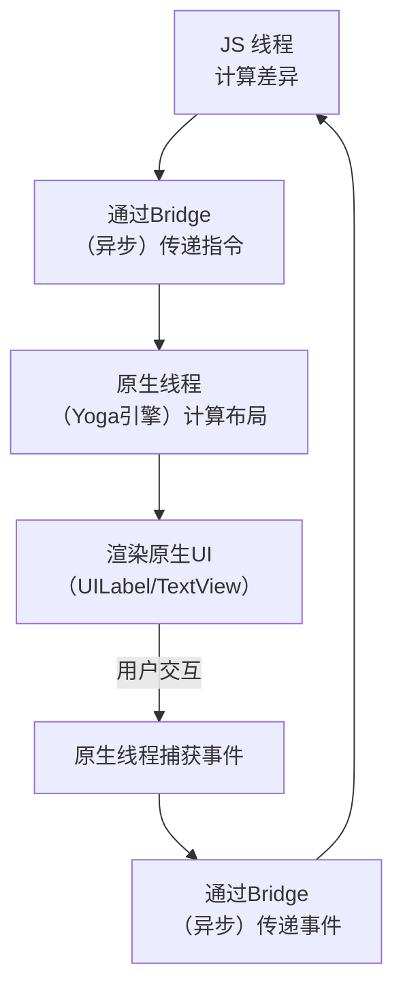

## 概念

**React Native（简称 RN）是一个让你能够使用 JavaScript 和 React 来构建真正原生移动应用的框架。**

它的核心理念是：**“Learn once, write anywhere”**（学习一次，到处编写）。

---

### 一、核心本质：它不是 WebView，而是“原生组件”

要理解 React Native，首先要把它和其他的跨端方案区分开。

1.  **传统 WebView 方案（如 Cordova/PhoneGap）：**
    *   **原理：** 将网站（HTML、CSS、JS）打包到一个 App 的“浏览器外壳”（WebView）中运行。
    *   **缺点：** 性能较差，用户体验无法和原生 App 媲美，因为所有渲染都在一个内嵌浏览器中完成。

2.  **React Native 方案：**
    *   **原理：** JavaScript 代码编写的业务逻辑在独立的线程（JS线程）中运行。当需要更新界面时，RN 会将虚拟 DOM 的变更描述（我们称之为“影子树”）通过一个**桥接（Bridge）** 通信机制传递给主线程（UI线程）。
    *   **关键：** 主线程接收到指令后，会调用平台**原生的 UI 组件**（iOS 的 `UIButton`，Android 的 `Button`）进行渲染。
    *   **结果：** 你最终看到和交互的，是真正的原生按钮、原生列表、原生视图，而不是一个模仿原生样式的网页元素。这带来了近乎原生的性能和体验。

---

### 二、与 uni-app 的对比

为了让你更好地理解，我们来对比一下你刚了解的 uni-app：

| 特性             | React Native                                  | uni-app                                                      |
| :--------------- | :-------------------------------------------- | :----------------------------------------------------------- |
| **核心语法**     | **React** + JavaScript/TypeScript             | **Vue** + JavaScript/TypeScript                              |
| **UI 组件**      | 编译为**原生组件**（iOS/Android）             | 编译为**原生组件（App端）** / **小程序组件** / **Web标签**   |
| **技术背景**     | Facebook（现 Meta）开源                       | 中国数字天堂（DCloud）推出                                   |
| **主要目标平台** | **iOS 和 Android**                            | **全端**（App、H5、小程序，尤其是国内小程序）                |
| **渲染方式**     | JS 线程与原生 UI 线程通过 **Bridge 异步通信** | App 端使用自研的**原生渲染引擎**，小程序端直接编译为目标平台代码 |
| **生态与社区**   | **全球社区**，非常活跃，大量第三方库          | **中文社区**为主，与国内生态（如微信小程序）结合紧密         |
| **开发体验**     | 更贴近原生开发，需要处理不同平台的细微差异    | 更强调**一致性**，一套代码尽量覆盖多端，条件编译处理差异     |

---

### 三、工作原理简图

```
你的 JavaScript 代码 (React 组件)
         |
         V
React Native 框架 (JS 运行时环境)
         |
         V
    "桥接 (Bridge)"
    (异步序列化通信)
         |
         V
原生平台 (iOS/Android)
         |
         V
渲染为真正的原生 UI 组件
```

**注意：** 这个“桥接”机制虽然是 RN 强大之处，但也曾是性能瓶颈（例如快速滚动时 JS 线程和原生线程通信可能成为瓶颈）。新架构（Fabric）致力于通过允许同步通信和更直接的控制来解决这个问题。

---

### 四、优势和劣势

#### 优势：
1.  **原生体验与性能：** 由于使用原生组件，其观感和流畅度远胜于 WebView 应用。
2.  **热重载与快速迭代：** 修改代码后可以立即看到效果，无需重新编译整个应用，大大提升了开发效率。
3.  **跨平台共享代码：** 大部分业务逻辑可以共享，显著降低开发和维护两个独立原生应用的成本。
4.  **强大的社区和生态：** 拥有海量的第三方库和解决方案，遇到问题容易找到答案。
5.  **背靠 Facebook：** 被 Meta 用于其核心应用（如 Facebook、Instagram），有长期支持和持续发展保障。

#### 劣势：
1.  **调试复杂度：** 有时需要深入原生层面进行调试，对开发者的要求更高（需要了解一些原生知识）。
2.  **包体积较大：** 即使是一个简单的 App，也会包含整个 RN 运行时，导致安装包比纯原生应用大。
3.  **“桥接”的历史瓶颈：** 在老架构下，复杂的 UI 交互有时会因通信延迟而卡顿（新架构已大幅改善）。
4.  **版本升级可能带来挑战：** 不同版本间可能存在破坏性变更，升级时需要工作量。

### 总结

**React Native 是一个利用 Web 技术（React）来驱动原生 UI 渲染的移动应用开发框架。** 它在开发效率、跨平台能力和原生性能之间取得了极佳的平衡。

如果你是一个熟悉 React 的 Web 开发者，并希望进入移动应用开发领域，React Native 是一个非常自然且强大的选择。它与 uni-app 的选择，往往取决于你的技术栈偏好（React vs Vue）和目标平台重心（全球市场的 iOS/Android vs 国内市场的全端尤其是小程序）。


## 运行原理

React Native 的核心思想是：**用 JavaScript 编写业务逻辑，然后控制原生界面进行渲染。**

它的运行架构可以概括为以下几个关键部分和流程：

---

### 一、核心架构：双线程 + 桥接（Bridge）

React Native 应用运行时，主要包含三个部分：

1.  **JavaScript 线程（JS 线程）**：
    *   **职责**：在这里运行你的 JavaScript 代码（包括 React 组件、业务逻辑等）。
    *   **环境**：运行在一个独立的 **JavaScript 引擎** 中（在 iOS 上是自带的 JavaScriptCore，在 Android 上默认也是 JavaScriptCore，也可以配置为 Google 的 V8）。
    *   **任务**：处理业务逻辑、计算布局、发送指令告诉原生端该做什么。

2.  **原生（UI）线程（Main/UI 线程）**：
    *   **职责**：负责原生 UI 的渲染和用户交互。
    *   **任务**：接收来自 JS 线程的指令，创建和渲染真正的原生组件（如 `UIView`、`TextView`）。同时，它也负责监听用户的操作（如触摸、滑动）。

3.  **桥接（Bridge）**：
    *   **职责**：这是 **最核心** 的部分，它是连接 JS 线程和原生线程的**异步通信通道**。
    *   **工作方式**：**异步、批处理、序列化**。JS 线程和原生线程不能直接调用对方的方法，它们只能通过 Bridge 相互发送消息（JSON 格式的序列化数据）。

---

### 二、详细工作流程（以渲染一个界面为例）

让我们通过一个具体的例子，看看 `<Text>Hello, World!</Text>` 是如何显示在屏幕上的。

#### 步骤 1：JS 线程计算布局（Virtual DOM 差异）

1.  你的 React 组件代码在 JS 线程中执行。
2.  React 会创建和维护一个**虚拟 DOM**，这是一个用 JavaScript 对象描述的 UI 结构树。
3.  当状态（state）或属性（props）发生变化时，React 会计算出新的虚拟 DOM 树，并与旧的树进行对比（Diffing），找出需要更新的最小部分。
4.  这个“更新指令”被序列化成一个 JSON 消息，它描述了“需要创建什么视图”、“样式是什么”、“视图层级关系如何”。

#### 步骤 2：通过 Bridge 传递指令

5.  计算出的 UI 更新指令（JSON 数据）通过 **Bridge** 从 JS 线程发送到原生（UI）线程。
    *   **注意**：这个通信是**异步**的。JS 线程发送消息后不会等待原生线程的响应，而是继续执行后面的 JavaScript 代码。这保证了 JS 线程不会被阻塞。

#### 步骤 3：原生线程渲染真实 UI

6.  原生（UI）线程接收到来自 Bridge 的指令。
7.  原生端有一个对应的**阴影树（Shadow Tree）**，它是由**瑜伽（Yoga）布局引擎**维护的。Yoga 会根据 JS 线程传过来的样式信息（如 `flex: 1`）计算出每个视图元素的**精确位置和大小**。
8.  计算好布局后，原生线程会调用 iOS 的 Objective-C/Swift 或 Android 的 Java/Kotlin 的 API，来创建或更新对应的**真实原生视图**（如 iOS 的 `UILabel`，Android 的 `TextView`），并将其显示在屏幕上。

#### 步骤 4：用户交互与事件回馈

9.  当用户触摸屏幕时：
    *   原生（UI）线程首先捕获到这个触摸事件。
    *   原生线程将这个事件信息（如坐标、事件类型）通过 **Bridge** 反向发送给 JS 线程。
10. JS 线程接收到事件信息后，根据坐标判断是哪个 React 组件应该响应，然后执行你在组件中定义的事件处理函数（如 `onPress`）。

这个过程可以总结为下图所示的循环：



---

### 三、旧架构的瓶颈与新架构（Fabric）的革新

上面描述的基于“Bridge”的架构是 RN 长期使用的旧架构，它有两个主要瓶颈：

1.  **异步通信延迟**：由于通信是异步的，快速连续的 UI 更新（如高速滚动列表）可能导致 JS 线程和原生线程不同步，造成卡顿。
2.  **序列化开销**：数据在通过 Bridge 传递前需要被序列化为 JSON，这有性能开销。

为了解决这些问题，Facebook 推出了**新架构**（主要组成部分是 **Fabric** 和 **TurboModules**）：

*   **Fabric（新的渲染系统）**：
    *   **允许同步操作**：UI 管理器现在可以被 JS 线程同步调用，消除了通信延迟，使渲染更快。
    *   **直接挂载**：新的渲染器允许将 Shadow Tree 直接挂载到原生视图上，减少了序列化步骤。
*   **TurboModules（新的原生模块系统）**：
    *   惰性加载原生模块，启动更快，并且提供了更强类型的 JS 到原生的调用。

**新架构的核心目标是让 JS 和原生世界的交互更直接、更高效。**

### 总结

React Native 的运行原理可以精炼为：

*   **双线程模型**：JS 线程负责逻辑，原生线程负责渲染，二者隔离保证了 JS 的卡顿不会导致 UI 掉帧。
*   **桥接通信**：通过一个异步、序列化的 Bridge 进行指令和数据的传递。（旧架构的核心）
*   **原生渲染**：最终渲染的是平台原生的 UI 组件，这是其体验优于 WebView 方案的根本原因。
*   **持续演进**：新架构（Fabric）通过允许同步通信和更紧密的集成，正在解决旧架构的瓶颈，迈向更高的性能巅峰。

理解这个原理，有助于你写出性能更好的 RN 应用，并能更深入地理解其优势和局限性。


## 开发环境配置

>提示：在 `Ubuntu22.04.5` 上配置开发环境。
>
>`todo` 未成功运行 `demo`。

安装 `Node v20.19.5`

```sh
sudo dcli nodejs install
```

搭建 `Android Studio` 开发环境参考本站 [链接](/android/README.html#ubuntu22-04-5)

创建 `demorn1` 项目

```sh
npx @react-native-community/cli init demorn1 --version 0.72.0
```

- `--version 0.72.0` 表示 `React Native` 版本为 `0.72.0`。

导出 `ANDROID_HOME` 环境变量

```sh
export ANDROID_HOME=/home/dexterleslie/Android/Sdk
```

使用 `Android` 模拟器运行项目

```sh
npx react-native run-android
```

