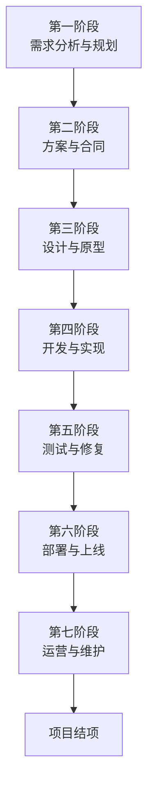

## 乙方给甲方开发软件

在一个典型的“乙方给甲方开发软件”的场景中，一个完整、规范的软件开发流程可以确保项目顺利交付，并满足甲方的需求。这个流程是甲乙双方协同工作的蓝图。

以下是详细的完整流程，您可以将其视为一个项目从零到上线运营的全景图：

---

### **第一阶段：需求分析与规划**

这是项目的基石，至关重要。

1.  **需求对接会议**：乙方的产品经理和项目经理与甲方的业务负责人多次开会，深入理解甲方的**业务背景、目标用户、要解决的核心问题**。
2.  **撰写需求文档**：乙方产品经理将模糊的需求转化为清晰的、结构化的**产品需求文档**。这份文档是后续所有工作的依据。
3.  **功能列表梳理**：共同确定软件需要包含哪些具体功能（例如：用户注册登录、支付功能、后台管理等），并排出优先级。
4.  **项目规划**：乙方项目经理制定**项目计划**，包括时间安排、人员配置、成本预算和潜在风险评估。

**产出物**：产品需求文档、项目计划书、功能列表。

---

### **第二阶段：方案设计与报价**

1.  **技术方案设计**：乙方的架构师和技术负责人会设计技术选型（如用Java还是Go，用MySQL还是MongoDB，服务器选型等）。
2.  **项目报价**：乙方根据需求复杂度和人力投入，向甲方提供详细的报价单。通常包括：
    *   人力成本（产品经理、UI设计师、前端/后端/测试工程师等）
    *   软件/硬件成本（服务器、域名、第三方服务授权等）
3.  **签订合同**：双方就价格、工期、功能范围、付款方式（如按里程碑付款）、售后支持等细节达成一致，并签订正式合同。

**产出物**：技术方案建议书、项目报价单、正式合同。

---

### **第三阶段：UI/UX设计与原型**

1.  **制作原型图**：产品经理或设计师使用Axure、Figma等工具制作可点击的**软件原型**。它就像房子的“施工图”，展示了软件的页面结构、交互逻辑，但没有视觉效果。甲方确认原型后，开发方向就基本确定了。
2.  **UI视觉设计**：UI设计师根据原型和甲方的品牌风格（VI）进行美化设计，产出高保真效果图，确定所有页面的颜色、字体、间距等。
3.  **设计评审**：乙方向甲方展示设计稿，并根据反馈进行修改，直到甲方确认。

**产出物**：交互原型图、UI高保真设计稿、设计规范文档。

---

### **第四阶段：开发与实现**

这是代码编写的阶段，通常分为前后端并行开发。

1.  **项目启动会**：开发工作正式开始，乙方团队所有成员（开发、测试等）参会，明确分工。
2.  **前端开发**：前端工程师根据UI设计稿，编写代码，实现用户能看到和交互的界面。技术栈包括Vue、React等。
3.  **后端开发**：后端工程师编写服务器、数据库和业务逻辑代码，为前端提供数据接口。技术栈包括Java、Python、Go等。
4.  **接口联调**：前后端开发完成后，双方进行数据对接，确保前端能正确显示后端返回的数据。

**产出物**：可运行的测试版软件、接口文档。

---

### **第五阶段：测试与修复**

确保软件质量的关键环节。

1.  **测试用例编写**：测试工程师根据需求文档编写详细的测试计划和用例。
2.  **功能测试**：检查每个功能是否按需求正常工作。
3.  **性能测试**：测试软件在多用户同时访问下的稳定性和响应速度。
4.  **兼容性测试**：测试在不同浏览器、不同尺寸设备上的表现。
5.  **Bug修复**：测试人员将发现的Bug提交给开发人员，开发人员修复后再次测试，直到所有严重问题都被解决。

**产出物**：测试报告、Bug清单。

---

### **第六阶段：部署、上线与培训**

1.  **部署上线**：运维工程师将代码部署到甲方指定的生产服务器（如阿里云、腾讯云），配置域名和SSL证书，让所有用户都能通过互联网访问。
2.  **验收测试**：甲方根据最初的需求文档，对正式环境的软件进行最终验收。确认无误后，签署**项目验收单**。这通常是支付尾款的标志。
3.  **文档与培训**：乙方向甲方交付所有相关文档（如架构文档、操作手册、数据库设计文档等），并对甲方的管理员进行系统操作培训。

**产出物**：上线可用的软件系统、项目验收单、各类技术文档。

---

### **第七阶段：运营与维护**

项目上线并不意味着结束。

1.  **售后技术支持**：乙方在合同约定的保修期内，负责解决线上出现的问题和Bug。
2.  **系统运维保障**：确保服务器稳定运行，数据安全。
3.  **需求变更与迭代**：甲方在使用过程中可能会产生新需求。双方可以协商签订新的维护合同或二期开发合同，进入新一轮的开发流程。

**产出物**：运维报告、迭代版本。

这个流程体现了软件开发的复杂性和系统性。一个专业的乙方会严格遵循此流程，确保项目在**预算内按时交付高质量的产品**，而甲方清晰了解每个阶段的进展，从而最大程度降低项目风险。