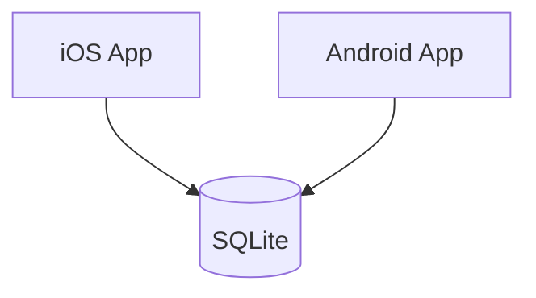

## 1、《XXX框架》技术方案建议书

>说明：技术方案建议书主要面向技术团队、架构师和决策者，它从技术视角回答 “用什么做？系统如何构建？” 的问题。

项目名称：《XXX框架》

技术负责人：陈十一（架构师）

创建日期：2023-11-20

评审人员：后端、前端开发负责人

## 2、概述

### 2.1、目的

本文档旨在定义《XXX框架》技术实现方案，包括系统架构、技术选型、数据模型、接口设计等。它为开发团队提供明确的技术实施蓝图，并确保技术决策与产品目标（快速、离线、简洁）保持一致。

### 2.2、设计原则

mvp最小化：V1.0聚焦核心功能，采用简单直接的技术方案，快速验证市场。

性能与体验：确保应用启动快、编辑流畅，这是产品的核心价值。

可维护性：代码结构清晰，便于后续迭代和团队协作。

## 3、系统架构

### 3.1、整体架构



说明：V1.0采用简单的纯客户端架构。iOS和Android应用作为独立的客户端，直接操作设备本地的SQLite数据库。无服务端交互。

### 3.2、客户端架构

```mermaid
graph TD
    UI[UI Layer (Activity/Fragment)] --> ViewModel;
    ViewModel --> UseCase1[Use Case: 创建笔记];
    ViewModel --> UseCase2[Use Case: 获取笔记列表];
    UseCase1 --> Repo[(Repository接口)];
    UseCase2 --> Repo;
    Repo --> LocalDS[Local Data Source];
    LocalDS --> SQLite[SQLite DB (Room)];
    Repo --> Models[实体模型: Note, Notebook];
```

说明：以Android端为例，采用Clean Architecture + MVVM。

### 3.3、服务器端架构

```mermaid

```

## 4、技术栈选型

### 4.1、iOS端

| 组件                                   | 说明                                                         |
| -------------------------------------- | ------------------------------------------------------------ |
| 语言：Swift                            | SwiftUI声明式UI开发高效，与Swift语言结合紧密。Core Data是Apple官方框架，生态成熟。 |
| UI框架：SwiftUI                        |                                                              |
| 本地存储：Core Data/SQLite.swift       |                                                              |
| Markdown渲染：Down                     | 避免重复造轮子，使用经过验证的、轻量级的开源库，保证渲染准确性和性能。 |
| 依赖管理：Swift Package Manager（SPM） | 平台官方推荐，管理方便，集成度高。                           |

### 4.2、Android端

| 组件                             | 说明                                                         |
| -------------------------------- | ------------------------------------------------------------ |
| 语言：Kotlin                     | Kotlin为Android首选语言，Jetpack Compose为现代声明式UI框架。Room是SQLite的优秀封装，极大简化数据库操作。 |
| UI框架：Jetpack Compose          |                                                              |
| 本地存储：Room DB（SQLite封装）  |                                                              |
| Markdown渲染：CommonMark         | 避免重复造轮子，使用经过验证的、轻量级的开源库，保证渲染准确性和性能。 |
| 依赖管理：Gradle with Kotlin DSL | 平台官方推荐，管理方便，集成度高。                           |

### 4.3、服务器端

| 组件                       | 说明                   |
| -------------------------- | ---------------------- |
| 开发框架：SpringBoot2.7.18 | Java应用开发主流框架。 |
| 数据库：MySQL8.0.18        |                        |

## 5、详细设计

### 5.1、iOS端设计

#### 5.1.1、架构设计

#### 5.1.2、数据库设计

```mermaid
erDiagram
    NOTEBOOK {
        string id PK "主键"
        string name "笔记本名称"
        datetime created_at "创建时间"
    }
    NOTE {
        string id PK "主键"
        string title "笔记标题"
        string content "Markdown内容"
        string notebook_id FK "关联的笔记本ID"
        datetime created_at "创建时间"
        datetime updated_at "最后修改时间"
    }
    NOTEBOOK ||--o{ NOTE : contains
```

NOTEBOOK表说明：

- id为自增唯一主键。
- name为笔记本名称。

NOTE表说明：

- id为自增唯一主键。
- title为笔记标题。

### 5.2、Android端

#### 5.2.1、架构设计

#### 5.2.2、数据库设计

### 5.3、服务器端

#### 5.3.1、架构设计

#### 5.3.2、数据库设计

#### 5.3.3、接口设计
