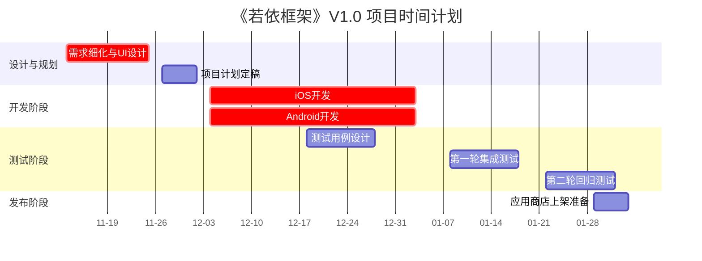

## 1、《若依框架》项目计划书

>说明：描述如何以及何时完成。项目计划书是面向项目团队、管理层和客户的综合性文件，旨在规划项目的执行路径。

项目名称：若依框架

项目经理：李四

创建日期：2023-11-10

最后更新：2023-11-17

## 2、项目概述

### 2.1、项目简介

若依框架是为企业级快速开发而设计的框架，具备 。。。等功能基础功能。

### 2.2、项目目标

在12周（约3个月） 的时间内，完成从详细设计到应用商店上线的全部工作，成功发布一个功能稳定、用户体验流畅的MVP版本。项目总预算控制在人民币XX万元以内，按时交付。

## 3、团队组成与职责

| 角色              | 成员 | 主要职责                                     |
| ----------------- | ---- | -------------------------------------------- |
| 项目经理          | 李四 | 项目规划、进度跟踪、风险管控、资源协调       |
| 产品经理          | 张三 | 需求澄清、优先级判定、验收产品功能           |
| UI/UX设计师       | 王五 | 高保真UI设计、交互原型、设计规范输出         |
| iOS开发工程师     | 赵六 | iOS端功能开发、单元测试、App Store上架       |
| Android开发工程师 | 孙七 | Android端功能开发、单元测试、Google Play上架 |
| 测试工程师        | 周八 | 编写测试用例、执行功能/性能/兼容性测试       |

## 4、项目里程碑和时间计划

### 4.1、项目里程碑

| 里程碑                 | 计划日期   | 交付成果                           |
| ---------------------- | ---------- | ---------------------------------- |
| 详细设计与计划评审完成 | 2023-11-24 | 最终版UI设计稿、详细项目计划书     |
| 核心功能开发完成       | 2024-01-12 | 具备全部功能的Alpha内测包          |
| 测试与修复完成         | 2024-01-26 | 测试报告、达到发布标准的RC版       |
| 正式版发布上线         | 2024-02-02 | 应用在App Store和Google Play可下载 |

### 4.2、时间计划（甘特图）

## 5、资源与成本预算

| 资源类型     | 预算     | 备注                                                         |
| ------------ | -------- | ------------------------------------------------------------ |
| 人力资源成本 | ￥XXX    | 基于团队成员工时（人天）估算                                 |
| 软件工具成本 | ￥XXX/年 | 设计工具（Figma）、代码参考（GitHub）、项目管理（Jira）等年费 |
| 应用商店账号 | ￥XXX/年 | Apple开发者账号（￥99/年），Google Play一次性注册费（￥25）  |
| 总预算       | ￥XXX    |                                                              |

## 6、风险管理计划

| 风险描述                                           | 可能性 | 影响 | 风险级别 | 应对策略                                                     |
| -------------------------------------------------- | ------ | ---- | -------- | ------------------------------------------------------------ |
| 需求变更：在开发中期增加重大新需求                 | 中     | 高   | 高       | 规避/减轻：严格遵循变更控制流程，任何变更需产品经理和项目经理共同审批，并评估对进度和成本的影响。 |
| 技术难题：Markdown实时预览引擎在低端设备上性能不佳 | 中     | 中   | 中       | 减轻/转移：提前进行技术预研和原型验证；考虑采用成熟的第三方开源库以减低风险。 |
| 人员风险：核心开发人员病假或者离职                 | 低     | 高   | 中       | 减轻：建立良好的代码文档和知识共享机制；实行交叉培训，确保有后备人员能接替关键工作。 |
| 上架延迟：应用商店审核被拒                         | 中     | 中   | 中       | 减轻：提前详细阅读商店审核指南，进行严格的内部检查；预留至少1-2周的缓冲时间用于处理审核问题。 |

## 7、沟通管理计划

| 沟通内容      | 参与者                             | 频率/方式                        | 负责人     |
| ------------- | ---------------------------------- | -------------------------------- | ---------- |
| 项目站会      | 全体项目成员                       | 每个工作日，早上15分钟，线上会议 | 项目经理   |
| 周报          | 项目团队、管理层                   | 每周五下午，通过邮件发送         | 项目经理   |
| 迭代评审会    | 项目团队、利益相关者               | 每个开发迭代结束时（每两周）     | 产品经理   |
| 重大风险/问题 | 项目经理、相关成员、管理层（可选） | 即时沟通，必要时召开临时会议     | 问题发现者 |

