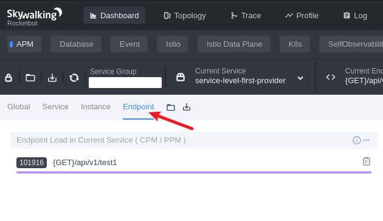

# `Skywalking`


## `Skywalking trace` 会记录所有请求吗？

SkyWalking 的追踪（Trace）**不会默认记录所有请求**，其记录行为主要由**采样策略**、**配置规则**和**插件支持**共同决定。以下是详细分析：


### 一、核心机制：采样策略决定记录范围
分布式追踪系统的核心挑战之一是**性能与监控的平衡**。若记录所有请求（100%采样），会导致：
- **性能开销**：每个请求生成 Span、传递追踪上下文（如 TraceID、SpanID）会增加 CPU、内存和网络消耗；
- **存储压力**：海量追踪数据会挤占存储资源（如 Elasticsearch、ClickHouse 等后端数据库）；
- **分析复杂度**：数据量过大可能导致查询延迟，难以快速定位问题。

因此，SkyWalking 采用**采样策略**选择性记录请求，默认不会记录所有请求。


### 二、SkyWalking 的采样策略类型
SkyWalking 支持多种采样策略，可通过配置灵活调整，常见策略包括：

#### 1. 概率采样（Probability Sampling）
- **原理**：基于随机数生成器，按设定比例（如 10%）决定是否记录请求。
- **配置方式**：通过 `skywalking-agent.config` 中的 `agent.sample_n_per_3_secs`（旧版本）或 `sampling.probability`（新版本，8.x+）控制。
  ```yaml
  # 示例：新版本（8.12+）配置概率采样（10%）
  sampling:
    probability: 0.1  # 10% 的请求被采样
  ```
- **特点**：简单易用，适合大多数场景，但无法保证精确的采样比例（受随机数影响）。


#### 2. 固定速率采样（Rate Limiting Sampling）
- **原理**：按固定速率（如每秒 100 次）记录请求，超出速率的请求被丢弃。
- **适用场景**：适用于流量波动大的场景，确保单位时间内的追踪数据量可控。
- **配置方式**（需结合插件或自定义实现）：  
  SkyWalking 原生未直接提供此策略，但可通过**自定义采样插件**或结合外部限流工具（如 Sentinel）间接实现。


#### 3. 全采样（100% Sampling）
- **原理**：强制记录所有符合规则的请求。
- **配置方式**：将采样率设为 `1.0`（概率采样）或关闭采样逻辑（不推荐）。
  ```yaml
  sampling:
    probability: 1.0  # 100% 采样（仅建议测试环境使用）
  ```
- **风险**：生产环境启用全采样可能导致性能骤降（如 Span 数量暴增、网络带宽占用过高）。


#### 4. 动态采样（Dynamic Sampling，SkyWalking 8.x+）
- **原理**：根据实时指标（如服务负载、错误率、QPS）自动调整采样率。例如：
  - 高负载时降低采样率，保护服务性能；
  - 错误率升高时提高采样率，捕获更多异常链路。
- **配置方式**：通过 `dynamic_sampling` 配置项定义规则。
  ```yaml
  dynamic_sampling:
    rules:
      - service: "order-service"  # 针对特定服务
        minSampleRate: 0.05       # 最低采样率 5%
        maxSampleRate: 0.3        # 最高采样率 30%
        condition: 
          errorRate: ">5%"        # 当错误率超过 5% 时触发
  ```
- **优势**：智能化平衡监控与性能，是生产环境的推荐策略。


### 三、影响记录范围的其他因素
除了采样策略，以下因素也可能导致部分请求未被记录：

#### 1. 插件覆盖范围
SkyWalking 通过**插件**拦截请求并生成追踪数据（如 HTTP、gRPC、MySQL、Redis 等）。若请求未被对应插件拦截（如自定义协议未开发插件），则不会生成 Trace。
- **示例**：Java 服务的 HTTP 请求由 `skywalking-plugin-httpclient-4.x` 或 `skywalking-plugin-spring-webmvc` 插件拦截；若服务使用未支持的 RPC 框架（如自研 RPC），需自定义插件才能追踪。


#### 2. 追踪上下文传递失败
分布式追踪依赖**追踪上下文（TraceID、SpanID）**在服务间传递。若传递失败（如 HTTP Header 未正确注入、RPC 调用未携带上下文），后续服务可能无法关联到父 Trace，导致 Trace 断裂或不完整。
- **常见原因**：
  - 网关/反向代理（如 Nginx）未正确传递 Header；
  - 跨语言服务（如 Java 调用 Go 服务）未实现上下文传递协议（如 gRPC 的 `grpc-trace-bin`）。


#### 3. 配置排除规则
可通过配置**排除特定服务、端点或接口**，使其不被采样。例如：
```yaml
# 排除所有 /health 检查接口的采样
agent:
  exclude:
    - "GET:/actuator/health"
    - "POST:/internal/health"
```


#### 4. 采样阈值限制
SkyWalking 支持设置**最大并发 Span 数**或**单服务最大 Trace 数**，超出阈值的请求会被丢弃，避免内存溢出。


### 四、如何验证请求是否被记录？
1. **查看 SkyWalking UI**：在 `Trace` 或 `Service` 拓扑页搜索请求的 TraceID，若存在则为已记录；
2. **检查日志**：SkyWalking Agent 日志（`skywalking-agent.log`）会输出采样决策（如 `Sampling decision: ACCEPTED` 或 `REJECTED`）；
3. **监控指标**：通过 SkyWalking 后端的 `meter` 或 `prometheus` 指标（如 `trace.segment.total`）统计实际记录的 Trace 数量。


### 总结
SkyWalking **默认不会记录所有请求**，而是通过采样策略（概率、动态等）选择性记录。若需记录所有请求，可通过配置 100% 采样实现，但需权衡性能与存储成本。实际生产中，建议根据业务需求（如关键链路监控）结合动态采样策略，在监控覆盖率和系统性能间取得平衡。


## `Skywalking` 可以替代 `ELK` 作为应用的日志系统吗？

SkyWalking **不能完全替代ELK作为应用的日志系统**，但两者在定位、功能和适用场景上存在显著差异。是否选择替代需结合具体需求，以下是详细分析：


### 一、核心定位差异
| **维度**     | **SkyWalking**                                       | **ELK（Elasticsearch+Logstash+Kibana）**     |
| ------------ | ---------------------------------------------------- | -------------------------------------------- |
| **核心目标** | 分布式应用性能监控（APM）                            | 日志收集、存储、检索与分析                   |
| **数据类型** | 追踪数据（Trace）、指标（Metrics）、拓扑（Topology） | 日志（Logs）、事件（Events）                 |
| **核心能力** | 调用链追踪、服务依赖分析、性能瓶颈定位               | 全文搜索、日志可视化、多源日志聚合、历史回溯 |


### 二、SkyWalking的日志能力局限性
SkyWalking从**8.x版本**开始支持日志收集（Log Management），但本质是**APM能力的扩展**，而非专业日志系统，主要局限性如下：

#### 1. 日志采集深度不足
- **仅支持关联Trace的日志**：SkyWalking的日志功能依赖Agent（如Java Agent）通过`log4j2`/`logback`插件自动注入TraceID、SpanID到日志中，实现日志与Trace的关联。但无法采集**无Trace关联的独立日志**（如系统日志、第三方服务日志）。
- **日志解析能力弱**：SkyWalking默认仅提取日志中的TraceID/SpanID，无法像ELK的Logstash那样通过**Grok模式**或**正则表达式**灵活解析日志内容（如提取请求参数、错误码、用户ID等业务字段）。


#### 2. 日志存储与检索能力有限
- **存储依赖OAP**：SkyWalking的日志数据存储在其自研的OAP（Observability Analysis Platform）中，存储模型针对Trace优化，缺乏ELK的Elasticsearch在日志存储上的灵活性（如冷热数据分层、索引生命周期管理）。
- **检索功能单一**：SkyWalking UI的日志检索仅支持基于TraceID、时间范围的简单过滤，无法实现ELK的**全文搜索**（如搜索“ERROR”关键字）、**多条件组合查询**（如“service=A AND level=ERROR AND time>2024-01-01”）或**模糊匹配**（如通配符、正则）。


#### 3. 日志分析与可视化能力不足
- **缺乏日志上下文**：ELK可通过Kibana的仪表盘（Dashboard）将日志与业务指标（如QPS、错误率）结合分析，而SkyWalking的日志仅作为Trace的附属信息，难以独立进行趋势分析（如每日错误日志量增长）或容量规划。
- **无日志告警**：SkyWalking的告警主要针对性能指标（如服务响应时间超时），无法像ELK那样对日志内容（如出现“OutOfMemoryError”）设置实时告警。


### 三、ELK的不可替代性场景
ELK作为专业日志系统，在以下场景中**无法被SkyWalking替代**：

#### 1. 需求：详细的日志审计与追溯
- 场景：金融系统需要记录所有用户操作日志（如交易流水、权限变更），要求保留多年并支持精确检索（如“用户ID=12345在2024-07-01 10:00:00的操作记录”）。
- ELK优势：通过Logstash解析日志并存储到Elasticsearch，结合Kibana的`Kibana Discover`功能可实现毫秒级全文搜索，且Elasticsearch支持长期数据保留（通过索引滚动策略）。


#### 2. 需求：多源异构日志聚合
- 场景：混合云环境中，应用日志可能来自K8s Pod、物理机、第三方服务（如AWS CloudWatch、阿里云SLS），需要统一收集、清洗、展示。
- ELK优势：Logstash支持从文件、网络（TCP/UDP）、消息队列（如Kafka）等多种来源采集日志，并通过`grok`、`date`等过滤器清洗数据；Elasticsearch支持多租户隔离，满足不同团队日志隔离需求。


#### 3. 需求：日志驱动的业务分析
- 场景：电商大促期间需要分析用户行为日志（如页面访问路径、加购/下单转化率），结合业务指标（如GMV）优化运营策略。
- ELK优势：通过Kibana的`Visualize`和`Dashboard`功能，可将日志中的业务字段（如`page=product_detail`、`action=add_to_cart`）与ELK的`Metricbeat`采集的服务指标（如JVM内存、数据库QPS）结合，生成多维分析报表。


### 四、SkyWalking与ELK的互补场景
尽管SkyWalking无法替代ELK，但两者结合可形成更完整的可观测性体系：

#### 1. 场景：微服务应用的性能与日志联合分析
- 方案：
  - **SkyWalking**：负责追踪调用链（Trace），定位慢接口、服务间依赖问题；
  - **ELK**：负责收集各服务日志，通过关联TraceID快速定位具体报错日志（如“订单服务调用支付服务超时”的具体错误堆栈）。
- 优势：SkyWalking解决“哪里慢”，ELK解决“为什么慢”，两者结合提升问题排查效率。


#### 2. 场景：轻量级日志需求
- 若应用日志量较小（如日均10GB以下），且仅需关联Trace的日志，可使用SkyWalking的日志功能简化架构：
  - 通过SkyWalking Agent自动注入TraceID到日志；
  - 在SkyWalking UI直接查看日志与Trace的关联信息；
  - 无需部署ELK集群，降低运维成本。


### 五、总结
**SkyWalking不能替代ELK作为专业的日志系统**，其日志功能是APM能力的扩展，仅适用于轻量级、与Trace强关联的日志场景。ELK在日志采集深度、存储检索能力、分析与可视化方面仍具有不可替代的优势，尤其在需要详细日志审计、多源日志聚合或日志驱动业务分析的场景中。

**建议方案**：  
- 若核心需求是性能监控与调用链分析，优先选择SkyWalking；  
- 若需要完整的日志管理能力（如审计、多源聚合、深度检索），优先选择ELK；  
- 对于中大型系统，推荐两者结合使用，形成“APM+日志”的完整可观测性体系。


## `Endpoint Load in Current Service (CPM/PPM)` 说明



如上图所示，`Endpoint Load in Current Service (CPM/PPM)` 使用时段平均数算法运算得出 `101916`，所以在应用启动初期，此 `CPM` 不能正确地反映出实时的 `CPM`。


## `Spring Actuator` 替代 `Skywalking APM CPM` 功能说明

>`Spring Actuator + Prometheus` 可以替代 `Skywalking APM CPM` 功能。


## `SpringBoot` 应用集成

>详细用法请参考本站 [示例](https://gitee.com/dexterleslie/demonstration/tree/main/demo-skywalking/demo-with-zuul)

### 运行 `OAP` 服务

- `Dockerfile-elasticsearch`：

  ```dockerfile
  FROM elasticsearch:7.14.1
  
  # 在线安装ik分词器
  # https://www.cnblogs.com/szwdun/p/10664348.html
  RUN echo y | /usr/share/elasticsearch/bin/elasticsearch-plugin install https://fut001.oss-cn-hangzhou.aliyuncs.com/elasticsearch/elasticsearch-analysis-ik-7.14.1.zip
  
  # 安装拼音插件
  # https://github.com/medcl/elasticsearch-analysis-pinyin
  RUN /usr/share/elasticsearch/bin/elasticsearch-plugin install https://fut001.oss-cn-hangzhou.aliyuncs.com/elasticsearch/elasticsearch-analysis-pinyin-7.14.1.zip
  
  COPY entrypoint.sh /entrypoint.sh
  RUN chmod a+x /entrypoint.sh
  
  ENTRYPOINT ["/entrypoint.sh"]
  
  ```

- `entrypoint.sh`：

  ```sh
  #!/bin/bash
  
  set -e
  
  chmod -R g+w /usr/share/elasticsearch
  
  /bin/tini -- /usr/local/bin/docker-entrypoint.sh "eswrapper"
  ```

- `Docker Compose` 配置如下：

  ```yaml
  version: "3.0"
  
  services:
    demo-skywalking-elasticsearch:
      build:
        context: ./
        dockerfile: Dockerfile-elasticsearch
      image: registry.cn-hangzhou.aliyuncs.com/future-public/demo-skywalking-elasticsearch
      environment:
        - ES_JAVA_OPTS=-Xms512m -Xmx512m
        - discovery.type=single-node
        # http.cors表示允许elasticsearch-head连接并管理
        - http.cors.enabled=true
        - http.cors.allow-origin=*
        - TZ=Asia/Shanghai
  #    ports:
  #      - 9200:9200
  #      # Java transport client需要连接这个端口去操作elasticsearch
  #      - 9300:9300
  
    demo-skywalking-kibana:
      image: kibana:7.14.1
      environment:
        ELASTICSEARCH_HOSTS: http://demo-skywalking-elasticsearch:9200
      ports:
        - '5601:5601'
      depends_on:
        - demo-skywalking-elasticsearch
  
    demo-skywalking-oap-server:
      image: apache/skywalking-oap-server:8.7.0-es7
      environment:
        - SW_STORAGE=elasticsearch7
        - SW_STORAGE_ES_CLUSTER_NODES=demo-skywalking-elasticsearch:9200
        # trace日志保留15天
        - SW_STORAGE_ES_RECORD_DATA_TTL=15
        - TZ=Asia/Shanghai
      restart: always
      # 容器环境可以不暴露端口
      ports:
        - '12800:12800'
        - '11800:11800'
      depends_on:
        - demo-skywalking-elasticsearch
  
    demo-skywalking-ui:
      image: apache/skywalking-ui:8.7.0
      environment:
        - SW_OAP_ADDRESS=http://demo-skywalking-oap-server:12800
        - TZ=Asia/Shanghai
      ports:
        - '8088:8080'
      depends_on:
        - demo-skywalking-oap-server
  ```

### 配置  `SpringBoot` 应用集成 `Agent` 以支持 `APM` 监控

- `agent.config` 配置如下：

  ```properties
  # skywalking内置链路日志功能配置
  plugin.toolkit.log.grpc.reporter.server_host=${SW_GRPC_LOG_SERVER_HOST:demo-skywalking-oap-server}
  plugin.toolkit.log.grpc.reporter.server_port=${SW_GRPC_LOG_SERVER_PORT:11800}
  plugin.toolkit.log.grpc.reporter.max_message_size=${SW_GRPC_LOG_MAX_MESSAGE_SIZE:10485760}
  plugin.toolkit.log.grpc.reporter.upstream_timeout=${SW_GRPC_LOG_GRPC_UPSTREAM_TIMEOUT:30}
  
  # Licensed to the Apache Software Foundation (ASF) under one
  # or more contributor license agreements.  See the NOTICE file
  # distributed with this work for additional information
  # regarding copyright ownership.  The ASF licenses this file
  # to you under the Apache License, Version 2.0 (the
  # "License"); you may not use this file except in compliance
  # with the License.  You may obtain a copy of the License at
  #
  #     http://www.apache.org/licenses/LICENSE-2.0
  #
  # Unless required by applicable law or agreed to in writing, software
  # distributed under the License is distributed on an "AS IS" BASIS,
  # WITHOUT WARRANTIES OR CONDITIONS OF ANY KIND, either express or implied.
  # See the License for the specific language governing permissions and
  # limitations under the License.
  
  # The agent namespace
  # agent.namespace=${SW_AGENT_NAMESPACE:default-namespace}
  
  # The service name in UI
  agent.service_name=${SW_AGENT_NAME:service-zuul}
  
  agent.instance_name=${SW_AGENT_INSTANCE_NAME:}
  
  # The number of sampled traces per 3 seconds
  # Negative or zero means off, by default
  # agent.sample_n_per_3_secs=${SW_AGENT_SAMPLE:-1}
  
  # Authentication active is based on backend setting, see application.yml for more details.
  # agent.authentication = ${SW_AGENT_AUTHENTICATION:xxxx}
  
  # The max amount of spans in a single segment.
  # Through this config item, SkyWalking keep your application memory cost estimated.
  # agent.span_limit_per_segment=${SW_AGENT_SPAN_LIMIT:150}
  
  # If the operation name of the first span is included in this set, this segment should be ignored. Multiple values should be separated by `,`.
  # agent.ignore_suffix=${SW_AGENT_IGNORE_SUFFIX:.jpg,.jpeg,.js,.css,.png,.bmp,.gif,.ico,.mp3,.mp4,.html,.svg}
  
  # If true, SkyWalking agent will save all instrumented classes files in `/debugging` folder.
  # SkyWalking team may ask for these files in order to resolve compatible problem.
  # agent.is_open_debugging_class = ${SW_AGENT_OPEN_DEBUG:true}
  
  # If true, SkyWalking agent will cache all instrumented classes files to memory or disk files (decided by class cache mode),
  # allow other javaagent to enhance those classes that enhanced by SkyWalking agent.
  # agent.is_cache_enhanced_class = ${SW_AGENT_CACHE_CLASS:false}
  
  # The instrumented classes cache mode: MEMORY or FILE
  # MEMORY: cache class bytes to memory, if instrumented classes is too many or too large, it may take up more memory
  # FILE: cache class bytes in `/class-cache` folder, automatically clean up cached class files when the application exits
  # agent.class_cache_mode = ${SW_AGENT_CLASS_CACHE_MODE:MEMORY}
  
  # The operationName max length
  # Notice, in the current practice, we don't recommend the length over 190.
  # agent.operation_name_threshold=${SW_AGENT_OPERATION_NAME_THRESHOLD:150}
  
  # The agent use gRPC plain text in default.
  # If true, SkyWalking agent uses TLS even no CA file detected.
  # agent.force_tls=${SW_AGENT_FORCE_TLS:false}
  
  # If true, skywalking agent will enable profile when user create a new profile task. Otherwise disable profile.
  # profile.active=${SW_AGENT_PROFILE_ACTIVE:true}
  
  # Parallel monitor segment count
  # profile.max_parallel=${SW_AGENT_PROFILE_MAX_PARALLEL:5}
  
  # Max monitor segment time(minutes), if current segment monitor time out of limit, then stop it.
  # profile.max_duration=${SW_AGENT_PROFILE_DURATION:10}
  
  # Max dump thread stack depth
  # profile.dump_max_stack_depth=${SW_AGENT_PROFILE_DUMP_MAX_STACK_DEPTH:500}
  
  # Snapshot transport to backend buffer size
  # profile.snapshot_transport_buffer_size=${SW_AGENT_PROFILE_SNAPSHOT_TRANSPORT_BUFFER_SIZE:50}
  
  # Backend service addresses.
  collector.backend_service=${SW_AGENT_COLLECTOR_BACKEND_SERVICES:demo-skywalking-oap-server:11800}
  
  # Logging file_name
  logging.file_name=${SW_LOGGING_FILE_NAME:skywalking-api.log}
  
  # Logging level
  logging.level=${SW_LOGGING_LEVEL:INFO}
  
  # Logging dir
  # logging.dir=${SW_LOGGING_DIR:""}
  
  # Logging max_file_size, default: 300 * 1024 * 1024 = 314572800
  # logging.max_file_size=${SW_LOGGING_MAX_FILE_SIZE:314572800}
  
  # The max history log files. When rollover happened, if log files exceed this number,
  # then the oldest file will be delete. Negative or zero means off, by default.
  # logging.max_history_files=${SW_LOGGING_MAX_HISTORY_FILES:-1}
  
  # Listed exceptions would not be treated as an error. Because in some codes, the exception is being used as a way of controlling business flow.
  # Besides, the annotation named IgnoredException in the trace toolkit is another way to configure ignored exceptions.
  # statuscheck.ignored_exceptions=${SW_STATUSCHECK_IGNORED_EXCEPTIONS:}
  
  # The max recursive depth when checking the exception traced by the agent. Typically, we don't recommend setting this more than 10, which could cause a performance issue. Negative value and 0 would be ignored, which means all exceptions would make the span tagged in error status.
  # statuscheck.max_recursive_depth=${SW_STATUSCHECK_MAX_RECURSIVE_DEPTH:1}
  
  # Mount the specific folders of the plugins. Plugins in mounted folders would work.
  plugin.mount=${SW_MOUNT_FOLDERS:plugins,activations}
  
  # Exclude activated plugins
  # plugin.exclude_plugins=${SW_EXCLUDE_PLUGINS:}
  
  # If set to true, the parameters of the sql (typically java.sql.PreparedStatement) would be collected.
  # plugin.jdbc.trace_sql_parameters=${SW_JDBC_TRACE_SQL_PARAMETERS:false}
  
  # Kafka producer configuration
  # plugin.kafka.bootstrap_servers=${SW_KAFKA_BOOTSTRAP_SERVERS:localhost:9092}
  # if you want to set namespace. please make sure the OAP server has set it in Kafka fetcher module
  # plugin.kafka.namespace=${SW_KAFKA_NAMESPACE:""}
  
  # Match spring bean with regex expression for classname
  # plugin.springannotation.classname_match_regex=${SW_SPRINGANNOTATION_CLASSNAME_MATCH_REGEX:}
  
  ```

- `sources.list`：

  ```ini
  deb http://mirrors.aliyun.com/debian/ bullseye main non-free contrib
  deb-src http://mirrors.aliyun.com/debian/ bullseye main non-free contrib
  #deb http://mirrors.aliyun.com/debian-security bullseye/updates main
  #deb-src http://mirrors.aliyun.com/debian-security bullseye/updates main
  deb http://mirrors.aliyun.com/debian/ bullseye-updates main non-free contrib
  deb-src http://mirrors.aliyun.com/debian/ bullseye-updates main non-free contrib
  deb http://mirrors.aliyun.com/debian/ bullseye-backports main non-free contrib
  deb-src http://mirrors.aliyun.com/debian/ bullseye-backports main non-free contrib
  
  ```

- `SpringBoot` 应用启动时运行 `Agent`：

  ```dockerfile
  # 注意： 不能修改为8-jdk-slim，否则生成验证码时报错
  FROM openjdk:8-jre
  
  COPY ./sources.list /etc/apt/sources.list
  
  RUN apt-get update
  RUN apt-get install -y curl
  
  RUN curl --output /usr/share/apache-skywalking-apm-es7-8.7.0.tar.gz https://fut001.oss-cn-hangzhou.aliyuncs.com/skywalking/apache-skywalking-apm-es7-8.7.0.tar.gz
  RUN cd /usr/share/ && tar -xzf apache-skywalking-apm-es7-8.7.0.tar.gz
  
  RUN rm -f /usr/share/apache-skywalking-apm-bin-es7/agent/config/agent.config
  ADD agent.config /usr/share/apache-skywalking-apm-bin-es7/agent/config/agent.config
  
  ADD target/service-zuul.jar /usr/share/service-zuul.jar
  
  ENV JAVA_OPTS=""
  
  ENTRYPOINT java -javaagent:/usr/share/apache-skywalking-apm-bin-es7/agent/skywalking-agent.jar ${JAVA_OPTS} -jar /usr/share/service-zuul.jar --spring.profiles.active=prod
  ```

- `SpringBoot` 应用 `Docker Compose` 配置如下：

  ```yaml
  version: "3.0"
  
  services:
    demo-skywalking-service-eureka:
      build:
        context: ./service-eureka
        dockerfile: Dockerfile
      image: registry.cn-hangzhou.aliyuncs.com/future-public/demo-skywalking-service-eureka
      environment:
        - JAVA_OPTS=-Xms512m -Xmx512m
        - TZ=Asia/Shanghai
        - SW_AGENT_NAME=service-eureka
        - SW_AGENT_INSTANCE_NAME=service-eureka-instance-0
        - SW_AGENT_COLLECTOR_BACKEND_SERVICES=demo-skywalking-oap-server:11800
        - SW_GRPC_LOG_SERVER_HOST=demo-skywalking-oap-server
      ports:
        - '9999:9999'
      depends_on:
        - demo-skywalking-oap-server
  
    demo-skywalking-service-zuul:
      build:
        context: ./service-zuul
        dockerfile: Dockerfile
      image: registry.cn-hangzhou.aliyuncs.com/future-public/demo-skywalking-service-zuul
      environment:
        - JAVA_OPTS=-Xms512m -Xmx512m
        - TZ=Asia/Shanghai
        - eurekaServer=demo-skywalking-service-eureka
        - SW_AGENT_NAME=service-zuul
        - SW_AGENT_INSTANCE_NAME=service-zuul-instance-0
        - SW_AGENT_COLLECTOR_BACKEND_SERVICES=demo-skywalking-oap-server:11800
        - SW_GRPC_LOG_SERVER_HOST=demo-skywalking-oap-server
      ports:
        - '8080:8081'
      depends_on:
        - demo-skywalking-service-eureka
  
    demo-skywalking-service-level-first-provider:
      build:
        context: ./service-level-first-provider
        dockerfile: Dockerfile
      image: registry.cn-hangzhou.aliyuncs.com/future-public/demo-skywalking-service-level-first-provider
      environment:
        - JAVA_OPTS=-Xms512m -Xmx512m
        - TZ=Asia/Shanghai
        - eurekaServer=demo-skywalking-service-eureka
        - SW_AGENT_NAME=service-level-first-provider
        - SW_AGENT_INSTANCE_NAME=service-level-first-provider-instance-0
        - SW_AGENT_COLLECTOR_BACKEND_SERVICES=demo-skywalking-oap-server:11800
        - SW_GRPC_LOG_SERVER_HOST=demo-skywalking-oap-server
      depends_on:
        - demo-skywalking-service-eureka
  
    demo-skywalking-service-level-second-provider:
      build:
        context: ./service-level-second-provider
        dockerfile: Dockerfile
      image: registry.cn-hangzhou.aliyuncs.com/future-public/demo-skywalking-service-level-second-provider
      environment:
        - JAVA_OPTS=-Xms512m -Xmx512m
        - TZ=Asia/Shanghai
        - eurekaServer=demo-skywalking-service-eureka
        - SW_AGENT_NAME=service-level-second-provider
        - SW_AGENT_INSTANCE_NAME=service-level-second-provider-instance-0
        - SW_AGENT_COLLECTOR_BACKEND_SERVICES=demo-skywalking-oap-server:11800
        - SW_GRPC_LOG_SERVER_HOST=demo-skywalking-oap-server
      depends_on:
        - demo-skywalking-service-eureka
  
  ```


### 查看 `APM` 监控

使用 `wrk` 协助产生测试数据：

```sh
wrk -t8 -c64 -d150000s --latency --timeout 30 http://localhost:8080/api/v1/test1\?param1\=p1
```

访问 `Skywalking` 控制台 `http://localhost:8088/`，切换到 `Dashboard` > `APM` > `Endpoint` 功能以查看每个 `Endpoint` 对应的 `CPM` 指标。如图：


### 配置 `SpringBoot` 应用日志采集

- `POM` 添加下面依赖：

  ```xml
  <!-- skywalking 整合 logback -->
  <dependency>
      <groupId>org.apache.skywalking</groupId>
      <artifactId>apm-toolkit-logback-1.x</artifactId>
      <version>8.7.0</version>
  </dependency>
  <dependency>
      <groupId>org.apache.skywalking</groupId>
      <artifactId>apm-toolkit-trace</artifactId>
      <version>8.7.0</version>
  </dependency>
  ```

- `SpringBoot` 应用配置 `logback`，新增 `logback-spring.xml` 文件：

  ```xml
  <?xml version="1.0" encoding="UTF-8"?>
  <configuration debug="false">
      <include resource="org/springframework/boot/logging/logback/defaults.xml"/>
  
      <property resource="application.properties"/>
      <springProfile name="!prod">
          <property resource="application-dev.properties"/>
      </springProfile>
      <springProfile name="prod">
          <property resource="application-prod.properties"/>
      </springProfile>
  
      <appender name="console" class="ch.qos.logback.core.ConsoleAppender">
          <encoder>
              <pattern>${CONSOLE_LOG_PATTERN}</pattern>
              <charset>utf8</charset>
          </encoder>
      </appender>
  
      <appender name="grpc-log" class="org.apache.skywalking.apm.toolkit.log.logback.v1.x.log.GRPCLogClientAppender">
          <encoder class="ch.qos.logback.core.encoder.LayoutWrappingEncoder">
              <layout class="org.apache.skywalking.apm.toolkit.log.logback.v1.x.mdc.TraceIdMDCPatternLogbackLayout">
                  <Pattern>%msg%n</Pattern>
              </layout>
          </encoder>
      </appender>
  
      <root level="info">
          <appender-ref ref="grpc-log"/>
          <appender-ref ref="console"/>
      </root>
  
      <!--<logger name="org.springframework.beans" level="info"/>
      <logger name="org.springframework.core" level="info"/>
      <logger name="org.springframework.security" level="info"/>
      <logger name="org.springframework.cloud" level="info"/>
      <logger name="com.netflix" level="info"/>
      <logger name="org.apache.http" level="info"/>-->
  </configuration>
  ```


### 查看应用日志

访问 `Skywalking` 控制台 `http://localhost:8088/`，切换到 `Log` 功能以查看应用日志。如图：


或者切换到 `Trace` 功能，在左边导航栏中选中相应的请求，点击 `View Log` 按钮以查看请求对应的日志，如图：


### 请求响应头中返回 `x-request-id`

在请求响应头中返回 `x-request-id` 以便客户端记录请求 `id` 并作为调试跟踪的依据。

- 创建 `Spring` `GenericFilterBean`：

  ```java
  @Slf4j
  public class GenericFilterBeanFilter extends GenericFilterBean {
  
      @Override
      public void doFilter(ServletRequest servletRequest, ServletResponse servletResponse, FilterChain chain) throws IOException, ServletException {
          HttpServletRequest request = (HttpServletRequest) servletRequest;
          String uri=request.getRequestURI();
          log.debug("请求前uri={}", uri);
  
          String traceId = TraceContext.traceId();
          if (servletResponse instanceof HttpServletResponse) {
              ((HttpServletResponse)servletResponse).addHeader("x-request-id", traceId);
          }
  
          chain.doFilter(servletRequest, servletResponse);
      }
  
  }
  ```

- 注册 `Bean`：

  ```java
  @Configuration
  @EnableWebSecurity
  public class ConfigSpringSecurity extends WebSecurityConfigurerAdapter {
  
      ...
  
      @Bean
      GenericFilterBean genericFilterBeanFilter() {
          return new GenericFilterBeanFilter();
      }
  }
  ```

  
