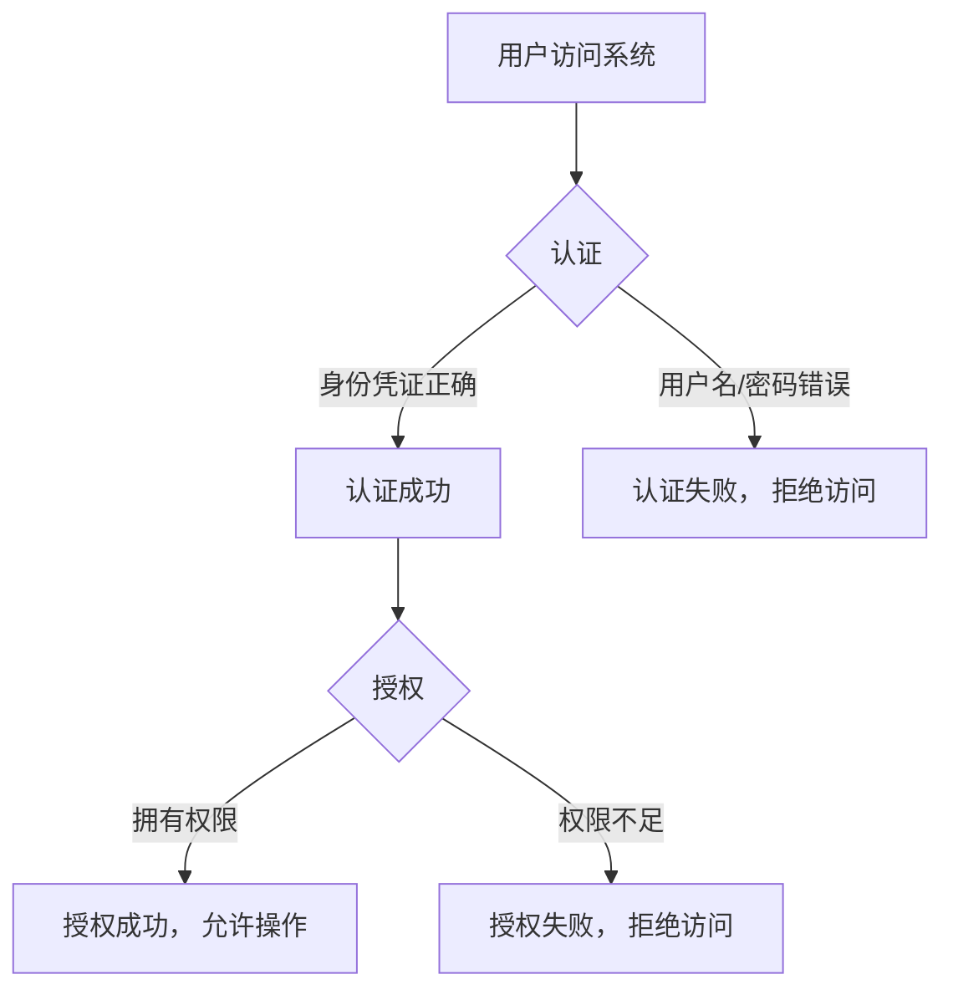
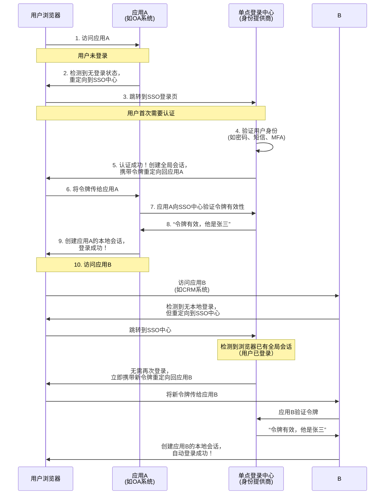
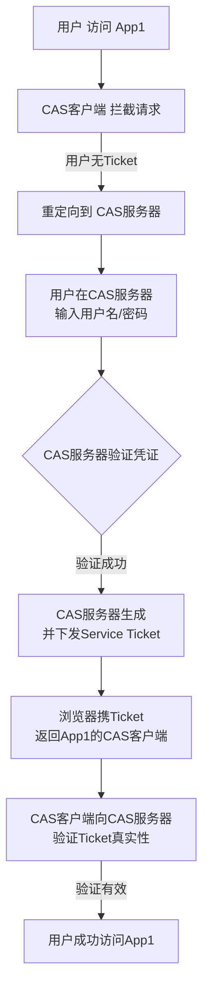
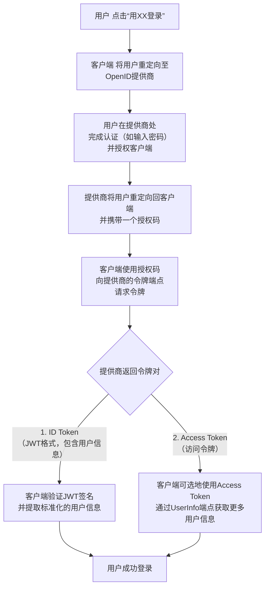
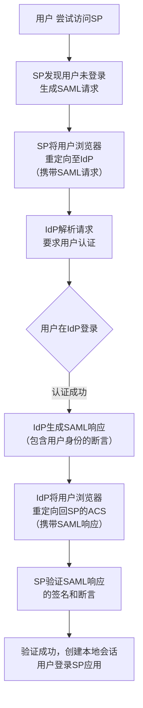
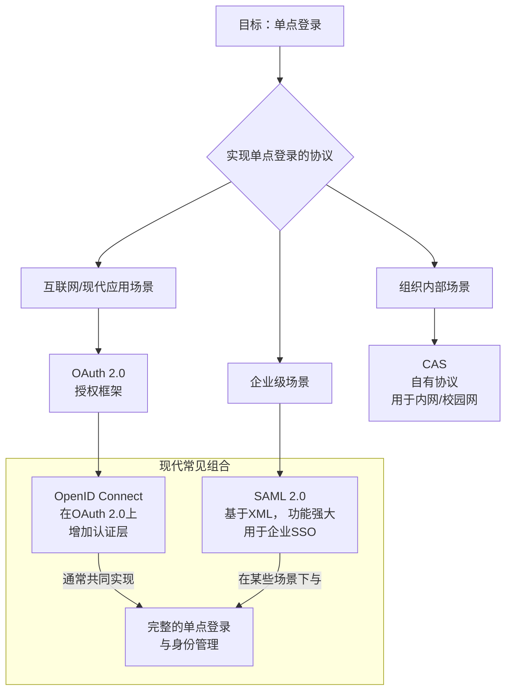

## 认证和授权的区别

我用一个最经典的比喻来帮你彻底理解：

**想象一下你进入一家公司大楼。**

*   **认证** 是前台保安检查你的**工牌**。他需要确认 **“你是谁？”**（Are you who you say you are?）。他的目的是验证你的身份。
    *   结果：保安确认了你是公司员工张三。

*   **授权** 是保安确认你的身份后，根据你的**权限**，决定你**能去哪里**。他需要回答 **“你能做什么？”**（What are you allowed to do?）。
    *   结果：张三，你是普通员工，可以进入办公区，但**不能**进入总裁办公室或机房。

---

### 对比表格

| 方面           | 认证                                    | 授权                                          |
| :------------- | :-------------------------------------- | :-------------------------------------------- |
| **核心问题**   | 你是谁？                                | 你能做什么？                                  |
| **目的**       | 验证用户身份的真实性                    | 检查用户是否有执行操作的权限                  |
| **过程**       | 在授权之前进行                          | 在认证成功之后进行                            |
| **控制对象**   | 整个系统/应用程序的访问入口             | 系统内部的具体功能、数据、API                 |
| **实现方式**   | 用户名/密码、短信验证码、指纹、人脸识别 | 权限列表（ACL）、角色（如管理员、用户）、策略 |
| **传输的信息** | 用户的身份凭证                          | 用户的权限信息                                |
| **类比**       | 出示护照或身份证                        | 检查签证类型（旅游签不能工作）                |

---

### 技术世界中的具体例子

让我们结合一个现实应用场景，比如 **GitHub**。

1.  **认证**：
    *   你在登录页面输入你的**用户名和密码**（或者使用 SSH 密钥）。
    *   GitHub 检查凭证是否正确。正确，则证明你是合法的用户 “zhangsan”。
    *   **这就是认证。** 它建立了你的身份。

2.  **授权**：
    *   登录后，你尝试访问一个叫 `awesome-project` 的私有仓库。
    *   在让你进入仓库之前，GitHub 会检查：
        *   你是这个仓库的**拥有者**吗？
        *   你是被**协作者**吗？
        *   你所属的**团队**是否有访问权限？
    *   根据检查结果，GitHub 决定是**允许**你访问（读/写）还是**拒绝**。
    *   **这就是授权。** 它决定了你被允许执行的操作。

再举一个更细粒度的例子：
*   **认证成功**：你证明了你是员工张三。
*   **授权检查**：
    *   张三想**访问**财务数据？ → **被拒绝**（因为他不是财务人员）。
    *   张三想**删除**公司官网的文章？ → **被拒绝**（因为他不是管理员）。
    *   张三想**提交**代码到代码库？ → **被允许**（因为他是开发人员）。

---

### 流程关系

它们是一个严格的先后顺序，可以用下图清晰地展示：



1.  **先认证，后授权**。没有成功的认证，根本谈不上授权。
2.  **认证成功不意味着授权成功**。你成功登录了系统（认证成功），但系统可能因为你权限不足而拒绝你访问某个功能（授权失败）。

---

### 如何记住？

一个非常简单的记忆口诀：

> **认证认身份，授权授权力。**

*   **认证** - 认识、确认身份。
*   **授权** - 授予、赋予权力。

### 总结

| 概念               | 英文      | 中文口诀         | 核心     |
| :----------------- | :-------- | :--------------- | :------- |
| **Authentication** | **AuthN** | **你是谁？**     | 验证身份 |
| **Authorization**  | **AuthZ** | **你能做什么？** | 检查权限 |

在谈论系统安全时，这是两个必须清晰区分的基石概念。几乎所有现代安全协议（如 OAuth 2.0、OpenID Connect）都是围绕这两者构建的。

## 单点登录概念

### 核心定义

**单点登录** 的英文是 **Single Sign-On**，简称 **SSO**。

它的核心思想是：**用户只需在一个核心系统（称为“身份提供商”）上登录一次，就可以获得访问所有其他相互信任的系统（称为“服务提供商”）的权限，而无需再次输入用户名和密码。**

---

### 生动的比喻：公司大楼和所有办公室的通用门禁卡

想象一下你在一栋大型办公楼里工作，楼里有：

*   **主大门**
*   **你的办公室**
*   **健身房**
*   **食堂**
*   **机密档案室**

**没有单点登录（传统登录方式）的情景：**

1.  你进入**主大门**，需要刷一次工牌。
2.  你走到**你的办公室**门口，需要再刷一次工牌，甚至输入密码。
3.  中午去**食堂**，食堂大妈说：“出示一下工牌，然后再输一下食堂的专用密码。”
4.  下班去**健身房**，保安说：“工牌我看一下，另外我们健身房的门铃密码是多少？”

你会疯掉的，因为你每去一个地方都要重复证明“我是我”。

**有单点登录的情景：**

1.  早上你进入**主大门**时，**前台保安（身份提供商）** 仔细检查了你的工牌，确认你是本公司合法员工张三。
2.  之后，你去**办公室、食堂、健身房**，这些地方的保安**都信任主大门保安的认证结果**。他们看到你从主大门进来，就直接让你通行，不再二次检查。

**在这个比喻中：**

*   **你**：用户
*   **主大门的前台保安**：**身份提供商**（例如公司的统一认证中心）
*   **办公室、食堂、健身房**：**服务提供商**（例如公司内部的各种应用系统：OA、CRM、邮箱等）
*   **刷一次工牌**：**单点登录**
*   **各个场所的保安信任主大门保安**：**信任关系**

---

### 单点登录的技术流程（简化版）

以使用浏览器访问一个内部网站为例：



1.  **首次访问应用A**：用户需要输入用户名密码在SSO中心完成认证。
2.  **之后访问应用B、C、D...**：SSO中心发现用户已经登录（浏览器中存在一个全局的认证会话/Cookie），会自动为每个新应用发放一个有效的“通行证”（令牌），用户无需再次输入密码。

---

### 单点登录的主要实现协议

1.  **SAML**：古老而强大，尤其常见于企业级应用和内部系统集成。
2.  **OAuth 2.0 / OpenID Connect**：现代互联网应用的主流标准。我们常说的“使用微信/Google/GitHub登录”就是基于OAuth 2.0的SSO的一种形式。OpenID Connect在OAuth 2.0之上提供了完整的认证功能。

---

### 单点登录的优缺点

#### 优点

*   **极佳的用户体验**：用户只需记住一套密码（SSO中心的密码），一次登录，处处通行。
*   **提升安全性**：
    *   用户减少密码重复使用，降低了密码泄露风险。
    *   管理员可以在一个中心点强制实施安全策略（如强制开启双因素认证、密码强度规则）。
    *   当员工离职时，只需在SSO中心禁用一个账号，即可撤销其对所有系统的访问权，避免遗漏。
*   **降低运维成本**：应用系统无需各自管理用户的账号密码，减轻了开发和维护负担。

#### 缺点

*   **单点故障风险**：如果SSO中心宕机，所有依赖它的系统都将无法登录。因此SSO中心需要高可用部署。
*   **安全风险集中**：SSO中心成为攻击的高价值目标。一旦被攻破，所有系统都会沦陷。因此需要对SSO中心进行最高级别的安全防护。

---

### 现实世界的例子

*   **谷歌全家桶**：你登录一次Gmail后，就可以直接访问YouTube、Google Drive、Google Docs等，无需再次登录。
*   **微软全家桶**：登录一次Windows系统或Office 365后，可以无缝使用Outlook、Teams、OneDrive等。
*   **企业内网**：登录公司门户后，可以直接访问OA系统、CRM系统、财务系统、Jira、Confluence等，无需重复认证。
*   **社交登录**：“使用微信/支付宝/微博登录”其他网站，也是一种形式的SSO，只不过身份提供商是微信/支付宝/微博。

### 总结

**单点登录是一种授权机制，其核心在于“一处登录，处处通行”。它通过一个可信的中央认证中心来统一管理用户身份，从而在提升用户体验和安全性的同时，简化了多个应用系统的账号管理复杂度。** 是现代企业IT架构和互联网服务中不可或缺的组成部分。

## CAS概念

下面为您提供一个详细而清晰的解释。

### 一、核心定义：什么是CAS认证服务系统？

**CAS认证服务系统** 是一个用于实现**单点登录** 的开放协议和一套软件系统。它的核心目标是：**让用户在一个应用中登录一次，就能获得所有其他相互信任的应用的访问权限，而无需重复登录。**

您可以把它想象成一个大型园区或办公大楼的**总门禁系统**：

*   **多个应用**：就像大楼里不同的房间（例如，财务室、档案室、会议室）。
*   **每个应用自己的登录**：就像每个房间原来都有一把不同的锁和钥匙，进一个房间就要开一次锁。
*   **CAS系统**：就像在大楼入口处安装的一个**统一门禁**。你只需要在入口处刷一次门卡，进入大楼后，所有房间的门都对你敞开，无需再次刷卡。

---

### 二、核心组成部分与工作原理

一个典型的CAS系统包含三个核心组件，它们协同工作：

1.  **CAS客户端**：集成在需要被保护的**各个应用系统**中（如教务系统、财务系统、邮箱系统）。它的职责是：拦截用户的访问请求，检查用户是否已经登录。
2.  **CAS服务器**：一个中心化的、独立的认证服务器。它是整个系统的心脏，唯一负责：**验证用户的用户名和密码**。
3.  **用户**：使用浏览器访问应用的人。

其典型的工作流程（首次登录）可以通过下图清晰地展示：



当用户随后访问**另一个**集成了CAS客户端的应用（如App2）时，流程会大大简化，因为用户已经在CAS服务器完成了登录（通常通过浏览器的Cookie记录），CAS服务器会直接发放新的Ticket给App2，而不会再要求用户输入密码，从而实现“单点登录”的体验。

---

### 三、主要优势

1.  **对用户友好**：只需记住**一套**用户名和密码，一次登录，处处通行，极大提升了用户体验。
2.  **安全性高**：
    *   用户的密码**只会在CAS服务器上进行验证**，不会传输到其他任何应用，降低了密码泄露的风险。
    *   可以集中实施强密码策略、双因素认证等安全措施。
3.  **对管理方便**：
    *   **账户管理集中化**：管理员可以在一个地方管理所有用户的账户和权限。
    *   **安全策略统一**：可以统一实施密码过期、账户锁定等安全策略。
    *   **降低运维成本**：应用系统无需各自开发和管理认证模块。

---

### 四、典型应用场景

CAS系统非常适合拥有多个独立Web应用的机构或组织，例如：

*   **大学/科研机构**：校园门户、图书馆系统、选课系统、成绩查询系统、邮箱等。
*   **大中型企业**：OA办公系统、CRM客户关系管理、ERP企业资源计划、内部Wiki等。
*   **电子政务平台**：整合各个政府部门的在线服务系统。

### 总结

**CAS认证服务系统就是一个专门解决“多系统统一登录”问题的中心化身份认证平台。** 它是现代企业和机构实现应用集成、提升安全性和用户体验的关键基础设施之一。

## OAuth2.0概念

### 什么是 OAuth2.0 呢？

OAuth 2.0，全名为“开放授权2.0”（Open Authorization 2.0），是一种开放标准的授权协议，用于授权一个应用程序或服务访问用户在另一个应用程序中的资源，而无需提供用户名和密码。这使得用户可以安全地分享他们的数据资源，同时保持对其数据的控制。以下是对OAuth 2.0的详细解析：

一、主要角色

- **资源所有者**（Resource Owner）：资源所有者是数据的拥有者，他们可以授权其他应用程序来访问他们的资源。
- **客户端**（Client）：客户端是请求访问资源的应用程序。它可以是Web应用、移动应用、桌面应用，甚至是其他服务。
- **授权服务器**（Authorization Server）：授权服务器是资源所有者的服务提供者，负责验证资源所有者的身份并向客户端颁发访问令牌。这通常是第三方身份验证提供商，如Google或Facebook。
- **资源服务器**（Resource Server）：托管受保护资源的服务器。

二、核心概念

- **访问令牌**（Access Token）：访问令牌是客户端用来访问资源服务器上受保护资源的凭证。它是客户端向授权服务器请求的，通常具有一定的时效性。
- **授权代码**（Authorization Code）：授权代码是客户端向授权服务器请求访问令牌的中间凭证。

三、工作原理

1. **注册应用**：客户端必须在授权服务器上注册，并获得一个客户端标识（Client ID）和客户端密码（Client Secret）。
2. **重定向用户**：客户端将用户重定向到授权服务器，以请求授权。
3. **授权授予**：一旦用户同意授权，授权服务器将生成一个授权代码，并将其发送回客户端。
4. **获取访问令牌**：客户端使用授权代码来请求访问令牌。
5. **访问资源**：客户端使用访问令牌来请求资源服务器上的受保护资源。资源服务器验证令牌，如果有效，则提供资源。

四、授权方式

OAuth 2.0协议定义了四种获得令牌的授权方式（authorization grant），具体如下：

- **授权码**（authorization-code）：这是最为复杂但安全系数最高的授权方式。第三方应用先申请一个授权码，然后再用该码获取令牌。这种方式适用于兼具前后端的Web项目。
- **隐藏式**（implicit）：直接向前端颁发令牌，没有授权码这个中间步骤。这种方式不安全，通常用于安全要求不高的场景，并且令牌的有效期非常短。
- **密码式**（password）：用户把用户名和密码直接告诉某个高度信任的应用，该应用就使用用户的密码申请令牌。这种方式通常用在用户对客户端高度信任的情况下。
- **客户端凭证**（client credentials）：客户端以自己的名义，而不是以用户的名义，向服务提供商进行授权。适用于没有前端的命令行应用。

五、应用场景

OAuth 2.0广泛应用于各种场景，包括但不限于：

- **社交登录**：用户可以使用他们的社交媒体账户登录到其他应用程序，例如使用Google或Facebook登录。
- **API访问**：开发人员可以使用OAuth 2.0来访问第三方API，例如使用GitHub API或Twitter API。
- **单点登录**：用户可以使用一个身份验证提供商登录到多个相关的应用程序，而无需多次输入凭证。
- **授权访问**：应用程序可以请求用户授权访问其资源，例如Google云存储或Dropbox。
- **移动应用授权**：移动应用程序可以安全地请求访问用户数据，如照片、联系人或位置信息。

六、安全性

OAuth 2.0的安全性主要通过以下几个关键机制来保证：

- **授权码流程**：可以确保用户的登录凭据不会被泄露给客户端应用，因为授权码的交换是在用户和授权服务器之间进行的。
- **刷新令牌**（Refresh Tokens）：允许使用刷新令牌来获取新的访问令牌，而不需要每次都重新获取用户授权。这可以减少用户与授权服务器的交互次数，提高用户体验。
- **访问令牌的过期时间**：访问令牌有一定的过期时间，这可以防止未授权的第三方长期持有或滥用令牌。
- **互操作性**：OAuth 2.0规范要求所有组件都必须实现一些关键的安全措施，例如使用HTTPS进行通信，以及使用安全的令牌存储方式。
- **安全存储**：对于客户端应用来说，确保令牌的安全存储至关重要。这通常通过使用加密技术和密钥管理服务来实现。
- **保护资源服务器**：确保只有拥有有效令牌的客户端应用可以访问受保护的资源服务器。资源服务器应该验证每个请求的令牌，并拒绝任何无效或过期的令牌。

综上所述，OAuth 2.0是一种强大的身份验证和授权协议，它为开发人员提供了强大的工具，使他们能够创建安全、用户友好的应用程序，并能够与其他应用程序集成。


### 解决什么问题？

>参考链接：https://www.ruanyifeng.com/blog/2019/04/oauth_design.html

#### 快递员问题

我住在一个大型的居民小区。

小区有门禁系统。

进入的时候需要输入密码。

我经常网购和外卖，每天都有快递员来送货。我必须找到一个办法，让快递员通过门禁系统，进入小区。

如果我把自己的密码，告诉快递员，他就拥有了与我同样的权限，这样好像不太合适。万一我想取消他进入小区的权力，也很麻烦，我自己的密码也得跟着改了，还得通知其他的快递员。

有没有一种办法，让快递员能够自由进入小区，又不必知道小区居民的密码，而且他的唯一权限就是送货，其他需要密码的场合，他都没有权限？


于是，我设计了一套授权机制。

第一步，门禁系统的密码输入器下面，增加一个按钮，叫做"获取授权"。快递员需要首先按这个按钮，去申请授权。

第二步，他按下按钮以后，屋主（也就是我）的手机就会跳出对话框：有人正在要求授权。系统还会显示该快递员的姓名、工号和所属的快递公司。

我确认请求属实，就点击按钮，告诉门禁系统，我同意给予他进入小区的授权。

第三步，门禁系统得到我的确认以后，向快递员显示一个进入小区的令牌（access token）。令牌就是类似密码的一串数字，只在短期内（比如七天）有效。

第四步，快递员向门禁系统输入令牌，进入小区。

有人可能会问，为什么不是远程为快递员开门，而要为他单独生成一个令牌？这是因为快递员可能每天都会来送货，第二天他还可以复用这个令牌。另外，有的小区有多重门禁，快递员可以使用同一个令牌通过它们。


#### 互联网场景的应用

我们把上面的例子搬到互联网，就是 OAuth 的设计了。

首先，居民小区就是储存用户数据的网络服务。比如，微信储存了我的好友信息，获取这些信息，就必须经过微信的"门禁系统"。

其次，快递员（或者说快递公司）就是第三方应用，想要穿过门禁系统，进入小区。

最后，我就是用户本人，同意授权第三方应用进入小区，获取我的数据。

**简单说，OAuth 就是一种授权机制。数据的所有者告诉系统，同意授权第三方应用进入系统，获取这些数据。系统从而产生一个短期的进入令牌（token），用来代替密码，供第三方应用使用。**


### 授权方式

>参考链接：https://www.ruanyifeng.com/blog/2019/04/oauth-grant-types.html

注意，不管哪一种授权方式，第三方应用申请令牌之前，都必须先到系统备案，说明自己的身份，然后会拿到两个身份识别码：客户端 ID（client ID）和客户端密钥（client secret）。这是为了防止令牌被滥用，没有备案过的第三方应用，是不会拿到令牌的。


#### 授权码（authorization-code）

授权码（authorization code）方式，指的是第三方应用先申请一个授权码，然后再用该码获取令牌。

这种方式是最常用的流程，安全性也最高，它适用于那些有后端的 Web 应用。授权码通过前端传送，令牌则是储存在后端，而且所有与资源服务器的通信都在后端完成。这样的前后端分离，可以避免令牌泄漏。

第一步，A 网站提供一个链接，用户点击后就会跳转到 B 网站，授权用户数据给 A 网站使用。下面就是 A 网站跳转 B 网站的一个示意链接。

```javascript
https://b.com/oauth/authorize?
  response_type=code&
  client_id=CLIENT_ID&
  redirect_uri=CALLBACK_URL&
  scope=read
```

上面 URL 中，`response_type`参数表示要求返回授权码（`code`），`client_id`参数让 B 知道是谁在请求，`redirect_uri`参数是 B 接受或拒绝请求后的跳转网址，`scope`参数表示要求的授权范围（这里是只读）。

第二步，用户跳转后，B 网站会要求用户登录，然后询问是否同意给予 A 网站授权。用户表示同意，这时 B 网站就会跳回`redirect_uri`参数指定的网址。跳转时，会传回一个授权码，就像下面这样。

```javascript
https://a.com/callback?code=AUTHORIZATION_CODE
```

上面 URL 中，`code`参数就是授权码。

第三步，A 网站拿到授权码以后，就可以在后端，向 B 网站请求令牌。

```javascript
https://b.com/oauth/token?
 client_id=CLIENT_ID&
 client_secret=CLIENT_SECRET&
 grant_type=authorization_code&
 code=AUTHORIZATION_CODE&
 redirect_uri=CALLBACK_URL
```

上面 URL 中，`client_id`参数和`client_secret`参数用来让 B 确认 A 的身份（`client_secret`参数是保密的，因此只能在后端发请求），`grant_type`参数的值是`AUTHORIZATION_CODE`，表示采用的授权方式是授权码，`code`参数是上一步拿到的授权码，`redirect_uri`参数是令牌颁发后的回调网址。

第四步，B 网站收到请求以后，就会颁发令牌。具体做法是向`redirect_uri`指定的网址，发送一段 JSON 数据。

```json
{    
  "access_token":"ACCESS_TOKEN",
  "token_type":"bearer",
  "expires_in":2592000,
  "refresh_token":"REFRESH_TOKEN",
  "scope":"read",
  "uid":100101,
  "info":{...}
}
```

上面 JSON 数据中，`access_token`字段就是令牌，A 网站在后端拿到了。


#### 隐藏式（implicit）

有些 Web 应用是纯前端应用，没有后端。这时就不能用上面的方式了，必须将令牌储存在前端。**RFC 6749 就规定了第二种方式，允许直接向前端颁发令牌。这种方式没有授权码这个中间步骤，所以称为（授权码）"隐藏式"（implicit）。**

第一步，A 网站提供一个链接，要求用户跳转到 B 网站，授权用户数据给 A 网站使用。

```javascript
https://b.com/oauth/authorize?
  response_type=token&
  client_id=CLIENT_ID&
  redirect_uri=CALLBACK_URL&
  scope=read
```

上面 URL 中，`response_type`参数为`token`，表示要求直接返回令牌。

第二步，用户跳转到 B 网站，登录后同意给予 A 网站授权。这时，B 网站就会跳回`redirect_uri`参数指定的跳转网址，并且把令牌作为 URL 参数，传给 A 网站。

```javascript
https://a.com/callback#token=ACCESS_TOKEN
```

上面 URL 中，`token`参数就是令牌，A 网站因此直接在前端拿到令牌。

注意，令牌的位置是 URL 锚点（fragment），而不是查询字符串（querystring），这是因为 OAuth 2.0 允许跳转网址是 HTTP 协议，因此存在"中间人攻击"的风险，而浏览器跳转时，锚点不会发到服务器，就减少了泄漏令牌的风险。

这种方式把令牌直接传给前端，是很不安全的。因此，只能用于一些安全要求不高的场景，并且令牌的有效期必须非常短，通常就是会话期间（session）有效，浏览器关掉，令牌就失效了。


#### 密码式（password）

**如果你高度信任某个应用，RFC 6749 也允许用户把用户名和密码，直接告诉该应用。该应用就使用你的密码，申请令牌，这种方式称为"密码式"（password）。**

第一步，A 网站要求用户提供 B 网站的用户名和密码。拿到以后，A 就直接向 B 请求令牌。

```javascript
https://oauth.b.com/token?
  grant_type=password&
  username=USERNAME&
  password=PASSWORD&
  client_id=CLIENT_ID
```

上面 URL 中，`grant_type`参数是授权方式，这里的`password`表示"密码式"，`username`和`password`是 B 的用户名和密码。

第二步，B 网站验证身份通过后，直接给出令牌。注意，这时不需要跳转，而是把令牌放在 JSON 数据里面，作为 HTTP 回应，A 因此拿到令牌。

这种方式需要用户给出自己的用户名/密码，显然风险很大，因此只适用于其他授权方式都无法采用的情况，而且必须是用户高度信任的应用。


#### 客户端凭证（client credentials）

**最后一种方式是凭证式（client credentials），适用于没有前端的命令行应用，即在命令行下请求令牌。**

第一步，A 应用在命令行向 B 发出请求。

```javascript
https://oauth.b.com/token?
  grant_type=client_credentials&
  client_id=CLIENT_ID&
  client_secret=CLIENT_SECRET
```

上面 URL 中，`grant_type`参数等于`client_credentials`表示采用凭证式，`client_id`和`client_secret`用来让 B 确认 A 的身份。

第二步，B 网站验证通过以后，直接返回令牌。

这种方式给出的令牌，是针对第三方应用的，而不是针对用户的，即有可能多个用户共享同一个令牌。


### 令牌的使用

A 网站拿到令牌以后，就可以向 B 网站的 API 请求数据了。

此时，每个发到 API 的请求，都必须带有令牌。具体做法是在请求的头信息，加上一个`Authorization`字段，令牌就放在这个字段里面。

```bash
curl -H "Authorization: Bearer ACCESS_TOKEN" \
"https://api.b.com"
```

上面命令中，`ACCESS_TOKEN`就是拿到的令牌。


### 更新令牌

令牌的有效期到了，如果让用户重新走一遍上面的流程，再申请一个新的令牌，很可能体验不好，而且也没有必要。OAuth 2.0 允许用户自动更新令牌。

具体方法是，B 网站颁发令牌的时候，一次性颁发两个令牌，一个用于获取数据，另一个用于获取新的令牌（refresh token 字段）。令牌到期前，用户使用 refresh token 发一个请求，去更新令牌。

```javascript
https://b.com/oauth/token?
  grant_type=refresh_token&
  client_id=CLIENT_ID&
  client_secret=CLIENT_SECRET&
  refresh_token=REFRESH_TOKEN
```

上面 URL 中，`grant_type`参数为`refresh_token`表示要求更新令牌，`client_id`参数和`client_secret`参数用于确认身份，`refresh_token`参数就是用于更新令牌的令牌。

B 网站验证通过以后，就会颁发新的令牌。

## OAuth2.0 Scope概念

### 一句话概括

**OAuth 2.0 Scope（作用域）是一个权限声明，它定义了第三方应用（客户端）被授权可以访问用户资源的“范围”和“权限级别”。**

你可以把它想象成一把**限定权限的钥匙**。

---

### 一个生动的比喻：代客泊车

为了更好地理解，我们用一个经典的“代客泊车”的比喻：

1.  **你（资源所有者）**： 车主，拥有汽车和车里所有东西的完全控制权。
2.  **代客泊车服务（客户端）**： 一个第三方应用，想帮你把车停好。
3.  **你（同时也是授权服务器）**： 你决定给代客泊车员哪些权限。
4.  **汽车API（资源服务器）**： 你的汽车，它提供了一些“接口”，比如开门、启动、开后备箱。

现在，你会给代客泊车员一把**万能钥匙**（你的全部权限）吗？当然不会！这太危险了。

相反，你会给他一把**限定功能的钥匙**。这把钥匙的“Scope”可能就是：

*   `drive:car` （驾驶汽车）
*   `park:lot` （停入车位）

这把钥匙**没有**以下权限：
*   `open:glovebox` （打开手套箱）
*   `access:trunk` （打开后备箱）

这里的 `drive:car` 和 `park:lot` 就是 **Scope**。它们精确地定义了代客泊车服务可以做什么，不能做什么。

---

### OAuth 2.0 流程中的 Scope

在标准的 OAuth 2.0 授权流程中，Scope 出现在关键步骤：

1.  **授权请求**： 当第三方应用将你重定向到授权服务器（如 Google、微信的登录页面）时，它会在请求中携带它想要的权限列表（Scope）。
    *   例如：`scope=read_user_info%20post_weibo`
        （解码后：`scope=read_user_info post_weibo`，意思是申请“读取用户信息”和“发微博”的权限）

2.  **用户同意**： 授权服务器会向你展示一个同意屏幕，清晰地列出这个应用想要获取的权限。
    *   “应用 A 想要获取你的基本资料（昵称、头像）”
    *   “应用 A 想要以你的身份发布微博”
    *   **你作为用户，可以清楚地知道并决定是否同意这些范围。**

3.  **颁发访问令牌**： 当你同意后，授权服务器会颁发一个访问令牌给第三方应用。这个令牌内部就“烙印”了被授权的 Scope。

4.  **访问资源**： 当第三方应用拿着这个令牌去资源服务器（如微博的 API 服务器）请求你的数据时，资源服务器会检查令牌中的 Scope。
    *   如果应用请求 `GET /v1.0/user/profile` （读取资料），而令牌有 `read_user_info` 权限，则请求成功。
    *   如果应用尝试 `POST /v1.0/statuses/update` （发微博），但令牌**没有** `post_weibo` 权限，资源服务器会立即拒绝请求，返回 `403 Forbidden` 错误。

---

### 为什么 Scope 如此重要？

1.  **最小权限原则**： 这是信息安全的核心原则。应用只能获取它完成功能所**必需**的最小权限，而不是你的所有数据。如果一个应用只想展示你的头像，它就不应该申请删除你账户的权限。
2.  **用户透明和控制**： Scope 让用户清楚地知道授权后会发生什么，增强了用户的信任感和控制权。
3.  **安全性**： 即使访问令牌泄露，由于 Scope 的限制，攻击者能造成的损害也是有限的。

---

### 常见的 Scope 示例

不同的 API 提供商有自己定义的 Scope。

*   **Google API**:
    *   `https://www.googleapis.com/auth/userinfo.profile` （获取基本资料）
    *   `https://www.googleapis.com/auth/gmail.readonly` （只读访问 Gmail）
    *   `https://www.googleapis.com/auth/calendar` （完全访问日历）

*   **GitHub API**:
    *   `user:email` （读取用户邮箱地址）
    *   `repo` （完全控制私有和公有仓库）
    *   `admin:public_key` （管理 SSH 密钥）

*   **微信开放平台**:
    *   `snsapi_userinfo` （获取用户个人信息）
    *   `snsapi_base` （静默授权，仅获取 OpenID）

### 总结

| 核心概念       | 解释                                                         |
| :------------- | :----------------------------------------------------------- |
| **是什么**     | 一个权限字符串，定义访问权限的**范围**。                     |
| **做什么**     | 限制第三方应用只能访问被授权的特定资源，而不能为所欲为。     |
| **为什么重要** | 遵循**最小权限原则**，保护用户数据安全，增加用户透明度和控制力。 |
| **在哪里用**   | 在 OAuth 2.0 的授权请求和访问令牌中。                        |

简单来说，**OAuth 2.0 Scope 就是确保你把车库钥匙交给代客泊车员时，他只能把车停好，而不能翻你的手套箱或开走你的车去兜风。**

## OAuth2.0为何有四种授权模式呢？

简单直接的回答是：**因为存在不同的应用类型和不同的信任级别，没有一种授权方式能适用于所有场景。**

OAuth 2.0 的四种授权模式（也称为授权类型 - Grant Type）是为了让不同类型的客户端（应用）在各种安全环境下都能安全地获取访问令牌而设计的。我们可以从两个核心维度来理解为什么需要四种模式：

1.  **客户端的类型**：是公开应用（如手机APP、单页Web应用）还是机密应用（有后端的传统Web应用）？
2.  **资源所有者的参与方式**：用户（资源所有者）能否在前端与授权服务器交互？应用是否被高度信任？

下面我们来详细拆解这四种模式，看看它们各自解决了什么问题。

---

### 四种授权模式详解

#### 1. 授权码模式

这是**最常用、最安全**的模式，也是 OAuth 2.0 的核心。

*   **适用场景**：**有后端服务器的机密客户端**，比如传统的 Web 应用。
*   **工作流程**：
    1.  用户访问客户端应用，客户端将用户重定向到授权服务器。
    2.  用户在授权服务器上登录并授权。
    3.  授权服务器将用户重定向回客户端，并附带一个**授权码**。
    4.  客户端应用的后端用这个**授权码**和自己的**客户端密钥**向授权服务器请求**访问令牌**。
*   **为什么需要它？**
    *   **核心安全点**：访问令牌永远不会通过前端浏览器传递。它只存在于“后端服务器 ↔ 授权服务器”和“后端服务器 ↔ 资源服务器”的安全通道中。这有效防止了令牌被浏览器历史记录、网络嗅探等途径泄露。
    *   因为机密客户端能保护好自己的`client_secret`，所以可以用它来交换令牌。

#### 2. 隐藏式 / 隐式模式

这个模式是授权码模式的简化版，但**安全性较低**，现在已被 PKCE 增强的授权码模式所取代，不推荐使用。

*   **适用场景**：**纯前端应用的公开客户端**，这些应用没有后端服务器来安全地存储密钥，比如单页面应用。
*   **工作流程**：
    1.  用户访问客户端应用，客户端将用户重定向到授权服务器。
    2.  用户在授权服务器上登录并授权。
    3.  授权服务器将用户重定向回客户端，并在 URL 的片段中直接附带**访问令牌**。
*   **为什么需要它（历史上）？**
    *   在 PKCE 出现之前，这是为没有后端的应用提供的唯一选择。因为这类应用无法安全保管`client_secret`，所以跳过了授权码步骤，直接返回令牌。
    *   **重大安全缺陷**：令牌会暴露在浏览器的地址栏和历史记录中，容易泄露。

#### 3. 密码模式 / 资源所有者密码凭证模式

这种模式要求用户高度信任应用。

*   **适用场景**：**高度受信任的客户端**。例如，同一个公司内部的第一方应用（如自家的移动端 App）。
*   **工作流程**：
    1.  用户直接在客户端的界面上输入自己的**用户名和密码**。
    2.  客户端应用用这些凭证直接向授权服务器请求访问令牌。
*   **为什么需要它？**
    *   **用户体验简单**：只需要一次交互。
    *   **何时使用**：仅适用于你完全信任的应用（比如你自己公司开发的应用）。**绝对不要**在第三方应用中使用此模式，因为你需要将密码直接交给它们，这违反了 OAuth 的初衷（不分享密码）。

#### 4. 客户端凭证模式

这种模式最特殊，它不涉及用户授权。

*   **适用场景**：**客户端访问自己拥有的资源，或者与授权服务器约定的、与具体用户无关的公共资源**。也就是机器对机器的通信。
*   **工作流程**：
    1.  客户端使用自己的`client_id`和`client_secret`向授权服务器认证。
    2.  授权服务器验证通过后，直接返回一个访问令牌。
*   **为什么需要它？**
    *   用于后端与后端之间的 API 调用。例如，一个定时任务需要清理数据库，或者一个应用需要读取公共的、非用户相关的数据。

---

### 总结与类比

为了让您更好地理解，我们可以做一个简单的类比：

想象一下，OAuth 2.0 就像进入一个高级俱乐部的不同方式。

| 授权模式           | 类比                                                         | 解释                            |
| :----------------- | :----------------------------------------------------------- | :------------------------------ |
| **授权码模式**     | **标准流程**：门卫检查你的会员资格（重定向到授权页），给你一张一次性纸条（授权码），你拿着纸条去前台兑换正式手环（访问令牌）。 | 最安全，令牌不经过浏览器。      |
| **隐藏式**         | **简化流程**：门卫直接给你手环（访问令牌），但所有人都能看到。 | 不安全，令牌暴露在浏览器中。    |
| **密码模式**       | **VIP通道**：你直接把家门钥匙（用户名和密码）交给俱乐部经理，他帮你办好一切。 | 极度信任，违背OAuth初衷，慎用。 |
| **客户端凭证模式** | **员工通道**：清洁公司用自己的工牌（client_id/secret）直接进入，不需要以客人身份。 | 机器对机器，不涉及用户。        |

### 现代最佳实践

*   **对于Web应用和有后端的原生应用**：**始终使用授权码模式**。
*   **对于单页面应用和移动应用**：**使用带有 PKCE 扩展的授权码模式**。PKCE 通过创建一个动态的、一次性的挑战码，弥补了公开客户端无法保护密钥的缺陷，使其既安全又方便。这也是现在淘汰隐式模式的原因。

所以，回到你的问题：OAuth 2.0 有四种模式，本质上是为了在**安全、用户体验和适用性**之间取得平衡，为千变万化的软件环境提供了一套灵活而全面的安全框架。

## Spring Security OAuth2.0概念

简单来说，**Spring Security OAuth2.0 是 Spring 生态系统中的一个项目，它为我们提供了在 Spring 应用中快速实现 OAuth 2.0 标准的能力。**

我们可以从两个核心角色来理解它：

1.  **作为 OAuth 2.0 授权服务器**
2.  **作为 OAuth 2.0 资源服务器**

---

### 1. Spring Security OAuth2.0 是什么？

在 OAuth 2.0 协议中，主要有四个角色：
*   **资源所有者**：用户
*   **客户端**：第三方应用（如微信小程序、GitHub第三方应用）
*   **授权服务器**：负责认证用户并颁发令牌（如点击“使用微信登录”后跳转到的那个页面）
*   **资源服务器**：存放用户受保护资源的API服务器（如提供用户头像、昵称的微信API）

**Spring Security OAuth2.0 项目主要提供了帮助我们构建“授权服务器”和“资源服务器”的库和框架。**

### 2. 它的核心组成部分

#### a. 授权服务器

这是整个OAuth2.0流程的核心。使用Spring Security OAuth2.0，你可以轻松地搭建一个自己的授权服务器，就像微信开放平台、GitHub、Google的登录授权系统一样。

**它的主要职责包括：**
*   **暴露授权端点**：如 `/oauth/authorize`（用于授权码模式）
*   **暴露令牌端点**：如 `/oauth/token`（用于发放和刷新令牌）
*   **管理客户端注册信息**：存储 `client_id`, `client_secret`, 授权范围等。
*   **管理令牌的生成、存储和验证**。

**示例配置（传统方式，便于理解）：**
```java
@Configuration
@EnableAuthorizationServer
public class AuthorizationServerConfig extends AuthorizationServerConfigurerAdapter {
    @Override
    public void configure(ClientDetailsServiceConfigurer clients) throws Exception {
        clients.inMemory()
                .withClient("my-client") // client_id
                .secret(passwordEncoder.encode("my-secret")) // client_secret
                .authorizedGrantTypes("authorization_code", "refresh_token") // 支持的授权模式
                .scopes("read", "write") // 授权范围
                .redirectUris("http://example.com/callback");
    }
}
```
通过简单的注解（`@EnableAuthorizationServer`）和配置，你就拥有了一个功能完整的OAuth2.0授权服务器。

#### b. 资源服务器

资源服务器是保护你API的组件。它负责验证访问令牌，并允许或拒绝请求。

**它的主要职责包括：**
*   **拦截对受保护API的请求**。
*   **验证请求头中的访问令牌**。
*   **根据令牌的权限（scope）判断是否允许访问**。

**示例配置：**
```java
@Configuration
@EnableResourceServer // 声明这是一个资源服务器
public class ResourceServerConfig extends ResourceServerConfigurerAdapter {
    @Override
    public void configure(HttpSecurity http) throws Exception {
        http
            .authorizeRequests()
                .antMatchers("/api/public/**").permitAll() // 公开接口
                .antMatchers("/api/private/**").authenticated(); // 需要有效令牌才能访问
    }
}
```

---

### 3. 历史演变与现状：非常重要！

Spring Security OAuth2.0 项目经历了一些重要的演变，了解这一点可以避免 confusion：

1.  **旧时代（Spring Boot 2.x 早期）：**
    *   有一个独立的项目叫 `spring-security-oauth`。
    *   使用这个项目，通过 `@EnableAuthorizationServer` 和 `@EnableResourceServer` 来搭建OAuth2服务非常流行。

2.  **新时代（Spring Boot 2.3+ 推荐）：**
    *   **Spring官方已经宣布废弃旧的 `spring-security-oauth` 项目。**
    *   OAuth2.0 的核心功能已经**整合到主要的 Spring Security 5.x 版本中**。
    *   **新的推荐方式是直接使用 Spring Security 5 提供的 OAuth2 支持**，而不是依赖旧的独立项目。

**为什么迁移？**
*   **更好的集成**：与 Spring Security 核心框架无缝结合。
*   **符合最新标准**：对 OAuth 2.0 和 OpenID Connect 有更好的支持。
*   **更简洁的配置**：特别是对**客户端**的配置变得非常简单。

---

### 4. 一个完整的例子：客户端使用授权码模式登录

假设你使用新的 Spring Security 5 方式，配置一个客户端应用非常简单：

```yaml
# application.yml
spring:
  security:
    oauth2:
      client:
        registration:
          github: # 使用 GitHub 作为授权服务器
            client-id: your-github-client-id
            client-secret: your-github-client-secret
            scope: user:email
```
仅仅通过配置，你的应用就获得了：
*   一个 `/login` 页面，可以选择用 GitHub 登录。
*   自动处理与 GitHub 授权服务器的重定向和令牌交换。
*   登录成功后，会自动创建会话，你可以在控制器中通过 `@AuthenticationPrincipal` 注解获取当前用户信息。

---

### 总结

*   **Spring Security OAuth2.0 是什么？**
    *   它是一个**工具集**，帮助你在 Spring 应用中实现 OAuth 2.0 协议。
    *   它的两大核心功能是构建 **授权服务器** 和 **资源服务器**。
*   **现状如何？**
    *   旧的、独立的 `spring-security-oauth` 项目已被废弃。
    *   **新的最佳实践是直接使用 Spring Security 5 框架内建的 OAuth2 支持**，它更现代、更强大、配置更简单。

## OAuth2.0授权码模式为何需要先返回授权码再使用授权码获取Access Token呢？不能直接返回Access Token吗？

OAuth 2.0 授权码模式之所以设计成“先返回授权码，再用授权码换令牌”的两步流程，是出于**安全性和适用性**的深层考虑。

直接返回 Access Token（尤其是在前端通道）会引入严重的安全风险。下面我们通过对比来详细解释。

---

### 场景对比：直接返回 Token vs. 授权码模式

假设我们有一个简化版的 OAuth 流程（**隐式模式，不推荐用于服务器端应用**）：
1.  用户被重定向到授权服务器。
2.  用户登录并授权。
3.  授权服务器通过重定向，**直接将 Access Token 作为 URL 片段**返回给客户端（通常是浏览器中的单页应用）。

现在，我们来看为什么对大多数应用（特别是传统 Web 应用）来说，授权码模式更安全。

### 为什么授权码模式更安全：核心原因

#### 1. 避免 Access Token 通过前端通道暴露（最关键的原因）

*   **直接返回 Token 的问题**：在重定向过程中，Token 会出现在浏览器的地址栏中。这带来了两大风险：
    *   **被浏览器历史记录、Referer 头、网络日志等截获**：Token 可能会被无意中记录或泄露。
    *   **容易被恶意软件窃取**：如果用户设备上存在恶意软件，它可以扫描浏览器历史或监听网络流量来窃取 Token。

*   **授权码模式的优势**：
    *   **授权码本身是无用的**：授权码只是一个临时的、一次性的凭证。它唯一的作用就是用来兑换 Access Token。即使攻击者截获了授权码，他也无法直接访问用户资源。
    *   **Token 通过安全的后端通道传输**：用授权码兑换 Access Token 的步骤，是**客户端应用的后端服务器**与**授权服务器的后端**之间通过一个直接的、服务器到服务器（Back-channel）的 HTTPS 请求完成的。这个通道不经过用户的浏览器，因此 Token 不会暴露在前端。这极大地降低了 Token 被泄露的风险。

#### 2. 支持客户端认证，防止授权码被冒用

在授权码模式的第二步（用授权码换 Token）时，客户端应用需要向授权服务器进行认证。

*   **如何认证**：客户端需要出示自己的**客户端 ID** 和**客户端密钥**。
*   **安全价值**：
    1.  **确保是合法的客户端**：授权服务器会验证客户端身份，确保来兑换 Token 的是真正的、已注册的应用程序，而不是一个恶意网站。
    2.  **绑定授权码与客户端**：即使攻击者通过某种方式（例如，攻破了重定向 URL）窃取到了授权码，他也无法使用这个授权码来兑换 Token，因为他没有合法客户端的**客户端密钥**。这个密钥必须严格保密，只存在于客户端应用的后端。

**对比**：如果直接返回 Token，就没有这个客户端认证的环节，任何截获了 Token 的人都可以直接使用它。

#### 3. 提供了一个安全的“上下文切换”点

OAuth 流程涉及多个参与者：用户浏览器（User-Agent）、客户端应用、授权服务器。授权码在这个流程中充当了一个安全的“信物”。

*   **前端完成用户交互**：第一步在前端（浏览器）完成，包括用户登录和授权。这个环境复杂且不可控。
*   **后端完成凭证交换**：第二步在后端完成，这是一个受客户端控制的、相对安全的环境。
*   授权码就像一张“兑换券”：你可以在人来人往的前台（浏览器）拿到这张券，然后凭券到安全的后台（服务器间通信）兑换真正的贵重物品（Access Token）。即使券被人看了、记了，只要后台验证严格，他们也换不走东西。

---

### 总结：授权码模式的安全优势表

| 特性               | 直接返回 Token（如隐式模式）                                 | 授权码模式                                                   |
| :----------------- | :----------------------------------------------------------- | :----------------------------------------------------------- |
| **Token 暴露位置** | 浏览器地址栏、历史记录、Referer                              | **仅存在于后端到后端的 HTTPS 通信中**                        |
| **客户端认证**     | 无或较弱                                                     | **有（使用客户端密钥），防止授权码被冒用**                   |
| **Token 泄露风险** | **高**                                                       | **低**                                                       |
| **适用场景**       | 仅限于没有后端的纯前端应用（如单页应用），且 Token 权限范围很小、有效期很短。**已被现代标准（如PKCE）取代** | **所有有后端服务的 Web 应用、移动应用、原生应用（推荐方式）** |

### 现代演进：PKCE 扩展

你可能会问：“那没有后端的移动应用或单页应用怎么办？它们无法保密客户端密钥。”

这个问题很好！OAuth 2.0 通过 **PKCE** 扩展解决了这个问题。PKCE 允许公共客户端（如移动App）也使用授权码模式，而无需使用客户端密钥。它通过一个动态创建的、经过哈希的“代码验证码”来保证授权码兑换请求的安全性，从而防止授权码被截获后冒用。

**结论：**

**授权码模式通过增加一个中间步骤（使用授权码），成功地将不安全的浏览器前端环境与敏感的 Access Token 分离开来，并通过客户端后端服务器进行认证，从而实现了更高的安全性。** 这正是其设计的精妙之处，也使其成为 OAuth 2.0 中最安全、最常用的流程。

## OIDC(OpenID Connect)概念

OpenID Connect（简称OIDC）是一个非常重要的现代身份认证协议。我们可以用一个形象的比喻来开始：

*   **OAuth 2.0** 就像酒店的**门卡系统**。它授权你的门卡能进入哪个房间、使用健身房等，但它并不关心你是谁，只关心你有什么权限。
*   **OpenID Connect** 是建立在OAuth 2.0之上的，它就像是**在发放门卡的同时，还核验并出示了你的身份证（护照）**。它不仅授权你进入房间，还**明确地认证了你的身份信息**。

---

### 一、核心定义：它是什么？

**OpenID Connect**是一个基于**OAuth 2.0**协议的、简单的**身份认证**层。

*   **核心功能：** **认证**，即回答“这个用户是谁？”以及“他/她是否成功登录了？”。
*   **技术基础：** 它扩展了OAuth 2.0（一个授权框架），为其增加了身份信息。
*   **输出结果：** 应用不仅能获得访问令牌，还能获得一个包含用户标准信息（如用户ID、姓名、邮箱等）的**ID令牌**。

---

### 二、为什么需要它？—— 解决OAuth 2.0的不足

OAuth 2.0是一个非常成功的**授权**协议（例如“用微信登录”授权给某个小程序访问你的头像和昵称），但它本身**并不完全适合直接用于认证**。这导致了过去每个提供商（如Google、Facebook）都有自己的一套方式来让应用获取用户信息，造成了混乱和复杂性。

OIDC的出现，就是为了标准化地解决“如何安全地获取用户身份信息”这个问题。

---

### 三、核心组成部分与工作流程（简化版）

OIDC的核心流程与OAuth 2.0授权码模式非常相似，但关键增加了一个东西：**ID Token**。

1.  **角色：**
    *   **用户**： 想要登录应用的人。
    *   **客户端**： 你想要登录的那个网站或App。
    *   **OpenID提供商**： 管理用户身份的服务（例如：Google、Apple、微软、腾讯云、阿里云等）。

2.  **工作流程：**

下图清晰地展示了OpenID Connect的核心工作流程，特别是ID Token与Access Token的协同作用：



这个流程的关键在于：
*   **核心是ID Token**： 客户端通过验证JWT签名，可以确信用户身份是真实的，且信息来自可信的提供商。
*   **UserInfo端点是可选的**： 如果ID Token中提供的信息（如子、姓名）已经足够，客户端就不需要再调用UserInfo端点。

---

### 四、OpenID Connect vs. CAS（中央认证服务）

这是一个很好的问题，它们都解决单点登录，但理念和架构不同：

| 特性         | **OpenID Connect**                                           | **CAS**                                                    |
| :----------- | :----------------------------------------------------------- | :--------------------------------------------------------- |
| **协议类型** | **开放标准协议**，由OpenID基金会管理，被互联网广泛采用。     | **自有协议**，最初由耶鲁大学开发，常见于企业内部、校园网。 |
| **设计目标** | 为**公共互联网**上的应用提供身份认证，支持跨域、跨组织。     | 主要为**组织内部**的应用提供单点登录，如大学、企业。       |
| **技术基础** | 基于**OAuth 2.0**，使用JSON Web Tokens。                     | 有自己的票据（Ticket）流转协议。                           |
| **身份信息** | 通过标准化的 **ID Token** 和 **UserInfo端点** 提供用户信息。 | 通过自定义的XML属性传递用户信息。                          |
| **适用场景** | “**用Google/微信登录**”这种面向公众互联网的场景。现代应用的标配。 | **大学选课系统**、**企业内网**等封闭或半封闭环境。         |

**简单比喻：**
*   **CAS** 像一个公司的**内部工牌**，只在公司大楼里通用。
*   **OIDC** 像你的**护照**，可以被世界上很多国家（网站）认可和验证。

---

### 总结

**OpenID Connect** 是现代应用身份认证的**事实标准**。它简单、安全、开放，完美地解决了“如何让用户使用他们已有的身份（如社交账号）安全地登录我的应用”这一问题。当你看到网站上的“用Google登录”、“用微信登录”按钮时，背后很可能就是OpenID Connect在发挥作用。

## SAML2.0概念

SAML 2.0 是一个极其重要的标准，尤其在企业和组织单点登录中扮演着核心角色。

同样，我们先从一个比喻开始：

想象你要进入一个多家公司合用的办公大楼里的某个公司（比如“创新科技”）开会。

*   **传统方式（每次输入密码）**：你每次去“创新科技”，前台都要求你填一张全新的登记表，非常麻烦。
*   **SAML 2.0 方式**：大楼有一个**统一的、可信的安保中心**。你第一次进入大楼时，在安保中心验证了你的身份证。然后，你去“创新科技”的前台，前台人员不会直接查你的身份证，而是**打电话给安保中心**问：“这个人是否已通过验证？他能进来吗？”安保中心确认后，前台就让你进去了。

在这个比喻中：
*   **你** = 用户
*   **“创新科技”前台** = 你想要访问的应用，称为**服务提供者**
*   **大楼安保中心** = 管理你身份的系统，称为**身份提供者**

---

### 一、核心定义：它是什么？

**SAML** 的全称是 **Security Assertion Markup Language**。
*   **SAML 2.0** 是该协议目前最流行和稳定的版本。
*   它是一种基于 **XML** 的开放标准。
*   核心功能：用于在**身份提供者** 和**服务提供者** 之间交换**认证和授权数据**，实现**单点登录**。

---

### 二、核心组成部分

SAML 2.0 交互中有三个关键角色：

1.  **主体**： 用户，即想要访问资源的人。
2.  **身份提供者**： 创建、维护和管理用户身份信息，并进行认证的实体。它是身份的“源头”。
    *   **例子**： 公司的Active Directory Federation Services、Okta、PingIdentity、Azure AD。
3.  **服务提供者**： 依赖IdP进行身份验证，为用户提供服务的应用或系统。
    *   **例子**： Salesforce、Workday、Confluence、Slack（企业版）等SaaS应用。

### 三、工作流程（基于最常见的SP发起的SSO）

这个过程涉及浏览器、SP和IdP三方的重定向与信息交换，其核心流程如下图所示：



**关键点：**
*   **密码只告诉IdP**： 用户的凭证（密码）只提交给受信任的IdP，而不会泄露给SP，这大大增强了安全性。
*   **基于信任**： 整个流程建立在SP和IdP之间预先建立的信任关系之上（通常通过交换元数据文件，其中包含公钥和端点URL）。

---

### 四、SAML 2.0 vs. OpenID Connect vs. CAS

这是一个非常常见的对比，它们都是实现SSO的协议，但设计哲学和适用场景不同。

| 特性              | **SAML 2.0**                                                 | **OpenID Connect**                                  | **CAS**                                    |
| :---------------- | :----------------------------------------------------------- | :-------------------------------------------------- | :----------------------------------------- |
| **协议年代/类型** | **较老（2005年）**，基于XML的复杂协议。                      | **现代（2014年）**，基于JSON/REST的轻量协议。       | **较老**，自有协议，常见于特定环境。       |
| **主要场景**      | **企业级单点登录**，尤其适合保护企业内部应用和SaaS应用。     | **现代Web/移动应用**，面向公众的“社交登录”。        | **组织内部**，如大学、科研机构的内网应用。 |
| **技术基础**      | **XML**，使用SOAP或HTTP重定向绑定。复杂但功能强大。          | **JSON**，基于OAuth 2.0。简单，对移动和JS应用友好。 | 自有票据协议，相对简单。                   |
| **令牌格式**      | **SAML断言**（XML格式）                                      | **ID Token**（JWT格式）                             | 自定义票据。                               |
| **优势**          | 成熟、安全、功能丰富（如属性查询），在企业市场有极深的根基。 | 轻量、灵活、对现代开发友好，是互联网应用的首选。    | 部署简单，在特定社区（教育）非常流行。     |

**简单比喻总结：**
*   **SAML 2.0** 像一份正式的、用**XML**写的**公司间公函**，非常正式、严谨，用于企业级场景。
*   **OpenID Connect** 像一份简单的、用**JSON**写的**标准化介绍信**，轻便快捷，适用于互联网。
*   **CAS** 像一套**内部工牌系统**，主要在一个组织内部使用。

### 总结

**SAML 2.0** 是**企业单点登录领域的基石和王者**。当你需要让员工安全地、一次登录就能访问所有授权的内部系统（如CRM、HR系统、Confluence等）时，SAML 2.0 通常是首选协议。它的强大之处在于其安全性和成熟度，尽管它比OIDC更复杂。

## 单点登录、CAS、OAuth2.0、OIDC、SAML2.0的关系和区别

### 一、核心概念一句话总结

首先，我们快速理解每个技术的本质：

*   **单点登录**：一种**用户体验**，是目标（“一次登录，多处访问”）。
*   **CAS**：一个实现单点登录的**具体协议和软件**，常见于组织内部。
*   **OAuth 2.0**：一个**授权**框架，解决“**允许某个应用在受控条件下访问我在另一个服务上的资源，但不需要告诉它我的密码**”。
*   **OpenID Connect**：建立在OAuth 2.0之上的**身份认证**层，解决“**用你在某个地方（如Google/微信）的账号来登录我的应用，并告诉我你是谁**”。
*   **SAML 2.0**：一个基于XML的、成熟的**企业级单点登录**协议，也用于认证和授权。

---

### 二、关系与区别：一张表格看懂

下表清晰地对比了这些技术的核心差异：

| 特性              | **OAuth 2.0**                           | **OpenID Connect**                       | **SAML 2.0**                                        | **CAS**                                         |
| :---------------- | :-------------------------------------- | :--------------------------------------- | :-------------------------------------------------- | :---------------------------------------------- |
| **核心目的**      | **授权**                                | **认证**                                 | **认证 + 授权**                                     | **认证（单点登录）**                            |
| **要回答的问题**  | “这个应用能**做什么**？”                | “这个用户是**谁**？他是否已登录？”       | “这个用户是**谁**？他能**做什么**？”                | “这个用户是否已登录？”                          |
| **协议年代/类型** | 现代（2012），**框架**                  | 现代（2014），**开放标准**               | 较老（2005），**完整协议**                          | 较老，**具体协议/实现**                         |
| **技术基础**      | JSON， RESTful API                      | 基于OAuth 2.0，使用JWT                   | XML， SOAP/HTTP绑定                                 | 自有票据协议                                    |
| **主要令牌**      | **Access Token**                        | **ID Token** + Access Token              | **SAML Assertion**                                  | **Service Ticket**                              |
| **典型场景**      | 授权App访问你的微信好友列表、GitHub仓库 | “**用Google/微信账号登录**”某个网站或App | **企业员工单点登录**到Salesforce、Workday等SaaS应用 | **大学/企业内部系统**的单点登录（如选课、内网） |
| **比喻**          | **酒店的门卡**（授权你进入房间）        | **门卡+你的电子身份证**（证明你是谁）    | **公司间的正式介绍信**（证明身份和权限）            | **公司的内部工牌**（只在内部通用）              |

---

### 三、它们之间的关系：一张图看懂演进与协作

为了更直观地展示这些技术之间的关系，特别是它们如何协同工作以满足不同场景的需求，可以参考下面的演进图：



从上图可以看出：

1.  **目标驱动**：所有技术的终极目标都是为了实现或辅助实现**单点登录**的体验。
2.  **场景分化**：
    *   **SAML 2.0** 和 **CAS** 是“经典派”，生来就是为了解决单点登录问题。SAML面向企业间协作，CAS面向组织内部。
    *   **OAuth 2.0** 和 **OIDC** 是“现代派”。OAuth 2.0最初只为授权而生，但因其简洁灵活，被广泛采用。为了弥补其认证能力的不足，**OIDC 作为 OAuth 2.0 的超集被创建出来**，专门负责认证。
3.  **现代融合**：在现代身份架构中，**OIDC 通常与 OAuth 2.0 协同**，共同提供一套完整的、既包含认证又包含授权的身份解决方案，这已成为互联网应用的主流选择。而SAML 2.0依然在企业级市场坚不可摧。

### 总结与选择建议

*   **如果你想实现“社交登录”（如用微信、Google登录）**：选择 **OpenID Connect**。这是现代Web和移动应用的标准。
*   **如果你需要让企业员工安全地登录多个SaaS应用（如Salesforce、Slack）**：选择 **SAML 2.0**。这是企业IT部门的首选，得到了绝大多数企业级SaaS应用的支持。
*   **如果你要为大学或公司的内网系统（如选课、OA）构建单点登录**：**CAS** 是一个简单可靠的选择，在该领域有深厚根基。
*   **如果你只想授权一个第三方应用访问你的某些数据（如允许一个App读取你的日历）**：这就是纯粹的 **OAuth 2.0** 场景。

## 应用的登录方式

应用的登录方式多种多样，可以从简单到安全，从传统到现代。下面我将它们进行分类和详细说明，并附上优缺点分析。

### 一、 分类概览

登录方式主要基于三大类认证因素：

1.  **你知道什么**：如密码、PIN码。
2.  **你拥有什么**：如手机、安全密钥。
3.  **你是什么**：如指纹、面部等生物特征。

当前最安全的做法是结合其中多种因素，即**多因素认证**。

---

### 二、 常见登录方式详解

#### 1. 传统密码登录
这是最基础、最常见的方式。
-   **如何工作**：用户输入用户名（或邮箱/手机号）和预设的密码。
-   **优点**：实现简单，用户认知度高。
-   **缺点**：
    -   **用户负担**：需要记忆大量密码，易导致“弱密码”或“一码多用”。
    -   **安全风险**：易遭受钓鱼网站、暴力破解、数据库泄露等攻击。

#### 2. 密码登录的增强版：多因素认证
在密码基础上，增加第二重验证，安全性极大提升。
-   **短信/邮箱验证码**：输入密码后，系统向绑定的手机或邮箱发送一次性验证码。
    -   **优点**：简单易懂。
    -   **缺点**：短信可能被拦截（SIM卡置换攻击），邮箱可能被攻破。
-   **认证器App**：使用如 Google Authenticator、Microsoft Authenticator 等App生成基于时间的一次性动态码。
    -   **优点**：无需网络，安全性远高于短信。
    -   **缺点**：手机丢失后恢复账户稍麻烦（需提前备份）。
-   **推送通知验证**：输入密码后，已在手机安装的认证App（如微软Authenticator）会收到推送，用户点击“批准”即可登录。
    -   **优点**：极其便捷，用户体验好。

#### 3. 社交/第三方登录
使用大型平台（如微信、QQ、支付宝、Google、Apple、GitHub）的账户来登录其他应用。
-   **如何工作**：应用将你重定向到平台进行授权，平台确认你的身份后，通知应用“此用户合法”。
-   **优点**：
    -   **极佳的用户体验**：无需注册，无需记忆新密码。
    -   **降低开发成本**：应用方无需管理密码和负责密码安全。
    -   **获取可靠信息**：可获得平台验证过的用户基本信息（如头像、昵称）。
-   **缺点**：
    -   **依赖第三方**：如果第三方账户被封，会影响到所有相关应用的登录。
    -   **隐私顾虑**：应用可能会获取你在第三方平台的部分个人信息。

#### 4. 生物识别登录
利用人体唯一的生理或行为特征进行验证。
-   **常见方式**：指纹识别、面部识别（如苹果的Face ID）、声纹识别。
-   **优点**：
    -   **极致便捷**：无需记忆，验证速度快。
    -   **难以复制**：生物特征唯一性强，安全性高。
-   **缺点**：
    -   **隐私敏感**：生物信息泄露后果严重。
    -   **设备要求**：需要硬件支持（如指纹传感器、3D结构光摄像头）。

#### 5. 现代无密码登录
这是未来的趋势，旨在彻底淘汰传统密码。
-   **魔法链接**：
    -   **如何工作**：用户只需输入邮箱，系统会发送一个包含登录令牌的特殊链接到邮箱，点击链接即完成登录。
    -   **优点**：无需密码，体验流畅。
    -   **缺点**：登录过程需要检查邮箱，依赖网络。
-   **通行密钥**：
    -   **如何工作**：由万维网联盟和FIDO联盟推动的新标准。它使用设备本身的生物识别或PIN码，结合非对称加密技术来登录。你的设备（手机、电脑）生成一对密钥：公钥存放在应用服务器，私钥安全地存在你的设备上。登录时，你通过指纹/面容等解锁设备，设备会用私钥完成挑战，从而证明你的身份。
    -   **优点**：极其安全（可抵抗网络钓鱼）、极其便捷（一键登录）、跨设备同步。
    -   **趋势**：正在被苹果、谷歌、微软等巨头大力推广，是未来替代密码的主力方案。

#### 6. 单点登录
常见于企业内网或系列产品中。
-   **如何工作**：用户在一个核心系统（如公司门户）登录后，再访问其他受信任的系统（如邮箱、CRM）时无需再次登录。
-   **优点**：提升企业内部工作效率，统一身份管理。

---

### 总结与对比

为了更直观，下表总结了主要登录方式的特点：

| 登录方式               | 核心因素       | 安全性   | 便捷性   | 适用场景                             |
| :--------------------- | :------------- | :------- | :------- | :----------------------------------- |
| **传统密码**           | 知识           | 低       | 中       | 逐渐被替代的传统方式                 |
| **密码 + 短信/认证器** | 知识 + 拥有    | 高       | 中       | 对安全性有要求的应用（如银行、邮箱） |
| **社交登录**           | （依赖第三方） | 中高     | **极高** | 大多数消费级应用、内容网站           |
| **生物识别**           | 生物特征       | 高       | **极高** | 移动端App、设备解锁                  |
| **魔法链接**           | 拥有（邮箱）   | 中高     | 高       | 注重用户体验的SaaS工具、协作平台     |
| **通行密钥**           | 生物特征/拥有  | **极高** | **极高** | **未来主流**，正被各大平台积极部署   |

### 给开发者和用户的建议

-   **对于开发者**：应为应用提供**多种登录选项**。一个经典的组合是：**社交登录**（降低注册门槛） + **基于认证器App的多因素认证**（为注重安全的用户提供保障）。同时，积极关注并适配 **Passkey** 这一未来标准。
-   **对于用户**：
    1.  **优先启用多因素认证**，尤其是使用认证器App。
    2.  为不同网站使用**唯一且强壮的密码**，并借助**密码管理器**来记忆。
    3.  在可信的应用上可以放心使用**社交登录**，以提升便捷性。
    4.  积极尝试和使用 **Passkey**，它代表了更安全、更便捷的未来。

### 总结

登录方式如下：

- 密码+验证码登录
- 短信登录
- 邮箱登录
- 扫码登录
- 认证器App登录
- 指纹登录
- 手势登录
- 面部识别登录
- 虹膜/视网膜扫描登录
- MFA登录：密码+短信验证码、密码+认证器App、密码+指纹
- 第三方账号登录
- 单点登录

## 工作原理

### 设计时关键考虑

>详细用法请参考本站[示例](https://gitee.com/dexterleslie/demonstration/tree/main/demo-spring-boot/demo-spring-security/spring-security-unify-gateway)

- 拦截登录请求并根据不同的登录类型获取其中校验参数，例如：密码登录获取帐号和密码参数，短信登录获取手机号码和短信验证码。
- 根据不同登录类型创建不同类型的登录请求参数并在上下文中传递，例如：密码登录创建密码登录类型的登录请求，短信登录创建短信登录类型的登录请求。
- 根据不同的登录请求类型调用不同的用户身份认证提供者，例如：密码登录调用密码登录认证提供者，短信登录调用短信登录提供者。
- 用户未登录统一处理，例如：AuthenticationEntryPoint。
- 权限不足时统一处理，例如：AccessDeniedHandler。
- 登录失败时统一处理，例如：AuthenticationFailureHandler。
- 登录成功时统一处理，例如：AuthenticationSuccessHandler。
- 退出登录时统一处理，例如：LogoutSuccessHandler。
- 用户是否已经登录统一拦截。

### 标准的用户+密码登录时序图


上面的“标准的用户+密码登录时序图”是使用 [spring-security-restful-login-token](https://gitee.com/dexterleslie/demonstration/tree/master/demo-spring-boot/demo-spring-security/spring-security-restful-login-token) 示例和 [博客](https://blog.csdn.net/yuanlaijike/article/details/86164160) 协助查看源码分析画出的，下是借助时序图对源码的分析：

- `UsernamePasswordAuthenticationFilter`功能如下：

  - 拦截匹配的登录`url`，通过查看源码得知此`url`为`/login`，`http`方法为`POST`

    ```java
    public UsernamePasswordAuthenticationFilter() {
        // 登录url为/login
        // http请求方法为POST
    	super(new AntPathRequestMatcher("/login", "POST"));
    }
    ```

  - 获取登录请求中的帐号和密码

  - 使用此帐号和密码构造`UsernamePasswordAuthenticationToken`实例后，调用`AuthenticationManager`的`authenticate`方法进行下一步登录请求的帐号和密码校验

    ```java
    public Authentication attemptAuthentication(HttpServletRequest request, HttpServletResponse response) throws AuthenticationException {
        if (this.postOnly && !request.getMethod().equals("POST")) {
            throw new AuthenticationServiceException("Authentication method not supported: " + request.getMethod());
        } else {
            // 获取登录请求中的帐号
            String username = this.obtainUsername(request);
            // 获取登录请求中的密码
            String password = this.obtainPassword(request);
            if (username == null) {
                username = "";
            }
    
            if (password == null) {
                password = "";
            }
    
            username = username.trim();
            // 使用登录帐号和密码构造UsernamePasswordAuthenticationToken实例
            UsernamePasswordAuthenticationToken authRequest = new UsernamePasswordAuthenticationToken(username, password);
            this.setDetails(request, authRequest);
            // 使用token实例调用AuthenticationManager的authenticate方法进行登录帐号和密码的校验
            return this.getAuthenticationManager().authenticate(authRequest);
        }
    }
    ```

    

- `AuthenticationManager`的实现类`ProviderManager`功能如下：

  - `authenticate`方法中通过`AuthenticationProvider`列表找到支持处理`UsernamePasswordAuthenticationToken`的`AuthenticationProvider`

  - 调用`AuthenticationProvider`的`authenticate`方法进一步校验

    ```java
    public Authentication authenticate(Authentication authentication)
    			throws AuthenticationException {
        Class<? extends Authentication> toTest = authentication.getClass();
        // 代码省略 ...
    
        // 遍历AuthenticationProvider列表
        for (AuthenticationProvider provider : getProviders()) {
            // 判断AuthenticationProvider是否支持处理UsernamePasswordAuthenticationToken
            if (!provider.supports(toTest)) {
                continue;
            }
    
            // 代码省略 ...
    
            try {
                // 如果AuthenticationProvider支持处理当前token，则调用其authenticate方法进一步校验
                result = provider.authenticate(authentication);
    
                if (result != null) {
                    copyDetails(authentication, result);
                    break;
                }
            }
            catch (AccountStatusException | InternalAuthenticationServiceException e) {
                prepareException(e, authentication);
                // SEC-546: Avoid polling additional providers if auth failure is due to
                // invalid account status
                throw e;
            } catch (AuthenticationException e) {
                lastException = e;
            }
        }
    
        // 代码省略 ...
    }
    ```

    

- `AuthenticationProvider`实现类`DaoAuthenticationProvider`功能如下：

  - 支持处理`UsernamePasswordAuthenticationToken`

    ```java
    public boolean supports(Class<?> authentication) {
        // 支持处理UsernamePasswordAuthenticationToken
        return (UsernamePasswordAuthenticationToken.class
                .isAssignableFrom(authentication));
    }
    ```

  - 调用`UserDetailsService`从数据源加载用户信息

  - 校验登录帐号和密码是否正确

  - 创建成功登录后的`Authentication`实例

    ```java
    // 加载用户信息、校验登录帐号和密码、成功登录后创建Authentication实例
    public Authentication authenticate(Authentication authentication)
    			throws AuthenticationException {
        // 代码省略 ...
    
        if (user == null) {
            cacheWasUsed = false;
    
            try {
                // 从数据源查询用户信息
                user = retrieveUser(username,
                                    (UsernamePasswordAuthenticationToken) authentication);
            }
            catch (UsernameNotFoundException notFound) {
                // 代码省略 ...
            }
    
            // 代码省略 ...
        }
    
        try {
            // 代码省略 ...
            
            // 校验登录帐号和密码是否正确
            additionalAuthenticationChecks(user,
                                           (UsernamePasswordAuthenticationToken) authentication);
        }
        catch (AuthenticationException exception) {
            // 代码省略 ...
        }
    
        // 代码省略 ...
    
        // 成功后创建Authentication实例
        return createSuccessAuthentication(principalToReturn, authentication, user);
    }
    
    // 调用UserDetailsService从数据源加载用户信息
    protected final UserDetails retrieveUser(String username,
    			UsernamePasswordAuthenticationToken authentication)
    			throws AuthenticationException {
        // 代码省略 ...
        
        try {
            // 调用UserDetailsService从数据源加载用户信息
            UserDetails loadedUser = this.getUserDetailsService().loadUserByUsername(username);
             // 代码省略 ...
        }
         // 代码省略 ...
    }
    
    // 校验登录帐号和密码是否正确
    @SuppressWarnings("deprecation")
    protected void additionalAuthenticationChecks(UserDetails userDetails,
                                                  UsernamePasswordAuthenticationToken authentication)
        throws AuthenticationException {
        // 代码省略 ...
    
        String presentedPassword = authentication.getCredentials().toString();
    
        // 调用PasswordEncoder校验登录密码
        if (!passwordEncoder.matches(presentedPassword, userDetails.getPassword())) {
            // 代码省略 ...
    
            // 如果登录帐号和密码不正确，则抛出BadCredentialsException异常
            throw new BadCredentialsException(messages.getMessage(
                "AbstractUserDetailsAuthenticationProvider.badCredentials",
                "Bad credentials"));
        }
    }
    
    // 成功登录后构造Authentication实例
    protected Authentication createSuccessAuthentication(Object principal,
    			Authentication authentication, UserDetails user) {
        // Ensure we return the original credentials the user supplied,
        // so subsequent attempts are successful even with encoded passwords.
        // Also ensure we return the original getDetails(), so that future
        // authentication events after cache expiry contain the details
        UsernamePasswordAuthenticationToken result = new UsernamePasswordAuthenticationToken(
            principal, authentication.getCredentials(),
            authoritiesMapper.mapAuthorities(user.getAuthorities()));
        result.setDetails(authentication.getDetails());
    
        return result;
    }
    ```

- `AuthenticationSuccessHandler`功能如下：

  - 登录成功后的客户端响应

    ```java
    AuthenticationSuccessHandler authenticationSuccessHandler() {
        return new AuthenticationSuccessHandler() {
            @Override
            public void onAuthenticationSuccess(HttpServletRequest request, HttpServletResponse response, Authentication authentication) throws IOException, ServletException {
                Long userId = ((CustomizeUserDetails) (authentication).getPrincipal()).getUserId();
                String token = UUID.randomUUID().toString();
                Map<String, Object> mapReturn = new HashMap<>();
                mapReturn.put("userId", userId);
                mapReturn.put("loginname", authentication.getName());
                mapReturn.put("token", token);
                CustomizeUser customizeUser = new CustomizeUser(userId, ((CustomizeUserDetails) authentication.getPrincipal()).getAuthorities());
                WebSecurityConfig.this.tokenStore.store(token, customizeUser);
                ResponseUtils.writeSuccessResponse(response, mapReturn);
            }
        };
    }
    ```

    

- `AuthenticationFailureHandler`功能如下：

  - 登录失败后客户端响应

    ```java
    AuthenticationFailureHandler authenticationFailureHandler() {
        return new AuthenticationFailureHandler() {
            @Override
            public void onAuthenticationFailure(HttpServletRequest request, HttpServletResponse response, AuthenticationException exception) throws IOException, ServletException {
                ResponseUtils.writeFailResponse(response, HttpServletResponse.SC_UNAUTHORIZED, ErrorCodeConstant.ErrorCodeCommon, exception.getMessage());
            }
        };
    }
    ```

    

## 配置`Spring Security`依赖

### 基于非`SpringBoot`项目配置

详细用法请参考`https://gitee.com/dexterleslie/demonstration/tree/master/demo-spring-boot/demo-spring-security/demo-spring-security-without-springboot`

WebSecurityConfig

```java
// Spring Security 配置类
// 开启Spring Security的Web安全支持
@EnableWebSecurity
public class WebSecurityConfig extends WebSecurityConfigurerAdapter {
    // 定义用户信息服务
    @Bean
    protected UserDetailsService userDetailsService() {
        InMemoryUserDetailsManager manager = new InMemoryUserDetailsManager();
        manager.createUser(User.withUsername("abc1").password("123456").authorities("p1").build());
        manager.createUser(User.withUsername("abc2").password("123456").authorities("p2").build());
        return manager;
    }

    // 密码编码器
    @Bean
    PasswordEncoder passwordEncoder() {
        return NoOpPasswordEncoder.getInstance();
    }

    // 安全拦截配置
    @Override
    protected void configure(HttpSecurity http) throws Exception {
        // 定义哪些URL路径需要被保护，以及这些路径应该应用哪些安全规则。通过这个方法，你可以指定哪些角色或权限的用户可以访问特定的资源。
        http.authorizeRequests()
                // /r/** 路径下的所有资源都需要身份认证后才能访问
                .antMatchers("/r/**").authenticated()
                // 其他所有请求都可以访问
                .anyRequest().permitAll()
                // 表单登录配置
                .and()
                .formLogin()
                // 自定义登录成功的页面地址
                .successForwardUrl("/login-success");
    }
}

```

Spring 应用初始化时加载 WebSecurityConfig 配置

```java
// SpringApplicationInitializer 类等价于 xml 配置的 web.xml 配置文件
public class SpringApplicationInitializer
        extends AbstractAnnotationConfigDispatcherServletInitializer {

    @Override
    protected Class<?>[] getRootConfigClasses() {
        // 加载 @ComponentScan 配置
        return new Class[]{ApplicationConfig.class, WebSecurityConfig.class};
    }
    
    ...
}
```

Spring Security 初始化类

```java
package com.future.demo.init;

import org.springframework.security.web.context.AbstractSecurityWebApplicationInitializer;

public class SpringSecurityApplicationInitializer extends AbstractSecurityWebApplicationInitializer {
}
```

运行示例

```bash
mvn tomcat7:run
```

未登录前访问`http://localhost:8080/r/r1`资源会被从定向到登录界面

测试 abc1 没有权限访问资源 /r/r2

- 使用 abc1 登录`http://localhost:8080/login`
- 成功访问资源 /r/r1 `http://localhost:8080/r/r1`
- 访问资源 /r/r2 失败 `http://localhost:8080/r/r2`，报告 403 错误

访问`http://localhost:8080/logout`退出登录


### 基于`SpringBoot`项目配置

详细用法请参考`https://gitee.com/dexterleslie/demonstration/tree/master/demo-spring-boot/demo-spring-security/demo-spring-security-with-springboot`

pom 依赖

```xml
<dependency>
    <groupId>org.springframework.boot</groupId>
    <artifactId>spring-boot-starter-web</artifactId>
</dependency>
<dependency>
    <groupId>org.springframework.boot</groupId>
    <artifactId>spring-boot-starter-security</artifactId>
</dependency>
```

WebSecurityConfig 配置

```java
@Configuration
public class WebSecurityConfig extends WebSecurityConfigurerAdapter {
    // 定义用户信息服务
    @Bean
    protected UserDetailsService userDetailsService() {
        InMemoryUserDetailsManager manager = new InMemoryUserDetailsManager();
        manager.createUser(User.withUsername("abc1").password("123456").authorities("p1").build());
        manager.createUser(User.withUsername("abc2").password("123456").authorities("p2").build());
        return manager;
    }

    // 密码编码器
    @Bean
    PasswordEncoder passwordEncoder() {
        return NoOpPasswordEncoder.getInstance();
    }

    // 安全拦截配置
    @Override
    protected void configure(HttpSecurity http) throws Exception {
        // 定义哪些URL路径需要被保护，以及这些路径应该应用哪些安全规则。通过这个方法，你可以指定哪些角色或权限的用户可以访问特定的资源。
        http.authorizeRequests()
                // /r/r1 路径下的资源需要拥有 p1 权限的用户才能访问
                .antMatchers("/r/r1").hasAuthority("p1")
                // /r/r2 路径下的资源需要拥有 p2 权限的用户才能访问
                .antMatchers("/r/r2").hasAuthority("p2")
                // /r/** 路径下的所有资源都需要身份认证后才能访问
                .antMatchers("/r/**").authenticated()
                // 其他所有请求都可以访问
                .anyRequest().permitAll()
                // 表单登录配置
                .and()
                .formLogin()
                // 自定义登录成功的页面地址
                .successForwardUrl("/login-success");
    }
}
```

未登录前访问`http://localhost:8080/r/r1`资源会被从定向到登录界面

测试 abc1 没有权限访问资源 /r/r2

- 使用 abc1 登录`http://localhost:8080/login`
- 成功访问资源 /r/r1 `http://localhost:8080/r/r1`
- 访问资源 /r/r2 失败 `http://localhost:8080/r/r2`，报告 403 错误

访问`http://localhost:8080/logout`退出登录


## `AuthenticationManagerBuilder`使用

自定义身份验证管理器（`AuthenticationManager`）的构建过程的方法。它通常在你扩展 `WebSecurityConfigurerAdapter` 并重写其 `configure(AuthenticationManagerBuilder auth)` 方法时使用。

`AuthenticationManagerBuilder` 是一个用于构建 `AuthenticationManager` 的构建器接口。`AuthenticationManager` 是 Spring Security 的核心组件之一，它负责处理身份验证请求，验证用户提供的凭据（如用户名和密码），并返回一个已认证的 `Authentication` 对象（如果凭据有效）或抛出异常（如果凭据无效）。

通过 `configure(AuthenticationManagerBuilder auth)` 方法，你可以：

1. **定义用户详细信息服务**：你可以使用 `inMemoryAuthentication()`、`jdbcAuthentication()`、`ldapAuthentication()` 或 `userDetailsService()` 等方法来定义如何加载和验证用户凭据。例如，如果你使用基于内存的用户存储，你可以使用 `inMemoryAuthentication()` 来定义一些硬编码的用户；如果你使用数据库存储用户信息，你可以使用 `jdbcAuthentication()` 并配置数据源和查询语句；如果你有一个自定义的 `UserDetailsService` 实现，你可以使用 `userDetailsService()` 方法来指定它。
2. **配置密码编码**：你可以使用 `passwordEncoder()` 方法来配置密码编码器（如 BCrypt、PBKDF2 等），以确保用户密码在存储和验证时的安全性。
3. **自定义身份验证流程**：虽然这通常不是通过 `AuthenticationManagerBuilder` 直接完成的，但你可以通过配置其他组件（如 `AuthenticationProvider`）来影响身份验证流程。

`AuthenticationManagerBuilder`详细用法请参考`https://gitee.com/dexterleslie/demonstration/blob/master/demo-spring-boot/demo-spring-security/spring-security-form-login/src/main/java/com/future/demo/WebSecurityConfig.java`

下面是一个简单的例子，展示了如何使用 `configure(AuthenticationManagerBuilder auth)` 方法来配置基于内存的用户存储和 BCrypt 密码编码器：

```java
@Configuration  
@EnableWebSecurity  
public class SecurityConfig extends WebSecurityConfigurerAdapter {  
  
    @Autowired  
    public void configure(AuthenticationManagerBuilder auth) throws Exception {  
        auth  
            .inMemoryAuthentication()  
                .withUser("user").password(passwordEncoder().encode("password")).roles("USER")  
                .and()  
                .withUser("admin").password(passwordEncoder().encode("admin")).roles("USER", "ADMIN");  
    }  
  
    @Bean  
    public PasswordEncoder passwordEncoder() {  
        return new BCryptPasswordEncoder();  
    }  
  
    // ... 其他配置 ...  
}
```

在这个例子中，我们定义了两个用户（"user" 和 "admin"），并使用 BCrypt 对密码进行了编码。注意，`passwordEncoder()` 方法是在 `SecurityConfig` 类中作为一个 Bean 定义的，并通过自动装配（`@Autowired`）注入到 `configureGlobal` 方法中。

下面是一个简单的例子，展示了如何使用 `configure(AuthenticationManagerBuilder auth)` 方法来配置自定义用户信息数据源：

```java
@Configuration
public class WebSecurityConfig extends WebSecurityConfigurerAdapter {
    // ... 其他配置 ...
    
    @Override
    protected void configure(AuthenticationManagerBuilder auth) throws Exception {
        // 自定义用户信息数据源，提供用户信息给验证框架校验
        auth.userDetailsService(userDetailsService());
    }
    
    @Bean
    public UserDetailsService userDetailsService() {
        return new UserDetailService();
    }

    @Bean
    public PasswordEncoder passwordEncoder() {
        return new BCryptPasswordEncoder();
    }

    public static class UserDetailService implements UserDetailsService {
        @Resource
        private PasswordEncoder passwordEncoder;

        @Override
        public UserDetails loadUserByUsername(String username) throws UsernameNotFoundException {
            String password = this.passwordEncoder.encode("1234567");
            return new User(username, password, Collections.emptyList());
        }
    }
}
```


## 用户和密码数据源配置

> 例子详细用法请参考`https://gitee.com/dexterleslie/demonstration/tree/master/demo-spring-boot/demo-spring-security/spring-security-user-and-password-datasource`

### `UserDetailsService`方式


#### 自定义 UserDetailsService

>可通过此方式从数据库读取用户信息，甚至可以从任何其他数据源读取用户信息。

`MyUserDetailsService`

```java
@Service
public class MyUserDetailsService implements UserDetailsService {
    @Autowired
    PasswordEncoder passwordEncoder;

    // 使用UserDetailsService自定义加载用户数据
    // 可用于从数据库自定义加载用户信息
    //
    // 使用正则自动识别手机、邮箱、用户名实现支持三个字段登录
    // https://blog.csdn.net/qq_41589293/article/details/82953674
    @Override
    public UserDetails loadUserByUsername(String username) throws UsernameNotFoundException {
        return new User("user3", this.passwordEncoder.encode("123456"), AuthorityUtils.commaSeparatedStringToAuthorityList("role3"));
    }
}
```


#### 基于内存的 UserDetailsService

>`https://docs.spring.io/spring-security/reference/servlet/authentication/passwords/in-memory.html`

```java
@Configuration
public class ConfigSecurity {
    @Bean
    PasswordEncoder passwordEncoder() {
        return new BCryptPasswordEncoder();
    }

    @Bean
    public UserDetailsService users() {
        UserDetails user = User.builder()
                .username("user3")
                .password(this.passwordEncoder().encode("123456"))
                .roles("role3")
                .build();
        return new InMemoryUserDetailsManager(user);
    }
}
```


### `application.properties`文件配置方式

> 此方式通常用于测试用途，注意: 不需要配置`WebSecurityConfigurerAdapter`和配置`PasswordEncoder`(否则登录时报错)

`application.properties`配置如下：

```properties
# 使用配置文件配置用户密码
# 注意: 不需要配置WebSecurityConfigurerAdapter和配置PasswordEncoder(否则登录时报错)
spring.security.user.name=user1
spring.security.user.password=123456
spring.security.user.roles=role1
```


### 通过配置类临时内存存储

> 此方式通常用于测试用途，用户的信息存储于内存中。

配置如下：

```java
@Configuration
public class ConfigInMemoryDatasource extends WebSecurityConfigurerAdapter {
    @Autowired
    PasswordEncoder passwordEncoder;

    @Override
    protected void configure(AuthenticationManagerBuilder auth) throws Exception {
        // 使用配置类配置用户密码
        // 用户认证信息在内存中临时存放
        auth.inMemoryAuthentication()
                .withUser("user2").password(passwordEncoder.encode("123456")).roles("role2");
    }
}
```


## 会话管理

Spring Security的会话管理是其安全框架中的一个重要组成部分，它涉及用户会话的创建、维护、认证、授权以及安全性保护等多个方面。以下是对Spring Security会话管理的详细阐述：

一、会话管理的基本概念

在Web应用程序中，会话（Session）是一种在客户端和服务器之间保持用户状态的一种机制。由于HTTP协议本身是无状态的，即每次请求都是独立的，服务器不会记住任何关于客户端的信息。因此，为了实现会话的概念，服务器需要在客户端和服务器之间建立一个持续的状态，以便能够识别同一个用户的后续请求。

Spring Security作为Java应用的安全框架，提供了强大的会话管理功能，以保护应用程序中的用户数据和系统资源。

二、会话管理的核心功能

1. **会话创建**：根据应用程序的需求和配置，Spring Security可以自动创建会话，或者在需要时手动创建。
2. **会话认证**：验证用户身份的过程，确保只有合法用户才能访问受保护的资源。
3. **会话授权**：根据用户的角色和权限，控制用户访问特定资源或执行特定操作。
4. **会话保持**：在多次请求之间保持用户状态，以便用户可以无缝地浏览应用程序的不同部分。
5. **会话过期**：为会话设置一个过期时间，当超过该时间未活动时，会话将被终止。这有助于防止未授权访问和潜在的安全风险。
6. **会话安全**：保护会话免受各种安全威胁，如会话固定攻击、会话劫持等。

三、会话管理的实现方式

1. **基于Session的会话管理**：
   - 服务器端生成用户相关数据并保存在Session中。
   - 在给客户端的Cookie中放入Session ID，客户端请求时带上Session ID，以验证服务端是否有对应的Session。
   - 当用户退出或Session过期时，Session ID将无效。
2. **基于Token的会话管理**：
   - 认证成功后，服务器端生成Token并发给客户端。
   - 客户端将Token存储在Cookie或本地存储中，并在每次请求时带上Token。
   - 服务器端收到请求后，验证Token的有效性，并根据Token中的信息识别用户身份和权限。

四、会话管理的配置

在Spring Security中，会话管理的配置通常在`SecurityConfig`类中进行。以下是一些常见的配置选项：

1. **sessionCreationPolicy**：定义会话创建策略，例如`STATELESS`（无状态，不使用Session）、`IF_REQUIRED`（仅在需要时才创建Session）等。
2. **maximumSessions**：设置单个用户的最大会话数。如果超过此限制，新的会话请求将被拒绝或旧会话将被强制下线。
3. **maxSessionsPreventsLogin**：设置为`true`时，如果达到最大会话数，新的登录请求将被阻止；设置为`false`时，将允许新登录，但旧会话会被强制下线。
4. **expiredUrl**：指定会话过期后的重定向页面。当用户尝试访问过期会话时，将被重定向到该页面。
5. **invalidSessionUrl**：指定无效会话时的重定向页面。当用户尝试访问无效的Session ID时，将被重定向到该页面。
6. **sessionFixation**：配置会话固定保护策略。例如，`migrateSession`表示在会话固定攻击发生时，将保留会话内容但生成新的会话ID。

五、会话管理的注意事项

1. **防止会话固定攻击**：会话固定攻击是一种攻击方式，攻击者通过猜测或窃取用户的会话ID来获得访问权限。为了防止这种攻击，Spring Security提供了会话固定保护策略，如`migrateSession`等。
2. **管理会话超时**：合理设置会话超时时间可以防止未授权访问和潜在的安全风险。同时，也需要注意在会话过期前提醒用户重新登录或保存工作。
3. **处理并发会话**：在多个设备或浏览器上同时登录同一用户时，需要处理并发会话问题。可以通过配置`maximumSessions`和`maxSessionsPreventsLogin`等选项来控制并发会话的数量和行为。
4. **保护会话数据**：会话中存储的数据可能包含敏感信息，如用户身份、权限等。因此，需要采取措施保护会话数据的安全性，如使用HTTPS加密传输、防止会话劫持等。

综上所述，Spring Security提供了强大的会话管理功能，可以根据应用程序的需求进行灵活配置。通过合理配置和使用这些功能，可以有效地保护应用程序中的用户数据和系统资源的安全。


### 获取用户身份

详细用法请参考`https://gitee.com/dexterleslie/demonstration/tree/master/demo-spring-boot/demo-spring-security/spring-security-form-login`

```java
@RequestMapping(value = "/")
public String index(Model model, Principal principal) {
    model.addAttribute("username", principal.getName());
    return "welcome";
}
```


### 会话创建策略

Spring Security的`SessionCreationPolicy`是一个枚举类，用于配置会话（Session）的创建行为。它决定了Spring Security何时以及如何创建HTTP会话。以下是`SessionCreationPolicy`各个选项的使用场景：

1. **ALWAYS**：
   - **使用场景**：每次请求都会创建一个新的会话，无论是否必要。这通常用于需要跟踪用户会话状态的应用场景，如在线购物网站、在线银行等，这些场景需要随时记录用户的操作状态。
   - **注意事项**：这种策略可能会导致服务器资源的大量消耗，因为每个请求都会创建一个新的会话。因此，在使用时需要谨慎考虑。
2. **IF_REQUIRED**（默认值）：
   - **使用场景**：仅在需要时才创建会话，例如，当用户登录时。这是大多数应用的默认行为，适用于大多数Web应用程序。
   - **优点**：只有在需要时才会创建会话，避免了不必要的资源消耗。
   - **缺点**：如果应用程序需要跟踪用户的会话状态，则可能需要手动管理会话的创建和销毁。
3. **NEVER**：
   - **使用场景**：Spring Security不会创建会话，但如果应用程序本身创建了会话，Spring Security会使用它。这通常用于无状态应用或API，如RESTful服务，这些服务通常不需要跟踪用户的会话状态。
   - **优点**：减少了服务器的资源消耗，因为不需要为每个用户维护会话状态。
   - **缺点**：无法跟踪用户的会话状态，可能限制了某些功能，如基于会话的用户跟踪和状态管理。
4. **STATELESS**：
   - **使用场景**：Spring Security不仅不会创建会话，而且也不会使用任何现有的会话。这适用于完全无状态的应用，如RESTful API，这些API通常通过其他机制（如令牌、OAuth等）来验证用户身份和授权。
   - **优点**：进一步减少了服务器的资源消耗，并且提高了应用程序的安全性，因为攻击者无法利用会话劫持等攻击手段。
   - **缺点**：完全无状态的应用可能需要额外的机制来验证用户身份和授权，增加了开发的复杂性。

在选择`SessionCreationPolicy`时，需要考虑应用程序的类型、安全性和性能等因素。对于需要跟踪用户会话状态的应用，可以选择`ALWAYS`或`IF_REQUIRED`；对于无状态应用或API，可以选择`NEVER`或`STATELESS`。同时，还需要根据应用程序的具体需求和场景来做出最佳决策。


详细用法请参考`https://gitee.com/dexterleslie/demonstration/tree/master/demo-spring-boot/demo-spring-security/spring-security-form-login`

```java
@Configuration
public class WebSecurityConfig extends WebSecurityConfigurerAdapter {
    @Override
    protected void configure(HttpSecurity http) throws Exception {
        http
                ...
            
                // 会话管理配置
                .and()
                // 指定会话创建策略，这里是 IF_REQUIRED 表示只有在需要时才创建会话
                .sessionManagement().sessionCreationPolicy(SessionCreationPolicy.IF_REQUIRED);
    }
}
```


## 退出

详细用法请参考`https://gitee.com/dexterleslie/demonstration/tree/master/demo-spring-boot/demo-spring-security/spring-security-form-login`


## 授权

### 使用`HttpSecurity`编程式配置

详细用法请参考`https://gitee.com/dexterleslie/demonstration/tree/master/demo-spring-boot/demo-spring-security/spring-security-authorization`

```java
@Configuration
@EnableWebSecurity
@EnableGlobalMethodSecurity(
        securedEnabled = true,/* 开启secured注解判断是否拥有角色 */
        prePostEnabled = true/* 开启preAuthorize注解 */)
public class ConfigWebSecurity extends WebSecurityConfigurerAdapter {

    @Resource
    TokenAuthenticationFilter tokenAuthenticationFilter;
    @Resource
    TokenStore tokenStore;
    @Resource
    PasswordEncoder passwordEncoder;

    @Override
    protected void configure(HttpSecurity http) throws Exception {
        http
                ...
            
                .and()
                .authorizeRequests()
                // 同时拥有r1和r2角色的用户都可以调用次方法。
                .antMatchers("/api/v1/test3").access("hasRole('r1') and hasRole('r2')")
                // 拥有权限 auth:test5才能调用此方法。
                .antMatchers("/api/v1/test5").hasAuthority("perm:test5")
                .antMatchers("/api/auth/login").permitAll()
                .anyRequest().authenticated();
    }
}
```


### `@Secured`注解

详细用法请参考`https://gitee.com/dexterleslie/demonstration/tree/master/demo-spring-boot/demo-spring-security/spring-security-authorization`

启用`@Secured`需要配置`securedEnabled = true`

```java
@Configuration
@EnableWebSecurity
@EnableGlobalMethodSecurity(
        securedEnabled = true,/* 开启secured注解判断是否拥有角色 */)
public class ConfigWebSecurity extends WebSecurityConfigurerAdapter {
```

```java
// 拥有r1或者r2角色的用户都可以调用次方法。另外需要注意的是这里匹配的字符串需要添加前缀"ROLE_"
@Secured(value = {"ROLE_r1", "ROLE_r2"})
@GetMapping(value = "test1")
public ObjectResponse<String> test1() {
    return ResponseUtils.successObject("成功调用接口/api/v1/test1");
}
```


### `@PreAuthorize`注解

详细用法请参考`https://gitee.com/dexterleslie/demonstration/tree/master/demo-spring-boot/demo-spring-security/spring-security-authorization`

启用`@Secured`需要配置`prePostEnabled = true`

```java
@Configuration
@EnableWebSecurity
@EnableGlobalMethodSecurity(
        prePostEnabled = true/* 开启preAuthorize注解 */)
public class ConfigWebSecurity extends WebSecurityConfigurerAdapter {
```

```java
// 拥有r1或者r2角色的用户都可以调用次方法。
// 和前面@Secured(value = {"ROLE_r1", "ROLE_r2"})等价
@PreAuthorize("hasAnyRole('r1','r2')")
@GetMapping(value = "test2")
public ObjectResponse<String> test2() {
    return ResponseUtils.successObject("成功调用接口/api/v1/test2");
}
```


### `@Secured`和`@PreAuthorize`区别

@Secured和@PreAuthorize都是Spring Security框架中用于方法安全性的注解，它们允许开发者定义哪些用户或角色有权限调用特定的方法。尽管这两个注解的目的相同，但它们提供了不同的功能和表达方式，主要区别如下：

**使用方式与灵活性**

- **@Secured**：
  - 允许在方法上定义角色名称，以确保只有具有指定角色的用户可以访问该方法。
  - 不能使用Spring Expression Language（SpEL）表达式，只能指定角色名称。
  - 如果用户没有满足注解内指定的角色之一，方法调用会被拒绝。
  - 示例代码：`@Secured("ROLE_ADMIN")` 或 `@Secured({"ROLE_USER","ROLE_ADMIN"})`。
- **@PreAuthorize**：
  - 在方法调用之前进行安全检查。
  - 支持SpEL表达式，这使得开发者可以编写更复杂的安全条件。
  - 可以实现基于方法参数的动态安全表达式。
  - 示例代码：`@PreAuthorize("hasRole('ROLE_USER')")` 或 `@PreAuthorize("#userId == authentication.principal.id")`。

**配置与启用**

- **@Secured**：
  - 在Spring Security配置中，需要启用@Secured注解的支持，通常通过`.securedEnabled(true)`来配置。
- **@PreAuthorize**：
  - 在Spring Security配置中，需要启用@PreAuthorize注解的支持，通常通过`.prePostEnabled(true)`来配置。

**适用场景**

- **@Secured**：
  - 适用于简单的角色基础的访问控制。
  - 当只需要基于角色进行访问控制，且不需要复杂的表达式时，@Secured更加简洁明了。
- **@PreAuthorize**：
  - 适用于更复杂的、基于表达式的访问控制。
  - 当需要基于用户属性、方法参数或其他动态条件进行访问控制时，@PreAuthorize更加灵活和强大。

综上所述，@Secured和@PreAuthorize各有优缺点，开发者应根据具体需求和场景选择合适的注解来实现方法级别的安全性控制。


## 跨域配置

详细用法请参考示例`https://gitee.com/dexterleslie/demonstration/tree/master/demo-spring-boot/demo-spring-security/demo-spring-security-cors`

```java
@Configuration
public class WebSecurityConfig extends WebSecurityConfigurerAdapter {
    @Override
    protected void configure(HttpSecurity http) throws Exception {
        http.authorizeRequests().anyRequest().permitAll()
                .and().cors().configurationSource(corsConfigurationSource -> {
                    UrlBasedCorsConfigurationSource source = new UrlBasedCorsConfigurationSource();
                    CorsConfiguration config = new CorsConfiguration();
                    // 不允许跨域携带cookie
                    config.setAllowCredentials(false);
                    // 只允许 abc.com 跨域访问
                    config.setAllowedOrigins(Collections.singletonList("abc.com"));
                    config.setAllowedHeaders(Arrays.asList("Origin", "Content-Type", "Accept"));
                    config.setAllowedMethods(Arrays.asList("GET", "POST", "PUT", "OPTIONS", "DELETE", "PATCH"));
                    // 所有路径都允许跨域访问
                    source.registerCorsConfiguration("/**", config);
                    return config;
                })
                .and().csrf().disable();
    }
}
```

测试跨域配置

```bash
curl -H "Origin: abc.com" -H "Access-Control-Request-Method: GET" -H "Access-Control-Request-Headers: accept, content-type" -X OPTIONS --verbose  http://localhost:8080/
```

- 服务器会返回 Access-Control-Allow-Origin: abc.com、Access-Control-Allow-Methods: GET,HEAD,POST、Access-Control-Allow-Headers: accept, content-type、Access-Control-Max-Age: 1800、Allow: GET, HEAD, POST, PUT, DELETE, OPTIONS, PATCH 等响应头表示支持跨域


## 示例自定义登录界面

> 详细用法请参考本站[示例](https://gitee.com/dexterleslie/demonstration/tree/master/demo-spring-boot/demo-spring-security/spring-security-form-login)
>
> 登录才能访问受保护界面：https://spring.io/guides/gs/securing-web/

启动例子后，访问 http://localhost:8080 按照提示操作即可了解自定义登录界面特性。


## 示例`restful`登录配置

示例详细配置请参考`https://gitee.com/dexterleslie/demonstration/tree/master/demo-spring-boot/demo-spring-security/spring-security-restful-login`


## 示例统一认证授权

>说明：示例使用`spring-security`做登录统一网关，包括：获取登录验证码、手机号码+短信验证码登录、手机号码、用户名、邮箱+密码登录
>
>[SpringBoot 集成 Spring Security（8）——短信验证码登录](https://blog.csdn.net/yuanlaijike/article/details/86164160)
>
>详细用法请参考本站[示例](https://gitee.com/dexterleslie/demonstration/tree/master/demo-spring-boot/demo-spring-security/spring-security-unify-gateway)

### 请求统一拦截

>说明：统一拦截用户所有请求，判断请求中携带的Token是否合法并放行，否则拒绝。

```java
package com.future.demo.unify.common;

import com.future.common.http.RequestUtils;
import org.apache.commons.lang3.StringUtils;
import org.springframework.beans.factory.annotation.Autowired;
import org.springframework.security.core.context.SecurityContextHolder;
import org.springframework.stereotype.Component;
import org.springframework.web.filter.OncePerRequestFilter;

import javax.servlet.FilterChain;
import javax.servlet.ServletException;
import javax.servlet.http.HttpServletRequest;
import javax.servlet.http.HttpServletResponse;
import java.io.IOException;

/**
 * 用户请求token拦截处理
 */
@Component
public class CustomizeTokenAuthenticationFilter extends OncePerRequestFilter {

    @Autowired
    TokenStore tokenStore;

    @Override
    protected boolean shouldNotFilter(HttpServletRequest request) {
        // 拦截所有请求
        return false;
    }

    @Override
    protected void doFilterInternal(HttpServletRequest request,
                                    HttpServletResponse response,
                                    FilterChain filterChain) throws ServletException, IOException {
        String token = RequestUtils.ObtainBearerToken(request);
        if (!StringUtils.isBlank(token)) {
            CustomizeUser user = tokenStore.get(token);
            if (user != null) {
                CustomizeAuthentication authentication = new CustomizeAuthentication(user);
                authentication.setAuthenticated(true);
                SecurityContextHolder.getContext().setAuthentication(authentication);
            }
        }
        filterChain.doFilter(request, response);
    }
}
```

```java
@Override
protected void configure(HttpSecurity http) throws Exception {
    http
            ...

            // token验证filter
            .and().addFilterBefore(customizeTokenAuthenticationFilter, UsernamePasswordAuthenticationFilter.class)
        	
        	...
}
```

### 登录请求统一拦截

>说明：系统密码、短信、邮箱登录请求统一拦截，根据type请求参数判断是哪种类型的登录请求并获取其中的登录参数构造不同类型的AbstractAuthenticationToken以进一步校验。例如：密码登录构造UnifyPasswordAuthenticationToken、短信登录构造UnifySmsCaptchaAuthenticationToken、邮箱登录构造UnifyEmailAuthenticationToken。

```java
package com.future.demo.unify.common;

import com.future.demo.unify.email.UnifyEmailAuthenticationToken;
import com.future.demo.unify.password.UnifyPasswordAuthenticationToken;
import com.future.demo.unify.sms.UnifySmsCaptchaAuthenticationToken;
import org.apache.commons.lang3.StringUtils;
import org.springframework.security.authentication.AbstractAuthenticationToken;
import org.springframework.security.authentication.AuthenticationServiceException;
import org.springframework.security.core.Authentication;
import org.springframework.security.core.AuthenticationException;
import org.springframework.security.web.authentication.AbstractAuthenticationProcessingFilter;
import org.springframework.security.web.util.matcher.AntPathRequestMatcher;

import javax.servlet.ServletException;
import javax.servlet.http.HttpServletRequest;
import javax.servlet.http.HttpServletResponse;
import java.io.IOException;

public class UnifyAuthenticationFilter extends AbstractAuthenticationProcessingFilter {

    public UnifyAuthenticationFilter() {
        // 拦截登录请求filter
        super(new AntPathRequestMatcher("/api/v1/auth/login" , "POST"));
    }

    @Override
    public Authentication attemptAuthentication(HttpServletRequest request, HttpServletResponse response) throws AuthenticationException, IOException, ServletException {
        if (!request.getMethod().equals("POST")) {
            throw new AuthenticationServiceException(
                    "Authentication method not supported: " + request.getMethod());
        }

        String type = request.getParameter("type");
        if (type == null) {
            type = StringUtils.EMPTY;
        }
        AbstractAuthenticationToken authRequest = null;
        if (type.equals("password")) {
            // 密码+验证码
            String principal = request.getParameter("principal");
            String credentials = request.getParameter("credentials");
            // 连续登录失败第5次后需要提供验签验证码参数
            String captchaVerifyParam = request.getParameter("captchaVerifyParam");
            authRequest = new UnifyPasswordAuthenticationToken(principal, credentials, captchaVerifyParam);
        } else if (type.equals("sms")) {
            // 短信
            String principal = request.getParameter("principal");
            String captchaVerifyParam = request.getParameter("captchaVerifyParam");
            authRequest = new UnifySmsCaptchaAuthenticationToken(principal, captchaVerifyParam);
        } else if (type.equals("email")) {
            // 邮箱
            String email = request.getParameter("email");
            String captchaVerifyParam = request.getParameter("captchaVerifyParam");
            authRequest = new UnifyEmailAuthenticationToken(email, captchaVerifyParam);
        } else if (type.equals("站内扫码")) {
            // 站内扫码
        } else if (type.equals("微信扫码")) {
            // 微信扫码
        } else if (type.equals("认证器App")) {
            // 认证器App
//            String username = request.getParameter("username");
//            String captchaVerifyParam = request.getParameter("captchaVerifyParam");
//            authenticationToken = new CustomizePasswordAuthenticationToken(username, captchaVerifyParam);
        } else {
            throw new AuthenticationServiceException("不支持的登录方式");
        }

        return this.getAuthenticationManager().authenticate(authRequest);
    }
}
```

```java
@Override
protected void configure(HttpSecurity http) throws Exception {
    http
            ...
        
        	// 登录请求拦截器
            .addFilterBefore(unifyAuthenticationFilter, UsernamePasswordAuthenticationFilter.class)
			
        	...
}
```

### 密码登录

>说明：密码登录自定义UnifyPasswordAuthenticationProvider+UnifyPasswordUserDetailsService以自定义密码登录的验证逻辑。

代码详情请参考示例中的UnifyPasswordAuthenticationProvider和UnifyPasswordUserDetailsService。

```java
@Override
protected void configure(HttpSecurity http) throws Exception {
    http
            
            // 登录url
            .and().authorizeRequests().antMatchers("/api/v1/auth/login").permitAll()
            // 注册密码登录认证提供者
            .and().authenticationProvider(unifyPasswordAuthenticationProvider) 
}
```

### 短信登录

>说明：短信登录自定义UnifySmsCaptchaAuthenticationProvider+UnifySmsCaptchaUserDetailsService以自定义密码登录的验证逻辑。

代码详情请参考示例中的UnifySmsCaptchaAuthenticationProvider和UnifySmsCaptchaUserDetailsService。

```java
@Override
protected void configure(HttpSecurity http) throws Exception {
    http
            
            // 登录url
            .and().authorizeRequests().antMatchers("/api/v1/auth/login").permitAll()
            // 注册短信登录认证提供者
            .authenticationProvider(unifySmsCaptchaAuthenticationProvider)
}
```

### 邮箱登录

>说明：短信登录自定义UnifyEmailAuthenticationProvider+UnifyEmailUserDetailsService以自定义密码登录的验证逻辑。

代码详情请参考示例中的UnifyEmailAuthenticationProvider和UnifyEmailUserDetailsService。

```java
@Override
protected void configure(HttpSecurity http) throws Exception {
    http
            
            // 登录url
            .and().authorizeRequests().antMatchers("/api/v1/auth/login").permitAll()
            // 注册邮箱登录认证提供者
            .authenticationProvider(unifyEmailAuthenticationProvider)
}
```

### 权限不足统一处理

```java
package com.future.demo.unify.common;

import cn.hutool.extra.servlet.ServletUtil;
import cn.hutool.json.JSONConfig;
import cn.hutool.json.JSONUtil;
import com.future.common.constant.ErrorCodeConstant;
import com.future.common.http.ObjectResponse;
import com.future.common.http.ResponseUtils;
import org.springframework.http.MediaType;
import org.springframework.security.access.AccessDeniedException;
import org.springframework.security.web.access.AccessDeniedHandler;
import org.springframework.stereotype.Component;

import javax.servlet.http.HttpServletRequest;
import javax.servlet.http.HttpServletResponse;

/**
 * 权限不足时处理
 */
@Component
public class CustomizeAccessDeniedHandler implements AccessDeniedHandler {
    @Override
    public void handle(HttpServletRequest request,
                       HttpServletResponse response,
                       AccessDeniedException accessDeniedException) {
        response.setStatus(HttpServletResponse.SC_FORBIDDEN);
        ObjectResponse<String> objectResponse = ResponseUtils.failObject(ErrorCodeConstant.ErrorCodeCommon, "权限不足");
        String json = JSONUtil.toJsonStr(objectResponse, JSONConfig.create().setIgnoreNullValue(false));
        ServletUtil.write(response, json, MediaType.APPLICATION_JSON_UTF8_VALUE);
    }
}
```

```java
@Override
protected void configure(HttpSecurity http) throws Exception {
    http
            // 未登录异常处理
            .exceptionHandling()
            .accessDeniedHandler(customizeAccessDeniedHandler)
}
```

### 未登录统一处理

```java
package com.future.demo.unify.common;

import cn.hutool.extra.servlet.ServletUtil;
import cn.hutool.json.JSONConfig;
import cn.hutool.json.JSONUtil;
import com.future.common.constant.ErrorCodeConstant;
import com.future.common.http.ObjectResponse;
import com.future.common.http.ResponseUtils;
import org.springframework.http.MediaType;
import org.springframework.security.core.AuthenticationException;
import org.springframework.security.web.AuthenticationEntryPoint;
import org.springframework.stereotype.Component;

import javax.servlet.http.HttpServletRequest;
import javax.servlet.http.HttpServletResponse;

/**
 * 未登录时处理
 */
@Component
public class CustomizeAuthenticationEntryPoint implements AuthenticationEntryPoint {
    @Override
    public void commence(HttpServletRequest request, HttpServletResponse response, AuthenticationException authException) {
        response.setStatus(HttpServletResponse.SC_UNAUTHORIZED);
        ObjectResponse<String> objectResponse = ResponseUtils.failObject(ErrorCodeConstant.ErrorCodeLoginRequired, "未登录");
        String json = JSONUtil.toJsonStr(objectResponse, JSONConfig.create().setIgnoreNullValue(false));
        ServletUtil.write(response, json, MediaType.APPLICATION_JSON_UTF8_VALUE);
    }
}
```

```java
@Override
protected void configure(HttpSecurity http) throws Exception {
    http
            // 未登录异常处理
            .exceptionHandling()
            .authenticationEntryPoint(customizeAuthenticationEntryPoint)
}
```

### 登录成功统一处理

```java
package com.future.demo.unify.common;

import cn.hutool.extra.servlet.ServletUtil;
import cn.hutool.json.JSONConfig;
import cn.hutool.json.JSONObject;
import com.future.common.http.HttpUtil;
import com.future.common.http.ObjectResponse;
import com.future.common.http.ResponseUtils;
import com.future.demo.unify.password.UnifyPasswordAuthenticationToken;
import net.sf.ehcache.Cache;
import net.sf.ehcache.CacheManager;
import org.springframework.beans.factory.annotation.Autowired;
import org.springframework.http.MediaType;
import org.springframework.security.core.Authentication;
import org.springframework.security.web.authentication.AuthenticationSuccessHandler;
import org.springframework.stereotype.Component;

import javax.annotation.PostConstruct;
import javax.servlet.http.HttpServletRequest;
import javax.servlet.http.HttpServletResponse;
import java.util.UUID;

/**
 * 登录成功后处理
 */
@Component
public class CustomizeAuthenticationSuccessHandler implements AuthenticationSuccessHandler {
    @Autowired
    CacheManager cacheManager;
    Cache cacheLoginFailureCount;

    @PostConstruct
    public void init1() {
        this.cacheLoginFailureCount = this.cacheManager.getCache("cacheLoginFailureCount");
    }

    @Autowired
    TokenStore tokenStore;

    @Override
    public void onAuthenticationSuccess(HttpServletRequest request,
                                        HttpServletResponse response,
                                        Authentication authentication) {
        // 密码登录
        if (authentication instanceof UnifyPasswordAuthenticationToken) {
            String ip = HttpUtil.getIpAddress(request);
            this.cacheLoginFailureCount.remove(ip);
        }

        CustomizeUser user = (CustomizeUser) authentication.getPrincipal();

        String token = UUID.randomUUID().toString();
        this.tokenStore.store(token, user);

        JSONObject userJsonObject = new JSONObject();
        userJsonObject.put("username", authentication.getName());
        userJsonObject.put("token", token);
        response.setStatus(HttpServletResponse.SC_OK);
        ObjectResponse<JSONObject> objectResponse = ResponseUtils.successObject(userJsonObject);
        String json = cn.hutool.json.JSONUtil.toJsonStr(objectResponse, JSONConfig.create().setIgnoreNullValue(false));
        ServletUtil.write(response, json, MediaType.APPLICATION_JSON_UTF8_VALUE);
    }
}
```

```java
@Override
protected void configure(HttpSecurity http) throws Exception {
    UnifyAuthenticationFilter unifyAuthenticationFilter = new UnifyAuthenticationFilter();
    unifyAuthenticationFilter.setAuthenticationSuccessHandler(customizeAuthenticationSuccessHandler);
}
```

### 登录失败统一处理

```java
package com.future.demo.unify.common;

import cn.hutool.extra.servlet.ServletUtil;
import cn.hutool.json.JSONUtil;
import com.future.common.constant.ErrorCodeConstant;
import com.future.common.http.HttpUtil;
import com.future.common.http.ObjectResponse;
import com.future.common.http.ResponseUtils;
import lombok.extern.slf4j.Slf4j;
import net.sf.ehcache.Cache;
import net.sf.ehcache.CacheManager;
import net.sf.ehcache.Element;
import org.springframework.beans.factory.annotation.Autowired;
import org.springframework.http.MediaType;
import org.springframework.security.core.AuthenticationException;
import org.springframework.security.web.authentication.AuthenticationFailureHandler;
import org.springframework.stereotype.Component;

import javax.annotation.PostConstruct;
import javax.servlet.http.HttpServletRequest;
import javax.servlet.http.HttpServletResponse;

@Component
@Slf4j
public class CustomizeAuthenticationFailureHandler implements AuthenticationFailureHandler {
    @Autowired
    CacheManager cacheManager;
    Cache cacheLoginFailureCount;

    @PostConstruct
    public void init1() {
        this.cacheLoginFailureCount = this.cacheManager.getCache("cacheLoginFailureCount");
    }

    @Override
    public void onAuthenticationFailure(HttpServletRequest request,
                                        HttpServletResponse response,
                                        AuthenticationException exception) {
        int errorCode = ErrorCodeConstant.ErrorCodeCommon;
        // 密码登录
        String uri = request.getRequestURI();
        if ("/api/v1/password/login".equalsIgnoreCase(uri)) {
            String ip = HttpUtil.getIpAddress(request);
            Element element = this.cacheLoginFailureCount.get(ip);
            if (element == null) {
                element = new Element(ip, 1);
            } else {
                element = new Element(ip, (Integer) element.getObjectValue() + 1);
            }
            this.cacheLoginFailureCount.put(element);
            int failureCount = (Integer) element.getObjectValue();
            if (failureCount >= 5) {
                log.debug("模拟返回自定义错误，提示客户端尝试登录次数超过服务器限制，需要客户端主动获取并提供登录验证码");
                errorCode = 50001;
            }
        }

        log.info("登陆失败");
        response.setStatus(HttpServletResponse.SC_BAD_REQUEST);
        ObjectResponse<String> objectResponse = ResponseUtils.failObject(errorCode, exception.getMessage());
        String json = JSONUtil.toJsonStr(objectResponse);
        ServletUtil.write(response, json, MediaType.APPLICATION_JSON_UTF8_VALUE);
    }
}
```

```java
@Override
protected void configure(HttpSecurity http) throws Exception {
    UnifyAuthenticationFilter unifyAuthenticationFilter = new UnifyAuthenticationFilter();
    unifyAuthenticationFilter.setAuthenticationFailureHandler(customizeAuthenticationFailureHandler);
}
```

### 退出统一处理

```java
package com.future.demo.unify.common;

import cn.hutool.extra.servlet.ServletUtil;
import cn.hutool.json.JSONConfig;
import cn.hutool.json.JSONUtil;
import com.future.common.http.ObjectResponse;
import com.future.common.http.RequestUtils;
import com.future.common.http.ResponseUtils;
import org.apache.commons.lang3.StringUtils;
import org.springframework.beans.factory.annotation.Autowired;
import org.springframework.http.MediaType;
import org.springframework.security.core.Authentication;
import org.springframework.security.web.authentication.logout.LogoutSuccessHandler;
import org.springframework.stereotype.Component;

import javax.servlet.http.HttpServletRequest;
import javax.servlet.http.HttpServletResponse;

/**
 * 退出成功后处理
 */
@Component
public class CustomizeLogoutSuccessHandler implements LogoutSuccessHandler {
    @Autowired
    TokenStore tokenStore;

    @Override
    public void onLogoutSuccess(HttpServletRequest request,
                                HttpServletResponse response,
                                Authentication authentication) {
        String token = RequestUtils.ObtainBearerToken(request);
        if (!StringUtils.isBlank(token)) {
            this.tokenStore.remove(token);
        }

        response.setStatus(HttpServletResponse.SC_OK);
        ObjectResponse<String> objectResponse = ResponseUtils.successObject("成功退出");
        String json = JSONUtil.toJsonStr(objectResponse, JSONConfig.create().setIgnoreNullValue(false));
        ServletUtil.write(response, json, MediaType.APPLICATION_JSON_UTF8_VALUE);
    }
}
```

```java
@Override
protected void configure(HttpSecurity http) throws Exception {
    http
            // 登出配置
            .and().logout()
            .logoutUrl("/api/v1/auth/logout")
            .invalidateHttpSession(true)
            .deleteCookies("JSESSIONID")
            .logoutSuccessHandler(customizeLogoutSuccessHandler)
}
```


## HTTP Basic验证

详细用法请参考示例`https://gitee.com/dexterleslie/demonstration/tree/master/demo-spring-boot/demo-spring-boot-http-basic`

配置 Spring Security HTTP Basic

```java
@Configuration
public class SecurityConfig extends WebSecurityConfigurerAdapter {

    @Override
    protected void configure(HttpSecurity http) throws Exception {
        http.csrf().disable()
                .authorizeRequests()
                .anyRequest().authenticated()
                // https://docs.spring.io/spring-security/site/docs/4.2.12.RELEASE/apidocs/org/springframework/security/config/annotation/web/builders/HttpSecurity.html#httpBasic--
                .and().httpBasic();
    }

    @Override
    protected void configure(AuthenticationManagerBuilder auth) throws Exception {
        // http basic 凭证配置
        auth.inMemoryAuthentication()
                .withUser("client1").password("123").authorities("ROLE_USER");
    }

    @Bean
    protected PasswordEncoder passwordEncoder() {
        return NoOpPasswordEncoder.getInstance();
    }
}
```

## SpringBoot集成GitHub OAuth2.0

>详细用法请参考本站[示例](https://gitee.com/dexterleslie/demonstration/tree/main/demo-spring-boot/demo-spring-security/demo-oauth2-github)
>
>参考链接：https://www.ruanyifeng.com/blog/2019/04/github-oauth.html

### 原理

所谓第三方登录，实质就是 OAuth 授权。用户想要登录 A 网站，A 网站让用户提供第三方网站的数据，证明自己的身份。获取第三方网站的身份数据，就需要 OAuth 授权。

举例来说，A 网站允许 GitHub 登录，背后就是下面的流程。

1. A 网站让用户跳转到 GitHub。
2. GitHub 要求用户登录，然后询问"A 网站要求获得 xx 权限，你是否同意？"
3. 用户同意，GitHub 就会重定向回 A 网站，同时发回一个授权码。
4. A 网站使用授权码，向 GitHub 请求令牌。
5. GitHub 返回令牌.
6. A 网站使用令牌，向 GitHub 请求用户数据。

下面就是这个流程的代码实现。

### 应用登记

一个应用要求 OAuth 授权，必须先到对方网站登记，让对方知道是谁在请求。

所以，你要先去 GitHub 登记一下。当然，我已经登记过了，你使用我的登记信息也可以，但为了完整走一遍流程，还是建议大家自己登记。这是免费的。

访问这个[网址](https://github.com/settings/applications/new)，填写登记表。


应用的名称随便填，主页 URL 填写`http://localhost:8080`，跳转网址填写 `http://localhost:8080/oauth/redirect`。

提交表单以后，GitHub 应该会返回客户端 ID（client ID）和客户端密钥（client secret），这就是应用的身份识别码。

### 浏览器跳转 GitHub 登录和授权界面

示例的首页很简单，就是一个链接，让用户跳转到 GitHub。


跳转的 URL 如下。

```
https://github.com/login/oauth/authorize?client_id=7e015d8ce32370079895&redirect_uri=http://localhost:8080/oauth/redirect
```

这个 URL 指向 GitHub 的 OAuth 授权网址（如果用户已经登录GitHub，则跳转到GitHub的授权页面，否则会跳转到GitHub的用户登录页面），带有两个参数：`client_id`告诉 GitHub 谁在请求，`redirect_uri`是稍后跳转回来的网址。

用户点击到了 GitHub，GitHub 会要求用户登录，确保是本人在操作。

### 获取授权码

登录后，GitHub 询问用户，该应用正在请求数据，你是否同意授权。


用户同意授权， GitHub 就会跳转到`redirect_uri`指定的跳转网址，并且带上授权码，跳转回来的 URL 就是下面的样子。

```
http://localhost:8080/oauth/redirect?code=04e29b407c796dd8785f
```

后端收到这个请求以后，就拿到了授权码（`code`参数）。

### 获取令牌

后端使用这个授权码，向 GitHub 请求令牌。

```javascript
const tokenResponse = await axios({
  method: 'post',
  url: 'https://github.com/login/oauth/access_token?' +
    `client_id=${clientID}&` +
    `client_secret=${clientSecret}&` +
    `code=${requestToken}`,
  headers: {
    accept: 'application/json'
  }
});
```

上面代码中，GitHub 的令牌接口`https://github.com/login/oauth/access_token`需要提供三个参数。

- `client_id`：客户端的 ID
- `client_secret`：客户端的密钥
- `code`：授权码

作为回应，GitHub 会返回一段 JSON 数据，里面包含了令牌`accessToken`。

```javascript
const accessToken = tokenResponse.data.access_token;
```

### 调用 API 获取用户数据

有了令牌以后，就可以向 API 请求数据了。

```javascript
const result = await axios({
  method: 'get',
  url: `https://api.github.com/user`,
  headers: {
    accept: 'application/json',
    Authorization: `token ${accessToken}`
  }
});
```

上面代码中，GitHub API 的地址是`https://api.github.com/user`，请求的时候必须在 HTTP 头信息里面带上令牌`Authorization: token 361507da`。

然后，就可以拿到用户数据，得到用户的身份。

```javascript
const name = result.data.name;
ctx.response.redirect(`/welcome.html?name=${name}`);
```

### 上面流程实现示例

>说明：示例实现了页面间跳转方式集成Github登录和弹出窗口方式集成Github登录。
>
>详细用法请参考本站[示例](https://gitee.com/dexterleslie/demonstration/tree/main/demo-spring-boot/demo-spring-security/demo-oauth2-github)

### 基于spring-boot-starter-oauth2-client集成

>说明：SpringBoot集成Github登录有两种方式：1、自定义集成逻辑，2、基于spring-boot-starter-oauth2-client集成。
>
>详细用法请参考本站[示例](https://gitee.com/dexterleslie/demonstration/tree/main/demo-spring-boot/demo-spring-security/demo-spring-security-oauth2-github)

POM添加依赖

```xml
<dependency>
    <groupId>org.springframework.boot</groupId>
    <artifactId>spring-boot-starter-oauth2-client</artifactId>
</dependency>
```

配置应用application.properties

```properties
spring.security.oauth2.client.registration.github.clientId=xxx
spring.security.oauth2.client.registration.github.clientSecret=xxx
spring.security.oauth2.client.registration.github.redirect-uri=http://localhost:8080/login/oauth2/code/github
spring.security.oauth2.client.registration.github.scope=user:email,read:user
```

访问 http://localhost:8080 测试示例。

## Spring Security OAuth2.0

### 非JWT授权服务器配置

>spring-oauth2授权服务和资源服务配置：https://buddhiprabhath.medium.com/spring-boot-oauth-2-0-separating-authorization-service-and-resource-service-1641ebced1f0
>
>详细用法请参考本站[示例](https://gitee.com/dexterleslie/demonstration/tree/master/demo-spring-boot/demo-spring-security/spring-security-oauth2-without-jwt)

#### 依赖配置

父项目需要配置SpringCloud的依赖。

POM添加SpringCloud OAuth2依赖

```xml
<!-- SpringCloud OAuth2依赖 -->
<dependency>
    <groupId>org.springframework.cloud</groupId>
    <artifactId>spring-cloud-starter-oauth2</artifactId>
</dependency>
```

#### Spring Security和用户信息配置

```java
package com.future.demo.security.uaa.config;

import org.springframework.context.annotation.Bean;
import org.springframework.context.annotation.Configuration;
import org.springframework.security.authentication.AuthenticationManager;
import org.springframework.security.config.annotation.web.builders.HttpSecurity;
import org.springframework.security.config.annotation.web.configuration.WebSecurityConfigurerAdapter;
import org.springframework.security.core.userdetails.User;
import org.springframework.security.core.userdetails.UserDetails;
import org.springframework.security.core.userdetails.UserDetailsService;
import org.springframework.security.core.userdetails.UsernameNotFoundException;
import org.springframework.security.crypto.bcrypt.BCryptPasswordEncoder;
import org.springframework.security.crypto.password.PasswordEncoder;

import javax.annotation.Resource;

@Configuration
public class ConfigSecurity extends WebSecurityConfigurerAdapter {

    // 所有用户密码
    private final static String UserSecret = "123456";

    @Bean
    public UserDetailsService users() {
        return new MyUserDetailsService();
    }

    public static class MyUserDetailsService implements UserDetailsService {
        @Resource
        private PasswordEncoder passwordEncoder;

        @Override
        public UserDetails loadUserByUsername(String username) throws UsernameNotFoundException {
            if ("user1".equals(username)) {
                return User.builder()
                        .username("user1")
                        .password(passwordEncoder.encode(UserSecret))
                        .authorities("sys:admin")
                        .build();
            } else if ("user2".equals(username)) {
                return User.builder()
                        .username("user2")
                        .password(passwordEncoder.encode(UserSecret))
                        .authorities("sys:nothing")
                        .build();
            }
            return null;
        }
    }

    @Override
    protected void configure(HttpSecurity http) throws Exception {
        // 禁用csrf
        /*http.csrf().disable()
                // 开启form登录
                .formLogin()
                // 所有请求都需要登录验证
                .and().authorizeRequests().anyRequest().authenticated();*/

        http
                // 禁用csrf
                .csrf().disable()

                // 用于对 URL 进行访问权限控制
                .authorizeRequests()
                // /css/*.css资源允许匿名访问
                .antMatchers("/css/*.css").permitAll()
                // /login资源允许匿名访问
                .antMatchers("/login").permitAll()
                // 用于指定对于任何未明确指定权限要求的请求（即前面未通过 .antMatchers() 等方法明确匹配的请求），都需要用户进行身份验证（即用户必须登录）。
                .anyRequest().authenticated()

                // 开启form登录
                .and().formLogin()// 自定义登录表单username、password参数名称
                .usernameParameter("usernameDemo")
                .passwordParameter("passwordDemo")
                // 自定义登录页面
                .loginPage("/login")
                // 自定义登录url，此值要和login.html登录表单action一致
                .loginProcessingUrl("/myLogin");
    }

    // 密码模式，用户提供账号密码不需要登录直接校验通过并获取token
    @Override
    @Bean
    public AuthenticationManager authenticationManagerBean() throws Exception {
        return super.authenticationManagerBean();
    }

    @Bean
    PasswordEncoder passwordEncoder() {
        return new BCryptPasswordEncoder();
    }
}

```

#### 启用授权服务器

```java
@Configuration
// 启用授权服务器
@EnableAuthorizationServer
public class ConfigAuthorizationServer extends AuthorizationServerConfigurerAdapter {
```

#### 客户端详情服务配置

```java
// 配置客户端详情服务(ClientDetailsService),ClientDetailsService负责查找ClientDetails
// 支持InMemoryClientDetailsService和JdbcClientDetailsService客户端详情服务
@Override
public void configure(ClientDetailsServiceConfigurer clients) throws Exception {
    clients.inMemory()
            .withClient("client1")
            .secret(passwordEncoder.encode(ClientSecret))
            // 客户端允许访问的资源id，多个资源用逗号隔开，默认为空，即所有资源都可以访问
            /*.resourceIds("resource1")*/
            // authorization_code 授权码模式，，跳转到登录页面需要用户登录后并授权后才能够获取token
            // implicit 静默授权模式，跳转到登录页面需要用户登录后并授权才能够获取token
            // refresh_token配置了在请求令牌时才会颁发刷新令牌，否则只颁发访问令牌
            .authorizedGrantTypes("authorization_code", "implicit", "refresh_token")
            // 允许的授权范围
            .scopes("all", "api", "read", "write")
            // false表示用户登录成功后跳转到授权确认页面等待用户确认授权
            .autoApprove(false)
            // 同意或者拒绝授权的302重定向地址
            .redirectUris("http://www.baidu.com")
            // 设置各个客户端的 access_token 和 refresh_token 有效期，单位秒
            /*.accessTokenValiditySeconds(3600)
            .refreshTokenValiditySeconds(3600)*/

            .and()
            .withClient("client2")
            .secret(passwordEncoder.encode(ClientSecret))
            .resourceIds("order-service")
            // password 密码模式，用户提供账号密码后不需要登录授权直接获取token
            .authorizedGrantTypes("password", "refresh_token")
            .scopes("write")

            .and().withClient("client3")
            .secret(passwordEncoder.encode(ClientSecret))
            /*.resourceIds("resource1")*/
            // client_credentails 客户端模式，不需要提供用户账号密码信息即可获取token
            .authorizedGrantTypes("client_credentials")
            .scopes("all")

            // order-service客户端
            .and().withClient("order-service-resource")
            .secret(passwordEncoder.encode(ClientSecret))
            .authorizedGrantTypes("client_credentials")
            .scopes("all");
}
```

#### 令牌访问端点配置

```java
// 配置令牌访问端点
@Override
public void configure(AuthorizationServerEndpointsConfigurer endpoints) {
    endpoints
            // 把 TokenStore 注入到 Spring OAuth2 中，否则 token 不会保存在 Redis 中
            .tokenStore(tokenStore)
            // 密码模式，用于校验账号密码并颁发token
            .authenticationManager(authenticationManager)
            // 授权码模式，用于授权码相关配置
            // 支持InMemoryAuthorizationCodeServices、JdbcAuthorizationCodeServices、RandomValueAuthorizationCodeServices
            .authorizationCodeServices(authorizationCodeServices)
            // 把 Spring Security 的 UserDetailsService 注入到 Spring OAuth2 中
            // 没有此配置，在 refresh_token 时候 TokenEndpoint 会报错 Handling error: IllegalStateException, UserDetailsService is required.
            .userDetailsService(userDetailsService)
            // 令牌管理服务
            .tokenServices(tokenServices())
            // 自定义授权确认页面路径
            .pathMapping("/oauth/confirm_access", "/custom/confirm");
}

// 配置令牌管理服务
@Bean
AuthorizationServerTokenServices tokenServices() {
    DefaultTokenServices defaultTokenServices = new DefaultTokenServices();
    // 令牌存储的地方
    // 需要注入 TokenStore，否则在启动时报告 tokenStore must be set 错误
    defaultTokenServices.setTokenStore(tokenStore);
    // 是否生成刷新令牌并支持 access_token 刷新
    defaultTokenServices.setSupportRefreshToken(true);
    // 设置Access Token有效期为7200秒，也就是两个小时
    defaultTokenServices.setAccessTokenValiditySeconds(7200);
    //defaultTokenServices.setAccessTokenValiditySeconds(2);
    // 设置Refresh Token有效期为3天
    defaultTokenServices.setRefreshTokenValiditySeconds(259200);
    //defaultTokenServices.setRefreshTokenValiditySeconds(10);
    // 设置客户端详情服务
    defaultTokenServices.setClientDetailsService(clientDetailsService);
    return defaultTokenServices;
}

/**
 * 存储在内存中的授权码
 *
 * @return
 */
@Bean
AuthorizationCodeServices authorizationCodeServices() {
    return new InMemoryAuthorizationCodeServices();
}
```

#### 授权服务器端点安全约束配置

```java
// 配置授权服务器端点安全约束
@Override
public void configure(AuthorizationServerSecurityConfigurer security) {
    security
            // 访问 /oauth/check_token 端点允许所有客户端
            .checkTokenAccess("permitAll()");
}
```

### 非JWT资源服务器配置

>spring-oauth2授权服务和资源服务配置：https://buddhiprabhath.medium.com/spring-boot-oauth-2-0-separating-authorization-service-and-resource-service-1641ebced1f0
>
>详细用法请参考本站[示例](https://gitee.com/dexterleslie/demonstration/tree/master/demo-spring-boot/demo-spring-security/spring-security-oauth2-without-jwt)

#### 依赖配置

父项目需要配置SpringCloud的依赖。

POM添加SpringCloud OAuth2依赖

```xml
<!-- SpringCloud OAuth2依赖 -->
<dependency>
    <groupId>org.springframework.cloud</groupId>
    <artifactId>spring-cloud-starter-oauth2</artifactId>
</dependency>
```

#### Spring Security配置

```java
package com.future.demo.security.order.config;

import org.springframework.context.annotation.Configuration;
import org.springframework.security.config.annotation.method.configuration.EnableGlobalMethodSecurity;
import org.springframework.security.config.annotation.web.builders.HttpSecurity;
import org.springframework.security.config.annotation.web.configuration.WebSecurityConfigurerAdapter;

@Configuration
// 启用spring-security权限注解
@EnableGlobalMethodSecurity(prePostEnabled = true)
public class ConfigSecurity extends WebSecurityConfigurerAdapter {
    @Override
    protected void configure(HttpSecurity http) throws Exception {
        http
                // 禁用csrf
                .csrf().disable()
                // 所有请求都需要登录验证
                .authorizeRequests().anyRequest().authenticated();
    }
}
```

#### 启用资源服务器

```java
@Configuration
// order-service作为资源服务器
@EnableResourceServer
public class ConfigResourceServer extends ResourceServerConfigurerAdapter {
```

#### 安全配置

```java
@Override
public void configure(HttpSecurity http) throws Exception {
    http
            // 禁用csrf
            .csrf().disable()
            // 服务器不会创建或维护会话（HttpSession）
            .sessionManagement().sessionCreationPolicy(SessionCreationPolicy.STATELESS)

            // OAuth2客户端要有write权限范围
            .and().authorizeRequests()
            .antMatchers("/**").access("#oauth2.hasScope('write')");
}
```

#### 验证令牌服务配置

```java
@Override
public void configure(ResourceServerSecurityConfigurer resources) {
    resources
            // 资源ID，和客户端配置的资源ID一致
            .resourceId("order-service")
            // 验证令牌服务
            .tokenServices(tokenService())
            // 服务器不会创建或维护会话（HttpSession）
            .stateless(true);
}

// 支持DefaultTokenServices，当授权服务和资源服务在同一个服务中时使用此DefaultTokenServices
// 支持RemoteTokenServices，当授权服务和资源服务不在同一个服务中时使用此RemoteTokenServices
@Bean
public ResourceServerTokenServices tokenService() {
    RemoteTokenServices tokenServices = new RemoteTokenServices();
    // order-service请求uaa服务客户端信息
    tokenServices.setClientId("order-service-resource");
    tokenServices.setClientSecret("123");
    // uaa服务check_token端点
    tokenServices.setCheckTokenEndpointUrl("http://localhost:9999/oauth/check_token");
    return tokenServices;
}
```

### 授权服务测试

使用本站[示例](https://gitee.com/dexterleslie/demonstration/tree/master/demo-spring-boot/demo-spring-security/spring-security-oauth2-without-jwt)协助测试。

#### 授权码模式

访问 http://localhost:9999/oauth/authorize?response_type=code&client_id=client1 跳转到登录页面

登录帐号：user1，登录密码：123456 后会跳转到授权确认页面，点击授权按钮后会跳转到 http://www.baidu.com/?code=xxx

使用授权码换取访问令牌

```sh
# 使用上面的授权码替换命令中的授权码
# Authorization: Basic Y2xpZW50MToxMjM=是客户端id和客户端密钥的base64编码，使用命令echo -n "client1:123" | base64获取
curl -X POST -H "Authorization: Basic Y2xpZW50MToxMjM=" -H "Accept: application/json" http://localhost:9999/oauth/token?grant_type=authorization_code&code=xxx
```

使用访问令牌访问资源服务器即可获取数据。

#### 静默模式

访问 http://localhost:9999/oauth/authorize?response_type=token&client_id=client1 跳转到登录页面

登录帐号：user1，登录密码：123456 后会跳转到授权确认页面，点击授权按钮后会跳转到 http://www.baidu.com/#access_token=xxx&token_type=bearer&expires_in=2&scope=all%20read%20api%20write

使用上面的访问令牌访问资源服务器即可获取数据。

#### 密码模式

获取访问令牌

```sh
# Authorization: Basic Y2xpZW50MjoxMjM=是客户端id和客户端密钥的base64编码，使用命令echo -n "client2:123" | base64获取
curl -X POST -H "Authorization: Basic Y2xpZW50MjoxMjM=" -H "Accept: application/json" http://localhost:9999/oauth/token?grant_type=password&username=user1&password=123456
```

使用返回的访问令牌访问资源服务器即可获取数据。

#### 客户端模式

获取访问令牌

```sh
# Authorization: Basic Y2xpZW50MzoxMjM=是客户端id和客户端密钥的base64编码，使用命令echo -n "client3:123" | base64获取
curl -X POST -H "Authorization: Basic Y2xpZW50MzoxMjM=" -H "Accept: application/json" http://localhost:9999/oauth/token?grant_type=client_credentials
```

#### /oauth/check_token端点

>说明：用于校验访问令牌是否合法（不能用于校验刷新令牌）。

```sh
# 获取访问令牌
$ curl -X POST -H "Authorization: Basic Y2xpZW50MjoxMjM=" -H "Accept: application/json" http://localhost:9999/oauth/token?grant_type=password&username=user1&password=123456

# aud是资源ID，scope是客户端权限范围，user_name是用户名称，authorities是用户权限，client_id是客户端ID
$ curl -X POST http://localhost:9999/oauth/check_token?token=xxx
{"aud":["order-service"],"user_name":"user1","scope":["write"],"active":true,"exp":1762490631,"authorities":["sys:admin"],"client_id":"client2"}
```

### 资源服务测试

使用本站[示例](https://gitee.com/dexterleslie/demonstration/tree/master/demo-spring-boot/demo-spring-security/spring-security-oauth2-without-jwt)协助测试。

获取访问令牌

```sh
curl -X POST -H "Authorization: Basic Y2xpZW50MjoxMjM=" -H "Accept: application/json" http://localhost:9999/oauth/token?grant_type=password&username=user1&password=123456
```

使用访问令牌访问资源服务器

```sh
# 用户user1有权限访问/order资源
$ curl -X GET -H "Authorization: Bearer xxx" http://localhost:8081/order
{"errorCode":0,"errorMessage":null,"data":"user1下单成功"}

# 用户user1没有权限访问/order1资源
$ curl -X GET -H "Authorization: Bearer xxx" http://localhost:8081/order1
{"error":"access_denied","error_description":"Access is denied"}
```

### Token超时设置

>todo：测试Token超时处理。

分别设置每个客户端超时

```java
clients.inMemory()
    .withClient("client1")
    .secret(passwordEncoder.encode(ClientSecret))
    // authorization_code 授权码模式，，跳转到登录页面需要用户登录后并授权后才能够获取token
    // implicit 静默授权模式，跳转到登录页面需要用户登录后并授权才能够获取token
    .authorizedGrantTypes("authorization_code", "implicit", "refresh_token")
    .scopes("all")
    .autoApprove(false)
    .redirectUris("http://www.baidu.com")
    .accessTokenValiditySeconds(3600)
    .refreshTokenValiditySeconds(3600)
```

设置全局超时

```java
@Bean
AuthorizationServerTokenServices tokenServices() {
    DefaultTokenServices defaultTokenServices = new DefaultTokenServices();
    defaultTokenServices.setClientDetailsService(clientDetailsService);
    defaultTokenServices.setTokenStore(tokenStore());
    defaultTokenServices.setSupportRefreshToken(true);
    // 设置token有效期为7200秒，也就是两个小时
    // defaultTokenServices.setAccessTokenValiditySeconds(7200);
    defaultTokenServices.setAccessTokenValiditySeconds(2);
    // 设置refresh_token有效期为3天
    // defaultTokenServices.setRefreshTokenValiditySeconds(259200);
    defaultTokenServices.setRefreshTokenValiditySeconds(5);
    return defaultTokenServices;
}
```

### 自定义登录

### 自定义授权界面


### todo 列表

- 有哪些端点
- 客户端信息从数据库加载
- 自定义登录和授权确认界面
- 支持验证码、短信、人脸识别、邮箱、authenticator登录
- 授权码模式如何在移动端实现呢？
- 如何自动获取公钥
- 生产级别示例的完整版
- 根据`https://www.ruanyifeng.com/blog/2019/04/github-oauth.html`指引实现一个基于 Spring MVC 的示例
- 参考此资料`https://cloud.tencent.com/developer/article/2248770`总结
- 端点响应自定义格式 JSON
- 自定义端点 URL
- 测试 resourceId 和 scope
- approval 定制
- refresh token 过期如何处理？
- github 登录成功回调后如何保存 github 账号信息到本地数据库
- 分布式系统统一认证鉴权需求
- SAML 协议
- RBAC、ACL、数据权限
- 有没有基于 SpringBoot 开箱即用的 RBAC 是插件呢？

