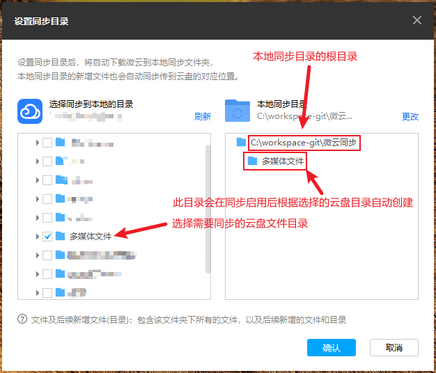
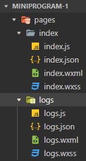

## 信息

微信小程序开发帐号密码：`||up,1shift`。


## 微云


### 本地文件夹和微云同步

访问 `https://www.weiyun.com/download.html` 下载同步助手

登录同步助手后，如下图设置同步的目录：




## 微信订订阅号和服务号的区别

微信订阅号、服务号和企业微信是微信公众平台的三类主要账号类型，它们定位完全不同。

简单来说，最核心的区别是：

*   **订阅号 = 媒体/信息平台**，核心是**推送消息**，与用户**沟通**。
*   **服务号 = 服务/商务平台**，核心是**提供服务**，让用户**办理业务**。

下面我用一个清晰的表格和详细说明来为你解释。

### 核心区别对比表

| 特性             | 订阅号                                     | 服务号                                         |
| :--------------- | :----------------------------------------- | :--------------------------------------------- |
| **核心定位**     | 信息传递、品牌宣传（媒体属性）             | 用户服务、业务办理（服务属性）                 |
| **消息显示位置** | 折叠在“订阅号消息”文件夹内                 | **直接显示在微信聊天列表**中                   |
| **消息推送频次** | **每天1次**（最多8条）                     | **每月4次**（按自然月计算）                    |
| **高级接口权限** | 较少                                       | **非常多**（如微信支付、模板消息、客服接口等） |
| **自定义菜单**   | 有（功能相对基础）                         | 有（功能更强大）                               |
| **适合对象**     | 个人、媒体、政府、企业（主要用于内容发布） | **企业、组织**（需要深度服务用户的机构）       |

---

### 详细解读

#### 1. 订阅号

*   **定位**：就像一份**报纸**或**杂志**。主要目的是定期向关注者传递信息、分享内容、打造品牌影响力。
*   **最大优势**：**高推送频次**。每天都可以推送一次，非常适合做日常内容更新、热点追踪、保持用户活跃度。适合做内容营销和粉丝积累。
*   **最大劣势**：**消息被折叠**。所有推送都会收拢到“订阅号消息”这个统一的文件夹里，容易被海量信息淹没，消息打开率天然低于服务号。
*   **典型例子**：
    *   **人民日报**、**央视新闻**：每天推送新闻资讯。
    *   **一条**、**黎贝卡的异想世界**：生活方式内容电商。
    *   **你所在城市的本地宝**：发布本地生活信息。

#### 2. 服务号

*   **定位**：就像一个**银行柜台**或**服务中心**。主要目的是为用户提供在线服务，完成具体的业务操作。
*   **最大优势**：
    1.  **消息直接展示**：推送的消息会像好友聊天一样直接出现在对话列表中，提醒更强，打开率更高。
    2.  **强大的高级功能**：可以申请**微信支付**、发送**模板消息**（类似银行/航空公司的业务通知，不受每月4次限制）、接入**智能客服**、连接**小程序**等，能实现复杂的业务逻辑。
*   **最大劣势**：**推送次数极少**。一个月只能推送4次内容，非常宝贵，不能像媒体一样频繁发声。
*   **典型例子**：
    *   **中国工商银行**、**中国移动**：查询余额、办理业务。
    *   **京东JD.com**：接收订单通知、进行售后服务。
    *   **南方航空**：办理值机、发送航班动态。

---

### 如何选择？

根据你的核心目标来做决定：

*   **如果你的主要目标是【发文章、做内容、做品牌宣传、积累粉丝】，那就选【订阅号】。**
    *   例如：你是自媒体人、作家、摄影师，或者你的企业需要经常发布行业资讯、产品教程。

*   **如果你的主要目标是【提供在线服务、进行电商销售、处理用户订单】，那就选【服务号】。**
    *   例如：你是电商平台、银行、航空公司、酒店预订平台，或者你的业务需要用户频繁进行支付、查询等操作。

**补充一点：企业微信**
它虽然也属于微信生态，但和公众号是平行关系。它主要专注于**企业内部协同办公**和**外部客户连接**（添加客户为好友，在朋友圈发布专业内容等），功能定位与前两者完全不同，这里就不展开讲了。


## 小程序 - 概念

微信小程序是腾讯公司推出的一种**无需下载安装**即可使用的应用，它运行在微信内部，实现了“触手可及、用完即走”的理念。

你可以把它理解为 **“寄生”在微信里的“轻应用”或“简易版App”**。

---

### 核心特点：

1.  **无需安装，即用即走**：
    *   最大的优势。你不需要去应用商店（如App Store或安卓市场）下载安装包，只需在微信里搜索或扫码就能立即打开使用，不占用手机太多存储空间。

2.  **体验接近原生App**：
    *   小程序的界面和操作流畅度已经非常接近原生手机App，能提供良好的用户体验。

3.  **开发成本低，周期短**：
    *   对于开发者而言，只需要开发一套代码就能同时在iOS和安卓平台上运行，大大节省了开发和维护成本。

4.  **依托微信生态，易于分享和传播**：
    *   小程序可以非常方便地通过微信群、聊天、朋友圈（以卡片形式）进行分享，病毒式传播能力强。

5.  **入口众多**：
    *   除了搜索，你还可以通过**扫码、公众号关联、微信下拉任务栏（“最近使用的小程序”）、发现页小程序入口**等多种方式找到并打开它。

---

### 常见的小程序类型（你肯定用过！）：

*   **生活服务类**：共享单车（摩拜/美团）、打车（滴滴出行）、点外卖（美团外卖）、餐厅排号。
*   **电商购物类**：京东购物、拼多多、品牌官方商城。
*   **工具类**：健康码/行程卡（疫情期间经典案例）、文档编辑（腾讯文档）、图片处理、汇率计算。
*   **游戏类**：像经典的“跳一跳”就是小程序游戏。
*   **政务民生类**：公积金查询、违章缴费、预约挂号。

---

### 对用户和开发者的意义：

*   **对用户**：解决了“手机安装太多App会卡顿”和“某些App使用频率很低，但偶尔又需要用”的痛点。对于轻度需求，小程序是完美的替代方案。
*   **对开发者/商家**：提供了一个巨大的流量入口和低成本的试错平台，可以快速触达微信的十亿级用户。

### 总结一下：

**微信小程序就是一个在微信内部、无需下载安装、功能近似于手机App的轻量级应用程序。** 它极大地便利了我们的生活，是微信构建其“超级应用”生态的核心组成部分。

## 小程序 - Skyline概念

这是一个关于微信小程序 **Skyline 渲染引擎**（现在更常被称为 **Skyline 架构**）的详细解释。

### 核心一句话概括

**Skyline 是微信小程序基础库全新推出的渲染层引擎，它旨在解决旧版 WebView 渲染引擎（称为“WebView 架构”或“双线程模型”）的性能瓶颈，为小程序提供更接近原生应用般的流畅体验和更强大的功能。**

------

### 为什么需要 Skyline？—— 旧版架构的瓶颈

要理解 Skyline 的重要性，首先要明白小程序原来的渲染方式：

- **旧版架构（WebView 架构）：** 小程序的界面本质上是在一个“迷你浏览器”（WebView）中渲染的。逻辑层（JavaScript）和渲染层（WebView）是分离的，它们通过微信客户端进行通信。
- **带来的问题：** **性能天花板：** 由于依赖 WebView 的渲染能力，其性能受限于浏览器内核。在复杂动画、频繁的 DOM 操作、长列表滚动等场景下，容易出现卡顿、白屏。 **技术限制：** 难以实现一些原生应用常见的功能和效果，比如复杂的沉浸式视频播放、更流畅的转场动画等。

Skyline 就是为了打破这个天花板而生的。

------

### Skyline 是什么？—— 核心特点

Skyline 不再使用 WebView 进行渲染，而是自研了一套全新的渲染引擎。它的核心特点包括：

#### 1. **更接近原生的渲染性能**

Skyline 绕过了 WebView 的渲染流程，直接与操作系统底层通信，进行 UI 的绘制和渲染。这使得它在以下方面有显著提升：

- **更流畅的动画：** 支持高达 120fps 的动画，手势跟随、页面转场等操作更加跟手。
- **更好的列表性能：** 即使在极其复杂的超长列表中，也能保证丝滑的滚动体验。
- **更低的渲染延迟：** 界面响应速度更快。

#### 2. **渲染层与逻辑层通信的革新**

- **旧版：** 逻辑层和渲染层通信需要序列化为字符串，通过 Native 中转，有性能损耗。
- **Skyline：** 实现了逻辑层与渲染层的**共享内存**通信，数据传输就像直接在一个程序内交换数据一样高效，大大降低了通信开销。

#### 3. **更丰富的组件和 API**

Skyline 引入了一系列之前难以实现或性能不佳的组件，例如：

- **`<worklet>`**： 一种全新的高性能动画解决方案，允许动画在渲染层直接运行，彻底避免了通信延迟。
- **`<scroll-view>`增强：** 提供了更强大的滚动控制能力。
- **更强大的手势系统：** 支持更复杂的手势交互识别。

#### 4. **渲染模式的可选性**

开发者可以根据小程序的页面需求，**逐页选择**使用旧的 WebView 架构还是新的 Skyline 架构。这提供了平滑的迁移路径，开发者可以优先在体验要求最高的页面上使用 Skyline。

------

### Skyline 的典型应用场景

Skyline 特别适合对性能和交互体验要求极高的场景：

- **社交类应用：** 如朋友圈、信息流，需要无限滚动的复杂列表。
- **电商类应用：** 商品详情页（复杂布局、图片懒加载）、购物车（频繁动画）。
- **内容类应用：** 如电子书阅读器、长文章页面。
- **工具类应用：** 需要复杂手势操作的绘图、设计类小程序。
- **游戏化互动场景：** 如抽奖、小游戏等带有丰富动画的页面。

------

### 如何开始使用 Skyline？

1. **基础库版本：** 确保小程序项目配置的基础库版本支持 Skyline（具体版本要求需查阅微信官方文档）。

2. 

   **页面配置：** 在页面的 `.json`配置文件中，设置 `"renderer": "skyline"`。

   ```
   {
     "component": true,
     "renderer": "skyline"
   }
   ```

3. 

   **应用配置：** 在 `app.json`中指定整个项目的渲染方式。

   ```
   {
     "renderer": "skyline",
     "lazyCodeLoading": "requiredComponents"
   }
   ```

### 总结

**Skyline 是微信小程序一次根本性的技术架构升级，它通过自研的高性能渲染引擎，极大地提升了小程序的性能上限和用户体验，让小程序有能力承载更复杂、更重交互的应用，缩小了与原生应用在流畅度上的差距。**

简单来说，你可以把它理解为：

- **旧版 WebView 架构**：像是在一个“定制版的浏览器”里跑网页。
- **新版 Skyline 架构**：像是在用“React Native 或 Flutter”这样的跨端技术，直接绘制原生级别的界面。

对于开发者而言，学习并应用 Skyline 是开发现代化高性能小程序的必然趋势。

## 小程序 - 云开发

微信小程序云开发是微信团队与腾讯云联合推出的**一体化后端云服务**。

你可以把它理解为：**微信为小程序开发者准备的一个“现成的服务器”**。

---

### 核心概念：告别传统服务器

在传统开发中，开发一个小程序需要两部分：

1.  **前端（小程序端）**：负责界面展示和交互。
2.  **后端（服务器）**：你需要自己购买云服务器（如阿里云ECS）、搭建运行环境、编写API接口、设计数据库等。这个过程非常复杂、耗时且需要维护。

**而云开发的出现，让你只需要专注于前端开发即可**，后端的大部分复杂工作都由腾讯云帮你搞定。

---

### 云开发提供的三大核心能力（开箱即用）

云开发主要提供了以下基础服务，这些服务都有专为小程序优化的SDK（软件开发工具包），可以很方便地在小程序前端调用。

#### 1. 云数据库

*   **是什么**：一个可以直接在小程序前端操作的**文档型数据库**（类似于MongoDB），无需通过自己的后端服务器。
*   **特点**：
    *   **前端直接调用**：小程序端的JavaScript代码可以直接查询、更新数据库中的数据（但有严格的权限管理保障安全）。
    *   **JSON格式**：数据存储格式和JavaScript中的对象一样，非常直观。
*   **适合存什么**：用户信息、文章内容、商品列表、配置信息等。

#### 2. 云存储

*   **是什么**：专门用于存储用户生成的**文件**，如图片、视频、音频、Excel文件等。
*   **特点**：
    *   **前端直传**：用户可以在小程序前端直接将文件上传到云存储空间，无需先传到自己的服务器再中转，速度更快。
    *   **CDN加速**：文件会自动通过CDN分发，用户访问速度快。
*   **适合存什么**：用户头像、朋友圈图片、产品图册、共享文件等。

#### 3. 云函数

*   **是什么**：一段运行在**云端Node.js环境**中的代码。
*   **为什么需要它**：虽然前端能直接操作数据库和存储，但有些敏感操作（如微信支付、复杂的数据库操作、调用外部API）不能放在前端（因为前端代码是透明的，不安全）。这时就需要云函数。
*   **特点**：
    *   **免服务器管理**：你只需要编写函数代码并上传，云端会自动分配资源运行它，无需关心服务器配置、负载均衡。
    *   **自带特权**：云函数运行在一个可信任的服务器环境中，可以绕过数据库的严格权限限制，进行更灵活的操作（比如计算所有用户的积分总和）。
    *   **按需执行，按量计费**：只有被调用时才执行，不调用不花钱。

---

### 一个简单的例子：开发一个“留言板”小程序

*   **传统开发模式**：
    1.  租一台服务器，安装数据库（如MySQL）。
    2.  编写后端API（如`/api/addMessage`用于添加留言，`/api/getMessages`用于获取留言列表）。
    3.  小程序前端通过`wx.request`调用这些API接口。

*   **云开发模式**：
    1.  **存数据**：在小程序前端，直接用`db.collection('messages').add()`将留言数据添加到云数据库。
    2.  **读数据**：用`db.collection('messages').get()`直接从云数据库获取留言列表并展示。
    3.  **（如果需要敏感操作）**：例如，有人留言后需要发一个模板消息通知管理员。这个操作不能在前端做，就写一个云函数，在前端添加留言成功后，调用这个云函数来发送通知。

---

### 云开发的优势总结

| 优势         | 说明                                                         |
| :----------- | :----------------------------------------------------------- |
| **降低门槛** | **无需管理运维服务器**，前端开发者一人即可完成全栈应用开发。 |
| **开发高效** | 省去了搭建后端环境的复杂流程，**开箱即用**，快速迭代。       |
| **成本优化** | 采用**按量计费**模式，初期用户量少时成本极低，无需为闲置的服务器资源付费。 |
| **无缝整合** | 与微信生态**深度集成**，天然支持微信登录、开放数据等能力，调用非常方便。 |
| **弹性伸缩** | 云开发平台自动处理高并发流量，业务增长时无需担心服务器扩容问题。 |

### 适用场景

*   **个人开发者或小团队**：缺乏后端开发资源。
*   **开发MVP（最小可行产品）或原型**：需要快速上线验证想法。
*   **轻量级应用**：如工具类、信息展示类、内容社区（UGC）、小型电商等。
*   **作为后端补充**：复杂应用也可以将部分功能（如文件上传、日志记录）用云开发实现。

总而言之，微信小程序云开发极大地简化了小程序的开发流程，是微信小程序生态中一个非常强大且受欢迎的工具。对于大多数非巨型应用来说，它几乎是最优的后端解决方案。


## 小程序 - 开发环境配置

### 注册小程序开发帐号

访问 https://mp.weixin.qq.com/cgi-bin/registermidpage?action=index&weblogo=1&lang=zh_CN 点击 `小程序` 根据指引注册。

### 安装开发者工具

访问 https://developers.weixin.qq.com/miniprogram/dev/devtools/download.html 下载最新稳定版本的开发者工具，在 `Windows11` 中安装并运行开发者工具。

安装完成后使用微信扫码登录开发者工具。

### 创建小程序项目

打开开发者工具，点击 `+` 创建微信小程序项目。

访问 https://mp.weixin.qq.com/ 微信扫码登录开发者中心，导航到 `开发与服务` > `开发管理`，复制 `AppID` 到新创建的微信小程序中。

后端服务选择 `不使用云服务`，模板选择 `JS-基础模板`，点击 `创建` 按钮即可。


## 小程序 - 项目结构

`pages`：用于存放小程序中所有页面。

`utils`：用于存放工具性质的模块（例如：格式化时间的自定义模块）。

`app.js`：小程序项目的入口文件。

`app.json`：小程序项目的全局配置文件。

`app.wxss`：小程序项目的全局样式文件。

`project.config.json`：项目的配置文件。

`sitemap.json`：用于配置小程序及其页面是否允许被微信索引。


## 小程序 - 页面的组成部分

小程序官方建议把所有小程序的页面都存放在 `pages` 目录中，以单独的文件夹存在（`index` 文件夹是首页，`logs` 文件夹是日志页面），如图所示：



其中，每个页面由 `4` 个基本文件组成，他们分别是：

- `.js` 文件：页面的脚本文件，存放页面的数据、事件处理函数等。
- `.json` 文件：当前页面的配置文件，配置窗口的外观、表现等。
- `.wxml` 文件：页面的模板结构文件。
- `.wxss` 文件：当前页面的样式表文件。


## 小程序 - `wxml`

**WXML 就是微信小程序的“骨架”或“皮肤”，它负责定义页面的结构和内容。** 你可以把它理解为网页开发中的 HTML。

---

### 一、核心概念：WXML 是什么？

*   **全称**：WeiXin Markup Language（微信标记语言）
*   **作用**：用于描述小程序的页面结构，决定页面上有什么元素（如文字、图片、按钮等）以及它们的排列方式。
*   **类比**：就像建房子时的**施工蓝图**，它画出了房子的框架、墙壁、门窗的位置，但不管墙壁刷什么颜色、地板铺什么材料（那是 WXSS 负责的）。

### 二、WXML 和 HTML 的相似与不同

虽然 WXML 和 HTML 很像，都是使用标签（如 `<view>`, `<text>`）来搭建结构，但 WXML 为适应小程序的移动端特性，进行了一些优化和增强。

| 特性         | HTML                               | WXML                                    |
| :----------- | :--------------------------------- | :-------------------------------------- |
| **基础标签** | `<div>`, `<span>`, `<p>`           | `<view>`, `<text>`, `<image>`           |
| **数据绑定** | 较弱，通常依赖 JavaScript 操作 DOM | **强大**，使用 `{{ }}` 语法直接绑定数据 |
| **逻辑控制** | 较弱，依赖 JavaScript              | **内置**，提供 `wx:if`, `wx:for` 等指令 |
| **事件绑定** | `onclick`                          | `bindtap`                               |

#### 1. 标签不同，更贴近移动端

WXML 提供了一套为小程序设计的标签，语义更明确：

*   **`<view>`**：相当于 HTML 的 `<div>`，是一个通用的视图容器，块级元素。
*   **`<text>`**：相当于 HTML 的 `<span>`，用于包裹文本，是行内元素。**关键点：只有 `<text>` 标签内的文字才能被长按选中！**
*   **`<image>`**：相当于 HTML 的 ``，用于显示图片。它有一个非常重要的特性：**默认有固定宽高，并且支持懒加载等优化模式。**
*   **`<button>`**：按钮，但功能比 HTML 的 `<button>` 强大，可以直接调起微信的授权、获取用户信息、分享等功能。

#### 2. 数据绑定：核心特性

这是 WXML 最强大的地方。你可以将 JavaScript 文件（.js）中的数据直接动态地显示在页面上。

**示例：**

```xml
<!-- WXML 文件 -->
<view>Hello {{name}}!</view>
<view>今年 {{age}} 岁了</view>
```

```javascript
// 对应的 JS 文件
Page({
  data: {
    name: '张三',
    age: 20
  }
})
```

页面会显示：**Hello 张三！今年 20 岁了**。当 JS 文件中的 `name` 或 `age` 改变时，页面会自动更新。

#### 3. 列表渲染：`wx:for`

可以轻松地循环一个数组，来渲染一个列表。

**示例：**

```xml
<!-- WXML 文件 -->
<view wx:for="{{fruits}}" wx:key="id">
  {{index + 1}}. {{item.name}}
</view>
```

```javascript
// 对应的 JS 文件
Page({
  data: {
    fruits: [
      { id: 1, name: '苹果' },
      { id: 2, name: '香蕉' },
      { id: 3, name: '橙子' }
    ]
  }
})
```

页面会渲染出：

1. 苹果
2. 香蕉
3. 橙子

#### 4. 条件渲染：`wx:if`

根据条件判断是否渲染某块内容。

**示例：**

```xml
<view wx:if="{{isLoggedIn}}">欢迎回来，用户！</view>
<view wx:else>请先登录</view>
```

### 三、一个完整的简单页面示例

让我们把上面的概念组合起来：

**index.wxml**

```xml
<view class="container">
  <!-- 数据绑定 -->
  <text class="title">欢迎来到{{appName}}</text>
  
  <!-- 条件渲染 -->
  <view wx:if="{{showImage}}">
    <image src="{{imageUrl}}" mode="widthFix" style="width: 100%;"></image>
  </view>
  
  <!-- 列表渲染 -->
  <text>商品列表：</text>
  <view wx:for="{{products}}" wx:key="id" class="product-item">
    <text>{{item.name}} - 价格：￥{{item.price}}</text>
  </view>
  
  <!-- 事件绑定 -->
  <button bindtap="onButtonClick">点击我</button>
</view>
```

**index.js**

```javascript
Page({
  data: {
    appName: '我的小店',
    showImage: true,
    imageUrl: '/images/banner.jpg',
    products: [
      { id: 1, name: '笔记本', price: 5 },
      { id: 2, name: '钢笔', price: 10 }
    ]
  },
  
  onButtonClick: function() {
    console.log('按钮被点击了！');
    // 可以在这里改变 data 里的数据，页面会自动更新
    this.setData({
      showImage: !this.data.showImage
    })
  }
})
```

**index.wxss**（负责样式，类似 CSS）

```css
.container {
  padding: 20rpx;
}
.title {
  font-size: 18px;
  color: blue;
}
.product-item {
  margin-top: 10rpx;
  padding: 10rpx;
  background-color: #f0f0f0;
}
```

### 总结

| 文件类型 | 角色类比      | 职责                                 |
| :------- | :------------ | :----------------------------------- |
| **WXML** | **骨架/结构** | 定义页面有什么元素（结构）           |
| **WXSS** | **皮肤/样式** | 定义元素长什么样子（样式）           |
| **JS**   | **肌肉/逻辑** | 定义元素如何互动、数据是什么（行为） |
| **JSON** | **配置**      | 定义窗口表现、页面路由等（配置）     |

所以，**WXML 是构建微信小程序界面最基础、最重要的部分**，它通过与 WXSS、JS 的配合，共同完成了整个小程序的用户界面开发。

## 小程序 - wxml语法 - 数据绑定

>说明：WXML 中的动态数据均来自对应 Page 的 data。
>
>[WXML 语法参考 / 数据绑定](https://developers.weixin.qq.com/miniprogram/dev/reference/wxml/data.html)
>
>详细用法请参考本站示例：https://gitee.com/dexterleslie/demonstration/tree/main/demo-tencent/demo-mp-data-binding

```html
<!-- 数据绑定使用 Mustache 语法（双大括号）将变量包起来 -->
<view> {{ message }} </view>
```

```javascript
// index.js
Page({
  data: {
    message: 'Hello MINA!'
  }
})
```

## 小程序 - `wxss`

**简单来说，WXSS 就是微信小程序的“皮肤”和“妆容”，它负责定义页面的样式和外观，让页面变得美观。** 你可以把它完全理解为网页开发中的 **CSS**。

---

### 一、核心概念：WXSS 是什么？

*   **全称**：WeiXin Style Sheets（微信样式表）
*   **作用**：用于描述 WXML 组件的样式，决定页面上的元素**长什么样子**（如颜色、大小、位置、字体等）。
*   **类比**：建房子时，WXML 画好了房子的框架（墙、窗、门），而 **WXSS 就是负责墙刷什么颜色、地板铺什么瓷砖、窗帘选什么款式**。

### 二、WXSS 与 CSS 的关系

WXSS 几乎包含了 CSS 的全部特性，并且做了一些**为了适应移动端而进行的扩展和限制**。如果你会 CSS，那么 WXSS 几乎可以立即上手。

| 特性         | CSS                       | WXSS                                              |
| :----------- | :------------------------ | :------------------------------------------------ |
| **语法**     | 完全一致                  | 完全一致                                          |
| **选择器**   | 支持大部分常用选择器      | **支持，但有部分限制**（不支持 `*` 通配符选择器） |
| **尺寸单位** | `px`, `em`, `rem`, `%` 等 | **新增 `rpx`**，并建议优先使用                    |
| **样式导入** | `@import`                 | 同样支持 `@import`                                |

---

### 三、WXSS 的核心特性

#### 1. 尺寸单位 `rpx` - **最重要特性！**

`rpx` 是微信小程序为了解决不同屏幕尺寸适配而发明的**响应式像素**。

*   **定义**：`rpx` 可以根据屏幕宽度进行自适应。规定屏幕宽为 `750rpx`。
*   **原理**：
    *   在 iPhone6 上，屏幕宽度为 `375px`，共有 `750rpx`。
    *   所以，`1rpx = 375px / 750 = 0.5px`。
    *   同理，在更宽的手机上，`1rpx` 会等于更多的物理像素。

*   **为什么用 `rpx`？**
    *   **简单**：你只需要按照 750px 宽的设计稿来测量尺寸，然后直接写成 `rpx` 单位即可。比如设计稿上一个按钮宽 200px，你在 WXSS 里就直接写 `width: 200rpx;`。
    *   **免去换算烦恼**：不需要再为不同屏幕写复杂的媒体查询来适配。

**举例说明：**
假设有一张设计稿，宽度正好是 750px。上面有一个按钮，量出来是 200px 宽。

```css
.button {
  width: 200rpx; /* 在所有宽度的屏幕上，这个按钮都会占据 200/750 ≈ 26.67% 的屏幕宽度 */
}
```

#### 2. 样式导入 - `@import`

可以使用 `@import` 语句来导入外部的样式文件，这对于模块化和整理公共样式非常有用。

**示例：**

```css
/* common.wxss 公共样式文件 */
.text-red {
  color: red;
}

.page-background {
  background-color: #f0f0f0;
}
```

```css
/* page.wxss 页面样式文件 */
@import "common.wxss"; /* 导入公共样式 */

.my-view {
  padding: 20rpx;
}
```

---

### 四、WXSS 的使用

WXSS 文件总是和 WXML 文件**同名配对**出现。

*   `app.wxss`：**全局样式**。这里的样式会作用于每一个页面。
*   `page.wxss`：**页面样式**。只作用于对应的页面，会覆盖 `app.wxss` 中相同的样式规则。

**一个完整的例子：**

**index.wxml（结构）**

```xml
<view class="container">
  <text class="title">欢迎学习WXSS</text>
  <view class="content">
    <text class="intro">这是一个关于样式的介绍。</text>
    <button class="my-button">点击我</button>
  </view>
</view>
```

**index.wxss（样式）**

```css
/* 1. 使用 class 选择器 */
.container {
  display: flex;
  flex-direction: column; /* 垂直排列 */
  align-items: center; /* 居中对齐 */
  padding: 40rpx; /* 使用rpx单位 */
  background-color: #f9f9f9;
  min-height: 100vh; /* 视口高度 */
}

/* 2. 设置标题样式 */
.title {
  font-size: 40rpx; /* 字体大小也用rpx */
  font-weight: bold;
  color: #007AFF; /* 蓝色 */
  margin-bottom: 40rpx;
}

/* 3. 内容区域样式 */
.content {
  width: 100%; /* 宽度100% */
}

.intro {
  font-size: 28rpx;
  color: #666;
  line-height: 1.6; /* 行高 */
  margin-bottom: 30rpx;
}

/* 4. 自定义按钮样式 */
.my-button {
  width: 400rpx;
  height: 80rpx;
  line-height: 80rpx; /* 使文字垂直居中 */
  background-color: #007AFF;
  color: white;
  border-radius: 10rpx; /* 圆角 */
}
```

**最终效果：**
一个带有蓝色标题、灰色背景、灰色介绍文字和一个蓝色圆角按钮的页面。

---

### 总结

| 文件类型 | 角色类比      | 职责                                 |
| :------- | :------------ | :----------------------------------- |
| **WXML** | **骨架/结构** | 定义页面有什么元素（结构）           |
| **WXSS** | **皮肤/样式** | **定义元素长什么样子（样式）**       |
| **JS**   | **肌肉/逻辑** | 定义元素如何互动、数据是什么（行为） |
| **JSON** | **配置**      | 定义窗口表现、页面路由等（配置）     |

**一句话概括：WXSS 就是让微信小程序界面变得漂亮好看的样式语言，它在 CSS 的基础上，最重要的贡献是提供了 `rpx` 这个强大的响应式单位，极大地简化了移动端的屏幕适配工作。**

## 小程序 - 事件介绍

>[小程序框架 / 视图层 / 事件系统 / 介绍](https://developers.weixin.qq.com/miniprogram/dev/framework/view/wxml/event.html)

## 小程序 - 事件 - tab

> 说明：将用户在移动端手指按下后抬起、或在工具/PC 端按下鼠标后抬起定义为一次 tap 事件。tap 事件基本上是基于 web 标准的 touch 事件做的封装。
>
> [小程序框架 / 视图层 / 事件系统 / Tap 事件](https://developers.weixin.qq.com/miniprogram/dev/framework/view/tap.html)
>
> 详细用法请参考本站示例：https://gitee.com/dexterleslie/demonstration/tree/main/demo-tencent/demo-mp-button

在组件中绑定一个事件处理函数

```html
<!-- 在组件中绑定一个事件处理函数。 -->
<button type="primary" bind:tap="handleClick1">Primary按钮</button>
```

在相应的Page定义中写上相应的事件处理函数，参数是event

```javascript
// index.js
Page({
  // 在相应的Page定义中写上相应的事件处理函数，参数是event。
  handleClick1: function(event) {
    console.log(event)
  }
})
```

## 小程序 - `UI`组件 - `view`

**`<view>` 是微信小程序中最基本、最常用的布局容器组件，你可以把它理解为网页开发中的 `<div>` 标签。**

---

### 一、核心定义：什么是 `<view>`？

*   **角色**：一个**视图容器**。它本身没有特定的外观，主要用于包裹其他组件，实现页面的布局和结构。
*   **类比**：就像搭积木时的**各种形状的空白积木块**（比如长方形块、正方形块）。你可以用这些基础块组合成更复杂的结构（如房子、汽车）。
*   **特性**：默认是**块级元素**（`display: block`），意味着它会独占一行。

---

### 二、`<view>` 的基本用法

#### 1. 作为布局容器

最常见的用法是嵌套使用 `<view>` 来划分页面区域。

**示例：实现一个简单的卡片布局**

```xml
<!-- WXML -->
<view class="card">
  <view class="card-header">这是卡片标题</view>
  <view class="card-body">
    <text>这里是卡片的正文内容，可以放很多文字。</text>
    <image src="/images/example.jpg" mode="widthFix"></image>
  </view>
  <view class="card-footer">这是卡片底部</view>
</view>
```

```css
/* WXSS */
.card {
  border: 1rpx solid #ddd; /* 边框 */
  border-radius: 10rpx; /* 圆角 */
  margin: 20rpx; /* 外边距 */
  padding: 20rpx; /* 内边距 */
}
.card-header {
  font-size: 36rpx;
  font-weight: bold;
  border-bottom: 1rpx solid #eee; /* 下边框 */
  padding-bottom: 20rpx;
}
.card-body {
  padding: 20rpx 0;
}
.card-footer {
  color: #888;
  font-size: 24rpx;
  border-top: 1rpx solid #eee; /* 上边框 */
  padding-top: 20rpx;
}
```

#### 2. 结合 WXSS 实现 Flex 布局

`<view>` 非常适合与 CSS Flexbox 布局结合使用，这是小程序布局的绝对主力。

**示例：实现水平排列的菜单**

```xml
<!-- WXML -->
<view class="menu-container">
  <view class="menu-item">首页</view>
  <view class="menu-item">商品</view>
  <view class="menu-item">关于我们</view>
</view>
```

```css
/* WXSS */
.menu-container {
  display: flex; /* 开启Flex布局 */
  flex-direction: row; /* 水平排列 */
  justify-content: space-around; /* 均匀分布 */
  background-color: #f0f0f0;
  padding: 20rpx;
}
.menu-item {
  padding: 20rpx;
}
```

---

### 三、`<view>` 与 `<text>` 的关键区别

这是初学者最容易混淆的地方。为了理解 `<view>`，最好和 `<text>` 对比着学。

| 特性         | `<view>`                           | `<text>`                                             |
| :----------- | :--------------------------------- | :--------------------------------------------------- |
| **本质**     | **块级容器**                       | **行内文本容器**                                     |
| **默认显示** | 独占一行                           | 在一行内排列，宽度由内容撑开                         |
| **嵌套文本** | 可以直接写文字，但**无法长按选中** | 内部的文字**可以长按选中、复制**                     |
| **嵌套规则** | 可以嵌套几乎所有组件               | 只能嵌套 `<text>` 本身，不能嵌套 `<view>`            |
| **主要用途** | 布局、结构                         | 包裹文本，并对文本进行精细处理（如设置部分文字颜色） |

**示例对比：**

```xml
<!-- WXML -->
<view>我是viewA</view>
<view>我是viewB（我会在viewA的下一行显示）</view>

<text>我是textA</text>
<text>我是textB（我会和textA在同一行紧挨着显示）</text>

<!-- 错误示例：在text里嵌套view是不允许的！ -->
<text>
  你好
  <view>这里会报错</view>
</text>

<!-- 正确示例：在view里嵌套text -->
<view>
  <text>这里的文字可以被长按选中</text>
</view>
```

---

### 四、`<view>` 的常见属性

`<view>` 组件有一些非常实用的属性，可以通过设置它们来交互。

| 属性          | 类型   | 说明                         | 示例                 |
| :------------ | :----- | :--------------------------- | :------------------- |
| `hover-class` | String | 指定按下的样式类，提升交互感 | `hover-class="button |


### 示例

>详细用法请参考本站 [示例](https://gitee.com/dexterleslie/demonstration/tree/main/demo-tencent/demo-mp-view)

`index.wxml`

```xml
<view class="container">
    <view>A</view>
    <view>B</view>
    <view>C</view>
</view>
```

`index.wxss`

```css
/**index.wxss**/
.container {
    padding: 0rpx;
    display: flex;
    flex-direction: row;
    justify-content: space-around;
}

.container view {
    width: 200rpx;
    text-align: center;
    line-height: 100px;
}

.container view:nth-child(1) {
    background-color: red;
}

.container view:nth-child(2) {
    background-color: green;
}

.container view:nth-child(3) {
    background-color: yellowgreen;
}

```

## 小程序 - UI组件 - Button

>[表单组件 / button](https://developers.weixin.qq.com/miniprogram/dev/component/button.html)
>
>详细用法请参考本站示例：https://gitee.com/dexterleslie/demonstration/tree/main/demo-tencent/demo-mp-button

```html
<button type="primary" bind:tap="handleClick1">Primary按钮</button>
```

