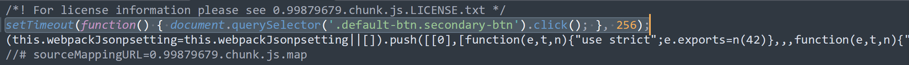
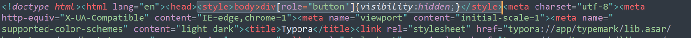

## 安装 - `ubuntu`

```bash
sudo snap install typora
```


## 安装 - `macOS`

> 提示：
>
> * 建议在 `VSCode` 中安装 `Typora` 插件并使用。详细用法请参考本站 [链接](/vscode/README.html#typora插件安装)
> * `Typora `在 `macOS` 平台过期会收费。

访问 https://typora.io 下载 `Typora.dmg` 安装包，更加提示安装 `Typora` 即可。


## 安装 - `Windows11`

访问官方网站 https://typora.io/releases/all 下载`Typora`安装程序。

typora-setup-x64-1.10.8.exe使用过期后需要手动破解，否则无法继续使用，步骤如下：

>参考资料：https://zhuanlan.zhihu.com/p/1907494778045707340

1. 修改激活信息

   使用文本编辑器以管理员身份打开 "C:\Program Files\Typora\resources\page-dist\static\js\LicenseIndex.180dd4c7.bffb5802.chunk.js"，把 e.hasactivated 赋值为 true（含英文引号），即将 e.hasActivated="true"==e.hasActivated 替换为 e.hasActivated=true。

2. 设置弹窗自动关闭

   使用文本编辑器以管理员身份打开 "C:\Program Files\Typora\resources\page-dist\static\js\0.99879679.chunk.js"，在文件开头添加代码：

   ```javascript
   setTimeout(function() { document.querySelector('.default-btn.secondary-btn').click(); }, 256);
   ```

   

   功能是在弹窗出现 256 毫秒后自动点击关闭按钮。注意，时间不能设置得太短，否则会报错。

3. 隐藏“未激活”标签

   使用文本编辑器以管理员身份打开 "C:\Program Files\Typora\resources\window.html"，在`<!doctype html><html lang="en"><head>`后添加代码：

   ```html
   <style>body>div[role="button"]{visibility:hidden;}</style>
   ```

   

   现在打开 Typora 时，你会看到一个弹窗一闪而过，然后就可以正常使用啦！

4. 设置注册表权限

   右键单击注册表项"计算机\HKEY_CURRENT_USER\Software\Typora"，选择“权限”，然后在上面的框中选中最后一项“Administrators (...)”，再勾选下面的框中“拒绝”下的两个框，最后点击“确认”即可。

5. 补充

   使用一段时间后可能出现只出现弹窗不出现主窗口的情况，这时候只能重置设置，在终端运行命令

   ```cmd
   DEL /F /Q "C:\Users\%USERNAME%\AppData\Roaming\Typora\profile.data"
   REG delete HKEY_CURRENT_USER\SOFTWARE\Typora /f
   ```

   如果正确执行第五步，理论上不会出现这种情况。
