## Android打包和运行原理

uni-app 在 Android 平台的打包和运行原理主要涉及代码封装、WebView 容器加载以及原生功能调用，具体如下：

### 打包原理

- **代码封装与资源生成**：开发者使用 HBuilderX 编写 uni-app 代码后，通过内置打包工具或命令行工具将代码打包成静态资源文件。在打包过程中，会处理项目中的页面、组件、样式、配置文件等，生成可在 Android 设备上运行的资源。例如，项目中的 `pages` 目录下的页面文件、`static` 目录下的静态资源等都会被整合到打包资源中。
- **证书与包名配置**：在打包 Android 应用时，需要配置 Android 包名、证书别名、证书私钥密码等信息。这些信息用于生成数字证书对 APK 文件进行签名，以表明开发者身份。可以从 DCloud 开发者中心生成 Android 云端证书，获取包名、证书密码、别名等，也可自行使用 JRE 环境中的 keytool 命令生成证书。
- **离线 SDK 与资源替换**：若采用本地打包方式，需下载 Android 离线 SDK 并解压。在 HBuilderX 中生成本地打包资源后，将这些资源复制到 SDK 的特定目录下，替换相关文件。同时，要修改关键配置文件，如 `dcloud_control.xml`（替换 AppID）、`AndroidManifest.xml`（修改应用名称、权限配置等）、`build.gradle`（填写 applicationId，需与证书一致，设置 versionCode 和 versionName 与 HBuilderX 项目版本一致）。

### 运行原理

- **原生 WebView 容器加载**：uni-app 在 Android 平台上借助原生 WebView 容器实现跨平台开发。Android 系统提供了 WebView 组件，uni-app 将前端代码打包成的静态资源文件通过 WebView 加载，从而实现应用程序的展示和交互。例如，用户在手机上打开 uni-app 开发的 Android 应用时，应用会启动 WebView 容器，加载打包好的静态资源，呈现出应用的界面。
- **逻辑层与视图层分离**：逻辑层主要负责储存数据和执行业务逻辑，视图层则负责页面渲染。当页面加载时，联网和逻辑运算在逻辑层进行，然后将数据传递给视图层进行渲染。这种分离的设计使得 uni-app 能够在不同的平台上实现高效的运行，但数据传递和事件处理过程中会存在一定的通信损耗，开发者需注意减少不必要的数据传递和事件处理，以提高应用程序的性能和用户体验。
- **原生功能调用**：uni-app 通过原生引擎提供的接口来调用硬件设备和系统功能。例如，调用设备的摄像头、传感器等硬件功能，或者访问系统的文件系统、通知等功能。开发者可以使用 uni-app 提供的丰富 API 和插件来方便地调用这些原生功能，进一步提高了应用程序的性能和功能。

## iOS打包和运行原理

uni-app 在 iOS 平台的打包和运行原理涉及代码转换、原生容器适配、证书签名及资源整合，以下是具体说明：

### 打包原理

1. 代码转换与资源整合
   - uni-app 基于 Vue.js 开发，通过 HBuilderX 工具将项目代码转换为 iOS 可识别的格式。打包过程中，项目中的页面、组件、样式、配置文件等会被整合成静态资源文件。例如，`pages` 目录下的页面文件、`static` 目录下的静态资源等都会被处理并打包。
   - 同时，uni-app 会利用 Web 标准技术（HTML、CSS 和 JavaScript）构建应用的界面和逻辑，并借助原生插件扩展功能，如调用摄像头、获取地理位置等。
2. 证书与配置文件准备
   - 打包 iOS 应用需要注册苹果开发者账号，并获取相应的证书和描述文件。开发者需在苹果开发者官网申请开发者证书和描述文件，用于开发测试真机调试和发布。
   - 在 uni-app 项目中，需配置 `manifest.json` 文件，设置应用名称、包名（Bundle ID）、版本号、图标等信息，确保与苹果开发者账号中的配置一致。
3. 编译与打包
   - 使用 HBuilderX 工具选择 iOS 平台进行打包。HBuilderX 会调用 Xcode 的编译工具，将整合后的静态资源文件编译成 iOS 可执行文件。
   - 在编译过程中，会将 uni-app 的代码转换为 iOS 平台能够理解和运行的代码，并适配 iOS 的运行时环境。
   - 编译完成后，会生成 `.ipa` 安装包文件，该文件包含了应用的所有代码和资源，可用于在 iOS 设备上安装和运行。

### 运行原理

1. 原生容器加载
   - iOS 设备上，uni-app 应用通过原生容器（如 UIWebView 或 WKWebView）加载打包后的静态资源文件。原生容器负责渲染应用的界面，并处理与用户的交互。
   - 当用户打开 uni-app 应用时，原生容器会加载应用的入口文件，然后根据页面路由加载相应的视图和逻辑代码。
2. 逻辑层与视图层交互
   - 逻辑层使用 JavaScript 编写业务逻辑，与视图层进行交互。当用户与界面进行交互时，逻辑层会响应这些事件，并根据需要更新数据和视图。
   - 视图层基于 Vue.js 的模板语法和组件机制构建，根据逻辑层传递的数据进行渲染，展示出用户界面。
3. 原生功能调用
   - uni-app 允许开发者使用原生插件来扩展功能，这些插件可以提供诸如调用摄像头、获取地理位置等原生能力。
   - 在运行时，当应用需要调用原生功能时，会通过原生插件与 iOS 系统的原生 API 进行交互，实现相应的功能。

## 桌面应用打包和运行原理

uni-app 打包桌面应用主要借助 Electron 框架，其原理是将 uni-app 开发的 H5 页面嵌入 Electron 的原生容器中运行，以下是具体说明：

### 打包原理

1. 前期准备
   - **安装相关工具**：在控制台安装 electron 和 electron-packager。例如使用 `cnpm install electron -g` 安装 electron，使用 `cnpm install electron-packager -g` 安装 electron-packager。
   - **修改配置文件**：修改 uni-app 的 `manifest.json` 文件，将运行的基础路径修改为 `./`，避免打包后出现白屏、读取不到资源的问题；去掉启用 https 协议，因为去掉 https 不影响请求后端的 https 协议，否则会出现网络无法加载的情况。
2. H5 打包
   - 通过 HBuilderX 工具，选择“发行”选项，然后依次选择“网站 - H5 手机版”或“网站 - PC 版”，配置相关参数，如域名、端口等，点击“生成”按钮，等待打包完成。
3. 创建配置文件
   - **package.json**：在 H5 文件夹下新建 `package.json` 文件，配置应用的基本信息，如名称、版本号、主文件等。
   - **main.js**：新建 `main.js` 文件，使用 Electron 的 API 创建浏览器窗口，并加载应用的入口文件（如 `index.html`）。
4. 打包桌面应用
   - 使用命令行进入 H5 目录，输入打包命令。例如 `electron-packager . helloWorld --platform=win32 --arch=x64 --icon=computer.ico --out=./out --asar --app-version=1.0.0 --overwrite --ignore=node_modules --electron-version 8.2.1`，各参数有特定含义，如 `helloWorld` 是将要生成的 exe 文件的名称，`--platform=win32` 确定了要构建的平台为 Windows 等。

### 运行原理

- **Electron 容器加载**：打包后的桌面应用通过 Electron 提供的原生容器来运行。Electron 结合了 Chromium 和 Node.js，允许使用 Web 技术（HTML、CSS、JavaScript）来构建跨平台的桌面应用程序。当用户启动应用时，Electron 会创建一个浏览器窗口，并加载应用的入口文件。
- **逻辑层与视图层交互**：应用的逻辑层使用 JavaScript 编写，与视图层进行交互。视图层基于 uni-app 开发的 H5 页面，通过 Electron 的浏览器窗口进行渲染。当用户与界面进行交互时，逻辑层会响应这些事件，并根据需要更新数据和视图。
- **调用原生功能**：Electron 提供了丰富的 API，允许桌面应用调用操作系统的原生功能，如文件系统访问、系统通知、托盘图标等。开发者可以在应用中使用这些 API 来增强应用的功能和用户体验。

## 小程序打包和运行原理

uni-app 小程序打包和运行原理如下：

### 打包原理

1. 代码转换
   - uni-app 编译器（基于 Webpack 或 Vite）负责将开发者编写的 uni-app 代码（如 `.vue` 文件、`.js` 文件、样式文件等）转换为目标平台（微信小程序）原生可识别的代码。
   - **模板编译**：将 `.vue` 文件中的 `<template>` 部分编译为微信小程序的 `.wxml` 文件，uni-app 组件会被映射为微信小程序对应的内置组件。
   - **样式编译**：将 `.vue` 文件中的 `<style>` 部分和独立的样式文件（如 `.css`、`.scss`、`.less` 等，取决于项目配置）编译为微信小程序的 `.wxss` 文件，处理 CSS 预处理器，自动转换尺寸单位（如 px 转换为 rpx，如果配置），处理样式导入等。
   - **脚本编译**：将 `.vue` 文件中的 `<script>` 部分和独立的 `.js` 文件编译为微信小程序的 `.js` 文件，uni-app 的 `uni.*` API 调用会被替换为微信小程序对应的 `wx.*` API 调用，处理模块化（如 CommonJS 或 ES Module），生成小程序可执行的 JS 代码。
2. 配置处理
   - 处理 `pages.json` 和 `manifest.json` 文件，生成微信小程序所需的 `app.json`、页面 `.json` 文件等配置。特别是 `manifest.json` 中的微信小程序配置部分（如 AppID）。
3. 资源处理
   - 复制、压缩、转换静态资源（图片、字体等）。
4. 生成项目结构
   - 编译器在指定的输出目录下生成一个标准的微信小程序项目结构，这个目录包含 `.wxml`、`.wxss`、`.js`、`.json` 文件以及静态资源，可以直接导入到微信开发者工具中。

### 运行原理

1. 双线程架构
   - 微信小程序运行在独特的双线程架构中（逻辑层和视图层），uni-app 打包后的小程序也遵循这一架构。逻辑层负责处理业务逻辑，基于 Vue.js 运行时，但在不同平台有不同实现；视图层负责界面渲染，在不同平台调用不同的 UI 渲染引擎。
2. 通信机制
   - 通信层连接逻辑层和渲染层，处理数据同步和事件传递。页面加载时，联网和逻辑运算在逻辑层进行，然后会传递数据给视图层渲染，这种通信有损耗。同样，在视图层操作时，比如拖动页面，要实时传递事件给逻辑层接收，也是有损耗的。
3. API 调用
   - 平台 API 抽象层统一封装各平台原生 API，提供一致的调用方式。在编译到微信小程序时，uni-app 的 `uni.*` API 会被替换为微信小程序对应的 `wx.*` API 调用，开发者可以通过这些 API 调用微信小程序的各种功能。

## APK本地打包发布

>参考链接：https://developer.aliyun.com/article/1375449

步骤如下：

1. 安装配置Android Studio，参考本站[链接](/android/README.html#windows7、windows11、windows-2016)

2. 下载uni-app提供的Android离线SDK[链接](https://nativesupport.dcloud.net.cn/AppDocs/download/android.html#android-%E7%A6%BB%E7%BA%BFsdk-%E6%AD%A3%E5%BC%8F%E7%89%88)

   >注意：Android离线SDK的版本一定注意和HBuilder X的版本匹配，版本如果不匹配会报错。将下载下来的离线SDK进行解压，解压后能够看到HBuilder-Integrate-AS这个文件夹。下面就是围绕这个文件夹展开工作。

3. 配置AppKey（离线Key，用于配置dcloud_control.xml文件，属于uni-app范畴的配置信息）及申请Android平台签名证书（APK签名密钥，属于Android范畴的配置信息）

   AppKey（离线Key）：

   >参考链接：https://nativesupport.dcloud.net.cn/AppDocs/usesdk/appkey.html#%E7%94%B3%E8%AF%B7

   - 登录uni-app开发者中心：https://dev.dcloud.net.cn/pages/app/list，创建应用

     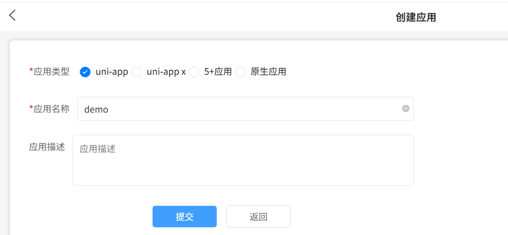

   - 点击创建离线Key按钮

     

   - 点击查看离线Key按钮

     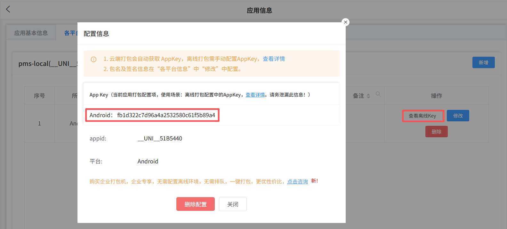

   创建及查看Android平台签名证书（APK签名密钥）：

   - 创建Android平台签名证书（APK签名密钥），参考本站[链接](/android/README.html#创建apk签名密钥)
   - 查看Android平台签名证书（APK签名密钥），参考本站[链接](/android/README.html#查看apk签名密钥的信息)

4. 配置和使用uni-app Android离线SDK中HBuilder-Integrate-AS项目（uni-app的基座项目）编译APK

   - 登录uni-app开发者中心https://dev.dcloud.net.cn获取uni-app应用AppID

     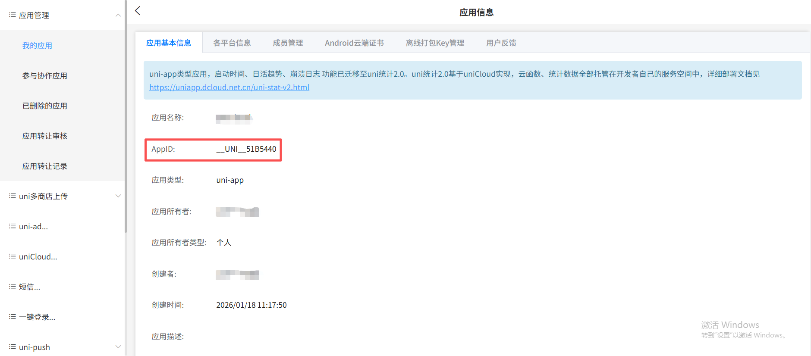

   - 把AppID填写到uni-app项目中的manifest.json中

     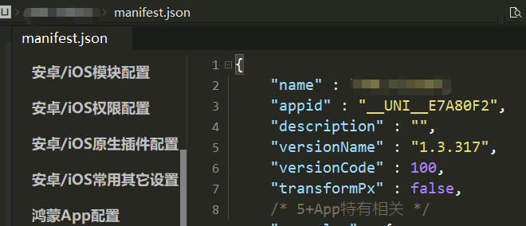

   - 找到目录HBuilder-Integrate-AS->simpleDemo->src->main->assets->apps，删除里面的项目

   - 在BHuilder X里面生成自己的本地资源包：选择菜单栏上的发行->原生App-本地打包->生成本地App打包资源。

     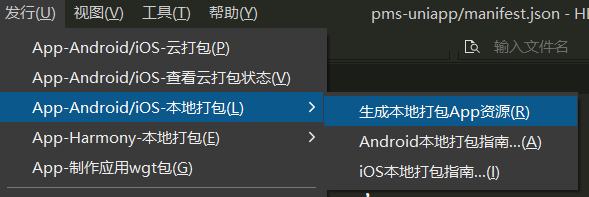

     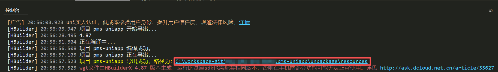

   - 将上面生成的本地资源包复制HBuilder-Integrate-AS项目下：资源打包结束后，打开资源包生成的地方，将其复制粘贴到HBuilder-Integrate-AS->simpleDemo->src->main->assets->apps目录下。

     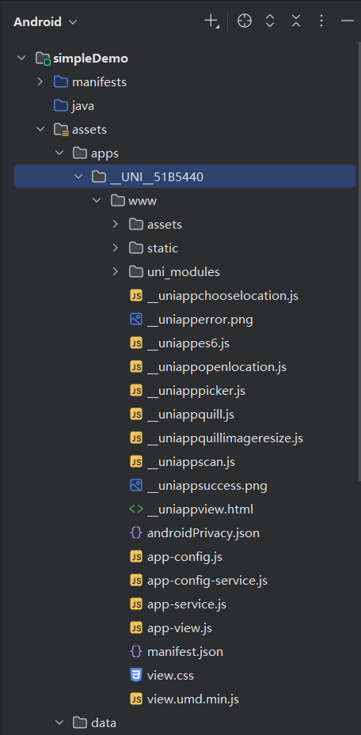

   - 找到simpleDemo->src文件夹下面的AndroidManifest.xml，修改里面的appkey（离线Key，属于uni-app范畴的配置信息）。

     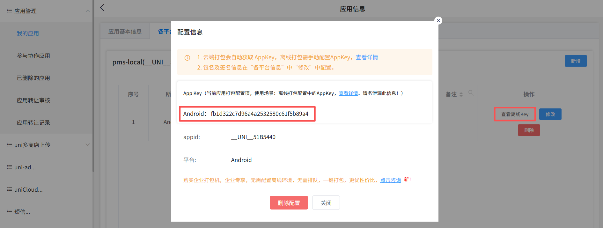

     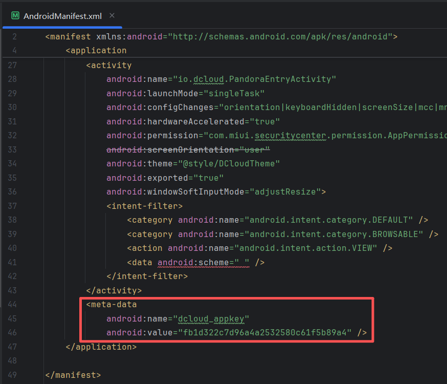

   - 找到dcloud_control.xml文件，修改appid HBuilder-Integrate-AS->simpleDemo->src->main->assets->data->dcloud_control.xml修改里面的。

     >注意：必须保证dcloud_control.xml里面的appid和HBuilder-Integrate-AS->simpleDemo->src->main->assets->apps->__UNI__EE9C18E->www->manifest.json里面的id一致。

     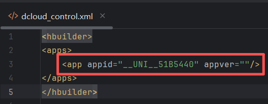

   - 找到simpleDemo文件夹下面的模块build.gradle，修改defaultConfig里面的applicationId，它的值是开发中心里面的包名。

     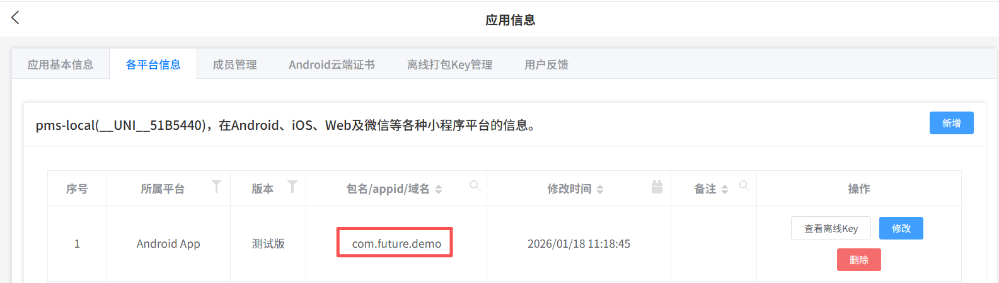

     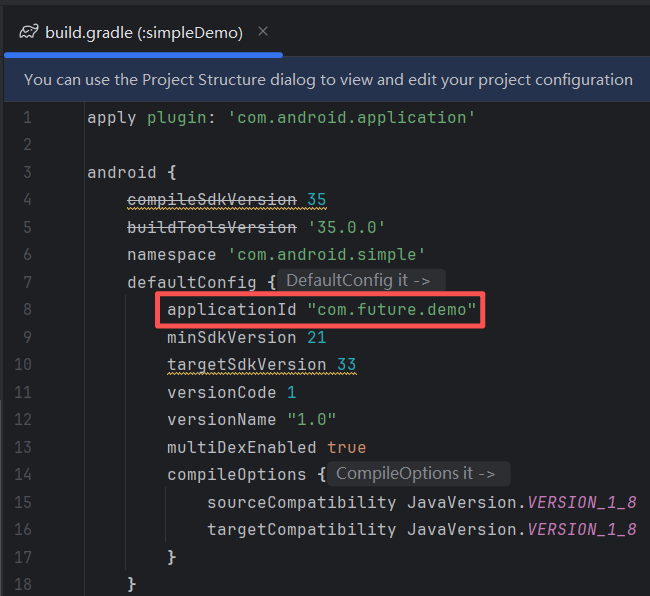

   - 找到simpleDemo文件夹下面的模块build.gradle，修改signingConfigs里面的config信息

     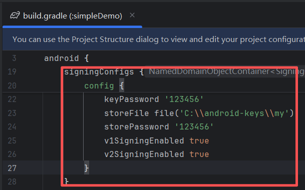

5. 打包本地APK

   - 点击Build->Select Build Variant来进行切换release模式，切换完成后继续正常打包即可。

     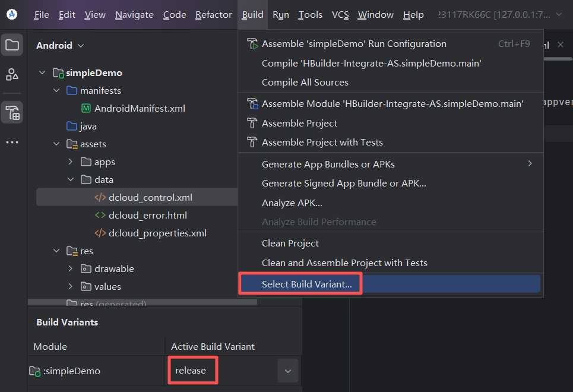

   - 点击菜单上的Build->Build Bundle(s) / APK(s)->Build APK，等待打包，然后右下角会提示打包成功，点击 Locate 会打开apk所在文件夹，到此apk打包成功。

     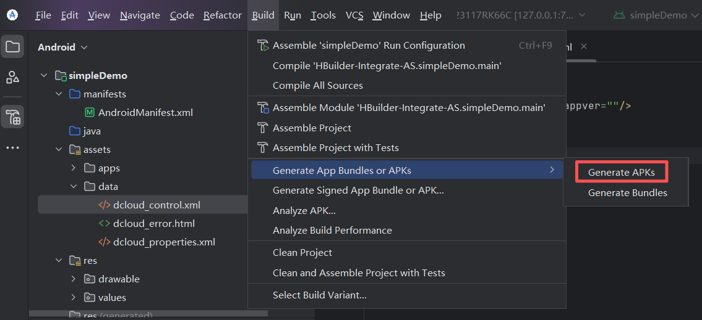

6. 编译出来的APK文件可以用于测试或者生产用途的分发了。

## APK云打包发布

>提醒：使用云打包本地不需要安装Android Studio和uni-app提供的Android离线SDK，只需要使用HBuilderX配置云打包参数即可，APK签名证书都是云端自动生成，打包完毕后APK会自动下载到本地。如果云打包繁忙需要排队等待。

步骤如下：

1. 登录https://dev.dcloud.net.cn/创建云打包应用

   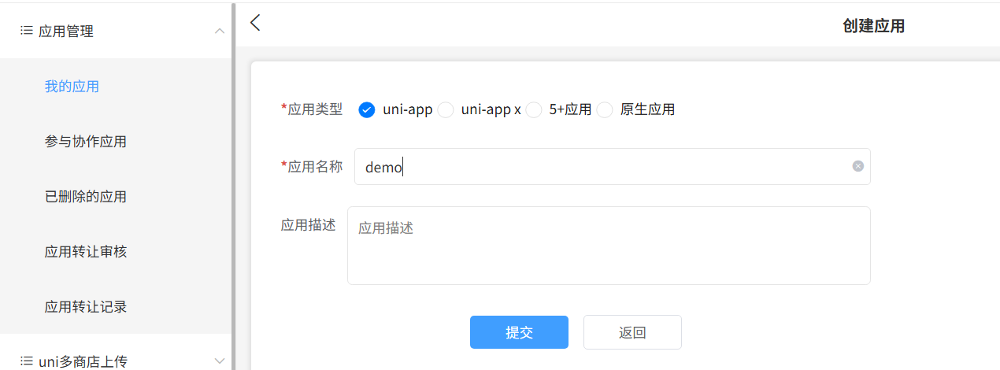

2. 填写uniapp id到manifest.json中

   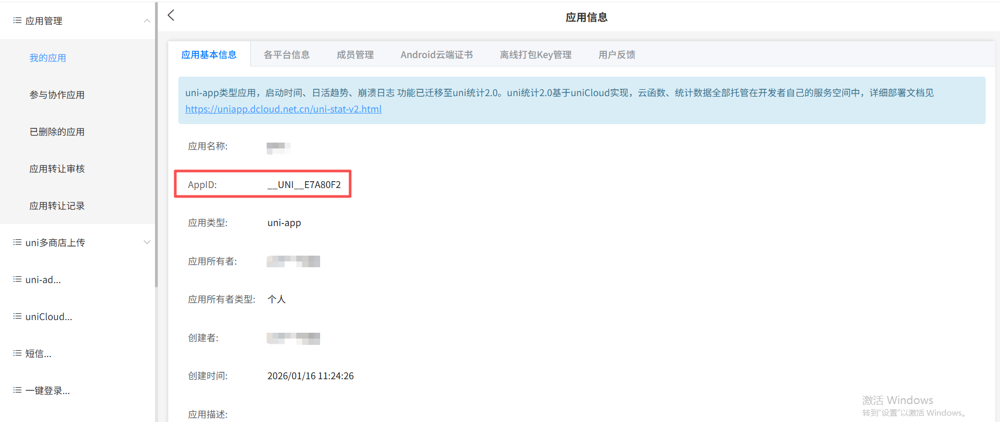

   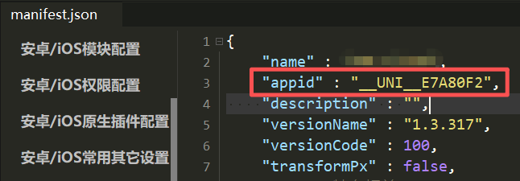

3. 打开云打包功能

   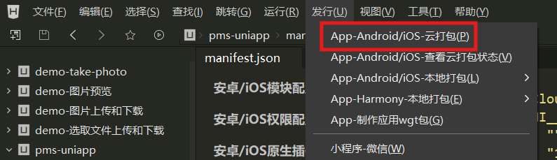

4. 配置云打包参数

   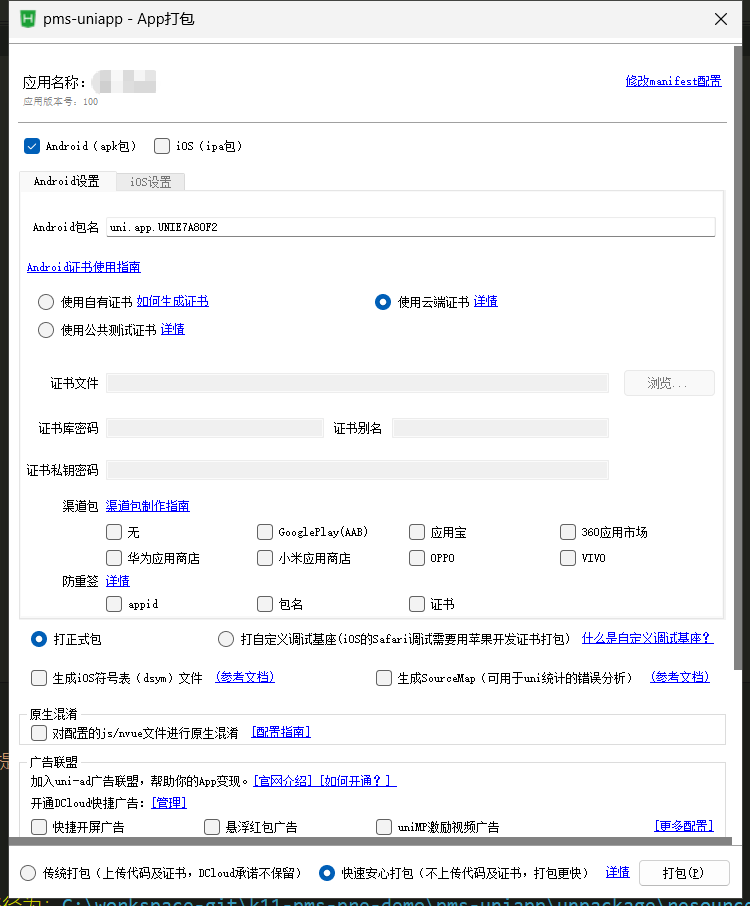

5. 等待云打包结束，打包完成后APK会自动下载到本地（繁忙时需要排队等待时间长）

   