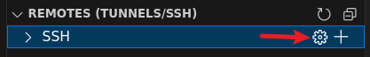

## ubuntu20 安装 visual code

> 不能使用 snap 安装visual code，因为 snap visual code 是阉割版，不能切换中文输入法。
>
> 可以使用 dcli 安装 visual code

```shell
# 参考文档
# https://code.visualstudio.com/docs/setup/linux

# 下载visual code deb安装包到本地

# 从deb安装包安装visual code
sudo apt install ./code_xxxxx.deb
```


## typora/markdown插件安装

> 在插件管理器搜索typora，选择安装下载量排第一的插件，这样就能够在vscode像typora那样编辑md文件

## 配置git

> - 使用vscode自带的git管理工具
> - 安装git graph插件用于查看提交日志
> - 设置vscode自带git管理工具tree模式查看变动的文件
>   https://stackoverflow.com/questions/51476096/visual-studio-code-group-pending-changes-by-folder
>   Source Control -- pending changes > Source Control > View & Sort > View as Tree
> - 设置git自动保存密码，避免每次提交时都要输入密码
>
>   https://stackoverflow.com/questions/34400272/visual-studio-code-is-always-asking-for-git-credentials
>
>   设置git自动保存密码 git config --global credential.helper store
>   查看git自动保存密码是否设置成功 git config --global credential.helper

## vscode设置

> 1、设置zoom为1，Code > Preferences > Settings > Zoom


## `remote-ssh`插件远程开发

> 提示：
>
> - 因为 `ssh` 命令不支持连接时提供密码，所以 `remote-ssh` 插件不支持保存 `SSH` 密码，启动应用后会自动端口转发。
> - 在连接远程过程中提示 "Could not establish connection to "": XHR failed" 错误，是因为 `vscode commit id` 对应的 `remote-ssh` 插件服务端程序不存在导致无法下载，所以此时应该升级 `vscode` 到最新版本。
> - 远程开发的 `terminal` 也是远程的，远程打开 `git` 仓库就可以通过 `vscode git` 管理仓库了。


### 安装和使用

```shell
# 通过插件面板安装remote-ssh插件

# 在remote-ssh导航标签中添加主机
# 在弹出提示中输入主机信息: ssh root@192.168.1.200

# 在remote-ssh功能中选择刚刚添加的主机并选择在新窗口打开，输入密码后就会打开一个新的vscode编辑窗口
# 新窗口中提示输入SSH密码并输入密码后，选择克隆或者打开远程主机的目录就可以进行远程开发了。
```


### 删除主机

切换到插件管理面板 `Remote Explorer`，点击 `REMOTE（TUNNEL/SSH）` > `SSH` > `设置按钮` ，选择 `~/.ssh/config` 文件进行编辑即可。


## 设置打开文件很多时tabs多行显示

> https://stackoverflow.com/questions/42462777/multirow-tabs-for-vscode
>
> 打开 File > Preferences > Settings > Workbench > Editor Management 后搜索 wrap tabs 打上钩则可。

## 使用launch.json设置 run/debug 加载的golang入口文件

```json
# unittest时配置如下
{
    "version": "0.2.0",
    "configurations": [
        {
            "name": "Launch Package",
            "type": "go",
            "request": "launch",
            "mode": "auto",
            // 指定加载demo_prompt_test.go为测试入口文件
            "program": "${workspaceFolder}/demo_prompt_test.go",
            "args": [
            	// 指定只运行 unittest 中的名为 TestPrompt 的用例
                "-test.run=^TestPrompt$"
            ],
            // 必须设置为 integratedTerminal，否则测试 promptui stdin 无法输入
            "console": "integratedTerminal"
        }
    ]
}

# NOTE: 使用vscode开发工具时候需要切换到 Run and debug 面板使用Launch package调试，不能使用源码测试函数上面的 run test和 debug test功能，因为此功能不能加载 launch.json
```

## 快捷键

```shell
# 删除一行 ctrl+shift+k

# 克隆当前光标一行 ctrl+c ctrl+v

# 快速搜索并打开文件 ctrl+p

# 快速隐藏或者打开 Terminal 所在的Panel ctrl+`
```


## vscode makefile 报告 Makefile:2: *** missing separator.  Stop.

参考
https://blog.csdn.net/zhoumingazmq/article/details/109455210

在编辑器的右下角点击Space或Tab

选择Indent Using Tabs

然后选择4 configured Tab Size

最后删掉之前的空格重新使用Tab可以看到之前的四个点变成了一个箭头（–>）如果需要将tab替换回四个空格同样使用这种方式
