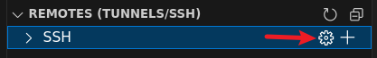

## 安装

### `Ubuntu20`

> 不能使用 snap 安装visual code，因为 snap visual code 是阉割版，不能切换中文输入法。
>
> 可以使用 dcli 安装 visual code

```shell
# 参考文档
# https://code.visualstudio.com/docs/setup/linux

# 下载visual code deb安装包到本地

# 从deb安装包安装visual code
sudo apt install ./code_xxxxx.deb
```


### `Windows11`

访问 https://code.visualstudio.com 下载最新版本`VSCode`，根据提示安装即可。


## `Typora`插件安装

> 提示：在编辑大纲很长的 `md` 文件时 `Typora` 插件不方便，因为插件默认是展开大纲并且没有滚动条拖动按钮，导致使用鼠标滚轮不方便快速定位到指定的大纲位置。
>
> 在插件管理器搜索 `typora`（提供者为 `Database Client`），这样就能够在 `VSCode` 像 `Typora` 那样编辑 `md` 文件。

## 配置`git`

> - 使用vscode自带的git管理工具
> - 安装git graph插件用于查看提交日志
> - 设置vscode自带git管理工具tree模式查看变动的文件
>   https://stackoverflow.com/questions/51476096/visual-studio-code-group-pending-changes-by-folder
>   Source Control -- pending changes > Source Control > View & Sort > View as Tree
> - 设置git自动保存密码，避免每次提交时都要输入密码
>
>   https://stackoverflow.com/questions/34400272/visual-studio-code-is-always-asking-for-git-credentials
>
>   设置git自动保存密码 git config --global credential.helper store
>   查看git自动保存密码是否设置成功 git config --global credential.helper

## 设置

> 1、设置zoom为1，Code > Preferences > Settings > Zoom

## `remote-ssh`插件远程开发

> 提示：
>
> - 因为 `ssh` 命令不支持连接时提供密码，所以 `remote-ssh` 插件不支持保存 `SSH` 密码，启动应用后会自动端口转发。
> - 在连接远程过程中提示 "Could not establish connection to "": XHR failed" 错误，是因为 `vscode commit id` 对应的 `remote-ssh` 插件服务端程序不存在导致无法下载，所以此时应该升级 `vscode` 到最新版本。
> - 远程开发的 `terminal` 也是远程的，远程打开 `git` 仓库就可以通过 `vscode git` 管理仓库了。

### 安装和使用

```shell
# 通过插件面板安装remote-ssh插件

# 在remote-ssh导航标签中添加主机
# 在弹出提示中输入主机信息: ssh root@192.168.1.200

# 在remote-ssh功能中选择刚刚添加的主机并选择在新窗口打开，输入密码后就会打开一个新的vscode编辑窗口
# 新窗口中提示输入SSH密码并输入密码后，选择克隆或者打开远程主机的目录就可以进行远程开发了。
```

### 删除主机

切换到插件管理面板 `Remote Explorer`，点击 `REMOTE（TUNNEL/SSH）` > `SSH` > `设置按钮` ，选择 `~/.ssh/config` 文件进行编辑即可。

## 设置打开文件很多时`tabs`多行显示

> https://stackoverflow.com/questions/42462777/multirow-tabs-for-vscode
>
> 打开 File > Preferences > Settings > Workbench > Editor Management 后搜索 wrap tabs 打上钩则可。

## 使用`launch.json`设置`run/debug`加载的`golang`入口文件

```json
# unittest时配置如下
{
    "version": "0.2.0",
    "configurations": [
        {
            "name": "Launch Package",
            "type": "go",
            "request": "launch",
            "mode": "auto",
            // 指定加载demo_prompt_test.go为测试入口文件
            "program": "${workspaceFolder}/demo_prompt_test.go",
            "args": [
            	// 指定只运行 unittest 中的名为 TestPrompt 的用例
                "-test.run=^TestPrompt$"
            ],
            // 必须设置为 integratedTerminal，否则测试 promptui stdin 无法输入
            "console": "integratedTerminal"
        }
    ]
}

# NOTE: 使用vscode开发工具时候需要切换到 Run and debug 面板使用Launch package调试，不能使用源码测试函数上面的 run test和 debug test功能，因为此功能不能加载 launch.json
```

## 快捷键

```shell
# 删除一行 ctrl+shift+k

# 克隆当前光标一行 ctrl+c ctrl+v

# 快速搜索并打开文件 ctrl+p

# 快速隐藏或者打开 Terminal 所在的Panel ctrl+`
```

## vscode makefile 报告 Makefile:2: *** missing separator.  Stop.

参考
https://blog.csdn.net/zhoumingazmq/article/details/109455210

在编辑器的右下角点击Space或Tab

选择Indent Using Tabs

然后选择4 configured Tab Size

最后删掉之前的空格重新使用Tab可以看到之前的四个点变成了一个箭头（–>）如果需要将tab替换回四个空格同样使用这种方式

## 命令面板是什么呢？

VS Code 的命令面板（Command Palette）是编辑器的核心控制中枢，几乎所有功能都可以通过它来执行。它本质上是一个强大的搜索框，让你通过键盘输入指令，快速访问和操作 VS Code 的各项功能，无需依赖鼠标在菜单中层层查找。

你可以把它想象成一个“万能搜索框”或“指令中心”。

### 如何打开

打开命令面板的快捷键是：
*   **Windows / Linux:** `Ctrl + Shift + P`
*   **macOS:** `Cmd + Shift + P`

你也可以通过顶部菜单栏的 **查看 (View) > 命令面板 (Command Palette)** 来打开。

### 它能做什么

命令面板的功能极其强大，几乎涵盖了 VS Code 的所有操作，主要包括：

*   **执行编辑器命令**
    输入关键词即可快速执行各种操作，例如：
    *   `>Format Document`：格式化当前文档
    *   `>Preferences: Open Settings (UI)`：打开设置界面
    *   `>Git: Commit`：提交 Git 更改
    *   `>Terminal: Create New Terminal`：打开一个新的终端

*   **快速文件导航**
    在命令面板中输入 `>` 符号后，它会搜索命令。如果删除 `>` 符号或直接按 `Ctrl + P` (Windows/Linux) / `Cmd + P` (macOS)，它就会变成文件搜索器，让你快速打开工作区内的任意文件。

*   **管理与安装扩展**
    输入 `>Extensions: Install Extensions` 可以直接打开扩展市场，搜索并安装你需要的插件。许多扩展的专属功能也必须通过命令面板来调用。

*   **动态配置环境**
    你可以即时修改编辑器配置，无需进入设置页面。例如，输入 `>Preferences: Color Theme` 来切换主题，或输入 `>Change Language Mode` 来切换当前文件的语言模式。

*   **上下文感知**
    命令面板非常智能，它会根据你当前的操作环境（如文件类型、是否选中文本等）动态显示相关的命令。例如，在 Python 文件中选中一段代码后，面板里可能会出现“提取方法 (Refactor: Extract Method)”等重构选项。

## 怎么设置VSCode链接到C/C++头文件定义呢？

要在 VSCode 中成功跳转到 `soup_message_set_status` 这样的函数定义，关键在于正确配置 C/C++ 开发环境。这个函数来自 `libsoup` 库，因此你需要确保 VSCode 能够识别该库的头文件。

请按照以下步骤进行设置：

### 第一步：安装必要的扩展

首先，确保你已经安装了微软官方的 **C/C++ 扩展** (ms-vscode.cpptools)。这是实现代码跳转、智能提示等功能的基础。

### 第二步：配置包含路径

这是最关键的一步。VSCode 需要知道 `libsoup` 库的头文件（例如 `soup-message.h`）存放在哪里。

1. 按下 `Ctrl+Shift+P` (macOS 上是 `Cmd+Shift+P`) 打开命令面板。

2. 输入并选择 **`C/C++: Edit Configurations (UI)`**。

3. 在打开的设置页面中，找到 **`C/C++: IntelliSense`** 部分。

4. 在 **`Include path`** 这一栏，添加 `libsoup` 头文件所在的目录。

   >直接在Include path中填写/usr/include/**就可以了。

   *   ~~如果你不确定头文件路径，可以在终端中尝试使用 `pkg-config` 命令查询：~~
       
       ```bash
       pkg-config --cflags libsoup-2.4
       ```
       ~~命令输出中的 `-I` 后面的路径就是你需要添加的。例如，输出可能是 `-I/usr/include/libsoup-2.4 -I/usr/include/glib-2.0 ...`，你需要将这些路径（如 `/usr/include/libsoup-2.4`）添加到 VSCode 的配置中。~~

### 第三步：使用跳转功能

配置完成后，你就可以使用以下任一方法跳转到定义：

*   **快捷键**: 将光标放在 `soup_message_set_status` 上，然后按 **`F12`**。
*   **鼠标**: 按住 **`Ctrl`** (macOS 上是 `Cmd`) 并**单击**函数名。
*   **右键菜单**: 右键点击函数名，选择 **“转到定义” (Go to Definition)**。
