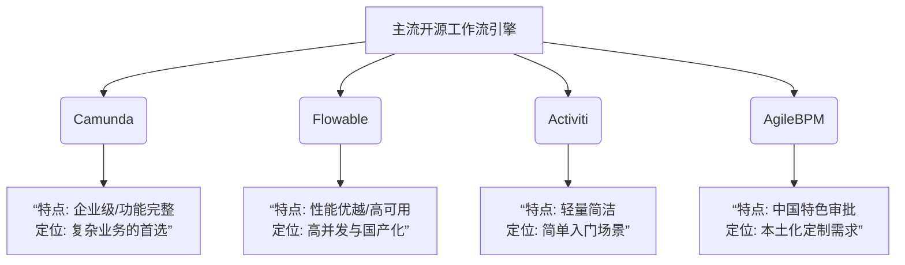
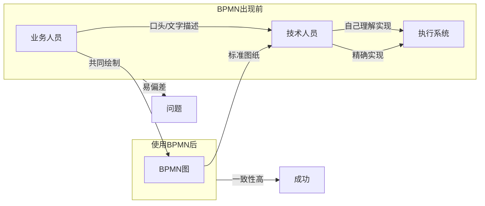
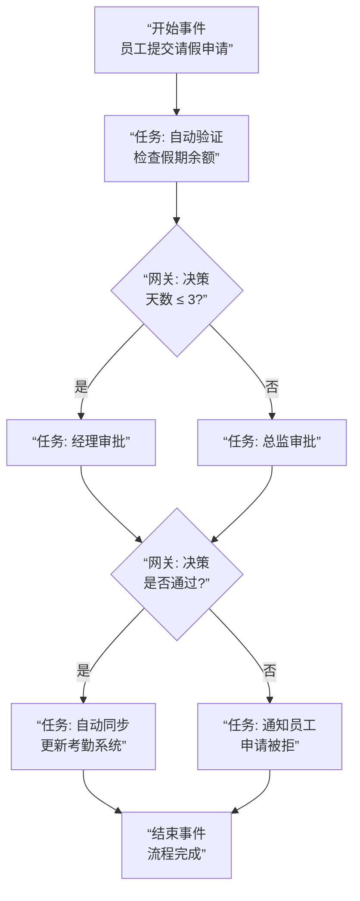
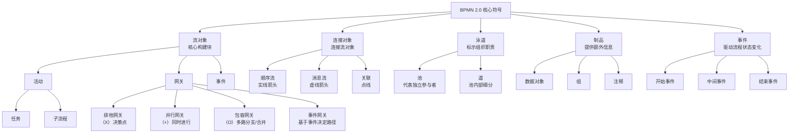
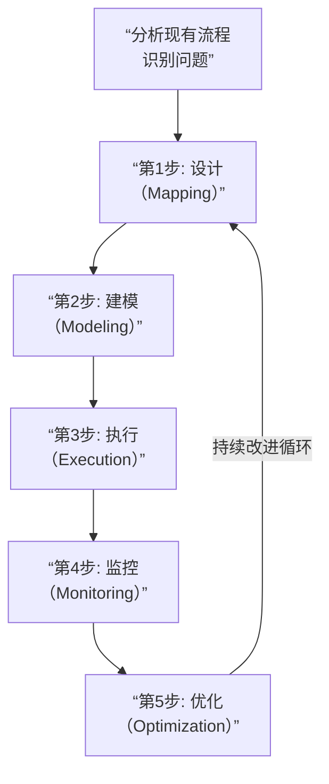
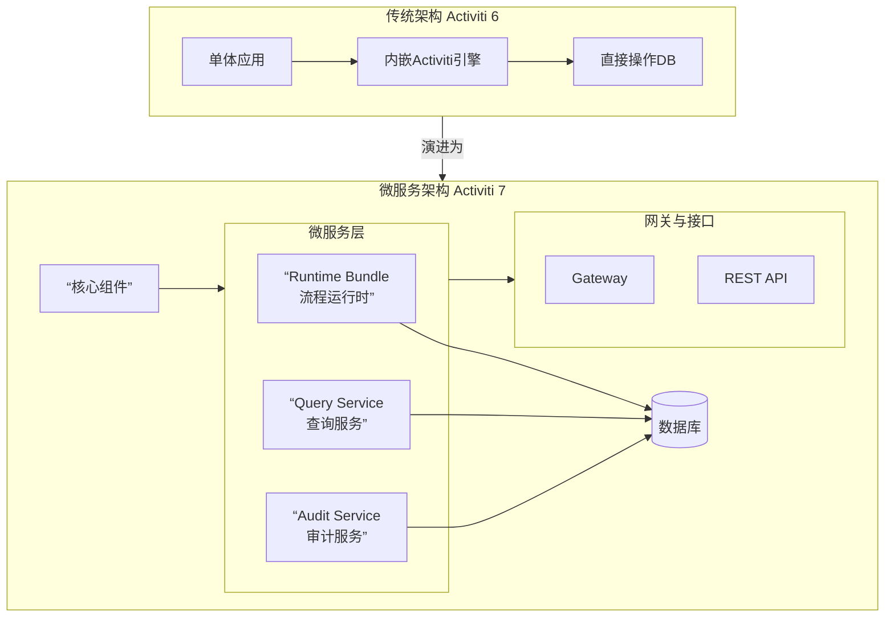

## 开源的主流的审批流引擎

开源的主流审批流引擎，**Java 技术栈是绝对的主流**。目前，**Camunda 和 Flowable** 是公认的两大领导者，在社区活跃度、功能完整性和企业采用度上最为突出。

下图清晰地展示了主流开源工作流引擎的生态与选择路径：



以下是这几个核心引擎的详细对比和分析：

------

### 1. **Camunda**

当前最受欢迎的开源流程引擎之一，由原 Activiti 核心团队创立。

- **核心特点**： **完整BPM套件**：不仅提供引擎（Engine），还自带强大的**可视化操作台**（Cockpit - 监控，Tasklist - 任务处理，Admin - 管理），开箱即用。 **高性能与可扩展**：基于 Java，支持高并发场景。其 **Zeebe** 项目是云原生、高可用的微服务编排引擎。 **强大的BPMN支持**：对 BPMN 2.0 标准支持极好，支持 **CMMN**（案例管理）和 **DMN**（决策规则）。 **清晰的商业模式**：开源版本（社区版）功能非常完整，可免费商用。商业版提供企业级支持、SLA 和额外管理功能。
- **适用场景**：**企业级、对流程监控和运维有高要求、需要处理复杂业务逻辑**的项目，是目前多数新项目的首选。

### 2. **Flowable**

同样源于 Activiti 的分支，由原 Activiti 的 PMC 主席创建，性能优化显著。

- **核心特点**： **高性能**：在流程执行和异步作业处理上做了大量优化，吞吐量高。 **模块化设计**：由六个核心模块组成（Flowable BPMN, CMMN, DMN, Form, Content, IDM），可按需引入。 **对 Spring Boot 支持极好**：起步依赖和自动配置非常友好，集成简便。 **社区活跃**：迭代迅速，社区响应快。
- **与 Camunda 对比**： 两者功能高度相似，都源于同一血脉。 **Camunda 的操作台（UI）更成熟、开箱即用体验更好**。 **Flowable 的引擎在部分场景下性能更优，与 Spring 生态集成更无缝**。 选择常常取决于团队技术偏好和对 UI 的依赖程度。

### 3. **Activiti**

工作流引擎的“鼻祖”和开创者，但现在其影响力已被其分支（Camunda, Flowable）超越。

- **现状**： **Activiti 7+**：已由 Alfresco 公司移交给了新的治理委员会。基于 Spring Boot 重构，更云原生。 核心特点是**轻量、简洁**，但配套工具（如管理控制台）相对较弱，需要自行构建或使用第三方。 社区活跃度和创新速度略逊于 Camunda 和 Flowable。
- **适用场景**：老项目升级，或只需要一个非常轻量、纯粹的流程引擎库，UI 完全自研的场景。

------

### 4. **jBPM**

Red Hat 旗下的开源 BPM 套件，历史悠久，与 **Drools**（规则引擎）深度集成。

- **核心特点**： **规则与流程融合**：非常适合**业务规则动态变化、需要与流程紧密配合**的场景（如风控、定价）。 功能完整，但整体架构和生态相对“重量级”。 是 **KIE**（知识是万物）项目组的一部分。
- **适用场景**：**重度依赖规则引擎**的项目，或者已经使用 Red Hat 整套中间件生态（如 Red Hat Process Automation Manager 是其商业版）的企业。

------

### 5. **AgileBPM（国内开源）**

一个功能全面的**中国本土化** BPM 套件，不仅限于引擎。

- **核心特点**： **深度支持中国特色审批**：如加签、减签、跳转、会签、自定义审批路径等，开箱即用。 **一体化平台**：包含表单设计、流程设计、门户、规则引擎等全套功能。 文档和社区以中文为主，沟通成本低。
- **适用场景**：**对“中国式流程”有强需求**，且希望获得一个一体化解决方案的国内团队。

------

### 快速选型对照表

| 特性           | **Camunda**            | **Flowable**             | **Activiti** | **jBPM**       | **AgileBPM**   |
| -------------- | ---------------------- | ------------------------ | ------------ | -------------- | -------------- |
| **起源**       | Activiti 分支          | Activiti 分支            | 原版         | 自有体系       | 国内自研       |
| **核心优势**   | **企业级套件，UI强大** | **性能好，Spring集成佳** | 轻量、简洁   | **规则集成深** | **中国式审批** |
| **BPMN支持**   | 优秀                   | 优秀                     | 良好         | 良好           | 良好（有扩展） |
| **自带操作台** | **非常强大**           | 有，但较简单             | 较弱         | 有             | 完整平台       |
| **社区生态**   | 国际，非常活跃         | 国际，活跃               | 国际，一般   | 国际，较稳定   | 国内，小众     |
| **学习曲线**   | 中等                   | 中等                     | 较平缓       | 较陡峭         | 中等           |
| **首选场景**   | 复杂企业流程，需监控   | 高并发，Spring技术栈     | 轻量级嵌入   | 规则驱动流程   | 强本土化需求   |

### 总结与建议

- **对于绝大多数新项目，首选在 Camunda 和 Flowable 之间权衡**。 如果需要**强大的、现成的管理控制台和运维监控能力**，选 **Camunda**。 如果追求**极致的引擎性能、与 Spring Boot 深度集成**，且UI可以自己开发，选 **Flowable**。
- **如果业务与动态业务规则（规则引擎）强相关**，考虑 **jBPM**。
- **如果需要快速实现加签、会签等中国特色流程，且希望全套解决方案**，评估 **AgileBPM**。
- 对于简单的、轻量级的流程，或者老项目维护，可以使用 **Activiti**。

建议在选型前，用每个引擎的**官方快速入门Demo**实际体验一下，感受其API设计、建模工具和操作界面，这比单纯看文档更有帮助。

## BPMN 2.0概念

**BPMN 2.0** 是**业务流程模型与标记法**（Business Process Model And Notation）的第二版，它是当前描述和执行业务流程的**全球标准语言**。你可以把它理解为**业务流程领域的"工程图纸"**。

让我用一个简单的比喻来开始：

------

### 📋 简单比喻

想象你要**装修一套房子**：

- **BPMN 2.0 就是**：建筑师的专业图纸标准
- **流程引擎（如 Camunda）就是**：能"看懂"图纸并指挥工人施工的智能系统
- **BPMN 图就是**：按照标准画出的具体装修图纸

------

### 🎯 核心价值：解决"沟通鸿沟"

在BPMN出现之前，业务、技术和执行之间常有理解偏差：



### 🧩 BPMN 2.0的核心元素（四大家族）

#### 1. **流对象** - 流程的"骨架"

| 图标 | 名称     | 作用     | 现实例子                           |
| ---- | -------- | -------- | ---------------------------------- |
| ⚪    | **事件** | 某事发生 | 订单到达（开始）、快递签收（结束） |
| ▢    | **活动** | 要做的事 | 审核申请、发货、计算金额           |
| ◇    | **网关** | 决策分叉 | 金额>1万？(是/否分叉)              |

#### 2. **连接对象** - 连接的"血管"

| 类型       | 符号       | 作用            |
| ---------- | ---------- | --------------- |
| **顺序流** | 实线箭头 → | 默认执行顺序    |
| **消息流** | 虚线箭头 ⇢ | 系统/人员间消息 |
| **关联**   | 点线 ----- | 附加信息关联    |

#### 3. **泳道** - 责任的"泳道"

| 类型   | 作用           | 示例                     |
| ------ | -------------- | ------------------------ |
| **池** | 不同参与方     | 客户 vs 银行             |
| **道** | 同一方不同角色 | 银行内：客户经理 vs 风控 |

#### 4. **制品** - 附加的"注释"

- 数据对象：订单信息
- 组：逻辑分组
- 注释：解释说明

------

### 📊 一个完整的审批流程示例

让我们看一个**员工请假审批**的BPMN流程：



在BPMN 2.0中，这个图不仅**人类可读**，还能被**流程引擎直接执行**！

------

### 🔄 BPMN 2.0 的关键升级（相比1.x）

| 特性         | BPMN 1.x | **BPMN 2.0**           |
| ------------ | -------- | ---------------------- |
| **文件格式** | 仅图形   | **XML格式 + 执行语义** |
| **可执行性** | 只能看   | **能被引擎直接执行**   |
| **交换标准** | 各家不同 | **统一标准，工具互通** |
| **流程类型** | 有限     | **支持编排/协作**      |

最重要的突破：**从"图纸"变成了"可执行代码"**。

------

### 🏢 实际企业应用场景

#### 场景1：贷款审批流程

```
客户申请 → 自动预审 → {金额<10万?} → 信审员审批 → 风控复核 → 自动放款
                     ↓
               {金额≥10万?} → 主管审批 → 风控复核 → 自动放款
```

#### 场景2：电商订单履约

```
支付成功 → 仓库接单 → 并行{拣货, 打包} → 发货 → 签收确认 → 完结
```

#### 场景3：IT服务请求

```
员工提需求 → 经理审批 → IT评估 → 开发实施 → 测试验证 → 关闭工单
```

------

### 🛠️ 常用BPMN工具

| 工具类型     | 代表工具                           | 用途               |
| ------------ | ---------------------------------- | ------------------ |
| **绘图工具** | draw.io, Visio, Lucidchart         | 画流程图（不执行） |
| **建模工具** | Camunda Modeler, Flowable Designer | 画图+配置执行属性  |
| **流程平台** | Camunda, Flowable, jBPM            | 执行+监控+分析     |

------

### 💡 为什么BPMN 2.0如此重要？

1. **标准化沟通**：业务、IT、管理层用同一种语言
2. **可执行性**：画完就能直接运行，减少开发成本
3. **可视化监控**：实时看到流程卡在哪里
4. **持续优化**：基于数据分析改进流程
5. **工具兼容**：不同厂商工具可互相导入导出

------

### 📚 学习建议

如果你想深入学习：

1. **先掌握核心元素**（事件、活动、网关、顺序流）
2. **用工具画简单流程**（推荐从 **draw.io** 免费开始）
3. **理解网关类型**： 排他网关（XOR）：单选 并行网关（AND）：全做 包容网关（OR）：条件组合
4. **实际建模**：从工作中找一个简单流程建模
5. **引擎实践**：在 Camunda/Flowable 中导入运行

------

### ⚠️ 常见误区

| 误区               | 正确认知                       |
| ------------------ | ------------------------------ |
| "BPMN就是画流程图" | **是能执行的标准化模型**       |
| "越复杂越好"       | **保持简洁，只为必要细节建模** |
| "技术专用"         | **业务人员也应能看懂核心逻辑** |
| "一次性工作"       | **应持续维护和优化**           |

BPMN 2.0是现代流程自动化的**基石标准**。它让业务流程图从"静态文档"变成了"可执行的数字化资产"，是连接业务需求与技术实现的关键桥梁。

**简单总结**：BPMN 2.0让**业务流程图能直接被电脑执行**，消除了业务描述与技术实现之间的翻译误差。

## BPMN2.0的基本符号

BPMN 2.0的核心目标是提供一个**标准化的、易于理解的图形化语言**，来描绘业务流程的各个步骤。其符号体系清晰、逻辑性强，主要可以分为五大类。

下图清晰地展示了BPMN 2.0的核心符号体系及其分类：



------

### 1. 流对象

这是构建流程图的**核心元素**，包括：

- 

  **活动** ：代表一个需要执行的工作单元。

  - 

    **任务**：不可再分的基本工作（如图中所示）。

  - 

    **子流程**：一个可展开/折叠的复合活动，内部包含自己的流程。其图标右下角有一个“+”号。

- 

  **网关** ：控制流程的分支、合并、分流与汇合，是关键**决策点**。

  - 

    **排他网关** ：最常用，用于在互斥的路径中做**唯一选择**。内部是“X”或空。

  - 

    **并行网关** ：用于**同时**启动多个流程分支，或同步多个汇入的分支。内部是“+”号。

  - 

    **包容网关** ：可以启动一个或多个路径（类似“或”逻辑），并在后续合并。内部是“O”。

  - 

    **事件网关** ：基于后续发生的事件（如收到不同消息）来决定路径。

- 

  **事件** ：在流程中“发生的事情”，会影响流程的走向。**图标为圆形**，依据类型有单细线（开始）、双细线（中间）、粗线（结束）边框。

------

### 2. 连接对象

连接对象用于将流对象**连接**起来，表示它们之间的流转关系。

- 

  **顺序流** ：用**实心箭头实线**表示，定义了流对象执行的**先后顺序**。

- 

  **消息流** ：用**虚线箭头**表示，用于显示**不同参与者**（如不同的池）之间传递的消息。

- 

  **关联** ：用**点线**表示，用于将**数据、文本注释或其他制品**与流对象关联起来，没有方向性或表示数据流。

------

### 3. 泳道

泳道用于以**可视化方式**对流程中的职责进行**组织和分类**。

- 

  **池** ：代表流程中的**主要参与者**，如一个独立的公司、部门或角色。一个池包含一个完整的流程。

- 

  **道** ：是池内的**细分**，用于在参与者内部进一步分类（如不同岗位、系统）。

------

### 4. 制品

制品用于为流程模型**提供额外的上下文和信息**，本身不影响流程顺序。

- 

  **数据对象** ：表示流程需要或产生的**数据或文档**。

- 

  **组** ：用**虚线矩形框**将多个元素圈在一起，用于**视觉上的归类**，没有语义上的影响。

- 

  **文本注释** ：用于为模型添加**解释性注释**，提高可读性。

------

### 5. 事件的详细类型

事件图标内部的图案决定了其具体触发条件或结果：

- 

  **开始事件**：

  - 

    **空**：无特定触发，简单开始。

  - 

    **消息**：收到消息时触发。

  - 

    **定时**：在特定时间点或周期触发。

- 

  **中间事件**：

  - 

    **消息**：发送或接收消息。

  - 

    **定时**：等待到特定时间或经历一段时间。

  - 

    **升级**：向上级系统/人员上报。

- 

  **结束事件**：

  - 

    **空**：简单结束。

  - 

    **消息**：流程结束时发送一条消息。

  - 

    **升级**：以升级结束。

**核心使用原则**：从**开始事件**出发，用**顺序流**连接**活动**、**网关**，通过**网关**控制分支与合并，最终到达**结束事件**。用**泳道**区分职责，用**消息流**表示跨参与者的沟通，并用**制品和注释**让流程更清晰易懂。

## BPM概念

**BPM（业务流程管理Business Process Management）是一套系统化的方法，旨在设计、执行、监控和优化企业的业务流程，使其更高效、更灵活、更能创造价值。**

你可以把它理解为 **“企业流程的医生+健身教练”** —— 既诊断问题，也持续优化体能。

------

### 🎯 核心目标：从“混乱”到“卓越”

BPM 解决的核心问题是：**如何让一群人为了一个共同目标（如“处理客户订单”）而进行的一系列活动，能够像精密的钟表一样准确、高效、可预测地运转。**

| 没有BPM的状态              | 实施BPM后的状态                  |
| -------------------------- | -------------------------------- |
| 依赖个人经验，新手容易出错 | **标准化**操作，质量稳定         |
| 流程黑箱，卡在哪不知道     | **可视化、可追踪**，问题一目了然 |
| 部门墙厚，相互推诿         | **权责清晰**，协同顺畅           |
| 变化慢，适应市场难         | **敏捷可调**，快速响应           |

------

### 🔄 BPM的生命周期（闭环）

BPM不是一个一次性项目，而是一个持续改进的循环。下图展示了它的核心闭环：



1. **设计**：发现并绘制出“我们现在是怎么做的”（As-Is Process）。
2. **建模**：设计出“我们应该怎么做”（To-Be Process），通常使用 **BPMN 2.0** 标准。
3. **执行**：将设计的流程**自动化运行**起来。这是**流程引擎**（如Camunda）的用武之地。
4. **监控**：实时跟踪流程运行数据（耗时、卡点、成本）。
5. **优化**：基于数据分析，重新设计流程，形成**持续改进的闭环**。

------

### 🆚 BPM 与 工作流 的核心区别

这是最常见的困惑点。两者相关但层次不同：

| 维度     | **工作流**                          | **业务流程管理**                                 |
| -------- | ----------------------------------- | ------------------------------------------------ |
| **范围** | **局部**，关注**任务**的流转        | **全局**，关注端到端的**业务价值**               |
| **焦点** | **“怎么做”**（How）任务的自动化流转 | **“是什么”和“为什么”**（What & Why）整个业务链条 |
| **视角** | **技术视角**，解决执行问题          | **管理视角**，解决业务绩效问题                   |
| **类比** | **快递分拣线**（优化包裹流转）      | **整个物流公司运营**（优化从接单到配送的全链条） |

**关系**：BPM是一个**管理框架**，而工作流自动化是BPM框架中用于**实现“执行”阶段的关键技术工具**。

------

### 🏢 BPM的实际应用场景

| 行业       | 典型BPM流程    | 解决痛点                   |
| ---------- | -------------- | -------------------------- |
| **银行业** | 贷款审批流程   | 从数周缩短到几天，风险可控 |
| **制造业** | 订单到收款流程 | 减少库存积压，加速回款     |
| **保险业** | 理赔处理流程   | 减少欺诈，提升客户满意度   |
| **IT业**   | 软件发布流程   | 减少人为失误，确保发布稳定 |

**简单例子 - 员工入职流程：**

- **无BPM**：HR发邮件，IT等审批，行政不知道，新人半天没事干。
- **有BPM**：提交入职 → **自动并行触发**：IT开通账号、行政准备工位、HR安排培训 → 所有任务状态可视，到期预警 → 新人第一天即可高效工作。

------

### 💡 BPM的核心价值（能给企业带来什么？）

1. **效率提升**：自动化重复任务，减少手动交接和等待。
2. **质量与合规**：标准化的“最佳实践”减少错误，满足审计要求。
3. **可视性与管控**：管理者能看清全局，快速定位瓶颈。
4. ** agility**：当市场或规则变化时，能快速调整流程以适应。
5. **成本节约**：减少人力浪费、时间浪费和机会成本。

------

### 🛠️ 如何实施BPM？（关键技术栈）

现代BPM通常离不开一套技术工具的支持：

1. **流程建模工具**：用于绘制和分析流程（如 Signavio, ADONIS）。
2. **业务流程管理套件**：集建模、执行、监控于一体的平台（如 **Camunda Platform**, IBM BPM）。
3. **规则引擎**：处理业务规则（如 Drools）。
4. **低代码/无代码平台**：让业务人员也能参与应用构建（如 Mendix, OutSystems）。
5. **集成平台**：连接ERP、CRM等现有系统（如 Zapier, 企业服务总线）。

------

### ⚠️ 关于BPM的常见误区

| 误区               | 真相                                              |
| ------------------ | ------------------------------------------------- |
| BPM就是买个软件    | **BPM核心是管理思想和方法论**，软件只是使能工具。 |
| BPM是IT部门的事    | **BPM是业务主导，IT支持**。必须业务部门深度参与。 |
| BPM是为了裁员      | BPM主要目标是**提升效能和竞争力**，而非简单减员。 |
| 一次实施，终身有效 | BPM是一个**持续改进的循环**，不是一次性项目。     |

------

### 📈 总结：一张图看懂BPM的层次

```
战略目标 (我们为何存在？)
       ↓
核心业务流程 (我们如何创造价值？)  ←── BPM 主战场
       ↓
部门/岗位工作流 (我们具体怎么做？)  ←── 工作流自动化
       ↓
IT系统与工具 (用什么技术支撑？)
```

**一句话概括**：BPM是通过**系统化、可视化和持续优化**企业核心业务流程，以实现战略目标的一套**管理体系和方法论**。它让企业不再是一堆各自转动的齿轮，而是一台协调高效、能不断自我升级的精密机器。

## Activiti7概念

Activiti 7 是 **Alfresco 公司**在 Activiti 6 基础上的一次**架构重构版本**，标志着 Activiti 从传统的 BPM 引擎向**云原生、微服务架构**的全面转型。

------

### 🆕 Activiti 7 的核心变革

Activiti 7 最大的变化可以用一句话概括：

**从“单体Java库”转变为“云原生微服务套件”**

| 维度         | **Activiti 6 及之前** | **Activiti 7+**                                     |
| ------------ | --------------------- | --------------------------------------------------- |
| **架构**     | 单体Java库，嵌入应用  | **云原生微服务套件**                                |
| **部署**     | WAR包，内嵌部署       | **Spring Boot应用 + Docker容器**                    |
| **核心组件** | 单一引擎JAR           | **多个独立服务**（Runtime Bundle、Query Service等） |
| **API风格**  | Java API为主          | **REST API优先**                                    |
| **流程定义** | 数据库存储            | **可Git存储，支持CI/CD**                            |

------

### 🏗️ Activiti 7 的全新架构

下图展示了 Activiti 7 如何从传统单体架构演变为现代化云原生微服务架构：



------

### 📦 Activiti 7 的核心组件

Activiti 7 不再是一个单一的JAR包，而是由多个独立服务组成：

#### 1. **Runtime Bundle（运行时包）**

- **作用**：流程执行的**核心引擎**，隔离的业务微服务
- **特点**：每个Runtime Bundle只包含特定流程，独立部署、独立伸缩
- **场景**：将"订单流程"和"报销流程"拆成两个独立的Runtime Bundle

#### 2. **Activiti Cloud Application**

- 基于Spring Boot的**可执行应用**
- 内置连接器，可快速集成消息中间件等

#### 3. **Activiti Cloud Query Service**

- 专门的**查询微服务**
- 提供REST API查询流程实例、任务、历史数据

#### 4. **Activiti Cloud Audit Service**

- 审计日志微服务
- 记录所有流程操作痕迹

#### 5. **Activiti Modeling Application**

- 基于**BPMN 2.0**的在线流程建模器
- 支持流程、表单、决策表建模

------

### 🔄 与Camunda/Flowable的关键差异

| 特性           | **Activiti 7**             | **Camunda / Flowable**             |
| -------------- | -------------------------- | ---------------------------------- |
| **架构理念**   | **彻底的云原生、微服务化** | 云原生选项，但支持传统嵌入         |
| **部署单元**   | 每个流程一个Runtime Bundle | 一个引擎运行所有流程               |
| **操作界面**   | 相对简单，分离为不同服务   | **Camunda提供完整、统一的Cockpit** |
| **社区生态**   | 相对较弱，文档更新慢       | 非常活跃，社区支持好               |
| **入门难度**   | 较高，需理解微服务概念     | 相对较低，传统方式易上手           |
| **中国式审批** | 支持有限                   | 通过扩展或插件支持更好             |

------

### 🎯 Activiti 7 的适用场景

#### ✅ 适合的场景

1. **微服务架构项目**：已在Spring Cloud/K8s环境中
2. **需要流程隔离**：不同流程需要独立部署、伸缩
3. **云原生技术栈**：团队熟悉Docker、K8s、服务网格
4. **与Alfresco内容管理集成**：历史项目升级

#### ❌ 不适合的场景

1. **传统单体应用**：增加不必要的复杂度
2. **快速原型验证**：需要快速看到效果的项目
3. **需要强大管理控制台**：Camunda的Cockpit更成熟
4. **资源有限的小团队**：维护多个微服务成本高

------

### 🚀 快速开始示例

#### 1. 创建Spring Boot项目

```
<!-- pom.xml 依赖 -->
<dependency>
    <groupId>org.activiti</groupId>
    <artifactId>activiti-spring-boot-starter</artifactId>
    <version>7.1.0.M6</version>
</dependency>
```

#### 2. 编写简单流程

```
@RestController
public class ProcessController {
    
    @Autowired
    private RuntimeService runtimeService;
    
    @PostMapping("/start-process")
    public String startProcess() {
        // 启动流程实例
        ProcessInstance processInstance = runtimeService
            .startProcessInstanceByKey("leaveApproval");
        return "流程已启动，ID: " + processInstance.getId();
    }
}
```

#### 3. 应用配置

```
# application.yml
spring:
  datasource:
    url: jdbc:h2:mem:testdb
    driver-class-name: org.h2.Driver
  activiti:
    database-schema-update: true
    check-process-definitions: true
```

------

### 📊 技术栈对比

| 技术选择     | 传统方式           | **Activiti 7 方式**            |
| ------------ | ------------------ | ------------------------------ |
| **流程部署** | 数据库上传BPMN文件 | **Git仓库存储，CI/CD自动部署** |
| **服务发现** | 无或硬编码         | **通过服务注册中心**           |
| **消息通信** | 数据库轮询         | **消息中间件事件驱动**         |
| **监控**     | 需自行实现         | **集成Micrometer + 监控系统**  |

------

### ⚠️ 当前状态与争议

#### 现状

1. **版本稳定性**：7.x版本仍处于活跃开发，API可能有变化
2. **社区分裂**：核心开发者分流到Camunda/Flowable后，社区影响力下降
3. **文档质量**：相对Camunda/Flowable较差，中文资料少
4. **企业采用**：传统企业升级为主，新项目选择Camunda/Flowable更多

#### 主要争议点

1. **过度复杂化**：简单流程也需要微服务架构
2. **学习曲线陡峭**：需掌握Spring Cloud、Docker、K8s等整套云原生技术
3. **运维成本**：多个微服务带来运维复杂度
4. **生态缺失**：第三方插件、扩展较少

------

### 💡 选型建议

#### 考虑 Activiti 7 当：

- 已经是**Spring Cloud**微服务架构
- 需要**精细化的流程隔离和独立伸缩**
- 团队有**云原生技术能力**
- 现有系统基于**Alfresco生态**

#### 考虑 Camunda/Flowable 当：

- 需要**快速上线验证**
- 看重**成熟的管理控制台和监控能力**
- 需要处理**复杂的中国式审批流程**
- 希望有**活跃的社区支持和丰富文档**

#### 考虑传统Activiti 6 当：

- 维护**历史老系统**
- 只需简单的嵌入式流程引擎
- 技术栈相对传统

------

### 🔮 发展趋势

1. **云原生融合**：Activiti 7代表了BPM与云原生的融合方向
2. **Serverless适配**：未来可能更好地支持函数计算
3. **低代码集成**：与建模工具、低代码平台深度整合
4. **AI增强**：流程挖掘、智能路由等AI能力集成

------

### 📌 总结

**Activiti 7 是一个面向云原生、微服务架构的现代流程自动化套件**，它：

- ✅ 代表了BPM技术的**架构演进方向**
- ✅ 适合**已有云原生基础**的团队
- ⚠️ 对传统项目**可能过度设计**
- ⚠️ 社区和生态**相对竞争对手较弱**

如果你的技术栈已经是微服务、Spring Cloud，并且有DevOps能力，Activiti 7是一个值得评估的选项。但对于大多数企业应用，**Camunda 或 Flowable 可能提供更平衡、更成熟的选择**。

简单说：Activiti 7 更像一个"未来派"的实验性架构，而 Camunda/Flowable 是经过验证的"实用派"解决方案。