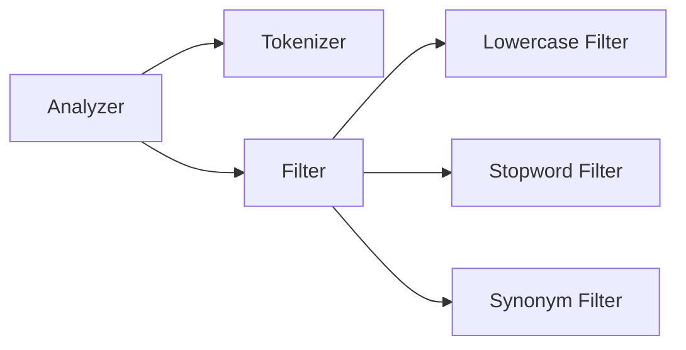

## ES、Lucene、Solr 区别

- es：基于lucene搜索引擎
- solr：基于lucene搜索引擎
- lucene：Lucene是非常优秀的成熟的 开源的 免费的纯 纯java 语言的全文索引检索工具包jar。 是搜索引擎的底层。


## 什么是analyzer、tokenizer、filter？

在 Elasticsearch 中，**Analyzer（分析器）**、**Tokenizer（分词器）** 和 **Filter（过滤器）** 是文本处理的核心组件，它们共同作用将原始文本转换为可搜索的倒排索引。以下是它们的详细解释和协作关系：

---

### **一、核心组件关系图**


---

### **二、组件功能详解**

#### **1. Analyzer（分析器）**
- **作用**：定义完整的文本处理流程，包含 **1个Tokenizer + 0或多个Filter**。
- **执行阶段**：
  - **索引时（Indexing）**：处理文档内容，生成倒排索引
  - **搜索时（Searching）**：处理查询词条（除非指定单独的`search_analyzer`）

**示例**：标准分析器（`standard` analyzer）的组成：
```json
{
  "analyzer": {
    "standard": {
      "type": "standard",
      "tokenizer": "standard",
      "filter": ["lowercase", "stop"]
    }
  }
}
```

#### **2. Tokenizer（分词器）**
- **作用**：将文本拆分为词元（Token），**每个分析器必须有且仅有一个分词器**。
- **常见类型**：
  | 分词器类型    | 描述             | 示例输入 → 输出                                  |
  | ------------- | ---------------- | ------------------------------------------------ |
  | `standard`    | 按单词边界分词   | `"Hello-World"` → `["Hello", "World"]`           |
  | `whitespace`  | 按空格切分       | `"Hello World"` → `["Hello", "World"]`           |
  | `keyword`     | 不分词，整体输出 | `"Hello World"` → `["Hello World"]`              |
  | `pattern`     | 正则分词         | `"a1b2c3"` 按数字切分 → `["a", "b", "c"]`        |
  | `ik_max_word` | 中文细粒度分词   | `" Elasticsearch"` → `["Elasticsearch", "搜索"]` |

#### **3. Filter（过滤器）**
- **作用**：对 **Tokenizer 输出的词元** 进行二次处理（修改、删除、新增）。
- **常见类型**：
  | 过滤器类型  | 描述       | 示例输入 → 输出                       |
  | ----------- | ---------- | ------------------------------------- |
  | `lowercase` | 转小写     | `"HELLO"` → `"hello"`                 |
  | `stop`      | 移除停用词 | `["a", "the", "quick"]` → `["quick"]` |
  | `stemmer`   | 词干提取   | `"running"` → `"run"`                 |
  | `synonym`   | 同义词扩展 | `"quick"` → `["fast", "speedy"]`      |
  | `ngram`     | 生成N-gram | `"hello"` → `["h", "he", "hel", ...]` |

---

### **三、完整处理流程示例**
**输入文本**：  
`"The Quick Brown Fox Jumps!"`

**分析器配置**：
```json
{
  "analyzer": {
    "my_custom_analyzer": {
      "type": "custom",
      "tokenizer": "standard",
      "filter": ["lowercase", "stop", "stemmer"]
    }
  }
}
```

**处理步骤**：
1. **Tokenizer** (`standard`):  
   `["The", "Quick", "Brown", "Fox", "Jumps"]`
2. **Filter 1** (`lowercase`):  
   `["the", "quick", "brown", "fox", "jumps"]`
3. **Filter 2** (`stop` 移除停用词):  
   `["quick", "brown", "fox", "jumps"]`
4. **Filter 3** (`stemmer` 词干提取):  
   `["quick", "brown", "fox", "jump"]`

**最终索引词项**：  
`["quick", "brown", "fox", "jump"]`

---

### **四、自定义分析器实战**

#### **1. 定义自定义分析器**
```json
PUT /my_index
{
  "settings": {
    "analysis": {
      "analyzer": {
        "my_analyzer": {
          "type": "custom",
          "tokenizer": "ik_max_word",          // 中文分词器
          "filter": [
            "lowercase",
            "my_stopwords",                   // 自定义停用词
            "synonym"                         // 同义词
          ]
        }
      },
      "filter": {
        "my_stopwords": {
          "type": "stop",
          "stopwords": ["的", "是", "了"]     // 中文停用词
        },
        "synonym": {
          "type": "synonym",
          "synonyms": ["搜索 => 检索", "ES => Elasticsearch"]
        }
      }
    }
  }
}
```

#### **2. 测试分析器效果**
```json
GET /my_index/_analyze
{
  "analyzer": "my_analyzer",
  "text": "Elasticsearch的搜索性能非常强大"
}
```

**输出结果**：
```json
{
  "tokens": [
    { "token": "elasticsearch", "position": 0 },
    { "token": "检索", "position": 2 },      // "搜索"被替换为同义词
    { "token": "性能", "position": 3 },
    { "token": "非常", "position": 4 },
    { "token": "强大", "position": 5 }
  ]
}
```

---

### **五、常见内置分析器对比**
| 分析器名称   | 分词器     | 过滤器          | 典型场景           |
| ------------ | ---------- | --------------- | ------------------ |
| `standard`   | standard   | lowercase, stop | 英文文本（默认）   |
| `simple`     | lowercase  | -               | 简单无符号文本     |
| `whitespace` | whitespace | -               | 按空格严格切分     |
| `keyword`    | keyword    | -               | 不分词（如ID字段） |
| `pattern`    | pattern    | lowercase       | 正则匹配分词       |
| `ik_smart`   | ik_smart   | -               | 中文粗粒度分词     |

---

### **六、关键注意事项**
1. **索引 vs 搜索分析器**：
   ```json
   PUT /my_index/_mapping
   {
     "properties": {
       "content": {
         "type": "text",
         "analyzer": "ik_max_word",     // 索引时使用
         "search_analyzer": "ik_smart"  // 搜索时使用
       }
     }
   }
   ```

2. **多字段多分析器**：
   ```json
   "content": {
     "type": "text",
     "fields": {
       "raw":   { "type": "keyword" },          // 不分词
       "english": { "type": "text", "analyzer": "english" },  // 英文分析
       "pinyin": { "type": "text", "analyzer": "pinyin" }    // 拼音搜索
     }
   }
   ```

3. **分词器性能影响**：
   - **复杂分词器**（如`ik_max_word`）会显著增加索引时间
   - **N-gram过滤器**会导致索引膨胀

---

### **七、总结**
- **Analyzer** = **1个Tokenizer + N个Filter**  
- **Tokenizer** 决定如何切分文本（核心步骤）  
- **Filter** 决定如何加工词元（精细化控制）  
- **最佳实践**：根据语言特性选择合适的分词器（英文用`standard`，中文用`ik`），再通过过滤器组合实现高级需求（如拼音搜索、同义词等）。

## shard和replica是什么呢？

在 Elasticsearch（ES）中，**Shard（分片）** 和 **Replica（副本）** 是核心的分布式存储与高可用机制，用于解决大规模数据的存储、查询性能及容错问题。以下是两者的详细解释：


### **一、Shard（分片）：数据的水平拆分单元**
Shard 是 ES 为应对海量数据而设计的**水平拆分机制**，将一个索引（Index）的数据分散存储在多个节点上，实现“分而治之”。


#### **1. 为什么需要 Shard？**
- **突破单节点存储限制**：单个节点的磁盘容量有限，通过分片可将大索引拆分为多个小分片，分布到不同节点，支持 PB 级数据存储。
- **提升查询/写入性能**：查询或写入请求可被并行分发到多个分片处理（每个分片独立计算），显著提高吞吐量。
- **支持分布式扩展**：新增节点时，可通过重新分配分片（Rebalance）利用新节点的资源，弹性扩展集群能力。


#### **2. Shard 的类型**
ES 的分片分为两种：
- **Primary Shard（主分片）**：  
  每个索引创建时需指定主分片数量（默认 1，创建后不可修改！）。主分片是数据的“原始副本”，负责处理所有写操作（如索引文档、更新、删除），并将变更同步到对应的副本分片。

- **Replica Shard（副本分片）**：  
  主分片的冗余拷贝（默认每个主分片有 1 个副本）。副本分片**不处理写操作**（仅从主分片同步数据），但可分担读请求（如搜索、聚合），并作为主分片的故障备份。


#### **3. Shard 的关键特性**
- **路由规则**：文档的存储位置由 `routing` 值决定（默认是文档 `_id` 的哈希值），公式为：  
  `shard = hash(routing) % number_of_primary_shards`  
  因此，**主分片数量一旦确定，无法修改**（否则路由失效，历史数据无法定位）。若需调整，需重建索引并使用 `_reindex` API 迁移数据。

- **分布策略**：ES 会自动将主分片和副本分片分配到不同节点（避免同一分片的主副本共存于单节点），确保节点故障时数据不丢失。


### **二、Replica（副本）：高可用与读性能增强**
Replica 是主分片的冗余副本，核心价值是**高可用性**和**读扩展**。


#### **1. 为什么需要 Replica？**
- **高可用（HA）**：当持有主分片的节点宕机时，ES 会从该主分片的副本中选一个提升为新的主分片（“主分片选举”），确保服务不中断。副本越多，抗故障能力越强（如 2 个副本可容忍 2 个节点同时故障）。
- **提升读性能**：读请求（如搜索）可被分发到任意副本分片（包括主分片），通过负载均衡提高并发处理能力。例如，若有 1 主 + 1 副本，读请求可分摊到 2 个分片，吞吐量翻倍。
- **保护数据**：主分片损坏时，副本可直接替代，避免数据丢失（前提是副本未与主分片共损）。


#### **2. Replica 的配置与特性**
- **动态可调**：副本数量可在运行时通过 API 修改（如 `PUT /my_index/_settings { "number_of_replicas": 2 }`），无需重建索引。
- **不独占节点**：副本分片可与主分片分布在同一节点吗？理论上允许，但生产环境强烈建议禁用（`index.routing.allocation.same_shard.host: true` 配置可强制主副本分片不同节点），否则节点宕机会导致主副分片同时丢失。
- **资源开销**：副本分片会占用额外的磁盘空间（与主分片等量）和计算资源（处理读请求），需根据业务需求平衡（如读多写少可增加副本，写多读少可减少）。


### **三、Shard 与 Replica 的协作流程**
以一次写请求（索引文档）为例：
1. 客户端发送写请求到协调节点（Coordinating Node）。
2. 协调节点根据文档 `_id` 计算路由值，确定目标主分片所在的节点。
3. 主分片节点写入数据，并同步变更到所有关联的副本分片。
4. 当主分片和多数副本分片确认写入成功后，协调节点返回成功响应给客户端。

读请求（搜索）流程类似，但协调节点会将请求分发到所有相关分片（主+副本），合并结果后返回。


### **四、最佳实践**
- **主分片数量**：需根据数据量和集群规模预估。通常建议单分片大小控制在 **10GB~50GB**（过小会增加元数据开销，过大影响恢复速度）。例如，预计索引 100GB 数据，可设置 5 个主分片（100GB/20GB≈5）。
- **副本数量**：至少 1 个（保证高可用），读密集型场景可增至 2~3 个（需权衡磁盘成本）。
- **避免过度分片**：过多分片会增加集群元数据（如分片路由信息）的内存消耗，可能导致集群不稳定（如 Master 节点压力过大）。


### **总结**
- **Shard（分片）**：数据的水平拆分单元，解决存储和性能瓶颈，主分片数量固定，决定数据分布逻辑。  
- **Replica（副本）**：主分片的冗余，解决高可用和读性能问题，数量可动态调整，是分布式系统的“保险”。  

两者共同支撑了 ES 的分布式能力，理解其原理对索引设计、集群调优至关重要。

## 运行


### 使用`docker compose`运行`elasticsearch7`

>详细设置请参考本站 [链接](https://gitee.com/dexterleslie/demonstration/tree/master/elasticsearch/elasticsearch7)

编译镜像

```bash
docker compose build
```

启用`elasticsearch7`和`kibana`

```bash
docker compose up -d
```

关闭`elasticsearch7`和`kibana`

```bash
docker compose down -v
```

访问`kibana`地址`http://localhost:5601`


### 使用`docker compose`运行`elasticsearch8`

>详细设置请参考本站 [链接](https://gitee.com/dexterleslie/demonstration/tree/master/elasticsearch/elasticsearch8)

编译镜像

```bash
docker compose build
```

启用`elasticsearch8`和`kibana`

```bash
docker compose up -d
```

关闭`elasticsearch8`和`kibana`

```bash
docker compose down -v
```

访问`kibana`地址`http://localhost:5601`


## 中文`IK`和拼音插件

插件下载地址：https://release.infinilabs.com


## 中文`IK`分词器动态词汇扩展

>详细用法请参考本站 [示例1](https://gitee.com/dexterleslie/demonstration/tree/main/elasticsearch/elasticsearch7) 和 [示例2](https://gitee.com/dexterleslie/demonstration/tree/main/elasticsearch/demo-ik-analyzer-extend)
>
>[参考链接](https://blog.csdn.net/qq_43692950/article/details/122274613)

在示例1中启动 elasticsearch7 服务

```bash
docker compose up -d
```

使用示例2运行单元测试，因为使用 http 方式扩展 ik 分词器并且添加“日琳”和“精讲”词汇，所以单元测试能够通过。


## 客户端


### spring-data-elasticsearch

#### 和SpringBoot、Elasticsearch版本兼容列表

>说明：SpringBoot2.7.18不能使用Spring Data Elasticsearch操作ES8（需要使用co.elastic.clients:elasticsearch-java:8.1.2客户端操作，具体用法请参考本站[示例](https://gitee.com/dexterleslie/demonstration/tree/main/elasticsearch/elasticsearch8-java-client)），SpringBoot2.2.7.RELEASE和SpringBoot2.7.18能够使用Spring Data Elasticsearch操作ES7（具体用法请参考本站[示例1](https://gitee.com/dexterleslie/demonstration/tree/main/elasticsearch/demo-spring-data-elasticsearch-2.2.7.RELEASE-es7)和[示例2](https://gitee.com/dexterleslie/demonstration/tree/main/elasticsearch/demo-spring-data-elasticsearch-2.7.18-es7)）。SpringBoot3.x能够使用Spring Data Elasticsearch操作ES8（具体用法请参考本站[示例](https://gitee.com/dexterleslie/demonstration/tree/main/elasticsearch/demo-spring-data-elasticsearch-3.x-es8)）。
>
>[参考链接](https://docs.spring.io/spring-data/elasticsearch/reference/elasticsearch/versions.html)

Spring Boot 3.x 和 Spring Data Elasticsearch 5.x/6.x

>Spring Boot 3.x 与 Spring Framework 6.x 兼容，需要 Spring Data Elasticsearch 5.x 或更高版本，后者使用新的 Elasticsearch Java API 客户端（TransportClient 在 Elasticsearch 8.x 中被移除）。

| Spring Data Release Train | Spring Boot  | Spring Data Elasticsearch | Elasticsearch Server |
| ------------------------- | ------------ | ------------------------- | -------------------- |
| **2025.1**                | 4.0.x        | 6.0.x                     | 9.2.3+               |
| **2025.0**                | 3.5.x        | 5.5.x                     | 8.18.1+              |
| **2024.1**                | 3.4.x        | 5.4.x                     | 8.15.5+              |
| **2024.0**                | 3.3.x        | 5.3.x                     | 8.13.4+              |
| **2023.1** (Vaughan)      | 3.2.x        | 5.2.x                     | 8.11.1+              |
| **2023.0** (Ullmann)      | 3.0.x, 3.1.x | 5.1.x                     | 8.7.1+               |
| **2022.0** (Turing)       | 3.0.x        | 5.0.x                     | 8.5.3+               |

Spring Boot 2.x 和 Spring Data Elasticsearch 4.x

>对于较旧的应用程序，适用以下版本。请注意，这些版本大多已停止维护。

| Spring Data Release Train | Spring Boot | Spring Data Elasticsearch | Elasticsearch Server |
| ------------------------- | ----------- | ------------------------- | -------------------- |
| **2021.2** (Raj)          | 2.7.x       | 4.4.x                     | 7.17.3+              |
| **2021.1** (Q)            | 2.6.x       | 4.3.x                     | 7.15.2+              |
| **2021.0** (Pascal)       | 2.5.x       | 4.2.x                     | 7.12.0+              |
| **2020.0** (Ockham)       | 2.4.x       | 4.1.x                     | 7.9.3+               |

#### 用法

详细用法请参考本站 [示例](https://gitee.com/dexterleslie/demonstration/tree/main/elasticsearch/demo-spring-data-elasticsearch)

运行示例需要启动 elasticsearch7。


### Java Transport Client

>提醒：目前项目业务实现使用此客户端。
>
>[Java Transport Client](https://www.elastic.co/guide/en/elasticsearch/client/java-api/6.8/index.html)

详细用法请参考本站 [示例](https://gitee.com/dexterleslie/demonstration/tree/main/elasticsearch/elasticsearch-java-transport-client)

运行示例需要启动 elasticsearch7。


### Java High Level REST Client

>注意：无法使用 `elasticsearch-rest-high-level-client` 操作 `elasticsearch8`，可能是因为 `elasticsearch8 docker` 启动不正确导致。
>
>[参考链接](https://www.elastic.co/guide/en/elasticsearch/client/java-rest/current/java-rest-high.html)

详细用法请参考本站 [示例](https://gitee.com/dexterleslie/demonstration/tree/main/elasticsearch/elasticsearch-rest-high-level-client)

运行示例需要启动 elasticsearch7。


### Java Low Level REST Client

>[参考链接](https://www.elastic.co/guide/en/elasticsearch/client/java-rest/current/java-rest-low.html)


### Elasticsearch Java Client

> 提醒：`elasticsearch 8.x` 以上官方推荐使用这个客户端操作 `elasticsearch`。
>
> [参考链接](https://www.elastic.co/guide/en/elasticsearch/client/java-api-client/current/index.html)
>
> 详细用法请参考本站 [示例](https://gitee.com/dexterleslie/demonstration/tree/main/elasticsearch/elasticsearch8-java-client)


#### 基本配置和使用

非 SpringBoot 项目 POM 配置如下：

```xml
<properties>
    <maven.compiler.source>1.8</maven.compiler.source>
    <maven.compiler.target>1.8</maven.compiler.target>
</properties>

<dependency>
    <groupId>co.elastic.clients</groupId>
    <artifactId>elasticsearch-java</artifactId>
    <version>8.1.2</version> <!-- 版本号应与Elasticsearch服务器版本一致 -->
</dependency>
<dependency>
    <groupId>com.fasterxml.jackson.core</groupId>
    <artifactId>jackson-databind</artifactId>
    <version>2.18.1</version>
</dependency>
<dependency>
    <groupId>com.fasterxml.jackson.datatype</groupId>
    <artifactId>jackson-datatype-jsr310</artifactId>
    <version>2.18.1</version>
</dependency>
<dependency>
    <groupId>org.projectlombok</groupId>
    <artifactId>lombok</artifactId>
    <version>1.18.36</version>
</dependency>
```

SpringBoot 项目 POM 配置如下：

```xml
<properties>
    <maven.compiler.source>1.8</maven.compiler.source>
    <maven.compiler.target>1.8</maven.compiler.target>
</properties>

<dependency>
    <groupId>co.elastic.clients</groupId>
    <artifactId>elasticsearch-java</artifactId>
    <version>8.1.2</version> <!-- 版本号应与Elasticsearch服务器版本一致 -->
</dependency>
<dependency>
    <groupId>jakarta.json</groupId>
    <artifactId>jakarta.json-api</artifactId>
    <version>2.0.1</version>
</dependency>
<dependency>
    <groupId>org.projectlombok</groupId>
    <artifactId>lombok</artifactId>
    <version>1.18.36</version>
</dependency>
```

AbstractTestSupport.java

```java
public class AbstractTestSupport {
    protected ElasticsearchClient client = null;
    private RestClient restClient;
    private ElasticsearchTransport transport;

    @Before
    public void setup() {
        // 1. 创建RestClient（底层HTTP客户端）
        restClient = RestClient.builder(
                new HttpHost("localhost", 9200, "http") // 单节点配置
                // 多节点示例：new HttpHost("host2", 9200, "http"), ...
        ).build();

        // 2. 创建Transport层（序列化/反序列化）
        transport = new RestClientTransport(
                restClient,
                new JacksonJsonpMapper() // 使用Jackson作为JSON处理器
        );

        // 3. 创建ElasticsearchClient
        client = new ElasticsearchClient(transport);
    }

    @After
    public void teardown() throws IOException {
        if (transport != null) {
            transport.close();
            transport = null;
        }
        if (restClient != null) {
            restClient.close();
            restClient = null;
        }
    }
}
```

测试

```java
/**
 * 测试基本配置和使用
 *
 * @throws IOException
 */
@Test
public void testBasicUsage() throws IOException {
    String index = "demo_index";
    // 删除索引
    try {
        String finalIndex = index;
        DeleteIndexResponse deleteIndexResponse = client.indices().delete(DeleteIndexRequest.of(o -> o.index(finalIndex)));
        Assert.assertTrue(deleteIndexResponse.acknowledged());
    } catch (Exception ex) {
        // 忽略索引不存在
    }

    // 创建索引
    List<Map<String, Object>> datumList = new ArrayList<Map<String, Object>>() {{
        add(new HashMap<String, Object>() {{
            put("id", "1");
            put("content", "a");
            DateTimeFormatter dateTimeFormatter = DateTimeFormatter.ofPattern("yyyy-MM-dd HH:mm:ss");
            put("createTime", dateTimeFormatter.format(LocalDateTime.now()));
        }});
        add(new HashMap<String, Object>() {{
            put("id", "2");
            put("content", "a");
            DateTimeFormatter dateTimeFormatter = DateTimeFormatter.ofPattern("yyyy-MM-dd HH:mm:ss");
            put("createTime", dateTimeFormatter.format(LocalDateTime.now()));
        }});
        add(new HashMap<String, Object>() {{
            put("id", "3");
            put("content", "a1");
            DateTimeFormatter dateTimeFormatter = DateTimeFormatter.ofPattern("yyyy-MM-dd HH:mm:ss");
            put("createTime", dateTimeFormatter.format(LocalDateTime.now()));
        }});
        add(new HashMap<String, Object>() {{
            put("id", "4");
            put("content", "a2");
            DateTimeFormatter dateTimeFormatter = DateTimeFormatter.ofPattern("yyyy-MM-dd HH:mm:ss");
            put("createTime", dateTimeFormatter.format(LocalDateTime.now()));
        }});
    }};

    CreateIndexRequest createIndexRequest = new CreateIndexRequest.Builder().index(index)
            .mappings(m -> m
                    .properties("id", p -> p.long_(l -> l.store(false)))
                    .properties("content", p -> p.text(t -> t
                            .store(false)
                            .analyzer("ik_max_word")))
                    // 用于测试 LocalDateTime 类型
                    .properties("createTime", p -> p.date(t -> t.store(false).format("yyyy-MM-dd HH:mm:ss")))
            ).build();
    CreateIndexResponse createIndexResponse = client.indices().create(createIndexRequest);
    Assert.assertEquals(Boolean.TRUE, createIndexResponse.acknowledged());

    // 插入数据到索引中
    datumList.forEach(datum -> {
        try {
            IndexRequest<Map<String, Object>> indexRequest = IndexRequest.of(o -> {
                return o.index(index)
                        .id(String.valueOf(datum.get("id"))) // 设置文档 ID
                        .document(datum)
                        .refresh(Refresh.True); // 设置文档内容
            });
            IndexResponse indexResponse = client.index(indexRequest);
            Assert.assertEquals(Result.Created, indexResponse.result());
        } catch (IOException e) {
            e.printStackTrace();
            Assert.fail(e.getMessage());
        }
    });
}
```


#### 批量插入

```java
/**
 * 测试批量插入
 *
 * @throws IOException
 */
@Test
public void testBulkInsertion() throws IOException {
    String index = "demo_index";
    // 删除索引
    try {
        String finalIndex = index;
        DeleteIndexResponse deleteIndexResponse = client.indices().delete(DeleteIndexRequest.of(o -> o.index(finalIndex)));
        Assert.assertTrue(deleteIndexResponse.acknowledged());
    } catch (Exception ex) {
        // 忽略索引不存在
    }

    // 创建索引
    List<Map<String, Object>> datumList = new ArrayList<Map<String, Object>>() {{
        add(new HashMap<String, Object>() {{
            put("id", "1");
            put("content", "a");
            DateTimeFormatter dateTimeFormatter = DateTimeFormatter.ofPattern("yyyy-MM-dd HH:mm:ss");
            put("createTime", dateTimeFormatter.format(LocalDateTime.now()));
        }});
        add(new HashMap<String, Object>() {{
            put("id", "2");
            put("content", "a");
            DateTimeFormatter dateTimeFormatter = DateTimeFormatter.ofPattern("yyyy-MM-dd HH:mm:ss");
            put("createTime", dateTimeFormatter.format(LocalDateTime.now()));
        }});
        add(new HashMap<String, Object>() {{
            put("id", "3");
            put("content", "a1");
            DateTimeFormatter dateTimeFormatter = DateTimeFormatter.ofPattern("yyyy-MM-dd HH:mm:ss");
            put("createTime", dateTimeFormatter.format(LocalDateTime.now()));
        }});
        add(new HashMap<String, Object>() {{
            put("id", "4");
            put("content", "a2");
            DateTimeFormatter dateTimeFormatter = DateTimeFormatter.ofPattern("yyyy-MM-dd HH:mm:ss");
            put("createTime", dateTimeFormatter.format(LocalDateTime.now()));
        }});
    }};

    // region 批量插入

    List<BulkOperation> operations = new ArrayList<>();

    for (Map<String, Object> datum : datumList) {
        String finalIndex3 = index;
        operations.add(BulkOperation.of(b -> b
                .index(i -> i
                        .index(finalIndex3)
                        .id(String.valueOf(datum.get("id"))) // 设置文档 ID
                        .document(datum) // 设置文档内容
                )
        ));
    }

    List<BulkOperation> finalOperations1 = operations;
    BulkRequest request = BulkRequest.of(b -> b
            .operations(finalOperations1)
            .refresh(Refresh.True) // 设置刷新策略为 IMMEDIATE
    );

    // 执行批量请求
    BulkResponse response = client.bulk(request);
    Assert.assertFalse(response.errors());
    Assert.assertEquals(datumList.size(), response.items().size());
    response.items().forEach(o -> Assert.assertNull(o.error()));

    // endregion

    // region 测试批量插入错误处理

    index = "demo_index_errors";
    try {
        String finalIndex2 = index;
        DeleteIndexResponse deleteIndexResponse = client.indices().delete(DeleteIndexRequest.of(o -> o.index(finalIndex2)));
        Assert.assertTrue(deleteIndexResponse.acknowledged());
    } catch (Exception ex) {
        // 忽略索引不存在
    }

    CreateIndexRequest createIndexRequest = new CreateIndexRequest.Builder().index(index)
            .mappings(m -> m
                    .properties("id", p -> p.long_(l -> l.store(false)))
                    .properties("content", p -> p.text(t -> t
                            .store(false)
                            .analyzer("ik_max_word")))
                    // LocalDateTime 类型没有指定 format 是为了测试批量插入时错误
                    .properties("createTime", p -> p.date(t -> t.store(false)))
            ).build();
    CreateIndexResponse createIndexResponse = client.indices().create(createIndexRequest);
    Assert.assertEquals(Boolean.TRUE, createIndexResponse.acknowledged());

    operations = new ArrayList<>();

    for (Map<String, Object> datum : datumList) {
        String finalIndex4 = index;
        operations.add(BulkOperation.of(b -> b
                .index(i -> i
                        .index(finalIndex4)
                        .id(String.valueOf(datum.get("id"))) // 设置文档 ID
                        .document(datum) // 设置文档内容
                )
        ));
    }

    List<BulkOperation> finalOperations = operations;
    request = BulkRequest.of(b -> b
            .operations(finalOperations)
            .refresh(Refresh.True) // 设置刷新策略为 IMMEDIATE
    );

    // 执行批量请求
    response = client.bulk(request);
    Assert.assertTrue(response.errors());
    Assert.assertEquals(datumList.size(), response.items().size());
    response.items().forEach(o -> Assert.assertNotNull(o.error()));
    // reason 错误原因样例：failed to parse field [createTime] of type [date] in document with id '1'. Preview of field's value: '2025-06-02 19:32:17'
    response.items().forEach(o -> Assert.assertTrue(o.error().reason().contains("failed to parse field [createTime] of type [date] in document with id")));

    // endregion
}
```


#### `term` 等值查询

```java
/**
 * 用户查询指定日期范围+指定状态的订单
 *
 * @param userId
 * @param status
 * @param startTime
 * @param endTime
 * @return
 */
public List<OrderDTO> listByUserIdAndStatus(
        Long userId,
        Status status,
        LocalDateTime startTime,
        LocalDateTime endTime) throws IOException {

    // 1. 构建查询条件
    DateTimeFormatter dateTimeFormatter = DateTimeFormatter.ofPattern("yyyy-MM-dd HH:mm:ss");
    Query boolQuery = QueryBuilders.bool()
            .filter(QueryBuilders.term().field("userId").value(userId).build()._toQuery())
            .filter(QueryBuilders.term().field("status").value(status.name()).build()._toQuery())
            .filter(QueryBuilders.terms().field("deleteStatus")
                    .terms(t -> t.value(Arrays.stream(DeleteStatus.values()).map(o -> FieldValue.of(o.name())).collect(Collectors.toList())))
                    .build()._toQuery())
            .filter(QueryBuilders.range()
                    .field("createTime")
                    .gte(JsonData.of(dateTimeFormatter.format(startTime)))
                    .lte(JsonData.of(dateTimeFormatter.format(endTime)))
                    .build()._toQuery()
            )
            .build()._toQuery();

    // 2. 构建排序和分页
    SearchRequest searchRequest = SearchRequest.of(s -> s
            .index("t_order")
            .query(boolQuery)
            .sort(so -> so.field(f -> f.field("id").order(SortOrder.Desc)))
            .from(0)
            .size(20)
    );

    // 3. 执行查询
    SearchResponse<OrderModel> response = client.search(searchRequest, OrderModel.class);

    // 4. 解析结果
    List<OrderModel> orderModelList = response.hits().hits().stream()
            .map(Hit::source)
            .collect(Collectors.toList());

    return this.convertOrderEntityToOrderDTO(orderModelList);
}
```


#### `term in` 查询

```java
private List<OrderDetailModel> listOrderDetailByOrderIds(List<Long> orderIdList) throws IOException {
    // 1. 构建查询条件
    Query termsQuery = QueryBuilders.terms()
            .field("orderId")
            .terms(t -> t.value(orderIdList.stream().map(FieldValue::of).collect(Collectors.toList())))
            .build()._toQuery();

    // 2. 构建排序和分页
    SearchRequest searchRequest = SearchRequest.of(s -> s
            .index("t_order_detail")
            .query(termsQuery)
    );

    // 3. 执行查询
    SearchResponse<OrderDetailModel> response = client.search(searchRequest, OrderDetailModel.class);

    // 4. 解析结果
    return response.hits().hits().stream()
            .map(Hit::source)
            .collect(Collectors.toList());
}
```


#### LocalDateTime 类型处理

POM 配置添加如下依赖

```xml
<dependency>
    <groupId>com.fasterxml.jackson.datatype</groupId>
    <artifactId>jackson-datatype-jsr310</artifactId>
    <version>2.18.1</version>
</dependency>
```

客户端初始化添加如下逻辑：

```java
// 支持 LocalDateTime 类型处理
JacksonJsonpMapper mapper = new JacksonJsonpMapper(new ObjectMapper().registerModule(new JavaTimeModule()));
transport = new RestClientTransport(
        restClient,
        mapper // 使用Jackson作为JSON处理器
);
```

测试

```java
/**
 * 测试 LocalDateTime 类型处理
 *
 * @throws IOException
 */
@Test
public void testLocalDateTimeDataType() throws IOException {
    // region 测试自定义 Bean 中的 LocalDateTime 类型处理

    String index = "demo_index";
    // 删除索引
    try {
        DeleteIndexResponse deleteIndexResponse = client.indices().delete(DeleteIndexRequest.of(o -> o.index(index)));
        Assert.assertTrue(deleteIndexResponse.acknowledged());
    } catch (Exception ex) {
        // 忽略索引不存在
    }

    // 创建索引
    List<MyBean> datumList = new ArrayList<MyBean>() {{
        add(new MyBean(1L, "a", LocalDateTime.now()));
        add(new MyBean(2L, "a", LocalDateTime.now()));
        add(new MyBean(3L, "a1", LocalDateTime.now()));
        add(new MyBean(4L, "a2", LocalDateTime.now()));
    }};

    CreateIndexRequest createIndexRequest = new CreateIndexRequest.Builder().index(index)
            .mappings(m -> m
                    .properties("id", p -> p.long_(l -> l.store(false)))
                    .properties("content", p -> p.text(t -> t
                            .store(false)
                            .analyzer("ik_max_word")))
                    // 用于测试 LocalDateTime 类型
                    .properties("createTime", p -> p.date(t -> t.store(false).format("yyyy-MM-dd HH:mm:ss")))
            ).build();
    CreateIndexResponse createIndexResponse = client.indices().create(createIndexRequest);
    Assert.assertEquals(Boolean.TRUE, createIndexResponse.acknowledged());

    // 插入数据到索引中
    datumList.forEach(datum -> {
        try {
            IndexRequest<MyBean> indexRequest = IndexRequest.of(o -> {
                return o.index(index)
                        .id(String.valueOf(datum.getId())) // 设置文档 ID
                        .document(datum)
                        .refresh(Refresh.True); // 设置文档内容
            });
            IndexResponse indexResponse = client.index(indexRequest);
            Assert.assertEquals(Result.Created, indexResponse.result());
        } catch (IOException e) {
            e.printStackTrace();
            Assert.fail(e.getMessage());
        }
    });

    // endregion
}

@Data
@AllArgsConstructor
@NoArgsConstructor
public static class MyBean {
    private Long id;
    private String content;
    // 处理 LocalDateTime 类型
    @JsonFormat(pattern = "yyyy-MM-dd HH:mm:ss")
    private LocalDateTime createTime;
}
```

## 实现好友、群组、群组成员、聊天消息关键字搜索功能

详细用法请参考本站 [示例](https://gitee.com/dexterleslie/demonstration/tree/main/elasticsearch/elasticsearch-practise-demo)

运行示例需要启动 elasticsearch7。


## 性能实验

### `Java transport client`单条插入和批量插入性能对比

详细的`jmh`代码请参考`https://gitee.com/dexterleslie/demonstration/blob/master/elasticsearch/elasticsearch7/elasticsearch-java-transport-client/src/test/java/com/future/demo/elasticsearch/IndividualAndBulkAddPerfComparisonTests.java`

实验结论：批量插入性能高于单条插入性能。


### 中文和拼音搜索

>说明：单机的ElasticSearch在性能测试过程中CPU很容易被占满，注释订单排序代码`.sort(so -> so.field(f -> f.field("id").order(SortOrder.Desc)))`之后情况有所环境，但是QPS也只有150/s。

使用本站[示例](https://gitee.com/dexterleslie/demonstration/tree/main/elasticsearch/demo-order-management-app)辅助测试。

编译并推送镜像

```sh
./build.sh && ./push.sh
```

复制部署配置

```sh
ansible-playbook playbook-deployer-config.yml --inventory inventory.ini
```

部署测试目标

```sh
ansible-playbook playbook-service-start.yml --inventory inventory.ini
```

验证测试目标服务是否正常

```sh
curl http://192.168.1.185/api/v1/order/initInsertBatch
```

准备测试数据

```sh
wrk -t8 -c32 -d300000000000s --latency --timeout 60 http://192.168.1.185/api/v1/order/initInsertBatch
```

执行性能测试

```sh
wrk -t8 -c2048 -d300000000000s --latency --timeout 60 http://192.168.1.185/api/v1/order/listByKeyword
```

销毁测试目标

```sh
ansible-playbook playbook-service-destroy.yml --inventory inventory.ini
```


## 数据类型

### `keyword`

`keyword` 类型用于存储需要完全匹配的字符串，例如：枚举值（如订单状态：`Unpay`、`Undelivery` 等），ID、代码、标签等，分类字段（如产品类别、用户角色）。与 `text` 类型不同，`keyword` 类型不会启用分析器，不会对值进行分词或处理。


### `text`

`text` 是 Elasticsearch 中用于存储和分析文本数据的核心字段类型，专为全文搜索设计。支持对文本内容进行分词、索引和模糊匹配，例如：搜索文章、博客、产品描述等长文本内容。实现关键词搜索、自动补全、拼写纠正等功能。通过分析器（Analyzer）将文本拆分为词项（Terms），便于索引和查询。


### `date`

`date` 类型用于存储日期和时间信息，例如订单的付款时间、创建时间等。Elasticsearch 的 `date` 类型支持日期范围查询、日期聚合、日期直方图等操作。

```json
{
  "mappings": {
    "properties": {
      "payTime": {
        "type": "date",
        "format": "yyyy-MM-dd HH:mm:ss||epoch_millis",  // 支持多种格式
        "null_value": null  // 可选：指定 null 值的处理方式
      }
    }
  }
}
```

date 类型支持多种日期格式，例如：

- `yyyy-MM-dd HH:mm:ss`（如 `2023-10-01 12:00:00`）
- `epoch_millis`（Unix 时间戳，毫秒级）
- `strict_date_optional_time`（严格格式，支持 ISO 8601）

可以通过 `format` 参数指定一个或多个格式。


## 子字段

Elasticsearch 8 中的**子字段（Sub-fields）**是字段映射（mapping）中的一个重要概念，它允许你为同一个字段值定义多种不同的索引方式，从而支持不同的搜索和分析需求。以下是关于子字段的详细说明：

---

### **一、子字段的核心概念**
子字段是**父字段的附属字段**，它们：
1. **共享相同的原始值**（来自同一个字段内容）
2. **拥有独立的索引配置**（不同的分词器、数据类型等）
3. **用于不同的搜索场景**（精确匹配、全文搜索、聚合等）

#### **典型应用场景**：
- 一个文本字段同时需要**分词搜索**和**精确匹配**
- 一个数字字段需要**不同精度**的存储
- 支持**多语言处理**（如中英文混合字段）

---

### **二、子字段的常见类型**
#### 1. **多分词策略子字段**
```json
{
  "mappings": {
    "properties": {
      "title": {
        "type": "text",
        "analyzer": "ik_max_word",  // 主字段用中文分词
        "fields": {
          "english": {
            "type": "text",
            "analyzer": "english"    // 子字段用英文分词
          },
          "keyword": {
            "type": "keyword"       // 子字段用于精确匹配
          }
        }
      }
    }
  }
}
```
- 搜索时通过 `title.english` 或 `title.keyword` 指定子字段

#### 2. **多数据类型子字段**
```json
{
  "mappings": {
    "properties": {
      "price": {
        "type": "float",           // 主字段存储原始值
        "fields": {
          "approx": {
            "type": "integer"      // 子字段存储近似整数值
          }
        }
      }
    }
  }
}
```

#### 3. **多语言支持子字段**
```json
{
  "mappings": {
    "properties": {
      "content": {
        "type": "text",
        "fields": {
          "cn": { "type": "text", "analyzer": "ik_smart" },
          "en": { "type": "text", "analyzer": "english" }
        }
      }
    }
  }
}
```

---

### **三、子字段的搜索与聚合**
#### 1. **查询时指定子字段**
```json
GET /products/_search
{
  "query": {
    "match": {
      "title.keyword": "华为手机"  // 精确匹配
    }
  }
}
```

#### 2. **多子字段组合查询**
```json
GET /articles/_search
{
  "query": {
    "multi_match": {
      "query": "人工智能",
      "fields": ["content", "content.cn^2"]  // 中文子字段权重更高
    }
  }
}
```

#### 3. **子字段聚合**
```json
GET /products/_search
{
  "aggs": {
    "price_groups": {
      "histogram": {
        "field": "price.approx",  // 使用子字段近似值
        "interval": 1000
      }
    }
  }
}
```

---

### **四、Elasticsearch 8 中子字段的新特性**
1. **更严格的动态映射控制**  
   8.x 版本默认禁用动态映射，子字段需要明确定义：
   ```json
   {
     "mappings": {
       "dynamic": "strict",  // 禁止自动创建字段
       "properties": {...}
     }
   }
   ```

2. **对 `keyword` 子字段的优化**  
   自动生成的 `keyword` 子字段（如 `field.keyword`）在 8.x 中默认禁用，需显式声明：
   ```json
   {
     "mappings": {
       "properties": {
         "name": {
           "type": "text",
           "fields": {
             "raw": { "type": "keyword" }  // 必须手动定义
           }
         }
       }
     }
   }
   ```

3. **支持 `flattened` 类型的子字段**  
   用于索引嵌套 JSON 对象：
   ```json
   {
     "mappings": {
       "properties": {
         "metadata": {
           "type": "flattened",
           "fields": {
             "exact": { "type": "keyword" }
           }
         }
       }
     }
   }
   ```

---

### **五、子字段 vs 多字段（Multi-fields）**
在 Elasticsearch 7.x 之前称为 "multi-fields"，8.x 后统一称为子字段（sub-fields），但核心概念相同。

---

### **六、实际案例：电商商品映射**
```json
PUT /products
{
  "mappings": {
    "properties": {
      "name": {
        "type": "text",
        "analyzer": "ik_max_word",
        "fields": {
          "pinyin": {
            "type": "text",
            "analyzer": "pinyin_analyzer"
          },
          "keyword": {
            "type": "keyword",
            "ignore_above": 256
          }
        }
      },
      "price": {
        "type": "scaled_float",
        "scaling_factor": 100,
        "fields": {
          "usd": {
            "type": "float"
          }
        }
      }
    }
  }
}
```
- `name` 字段：支持中文分词、拼音搜索和精确匹配
- `price` 字段：存储精确值（如 19.99 → 保存为 1999）和原始浮点数

---

### **七、验证子字段映射**
```bash
GET /products/_mapping/field/name*
```
返回结果示例：
```json
{
  "products": {
    "mappings": {
      "name": {
        "full_name": "name",
        "mapping": {
          "analyzer": "ik_max_word",
          "fields": {
            "pinyin": { "type": "text", "analyzer": "pinyin_analyzer" },
            "keyword": { "type": "keyword", "ignore_above": 256 }
          },
          "type": "text"
        }
      }
    }
  }
}
```

---

### **总结**
| 特性           | 说明                                                |
| -------------- | --------------------------------------------------- |
| **共享原始值** | 所有子字段从同一字段获取数据                        |
| **独立配置**   | 每个子字段可设置不同的数据类型/分词器               |
| **搜索灵活性** | 通过 `field.subfield` 语法指定搜索方式              |
| **存储开销**   | 会增加索引大小（但远小于冗余存储多个字段）          |
| **ES8 变化**   | 需显式定义子字段，默认不再自动生成 `keyword` 子字段 |

子字段是 Elasticsearch 实现**一源多用**的核心机制，合理使用能显著提升搜索效率和灵活性。

### 示例

>详细用法请参考本站 [示例](https://gitee.com/dexterleslie/demonstration/tree/main/elasticsearch/elasticsearch8-java-client)

```java
CreateIndexRequest createIndexRequest = new CreateIndexRequest.Builder().index(index)
        .mappings(m -> m
                .properties("id", p -> p.long_(l -> l.store(false)))
                .properties("content", p -> p.text(t -> t
                        .store(false)
                        .analyzer("ik_max_word")
                        // content 字段添加子字段支持拼音搜索
                        .fields("pinyin", ft -> ft.text(t1 ->
                                t1.analyzer("pinyin")
                                        .store(false)))
                ))
                .properties("userId", p -> p.long_(l -> l.store(false)))
                .properties("productId", p -> p.long_(l -> l.store(false)))
                // 用于测试 LocalDateTime 类型
                .properties("createTime", p -> p.date(t -> t.store(false).format("yyyy-MM-dd HH:mm:ss")))
        ).build();
CreateIndexResponse createIndexResponse = client.indices().create(createIndexRequest);
Assert.assertEquals(Boolean.TRUE, createIndexResponse.acknowledged());
```


## `Rest API`

### 统计索引中文档总数

```json
GET /t_order/_count
{
  "query": {
    "match_all": {}
  }
}

GET /t_order_detail/_count
{
  "query": {
    "match_all": {}
  }
}
```

