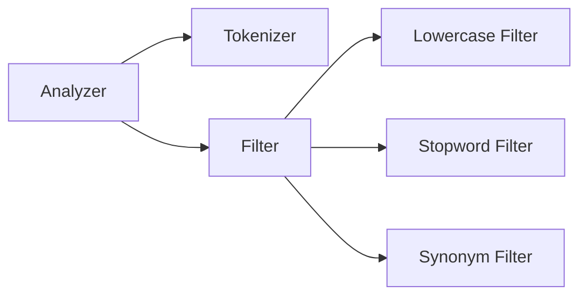

## ES、Lucene、Solr 区别

- es：基于lucene搜索引擎
- solr：基于lucene搜索引擎
- lucene：Lucene是非常优秀的成熟的 开源的 免费的纯 纯java 语言的全文索引检索工具包jar。 是搜索引擎的底层。


## 什么是analyzer、tokenizer、filter？

在 Elasticsearch 中，**Analyzer（分析器）**、**Tokenizer（分词器）** 和 **Filter（过滤器）** 是文本处理的核心组件，它们共同作用将原始文本转换为可搜索的倒排索引。以下是它们的详细解释和协作关系：

---

### **一、核心组件关系图**

```mermaid
graph LR
    A[Analyzer] --> B[Tokenizer]
    A --> C[Filter]
    C --> D[Lowercase Filter]
    C --> E[Stopword Filter]
    C --> F[Synonym Filter]
```

---

### **二、组件功能详解**

#### **1. Analyzer（分析器）**
- **作用**：定义完整的文本处理流程，包含 **1个Tokenizer + 0或多个Filter**。
- **执行阶段**：
  - **索引时（Indexing）**：处理文档内容，生成倒排索引
  - **搜索时（Searching）**：处理查询词条（除非指定单独的`search_analyzer`）

**示例**：标准分析器（`standard` analyzer）的组成：
```json
{
  "analyzer": {
    "standard": {
      "type": "standard",
      "tokenizer": "standard",
      "filter": ["lowercase", "stop"]
    }
  }
}
```

#### **2. Tokenizer（分词器）**
- **作用**：将文本拆分为词元（Token），**每个分析器必须有且仅有一个分词器**。
- **常见类型**：
  | 分词器类型    | 描述             | 示例输入 → 输出                                  |
  | ------------- | ---------------- | ------------------------------------------------ |
  | `standard`    | 按单词边界分词   | `"Hello-World"` → `["Hello", "World"]`           |
  | `whitespace`  | 按空格切分       | `"Hello World"` → `["Hello", "World"]`           |
  | `keyword`     | 不分词，整体输出 | `"Hello World"` → `["Hello World"]`              |
  | `pattern`     | 正则分词         | `"a1b2c3"` 按数字切分 → `["a", "b", "c"]`        |
  | `ik_max_word` | 中文细粒度分词   | `" Elasticsearch"` → `["Elasticsearch", "搜索"]` |

#### **3. Filter（过滤器）**
- **作用**：对 **Tokenizer 输出的词元** 进行二次处理（修改、删除、新增）。
- **常见类型**：
  | 过滤器类型  | 描述       | 示例输入 → 输出                       |
  | ----------- | ---------- | ------------------------------------- |
  | `lowercase` | 转小写     | `"HELLO"` → `"hello"`                 |
  | `stop`      | 移除停用词 | `["a", "the", "quick"]` → `["quick"]` |
  | `stemmer`   | 词干提取   | `"running"` → `"run"`                 |
  | `synonym`   | 同义词扩展 | `"quick"` → `["fast", "speedy"]`      |
  | `ngram`     | 生成N-gram | `"hello"` → `["h", "he", "hel", ...]` |

---

### **三、完整处理流程示例**
**输入文本**：  
`"The Quick Brown Fox Jumps!"`

**分析器配置**：
```json
{
  "analyzer": {
    "my_custom_analyzer": {
      "type": "custom",
      "tokenizer": "standard",
      "filter": ["lowercase", "stop", "stemmer"]
    }
  }
}
```

**处理步骤**：
1. **Tokenizer** (`standard`):  
   `["The", "Quick", "Brown", "Fox", "Jumps"]`
2. **Filter 1** (`lowercase`):  
   `["the", "quick", "brown", "fox", "jumps"]`
3. **Filter 2** (`stop` 移除停用词):  
   `["quick", "brown", "fox", "jumps"]`
4. **Filter 3** (`stemmer` 词干提取):  
   `["quick", "brown", "fox", "jump"]`

**最终索引词项**：  
`["quick", "brown", "fox", "jump"]`

---

### **四、自定义分析器实战**

#### **1. 定义自定义分析器**
```json
PUT /my_index
{
  "settings": {
    "analysis": {
      "analyzer": {
        "my_analyzer": {
          "type": "custom",
          "tokenizer": "ik_max_word",          // 中文分词器
          "filter": [
            "lowercase",
            "my_stopwords",                   // 自定义停用词
            "synonym"                         // 同义词
          ]
        }
      },
      "filter": {
        "my_stopwords": {
          "type": "stop",
          "stopwords": ["的", "是", "了"]     // 中文停用词
        },
        "synonym": {
          "type": "synonym",
          "synonyms": ["搜索 => 检索", "ES => Elasticsearch"]
        }
      }
    }
  }
}
```

#### **2. 测试分析器效果**
```json
GET /my_index/_analyze
{
  "analyzer": "my_analyzer",
  "text": "Elasticsearch的搜索性能非常强大"
}
```

**输出结果**：
```json
{
  "tokens": [
    { "token": "elasticsearch", "position": 0 },
    { "token": "检索", "position": 2 },      // "搜索"被替换为同义词
    { "token": "性能", "position": 3 },
    { "token": "非常", "position": 4 },
    { "token": "强大", "position": 5 }
  ]
}
```

---

### **五、常见内置分析器对比**
| 分析器名称   | 分词器     | 过滤器          | 典型场景           |
| ------------ | ---------- | --------------- | ------------------ |
| `standard`   | standard   | lowercase, stop | 英文文本（默认）   |
| `simple`     | lowercase  | -               | 简单无符号文本     |
| `whitespace` | whitespace | -               | 按空格严格切分     |
| `keyword`    | keyword    | -               | 不分词（如ID字段） |
| `pattern`    | pattern    | lowercase       | 正则匹配分词       |
| `ik_smart`   | ik_smart   | -               | 中文粗粒度分词     |

---

### **六、关键注意事项**
1. **索引 vs 搜索分析器**：
   ```json
   PUT /my_index/_mapping
   {
     "properties": {
       "content": {
         "type": "text",
         "analyzer": "ik_max_word",     // 索引时使用
         "search_analyzer": "ik_smart"  // 搜索时使用
       }
     }
   }
   ```

2. **多字段多分析器**：
   ```json
   "content": {
     "type": "text",
     "fields": {
       "raw":   { "type": "keyword" },          // 不分词
       "english": { "type": "text", "analyzer": "english" },  // 英文分析
       "pinyin": { "type": "text", "analyzer": "pinyin" }    // 拼音搜索
     }
   }
   ```

3. **分词器性能影响**：
   - **复杂分词器**（如`ik_max_word`）会显著增加索引时间
   - **N-gram过滤器**会导致索引膨胀

---

### **七、总结**
- **Analyzer** = **1个Tokenizer + N个Filter**  
- **Tokenizer** 决定如何切分文本（核心步骤）  
- **Filter** 决定如何加工词元（精细化控制）  
- **最佳实践**：根据语言特性选择合适的分词器（英文用`standard`，中文用`ik`），再通过过滤器组合实现高级需求（如拼音搜索、同义词等）。

## shard和replica是什么呢？

在 Elasticsearch（ES）中，**Shard（分片）** 和 **Replica（副本）** 是核心的分布式存储与高可用机制，用于解决大规模数据的存储、查询性能及容错问题。以下是两者的详细解释：


### **一、Shard（分片）：数据的水平拆分单元**
Shard 是 ES 为应对海量数据而设计的**水平拆分机制**，将一个索引（Index）的数据分散存储在多个节点上，实现“分而治之”。


#### **1. 为什么需要 Shard？**
- **突破单节点存储限制**：单个节点的磁盘容量有限，通过分片可将大索引拆分为多个小分片，分布到不同节点，支持 PB 级数据存储。
- **提升查询/写入性能**：查询或写入请求可被并行分发到多个分片处理（每个分片独立计算），显著提高吞吐量。
- **支持分布式扩展**：新增节点时，可通过重新分配分片（Rebalance）利用新节点的资源，弹性扩展集群能力。


#### **2. Shard 的类型**
ES 的分片分为两种：
- **Primary Shard（主分片）**：  
  每个索引创建时需指定主分片数量（默认 1，创建后不可修改！）。主分片是数据的“原始副本”，负责处理所有写操作（如索引文档、更新、删除），并将变更同步到对应的副本分片。

- **Replica Shard（副本分片）**：  
  主分片的冗余拷贝（默认每个主分片有 1 个副本）。副本分片**不处理写操作**（仅从主分片同步数据），但可分担读请求（如搜索、聚合），并作为主分片的故障备份。


#### **3. Shard 的关键特性**
- **路由规则**：文档的存储位置由 `routing` 值决定（默认是文档 `_id` 的哈希值），公式为：  
  `shard = hash(routing) % number_of_primary_shards`  
  因此，**主分片数量一旦确定，无法修改**（否则路由失效，历史数据无法定位）。若需调整，需重建索引并使用 `_reindex` API 迁移数据。

- **分布策略**：ES 会自动将主分片和副本分片分配到不同节点（避免同一分片的主副本共存于单节点），确保节点故障时数据不丢失。


### **二、Replica（副本）：高可用与读性能增强**
Replica 是主分片的冗余副本，核心价值是**高可用性**和**读扩展**。


#### **1. 为什么需要 Replica？**
- **高可用（HA）**：当持有主分片的节点宕机时，ES 会从该主分片的副本中选一个提升为新的主分片（“主分片选举”），确保服务不中断。副本越多，抗故障能力越强（如 2 个副本可容忍 2 个节点同时故障）。
- **提升读性能**：读请求（如搜索）可被分发到任意副本分片（包括主分片），通过负载均衡提高并发处理能力。例如，若有 1 主 + 1 副本，读请求可分摊到 2 个分片，吞吐量翻倍。
- **保护数据**：主分片损坏时，副本可直接替代，避免数据丢失（前提是副本未与主分片共损）。


#### **2. Replica 的配置与特性**
- **动态可调**：副本数量可在运行时通过 API 修改（如 `PUT /my_index/_settings { "number_of_replicas": 2 }`），无需重建索引。
- **不独占节点**：副本分片可与主分片分布在同一节点吗？理论上允许，但生产环境强烈建议禁用（`index.routing.allocation.same_shard.host: true` 配置可强制主副本分片不同节点），否则节点宕机会导致主副分片同时丢失。
- **资源开销**：副本分片会占用额外的磁盘空间（与主分片等量）和计算资源（处理读请求），需根据业务需求平衡（如读多写少可增加副本，写多读少可减少）。


### **三、Shard 与 Replica 的协作流程**
以一次写请求（索引文档）为例：
1. 客户端发送写请求到协调节点（Coordinating Node）。
2. 协调节点根据文档 `_id` 计算路由值，确定目标主分片所在的节点。
3. 主分片节点写入数据，并同步变更到所有关联的副本分片。
4. 当主分片和多数副本分片确认写入成功后，协调节点返回成功响应给客户端。

读请求（搜索）流程类似，但协调节点会将请求分发到所有相关分片（主+副本），合并结果后返回。


### **四、最佳实践**
- **主分片数量**：需根据数据量和集群规模预估。通常建议单分片大小控制在 **10GB~50GB**（过小会增加元数据开销，过大影响恢复速度）。例如，预计索引 100GB 数据，可设置 5 个主分片（100GB/20GB≈5）。
- **副本数量**：至少 1 个（保证高可用），读密集型场景可增至 2~3 个（需权衡磁盘成本）。
- **避免过度分片**：过多分片会增加集群元数据（如分片路由信息）的内存消耗，可能导致集群不稳定（如 Master 节点压力过大）。


### **总结**
- **Shard（分片）**：数据的水平拆分单元，解决存储和性能瓶颈，主分片数量固定，决定数据分布逻辑。  
- **Replica（副本）**：主分片的冗余，解决高可用和读性能问题，数量可动态调整，是分布式系统的“保险”。  

两者共同支撑了 ES 的分布式能力，理解其原理对索引设计、集群调优至关重要。

## 创建大量索引超过集群分片上限1000

使用本站示例 https://gitee.com/dexterleslie/demonstration/tree/main/elasticsearch/demo-benchmark-es7 中testCreate60ClothGoodsIndices协助测试会报告如下错误：

```

RestStatusException{status=400} org.springframework.data.elasticsearch.RestStatusException: Elasticsearch exception [type=validation_exception, reason=Validation Failed: 1: this action would add [2] total shards, but this cluster currently has [1000]/[1000] maximum shards open;]; nested exception is ElasticsearchStatusException[Elasticsearch exception [type=validation_exception, reason=Validation Failed: 1: this action would add [2] total shards, but this cluster currently has [1000]/[1000] maximum shards open;]]

	at org.springframework.data.elasticsearch.core.ElasticsearchExceptionTranslator.translateExceptionIfPossible(ElasticsearchExceptionTranslator.java:69)
	at org.springframework.data.elasticsearch.core.ElasticsearchRestTemplate.translateException(ElasticsearchRestTemplate.java:601)
	at org.springframework.data.elasticsearch.core.ElasticsearchRestTemplate.execute(ElasticsearchRestTemplate.java:584)
	at org.springframework.data.elasticsearch.core.RestIndexTemplate.doCreate(RestIndexTemplate.java:86)
	at org.springframework.data.elasticsearch.core.AbstractIndexTemplate.create(AbstractIndexTemplate.java:116)
	at com.future.demo.Tests.testCreate60ClothGoodsIndices(Tests.java:376)
	at java.base/jdk.internal.reflect.NativeMethodAccessorImpl.invoke0(Native Method)
	at java.base/jdk.internal.reflect.NativeMethodAccessorImpl.invoke(NativeMethodAccessorImpl.java:77)
	at java.base/jdk.internal.reflect.DelegatingMethodAccessorImpl.invoke(DelegatingMethodAccessorImpl.java:43)
	at java.base/java.lang.reflect.Method.invoke(Method.java:568)
	at org.junit.platform.commons.util.ReflectionUtils.invokeMethod(ReflectionUtils.java:725)
	at org.junit.jupiter.engine.execution.MethodInvocation.proceed(MethodInvocation.java:60)
	at org.junit.jupiter.engine.execution.InvocationInterceptorChain$ValidatingInvocation.proceed(InvocationInterceptorChain.java:131)
	at org.junit.jupiter.engine.extension.TimeoutExtension.intercept(TimeoutExtension.java:149)
	at org.junit.jupiter.engine.extension.TimeoutExtension.interceptTestableMethod(TimeoutExtension.java:140)
	at org.junit.jupiter.engine.extension.TimeoutExtension.interceptTestMethod(TimeoutExtension.java:84)
	at org.junit.jupiter.engine.execution.ExecutableInvoker$ReflectiveInterceptorCall.lambda$ofVoidMethod$0(ExecutableInvoker.java:115)
	at org.junit.jupiter.engine.execution.ExecutableInvoker.lambda$invoke$0(ExecutableInvoker.java:105)
	at org.junit.jupiter.engine.execution.InvocationInterceptorChain$InterceptedInvocation.proceed(InvocationInterceptorChain.java:106)
	at org.junit.jupiter.engine.execution.InvocationInterceptorChain.proceed(InvocationInterceptorChain.java:64)
	at org.junit.jupiter.engine.execution.InvocationInterceptorChain.chainAndInvoke(InvocationInterceptorChain.java:45)
	at org.junit.jupiter.engine.execution.InvocationInterceptorChain.invoke(InvocationInterceptorChain.java:37)
	at org.junit.jupiter.engine.execution.ExecutableInvoker.invoke(ExecutableInvoker.java:104)
	at org.junit.jupiter.engine.execution.ExecutableInvoker.invoke(ExecutableInvoker.java:98)
	at org.junit.jupiter.engine.descriptor.TestMethodTestDescriptor.lambda$invokeTestMethod$7(TestMethodTestDescriptor.java:214)
	at org.junit.platform.engine.support.hierarchical.ThrowableCollector.execute(ThrowableCollector.java:73)
	at org.junit.jupiter.engine.descriptor.TestMethodTestDescriptor.invokeTestMethod(TestMethodTestDescriptor.java:210)
	at org.junit.jupiter.engine.descriptor.TestMethodTestDescriptor.execute(TestMethodTestDescriptor.java:135)
	at org.junit.jupiter.engine.descriptor.TestMethodTestDescriptor.execute(TestMethodTestDescriptor.java:66)
	at org.junit.platform.engine.support.hierarchical.NodeTestTask.lambda$executeRecursively$6(NodeTestTask.java:151)
	at org.junit.platform.engine.support.hierarchical.ThrowableCollector.execute(ThrowableCollector.java:73)
	at org.junit.platform.engine.support.hierarchical.NodeTestTask.lambda$executeRecursively$8(NodeTestTask.java:141)
	at org.junit.platform.engine.support.hierarchical.Node.around(Node.java:137)
	at org.junit.platform.engine.support.hierarchical.NodeTestTask.lambda$executeRecursively$9(NodeTestTask.java:139)
	at org.junit.platform.engine.support.hierarchical.ThrowableCollector.execute(ThrowableCollector.java:73)
	at org.junit.platform.engine.support.hierarchical.NodeTestTask.executeRecursively(NodeTestTask.java:138)
	at org.junit.platform.engine.support.hierarchical.NodeTestTask.execute(NodeTestTask.java:95)
	at java.base/java.util.ArrayList.forEach(ArrayList.java:1511)
	at org.junit.platform.engine.support.hierarchical.SameThreadHierarchicalTestExecutorService.invokeAll(SameThreadHierarchicalTestExecutorService.java:41)
	at org.junit.platform.engine.support.hierarchical.NodeTestTask.lambda$executeRecursively$6(NodeTestTask.java:155)
	at org.junit.platform.engine.support.hierarchical.ThrowableCollector.execute(ThrowableCollector.java:73)
	at org.junit.platform.engine.support.hierarchical.NodeTestTask.lambda$executeRecursively$8(NodeTestTask.java:141)
	at org.junit.platform.engine.support.hierarchical.Node.around(Node.java:137)
	at org.junit.platform.engine.support.hierarchical.NodeTestTask.lambda$executeRecursively$9(NodeTestTask.java:139)
	at org.junit.platform.engine.support.hierarchical.ThrowableCollector.execute(ThrowableCollector.java:73)
	at org.junit.platform.engine.support.hierarchical.NodeTestTask.executeRecursively(NodeTestTask.java:138)
	at org.junit.platform.engine.support.hierarchical.NodeTestTask.execute(NodeTestTask.java:95)
	at java.base/java.util.ArrayList.forEach(ArrayList.java:1511)
	at org.junit.platform.engine.support.hierarchical.SameThreadHierarchicalTestExecutorService.invokeAll(SameThreadHierarchicalTestExecutorService.java:41)
	at org.junit.platform.engine.support.hierarchical.NodeTestTask.lambda$executeRecursively$6(NodeTestTask.java:155)
	at org.junit.platform.engine.support.hierarchical.ThrowableCollector.execute(ThrowableCollector.java:73)
	at org.junit.platform.engine.support.hierarchical.NodeTestTask.lambda$executeRecursively$8(NodeTestTask.java:141)
	at org.junit.platform.engine.support.hierarchical.Node.around(Node.java:137)
	at org.junit.platform.engine.support.hierarchical.NodeTestTask.lambda$executeRecursively$9(NodeTestTask.java:139)
	at org.junit.platform.engine.support.hierarchical.ThrowableCollector.execute(ThrowableCollector.java:73)
	at org.junit.platform.engine.support.hierarchical.NodeTestTask.executeRecursively(NodeTestTask.java:138)
	at org.junit.platform.engine.support.hierarchical.NodeTestTask.execute(NodeTestTask.java:95)
	at org.junit.platform.engine.support.hierarchical.SameThreadHierarchicalTestExecutorService.submit(SameThreadHierarchicalTestExecutorService.java:35)
	at org.junit.platform.engine.support.hierarchical.HierarchicalTestExecutor.execute(HierarchicalTestExecutor.java:57)
	at org.junit.platform.engine.support.hierarchical.HierarchicalTestEngine.execute(HierarchicalTestEngine.java:54)
	at org.junit.platform.launcher.core.EngineExecutionOrchestrator.execute(EngineExecutionOrchestrator.java:107)
	at org.junit.platform.launcher.core.EngineExecutionOrchestrator.execute(EngineExecutionOrchestrator.java:88)
	at org.junit.platform.launcher.core.EngineExecutionOrchestrator.lambda$execute$0(EngineExecutionOrchestrator.java:54)
	at org.junit.platform.launcher.core.EngineExecutionOrchestrator.withInterceptedStreams(EngineExecutionOrchestrator.java:67)
	at org.junit.platform.launcher.core.EngineExecutionOrchestrator.execute(EngineExecutionOrchestrator.java:52)
	at org.junit.platform.launcher.core.DefaultLauncher.execute(DefaultLauncher.java:114)
	at org.junit.platform.launcher.core.DefaultLauncher.execute(DefaultLauncher.java:86)
	at org.junit.platform.launcher.core.DefaultLauncherSession$DelegatingLauncher.execute(DefaultLauncherSession.java:86)
	at org.junit.platform.launcher.core.SessionPerRequestLauncher.execute(SessionPerRequestLauncher.java:53)
	at com.intellij.junit5.JUnit5IdeaTestRunner.startRunnerWithArgs(JUnit5IdeaTestRunner.java:57)
	at com.intellij.rt.junit.IdeaTestRunner$Repeater$1.execute(IdeaTestRunner.java:38)
	at com.intellij.rt.execution.junit.TestsRepeater.repeat(TestsRepeater.java:11)
	at com.intellij.rt.junit.IdeaTestRunner$Repeater.startRunnerWithArgs(IdeaTestRunner.java:35)
	at com.intellij.rt.junit.JUnitStarter.prepareStreamsAndStart(JUnitStarter.java:232)
	at com.intellij.rt.junit.JUnitStarter.main(JUnitStarter.java:55)
Caused by: ElasticsearchStatusException[Elasticsearch exception [type=validation_exception, reason=Validation Failed: 1: this action would add [2] total shards, but this cluster currently has [1000]/[1000] maximum shards open;]]
	at org.elasticsearch.rest.BytesRestResponse.errorFromXContent(BytesRestResponse.java:178)
	at org.elasticsearch.client.RestHighLevelClient.parseEntity(RestHighLevelClient.java:2484)
	at org.elasticsearch.client.RestHighLevelClient.parseResponseException(RestHighLevelClient.java:2461)
	at org.elasticsearch.client.RestHighLevelClient.internalPerformRequest(RestHighLevelClient.java:2184)
	at org.elasticsearch.client.RestHighLevelClient.performRequest(RestHighLevelClient.java:2154)
	at org.elasticsearch.client.RestHighLevelClient.performRequestAndParseEntity(RestHighLevelClient.java:2118)
	at org.elasticsearch.client.IndicesClient.create(IndicesClient.java:152)
	at org.springframework.data.elasticsearch.core.RestIndexTemplate.lambda$doCreate$0(RestIndexTemplate.java:86)
	at org.springframework.data.elasticsearch.core.ElasticsearchRestTemplate.execute(ElasticsearchRestTemplate.java:582)
	... 72 more
	Suppressed: org.elasticsearch.client.ResponseException: method [PUT], host [http://localhost:9200], URI [/cloth_goods_497?master_timeout=30s&timeout=30s], status line [HTTP/1.1 400 Bad Request]
{"error":{"root_cause":[{"type":"validation_exception","reason":"Validation Failed: 1: this action would add [2] total shards, but this cluster currently has [1000]/[1000] maximum shards open;"}],"type":"validation_exception","reason":"Validation Failed: 1: this action would add [2] total shards, but this cluster currently has [1000]/[1000] maximum shards open;"},"status":400}
		at org.elasticsearch.client.RestClient.convertResponse(RestClient.java:347)
		at org.elasticsearch.client.RestClient.performRequest(RestClient.java:313)
		at org.elasticsearch.client.RestClient.performRequest(RestClient.java:288)
		at org.elasticsearch.client.RestHighLevelClient.performClientRequest(RestHighLevelClient.java:2699)
		at org.elasticsearch.client.RestHighLevelClient.internalPerformRequest(RestHighLevelClient.java:2171)
		... 77 more


```

查看当前集群分片上限

```
GET /_cluster/settings?include_defaults=true&flat_settings=true

# 显示索引的分片数
GET _cat/shards?v
index                          shard prirep state      docs  store ip          node
cloth_goods_1                  0     p      STARTED       0   208b 172.20.38.3 a044ff035adf
cloth_goods_1                  0     r      UNASSIGNED                         
.kibana_1                      0     p      STARTED       7 51.4kb 172.20.38.3 a044ff035adf
cloth_goods_34                 0     p      STARTED       0   208b 172.20.38.3 a044ff035adf
cloth_goods_34                 0     r      UNASSIGNED                         
cloth_goods_20                 0     p      STARTED       0   208b 172.20.38.3 a044ff035adf
cloth_goods_20                 0     r      UNASSIGNED                         
cloth_goods_23                 0     p      STARTED       0   208b 172.20.38.3 a044ff035adf
cloth_goods_23                 0     r      UNASSIGNED                         
cloth_goods_22                 0     p      STARTED       0   208b 172.20.38.3 a044ff035adf
cloth_goods_22                 0     r      UNASSIGNED                         
cloth_goods_14                 0     p      STARTED       0   208b 172.20.38.3 a044ff035adf
cloth_goods_14                 0     r      UNASSIGNED                         
.kibana_task_manager_1         0     p      STARTED       5 80.4kb 172.20.38.3 a044ff035adf
```

解决方案1：临时调整集群分片上线1000

```
PUT _cluster/settings
{
  "persistent": {
    "cluster.max_shards_per_node": 2000
  }
}
```

解决方案2（todo：下面设置不生效）：在elasticsearch.yaml中设置集群分片上限，具体用法请参考本站示例 https://gitee.com/dexterleslie/demonstration/tree/main/elasticsearch/elasticsearch7

```
cluster.max_shards_per_node: 2000
```

## Segment是什么呢？

在 Elasticsearch 里，**segment（段）**是 Lucene 底层用来存储倒排索引的基本单位，可以理解为：**一个 segment = 一个不可变的“小索引文件集合”**。

---

### 一、Segment 是什么？

- Elasticsearch 的数据最终会落到 **Lucene 索引** 上；  
- 每个 Lucene 索引由很多个 **segment** 组成；  
- 每个 segment 内部包含：
  - **倒排索引**：词 → 文档列表 + 位置信息等  
  - **正排/列式存储**：用于聚合、排序等  
  - **元数据**：docValues、词典、段内文档数等  

这些 segment 都是**只读**的，一旦写入磁盘就不再修改。

---

### 二、为什么要有 Segment？

1. **写入性能高**  
   - 新写入的数据先进入内存缓冲区，定期刷盘成一个新的 segment（不是直接改老数据）。  
   - 不需要锁住整个索引做原地更新，写入并发更好。

2. **查询性能好**  
   - 查询时会同时扫所有 segment，再把结果合并。  
   - 多个小 segment 并行读，效率更高。

3. **便于删除和更新**  
   - 删除一条文档：只是在 segment 上打一个“删除标记”（`.del` 文件），物理数据还在。  
   - 更新一条文档：当成“删除旧文档 + 写入新文档”，新文档进新的 segment。

---

### 三、Segment 的生命周期

1. **创建（flush）**  
   - 内存中的数据达到一定条件（大小、时间、手动 flush）后，刷到磁盘形成一个新 segment。

2. **合并（merge）**  
   - 随着写入越来越多，segment 数量会变多，查询变慢、占用资源变大。  
   - Elasticsearch 会在后台自动触发 **segment merge**，把多个小 segment 合并成少数几个大 segment，并清理已删除文档。  
   - 你也可以手动触发：`POST /<index>/_forcemerge?max_num_segments=1`

3. **删除**  
   - 合并完成后，那些被标记为删除的文档才会真正从磁盘移除。

---

### 四、Segment 太多会有什么问题？

- **查询变慢**：要遍历的 segment 越多，CPU、IO 开销越大。  
- **内存压力**：每个 segment 都有自己的词典、缓存结构，segment 多了占内存多。  
- **恢复慢**：节点重启时需要逐个加载 segment 元数据。

---

### 五、如何查看 Segment 情况？

- 查看某个索引的 segment 数量和大小：  
  ```bash
  GET /_cat/segments/<index_name>?v
  ```
- 查看各节点的 segment 内存占用：  
  ```bash
  GET /_cat/nodes?v&h=name,segments.count,segments.memory
  ```

---

### 六、简单类比帮助理解

可以把 Elasticsearch 索引想象成一本书：

- **segment = 书里的章节**（写完就封存，不再改）；  
- **flush = 写完一章落盘**；  
- **merge = 编辑把几章内容精简合并成一章，删掉废话和作废页**；  
- **delete/update = 在某页上画删除线，但只有重新印书（merge）时才真的去掉那页内容**。

## Segment元数据是什么呢？

在 Elasticsearch（Lucene）里，**segment 元数据**指的是：每个 segment 自身携带的一套“说明书”，用来描述这个 segment 里有哪些文档、用了哪些字段、词典在哪、删除信息在哪等等。它本身也是只读的，保存在磁盘的一组文件中。

可以按用途大致分成几类来看：

---

### 一、基本信息类元数据

- **segment 名称**：  
  如 `_0`、`_1`，通常由前缀+序号构成，用于标识不同的 segment 文件集合。

- **文档数量（numDocs / maxDoc）**：  
  - `numDocs`：当前 segment 中**未被删除**的文档数；  
  - `maxDoc`：segment 中**曾经存在过的文档总数**（含已删除的）。

- **删除文档数量（deletedDocs）**：  
  已被标记为删除、但尚未在 merge 中物理清除的文档数。

---

### 二、字段与索引结构元数据

- **字段列表及属性**：  
  记录这个 segment 中有哪些字段（如 `title`、`timestamp`），以及它们的类型信息（是否分词、是否启用 doc_values、是否存储等）。

- **倒排索引元数据**：  
  对每个字段的倒排索引，会记录：
  - 词典文件位置（term dictionary）：词 → 指针  
  - 倒排列表位置（postings list）：词对应的文档列表、词频、位置等信息

- **DocValues 元数据**：  
  如果字段启用了 doc_values（用于排序、聚合），会记录：
  - 列存数据结构位置与格式（如 SortedNumericDV、SortedSetDV 等）  
  - 对应字段的压缩方式、块大小等

- **存储字段（stored fields）元数据**：  
  保存原始 JSON 中某些字段的内容，用于 `_source` 或 `fields` 查询，会记录：
  - 存储方式（行式/列式）  
  - 每个文档在 `.fdt/.fdx` 等文件中的位置信息

---

### 三、删除与版本控制元数据

- **删除文件（.del）**：  
  记录该 segment 中被删除的文档 ID 列表，查询时要据此过滤掉这些文档。

- **段内版本号 / 序列号**：  
  用于跟踪 segment 的生成顺序、合并历史，确保数据一致性和恢复时的正确性。

---

### 四、其他技术细节

- **段内统计信息**：  
  如某字段的最大最小值、总词数、文档频率等，可用于优化查询计划或做提前终止判断。

- **编码与压缩信息**：  
  记录使用了哪种编码方式（如 LZ4、ZSTD）、块大小等，以便读取时正确解码。

---

### 五、这些元数据存在哪儿？

它们并不是单独一张表，而是分散保存在 segment 对应的文件中，例如：

- `.si`：Segment Info，存放 segment 级别的总体元信息  
- `.fnm`：Fields信息文件，字段列表及其属性  
- `.dvd/.dvx`：DocValues 数据与索引  
- `.tim/.tip`：Term Dictionary 与 Term Index  
- `.del`：删除文档信息  

---

### 六、为什么要关心 segment 元数据？

- **排查查询慢**：看字段是否有 doc_values、倒排索引是否合理。  
- **分析空间占用**：通过 numDocs、deletedDocs 判断 segment 是否“脏”。  
- **理解合并行为**：merge 会生成新 segment，其元数据会反映合并后的真实文档数和删除情况。

## 为何索引越多占用堆内存越大呢？

在 Elasticsearch 中，“索引越多”通常意味着**分片（shard）越多、segment 越多、数据结构越多**，而这些最终都会吃堆内存，主要有几类原因：

---

### 一、每个分片都有独立的内存结构

- 一个 **分片 ≈ 一个独立的 Lucene 索引**。  
- 每个分片在节点启动、查询、合并时，都会在堆里维护：
  - **倒排索引的缓存**：如 term dictionary、跳表、postings 列表的访问结构  
  - **FieldData 缓存**：用于聚合、排序的字段数据（若未开启 doc_values 或用到 text 字段排序/聚合）  
  - **Filter 缓存**：查询条件的结果集缓存（如 bool filter 命中文档位图）  
- 分片数量翻倍，这些结构基本也会成倍增长，堆内存自然上涨。

---

### 二、索引越多 → segment 越多 → 元数据开销越大

- 每个 **segment** 都要在内存中保留一部分元数据：
  - 词典、doc values 索引、field info 等  
  - 即使 segment 已经刷盘，查询时仍要在堆里加载、维护其访问结构  
- 索引越多、写入越频繁，segment 数量越多，堆里的 segment 元数据总量就越大。

---

### 三、索引映射（mapping）带来的开销

- 每个索引都有自己的 mapping 定义，字段越多、类型越复杂：
  - 字段元数据、分词器配置、索引选项等都要在内存中表示  
  - ES 会把这些信息加载到 **cluster state / metadata cache** 中  
- 索引数量一大，metadata 本身就会吃掉可观的堆内存。

---

### 四、缓存机制放大内存占用

Elasticsearch 会用堆内存做各种缓存来提高查询性能：

- **Query Cache**：缓存 filter 查询结果  
- **Request Cache**：缓存聚合结果  
- **Fielddata Cache**：缓存字段用于排序/聚合的内部结构  

这些缓存是按 **分片粒度** 存在的：  
索引越多 → 分片越多 → 缓存条目越多 → 堆占用越高。

---

### 五、协调节点与 Master 节点的额外负担

- **Master 节点**要管理所有索引的元数据（settings、mapping、分配信息），索引越多，这部分状态数据越大，占用的堆就越多。  
- **协调节点**在跨索引查询时，需要维护每个索引/分片的路由、统计信息，同样会随索引数量线性增加。

---

### 六、可以怎么缓解？

- **控制分片数量**：避免一个小索引拆出过多主分片；减少不必要的索引。  
- **合并小 segment**：`_forcemerge` 减少 segment 数，降低元数据与缓存压力。  
- **合理设计 mapping**：减少冗余字段、避免大量 text 字段开 fielddata。  
- **监控堆使用**：通过 `_nodes/stats` 看 `indices.segments.*`、`query_cache`、`fielddata` 等，找到是哪块在吃内存。

## 堆内存占用分析实践

>todo：没有细心分析。

使用本站示例 https://gitee.com/dexterleslie/demonstration/tree/main/elasticsearch/demo-benchmark-es7 中testCreate60ClothGoodsIndices协助测试

查询节点统计信息

```
GET _nodes/stats?human=true
{
  "_nodes" : {
    "total" : 1,
    "successful" : 1,
    "failed" : 0
  },
  "cluster_name" : "docker-cluster",
  "nodes" : {
    "EM6kjOsTSxydo3wTCumrPA" : {
      "timestamp" : 1772249536827,
      "name" : "d1ebc7988ebf",
      "transport_address" : "172.20.40.3:9300",
      "host" : "172.20.40.3",
      "ip" : "172.20.40.3:9300",
      "roles" : [
        "data",
        "ingest",
        "master",
        "ml",
        "remote_cluster_client",
        "transform"
      ],
      "attributes" : {
        "ml.machine_memory" : "23094456320",
        "xpack.installed" : "true",
        "transform.node" : "true",
        "ml.max_open_jobs" : "20"
      },
      "indices" : {
        "docs" : {
          "count" : 17,
          "deleted" : 0
        },
        "store" : {
          "size" : "241.4kb",
          "size_in_bytes" : 247266
        },
        "indexing" : {
          "index_total" : 32,
          "index_time" : "126ms",
          "index_time_in_millis" : 126,
          "index_current" : 0,
          "index_failed" : 0,
          "delete_total" : 0,
          "delete_time" : "0s",
          "delete_time_in_millis" : 0,
          "delete_current" : 0,
          "noop_update_total" : 0,
          "is_throttled" : false,
          "throttle_time" : "0s",
          "throttle_time_in_millis" : 0
        },
        "get" : {
          "total" : 101,
          "getTime" : "97ms",
          "time_in_millis" : 97,
          "exists_total" : 91,
          "exists_time" : "89ms",
          "exists_time_in_millis" : 89,
          "missing_total" : 10,
          "missing_time" : "8ms",
          "missing_time_in_millis" : 8,
          "current" : 0
        },
        "search" : {
          "open_contexts" : 0,
          "query_total" : 242,
          "query_time" : "623ms",
          "query_time_in_millis" : 623,
          "query_current" : 0,
          "fetch_total" : 240,
          "fetch_time" : "35ms",
          "fetch_time_in_millis" : 35,
          "fetch_current" : 0,
          "scroll_total" : 190,
          "scroll_time" : "992ms",
          "scroll_time_in_millis" : 992,
          "scroll_current" : 0,
          "suggest_total" : 0,
          "suggest_time" : "0s",
          "suggest_time_in_millis" : 0,
          "suggest_current" : 0
        },
        "merges" : {
          "current" : 0,
          "current_docs" : 0,
          "current_size" : "0b",
          "current_size_in_bytes" : 0,
          "total" : 0,
          "total_time" : "0s",
          "total_time_in_millis" : 0,
          "total_docs" : 0,
          "total_size" : "0b",
          "total_size_in_bytes" : 0,
          "total_stopped_time" : "0s",
          "total_stopped_time_in_millis" : 0,
          "total_throttled_time" : "0s",
          "total_throttled_time_in_millis" : 0,
          "total_auto_throttle" : "9.8gb",
          "total_auto_throttle_in_bytes" : 10548674560
        },
        "refresh" : {
          "total" : 1030,
          "total_time" : "395ms",
          "total_time_in_millis" : 395,
          "external_total" : 1025,
          "external_total_time" : "374ms",
          "external_total_time_in_millis" : 374,
          "listeners" : 0
        },
        "flush" : {
          "total" : 503,
          "periodic" : 0,
          "total_time" : "57ms",
          "total_time_in_millis" : 57
        },
        "warmer" : {
          "current" : 0,
          "total" : 520,
          "total_time" : "21ms",
          "total_time_in_millis" : 21
        },
        "query_cache" : {
          "memory_size" : "0b",
          "memory_size_in_bytes" : 0,
          "total_count" : 0,
          "hit_count" : 0,
          "miss_count" : 0,
          "cache_size" : 0,
          "cache_count" : 0,
          "evictions" : 0
        },
        "fielddata" : {
          "memory_size" : "0b",
          "memory_size_in_bytes" : 0,
          "evictions" : 0
        },
        "completion" : {
          "size" : "0b",
          "size_in_bytes" : 0
        },
        "segments" : {
          "count" : 10,
          "memory" : "20.9kb",
          "memory_in_bytes" : 21432,
          "terms_memory" : "14.4kb",
          "terms_memory_in_bytes" : 14800,
          "stored_fields_memory" : "4.7kb",
          "stored_fields_memory_in_bytes" : 4880,
          "term_vectors_memory" : "0b",
          "term_vectors_memory_in_bytes" : 0,
          "norms_memory" : "704b",
          "norms_memory_in_bytes" : 704,
          "points_memory" : "0b",
          "points_memory_in_bytes" : 0,
          "doc_values_memory" : "1kb",
          "doc_values_memory_in_bytes" : 1048,
          "index_writer_memory" : "0b",
          "index_writer_memory_in_bytes" : 0,
          "version_map_memory" : "0b",
          "version_map_memory_in_bytes" : 0,
          "fixed_bit_set" : "384b",
          "fixed_bit_set_memory_in_bytes" : 384,
          "max_unsafe_auto_id_timestamp" : -1,
          "file_sizes" : { }
        },
        "translog" : {
          "operations" : 1,
          "size" : "27.3kb",
          "size_in_bytes" : 28034,
          "uncommitted_operations" : 1,
          "uncommitted_size" : "27.3kb",
          "uncommitted_size_in_bytes" : 28034,
          "earliest_last_modified_age" : 0
        },
        "request_cache" : {
          "memory_size" : "1.5kb",
          "memory_size_in_bytes" : 1546,
          "evictions" : 0,
          "hit_count" : 0,
          "miss_count" : 7
        },
        "recovery" : {
          "current_as_source" : 0,
          "current_as_target" : 0,
          "throttle_time" : "0s",
          "throttle_time_in_millis" : 0
        }
      },
      "os" : {
        "timestamp" : 1772249536886,
        "cpu" : {
          "percent" : 19,
          "load_average" : {
            "1m" : 0.92,
            "5m" : 1.78,
            "15m" : 1.9
          }
        },
        "mem" : {
          "total" : "21.5gb",
          "total_in_bytes" : 23094456320,
          "free" : "719.5mb",
          "free_in_bytes" : 754462720,
          "used" : "20.8gb",
          "used_in_bytes" : 22339993600,
          "free_percent" : 3,
          "used_percent" : 97
        },
        "swap" : {
          "total" : "1.9gb",
          "total_in_bytes" : 2147479552,
          "free" : "1.1gb",
          "free_in_bytes" : 1253044224,
          "used" : "853mb",
          "used_in_bytes" : 894435328
        },
        "cgroup" : {
          "cpuacct" : {
            "control_group" : "/",
            "usage_nanos" : 258903282059
          },
          "cpu" : {
            "control_group" : "/",
            "cfs_period_micros" : 100000,
            "cfs_quota_micros" : -1,
            "stat" : {
              "number_of_elapsed_periods" : 0,
              "number_of_times_throttled" : 0,
              "time_throttled_nanos" : 0
            }
          },
          "memory" : {
            "control_group" : "/",
            "limit_in_bytes" : "9223372036854771712",
            "usage_in_bytes" : "1632296960"
          }
        }
      },
      "process" : {
        "timestamp" : 1772249536886,
        "open_file_descriptors" : 1379,
        "max_file_descriptors" : 1048576,
        "cpu" : {
          "percent" : 4,
          "total" : "4.2m",
          "total_in_millis" : 255950
        },
        "mem" : {
          "total_virtual" : "6.1gb",
          "total_virtual_in_bytes" : 6628876288
        }
      },
      "jvm" : {
        "timestamp" : 1772249536888,
        "uptime" : "10.1m",
        "uptime_in_millis" : 606220,
        "mem" : {
          "heap_used" : "416mb",
          "heap_used_in_bytes" : 436218872,
          "heap_used_percent" : 81,
          "heap_committed" : "512mb",
          "heap_committed_in_bytes" : 536870912,
          "heap_max" : "512mb",
          "heap_max_in_bytes" : 536870912,
          "non_heap_used" : "167.6mb",
          "non_heap_used_in_bytes" : 175825160,
          "non_heap_committed" : "179.6mb",
          "non_heap_committed_in_bytes" : 188342272,
          "pools" : {
            "young" : {
              "used" : "7mb",
              "used_in_bytes" : 7340032,
              "max" : "0b",
              "max_in_bytes" : 0,
              "peak_used" : "295mb",
              "peak_used_in_bytes" : 309329920,
              "peak_max" : "0b",
              "peak_max_in_bytes" : 0
            },
            "old" : {
              "used" : "407.4mb",
              "used_in_bytes" : 427211768,
              "max" : "512mb",
              "max_in_bytes" : 536870912,
              "peak_used" : "421.6mb",
              "peak_used_in_bytes" : 442137600,
              "peak_max" : "512mb",
              "peak_max_in_bytes" : 536870912
            },
            "survivor" : {
              "used" : "1.5mb",
              "used_in_bytes" : 1667072,
              "max" : "0b",
              "max_in_bytes" : 0,
              "peak_used" : "39mb",
              "peak_used_in_bytes" : 40894464,
              "peak_max" : "0b",
              "peak_max_in_bytes" : 0
            }
          }
        },
        "threads" : {
          "count" : 93,
          "peak_count" : 94
        },
        "gc" : {
          "collectors" : {
            "young" : {
              "collection_count" : 420,
              "collection_time" : "2.3s",
              "collection_time_in_millis" : 2365
            },
            "old" : {
              "collection_count" : 0,
              "collection_time" : "0s",
              "collection_time_in_millis" : 0
            }
          }
        },
        "buffer_pools" : {
          "mapped" : {
            "count" : 10,
            "used" : "62.8kb",
            "used_in_bytes" : 64380,
            "total_capacity" : "62.8kb",
            "total_capacity_in_bytes" : 64380
          },
          "direct" : {
            "count" : 52,
            "used" : "16.1mb",
            "used_in_bytes" : 16968174,
            "total_capacity" : "16.1mb",
            "total_capacity_in_bytes" : 16968173
          },
          "mapped - 'non-volatile memory'" : {
            "count" : 0,
            "used" : "0b",
            "used_in_bytes" : 0,
            "total_capacity" : "0b",
            "total_capacity_in_bytes" : 0
          }
        },
        "classes" : {
          "current_loaded_count" : 20908,
          "total_loaded_count" : 21002,
          "total_unloaded_count" : 94
        }
      },
      "thread_pool" : {
        "analyze" : {
          "threads" : 0,
          "queue" : 0,
          "active" : 0,
          "rejected" : 0,
          "largest" : 0,
          "completed" : 0
        },
        "ccr" : {
          "threads" : 0,
          "queue" : 0,
          "active" : 0,
          "rejected" : 0,
          "largest" : 0,
          "completed" : 0
        },
        "fetch_shard_started" : {
          "threads" : 0,
          "queue" : 0,
          "active" : 0,
          "rejected" : 0,
          "largest" : 0,
          "completed" : 0
        },
        "fetch_shard_store" : {
          "threads" : 0,
          "queue" : 0,
          "active" : 0,
          "rejected" : 0,
          "largest" : 0,
          "completed" : 0
        },
        "flush" : {
          "threads" : 4,
          "queue" : 0,
          "active" : 0,
          "rejected" : 0,
          "largest" : 4,
          "completed" : 503
        },
        "force_merge" : {
          "threads" : 0,
          "queue" : 0,
          "active" : 0,
          "rejected" : 0,
          "largest" : 0,
          "completed" : 0
        },
        "generic" : {
          "threads" : 7,
          "queue" : 0,
          "active" : 0,
          "rejected" : 0,
          "largest" : 7,
          "completed" : 16373
        },
        "get" : {
          "threads" : 8,
          "queue" : 0,
          "active" : 0,
          "rejected" : 0,
          "largest" : 8,
          "completed" : 91
        },
        "listener" : {
          "threads" : 0,
          "queue" : 0,
          "active" : 0,
          "rejected" : 0,
          "largest" : 0,
          "completed" : 0
        },
        "management" : {
          "threads" : 5,
          "queue" : 0,
          "active" : 1,
          "rejected" : 0,
          "largest" : 5,
          "completed" : 19364
        },
        "ml_datafeed" : {
          "threads" : 0,
          "queue" : 0,
          "active" : 0,
          "rejected" : 0,
          "largest" : 0,
          "completed" : 0
        },
        "ml_job_comms" : {
          "threads" : 0,
          "queue" : 0,
          "active" : 0,
          "rejected" : 0,
          "largest" : 0,
          "completed" : 0
        },
        "ml_utility" : {
          "threads" : 1,
          "queue" : 0,
          "active" : 0,
          "rejected" : 0,
          "largest" : 1,
          "completed" : 597
        },
        "refresh" : {
          "threads" : 4,
          "queue" : 0,
          "active" : 0,
          "rejected" : 0,
          "largest" : 4,
          "completed" : 284053
        },
        "rollup_indexing" : {
          "threads" : 0,
          "queue" : 0,
          "active" : 0,
          "rejected" : 0,
          "largest" : 0,
          "completed" : 0
        },
        "search" : {
          "threads" : 13,
          "queue" : 0,
          "active" : 0,
          "rejected" : 0,
          "largest" : 13,
          "completed" : 483
        },
        "search_throttled" : {
          "threads" : 0,
          "queue" : 0,
          "active" : 0,
          "rejected" : 0,
          "largest" : 0,
          "completed" : 0
        },
        "security-token-key" : {
          "threads" : 0,
          "queue" : 0,
          "active" : 0,
          "rejected" : 0,
          "largest" : 0,
          "completed" : 0
        },
        "snapshot" : {
          "threads" : 1,
          "queue" : 0,
          "active" : 0,
          "rejected" : 0,
          "largest" : 2,
          "completed" : 2
        },
        "transform_indexing" : {
          "threads" : 0,
          "queue" : 0,
          "active" : 0,
          "rejected" : 0,
          "largest" : 0,
          "completed" : 0
        },
        "warmer" : {
          "threads" : 3,
          "queue" : 0,
          "active" : 0,
          "rejected" : 0,
          "largest" : 4,
          "completed" : 48
        },
        "watcher" : {
          "threads" : 0,
          "queue" : 0,
          "active" : 0,
          "rejected" : 0,
          "largest" : 0,
          "completed" : 0
        },
        "write" : {
          "threads" : 8,
          "queue" : 0,
          "active" : 0,
          "rejected" : 0,
          "largest" : 8,
          "completed" : 40
        }
      },
      "fs" : {
        "timestamp" : 1772249536889,
        "total" : {
          "total" : "490.5gb",
          "total_in_bytes" : 526763982848,
          "free" : "197.6gb",
          "free_in_bytes" : 212224688128,
          "available" : "172.6gb",
          "available_in_bytes" : 185391366144
        },
        "least_usage_estimate" : {
          "path" : "/usr/share/elasticsearch/data/nodes/0",
          "total" : "490.5gb",
          "total_in_bytes" : 526763982848,
          "available" : "172.6gb",
          "available_in_bytes" : 185391427584,
          "used_disk_percent" : 64.80559916384877
        },
        "most_usage_estimate" : {
          "path" : "/usr/share/elasticsearch/data/nodes/0",
          "total" : "490.5gb",
          "total_in_bytes" : 526763982848,
          "available" : "172.6gb",
          "available_in_bytes" : 185391427584,
          "used_disk_percent" : 64.80559916384877
        },
        "data" : [
          {
            "path" : "/usr/share/elasticsearch/data/nodes/0",
            "mount" : "/usr/share/elasticsearch/data (/dev/sda5)",
            "type" : "ext4",
            "total" : "490.5gb",
            "total_in_bytes" : 526763982848,
            "free" : "197.6gb",
            "free_in_bytes" : 212224688128,
            "available" : "172.6gb",
            "available_in_bytes" : 185391366144
          }
        ],
        "io_stats" : {
          "devices" : [
            {
              "device_name" : "sda5",
              "operations" : 58182,
              "read_operations" : 2283,
              "write_operations" : 55899,
              "read_kilobytes" : 60216,
              "write_kilobytes" : 902564
            }
          ],
          "total" : {
            "operations" : 58182,
            "read_operations" : 2283,
            "write_operations" : 55899,
            "read_kilobytes" : 60216,
            "write_kilobytes" : 902564
          }
        }
      },
      "transport" : {
        "server_open" : 0,
        "rx_count" : 0,
        "rx_size" : "0b",
        "rx_size_in_bytes" : 0,
        "tx_count" : 0,
        "tx_size" : "0b",
        "tx_size_in_bytes" : 0
      },
      "http" : {
        "current_open" : 19,
        "total_opened" : 54
      },
      "breakers" : {
        "request" : {
          "limit_size_in_bytes" : 322122547,
          "limit_size" : "307.1mb",
          "estimated_size_in_bytes" : 0,
          "estimated_size" : "0b",
          "overhead" : 1.0,
          "tripped" : 0
        },
        "fielddata" : {
          "limit_size_in_bytes" : 214748364,
          "limit_size" : "204.7mb",
          "estimated_size_in_bytes" : 0,
          "estimated_size" : "0b",
          "overhead" : 1.03,
          "tripped" : 0
        },
        "in_flight_requests" : {
          "limit_size_in_bytes" : 536870912,
          "limit_size" : "512mb",
          "estimated_size_in_bytes" : 0,
          "estimated_size" : "0b",
          "overhead" : 2.0,
          "tripped" : 0
        },
        "accounting" : {
          "limit_size_in_bytes" : 536870912,
          "limit_size" : "512mb",
          "estimated_size_in_bytes" : 21432,
          "estimated_size" : "20.9kb",
          "overhead" : 1.0,
          "tripped" : 0
        },
        "parent" : {
          "limit_size_in_bytes" : 510027366,
          "limit_size" : "486.3mb",
          "estimated_size_in_bytes" : 436218872,
          "estimated_size" : "416mb",
          "overhead" : 1.0,
          "tripped" : 0
        }
      },
      "script" : {
        "compilations" : 20,
        "cache_evictions" : 0,
        "compilation_limit_triggered" : 0
      },
      "discovery" : {
        "cluster_state_queue" : {
          "total" : 0,
          "pending" : 0,
          "committed" : 0
        },
        "published_cluster_states" : {
          "full_states" : 2,
          "incompatible_diffs" : 0,
          "compatible_diffs" : 1044
        }
      },
      "ingest" : {
        "total" : {
          "count" : 0,
          "time" : "0s",
          "time_in_millis" : 0,
          "current" : 0,
          "failed" : 0
        },
        "pipelines" : {
          "xpack_monitoring_6" : {
            "count" : 0,
            "time" : "0s",
            "time_in_millis" : 0,
            "current" : 0,
            "failed" : 0,
            "processors" : [
              {
                "script" : {
                  "type" : "script",
                  "stats" : {
                    "count" : 0,
                    "time" : "0s",
                    "time_in_millis" : 0,
                    "current" : 0,
                    "failed" : 0
                  }
                }
              },
              {
                "gsub" : {
                  "type" : "gsub",
                  "stats" : {
                    "count" : 0,
                    "time" : "0s",
                    "time_in_millis" : 0,
                    "current" : 0,
                    "failed" : 0
                  }
                }
              }
            ]
          },
          "xpack_monitoring_7" : {
            "count" : 0,
            "time" : "0s",
            "time_in_millis" : 0,
            "current" : 0,
            "failed" : 0,
            "processors" : [ ]
          }
        }
      },
      "adaptive_selection" : {
        "EM6kjOsTSxydo3wTCumrPA" : {
          "outgoing_searches" : 0,
          "avg_queue_size" : 0,
          "avg_service_time" : "538.7micros",
          "avg_service_time_ns" : 538743,
          "avg_response_time" : "1.1ms",
          "avg_response_time_ns" : 1109238,
          "rank" : "1.1"
        }
      },
      "script_cache" : {
        "sum" : {
          "compilations" : 20,
          "cache_evictions" : 0,
          "compilation_limit_triggered" : 0
        }
      }
    }
  }
}

```

从这份 `_nodes/stats` 输出里，可以很清楚地看到**堆内存主要花在 Lucene segment 相关的数据结构上**，其次是 JVM 自身的一些固定开销。下面按层次帮你拆解一下：

---

### 一、先看整体堆使用情况

```json
"jvm": {
  "mem": {
    "heap_used": "416mb",
    "heap_used_in_bytes": 436218872,
    "heap_used_percent": 81,
    "heap_committed": "512mb",
    "heap_max": "512mb"
  }
}
```

- 堆总大小：512 MB  
- 已用：416 MB，占比 **81%** —— 已经比较高了，需要关注哪里吃掉的。

---

### 二、按 JVM 内存池看：Old 区占了绝大多数

```json
"pools": {
  "young": { "used": "7mb", ... },
  "survivor": { "used": "1.5mb", ... },
  "old": { "used": "407.4mb", ... }
}
```

- **Old 区：407.4 MB / 512 MB ≈ 79.6%**  
- Young + Survivor 总共才约 8.5 MB，几乎可以忽略。  
- 说明：堆里绝大部分对象都在老年代，这类对象通常是**长期存活的缓存、索引结构、元数据**，而不是临时对象。

---

### 三、看 indices.segments：这就是 Old 区的主要来源

```json
"segments": {
  "count": 10,
  "memory": "20.9kb",
  "memory_in_bytes": 21432,
  "terms_memory": "14.4kb",
  "stored_fields_memory": "4.7kb",
  "norms_memory": "704b",
  "doc_values_memory": "1kb",
  "fixed_bit_set": "384b"
}
```

- 这里显示的是 **单个 segment 级别的内存统计**，单位是 KB 级，看起来很小。  
- 但它只是**当前节点上所有 segment 内存的汇总**，而且只统计了“可被精确追踪”的那部分（term dict、doc values、norms 等）。  
- 实际上，JVM Old 区的 400+ MB 里，**大部分就是这些 segment 结构的放大版**：
  - 每个 segment 有自己的 term dictionary、postings、doc values 索引等；
  - 你这里有 10 个 segment，如果每个 segment 内部结构再复杂一点，乘以 segment 数量，再加上各种缓存，就很容易涨到几百兆。

---

### 四、其他可能的大户（在你这份数据里都不大）

1. **Query Cache / Fielddata / Request Cache**

   ```json
   "query_cache": { "memory_size": "0b", ... },
   "fielddata":   { "memory_size": "0b", ... },
   "request_cache": { "memory_size": "1.5kb", ... }
   ```

   - 全部几乎为空，说明不是它们占堆。

2. **Breakers（熔断器）统计**

   ```json
   "accounting": {
     "estimated_size_in_bytes": 21432,   // 20.9kb
     ...
   },
   "parent": {
     "estimated_size_in_bytes": 436218872, // 416mb
     ...
   }
   ```

   - `accounting` 这一项基本等于 `segments.memory` 的 20.9 KB，是 ES 能“精确算出来”的 segment 内存。  
   - `parent` 的 416 MB 是**整个堆的估计值**，和 `jvm.mem.heap_used` 基本吻合，说明**堆里主要就是这些“无法精确细分的”索引/段相关结构**。

3. **非堆内存（Metaspace 等）**

   ```json
   "non_heap_used": "167.6mb"
   ```

   - 这是 JVM 方法区、类元数据、Direct Buffer 等，不占堆，但也是进程内存的一部分，需要一起看机器总内存压力。

---

### 五、结合你这份数据得出的结论

- **堆内存大头（~400MB）在 Old 区，主要来源于：**
  - 各个 Lucene segment 的倒排索引、doc values、字段元数据等结构；
  - 少量来自 request cache（1.5 KB，可忽略）。
- **Query Cache / Fielddata 基本没开或没命中，不是压力源。**
- **当前节点数据量很小（docs=17，store=241KB），却有 10 个 segment、堆用 81%，说明：**
  - 可能是频繁写入又 flush，导致 segment 数量偏多；
  - 或者堆本身设置太小（512 MB），稍微一点 segment 元数据就撑满。

---

### 六、你可以怎么进一步验证？

1. 看每个索引的 segment 分布：  
   ```bash
   GET /_cat/segments?v
   ```
2. 看 segment 数量是否远大于预期（比如一个很小的索引就有很多段）。  
3. 考虑：
   - 适当增大堆（比如至少给到 1–2 GB，视机器内存而定）；  
   - 减少不必要的索引/分片；  
   - 对只读索引执行 `_forcemerge` 降低 segment 数量。

### 七、结论

索引越多Segment元数据越多，越占用堆内存最终会导致Data too large报错。

## 运行


### 使用`docker compose`运行`elasticsearch7`

>详细设置请参考本站 [链接](https://gitee.com/dexterleslie/demonstration/tree/master/elasticsearch/elasticsearch7)

编译镜像

```bash
docker compose build
```

启用`elasticsearch7`和`kibana`

```bash
docker compose up -d
```

关闭`elasticsearch7`和`kibana`

```bash
docker compose down -v
```

访问`kibana`地址`http://localhost:5601`


### 使用`docker compose`运行`elasticsearch8`

>详细设置请参考本站 [链接](https://gitee.com/dexterleslie/demonstration/tree/master/elasticsearch/elasticsearch8)

编译镜像

```bash
docker compose build
```

启用`elasticsearch8`和`kibana`

```bash
docker compose up -d
```

关闭`elasticsearch8`和`kibana`

```bash
docker compose down -v
```

访问`kibana`地址`http://localhost:5601`


## 中文`IK`和拼音插件

插件下载地址：https://release.infinilabs.com


## 中文`IK`分词器动态词汇扩展

>详细用法请参考本站 [示例1](https://gitee.com/dexterleslie/demonstration/tree/main/elasticsearch/elasticsearch7) 和 [示例2](https://gitee.com/dexterleslie/demonstration/tree/main/elasticsearch/demo-ik-analyzer-extend)
>
>[参考链接](https://blog.csdn.net/qq_43692950/article/details/122274613)

在示例1中启动 elasticsearch7 服务

```bash
docker compose up -d
```

使用示例2运行单元测试，因为使用 http 方式扩展 ik 分词器并且添加“日琳”和“精讲”词汇，所以单元测试能够通过。


## 客户端


### spring-data-elasticsearch

#### 和SpringBoot、Elasticsearch版本兼容列表

>说明：SpringBoot2.7.18不能使用Spring Data Elasticsearch操作ES8（需要使用co.elastic.clients:elasticsearch-java:8.1.2客户端操作，具体用法请参考本站[示例](https://gitee.com/dexterleslie/demonstration/tree/main/elasticsearch/elasticsearch8-java-client)），SpringBoot2.2.7.RELEASE和SpringBoot2.7.18能够使用Spring Data Elasticsearch操作ES7（具体用法请参考本站[示例1](https://gitee.com/dexterleslie/demonstration/tree/main/elasticsearch/demo-spring-data-elasticsearch-2.2.7.RELEASE-es7)和[示例2](https://gitee.com/dexterleslie/demonstration/tree/main/elasticsearch/demo-spring-data-elasticsearch-2.7.18-es7)）。SpringBoot3.x能够使用Spring Data Elasticsearch操作ES8（具体用法请参考本站[示例](https://gitee.com/dexterleslie/demonstration/tree/main/elasticsearch/demo-spring-data-elasticsearch-3.x-es8)）。
>
>[参考链接](https://docs.spring.io/spring-data/elasticsearch/reference/elasticsearch/versions.html)

Spring Boot 3.x 和 Spring Data Elasticsearch 5.x/6.x

>Spring Boot 3.x 与 Spring Framework 6.x 兼容，需要 Spring Data Elasticsearch 5.x 或更高版本，后者使用新的 Elasticsearch Java API 客户端（TransportClient 在 Elasticsearch 8.x 中被移除）。

| Spring Data Release Train | Spring Boot  | Spring Data Elasticsearch | Elasticsearch Server |
| ------------------------- | ------------ | ------------------------- | -------------------- |
| **2025.1**                | 4.0.x        | 6.0.x                     | 9.2.3+               |
| **2025.0**                | 3.5.x        | 5.5.x                     | 8.18.1+              |
| **2024.1**                | 3.4.x        | 5.4.x                     | 8.15.5+              |
| **2024.0**                | 3.3.x        | 5.3.x                     | 8.13.4+              |
| **2023.1** (Vaughan)      | 3.2.x        | 5.2.x                     | 8.11.1+              |
| **2023.0** (Ullmann)      | 3.0.x, 3.1.x | 5.1.x                     | 8.7.1+               |
| **2022.0** (Turing)       | 3.0.x        | 5.0.x                     | 8.5.3+               |

Spring Boot 2.x 和 Spring Data Elasticsearch 4.x

>对于较旧的应用程序，适用以下版本。请注意，这些版本大多已停止维护。

| Spring Data Release Train | Spring Boot | Spring Data Elasticsearch | Elasticsearch Server |
| ------------------------- | ----------- | ------------------------- | -------------------- |
| **2021.2** (Raj)          | 2.7.x       | 4.4.x                     | 7.17.3+              |
| **2021.1** (Q)            | 2.6.x       | 4.3.x                     | 7.15.2+              |
| **2021.0** (Pascal)       | 2.5.x       | 4.2.x                     | 7.12.0+              |
| **2020.0** (Ockham)       | 2.4.x       | 4.1.x                     | 7.9.3+               |

#### 用法

详细用法请参考本站 [示例](https://gitee.com/dexterleslie/demonstration/tree/main/elasticsearch/demo-spring-data-elasticsearch)

运行示例需要启动 elasticsearch7。


### Java Transport Client

>提醒：目前项目业务实现使用此客户端。
>
>[Java Transport Client](https://www.elastic.co/guide/en/elasticsearch/client/java-api/6.8/index.html)

详细用法请参考本站 [示例](https://gitee.com/dexterleslie/demonstration/tree/main/elasticsearch/elasticsearch-java-transport-client)

运行示例需要启动 elasticsearch7。


### Java High Level REST Client

>注意：无法使用 `elasticsearch-rest-high-level-client` 操作 `elasticsearch8`，可能是因为 `elasticsearch8 docker` 启动不正确导致。
>
>[参考链接](https://www.elastic.co/guide/en/elasticsearch/client/java-rest/current/java-rest-high.html)

详细用法请参考本站 [示例](https://gitee.com/dexterleslie/demonstration/tree/main/elasticsearch/elasticsearch-rest-high-level-client)

运行示例需要启动 elasticsearch7。


### Java Low Level REST Client

>[参考链接](https://www.elastic.co/guide/en/elasticsearch/client/java-rest/current/java-rest-low.html)


### Elasticsearch Java Client

> 提醒：`elasticsearch 8.x` 以上官方推荐使用这个客户端操作 `elasticsearch`。
>
> [参考链接](https://www.elastic.co/guide/en/elasticsearch/client/java-api-client/current/index.html)
>
> 详细用法请参考本站 [示例](https://gitee.com/dexterleslie/demonstration/tree/main/elasticsearch/elasticsearch8-java-client)


#### 基本配置和使用

非 SpringBoot 项目 POM 配置如下：

```xml
<properties>
    <maven.compiler.source>1.8</maven.compiler.source>
    <maven.compiler.target>1.8</maven.compiler.target>
</properties>

<dependency>
    <groupId>co.elastic.clients</groupId>
    <artifactId>elasticsearch-java</artifactId>
    <version>8.1.2</version> <!-- 版本号应与Elasticsearch服务器版本一致 -->
</dependency>
<dependency>
    <groupId>com.fasterxml.jackson.core</groupId>
    <artifactId>jackson-databind</artifactId>
    <version>2.18.1</version>
</dependency>
<dependency>
    <groupId>com.fasterxml.jackson.datatype</groupId>
    <artifactId>jackson-datatype-jsr310</artifactId>
    <version>2.18.1</version>
</dependency>
<dependency>
    <groupId>org.projectlombok</groupId>
    <artifactId>lombok</artifactId>
    <version>1.18.36</version>
</dependency>
```

SpringBoot 项目 POM 配置如下：

```xml
<properties>
    <maven.compiler.source>1.8</maven.compiler.source>
    <maven.compiler.target>1.8</maven.compiler.target>
</properties>

<dependency>
    <groupId>co.elastic.clients</groupId>
    <artifactId>elasticsearch-java</artifactId>
    <version>8.1.2</version> <!-- 版本号应与Elasticsearch服务器版本一致 -->
</dependency>
<dependency>
    <groupId>jakarta.json</groupId>
    <artifactId>jakarta.json-api</artifactId>
    <version>2.0.1</version>
</dependency>
<dependency>
    <groupId>org.projectlombok</groupId>
    <artifactId>lombok</artifactId>
    <version>1.18.36</version>
</dependency>
```

AbstractTestSupport.java

```java
public class AbstractTestSupport {
    protected ElasticsearchClient client = null;
    private RestClient restClient;
    private ElasticsearchTransport transport;

    @Before
    public void setup() {
        // 1. 创建RestClient（底层HTTP客户端）
        restClient = RestClient.builder(
                new HttpHost("localhost", 9200, "http") // 单节点配置
                // 多节点示例：new HttpHost("host2", 9200, "http"), ...
        ).build();

        // 2. 创建Transport层（序列化/反序列化）
        transport = new RestClientTransport(
                restClient,
                new JacksonJsonpMapper() // 使用Jackson作为JSON处理器
        );

        // 3. 创建ElasticsearchClient
        client = new ElasticsearchClient(transport);
    }

    @After
    public void teardown() throws IOException {
        if (transport != null) {
            transport.close();
            transport = null;
        }
        if (restClient != null) {
            restClient.close();
            restClient = null;
        }
    }
}
```

测试

```java
/**
 * 测试基本配置和使用
 *
 * @throws IOException
 */
@Test
public void testBasicUsage() throws IOException {
    String index = "demo_index";
    // 删除索引
    try {
        String finalIndex = index;
        DeleteIndexResponse deleteIndexResponse = client.indices().delete(DeleteIndexRequest.of(o -> o.index(finalIndex)));
        Assert.assertTrue(deleteIndexResponse.acknowledged());
    } catch (Exception ex) {
        // 忽略索引不存在
    }

    // 创建索引
    List<Map<String, Object>> datumList = new ArrayList<Map<String, Object>>() {{
        add(new HashMap<String, Object>() {{
            put("id", "1");
            put("content", "a");
            DateTimeFormatter dateTimeFormatter = DateTimeFormatter.ofPattern("yyyy-MM-dd HH:mm:ss");
            put("createTime", dateTimeFormatter.format(LocalDateTime.now()));
        }});
        add(new HashMap<String, Object>() {{
            put("id", "2");
            put("content", "a");
            DateTimeFormatter dateTimeFormatter = DateTimeFormatter.ofPattern("yyyy-MM-dd HH:mm:ss");
            put("createTime", dateTimeFormatter.format(LocalDateTime.now()));
        }});
        add(new HashMap<String, Object>() {{
            put("id", "3");
            put("content", "a1");
            DateTimeFormatter dateTimeFormatter = DateTimeFormatter.ofPattern("yyyy-MM-dd HH:mm:ss");
            put("createTime", dateTimeFormatter.format(LocalDateTime.now()));
        }});
        add(new HashMap<String, Object>() {{
            put("id", "4");
            put("content", "a2");
            DateTimeFormatter dateTimeFormatter = DateTimeFormatter.ofPattern("yyyy-MM-dd HH:mm:ss");
            put("createTime", dateTimeFormatter.format(LocalDateTime.now()));
        }});
    }};

    CreateIndexRequest createIndexRequest = new CreateIndexRequest.Builder().index(index)
            .mappings(m -> m
                    .properties("id", p -> p.long_(l -> l.store(false)))
                    .properties("content", p -> p.text(t -> t
                            .store(false)
                            .analyzer("ik_max_word")))
                    // 用于测试 LocalDateTime 类型
                    .properties("createTime", p -> p.date(t -> t.store(false).format("yyyy-MM-dd HH:mm:ss")))
            ).build();
    CreateIndexResponse createIndexResponse = client.indices().create(createIndexRequest);
    Assert.assertEquals(Boolean.TRUE, createIndexResponse.acknowledged());

    // 插入数据到索引中
    datumList.forEach(datum -> {
        try {
            IndexRequest<Map<String, Object>> indexRequest = IndexRequest.of(o -> {
                return o.index(index)
                        .id(String.valueOf(datum.get("id"))) // 设置文档 ID
                        .document(datum)
                        .refresh(Refresh.True); // 设置文档内容
            });
            IndexResponse indexResponse = client.index(indexRequest);
            Assert.assertEquals(Result.Created, indexResponse.result());
        } catch (IOException e) {
            e.printStackTrace();
            Assert.fail(e.getMessage());
        }
    });
}
```


#### 批量插入

```java
/**
 * 测试批量插入
 *
 * @throws IOException
 */
@Test
public void testBulkInsertion() throws IOException {
    String index = "demo_index";
    // 删除索引
    try {
        String finalIndex = index;
        DeleteIndexResponse deleteIndexResponse = client.indices().delete(DeleteIndexRequest.of(o -> o.index(finalIndex)));
        Assert.assertTrue(deleteIndexResponse.acknowledged());
    } catch (Exception ex) {
        // 忽略索引不存在
    }

    // 创建索引
    List<Map<String, Object>> datumList = new ArrayList<Map<String, Object>>() {{
        add(new HashMap<String, Object>() {{
            put("id", "1");
            put("content", "a");
            DateTimeFormatter dateTimeFormatter = DateTimeFormatter.ofPattern("yyyy-MM-dd HH:mm:ss");
            put("createTime", dateTimeFormatter.format(LocalDateTime.now()));
        }});
        add(new HashMap<String, Object>() {{
            put("id", "2");
            put("content", "a");
            DateTimeFormatter dateTimeFormatter = DateTimeFormatter.ofPattern("yyyy-MM-dd HH:mm:ss");
            put("createTime", dateTimeFormatter.format(LocalDateTime.now()));
        }});
        add(new HashMap<String, Object>() {{
            put("id", "3");
            put("content", "a1");
            DateTimeFormatter dateTimeFormatter = DateTimeFormatter.ofPattern("yyyy-MM-dd HH:mm:ss");
            put("createTime", dateTimeFormatter.format(LocalDateTime.now()));
        }});
        add(new HashMap<String, Object>() {{
            put("id", "4");
            put("content", "a2");
            DateTimeFormatter dateTimeFormatter = DateTimeFormatter.ofPattern("yyyy-MM-dd HH:mm:ss");
            put("createTime", dateTimeFormatter.format(LocalDateTime.now()));
        }});
    }};

    // region 批量插入

    List<BulkOperation> operations = new ArrayList<>();

    for (Map<String, Object> datum : datumList) {
        String finalIndex3 = index;
        operations.add(BulkOperation.of(b -> b
                .index(i -> i
                        .index(finalIndex3)
                        .id(String.valueOf(datum.get("id"))) // 设置文档 ID
                        .document(datum) // 设置文档内容
                )
        ));
    }

    List<BulkOperation> finalOperations1 = operations;
    BulkRequest request = BulkRequest.of(b -> b
            .operations(finalOperations1)
            .refresh(Refresh.True) // 设置刷新策略为 IMMEDIATE
    );

    // 执行批量请求
    BulkResponse response = client.bulk(request);
    Assert.assertFalse(response.errors());
    Assert.assertEquals(datumList.size(), response.items().size());
    response.items().forEach(o -> Assert.assertNull(o.error()));

    // endregion

    // region 测试批量插入错误处理

    index = "demo_index_errors";
    try {
        String finalIndex2 = index;
        DeleteIndexResponse deleteIndexResponse = client.indices().delete(DeleteIndexRequest.of(o -> o.index(finalIndex2)));
        Assert.assertTrue(deleteIndexResponse.acknowledged());
    } catch (Exception ex) {
        // 忽略索引不存在
    }

    CreateIndexRequest createIndexRequest = new CreateIndexRequest.Builder().index(index)
            .mappings(m -> m
                    .properties("id", p -> p.long_(l -> l.store(false)))
                    .properties("content", p -> p.text(t -> t
                            .store(false)
                            .analyzer("ik_max_word")))
                    // LocalDateTime 类型没有指定 format 是为了测试批量插入时错误
                    .properties("createTime", p -> p.date(t -> t.store(false)))
            ).build();
    CreateIndexResponse createIndexResponse = client.indices().create(createIndexRequest);
    Assert.assertEquals(Boolean.TRUE, createIndexResponse.acknowledged());

    operations = new ArrayList<>();

    for (Map<String, Object> datum : datumList) {
        String finalIndex4 = index;
        operations.add(BulkOperation.of(b -> b
                .index(i -> i
                        .index(finalIndex4)
                        .id(String.valueOf(datum.get("id"))) // 设置文档 ID
                        .document(datum) // 设置文档内容
                )
        ));
    }

    List<BulkOperation> finalOperations = operations;
    request = BulkRequest.of(b -> b
            .operations(finalOperations)
            .refresh(Refresh.True) // 设置刷新策略为 IMMEDIATE
    );

    // 执行批量请求
    response = client.bulk(request);
    Assert.assertTrue(response.errors());
    Assert.assertEquals(datumList.size(), response.items().size());
    response.items().forEach(o -> Assert.assertNotNull(o.error()));
    // reason 错误原因样例：failed to parse field [createTime] of type [date] in document with id '1'. Preview of field's value: '2025-06-02 19:32:17'
    response.items().forEach(o -> Assert.assertTrue(o.error().reason().contains("failed to parse field [createTime] of type [date] in document with id")));

    // endregion
}
```


#### `term` 等值查询

```java
/**
 * 用户查询指定日期范围+指定状态的订单
 *
 * @param userId
 * @param status
 * @param startTime
 * @param endTime
 * @return
 */
public List<OrderDTO> listByUserIdAndStatus(
        Long userId,
        Status status,
        LocalDateTime startTime,
        LocalDateTime endTime) throws IOException {

    // 1. 构建查询条件
    DateTimeFormatter dateTimeFormatter = DateTimeFormatter.ofPattern("yyyy-MM-dd HH:mm:ss");
    Query boolQuery = QueryBuilders.bool()
            .filter(QueryBuilders.term().field("userId").value(userId).build()._toQuery())
            .filter(QueryBuilders.term().field("status").value(status.name()).build()._toQuery())
            .filter(QueryBuilders.terms().field("deleteStatus")
                    .terms(t -> t.value(Arrays.stream(DeleteStatus.values()).map(o -> FieldValue.of(o.name())).collect(Collectors.toList())))
                    .build()._toQuery())
            .filter(QueryBuilders.range()
                    .field("createTime")
                    .gte(JsonData.of(dateTimeFormatter.format(startTime)))
                    .lte(JsonData.of(dateTimeFormatter.format(endTime)))
                    .build()._toQuery()
            )
            .build()._toQuery();

    // 2. 构建排序和分页
    SearchRequest searchRequest = SearchRequest.of(s -> s
            .index("t_order")
            .query(boolQuery)
            .sort(so -> so.field(f -> f.field("id").order(SortOrder.Desc)))
            .from(0)
            .size(20)
    );

    // 3. 执行查询
    SearchResponse<OrderModel> response = client.search(searchRequest, OrderModel.class);

    // 4. 解析结果
    List<OrderModel> orderModelList = response.hits().hits().stream()
            .map(Hit::source)
            .collect(Collectors.toList());

    return this.convertOrderEntityToOrderDTO(orderModelList);
}
```


#### `term in` 查询

```java
private List<OrderDetailModel> listOrderDetailByOrderIds(List<Long> orderIdList) throws IOException {
    // 1. 构建查询条件
    Query termsQuery = QueryBuilders.terms()
            .field("orderId")
            .terms(t -> t.value(orderIdList.stream().map(FieldValue::of).collect(Collectors.toList())))
            .build()._toQuery();

    // 2. 构建排序和分页
    SearchRequest searchRequest = SearchRequest.of(s -> s
            .index("t_order_detail")
            .query(termsQuery)
    );

    // 3. 执行查询
    SearchResponse<OrderDetailModel> response = client.search(searchRequest, OrderDetailModel.class);

    // 4. 解析结果
    return response.hits().hits().stream()
            .map(Hit::source)
            .collect(Collectors.toList());
}
```


#### LocalDateTime 类型处理

POM 配置添加如下依赖

```xml
<dependency>
    <groupId>com.fasterxml.jackson.datatype</groupId>
    <artifactId>jackson-datatype-jsr310</artifactId>
    <version>2.18.1</version>
</dependency>
```

客户端初始化添加如下逻辑：

```java
// 支持 LocalDateTime 类型处理
JacksonJsonpMapper mapper = new JacksonJsonpMapper(new ObjectMapper().registerModule(new JavaTimeModule()));
transport = new RestClientTransport(
        restClient,
        mapper // 使用Jackson作为JSON处理器
);
```

测试

```java
/**
 * 测试 LocalDateTime 类型处理
 *
 * @throws IOException
 */
@Test
public void testLocalDateTimeDataType() throws IOException {
    // region 测试自定义 Bean 中的 LocalDateTime 类型处理

    String index = "demo_index";
    // 删除索引
    try {
        DeleteIndexResponse deleteIndexResponse = client.indices().delete(DeleteIndexRequest.of(o -> o.index(index)));
        Assert.assertTrue(deleteIndexResponse.acknowledged());
    } catch (Exception ex) {
        // 忽略索引不存在
    }

    // 创建索引
    List<MyBean> datumList = new ArrayList<MyBean>() {{
        add(new MyBean(1L, "a", LocalDateTime.now()));
        add(new MyBean(2L, "a", LocalDateTime.now()));
        add(new MyBean(3L, "a1", LocalDateTime.now()));
        add(new MyBean(4L, "a2", LocalDateTime.now()));
    }};

    CreateIndexRequest createIndexRequest = new CreateIndexRequest.Builder().index(index)
            .mappings(m -> m
                    .properties("id", p -> p.long_(l -> l.store(false)))
                    .properties("content", p -> p.text(t -> t
                            .store(false)
                            .analyzer("ik_max_word")))
                    // 用于测试 LocalDateTime 类型
                    .properties("createTime", p -> p.date(t -> t.store(false).format("yyyy-MM-dd HH:mm:ss")))
            ).build();
    CreateIndexResponse createIndexResponse = client.indices().create(createIndexRequest);
    Assert.assertEquals(Boolean.TRUE, createIndexResponse.acknowledged());

    // 插入数据到索引中
    datumList.forEach(datum -> {
        try {
            IndexRequest<MyBean> indexRequest = IndexRequest.of(o -> {
                return o.index(index)
                        .id(String.valueOf(datum.getId())) // 设置文档 ID
                        .document(datum)
                        .refresh(Refresh.True); // 设置文档内容
            });
            IndexResponse indexResponse = client.index(indexRequest);
            Assert.assertEquals(Result.Created, indexResponse.result());
        } catch (IOException e) {
            e.printStackTrace();
            Assert.fail(e.getMessage());
        }
    });

    // endregion
}

@Data
@AllArgsConstructor
@NoArgsConstructor
public static class MyBean {
    private Long id;
    private String content;
    // 处理 LocalDateTime 类型
    @JsonFormat(pattern = "yyyy-MM-dd HH:mm:ss")
    private LocalDateTime createTime;
}
```

## 实现好友、群组、群组成员、聊天消息关键字搜索功能

详细用法请参考本站 [示例](https://gitee.com/dexterleslie/demonstration/tree/main/elasticsearch/elasticsearch-practise-demo)

运行示例需要启动 elasticsearch7。


## 性能实验

### `Java transport client`单条插入和批量插入性能对比

详细的`jmh`代码请参考`https://gitee.com/dexterleslie/demonstration/blob/master/elasticsearch/elasticsearch7/elasticsearch-java-transport-client/src/test/java/com/future/demo/elasticsearch/IndividualAndBulkAddPerfComparisonTests.java`

实验结论：批量插入性能高于单条插入性能。


### 中文和拼音搜索

>说明：单机的ElasticSearch在性能测试过程中CPU很容易被占满，注释订单排序代码`.sort(so -> so.field(f -> f.field("id").order(SortOrder.Desc)))`之后情况有所环境，但是QPS也只有150/s。

使用本站[示例](https://gitee.com/dexterleslie/demonstration/tree/main/elasticsearch/demo-order-management-app)辅助测试。

编译并推送镜像

```sh
./build.sh && ./push.sh
```

复制部署配置

```sh
ansible-playbook playbook-deployer-config.yml --inventory inventory.ini
```

部署测试目标

```sh
ansible-playbook playbook-service-start.yml --inventory inventory.ini
```

验证测试目标服务是否正常

```sh
curl http://192.168.1.185/api/v1/order/initInsertBatch
```

准备测试数据

```sh
wrk -t8 -c32 -d300000000000s --latency --timeout 60 http://192.168.1.185/api/v1/order/initInsertBatch
```

执行性能测试

```sh
wrk -t8 -c2048 -d300000000000s --latency --timeout 60 http://192.168.1.185/api/v1/order/listByKeyword
```

销毁测试目标

```sh
ansible-playbook playbook-service-destroy.yml --inventory inventory.ini
```

### wildcard、prefix、term查询

#### ES7

>ES -Xms1g -Xmx1g。

使用本站示例协助测试：https://gitee.com/dexterleslie/demonstration/tree/main/elasticsearch/demo-benchmark-es7

启动ES7服务：https://gitee.com/dexterleslie/demonstration/tree/main/elasticsearch/elasticsearch7

```sh
docker compose up -d
```

初始化150w数据（每个公司15w左右数据）

```sh
ab -n 1500 -c 32 -k http://localhost:8080/api/v1/goods/generate
```

wildcard测试

```sh
$ wrk -t8 -c32 -d30s --latency --timeout 60 http://localhost:8080/api/v1/goods/queryByCompanyIdAndNameWildcard
Running 30s test @ http://localhost:8080/api/v1/goods/queryByCompanyIdAndNameWildcard
  8 threads and 32 connections
  Thread Stats   Avg      Stdev     Max   +/- Stdev
    Latency   344.78ms   43.74ms 485.92ms   68.25%
    Req/Sec    12.62      6.06    30.00     58.43%
  Latency Distribution
     50%  343.11ms
     75%  375.50ms
     90%  401.93ms
     99%  444.40ms
  2772 requests in 30.03s, 367.88KB read
Requests/sec:     92.32
Transfer/sec:     12.25KB

```

prefix查询

```sh
$ wrk -t8 -c32 -d30s --latency --timeout 60 http://localhost:8080/api/v1/goods/queryByCompanyIdAndNamePrefix
Running 30s test @ http://localhost:8080/api/v1/goods/queryByCompanyIdAndNamePrefix
  8 threads and 32 connections
  Thread Stats   Avg      Stdev     Max   +/- Stdev
    Latency    11.42ms    2.80ms  57.84ms   81.44%
    Req/Sec   352.62     29.79   440.00     69.71%
  Latency Distribution
     50%   10.79ms
     75%   12.30ms
     90%   14.72ms
     99%   21.43ms
  84416 requests in 30.07s, 10.96MB read
Requests/sec:   2807.78
Transfer/sec:    373.21KB
```

term查询

```sh
$ wrk -t8 -c32 -d30s --latency --timeout 60 http://localhost:8080/api/v1/goods/queryByCompanyIdAndNameTerm
Running 30s test @ http://localhost:8080/api/v1/goods/queryByCompanyIdAndNameTerm
  8 threads and 32 connections
  Thread Stats   Avg      Stdev     Max   +/- Stdev
    Latency    10.63ms    2.64ms  42.21ms   82.48%
    Req/Sec   378.89     31.66   620.00     71.08%
  Latency Distribution
     50%   10.03ms
     75%   11.43ms
     90%   13.58ms
     99%   20.49ms
  90696 requests in 30.08s, 11.75MB read
Requests/sec:   3015.62
Transfer/sec:    400.21KB
```

#### ES8

>ES -Xms1g -Xmx1g。
>
>提示：测试1500万数据时，根据name的wildcard查询很慢，此时通过设置name字段类型为wildcard并使用WildcardQuery解决，具体用法请参考协助测试示例中的queryByCompanyIdAndNameWildcardField接口。

使用本站示例协助测试：https://gitee.com/dexterleslie/demonstration/tree/main/elasticsearch/demo-benchmark-es8

启动ES8服务：https://gitee.com/dexterleslie/demonstration/tree/main/elasticsearch/elasticsearch8

```sh
docker compose up -d
```

初始化150w数据（每个公司15w左右数据）

```sh
ab -n 1500 -c 32 -k http://localhost:8080/api/v1/goods/generate
```

wildcard测试

```sh
$ wrk -t8 -c32 -d30s --latency --timeout 60 http://localhost:8080/api/v1/goods/queryByCompanyIdAndNameWildcard
Running 30s test @ http://localhost:8080/api/v1/goods/queryByCompanyIdAndNameWildcard
  8 threads and 32 connections
  Thread Stats   Avg      Stdev     Max   +/- Stdev
    Latency   197.48ms   24.98ms 302.83ms   68.21%
    Req/Sec    20.34      7.99    40.00     44.25%
  Latency Distribution
     50%  196.24ms
     75%  213.42ms
     90%  229.82ms
     99%  262.19ms
  4850 requests in 30.03s, 642.32KB read
Requests/sec:    161.49
Transfer/sec:     21.39KB

```

prefix查询

```sh
$ wrk -t8 -c32 -d30s --latency --timeout 60 http://localhost:8080/api/v1/goods/queryByCompanyIdAndNamePrefix
Running 30s test @ http://localhost:8080/api/v1/goods/queryByCompanyIdAndNamePrefix
  8 threads and 32 connections
  Thread Stats   Avg      Stdev     Max   +/- Stdev
    Latency     9.01ms    3.31ms 104.56ms   90.09%
    Req/Sec   452.67     62.92   640.00     72.83%
  Latency Distribution
     50%    8.30ms
     75%    9.72ms
     90%   11.78ms
     99%   21.39ms
  108358 requests in 30.07s, 14.05MB read
Requests/sec:   3603.92
Transfer/sec:    478.63KB
```

term查询

```sh
$ wrk -t8 -c32 -d30s --latency --timeout 60 http://localhost:8080/api/v1/goods/queryByCompanyIdAndNameTerm
Running 30s test @ http://localhost:8080/api/v1/goods/queryByCompanyIdAndNameTerm
  8 threads and 32 connections
  Thread Stats   Avg      Stdev     Max   +/- Stdev
    Latency     8.08ms    2.26ms  44.32ms   84.32%
    Req/Sec   500.59     47.39   650.00     65.33%
  Latency Distribution
     50%    7.63ms
     75%    8.77ms
     90%   10.27ms
     99%   17.69ms
  119776 requests in 30.05s, 15.52MB read
Requests/sec:   3985.30
Transfer/sec:    528.68KB
```

## 数据类型

### `keyword`

`keyword` 类型用于存储需要完全匹配的字符串，例如：枚举值（如订单状态：`Unpay`、`Undelivery` 等），ID、代码、标签等，分类字段（如产品类别、用户角色）。与 `text` 类型不同，`keyword` 类型不会启用分析器，不会对值进行分词或处理。


### `text`

`text` 是 Elasticsearch 中用于存储和分析文本数据的核心字段类型，专为全文搜索设计。支持对文本内容进行分词、索引和模糊匹配，例如：搜索文章、博客、产品描述等长文本内容。实现关键词搜索、自动补全、拼写纠正等功能。通过分析器（Analyzer）将文本拆分为词项（Terms），便于索引和查询。


### `date`

`date` 类型用于存储日期和时间信息，例如订单的付款时间、创建时间等。Elasticsearch 的 `date` 类型支持日期范围查询、日期聚合、日期直方图等操作。

```json
{
  "mappings": {
    "properties": {
      "payTime": {
        "type": "date",
        "format": "yyyy-MM-dd HH:mm:ss||epoch_millis",  // 支持多种格式
        "null_value": null  // 可选：指定 null 值的处理方式
      }
    }
  }
}
```

date 类型支持多种日期格式，例如：

- `yyyy-MM-dd HH:mm:ss`（如 `2023-10-01 12:00:00`）
- `epoch_millis`（Unix 时间戳，毫秒级）
- `strict_date_optional_time`（严格格式，支持 ISO 8601）

可以通过 `format` 参数指定一个或多个格式。


## 子字段

Elasticsearch 8 中的**子字段（Sub-fields）**是字段映射（mapping）中的一个重要概念，它允许你为同一个字段值定义多种不同的索引方式，从而支持不同的搜索和分析需求。以下是关于子字段的详细说明：

---

### **一、子字段的核心概念**
子字段是**父字段的附属字段**，它们：
1. **共享相同的原始值**（来自同一个字段内容）
2. **拥有独立的索引配置**（不同的分词器、数据类型等）
3. **用于不同的搜索场景**（精确匹配、全文搜索、聚合等）

#### **典型应用场景**：
- 一个文本字段同时需要**分词搜索**和**精确匹配**
- 一个数字字段需要**不同精度**的存储
- 支持**多语言处理**（如中英文混合字段）

---

### **二、子字段的常见类型**
#### 1. **多分词策略子字段**
```json
{
  "mappings": {
    "properties": {
      "title": {
        "type": "text",
        "analyzer": "ik_max_word",  // 主字段用中文分词
        "fields": {
          "english": {
            "type": "text",
            "analyzer": "english"    // 子字段用英文分词
          },
          "keyword": {
            "type": "keyword"       // 子字段用于精确匹配
          }
        }
      }
    }
  }
}
```
- 搜索时通过 `title.english` 或 `title.keyword` 指定子字段

#### 2. **多数据类型子字段**
```json
{
  "mappings": {
    "properties": {
      "price": {
        "type": "float",           // 主字段存储原始值
        "fields": {
          "approx": {
            "type": "integer"      // 子字段存储近似整数值
          }
        }
      }
    }
  }
}
```

#### 3. **多语言支持子字段**
```json
{
  "mappings": {
    "properties": {
      "content": {
        "type": "text",
        "fields": {
          "cn": { "type": "text", "analyzer": "ik_smart" },
          "en": { "type": "text", "analyzer": "english" }
        }
      }
    }
  }
}
```

---

### **三、子字段的搜索与聚合**
#### 1. **查询时指定子字段**
```json
GET /products/_search
{
  "query": {
    "match": {
      "title.keyword": "华为手机"  // 精确匹配
    }
  }
}
```

#### 2. **多子字段组合查询**
```json
GET /articles/_search
{
  "query": {
    "multi_match": {
      "query": "人工智能",
      "fields": ["content", "content.cn^2"]  // 中文子字段权重更高
    }
  }
}
```

#### 3. **子字段聚合**
```json
GET /products/_search
{
  "aggs": {
    "price_groups": {
      "histogram": {
        "field": "price.approx",  // 使用子字段近似值
        "interval": 1000
      }
    }
  }
}
```

---

### **四、Elasticsearch 8 中子字段的新特性**
1. **更严格的动态映射控制**  
   8.x 版本默认禁用动态映射，子字段需要明确定义：
   ```json
   {
     "mappings": {
       "dynamic": "strict",  // 禁止自动创建字段
       "properties": {...}
     }
   }
   ```

2. **对 `keyword` 子字段的优化**  
   自动生成的 `keyword` 子字段（如 `field.keyword`）在 8.x 中默认禁用，需显式声明：
   ```json
   {
     "mappings": {
       "properties": {
         "name": {
           "type": "text",
           "fields": {
             "raw": { "type": "keyword" }  // 必须手动定义
           }
         }
       }
     }
   }
   ```

3. **支持 `flattened` 类型的子字段**  
   用于索引嵌套 JSON 对象：
   ```json
   {
     "mappings": {
       "properties": {
         "metadata": {
           "type": "flattened",
           "fields": {
             "exact": { "type": "keyword" }
           }
         }
       }
     }
   }
   ```

---

### **五、子字段 vs 多字段（Multi-fields）**
在 Elasticsearch 7.x 之前称为 "multi-fields"，8.x 后统一称为子字段（sub-fields），但核心概念相同。

---

### **六、实际案例：电商商品映射**
```json
PUT /products
{
  "mappings": {
    "properties": {
      "name": {
        "type": "text",
        "analyzer": "ik_max_word",
        "fields": {
          "pinyin": {
            "type": "text",
            "analyzer": "pinyin_analyzer"
          },
          "keyword": {
            "type": "keyword",
            "ignore_above": 256
          }
        }
      },
      "price": {
        "type": "scaled_float",
        "scaling_factor": 100,
        "fields": {
          "usd": {
            "type": "float"
          }
        }
      }
    }
  }
}
```
- `name` 字段：支持中文分词、拼音搜索和精确匹配
- `price` 字段：存储精确值（如 19.99 → 保存为 1999）和原始浮点数

---

### **七、验证子字段映射**
```bash
GET /products/_mapping/field/name*
```
返回结果示例：
```json
{
  "products": {
    "mappings": {
      "name": {
        "full_name": "name",
        "mapping": {
          "analyzer": "ik_max_word",
          "fields": {
            "pinyin": { "type": "text", "analyzer": "pinyin_analyzer" },
            "keyword": { "type": "keyword", "ignore_above": 256 }
          },
          "type": "text"
        }
      }
    }
  }
}
```

---

### **总结**
| 特性           | 说明                                                |
| -------------- | --------------------------------------------------- |
| **共享原始值** | 所有子字段从同一字段获取数据                        |
| **独立配置**   | 每个子字段可设置不同的数据类型/分词器               |
| **搜索灵活性** | 通过 `field.subfield` 语法指定搜索方式              |
| **存储开销**   | 会增加索引大小（但远小于冗余存储多个字段）          |
| **ES8 变化**   | 需显式定义子字段，默认不再自动生成 `keyword` 子字段 |

子字段是 Elasticsearch 实现**一源多用**的核心机制，合理使用能显著提升搜索效率和灵活性。

### 示例

>详细用法请参考本站 [示例](https://gitee.com/dexterleslie/demonstration/tree/main/elasticsearch/elasticsearch8-java-client)

```java
CreateIndexRequest createIndexRequest = new CreateIndexRequest.Builder().index(index)
        .mappings(m -> m
                .properties("id", p -> p.long_(l -> l.store(false)))
                .properties("content", p -> p.text(t -> t
                        .store(false)
                        .analyzer("ik_max_word")
                        // content 字段添加子字段支持拼音搜索
                        .fields("pinyin", ft -> ft.text(t1 ->
                                t1.analyzer("pinyin")
                                        .store(false)))
                ))
                .properties("userId", p -> p.long_(l -> l.store(false)))
                .properties("productId", p -> p.long_(l -> l.store(false)))
                // 用于测试 LocalDateTime 类型
                .properties("createTime", p -> p.date(t -> t.store(false).format("yyyy-MM-dd HH:mm:ss")))
        ).build();
CreateIndexResponse createIndexResponse = client.indices().create(createIndexRequest);
Assert.assertEquals(Boolean.TRUE, createIndexResponse.acknowledged());
```

## wildcard类型字段查询错误率测试

>说明：10万左右的数据目前没有发现有错误率。

使用本站示例测试：https://gitee.com/dexterleslie/demonstration/tree/main/elasticsearch/demo-benchmark-es8

测试com.future.demo.Tests#testNameWildcardQueryAccuracy

## `Rest API`

### 统计索引中文档总数

```json
GET /t_order/_count
{
  "query": {
    "match_all": {}
  }
}

GET /t_order_detail/_count
{
  "query": {
    "match_all": {}
  }
}
```

