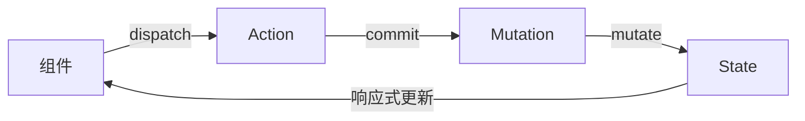

## 总结

如下：

- 在 `App.vue` 首页定义 `App` 的主体布局，详细用法请参考本站 [示例](https://gitee.com/dexterleslie/demonstration/tree/main/front-end/demo-vue/vue3-router)。


## 类似`Android Studio Layout Editor`功能

使用浏览器 + 开发服务器热重载方法可以实现类似 `Android Studio Layout Editor` 功能，一边修改代码一边预览 `UI` 效果。

使用 `Win` + 左右方向键把 `VSCode` 和浏览器分别左右分屏，再独自拖动 `VSCode` 调整窗口尺寸到适宜的大小即可实现一边修改代码一边预览的效果。


## 使用`window.alert()`弹窗

错误用法：

```vue
<button @click="(e)=>{window.alert('H')}">返回</button>

<!--
直接在箭头函数中调用 window.alert() 方法是不允许的，会导致下面错误
runtime-core.esm-bundler.js:455 Uncaught TypeError: Cannot read properties of undefined (reading 'alert')
    at Object.onClick._cache.<computed>._cache.<computed> (VM947 App.vue:37:62)
    at callWithErrorHandling (runtime-core.esm-bundler.js:386:19)
    at callWithAsyncErrorHandling (runtime-core.esm-bundler.js:393:17)
    at HTMLButtonElement.invoker (runtime-dom.esm-bundler.js:1046:89)
Object.onClick._cache.<computed>._cache.<computed> @ VM947 App.vue:37
callWithErrorHandling @ runtime-core.esm-bundler.js:386
callWithAsyncErrorHandling @ runtime-core.esm-bundler.js:393
invoker @ runtime-dom.esm-bundler.js:1046
App.vue:20 re-render
-->
```


正确用法：

```vue
<button @click="showAlert">返回</button>

<script>
export default {
  name: "Help",
  methods: {
    showAlert() {
      // 默认调用 window 全局对象的函数
      alert("H")
    }
  }
}
</script>
```


## 计算属性

>[Vue 官方文档计算属性参考](https://cn.vuejs.org/guide/essentials/computed)
>
>详细用法请参考本站 [示例](https://gitee.com/dexterleslie/demonstration/tree/master/front-end/demo-vue/vue2-computed)

```html
<hr>
<div>演示计算属性的用法</div>
<div>a+b={{ funAPlusB }}</div>
<div>a-b={{ funAMinusB }}</div>
```

```html

<script>
export default {
  data() {
    return {
      a: 11,
      b: 2
    }
  },
  computed: {
    funAPlusB() {
      return this.a + this.b
    },
    funAMinusB() {
      return this.a - this.b
    }
  }
}
</script>
```


## VSCode 开发环境配置


### 安装 Vue 插件

在 VSCode Extensions 中输入 `vue` 关键词进行搜索，安装如下插件：

- Vue VSCode Snippets，作者：sarah.drasner，介绍：Snippets that will supercharge your Vue workflow
- Vue - Official，作者：vuejs.org，介绍：Language Support for Vue


### Vue VSCode Snippets 插件

>[参考链接](https://marketplace.visualstudio.com/items?itemName=sdras.vue-vscode-snippets)


#### Vue 片段

>这些代码片段旨在为您的单文件组件（SFC）提供基础支架。SFC 代表 single file components。

| Snippet     | Purpose            |
| ----------- | ------------------ |
| `vbase-css` | 带 CSS 的 SFC 基础 |


## 组件化开发/自定义组件


### 本站示例

详细用法请参考本站 [示例](https://gitee.com/dexterleslie/demonstration/tree/master/front-end/demo-vue/vue3-component)

安装依赖

```bash
npm install
```

启动示例

```bash
npm run serve
```

编译发布示例

```bash
npm run build
```


### 自定义组件

下面演示自定义 ComponentNavigator 组件

在 src/components/ 中新建文件 ComponentNavigator.vue，内容如下：

```vue
<template>
  <div>
    这是ComponentConent
  </div>
</template>

<script>
export default {
  name: "ComponentNavigator",
  data() {
    return {
      internalVar: false,
    }
  },
  methods: {
    toggleMethod() {
      this.internalVar = !this.internalVar
      console.log(`internalVar=${this.internalVar}`)
    }
  }
}
</script>

<style scoped>

</style>
```

引用自定义组件，在 src/App.vue 中引用自定义组件，代码如下：

```vue
<template>
  <!-- 布局 -->
  <div class="container">
    <button @click="handleCallComponentMethod()">测试1</button>
    <div class="header">
      <ComponentHeader></ComponentHeader>
    </div>
    <div class="body">
      <div class="body-navigator">
        <!-- 引用自定义组件 -->
        <ComponentNavigator ref="myNavigator"></ComponentNavigator>
      </div>
      <div class="body-content">
        <ComponentContent></ComponentContent>
      </div>
    </div>
    <div class="footer">
      <ComponentFooter></ComponentFooter>
    </div>
  </div>
</template>

<script>
// 导入自定义组件
import ComponentNavigator from "@/components/ComponentNavigator";

export default {
  name: 'App',
  components: {
    // 注册自定义组件
    ComponentNavigator,
  },
}
</script>

<style>
</style>

```


### 组件化开发

下面演示页面的主体布局组件化的思想

src/components/ComponentContent.vue 代码如下：

```vue
<template>
  <div>
    这是ComponentContent
  </div>
</template>

<script>
export default {
  name: "ComponentContent"
}
</script>

<style scoped>

</style>
```

src/components/ComponentFooter.vue 代码如下：

```vue
<template>
  <div>
    这是ComponentFooter
  </div>
</template>

<script>
export default {
  name: "ComponentFooter"
}
</script>

<style scoped>

</style>
```

src/components/ComponentHeader.vue 代码如下：

```vue
<template>
  <div>
    这是ComponentHeader
  </div>
</template>

<script>
export default {
  name: "ComponentHeader"
}
</script>

<style scoped>

</style>
```

src/components/ComponentNavigator.vue 代码如下：

```vue
<template>
  <div>
    这是ComponentConent
  </div>
</template>

<script>
export default {
  name: "ComponentNavigator",
  data() {
    return {
      internalVar: false,
    }
  },
  methods: {
    toggleMethod() {
      this.internalVar = !this.internalVar
      console.log(`internalVar=${this.internalVar}`)
    }
  }
}
</script>

<style scoped>

</style>
```

src/App.vue 引用各个组件，代码如下：

```vue
<template>
  <!-- 布局 -->
  <div class="container">
    <button @click="handleCallComponentMethod()">测试1</button>
    <div class="header">
      <ComponentHeader></ComponentHeader>
    </div>
    <div class="body">
      <div class="body-navigator">
        <!-- 引用自定义组件 -->
        <ComponentNavigator ref="myNavigator"></ComponentNavigator>
      </div>
      <div class="body-content">
        <ComponentContent></ComponentContent>
      </div>
    </div>
    <div class="footer">
      <ComponentFooter></ComponentFooter>
    </div>
  </div>
</template>

<script>
import ComponentHeader from "@/components/ComponentHeader";
// 导入自定义组件
import ComponentNavigator from "@/components/ComponentNavigator";
import ComponentContent from "@/components/ComponentContent";
import ComponentFooter from "@/components/ComponentFooter";

export default {
  name: 'App',
  components: {
    ComponentHeader,
    // 注册自定义组件
    ComponentNavigator,
    ComponentContent,
    ComponentFooter
  },
  methods: {
    handleCallComponentMethod() {
      this.$refs.myNavigator.toggleMethod()
    }
  }
}
</script>

<style>
html, body {
  margin: 0;
  padding: 0;
}
.container {
  width: 600px;
  height: 600px;
  background-color: #888888;
}
.header {
  width: 100%;
  height: 100px;
  background-color: #42b983;
}
.body {
  width: 100%;
  height: 300px;
  background-color: #cccccc;
}
.body-navigator {
  float: left;
  width: 25%;
  height: 100%;
  background-color: aquamarine;
}
.body-content {
  float: right;
  width: 75%;
  height: 100%;
  background-color: beige;
}
.footer {
  width: 100%;
  height: 200px;
  background-color: #42b983;
}
</style>

```


### 向 `Vue` 原型链注入自定义方法

>详细用法请参考本站 [示例](https://gitee.com/dexterleslie/demonstration/tree/main/front-end/demo-vue/demo-vue2-cli-my-component-lib)

自定义组件中的 `index.js`：

```javascript
// install 方法是 Vue 插件的约定方法，Vue.use() 会调用这个方法。
// 在这里，install 方法接收 Vue 构造函数作为参数，并通过 Vue.component 全局注册两个组件 MyComponent1 和 MyComponent2。
// 这样，当插件被安装后，这两个组件就可以在任何地方的模板中直接使用，比如 <MyComponent1 /> 和 <MyComponent2 />。
const install = function (Vue) {
    // 向 Vue 原型链注入自定义方法
    // 模仿 element-ui 的 Message 组件下面的调用方式：
    //      1、this.$message.error('错了哦，这是一条错误消息'); 
    //      2、this.$message({
    //          message: '警告哦，这是一条警告消息',
    //          type: 'warning'
    //         });
    function myMessage(options) {
        var type = options.type
        var messageText = options.message
        if (type === 'error') {
            myMessage.error(messageText)
        } else {
            alert(`未知参数类型 options.type=${type}`)
        }
    }
    myMessage.error = function (messageText) {
        alert(messageText)
    }
    Vue.prototype.$message = myMessage
};

// 自动注册插件（针对 Vue 2.x 的浏览器环境）
// 如果该库是通过 <script> 标签直接引入的（通常用于浏览器环境），window.Vue 会存在，表示全局的 Vue 构造函数。
// 代码会自动检测到全局的 Vue 对象，并调用 install(window.Vue)，将组件自动注册到全局。
// 这使得开发者无需手动调用 Vue.use()，即可直接使用组件。
if (typeof window !== 'undefined' && window.Vue) {
    install(window.Vue);
}

// 导出组件和插件方法
// install 方法：使得该库可以作为 Vue 插件使用，通过 Vue.use() 来安装。
// MyComponent1 和 MyComponent2：单独导出组件，支持按需引入。
// 
// 开发者可以按需引入某个组件，而不是必须引入整个插件。例如：
//      import { MyComponent1 } from 'my-component-library';
//      Vue.component('MyComponent1', MyComponent1);
//
export default {
    install
};

```

引用自定义组件库，`main.js`：

```javascript
import Vue from 'vue'
import App from './App.vue'
import MyComponentPlugin from "./index"

// 注册自定义组件库到 Vue 中
Vue.use(MyComponentPlugin)

Vue.config.productionTip = false

new Vue({
  render: h => h(App),
}).$mount('#app')

```

在 `Vue` 中调用注入的自定义方法，`App.vue`：

```vue
<template>
  <div id="app">
    <button @click="handleClick1()">使用方法：this.$message.error({ ... })调用</button>&nbsp;&nbsp;
    <button @click="handleClick2()">使用方法：this.$message({ ... })调用</button>
  </div>
</template>

<script>
export default {
  name: 'App',
  components: {
  },
  methods: {
    handleClick1() {
      // 在 Vue 中使用 this.$message 提示功能，本质是 ​​Element UI 插件向 Vue 原型链注入了 $message 方法​​。
      this.$message.error('错了哦，这是一条错误消息')
    },
    handleClick2() {
      // 在 Vue 中使用 this.$message 提示功能，本质是 ​​Element UI 插件向 Vue 原型链注入了 $message 方法​​。
      this.$message({
        message: '错了哦，这是一条错误消息',
        type: 'error'
      })
    }
  }
}
</script>

<style>
#app {
  font-family: Avenir, Helvetica, Arial, sans-serif;
  -webkit-font-smoothing: antialiased;
  -moz-osx-font-smoothing: grayscale;
  text-align: center;
  color: #2c3e50;
  margin-top: 60px;
}
</style>

```


### 自定义属性

>详细用法请参考本站 [示例](https://gitee.com/dexterleslie/demonstration/tree/main/front-end/demo-vue/demo-vue2-customize-properties)

#### 简单数组声明

>适合快速声明不需要的复杂校验的属性。

`CustomizePropertiesByUsingArray.vue`：

```vue
<template>
    <div>
        <!-- 使用简单数组声明自定义属性 -->
        {{ message }} - {{ count }}
    </div>
</template>

<script>
export default {
    // 使用简单数组声明自定义属性
    props: ['message', 'count']
}
</script>

<style scoped></style>
```

传递值给自定义属性

```vue
<template>
  <div id="app">
    <div>简单数组声明自定义属性</div>
    <CustomizePropertiesByUsingArray message="测试消息" count="8,234"></CustomizePropertiesByUsingArray>
    <hr />
  </div>
</template>

<script>
import CustomizePropertiesByUsingArray from '@/components/CustomizePropertiesByUsingArray.vue'

export default {
  name: 'App',
  components: {
    CustomizePropertiesByUsingArray
  }
}
</script>
```


#### 对象形式声明

>支持类型校验、默认值、是否必填等校验规则，推荐生产环境使用。

`CustomizePropertiesByUsingObject.vue`：

```vue
<template>
    <div>
        <p>Message: {{ message }}</p>
        <p>Count: {{ count }}</p>
        <p>User: {{ user.name }}</p>
        <p>Timeout: {{ timeout }}</p>
        <p>Status: {{ status }}</p>
    </div>
</template>

<script>
export default {
    props: {
        // 基础类型校验（null/undefined 允许任何类型）
        message: String,

        // 多个可能的类型
        count: [Number, String], // count 可以是 Number 或 String

        // 必填项 + 类型校验
        user: {
            type: Object,
            required: true // 必须传入，否则控制台警告
        },

        // 默认值（仅对非必填属性有效）
        timeout: {
            type: Number,
            default: 1000 // 默认值为 1000
        },

        // 自定义校验函数
        status: {
            type: String,
            validator: function (value) {
                // 校验值必须是 'active' 或 'inactive'
                return ['active', 'inactive'].includes(value)
            }
        }
    },
}
</script>

<style scoped></style>
```

传递值给自定义属性：

```vue
<template>
  <div id="app">
    <div>对象形式声明自定义属性</div>
    <CustomizePropertiesByUsingObject :user="user" message="Hello" count="8,234" status="active"></CustomizePropertiesByUsingObject>
  </div>
</template>

<script>
import HelloWorld from './components/HelloWorld.vue'
import CustomizePropertiesByUsingObject from '@/components/CustomizePropertiesByUsingObject.vue'

export default {
  name: 'App',
  components: {
    HelloWorld,
    CustomizePropertiesByUsingObject
  },
  data() {
    return {
      user: {
        name: 'Dexter'
      }
    }
  }
}
</script>

<style>
#app {
  font-family: Avenir, Helvetica, Arial, sans-serif;
  -webkit-font-smoothing: antialiased;
  -moz-osx-font-smoothing: grayscale;
  text-align: center;
  color: #2c3e50;
  margin-top: 60px;
}
</style>

```


### 动态挂载自定义组件到特定 `DOM` 节点

>提醒：动态挂载自定义组件到特定 `DOM` 节点通常用于需要存在多个自定义实例的情况，例如：消息提示框。
>
>详细用法请参考本站 [示例](https://gitee.com/dexterleslie/demonstration/tree/main/front-end/demo-vue/demo-vue2-mount-customize-component-dynamically)

定义自定义组件 `MyComponent.vue`：

```vue
<template>
    <div>
        你好，{{ name }}！<button @click="$emit('close')">关闭</button>
    </div>
</template>

<script>
export default {
    props: ["name"]
}
</script>

<style scoped></style>
```

动态挂载自定义组件到指定 `DOM` 节点：

```vue
<template>
  <div id="app">
    <div>测试动态挂载自定义组件到指定 DOM 节点</div>
    <button @click="handleClickMountDynamically()">动态挂载</button>
    <div ref="mountPoint"></div>
    <hr />
  </div>
</template>

<script>
import MyComponent from '@/components/MyComponent.vue'
import Vue from 'vue'

export default {
  name: 'App',
  methods: {
    handleClickMountDynamically() {
      const MyComponentConstructor = Vue.extend(MyComponent)
      const instance = new MyComponentConstructor({
        propsData: { name: "Dexter" }
      })

      // 手动挂载到 DOM（挂载到 #mountPoint 内）
      instance.$mount();
      this.$refs.mountPoint.appendChild(instance.$el);

      // 监听关闭事件（销毁实例）
      instance.$on('close', () => {
        // 销毁组件实例
        instance.$destroy();
        // 从 DOM 移除
        instance.$el.parentNode.removeChild(instance.$el);
      });
    }
  }
}
</script>

<style>
#app {
  font-family: Avenir, Helvetica, Arial, sans-serif;
  -webkit-font-smoothing: antialiased;
  -moz-osx-font-smoothing: grayscale;
  text-align: center;
  color: #2c3e50;
  margin-top: 60px;
}
</style>

```


## 数据更新但视图不更新问题

>[参考链接](https://stackoverflow.com/questions/44800470/vue-js-updated-array-item-value-doesnt-update-in-page)
>
>详细用法请参考本站 [示例](https://gitee.com/dexterleslie/demonstration/tree/master/front-end/demo-vue/vue2-data-changed-but-view-not-update-problem)

下面情况存在问题：

- 动态为对象添加属性不能自动更新到视图中
- 动态删除对象属性不能自动更新到视图中
- 使用索引修改数组值不能自动更新到视图中，push 和 pop 方法正常


`动态为对象添加属性不能自动更新到视图中` 解决方案如下：

- 解决方案1、使用 this.$forceUpdate()
- 解决方案2、使用 this.$set()，推荐使用此解决方案。

`动态删除对象属性不能自动更新到视图中` 解决方案如下：

- 解决方案1、使用 this.$forceUpdate()
- 解决方案2、使用 this.$delete()

`使用索引修改数组值不能自动更新到视图中，push 和 pop 方法正常` 解决方案如下：

- 解决方案1、使用 this.$forceUpdate()
- 解决方案2、使用 this.$set()


上面三种情况的示例代码如下：

```vue
<template>
  <div id="app">
    <!-- <nav>
      <router-link to="/">Home</router-link> |
      <router-link to="/about">About</router-link>
    </nav>
    <router-view/> -->
    <hr>
    <div>动态为对象新增属性</div>
    <div>
      <button @click="handleClick1">点击我</button>
      <div v-for="(val, key, index) in obj1">
        index={{ index }},{{ key }}={{ val }}
      </div>
    </div>

    <hr>
    <div>动态删除对象属性</div>
    <div>
      <button @click="handleClick2">点击我</button>
      <div v-for="(val, key, index) in obj1">
        index={{ index }},{{ key }}={{ val }}
      </div>
    </div>

    <hr>
    <div>使用索引修改数组值</div>
    <div>
      <button @click="handleClick3">点击我</button>
      <div v-for="(item, index) in arr1">
        index={{ index }},{{ item }}
      </div>
    </div>
  </div>
</template>

<script>
export default {
  data() {
    return {
      obj1: {
        key1: 'val1',
        key2: 'val2'
      },
      arr1: [1, 2, 3]
    }
  },
  methods: {
    handleClick1() {
      // 动态为对象添加属性不能自动更新到视图中
      this.obj1.key3 = '88888'

      // 解决方案1、使用this.$forceUpdate()
      // this.$forceUpdate()

      // 解决方案2、使用this.$set()
      // this.$set(this.obj1, 'key3', '88888')
    },

    handleClick2() {
      // 动态删除对象属性不能自动更新到视图中
      delete this.obj1.key2

      // 解决方案1、使用this.$forceUpdate()
      // this.$forceUpdate()

      // 解决方案2、使用this.$delete()
      // this.$delete(this.obj1, 'key2')
    },

    handleClick3() {
      // 使用索引修改数组值不能自动更新到视图中，push 和 pop 方法正常
      // this.arr1[1] = 888
      // this.arr1.push("999")
      // this.arr1.pop()

      // 解决方案1、使用this.$forceUpdate()
      this.$forceUpdate()

      // 解决方案2、使用this.$set()
      // this.$set(this.arr1, 1, '888')
    }
  }
}
</script>

<style>
#app {
  font-family: Avenir, Helvetica, Arial, sans-serif;
  -webkit-font-smoothing: antialiased;
  -moz-osx-font-smoothing: grayscale;
  text-align: center;
  color: #2c3e50;
}

nav {
  padding: 30px;
}

nav a {
  font-weight: bold;
  color: #2c3e50;
}

nav a.router-link-exact-active {
  color: #42b983;
}
</style>

```


运行本站 [示例](https://gitee.com/dexterleslie/demonstration/tree/master/front-end/demo-vue/vue2-data-changed-but-view-not-update-problem)

- 安装依赖

  ```bash
  npm install
  ```

- 运行示例

  ```bash
  npm run serve
  ```


## Vue eslint 配置

### 取消 no-unused-vars 警告

>[参考链接](https://stackoverflow.com/questions/61874994/vue-disable-no-unused-vars-error-the-simplest-fix)

在 package.json eslintConfig 中添加如下配置：

```javascript
"eslintConfig": {
    "rules": {
      "no-unused-vars": "off"
    }
  },
```


## Vue uuid 库

[npm 库中的 uuid 库](https://www.npmjs.com/package/uuid)

Vue 项目安装 uuid 库

```bash
npm install uuid
```

调用 uuid 库生成 uuid

```javascript
import { v4 as uuidv4 } from 'uuid';
uuidv4(); // ⇨ '9b1deb4d-3b7d-4bad-9bdd-2b0d7b3dcb6d'
```


## Vue lodash 库

>详细用法请参考本站 [示例](https://gitee.com/dexterleslie/demonstration/tree/master/front-end/demo-vue/demo-vue-lodash)

### 添加依赖

```bash
npm install lodash
```


### 删除指定索引的元素

```vue
<div>
    删除指定索引的元素
</div>
<div>
    arrayInt: {{ this.arrayInt }}
    <input type="button" value="点击我" @click="handleClickRemoveSpecifyIndex" />
</div>
<hr />
```

```javascript
<script>
// import HelloWorld from './components/HelloWorld.vue'
import _ from 'lodash'

export default {
  name: 'App',
  components: {
    // HelloWorld
  },
  data() {
    return {
      arrayInt: [1, 2, 3],
    }
  },
  methods: {
    handleClickRemoveSpecifyIndex() {
      // 删除索引为 1 的元素
      _.remove(this.arrayInt, function (value, index, array) {
        return index == 1
      })
      // 重新给 arrayInt 赋值，否则视图不会更新
      this.arrayInt = [...this.arrayInt]
    },
  }
}
</script>
```


### indexOf 函数获取指定 primitive 元素索引

> 注意：indexOf不能用于对象类型，需要使用findIndex方法

```vue
<div>
    indexOf 函数获取指定 primitive 元素索引，注意：indexOf不能用于对象类型，需要使用findIndex方法
</div>
<div>
    indexOfElement: {{ this.indexOfElement }}
    <input type="button" value="点击我" @click="handleClickIndexOf" />
</div>
<hr />
```

```javascript
<script>
// import HelloWorld from './components/HelloWorld.vue'
import _ from 'lodash'

export default {
  name: 'App',
  components: {
    // HelloWorld
  },
  data() {
    return {
      indexOfElement: NaN,
    }
  },
  methods: {
    handleClickIndexOf() {
      this.indexOfElement = _.indexOf(this.arrayInt, 3)
    },
  }
}
</script>
```


### findIndex 函数获取指定对象元素的索引

```vue
<div>
    findIndex 函数获取指定对象元素的索引
</div>
<div>
    findIndexOfObject: {{ this.findIndexOfObject }}
    <input type="button" value="点击我" @click="handleClickFindIndexOfObject" />
</div>
<hr />
```

```javascript
<script>
// import HelloWorld from './components/HelloWorld.vue'
import _ from 'lodash'

export default {
  name: 'App',
  components: {
    // HelloWorld
  },
  data() {
    return {
      findIndexOfObject: NaN,
    }
  },
  methods: {
    handleClickFindIndexOfObject() {
      this.findIndexOfObject = _.findIndex(this.arrayObject, function (o) {
        return o.userId == 2
      })
    },
  }
}
</script>
```


### 在指定 index 位置插入元素

```vue
<div>
    在指定 index 位置插入元素
</div>
<div>
    arrayInt: {{ this.arrayInt }}
    <input type="button" value="点击我" @click="handleClickInsertElementBySpecifyingIndex" />
</div>
<hr />
```

```javascript
<script>
// import HelloWorld from './components/HelloWorld.vue'
import _ from 'lodash'

export default {
  name: 'App',
  components: {
    // HelloWorld
  },
  data() {
    return {
      arrayInt: [1, 2, 3],
    }
  },
  methods: {
    handleClickInsertElementBySpecifyingIndex() {
      // 第一个参数 1 指定了开始修改数组的位置索引。索引是从 0 开始的，所以 1 指的是数组的第二个位置。
      // 第二个参数 0 指定了要删除的元素数量。在这个例子中，0 意味着不删除任何元素。
      // 从第三个参数开始，后面的参数（在这个例子中是 2）指定了要添加到数组中的新元素。这些新元素会被添加到由第一个参数指定的位置之后。
      this.arrayInt.splice(1, 0, 5)
    }
  }
}
</script>
```


## 事件


### 事件修饰符

>详细用法请参考本站 [示例](https://gitee.com/dexterleslie/demonstration/tree/master/front-end/demo-vue/vue2-event-modifiers)
>
>[参考链接](https://blog.csdn.net/I_r_o_n_M_a_n/article/details/120251951)

#### .prevent 阻止默认事件

>.prevent 阻止默认事件，例如：a 标签的跳转行为和 form 提交行为。

```vue
<hr>
<div>.prevent阻止默认事件，例如：a标签的跳转行为和form提交行为</div>
<div>
    <a href="http://www.atguigu.com" @click.prevent="handleClick">点我提示信息</a>
</div>
```

```javascript
<script>
export default {
  methods: {
    handleClick() {
      alert('handleClick触发')
    },
  }
}
</script>
```


#### .stop 阻止事件冒泡

```vue
<hr>
<div>.stop阻止事件冒泡</div>
<div>
    <!-- 阻止事件冒泡（常用） -->
    <div @click="handleClick">
        <button @click.stop="handleClick">点我提示信息</button>
    </div>
</div>
```

```javascript
<script>
export default {
  methods: {
    handleClick() {
      alert('handleClick触发')
    },
  }
}
</script>
```


#### .once 事件只触发一次

```vue
<hr>
<div>.once事件只触发一次</div>
<div>
    <button @click.once="handleClick">点我提示信息</button>
</div>
```

```javascript
<script>
export default {
  methods: {
    handleClick() {
      alert('handleClick触发')
    },
  }
}
</script>
```


#### .self 只有 event.target 是当前操作的元素时才触发事件

```vue
<hr>
<div>.self只有event.target是当前操作的元素时才触发事件</div>
<div>
    <div @click.self="handleClickSelf" style="background-color: antiquewhite;">
        <button @click="handleClick">点我提示信息</button>
    </div>
</div>
```

```javascript
<script>
export default {
  methods: {
    handleClick() {
      alert('handleClick触发')
    },
    handleClickSelf() {
      alert('handleClickSelf触发')
    },
  }
}
</script>
```


#### .capture 调整事件冒泡的触发顺序

> 冒泡是从里往外冒，捕获是从外往里捕。当捕获存在时，先从外到里的捕获，剩下的从里到外的冒泡输出。

```vue
<!-- https://blog.csdn.net/catascdd/article/details/108273931 -->
<hr>
<div>.capture调整事件冒泡的触发顺序，冒泡是从里往外冒，捕获是从外往里捕。当捕获存在时，先从外到里的捕获，剩下的从里到外的冒泡输出。</div>
<div>
    <div @click="handleClickCapture('最外层')" style="width:35px;height:35px;background-color:brown;">
        <div @click.capture="handleClickCapture('抓到了爷爷')" style="width:30px;height:30px;background-color:blueviolet;">
            <div @click="handleClickCapture('抓到了父亲')" style="width:25px;height:25px;background-color:aqua;">
                <div @click="handleClickCapture('抓到了儿子')" style="width:20px;height:20px;background-color: antiquewhite;"></div>
            </div>
        </div>
    </div>
</div>
```

```javascript
<script>
export default {
  methods: {
    handleClickCapture(flag) {
      console.log(flag)
    }
  }
}
</script>
```


### 点击

#### 传递自定义参数

>详细用法请参考本站 [示例](https://gitee.com/dexterleslie/demonstration/tree/master/front-end/demo-vue/demo-vue2-event-click)

```vue
<div>按钮点击事件传递自定义参数</div>
<input type="button" value="测试" @click="handleClickPassingCustomizeParameter('Hello world!')"/>
<hr/>
```

```javascript
methods: {
    handleClickPassingCustomizeParameter(param1) {
        alert(`自定义参数：${param1}`)
    }
}
```


### 拖拽

>详细用法请参考本站 [示例](https://gitee.com/dexterleslie/demonstration/tree/master/front-end/demo-vue/demo-vue2-event-drag-and-drop)

```vue
<template>
  <div id="app">
    <!-- 
    <HelloWorld msg="Welcome to Your Vue.js App"/> -->
    <div style="display:flex;flex-direction:column;justify-content:center;align-items:center;">
      <div class="drop-zone" @dragenter.prevent="isDragging = true" @dragover.prevent
        @dragleave.prevent="isDragging = false" @drop.prevent="handleDrop" :class="{ 'dragging': isDragging }"
        @click="$refs.fileInput.click()">
        拖拽文件到这里或者点击选择文件
        <input type="file" name="files" ref="fileInput" @change="handleChangeFile" multiple style="display:none;" />
      </div>

      <div style="margin-top:20px;">
        <div>
          已经选择文件列表：
        </div>
        <div v-if="fileList.length == 0" style="color:red;font-size:16px;padding-top:10px;">无数据</div>
        <div style="display:flex;flex-direction:column;align-items:start;padding-left:10px;padding-top:10px;">
          <div v-for="item in this.fileList" style="padding:2px 0px;">
            <span>•</span><span style="margin-left:10px;font-weight:bold;">{{ item.name }}</span>
          </div>
        </div>
      </div>
    </div>
  </div>
</template>

<script>
// import HelloWorld from './components/HelloWorld.vue'

export default {
  name: 'App',
  components: {
    // HelloWorld
  },
  data() {
    return {
      fileList: [],
      isDragging: false,
    }
  },
  mounted() {
    // 禁止文件拖拽自动下载或者打开的默认行为，需要 dragover 和 drop 同时 prevent 才生效
    document.addEventListener('dragover', this.handleDragOverPrevent);
    document.addEventListener('drop', this.handleDropPrevent);
  },
  beforeDestroy() {
    document.removeEventListener('dragover', this.handleDragOverPrevent);
    document.removeEventListener('drop', this.handleDropPrevent);
  },
  methods: {
    handleDrop(event) {
      this.isDragging = false
      let files = event.dataTransfer.files
      if (files && files.length > 0) {
        for (let i = 0; i < files.length; i++) {
          this.fileList.push(files[i])
        }
      }
    },
    handleChangeFile(event) {
      this.isDragging = false
      let files = event.target.files
      if (files && files.length > 0) {
        for (let i = 0; i < files.length; i++) {
          this.fileList.push(files[i])
        }
      }
      this.$refs.fileInput.value = null
    },
    handleDragOverPrevent(event) {
      event.preventDefault();
    },
    handleDropPrevent(event) {
      event.preventDefault();
    }
  }
}
</script>

<style>
#app {
  font-family: Avenir, Helvetica, Arial, sans-serif;
  -webkit-font-smoothing: antialiased;
  -moz-osx-font-smoothing: grayscale;
  text-align: center;
  color: #2c3e50;
  margin-top: 60px;
}

.drop-zone {
  border-width: 2px;
  border-style: dashed;
  border-color: #ccc;
  border-radius: 10px;
  padding: 50px 0px;
  width: 80%;
}

.drop-zone.dragging {
  border-color: black;
  background-color: rgb(228, 228, 228);
}
</style>

```


## input file 控件自定义订制

>详细用法请参考本站 [示例](https://gitee.com/dexterleslie/demonstration/tree/master/front-end/demo-vue/demo-vue2-input-file-customization)

代码如下：

```vue
<template>
  <div id="app">
    <div>演示 input file 控件的自定义开发</div>
    <div>
      <!-- multiple 表示支持文件多选 -->
      <input ref="fileInput" type="file" name="files" multiple @change="handleChangeFileInput" style="display:none;">
      <input type="button" value="选择文件 ..." @click="() => { this.$refs.fileInput.click() }" />
    </div>
    <div>
      <div>选择文件列表如下：</div>
      <div v-if="!this.fileList || this.fileList.length==0">没有文件</div>
      <div v-for="item in this.fileList" :key="item.id">
        <input type="button" value="-" @click="handleClickRemoveFile(item)" style="width:25px;height:25px;" />
        &nbsp;&nbsp;{{ item.file.name }}
      </div>
    </div>
  </div>
</template>

<script>
import { v4 as uuidv4 } from 'uuid'
import _ from 'lodash'

export default {
  name: 'App',
  components: {
  },
  data() {
    return {
      // 自定义文件列表用于存放准备上传的文件对象
      fileList: []
    }
  },
  methods: {
    handleChangeFileInput(event) {
      let files = event.target.files
      if (files && files.length > 0) {
        for (let i = 0; i < files.length; i++) {
          // 使用 id 是为了在 v-for 中拥有唯一的 key，在删除数据时候就不会错乱
          let fileEntry = { id: uuidv4(), file: files[i] }
          this.fileList.push(fileEntry)
        }
      }

      // 清空 input file 的选择记录
      this.$refs.fileInput.value = null
    },
    handleClickRemoveFile(item) {
      _.remove(this.fileList, function (value, index, array) {
        return value.id == item.id
      })
      // 重新给赋值，否则视图不会更新
      this.fileList = [...this.fileList]
    }
  }
}
</script>

<style>
#app {
  font-family: Avenir, Helvetica, Arial, sans-serif;
  -webkit-font-smoothing: antialiased;
  -moz-osx-font-smoothing: grayscale;
  text-align: center;
  color: #2c3e50;
  margin-top: 60px;
}
</style>

```


## devServer 配置

>详细用法请参考本站 [示例](https://gitee.com/dexterleslie/demonstration/tree/master/front-end/demo-vue/demo-dev-server)
>
>[参考链接](https://blog.csdn.net/cc_King/article/details/125777373)
>
>[参考链接](https://blog.csdn.net/qq_45973155/article/details/135286089)


### 介绍

`devServer` 是 **前端开发服务器**，常见于 Vue.js、React 等前端框架的开发环境配置中。它的核心作用是 **为开发者提供一个本地开发环境**，支持静态文件服务、API 代理、模块热替换（HMR）等功能，提升开发效率。

**`devServer` 的主要功能**

1. 静态文件服务：
   - 加载项目中的 HTML、CSS、JavaScript 等静态资源，无需手动部署到生产服务器。
2. 模块热替换（HMR - Hot Module Replacement）：
   - 修改代码后，自动更新浏览器中的页面内容，无需手动刷新。
3. API 代理：
   - 通过配置 `proxy`，将前端请求转发到后端服务器，解决跨域问题，简化开发调试。
4. 其他实用功能：
   - **HTTPS 支持**：启用加密连接。
   - **端口配置**：自定义服务器端口（如 `port: 3000`）。
   - **历史模式路由**：支持前端路由（如 `historyApiFallback: true`）。
   - **模拟生产环境**：配置与生产环境一致的路径和规则。

**常见配置示例（以 Vue.js 为例）**

```javascript
module.exports = {
  devServer: {
    port: 3000, // 服务器端口
    proxy: {
      '/api': {
        target: 'http://localhost:8080', // 代理到后端服务器
        changeOrigin: true
      }
    },
    historyApiFallback: true, // 支持前端路由
    hot: true // 启用模块热替换
  }
}
```

**使用场景**

- **开发阶段调试**：在本地运行前端项目，实时预览修改效果。
- **跨域问题解决**：通过代理配置，避免浏览器因 CORS 策略拦截请求。
- **模拟生产环境**：配置与生产环境一致的路径、端口等，提前发现问题。

**总结**

`devServer` 是前端开发中的“全能助手”，通过提供静态文件服务、API 代理、热更新等功能，显著提升了开发效率。它是开发阶段不可或缺的工具，但在项目部署到生产环境时，需使用生产服务器（如 Nginx、Apache）替代。


### 基本配置

通过 devServer 配置，vue.config.js 配置如下：

```javascript
const { defineConfig } = require('@vue/cli-service')
module.exports = defineConfig({
  transpileDependencies: true,
  devServer: {
    // 自定义 30000 端口
    // https://stackoverflow.com/questions/47219819/how-to-change-port-number-in-vue-cli-project
    port: 30000,
    proxy: {
      // /api 开头的请求转发到 http://localhost:8080 服务器
      '/api': {
        target: 'http://localhost:8080', // 后端服务器地址
        // changeOrigin: true, // 是否改变Origin头信息
        // pathRewrite: {
        //   '^/api': '' // 将/api前缀重写为空字符串
        // }
      }
    }
  }
})
```


### 监听端口配置

通过 port 配置监听端口，vue.config.js 配置如下：

```javascript
const { defineConfig } = require('@vue/cli-service')
module.exports = defineConfig({
  transpileDependencies: true,
  devServer: {
    // 自定义 30000 端口
    // https://stackoverflow.com/questions/47219819/how-to-change-port-number-in-vue-cli-project
    port: 30000,
    proxy: {
      // /api 开头的请求转发到 http://localhost:8080 服务器
      '/api': {
        target: 'http://localhost:8080', // 后端服务器地址
        // changeOrigin: true, // 是否改变Origin头信息
        // pathRewrite: {
        //   '^/api': '' // 将/api前缀重写为空字符串
        // }
      }
    }
  }
})
```


## 选项式和组合式 API

在 Vue.js 中，组合式 API（Composition API）是 **Vue 3** 引入的一套新的逻辑复用机制，它对应的传统 API 被称为 **选项式 API（Options API）**。两者是 Vue 中组织代码逻辑的两种不同范式：

### 1. **组合式 API（Composition API）**

- **核心特性**：通过 `setup()` 函数、`ref`、`reactive`、`computed`、`watch` 等函数式工具组织代码。
- 优势：
  - 逻辑复用更灵活（通过自定义 Hook，如 `useMouse`、`useFetch`）。
  - 更好的类型推断（配合 TypeScript）。
  - 代码组织更直观（按功能拆分而非选项分类）。
- **适用场景**：复杂组件、需要逻辑复用的场景，或 Vue 3 项目。

### 2. **选项式 API（Options API）**

- **核心特性**：通过 `data`、`methods`、`computed`、`watch` 等选项组织代码。
- 特点：
  - 代码按功能（如数据、方法、生命周期）分类，适合简单场景。
  - 逻辑复用依赖 Mixins（可能引发命名冲突）。
- **适用场景**：简单组件、Vue 2 项目，或需要快速开发时。

### 对比示例

- **选项式 API**：

  ```javascript
  export default {
    data() {
      return { count: 0 };
    },
    methods: {
      increment() { this.count++; }
    },
    watch: {
      count(newVal) { console.log(newVal); }
    }
  };
  ```

- **组合式 API（Vue 3 早期方式）**：

  ```javascript
  import { ref, watch } from 'vue';
  export default {
    setup() {
      const count = ref(0);
      const increment = () => { count.value++; };
      watch(count, (newVal) => console.log(newVal));
      return { count, increment };
    }
  };
  ```
  
- **组合式 API（现代方式）**：

  ```vue
  <template>
    <button @click="increment">Count is: {{ count }}</button>
  </template>
  
  <script setup>
  import { ref } from 'vue'
  
  // 直接声明变量和函数，它们会自动在模板中可用！
  const count = ref(0)
  
  const increment = () => {
    count.value++
  }
  </script>
  ```

### 总结

- **组合式 API** 是 Vue 3 推荐的新范式，尤其适合中大型项目。
- **选项式 API** 仍被支持，适合简单组件或 Vue 2 迁移项目。
- 两者可共存于同一项目中，但推荐新项目优先使用组合式 API。


## 创建并发布自定义组件

### 基于 Vue2

#### 使用 Vue CLI

>详细用法请参考本站 [示例](https://gitee.com/dexterleslie/demonstration/tree/main/front-end/demo-vue/demo-vue2-cli-my-component-lib)

使用 Vue CLI 创建项目

```bash
$ vue demo-vue2-cli-my-component-lib
Vue CLI v5.0.8
? Please pick a preset: Manually select features
? Check the features needed for your project: Babel
? Choose a version of Vue.js that you want to start the project with 2.x
? Where do you prefer placing config for Babel, ESLint, etc.? In package.json
? Save this as a preset for future projects? No
```

配置 vue.config.js 内容如下：

```javascript
const { defineConfig } = require('@vue/cli-service')
module.exports = defineConfig({
  transpileDependencies: true,
  // configureWebpack 用于直接对内部的 Webpack 配置对象进行扩展或覆盖。
  // 在这里，通过 configureWebpack 添加了 output 和 externals 配置，主要目的是修改打包输出的格式和指定外部依赖。
  configureWebpack: {
    // 这部分配置主要用于打包一个库（Library），指定打包后的文件如何暴露给外部使用。
    // 如果你的 Vue 项目是为了开发一个组件库（而不仅仅是一个独立应用），这些配置非常关键，因为它们决定了你的组件库如何被其他项目引入和使用。
    output: {
      // 指定库的导出方式是 default，即暴露组件的默认导出。
      // 如果你的组件库默认导出的是一个 Vue 组件（如 export default {}），需要设置为 default。
      libraryExport: 'default',
      // 指定库的打包格式为 UMD（Universal Module Definition）。
      // UMD 是一种通用模块定义规范，可兼容多种加载方式（如 CommonJS、AMD 和全局变量）。
      // 这种格式适合发布到 npm，同时支持在浏览器环境中通过 <script> 标签直接引入。
      libraryTarget: 'umd',
      // 指定库的全局变量名称为 MyComponentLib。
      // 如果库通过 <script> 的方式引入，MyComponent 会作为全局变量暴露。
      library: 'MyComponentLib'
    },
    // externals 配置用于将某些依赖标记为外部依赖，从而避免在打包时将它们一起捆绑进来。
    // vue: 'vue' 表示 Vue 本身不会被打包到生成的库中，而是假定在运行时由宿主环境（即最终使用组件库的项目）提供 Vue。
    // 如果你的组件库依赖 Vue 或其他第三方库，并且希望宿主项目来提供这些依赖，就可以使用 externals。
    externals: process.env.NODE_ENV === 'production' ? { vue: 'vue' } : {}
  },
  // 该配置用于控制 Vue CLI 如何处理项目中的 CSS。
  // extract: false 表示 不将 CSS 提取到独立的文件中，而是将 CSS 直接注入到 JavaScript 文件中。
  // 默认情况下，Vue CLI 在生产环境中会将 CSS 提取成单独的文件（例如 .css 文件），以便优化浏览器的加载性能。
  // 设置 extract: false 后，CSS 会以 <style> 标签的形式嵌入到 HTML 中，或者以内联的方式注入到 JavaScript 打包结果中。
  css: { extract: false }
})

```

创建入口文件 src/index.js 内容如下：

```javascript
// 在自定义 Vue 组件库的项目中通常被用作插件的入口文件，主要作用是方便开发者将该组件库作为一个插件引入到 Vue 项目中，同时按需导出单个组件，供开发者选择使用。
// 这部分代码导入了两个 Vue 组件 MyComponent1 和 MyComponent2，它们位于 src/components 目录下。
import MyComponent1 from './components/MyComponent1.vue';
import MyComponent2 from './components/MyComponent2.vue';

// install 方法是 Vue 插件的约定方法，Vue.use() 会调用这个方法。
// 在这里，install 方法接收 Vue 构造函数作为参数，并通过 Vue.component 全局注册两个组件 MyComponent1 和 MyComponent2。
// 这样，当插件被安装后，这两个组件就可以在任何地方的模板中直接使用，比如 <MyComponent1 /> 和 <MyComponent2 />。
const install = function (Vue) {
    // 注册组件到 Vue 的名称，在调用时直接使用该名称作为标签
    Vue.component('MyComponent1', MyComponent1)
    Vue.component('MyComponent2', MyComponent2)
};

// 自动注册插件（针对 Vue 2.x 的浏览器环境）
// 如果该库是通过 <script> 标签直接引入的（通常用于浏览器环境），window.Vue 会存在，表示全局的 Vue 构造函数。
// 代码会自动检测到全局的 Vue 对象，并调用 install(window.Vue)，将组件自动注册到全局。
// 这使得开发者无需手动调用 Vue.use()，即可直接使用组件。
if (typeof window !== 'undefined' && window.Vue) {
    install(window.Vue);
}

// 导出组件和插件方法
// install 方法：使得该库可以作为 Vue 插件使用，通过 Vue.use() 来安装。
// MyComponent1 和 MyComponent2：单独导出组件，支持按需引入。
// 
// 开发者可以按需引入某个组件，而不是必须引入整个插件。例如：
//      import { MyComponent1 } from 'my-component-library';
//      Vue.component('MyComponent1', MyComponent1);
//
export default {
    install,
    MyComponent1,
    MyComponent2,
};

```

修改 package.json

```json
{
  "scripts": {
    "build": "vue-cli-service build --target lib --name my-component-lib src/index.js"
  },
  "main": "dist/my-component-lib.umd.min.js"
}

```

- `"build": "vue-cli-service build --target lib --name my-component-lib src/index.js"` 解析：
  - 这段配置主要用于设置自定义 Vue 组件库的打包和入口文件，以便于该组件库可以发布为一个通用的 JavaScript 库，供其他项目使用。
  - **`--target lib`**：指定打包的目标为库（library），而不是应用程序。这会生成一个适合作为第三方库分发的文件，而不是一个可直接运行的 HTML 文件。
  - **`--name my-component-lib`**：指定生成的库的名称为 `my-component-lib`。这会影响生成文件的全局变量名称（如果使用 UMD 格式）。例如：会在 dist 目录下生成以 `my-component-lib` 开头文件 my-component-lib.common.js、my-component-lib.umd.js、my-component-lib.umd.min.js。
  - **`src/index.js`**：指定打包的入口文件为 `src/index.js`。这个文件通常是组件库的入口，负责导出所有组件和插件方法。
- `"main": "dist/my-component-lib.umd.min.js"` 解析：
  - `main` 字段是 Node.js 的约定字段，用于指定模块的入口文件。
  - 当该组件库被发布到 npm 并被其他项目安装时，Node.js 会根据这个字段找到库的入口文件。
  - 在这里，`dist/my-component-lib.umd.min.js` 是打包后生成的库的最小化文件 UMD 格式（是一种通用的模块定义格式，支持在 Node.js、AMD（Asynchronous Module Definition）和浏览器环境中使用。这使得组件库可以在各种环境中使用，无论是通过 `<script>` 标签引入，还是通过模块化工具（如 Webpack、Rollup）引入。）。

编译组件

```bash
npm run build
```

自身项目调试组件

- 启用项目

  ```bash
  npm run serve
  ```

- 访问 `http://localhost:8080/` 即可。


使用测试项目借助 npm link 引用组件

>npm link 用法请参考本站 <a href="/nodejs/npm命令.html#npm-link" target="_blank">链接</a>

- 链接自定义组件库到全局 node_modules 中

  ```bash
  cd demo-vue2-cli-my-component-lib
  
  # 会使用自定义组件库目录作为 import from 'demo-vue2-cli-my-component-lib'
  npm link
  ```

- 引用自定义组件库

  创建 Vue2 项目：参考本站 <a href="/vue/脚手架创建项目.html#创建-vue2" target="_blank">链接</a>

  添加自定义组件库依赖

  ```bash
  npm link demo-vue2-cli-my-component-lib
  ```

  在 src/main.js 中注册组件库

  ```javascript
  import Vue from 'vue'
  import App from './App.vue'
  // 导入组件库
  import MyComponentPlugin from 'demo-vue2-cli-my-component-lib'
  // 单独引用组件
  import { MyComponent1 } from 'demo-vue2-cli-my-component-lib'
  
  Vue.config.productionTip = false
  // 注册组件库到 Vue 中，Vue.use 函数会自动调用组件库中的 install 函数
  Vue.use(MyComponentPlugin)
  // 通过 <my-component-1></my-component-1> 单独引用组件库
  Vue.component('my-component-1', MyComponent1)
  
  new Vue({
    render: h => h(App),
  }).$mount('#app')
  ```

  在 src/App.vue 中引用组件库中的组件

  ```vue
  <template>
    <div id="app">
      <MyComponent1></MyComponent1>
      <MyComponent2></MyComponent2>
      <my-component-1></my-component-1>
    </div>
  </template>
  
  <script>
  
  export default {
    name: 'App',
  }
  </script>
  
  <style>
  #app {
    font-family: Avenir, Helvetica, Arial, sans-serif;
    -webkit-font-smoothing: antialiased;
    -moz-osx-font-smoothing: grayscale;
    text-align: center;
    color: #2c3e50;
    margin-top: 60px;
  }
  </style>
  
  ```

参考 <a href="/nodejs/README.html#发布组件到-npm-registry" target="_blank">链接</a> 发布到 npm registry


#### 使用 Vite

>详细用法请参考本站 [示例](https://gitee.com/dexterleslie/demonstration/tree/main/front-end/demo-vue/demo-vue2-vite-my-component-lib)

参考本站 <a href="/vite/README.html#创建-vite-vue2-项目" target="_blank">链接</a> 创建 Vue2+Vite 项目

修改 vite.config.js

```javascript
import { defineConfig } from 'vite'
import { createVuePlugin } from 'vite-plugin-vue2';

export default defineConfig({
    plugins: [createVuePlugin()],
    build: {
        lib: {
            // 自定义组件库打包入口
            entry: './src/index.js',
            name: 'MyComponent',
            // 输出的文件名格式，例如：在 dist 目录中输出 my-component-lib.umd.js 文件
            fileName: (format) => `my-component-lib.${format}.js`,
            formats: ['es', 'umd']
        },
        rollupOptions: {
            // 确保外部化处理那些你不想打包进库的依赖
            external: ['vue'],
            output: {
                // 在 UMD 构建模式下为这些外部化的依赖提供一个全局变量
                globals: {
                    vue: 'Vue'
                }
            }
        }
    }
})

```

创建入口文件 src/index.js 内容如下：

```javascript
// 在自定义 Vue 组件库的项目中通常被用作插件的入口文件，主要作用是方便开发者将该组件库作为一个插件引入到 Vue 项目中，同时按需导出单个组件，供开发者选择使用。
// 这部分代码导入了两个 Vue 组件 MyComponent1 和 MyComponent2，它们位于 src/components 目录下。
import MyComponent1 from './components/MyComponent1.vue';
import MyComponent2 from './components/MyComponent2.vue';

// install 方法是 Vue 插件的约定方法，Vue.use() 会调用这个方法。
// 在这里，install 方法接收 Vue 构造函数作为参数，并通过 Vue.component 全局注册两个组件 MyComponent1 和 MyComponent2。
// 这样，当插件被安装后，这两个组件就可以在任何地方的模板中直接使用，比如 <MyComponent1 /> 和 <MyComponent2 />。
const install = function (Vue) {
    // 注册组件到 Vue 的名称，在调用时直接使用该名称作为标签
    Vue.component('MyComponent1', MyComponent1)
    Vue.component('MyComponent2', MyComponent2)
};

// 自动注册插件（针对 Vue 2.x 的浏览器环境）
// 如果该库是通过 <script> 标签直接引入的（通常用于浏览器环境），window.Vue 会存在，表示全局的 Vue 构造函数。
// 代码会自动检测到全局的 Vue 对象，并调用 install(window.Vue)，将组件自动注册到全局。
// 这使得开发者无需手动调用 Vue.use()，即可直接使用组件。
if (typeof window !== 'undefined' && window.Vue) {
    install(window.Vue);
}

// 导出组件和插件方法
// install 方法：使得该库可以作为 Vue 插件使用，通过 Vue.use() 来安装。
// MyComponent1 和 MyComponent2：单独导出组件，支持按需引入。
// 
// 开发者可以按需引入某个组件，而不是必须引入整个插件。例如：
//      import { MyComponent1 } from 'my-component-library';
//      Vue.component('MyComponent1', MyComponent1);
//
export default {
    install,
    MyComponent1,
    MyComponent2,
};

```

修改 package.json

```json
{
  "main": "dist/my-component-lib.umd.js"
}

```

编译组件

```bash
npm run build
```

自身项目调试组件

- 启用项目

  ```bash
  npm run dev
  ```

- 访问 `http://localhost:5174/` 即可。

使用测试项目借助 npm link 引用组件

>npm link 用法请参考本站 <a href="/nodejs/npm命令.html#npm-link" target="_blank">链接</a>

- 链接自定义组件库到全局 node_modules 中

  ```bash
  cd demo-vue2-vite-my-component-lib
  
  # 会使用自定义组件库目录作为 import from 'demo-vue2-vite-my-component-lib'
  npm link
  ```

- 引用自定义组件库

  创建 Vue2 项目：参考本站 <a href="/vue/脚手架创建项目.html#创建-vue2" target="_blank">链接</a>

  添加自定义组件库依赖

  ```bash
  npm link demo-vue2-vite-my-component-lib
  ```

  在 src/main.js 中注册组件库

  ```javascript
  import Vue from 'vue'
  import App from './App.vue'
  // 导入组件库
  import MyComponentPlugin from 'demo-vue2-vite-my-component-lib'
  // 单独引用组件
  import { MyComponent1 } from 'demo-vue2-vite-my-component-lib'
  
  Vue.config.productionTip = false
  // 注册组件库到 Vue 中，Vue.use 函数会自动调用组件库中的 install 函数
  Vue.use(MyComponentPlugin)
  // 通过 <my-component-1></my-component-1> 单独引用组件库
  Vue.component('my-component-1', MyComponent1)
  
  new Vue({
    render: h => h(App),
  }).$mount('#app')
  ```

  在 src/App.vue 中引用组件库中的组件

  ```vue
  <template>
    <div id="app">
      <MyComponent1></MyComponent1>
      <MyComponent2></MyComponent2>
      <my-component-1></my-component-1>
    </div>
  </template>
  
  <script>
  
  export default {
    name: 'App',
  }
  </script>
  
  <style>
  #app {
    font-family: Avenir, Helvetica, Arial, sans-serif;
    -webkit-font-smoothing: antialiased;
    -moz-osx-font-smoothing: grayscale;
    text-align: center;
    color: #2c3e50;
    margin-top: 60px;
  }
  </style>
  
  ```

参考 <a href="/nodejs/README.html#发布组件到-npm-registry" target="_blank">链接</a> 发布到 npm registry


### 基于 Vue3

>todo 暂时不研究


## 黑暗或明亮主题切换

>dark or light mode.
>
>详细用法请参考本站 [示例](https://gitee.com/dexterleslie/demonstration/tree/main/front-end/demo-vue/demo-vue2-dark-mode)

示例中主要通过 src/components/ThemeToggle.vue 控件中 `document.documentElement.setAttribute('data-theme', this.isDarkMode ? 'dark' : 'light')` 代码为 `<html>` 标签添加 `data-theme=dark` 或 `data-theme=light` 属性，在 src/App.vue 中根据样式条件设置 css 变量值来达到切换主题效果，根据样式条件设置 css 变量值代码如下：

```html
<style>
:root {
  --bg-color: #ffffff;
  --text-color: #2c3e50;
  --hover-bg-color: rgba(0, 0, 0, 0.1);
}

/*  表示当 HTML 元素的 data-theme 属性值为 "dark" 时，应用以下样式规则 */
[data-theme="dark"] {
  --bg-color: #1a1a1a;
  --text-color: #ffffff;
  --hover-bg-color: rgba(255, 255, 255, 0.1);
}

#app {
  font-family: Avenir, Helvetica, Arial, sans-serif;
  -webkit-font-smoothing: antialiased;
  -moz-osx-font-smoothing: grayscale;
  text-align: center;
  color: var(--text-color);
  background-color: var(--bg-color);
  min-height: 100vh;
  margin: 0;
  padding-top: 60px;
  transition: background-color 0.3s, color 0.3s;
}

html,
body {
  margin: 0;
  padding: 0;
}
</style>
```


## 模板语法

>[官方参考链接](https://vuejs.org/guide/essentials/template-syntax.html)

### 介绍

Vue 使用基于 HTML 的模板语法，允许您以声明方式将渲染的 DOM 绑定到底层组件实例的数据。所有 Vue 模板都是语法有效的 HTML，可由符合规范的浏览器和 HTML 解析器进行解析。

底层，Vue 将模板编译为高度优化的 JavaScript 代码。结合响应式系统，Vue 可以智能地找出需要重新渲染的最少组件数量，并在应用程序状态发生变化时应用最少的 DOM 操作。

如果您熟悉虚拟 DOM 概念并且喜欢 JavaScript 的原始功能，您也可以直接编写渲染函数而不是模板，并使用可选的 JSX 支持。但请注意，它们不能像模板一样享受相同级别的编译时优化。


### 使用 JavaScript 表达式

到目前为止，我们只在模板中绑定了简单的属性键。但 Vue 实际上支持所有数据绑定中 JavaScript 表达式的全部功能：

```vue
{{ number + 1 }}

{{ ok ? 'YES' : 'NO' }}

{{ message.split('').reverse().join('') }}

<div :id="`list-${id}`"></div>
```

这些表达式将在当前组件实例的数据范围内被评估为 JavaScript。

在 Vue 模板中，JavaScript 表达式可以在以下位置使用：

- 文本内部插值（mustaches）
- 在任何 Vue 指令的属性值中（以 v- 开头的特殊属性）

示例：

```vue
<el-tooltip class="item" :effect="darkMode?'light':'dark'" content="切换主题" placement="right">
	...
</el-tooltip>
```

示例中绑定属性 `:effect` 中使用三元运算符 `darkMode?'light':'dark'` JavaScript 表达式根据 `darkMode` 布尔值返回 `light` 或者 `dark`。


## 过渡动态效果

>[官方参考文档](https://v2.vuejs.org/v2/guide/transitions)
>
>详细用法请参考本站 [示例](https://gitee.com/dexterleslie/demonstration/tree/main/front-end/demo-vue/demo-vue2-transition)

### 概述

Vue 提供了多种在 DOM 中插入、更新或移除元素时应用过渡效果的方法。这些工具包括：

- 自动应用 CSS 过渡和动画类
- 集成第三方 CSS 动画库，例如 Animate.css
- 在过渡钩子期间使用 JavaScript 直接操作 DOM
- 集成第三方 JavaScript 动画库，例如 Velocity.js

本页仅介绍进入、离开和列表过渡，但您可以查看下一部分，了解如何管理状态过渡。


### 过渡单个元素/组件

Vue 提供了一个过渡包装器组件，允许您在以下上下文中为任何元素或组件添加进入/离开过渡：

- 条件渲染（使用 v-if）
- 条件显示（使用 v-show）
- 动态组件
- 组件根节点

以下是实际示例：

```html
<div id="demo">
  <button v-on:click="show = !show">
    Toggle
  </button>
  <transition name="fade">
    <p v-if="show">hello</p>
  </transition>
</div>
```

```vue
new Vue({
  el: '#demo',
  data: {
    show: true
  }
})
```

```css
.fade-enter-active, .fade-leave-active {
  transition: opacity .5s;
}
.fade-enter, .fade-leave-to /* .fade-leave-active below version 2.1.8 */ {
  opacity: 0;
}
```

当插入或移除包含在过渡组件中的元素时，会发生以下情况：

1. Vue 会自动嗅探目标元素是否应用了 CSS 过渡或动画。如果应用了，则会在适当的时机添加/移除 CSS 过渡类。
2. 如果过渡组件提供了 JavaScript 钩子，则会在适当的时机调用这些钩子。
3. 如果没有检测到 CSS 过渡/动画，并且也没有提供 JavaScript 钩子，则插入和/或移除的 DOM 操作将在下一帧立即执行（注意：这是一个浏览器动画帧，与 Vue 的 nextTick 概念不同）。


### 过渡 `Classes`

进入/离开过渡效果有六个类。

1. v-enter：进入过渡效果的起始状态。在元素插入前添加，在元素插入后一帧移除。
2. v-enter-active：进入过渡效果的有效状态。在整个进入阶段应用。在元素插入前添加，在过渡/动画完成后移除。此类可用于定义进入过渡效果的持续时间、延迟和缓动曲线。
3. v-enter-to：仅在 2.1.8 及以上版本中可用。进入过渡效果的结束状态。在元素插入后一帧添加（同时移除 v-enter 过渡效果），在过渡/动画完成后移除。
4. v-leave：离开过渡效果的起始状态。在触发离开过渡效果时立即添加，在一帧后移除。
5. v-leave-active：离开过渡效果的有效状态。在整个离开阶段应用。在触发离开过渡效果时立即添加，在过渡/动画完成后移除。此类可用于定义离开过渡效果的持续时间、延迟和缓动曲线。
6. v-leave-to：仅在 2.1.8 及以上版本中可用。离开的结束状态。在触发离开过渡后一帧添加（同时移除 v-leave），在过渡/动画完成后移除。


每个类都会以过渡效果的名称作为前缀。此处，当您使用没有名称的 `<transition>` 元素时，默认使用 v- 前缀。例如，如果您使用 `<transition name="my-transition">` ，则 v-enter 类将改为 my-transition-enter。

v-enter-active 和 v-leave-active 允许您为进入/离开过渡效果指定不同的缓动曲线，您将在下一节中看到相关示例。


### CSS 过渡

最常见的过渡类型之一是使用 CSS 过渡。以下是示例：

```vue
<div id="example-1">
  <button @click="show = !show">
    Toggle render
  </button>
  <transition name="slide-fade">
    <p v-if="show">hello</p>
  </transition>
</div>
```

```vue
new Vue({
  el: '#example-1',
  data: {
    show: true
  }
})
```

```css
/* Enter and leave animations can use different */
/* durations and timing functions.              */
.slide-fade-enter-active {
  transition: all .3s ease;
}
.slide-fade-leave-active {
  transition: all .8s cubic-bezier(1.0, 0.5, 0.8, 1.0);
}
.slide-fade-enter, .slide-fade-leave-to
/* .slide-fade-leave-active below version 2.1.8 */ {
  transform: translateX(10px);
  opacity: 0;
}
```


### CSS 动画

CSS 动画的应用方式与 CSS 过渡相同，不同之处在于 v-enter 不会在元素插入后立即移除，而是在 animationend 事件中移除。

以下是示例，为了简洁起见，省略了带前缀的 CSS 规则：

```html
<div id="example-2">
  <button @click="show = !show">Toggle show</button>
  <transition name="bounce">
    <p v-if="show">Lorem ipsum dolor sit amet, consectetur adipiscing elit. Mauris facilisis enim libero, at lacinia diam fermentum id. Pellentesque habitant morbi tristique senectus et netus.</p>
  </transition>
</div>
```

```vue
new Vue({
  el: '#example-2',
  data: {
    show: true
  }
})
```

```css
.bounce-enter-active {
  animation: bounce-in .5s;
}
.bounce-leave-active {
  animation: bounce-in .5s reverse;
}
@keyframes bounce-in {
  0% {
    transform: scale(0);
  }
  50% {
    transform: scale(1.5);
  }
  100% {
    transform: scale(1);
  }
}
```


### 自定义过渡类

`todo` ...


## 插槽

>详细用法请参考本站 [示例](https://gitee.com/dexterleslie/demonstration/tree/main/front-end/demo-vue/demo-vue2-slot)

在 Vue2 中，插槽（Slot） 是实现组件内容分发的重要机制，允许父组件向子组件传递自定义内容，同时保持子组件的结构灵活性。插槽主要分为三种类型：默认插槽、具名插槽 和 作用域插槽。


### 默认插槽（匿名插槽）

默认插槽是最基础的插槽类型，适用于子组件需要预留一个通用内容区域的场景。子组件通过 `<slot>` 标签定义一个默认插槽，父组件在使用子组件时，未被包裹的内容会自动填充到该插槽中。

`DefautSlotComponent.vue`：

```vue
<template>
    <div>
        <!-- 默认插槽：父组件未指定内容时会显示此默认文本 -->
        <slot>这是默认内容（当父组件未传内容时显示）</slot>
    </div>
</template>

```

使用默认插槽：

```vue
<template>
  <div id="app">
    <div>默认插槽 - 父组件替换子组件默认插槽</div>
    <DefaultSlotComponent>
      <!-- 父组件传递的内容会替换子组件的默认插槽 -->
      <p>这是父组件传递的自定义内容！</p>
    </DefaultSlotComponent>
    <hr />

    <div>默认插槽 - 使用子组件的默认插槽</div>
    <DefaultSlotComponent>
      <!-- 父组件不传递内容会使用子组件的默认插槽 -->
    </DefaultSlotComponent>
    <hr />
  </div>
</template>

<script>
import DefaultSlotComponent from "@/components/DefaultSlotComponent.vue";

export default {
  name: 'App',
  components: {
    // 注意：必须注册组件，否则使用子组件默认插槽不生效
    DefaultSlotComponent
  }
}
</script>

<style>
#app {
  font-family: Avenir, Helvetica, Arial, sans-serif;
  -webkit-font-smoothing: antialiased;
  -moz-osx-font-smoothing: grayscale;
  text-align: center;
  color: #2c3e50;
  margin-top: 60px;
}
</style>

```


### 具名插槽（命名插槽）

当子组件需要多个独立的内容区域时（例如卡片的头部、主体、底部），可以使用具名插槽。通过为 `<slot>` 指定 name 属性，父组件可以明确地将内容分发到指定的插槽位置。

`NamedSlotComponent.vue`：

```vue
<template>
    <div class="card">
        <!-- 头部插槽 -->
        <slot name="header"></slot>
        <!-- 主体插槽（默认插槽，可省略 name） -->
        <slot></slot>
        <!-- 底部插槽 -->
        <slot name="footer"></slot>
    </div>
</template>

```

父组件通过 `<template>` 标签配合 `v-slot` 指令（或简写 `#`）指定内容对应的插槽名。

```vue
<template>
  <div id="app">
    <div>具名插槽</div>
    <NamedSlotComponent>
      <!-- 头部内容：指定 name="header" -->
      <template #header>
        <h3>卡片标题</h3>
      </template>

      <!-- 主体内容：未指定 name 的默认插槽 -->
      <p>卡片主体内容...</p>

      <!-- 底部内容：指定 name="footer" -->
      <template v-slot:footer>
        <button>关闭</button>
      </template>
    </NamedSlotComponent>
    <hr />
    
  </div>
</template>

<script>
import NamedSlotComponent from "@/components/NamedSlotComponent.vue"

export default {
  name: 'App',
  components: {
    // 注意：必须注册组件，否则使用子组件默认插槽不生效
    NamedSlotComponent
  }
}
</script>

<style>
#app {
  font-family: Avenir, Helvetica, Arial, sans-serif;
  -webkit-font-smoothing: antialiased;
  -moz-osx-font-smoothing: grayscale;
  text-align: center;
  color: #2c3e50;
  margin-top: 60px;
}
</style>

```


### 作用域插槽

#### 一、核心思想：子组件向父组件传递数据

简单来说，**作用域插槽是一种允许子组件在它的插槽内向父组件传递数据的技术**。

这颠覆了普通插槽的数据流方向：
*   **普通插槽/默认插槽**：父组件决定插槽内的**内容和结构**，数据来自父组件。
*   **作用域插槽**：父组件决定插槽内的**结构和样式**，但插槽内需要**显示的数据内容来自子组件**。

**一个精辟的比喻：**

*   **普通插槽**：就像你去餐厅吃饭，餐厅（子组件）给你一个空盘子（插槽），你（父组件）自己决定往盘子里放什么菜（内容）。菜是你自带的。
*   **作用域插槽**：就像餐厅（子组件）给你一个空盘子（插槽），但同时把厨房里的各种食材（数据）端出来给你选。你（父组件）可以自由决定用这些食材**炒什么菜、怎么摆盘**（如何渲染），但食材本身是餐厅提供的。

---

#### 二、工作原理和语法

作用域插槽的实现分为**子组件侧**和**父组件侧**两步。

##### 1. 子组件侧：在 `<slot>` 上绑定属性

在子组件中，你在 `<slot>` 标签上使用 `v-bind` 来传递你想要暴露给父组件的数据。这些绑定属性被称为 **插槽 Prop**。

```html
<!-- 子组件 ChildComponent.vue -->
<template>
  <div class="child">
    <h3>我是子组件</h3>
    <!-- 在slot上绑定数据，item和index是我们要传递给父组件的数据 -->
    <slot v-bind:item="childData" v-bind:index="currentIndex">
      <!-- 这是默认内容，如果父组件没有提供模板，则会显示 -->
      默认显示: {{ childData.name }}
    </slot>
  </div>
</template>

<script>
export default {
  name: 'ChildComponent',
  data() {
    return {
      childData: {
        name: '这是子组件的数据',
        id: 123
      },
      currentIndex: 1
    }
  }
}
</script>
```

##### 2. 父组件侧：使用 `<template>` 和 `slot-scope` 接收

在父组件中，你需要使用一个 `<template>` 标签，并通过 `slot-scope` 属性来接收从子组件传递过来的所有数据。`slot-scope` 的值是一个临时的变量名，它包含了所有子组件传递的插槽 Prop。

**Vue 2.6.0+ 以前的主流写法（您很可能会遇到）**：

```html
<!-- 父组件 ParentComponent.vue -->
<template>
  <div class="parent">
    <child-component>
      <!-- 使用template和slot-scope -->
      <template slot-scope="scope">
        <!-- 现在，我们可以使用子组件传过来的数据了！ -->
        <p>我从子组件接收到的数据是：</p>
        <p>item.name: {{ scope.item.name }}</p>
        <p>item.id: {{ scope.item.id }}</p>
        <p>index: {{ scope.index }}</p>
        <!-- 你可以自由地在这里设计样式和结构 -->
        <button>操作 {{ scope.item.name }}</button>
      </template>
    </child-component>
  </div>
</template>
```

**Vue 2.6.0+ 的推荐新语法（使用 `v-slot`）**：

在 Vue 2.6.0 之后，引入了 `v-slot` 指令来统一插槽语法，这是当前推荐的方式。

```html
<!-- 父组件 ParentComponent.vue -->
<template>
  <div class="parent">
    <child-component>
      <!-- 使用 v-slot:default="scope" -->
      <template v-slot:default="scope">
        <p>item.name: {{ scope.item.name }}</p>
        <p>index: {{ scope.index }}</p>
      </template>
    </child-component>

    <!-- 或者使用解构赋值，更简洁 -->
    <child-component>
      <template v-slot:default="{ item, index }">
        <p>{{ index }}. {{ item.name }}</p>
      </template>
    </child-component>
  </div>
</template>
```

---

#### 三、最经典的例子：自定义列表渲染

作用域插槽最常见的用途是创建一个可复用的列表组件，父组件可以完全控制每一项的渲染方式。

**1. 子组件：`MyList.vue`（负责遍历数据，提供每一项数据）**

```html
<template>
  <ul>
    <li v-for="(item, index) in items" :key="item.id">
      <!-- 将每一项 `item` 和其 `index` 通过插槽暴露给父组件 -->
      <slot :itemData="item" :itemIndex="index"></slot>
    </li>
  </ul>
</template>

<script>
export default {
  name: 'MyList',
  props: {
    items: {
      type: Array,
      required: true
    }
  }
}
</script>
```

**2. 父组件：使用 `MyList`（负责决定每一项长什么样）**

```html
<template>
  <div>
    <!-- 第一种渲染方式：简单文本 -->
    <my-list :items="userList">
      <template v-slot:default="{ itemData, itemIndex }">
        <span>{{ itemIndex + 1 }}. {{ itemData.name }} - {{ itemData.age }}岁</span>
      </template>
    </my-list>

    <!-- 第二种渲染方式：带按钮的卡片 -->
    <my-list :items="userList">
      <template v-slot:default="{ itemData }">
        <div class="card">
          <h4>{{ itemData.name }}</h4>
          <p>年龄：{{ itemData.age }}</p>
          <button @click="viewDetail(itemData)">查看详情</button>
        </div>
      </template>
    </my-list>
  </div>
</template>

<script>
export default {
  data() {
    return {
      userList: [
        { id: 1, name: '张三', age: 20 },
        { id: 2, name: '李四', age: 22 }
      ]
    }
  },
  methods: {
    viewDetail(user) {
      console.log('查看用户详情:', user)
    }
  }
}
</script>
```

#### 四、总结

| 特性         | 普通插槽                 | 作用域插槽                                                   |
| :----------- | :----------------------- | :----------------------------------------------------------- |
| **数据流向** | 父组件 → 子组件          | 子组件 → 父组件                                              |
| **控制权**   | 父组件控制**内容和结构** | 父组件控制**渲染方式**，子组件提供**数据内容**               |
| **核心价值** | 内容分发                 | **可复用性**和**灵活性**，允许父组件自定义子组件内部数据的渲染逻辑 |

**一句话理解作用域插槽**：它相当于子组件对父组件说：“我这里有数据，但我不知道你想怎么显示它。我把数据给你，你自己来写显示的模板吧。”

这就是为什么它在 `el-table` 的自定义列模板、`v-for` 列表的自定义渲染等场景中如此强大的原因。


## 修改应用标题

在 Vue2 项目中，`<title><%= htmlWebpackPlugin.options.title %></title>` 这个标题标签的修改方式取决于项目的构建工具配置（通常是 Vue CLI 生成的项目）。以下是具体的修改方法：


### **场景 1：单页面应用（SPA，默认情况）**
如果是 Vue CLI 生成的**单页面应用**，默认的 HTML 模板是 `public/index.html`。此时你看到的 `<%= htmlWebpackPlugin.options.title %>` 实际是 `html-webpack-plugin` 插件的模板语法，用于动态注入标题。

#### 直接修改模板文件（推荐）
1. 打开项目根目录下的 `public/index.html` 文件。
2. 找到 `<title>` 标签，将模板语法替换为固定标题：
   ```html
   <!-- 原模板语法 -->
   <title><%= htmlWebpackPlugin.options.title %></title>
   
   <!-- 修改为固定标题 -->
   <title>我的应用标题</title>
   ```
3. 保存后重新运行项目（`npm run serve`），标题会直接生效。


### **场景 2：需要动态配置标题（如多页面/环境区分）**
如果需要通过配置动态设置标题（例如不同环境、多页面应用），可以通过 `vue.config.js` 配置 `html-webpack-plugin` 的 `title` 选项。

#### 步骤 1：创建/修改 `vue.config.js`
如果项目根目录没有 `vue.config.js`，请手动创建一个。

#### 步骤 2：配置 `html-webpack-plugin`
在 `vue.config.js` 中通过 `configureWebpack` 或 `chainWebpack` 配置 `html-webpack-plugin` 的 `title`：
```javascript
// vue.config.js
module.exports = {
  configureWebpack: (config) => {
    // 单页面应用：直接修改 title
    config.plugins.forEach((plugin) => {
      if (plugin instanceof require('html-webpack-plugin')) {
        plugin.options.title = '我的动态标题';
      }
    });

    // 多页面应用（假设 pages 配置了多个入口）：
    // config.plugins.forEach((plugin) => {
    //   if (plugin instanceof require('html-webpack-plugin')) {
    //     // 根据页面名称动态设置标题（示例）
    //     const pageName = plugin.options.filename.split('/')[1]; // 获取页面名（如 'index'）
    //     plugin.options.title = `${pageName} 页面标题`;
    //   }
    // });
  }
};
```

#### 步骤 3：验证效果
保存后重新运行项目，标题会根据配置动态生效。


### **注意事项**
- 如果你在 `public/index.html` 中看到 `<%= ... %>` 语法但未生效，可能是因为 Vue CLI 版本或配置问题。Vue CLI 默认会将 `public/index.html` 作为静态模板处理，直接修改即可，无需模板语法（除非你手动配置了 `template` 选项）。
- 若需根据环境（开发/生产）动态调整标题，可以结合环境变量：
  ```javascript
  // vue.config.js
  module.exports = {
    configureWebpack: (config) => {
      const isProduction = process.env.NODE_ENV === 'production';
      config.plugins.forEach((plugin) => {
        if (plugin instanceof require('html-webpack-plugin')) {
          plugin.options.title = isProduction ? '生产环境标题' : '开发环境标题';
        }
      });
    }
  };
  ```


### **总结**
- 单页面应用直接修改 `public/index.html` 中的 `<title>` 标签。
- 动态标题通过 `vue.config.js` 配置 `html-webpack-plugin` 的 `title` 选项。
- 多页面应用需在 `pages` 配置中为每个页面单独设置标题。


## 生命周期

Vue2 的生命周期描述了实例从创建、挂载、更新到销毁的完整过程，每个阶段提供了**钩子函数**（回调函数），允许开发者在特定时机执行自定义逻辑（如数据请求、DOM操作、资源清理等）。以下是 Vue2 生命周期的详细解析：


### **一、生命周期阶段与钩子函数顺序**
Vue2 生命周期可分为 **4 大阶段**，共 **8 个核心钩子函数**，执行顺序如下：

```
初始化阶段 → 挂载阶段 → 更新阶段 → 销毁阶段
```

具体顺序：  
`beforeCreate` → `created` → `beforeMount` → `mounted` → `beforeUpdate` → `updated` → `beforeDestroy` → `destroyed`


### **二、各阶段钩子函数详解**

#### **1. 初始化阶段（实例创建与数据绑定）**
此阶段 Vue 实例完成**初始化配置**（如数据观测、方法挂载、事件绑定），但尚未渲染 DOM。

##### `beforeCreate`（实例初始化后）
- **触发时机**：实例初始化完成（`new Vue()` 后），但**数据观测（`data`）、方法（`methods`）、计算属性（`computed`）** 尚未初始化，`props` 也未挂载。
- **可用操作**：  
  仅能访问实例的 `this`（指向实例本身）、`$options`（配置项）和 `$root`（根实例），无法访问 `data`、`methods` 等。
- **常见场景**：  
  极少数需要在实例完全初始化前执行的逻辑（如自定义初始化配置）。

```javascript
export default {
  beforeCreate() {
    console.log('beforeCreate: 实例初始化完成');
    console.log(this.$options); // 可访问配置项（如 components、data 等）
    console.log(this.data); // undefined（数据未初始化）
    console.log(this.msg); // undefined（data 中的属性未挂载）
  }
};
```

##### `created`（实例创建完成）
- **触发时机**：实例完成**数据观测（`data` 响应式）、方法（`methods`）、计算属性（`computed`）、事件绑定**，但**尚未挂载 DOM**（`$el` 仍为虚拟节点）。
- **可用操作**：  
  可访问 `data`、`methods`、`props` 等实例属性，适合进行**数据初始化、异步请求（如获取初始数据）**。
- **常见场景**：  
  发送 API 请求获取初始数据（因数据已响应式，后续更新会自动渲染）。

```javascript
export default {
  data() {
    return { msg: 'Hello Vue2' };
  },
  created() {
    console.log('created: 数据与方法已初始化');
    console.log(this.msg); // 输出：Hello Vue2（data 已响应式）
    console.log(this.$el); // undefined（DOM 未挂载）
    // 发送请求获取数据（典型场景）
    this.fetchData();
  },
  methods: {
    fetchData() {
      // 模拟 API 请求
      setTimeout(() => {
        this.msg = '数据加载完成'; // 触发响应式更新（但 DOM 未渲染）
      }, 1000);
    }
  }
};
```


#### **2. 挂载阶段（DOM 渲染完成）**
此阶段 Vue 实例将编译后的模板**挂载到真实 DOM** 上，完成首次渲染。

##### `beforeMount`（挂载前）
- **触发时机**：模板编译完成（生成虚拟 DOM），但**尚未将虚拟 DOM 渲染到真实 DOM**（`$el` 仍为虚拟节点）。
- **可用操作**：  
  可访问编译后的模板内容（如 `this.$options.template`），但无法操作真实 DOM。
- **常见场景**：  
  极少数需要干预模板编译的场景（如自定义渲染逻辑）。

```javascript
export default {
  beforeMount() {
    console.log('beforeMount: 模板编译完成，未挂载 DOM');
    console.log(this.$el); // 虚拟 DOM（如 <div id="app"></div> 的虚拟表示）
  }
};
```

##### `mounted`（挂载完成）
- **触发时机**：实例已成功挂载到真实 DOM（`$el` 指向真实 DOM 节点），**首次渲染完成**。
- **可用操作**：  
  可安全操作真实 DOM（如获取元素尺寸、绑定第三方库），或访问子组件的实例（需确保子组件已挂载）。
- **常见场景**：  
  初始化 DOM 相关操作（如 `echarts` 图表渲染、滚动监听）、集成第三方库（如 `jQuery` 插件）。

```javascript
export default {
  mounted() {
    console.log('mounted: DOM 已挂载');
    console.log(this.$el); // 真实 DOM 节点（如 <div id="app">...</div>）
    // 操作 DOM（示例：获取元素文本）
    console.log(this.$el.textContent); // 输出渲染后的内容
    // 初始化第三方库（如 echarts）
    this.initChart();
  },
  methods: {
    initChart() {
      // 假设使用 echarts 渲染图表
      this.chart = echarts.init(this.$refs.chartContainer);
      this.chart.setOption({ /* 配置 */ });
    }
  }
};
```

**注意**：  
- `mounted` 仅保证当前实例的 DOM 已挂载，**子组件的 `mounted` 可能尚未执行**（若需要等待所有子组件挂载完成，可在 `mounted` 中使用 `$nextTick`）。  
- 若实例是根实例且挂载到 `body` 或 `html`，`$el` 可能指向 `document.body` 或 `document.documentElement`。  


#### **3. 更新阶段（数据变化触发重新渲染）**
当实例的 `data`、`props` 或 `computed` 变化时，Vue 会触发**重新渲染**，此阶段包含两个钩子函数。

##### `beforeUpdate`（更新前）
- **触发时机**：数据变化后，**虚拟 DOM 重新渲染前**（此时真实 DOM 尚未更新）。
- **可用操作**：  
  可访问旧的 DOM 状态（如旧数据对应的 DOM 内容），但无法直接修改数据（会导致无限循环）。
- **常见场景**：  
  需要在 DOM 更新前记录旧状态（如比较新旧值）。

```javascript
export default {
  data() {
    return { count: 0 };
  },
  beforeUpdate() {
    console.log('beforeUpdate: 数据变化，DOM 即将更新');
    console.log('旧 count:', this.count - 1); // 旧值（假设当前 count 是 1）
  }
};
```

##### `updated`（更新后）
- **触发时机**：数据变化导致**虚拟 DOM 重新渲染并更新到真实 DOM 后**。
- **可用操作**：  
  可访问更新后的 DOM（如获取最新渲染的内容），但需避免在此处修改数据（可能触发重复更新）。
- **常见场景**：  
  DOM 更新后执行操作（如滚动到最新内容、重新计算布局）。

```javascript
export default {
  updated() {
    console.log('updated: DOM 已更新');
    // 示例：滚动到容器底部（假设新增了内容）
    this.$nextTick(() => {
      const container = this.$refs.container;
      container.scrollTop = container.scrollHeight;
    });
  }
};
```

**注意**：  
- `updated` 中直接修改数据会导致**无限循环更新**（数据变化 → 触发 `beforeUpdate` → 修改数据 → 再次触发更新...）。  
- 推荐在 `updated` 中使用 `$nextTick`，确保 DOM 已完全渲染。  


#### **4. 销毁阶段（实例清理与释放）**
当实例被销毁时（如 `v-if` 条件为 `false`、`$destroy()` 手动调用），此阶段释放资源。

##### `beforeDestroy`（销毁前）
- **触发时机**：实例即将销毁，但**尚未移除事件监听、定时器等资源**。
- **可用操作**：  
  清理实例关联的资源（如清除定时器、取消网络请求、解绑全局事件），避免内存泄漏。
- **常见场景**：  
  组件卸载前释放资源（最关键的清理阶段）。

```javascript
export default {
  data() {
    return { timer: null };
  },
  mounted() {
    // 模拟定时器
    this.timer = setInterval(() => {
      console.log('定时器运行中...');
    }, 1000);
  },
  beforeDestroy() {
    console.log('beforeDestroy: 实例即将销毁');
    // 清理定时器（关键！否则会导致内存泄漏）
    clearInterval(this.timer);
    this.timer = null;
  }
};
```

##### `destroyed`（销毁后）
- **触发时机**：实例已完全销毁，**所有子组件、事件监听、响应式系统均被移除**。
- **可用操作**：  
  仅能执行与实例无关的收尾操作（如统计日志），但通常无需在此处理资源（因资源应在 `beforeDestroy` 清理）。


### **三、生命周期的执行条件**
- **根实例**：仅执行一次完整的生命周期（初始化 → 挂载 → 销毁）。  
- **子组件**：每次被父组件重新渲染时（如 `v-if` 切换、`props` 变化），会触发自身的 `beforeDestroy` → `destroyed`（旧实例销毁）和 `beforeCreate` → `created` → `beforeMount` → `mounted`（新实例创建）。  


### **四、常见场景总结**
| 钩子函数        | 典型使用场景                                                 |
| --------------- | ------------------------------------------------------------ |
| `created`       | 初始化数据请求、绑定全局事件、设置定时器。                   |
| `mounted`       | DOM 操作（如初始化图表、绑定第三方库）、子组件通信（需 `$nextTick` 确保子组件挂载）。 |
| `beforeDestroy` | 清理定时器、取消网络请求、解绑全局事件（防止内存泄漏）。     |
| `updated`       | DOM 更新后执行操作（如滚动到最新位置），需配合 `$nextTick` 确保 DOM 渲染完成。 |


### **五、注意事项**
1. **避免在 `created`/`mounted` 中频繁操作 DOM**：可能导致性能问题（尤其是列表渲染时）。  
2. **`updated` 中谨慎修改数据**：可能触发无限循环更新。  
3. **生命周期与异步请求**：若组件在 `mounted` 前卸载（如 `v-if` 条件快速切换），需取消未完成的请求（可通过 `axios.CancelToken` 或 `AbortController`）。  
4. **Vue3 生命周期差异**：Vue3 新增了 `setup` 函数（替代部分选项式 API），且 `beforeDestroy`/`destroyed` 重命名为 `beforeUnmount`/`unmounted`（但 Vue2 仍使用原名称）。


通过合理使用生命周期钩子函数，可以精准控制代码执行时机，优化应用性能并避免潜在问题。


## 路由

在 Vue2 中实现页面跳转（路由导航）主要依赖 **Vue Router**（官方路由管理器）。以下是完整的实现方式，涵盖**声明式导航**、**编程式导航**、**参数传递**及常见场景的解决方案：


### **一、前提条件：安装并配置 Vue Router**
若项目未集成 Vue Router，需先完成以下步骤：

#### 1. 安装 Vue Router
```bash
npm install vue-router@3  # Vue2 需使用 Vue Router 3.x 版本
```

#### 2. 配置路由规则
在 `src/router/index.js` 中定义路由映射（示例）：
```javascript
// src/router/index.js
import Vue from 'vue';
import VueRouter from 'vue-router';

// 引入目标页面组件
import Home from '../views/Home.vue';
import User from '../views/User.vue';
import Detail from '../views/Detail.vue';

Vue.use(VueRouter);

// 定义路由规则
const routes = [
  {
    path: '/',          // 根路径
    name: 'Home',       // 路由名称（可选，用于编程式导航）
    component: Home     // 对应组件
  },
  {
    path: '/user/:id',  // 动态路由（:id 为参数）
    name: 'User',
    component: User
  },
  {
    path: '/detail',    // 查询参数示例（通过 ?key=value 传递）
    name: 'Detail',
    component: Detail
  }
];

// 创建路由实例
const router = new VueRouter({
  mode: 'history',      // 路由模式（hash 或 history，推荐 history）
  base: process.env.BASE_URL, // 基础路径（可选）
  routes              // 注册路由规则
});

export default router; // 导出路由实例
```

#### 3. 挂载路由到 Vue 实例
在 `main.js` 中引入并挂载路由：
```javascript
// main.js
import Vue from 'vue';
import App from './App.vue';
import router from './router'; // 引入路由实例

new Vue({
  router, // 挂载路由
  render: h => h(App)
}).$mount('#app');
```


### **二、页面跳转的两种核心方式**
Vue2 中实现页面跳转主要有 **声明式导航**（模板中通过 `<router-link>` 标签）和 **编程式导航**（JavaScript 逻辑中通过 `this.$router` 方法）两种方式。


#### **1. 声明式导航（`<router-link>` 标签）**
通过 `<router-link>` 组件生成可点击的链接，点击后跳转到目标路由。适合模板中静态或少量动态的跳转场景。

##### 基础用法：
```html
<!-- 跳转到路径 -->
<router-link to="/user/123">跳转到用户页</router-link>

<!-- 跳转到命名路由（推荐，更清晰） -->
<router-link :to="{ name: 'User', params: { id: 123 } }">跳转到用户页（命名路由）</router-link>

<!-- 跳转到带查询参数的路由 -->
<router-link :to="{ path: '/detail', query: { keyword: 'vue2' } }">跳转到详情页（查询参数）</router-link>
```

##### 关键属性说明：
- `to`：目标路由的路径或路由对象（必填）。  
  - 路径字符串（如 `/user/123`）；  
  - 路由对象（如 `{ name: 'User', params: { id: 123 }, query: { keyword: 'vue2' } }`）。  
- `active-class`：链接激活时的 CSS 类名（默认 `router-link-active`），可用于高亮当前页面链接。  
- `exact-active-class`：精确匹配激活时的 CSS 类名（默认 `router-link-exact-active`）。  


#### **2. 编程式导航（`this.$router` 方法）**
通过 JavaScript 逻辑触发跳转（如按钮点击事件、异步请求完成后跳转），使用 `this.$router` 提供的方法。

##### 核心方法：
- `this.$router.push(path | routeObject)`：跳转到目标路由，**保留当前历史记录**（用户点击浏览器后退会回到上一页）。  
- `this.$router.replace(path | routeObject)`：跳转到目标路由，**替换当前历史记录**（用户点击后退不会回到当前页）。  
- `this.$router.go(n)`：前进或后退指定步数（`n` 为整数，`n=1` 前进一页，`n=-1` 后退一页）。  


##### 示例代码：
```javascript
// 在组件的 methods 中使用
export default {
  methods: {
    // 跳转到路径（push）
    goToUser() {
      this.$router.push('/user/123');
    },

    // 跳转到命名路由（带参数，push）
    goToUserWithParams() {
      this.$router.push({
        name: 'User',       // 路由名称（需与路由配置中的 name 一致）
        params: { id: 123 }, // 动态路由参数（对应路径 /user/:id）
        query: { from: 'home' } // 查询参数（最终 URL 为 /user/123?from=home）
      });
    },

    // 替换当前路由（无历史记录）
    replaceToDetail() {
      this.$router.replace({
        path: '/detail',
        query: { keyword: 'vue2' }
      });
    },

    // 后退一页
    goBack() {
      this.$router.go(-1);
    },

    // 前进一页
    goForward() {
      this.$router.go(1);
    }
  }
};
```


### **三、参数传递与接收**
跳转时可能需要传递参数（如用户 ID、搜索关键词），Vue Router 支持两种传参方式：


#### **1. 动态路由参数（`params`）**
通过路径中的动态段传递参数（如 `/user/:id`），需在路由配置中定义参数占位符。

##### 传递方式：
- 声明式导航：`<router-link :to="{ name: 'User', params: { id: 123 } }">`  
- 编程式导航：`this.$router.push({ name: 'User', params: { id: 123 } })`  

##### 接收参数：
在目标组件中通过 `this.$route.params` 获取：
```javascript
// User.vue 组件中
export default {
  mounted() {
    console.log(this.$route.params.id); // 输出：123（动态参数）
  }
};
```


#### **2. 查询参数（`query`）**
通过 URL 的查询字符串传递参数（如 `/detail?keyword=vue2`），无需在路由配置中定义。

##### 传递方式：
- 声明式导航：`<router-link :to="{ path: '/detail', query: { keyword: 'vue2' } }">`  
- 编程式导航：`this.$router.push({ path: '/detail', query: { keyword: 'vue2' } })`  

##### 接收参数：
在目标组件中通过 `this.$route.query` 获取：
```javascript
// Detail.vue 组件中
export default {
  mounted() {
    console.log(this.$route.query.keyword); // 输出：'vue2'（查询参数）
  }
};
```


### **四、常见场景与注意事项**
#### **场景 1：跳转后保留当前页面状态**
若跳转后需要返回当前页并保留状态（如表单填写），可使用 `keep-alive` 缓存组件：
```html
<!-- App.vue 中包裹路由视图 -->
<template>
  <div id="app">
    <keep-alive>
      <router-view v-if="$route.meta.keepAlive" />
    </keep-alive>
    <router-view v-if="!$route.meta.keepAlive" />
  </div>
</template>
```
在路由配置中标记需要缓存的页面：
```javascript
// router/index.js
const routes = [
  {
    path: '/form',
    name: 'Form',
    component: Form,
    meta: { keepAlive: true } // 标记需要缓存
  }
];
```


#### **场景 2：动态路由参数变化但组件未更新**
若同一组件被多次访问（如从 `/user/123` 跳转到 `/user/456`），由于 Vue 组件复用，`created` 等生命周期不会重新执行。可通过以下方式解决：
- **监听 `$route` 变化**：在组件中监听 `$route.params` 或 `$route.query` 的变化。
  
  ```javascript
  export default {
    watch: {
      '$route.params.id'(newId) {
        // 参数变化时重新加载数据
        this.fetchUserData(newId);
      }
    },
    methods: {
      fetchUserData(id) {
        // 发送请求获取新数据
      }
    }
  };
  ```
- **禁用组件复用**：在 `<router-view>` 中添加 `:key` 属性，强制重新渲染组件。
  
  ```html
  <router-view :key="$route.fullPath" />
  ```


#### **场景 3：跳转外部链接**
若需跳转到非 Vue 应用的外部链接（如 `https://example.com`），直接使用 `<a>` 标签或 `window.location.href`：
```html
<!-- 直接跳转外部链接 -->
<a href="https://example.com" target="_blank">外部链接</a>
```
或在 JavaScript 中：
```javascript
window.location.href = 'https://example.com';
```


### **总结**
Vue2 页面跳转的核心是 **Vue Router**，主要方式包括：
- **声明式导航**（`<router-link>`）：适合模板中的静态/动态链接。  
- **编程式导航**（`this.$router.push`/`replace`/`go`）：适合 JavaScript 逻辑触发的跳转。  

参数传递通过 `params`（动态路由参数）或 `query`（查询参数）实现，需注意组件缓存和参数变化的场景处理。


### `Vue2`路由集成

>[front-end/demo-vue/vue2-router · dexterleslie/demonstration - 码云 - 开源中国](https://gitee.com/dexterleslie/demonstration/tree/main/front-end/demo-vue/vue2-router)

安装路由依赖

```sh
npm install vue-router@3
```

创建路由组件配置 `/src/router/index.js`

```javascript
import Vue from 'vue';
import VueRouter from 'vue-router';

// 引入目标页面组件
import Home from '@/components/Home.vue';
import About from '@/components/About.vue';

Vue.use(VueRouter);

// 定义路由规则
const routes = [
    {
        path: '/',          // 根路径
        name: 'Home',       // 路由名称（可选，用于编程式导航）
        component: Home     // 对应组件
    },
    {
        path: '/about',
        name: 'About',
        component: About
    }
];

// 创建路由实例
const router = new VueRouter({
    mode: 'history',      // 路由模式（hash 或 history，推荐 history）
    base: process.env.BASE_URL, // 基础路径（可选）
    routes              // 注册路由规则
});

export default router; // 导出路由实例
```

注册路由组件到 `Vue` 中

```vue
import Vue from 'vue'
import App from './App.vue'
import router from './router'; // 引入路由实例

Vue.config.productionTip = false

new Vue({
  router, // 挂载路由
  render: function (h) { return h(App) },
}).$mount('#app')

```

`/src/App.vue` 配置 `router-view` 组件以动态渲染当前路由组件

```vue
<template>
  <div id="app">
    <RouterLink to="/">首页</RouterLink> |
    <RouterLink to="/about">关于</RouterLink>
    <!-- router-view 是 Vue Router 的核心组件，用于根据当前路由动态渲染匹配的组件。它是实现单页面应用（SPA）“页面切换”的关键载体。 -->
    <router-view></router-view>
  </div>
</template>

<script>
import { RouterLink, RouterView } from 'vue-router';
import HelloWorld from './components/HelloWorld.vue'

export default {
  name: 'App',
  components: {
    HelloWorld
  }
}
</script>

<style>
#app {
  font-family: Avenir, Helvetica, Arial, sans-serif;
  -webkit-font-smoothing: antialiased;
  -moz-osx-font-smoothing: grayscale;
  text-align: center;
  color: #2c3e50;
  margin-top: 60px;
}
</style>

```


### `Vue3`路由集成

>详细用法请参考本站 [示例](https://gitee.com/dexterleslie/demonstration/tree/main/front-end/demo-vue/vue3-router)

安装路由依赖

```sh
npm install vue-router@4
```

创建路由组件配置 `/src/router/index.js`

```javascript
import { createRouter, createWebHistory } from 'vue-router'
import Home from '../views/Home.vue'
import Help from "@/views/Help";
import ComponentHelp from "@/views/ComponentHelp";

const routes = [
  {
    path: '/',
    name: 'Home',
    component: Home
  },
  {
    path: '/help',
    name: 'Help',
    component: Help,
    children: [
      {
        // 点击帮助菜单后默认跳转路由
        path: '',
        name: 'defaultHelp',
        // 以下两种写法等价
        // redirect: '/help/helpArticle?article=download',
        redirect: {name: 'helpArticle', query: {article: 'download'}}
      },
      {
        path: 'helpArticle',
        name: 'helpArticle',
        component: ComponentHelp
      }
    ]
  },
  {
    path: '/about',
    name: 'About',
    // route level code-splitting
    // this generates a separate chunk (about.[hash].js) for this route
    // which is lazy-loaded when the route is visited.
    component: function () {
      return import(/* webpackChunkName: "about" */ '../views/About.vue')
    }
  }
]

const router = createRouter({
  history: createWebHistory(process.env.BASE_URL),
  routes
})

// 导航守卫，每次导航都触发
router.beforeEach((to, from, next)=>{
  let fullPath = to.fullPath;
  console.log(`fullPath=${fullPath}`)
  next()
})

export default router

```

注册路由组件到 `Vue` 中

```vue
import { createApp } from 'vue'
import App from './App.vue'
import router from './router'

createApp(App).use(router).mount('#app')
```

`/src/App.vue` 配置 `router-view` 组件以动态渲染当前路由组件

```vue
<template>
  <div id="nav">
    <!-- 声明式导航 -->
    <router-link to="/">首页</router-link> |
    <router-link to="/help">帮助</router-link> |
    <router-link to="/about">关于我们</router-link> |
    <button @click="(e)=>{this.$router.go(-1)}">返回</button> |
    <button @click="routeProgramatically">编程式路由</button>
  </div>
  <hr>
  <!-- router-view 是 Vue Router 的核心组件，用于根据当前路由动态渲染匹配的组件。它是实现单页面应用（SPA）“页面切换”的关键载体。 -->
  <router-view/>
</template>

<script>
export default {
  methods: {
    routeProgramatically: function() {
      // 编程式路由
      // this.$router.push("/help")
      this.$router.push({
        path: "/help/helpArticle",
        query: {
          article: 'login'
        }
      })
    }
  }
}
</script>

<style>
#app {
  font-family: Avenir, Helvetica, Arial, sans-serif;
  -webkit-font-smoothing: antialiased;
  -moz-osx-font-smoothing: grayscale;
  text-align: center;
  color: #2c3e50;
}

#nav {
  padding: 30px;
}

#nav a {
  font-weight: bold;
  color: #2c3e50;
}

/* 
不是精确匹配样式，例如：/help和当前route.fullPath=/help/helpArticle?article=download不是精确匹配
但是此时会激活这个样式
*/
#nav a.router-link-active {
  color: #42b983;
}
</style>

```


### 编程式路由

>~~注意：在 `Vue2`（`Vue3` 中没有此问题）中使用带 `query` 参数路由跳转时，需要指定路由配置中的 `name` 属性，而不是指定 `path` 属性，否则在跳转后不会渲染组件。~~
>
>```javascript
>// 错误跳转方式
>this.$router.push({
>path: "/productInfo",
>query: { id: product.id }
>})
>
>// 正确跳转方式
>this.$router.push({
>name: "ProductInfo",
>query: { id: product.id }
>})
>```
>
>详细用法请参考本站 [示例](https://gitee.com/dexterleslie/demonstration/tree/main/front-end/demo-vue/vue3-router)

```vue
<template>
  <div id="nav">
    <button @click="routeProgramatically">编程式路由</button>
  </div>
  <hr>
  <!-- router-view 是 Vue Router 的核心组件，用于根据当前路由动态渲染匹配的组件。它是实现单页面应用（SPA）“页面切换”的关键载体。 -->
  <router-view/>
</template>

<script>
export default {
  methods: {
    routeProgramatically: function() {
      // 编程式路由
      // this.$router.push("/help")
      this.$router.push({
        path: "/help/helpArticle",
        query: {
          article: 'login'
        }
      })
    }
  }
}
</script>

```


### 前进或后退

>`this.$router.go(n)`：前进或后退指定步数（`n` 为整数，`n=1` 前进一页，`n=-1` 后退一页）。
>
>详细用法请参考本站 [示例](https://gitee.com/dexterleslie/demonstration/tree/main/front-end/demo-vue/vue3-router)

`this.$router.go(-1)` 和 `this.$router.back()` 等价。  


### 嵌套路由

>详细用法请参考本站 [示例](https://gitee.com/dexterleslie/demonstration/tree/main/front-end/demo-vue/vue3-router)

`App.vue` 中的父级路由 `/help`

```vue
<template>
  <div id="nav">
    <!-- 声明式导航 -->
    <router-link to="/">首页</router-link> |
    <router-link to="/help">帮助</router-link> |
    <router-link to="/about">关于我们</router-link>
  </div>
  <hr>
  <!-- router-view 是 Vue Router 的核心组件，用于根据当前路由动态渲染匹配的组件。它是实现单页面应用（SPA）“页面切换”的关键载体。 -->
  <router-view/>
</template>

```

`Help.vue` 中嵌套路由 `/help/**`

```vue
<template>
  <div>
    <div class="navigator">
      <ul>
        <li>
            <!-- 
                嵌套路由，路由前缀需要和父级路由匹配，
                例如：嵌套路由 /help/helpArticle?article=download 和父级路由 /help 匹配
            -->
            <router-link 
              to="/help/helpArticle?article=download"
              v-bind:class="isActive('/help/helpArticle?article=download')">
              下载帮助
            </router-link>
        </li>
        <li>
            <router-link 
              to="/help/helpArticle?article=login"
              v-bind:class="isActive('/help/helpArticle?article=login')">
              登录帮助
            </router-link>
        </li>
      </ul>
    </div>
    <div class="content">
      <!--
        若同一组件被多次访问（如从 `/user/123` 跳转到 `/user/456`），由于 Vue 组件复用，`created` 等生命周期不会重新执行。
        在组件中监听 `$route.params` 或 `$route.query` 的变化。
        或者 在 `<router-view>` 中添加 `:key` 属性，强制重新渲染组件。例如：<router-view :key="$route.fullPath" />
      -->
      <router-view :key="$route.fullPath"></router-view>
    </div>
  </div>
</template>

<script>
export default {
  name: "Help",
  methods: {
    // 计算当前激活的route
    isActive: function(path) {
      let fullPath = this.$route.fullPath
      return {active: path==fullPath}
    }
  }
}
</script>
```

`ComponentHelp.vue` 对应嵌套路由的组件

```vue
<template>
  <div>
    帮助说明组件
    article query参数：{{article}}
  </div>
</template>

<script>
export default {
  name: "ComponentHelp",
  data() {
    return {
      article: ''
    }
  },
  created() {
    // 注意：第一次加载页面获取article参数
    this.article = this.$route.query.article
  },
  watch:{
    // 注意：需要监听路由变化才能够获取article参数
    // 若同一组件被多次访问（如从 `/user/123` 跳转到 `/user/456`），由于 Vue 组件复用，`created` 等生命周期不会重新执行。
    // 在组件中监听 `$route.params` 或 `$route.query` 的变化。
    // 或者 在 `<router-view>` 中添加 `:key` 属性，强制重新渲染组件。例如：<router-view :key="$route.fullPath" />
    // $route(to, from){
    //   this.article = this.$route.query.article
    // }
  }
}
</script>

<style scoped>

</style>
```

`src/router/index.js` 中配置嵌套路由的关系

```js
import { createRouter, createWebHistory } from 'vue-router'
import Home from '../views/Home.vue'
import Help from "@/views/Help";
import ComponentHelp from "@/views/ComponentHelp";

const routes = [
  {
    path: '/',
    name: 'Home',
    component: Home
  },
  {
    path: '/help',
    name: 'Help',
    component: Help,
    children: [
      {
        // 点击帮助菜单后默认跳转路由
        path: '',
        name: 'defaultHelp',
        // 以下两种写法等价
        // redirect: '/help/helpArticle?article=download',
        redirect: {name: 'helpArticle', query: {article: 'download'}}
      },
      {
        path: 'helpArticle',
        name: 'helpArticle',
        component: ComponentHelp
      }
    ]
  },
  {
    path: '/about',
    name: 'About',
    // route level code-splitting
    // this generates a separate chunk (about.[hash].js) for this route
    // which is lazy-loaded when the route is visited.
    component: function () {
      return import(/* webpackChunkName: "about" */ '../views/About.vue')
    }
  }
]

const router = createRouter({
  history: createWebHistory(process.env.BASE_URL),
  routes
})

// 导航守卫，每次导航都触发
router.beforeEach((to, from, next)=>{
  let fullPath = to.fullPath;
  console.log(`fullPath=${fullPath}`)
  next()
})

export default router

```


### 动态路由

>说明：动态添加`About`页面路由。
>
>详细用法请参考本站 [示例](https://gitee.com/dexterleslie/demonstration/tree/main/front-end/demo-vue/vue2-router)

```vue
<template>
  <div id="app">
    <RouterLink to="/">首页</RouterLink> |
    <RouterLink to="/about">关于</RouterLink> |
    <button @click="routeProgramatically">编程式路由</button>
    <!-- router-view 是 Vue Router 的核心组件，用于根据当前路由动态渲染匹配的组件。它是实现单页面应用（SPA）“页面切换”的关键载体。 -->
    <router-view></router-view>
  </div>
</template>

<script>
import { RouterLink, RouterView } from 'vue-router';
import HelloWorld from './components/HelloWorld.vue'
import router from './router';

export default {
  name: 'App',
  components: {
    HelloWorld
  },
  methods: {
    routeProgramatically: function () {
      // this.$router.push({
      //   path: "/about",
      //   query: { id: 1 }
      // })
      this.$router.push({
        name: "About",
        query: { id: 1 }
      })
    }
  },
  mounted() {
    // 动态添加/about路由以模拟加载菜单场景
    router.addRoutes([
      {
        path: '/about',
        name: 'About',
        component: () => import(`@/components/About`)
      }]);
  }
}
</script>
```


### 404页面

>详细用法请参考本站 [示例](https://gitee.com/dexterleslie/demonstration/tree/main/front-end/demo-vue/vue2-router)

```js
import Vue from 'vue';
import VueRouter from 'vue-router';

// 引入目标页面组件
import Home from '@/components/Home.vue';
import HomeChild from '@/components/HomeChild.vue';
import Component404 from '@/components/Component404.vue';
import Layout from '@/components/Layout.vue';
import About from '@/components/About.vue';

Vue.use(VueRouter);

// 定义路由规则
const routes = [
    // 404页面
    {
        path: "*",
        name: "404",
        component: Component404,
    }
];

// 创建路由实例
const router = new VueRouter({
    mode: 'history',      // 路由模式（hash 或 history，推荐 history）
    base: process.env.BASE_URL, // 基础路径（可选）
    routes              // 注册路由规则
});

export default router; // 导出路由实例
```


## 指令 - `v-if`

>详细用法请参考本站 [示例](https://gitee.com/dexterleslie/demonstration/tree/master/front-end/demo-vue/vue2-vif-and-vshow)

```vue
<!-- 如果当前路由不是 / 则显示 -->
<div v-if="this.$route.path !== '/'">
  当前用户ID：{{ getCurrentUserId }}，
  当前商家ID：{{ getCurrentMerchantId }}
  &nbsp;<a href="/">首页</a>
  <!-- 如果当前路由不是 /productList 则显示 -->
  &nbsp;<a href="#" @click.prevent="() => { $router.go(-1) }" v-if="this.$route.path !== '/productList'">返回</a>
</div>
```


## 指令 - `v-show`

>详细用法请参考本站 [示例](https://gitee.com/dexterleslie/demonstration/tree/master/front-end/demo-vue/vue2-vif-and-vshow)

v-show 为 true 则显示 DIV

```vue
<div v-show="true" style="width:100px;height:100px;background-color: antiquewhite;"></div>
```


`v-show` 根据字符串变量长度大于`0`才显示

```vue
<div v-show="contentDetail && contentDetail.length > 0" class="content-detail">{{ contentDetail }}</div>
```


## 指令 - `v-show`和`v-if`区别

在 Vue2 中，`v-show` 和 `v-if` 都是用于控制元素**显示/隐藏**的指令，但它们的实现原理和使用场景有本质区别。以下是核心差异的详细对比：


### **1. 底层实现原理**

- **`v-if`**：  
  通过**动态添加/移除 DOM 元素**实现显示隐藏。当条件为 `true` 时，元素会被渲染到 DOM 中；条件为 `false` 时，元素会被完全销毁并从 DOM 树中移除。

- **`v-show`**：  
  通过**CSS 样式切换**实现显示隐藏（控制 `display: none` 或 `display: block`）。无论条件是否满足，元素始终会被渲染到 DOM 中，只是通过 CSS 控制其可见性。


### **2. 初始化渲染行为**

- **`v-if`**：  
  具有**惰性渲染**特性。如果初始条件为 `false`，元素**不会被渲染到 DOM 中**，直到条件变为 `true` 时才会触发创建。

- **`v-show`**：  
  无论初始条件是 `true` 还是 `false`，元素**都会被渲染到 DOM 中**（初始隐藏时通过 `display: none` 控制）。


### **3. 切换性能差异**

- **`v-if`**：  
  每次条件变化时，需要**销毁或重新创建元素**（涉及 DOM 操作），因此**切换成本较高**。适合**低频切换**的场景（如一次性条件判断）。

- **`v-show`**：  
  仅通过修改 CSS 的 `display` 属性切换可见性，**无 DOM 销毁/重建**，切换成本极低。适合**高频切换**的场景（如选项卡、模态框）。


### **4. 条件分支支持**

- **`v-if`**：  
  支持与 `v-else`、`v-else-if` 组合使用，实现多条件分支逻辑（类似编程中的 `if-else`）。  
  示例：  

  ```html
  <div v-if="score > 90">优秀</div>
  <div v-else-if="score > 60">及格</div>
  <div v-else>不及格</div>
  ```

- **`v-show`**：  
  不支持 `v-else` 或 `v-else-if`，仅能单独使用。若需多条件控制，需配合其他逻辑（如计算属性或嵌套 `v-show`）。


### **5. 生命周期影响**

- **`v-if`**：  
  元素的创建/销毁会触发完整的生命周期钩子（如 `created`、`mounted`、`destroyed`）。条件为 `false` 时，元素对应的组件实例会被销毁，条件为 `true` 时会重新创建。

- **`v-show`**：  
  元素始终存在于 DOM 中，因此**生命周期钩子仅在首次渲染时触发一次**（后续切换仅修改样式，不触发 `mounted` 或 `destroyed`）。


### **6. 适用场景总结**

| 特性       | `v-if`                           | `v-show`                  |
| ---------- | -------------------------------- | ------------------------- |
| 实现方式   | 动态添加/移除 DOM                | CSS 切换 `display`        |
| 初始化渲染 | 条件为 `false` 时不渲染          | 始终渲染（初始隐藏）      |
| 切换性能   | 高（涉及 DOM 操作）              | 低（仅样式修改）          |
| 多条件分支 | 支持（`v-else`/`v-else-if`）     | 不支持                    |
| 适用场景   | 低频切换、条件分支、减少初始负载 | 高频切换、需保留 DOM 状态 |


### **示例对比**

```html
<!-- 场景：根据 isShow 控制提示框显示 -->
<!-- 使用 v-if -->
<div v-if="isShow" class="modal">我是模态框（v-if）</div>

<!-- 使用 v-show -->
<div v-show="isShow" class="modal">我是模态框（v-show）</div>
```

- 若 `isShow` 初始为 `false` 且很少变为 `true` → 选 `v-if`（减少初始 DOM 节点）。  
- 若 `isShow` 需要频繁切换（如点击按钮切换显示）→ 选 `v-show`（避免重复创建 DOM）。  


### **注意事项**

- **`v-if` 与 `v-for` 的优先级**：  
  当 `v-if` 和 `v-for` 同时作用于同一元素时，`v-for` 的优先级更高（Vue2 中）。若需根据条件过滤列表，建议将 `v-if` 放在外层元素或使用计算属性过滤数据。

- **`v-show` 与 `display` 样式冲突**：  
  若元素本身已有 `display` 样式（如 `flex`），`v-show` 会强制覆盖为 `block`（切换时）。若需保留原样式，可通过动态绑定样式解决（如 `:style="{ display: isShow ? 'flex' : 'none' }"`）。


**总结**：根据业务场景选择——低频切换或需要条件分支时用 `v-if`，高频切换或需保留 DOM 状态时用 `v-show`。


根据变量 showIndex 显示不同的 DIV，实现 DIV 显示切换的效果

```vue
<hr/>
<div>通过点击按钮切换显示的 DIV</div>
<div><button @click="showIndex=(showIndex+1)%3">点击我切换显示的 DIV</button></div>
<div v-show="this.showIndex==0" style="width:100px;height:100px;background-color: antiquewhite;">1</div>
<div v-show="this.showIndex==1" style="width:100px;height:100px;background-color: antiquewhite;">2</div>
<div v-show="this.showIndex==2" style="width:100px;height:100px;background-color: antiquewhite;">3</div>
```

```vue
<script>
export default {
  data() {
    return {
      showIndex: 0
    }
  },
}
</script>
```


## 指令 - `v-model`


### 基本使用

>详细用法请参考本站 [示例](https://gitee.com/dexterleslie/demonstration/tree/master/front-end/demo-vue/demo-v-model)
>
>提醒：v-model 有双向绑定变量功能。

定义变量

```vue
<script>
export default {
  data() {
    return {
      var1: 1,
    }
  },
  methods: {
    handleClick() {
      alert(this.var1)
    }
  },
}
</script>
```

使用 v-model 指令绑定变量

```vue
使用v-model绑定变量：<input v-model="var1" /><button @click="var1++">+</button>
<br />
<button @click="handleClick">显示变量值</button>
```


### input radio 使用

>[参考链接](https://www.cnblogs.com/yclh/p/15577976.html)

详细用法请参考本站 [示例](https://gitee.com/dexterleslie/demonstration/tree/master/front-end/demo-vue/demo-v-model)

```vue
<div>v-model input radio 使用</div>
<input type="radio" name="radioGroup" value="0" v-model="varRadio" />Radio1
<input type="radio" name="radioGroup" value="1" v-model="varRadio" />Radio2
<div>varRadio变量值：{{ varRadio }}</div>
<hr />
```

```javascript
data() {
    return {
      // input radio 变量
      varRadio: 0,
    }
  },
```


### input checkbox 使用

> [参考链接](https://www.cnblogs.com/yclh/p/15577976.html)

详细用法请参考本站 [示例](https://gitee.com/dexterleslie/demonstration/tree/master/front-end/demo-vue/demo-v-model)

```vue
<div>v-model input checkbox 使用</div>
<input type="checkbox" name="checkboxGroup" value="0" v-model="varCheckbox" />Checkbox1
<input type="checkbox" name="checkboxGroup" value="1" v-model="varCheckbox" />Checkbox2
<div>varCheckbox变量值：{{ varCheckbox }}</div>
<hr />
```

```javascript
data() {
    return {
      // input checkbox 变量
      varCheckbox: [1],
    }
  },
```


### input select 使用

> [参考链接](https://www.cnblogs.com/yclh/p/15577976.html)

详细用法请参考本站 [示例](https://gitee.com/dexterleslie/demonstration/tree/master/front-end/demo-vue/demo-v-model)

```vue
<div>v-model input select 使用</div>
<select name="select" v-model="varSelect" multiple>
  <option value="0">0</option>
  <option value="1">1</option>
</select>
<div>varSelect变量值：{{ varSelect }}</div>
<hr />
```

```javascript
data() {
    return {
      // 支持多选时 select 变量
      varSelect: [1],
      // 单选时 select 变量
      // varSelect: 0,
    }
  },
```


## 指令 - `v-bind`

>[v-bind、v-model、v-on](https://www.jianshu.com/p/45fcb7406b77)

v-bind 是 data 数据对页面标签中属性的绑定，被称为单向绑定。：是指令 v-bind 的缩写，v-bind 指令可以用来绑定标签的属性和样式。


### Class 与 Style 绑定

>[官方参考文档](https://cn.vuejs.org/guide/essentials/class-and-style#binding-inline-styles)
>
>详细用法请参考本站 [示例](https://gitee.com/dexterleslie/demonstration/tree/master/front-end/demo-vue/vue2-v-bind)

#### 绑定 HTML class


绑定对象 - 内联字面量的形式绑定一个对象以动态切换 class

```html
<hr />
<div>绑定 HTML class - 绑定对象 - 内联字面量的形式绑定一个对象以动态切换 class</div>
<div>
    <div :class="{ 'my-font-color': applyMyFontColor }">内容</div>
</div>
```

```javascript
data() {
    return {
        applyMyFontColor: true,
    }
},
```

```css
<style>
.my-font-color {
  color: #42b983;
}

.my-font-bold {
  font-weight: bold;
}

.my-text-underline {
  text-decoration: underline;
}
</style>
```


绑定对象 - 对象中写多个字段来操作多个 class。此外，:class 指令也可以和一般的 class attribute 共存

```html
<hr />
<div>绑定 HTML class - 绑定对象 - 对象中写多个字段来操作多个 class。此外，:class 指令也可以和一般的 class attribute 共存</div>
<div>
    <div class="my-text-underline" :class="{ 'my-font-color': applyMyFontColor, 'my-font-bold': applyMyFontBold }">内容
    </div>
</div>
```

```javascript
data() {
    return {
        applyMyFontColor: true,
        applyMyFontBold: true,
    }
},
```

```css
<style>
.my-font-color {
  color: #42b983;
}

.my-font-bold {
  font-weight: bold;
}

.my-text-underline {
  text-decoration: underline;
}
</style>
```


绑定对象 - 非内联字面量的形式绑定一个对象以动态切换 class

```html
<hr />
<div>绑定 HTML class - 绑定对象 - 非内联字面量的形式绑定一个对象以动态切换 class</div>
<div>
    <div :class="myClass">内容</div>
</div>
```

```javascript
data() {
    return {
        myClass: {
            'my-font-color': true,
            'my-font-bold': false,
        },
    }
},
```

```css
<style>
.my-font-color {
  color: #42b983;
}

.my-font-bold {
  font-weight: bold;
}

.my-text-underline {
  text-decoration: underline;
}
</style>
```


绑定对象 - 绑定一个计算属性返回的对象

```html
<hr />
<div>绑定 HTML class - 绑定对象 - 绑定一个计算属性返回的对象</div>
<div>
    <div :class="myClassComputed">内容</div>
</div>
```

```javascript
data() {
    return {
      applyMyFontColor: true,
      applyMyFontBold: true,
    }
  },
  computed: {
    myClassComputed() {
      return {
        'my-font-color': this.applyMyFontColor,
        'my-font-bold': !this.applyMyFontBold,
      }
    }
  }
```

```css
<style>
.my-font-color {
  color: #42b983;
}

.my-font-bold {
  font-weight: bold;
}

.my-text-underline {
  text-decoration: underline;
}
</style>
```


绑定数组 - 绑定一个数组来渲染多个 CSS class

```html
<hr />
<div>绑定 HTML class - 绑定数组 - 绑定一个数组来渲染多个 CSS class</div>
<div>
    <div :class="['my-font-color', 'my-font-bold']">内容</div>
</div>
```

```css
<style>
.my-font-color {
  color: #42b983;
}

.my-font-bold {
  font-weight: bold;
}

.my-text-underline {
  text-decoration: underline;
}
</style>
```


绑定数组 - 使用三元表达式在数组中有条件地渲染某个 class

```html
<hr />
<div>绑定 HTML class - 绑定数组 - 使用三元表达式在数组中有条件地渲染某个 class</div>
<div>
    <div :class="[this.applyMyFontColor ? 'my-font-color' : '', 'my-font-bold']">内容</div>
</div>
```

```javascript
data() {
    return {
        applyMyFontColor: true,
    }
},
```

```css
<style>
.my-font-color {
  color: #42b983;
}

.my-font-bold {
  font-weight: bold;
}

.my-text-underline {
  text-decoration: underline;
}
</style>
```


绑定数组 - 数组中嵌套对象有条件地渲染某个 class

```html
<hr />
<div>绑定 HTML class - 绑定数组 - 数组中嵌套对象有条件地渲染某个 class</div>
<div>
    <div :class="[{ 'my-font-color': this.applyMyFontColor }, 'my-font-bold']">内容</div>
</div>
```

```javascript
data() {
    return {
        applyMyFontColor: true,
    }
},
```

```javascript
<style>
.my-font-color {
  color: #42b983;
}

.my-font-bold {
  font-weight: bold;
}

.my-text-underline {
  text-decoration: underline;
}
</style>

```


#### 绑定内嵌样式

绑定对象 - 内联字面量的形式绑定一个对象

```html
<hr />
<div>绑定内嵌样式 - 绑定对象 - 内联字面量的形式绑定一个对象</div>
<div>
    <div :style="{ 'font-weight': fontWeight }">内容</div>
</div>
```

```javascript
data() {
    return {
        fontWeight: 'bold',
    }
},
```


绑定对象 - 非内联字面量的形式绑定一个对象

```html
<hr />
<div>绑定内嵌样式 - 绑定对象 - 非内联字面量的形式绑定一个对象</div>
<div>
    <div :style="styleObject">内容</div>
</div>
```

```javascript
data() {
    return {
        styleObject: { 'font-weight': 'bold' },
    }
},
```


绑定对象 - 绑定对象数组

```html
<hr />
<div>绑定内嵌样式 - 绑定对象 - 绑定对象数组</div>
<div>
    <div :style="[styleObject, styleObject2]">内容</div>
</div>
```

```javascript
data() {
    return {
        styleObject: { 'font-weight': 'bold' },
        styleObject2: { 'color': 'red' },
    }
},
```


三目运算符设置样式字符串

>[参考链接](https://blog.csdn.net/sun6223508/article/details/132354669)

```html
<hr />
<div>绑定内嵌样式 - 三目运算符设置样式字符串</div>
<div>
    <div :style="this.applyMyFontBold ? 'font-weight:bold;' : ''">内容</div>
</div>
```

```javascript
data() {
    return {
      applyMyFontBold: true,
    }
  },
```


### 一次绑定多个属性

>详细用法请参考本站 [示例](https://gitee.com/dexterleslie/demonstration/tree/master/front-end/demo-vue/vue2-v-bind)

```vue
<input v-bind="inputAttrs">

data() {
    return {
      inputAttrs: {
        type: 'text',
        placeholder: '请输入内容',
        disabled: false,
        class: 'form-input',
        style: { color: 'red', fontSize: '14px' }
      },
    }
},
```

### sync修饰符

`sync`修饰符是 Vue 2 中实现**双向数据绑定**的语法糖，主要用于简化父子组件之间的数据同步。

#### 基本作用

让子组件能够修改父组件传递的 prop 值，同时保持数据流的单向性。

#### 传统实现方式（没有 sync）

父组件通过 prop 传递数据，子组件通过 `$emit`事件修改：

```
<!-- 父组件 -->
<template>
  <Child :value="parentValue" @update:value="parentValue = $event" />
</template>

<!-- 子组件 -->
<template>
  <input :value="value" @input="$emit('update:value', $event.target.value)" />
</template>
<script>
export default {
  props: ['value']
}
</script>
```

#### 使用 sync 修饰符

**简洁实现同样的功能**：

```
<!-- 父组件 -->
<template>
  <Child :value.sync="parentValue" />
  <!-- 等价于 -->
  <Child :value="parentValue" @update:value="parentValue = $event" />
</template>

<!-- 子组件 -->
<template>
  <input :value="value" @input="$emit('update:value', $event.target.value)" />
</template>
<script>
export default {
  props: ['value']
}
</script>
```

#### 多个属性同步

可以同时同步多个属性：

```
<!-- 父组件 -->
<Child 
  :name.sync="userName"
  :age.sync="userAge"
  :email.sync="userEmail"
/>

<!-- 子组件 -->
<input :value="name" @input="$emit('update:name', $event.target.value)" />
<input :value="age" @input="$emit('update:age', $event.target.value)" />
```

#### Vue 3 的变化

在 Vue 3 中，`sync`修饰符被移除，其功能被整合到 `v-model`中：

```
<!-- Vue 3 -->
<Child v-model:title="pageTitle" />
<!-- 等价于 -->
<Child :title="pageTitle" @update:title="pageTitle = $event" />
```

#### 注意事项

1. **明确性**：通过 `update:propName`事件明确表示要修改哪个属性
2. **单向数据流**：依然遵循单向数据流原则，只是提供了一种更简洁的写法
3. **替代方案**：对于表单元素，通常使用 `v-model`；对于自定义组件，`sync`可以同步多个值

#### 使用场景

- 需要子组件修改父组件传递的多个 prop 时
- 创建可复用的表单组件
- 实现组件的"双向绑定"功能

总之，`.sync`是 Vue 2 中一个实用的语法糖，让父子组件间的双向数据绑定更加简洁直观。

#### 示例

>详细用法请参考本站示例：https://gitee.com/dexterleslie/demonstration/tree/main/front-end/demo-element-ui/element-ui-pagination

```vue
<div>附加功能 - 完整功能</div>
<div>
  <!-- 注意：下面:current-page没有.sync修饰符currentPage4变量不会el-pagination子组件修改 -->
  <el-pagination layout="total,sizes,prev,pager,next,jumper" :total="1000" :page-size="100"
    :current-page.sync="currentPage4" :page-sizes="[1, 2, 3, 4, 5]" @current-change="handleCurrentChange"
    @size-change="handleSizeChange"></el-pagination>
</div>
<hr />
```

## 指令 - `v-for`

>详细用法请参考本站 [示例](https://gitee.com/dexterleslie/demonstration/tree/main/front-end/demo-vue/vue2-vfor)
>
>[参考链接](https://www.jb51.net/article/180823.htm)

### 遍历普通数组

```html
<script>
export default {
  data() {
    return {
      datum1: [1, 2, 3, 4, 5],
    }
  }
}
</script>
```

```html
<!-- https://www.jb51.net/article/180823.htm -->
<hr>
<div>
  遍历普通数组
</div>
<div>
  <span style="margin: 5px;border-style: solid;border-width: 1px;" v-for="(item, index) in datum1">{{ index }} - {{
    item }}</span>
</div>
```


### 遍历对象数组

```javascript
<script>
export default {
  data() {
    return {
      datum2: [{
        text: 'item1',
        children: [
          {
            text: 'item1-1'
          }, {
            text: 'item1-2'
          }
        ]
      }, {
        text: 'item2',
        children: [
          {
            text: 'item2-1'
          }, {
            text: 'item2-2'
          }
        ]
      }],
    }
  }
}
</script>
```

```html
<hr>
<div>
  遍历对象数组
</div>
<div>
  <div style="margin: 5px;border-style: solid;border-width: 1px;" v-for="(item, index) in datum2">{{ index }} - {{
    item.text }}
    <div style="margin: 5px;border-style: solid;border-width: 1px;" v-for="(itemI1, indexI1) in item.children">
      {{ itemI1.text }}
    </div>
  </div>
</div>
```


### 遍历对象

```javascript
<script>
export default {
  data() {
    return {
      datum3: {
        id: 1,
        name: 'Dexterleslie',
        age: 22
      }
    }
  }
}
</script>
```

```html
<hr>
<div>
  遍历对象
</div>
<div>
  <div style="margin: 5px;border-style: solid;border-width: 1px;" v-for="(val, key, index) in datum3">
    {{ index }} - {{ key }} - {{ val }}
  </div>
</div>
```


### 动态 ref 对象

>[参考链接](https://stackoverflow.com/questions/58704223/how-to-access-an-elements-ref-index-within-the-nested-v-for-loop-in-vue-js)

```javascript
<script>
export default {
  data() {
    return {
      dataList: ['a', 'b', 'c'],
    }
  },
  methods: {
    handleClick(item) {
      this.$refs[`input${item}`][0].focus()
    }
  }
}
</script>
```

```html
<hr>
<div>
  动态 ref 对象
</div>
<div>
  <div v-for="(item, index) in this.dataList">
    <button @click="handleClick(item)">点击我input聚焦</button>
    <input :ref="`input${item}`" />
  </div>
</div>
```


### `v-for` 一个范围

```javascript
<script>
export default {
  data() {
    return {
      // 协助测试 v-for 一个范围
      count: 3,
    }
  },
}
</script>
```

```vue
<hr>
<div>
    v-for 一个范围
</div>
<div>
    <div v-for="index in this.count">
        {{ index }}
    </div>
</div>
```


### 没有包裹标签时

```vue
<hr>
<div>没有包裹标签时</div>
<div>
    <template v-for="index in this.count">
		{{ index }}<br/>
    </template>
</div>
```

- `<template>` 是 `Vue` 提供的虚拟包裹标签，它不会被渲染到最终 `DOM` 中，仅作为 `v-for` 的逻辑容器。
- 必须为 `<template>` 添加 `:key`（或 `key`），否则 `Vue` 会报警告（`Vue2` 要求所有 `v-for` 必须有唯一 `key`）。
- 循环内的多个元素会被直接渲染到父容器中，形成“扁平化”结构。


## `vuex` - 概念

`Vuex` 是 Vue.js 官方提供的 **状态管理库**，专门为 Vue 应用设计，用于集中式存储和管理应用中所有组件的共享状态。它的核心思想是通过一个全局的“单例存储”来解决组件间状态共享和通信的难题。

---

### **一、为什么需要 Vuex？**
#### **1. 组件通信的痛点**
- 当组件层级较深时，父子组件通过 `props/$emit` 逐层传递数据会变得繁琐
- 非父子组件需要通过事件总线（Event Bus）或全局变量传递数据，难以维护
- 多个组件依赖同一状态时，容易产生数据不一致问题

#### **2. Vuex 的解决方案**
- **单一数据源**：所有共享状态集中存储在 `store` 中
- **响应式机制**：状态变更自动更新依赖组件
- **严格的流程控制**：通过 `actions → mutations → state` 确保状态变更可追踪

---

### **二、核心概念**
#### **1. State（状态）**
- 存储应用级的共享数据（类似组件的 `data`）
- **特点**：响应式，避免直接修改
```javascript
state: {
  count: 0,
  user: null
}
```

#### **2. Getters（派生状态）**
- 从 state 派生的计算属性（类似组件的 `computed`）
- **用途**：封装复杂的状态逻辑
```javascript
getters: {
  doubleCount: state => state.count * 2
}
```

#### **3. Mutations（同步变更）**
- 唯一允许直接修改 `state` 的方法（类似事件）
- **规则**：必须是同步函数
```javascript
mutations: {
  increment(state, payload) {
    state.count += payload.amount
  }
}
// 调用：store.commit('increment', { amount: 10 })
```

#### **4. Actions（异步操作）**
- 处理异步逻辑，提交 `mutation` 来修改状态
- **典型场景**：API 请求
```javascript
actions: {
  async fetchUser({ commit }, userId) {
    const user = await api.getUser(userId)
    commit('SET_USER', user)
  }
}
// 调用：store.dispatch('fetchUser', 123)
```

#### **5. Modules（模块化）**
- 将 store 分割成模块，每个模块拥有自己的 state/getters/mutations/actions
- **解决**：大型应用的状态树过于庞大
```javascript
const moduleA = {
  state: () => ({ ... }),
  mutations: { ... }
}

const store = new Vuex.Store({
  modules: {
    a: moduleA
  }
})
```

---

### **三、工作流程**


1. 组件通过 `dispatch` 触发 `action`
2. `action` 执行异步操作后，通过 `commit` 提交 `mutation`
3. `mutation` 同步修改 `state`
4. 状态变更自动反映在依赖的组件中

---

### **四、基础使用示例**
#### **1. 安装**
```bash
npm install vuex@3  # Vue 2 对应 Vuex 3
```

#### **2. 创建 Store**
```javascript
// store/index.js
import Vue from 'vue'
import Vuex from 'vuex'

Vue.use(Vuex)

export default new Vuex.Store({
  state: {
    count: 0
  },
  mutations: {
    increment(state) {
      state.count++
    }
  },
  actions: {
    incrementAsync({ commit }) {
      setTimeout(() => {
        commit('increment')
      }, 1000)
    }
  },
  getters: {
    formattedCount: state => `Count: ${state.count}`
  }
})
```

#### **3. 在组件中使用**
```javascript
// 读取状态
computed: {
  count() {
    return this.$store.state.count
  },
  formattedCount() {
    return this.$store.getters.formattedCount
  }
}

// 修改状态
methods: {
  increment() {
    this.$store.commit('increment')
  },
  incrementAsync() {
    this.$store.dispatch('incrementAsync')
  }
}
```

---

### **五、与 Vue 3 的区别**
| 特性           | Vuex (Vue 2) | Pinia (Vue 3 推荐) |
| -------------- | ------------ | ------------------ |
| **API 风格**   | 选项式       | 组合式             |
| **TypeScript** | 支持一般     | 一流支持           |
| **模块系统**   | 需要嵌套模块 | 扁平化模块         |
| **体积**       | 较大         | 更轻量             |

---

### **六、最佳实践**
1. **遵循规范**：
   - 用 `actions` 处理异步，用 `mutations` 处理同步
   - 使用常量命名 mutation 类型（如 `SET_USER`）
   
2. **模块化组织**：
   ```javascript
   // store/modules/user.js
   export default {
     namespaced: true,
     state: () => ({ ... }),
     mutations: { ... }
   }
   ```

3. **配合辅助函数**：
   ```javascript
   import { mapState, mapActions } from 'vuex'
   
   computed: {
     ...mapState(['count']),
     ...mapGetters(['formattedCount'])
   },
   methods: {
     ...mapActions(['incrementAsync'])
   }
   ```

---

### **七、适用场景**
- **中大型单页应用（SPA）**
- **多组件共享复杂状态**
- **需要跟踪状态变更历史（如时间旅行调试）**
- **需要统一管理服务端数据和本地状态**

---

### **总结**
Vuex 是 Vue 2 生态中管理复杂状态的**标准解决方案**，它通过集中式存储、严格的修改规则和响应式机制，解决了组件间状态共享的混乱问题。虽然 Vue 3 推荐使用 Pinia，但在维护 Vue 2 项目时，Vuex 仍是不可或缺的工具。


## `vuex` - 示例

>说明：最佳实践为`Mutations`中不编写业务逻辑，`Actions`可以编写复杂的业务逻辑。

### 集成

>[front-end/demo-vue/vue2-vuex · dexterleslie/demonstration - 码云 - 开源中国](https://gitee.com/dexterleslie/demonstration/tree/main/front-end/demo-vue/vue2-vuex)

`Vue2`需要安装`vuex3`依赖（`Vue3`需要安装`vuex4`依赖）

```sh
npm install vuex@3
```

创建`store/module-a.js`

```js
export default {
    namespaced: true,
    state: {
        count: 0,
        loginStatus: ''
    },
    getters: {
        countPower(state) {
            return function(powerCount) {
                let returnValue = 1
                for(let i=0; i<powerCount; i++) {
                    returnValue = returnValue * state.count
                }
                return returnValue
            }
        }
    },
    mutations: {
        add(state) {
            state.count++
        },
        sub(state) {
            state.count--
        },

        addWithSingleParameter(state, step) {
            state.count = state.count + step
        },
        subWithSingleParameter(state, step) {
            state.count = state.count - step
        },

        addWithMultipleParameter(state, payload) {
            state.count = state.count + payload.step1 + payload.step2
        },
        subWithMultipleParameter(state, payload) {
            state.count = state.count - payload.step1 - payload.step2
        }
    },
    actions: {
        login(context, payload) {
            context.state.loginStatus = '正在登录中'
            return new Promise(function(resolve, reject) {
                setTimeout(function() {
                    context.state.loginStatus = `登录参数${JSON.stringify(payload)}`
                    resolve()
                }, 2000)
            })
        }
    }
}
```

创建`store/index.js`

```js
import Vue from 'vue'
import Vuex from 'vuex'

import ModuleA from './module-a'

Vue.use(Vuex)

export default new Vuex.Store({
  state: {
  },
  mutations: {
  },
  actions: {
  },
  modules: {
    'moduleA': ModuleA
  }
})

```

`main.js`中注入`store`对象

```js
import Vue from 'vue'
import App from './App.vue'
import router from './router'
import store from './store'

Vue.config.productionTip = false

new Vue({
  router,
  store,
  render: function (h) { return h(App) }
}).$mount('#app')
```

在页面中调用`vuex`

```vue
<template>
    <div>
        <div>演示vuex actions用法</div>
        {{$store.state.moduleA.loginStatus}}
        <button v-on:click="login">开始模拟</button>
        <hr/>
    </div>
</template>

<script>
export default {
    methods: {
        login() {
            this.$store.dispatch('moduleA/login', {param1:'param1', param2:'param2'})
            .then(function(data) {

            })
        }
    }
}
</script>
```


### 调用`Actions`

>[front-end/demo-vue/vue2-vuex · dexterleslie/demonstration - 码云 - 开源中国](https://gitee.com/dexterleslie/demonstration/tree/main/front-end/demo-vue/vue2-vuex)

```vue
<template>
    <div>
        <div>演示vuex actions用法</div>
        {{$store.state.moduleA.loginStatus}}
        <button v-on:click="login">开始模拟</button>
        <hr/>
    </div>
</template>

<script>
export default {
    methods: {
        login() {
            this.$store.dispatch('moduleA/login', {param1:'param1', param2:'param2'})
            .then(function(data) {
                alert("登录成功")
            }).catch(function(error) {
                alert(error)
            })
        }
    }
}
</script>
```


### 调用`Getters`

>说明：Getters 类似于组件中的计算属性（computed），用于从 store 的 state 中派生出一些状态（派生状态）。
>
>[front-end/demo-vue/vue2-vuex · dexterleslie/demonstration - 码云 - 开源中国](https://gitee.com/dexterleslie/demonstration/tree/main/front-end/demo-vue/vue2-vuex)

定义`Getters`

```js
export default {
    namespaced: true,
    state: {
        count: 0,
    },
    getters: {
        countPower(state) {
            return function (powerCount) {
                let returnValue = 1
                for (let i = 0; i < powerCount; i++) {
                    returnValue = returnValue * state.count
                }
                return returnValue
            }
        }
    },
    
    ...
}
```

调用`Getters`

```vue
<template>
  <div>
    <div>演示带参数getters用法</div>
    <button v-on:click="$store.commit('moduleA/add')">+</button>
    <button v-on:click="$store.commit('moduleA/sub')">-</button>
    <div>Count：{{$store.state.moduleA.count}} 3次乘积结果：{{$store.getters['moduleA/countPower'](3)}}</div>
    <hr/>
  </div>
</template>

<script>
export default {
    
}
</script>
```


### `mapState`、`mapGetters`、`mapActions`、`mapMutations`用法

>说明：mapState、mapGetters、mapActions、mapMutations都是辅助函数，用于简化在 Vue 组件中访问 Vuex store 的代码编写。
>
>[front-end/demo-vue/vue2-vuex · dexterleslie/demonstration - 码云 - 开源中国](https://gitee.com/dexterleslie/demonstration/tree/main/front-end/demo-vue/vue2-vuex)


## 监听数据/路由变化`watch`

在 Vue 2 中，`watch` 是用于**监听数据变化**的核心功能，它允许你在数据变化时执行自定义逻辑。以下是全面解析：

---

### **一、基础概念**
`watch` 是 Vue 实例的一个选项，用于观察和响应 Vue 实例中数据的变化。当被监听的数据发生变化时，指定的回调函数会被触发。

```javascript
new Vue({
  data: {
    message: 'Hello'
  },
  watch: {
    message(newVal, oldVal) {
      console.log(`消息从 ${oldVal} 变为 ${newVal}`)
    }
  }
})
```

---

### **二、核心用法**

#### **1. 监听简单数据**
```javascript
watch: {
  // 监听 data 中的 message 属性
  message(newVal, oldVal) {
    // 变化时执行的操作
  }
}
```

#### **2. 监听对象属性**
```javascript
watch: {
  'user.name'(newVal) {
    // 监听嵌套属性
  }
}
```

#### **3. 深度监听（对象/数组）**
```javascript
watch: {
  user: {
    handler(newVal) {
      // 当 user 的任何嵌套属性变化时触发
    },
    deep: true  // 关键：开启深度监听
  }
}
```

#### **4. 立即触发（初始值）**
```javascript
watch: {
  value: {
    handler(newVal) {
      // 立即执行一次，然后监听变化
    },
    immediate: true
  }
}
```

---

### **三、高级用法**

#### **1. 监听路由变化**
```javascript
watch: {
  '$route'(to, from) {
    // 路由变化时执行
  }
}
```

#### **2. 多个数据源监听**
```javascript
watch: {
  // 同时监听多个数据，使用数组
  newValues, oldValues {
    const [newA, newB] = newValues
    const [oldA, oldB] = oldValues
  }
}
```

#### **3. 异步操作**
```javascript
watch: {
  searchQuery(newVal) {
    // 防抖处理
    clearTimeout(this.debounceTimer)
    this.debounceTimer = setTimeout(() => {
      this.fetchResults(newVal)
    }, 500)
  }
}
```

---

### **四、与 computed 的区别**

| 特性         | `watch`                       | `computed`                     |
| ------------ | ----------------------------- | ------------------------------ |
| **用途**     | 响应数据变化执行异步/复杂操作 | 基于依赖数据的派生值计算       |
| **缓存**     | 无缓存                        | 自动缓存（依赖不变不重新计算） |
| **返回值**   | 不需要返回值                  | 必须返回计算结果               |
| **异步支持** | 支持                          | 不支持                         |
| **开销**     | 较大（需要主动监听）          | 较小（自动依赖追踪）           |

**选择建议**：
- 需要**异步操作**或**副作用**时用 `watch`
- 需要**派生数据**时用 `computed`

---

### **五、组件内动态监听**
```javascript
// 在组件中动态添加监听
this.$watch(
  'tempValue',  // 监听的数据
  (newVal) => { /* 回调 */ },
  { immediate: true, deep: false } // 配置
)
```

---

### **六、最佳实践**

#### **1. 避免过度使用**
- 优先考虑 `computed`，仅在需要副作用时用 `watch`
- 深层监听 (`deep: true`) 性能开销较大，谨慎使用

#### **2. 清理副作用**
```javascript
watch: {
  data() {
    const timer = setInterval(/*...*/)
    // 组件销毁时清理
    return () => clearInterval(timer)
  }
}
```

#### **3. 性能优化**
```javascript
watch: {
  largeData: {
    handler() { /*...*/ },
    deep: true,
    // 限制触发频率
    throttle: 500  // 需配合 lodash.throttle
  }
}
```

---

### **七、常见问题**

#### **Q：watch 不触发？**
- 检查监听的属性名是否拼写正确
- 确认数据确实是响应式的（在 `data` 中声明）
- 对象/数组变化时是否开启了 `deep: true`

#### **Q：如何监听数组变化？**
- 需要 `deep: true` 或使用数组变更方法（如 `push`/`splice`）
- Vue 2 对数组索引变化监听有限制

---

### **八、Vue 3 的变化**
在 Vue 3 中：
- 保留了 `watch` 的基本功能
- 引入了 `watchEffect` 自动追踪依赖
- Composition API 提供了更灵活的监听方式

---

### **总结**
Vue 2 的 `watch` 是响应式系统的关键部分，适用于：
- 数据变化时需要执行异步操作
- 监听路由/第三方插件状态
- 执行复杂逻辑或副作用

正确使用 `watch` 可以极大增强应用的交互性和实时性，但需注意性能影响。


### 示例

#### 监听路由变化

>[front-end/demo-vue/vue-watch · dexterleslie/demonstration - 码云 - 开源中国](https://gitee.com/dexterleslie/demonstration/tree/main/front-end/demo-vue/vue-watch)

```vue
<template>
  <div id="app">
    <div id="nav">
      <router-link to="/">演示watch用法</router-link> |
      <router-link to="/about">About</router-link>
    </div>
    <router-view />
  </div>
</template>


<script>
export default {
  name: 'App',
  components: {
  },
  watch: {
    // 监听路由变化
    "$route": {
      handler(to, from) {
        console.log(`路由变化为：${this.$route.fullPath}，to：${(to || {}).fullPath}，from：${(from || {}).fullPath}`)
      },
      // 组件创建时（立即执行）
      immediate: true
    }
  }
}
</script>
```


## 触发自定义事件并传递数据`$emit`

`this.$emit` 是 Vue 2 中**子组件向父组件通信**的核心方法，用于触发自定义事件并传递数据。

---

### 一、基础概念

#### **作用**
- 子组件通过 `$emit` 触发事件
- 父组件通过 `v-on` 监听事件
- 实现**子组件 → 父组件**的数据传递

#### **基本语法**
```javascript
// 子组件中触发事件
this.$emit('事件名称', 数据)

// 父组件中监听事件
<child-component @事件名称="处理函数">
```

---

### 二、基础用法示例

#### **1. 子组件：触发事件**
```vue
<!-- ChildComponent.vue -->
<template>
  <button @click="sendMessage">发送消息给父组件</button>
</template>

<script>
export default {
  methods: {
    sendMessage() {
      // 触发自定义事件，传递数据
      this.$emit('message-received', {
        text: 'Hello from child!',
        timestamp: new Date()
      })
    }
  }
}
</script>
```

#### **2. 父组件：监听事件**
```vue
<!-- ParentComponent.vue -->
<template>
  <div>
    <child-component @message-received="handleMessage" />
    <p>收到消息: {{ receivedMessage }}</p>
  </div>
</template>

<script>
import ChildComponent from './ChildComponent.vue'

export default {
  components: { ChildComponent },
  data() {
    return {
      receivedMessage: ''
    }
  },
  methods: {
    handleMessage(payload) {
      // 接收子组件传递的数据
      this.receivedMessage = payload.text
      console.log('收到子组件消息:', payload)
    }
  }
}
</script>
```

---

### 三、实际应用场景

#### **场景1：表单提交**
```vue
<!-- SubmitForm.vue (子组件) -->
<template>
  <form @submit.prevent="submitForm">
    <input v-model="formData.username">
    <button type="submit">提交</button>
  </form>
</template>

<script>
export default {
  data() {
    return {
      formData: {
        username: ''
      }
    }
  },
  methods: {
    submitForm() {
      // 触发提交事件，传递表单数据
      this.$emit('form-submit', this.formData)
    }
  }
}
</script>

<!-- 父组件使用 -->
<template>
  <submit-form @form-submit="handleSubmit" />
</template>

<script>
export default {
  methods: {
    handleSubmit(formData) {
      // 处理表单提交
      console.log('表单数据:', formData)
    }
  }
}
</script>
```

#### **场景2：模态框控制**
```vue
<!-- Modal.vue (子组件) -->
<template>
  <div class="modal" v-show="visible">
    <div class="modal-content">
      <slot></slot>
      <button @click="close">关闭</button>
    </div>
  </div>
</template>

<script>
export default {
  props: ['visible'],
  methods: {
    close() {
      // 触发关闭事件
      this.$emit('close-modal')
    }
  }
}
</script>

<!-- 父组件使用 -->
<template>
  <button @click="showModal = true">打开模态框</button>
  <modal :visible="showModal" @close-modal="showModal = false">
    <h2>模态框内容</h2>
  </modal>
</template>
```

#### **场景3：列表项操作**
```vue
<!-- TodoItem.vue (子组件) -->
<template>
  <li>
    <span>{{ todo.text }}</span>
    <button @click="deleteTodo">删除</button>
    <button @click="editTodo">编辑</button>
  </li>
</template>

<script>
export default {
  props: ['todo', 'index'],
  methods: {
    deleteTodo() {
      this.$emit('delete-todo', this.index)
    },
    editTodo() {
      this.$emit('edit-todo', {
        index: this.index,
        todo: this.todo
      })
    }
  }
}
</script>

<!-- 父组件使用 -->
<template>
  <ul>
    <todo-item 
      v-for="(todo, index) in todos" 
      :key="todo.id"
      :todo="todo"
      :index="index"
      @delete-todo="handleDelete"
      @edit-todo="handleEdit"
    />
  </ul>
</template>

<script>
export default {
  methods: {
    handleDelete(index) {
      this.todos.splice(index, 1)
    },
    handleEdit(payload) {
      // 处理编辑逻辑
      console.log('编辑项目:', payload)
    }
  }
}
</script>
```

---

### 四、高级用法

#### **1. 使用 kebab-case 事件名**
```javascript
// 推荐：使用连字符命名
this.$emit('user-selected', userData)

// 父组件监听
<child-component @user-selected="handleUserSelected">
```

#### **2. 验证事件数据（Vue 2.4+）**
```javascript
export default {
  emits: {
    // 简单验证
    'message-received': null,
    
    // 带验证函数
    'form-submit': (payload) => {
      return payload && typeof payload.username === 'string'
    }
  },
  methods: {
    submitForm() {
      if (this.isValid) {
        this.$emit('form-submit', this.formData)
      }
    }
  }
}
```

#### **3. 同步更新 .sync 修饰符**
```vue
<!-- 子组件 -->
<script>
export default {
  methods: {
    updateTitle() {
      this.$emit('update:title', '新标题')
    }
  }
}
</script>

<!-- 父组件 -->
<template>
  <child-component :title.sync="pageTitle" />
</template>
```

#### **4. 使用 v-model 自定义**
```javascript
// 子组件
export default {
  model: {
    prop: 'value',
    event: 'change'
  },
  methods: {
    handleInput(e) {
      this.$emit('change', e.target.value)
    }
  }
}

// 父组件
<custom-input v-model="inputValue" />
```

---

### 五、与 props 的对比

| 特性         | `props`             | `$emit`                 |
| ------------ | ------------------- | ----------------------- |
| **数据流向** | 父组件 → 子组件     | 子组件 → 父组件         |
| **使用场景** | 传递初始数据、配置  | 通知状态变化、用户交互  |
| **语法**     | `:prop-name="data"` | `@event-name="handler"` |

**组合使用示例：**
```vue
<!-- 双向通信 -->
<child-component 
  :user="currentUser" 
  @user-updated="handleUserUpdate" 
/>
```

---

### 六、常见问题解决

#### **问题1：事件未触发**
```javascript
// 错误：在 created 中直接使用，DOM 未挂载
created() {
  this.$emit('init') // 可能父组件还未监听
}

// 正确：在 mounted 或用户交互后触发
mounted() {
  this.$nextTick(() => {
    this.$emit('component-mounted')
  })
}
```

#### **问题2：事件命名冲突**
```javascript
// 避免使用原生事件名
this.$emit('click')     // 不推荐（与原生 click 冲突）
this.$emit('item-click') // 推荐
```

#### **问题3：多个参数传递**
```javascript
// 传递多个参数（不推荐）
this.$emit('data-updated', arg1, arg2, arg3)

// 推荐：使用对象包装
this.$emit('data-updated', {
  param1: arg1,
  param2: arg2,
  param3: arg3
})
```

---

### 七、最佳实践

1. **事件命名**：使用 kebab-case（`user-selected`）
2. **数据验证**：使用 `emits` 选项进行验证
3. **单一职责**：每个事件只负责一个明确的动作
4. **文档化**：为自定义事件添加注释说明

```javascript
export default {
  emits: {
    // 用户选择事件
    'user-selected': (user) => user && user.id,
    
    // 表单提交事件  
    'form-submit': (data) => data && data.isValid
  }
}
```

---

#### 总结

`this.$emit` 是 Vue 2 组件通信的**核心机制**，主要用于：

- ✅ **子组件向父组件传递数据**
- ✅ **处理用户交互事件**  
- ✅ **实现组件间的解耦通信**
- ✅ **构建可复用的组件库**

掌握 `$emit` 的使用是 Vue 开发的基础技能，对于构建交互式应用至关重要。


## `component`标签

`<component>` 标签是 Vue2 中的一个**内置组件**，用于动态地渲染不同的组件。它通过 `is` 属性来决定具体渲染哪个组件。

### 基本语法

```vue
<component :is="currentComponent"></component>
```

### 1. 基本用法

#### 动态切换组件
```vue
<template>
  <div>
    <button @click="currentView = 'Home'">首页</button>
    <button @click="currentView = 'About'">关于</button>
    <button @click="currentView = 'Contact'">联系</button>
    
    <!-- 动态组件 -->
    <component :is="currentView"></component>
  </div>
</template>

<script>
import Home from './components/Home.vue'
import About from './components/About.vue'
import Contact from './components/Contact.vue'

export default {
  components: {
    Home,
    About,
    Contact
  },
  data() {
    return {
      currentView: 'Home'
    }
  }
}
</script>
```

### 2. 配合 `<keep-alive>` 使用

#### 保持组件状态
```vue
<template>
  <div>
    <button @click="currentTab = 'Tab1'">标签1</button>
    <button @click="currentTab = 'Tab2'">标签2</button>
    
    <!-- 使用 keep-alive 缓存组件状态 -->
    <keep-alive>
      <component :is="currentTab"></component>
    </keep-alive>
  </div>
</template>

<script>
import Tab1 from './components/Tab1.vue'
import Tab2 from './components/Tab2.vue'

export default {
  components: {
    Tab1,
    Tab2
  },
  data() {
    return {
      currentTab: 'Tab1'
    }
  }
}
</script>
```

#### 条件缓存
```vue
<template>
  <div>
    <!-- 只缓存特定组件 -->
    <keep-alive :include="['Tab1', 'Tab2']" :exclude="['Tab3']" :max="5">
      <component :is="currentComponent"></component>
    </keep-alive>
  </div>
</template>
```

### 3. 传递 Props 和事件

#### 传递数据和方法
```vue
<template>
  <div>
    <button @click="currentComponent = 'UserProfile'">用户资料</button>
    <button @click="currentComponent = 'UserSettings'">用户设置</button>
    
    <!-- 动态传递 props 和监听事件 -->
    <component 
      :is="currentComponent"
      :user="currentUser"
      :config="appConfig"
      @save="handleSave"
      @update="handleUpdate"
    />
  </div>
</template>

<script>
import UserProfile from './components/UserProfile.vue'
import UserSettings from './components/UserSettings.vue'

export default {
  components: {
    UserProfile,
    UserSettings
  },
  data() {
    return {
      currentComponent: 'UserProfile',
      currentUser: {
        name: '张三',
        age: 25
      },
      appConfig: {
        theme: 'dark',
        language: 'zh-CN'
      }
    }
  },
  methods: {
    handleSave(data) {
      console.log('保存数据:', data)
    },
    handleUpdate(data) {
      console.log('更新数据:', data)
    }
  }
}
</script>
```

### 4. 实际应用场景

#### 场景1：标签页切换
```vue
<template>
  <div class="tab-container">
    <div class="tab-buttons">
      <button 
        v-for="tab in tabs" 
        :key="tab.name"
        :class="{ active: currentTab === tab.name }"
        @click="currentTab = tab.name"
      >
        {{ tab.label }}
      </button>
    </div>
    
    <div class="tab-content">
      <component :is="currentTab" :key="currentTab"></component>
    </div>
  </div>
</template>

<script>
import InfoTab from './tabs/InfoTab.vue'
import SettingsTab from './tabs/SettingsTab.vue'
import HistoryTab from './tabs/HistoryTab.vue'

export default {
  components: {
    InfoTab,
    SettingsTab,
    HistoryTab
  },
  data() {
    return {
      currentTab: 'InfoTab',
      tabs: [
        { name: 'InfoTab', label: '基本信息' },
        { name: 'SettingsTab', label: '设置' },
        { name: 'HistoryTab', label: '历史记录' }
      ]
    }
  }
}
</script>

<style>
.tab-buttons button.active {
  background-color: #409EFF;
  color: white;
}
</style>
```

#### 场景2：表单步骤向导
```vue
<template>
  <div class="wizard">
    <div class="steps">
      <span 
        v-for="(step, index) in steps" 
        :key="index"
        :class="{ active: currentStep === index, completed: currentStep > index }"
        @click="goToStep(index)"
      >
        {{ step.title }}
      </span>
    </div>
    
    <div class="step-content">
      <component 
        :is="steps[currentStep].component"
        :form-data="formData"
        @next="nextStep"
        @prev="prevStep"
        @submit="submitForm"
      />
    </div>
    
    <div class="wizard-actions">
      <button v-if="currentStep > 0" @click="prevStep">上一步</button>
      <button v-if="currentStep < steps.length - 1" @click="nextStep">下一步</button>
      <button v-if="currentStep === steps.length - 1" @click="submitForm">提交</button>
    </div>
  </div>
</template>

<script>
import Step1 from './steps/Step1.vue'
import Step2 from './steps/Step2.vue'
import Step3 from './steps/Step3.vue'

export default {
  components: {
    Step1, Step2, Step3
  },
  data() {
    return {
      currentStep: 0,
      formData: {},
      steps: [
        { title: '基本信息', component: 'Step1' },
        { title: '详细信息', component: 'Step2' },
        { title: '确认提交', component: 'Step3' }
      ]
    }
  },
  methods: {
    nextStep() {
      if (this.currentStep < this.steps.length - 1) {
        this.currentStep++
      }
    },
    prevStep() {
      if (this.currentStep > 0) {
        this.currentStep--
      }
    },
    submitForm() {
      console.log('提交表单:', this.formData)
    },
    goToStep(index) {
      this.currentStep = index
    }
  }
}
</script>
```

#### 场景3：条件渲染不同组件
```vue
<template>
  <div>
    <select v-model="componentType">
      <option value="TableComponent">表格视图</option>
      <option value="CardComponent">卡片视图</option>
      <option value="ListComponent">列表视图</option>
    </select>
    
    <!-- 根据类型渲染不同组件 -->
    <component 
      :is="componentType" 
      :data="items"
      :key="componentType"
    />
  </div>
</template>

<script>
import TableComponent from './components/TableComponent.vue'
import CardComponent from './components/CardComponent.vue'
import ListComponent from './components/ListComponent.vue'

export default {
  components: {
    TableComponent,
    CardComponent,
    ListComponent
  },
  data() {
    return {
      componentType: 'TableComponent',
      items: [
        { id: 1, name: '项目1', status: 'active' },
        { id: 2, name: '项目2', status: 'inactive' }
        // ... 更多数据
      ]
    }
  }
}
</script>
```

### 5. 高级用法

#### 动态导入（异步组件）
```vue
<template>
  <div>
    <button @click="loadComponent('ComponentA')">加载组件A</button>
    <button @click="loadComponent('ComponentB')">加载组件B</button>
    
    <component :is="currentComponent" v-if="currentComponent" />
  </div>
</template>

<script>
export default {
  data() {
    return {
      currentComponent: null
    }
  },
  methods: {
    async loadComponent(componentName) {
      try {
        // 动态导入组件
        const component = await import(`./components/${componentName}.vue`)
        this.currentComponent = component.default
      } catch (error) {
        console.error('加载组件失败:', error)
      }
    }
  }
}
</script>
```

#### 工厂函数模式
```vue
<template>
  <div>
    <component :is="getComponent(type)" :data="itemData" />
  </div>
</template>

<script>
import TextComponent from './components/TextComponent.vue'
import ImageComponent from './components/ImageComponent.vue'
import VideoComponent from './components/VideoComponent.vue'

export default {
  components: {
    TextComponent,
    ImageComponent,
    VideoComponent
  },
  props: {
    type: String,
    itemData: Object
  },
  methods: {
    getComponent(type) {
      const componentMap = {
        text: 'TextComponent',
        image: 'ImageComponent',
        video: 'VideoComponent'
      }
      return componentMap[type] || 'TextComponent'
    }
  }
}
</script>
```

### 总结

`<component>` 标签的主要特性：

| 特性           | 说明                                 |
| -------------- | ------------------------------------ |
| **动态渲染**   | 通过 `:is` 属性动态决定渲染哪个组件  |
| **状态保持**   | 配合 `<keep-alive>` 可以缓存组件状态 |
| **Props 传递** | 可以像普通组件一样传递 props         |
| **事件监听**   | 可以监听子组件发出的事件             |
| **条件渲染**   | 适合需要根据条件切换不同组件的场景   |

**使用场景：**
- ✅ 标签页切换
- ✅ 步骤向导
- ✅ 多视图切换
- ✅ 条件渲染不同UI组件
- ✅ 插件系统或可扩展架构

`<component>` 标签让 Vue 组件系统更加灵活和强大！


## `keep-alive`标签

`keep-alive` 是 Vue.js 2.x 中的一个内置抽象组件，用于缓存不活动的组件实例，而不是销毁它们。

### 主要作用

1. **组件缓存**：当组件被切换时，默认会被销毁，而使用 `keep-alive` 可以保留这些组件实例，避免重复渲染
2. **状态保持**：保留组件的状态（如数据、DOM 状态等）
3. **性能优化**：减少不必要的组件销毁和重建，提高性能

### 基本用法

```html
<keep-alive>
  <component :is="currentComponent"></component>
</keep-alive>
```

### 常用属性

- `include`：字符串或正则表达式，只有名称匹配的组件会被缓存
- `exclude`：字符串或正则表达式，任何名称匹配的组件都不会被缓存
- `max`：数字，最多可以缓存多少组件实例

```html
<keep-alive include="componentA,componentB" exclude="componentC" max="10">
  <router-view></router-view>
</keep-alive>
```

### 生命周期钩子

被 `keep-alive` 缓存的组件会额外拥有两个生命周期钩子：

1. `activated`：当组件被激活时调用（从缓存中重新进入）
2. `deactivated`：当组件被停用时调用（离开但被缓存）

### 注意事项

- 只适用于有状态的组件（有响应式数据或 DOM 状态）
- 不会缓存函数式组件
- 使用 `max` 时，当缓存数量超过限制，最久没有被访问的实例会被销毁

`keep-alive` 在需要保持组件状态或优化性能的场景中非常有用，特别是对于复杂的组件或需要保持滚动位置的列表等场景。

### 示例

>[front-end/demo-vue/vue2-keep-alive · dexterleslie/demonstration - 码云 - 开源中国](https://gitee.com/dexterleslie/demonstration/tree/main/front-end/demo-vue/vue2-keep-alive)

```vue
<template>
  <div id="app">
    <!-- 
    <HelloWorld msg="Welcome to Your Vue.js App"/> -->
    <RouterLink to="/">组件1</RouterLink> |
    <RouterLink to="/component2">组件2</RouterLink> |
    <RouterLink to="/component3">组件3</RouterLink>
    <keep-alive :include="keepAliveComponents">
      <router-view></router-view>
    </keep-alive>
  </div>
</template>

<script>
import HelloWorld from './components/HelloWorld.vue'

export default {
  name: 'App',
  components: {
    HelloWorld
  },
  data() {
    return {
      // keep-alive标签只缓存Component1和Component3组件
      keepAliveComponents: ["Component1", "Component3",]
    }
  }
}
</script>

<style>
#app {
  font-family: Avenir, Helvetica, Arial, sans-serif;
  -webkit-font-smoothing: antialiased;
  -moz-osx-font-smoothing: grayscale;
  text-align: center;
  color: #2c3e50;
  margin-top: 60px;
}
</style>

```


## 调试

>说明：使用浏览器内置的开发者工具Devtools断电调试Vue代码。

打开开发者工具，切换到`调试器`>`源代码`标签页，在Webpack树节点中找到源代码并设置断点即可对代码断点调试了。


## Vue Devtools

>提示：Vue Devtools无法查看通过router.addRoutes()动态添加的路由。
>
>说明：Vue Devtools主要功能有：1、组件树和状态检查。2、事件监控。3、Vuex状态查看。4、Router路由信息查看。

### FireFox安装

打开`扩展和主题` > `扩展`功能，在搜索框中输入`vue devtools`并搜索，如果调试Vue2则安装Vue.js Devtools v6 (legacy)，如果调试Vue3则安装Vue.js devtools。

成功安装Vue Devtools后重启浏览器并打开Vue Devtools调试即可。


## 打包和发布应用

>详细用法请参考本站 [示例](https://gitee.com/dexterleslie/demonstration/tree/main/front-end/demo-vue/vue2-using-element-ui)

在 `package.json` 的 `scripts` 中添加：

```json
"build": "vue-cli-service build"
```

打包应用

```sh
npm run build
```

使用 `OpenResty` 发布应用

- 编写 `Dockerfile`：

  ```dockerfile
  FROM registry.cn-hangzhou.aliyuncs.com/future-public/openresty-base:1.1.1
  
  RUN rm -rf /usr/local/openresty/nginx/html/*
  
  # 注意：不能使用下面的方式复制 dist 目录到 /usr/local/openresty/nginx/html/ 目录中，否则在发布后节目不能正常显示。
  # COPY dist/* /usr/local/openresty/nginx/html/
  COPY dist/ /usr/local/openresty/nginx/html/
  
  ```

- 编写 `nginx.conf`：

  ```nginx
  #user  nobody;
  #worker_processes  1;
  worker_rlimit_nofile 65535;
  
  #error_log  logs/error.log;
  #error_log  logs/error.log  notice;
  #error_log  logs/error.log  info;
  
  #pid        logs/nginx.pid;
  error_log  logs/error.log  notice;
  
  events {
      worker_connections  65535;
  }
  
  
  http {
      #log_format access '[$time_local] "$request" $status $request_body "$http_refferer" "$http_user_agent" $http_x_forwarded_for';
      include       mime.types;
      #include       /usr/local/openresty/nginx/conf/naxsi_core.rules;
      default_type  application/octet-stream;
  
      #log_format  main  '$remote_addr - $remote_user [$time_local] "$request" '
      #                  '$status $body_bytes_sent "$http_referer" '
      #                  '"$http_user_agent" "$http_x_forwarded_for"';
  
      #access_log  logs/access.log  main;
  
      sendfile        on;
      #tcp_nopush     on;
  
      #keepalive_timeout  0;
      keepalive_timeout  65;
  
      #gzip  on;
      gzip on;
      gzip_min_length 1k;
      gzip_buffers 16 64k;
      gzip_http_version 1.1;
      gzip_comp_level 6;
      gzip_types application/json text/plain application/javascript text/css application/xml;
      gzip_vary on;
      server_tokens off;
      autoindex off;
      access_log off;
      client_body_buffer_size  10k;
      client_header_buffer_size 1k;
      client_max_body_size 120k;
      large_client_header_buffers 2 8k;
      gzip_proxied any;
  
      # 反向代理配置
      proxy_buffering on;
      proxy_buffer_size 8k;
      proxy_buffers 32 8k;
      proxy_busy_buffers_size 16k;
  
      proxy_cache_path /tmp/proxy_cache levels=1:2 keys_zone=cache_one:200m inactive=1d max_size=2g use_temp_path=off;
  
      upstream backend {
          keepalive 1024;
          server localhost:8080;
      }
  
      server {
          listen       80;
          server_name  localhost;
  
          #charset koi8-r;
  
          #access_log  logs/host.access.log  main;
  
          location / {
              root   /usr/local/openresty/nginx/html;
              index  index.html index.htm;
              try_files $uri $uri/ /index.html;
          }
  
          # 所有api请求转发到upstream backend
          location /api/ {
              proxy_set_header Host $host:$server_port;
              proxy_set_header x-forwarded-for $remote_addr;
              proxy_http_version 1.1;
              proxy_set_header Connection '';
              proxy_pass http://backend;
          }
  
          location /request_denied {
              default_type application/json;
              return 403 '{"errorCode":600,"errorMessage":"您提交数据存在安全问题，被服务器拒绝，修改数据后重试"}';
          }
  
          error_page   500 502 503 504  /50x.html;
          location = /50x.html {
              root   /usr/local/openresty/nginx/html;
          }
      }
  }
  
  ```

- 编写 `docker-compose.yaml`：

  ```yaml
  version: "3.1"
  
  services:
    ui-vue:
      build:
        context: ./
        dockerfile: Dockerfile
      image: registry.cn-hangzhou.aliyuncs.com/future-public/demo-vue2-app
      environment:
        - TZ=Asia/Shanghai
      volumes:
        - ./nginx.conf:/usr/local/openresty/nginx/conf/nginx.conf:ro
      network_mode: host
  
  ```

- 编译 `Docker` 镜像

  ```sh
  docker compose build
  ```

- 启动 `OpenResty`

  ```sh
  docker compose up -d
  ```

- 访问应用 `http://localhost/`


## 综合案例

### 模仿 `element-ui` 消息提示

>[`element-ui` 参考](https://element.eleme.cn/#/zh-CN/component/message)
>
>详细用法请参考本站 [示例](https://gitee.com/dexterleslie/demonstration/tree/main/front-end/demo-vue/demo-vue2-customize-message-hint)

