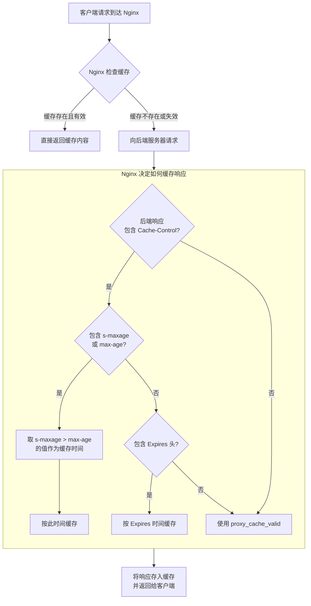

## nginx.conf配置


### `try_files`

配置片段：

```nginx
location / {
    root   /usr/local/openresty/nginx/html;
    index  index.html index.htm;
    try_files $uri $uri/ /index.html;
}
```

这段 Nginx 配置用于定义**根路径 `/` 的请求处理规则**，主要涉及静态资源的路径解析、默认文件匹配和兜底策略。以下是逐行详细解释：


#### **1. `location / { ... }`**
- **作用**：匹配所有以 `/` 开头的请求（即所有未被其他更精确 `location` 规则匹配的请求）。
- **示例**：无论是 `/index.html`、`/images/logo.png` 还是 `/api`（假设没有其他 `location /api` 规则），都会被此块处理。


#### **2. `root /usr/local/openresty/nginx/html;`**
- **作用**：指定静态资源的**根目录**。Nginx 会将请求的 URI 拼接到 `root` 路径后，形成实际的文件系统路径。
- **示例**：
  - 若请求 URI 是 `/index.html`，则实际查找的文件路径是 `/usr/local/openresty/nginx/html/index.html`。
  - 若请求 URI 是 `/images/logo.png`，则实际路径是 `/usr/local/openresty/nginx/html/images/logo.png`。


#### **3. `index index.html index.htm;`**
- **作用**：当请求的 URI 是一个**目录**（而非具体文件）时，Nginx 会按顺序尝试访问该目录下的 `index.html` 或 `index.htm` 作为默认首页。
- **示例**：
  - 若请求 URI 是 `/`（根目录），Nginx 会检查 `/usr/local/openresty/nginx/html/index.html` 是否存在；若存在则返回，否则检查 `/usr/local/openresty/nginx/html/index.htm`。
  - 若请求 URI 是 `/subdir/`（假设 `/subdir` 是一个目录），则检查 `/usr/local/openresty/nginx/html/subdir/index.html`，依此类推。


#### **4. `try_files $uri $uri/ /index.html;`**
- **作用**：定义请求的**兜底处理逻辑**，按顺序尝试查找资源，若均不存在则最终指向 `/index.html`。
- **执行逻辑**（按顺序检查）：
  1. `$uri`：请求 URI 对应的具体文件路径（即 `root + $uri`）。  
     例如请求 `/foo.jpg`，检查 `/usr/local/openresty/nginx/html/foo.jpg` 是否存在。
  2. `$uri/`：请求 URI 对应的目录路径（即 `root + $uri/`）。  
     例如请求 `/subdir/`，检查 `/usr/local/openresty/nginx/html/subdir/` 是否是一个存在的目录。
  3. `/index.html`：若前两者均不存在，最终跳转到根目录的 `index.html`（即 `/usr/local/openresty/nginx/html/index.html`）。


#### **完整流程示例**
假设用户请求 `/about`：
1. Nginx 先尝试访问 `root + $uri` → `/usr/local/openresty/nginx/html/about`（假设这是一个文件）。  
   - 若文件存在，直接返回该文件内容。
   - 若文件不存在，进入下一步。
2. 尝试访问 `root + $uri/` → `/usr/local/openresty/nginx/html/about/`（假设这是一个目录）。  
   - 若目录存在且包含 `index.html` 或 `index.htm`（由 `index` 指令定义），返回目录默认页。
   - 若目录不存在或无默认页，进入下一步。
3. 最终跳转到 `/index.html` → 返回 `/usr/local/openresty/nginx/html/index.html` 的内容。


#### **总结**
这段配置的核心逻辑是：  
**优先返回请求 URI 对应的具体文件 → 若不存在则尝试目录默认页 → 若仍不存在则强制返回根目录的 `index.html`**。  
常见于前端单页应用（如 Vue/React 构建的 SPA），确保所有前端路由最终都指向 `index.html`，由前端路由接管后续逻辑。

## uri前缀截断

>详细用法请参考本站示例：https://gitee.com/dexterleslie/demonstration/tree/main/openresty/backend-api

location配置：

```
location /my-api {
    proxy_set_header Host $host:$server_port;
    proxy_set_header x-forwarded-for $proxy_add_x_forwarded_for;
    proxy_http_version 1.1;
    proxy_set_header Connection '';
    # 匹配/my-api路径的请求发送给backend上游服务
    # proxy_pass http://backend/中最后/表示忽略掉/my-api，将剩余部分作为后端服务请求的URL
    # proxy_pass http://backend中最后没有/表示将/my-api作为后端服务请求的URL
    proxy_pass http://backend/;
}
```

请求接口 http://localhost/my-api/api/v1/testUriPrefixStrip 时/my-api会被openresty截断，转发给后端的api为/api/v1/testUriPrefixStrip

## nginx定义全局和局部变量

详细用法请参考本站示例：https://gitee.com/dexterleslie/demonstration/blob/main/openresty/nginx-getting-started.conf

```nginx
server {
    # 定义全局变量
    set $my_global_variable "Hello world from Global!!!";

    listen       80;
    server_name  localhost;

    location / {
        # 定义局部变量
        set $my_local_variable "Hello world from Local!!!";

        #root   /usr/local/openresty/nginx/html;
        #index  index.html index.htm;
        content_by_lua_block {
            -- nginx for lua api之获取请求中的参数
            -- http://www.shixinke.com/openresty/openresty-get-request-arguments
            local args = ngx.req.get_uri_args();
            local p1 = args.p1;
            if not p1 then
                p1 = "";
            end

            ngx.header.content_type = "text/plain;charset=utf-8";
            ngx.say("Hello Dexterleslie. 参数p1=" .. p1 .. "，全局变量$my_global_variable：" .. ngx.var.my_global_variable .. "，局部变量$my_local_variable：" .. ngx.var.my_local_variable);
        }
    }
}
```

## OpenResty支持HTTP/2

编译OpenResty时启用HTTP/2

```sh
cd /tmp/openresty-$varOpenrestyVersion && ./configure --add-module=/tmp/naxsi-$varNaxsiVersion/naxsi_src --with-http_stub_status_module --with-http_v2_module
```

编译和调试OpenResty是否启用HTTP/2的本站辅助示例：https://gitee.com/dexterleslie/demonstration/tree/main/openresty/demo-build-base-image

示例运行步骤：

1. 生成证书

   ```sh
   ./generate-ssl.sh
   ```

2. 运行服务

   ```sh
   docker compose up -d
   ```

3. 使用谷歌浏览器访问 https://localhost 调试是否使用HTTP/2通讯，打开开发者工具右键点击表头（如 Name、Status、Type 等），勾选 **Protocol**，显示“协议”列。查看任意资源的 **Protocol** 列，如果显示 `h2`，则表示该资源是通过 **HTTP/2** 加载的。

   - http/1.1：表示 HTTP/1.1
   - h2：表示 HTTP/2
   - h3：表示 HTTP/3（基于 QUIC）

## HTTP/1.1和HTTP/2性能对比

使用本站示例辅助测试：https://gitee.com/dexterleslie/demonstration/tree/main/openresty/demo-http2

测试步骤：

1. 生成证书

   ```sh
   ./generate-cert.sh
   ```

2. 运行应用

   ```sh
   docker compose up -d
   ```

3. 分别访问HTTP/1.1和HTTP/2性能对比

   在测试前打开Chrome开发者工具，把网络切换到3G并且勾选`Disable cache`。

   分别访问 http://localhost:8080/ 和 https://localhost:8443/ 对比测试结果。HTTP/1.1的DOMContentLoaded为10258.00 ms，HTTP/2的DOMContentLoaded为4685.00 ms。表明在并发加载多个资源的情况下HTTP/2比HTTP/1.1快。

## location匹配规则优先级

Nginx 的 `location`块用于根据请求的 URI 匹配不同的配置，其匹配规则和优先级是 Nginx 配置的核心知识点之一。理解这些规则能帮助你精准控制请求的处理逻辑（如反向代理、静态文件服务、重定向等）。

### **一、Location 的类型与语法**

Nginx 的 `location`有两种主要类型：**前缀字符串匹配**（Prefix String Match）和**正则匹配**（Regular Expression Match）。此外还有两种特殊修饰符，用于控制匹配行为。

#### 1. 前缀字符串匹配（无修饰符）

语法：

```
location [ = | ~ | ~* | ^~ ] uri { ... }
```

其中，`uri`是普通字符串（如 `/static/`、`.html`），默认是**前缀匹配**（即只要请求 URI 以 `uri`开头即匹配）。

#### 2. 正则匹配（带 `~`或 `~*`修饰符）

- `~`：区分大小写的正则匹配（如 `~ \.php$`匹配 `.php`结尾的 URI）；
- `~*`：不区分大小写的正则匹配（如 `~* \.(jpg|png)$`匹配 `.JPG`、`.PNG`等）。

#### 3. 精确匹配（`=`修饰符）

语法：`location = uri { ... }`

仅当请求 URI **完全等于** `uri`时匹配（如 `location = /login`仅匹配 `/login`，不匹配 `/login/`或 `/login?param=1`）。

#### 4. 优先前缀匹配（`^~`修饰符）

语法：`location ^~ uri { ... }`

表示**前缀匹配**，但一旦匹配成功，**不再检查后续的正则表达式**（优先级高于正则，但低于精确匹配）。

### **二、匹配优先级规则**

Nginx 对 `location`的匹配遵循**从高到低**的优先级顺序，具体规则如下：

#### 1. **最高优先级：精确匹配（`=`）**

若请求 URI 与 `location = uri`完全一致，直接命中该 `location`，**终止后续匹配**。

示例：

```
location = /api/v1/user {
    # 仅匹配 GET /api/v1/user（严格等于）
}
```

#### 2. **次高优先级：优先前缀匹配（`^~`）**

若请求 URI 以 `location ^~ uri`的前缀开头，且该前缀是最长匹配（即比其他普通前缀更长），则命中该 `location`，**终止后续正则匹配**（但继续检查是否有更精确的 `=`匹配，不过 `=`已优先处理）。

示例：

```
location ^~ /static/ {
    # 匹配所有以 /static/ 开头的 URI（如 /static/css/style.css）
    # 且不再检查后续的正则（如 ~ \.css$）
}
```

#### 3. **正则匹配（`~`或 `~\*`）：按配置文件顺序匹配第一个命中的**

若请求未命中 `=`或 `^~`，则按顺序检查所有正则 `location`（`~`或 `~*`），**第一个匹配的正则生效**（与长度无关）。

⚠️ 注意：正则匹配**不考虑前缀长度**，仅按配置文件中出现的顺序判断。

示例：

```
location ~ \.php$ {  # 第一个正则：匹配 .php 结尾
    proxy_pass http://php-server;
}
location ~* \.(jpg|png)$ {  # 第二个正则：匹配图片（但不会生效，因第一个正则已覆盖部分情况？不，需看 URI）
    # 只有当 URI 不以 .php 结尾时才会检查这里
}
```

#### 4. **普通前缀匹配（无修饰符）：最长前缀优先**

若请求未命中上述三种类型，则选择**最长的普通前缀匹配**（`uri`最长的那个）。

示例：

```
location / {  # 根路径，最短前缀
    root /var/www/html;
}
location /blog/ {  # 更长前缀，优先于 /
    root /var/www/blog;
}
location /blog/article/ {  # 最长前缀，优先于 /blog/
    root /var/www/article;
}
# 请求 /blog/article/123.html 会匹配 /blog/article/
```

### **三、匹配流程总结**

Nginx 处理请求的 `location`匹配流程可简化为以下步骤：

1. **检查精确匹配（`=`）**：若存在完全匹配的 `location = uri`，直接使用它。
2. **检查优先前缀匹配（`^~`）**：若存在以当前 URI 为前缀的 `location ^~ uri`，且是最长前缀，使用它（跳过正则）。
3. **检查正则匹配（`~`/`~\*`）**：按顺序遍历所有正则 `location`，第一个匹配的生效。
4. **检查普通前缀匹配**：选择最长的普通前缀 `location`。

### **四、关键注意事项**

1. **正则匹配的顺序敏感**：多个正则 `location`时，**先定义的优先**（即使后面的正则更“具体”）。

   错误示例（可能不符合预期）：

   ```
   location ~* \.txt$ { return 403; }       # 先定义：匹配所有 .txt（不区分大小写）
   location ~ \.TXT$ { proxy_pass http://txt-server; }  # 后定义：本意处理大写 .TXT，但永远不会生效
   ```

   正确做法：将更具体的正则放在前面。

2. **`^~`与正则的冲突**：`^~`会跳过正则匹配，因此若希望某类前缀优先于正则，需用 `^~`。

   示例：

   ```
   location ^~ /admin/ {  # 管理后台路径，优先于所有正则
       deny all;  # 拒绝访问
   }
   location ~ \.php$ {  # 即使有 .php 正则，/admin/*.php 会被 ^~ 拦截
       proxy_pass http://php-server;
   }
   ```

3. **普通前缀的“最长匹配”**：Nginx 会比较所有普通前缀的长度（字符数），选择最长的匹配。

   示例：`location /a/b/c/`比 `location /a/b/`更长，优先匹配前者。

4. **`location`的嵌套无效**：Nginx 的 `location`是平级的，不能在一个 `location`内部嵌套另一个 `location`（语法错误）。

### **五、实战示例**

假设 Nginx 配置如下：

```
location = / { 
    return 200 "Exact match /"; 
}
location ^~ /static/ { 
    return 200 "Prefix ^~ /static/"; 
}
location ~ \.css$ { 
    return 200 "Regex ~ .css"; 
}
location ~* \.js$ { 
    return 200 "Regex ~* .js"; 
}
location /images/ { 
    return 200 "Prefix /images/"; 
}
location / { 
    return 200 "Default prefix /"; 
}
```

不同请求的匹配结果：

| 请求 URI           | 匹配的 Location        | 原因                                                  |
| ------------------ | ---------------------- | ----------------------------------------------------- |
| `/`                | `location = /`         | 精确匹配最高优先级。                                  |
| `/static/logo.png` | `location ^~ /static/` | 优先前缀匹配，跳过后续正则。                          |
| `/css/style.css`   | `location ~ \.css$`    | 未命中 `=`或 `^~`，正则按顺序匹配第一个（`\.css$`）。 |
| `/js/app.JS`       | `location ~* \.js$`    | 不区分大小写的正则匹配（`.JS`符合 `\.(js)$`）。       |
| `/images/1.jpg`    | `location /images/`    | 普通前缀最长匹配（`/images/`比 `/`长）。              |
| `/about.html`      | `location /`           | 普通前缀匹配（无其他更长的普通前缀）。                |

### **总结**

Nginx `location`的优先级核心是：**精确匹配 > 优先前缀匹配 > 正则匹配（顺序优先）> 普通前缀匹配（最长优先）**。掌握这一规则能帮助你高效设计路由逻辑，避免因匹配顺序导致的意外行为。

## 启用HTTP/2.0

编译时启用HTTP/2.0模块--with-http_v2_module

>具体用法请参考本站示例：https://gitee.com/dexterleslie/demonstration/tree/main/openresty/demo-build-base-image
>
>提示：官方Docker镜像openresty/openresty默认支持HTTP/2.0。

```sh
cd /tmp/openresty-$varOpenrestyVersion && ./configure --add-module=/tmp/naxsi-$varNaxsiVersion/naxsi_src --with-http_stub_status_module --with-http_v2_module
```

配置启用HTTP/2.0，使用配置`listen 8443 ssl http2;`

>提示：HTTP/2.0需要配合HTTPS使用。

```nginx
server {
    listen 8443 ssl http2;
    server_name localhost;

    ssl_certificate /usr/local/openresty/nginx/conf/cert.crt;
    ssl_certificate_key /usr/local/openresty/nginx/conf/key.pem;

    ssl_protocols TLSv1.2 TLSv1.3;
    ssl_ciphers HIGH:!aNULL:!MD5;

    root /usr/local/openresty/nginx/html;
    index index.html;

    location / {
        try_files $uri $uri/ =404;
    }
}
```

## 启用gzip

### 示例

https://gitee.com/dexterleslie/demonstration/tree/main/openresty/demo-gzip

### 功能说明

- 演示 OpenResty 的 gzip 压缩配置
- 对比启用和禁用 gzip 的响应大小差异
- 展示常用的 gzip 配置参数

### 快速开始

#### 1. 启动服务

```bash
docker-compose up -d
```

#### 2. 访问演示页面

打开浏览器访问：http://localhost:8080

#### 3. 验证压缩效果

1. 打开浏览器开发者工具（F12）
2. 切换到"网络"（Network）标签
3. 刷新页面或点击测试链接
4. 查看响应头中的 `Content-Encoding: gzip`
5. 对比 `/large-content.html` 和 `/no-gzip/large-content.html` 的响应大小

#### 4. 使用 curl 测试

```bash
# 测试启用 gzip 的响应
curl -H "Accept-Encoding: gzip" -I http://localhost:8080/large-content.html

# 测试禁用 gzip 的响应
curl -H "Accept-Encoding: gzip" -I http://localhost:8080/no-gzip/large-content.html

# 查看压缩后的内容大小
curl -H "Accept-Encoding: gzip" --compressed http://localhost:8080/large-content.html | wc -c
```

### 配置文件说明

#### nginx.conf

主要配置项：

- `gzip on;` - 启用 gzip 压缩
- `gzip_comp_level 6;` - 压缩级别（1-9）
- `gzip_types` - 指定需要压缩的 MIME 类型
- `gzip_min_length 1000;` - 最小压缩长度
- `gzip_vary on;` - 添加 Vary 响应头

### 停止服务

```bash
docker-compose down
```

## gzip、gzip_proxied和gzip_types同时配置

当Nginx反向代理SpringBoot应用时，**仅配置`gzip on;`** 和 **仅配置`gzip_proxied any;`** 有本质区别，核心差异在于**是否真正触发对后端响应的Gzip压缩**。以下是具体分析：

### **前提：Nginx的Gzip压缩需同时满足多个条件**

Nginx对响应内容进行Gzip压缩，需同时满足以下条件（缺一不可）：

1. **`gzip on;`**：全局或局部启用Gzip功能（默认关闭）；
2. **`gzip_proxied`**：定义对代理响应（后端返回的内容）的压缩策略（如`any`表示所有代理响应）；
3. **`gzip_types`**：指定需要压缩的MIME类型（如`text/html`、`application/json`等，默认仅压缩`text/html`）；
4. **后端响应未被压缩**（即响应头无`Content-Encoding: gzip`）。

### **情况1：仅配置`gzip on;`（无其他Gzip相关配置）**

若仅在Nginx中配置`gzip on;`，但未配置`gzip_proxied`、`gzip_types`等关键参数，会导致：

- **`gzip_proxied`默认值为`off`**：Nginx不会对任意代理响应（后端SpringBoot返回的内容）尝试压缩；
- **`gzip_types`默认仅压缩`text/html`**：即使后端返回`text/html`，若`gzip_proxied off`，仍不会压缩；
- **结果**：Nginx对后端SpringBoot的响应**不会进行Gzip压缩**，仅当客户端直接请求静态文件（如本地`.html`）时可能压缩（但反向代理场景下不涉及）。

### **情况2：仅配置`gzip_proxied any;`（未配置`gzip on;`）**

若仅配置`gzip_proxied any;`，但未配置`gzip on;`，会导致：

- **`gzip on;`默认关闭**：Gzip功能未启用，即使`gzip_proxied any`定义了代理响应的压缩策略，Nginx也不会实际执行压缩；
- **结果**：Nginx对后端SpringBoot的响应**完全不会进行Gzip压缩**（因Gzip功能未激活）。

### **关键结论：两者均无法有效压缩后端响应**

- **仅`gzip on;`**：缺少`gzip_proxied`的有效策略（默认`off`）和`gzip_types`的类型指定，无法触发代理响应的压缩；
- **仅`gzip_proxied any;`**：缺少`gzip on;`的基础开关，Gzip功能未启用，压缩逻辑不生效。

### **正确的配置：需同时启用`gzip on;`和`gzip_proxied`**

要让Nginx对反向代理的SpringBoot响应进行Gzip压缩，需**同时配置以下参数**（缺一不可）：

```
server {
    listen 80;
    server_name example.com;

    # 1. 启用Gzip功能（必须）
    gzip on;

    # 2. 定义代理响应的压缩策略（any表示所有代理响应）
    gzip_proxied any;

    # 3. 指定需要压缩的MIME类型（根据业务补充，如JSON、JS等）
    gzip_types 
        text/plain 
        text/css 
        application/json 
        application/javascript 
        text/xml 
        application/xml 
        application/xml+rss 
        text/javascript;

    # 4. 可选：最小压缩长度（避免小文件浪费资源）
    gzip_min_length 1k;

    location / {
        proxy_pass http://springboot_app;  # 反向代理到SpringBoot应用
        proxy_set_header Host $host;
        proxy_set_header X-Real-IP $remote_addr;
    }
}
```

### **总结**

- **仅`gzip on;`**：Gzip功能启用，但代理响应的压缩策略（`gzip_proxied`）默认关闭，且未指定压缩类型，无法压缩后端响应；
- **仅`gzip_proxied any;`**：压缩策略已定义，但Gzip功能未启用（`gzip on;`缺失），压缩逻辑不生效；
- **必须同时配置**：`gzip on;`（启用功能）+ `gzip_proxied any;`（代理策略）+ `gzip_types`（压缩类型），才能让Nginx对SpringBoot的响应进行有效Gzip压缩。

## 代理配置Proxy

>具体用法请参考本站示例：https://gitee.com/dexterleslie/demonstration/tree/main/openresty/demo-proxy-cache
>
>提示：代理缓存和代理缓冲区配置。

示例调试步骤：

1. 运行示例

   ```sh
   docker compose up -d
   ```

2. 访问示例首页http://localhost/

3. 查看backend日志以判断代理缓存是否生效

   ```sh
   docker compose logs -f backend|grep -E "maxage|private"
   ```

## proxy_cache_valid、s-maxage、maxage关系

首先，我们明确这三个概念分别属于哪个层面：

1. **`proxy_cache_valid`**： **Nginx 配置指令**。它定义了 Nginx **自身**的代理缓存（在磁盘或内存中）的有效期。这是 Nginx 作为客户端（对后端服务器）和服务器（对客户端）时，管理其缓存副本的规则。
2. **`max-age`**： **HTTP 响应头字段**。它是 Cache-Control 头的一部分，用于告知**所有中间缓存（包括浏览器和Nginx等代理）** 和源服务器，资源被认定为新鲜的时间长度（从请求时间开始计算）。
3. **`s-maxage`**： **HTTP 响应头字段**。它也是 Cache-Control 头的一部分，**专门用于覆盖 `max-age`对共享缓存（Shared Cache，如 Nginx、CDN、代理服务器）的行为**。`s-maxage`会被私有缓存（如浏览器）忽略。

------

### 核心关系与工作流程

这三者的关系可以概括为：**Nginx 会优先尊重源服务器通过 HTTP 头（特别是 `s-maxage`）下发的指令，但如果这些指令不存在或不适用，Nginx 则会回退到使用自身的 `proxy_cache_valid`配置。**

下图清晰地展示了 Nginx 在处理缓存时的决策流程：



下面我们来详细解读这个流程图中的关键判断点。

#### 场景一：源服务器提供了明确的缓存指令（理想情况）

当后端服务器返回的响应中包含 `Cache-Control`头时，Nginx 会遵循以下优先级：

1. **首选 `s-maxage`**：
   - 如果响应头中有 `Cache-Control: s-maxage=3600`，那么 Nginx **共享缓存** 会将这个资源缓存 **3600 秒**，完全忽略 `max-age`的值。
   - `s-maxage`告诉 Nginx：“我专门告诉你，你可以把这个缓存存 1 小时”。
2. **次选 `max-age`**：
   - 如果没有 `s-maxage`，但存在 `Cache-Control: max-age=1800`，那么 Nginx 会将资源缓存 **1800 秒**。
   - `max-age`告诉所有缓存（包括 Nginx 和浏览器）：“这个资源在 30 分钟内是新鲜的”。
3. **最后考虑 `Expires`**：
   - 如果连 `max-age`都没有，但存在 `Expires`头（一个具体的 GMT 时间点），Nginx 会根据当前时间和 `Expires`时间的差值来计算缓存有效期。
   - 在现代 Web 开发中，`Expires`已较少单独使用，通常与 `max-age`一同出现（`max-age`的优先级更高）。

**结论：只要源服务器正确设置了 `Cache-Control`，`proxy_cache_valid`在此场景下就不起作用。** 这体现了“源站控制”的原则，让业务逻辑来决定缓存策略。

#### 场景二：源服务器未提供任何缓存指令（常见兜底情况）

当后端服务器没有返回任何 `Cache-Control`、`Expires`等缓存头时，Nginx 就不知道该如何缓存这个响应了。这时，你在 Nginx 配置中设置的 `proxy_cache_valid`就充当了 **“保底”或“默认”规则**。

例如：

```
http {
    proxy_cache_path /tmp/cache levels=1:2 keys_zone=my_cache:10m inactive=60m;

    server {
        location /api/ {
            proxy_cache my_cache;
            # 兜底规则：对于没有缓存头的响应，默认缓存10分钟
            proxy_cache_valid 200 302 10m;
            # 也可以为不同状态码设置不同时间
            proxy_cache_valid 404 1m;
            # 或者直接为所有状态码设置一个默认值
            # proxy_cache_valid any 5m;

            proxy_pass http://backend_server;
        }
    }
}
```

在这个例子中，即使后端 API 返回 `Cache-Control: no-cache`，Nginx 也不会缓存（因为 `no-cache`是强指令）。但如果后端什么都没说，Nginx 就会按照 `10m`来缓存成功的响应。

------

### 总结与最佳实践

| 特性         | `proxy_cache_valid`(Nginx指令)                               | `s-maxage`(HTTP头)                                   | `max-age`(HTTP头)                                |
| ------------ | ------------------------------------------------------------ | ---------------------------------------------------- | ------------------------------------------------ |
| **作用域**   | Nginx 代理服务器自身                                         | **共享缓存** (如 Nginx, CDN)                         | **所有缓存** (浏览器, Nginx, CDN)                |
| **优先级**   | **最低** (当 HTTP 头存在时使用头信息)                        | **最高** (对共享缓存而言)                            | **中等** (无 `s-maxage`时生效)                   |
| **控制方**   | 运维/开发人员 (通过修改 Nginx 配置)                          | 后端应用程序/开发人员 (通过代码设置 HTTP 头)         | 后端应用程序/开发人员 (通过代码设置 HTTP 头)     |
| **主要用途** | 1. **兜底策略**，处理没有缓存头的响应。 2. 强制缓存某些**不应该**被缓存但你想缓存的内容（需配合 `proxy_ignore_headers`）。 3. 为特定状态码（如 404, 500）设置缓存。 | **精确控制**共享缓存的行为，而不影响用户浏览器缓存。 | **通用缓存控制**，同时影响浏览器和所有中间缓存。 |

**最佳实践建议：**

1. **首选使用 HTTP 头控制**：应由后端服务根据业务逻辑生成正确的 `Cache-Control`头（包括 `s-maxage`和 `max-age`）。这是最标准、最灵活的方式。
   - 例如：`Cache-Control: public, s-maxage=600, max-age=60`。这意味着 CDN/Nginx 可以缓存 10 分钟，而浏览器只缓存 1 分钟。
2. **谨慎使用 `proxy_cache_valid`**：将其主要用于：
   - **兜底**：为没有缓存头的静态资源或第三方 API 响应设置一个合理的默认缓存时间。
   - **特殊场景**：缓存一些后端出错页面（如 502），避免大量请求穿透到后端压垮系统（`proxy_cache_valid 502 503 504 1m;`）。
3. **理解 `proxy_ignore_headers`**：如果你希望 Nginx **完全忽略**后端的 `Cache-Control`头，而只使用 `proxy_cache_valid`，你可以使用 `proxy_ignore_headers Cache-Control Expires;`指令。但这通常很危险，除非你非常清楚自己在做什么。

简单来说，可以把 `proxy_cache_valid`看作是 Nginx 的“**默认行为**”，而将 `s-maxage/max-age`看作是源服务器发来的“**临时指令**”。临时指令的优先级永远高于默认行为。
