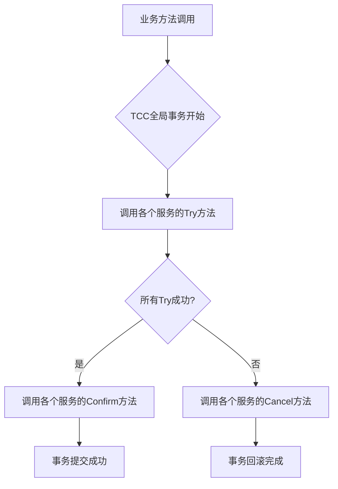

## 分布式事务 - 何有分布式事务呢？

微服务架构中存在分布式事务的原因主要与微服务架构的特点和业务需求有关。以下是对此现象的详细解释：

一、微服务架构的特点

1. **服务拆分**：在微服务架构中，大型应用程序被拆分成多个小型、独立的服务。这些服务通常围绕特定的业务能力或业务领域进行组织，具有高度的内聚性和松散的耦合性。
2. **独立部署和管理**：每个微服务都可以独立地进行开发、测试和部署，这使得系统的更新和维护变得更加灵活和高效。同时，每个服务也可以有自己的数据库和存储系统。
3. **网络通信**：微服务之间通过网络进行通信，这增加了系统的复杂性和潜在的故障点。

二、业务需求

1. **数据一致性**：在微服务架构中，尽管服务被拆分，但某些业务流程可能涉及多个服务的协同工作。例如，一个电商平台的订单处理可能涉及订单服务、库存服务和支付服务等多个服务。为了确保这些服务在处理同一笔业务时数据的一致性，需要使用分布式事务。
2. **事务处理**：传统的事务处理机制（如ACID事务）通常适用于单个数据库或数据源。但在微服务架构中，由于服务之间使用不同的数据库，传统的事务处理机制无法直接应用。因此，需要一种新的分布式事务处理机制来确保多个服务之间的事务处理的一致性。

三、分布式事务的定义和作用

1. **定义**：分布式事务是指跨越多个独立数据库或服务的事务，这些服务需要协同工作以确保数据的一致性和完整性。
2. **作用**：分布式事务的目标是确保所有参与的服务要么全部成功提交，要么全部回滚，以避免数据不一致的问题。这有助于维护系统的数据完整性和可靠性。

四、分布式事务的挑战

1. **性能问题**：分布式事务通常涉及多个服务之间的通信和协调，增加了网络延迟和资源消耗，从而影响性能。
2. **复杂性**：实现和管理分布式事务需要复杂的逻辑和协调机制，增加了系统的复杂性。
3. **故障恢复**：需要处理多种异常情况和失败恢复机制，以确保在出现故障时能够正确地回滚或提交事务。

综上所述，微服务架构中的分布式事务是由于服务拆分、独立部署和管理以及业务需求等多方面因素共同作用的结果。为了确保多个服务之间的事务处理的一致性，需要采用适当的分布式事务处理机制来应对这些挑战。


## 分布式事务 - `CAP`定理

> 详细说明请本站 [链接](/springcloud/README.html#cap-定理)


## 分布式事务 - `BASE`理论

BASE理论是对CAP定理的一种补充和扩展，专门用于处理分布式系统中的可用性和一致性问题。以下是关于BASE理论的详细解释：

一、定义与背景

- **定义**：BASE理论是“Basically Available，Soft state，Eventual consistency”的缩写，分别代表基本可用、软状态和最终一致性。
- **背景**：该理论由eBay的架构师Dan Pritchett提出，源于对大规模互联网分布式系统实践的总结，是对CAP定理的延伸和实际应用补充。CAP定理指出，在分布式系统中无法同时完全实现一致性、可用性和分区容错性，因此需要在三者之间做出权衡。BASE理论则通过牺牲强一致性来提高系统的可用性和容错性。

二、核心要素

1. **基本可用（Basically Available）**
   - 指在出现不可预知的故障时，系统主体功能依然可用。即使在部分系统组件发生故障或网络分区的情况下，系统也能继续运行，只是性能可能会下降，或者某些功能可能暂时不可用。
   - 例如，在电商促销时，为保护购物系统，部分消费有可能会被导到一个降级页面。
2. **软状态（Soft State）**
   - 意味着系统中的数据状态可以在一段时间内不一致，并且不要求数据在任意时刻都是一致的。允许系统状态在没有输入的情况下变化。
   - 这与ACID事务中的“硬状态”对比鲜明，后者要求数据在事务提交后必须是强一致的。软状态的存在不会影响系统的整体可用性，但要求系统能够在后续操作中通过某种机制使数据达到一致状态。
3. **最终一致性（Eventually Consistent）**
   - 指系统中的所有副本数据在没有新的更新后，将在一段时间内逐渐达到一致。这意味着在不久的将来，所有的读取操作将返回相同的数据，尽管在短期内可能会存在不一致。
   - 最终一致性不是实时的，但系统能够确保在合理的时间范围内，所有节点的数据保持一致。这种设计使得系统在保证最终一致性的同时，可以降低同步成本和提高系统性能。

三、应用场景

BASE理论特别适用于那些对可用性要求高但对强一致性要求较低的分布式系统，如：

- **NoSQL数据库**：如Cassandra、DynamoDB等，采用了BASE理论，通过高可用性和容错性设计，允许数据在短时间内不一致，但最终达到一致性。
- **微服务架构**：不同服务之间的数据一致性可以通过异步通信和事件驱动模型实现，允许各服务在短时间内保持软状态，最终达到一致性。
- **缓存系统**：如Redis、Memcached等，通过缓存机制提高系统的读写性能，可能会出现数据短暂不一致的情况，但最终会同步到持久化存储中。

四、优势与不足

- **优势**：
  - 提高了系统的可用性和容错性。
  - 降低了同步成本，提高了系统性能。
  - 提供了灵活的一致性模型，开发者可以根据实际需求选择合适的一致性策略。
- **不足**：
  - 由于允许数据在一段时间内处于不一致状态，可能会对用户的使用体验产生一定影响。
  - 最终一致性策略需要一定的时间来实现数据的一致状态，这可能会导致一定的延迟，在某些对实时性要求较高的应用场景中可能会产生负面影响。

综上所述，BASE理论为分布式系统的设计提供了一种新的思路和方法，有助于开发者在设计和实现分布式系统时更好地平衡系统的可用性和一致性。


## 分布式事务 - 事务`ACID`原则

ACID 原则，即原子性（Atomicity）、一致性（Consistency）、隔离性（Isolation）和持久性（Durability），是数据库事务管理的一组关键属性。这些原则确保了数据库在事务处理过程中的可靠性和完整性。以下是每个原则的详细解释：

1. 原子性（Atomicity）：
   - 原子性是指事务要么全部执行成功，要么全部不执行。事务中的多个操作被视为一个不可分割的单元。
   - 如果事务中的某个操作失败，那么事务中的所有操作都必须回滚（撤销），以恢复到事务开始前的状态。
2. 一致性（Consistency）：
   - 一致性确保事务将数据库从一个一致状态转换到另一个一致状态。
   - 在事务开始之前和事务结束之后，数据库中的数据必须满足所有的完整性约束和业务规则。
   - 这意味着事务不会破坏数据库的完整性，例如，不会违反外键约束、唯一性约束等。
3. 隔离性（Isolation）：
   - 隔离性确保多个事务并发执行时，一个事务的修改在最终提交前对其他事务是不可见的。
   - 这样可以避免脏读、不可重复读和幻读等并发问题。
   - 隔离级别从低到高包括：未提交读（Read Uncommitted）、提交读（Read Committed）、可重复读（Repeatable Read）和序列化（Serializable）。
4. 持久性（Durability）：
   - 持久性确保一旦事务提交，它对数据库的影响是永久的，即使系统发生故障也不会丢失。
   - 这意味着事务的修改被永久地保存在数据库中，即使系统崩溃或重启，这些修改也不会丢失。

ACID 原则对于确保数据库系统的可靠性和完整性至关重要。然而，在某些情况下，为了提高性能和可扩展性，可能会牺牲部分隔离性（例如，使用弱隔离级别），但这通常需要在一致性和性能之间做出权衡。


## 分布式事务 - 分布式事务模型

分布式事务模型是指在一个分布式系统中，涉及多个数据库或服务节点的事务处理模型。这些节点可能分布在不同的物理机器或多个不同的系统中，因此保证数据的一致性和完整性变得非常复杂。以下是几种常见的分布式事务模型：

一、两阶段提交（2PC）

1. **定义**：两阶段提交是一种经典的分布式事务协议，它确保多个参与者在执行事务时能以一致的方式提交或回滚事务。
2. **阶段划分**：
   - **准备阶段**：事务协调者向所有参与者发送准备提交的请求，参与者执行本地事务并返回一个“准备好”或“失败”的响应。
   - **提交阶段**：如果所有参与者都返回了“准备好”，协调者发送“提交”请求，所有参与者提交本地事务；如果有一个或多个参与者返回“失败”，协调者发送“回滚”请求，所有参与者回滚本地事务。
3. **优点**：强一致性，确保事务要么全部提交，要么全部回滚，保证数据一致性。流程简单，易于理解和实现。
4. **缺点**：性能问题，参与者需要锁定资源直到提交完成，可能导致长时间锁定，影响系统性能。存在单点故障问题，如果协调者在准备阶段崩溃，系统可能会处于不确定状态。阻塞性，参与者在等待协调者的指令时无法释放锁。

二、三阶段提交（3PC）

1. **定义**：三阶段提交是对两阶段提交的改进，通过引入超时和预提交机制，减少了阻塞和单点故障的影响。
2. **阶段划分**：
   - **CanCommit阶段**：协调者向所有参与者发送预提交请求，询问是否可以提交事务。
   - **PreCommit阶段**：参与者执行本地事务，并将准备状态返回给协调者。如果所有参与者都准备就绪，协调者进入下一阶段；否则，发送中止请求。
   - **DoCommit阶段**：协调者根据参与者的确认消息决定是否提交或回滚事务，并通知所有参与者。
3. **优点**：非阻塞性，引入超时机制后，即使协调者或参与者发生故障，系统也能自动进行超时处理。减少单点故障影响，通过增加CanCommit和PreCommit阶段，系统可以在某些故障情况下自动恢复或采取补救措施。
4. **缺点**：有性能开销，虽然改善了阻塞问题，但依然需要多次网络交互。

三、TCC（Try-Confirm-Cancel）

1. **定义**：TCC是一种基于补偿机制的事务管理方式，将每个事务操作分为三步：Try（预留资源）、Confirm（确认提交）、Cancel（取消回滚）。
2. **工作原理**：在Try阶段，参与者预留资源或进行初步检查；在Confirm阶段，参与者实际执行提交操作；如果Try阶段的某些操作失败，则进入Cancel阶段，执行回滚操作。
3. **优点**：减少锁定时间，在Try阶段并不真正提交数据，避免了长时间的锁定问题。灵活性强，适用于各种复杂的业务场景。
4. **缺点**：实现复杂，开发者必须为每个操作定义三步逻辑。适用性有限，某些场景下（如不允许预留资源或无法定义合适的补偿机制）TCC难以应用。

四、Saga

1. **定义**：Saga模式是一种长事务解决方案，适用于微服务架构中。它将一个长事务拆分为一系列有序的本地事务，每个本地事务都有一个对应的补偿操作。
2. **工作原理**：如果某个本地事务失败，则调用相应的补偿操作来回滚之前的事务。
3. **优点**：没有全局锁，不会影响系统性能。提供了较高的灵活性。
4. **缺点**：事务补偿逻辑需要自行实现，增加了代码复杂度。数据的一致性保障依赖于补偿操作的正确性。

五、基于消息队列的最终一致性

1. **定义**：通过消息队列实现最终一致性是一种常见的分布式事务解决方案。
2. **工作原理**：系统将操作拆分为异步消息，确保消息的可靠投递和消费，从而达到事务的最终一致性。
3. **优点**：异步处理，提高系统的响应能力。适合需要高可用、高性能的场景。
4. **缺点**：实现最终一致性可能会有短暂的时间窗口不一致。需要处理消息重复、顺序等问题。

综上所述，不同的分布式事务模型各有优缺点，适用于不同的业务场景。在选择分布式事务模型时，需要根据具体业务场景的需求、性能要求以及系统的复杂性来权衡。


## 分布式事务 - `Seata`概念

>`Seata`官方网站：https://seata.apache.org/zh-cn/

Alibaba Seata（原名Fescar）是一个开源的分布式事务解决方案，旨在解决微服务架构下的事务一致性问题。以下是对Alibaba Seata的详细介绍：

一、核心功能

Alibaba Seata提供了多种事务管理模式，包括AT模式、TCC模式、Saga模式和XA模式，以适应不同业务场景的需求。这些模式各具特点，能够满足从简单到复杂的各种分布式事务处理需求。

二、架构组成

Alibaba Seata的架构主要包括以下几个组成部分：

1. **应用程序客户端**：负责发起事务请求，并向Seata Server发送事务开始、提交或回滚指令。
2. **事务协调器（TC）**：Seata本身，全局唯一。负责接收来自客户端的事务请求，并协调事务参与者的行为，维护全局事务和分支事务的状态。
3. **事务管理器（TM）**：位于客户端，负责开启和结束全局事务。它定义全局事务的范围，并根据TC维护的全局事务和分支事务状态，做出开启事务、提交事务、回滚事务的决议。
4. **资源管理器（RM）**：位于数据库等资源侧，负责执行具体的分支事务。它管理分支事务上的资源，向TC注册分支事务，并汇报分支事务状态，以及驱动分支事务的提交和回滚。

三、事务模式

1. **AT模式（Automatic Transaction mode）**：最常用的模式之一，通过两阶段提交的方式来实现分布式事务。Seata能够自动识别SQL语句，并在事务开始时记录必要的信息（如快照），以便在需要的时候进行回滚。此模式透明性高，对应用来说几乎不需要关心事务的细节；兼容大多数的SQL语句，不需要对现有的SQL进行修改；但可能在第一阶段锁定资源，对性能产生一定影响。
2. **TCC模式（Try-Confirm-Cancel mode）**：一种基于业务补偿机制的事务管理模式。它要求业务服务自身实现Try、Confirm和Cancel三个方法，分别对应预留资源、确认预留资源和取消预留资源的操作。此模式允许开发者精确控制每个事务阶段的行为，灵活适应复杂的业务逻辑，但需要开发者自行实现TCC接口，增加了开发工作量。相较于AT模式，TCC模式的性能开销较小，因为它不需要在第一阶段锁定资源。
3. **Saga模式**：一种长事务模式，通过一系列的本地事务来实现最终一致性。Seata会记录每个本地事务的状态，并在必要时触发补偿操作。此模式不保证强一致性，而是通过一系列的补偿动作来达到最终一致性；易于扩展，可以很容易地添加新的事务步骤；补偿操作可以异步执行，减少了阻塞时间。它非常适合业务流程长、需要多个步骤才能完成的场景，以及对最终一致性要求较高但不严格要求即时一致性的场景。
4. **XA模式**：基于两阶段提交协议的分布式事务解决方案，适用于支持XA协议的数据库。

四、使用场景

Alibaba Seata主要适用于以下几种场景：

1. 微服务架构下的事务一致性问题：当应用程序被拆分成多个微服务时，单个事务可能跨越多个服务边界。Seata可以确保在这种情况下事务的一致性。
2. 协调不同类型的系统：当需要协调数据库、消息队列等不同类型的系统时，Seata提供了一种统一的方式来管理这些系统的事务。
3. 多步骤完成的业务流程：对于那些需要多个步骤才能完成的业务流程，Seata的Saga模式可以帮助实现最终一致性。

五、优势特点

1. **轻量级框架**：对性能的影响较小。
2. **多种数据库支持**：支持多种主流数据库和中间件，如MySQL、Oracle、RocketMQ等。
3. **活跃社区**：作为一个开源项目，Seata拥有一个活跃的社区，提供了丰富的文档和支持。
4. **高性能**：通过优化网络通信和存储机制，提供了高性能的事务处理能力，能够满足大规模分布式系统的需求。
5. **易于集成**：支持与Spring Cloud、Dubbo、gRPC等主流微服务框架的无缝集成，开发者只需进行简单配置即可使用分布式事务功能。
6. **可扩展性**：提供了丰富的SPI接口，允许开发者根据具体需求进行扩展和定制，例如自定义事务日志存储、事务协调策略等。

六、应用方式

以在Spring Cloud Alibaba中使用Seata为例，通常包括以下步骤：

1. **引入依赖**：在项目的pom.xml文件中引入Seata的相关依赖。
2. **配置Seata**：在application.properties或application.yml文件中配置Seata的相关信息。
3. **使用Seata注解**：在需要事务支持的服务方法上使用@GlobalTransactional注解。

通过以上步骤，开发者可以轻松地在Spring Cloud Alibaba中使用Seata来管理分布式事务，确保在微服务架构中的数据一致性。

综上所述，Alibaba Seata为分布式事务提供了一个强大的解决方案，它通过多种事务管理模式解决了微服务架构下面临的事务一致性难题。


## 分布式事务 - `Seata`工作原理

Alibaba Seata的工作原理基于两阶段提交（Two-Phase Commit，2PC）协议，并进行了优化和改进以适应微服务架构的需求。以下是Seata工作原理的详细解释：

一、核心组件

Seata设计了三个主要组件来协调和管理分布式事务：

1. 事务协调器（TC，Transaction Coordinator）：
   - 负责协调全局事务的提交和回滚。
   - 管理全局事务的生命周期，跟踪全局事务的状态。
   - 在事务的第一阶段接收各分支事务的准备（Prepare）状态，第二阶段根据准备结果决定提交（Commit）或回滚（Rollback）。
2. 事务管理器（TM，Transaction Manager）：
   - 负责启动全局事务，并与TC进行交互。
   - 传达事务的开始、提交或回滚指令给TC。
3. 资源管理器（RM，Resource Manager）：
   - 负责管理具体的资源操作，与数据库等资源打交道。
   - 执行本地事务的预提交（Prepare）和提交（Commit）或回滚（Rollback）操作。

二、工作原理

Seata的工作流程可以分为两个阶段：准备阶段（Prepare Phase）和提交/回滚阶段（Commit/Rollback Phase）。

1. 准备阶段（Prepare Phase）：
   - 当事务开始时，TM向所有参与的RM发送Prepare请求。
   - RM接收到Prepare请求后，会检查本地事务能否成功执行，并预留必要的资源（例如锁定相关行的锁）。
   - RM向TM回应Prepare状态（预提交成功或失败）。同时，RM也会向TC注册分支事务，并可能记录SQL执行前后的数据快照（在AT模式下）。
2. 提交/回滚阶段（Commit/Rollback Phase）：
   - 如果所有RM的Prepare请求都成功，TM会向TC发送提交指令，TC随后通知所有RM执行真实的提交操作。
   - 如果Prepare请求中有任何失败，或者TM决定回滚事务，TM会向TC发送回滚指令，TC随后通知所有RM执行回滚操作。在回滚过程中，RM会根据之前记录的数据快照（在AT模式下）进行回滚。

三、事务模式

Seata支持多种事务模式，以满足不同业务场景的需求：

1. AT模式（Automatic Transaction）：
   - 基于SQL解析和日志记录实现事务回滚的自动补偿。
   - 在第一阶段，Seata会记录SQL执行前后的数据快照。
   - 在第二阶段，根据全局事务状态决定提交或利用快照进行回滚。
2. TCC模式（Try-Confirm-Cancel）：
   - 要求业务服务实现Try、Confirm和Cancel三个接口。
   - Try阶段预留资源，Confirm阶段确认预留资源并提交，Cancel阶段在失败或回滚时释放预留资源。
3. Saga模式：
   - 长事务模式，通过一系列本地事务实现最终一致性。
   - 每个本地事务都有对应的补偿事务，用于在需要时撤销之前的操作。
4. XA模式：
   - 基于XA协议实现分布式事务。
   - 需要数据库支持XA协议，并遵循两阶段提交协议。

四、其他特性

- **无侵入性**：Seata通过AOP（面向切面编程）的方式与业务代码集成，使得在编写业务代码时不需要过多关心事务的细节。
- **支持多种数据库**：Seata提供了多种数据库适配器，支持MySQL、Oracle、PostgreSQL等主流关系型数据库。
- **灵活的配置**：支持通过配置文件或Nacos等配置中心来动态调整事务的配置。
- **良好的监控能力**：提供了监控界面，可以查看全局事务的状态，方便问题的定位和处理。

综上所述，Alibaba Seata通过其独特的设计和工作原理，为微服务架构下的分布式事务管理提供了高效、可靠且易于使用的解决方案。


## 分布式事务 - `Docker`运行`Seata`

>说明：演示 `Nacos` 注册中心，`DB` 存储 `Seata` 服务。
>
>参考文档配置 `Docker` 运行 `Seata` 服务：https://seata.apache.org/zh-cn/docs/ops/deploy-by-docker-compose/#nacos%E6%B3%A8%E5%86%8C%E4%B8%AD%E5%BF%83db%E5%AD%98%E5%82%A8
>
>详细用法请参考本站 [示例](https://gitee.com/dexterleslie/demonstration/tree/master/spring-cloud/demo-spring-cloud-alibaba-seata-xa)

`application-seata.yaml` 配置如下：

```yaml
server:
  port: 7091

spring:
  application:
    name: seata-server

logging:
  config: classpath:logback-spring.xml
  file:
    path: ${log.home:${user.home}/logs/seata}
  extend:
    logstash-appender:
      destination: 127.0.0.1:4560
    kafka-appender:
      bootstrap-servers: 127.0.0.1:9092
      topic: logback_to_logstash

console:
  user:
    username: seata
    password: seata

seata:
  # Seata 服务数据库链接信息通过本文件配置，不需要使用 Nacos 配置中心配置
  #config:
  #  # support: nacos, consul, apollo, zk, etcd3
  #  type: nacos
  #  nacos:
  #    server-addr: 127.0.0.1:8848
  #    namespace:
  #    group: SEATA_GROUP
  #    username: nacos
  #    password: nacos
  #    data-id: seataServer.properties
  # Seata 服务注册中心信息配置，Seata 服务在 Nacos 注册名为 seata-server 的服务
  registry:
    # support: nacos, eureka, redis, zk, consul, etcd3, sofa
    type: nacos
    nacos:
      application: seata-server
      server-addr: 127.0.0.1:8848
      group: SEATA_GROUP
      namespace:
      # tc集群名称
      cluster: default
      username: nacos
      password: nacos
      context-path:
  # Seata 服务使用 MySQL 作为持久化存储，此处配置数据库连接信息
  store:
    # support: file 、 db 、 redis
    mode: db
    db:
      datasource: druid
      dbType: mysql
      # 需要根据mysql的版本调整driverClassName
      # mysql8及以上版本对应的driver：com.mysql.cj.jdbc.Driver
      # mysql8以下版本的driver：com.mysql.jdbc.Driver
      driverClassName: com.mysql.cj.jdbc.Driver
      url: jdbc:mysql://127.0.0.1:3306/seata?rewriteBatchedStatements=true
      user: root
      password: 123456
      min-conn: 10
      max-conn: 100
      global-table: global_table
      branch-table: branch_table
      lock-table: lock_table
      distributed-lock-table: distributed_lock
      query-limit: 1000
      max-wait: 5000

  #server:
  #  service-port: 8091 #If not configured, the default is '${server.port} + 1000'
  security:
    secretKey: SeataSecretKey0c382ef121d778043159209298fd40bf3850a017
    tokenValidityInMilliseconds: 1800000
    ignore:
      urls: /,/**/*.css,/**/*.js,/**/*.html,/**/*.map,/**/*.svg,/**/*.png,/**/*.jpeg,/**/*.ico,/api/v1/auth/login,/metadata/v1/**

```

数据库初始化脚本 `db.sql`（脚本获取的源链接：https://github.com/apache/incubator-seata/blob/develop/script/server/db/mysql.sql）

```sql
create database if not exists `seata` character set utf8mb4 collate utf8mb4_general_ci;

use `seata`;

-- -------------------------------- The script used when storeMode is 'db' --------------------------------
-- the table to store GlobalSession data
CREATE TABLE IF NOT EXISTS `global_table`
(
    `xid`                       VARCHAR(128) NOT NULL,
    `transaction_id`            BIGINT,
    `status`                    TINYINT      NOT NULL,
    `application_id`            VARCHAR(32),
    `transaction_service_group` VARCHAR(32),
    `transaction_name`          VARCHAR(128),
    `timeout`                   INT,
    `begin_time`                BIGINT,
    `application_data`          VARCHAR(2000),
    `gmt_create`                DATETIME,
    `gmt_modified`              DATETIME,
    PRIMARY KEY (`xid`),
    KEY `idx_status_gmt_modified` (`status` , `gmt_modified`),
    KEY `idx_transaction_id` (`transaction_id`)
    ) ENGINE = InnoDB
    DEFAULT CHARSET = utf8mb4;

-- the table to store BranchSession data
CREATE TABLE IF NOT EXISTS `branch_table`
(
    `branch_id`         BIGINT       NOT NULL,
    `xid`               VARCHAR(128) NOT NULL,
    `transaction_id`    BIGINT,
    `resource_group_id` VARCHAR(32),
    `resource_id`       VARCHAR(256),
    `branch_type`       VARCHAR(8),
    `status`            TINYINT,
    `client_id`         VARCHAR(64),
    `application_data`  VARCHAR(2000),
    `gmt_create`        DATETIME(6),
    `gmt_modified`      DATETIME(6),
    PRIMARY KEY (`branch_id`),
    KEY `idx_xid` (`xid`)
    ) ENGINE = InnoDB
    DEFAULT CHARSET = utf8mb4;

-- the table to store lock data
CREATE TABLE IF NOT EXISTS `lock_table`
(
    `row_key`        VARCHAR(128) NOT NULL,
    `xid`            VARCHAR(128),
    `transaction_id` BIGINT,
    `branch_id`      BIGINT       NOT NULL,
    `resource_id`    VARCHAR(256),
    `table_name`     VARCHAR(32),
    `pk`             VARCHAR(36),
    `status`         TINYINT      NOT NULL DEFAULT '0' COMMENT '0:locked ,1:rollbacking',
    `gmt_create`     DATETIME,
    `gmt_modified`   DATETIME,
    PRIMARY KEY (`row_key`),
    KEY `idx_status` (`status`),
    KEY `idx_branch_id` (`branch_id`),
    KEY `idx_xid` (`xid`)
    ) ENGINE = InnoDB
    DEFAULT CHARSET = utf8mb4;

CREATE TABLE IF NOT EXISTS `distributed_lock`
(
    `lock_key`       CHAR(20) NOT NULL,
    `lock_value`     VARCHAR(20) NOT NULL,
    `expire`         BIGINT,
    primary key (`lock_key`)
    ) ENGINE = InnoDB
    DEFAULT CHARSET = utf8mb4;

INSERT INTO `distributed_lock` (lock_key, lock_value, expire) VALUES ('AsyncCommitting', ' ', 0);
INSERT INTO `distributed_lock` (lock_key, lock_value, expire) VALUES ('RetryCommitting', ' ', 0);
INSERT INTO `distributed_lock` (lock_key, lock_value, expire) VALUES ('RetryRollbacking', ' ', 0);
INSERT INTO `distributed_lock` (lock_key, lock_value, expire) VALUES ('TxTimeoutCheck', ' ', 0);
```

`my-customize.cnf` 如下：

```properties
[mysqld]
max_connections=1024
slow_query_log=1
long_query_time=1
slow_query_log_file=slow-query.log
innodb_flush_log_at_trx_commit=0
innodb_file_per_table=1
innodb_buffer_pool_size=512m

# 设置错误信息输出到error.log文件中
# 例如：通过启用innodb_print_all_deadlocks输出的死锁日志
log_error = error.log
# `show engine innodb status\G`命令的`TRANSACTIONS`栏目中会打印当前等待状态的锁对应的表中详细的持有锁信息
innodb_status_output_locks=ON

# 启用binlog
log_bin
# 推荐使用 ROW 格式，但你也可以选择 STATEMENT 或 MIXED
binlog_format = MIXED
# 设置 binlog 文件在自动删除前的保留天数
expire_logs_days = 7
# 设置单个 binlog 文件的最大大小
max_binlog_size = 512M
server-id = 10001
```

`docker-compose.yaml` 如下：

```yaml
version: "3.1"

services:
  nacos-server:
    image: nacos/nacos-server:v2.2.3
    environment:
      - TZ=Asia/Shanghai
      - MODE=standalone
#    ports:
#      - '8848:8848'
#      - '9848:9848'
    network_mode: host

  db:
    image: mysql:8.0.18
    command:
      - --character-set-server=utf8mb4
      - --collation-server=utf8mb4_general_ci
      - --skip-character-set-client-handshake
    volumes:
      - ./db.sql:/docker-entrypoint-initdb.d/db.sql
      - ./my-customize.cnf:/etc/mysql/conf.d/my-customize.cnf
    environment:
      - LANG=C.UTF-8
      - TZ=Asia/Shanghai
      - MYSQL_ROOT_PASSWORD=123456
#    ports:
#      - '3306:3306'
    network_mode: host

  seata-server:
    image: seataio/seata-server:2.0.0
#    ports:
#      - "7091:7091"
#      - "8091:8091"
    network_mode: host
    volumes:
      - ./application-seata.yml:/seata-server/resources/application.yml
    depends_on:
      - db
      - nacos-server

```

启动 `Seata` 服务

```bash
docker compose up -d
```

登录 `Seata` 控制台：http://127.0.0.1:7091/，帐号：`seata`，密码：`seata`

登录 `Nacos` 控制台：http://localhost:8848/，帐号：`nacos`，密码：`nacos`，看到 `Seata` 注册服务名为 `seata-server`。


## 分布式事务 - `SpringCloud`集成

>`todo`


## 分布式事务 - `Seata`事务模式

Seata 主要提供四种分布式事务模式，每种模式都有其特定的适用场景和实现原理。以下是这四种模式的详细对比和解释：

### 1. AT 模式（Auto Transaction - 自动补偿模式）
**最常用、侵入性最低的模式**

#### 核心原理
- **一阶段**：在本地事务中提交业务SQL，并生成**前后镜像**保存到undo_log表中
- **二阶段**：
  - **提交**：异步删除undo_log
  - **回滚**：根据undo_log中的前镜像数据生成反向SQL进行补偿

#### 工作流程
```sql
-- 一阶段：业务SQL执行 + undo_log记录
UPDATE product SET stock = stock - 10 WHERE id = 1;
INSERT INTO undo_log (xid, branch_id, rollback_info) VALUES (...);

-- 二阶段回滚：根据undo_log补偿
UPDATE product SET stock = stock + 10 WHERE id = 1; -- 反向补偿
DELETE FROM undo_log WHERE xid = ...;
```

#### 特点
- ✅ **优点**：代码侵入性低、性能较好、支持大多数场景
- ❌ **缺点**：需要创建undo_log表、全局锁可能带来性能瓶颈

#### 适用场景
- 大多数业务场景
- 需要低侵入性的项目
- 对性能要求不是极端苛刻的场景

### 2. TCC 模式（Try-Confirm-Cancel - 补偿事务模式）
**灵活性最高、性能最好的模式**

#### 核心原理
- **Try**：预留业务资源（如：冻结库存、预扣金额）
- **Confirm**：确认执行业务，使用预留资源
- **Cancel**：取消执行，释放预留资源

#### 代码示例
```java
@LocalTCC
public interface StorageTccService {
    @TwoPhaseBusinessAction(name = "deduct", 
                          commitMethod = "confirm", 
                          rollbackMethod = "cancel")
    boolean tryDeduct(Long productId, Integer count);
    
    boolean confirm(BusinessActionContext context);
    boolean cancel(BusinessActionContext context);
}
```

#### 特点
- ✅ **优点**：性能最佳、灵活性高、无全局锁
- ❌ **缺点**：代码侵入性强、开发复杂度高

#### 适用场景
- 高性能要求的系统
- 复杂业务逻辑
- 需要协调多种资源（DB、MQ、缓存等）

### 3. XA 模式（XA Protocol - 强一致性模式）
**基于数据库XA协议的传统模式**

#### 核心原理
- **一阶段**：执行SQL但不提交，进入`XA PREPARE`状态
- **二阶段**：
  - **提交**：`XA COMMIT`
  - **回滚**：`XA ROLLBACK`

#### 工作流程
```sql
XA START 'xid';
UPDATE account SET balance = balance - 100 WHERE user_id = 1;
XA END 'xid';
XA PREPARE 'xid';  -- 一阶段完成

XA COMMIT 'xid';   -- 二阶段提交
```

#### 特点
- ✅ **优点**：强一致性、数据库原生支持
- ❌ **缺点**：性能较差、资源锁定时间长

#### 适用场景
- 传统金融系统
- 需要强一致性的场景
- 已经使用XA协议的系统迁移

### 4. Saga 模式（长事务模式）
**适用于长流程、无锁的补偿模式**

#### 核心原理
- 将长事务拆分为多个本地事务
- 每个步骤都有对应的补偿操作
- 通过状态机管理执行流程

#### 工作模式
```
正常流程：T1 → T2 → T3 → T4
补偿流程：T1 → T2 → T3失败 → C3 → C2 → C1
```

#### 特点
- ✅ **优点**：无锁、适合长事务、性能好
- ❌ **缺点**：设计复杂、可能脏读

#### 适用场景
- 业务流程很长的场景
- 跨多个微服务的业务流
- 不需要强一致性的场景

### 四种模式对比总结

| 特性         | AT模式   | TCC模式  | XA模式   | Saga模式 |
| ------------ | -------- | -------- | -------- | -------- |
| **侵入性**   | 低       | 高       | 低       | 中       |
| **性能**     | 中       | 高       | 低       | 高       |
| **一致性**   | 最终一致 | 最终一致 | 强一致   | 最终一致 |
| **适用场景** | 通用     | 复杂业务 | 金融传统 | 长流程   |
| **锁机制**   | 全局锁   | 业务锁   | 数据库锁 | 无锁     |
| **复杂度**   | 低       | 高       | 中       | 高       |

### 选择建议

1. **首选 AT 模式**：适用于大多数业务场景，侵入性低
2. **高性能选 TCC**：对性能要求极高或有复杂业务逻辑时
3. **强一致选 XA**：金融等需要强一致性的传统系统
4. **长流程选 Saga**：业务流程很长，需要无锁解决方案

### 配置示例

```yaml
seata:
  data-source-proxy-mode: AT # 可选 AT、XA
  enabled: true
  tx-service-group: my_tx_group
  service:
    vgroup-mapping:
      my_tx_group: default
```

在实际项目中，**AT模式**是最常用的选择，因为它提供了良好的平衡：足够的性能、较低的实施成本和较好的可靠性。只有在特定需求下才需要考虑其他模式。


## 分布式事务 - `Seata XA`模式

**Seata XA 模式**是 Seata 分布式事务解决方案中的一种事务模式，基于 **X/Open XA 协议**实现。它通过数据库原生的 XA 协议来保证分布式事务的强一致性。

### XA 协议基础

#### XA 协议核心概念

- **TM (Transaction Manager)**：事务管理器，协调全局事务
- **RM (Resource Manager)**：资源管理器，管理具体资源（如数据库）
- **AP (Application Program)**：应用程序，发起事务操作

#### XA 接口标准流程

```sql
XA START 'xid';    -- 开启分支事务
执行 SQL 操作
XA END 'xid';      -- 结束分支事务
XA PREPARE 'xid';  -- 预提交
XA COMMIT 'xid';   -- 提交
XA ROLLBACK 'xid'; -- 回滚
```

### Seata XA 模式架构

```
应用程序 (AP)
    ↓
Seata TM (事务管理器)
    ↓
Seata TC (事务协调器)
    ↓
数据库 RM (资源管理器) ← XA协议 → 数据库 RM
```

### 工作原理

#### 第一阶段：执行阶段

```java
@GlobalTransactional
public void businessMethod() {
    // 1. 注册分支事务到 TC
    // 2. 执行 XA START
    // 3. 执行业务 SQL
    // 4. 执行 XA END + XA PREPARE
}
```

#### 第二阶段：提交/回滚

- **提交**：TC 通知所有 RM 执行 `XA COMMIT`
- **回滚**：TC 通知所有 RM 执行 `XA ROLLBACK`

### 配置使用

#### 1. 引入依赖

```xml
<dependency>
    <groupId>io.seata</groupId>
    <artifactId>seata-spring-boot-starter</artifactId>
</dependency>
```

#### 2. 配置模式

```yaml
seata:
  data-source-proxy-mode: XA  # 指定为 XA 模式
```

#### 3. 代码示例

```java
@Service
public class OrderService {
    
    @GlobalTransactional(name = "create-order", timeoutMills = 300000)
    public void createOrder(Order order) {
        // 1. 扣减库存
        inventoryService.deduct(order.getProductId(), order.getCount());
        
        // 2. 创建订单
        orderMapper.insert(order);
        
        // 3. 扣减余额
        accountService.debit(order.getUserId(), order.getMoney());
    }
}
```

### 核心特性

#### 优势

1. **强一致性**：基于数据库原生 XA 协议，保证 ACID
2. **简单易用**：对业务代码侵入小，只需添加注解
3. **标准化**：遵循国际标准，兼容性好
4. **无脏读**：在事务执行期间，其他会话看不到未提交数据

#### 局限性

1. **性能开销**：两阶段提交存在性能损耗
2. **资源锁定**：事务执行期间会锁定相关资源
3. **单点问题**：TM 出现故障可能影响事务恢复
4. **数据源要求**：需要数据库支持 XA 协议

### 与其他模式对比

| 特性         | XA 模式    | AT 模式  | TCC 模式 |
| ------------ | ---------- | -------- | -------- |
| **一致性**   | 强一致     | 最终一致 | 最终一致 |
| **侵入性**   | 低         | 低       | 高       |
| **性能**     | 较低       | 较高     | 高       |
| **锁机制**   | 数据库行锁 | 全局锁   | 业务锁   |
| **适用场景** | 传统应用   | 微服务   | 复杂业务 |

### 适用场景

#### 推荐使用场景

1. **金融交易系统**：需要强一致性保证
2. **传统应用迁移**：从单体应用到分布式架构
3. **数据库原生支持**：MySQL、Oracle、PostgreSQL 等
4. **短事务场景**：事务执行时间较短的业务

#### 不适用场景

1. **高性能要求**：对吞吐量要求极高的场景
2. **长事务**：事务执行时间较长的业务
3. **非关系型数据库**：不支持 XA 协议的数据存储

### 常见问题解决

#### 1. XAER_NOTA 错误处理

```yaml
seata:
  client:
    tm:
      rollback-retry-count: 3    # 减少重试次数
      commit-retry-count: 3
```

#### 2. 连接池配置优化

```yaml
spring:
  datasource:
    hikari:
      max-lifetime: 1800000
      connection-timeout: 30000
```

#### 3. 事务超时设置

```java
@GlobalTransactional(timeoutMills = 60000)
public void businessMethod() {}
```

### 最佳实践

#### 1. 事务粒度控制

```java
// 推荐：事务方法保持简洁
@GlobalTransactional
public void processOrder(OrderRequest request) {
    validateRequest(request);        // 快速验证
    executeBusinessLogic(request);   // 核心业务
    // 避免在事务中包含耗时操作
}
```

#### 2. 异常处理

```java
@GlobalTransactional
public void businessMethod() {
    try {
        // 业务逻辑
    } catch (BusinessException e) {
        // 业务异常，触发回滚
        throw e;
    } catch (Exception e) {
        // 系统异常，记录日志
        log.error("系统异常", e);
        throw new RuntimeException("处理失败");
    }
}
```

#### 3. 监控配置

```yaml
seata:
  metrics:
    enabled: true
    registry-type: compact
  config:
    type: nacos
  registry:
    type: nacos
```

### 总结

Seata XA 模式提供了**基于标准的强一致性分布式事务解决方案**，适合对数据一致性要求严格的传统企业应用。虽然性能不如 AT 模式，但其标准化和强一致性保证使其在特定场景下具有不可替代的价值。

> **选择建议**：如果业务可以接受最终一致性，优先考虑 AT 模式；如果需要强一致性且数据库支持 XA，选择 XA 模式。


## 分布式事务 - `Seata AT`模式

### 一句话概括

**Seata AT 模式** 是一种**非侵入式**的分布式事务解决方案。它对业务代码几乎没有侵入，你只需在业务方法上添加一个 `@GlobalTransactional` 注解，Seata 就能自动帮你协调和管理涉及多个微服务、多个数据库的分布式事务，保证数据一致性。

---

### 1. 为什么需要 Seata AT 模式？

在微服务架构中，一个业务操作经常会调用多个服务，这些服务有自己独立的数据库。这就引出了**分布式事务**问题。

**经典场景：下单扣库存**
1.  **订单服务**：创建订单。
2.  **库存服务**：扣减商品库存。
3.  **账户服务**：扣减用户余额。

如果这三个步骤都成功，那没问题。但如果订单创建成功了，但在扣减余额时失败，就会导致数据不一致：订单生成了，但库存和余额都没变。

**传统的解决方案（如2PC）** 对业务侵入大、性能较低。而 Seata AT 模式的目标就是解决这些问题。

---

### 2. AT 模式的核心思想

AT 模式是 **两阶段提交（2PC）** 的一种改进版本。它的核心思想是：**在本地事务提交后，并不立即释放数据库锁，而是由事务协调器（Seata Server）在第二阶段统一发起提交或回滚**。为了实现无锁和高性能，它巧妙地利用了**全局锁**和**数据快照**。

---

### 3. AT 模式的工作机制（三阶段详解）

AT 模式将一个分布式事务的生命周期划分为三个核心阶段，我们以上面的“下单扣库存”场景为例来说明。

**角色：**
*   **TM（Transaction Manager）**：事务管理者。通常是开启分布式事务的微服务，比如“订单服务”。它通过注解 `@GlobalTransactional` 来定义全局事务的边界。
*   **RM（Resource Manager）**：资源管理者。指每个参与分布式事务的微服务，它们管理着自己的数据库连接。
*   **TC（Transaction Coordinator）**：事务协调器。是 Seata 的独立服务器，负责协调所有全局事务的提交或回滚，是大脑中枢。

#### 第一阶段：执行阶段（业务 SQL 执行 + 回滚日志记录）

这个阶段，各个参与者（RM）会**提交各自的本地事务**。

1.  **解析 SQL**：当业务服务执行一条更新 SQL（如 `update stock set count = count - 1 where id = 1`）时，Seata 的客户端会拦截这条 SQL。
2.  **查询前置镜像（Before Image）**：在执行 SQL 之前，Seata 会查询数据更新前的样子，并保存下来。这个叫 **前置镜像**。
    *   `SELECT id, count FROM stock WHERE id = 1;` -> 结果：`count = 100`
3.  **执行业务 SQL**：正常执行更新操作。
    *   `update stock set count = 99 where id = 1;`
4.  **查询后置镜像（After Image）**：在 SQL 执行之后，Seata 再次查询数据，保存更新后的样子。这个叫 **后置镜像**。
    *   `SELECT id, count FROM stock WHERE id = 1;` -> 结果：`count = 99`
5.  **插入回滚日志（Undo Log）**：将**前置镜像**、**后置镜像**、业务 SQL 相关信息组成一条**回滚日志**，插入到一张名为 `undo_log` 的表中。
    *   回滚日志大致内容：“如果全局事务要回滚，请把这条数据从 `count=99` 恢复成 `count=100`”。
6.  **提交本地事务**：**注意！这里非常关键**。RM 会**提交**当前的本地数据库事务。这意味着，你的业务数据（stock 表）和回滚日志（undo_log 表）会在**同一个本地事务**中被持久化到数据库中。
7.  **报告执行状态**：RM 向 TC 报告第一阶段的执行结果：成功或失败。

**至此，每个参与事务的微服务都已经提交了各自的本地事务。** 数据已经真实发生了改变。

#### 第二阶段：提交/回滚决策

TC 会收集所有 RM 的第一阶段执行报告。
*   **Case 1：全部成功 -> 异步清理**
    *   TC 确认所有参与者都成功，则决定全局提交。
    *   TC 会**异步地**向所有 RM 发送一个“提交”请求。
    *   RM 收到“提交”请求后， simply 做一件事：**删除**对应的 `undo_log` 回滚日志。因为事务已经提交，回滚日志不再需要了。
    *   这个阶段非常快，因为是简单的删除操作。

*   **Case 2：任一失败 -> 同步回滚**
    *   如果任何一个 RM 报告第一阶段失败，TC 就决定全局回滚。
    *   TC 会向所有**已成功**的 RM 发送“回滚”请求。
    *   RM 收到“回滚”请求后：
        a. 查找对应的 `undo_log` 回滚日志。
        b. 根据回滚日志中的**前置镜像**，生成一条补偿 SQL（如 `update stock set count = 100 where id = 1`）并执行，将数据恢复原状。
        c. **提交**本地事务，完成回滚操作。
        d. 删除 `undo_log` 日志。
    *   这个阶段是同步的，需要等待所有回滚操作完成。

---

### 4. AT 模式的优缺点

#### 优点：
1.  **非侵入性**：业务代码无需关心事务逻辑，只需添加一个注解，对代码几乎零侵入。这是它最大的魅力。
2.  **高性能**：第一阶段就提交了本地事务，释放了数据库连接，资源锁定时间短，性能远高于传统的两阶段提交（如 XA）。
3.  **简单易用**：学习和接入成本低。

#### 缺点：
1.  **全局锁**：AT 模式通过 Seata 的 TC 维护了一个“全局锁”来防止其他事务脏读或脏写。在写操作频繁的高并发场景下，可能会因为全局锁冲突导致性能下降。
2.  **对 SQL 的支持有限**：它依赖于对 SQL 的解析，因此对于某些非常复杂的 SQL 或数据库的特殊特性（如触发器、存储过程等），支持可能不完善。
3.  **幂等性、空回滚、悬挂等问题**：在极端情况下（如网络异常），需要 RM 的实现能够处理这些分布式事务的典型问题。

---

### 总结

| 特性         | 描述                                                         |
| :----------- | :----------------------------------------------------------- |
| **全称**     | Automatic Transaction                                        |
| **模式**     | 两阶段提交（2PC）的增强版                                    |
| **核心**     | 通过**回滚日志（undo_log）** 实现数据补偿                    |
| **侵入性**   | **非侵入式**（主要优点）                                     |
| **性能**     | 较高（一阶段就提交本地事务）                                 |
| **适用场景** | 大多数需要**强一致性**的微服务业务场景，对性能要求不是极端苛刻。 |

简单来说，你可以把 Seata AT 模式理解为一个**自动化的“事务管家”**。你告诉它一个任务的开始和结束（`@GlobalTransactional`），它会在每个子任务完成后悄悄记录一份“撤销操作说明书”（undo_log）。如果所有子任务都成功，它就扔掉说明书；如果中间有任何一个失败，它就按照说明书把已经成功的子任务全部撤销，保证一切恢复原样。

### 示例

> 说明：使用创建订单，扣减库存，减账户余额演示 `AT` 模式。
>
> 详细用法请参考本站 [示例](https://gitee.com/dexterleslie/demonstration/tree/master/spring-cloud/demo-spring-cloud-alibaba-seata)

创建订单、库存、账户数据库

```sql
create database if not exists seata_order character set utf8mb4 collate utf8mb4_general_ci;
create database if not exists seata_storage character set utf8mb4 collate utf8mb4_general_ci;
create database if not exists seata_account character set utf8mb4 collate utf8mb4_general_ci;
```

分别在 `3` 个数据库创建 `undo_log` 日志表（`AT` 模式需要此数据表，其他模式不需要），`https://github.com/apache/incubator-seata/blob/2.x/script/client/at/db/mysql.sql`

```sql
--
-- Licensed to the Apache Software Foundation (ASF) under one or more
-- contributor license agreements.  See the NOTICE file distributed with
-- this work for additional information regarding copyright ownership.
-- The ASF licenses this file to You under the Apache License, Version 2.0
-- (the "License"); you may not use this file except in compliance with
-- the License.  You may obtain a copy of the License at
--
--     http://www.apache.org/licenses/LICENSE-2.0
--
-- Unless required by applicable law or agreed to in writing, software
-- distributed under the License is distributed on an "AS IS" BASIS,
-- WITHOUT WARRANTIES OR CONDITIONS OF ANY KIND, either express or implied.
-- See the License for the specific language governing permissions and
-- limitations under the License.
--

-- for AT mode you must to init this sql for you business database. the seata server not need it.
CREATE TABLE IF NOT EXISTS `undo_log`
(
    `branch_id`     BIGINT       NOT NULL COMMENT 'branch transaction id',
    `xid`           VARCHAR(128) NOT NULL COMMENT 'global transaction id',
    `context`       VARCHAR(128) NOT NULL COMMENT 'undo_log context,such as serialization',
    `rollback_info` LONGBLOB     NOT NULL COMMENT 'rollback info',
    `log_status`    INT(11)      NOT NULL COMMENT '0:normal status,1:defense status',
    `log_created`   DATETIME(6)  NOT NULL COMMENT 'create datetime',
    `log_modified`  DATETIME(6)  NOT NULL COMMENT 'modify datetime',
    UNIQUE KEY `ux_undo_log` (`xid`, `branch_id`)
) ENGINE = InnoDB AUTO_INCREMENT = 1 DEFAULT CHARSET = utf8mb4 COMMENT ='AT transaction mode undo table';
ALTER TABLE `undo_log` ADD INDEX `ix_log_created` (`log_created`);
```

分别配置 `3` 个应用都注册到 `Nacos` 注册中心

分别配置 `3` 个应用集成到 `Seata` 服务（注意：`seata-spring-boot-starter` 版本需要和 `Seata` 服务器版本对应，否则不能自动回滚事务）

`POM` 依赖配置如下：

```xml
<!-- Seata 依赖 -->
<dependency>
    <groupId>com.alibaba.cloud</groupId>
    <artifactId>spring-cloud-starter-alibaba-seata</artifactId>
</dependency>
<dependency>
    <groupId>io.seata</groupId>
    <artifactId>seata-spring-boot-starter</artifactId>
    <version>2.0.0</version>
</dependency>
```

`application.properties` 配置如下：

```properties
# Seata 配置
seata.registry.type=nacos
seata.registry.nacos.server-addr=localhost:8848
seata.registry.nacos.namespace=
seata.registry.nacos.group=SEATA_GROUP
seata.registry.nacos.application=seata-server
seata.tx-service-group=default_tx_group
seata.service.vgroup-mapping.default_tx_group=default
seata.data-source-proxy-mode=AT
```

业务方法入口点添加 `@GlobalTransaction` 注解自动处理异常事务

```java
@GlobalTransactional(name = "order-create", rollbackFor = Exception.class)
public void createOrder(Order order) throws BusinessException {
```

通过注释或者取消注释 `AccountService#deduct` 方法中的`扣款失败`失败异常测试事务自动回滚。

请求接口调试

```bash
curl -X POST http://localhost:8080/order/create -d 'userId=1&productId=1&count=2&amount=20'
```


## 分布式事务 - `Seata TCC`模式

Seata TCC（Try-Confirm-Cancel）模式是一种**基于业务逻辑补偿的分布式事务解决方案**。它与AT和XA模式有本质区别，不依赖数据库的事务支持，而是通过**业务代码**来实现分布式事务。

### TCC 核心概念：三阶段操作

TCC 将一个业务操作拆分为三个步骤：

#### 1. Try（尝试）

- **目的**：预留业务资源，完成所有一致性检查
- **操作**：尝试执行，预留资源但不提交（例如：冻结库存、预扣金额）
- **要求**：必须具有**幂等性**

#### 2. Confirm（确认）

- **目的**：真正提交业务，使用Try阶段预留的资源
- **操作**：确认执行，完成最终业务操作（例如：扣减冻结库存、实际扣款）
- **要求**：必须具有**幂等性**

#### 3. Cancel（取消）

- **目的**：回滚操作，释放Try阶段预留的资源
- **操作**：取消执行，释放预留资源（例如：释放冻结库存、返还预扣金额）
- **要求**：必须具有**幂等性**

### TCC 工作流程



### TCC 代码示例

#### 1. 定义 TCC 接口

```java
// 库存服务 TCC 接口
@LocalTCC
public interface StorageTccService {
    
    @TwoPhaseBusinessAction(name = "deduct", commitMethod = "confirm", rollbackMethod = "cancel")
    boolean tryDeduct(@BusinessActionContextParameter(paramName = "productId") Long productId,
                     @BusinessActionContextParameter(paramName = "count") Integer count);
    
    boolean confirm(BusinessActionContext context);
    
    boolean cancel(BusinessActionContext context);
}
```

#### 2. 实现 TCC 服务

```java
@Service
@Slf4j
public class StorageTccServiceImpl implements StorageTccService {
    
    @Resource
    private StorageMapper storageMapper;
    
    @Override
    public boolean tryDeduct(Long productId, Integer count) {
        log.info("Try阶段：冻结库存，productId: {}, count: {}", productId, count);
        
        // 检查库存是否充足
        Storage storage = storageMapper.selectByProductId(productId);
        if (storage.getResidue() < count) {
            throw new RuntimeException("库存不足");
        }
        
        // 冻结库存（预留资源）
        storageMapper.freezeStock(productId, count);
        return true;
    }
    
    @Override
    public boolean confirm(BusinessActionContext context) {
        Long productId = (Long) context.getActionContext("productId");
        Integer count = (Integer) context.getActionContext("count");
        
        log.info("Confirm阶段：扣减冻结库存，productId: {}, count: {}", productId, count);
        
        // 实际扣减库存
        storageMapper.reduceFrozenStock(productId, count);
        return true;
    }
    
    @Override
    public boolean cancel(BusinessActionContext context) {
        Long productId = (Long) context.getActionContext("productId");
        Integer count = (Integer) context.getActionContext("count");
        
        log.info("Cancel阶段：释放冻结库存，productId: {}, count: {}", productId, count);
        
        // 释放冻结的库存
        storageMapper.releaseFrozenStock(productId, count);
        return true;
    }
}
```

#### 3. 在业务中使用 TCC

```java
@Service
@Slf4j
public class OrderService {
    
    @Resource
    private StorageTccService storageTccService;
    
    @Resource
    private AccountTccService accountTccService;
    
    @GlobalTransactional
    public void createOrder(Order order) {
        // 1. 创建订单（本地事务）
        orderMapper.insert(order);
        
        // 2. TCC Try阶段（预留资源）
        boolean storageSuccess = storageTccService.tryDeduct(order.getProductId(), order.getCount());
        boolean accountSuccess = accountTccService.tryDeduct(order.getUserId(), order.getAmount());
        
        if (!storageSuccess || !accountSuccess) {
            throw new RuntimeException("资源预留失败");
        }
        
        // 3. 如果Try全部成功，GlobalTransactional提交时会自动调用Confirm
        // 4. 如果任何Try失败，GlobalTransactional回滚时会自动调用Cancel
    }
}
```

### TCC 模式的特点

#### 优点

1. **高性能**：相比XA模式，减少锁持有时间
2. **高灵活性**：可以处理各种复杂的业务场景
3. **避免全局锁**：不需要像AT模式那样使用全局锁
4. **跨多种资源**：可以协调数据库、消息队列、缓存等多种资源

#### 缺点

1. **代码侵入性强**：需要业务代码实现三个方法
2. **开发复杂度高**：需要仔细设计Try/Confirm/Cancel逻辑
3. **业务耦合**：分布式事务逻辑与业务逻辑耦合
4. **幂等性要求**：必须保证三个方法的幂等性

### TCC vs AT vs XA

| 特性     | TCC        | AT         | XA       |
| -------- | ---------- | ---------- | -------- |
| 侵入性   | 高         | 低         | 低       |
| 性能     | 高         | 中         | 低       |
| 适用场景 | 复杂业务   | 大部分场景 | 传统应用 |
| 锁机制   | 业务控制   | 全局锁     | 数据库锁 |
| 一致性   | 最终一致性 | 最终一致性 | 强一致性 |

### 适用场景

TCC 模式特别适合以下场景：

1. **高性能要求**：对事务性能有较高要求的场景
2. **复杂业务**：需要自定义事务边界和补偿逻辑的场景
3. **跨多种资源**：需要协调数据库、消息队列、缓存等多种资源的场景
4. **金融业务**：对资金操作有严格一致性要求的场景

### 注意事项

1. **空回滚**：处理Try未执行但Cancel被调用的情况
2. **防悬挂**：处理Cancel在Try之前执行的情况
3. **幂等性**：确保Confirm/Cancel方法可重复调用
4. **上下文传递**：通过BusinessActionContext传递参数

TCC模式虽然开发复杂度较高，但提供了最大的灵活性和最好的性能，是处理复杂分布式事务场景的强大工具。


## 分布式事务 - `Seata Saga`模式

>提示：适宜使用的业务场景：1、长事务业务。2、需要和外部封闭系统集成为完整的业务事务场景。

与 AT 模式不同，Saga 模式是为解决**长事务**场景而设计的，它采用了完全不同的理念。

### 一句话概括

**Seata Saga 模式** 是一种面向**长流程、业务复杂**的分布式事务解决方案。它的核心思想是**“一阶段直接提交本地事务，然后通过异步执行一系列补偿操作来保证最终一致性”**。它适用于执行时间很长（秒、分、小时甚至天），需要与外部系统集成的业务场景。

---

### 1. 为什么需要 Saga 模式？

AT 模式虽然强大，但它有一个限制：**全局事务在执行期间会持有数据库锁**。如果一个业务流程非常漫长，比如：
*   **机票预订**：包含下单、支付、选座、出票等多个步骤，可能持续几分钟。
*   **电商购物**：包含下单、支付、审核、发货、收货确认等，流程长达数天。
*   **保险理赔**：包含申请、审核、勘查、拨款等，流程更长。

在这种情况下，如果用 AT 模式锁定资源几分钟或几天，系统是完全不可用的。因此，Saga 模式放弃了“持有锁”的强一致性方案，转而采用最终一致性。

---

### 2. Saga 模式的理论基础： Saga 理论

Saga 模式源于 Hector Garcia-Molina 在 1987 年发表的论文。其核心思想是将一个长事务 T 拆分为一系列**本地子事务** `{T1, T2, ..., Tn}`。每个子事务 Ti 都有对应的**补偿操作** Ci（Compensatable Transaction），Ci 用于撤销 Ti 造成的结果。

Saga 保证最终一致性的方式是：
*   **如果所有子事务都成功完成**，那么整个事务成功。
*   **如果任何一个子事务 Ti 失败**，Saga 会**反向执行**已经成功的所有子事务的补偿操作，即 `{ ..., Ci, C(i-1), ... , C1 }`。

**举例：一个旅行预订 Saga**
1.  **T1：预订机票** -> 补偿操作 **C1：取消机票**
2.  **T2：预订酒店** -> 补偿操作 **C2：取消酒店**
3.  **T3：预订租车** -> 补偿操作 **C3：取消租车**

*   **成功流程**：T1 -> T2 -> T3 （全部成功，旅行预订完成）
*   **失败流程**：T1 -> T2 -> **T3 失败** -> C2 -> C1 （取消酒店，再取消机票，系统状态恢复一致）

---

### 3. Seata Saga 模式的工作机制

Seata 实现了上述理论，并提供了两种执行模型：

#### 执行模型 1：状态机引擎（推荐）

这是 Seata Saga 更强大、更常用的方式。你需要用一个** JSON 文件**来**可视化地定义整个业务流程（状态机）**，包括：
*   **每个服务节点的调用**（如：调用订单服务、库存服务）。
*   **节点的类型**（服务任务、补偿任务、判断等）。
*   **服务执行成功或失败后的路径流转**。
*   **异常处理和重试策略**。

**工作流程：**
1.  **定义状态图**：使用 JSON 描述整个业务流程，就像画流程图一样。
2.  **启动 Saga**：TM 根据状态图的定义启动一个 Saga 事务。
3.  **正向执行**：Seata 的状态机引擎会驱动流程，依次调用各个服务（T1, T2, ...）。**每个服务一旦被调用，就会立即提交其本地事务**。
4.  **决策与补偿**：
    *   **如果某个服务调用失败**，状态机引擎会捕获异常，然后开始**反向触发**已成功服务的补偿接口（..., C2, C1）。
    *   **如果所有服务都成功**，整个 Saga 事务成功结束。

#### 执行模型 2：基于注解的 AOP

这种方式更简单，类似于 AT 模式。你只需在业务方法上使用注解：
*   `@Saga`：标识一个服务参与者。
*   `@Compensable`：标识一个服务的补偿方法。

Seata 框架会通过 AOP 拦截，在方法执行后自动记录日志，并在需要回滚时调用补偿方法。这种方式灵活性不如状态机，但编码简单。

---

### 4. Saga 模式的优缺点

#### 优点：
1.  **解决长事务问题**：一阶段直接提交，不长时间持有锁，性能高，吞吐量大。
2.  **灵活性极高**：状态机引擎可以描述非常复杂的业务流程，支持顺序、并行、选择、子流程等控制逻辑。
3.  **对业务侵入可控**：业务服务只需要提供正向操作和补偿操作的接口，业务逻辑清晰。
4.  **支持服务编排**：非常适合作为微服务架构中的**业务流程编排引擎**。

#### 缺点：
1.  **最终一致性**：无法保证强一致性。在“正向执行”和“反向补偿”的间隙，数据是暂时不一致的（例如，机票已订但酒店预订失败，在取消机票前，这张票是被锁定的）。
2.  **设计复杂性**：开发者必须为**每一个正向操作都设计一个对应的、幂等的补偿操作**。补偿逻辑的设计有很高要求。
3.  **防悬挂**：需要处理各种边缘情况，如正向操作未执行但补偿操作先被调用（空回滚），或者补偿操作执行后正向操作才到达（防悬挂）。

---

### 5. AT 模式 vs. Saga 模式：核心区别总结

| 特性         | **AT 模式**                            | **Saga 模式**                            |
| :----------- | :------------------------------------- | :--------------------------------------- |
| **一致性**   | **强一致性**（通过全局锁和两阶段提交） | **最终一致性**（通过补偿操作）           |
| **适用场景** | **短事务**、高并发、快速完成（秒级内） | **长事务**、业务流程复杂、需要与外部集成 |
| **侵入性**   | **非侵入**（对业务代码无感）           | **侵入性**（需编写补偿业务逻辑）         |
| **性能影响** | 一阶段持有数据库锁，对性能有一定影响   | 一阶段不锁资源，性能更高                 |
| **实现原理** | 基于 SQL 解析，自动生成回滚日志        | 基于状态机或注解，手动编写补偿业务       |
| **业务负担** | 业务方无需关心回滚                     | 业务方必须设计和实现补偿逻辑             |

### 如何选择？

*   **如果你的业务是标准的“下单、扣库存、扣余额”这类短时间、高并发的操作，选择 AT 模式**，因为它最简单、最自动化。
*   **如果你的业务是“订单审核、物流跟踪、保险理赔”这类长时间、多步骤的复杂流程，选择 Saga 模式**，因为 AT 模式的锁机制在这种场景下是完全不适用的。

简单比喻：
*   **AT 模式** 像 **“数据库事务”**：要么全做，要么全不做，立即生效。
*   **Saga 模式** 像 **“工作流”**：一步步来，任何一步出错，就一步步倒回去撤销，保证最终结果正确。

